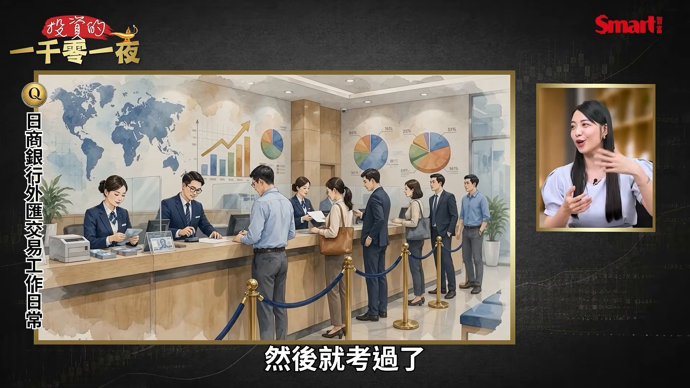
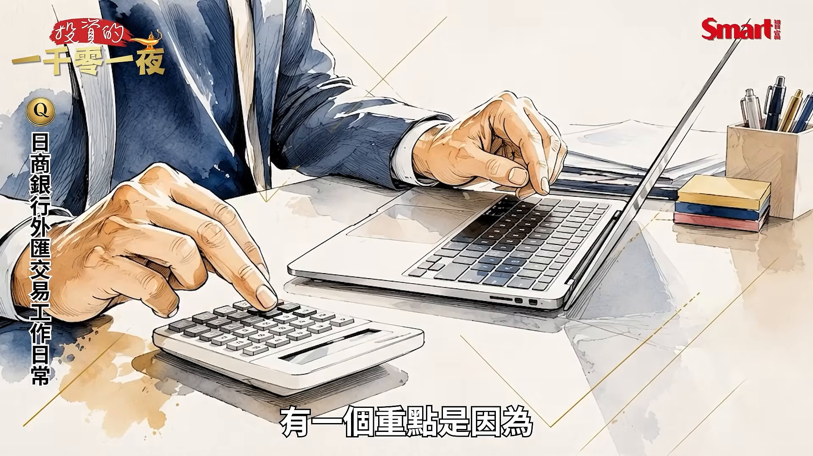
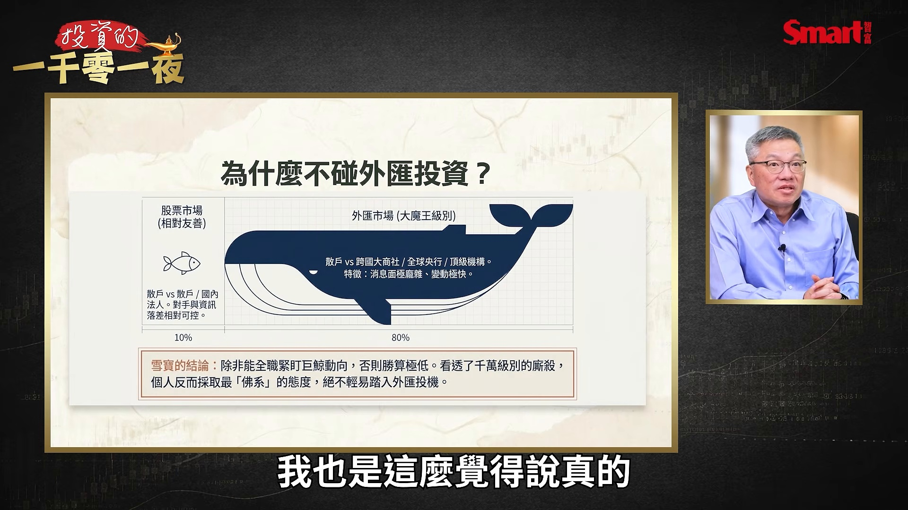
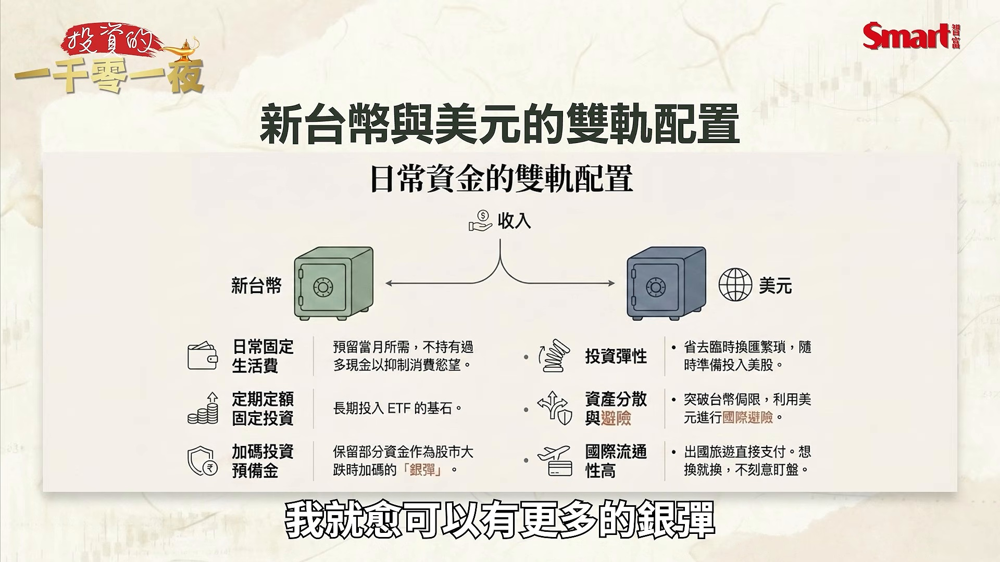
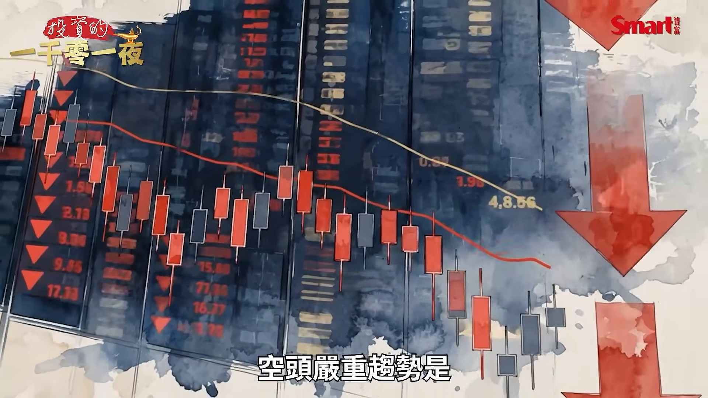
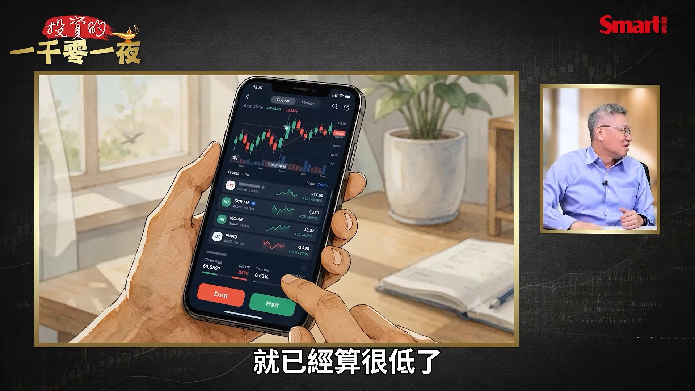

# smartmonthly-bw_WzJjPd3iG0M — 關鍵畫面索引

- 來源逐字稿：[smartmonthly-bw_WzJjPd3iG0M_FIN.srt](smartmonthly-bw_WzJjPd3iG0M_FIN.srt)
- 影片：https://www.youtube.com/watch?v=WzJjPd3iG0M
- 截圖數：17

## 00:00:13

**逐字稿片段：** 好,歡迎再次收看投資的一千零一夜, 我是風哥。 這一節目我們很特別, 因為我們邀請到一位 目前是擔任網路節目的主持人, 大家應該常常在別的節目看到他, 所以你在這邊看到他, 不要以為我們換性質了, 沒有,這還是一千零一夜。 那雪寶先跟大家打個招呼 哈囉各位觀眾朋友們大家好 謝謝楓哥邀請我來上節目

**話題推測：** 節目正式開場與主持人介紹，畫面可能切到節目標題或來賓同框。

---

## 00:00:45

**逐字稿片段：** 先講一下為什麼找雪寶 因為大家應該不知道妳的經歷 因為我當時看到雪寶經理一下下 原來這也是一個 金融產業的高材生來著 沒有啦 人家過去是從外商知名銀行 擔任過外匯交易員 其實說真的 外匯交易員這個行業我還滿尊敬 因為以前有時候聽過一些 他們的故事都覺得還滿精采 因為那個教育室裡面 服務都大客戶嘛 所以常常就會有一些奇怪的 有趣的事發生 這次我就邀請雪寶來 一方面今天就你是主角 二方面也聊一聊我自己的 我不習慣我是主角 沒關係你今天要用力發揮 好那我們就先來 外匯教育是 這個人生到底是怎麼開始 還有裡面有什麼趣事 其實我覺得主要是因為 我那時候是無心插柳啦 一方面是因為我念日文系 然後日文系 在日本文化的概念裡面 所以如果你畢業生要找工作 你最好第一期就要找到 如果你沒有找到的話 基本上你就是那種 我知道 我知道 很奇怪 我覺得日本的求職文化很奇怪 新鮮人是最好的 對 再來就折舊了 你開始就有點開始太舊 有點像車子一樣 你不能落地你知道嗎 所以那時候我們就是 快要畢業的時候 老師都會告訴我們說 一定要趕快找 那目標是什麼什麼什麼 老師會列給你這樣子 那時候以日本文化來說 如果在行業結構裡面 金融業是等級蠻高的 就是非常非常非常高的 然後再來就是商社 然後商社就是有名 大家可能都記得 然後唸得出來那幾個商社 你看他講到這裡 就隱含他金融業是最高那一等級 比商社還要高一等級 這多優秀的畢業生 好 繼續 怎麼辦 我這樣子的意思 然後反正就是 那時候老師就叫我們 要往這個方向前進 那時候我就想說 那我就去試試看 那因為也是錢的關係 而且金融業的配真的比商社還要再高一點 那覺得很棒啊 那一開始的時候就想說 那我就去試試看 然後就考三次考試 然後就考過了

**話題推測：** 開始介紹雪寶的金融背景，可能出現來賓經歷或外商銀行外匯交易員資訊卡。

---

## 00:02:48

**逐字稿片段：** 那日商其實是一個很特別的狀態 因為其他比方說像臺灣的銀行 他可能很在乎你是不是商學院畢業 你會不會是什麼 但是在日商銀行裡面 他比較在意的是你日文好不好 因為他覺得新鮮人就是 你落地在我這邊降落的話 我都可以教你 所以你只要 但你日文不好我就沒辦法教你 就是他覺得是這樣 他的邏輯是這樣 所以他比較重視是你懂不懂 你的日文跟我們這邊的文化 契不契合 你可不可以跟我們這邊的主管相處 這些東西都是比較重要的前提 那些都有達成的話 他們都覺得後來你就可以來學習 那時候我就學習 也是因為我覺得 如果你只是一個語文學院畢業的 你其實沒有其他的專業搭配 你會比較路比較窄 所以我想說那銀行很好 因為你銀行你一進去 我就想說 我就是以一個做莊的角色 我可以看騙大家到底在幹什麼 所以我就想說 好 那不管我進去銀行的 哪一個單位都不錯 就看他們怎麼分配

**話題推測：** 轉到日商銀行錄取與重視日文能力的條件，可能出現日商銀行徵才條件簡報。

---

## 00:03:48

**逐字稿片段：** 那我就分配到外匯 然後我就處理外匯事務這樣子 那到底發生什麼有趣的事 有趣的事就是 因為我數學真的很差 數學不能教嗎 我那個數學 我跟你講數學不會就真的不會 然後這怎麼辦 那已經進去了頭洗一半 就晴燈捕捉 我就是整天在那邊按那個計算機 後來我計算機按得好快 就是被磨練出來 那因為數學很差 有一個很重點是因為

**話題推測：** 說明被分配到外匯部門並處理外匯事務，可能切到外匯交易或匯率畫面。

---

## 00:04:15

**逐字稿片段：** 你外匯其實你數字敏感度要很高 因為它會一直跳 那表一直跳 所以基本上它 我後來變成驚弓之鳥 它只要稍微一跳我就開始算 一跳我就開始算 你這不是一秒鐘幾十萬上下 你這是一秒鐘幾千萬上下 對啊 因為我就一直說 我覺得我好像那種 假裝有錢人 看著看著 因為一接你大概會有幾筆大的 你可能就會知道 那幾筆大的可能是貨款 然後你就會知道說 而且還有那個時空有個點

**話題推測：** 提到外匯數字敏感度與報價一直跳，可能切到即時匯率報價表。

---

## 00:04:45

**逐字稿片段：** 是因為我那時候是菜鳥 我面對的都是大商社 因為我們只做B2B 所以大商社的那種會計來跟你對的 他絕對是他們整個會計室裡面 對的一把手 是那種會計姐姐 每一個都很兇你知道嗎 打到過去都很緊張都在抖 你知道就打過去撥電話都很緊張 所以我後來發現 有一個跟他們好好相處的方法 就是我就是更勤勞 就是他稍微一跳我就開始算 然後我會開始累積經驗 就是說我開始發現 哪一個任局是他最不賠的狀態 或是他最可以接受的 所以我會在那個任局裡面 一直算一直算 算到他最划算的時候 我就馬上打電話給他 然後跟他說 好我覺得可以換了 然後這個也是 我覺得這也是工作努力 要累積到你一個經驗 然後跟勞 跟勤勞也有關係 這個換位真的很重要 因為他們的訂單金額都非常大 對對對 然後後來你就 因為你再沒有概念 你後來也會知道說這個這個 會損差太多 然後你知道他為什麼會神奇的點 所以你就會想要幫他抓 那你抓了幾次 他都發現 你都抓到一個還滿好的甜甜價 之後就不兇了 然後會好來好去 然後還會 就有可能可以喝個咖啡之類的 說真的 可能因為有時候這些商社賺到的這個利潤就是2、3%、3、4% 對 因為其實很少 那你如果匯差 差個0.5%就差距非常大了 對對對 所以那時候就對這個東西你就會越來越有概念 知道說原來匯損這個東西是你無形的商社的成本 它這個比較難算 有時候這個時期假設是成平時期 就是大家都還好 沒什麼變動的時候 壓力比較少 如果那時候變動 像最近現在這樣 我可能就在做 我壓力就會很大 我可能每天就在盯著那個時鐘 一直看 一直看這樣子 好 那我要靈魂考問 妳有沒有因為自己的糊塗或胖手指 幹了什麼讓客戶生氣的事 我有過就是我做那個 有一次就是大家都是 好 大家的想法 因為大家會交換想法 大概你是說哪一個 哪一個匯率是最好 你大概就做下去這樣 所以那一天就是屬於那個狀態 就是做那個匯率我就做下去 好 做下去之後 就有還是有一點賄損 但是你知道每個公司 他接受賄損的range不是很一致 好所以那個商社 他覺得他賄損 他不滿意 不開心 他不開心 然後呢他就跑來 真的是我們就是 拍桌子 對然後來吵架 然後他來他就說誰負責的 其實是我跟另外一個女生一起負責 但我就覺得他的臉色很差 我想說我先撐著點 因為我現在站在這裡 我先撐著點 因為他在後面 剛好我那同事去上廁所 我想說沒關係應該沒什麼事 我就看到他 我就跟他說對不起 什麼事情然後要問這樣子 然後那個人氣到 他沒有想要聽我講話 他直接叫我吐下座 原來日劇演的都是真的 他真的叫我 他認真用日文叫我吐下座的時候 我就覺得我是半摺子數嗎 我有做這麼大的事情 我需要這樣子嗎 你說我薪水才多少 什麼意思 然後我到下次講說 然後後來那個我另外一個同事要來 我一直想要叫他不要來 因為我這邊已經要吐下座 他不要一起來連坐 他這個時候應該是主管要來救我們吧 可是那個時候因為他太猛烈 我們那個中間主管 他也有一點不知道怎麼處理 所以他就有點不敢 那我就覺得說那個 我現在長大了會覺得說 你應該要再去找大一點的人來 就因為他已經這麼氣了 你應該找一個最高的來 其實是最高原則 就是客戶這麼生氣的時候 如果你找的官夠大 他氣會消一半 對對對 然後我就說 但是現在長大才知道 小時候不曉得嗎 就不知道 其實你那時候就是要把 支店長叫出來就對了 他就是人在那邊 那個人也會好一點 反正後來處理的方式也是 副支店長走出來 然後把他帶去VIP室喝咖啡 就好多了這樣子 那個很可怕 那我第一次被要求土下座 會印象很深刻 那你那一次真的有土下座嗎 那時候沒有 因為我覺得 我覺得我不是半折直坐 沒辦法 這個薪水跪不下去 這個我為什麼跪不下去 不好意思喔 不好意思 沒辦法跪 你再給我多一點 我可能會高一點 再多給我一點膝蓋可能會比較軟 我現在膝蓋下不是這樣子 好 那接下來我要問了 金融業真的是薪水很不錯了 說實在 為什麼要轉換跑到這個 這個收入很稀疑 很傷心的媒體業 不知道孟哥你有聽過說 什麼上輩子做壞事 這輩子做電視電影 你知道我那時候做電視的時候 每個人都告訴我說 你上輩子是有做壞事嗎 你為什麼要從那麼好的工作 跳過來這邊 然後我就說 我們這個行業是說 你就是那個做了什麼壞事 才會跑來做雜誌 雜誌也是很難做 所以就是有一個這樣的傳言 那時候是為什麼 是因為我那時候在那邊做 其實確實是還蠻穩定的 然後而且老實說 那個bonus半年半年來一次 你本來想要第一支 它一錄帳的時候 你又突然間覺得 我沒事了 我再忍一下 我懂這我懂 我沒事了 我可以了 就是會這樣 想到信用卡的帳單 對 趕快把它弄一弄就好了 但後來我就發現 因為我一開始有說我數學很差 我以前是那種想要去強碰的那種 後來我發現 人是要順勢的 就是你要去做你擅長的事 你才有可能在創造 你人生再更高點 如果你做 你沒有那麼擅長的事 我是勤能補足 做到某種程度了 那我發現 這個程度是很可以應付 我的工作跟日常 還有老闆也不會介意的 但是我發現 那很有才華的那一群人 就數字很靈敏的人 他可以跳到非常非常遠的地方 當你看到這些人的時候 你就會覺得說 我不適合再繼續做下去 除非我就是想要就只有這樣子 然後那時候我就覺得說 好吧 那我如果這樣的話 我想要再去試一下別的 所以我就離開那個工作 但是離開那個工作就是我說的嘛 大家都說我就是 是不是做了什麼壞事啊 家裡人沒有反對嗎 你從一個薪水這樣 變成薪水這樣你何苦呢 我那時候一開始一進 去跑新聞的時候 我家人就是可以看我那個存摺 我爸媽想說 你那個出去賺錢是假的嗎 就是那個薪水有領到嗎 那有領到嗎 我怎麼覺得刷跟上個月沒有什麼差別 然後你每天早上有過 人也沒看到 我想說去哪裡了呀 什麼工作要半夜 這個只有我們這個行業自己懂 這就是因為我爸媽也沒有做這個行業 所以他們就想說這到底是什麼東西 為什麼半夜才回來 兩三年回來這個是正常的嗎 這個好奇怪 對所以 對但是我那時候做的時候 確實覺得蠻苦的 就是剛入行的時候 就薪水真的不是太好嘛 然後還有工時很長 可是我有發現 那個進步的程度是 比起我剛開始進銀行的時候 那個是跳躍性的成長 就你大概有悶了一陣子幾個月 你還搞不清楚狀況 當你抓到那個狀況的時候 你就會跳接的非常快 然後你會有旁邊的人 給你一些反饋 你就會覺得說 這條路好像相對走的是 感覺自己有很明顯的成長 對 所以就換工作 我覺得自我實現確實蠻重要的 不過這也表示你沒有那麼缺錢 沒有 那就是膝蓋那時候還不曉得 應該要再軟一點 好 接下來我們也聊一下 因為我們剛才就是聊職場的趣事 但我們這節目是金融知識節目 我們還要聊一下 既然你對日元這麼熟 跟大家講一下 這我第一次大公開 因為我從來沒跟人家講過 對啊 不小心被我看到這個資料 我說一定要請他來聊日圓 那說一下吧 你這個自己在日圓 自己如果要旅遊或是有什麼 其他的需求 投資需求什麼 你在換匯有什麼特別心得 我反而是 我自己本人是非常佛系的 因為我本人就是 我覺得我是養壞了 因為我每天看那個錢太多了 你知道嗎 我就會覺得我這個小戶有什麼好 在那邊跟人家一塊兩塊計較的 你這個就是一秒鐘大概幾千塊上下 以前是幾千萬上下 我是可能連幾千塊都沒有的狀態 因為我可能通常都會換 我真的出國隨便 大概又換一萬兩萬的臺幣左右 就是非常非常少額的 然後帶在身上 不管我去哪個國家都一樣 所以基本上這種一兩萬的小額 我不太用現金付的情況之下 我覺得其實沒有差那麼多 然後加上你其實當場刷卡 是當下匯率而定 所以我就覺得好像也還好 然後所以我自己 如果是我本人的話 我對於這個就是比較否信

**話題推測：** 話題轉到面對大商社客戶與會計窗口，可能出現B2B客戶或商社交易流程畫面。

---

## 00:13:45

**逐字稿片段：** 然後再來就是 如果是匯率投資這個 就是外匯投資這一塊 我是覺得它的風險蠻大的 然後它的交易屬性跟股市 跟其他真的非常非常不一樣 然後它的變動非常多 消息也非常多 我覺得有點是 要全職去做這件事情 才有可能有勝率 所以其實我在對於外匯自己碰過之後 我就沒有想要去經營這一塊 所以就是我自己是非常佛系的 我也是這麼覺得說真的

**話題推測：** 話題轉到外匯投資風險，可能切到外匯波動圖或風險提示。

---

## 00:14:16

**逐字稿片段：** 這我也是打從這個肺腑給大家的建議 就其實股票投資 我覺得在金融裡面算是相對比較容易一點 外匯真的是屬於大魔王等級 那真的是大風大浪在 因為你知道你要知道我們股票交易 有時候我的對手就是你 你的對手就是他 然後反正就是這些人 我們真的跟大閥人也不會過到 外匯匯喔 外匯匯你的對手就是 他以前服務的那些公司 哇 那很可怕 所以你的那個勝算真的不高 對 然後除非你跟緊一點 你跟在他後面 他去掃去哪裡你就掃哪裡 不然其實你根本很難 所以我那時候覺得這個 上上下下太高 不太符合我的 就是因為我還是很希望 把本業做好對不對 那我覺得本業做好 是一件非常重要的事情 因為你本業做好 你就會非常有底氣 在你任何投資的情況之下 你都可以承受那個風浪 因為你本業還是一直在賺錢的 所以我就覺得 它應該要相輔相成 讓你活得越來越 我都說睡得著就是最棒的 對真的 投資上確實是這樣 對就是你可以睡得著 然後你今天不會去想說 我明天可能會怎麼樣怎麼樣 我覺得這是最好的配置 所以我那時候就想說 外匯這就是現補頭 所以個人就很服風

**話題推測：** 主持人補充股票投資相對容易、外匯是大魔王等級，可能切到股票與外匯難度比較。

---

## 00:15:35

**逐字稿片段：** 另外我有看到一個就是你這邊說 你曾經在國外現燒被搶過 對 還蠻多次 還蠻多次 我看起來很有錢嗎 你是怎樣 那看起來就富婆嗎 不是 我覺得很奇妙 就是有過在美國 然後那個狀態是一個很晚的晚上 我正要回家 然後我沒有看到他 他就突然衝出來 他衝出來的時候 他就是拿槍跌死我這樣 但是因為我那個當下是沒有 我沒有看到他的 因為我其實近視很深 所以我沒看到他這樣子 好然後反正他就靠過來 那我想說什麼東西頂著我 因為你知道頂著我 都是不會是太好的東西 不管是什麼東西都很可怕 所以我就想說 我先確認一下是什麼東西 哇這是最不好的那個東西這樣子 然後那時候就想說他 他神色其實是很慌張 那也很緊張 對因為他 我覺得他也可能是走投無路 他就是想要換一點現金 想說能拿多少拿多少 那時候我就跟他講說 我就直接把我包包攤開 跟他說我就是隻有這樣子 那你手機可不可以留給我 因為我沒有手機我沒辦法回去 那你就是其他你覺得 你只要有值錢的你都拿走都給你 那我也不會 我現在也不會大叫 你也太冷靜了吧 我就這樣跟他講 因為美國這個地方 他其實是 你不冷靜不行 我沒有在講什麼 川普不要生氣 我愛開玩笑 反正他們就是一個 你要冷靜處理 但是這是一個蠻奇妙的經驗 但也是因為這樣 所以後來我就發現 就真的現金苗袋太多其實是蠻好的 因為他其實也不會想要你的卡 因為那個太麻煩了 有現金多少拿多少 因為你有卡 他還可以追你金流 其實他也麻煩 他最方便只有現金 那你現金真的沒有 你看看給他看 他也就只好這樣 對他也只好這樣 所以我後來發現 比方說有些人 比方說去歐洲美國旅遊 都會覺得是相對比較危險的地方 那我都會覺得 其實你不用帶那麼多現金 因為如果你現 你信用卡你掉了 你就保持 其實方便很多 而且你比較不會有一些 額外的麻煩這樣子 那學長接下來就聊一下 因為這個節目當然跟投資有關 說一下你自己怎麼做個人投資 我真的是就是留給這個觀眾朋友 我從來沒有講過 流淚了我們 從來沒有講過 因為我一直覺得 你知道就是有點古老的想法 想說財不露白你知道嗎 盡量不要讓大家知道說你 原來你也是老派的 就是你不要默默讓大家知道說 你在做什麼事情這樣子 有一點點 所以今天就有點魄力 跟大家分享一下 不過我的也還滿簡單 我的有分有幾個部位 那一個是定期定額 我是一定一直一直在存的 然後另外一個就是 就是我會有一個現金

**話題推測：** 新話題切到國外現鈔被搶經驗，可能出現旅遊安全或現金風險畫面。

---

## 00:18:28

**逐字稿片段：** 那現金分成兩個層次 一個是美元現金 一個是臺幣現金 然後臺幣現金相對非常非常的少 這個有一點有趣 是因為我每次只要 我需要銀彈的時候 我就會拿 就是那個臺幣被我視為 它要增加的銀彈庫 就是我要拿這筆錢 只要我看到 開始下修 我可以加碼的時間 我馬上把這個錢拿去買 我就會去買買買買買買 然後買回來 或是說我發現有一個正在漲 我不求我買在最低 但我也不求我是最高買的 但我會算一下那個range大概多少 所以那個池子對我來說 有點像是我隨時在補我裡面的錢 然後我補完錢 那等於是多的嘛 因為我就是額外賺到的嘛 那我額外賺到的話 那個池子越大 我就越可以有更多的銀單

**話題推測：** 現金部位拆成美元現金與台幣現金，可能切到雙幣別現金配置表。

---

## 00:19:17

**逐字稿片段：** 那美元是很常態的持有美元 因為我自己以前那個銀行的經驗 我覺得美元真的非常好用 然後美元的起伏我覺得也是很小 所以就是你持有美元 你在無論是你真的是實用上面 或是你要流通上面 或是你要給人家錢或是幹嘛的時候 美金都超級好用 所以我就會把大部分的現金 如果是比方說有些人是什麼 有些人會配置什麼緊急要用錢的錢或什麼 那種我都會都是美元 我不是臺幣這樣 妳是想說是 有什麼需要美元逃難的時候嗎 我就覺得 對之類的 我剛剛沒有想要講 就是如果有什麼事的時候 就有美金是不是比較好用這樣子

**話題推測：** 說明長期持有美元現金的理由，可能出現美元指數或美元避險用途畫面。

---

## 00:20:04

**逐字稿片段：** 那妳會是買股票還是買ETF ETF是定期定額 我會當它穩穩的買 那股票的話就是我會看狀況下 投機一下 對投機一下 因為我覺得好像要維持一個腳步是 你如果太保守 以現在這個時間拉這個維度來說的話 不宜太保守 你這麼年輕怎麼能保守呢 對啊還是要激進一點嘛 而且媒體的薪水不高也不能保守 而且因為加上有一點好處是 因為平常真的一直 這是工作 你有時候你會真的會收到很多很多的最新的訊息 然後也是就是拜這個工作所賜 可能會遇到蠻多財經專家 大家有時候會討論嘛 所以就是你會知道說 哪些東西你會去找時間去分析 那這個股票你覺得在這一段時間 它是可以有一個力道的 你就會經常去買這樣子 好 來 接下來最後一題 我們換個角色 讓你恢復你的這個 主持人的角色 換你來問我一題 對 我是想問 因為峰哥你自己就是做這個 你這主持人就是專業主持人 然後都在問 我也是業餘的主持人 對 然後你都會去看到很多很多專家 但是你聽了這麼多專家之後 你自己個人的資產配置是什麼 其實我蠻簡單 因為我其實我自己投資很長時間 大概快要30年 那我早期主要就是以股票為主 一開始就是股票 其實我第一檔買的股票是臺積電 我記得那時候才50幾塊 當然那時候賺了一點就跑掉 所以如果報到現在 那就是百倍利潤了 但是沒有人可以報到現在 我的故事也是跟你很像 後來當然就是隨著資產開始增加 然後你就會增 還有對金融的這個嘗試的增加 就是增加各種不同的工具

**話題推測：** 主持人追問股票或ETF配置，可能切到ETF定期定額與股票投機部位比較。

---

## 00:21:50

**逐字稿片段：** 基金或是債券 那當然這幾年當然最熱門就是ETF 那因為有一段時間 我工作真的比較忙 現在也還是 所以隨著我的工作時間的強度越大 我就會把個股越減少一點 然後就是主要是基金跟ETF 像我現在就是核心就是以基金跟ETF 作為我資產的主要的 你沒有多留一點現金部位喔

**話題推測：** 資產工具從股票擴展到基金、債券與ETF，可能出現投資工具配置圖。

---

## 00:22:15

**逐字稿片段：** 我其實還好 我的現金概念是這樣 通常有人會說 你現在現金部位是30%還是50% 我年輕的時候會這樣 因為我年輕的時候是大進大出的 就是說我 如果我看壞市場的時候 我可能會現金部位30% 然後看好市場的時候 可能就是現金部位只剩下3%到5% 那麼少 就是留一點零用 就是押好押滿那種 年輕的時候會這樣 但是那個聲說很大 但我現在是比較偏向於就是高持股的模式 然後現金不是用比例來看 現金就是如果我覺得我隨身需要 300萬現金在身上應付所有的緊急意外的狀況 那我就是 你是把它全部算在一起 那我就是留300萬現金就好了 那我不會把它說 譬如說我不會因為資產變大了 我的現金比例就會變動 沒有 我是留一個絕對數字 那剩下的部分呢 就是都在操作裡面運作 那操作我現在本質上 是用高持股的方式在操作 因為也原則上是因為過去十幾年來 我都沒有覺得有非常嚴重的空投的趨勢 就是那種 就是我講的那種空投嚴重的趨勢是

**話題推測：** 開始談現金部位的管理方式，可能切到現金比例與絕對金額比較。

---

## 00:23:27

**逐字稿片段：** 我自己經歷過是2000年到2002年 因為我一直都沒有覺得 好像有到那麼嚴重的程度 所以我沒有到 大幅的下降我持股的那個需要 那我不保證說未來不會發生 我只是說因為過去十幾年 我確實沒有感受到有這麼大的必要 所以我頂多譬如說如果要下降持股 就我全部拿來投資的那部分 我可能下降到八成的時候 就只剩持股八成的時候 就已經算很低了

**話題推測：** 提到2000到2002年的嚴重空頭經驗，可能切到歷史空頭或股市走勢圖。

---

## 00:23:55

**逐字稿片段：** 那第二題想問風格 就是你不覺得最近的股市上上下下 大家有一點 覺得有一些人你知道 心會有一點痛你知道 不是痛啊 前一陣子大家說槓桿開太少都會被罵 對 槓桿開太少被罵 然後槓桿開太大有時候心又很痛這樣 那你會覺得你怎麼看未來的這個方向

**話題推測：** 來賓提出第二題，轉向近期股市上下波動與槓桿問題。

---

## 00:24:19

**逐字稿片段：** 我先講啦 就是說AI產業是一個產業革命 然後你說這個產業榮景 有十年二十年甚至三十年都很有可能 那這是產業 但是在這個過程中呢 會不會經歷過一輪兩輪或三輪的 股價的高檔的泡沫化 我覺得會 所以我覺得是 我給大家一個提醒就是 我覺得要注意兩個 就AI這個趨勢裡面 注意兩個數字 就是我們大家現在都在看 這個公司獲利多少又多少 EPS多少又多少 這其實不是我關心的 我關心的是兩個數字 第一個 美國這些大型的CSB 就是這些做雲端服務的公司 他們的資本開支 現在的狀況跟未來的狀況是怎麼樣 是不是有緊縮 如果緊縮就是很大的風險 對 因為他們一旦緊縮 臺灣這邊的單就變少 但是 另外的 今年要注意的是 如果他們明年是大幅的增加 也很危險 為什麼呢 因為今年大家開始擔心一件事情 就是這些資本開支已經大到 可能這些公司的 自由現金流變成負的 我們最近看到那個超級印鈔機 Google的這個最新一季財報 自由現金流有點負的 然後Amazon也是變富的 那這會出現什麼問題 就是你賺來的 你賺來的錢扣掉你的資本開支之後 不夠了 變富數 那變富數要怎麼辦 就是你必須要跟市場去借錢 那你有兩個辦法借錢

**話題推測：** 主持人開始分析AI產業革命與未來十到三十年趨勢，可能切到AI產業長期趨勢圖。

---
