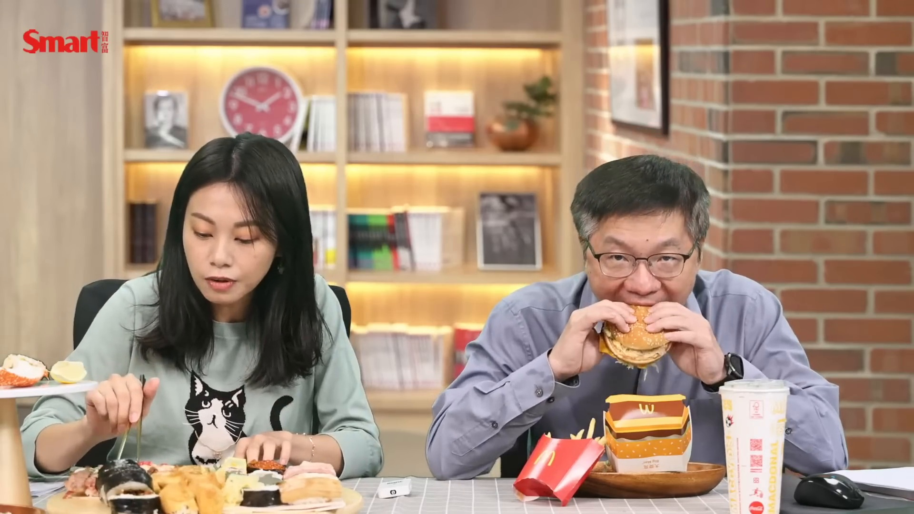
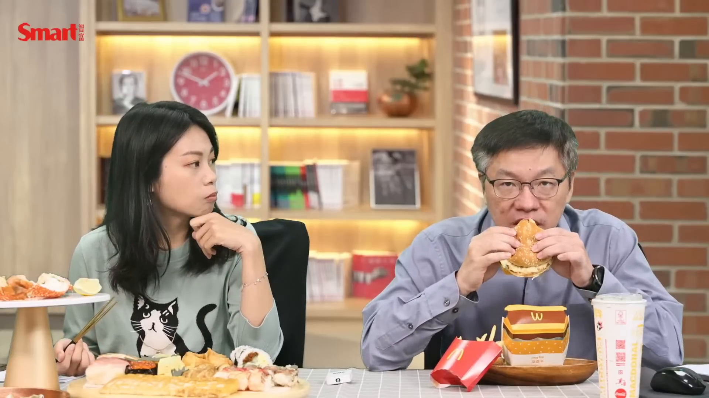
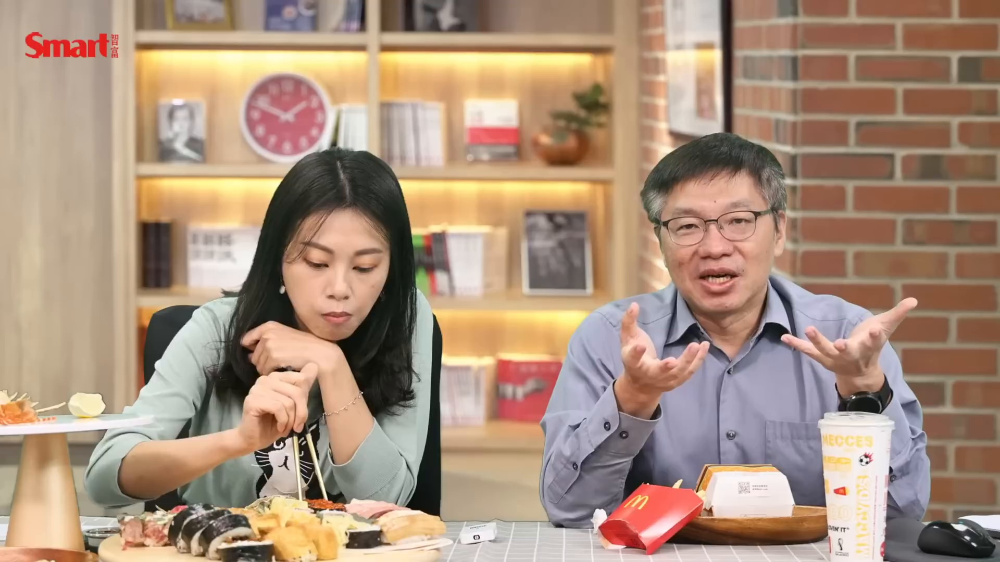
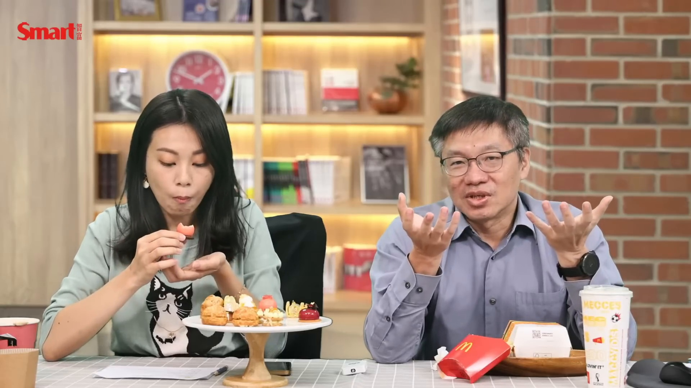
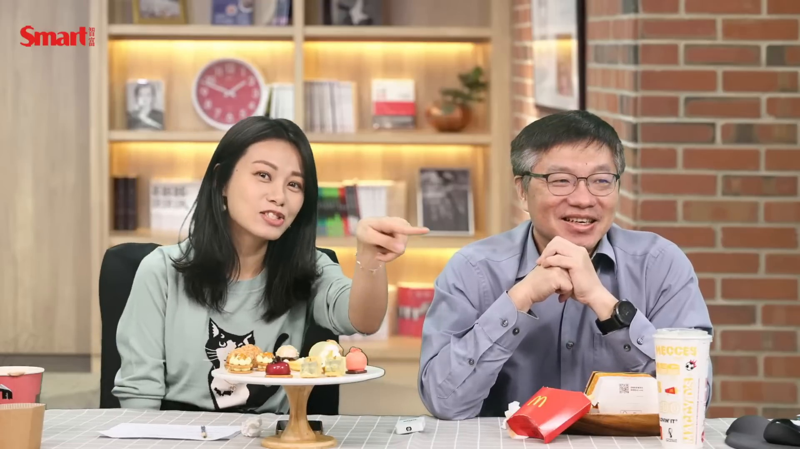

# smartmonthly-bw_XcMUo9k65Rs — 關鍵畫面索引

- 來源逐字稿：[smartmonthly-bw_XcMUo9k65Rs_FIN.srt](smartmonthly-bw_XcMUo9k65Rs_FIN.srt)
- 影片：https://www.youtube.com/watch?v=XcMUo9k65Rs
- 截圖數：46

## 00:17:32

**逐字稿片段：** 好啦好啦我們趕快那個進正題 我們因為我們今天要先 大家現在都午餐時間啊 大家都很餓趕快趕快趕快來 那我要先上你的午餐嗎 先上你的 先上我的是不是 對啊先上你的 那我要上我的午餐 你的第一道午餐 登登登登登 他今天的第一道午餐

**話題推測：** 主持人結束閒聊準備進入正題，畫面可能切回節目主題或開場版面。

---

## 00:17:48

**逐字稿片段：** 那我要先上這個 對 今天他的第一道午餐是什麼 這個是 你要讓大家看到 對啊 就是今天早上 熱騰騰我去上癮水餐賣的 大家知道就是臺北很有名就是三井集團嘛 然後我就想說那我要吃好吃的 我們要先講今天的食物都是我們自己買的啊 所以 你講廠商所謂反正我們都自己買的 跟他們一點關係都沒有

**話題推測：** 開始介紹第一道午餐，畫面可能切到餐點特寫。

---

## 00:18:10

**逐字稿片段：** 我要上第二道菜囉 這麼快 我要先上完 因為我的很多 好吧 你喝到菜是什麼 太酷 我覺得我拿起來會倒耶 幾個 幾個 妳要拿進來一點 大家看不到 這是什麼 龍蝦導演 導演你知道嗎 妳的檸檬快要滑下去了 我的龍蝦 妳真的有很認真的 我需要小編幫我另外一把手 因為我拿不上來我的另外一道午餐 妳的點菜真的點得很辛苦呢 怎麼辦 我覺得它會倒掉耶 哇 哇你這一盤也太豐盛了吧 我你等下要全部吃完囉 那你有準備好要看你的嗎 你不要緊張 好了我知道 伙食費都已經吃完了 最後剩下一點點買給我

**話題推測：** 主持人說要上第二道菜，畫面可能切換到另一份餐點展示。

---

## 00:19:04

**逐字稿片段：** 我要拿給你的囉 我好喜歡啊 我最喜歡的大麥克跟薯條 我有幫你準備可樂 零度可樂也是我的喜歡 真的真的真的 所以雖然最近胃不太好 所以喝的比較少 但是長期以來都是喝可樂 好啦,那你們聊,我先吃午餐 好啦,我們要趕快一邊吃一邊聊 我們一邊的重點話題你可以一邊吃,沒有關係 對不起,我們就開始 現在再,我先吃一個薯條好了 那個,我想說的是啊

**話題推測：** 另一位主持人的麥當勞餐點登場，畫面可能切到大麥克、薯條與可樂。

---

## 00:19:37

**逐字稿片段：** 雖然你現在吃得這麼好 但我想說今年其實大家都蠻辛苦的 市場很差對不對 那你今年自己的投資怎麼樣 我覺得今年 我覺得這上次我有跟你說過 就是我覺得在你的尊尊教誨之下 不要講這個虛偽的話 這個我還是可以賺 高級高級 太高級了吧 你說在我的嘮叨 之下 你怎麼樣 我沒有說你嘮叨你不要這樣害我 就是我覺得有 還好就是把資產做很好的分配

**話題推測：** 話題轉到今年市場很差與個人投資表現，畫面可能切到台股大盤或投資績效主題。

---

## 00:20:12

**逐字稿片段：** 我覺得今年不是從18000跌到 12000嗎 那時候你還是會看到就是你的賬上 水印確實就是跟去年年底 因為我每一年都會做資產結算 然後就是你會看到那個資產去年可能賺了很多 然後今年就是 去年賺了很多耶 去年去年 去年 然後今年你就看到那個從萬八跌到萬二的時候 那個資產就一路縮水縮水 所以你有後悔在高點的時候你沒有賣掉嗎 沒有耶 存股就是要堅定你的信念啊 你慢慢吃我吃東西很慢耶 但你也不是一個那麼愛存股的人啊 我是啊 真的嗎 我是啊 我放不進去我要慢慢吃 好吃好吃 欸為什麼你把魚肉跟飯分離了 欸你作為一個基隆人 你這樣很落差耶 而且風哥他罵我說 我沒有罵你 我是說這兩個食品好像不適合放在一起 對因為我買了鯊魚煙 然後風哥就說 鯊魚煙放在高級日料旁邊 非常不襯 就是不搭嘎 也不會啊 其實我也很喜歡其實說真的 只是說這兩個組合起來好像有點怪而已 但是身為金融人就是應該要吃鯊魚宴啊 那當然啦,我從小很喜歡吃啊 那你聊聊你的資產今年怎麼樣

**話題推測：** 提出台股從18000跌到12000的數字，畫面可能切到大盤下跌走勢圖。

---

## 00:21:32

**逐字稿片段：** 今年算是我比較特別的一年 就是在我自己在投資資產組合上 因為我以前就是屬於那種很搞缸的人 會去調整啊配置啊 然後高點會出拖啊 然後再找一個低點買回來 我以前就是操作比較搞缸的 那這兩年呢 我因為想說年紀比較大了 我就不想做那麼複雜 你怎麼會有自知之明啊 那因為你知道這個隨著自己的記憶力變差 然後如果要常常要想著說 要自己要記得去做什麼樣的 那個自然組合調整的時候 有時候會變得很辛苦 然後有時候因為工作一忙忘記的時候 就覺得完了錯過了 怎麼辦 然後就很懊悔 後來就乾脆好算了 我就這兩年確實是調整一點方法 我就盡量偏向持有的更長 然後當然啦 我還是會在高點的時候 把持股降低一點 你的龍蝦很好吃呢 但我的漢堡也不錯啊

**話題推測：** 另一位主持人開始談自己的資產組合調整，畫面可能切到資產配置或投資組合圖表。

---

## 00:22:31

**逐字稿片段：** 比如說我的資產組合 我會把它調整成 不會跟龍蝦那麼一樣美好 就盡可能的讓一些比較 可能會 就比較長期會持有的 比較不會賣的資產 特別是ETF的部分 我就讓他持股的比例高一點 蛤?你剛說啥? 就是讓這些不會賣的持股比例高一點 好好好OKOK 你好好吃沒關係 然後如果有一些 還是會調整部位的 那個比例就把它降低一點 然後我的目標就是 大概就是應該 我希望我有 有50%的 投資性的資產是屬於 不太需要處理的 盡可能的 很好吃 就像你的龍蝦一樣的 可口 那峰哥我想要問你 就是隨著你年紀越來越大 就是你在資產上 你覺得你跟年輕 差別最大是什麼 就是你會配比較多 現金流的部分嗎 其實我覺得投資 跟個人真的有 非常大的性格相關問題 像我是一個很喜歡 實驗新的投資方法 所以我年輕的時候 我只要學到一個投資方法 不管是從市場上觀察到 自己去推導一種方法 或者是說 我從閱讀很多大師的書籍裡面 學到一些方法 我通常都會覺得 聽起來好像有道理 然後我也想要試試看 因為大師的方法 其實事實上你看書看久了 你會知道 很多大師的方法 雖然他的邏輯 跟他的方法有道理 可是放在不同的趨性 市場上不一定適用 而且年代也不一樣 而且大部分我們所看到 大吃的方法都是來自美國 對 那華爾街的方法跟臺灣有一些共通之處 但也有很多不一樣的地方 所以你還是會想要自己試試看 它在臺灣這個市場上面的狀況是如何 因為我就比較有那種 有實驗精神的 你最近有在聽你講話嗎 好啊 但你吃龍蝦也很高興對不對 對不對 我要嚇死了 不是 看我這漢堡也很開心 就是說 對 你要給我一張餐巾紙好不好 我手髒成這樣 好 不要任性 就是實驗過那些方法之後 有一些 有些其實它只是有趣 但是不見得很有效率 因為效率你還要考慮到 這個是資金的效率 跟你能夠兼顧平常工作的效率 畢竟我從來就沒有當過一個 全職的投資人 我一直都是一個上班族 然後有空的時間就做投資 對 所以我必須要找到一個 可以平衡我工作 跟我能夠做投資的平衡的方法 但相對來說 我比大部分做純股型的投資人 我是更積極一點 就是我還是做了很多 在市場上

**話題推測：** 具體說明資產組合要提高長期持有資產與ETF比例，畫面可能切到ETF配置示意。

---

## 00:25:36

**逐字稿片段：** 我們說投資大概兩種嘛 一個就是你時間的市場嘛 然後一個就是選股嘛 就是一個是找抓時機 一個是選股 我對抓時機也很有興趣 但抓時機真的很難 也就是說這二十幾年來 我也嘗試過各種方法 去做抓時機的事 當然有些方法會成功 有些方法也不是 也不太成功 但不管怎麼樣 至少整體結果來講 就是平均來講還算不錯啦 因為你會有一些失敗的經驗 但是你也會得到一些意外的成果 其實風哥你覺得 你講的那個我很有感覺 就是我們要同時兼顧上班跟 投資這些事情 就是你看我前幾年是不是都做波段 然後可能就是很忙 其實有時候你就會 我印象很深

**話題推測：** 講者把投資分成擇時與選股兩類，畫面可能切到投資方法分類圖。

---

## 00:26:21

**逐字稿片段：** 我有一次買了一檔個股期 然後我就去採訪了 我買了就進去就是下完單 然後我就進去採訪 我出來的時候成交跌停 然後個股期就是槓桿很大 所以我出來的時候 看到成交然後又跌停的時候 我心裡想說到底怎麼回事 因為你在採訪的過程中 你也沒有辦法去做任何的 就是停損或是處理這樣子 然後我就後來就覺得說 投資跟工作其實 它不能說衝突 可是你需要在 你的工作的一個狀況下 去取得一個平衡 我覺得還蠻重要的 因為其實像我們這個工作 有時候忙起來真的很忙 那你如果投資了一個比較 波動比較大的商品的時候 那你如果譬如正在忙這件事的時候 你有一個心你覺得說 那個商品現在的價格 不知道波動怎麼樣 那個股票波動怎麼樣 特別如果更恐怖 如果那個期貨波動怎麼樣 你心裡會一直有恐懼感 那你就不能好好地工作 結果就變成你投資也做不好 然後你工作也做不好 我覺得這個是最得不償失的部分 當然如果你是一個全職投資人的話 有波動的商品是一個 對本金少但時間多的人來講 你可以去訓練出你更好的交易的能力 我們還是在這邊講比較精確一點

**話題推測：** 開始分享買個股期後遇到跌停的案例，畫面可能切到個股期或跌停風險示意。

---

## 00:27:44

**逐字稿片段：** 就是說交易跟投資我們把它分開 交易我們大概就是在處於一種買低賣高的手法 那他盡量去做一些價差的交易 甚至有些人是做得非常短的 像當沖這種 那這個是屬於交易的部分 就是交易者他不會在乎這個股票或是公司本質的好壞 他只在意有波動而已 波動越大越好 可是這種就很不適合上班族 因為波動來的時候總是一瞬間 有時候你沒抓到 那個波動就過去了 或者是你更慘的是 就像你剛才講的 你買進的時候它是一個平穩的狀態 結果等到你在忙的時候 它開始出現波動 而且那個波動的方向是往你的反向 你買的方向 不管你如果是你買多 它會往空轉 如果是你買空它是往多轉 這兩種都很恐怖 所以如果你工作在這種狀態下 你投資也真的不安心 然後工作也不安心 然後最後是兩邊都賠錢 這時候還會常常出現 我過去這十幾年來看到有一些人就是 當你做得越短 然後你做得越波動 那你就會越急躁 因為你如果一旦發生你做錯方向 那你就輸了 你輸的時候你就越想要扳回來 對不對 有一句話說就是 就是叫輸跌跌嘛 你就覺得不行 我這樣子下去 我的本金就死光了 所以我一定要在這一把一口氣把它拼回來 然後所以對 叫出撥大 就是賭輸了就加倍 撥大的 對對對 就是譬如說你去壓骰子對不對 第一次壓100 第二次壓100 第三次壓100 結果三次連續都輸 第四次你就想 我這次壓1000 一次把全面輸的都贏回來 結果第四次還是輸 這個不要不信邪 因為其實在你如果真正在去過 有一些就是像這種 譬如說像什麼澳門賭場 或是維加斯的賭場 你去看那種骰子 連續開個十幾把小 都是會發生的 所以人生不要隨便跟 不可測的運氣去賭博 你還是要好好的管理你的投資性格 就是 就不要純粹去賭運氣啦 因為投資本身不是一個 賭運氣的事情 你不是都會笑我說 我純期貨嗎 怎麼辦我今天都在分享 我的負面教材 很好啊 我們的投資經驗就是從各種失敗產生的 因為你騙人家說 難道你要騙人家說我投資都沒有賠錢嗎 對啊,一定都是買過很多失敗的 但我記得那一年是從9000多點上萬 哪一年啊 三年前吧,兩三年前 這麼近喔 然後那時候鄭峰哥就說 我要建議過程怎麼樣 反正那時候我就是純 也不是說存,我原本想要做波段 我就空臺紙 然後就一路被尬上去 然後我那種,我是死要單的個性 所以我就一直存保證金進去 然後就一路被尬 然後我就想說,不行我一定要改變 我不可以這樣子 然後我就想說,那我要停順 但我記得有一天期貨跌停耶 是不是,你記得嗎 有一天很波動 很劇烈,有一天跌停 還好我就出場 但後來呢我就下定決心 我說我不可以再這樣子 就是死凹單一直補保證金 於是我就開始 就像你說的 就是我心裡有點就是那什麼 教書拐拐 想要一次把它贏回來 對 所以我就想說那我不能凹單 那我就要靈活多空操作 結果你知道怎麼樣嗎 對啊就越靈活的賠錢啊 對 你答對 我就多空雙八耶 我那天我真的晚上睡覺的時候 這到底是幹嘛 其實在市場上很常看到多空雙八 我想說我看錯別人我就反過來做嘛 然後就反著被嘎 我覺得那一年真的很慘 但是後來還好 我現在就是自從開始 當一個價值存股型的投資人之後 我就把我的奇貨小手手放下了

**話題推測：** 明確區分交易與投資，畫面可能切到交易、投資差異比較表。

---

## 00:31:52

**逐字稿片段：** 其實投資的時候 就是真的做不順的時候 最好的狀況 最好的應對方法 真的不是繼續再投資 真的是停下來 讓自己休息一下 我也覺得 因為你當時 當時就是在一個錯誤的心理狀態 或是在錯誤的方法上 兩個裡面一定有一個錯誤 所以如果你沒有找到那個錯誤的根源 你就會一直繼續的錯下去 那多風松吧都是這樣造成的 你有過這樣嗎 當然有年輕的時候也有 有時候投資失敗的時候 也會很難過再從上滾來滾去 覺得為什麼自己做這麼蠢的事 對 但是後來 就像你有沒有看過小丸子 在那邊滾來滾去 為什麼為什麼為什麼 我做了這麼蠢的事 年輕的時候也會啊 年紀大的時候就不太會這樣做啦 因為年紀大的時候就 這以前看過了嘛 這個股票 崩盤成這個樣子 看了多了之後慢慢就平常心了 我想要請小編救救我 我的醬油打不開 小編趕快來幫忙 小編要一邊回答 那個觀眾的提問 還要一邊幫你開醬油 你真的是 就小便打不開 你不要打我噴的整個綠幕都是 小心一點需要工具 哇 太棒了 大家今天午餐吃什麼啊 偷看一下大家午餐是什麼 剛剛有人說他想要吃麥當勞 我真感謝你 給我麥當勞 麥當勞真的不錯啦 其實我年輕的時候 很不喜歡吃麥當勞 我一直覺得正餐好一定要吃飯或麵 但不曉得為什麼年紀大之後 口味也開始改變 覺得麥當勞很好耶 漢堡也很不錯 你什麼時候開始會覺得自己年紀大了 我覺得大概差不多過了40歲之後 因為那時候開始記憶力比較明顯的衰退 以前如果談到投資什麼時候 這個這個然後那個那個 都記得很清楚 到某個年紀的時候突然 欸那個很熟的事情 然後就是那個是那個是那個 那那個什麼事啊 講不起來啊 真的很恐怖 我也覺得其實我現在才 我可以 我不要講年紀 反正大家都知道你的年紀啊 就是我也覺得 我有一種自己老了的感覺 沒有沒有沒有 你怎麼會老呢 你永遠不會老的 可是就有一種 然後我講這麼虛偽的話 不行人家噎到 不是有一種不服老的感覺 就是你出去的時候 可能朋友的小孩就說 阿姨 我就叫姊姊,還沒有結婚就叫姊姊 然後他們就會覺得 我朋友就會翻我白眼,說你跟我年紀一樣大 你叫我小孩叫你姊姊 很無奈 反正 你臉皮厚我們也不是今天才知道的 不是這樣吧 韓國人不是都會說 還沒有結婚都要叫 叫什麼,歐爸 結婚才叫阿嬌姊 你是死我又不是死你 我要跟大家分享風哥去 你是去韓國滑雪的時候發生了蠢事嗎 那個沒有什麼 就算了吧

**話題推測：** 總結做不順時應停下來休息，畫面可能切到投資心態或停損紀律重點。

---

## 00:35:03

**逐字稿片段：** 我們還是聊一聊ETF吧 回來回來 嗯 聊啊 好啦 我想要問一下 我想要問一下就是 你自己啊 你今年的投資 因為像那個前一陣子不是股市反彈嗎 對不對 那你的ETF呢 最近的表現怎麼樣 就是因為剛好在 那時候有跟大家分享過

**話題推測：** 主持人把話題拉回ETF，畫面可能切到ETF主題版面。

---

## 00:35:29

**逐字稿片段：** 就從12600點的時候反彈往上 那時候我不是有分享過 就是每一個500點500點我會加碼 上次那一集 他有說他有幼幼的加碼 然後就是那些底部 你那時候期待他跌到多少 我期待他跌到差不多12000吧 但後來呢 因為他不是跌到12600嗎 所以我最後一次加碼點其實是在13000 然後最近不是反彈快要到15000嗎 差不多14800多900多 然後我現在的定期定額的部位就是已經變正的了耶 就是長榫的那個部位 原本因為我其實是從2021年其實才開始定期定額 然後因為那時候其實是從高點這樣扣扣扣扣嘛 所以它其實是負的 然後如果你再把那個定期不定額的部位加進去之後 現在是正的耶 嗯那很好啊 我覺得蠻好的 不過你那時候有預設就是說 就是要不讓他扣到 大概萬點左右的心態 因為想要套我有多少錢對不對 沒有我沒有想要看你有多少錢 我那時候就想說要讓他跌下 我就繼續扣啊 然後因為我那時候其實年初的時候 波段有一些停損 所以我把資金就是有拿回來 就想說讓他慢慢扣這樣子 嗯怎麼了 我看我們現在的螢幕到底是正常的嗎 只是這邊有顯示 是正常的喔 我有點擔心 我們這邊有個螢幕突然我們兩個消失了 害我嚇了一跳 嗯 對 你看 OK 好 沒問題就好

**話題推測：** 提到從12600點反彈與每500點加碼，畫面可能切到加碼區間或大盤點位圖。

---

## 00:37:11

**逐字稿片段：** 好啦 那我自己呢 我其實今年本來是預計的 就是如果要讓它扣的話 我實際上希望讓它 那個下節階段扣久一點 因為我今年有一個比較擔心的事情 就是說長期下來 因為臺股大概 大概或全球股市 大概有十幾年來 沒有經歷過這麼大的一個修正 那因為這麼長 應該說他的多頭時間太長 經過這麼長的多頭之後呢 他似乎 應該要有一個比較正式跟像樣的修正 那這個修正 一直一直不來呢 你會讓人家有點擔心

**話題推測：** 講者開始談自己今年預計讓定期投入扣久一點，畫面可能切到定期定額策略。

---

## 00:37:47

**逐字稿片段：** 所以當因為2000年那時候其實呢 有2020年那時候了 應該就說美國那時候在 在疫情之前有開始走一個升旗的時候 那時候可能覺得 市場到一個繁榮高點之後 可能會再慢慢進入一個修正狀態 但那時候是一個突發狀況 就是還沒有到一個當時的繁榮高點 就因為疫情的關係 突然就做一個很大的垂直跳水 然後就下去對不對 那在那個下檔的那個過程中 等於說應該有的一個正常走勢被打斷了 所以那時候我就期望是說 如果它那個修正的持續的長一點的話 也許可以化解一下 這十幾年來的這個比較長的 說泡沫 貨幣的泡沫 或者是資產的泡沫 不過那一次因為整個市場的修正 實在太激烈 所以就造成很多 全球的央行就當然就很緊張 然後他們就覺得說 他這個樣子 尤其大家在疫情的不確定性之下 就更緊張 然後整個 因為各國當時都是屬於一個防疫管控 然後就都緊縮起來 然後內區經濟蕭條得很厲害 所以當時各國的央行 尤其是美國或歐洲這些央行 大家就趕快大撒幣 希望能夠透過一個積極的手法 去救這個市場 所以結果就讓那個市場有點中斷了 就是說它本來我覺得應該 它應該一個2020年慢慢上去之後 然後再經歷一個比較正常的修正 結果它是上去之後啪就下來 然後再突然又因為大傻逼啪又V轉上去 我覺得那個V轉上去造成一個比較大麻煩 因為它就變成在原來泡沫的基礎上面就更泡沫

**話題推測：** 回顧2020年疫情前後市場垂直跳水與V轉，畫面可能切到全球股市疫情崩跌圖。

---

## 00:39:36

**逐字稿片段：** 所以到2021年到底的時候 雖然那時候市場還是非常繁榮 可是其實越來越讓人家害怕 因為你總是會覺得 在市場待久了都覺得說 雖然我現在看到的都是好消息 可是會不會就反轉就一時之間發生 但確實也沒有想像到說 會在2022年一開始就整個反轉發生 因為當時大概可能會覺得 至少繁榮還可以持續個一兩季 只是說在那個相對高檔的時候 會比較謹慎一點 那我剛才前面也說過 我這幾年的操作方法 就是我就比較偏向我不會太 不過像以前那樣 可能以前可能會做到說 全部都在高檔之後進的全部賣掉 當然你不一定會抓到最高檔的 只是說在相對高檔就全部都賣掉 然後在低檔再買回來 現在比較不會這樣做 現在大概就是可能 大概有一半的資產都希望 保持著是一個不出脫的狀態 如果它沒有問題就盡量不出脫 那我想要提問 因為接下來就是今年就是美國暴利升息 就是升得又快又猛這樣子 那在明年的投資策略上 政風哥你自己有什麼樣的策略 或是你想要新增什麼樣的投資部位嗎 因為我們其實在以前的節目 不管在這個節目 或是在我其他的節目 你有沒有講到嗎 就是說這個升息 我們預估就是到最後 年底之前應該還會有一次 預估是升兩碼 然後明年第一季可能還會再升兩碼 這個明年升兩碼 大概是一次升完 還是說分兩次各升一碼 總計大概就升四碼完之後 就會到聯邦的基準利率

**話題推測：** 轉到2021年底市場繁榮但泡沫風險升高，畫面可能切到2021高檔市場或泡沫示意。

---

## 00:41:14

**逐字稿片段：** 大概就會到4.75%到5%上下 那過去這20年來 現在聯邦的利率 就是美國的聯邦基準利率 大概差不多在5%到5.5%之間 它其實這個水準就是它一個相對很高的水準 那它可以稱之為 就是說這是聯準會心中的可能的中性利率 中性利率就是說 在這個利率水準之下呢 通膨大概可以被控制了 然後那個就業市場呢 也不會太過的緊縮 經濟也不會受到太大壓力 也就是相對可以比較穩健的 去讓經濟繁榮一陣子 然後在可能通常這種情況下 會再持續個兩三季之後 再看看經濟到底是往 好啦好啦好吃 好啦好啦OK 欸要不要開拼 等一下怎麼樣怎麼樣 生蠔欸沒有對焦 焦沒有對到 我們一直在亂動是不是 對不起要這樣這樣 又亂動了 我覺得你 我剛才正不正正的講 你也沒在聽啊 我有啦 好你剛說少 剛才就是講到說聯總會 就是說它有一個中型率 就是可能聯總會心中的 這20年來就是說 在這個相對高通膨時的 中益可能大概就在這邊 然後再看進一步的 市場會往哪裡走嘛 如果通膨再繼續往上呢 它可能就只好再繼續往上升 那如果這個是經濟往下走 通膨也往下走 他可能就要從升息循環結束之後 進入到一個降息循環 可是通常不會升息循環 聯準會他不會升息循環 一結束立刻就進入降息循環 中間還是可能會有個擠劑 有時候長一點甚至可能 看你吃的這麼好吃喔 甚至可能會有一到兩年的 這一個觀察期 要分你一個嗎 不用謝謝 我有我的可樂跟薯條

**話題推測：** 提出聯邦基準利率可能到4.75%到5%，畫面可能切到美國政策利率圖。

---

## 00:43:18

**逐字稿片段：** 那如果在這種情況下 如果聯準會是 現在就是進入到這個 升到這個階段 進入到這個狀況 因為昨天 我們知道吧 昨天聯準會說 還會繼續升息嘛 所以市場就大跌 其實這也不意外 我們剛才前面就講了 本來在聯準會預定 裡面就是要把它 大概升到大概接近5%左右 沒錯沒錯 所以才會停 所以現在這種 年底的這種都是 我覺得都算是 消息面都算是小波動 都是在預測範圍內 沒有什麼好太緊張 因為原子會也不太可能會再更激進的升級 是因為通膨確實有下來 而且其實最近有一個很重要的訊號是

**話題推測：** 回到聯準會升息、昨天聲明與市場大跌，畫面可能切到Fed新聞或美股下跌畫面。

---

## 00:43:57

**逐字稿片段：** 大家要注意到就是油價真的下來了 如果油價如果下來 因為油價美國希特勒就已經跌破80美元了 這已經是這段幾年以來比較少見到 那如果它繼續往下 繼續再往下 譬如說再如果跌到70美元附近 甚至更低一點 那這個情況的造成呢 是因為現在全球普遍性的 除了包括歐洲的經濟狀況很不好 日本的狀況是相對好一點 但是它就是 因為日本現在經濟動能本來就不強 它只是從谷底開始往上翻一點 那幫助也不大

**話題推測：** 指出油價跌破80美元是重要訊號，畫面可能切到油價走勢圖。

---

## 00:44:31

**逐字稿片段：** 那中國問題比較大 因為它瘋狂的問題一直解決不了 所以這個就會造成它 經濟需求的不穩定性 所以全球的這麼幾個重要的經濟體 在經濟都這麼不穩定的情況下 你就可能很可能就會碰到這個 這個很大的向下 就是經濟不太穩定 你說你要明年立刻經濟往上走 真的不太容易 那現在唯一的好處只是說 因為市場有做了一個足夠的修正 市場足夠修正之後呢 它可以 我也要好吃 你是兔寶寶嗎 吃得開心就好 有觀眾說 又吃了半天盤子還是這麼滿 他就說要讓他好好吃 然後他就說他就卯起來買啊 我就說你只要能夠吃完 再買一盤我們也OK 但是他應該吃不完啦 沒辦法 沒關係 等一下小編有福利了

**話題推測：** 分析中國與全球主要經濟體需求不穩，畫面可能切到全球經濟風險地圖或新聞。

---

## 00:45:30

**逐字稿片段：** 那你怎麼看債券ETF 最近超多人在問債券ETF的 應該說這兩年來 這兩三年來 你好久沒有看到債券 有這麼好的機會 我講的機會不是你現在 手上已經持有的那些 而是說債券之前因為一直沒有利率嘛 對 一直沒有利率 我們前兩年講一個笑話就是說 以前都說債券是為了賺息 對不對 股票是為了賺價差 前兩年剛好倒反 就變成拿債券在賺價差 然後股票在賺股息 因為前兩年就債券都沒有利率嘛

**話題推測：** 觀眾提問債券ETF，話題切到債券ETF投資機會。

---

## 00:46:06

**逐字稿片段：** 歐洲是負利率 日本是負利率 對不對 然後美國利率已經接近到0了 大概就在1% 在0.25%上下 所以等於幾乎全球重要的債券 國債都幾乎沒有利率 還甚至負利率 然後投資級債券 你能往上加利率也就是沒到多少 你能加到大概2%利率就很不錯 2% 3%利率很不錯 這麼低的利率 其實就是連通膨都比不過 就算在沒有這一波大通膨之前 你平均2%的通膨 你債券利率如果是那些投資級的兩三趴利率 你是能夠賺什麼錢的 因為連高收益那時候都跌破5%啦 你還記得我們 現在不能講高收益 叫非投資等級債 我記得我們那時候還做過 就是我進來Smart這段時間 我還記得我們那時候中間有做過一本書 叫做什麼負利率時代的什麼之類的 然後沒想到現在已經變成高 就是沒有你進來的時候 剛開始出現負利率時代 後來又出現更多的負利率的國家 然後利率在谷底持續了很長的時間 最後然後現在才整個利率重新上來 可是其實你真正看到就是說 現在全球的主要國家裡面

**話題推測：** 比較歐洲、日本、美國低利率與負利率環境，畫面可能切到各國利率比較。

---

## 00:47:29

**逐字稿片段：** 真正相對有一點利率的 其實也只有美國啦 因為其實歐洲雖然利率也拉上來 但是他其實離利率也不遠 然後日本還是在負利率啊 像臺灣當然現在大家比較擔心嘛

**話題推測：** 指出目前主要國家中相對有利率的是美國，畫面可能切到美國債券收益率。

---

## 00:47:44

**逐字稿片段：** 就是說 譬如說 像我自己以前房貸那時候 買房子的時候貸到2%以下 就是剛破2%貸到的時候 我就好開心 我竟然房貸利率可以破2% 這麼開心 因為你知道我大學畢業的時候 那時候我印象中沒錯話 房貸利率是10幾% 我爸媽那時候買到就是10% 10幾% 對啊 那個很可怕 然後利率呢 就這樣一直往下往下往下 所以我自己買房子的時候 帶到2%以下的利率 我就覺得真是太棒了 應該不會有這麼低的利率 結果沒有想到 後來利率還一直往下跌 跌到1.4%吧 臺灣最低那時候到1.39%多 對 又可是房地產專家 這方面我還要 大師大師大師 你不要這樣

**話題推測：** 話題轉到台灣房貸利率與升息壓力，畫面可能切到房貸利率走勢。

---

## 00:48:30

**逐字稿片段：** 最近新一期的公佈 好像前兩天吧 已經來到1.8%多了 就是新成做的部分 現在大家都很擔心說 那個房貸利率會破2啊 你覺得會破2嗎 我老實說我覺得會 我心中也是這麼擔心 因為如果大家 尤其是如果大家的房貸利率 是在1.6%以下 慢慢就是它慢慢往下的時候 大家貸到的話 那你那時候是看到 利率一直往下的過程 就它只要不漲過1.5% 1.6% 你可能都還好 但如果真的漲破2%的時候 那個壓力就很大 因為現在隨便買一個房子 你可能貸款 魚卵 你看滿滿的 很好 我跟你說我吃完這個之後我要很 你把那魚卵吃完之後 你就沒錢繳貸款了

**話題推測：** 提出近期新承作房貸利率來到1.8%多，畫面可能切到房貸利率新聞或數據。

---

## 00:49:18

**逐字稿片段：** 我朋友今天早上才跟我講這件事 他就說他就是去年的時候買房子 一個月房貸繳兩萬出頭 然後後來慢慢就是變成什麼 快要兩萬五之類的 然後他覺得就是 早上很快很恐怖耶 對 他就把他身上的股票賣光 他就說買個房子請家當產 其實利率真的沒有漲多少 可是因為低利率的關係 沒有低利率的關係造成 還有低利率跟高房價這兩個相對作用 就造成大家帶了很大的款去買房子 然後因為覺得低利率 所以算一算也好像負擔得起 可是當利率開始上升個1% 如果多了1個百分點或0.5個百分點 這個利率的升幅是沒有很大 因為像你看美國那樣利率突然從0%拉到接下來都快要到5%了 那臺灣算是升的少 可是因為你在貸款的本金很大的情況下 還是會造成很大的壓力 所以接下來確實你自己在投資上 如果你是有高額房貸的人 你稍微要再考慮一下 把房貸這個不確定性的因子 納入你在資產組合上面要做調整的一個重要的依據

**話題推測：** 分享朋友房貸月繳從兩萬出頭變近兩萬五的案例，畫面可能切到房貸負擔試算。

---

## 00:50:31

**逐字稿片段：** 因為有一陣子因為利率太低嘛 所以大家就實心說 去拿房子去抵押一點貸款 或者是說房貸如果已經繳了大部分 然後再多貸一點出來 然後去做那個有利率的商品的投資 譬如說定存股 覺得說賺個4% 5% 穩定的收益很好 因為可能房貸就是大概1.4 1.5% 1.6%這樣 覺得很划算 雖然有一點市場的股票風險 但是覺得這個利差還算划算 但現在就剛好相反了 現在因為你的房貸利率一直往上升 可是市場風險還變大了 就都罵得風哥 我想要換菜 好換什麼菜 你膩了嗎

**話題推測：** 開始談低利率時代用房貸資金投資高息商品的策略風險，畫面可能切到利差與槓桿投資示意。

---

## 00:51:20

**逐字稿片段：** 我有點吃飽 我想要換下午茶的部分 好吧 小編 好康的壽司再讓大家看 也讓大家看 好康的 怎麼看起來都沒吃 好胖的壽司 大家有沒有發現他穿過去那個綠色的 好胖的壽司終於要 妳居然只吃這樣 我覺得食量少 妳知道羊肉很簡單的 我覺得妳是因為刻意的在 因為大觀眾面前想要吃少一點 好來就由我來幫妳換 我們的小美女 Ember 哇 妳居然已經進入到下午茶的階段 會不會太過分 我們現在才 欸 我們也吃了四十分鐘 快三十幾分鐘了 對不起我打斷你了 我們先介紹一下 很沒禮貌 但是我真的很想要說一下 我這個厲害的下午茶 我認真的就是有個小幫手幫我挑的 這也是我們自費的 我們還專程搭了計程車去拿回來 你小心不要把它弄翻 好危險 這可是米其林等級的 那個冰島自己想辦法拍啊 拍得很好很好 它是大家知道猴步熊嗎 就是它是米其林一星吧對不對 在臺灣是啦 在臺灣是米其林一星的下午茶店 然後我們這個是 欸 它是餐廳啦 不是下午茶店 然後我們這次點的是雙人套餐 你居然把人家講下午茶店 你真沒禮貌 對不起 它是法式高級餐廳 全球有名的米其林的餐廳 你必須來珍視了 可見你平常 平常很簡樸 對 我平常很簡樸 好 然後我要來吃下午茶了 對不起 有必要笑得這麼開心嗎 整盤拉進來 雖然它是雙人下午茶 但是 今天你就一個人獨享 還有小編跟你一起分享 沒關係我繼續喝我的可樂就好 我就說我連咖啡都是荷布熊 怎麼會這樣 怎麼樣我有麥當勞啊 我還羨慕你呢 那我要吃囉 天啊上面有金箔

**話題推測：** 主持人換到下午茶餐點，畫面可能切到米其林下午茶展示。

---

## 00:53:16

**逐字稿片段：** 你剛才打斷我剛才是不是在講房貸 講到什麼 房貸資產組合 這個我覺得確實是在你接下來的 尤其是2023年 2023年現在大家看法就是 比較多的看法就是 到第一季的時候 可能市場波動還是比較有 當然跟今年相反的是 今年是這樣一路往下走 那明年可能就是 谷底可能就是在上半年 然後慢慢有機會往下走 這是市場上現在比較多的看法 因為今年基期就相對低 那我可以分享我對債券ETF的看法嗎 可以啊 我們剛才不是講到一半被打斷了 好 就是因為像馮哥 我覺得馮哥講的 就是算是市場共識也是 我自己就是我也蠻認同的 就是大家都說其實最快升息的階段 已經就是在2022年算是過去了 然後2023年就是算是還會升 但是不會到這麼的劇烈 所以其實我在今年下半年 就有慢慢偷偷的買了債券ETF 我就想說 因為豐哥剛才有提到 就是這幾年很難會看到 但我先跟大家插嘴解釋一下 免得大家對債券的基本概念就是 當利率越高的時候 債券價格就越低 反之就是相反這樣 所以我們現在如果當 債券利率在往上漲的過程中 債券就會有跌價損失

**話題推測：** 話題回到2023年房貸與資產組合風險，畫面可能切到明年市場展望。

---

## 00:54:35

**逐字稿片段：** 所以為什麼最近臺灣的金控股 大家都一直在想說 它帳上的資產負債表堪率 就是因為它帳上因為太多的債券資產 但是隨著利率一直上升 然後債券的評價就會下降 就會有很多未實現的損失 所以這個是之前大家很緊張的一部分 但是現在因為就是利率上來了嘛 如果你剛好是現在才空手 你沒有債券的人 你現在買到的債券 就是屬於一個高利率的債券 那等於是 你等於是買到一個有 可能有5%以上的利率的債券 那就非常好啦 我們剛剛前面其實有人有提問 再願意提個問 好啊 他問什麼我們可以進一步來回答 他問 我被刷掉 他剛剛是問某一檔

**話題推測：** 提到金控股因債券評價下降產生未實現損失，畫面可能切到金控資產負債表或債券損失新聞。

---

## 00:55:23

**逐字稿片段：** 00772B 我這樣中性高平均公司債 我怎麼會記得啊 那她就說 她是問說風險在哪裡還是 她問的是什麼 我被刷掉了 被刷掉了 但她就是問債券ETF的啦 我覺得反正那個邏輯就是說 就是說當持續升息的時候 債券的價格基本上就是會下跌 所以就是如果明年大家會擔心 還是會繼續升息的話 可能就是還是要慢慢的逐步配 而不是一口氣投入啦 我自己的觀點是這樣子 沒有因為其實如果他來到 這個其實你可以用金控公司的想法 來想這個債券ETF 因為如果 如果你是一個有一個相當的資產部位的話 你很難去預測說利率最後會升到哪裡 雖然我們這邊會講一下說利率有可能會到達哪一個位置 可是我們大多數人一般的投資人 我們還是不必要去過度預測 我們大概只要說這裡是一個相對高利率 然後你買進的時候 你是對標這個利率的水準的位置 如果你買進的利率水準位置 債券利率水準位置大概是在5%左右的話

**話題推測：** 觀眾提到00772B公司債ETF，畫面可能切到該ETF資料或公司債ETF列表。

---

## 00:56:46

**逐字稿片段：** 因為債券你有兩種方法 一個是你可以去交易他的價差 這是一種方法 另外一個就是你可以持有到期 當然然後在沒有到期之前 就領他的股息 所以如果你買定的是 你買定的就是一個5%左右利率的商品 那你用持有到期的方式的時候 那你就這個過程中 你就是鎖定一個5%收益的商品 那現在當然通膨是 實際上是比較高

**話題推測：** 講者說債券有交易價差與持有到期兩種方法，畫面可能切到債券投資策略比較。

---

## 00:57:16

**逐字稿片段：** 高啦大概大概現在大概美國都還有7%多嘛 對可是其實通膨持續保持這麼高不太容易 然後我們相信他還是 呃長期來看他還是會慢慢回到5%以下了 然後比較呃好看起來很好吃的樣子啊 就是他長期的中性的通膨在三套4% 呃應該是有機會回到這個相對水準 因為大概 只要不要發生太過意外的狀況的話 呃通膨持續 通膨在2%到3%之間是一個長期比較看到 甚至有一段過去10年比較低通膨的時期 它會低到2%以下 那個就是一個比較大家相對看到的物價更穩定的時期 如果你是在這個時期你鎖定到 假設通膨大概回到3%以下 但是你鎖定到的是一個5%到6%的利率的債券型商品的時候 那事實上你就有一個很穩定的收益 如果你是用持有到期的策略 你不必去擔心 它這個過程中價格的波動 風哥 你覺得哪個看起來最好吃 我先吃那一個 紅色這個我還蠻喜歡的 那我先吃掉囉 沒有要把這個給你吃 OK OK啦 給大家看一下紅色這一顆 不知道是什麼 很美 而且你知道我看到這上面有雪花 我想到什麼嗎 不好意思 我先預告一下 我3月底要去北海道 然後我會離開這個頻道大概兩個禮拜吧 妳最近嗎?我又還沒有準妳的假 不行 奇怪妳為什麼這麼天真的想說 我們明天會放妳出去玩呢 先問一下我們的導播會不會讓妳出去玩 導播自己下個月都要去日本了 還在那邊笑 導播是要去特訓 而且兩個都去 真的兩個同時都去 雙安自己也要去啦 我好難過喔 我要先吃紅色這個囉 妳難過什麼 喔 好可愛 我手會抖耶 怎麼辦 我手是不是要這樣 嘿 給大家看 好可愛喔 讓大家看一下 好飽滿喔 我手抖 我要吃囉 我們專程的搭計程車 去拿回來的米其林等級的下午茶 我吃太快了是不是 你可以吃一下馬卡龍 告訴我它的滋味如何 分你一個啦 不用不用不用 今天我們說不搶妳的食物 我講不出話來 妳為什麼還要做出那麼強力的效果 嗯 嗯嗯嗯嗯 妳不能拍美食節目 那美食節目不是拿著 嗯妳要 妳知道 妳有沒有看過漫畫 對啊 那個排骨飯打開 排骨的光芒照耀整間房間 馬卡龍是吧 嗯 但是你還沒有 剛才講你吃的那個甜點是什麼風格 它是莓果系列的 然後外面的那層有點像果凍QQ的 咬進去裡面應該是慕斯 然後就是整個 莓果的味道在你的嘴巴化開 好煩喔 你這個reaction做得還不錯 可以吧 很好 我要來吃馬卡龍了 你聊天啊 不然這樣 好啊 你要試一下你的馬卡龍吃完之後 告訴我你吃的這個馬卡龍感覺 跟你投資哪一檔ETF很像 什麼鬼 如果你講不出來的話 你就不適合做這個 就不能吃了 馬卡龍跟哪一檔ETF很像 怎麼辦 味道甜美是不是 我不知道 是什麼 請問比較像0050還是0056 它是玫瑰口味的 我以為是草莓 是玫瑰 有一個花香 就是這種小當家 後面是不是會上玫瑰花

**話題推測：** 提到美國通膨仍有7%多但長期可能下降，畫面可能切到通膨率走勢。

---

## 01:01:20

**逐字稿片段：** 欸0056 前一陣子股息剛入帳 我有去檢查耶 你可以把那個股息領出來 可以吃很好耶 沒有我股息拿去買北海道的機票 手腳還真快 其實我覺得這樣很好啦

**話題推測：** 話題轉到0056股息入帳，畫面可能切到0056配息資訊。

---

## 01:01:35

**逐字稿片段：** 就是高股息型的ETF 雖然說它的長期報酬率 是沒有那個市值型的 比如說005、006、008這種市值型的 長期的年化報酬率 當然是市值型比高股息行好 可是因為高股息 它每年固定配出來的息真的比較多 就是像今年這種波動環境 你知道就是 其實你稍微仔細去看過一下 這個過去的這個波動的這個歷史 就是說在市場熊市的時候 如果這個市場要止跌的時候 通常這個高股息行為的時候 ETF的反彈的幅度會比較大 然後到後期的時候 這些市值型的才會追上來並超過 原因就是說在這個市場波動下 大家對於手上可以立刻拿到現金 不用去賣你的股份的東西 因為你知道如果市場不好 你一定捨不得賣股份 但是它如果配出來的股息不高的時候 這個時候你就會覺得 如果需要錢的時候 被迫賣點股份在谷底賣就很可惜 可是高股型的話就是 為什麼小編都偷笑 小編為什麼要偷笑 你說你講話像林志玲 所以你偷笑是什麼意思 真的還假的怎麼可能 我真的是日行一善 你那個粉會不會是你的臥底 我不知道 我剛才講到哪忘了 對不起 我打斷你 因為他笑得太尖大了 因為有人說你像林志玲 你就笑成這樣也不會吧 只有講話而已 好吧 原來是一場誤會而已 不是 他剛剛真的笑得太尖大了

**話題推測：** 比較高股息ETF與市值型ETF長期報酬，畫面可能切到0056與0050等ETF比較表。

---

## 01:03:21

**逐字稿片段：** 有有有 觀眾提問 他說再卷月配息 比較建議定期定額 還是單筆後領期再投入 再卷月配息 好 我們等一下 這個等一下我們回答 我們剛才把這個先講完 就是說高股息型的ETF 它在市場波動環境加在熊市下 如果落底了之後 它會反彈比較快 這是因為在熊市的階段 大家對底部在買高股息型的ETF 比較有信心 因為他覺得如果市場不好的話 他還是可以領到比較多息 然後領到多息 他因為不用賣股份 他就可以把這些息拿去做一些運用 不管是生活上運用 就或像你去買了北海道機票對不對 或者是我們可以拿這個洗牌 買這個 侯不熊的那個下午茶給你吃啊 還有龍蝦對不對 我覺得這都很好 因為你花這個股息 你心裡沒有壓力 這個心中很愉快喔 尤其是ETF的話 因為它是平均分散嘛 你也比較不擔心它長期的狀況 那這個是 所以它在熊市在反彈的過程中 它就會 通常的話會表現會相對好一點 我覺得你剛剛在說龍蝦啊 侯不熊的下午茶 有一種滿滿的酸味 好啦你幫他回答 他說債券月配息 建議定期定額還是單筆後領息 再投入比較好什麼意思 糟了我看不懂他的意思 我是這樣啦 我先講一下債券月配息 就是定期定額 除非你的本金真的很大 不然你其實如果你的 你的金額很小的話 你債券月配息 就是你又希望債券越配息 然後你定期定額投入的金額又不大的話 那這個其實你可能會得到的部位 會要累積比較長的時間 因為你部位比較小嘛 所以就可能就沒有那麼 一開始不會得到那麼好的息的收入 那你說單筆領息後再投 跟對比於前面那個定期定額 因為債券它本身就是需要一個本金大一點 你才會領到比較多息 所以你定期金額投入的話 因為那個累積效果很慢 所以你領到息就是一點點 那所以相對來講 如果債券在一個比較好的利率狀態 就我前面剛才講的 就是當利率達到一個還不錯的水準的時候 你單筆的買入 你等於是鎖定了那個利率 雖然還有一點點加差風險 可是如果你採取一個比較長期 持有到極的這個邏輯 去看這個商品的話 那你事實上就可以鎖定在那個利率上 那確實是你單筆鎖定那個利率之後 拿出來一些席 用這些席再去做別的投資也不錯 你也可以拿這些席出來做 買一些好吃的東西或機票 你也可以拿這些席 再去投資一些高成長商品也可以 天啊 我要跟你說 這一個超好吃耶 我剛有在聽你講話 它是什麼風味 至少我 它上面那個奶霜 我沒有收後部廠商 這我們自己買的 就是上面那個奶霜它吃起來不會非常的就是黏膩 它是很清爽的奶霜 然後你咬下去你以為下面那一顆是什麼像巧克力的那種材質 不是它是像餅乾咬下去是酥的 然後上面有那個橘子 所以它咬下去加那個慕斯是清爽 然後下面是酥水 好好吃喔 這個好好吃 這個我也覺得很有興趣 這個是 我來我來 你真的不吃哈 這個真的不吃 這個應該是葡萄柚 是嗎 對 它上面看起來確實有點像 我本人是下午茶愛好者 抱歉 好 這看起來是鹹的是不是 我覺得它應該是 鹹點 對 鹹點 剛剛這個不小心被我打開也是鹹點 所以我就先放著 原來你不愛鹹點 你愛甜點 好 這個可以試試看 好 我來試 我現在看一下他們剛剛說啥 他說檯面說話都是林志宇那個樣子嘛 好,這樣子我們剛才回答了這位觀眾 Ruguyo 對,對,對 這是日文嗎? 應該不是吧,應該只是 他是我們長期關注我們演出

**話題推測：** 觀眾提問債券月配息應定期定額或單筆投入，畫面可能切到問答題卡。

---

## 01:07:47

**逐字稿片段：** 我覺得債券確實需要你比較大部位 因為我自己比較習慣就是說 如果定期定額我去買進比較偏股票型的 我比較不會去買債券型 那債券型我希望是在一個 有相對有利的那個位置的時候 會比較整別自己買入 因為債券我們的設定就是 它有一個固定收益的這個邏輯 但前兩年我就講 真的是一個非常例外的狀況 前兩年就是一個整個債券市場 幾乎大家都沒有利息 而且那個利率還一直往下走 這是一個很特殊的狀況 那我現在大概利率 比較正常化一點之後 我覺得對投資債券的人 就比較好一點 所以有時候我們不要把一些特例變成是常態 因為如果把特例都變成常態的話 那債券真的太難投資 因為如果全球都沒有利率的時候 你要怎麼投資債券 就像我們前面講的那個笑話 前兩年就是連法人 連這些大型投資機構法人 都把債券拿來玩價差 然後股票拿來領股息 這是很奇怪的一件事 但臺灣的股息值日確實長期都在全球算是好多

**話題推測：** 講者補充債券需要較大部位且適合在有利利率位置整筆買入，畫面可能切到債券配置策略。

---

## 01:08:53

**逐字稿片段：** 其實我跟你講我現在發現香港更高 真的假的 因為香港空投了大概三年多 就2020年疫情跌下去之後的這一波反彈 香港沒有跟到 反彈幅度非常小 所以它其實大概有空投了三四年 所以我有時候你去看一些港股 它那個殖利率真的有夠誇張 那有什麼7、8%、10%都有 就很像有一些早期有一陣子 臺股股息很不錯 然後那時候市場很差的時候 就看到8%以上的股息很多 很多那一陣子有點像 現在臺灣是因為整個的 這個股價都上來了 所以股息 那個殖利率就往下掉 那港股剛好是 現在是一個很高股息殖利率的時代 大家可以去去看一下 不過這個市場就是變動就這樣了 高股息殖利率的市場呢 當時一定比較不受到投資人青睞 所以他的價差收益就會比較小 所以大家就只能買進 等著領這個股息 然後做等待 等待到就是有一天呢 這個市場 突然反轉反轉一定是 這個市場本來有一個什麼重大風險消失

**話題推測：** 話題轉到香港股息殖利率更高，畫面可能切到港股高殖利率市場。

---

## 01:09:58

**逐字稿片段：** 可能是政治風險或者是經濟風險或者是 像前兩年那個疫情風險 這個重大風險 消失了 他才會整個的扭轉向上 那這個時候就有很大好處 因為你本來就埋在一個相對低的位置 而且你的股息又很能夠cover你的資金層面 能夠讓你領到很不錯的收益 當它往上翻轉的時候 這時候價差收益就出來了 那這時候你就比較好選擇 因為你畢竟不是債券嘛 債券你還是盡量希望 持有到期領域的概念 股票你還是希望 如果它有真的很大的收益的話 譬如說即使你是長期存股 你可能也會有一個 你想要出脫的標準 譬如說它的價差收益已經來到你 已經相當於你20年的股息 有些人可能會這樣 或是30年的股息的時候 達到這個幅度的時候 就覺得你可以先 你等於賣出一次 等於領了20年股息或30年股息 你願意你在這個情況下 你願意先收回一點現金 去做一些別的用途 那樣也很好 所以在高股息時期 在高股息時期去做一個佈局 它有時候其實這種市場 不是像你想像中 會那麼快翻轉起來 因為你知道 這個股息會來 殖利率會來到這麼高 通常都背後有它的道理 所以你在那個時期的時候 你可能會需要要忍耐比較長的時間 但是當你買進的時候 就是一種我長期跟他只有的打算的時候 那你就不會有焦慮 他覺得怎麼這麼便宜 因為這個有時候股票是這樣 你覺得他沒人要的時候會更沒人要 然後你覺得他更漲太多的時候 他會更會漲 因為市場上就是始終充斥著恐懼的心情 跟投機的心情 恐懼的心情你就覺得這麼便宜的 結果又發生一點事 它又繼續變得更便宜 因為有人總是會恐懼 或是有一些急需變遷的資金需求 投機的時候就覺得 你根本也沒有想跟他長相左右 你就是覺得說我今天買100塊 我希望明天漲到105塊 或是漲個漲停板110塊 我就要立刻要跑了 那個時候你也沒有什麼 他這個股價合不合理 就是大家純粹就是在一個投機情緒上 覺得我明天希望有個高點想要賣 或者是我下個月希望有個高點想要賣 因為我預定這筆錢可能是我下個月要去買房的頭期款 或是要買車 剛好有一個月的時間我是不是能用這筆資金 快速在股市賺一點快錢 很多,尤其是新手都會有這種心情 尤其到股市到高點的時候都很多朋友來問 我現在有一個筆錢三個月以後才要用 我可不可以利用這個時間市場很好 我趕快進去買一點 然後趕快賺一點錢 零用錢這樣 通常這種狀況下場都很不好啦 我過去看過了 因為到最後就是套牢 因為會讓你這麼平常不投資的人 吸引你進去買的時候 多數都是市場已經到相對熱的時候 那這個時候也不是說 它一定立刻會跌 而是這時候市場比較脆弱 因為大部分的資金已經在市場裡面 大部分的人手中已經有股票了 那這個時候市場上 只要有一點點風吹草動 比較不利於市場的消息呢 他就是會出現一個

**話題推測：** 說明政治、經濟或疫情等重大風險消失後市場才可能反轉，畫面可能切到風險事件與股市反轉示意。

---

## 01:13:15

**逐字稿片段：** 我們叫做擁擠交易 因為所有人都擠在這一端 那突然出現一點事件的時候 就所有人都想要逃走 那我們就說擁擠交易最怕就是 如果逃走的地方只有一個窄門 就像是最近加密貨幣的狀況就是這樣 本來就太過擁擠的人都在這一端 結果出現一些事情 大家都想要逃走 可是逃走只有一個窄門 所以就所有人都出不去 然後就在那邊卡死了 這個窄門通常是指交易量的問題嗎 不是 因為這個窄門就是 就是有 交易量是一個問題 有時候有很多複雜問題 是說就是讓你沒有辦法 那麼順利的脫收 關鍵在於說 因為大部分人都已經是買方了 以至於都已經買在手上了 所以他們買進去之後就變賣方 未來的賣方 但是站在這一端 未來的買方 沒有大概接手的已經很少 所以這麼大的賣方 要把這個成交量交到 這麼小的買方的時候 就變成一個很小的小門 那隻要風吹草動 大家爭相恐後的時候 最後就變成恐慌性的沙盤 就學流程了

**話題推測：** 提出擁擠交易概念並以加密貨幣為例，畫面可能切到加密貨幣下跌或流動性風險示意。

---

## 01:14:28

**逐字稿片段：** 翔哥你知道我發現一件事嗎 我們今天開場忘記跟大家講說 我們今天做這一期直播的原因是什麼 我們頻道 寫在上面 15萬訂閱 快點快點給我那個 我們也是從兩三萬開始慢慢耕耘到現在 這個雖然我們就是拿了已經一段時間了 但是我們就是去年吧對不對 我們第一個十萬訂閱 雖然我們現在離百萬訂閱大概只差一小一小一小 很多個一小步 很大步 就是我們就是整個影音團隊一起努力 想說這我都要哭了是不是 真的這個過程中你被罵好多次 真的是我哭了超多次 太感人了 謝謝小編 謝謝 然後也跟大家分享 又有提問了 真的假的 只要有人提問我們就不能下線 真的假的

**話題推測：** 主持人提到本次直播原因是頻道15萬訂閱，畫面可能切到訂閱里程碑或獎牌。

---

## 01:15:24

**逐字稿片段：** 我想投資五年的話買0050還是臺積電好 這兩個沒有可比性 原因是一個是單一股票 一個是ETF 那你如果單一股票是這樣 就是成敗就是這家公司 當然臺積電是個非常好的公司 沒有話說 假如這個市場變得比較好 那臺積電本身經驗力夠強 那你錢投資在這種單一的公司上 就它的單一的波動就會比較大 那雖然0050 它當然就是50家公司的組合

**話題推測：** 觀眾提問投資五年買0050還是台積電，畫面可能切到0050與台積電比較。

---

## 01:16:01

**逐字稿片段：** 但是裡面臺積電 現在應該佔的還是有三成多的比例 所以你買了0050也等於買了大概30%的臺積電 那另外有70%是臺灣其他49家的好公司 它是平衡起來的 就資金的分散度來講 那0050是好一點的 就是如果你對單一公司的風險有比較緊張的話 那我如果是個人特別是沒有經驗的人 我還是比較偏向會建議你去買ETF 這種四值型的ETF會比較好 因為單一公司有時候碰到的意外狀況真的比較多 就是有時候像臺積電現在碰到的狀況就會變得很複雜 不只是市場經濟的問題 還有全球政治角力的問題 那就會讓他處於一個他要很小心去面對 那當然臺積電不好 臺灣臺股通常也不太不會太好了 但至少至少以00500來講 他是比較平均分散一點 至少我們就大概有70%是分散在其他股票 不會有很單一風險 因為如果單一科技產業 出現風險的話 至少裡面還有一些非科技產業的 0050至少有非科技產業的成本股 是可以去平衡掉它的風險 因為通常科技股不好的時候 不會其他股票也都不好 通常科技股不好的時候 通常傳商股會好一點 所以它稍微它可以平衡一點 當然如果你說過去未來5年 如果科技產業都一路哇 又再一路的往上去的話 那當然它就是你直接買臺建 可能就會更好 可是它不太容易是 這樣直線往上走 因為畢竟過去三年 過去三年 特別是半導體產業 已經有一個很大的漲幅了 那你說要期望它再繼續往上噴 這麼強勁成長的噴發 我覺得相對是比較不容易啦 這樣的回答各位可以接受嗎 一直很專心 但我的 很好很好 我一直很專心的 因為我漢堡早早就吃完 只剩薯條我也不能幹嘛 我要分你吃你我不吃 好啦我想要跟大家說

**話題推測：** 說明0050中台積電約占三成多，畫面可能切到0050成分股權重。

---

## 01:18:01

**逐字稿片段：** 就是今天雖然我們是 就是直播節目 但如果加這一集 其實我們這一個人人系列 已經到了第86集了 不是87喔是86 87是妳吧 不是 啊我知道妳是78 好我們今天算是很努力的 做個新的嘗試 然後 也就是跟大家一起分享一下 就是我們這段幾天來喔 所有的開心的跟辛苦的 特別是佑佑的眼淚 在一幕之外的眼淚 為了把節目做好的眼淚 她花了很多的心情 你在講我真的會哭耶 不要這樣 不要切走不要拍我 這個過程真的很辛苦 真的很辛苦 所以希望今天的 生蠔龍蝦 壽司還有米其林下午茶 能夠讓你這一年來 辛苦有得到的狂熱 她眼睛真的紅了 他眼睛真的紅了 有拍過 真的啊真的 做節目真的很辛苦 真的 因為我寫 我做文字做了二十幾年 然後我們這兩 這一年多來才開始在拍影片嘛 我真的覺得這個 做影片工作真的很辛苦 有時候會 明天不知道要拍什麼 有時候會在搶到腳本 會焦慮的睡不著覺 但我要說就是 我覺得做這個節目之後 我還是有遇到很好的 就是觀眾跟粉絲 就是譬如說 我們今天影片沒更新 他會說 欸你們今天這禮拜怎麼沒有啊 然後就聊他們就會說 你們做影片真的辛苦了 就好感人喔 是你的人生變得有 更有價值了嗎 我的人生一直都有價值啊 好啦但真的很是 那你有沒有碰到 被酸民攻擊讓你很不開心 有啊 譬如說 還是有人 但我真的有個感觸 我要直白的講 就是很多人 我覺得 我們不管做什麼節目 音音然後 要說不管做財經 然後休閒或什麼的 別人一定會去關注你的外型 以至於我這幾年花了很多錢在醫美 可以講嗎 你真的有嗎 我真的有花錢在醫美 是沒有很多 但是有花錢這樣 然後天然的 但是就打個雷射 還要解釋是怎樣 但是我有遇過那種 譬如說他就會說 你那些小錢有什麼好分享的 可是我想跟大家分享一個觀念 就是不管你的錢多少 就是你也是從小錢開始存 你開始理財 而不是說什麼我本來就有一筆大錢 那你就不需要理財投資了 對不對 所以我覺得不要因為你的錢少 就是覺得說要自己不用理財 但你也不要因為別人錢少 然後就說什麼 那你理財有什麼意義 我覺得就是每個人 自己的荷包自己顧好 悠悠真的 在存錢方面真的很厲害 因為她儲蓄率之高的 連我都很佩服 是當當時她剛進公司的時候 我聽到她的儲蓄率 我都嚇一跳 我說真是沒想到有這麼厲害的人 他連去選他挑的這些食物都非常精打細算 我想你不用買量這麼大 就是有一些精緻美味可口的就可以了 但是他還是有很替我們現場的工作人員著想 就覺得沒關係 他吃不完的話他們也可以吃 不然你以為生蠔三顆要幹嘛 那邊兩個男士

**話題推測：** 主持人回顧本系列已到第86集，畫面可能切到節目系列回顧或收尾版面。

---

## 01:21:20

**逐字稿片段：** 好啦今天因為午休時間也快到了 那我們今天這個試驗性的吃播呢 就到這邊 我們也謝謝大家這一年 一年多來對這個 人人動力學會ETF系列的支持 希望我們下次有機會 可能會再實驗一些新玩意 因為你就知道 就跟我做投資一樣 就是我其實有時候 某種投資方法做得很順 我還是會故意再換一個新方法 我就會覺得說 如果再換一個新方法會怎麼樣 雖然有時候常常搬石頭 砸了自己的腳 不過OK啦 這就是 腳還在 對 腳還在 對對對 腳一定還要還在 才能夠繼續去跑步 那我們今天就到這邊 謝謝大家 下禮拜見 拜拜

**話題推測：** 進入直播結尾並感謝觀眾支持，畫面可能切到結束卡或下集預告。

---
