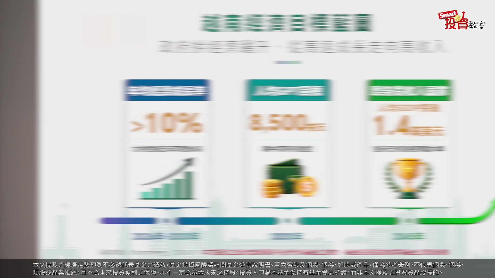
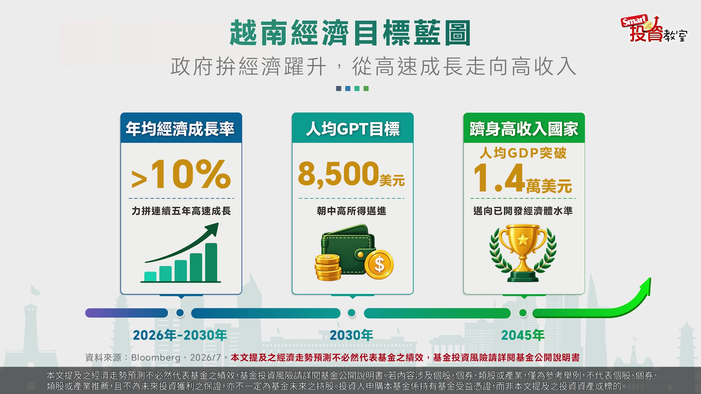
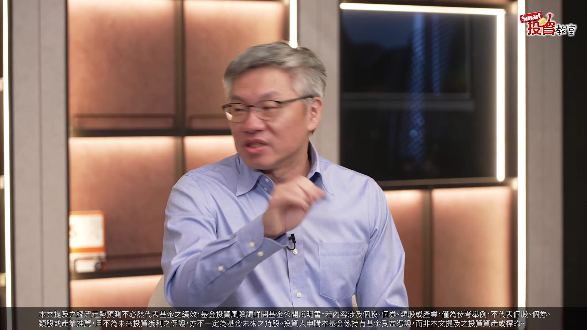
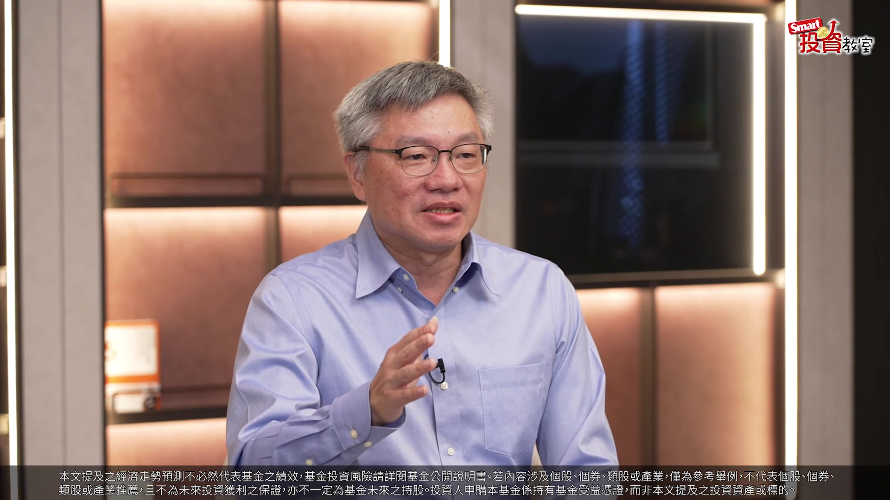
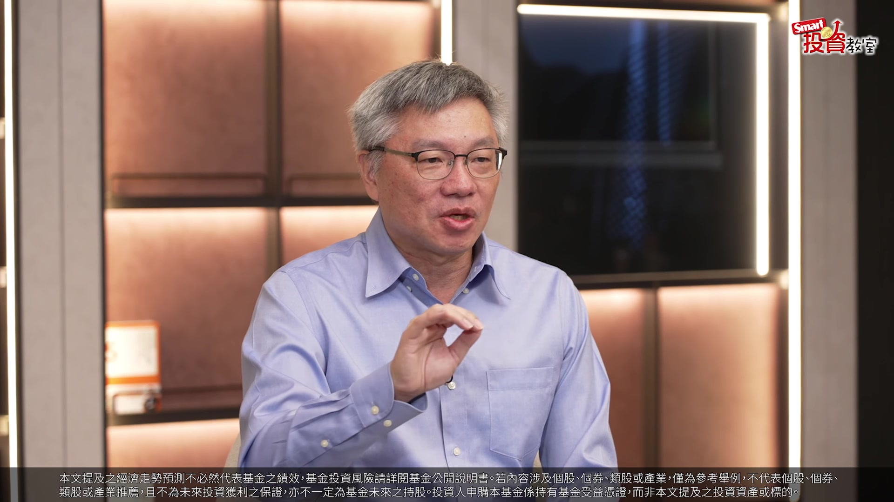

# smartmonthly-bw_YoNKzSvLxj8 — 關鍵畫面索引

- 來源逐字稿：[smartmonthly-bw_YoNKzSvLxj8_GT.srt](smartmonthly-bw_YoNKzSvLxj8_GT.srt)
- 影片：https://www.youtube.com/watch?v=YoNKzSvLxj8
- 截圖數：25

## 00:00:07

**逐字稿片段：** 先考大家一題 2025年台灣的經濟成長率 高達8.68% 真的非常厲害 勇奪了 亞洲主要經濟體的第一名 但是你知道 緊跟在後 同樣跑得非常快的 亞洲經濟黑馬 是哪一個國家嗎 答案就是越南

**話題推測：** 開始一個考題，可能顯示問題內容

---

## 00:00:25

**逐字稿片段：** 那到底越南 最近發生了什麼事 它又是怎麼樣 一步一步的升級成 越南2.0 我們今天就特別邀請到 中國信託越南機會基金經理人 張晨瑋 來跟大家深度剖析 來晨瑋 先跟大家打招呼 峰哥好 各位觀眾朋友 大家好 大家都知道 去年越南的GDP成長率 我們剛才前面講了 高達8.02% 所以經濟基本面 真的是非常的不錯 那去年的越南股市漲幅 也很不錯 不過 很多場內的投資人 就想問說 越南經濟基本面這麼好 可是好像 今年的股市指數沒有跟上 經濟跟股市有點脫鉤 請問一下 這到底是什麼原因 這是很好的一個問題 那首先 其實去年開始 越南的GDP的增長 基本上都非常非常漂亮 大致上都在8%以上 那但是

**話題推測：** 引導至越南的「升級2.0」主題，可能顯示主題簡報頁

---

## 00:01:20

**逐字稿片段：** 這主要原因是因為 政府大力做 所謂的基礎建設投資 那它把這個基礎建設的投資 去跟大企業合作 跟過去不一樣的是 它可能是發包很多公共工程 給公共工程的公司工作 那這一次的話 它想要藉由 民營企業的效率化經營 所以把所有的資金 投放給這些大型的企業 所以所有的資金活水 都被這些大企業給吸納住了 中小型的企業 跟市場的一個部分的話 所以在活水的資金 相對受到壓抑的情況 股價表現 就自然而然受到壓抑 那指數跟不上的原因 主要就是市場資金 被指標性的大型企業給吸走 其他企業 就沒有所謂的 資金活水的挹注 市場資金短缺 所以造成股價有所壓抑

**話題推測：** 解釋經濟成長原因為政府基礎建設投資，可能顯示政策說明或建設圖片

---

## 00:02:41

**逐字稿片段：** 今年上半年 又因為這個 中東的戰爭 所以導致油價高漲 通膨 這樣子的一個因素 所以使得 越南的官方央行的部分的話 也沒有辦法釋放 所謂的資金活水 所以在整個資金環境 緊俏的情況之下 股市表現就相對受到壓抑 但是 但是這個東西是最重要的 就所幸 但是 但是其實戰爭因素 基本上也是逐步的一個消除了 那我們剛剛 最前面講的 其實國家是花了很多的錢 去做這個長期的基礎建設投資 當這些建設 好了的時候 那這個就會是這個國家 未來長期發展的 一個很重要的經濟基石

**話題推測：** 指出上半年市場下跌原因之一為中東戰爭，可能顯示相關新聞畫面或油價圖

---

## 00:03:20

**逐字稿片段：** 那我接下來想要請教 就是我們一般對越南的印象 就是說比較多數人的印象 就是這是做代工的國家 可能現在 也繼中國之後 變成新的一個世界工廠 那越南是怎麼樣 變成現在投資專家的眼中 未來10年 最有潛力的新興市場 因為我覺得有陸陸續續 大家有些人 開始在討論這個話題

**話題推測：** 引導至對越南的普遍印象與「世界工廠」的新定位，可能顯示主題轉換

---

## 00:03:43

**逐字稿片段：** 為了帶大家看懂這個大變身 那中國信託投信 跟Smart智富團隊 我們就聯手了打造一本新書 這本《從街頭小吃到米其林 從養蝦池到科技園區 越南升級Upgrade》

**話題推測：** 宣布合作推出新書，可能顯示書本封面

---

## 00:03:56

**逐字稿片段：** 我們這邊書裡 用了 政策 資金 製造 人才 品味 五大升級 完整拆解越南的蛻變 所以想請教一下經理人 根據你6年的研究 我相信你也常常去 越南做調研 那這本書所提到的 這個5個升級 有哪一個是你覺得 最有利於市場的增長

**話題推測：** 介紹新書內容的「五大升級」，可能顯示列表

---

## 00:04:17

**逐字稿片段：** 我的選擇的部分的話 會是人才 OK 那其實 人才這個東西一定就是 大家經濟發展的長期基石 越南的部分

**話題推測：** 聚焦於「人才」升級為市場增長關鍵，可能顯示相關主題頁

---

## 00:04:28

**逐字稿片段：** 越南的識字率高達95% 然後每年 有大於120萬的高中畢業生 所以其實這個人才的來源 基本上是源源不絕的 那我們也常說台灣是科技島 但是其實我們台灣 也面臨這個所謂的少子化衝擊 但是越南每年 卻在IT跟純軟體相關的畢業生 每年就高達5萬人 那像我們常去越南實際調研 拜訪公司 那無論是公司的董事長 總經理 或者是更是金融從業人員 他們基本上都有 受過非常良好的 這個所謂的教育基礎 那英文 什麼之類的 基本上全部都是海歸派 那其實當然我們也不會 就是每天都是在講 這些金融市場 我們坐下來吃飯 聊聊天的時候 就會說 那你們都是留學 澳洲 英國 美國 然後有些人甚至是 拿全額獎學金 那你們為什麼要回來越南 他們的回答都是一樣的 他認為現在回來越南 是他最好的機會點 OK 那什麼叫最好的機會點 他們就說 我現在回來越南的時候 我可以有很多發展的機會 我可以不小心 就是一下子 升到小主管 更甚有些人就說 我是為了未來的創業做準備 所以種種的政策利多 再加上說 他們現在準備在做 這個所謂的 升級跳躍的這個動作 都讓這些人才願意吸納 或者是留在越南的部分的話 基本上是越來越多

**話題推測：** 提出越南識字率95%的數據，可能顯示統計圖

---

## 00:05:47

**逐字稿片段：** 那政府的政策目標 其實也非常非常明確 政府它已經設立了 很多的經濟增長目標

**話題推測：** 轉向討論政府政策目標，可能顯示目標列表

---

## 00:05:53

**逐字稿片段：** 2026年到2030年 年均GDP增長 要到10%以上 2030年的人均 也要到8500美元 2045年要躋身 這個所謂的高收入國家 所以基本上 越南現在人均基本上才5000美元 它的目標放在8500美元 基本上還有很多路要走 還有很多增長的空間 而且我覺得很重要的一點是 越南政府 對於這件事情的看重程度 每一任的政治週期 它都不斷地再去強調 它們想要進步的 這樣子的一個決心 那我們也有看到

**話題推測：** 指出2026-2030年GDP年均增長目標10%以上，可能顯示數據目標

---

## 00:06:23

**逐字稿片段：** 很多的大企業 對於人才系列的投資 那像是越南的頭部公司 基本上它們都有在做 自己的教育體系 它們要的人才自己培育 它們要的 什麼樣的形特色的的人才 它們也是自己的生成 那越南的頭部公司 像是Vingroup啊 或者是FPT公司 它們都有設立自己的大學 高中 更甚是這個所謂的技術學校 這些都是 對於越南的中長期發展 我認為 個人是認為 是最重要的一件事情 剛才聽到你剛才講到 這個越南官方設定的 這個經濟成長率目標 我覺得真的非常的積極進取 這個這也讓我想到了 台灣過去 在這個快速成長期的時候 也是有讓大家感覺到就是 非常上進 有成長動能這個階段 那另外書中有一個章節 我也是滿有印象

**話題推測：** 轉向大企業對於人才教育的投資，可能顯示相關案例

---

## 00:07:08

**逐字稿片段：** 就是中信的團隊直接就殺進了 越南汽車品牌VinFast 這家在海防的超級工廠 去做參訪 那這個VinFast這家公司 被稱為是越南的特斯拉 我光講到越南特斯拉 你就知道它定位了

**話題推測：** 提到越南汽車品牌VinFast，可能顯示公司標誌或汽車圖片

---

## 00:07:22

**逐字稿片段：** 所以這個工廠裡面 配置超過1200台的機器人

**話題推測：** 提到VinFast工廠配置1200台機器人，可能顯示工廠自動化畫面

---

## 00:07:26

**逐字稿片段：** 整體的自動化率 超過了90% 那書裡面這個描述 真的讓人身歷其境 另外書裡面也提到說 越南科技龍頭跟輝達合作 新建AI工廠 還有越南第一座的晶圓廠 也是在今年的1月動工 機器人 AI 晶圓廠 所以說這個越南 是已經從傳統的製造 升級為人工智慧驅動的智造 智慧的智 那晨瑋你們的團隊 也常常實地走訪越南 我就好奇 這幾年走訪當地的體感 有沒有很大的改變跟過去

**話題推測：** 指出VinFast工廠自動化率超過90%，可能顯示數據

---

## 00:08:00

**逐字稿片段：** 體感上面最顯著性的改變 就是這一切的基礎建設 變得越來越多這件事情 過去其實去越南的時候 其實開車 或者是什麼之類的 你就覺得 然後想說 怎麼又在挖路之類的 但是其實最近去的時候 挖路的狀況越來越多 到處都在挖路 到處都在做工程 那跟大家一個數據分享一下

**話題推測：** 談論基礎建設顯著增加的體感變化，可能顯示新舊對比照片

---

## 00:08:23

**逐字稿片段：** 如果說是10年前 越南的高速公路 只有800公里 到2026年的今天 越南的高速公路總長度 來到3800公里 那多的這3000公里 當中的2000公里 都是近2到3年完成的 所以基本上 在基礎建設投資這一塊 基本上有很十足性的一個增長 那像我們常去越南的 我們去什麼越南的海防 不知道峰哥有沒有去過海防 沒有欸 海防 是越南的一個北部的 一個深水港口 那因為北部是 像河內 北寧 都是一些製造重鎮 當它們這些地方 把商品貨物做好之後 要運去海防出口 過去來說 如果車子從河內到海防 要4個小時 現在大致上1.5個小時 就可以完成 那講一個觀光旅遊的 大家喜歡去玩 大家最喜歡去峴港 然後喜歡去富國島 但是大家有沒有聽過芽莊 我聽過但不知道 芽莊號稱東方小馬爾地夫 不得了 就是海邊很漂亮

**話題推測：** 提及10年前越南高速公路里程800公里，可能顯示歷史數據

---

## 00:09:27

**逐字稿片段：** 過去從胡志明出發去芽莊 開車10個小時

**話題推測：** 對比胡志明到芽莊過去10小時車程，可能顯示地圖及時間標註

---

## 00:09:31

**逐字稿片段：** 那現在差不多 5個小時可以完成 所以這一些都是所謂的 基礎建設的投資 真正有在落成 已經開始步入所謂的收成期的 這樣子的一些證明 經你剛才的描述 我彷彿又聽到 一個新的基建狂魔 真的快速的 在整個做基礎化的建設 真的是改變了整個國家 不管是地貌或者是說 這個運輸的這個效益 那我們再回到市場來看一下 就是越南的這個股市的 漲跌的幅度 看起來是不像全球的科技股 這樣的劇烈 可是長線 是一個充滿機會的市場

**話題推測：** 指出現在胡志明到芽莊車程縮短為5小時，可能顯示對比

---

## 00:10:09

**逐字稿片段：** 所以我想請你 幫大家做一個總提點 投資越南 如果想要投資越南 你接下來有哪一些機會 是可以注意的 又有哪些風險 你一定要先留意 越南我們認為說 長期來說都是好的 要有賺到越南的這一波紅利 你一定要長期的待在市場上 因為它的市場 基本上就是會那種 突然跳躍式的方式 它是會突然跳起來的 所以我們認為說投資越南 應該是你的資產配置裡面中的 一個標配 它是一環 你不要輕易的放棄它 那我們認為 因為今年上半年 基本上市場出現了一些 就是因為資金緊俏 或者是出現一些波動 那像是一些戰爭的因素 等等之類的 那下半年這個機會點 其實是越來越顯著的 那又因為上半年的市場下跌 反而出現了一堆 就是所謂的超跌的一些個股 那主動型基金的好處就在這邊 我們可以針對超跌的一個個股 去反應 然後去進行所謂的 加碼的一個動作 那你也知道說 類似像現在 它們的經濟增長目標都在10% 雙位數字以上 那在這樣子的情況 一定會有很多公司 跟它的基本面 已經逐步脫鉤了 那我們就可以選擇 這樣子的一些機會

**話題推測：** 總結投資越南的機會與風險，可能顯示總結列表

---

## 00:11:21

**逐字稿片段：** 舉一個例子好了 越南的一家這個所謂的 零售上市公司 是我們有在關注的一個標的 那它近期 因為推出了這個所謂的 先買後付 就是你進去店裡面 你要買 比如說我想要買一支小米手機 但是他跟我講說 你可以先買後付 然後12期又零利率 越南利率很高 越南利率年化利率 可能要達到10% 所以說這樣子好划算 我原本我的預算只買小米手機 我可以去買iPhone的手機 那對這家商家來說 我的銷售金額就增加了 那對於這家商家來說 更好的是什麼 更好的是因為它是跟 消費金融公司合作 所以就算客人最後沒有付錢 其實這家商家 其實是沒事的 因為那討債或者是 不能說討債 就是要追繳這件事情 基本上是 從背後的消費金融公司來的 那這家公司就是我們很喜歡的 或者是想要去觀察的 這長期潛力標的 那越南投資的風險的部分 像是說今年其實 有很多人都觀察到說

**話題推測：** 舉例零售上市公司，可能顯示公司名稱或標誌

---

## 00:12:19

**逐字稿片段：** 越南是出現所謂的貿易逆差 它不是一個很長期的順差國嗎 今年怎麼會出現貿易逆差 但是我們認為說 其實有非常多的進口 都是為了明天的出口

**話題推測：** 指出越南出現貿易逆差，可能顯示貿易統計圖

---

## 00:12:30

**逐字稿片段：** 大多數的貿易逆差品項 都是電子零組件 那其實這也是 呼應了越南長期說 在這個所謂的中國加一 這個政策上的紅利的展現 那還有一件另外一件事情是 越南是一個相對淺碟的市場 那所以它的市場特性 是容易就是有時候會有一些 劇烈的波動 或者是說有時候其實 在A股票下跌的時候 因為它會跌停 跌停鎖死了之後 大家想說 我好害怕 我就賣不到這一支股票 我就賣了其他支 所以導致 有一些小小的連鎖效應 但是如果投資人在這個時候 去做這個所謂的買賣或操作 其實有時候 反而是就是被這個 這種盤勢給誤殺 錯殺了 那所以我們 還是會建議投資人說 其實可以選擇 像這種基金類型的投資 它是一個投資組合的一個概念 那你把這些被錯殺 或誤殺的一些標的的 機率值 減少降低 我們剛才聊了 滿多東西投資相關

**話題推測：** 說明貿易逆差主要品項為電子零組件，可能顯示進出口分類圖

---

## 00:13:24

**逐字稿片段：** 最後我們來看一下 越南升級Upgrade這本書 其實裡面有很重要的章節談到 品味升級的這個分享 就是分享到這個越南新世代 對於電影音樂還有時尚 從街頭小吃到米其林的 美食革命 還有現在一趟要價 9890美元 八天七夜的S Journey的 五星級奢華鐵道之旅 我自己也很喜歡 這個搭鐵道之旅 那看完你會發現 越南不是我們印象中那個 只有河粉跟摩托車的越南 雖然那個也滿有傳統風味的 但現在是一個 更時尚更現代化 所以如果你想要了解 越南在整個的華麗蛻變的過程

**話題推測：** 轉向討論《越南升級Upgrade》書中「品味升級」章節，可能顯示相關主題頁

---

## 00:14:09

**逐字稿片段：** 真的非常推薦 大家來閱讀這一本 越南升級Upgrade 有興趣參與 越南這波成長機會的朋友 也可以進一步了解 中國信託越南機會基金 那我們今天非常謝謝 經理人張晨瑋的分享 Smart投資教室 我們下次見 拜拜

**話題推測：** 再次推薦《越南升級Upgrade》一書，可能顯示書本封面

---
