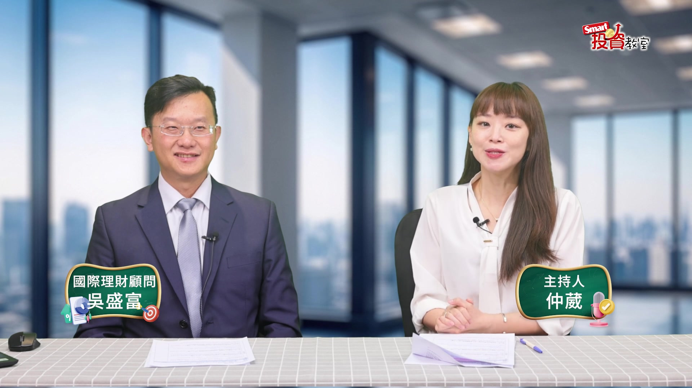
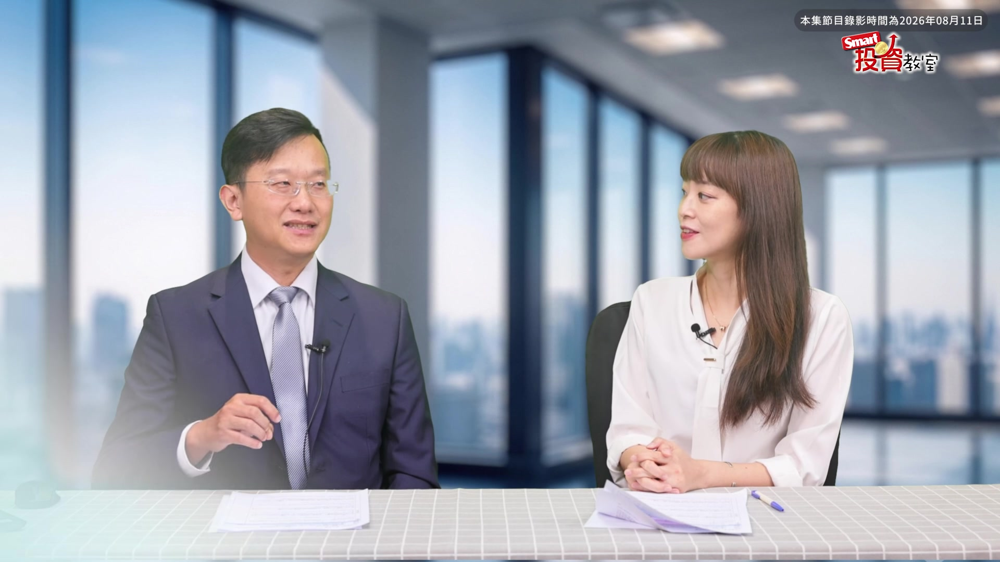
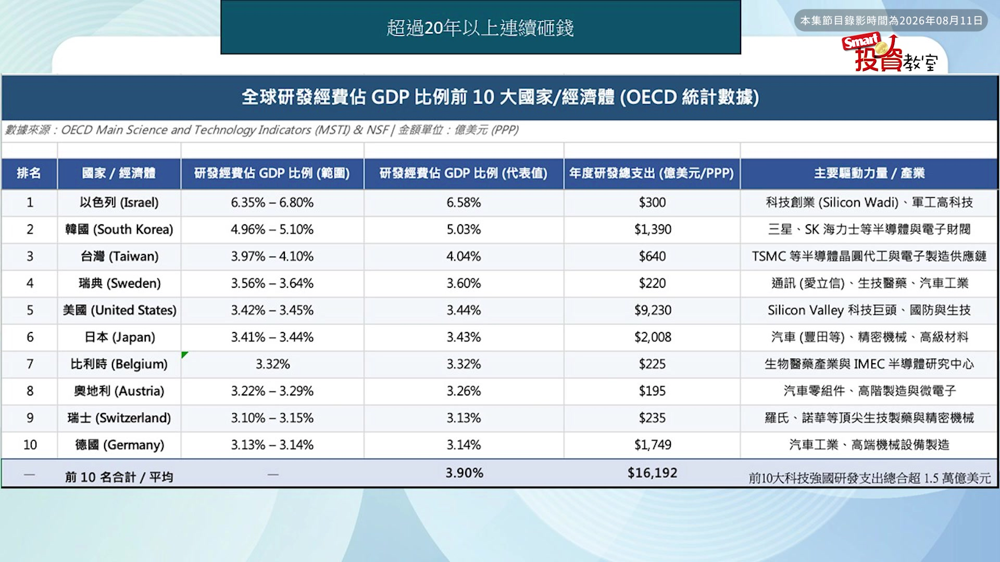
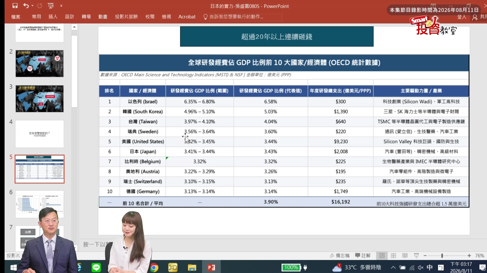
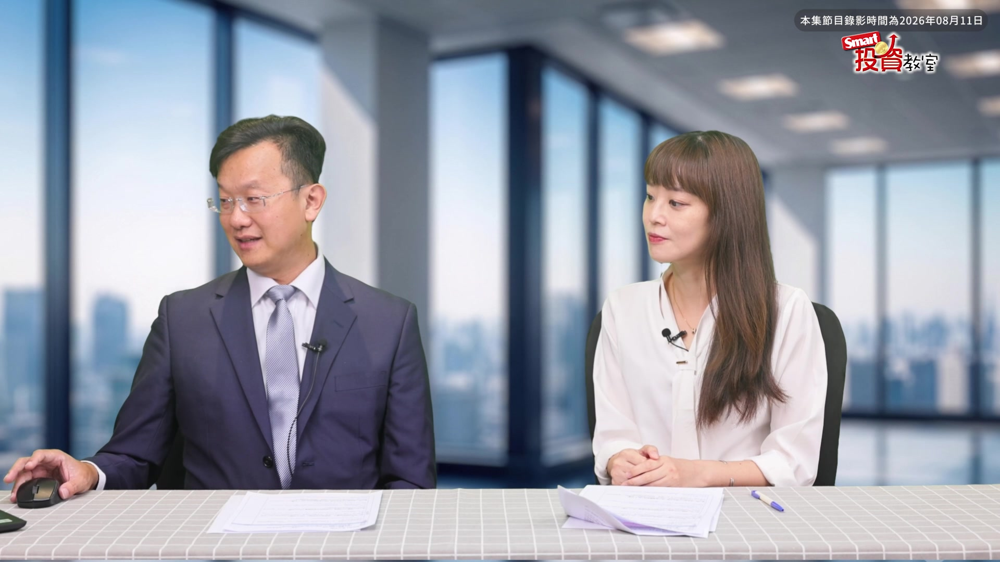
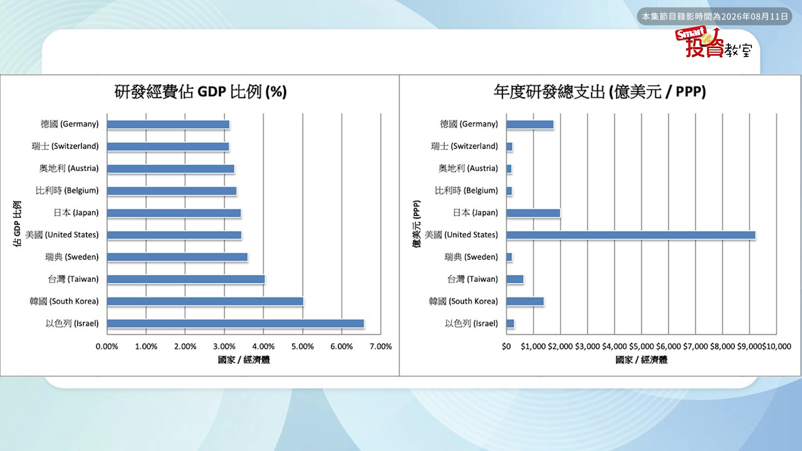
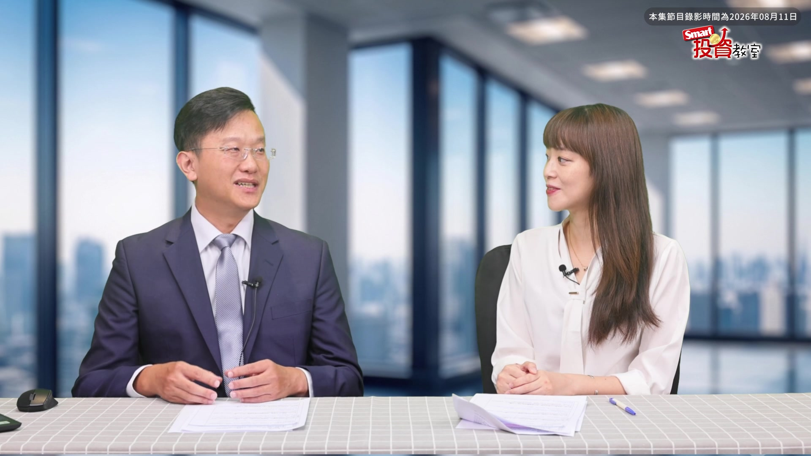
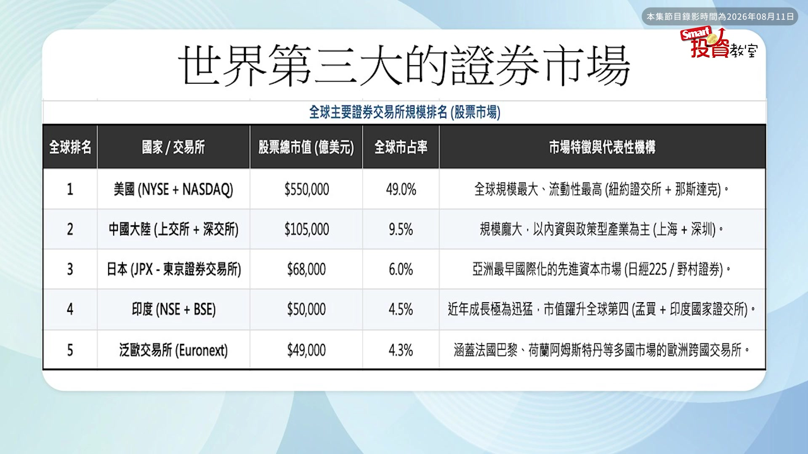
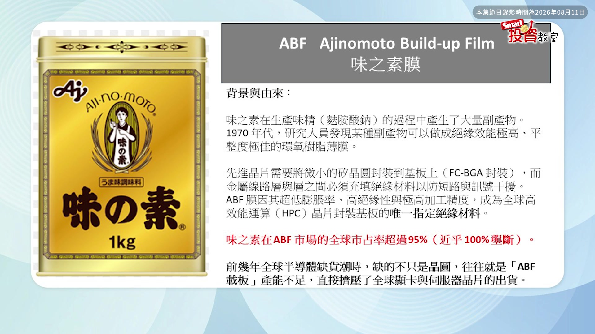
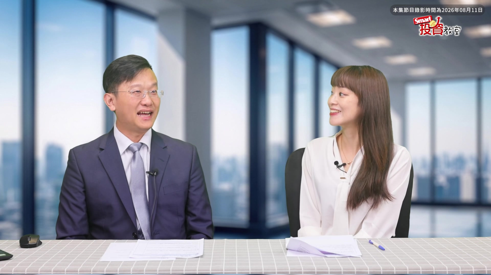

# smartmonthly-bw__FsaTDrvsms — 關鍵畫面索引

- 來源逐字稿：[smartmonthly-bw__FsaTDrvsms_GT.srt](smartmonthly-bw__FsaTDrvsms_GT.srt)
- 影片：https://www.youtube.com/watch?v=_FsaTDrvsms
- 截圖數：10

## 00:00:27

**逐字稿片段：** 受到了韓國股市 去槓桿化的影響 其實全球都在 跟著他一起震盪 台股大概在 4萬到4萬5000點之間 不斷的上下來回 到現在都還在 感覺在盤整當中啦 所以其實在 這樣的情況之下 投資人會開始 更加追求 抗震耐震 還有長期成長性 這樣子的股票的選擇 所以現在當 大家都把目光 放在了美國 放在韓國的時候 我們今天要偷偷 帶大家關注一下日本 台灣人非常愛去的日本 其實藏了很多 所謂的隱形冠軍企業 那這些企業到底 對我們全球佔了 什麼樣舉足輕重的地位 同時他們到底 又壟斷了多少 全球關鍵的技術跟市場呢 今天我們特別邀請到了 CFP國際理財顧問 吳盛富老師 歡迎盛富老師 嗨各位觀眾大家好 好盛富老師 今天要跟大家來介紹 到底日本有哪些 所謂的隱形冠軍企業嗎 讓大家可以去 偷偷投資 不要告訴別人的那一種 OK其實日本啊 它這些冠軍的企業 其實一點都不隱形 其實如果放到 業界上來說 大家都是很清楚的 我們就隨便舉個例子來說 現在最紅的叫做AI嘛 AI的應用叫做機器人 那要控制機器人呢 它必須要有一個控制器 其實那個是日本企業 一家叫做 發那科它的專利 那其實它 過去的商周有報導 在2014年的時候 叫做在富士山下 隱藏的公司 就是這一家發那科 所以它是大家現在 想要關注的隱形企業之一嗎 厲害的企業嗎 應該不夠隱形 因為大家都知道了 只要是台灣就是 相關的工具機產業 一定都知道發那科 因為 其實台灣的 工具機裡面最難做的 一個東西叫做自動控制器 那其實也是發那科的專項 好 剛剛老師提到機器人 但是啊一般我們想到 全世界的科技大國 大家的第一直覺 第一印象一定還是美國 但是後來我們現在發現 日本好像 默默的在做一些 發大財 默默拿了很多諾貝爾獎 這樣子的事情 到底諾貝爾獎跟 我們投資人之間 有什麼樣的關係呢 首先我們現在來說一下 日本其實是全世界第三大 甚至是第四大的股市 因為可能跟德國在交錯中 那第二大是中國大陸 無庸置疑嘛 那 假設我們在資產配置裡面呢 想要加入一個 不是美國 但是又不是 中國大陸的地方 那我們次選很可能 就是所謂的日本 那我們在了解日本之前呢 一定要了解 為什麼我會特別去關注日本 除了我們現在很喜歡 三不五時就把那個 沖繩當後花園 當墾丁這樣子過去一樣 因為台北去墾丁可能 跟台北去沖繩差不多 沒有可能去沖繩還更快 對所以我們大家都很喜歡日本 可是我們 對日股的了解 很可能就相對少 那可是既然要聊到日股的話 我們就要必須 了解一件事情 為什麼日本在泡沫經濟之後 到現在為止 我們都說啊 日本應該很衰然後 泡沫經濟失落啊 30年40年 可是我們走到日本街頭的時候 卻沒有這種感覺 對 其實是 原本人家是開賓利的 後來泡沫經濟之後呢 改開賓士而已 但雖然 經濟受創了 可是他們的生活水準 或是他們的經濟水準 還是在一個一定的位置上 那可是為什麼在一個 我們說它叫做沒落的貴族嘛 那它怎麼能夠在這沒落的 途中還能維持這個樣子呢 那其實我們就講一個 最核心的關鍵 我們就從諾貝爾獎 這件事情來說好了 首先這是諾貝爾獎 歷史上的數據 整個亞洲加起來呢 有72個 那其中獲獎數最多的呢 一個是日本一個是以色列 那我們就想說 亞洲不是中國也是一個 泱泱大國 台灣也是 很棒的國家 可是如果你再把 剛剛那個數據減掉 日本跟以色列 我們拿來跟非洲比一下 那 就會看到哇 亞洲累積獲獎數只有26 非洲累積獲獎數27耶 比台灣還多 比亞洲還多一 對所以實際上呢 就整個亞洲的科研精神來說 如果去掉 日本跟以色列的話 其實亞洲就跟非洲一樣 是同等級的 然後就會覺得 哎呀怎麼會這樣呢 那可是日本能夠 取得這麼多諾貝爾獎呢 不是虛的 那你說我們說 科學家也要吃飯 然後出去 晚上的時候也想喝點小酒 可是如果呢 你像我們中國人要求 那個聖人都是 無私奉獻 然後 無私奉獻然後免費 然後科學家也要吃要喝啊 那他怎麼維持生計呢 所以日本用的一套方法 就非常符合人性 這是日本獨有 而且寫進法律裡面的 那我們就來看一下囉 日本怎麼做到的 那做到的原因 就是其實簡單來說

**話題推測：** 介紹韓國股市去槓桿化對全球股市的震盪影響。

---

## 00:05:57

**逐字稿片段：** 砸錢 簡單粗暴欸 就是很簡單 你要讓他研發 就跟台積電好了 就台積電要做到世界第一 然後你研發經費 一個工程師薪水只給他50萬 請問台積電有可能 吸引台大 成大 清大 交大這些頂尖人才嗎 沒有因為隔壁聯發科開300 然後你台積開50 我就跳去聯發科了嘛 所以台積的薪資水平 一定要達到一樣 同樣的科研也一樣啊 一個大學教授的年薪 不過200萬到300萬之間 那 同一時間你就面對台積電的 競爭的時候 台積電說 進去基本上 博士畢業 起薪開300 那這時候 大學教授 雖然很有心 想要繼續研究下去 可是看一看隔壁的那個薪資 他就會有 產生一定的落差 那日本在做的這一件事情呢 其實就是讓 大學教授 領有相對高 穩定的薪水 那我們就看數字就好了 砸在科研上呢

**話題推測：** 揭示日本科研實力背後的核心關鍵是「砸錢」，預期畫面切換到科研經費相關的圖表或文字說明。

---

## 00:07:01

**逐字稿片段：** 這是全世界的GDP的排名 就是科研經費佔GDP的排名 那當然 以色列能夠 佔比這麼多的諾貝爾獎 你就看到它砸錢的比例 也不手軟是6點多 是世界第一嘛 世界第一 對那台灣韓國其實也砸了 很多GDP的比例 可是它多數 2.3 對它其實多數都是在 企業自己砸錢 那其實如果你待在公務體系的 教授們的經費 其實是相對比較 少一點點的 那可是除了這個之外呢 你會發現美國瑞典日本 其實比例也還算高 都有3點多 那照全世界比例排下來 大概是第五名跟第六名 可是呢 一旦你因為這個比值是GDP嘛 所以它分母是GDP 對不對 那你知道美國就是全世界 最大的GDP 國家嘛 那你把分母乘進去之後 我們就算出一個數字

**話題推測：** 說明全球科研經費佔GDP的排名，預期出現國家科研經費佔GDP比例的排行榜。

---

## 00:07:54

**逐字稿片段：** 叫做它實際砸了多少美金 那所以美國算出來 9230億美金 這就真金白銀砸進去的錢 那日本比重大概跟 日本差不多 那個美國差不多 所以它真金白銀砸進去 算出來 2000多億美金 那我們回頭往上看 一下台灣跟韓國 是不是就比日本稍微少一點點 對所以我們比例比較高 可是因為人家的基數比較大 他們的GDP比較高 所以 換算出來 金額也比較大 對 所以日本 就在這種環境之下 砸錢然後又提供大學教授 相對好的生活品質等等 然後甚至就是 在聽日本的朋友說啦 日本的教授在社會上 擁有很高的社會地位 可是在台灣相對來說 好像不這麼受到重視 所以日本他們的教授 就能夠專心的去研發 他該做的科研的動作 那再來我們就來看一下 就是實際上的數字 我們就擺在這

**話題推測：** 說明各國實際砸下的科研經費（美金），預期出現各國科研經費總額的圖表。

---

## 00:08:58

**逐字稿片段：** 如果用長條圖來比的話 我們就可以知道 左邊的那張圖是GDP的比例 右邊是實際上的數字 那我們就稍微看一下 日本其實是全世界第二的 那 可是砸錢也不能亂砸啊 那他們怎麼做的呢

**話題推測：** 提到左右兩張GDP比例與實際數字的長條圖，明確指示畫面內容。

---

## 00:09:14

**逐字稿片段：** 第一個叫做企業砸 那我們就舉個例子好了 曾經有一個東西 叫做藍光LED 因為當年1994年的時候呢 LED只有 綠光跟紅光 可是我們知道就是三 光的三原色是 藍色綠色加紅色 然後只要藍光突破了之後呢 我們現在所有用的LED螢幕 手機螢幕等等 其實都是當年 日本用砸錢砸出來 研發出來的藍光LED技術 我們現在才有這些 LED面板可以用 對那當時那個 其中一個諾貝爾獎得主 叫做中村修二啊

**話題推測：** 談論日本科研經費中「企業砸錢」的部分，預期畫面切換到新的主題標題或案例介紹。

---

## 00:09:53

**逐字稿片段：** 他在日亞化學裡面呢 別人就撥了一張 一個實驗室大概跟 我們現在攝影棚差不多大 12坪的大小 然後他就在那裡 苦蹲了14年 哇 然後14年之後終於有成果了 那我們就換句話說 來問問 主持人了 如果你有一個員工呢 他整天的工作就是 躲在實驗室裡面 你 用 給他薪水給他資源 五年之後沒有成果 你會怎麼做 不好意思辛苦你了 對可是這個中村先生呢 整整花了14年 第一 日亞化願意砸錢 真的耶 然後第二個 他做了14 13年 他還是能夠吃孜孜不倦的 說我一定有 持之以恆 我還是要研究這個 我一定要研究出來 可是你要想喔 這個放在主人公的心裡 你27歲 現在40了 不是我說我啦 現在我40了 然後現在一事無成 就領著 百萬的日幣薪水 過著一般人的生活 然後我就還在 死磕這件東西13年 哇這個心理壓力是很大 可是日本人呢 就是他有職人精神 第14年終於讓他功課了 哇 然後攻克了之後 在2014年的時候拿到諾貝爾獎 因為他1994 1996之間他 從研發完成到量產 所以日亞化學砸了多少錢呢 砸了三四億日幣進去 然後14年喔 然後終於有成果 可是他的一回報 就是上千倍上萬倍 因為你只要未來只要 用到藍光LED 都是屬於日亞化學的專利 哇 對那這就是 日本的諾貝爾獎的故事 所以我們能不能 發掘下一間日亞化學 他突然之間又 弄出一個哇 全世界都要 跟他買專利的呢 那我們就拭目以待 日本的GDP研發呢 其中80%都來自於企業的砸錢 那另外20%呢 來自於國家 那他們的策略就很清楚了 企業的目標是幹嘛 獲利盈利 所以他一定是砸實用性的方面 那另外呢 一部分國家砸的那個20% 就是創新的產業了 那他主要在投什麼創 創新產業例如說生技 然後甚至是 發現新元素這種東西 幾十年很可能都沒有成果的 然後這個 燒錢然後不一定會有回報的 那由國家來燒 那燒錢會有成果 而且獲利會有 幾千倍幾萬倍的 由企業砸錢下去燒 所以這就變成了日本 企業的關鍵文化 對所以這個我們大家在想說 哇日本到底是多有鈔能力 才可以做這樣的事情 其實背後都是 不管是企業端或是政府端 都有他們的佈局存在 對而且重點是人家還把 嗯這個GDP的比重 要花多少錢 直接寫在法律裡面了 所以 不撥錢違法喔 對所以我們就可以知道 日本能夠做到這種程度 那他有他的歷史緣由 那也就是因為 其實我們在投資的時候 我們就要想一件事情 那過去有個很有名的 投資專家叫做趙丹陽 他說投資 無非就是搞定一件事情 就是選擇一個對的國家 那 他的意思其實是說 我根據我的解讀啦 因為你選對了一個國家以後 他很有可能誕生一個產業 那我們投資股票在幹嘛 其實就是 這個產業向下的頂尖公司 然後如果我們能夠 在2000年的時候 發掘蘋果 那投到今天為止 假設我們都沒有賣的話 可能是幾百倍 甚至是幾千倍的獲利 那其實 我們在做的一件事情就是 如果台灣是一個很棒的企業 可是台灣的產業 比較偏向單一一點 美國就比較比台灣更多 因為他基數比較大嘛 那其次我們可以選的 因為現在台灣對中國的投資 比較不這麼友善 所以 中國暫時不計的話 那我們就選 日本當作第二個替代 對確實 而且因為台灣跟日本之間 本來就台日友好嘛 大家對日本文化 或是企業的了解 可能本來就比較深 所以今天我們從日本企業下手 大家可能會覺得 更貼近你的生活一點 然後你也可以更了解 我到底要怎麼投資怎麼佈局 所以接下來就要問老師喔 所以日本啊剛提到 他們的科研實力這麼強 拿了這麼多諾貝爾獎 然後擁有非常多的專利技術 那我們到底 要怎麼樣投資日本股市 那投資日股 又有什麼樣的優勢呢 而且聽說啊有一個 大家廚房常見的調味料的品牌 大家平常都是 用它的調味料來煮飯 但沒想到他竟然跟AI 或者是跟科技產業 是有關係的嗎 是沒錯那這一家公司呢 其實我們要稍微介紹一下 為什麼要投資日本 我們就從證券市場的規模來看

**話題推測：** 舉例藍光LED的諾貝爾獎得主中村修二及日亞化學，可能出現人物照片或公司Logo。

---

## 00:15:11

**逐字稿片段：** 首先我們可以看到 全世界的證券交易市場 這是規模的排名嘛 你就可以看到 很清楚的 日本就是全世界的第三位 那除了第二位 我們投資比較困難之外 因為他必須要有專 根據國內的法規 必須要有專業投資人 所以他投資門檻比較高一些些 那我們一般人能夠碰到的 就是日本 何況日本的企業對我們來說 很有可能就真的 存在於我們的生活上 那味精的第一品牌 我們必須要說啊 日本的味精比較貴啊 台灣的味王也是不錯的 可是人家就是從味精裡面的 化學提煉的過程中呢 產生了一個副產品 然後他就從副產品裡面呢 變成一個絕緣的薄膜 那只要是那個絕緣的薄膜 其實就是現在所有 必須幾乎說all 都必須要使用這個隔絕薄膜 而這唯一一家的生產商

**話題推測：** 再次展示全球證券市場規模排名，確認日本位列第三。

---

## 00:16:08

**逐字稿片段：** 就是日本的味之素 生產味精的廠商變成半導體 關鍵零組件 而且全世界沒有他的話 很有可能我們半導體 就運行不下去了 其實不會運行不下去啦 就是效能會降低良率會下降 所以大家幾乎就選擇 因為有一個東西 市價100塊然後成功率100% 另外一個市價80塊 成功率也只有80 那如果你是高級精密的 廠商你會怎麼選擇 我寧願花貴 貴一點點因為那個報廢 一個晶片的報廢 就要花很多的成本嘛 所以 CP值上來講雖然他報價比較貴 但仍然會選擇這一家企業 那他其實就是從 味精的研發的副產品裡面 做出來的世界冠軍 對這真的是顛覆大家想像 一件有點蠻驚訝的 因為大家一定都用過 他們家的產品 或者是吃過 對我自己有偷偷發現 我我自己也蠻常買的 對好那 除了老師剛才提到的這一家 就是生產 味精相關的調味料的公司之外 其實我們也知道日本的產品 在我們生活中很常出現嘛 不管是Uniqlo什麼寶礦力水得 還是百貨公司等等 其實很多都是日系的品牌 那到底這些企業裡面呢 我們要怎麼樣也從中挑出一個 像剛剛老師提到的那樣 名目張膽的冠軍啦 我已經不能說是隱形冠軍了 就是大家都知道 可是你可能不知道 他有哪些厲害之處的 這樣子的企業 如果硬要說報名牌的話 其實股神巴菲特 已經幫我們報了五 五檔股票的名牌啦

**話題推測：** 揭露「味之素」這家味精廠商同時也是半導體關鍵零組件的生產商，預期出現公司Logo或產品圖。

---

## 00:17:52

**逐字稿片段：** 叫做五大商社嘛 其實五大商社就是簡單來說 三井 三菱 住友 丸紅 伊藤忠 等五大商社 那其實跟台灣最相關的啊 其實最近才開幕的LaLaport 不曉得大家有沒有去過 三井OUTLET或LaLaport 有有有上禮拜才去的 那其實 LaLaport 其實就屬三井集團旗下的 三井不動產所開發的 那我們知道台灣的百貨 往往都以新光三越為主 那可是你知道 LaLaport加上三井OUTLET 他現在已經能夠 站上台灣百貨業的第四名了 前面只剩下幾家 新光三越遠百嘛 然後第三第三名我忘記了 第四名其實就是 三井不動產 他已經排上來了耶 那 所以秉持著以前我 投資股票的邏輯就是 我喜歡買什麼東西 我就會去買 他的股票 就跟巴菲特買可口可樂一樣 對沒錯 所以如果你很常去LaLaport 你要不要回頭來去 看一下LaLaport的母公司 他的母公司叫做三井不動產 那我們就放大一點點來看 巴菲特投資的是三井物產嘛 其實三井集團裡面 就以三井不動產 三井 三井不動產三井物產 加上三井住友銀行 這三家為三井集團的 最完整的體系 然後這三家是他最重要的核心 其次台灣百貨業的龍頭

**話題推測：** 介紹股神巴菲特投資的日本「五大商社」，預期出現這五家公司的名稱列表或Logo。

---
