# smartmonthly-bw_fR7auIG3M-0 — 關鍵畫面索引

- 來源逐字稿：[smartmonthly-bw_fR7auIG3M-0_GT.srt](smartmonthly-bw_fR7auIG3M-0_GT.srt)
- 影片：https://www.youtube.com/watch?v=fR7auIG3M-0
- 截圖數：18

## 00:00:01

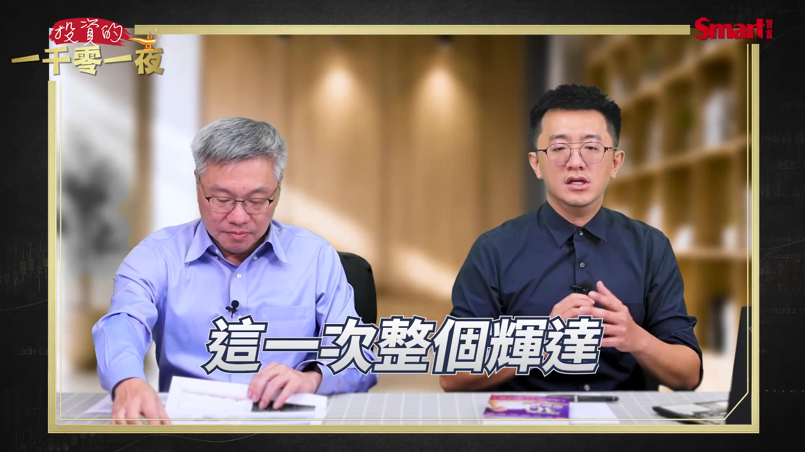

**逐字稿片段：** 整個輝達入它1000億 我只能說是破天荒 而且是前無古人 後無來者 那聯發科就預估 明年AI ASIC有800億 這是跳了一倍的市場

**話題推測：** 輝達投資聯發科1000億新台幣的數字

---

## 00:00:17

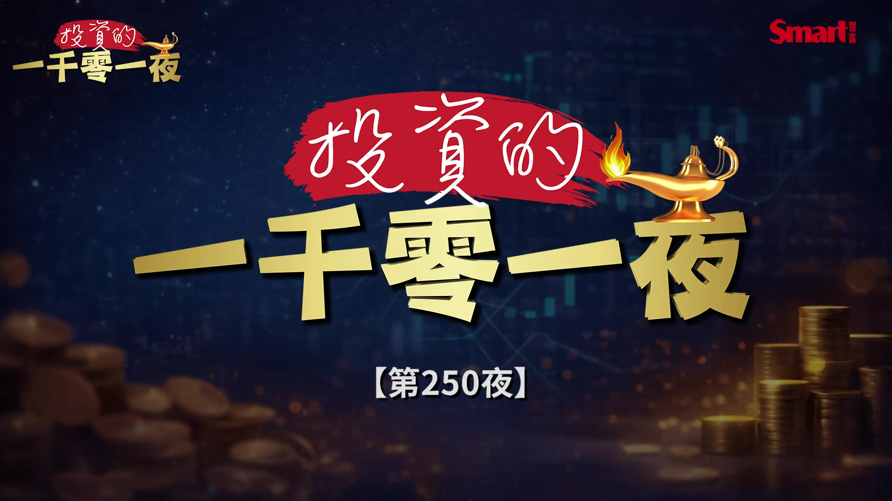

**逐字稿片段：** 大家好 歡迎再次收看 投資的一千零一夜 我是峰哥

**話題推測：** 節目開場，主持人與來賓介紹畫面

---

## 00:00:20

**逐字稿片段：** 最近市場在盤整 不過也有滿多的好消息 譬如說 最近我們就聽說這個老黃 這個黃大老闆 又說話了 然後造成 整個AI股又一起大漲 那所以我們今天 就請產業隊長 張捷過來 來幫我們聊一聊 最近相關AI這些 令人刺激興奮的好消息 先跟大家打個招呼 OK 峰哥好 各位觀眾朋友大家好 我是產業隊長張捷 張捷隊長 最近出了一本新書 趕快幫他拿起來看一下 這本書還滿特殊的 因為跟他之前出的書的 風格都不一樣 但是我們等一下晚一點 再來談這本書 那我先來聊一下 我們剛才就先破梗了嘛 就是聯發科 突然的 本來這個它做這個TPU 是跟Google比較接近的 可能還是跟這個輝達 有點競爭關係 但沒想到 這個輝達 大手筆就投資了千億新台幣 它的可轉債 對不對 所以這也是一個很大的宣示 然後就造成 聯發科漲停 然後其他AI股也全部都 大漲 復活 特別是把這一波 本來盤整 有點尷尬的這個 上上下下 稍微突破了 那你怎麼看這個 聯發科未來的發展 好的 那我們直接就破題端牛肉 其實聯發科是台灣最重要的 IC設計公司 那我講整個AI 其實進程 我認為是從訓練到推理 那硬體到軟體 那雲端到終端 所以從訓練到推理 大家原本就以為 我買很多所謂的GPU 做算力的堆疊 那大語言模型 很聰明之外 什麼律師醫師 微積分考試 要到了所謂的AI ASIC 那這個時候 GPU就會面臨到 很多這個所謂的 AI ASIC的 這個競爭 這是大家原本的以為 那當然 做AI ASIC 這一個部分 其實就幾個玩家 例如說博通 高通 聯發科 創意 世芯 甚至Marvell這個 全世界就只有這五六個玩家 那聯發科 又是集台灣所有 IC設計 最聰明的人才的 重中之重 所以這一次 整個輝達入它1000億 我只能說是破天荒 而且是前無古人 後無來者

**話題推測：** 市場盤整的股市走勢圖

---

## 00:02:42

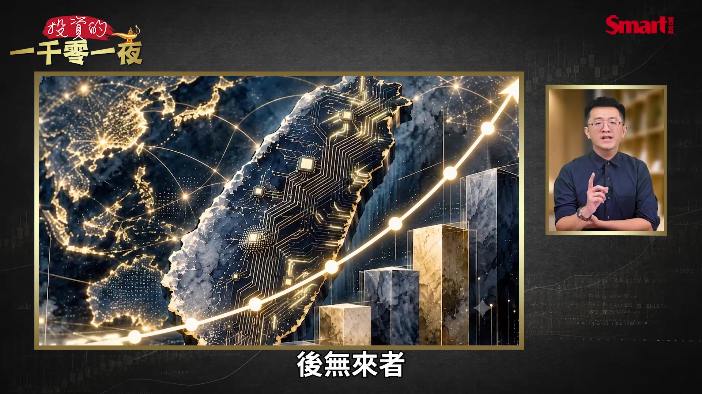

**逐字稿片段：** 那聯發科的崛起 我等下用詳細的數字 來跟大家說明 那這次輝達其實 他也是很聰明 黃仁勳董事長 除了本身的GPU 目前這個持續在做 這個所謂的世代的演進 還有主權基金的 來買以外 他認為就算有ASIC 從訓練到推理

**話題推測：** 聯發科崛起的詳細數據或圖表

---

## 00:03:02

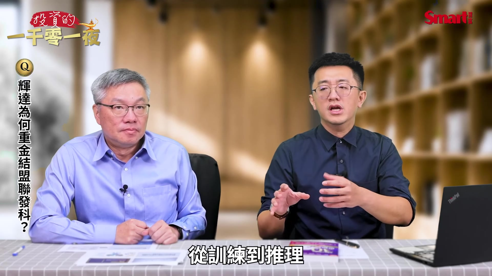

**逐字稿片段：** Google也要做嘛 Google做TPU 有的做Trainium 然後特斯拉做XPU 簡稱 不是GPU的都是所謂的 特殊應用積體晶片 可是輝達 這一次釜底抽薪 他跟聯發科合作說 就算你跟Google 做了所謂的TPU 沒有買我的GPU OK 他說GPU本來就 是加速器 你訓練用了GPU 你的這個所謂的SerDes 你的CPU 所有你的高速傳輸 你還是繞不過我 輝達這個35億美金 一千億台幣 是用來鞏固它的生態系 那我簡單讓大家 能夠最明白的理解 在大的 所謂的GPU 這麼大塊 這個輝達市占率有99% 那在小的所謂的手機AP(應用處理器) 除了 這個所謂的 Snapdragon的高通 再來就聯發科 各占50% 那在中的晶片 所以大中小 中的晶片AMD 跟所謂的Intel 小的CPU 大概也是各占50% 那輝達在最大的 晶片市占率那麼高 他找了最小的晶片 其實大家 有用手機就知道 除了蘋果的生態系 OPPO vivo 小米 中興 華為 聯想 酷派 甚至三星 不是聯發科 就是所謂的高通 那輝達用最大 連結聯發科的最小 然後來一起來做 AI的晶片 我認為在台灣 放眼所有的IC設計界 除了聯發科以外 捨我其誰 所以最聰明的腦袋 在台灣 其實在台積電跟聯發科

**話題推測：** 列舉開發自研晶片的公司（Google, Tesla, 微軟, Meta）

---

## 00:04:42

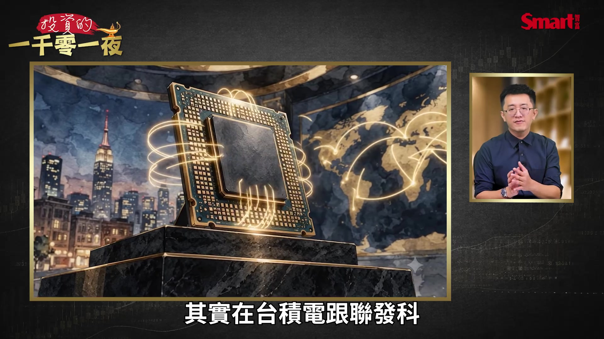

**逐字稿片段：** 所以大家可以看一下 這個圖 35億美金 這個輝達跟聯發科 深度的合作 那除了要做所謂的高速傳輸 甚至它們要做 所謂的這個Spark 就是所謂的 AI的這個NB

**話題推測：** 輝達與聯發科深度合作的關係圖或說明圖

---

## 00:04:58

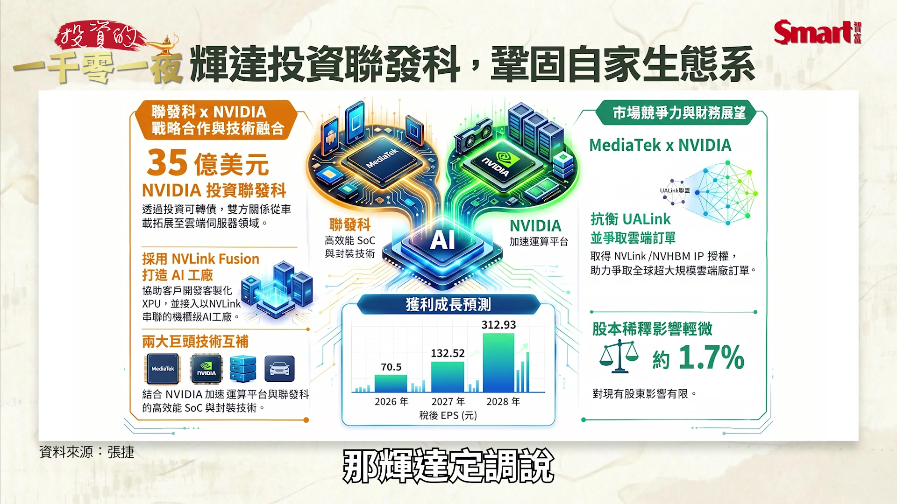

**逐字稿片段：** 那輝達定調說 我這不叫NB 我這叫AI的 小型邊緣運算的工作站 所以輝達可以做最大 它做了中間的工作站 或者是所謂的 我們就講AI NB 大家會覺得說 我原本買AMD跟Intel 現在買輝達 跟聯發科合作的 這個NB的晶片 感覺也是 在AI上面 這一台要16萬 但是大家也是覺得這個 很想要嘗試看看 所以兩個 強強互補 那當然 切入到大家最想知道說 那聯發科如果前無古人 得到了輝達 一千億台幣的挹注 那接下來 它會有多大的成長 那我講

**話題推測：** 輝達AI筆電（小型邊緣運算工作站）產品概念圖

---

## 00:05:40

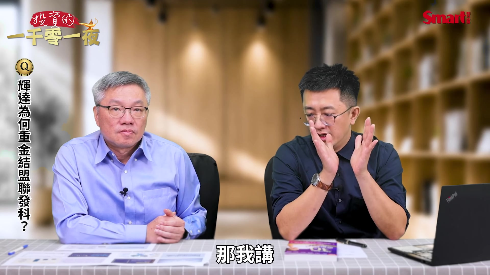

**逐字稿片段：** 聯發科2次法說就好 在今天 這次是第3季 在第1季 跟第2季的時候 聯發科說 它不做財測預估 但是它估

**話題推測：** 聯發科法說會數據摘要或預估

---

## 00:05:50

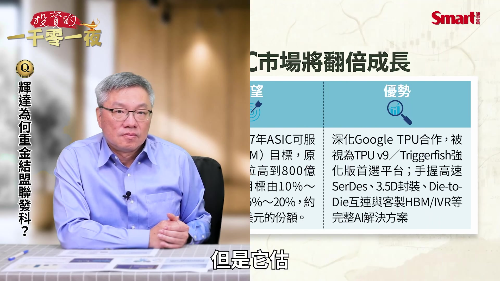

**逐字稿片段：** 未來AI ASIC的市場 原本是400億美金 結果過了3個月 它認為因為 Google一直在加單 然後聽說這個特斯拉 還有這個所謂的微軟 Meta它們也不是吃素的 它們也在AI ASIC上 整個市場上面 一直在下單

**話題推測：** AI ASIC市場原預估400億美金的數字

---

## 00:06:09

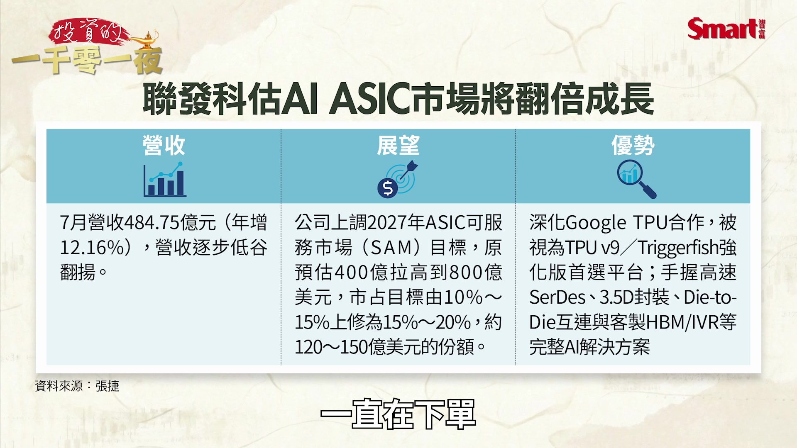

**逐字稿片段：** 那聯發科就預估 明年AI ASIC有800億 所以從400億到800億 這是跳了一倍的市場 所以很多人就說 前陣子聯發科也跌 Marvell也要競爭 說什麼 世芯也要來 Google好像要跟AMD 有跟博通有跟AMD 要跟聯發科 大家就以為Google好像 渣男一樣 到處都要做AI ASIC 那就很擔心 但我跟大家講 這個邏輯 如果用在手機 因為手機就12億支 15億支 那三星好 蘋果好 可能小米有點差 可是AI ASIC 如果是放大一倍 可是你的玩家又只有 高通 博通 Intel 然後AMD 聯發科 這一些 那會變成 整個大家都 非常的好 所以聯發科說 這個800億裡面 它可以占到15%～20%（口誤） 它也很保守 它也沒有說它要多多嘛 我倒有一個15 那市場就用這樣子 來推估聯發科明年 有120億到 150億美金的份額 那這個是從手機以外 另外多出來 所以大家去想

**話題推測：** AI ASIC市場新預估800億美金的數字

---

## 00:07:18

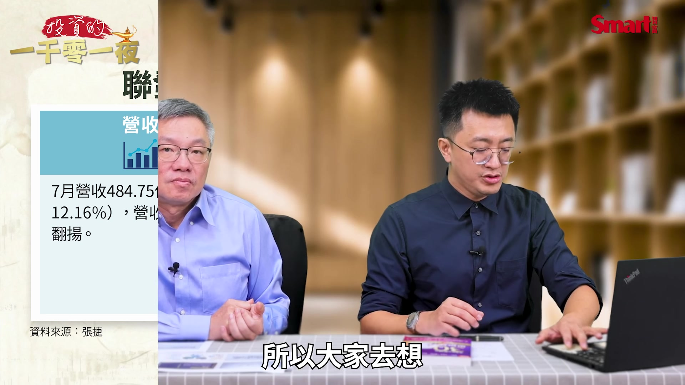

**逐字稿片段：** 為什麼外資把它 今年（EPS）估70元 下修到50 60元 因為手機就賣很爛 第2季也說手機不好 那其實說實話 我最近看最新的數據 因為記憶體太貴 手機漲價漲那麼多 誰要買 然後小米還下修第3季 而且蘋果這麼耐用 那這個峰哥你知道嗎 日本的iPhone 15 16 日本的iPhone 15 16 還漲價 因為大家買二手機 所以這個手機下修 聯發科今年不論 50 60 70 大家都不重要 因為明年有人估到130元 那我給大家看 120億美金 你乘以30就是 或150億美金 大概就是4000多億台幣 這是什麼概念啊 去年聯發科 一整年賣手機 只做了5600億 毛利率還算不錯 可是如果它多了一個 4000多億 等於是手機以外 在手機已經是霸主了 能夠再多一個 150億美金的 AI ASIC 哇這是大補丸 這種 翻倍的成長 其實大家就把焦點關注在 因為其實這一段時間 大家都知道 台股又回到4萬5000點 那大家又最喜歡的 就是龍頭股 很多股票跌下來 台積電不用怕 台達電好像很多人 在奇鋐 健策 川湖 這種高價股 散戶的籌碼少 然後資金又集中 然後又有寡占 聯發科其實就 大概類似這種 所以外資其實就給它 一個很高的評價 是來自於說 明年的一個翻倍的 類似4000 5000億的 這個營收的貢獻 我認為 它還大有可為 大概是這樣 那接下來 我們要追問一下 那除了聯發科之外 除了聯發科跟輝達 這個合作有這個 很好的效益之外 那還有什麼其他相關的 AI族群也會因 這個趨勢而受惠 那我想 因為其實7月 我們在韓國什麼 去泡菜 台灣去韭菜 割泡菜 韓國好像35億爆倉嘛 台灣少了1000億融資 說真的台股真的很強 韓股你看它現在還 離高點還很遠 台股都已經快逼近高點 韓股今年算也漲多 但我來說 今年台股到我們錄影今天 是全世界表現第一名 那也沒辦法 因為我們的GDP 11% 全球第一 新加坡 香港 韓國 美國這些 都不到5個% 中國大陸 所以台股最強 我們是有底氣的 那割完韭菜之後 其實漲回來 有6成的股票 都還跌5成 相信國巨什麼 明年再聚或什麼 來生再聚 那當然我只要隨便講順口溜 我要講的是很多 像聖誕節 國巨1200元 跌到400多元 當然最近表現滿好 回到500多元 600多元 其實是腰斬 可是像南亞科 業績好的 創新高 創意 聯發科 台積電 所以 這一次上來 很多股票都不是主流了 那因為峰哥已經破題 我認為如果聯發科是主流 這一題問得非常好 那聯發科的供應鏈是誰 追本溯源 聯發科的這個100多億美金 它說是Google給它的 TPU嘛 那Google給它的 第八代跟第九代 當然有給博通 也有給聯發科 那我們就來看 那Google的CPU 是給創意 創意表現也不錯

**話題推測：** 聯發科EPS估值變化數據

---

## 00:10:51

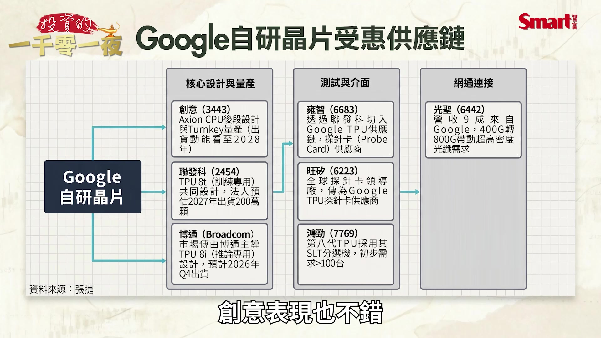

**逐字稿片段：** 這張圖表 其實Google的供應鏈 那你有多的時間 再看CPO 因為光聖也是 Google的供應鏈 你就看左邊 包括聯發科 博通 雍智 鴻勁 口頭再補充一個旺矽 也就是說 如果你認同聯發科 你認同台積電 你會買它的半導體封裝 這是台積電的先進封裝或設備 或蓋廠 你認同聯發科 你認同Google 一直在台積電加單 你認同Gemini好用 那我覺得 你不能放棄創意 甚至雍智跟鴻勁 那因為聯發科 這個晶片 算是它初試啼聲 雖然它在AI布局了10年 它也在這個Google 在美西那邊 吸收了很多人才 那它的這個初試啼聲的晶片 不用說當然是給台積電 當然台積電也算是這個 聯發科也算台積電 前三大客戶

**話題推測：** Google供應鏈圖表（包含聯發科、博通、雍智、鴻勁等）

---

## 00:11:47

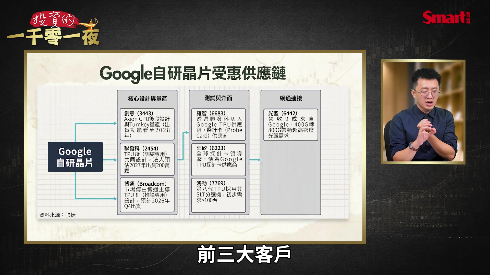

**逐字稿片段：** 雍智跟鴻勁的這個探針卡 這一串 我就認為 這個是不能忽略的 所以如果聯發科 真的那麼好 那幫這個這一組聯發科 它的訂單下去的 其實聽說 我只能說市場傳言

**話題推測：** 雍智與鴻勁探針卡相關介紹

---

## 00:12:05

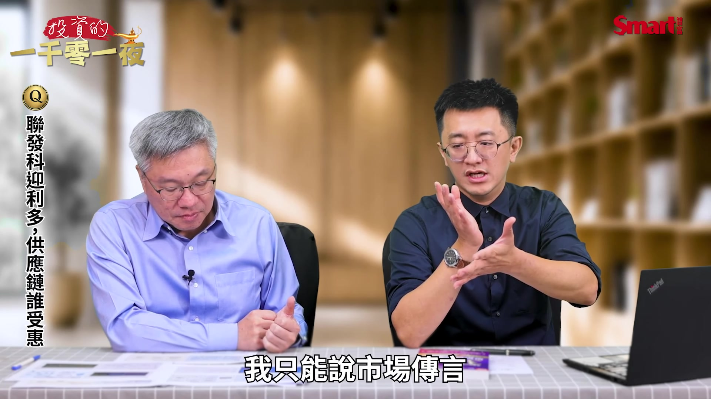

**逐字稿片段：** 有四分之一的探針卡 是給旺矽 那四分之三是給雍智 那雍智因為7月 修正大跌 其實股價也跌很慘 也從這個2000多元 修正到這個甚至1800元左右 那雍智在這邊打底 其實如果你不喜歡 像這種 台積電好像創高 然後聯發科好像漲停 你又不敢追 這種聯發科外溢的 所謂的探針卡的訂單 我自己大膽的預估 其實像是什麼 被動元件 航運 甚至一些塑化 ABF 進入整理的時候 我認為資金會找到 Google相關的供應鏈 那當然創意等一下 也給大家補充 我簡單 先用幾分鐘把這個 雍智把它講完 那雍智早期是在做 所謂的晶圓的這個 後段的老化測試 那這一次它有切到 前端的Probe Card(探針卡) 那因為晶圓愈做愈小 然後例如說3奈米嘛 那同樣一個晶圓上面的 這個電晶體數量很少 那但是又很貴 那這個探針卡 就是 它做一個PCB的Probe Card 那例如說 峰哥借我一隻手 這晶圓 那這個是3000顆 那它這個Probe Card上面 就有3000根針 然後就這樣刺 好 峰哥謝謝 所以刺6次 要測6次才能夠 送給客戶 所以測試的次數增加 3D列印 次數增加 然後這個難度增加 所以整個探針卡 我認為 都是台股裡面能打 幾個特色高價 毛利率高 寡占 那如果又有聯發科 像雍智其實就有 透過聯發科 拿到這個所謂 Google的TPU 那法人是預估明年 其實我認為慢慢的 法人其實之前對雍智 比較不熟悉 聽說已經開始把明年 預估到像聯發科一樣翻倍 那我再講一下創意 這個部分就是說 如果Google這個訂單 有分到聯發科 那其實 它也有一個部分CPU 是給創意 那簡單講 我剛剛講的 訓練到推理嘛 那雲端到終端 就之前在雲端的時候 還是喜歡GPU 那簡單說到終端 峰哥我問一下 自駕車好不好用 說真的我還沒有試驗過 如果自駕車 機器人 跟所謂的無人駕駛 或者是這個 大家想要的邊緣運算 會起來 它不會去買GPU 因為機器人大概裝 2個CPU 它就可以折衣服 那電動車 本來輔助駕駛 裝1顆CPU 現在會2顆或4顆 所以不論是蘇姿丰 或是Intel的這個陳立武 他們都提到 未來CPU跟GPU的比重

**話題推測：** 探針卡市場分配比例（旺矽與雍智）

---

## 00:15:07

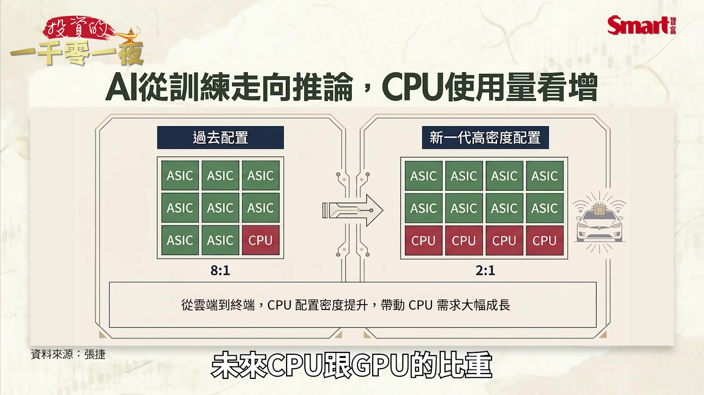

**逐字稿片段：** 以前是8比1 現在是2比1 等於是成長4倍 所以創意不論是 在有Google的CPU 或者是特斯拉的自駕車 這個部分我覺得就是 這個圖 證明了這個 如果你認為產業趨勢 跟Google的ASIC 還有我剛剛講的順口溜 是對的

**話題推測：** CPU與GPU比重變化圖表

---

## 00:15:28

**逐字稿片段：** 這個圖 可以給大家做參考 那接下來我們來聊一下 隊長這本新書 就產業隊長張捷的30個思維練習 那這本書滿 特別的一點 就是過去大概 張捷這邊大家都比較 偏向去技術 技術性的教導 或是基本面的研究 但這一次卻選用一個 說故事來學投資的邏輯 來寫這本書 你當時的想法是什麼 是的 那其實 因為也順便講一下 其實這個峰哥寫序 如果你是峰哥的粉絲 除了按讚分享以外 可以看一下峰哥的序

**話題推測：** 產業趨勢與Google ASIC相關的參考圖

---

## 00:16:01

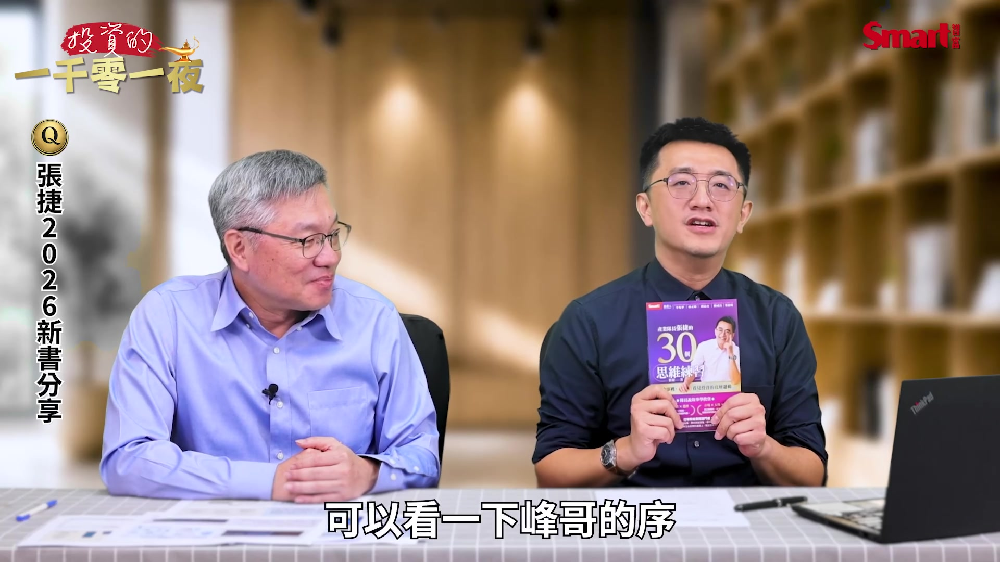

**逐字稿片段：** 那這個也很謝謝 這個Smart跟商周 幫隊長出了4本書 那我之前講的第一個 有點像是怎麼當研究員 那怎麼選產業 那像這個看對主流產業 選飆股 那怎麼樣去做 個股的SOP 那裡面當然有一些技術分析 就是比較偏方法論 可是說實話 因為現在大家資訊爆炸 很多人就覺得比較難 那我後來想到 其實股票其實要克服的 其實不只是有方法 在交易策略 交易心態 還有交易行為都是從人性出發 所以不變的其實是人性的 貪婪跟恐懼 那這個書 其實就是透過30個故事 那從包括你了解自己 甚至是一些故事 跟金句的啟發 其實就可以 讓大家 我很有自信 這本書任何 其中一個故事或金句 絕對有幫助 那像我常常就是舉例 在課堂上 如果你有兩間飲料店 例如說什麼60嵐啊 這個60嵐 這個什麼GU啦 70嵐之類的 你飲料一間生意很好 一間慢慢變不好 除了找原因以外 如果你非要關掉一間飲料店 峰哥你怎麼選擇 如果當下一定要 關掉一間飲料 兩間都賺錢 但一間已經變賠錢 如果是我的話 我是會關 賠錢的那一間 沒有錯 這個標準答案就是 一直在賺錢的那一間 應該要留著 可是如果放到股票市場 股票明明也是你的員工 也是你的店 可是像很多這個粉絲 或是像我自己的親人 我媽媽就會說 這南亞科我賣掉了 套牢的不想賣 賺錢的趕快賣 一賺就賣 而且還賺一點點 她說終於解套 因為她心裡壓力很大 剛賺才突破 我說 媽我應該要加碼 她說不要講那麼多 我套牢很久 一賺就賣 好不容易解套了 一套就抱 我說媽 你買股票 是要跟我一起套牢嗎 我要做停損跟換股 她就罵我 她說你之前換這個也錯 我說媽 我要再換 她說不要 你掠龜走鱉 然後她就抱 然後我換了之後 開始賺回來 她就繼續抱 她說 我屬鴕鳥 就是她一直要讓 賠錢的股票 留留留留留 這個裡面這種故事 你其實就很容易去發想 或者是去感覺到就是說 原來投資有時候 其實只是一個轉念 一個所謂的對風險 或者是對你的決策 上面的一個故事跟思維 所以我認為改變思維 就可以改變你的行為 甚至影響你的習慣 你的績效就會大突出 這是這本書的緣由這樣 那我們就來舉 一個實際的例子 我們剛才講說 剛才這個隊長媽媽就是 看到稍微 突破新高 賺了一點就跑嘛 因為有懼高症嘛 那怎麼樣克服這個懼高症 其實做股票 怎麼樣克服懼高症 有幾個重點 其實還是回到SOP 那例如說 你在賣股票有沒有方法 例如說籌碼 這個大股東在賣 什麼前妻 申讓 法人 當天周轉率超過20% 那20% 例如說我們講某一檔股票 A股票 它有10萬張流通在外 那今天成交量 已經2萬３萬張 不是我們賣的 對 大股東 我們沒有這麼多 沒有這麼多 我們2張 2張而已 或200股 所以第1個你在 周轉率上面的20%到25% 第2個你在所謂的這個 技術線型上的防守點 還有第3 你在心態上 我們剛剛舉過例子 股票可能是你的員工 可能是你的飲料店 所以你寧賣錯 不留錯 這些心法 我覺得你常常把它默念 就可以克服這個所謂的 賺一點就 這個賣 然後一套就抱的這個邏輯 那第2個部分 來講的話 那我來講這3個 所謂的懼高症的 這個強勢股布局法 例如說 你先想好 股票買了 如果拉回 很多人 就是都不想 他就覺得做股票 一定贏 過度自信 對還有 沒有把這個風險先想好 像書裡面 有一個故事就是說 你去出國 一定會買 旅平險 可是你不是買完旅平險 然後上飛機就這樣 掉下來掉下來 不會 你是希望 你安全的 對 所以你這個錢 花掉了 其實你不會心痛 是買一個保險 買一個心安一樣 你在任何做股票之前 如果能夠像 買旅平險一樣 思考會賠怎麼辦 那接下來有3個步驟說 我如果知道 我買股票 會拉回 其實你應該要用 拉回買進的例如說第二個 年終獎金存股法 那我簡單舉 這個例子就是說 我把我自己的年終獎金 拆12個月 那我要存什麼 例如說我就是喜歡 聯發科 可是 我沒辦法 知道它什麼時候是貴 什麼時候是便宜 可是我又覺得 長線上 如果聯發科說什麼 AI ASIC 明年它的這個市占率是 有一個一百多億的份額 那我就分12個月 第一個你心態上 就安全 或者是你其實就已經買了 知道說 跌下來 我好像這12等份 我可以買更多 所以第1個叫拉回買進 跟年終獎金的存股法 一起用 好公司其實 可以遇到倒楣事嘛 例如去年2025年4月9號 或12號 台積電其實展望沒有變 但是因為川普的關稅 它跌到這個 700多元 800多元 790幾元 780幾元 那個時候 如果你還有11等份的錢 所以這個第一個 拉回買分批買 那大家最熟悉的 就是月線 甚至是季線 那再來 分拆成12等份 那甚至是所謂的這個

**話題推測：** 張捷出版過的書籍封面合輯

---

## 00:22:12

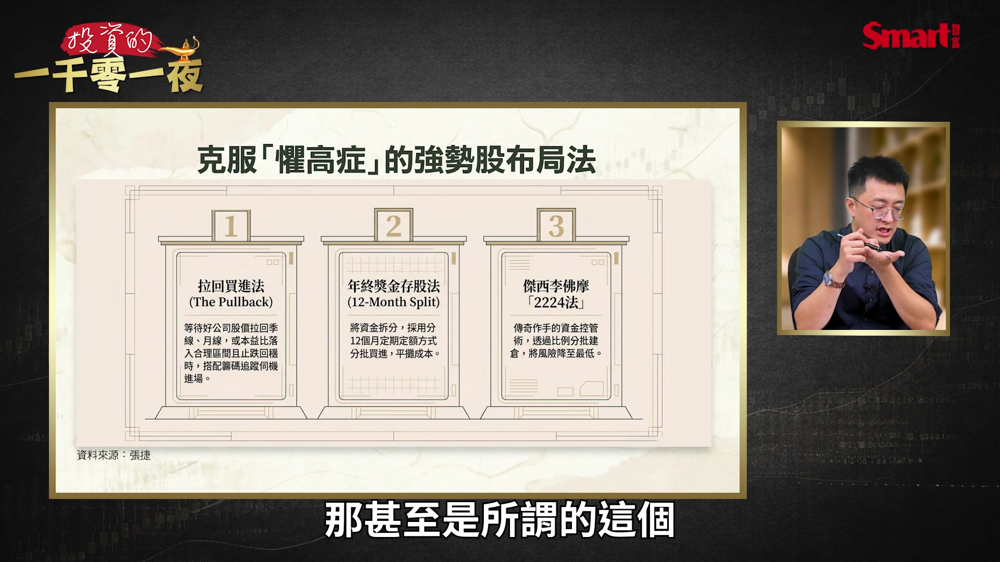

**逐字稿片段：** 傑西李佛摩的2224法 12等份可能 適用於存股 那書裡面還教 另外一個就是說 所謂的這個2224法 就分4次 那細部來講的話 再簡單30秒補充 就是說 你先買2張 我本來我想要買 10張好了 或我想要買 這個1張聯發科 那因為聯發科可能 3000 4000塊嘛 或創意是5000多塊 我把它分成100股 OK好那 這個就是500萬的股票 我就分50萬嘛 那我第1次買 200股 確定它漲了之後回來 但我帳上還是賺錢 我講這個是所謂的 回後買上漲的確定 我賺錢代表是市場認同 你不能說賠錢了之後 你還想要硬要加碼 這是傑西李佛摩用的方法 回來之後 又準備要反彈的時候 我再買第2次的2 所以總共你要買 1張創意的話 你可以分200股 200股200股400股 這幾個簡單的方法 其實書裡面 透過故事 透過一些思維 還有一些方法 其實我覺得都能夠 幫助到滿多的大概是這樣 今天非常謝謝張捷 不但幫我們分析了 從聯發科 跟輝達合作的效應 以及整個聯發科的 後面它的供應鏈 也會因此受惠的 一個狀況 而且也跟我們介紹到 他這本新書 如何改變你的思維 就徹底的能夠 扭轉你的投資績效 今天非常謝謝張捷

**話題推測：** 傑西李佛摩2224分批買進法說明

---
