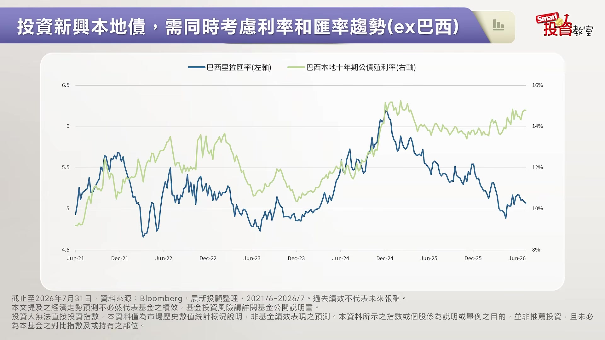

# smartmonthly-bw_opHWowpsGA8 — 關鍵畫面索引

- 來源逐字稿：[smartmonthly-bw_opHWowpsGA8_GT.srt](smartmonthly-bw_opHWowpsGA8_GT.srt)
- 影片：https://www.youtube.com/watch?v=opHWowpsGA8
- 截圖數：13

## 00:00:10

**逐字稿片段：** 投資分兩條路 一種叫做資產增值 另外一種希望可以追求 被動收入 所以說 你喜不喜歡這種就是 不用一直盯盤 可是定期有叮咚叮咚 也就是 現金流進來的投資 像我身邊就有不少朋友 除了投資股票之外 也會配置一些債券 或是債券型的ETF 因為比起追求價差 資產增值 他們更在意的的是 被動收入 還有整個投資組合的 穩定度 可是問題來了 想要用債券幫自己創造 被動收入該怎麼挑

**話題推測：** 介紹投資的兩種路徑：資產增值與被動收入

---

## 00:00:41

**逐字稿片段：** 今天我特別請到的是 展新投顧的創辦人 黃大展 大展哥 來跟我們聊聊這個話題 先跟大家打聲招呼 璇依好 各位Smart投資教室的朋友 大家好 我是大展 祝福看到這集朋友 都可以鴻圖大展 大展鴻圖 有梗有梗有梗 非常謝謝大展哥 那其實大展哥 比較少來Smart投資教室 所以我先幫大家 來介紹一下 其實大展哥 他的這個 在金融圈的資歷 非常非常的豐富

**話題推測：** 介紹本集來賓：展新投顧創辦人黃大展

---

## 00:01:06

**逐字稿片段：** 他過去有待過了 野村投信 還有博瑞投信 累積了很多投資的心得之後 就成立了展新投顧 然後同時 大家可能也 看過他的文章 他在這個網路上的筆名

**話題推測：** 介紹來賓的金融圈資歷（野村投信、博瑞投信、展新投顧）

---

## 00:01:17

**逐字稿片段：** 叫做小老闆 所以他的粉專叫 《小老闆的二三事》 所以大家看完之後 如果覺得意猶未盡的話 都可以到 《小老闆的二三事》 這個粉專來跟他討論 也可以追蹤起來 歡迎大家來找我 大展哥 我剛剛一開始 就破題了 就是有些人會想要透過 配置債券 或是債券ETF 希望可以創造被動收入 但是 因為聊債券真的是 太不性感了 加上老實說可能會喚醒 一些人心中的傷痛 因為還有一群債蛙 也就是過去2023年 2024年買美債ETF的人 可能到現在 都還沒有解套 所以他們對於債券投資 光這四個字就會覺得 很有陰影 今天很需要你 給大家明燈 讓大家重新認識 債券投資的另一種選擇 我想的確是這樣子 那今天我們錄影時間

**話題推測：** 介紹來賓的網路筆名與粉專《小老闆的二三事》

---

## 00:02:02

**逐字稿片段：** 早上的這個FED 做了一個 2023年以來 第一次升息的一個動作 那我想過去幾年 投資美債的朋友們 一定是想說 美債進入一個降息循環 只是殊不知 這個降息循環 走得相當的緩慢 那大家本來預期 想嚐到的甜頭都沒嚐到 反而就是套住的人 大有人在 那反倒現在又回到 升息的循環 那這個時候 我就想給投資朋友 一個建議 那先提供一個數字 那根據彭博的資訊 其實截至今年的7月底 巴西的實質利率是9.6% 美國只有0.25% 如果你只有一筆錢 你拿去買 巴西政府的公債 你的息收是遠遠超過 美國公債的 但是台灣投資人 都是喜歡買美債 主要就會覺得說 美債安全 穩定 不過其實 美債的價格波動 不見得 比新興市場來得小 這幾年我想 大家都已經體驗過了 但確實 因為剛剛大展哥 提的例子是巴西 一般來說巴西我們 有在投資圈比較久的人 就把它定位是在 新興市場 所以你的意思是說 比起美債 你會認為說 也許可以考慮 放在新興市場來領高息 你透過剛剛的比較 讓大家知道了 因為你說現在看起來 美債的波動度 可能不亞於新興市場債 但是新興市場 可以創造的 息收是更高的 但是尷尬的就是 新興市場這四個字 也是很多人聽到就怕 對投資人定位 真的很尷尬 尤其還是被當成配菜 景氣好的時候 確實還不錯 但是稍微有風吹草動 就要跑 你說的沒錯 其實新興市場債 長期都被大家當成是 戰術性的配置 那我想先跟觀眾朋友分享 現在情況已經不一樣 那大家可以看到 這張圖卡 其實這是 從新興市場債市的 一個資金流向 長年都是 流出的情形 但是從2025年已經 由負轉正 而且2025年 流入新興市場 債市的資金 就有309億美元 那今年到5月底為止 又流入了244億美元 一年多的一個時間 總共流入了553億美元 所以錢已經 開始在回流了 只是台灣投資人多半 都還是不知道 所以其實 從這個資金流向 我們就讓投資人明白了 我們很喜歡說 為什麼觀察 全球資金流向 很重要 因為我們會說有一種錢 叫做聰明錢 聰明錢 他們一定就是眼光會比 大家看得更精準 所以現在看得出來 趨勢很明顯 錢開始回流到新興市場 但是重點還是想要問 就是追求報酬的同時 我們必須要 可以承擔風險 承擔波動 所以新興市場的風險 比較高 這句話是對的嗎 我想其實 新興市場的 本身體質 當然的一個變化 是長年都是在 有不同的經濟循環 有不同的狀況 那隨時要依據當時的 經濟情形去做決定 那這個新興市場債市 但是經過整個循環 我還是想先分享一個 比較長期的 因為比較扭轉 大家的一個印象 其實長期而言 新興市場債的報酬 其實不亞於美債

**話題推測：** 提及FED近期升息的動作，可能顯示相關新聞或利率圖表

---

## 00:05:01

**逐字稿片段：** 如果你看這張圖 這個是過去20年來 主要固定收益資產的 報酬表現 如果我們把起始點設為 20年前設為100 那結到今年3月 新興市場公司債 大概是300 這樣數字 就是20年大概3倍 那在複利的效果之下 新興市場強勢貨幣債 大概在293 也是接近300 甚至大家比較陌生 待會會比較多介紹的 新興市場本地債 大概是218 那大家會覺得 最安全的美國公債 反而只有175 甚至全球綜合型的債券是163 那反應在這些數字之下 其實債券市場本身 就有個長期的複利效果 那剛剛提到 這樣子的一個數字 就是新興市場債市 長年期大概就有6到7% 這樣子一個年化報酬率 可是美國公債在這些 升息循環的 一個情況之下 這20年來年化其實只有4% 所以新興市場債券 它是有一定的信用價差 可以有比較高的 利息收入 可以反而去彌補 中間景氣循環 帶來一個波動 所以在這個情況之下 我們覺得 大家對新興市場的印象 其實應該可以去扭轉說 它好像波動比較大 那甚至回到我們看到 比較是基本面的部分 那大家比較少關注

**話題推測：** 提及「這張圖」並比較過去20年主要固定收益資產的報酬表現

---

## 00:06:13

**逐字稿片段：** 我想這張圖卡 就是可以 跟大家去分享一下 是說 其實新興市場 現在的體質 真的已經是不一樣 我們來看看這邊 有四個指標 GDP的成長 財政赤字 經常帳和金融債的餘額 還有債務佔GDP比重 所以可以看到最右邊 新興市場這一組 經濟成長率 大概都在4%左右 這是持續是在擴張的 財政赤字 都還可以控制到3%到4% 甚至債務佔GDP的比率 現在大概在6成 甚至比很多的成熟國家 都還來得低 確實剛剛大展哥也透過 實質的數據 然後我們常講的 甚至會說績效會說話 讓大家已經看到了 首先新興市場基本面 已經改善了 所以整個經濟結構狀況 是更好的 這我想到個譬喻 就是有點像就是說 我們以前印象中那種 比較容易惹麻煩的 叛逆青少年 現在轉大人了 對不對 因為過去新興市場 就是真的是 債借太多 通膨管不住 動不動就失控 然後匯率 也一下就崩了 但看起來 從剛剛 基本面的四大指標觀察 現在 他轉大人成熟了 沒錯 我覺得 是非常好的一個比喻 那其實很多新興國家 其實就成熟了 他們建立了 一個財政規則 也用制度去限制 整個政府能借多少債 能花多少 那央行也從整個在 通膨目標的部分 也非常嚴格的這樣做控管 設定通膨目標之後 再回到整個設定 調整利率 那貨幣政策的獨立性 也強了很多 那還有一個數字 非常有代表性的 就是符合可以進入性 流動性 透明度標準 可以納到整個主要債券 指數的一個新興國家 2003年只有31個 現在已經到67個國家了 所以市場變寬了 也變深了 OK 那現在 投資人好奇的問題 就是 我們剛剛已經從資金面 然後基本面 還有過往的績效面 看得出來確實它的機會 是存在的 但投資人想知道的是 那在新興債市裡面 有這麼多的國家 錢要往哪裡放 OK 那我覺得 可以從實質利率的 角度來看 簡單的講實質利率 就是名目利率 去減掉通膨 就是真正到你口袋裡的 這個報酬 可以想像如果 你今天存在銀行 利率是20% 好像很多 可是 當地的通膨還超過20% 你根本其實還是負報酬 那我們看這張圖 在整個這張圖的 最左邊那個深藍色 是成熟國家 中間綠色這個群組是 新興市場 那右邊紫色 這個相對上 比較發展沒那麼成熟的 邊境市場 那深色的這個柱狀圖 是呈現現在的實質利率 淺色的柱狀圖是呈現 未來12個月的 一個預估值 那我們看看左邊那一群 瑞典 美國 加拿大 英國 日本 實質利率都貼在零附近 甚至日本和紐西蘭 還是負值 然後再看中間 巴西 土耳其 哥倫比亞 墨西哥 南非 甚至最右邊 剛剛說比較邊緣的 這個新興市場 奈及利亞 烏克蘭 烏茲別克 埃及 喬治亞 哈薩克 這些實質利率都明顯 高出一大段 更重要的是 淺色的柱子 就是預估未來12個月 新興市場跟成熟國家 實質利率的差距 還是會持續維持在高檔 所以說 我們用這個實質利率 來看 確實顯現出來 現在相較於成熟國家 新興市場的實質利率 是高的 而且這也是比較誘人的 那如果我們 用數字轉換的話 就講最早最早 我們提到的巴西好了 巴西現在的實質利率 目前是9.61% 那反觀 美國當然就是 沒有那麼高的 那如果說用100萬元 放在巴西的利率環境 簡單來說算個數學題 光是實質利率 它一年理論上 就有將近9萬6元的空間 對 沒錯 投資在當地國家 真的是有 滿高的殖利率可以享受 那我們都不討論 匯率的影響 理論上就是這樣 那當然對全球的 大型資金來講的話 這就像看到一個 房客也越來越穩定的 黃金店面 這就是為什麼說 2025年開始 有資金流入新興債市 我們現在可以理解了 其實就是吸引力 導致資金回流 就是璇依一直提到的 聰明錢 那如果我們想要 進一步選擇 其實新興市場債 分兩種 那其實一開始 大展哥就有提到了 一個可能就是 我們比較 熟悉的 常聽到的 美元計價的 強勢貨幣債 另外一種是 當地貨幣計價的 本地債 又來了 要怎麼選擇 我覺得現在大家可以把 焦點多關注在本地債 雖然說強勢貨幣債 比較是美元為主 但是本地債現在的 投資機會其實也開始 都在上升 因為新興國家的 基本面都轉好 那它的匯率也都有 一定的一個支撐 而且甚至都在升息的 一個趨勢裡面 那我們這邊就用 三個國家來做說明 第一個是巴西

**話題推測：** 提及「這張圖卡」並分析新興市場在GDP成長、財政赤字、債務佔GDP比重等四大基本面指標

---

## 00:10:50

**逐字稿片段：** 那這張圖卡 藍線是巴西幣 對美元的匯率 往下代表升值 然後淺綠線 是巴西本地 10年期公債殖利率的 一個水準 那這張圖我們可以看到 從2024年的12月 巴西幣一度貶到 1美元可以換 6元的巴西幣 那時候大家是 都在說巴西完蛋了 可是到今年7月 大概一年半的時間 可以看到 巴西幣已經升值到 1美元只能換到 5元的巴西幣 其實用數學來換算 這個匯率就已經 升值快2成 那更何況還有 殖利率是14% 所以你又拿殖利率 又拿匯率 這是一個滿高的數字 所以不但是賺到了匯率 那甚至也還是收到了 投資人很滿意的 這樣的債息 那巴西是大家比較 廣為人知 還有沒有其他的國家例子 也可以跟觀眾朋友分享 我想新興市場的國家 真的是很多 那我剛剛舉巴西 可能大家會比較 耳熟能詳 好像就是一個 新興市場的代名詞 那我再舉一個例子

**話題推測：** 提及「這張圖卡」並分析巴西幣對美元匯率與10年期公債殖利率走勢

---

## 00:11:46

**逐字稿片段：** 馬來西亞 我們鄰近亞洲的馬來西亞 其實馬來西亞也算是 新興國家那我想 雖然是新興市場 但是它的財政是 相對的穩定 所以它10年期的一個 公債殖利率只有 3.7%左右 那5年來 它的公債殖利率都在 3%到4.6% 都比美債還來得低 可是 它的整個 馬來西亞貨幣 2024年的4月 最貶到 1美元兌換4.78元的馬來西亞幣 升到今年7月份 已經升到4元 所以 升值大概有17% 那所以很明顯 它就是賺的就是 這個匯差 你看它升值幅度 是有17% 所以不同的新興國家的投資 邏輯原則都是不同的 像馬來西亞 你會覺得說 它的利率水準 你說新興國家 也沒有那麼高 可是這幾年你還是 可以賺到匯差的部分 那既然我們知道 巴西 馬來西亞 那有沒有光譜的 另外一端 就是你講這種 超級極端的 它的殖利率可能 聽起來超級高 但它的匯率波動 可能也很刺激的 那我可以舉個例子 我講奈及利亞 璇依你應該沒去過 但我知道在非洲 就是地圖上有看過 它當地的殖利率 有到17到20% 是真的很高息 奈及利亞貨幣從2024年 貶到最低的 一個數字 到今年7月 這個波段已經回升 大概24% 所以非常明顯 它就是一個殖利率 跟匯率都是高波動的 一個市場 這是不是邊境市場的特性 對不對 所以其實剛剛 大展哥分享了 3個市場 讓大家去理解 那我一路聽下來的 重點就是 這樣的本地貨幣債的 報酬方式其實是 有3塊 第一個當然就是 殖利率本身 也就是所謂的這個 債券的票息 那第二個就是 殖利率下降帶來的 價差 另外還有 匯兌收益 像我可能都已經 有點投資經驗了 我都還是覺得說 天啊太複雜了 而且有一些國家 它地理位置在哪邊 我們都不太確定 然後基本面也很難了解 更不用說去判斷 它的財政狀況 就算現在聽起來很心動 一般人要如何介入 是的 我想這就是要交給專家 只要你懂得把事情 交給有能力的人去做 像今天就是想跟大家 分享一個專家 就是威廉博萊 而且我知道這樣的專家 其實就是我們是操作 算是主動基金對不對 我們其實不是被動的 追蹤指數 而是 這樣的一個專家 他操作叫做主動基金 在經理人 就不會只買進 像剛剛那樣子 奈及利亞 就是高風險高波動的債券 而是會搭配的 因為其實大家 投資債券是想要領息 也希望可以降低 整個投組的波動 所以說 我覺得透過這樣的專家 優點應該就是在 追求收益的同時 也可以來幫大家 降低波動 因此不會犧牲太多的總報酬 可是也想要請大展哥 好好跟大家來介紹一下 這個專家 威廉博萊 它的厲害之處 還有它的背景 這威廉博萊的總部 是在美國的一個芝加哥 那公司從創立到今 大概91年的一個時間 非常久 它的定位很清楚 主要是走的是 精品的一個路線 不是全產品線 那新興市場債 這個領域就是它的強項 那大家要知道說 追蹤全球市場的動態 不僅是需要整宏觀的視野 那具體上還需要 更強大的一個交易平台 以及深入當地市場的 研究能力 那各位想像 一組人 分佈在巴西 菲律賓 南非 跨時區的 盯著這些市場 還有主權債 當地利率 貨幣 企業信用債等 各種領域的一個專家 這不只是 研究能力的問題 還有規模的問題 所以我想 會跟投資人去分享是說 資訊不對稱這件事情 你不用自己扛 這邊有很多 經理人的這個專業 你是可以 有效降低你的風險 那台灣的這個投資人 要透過威廉博萊 來投資新興市場 有什麼樣的工具 你覺得很適合 在這個時間點 投資人可以介入 我們總代理 威廉博萊的一個基金 現在在台灣總共有4檔 那除了一些 股票型基金以外 在新興市場的 債券的部分 我們除了去年引進了 這個以美元計價的 新興市場非投資等級債券基金 那今年就特別

**話題推測：** 介紹第二個國家範例：馬來西亞的債券與匯率表現

---

## 00:15:48

**逐字稿片段：** 想跟大家推薦的就是 威廉博萊新興市場本地貨幣債券基金 所以等於就是 有點像是把這個 新興市場債的產品線 給補齊了 不論是美元計價 或是本地的貨幣計價的 這樣的新興市場基金 其實都有辦法 可以讓大家來參與 本來美元計價那一檔 賺的是債券本身 那這一檔 是再加上當地貨幣 跟當地利率 讓報酬的來源更加完整 而且這檔很特別是說 它不像很多產品 單純是用地區來分配 各國的一個曝險程度 什麼意思 一般我們看債券 不就是用 地區來劃分嗎

**話題推測：** 特別推薦「威廉博萊新興市場本地貨幣債券基金」

---

## 00:16:21

**逐字稿片段：** 請看這張圖 在右邊紫色的部分 是市場上一般的分法 我們照地區分組 也是拉美一組 亞洲一組 歐非中東一組 然後再決定 說我每個區域 要配多少一個投資比 那再看看 拉美那一組裡面 其實有 同時有阿根廷 智利 墨西哥 那阿根廷是什麼體質 它常常在違約 智利又是什麼體質 其實它是 Single A的一個國家 所以 所以阿根廷是容易違約 其實反而是 比較不好的下面的 但是智利 基本上它是優質的債券 是的 所以這兩個國家的 一個體質風險 是天差地遠 如果把它放在 同一個框框裡面 這樣子去做分配 其實就會失真 那同樣是 在歐非中東那一組 你看到南非 波蘭跟烏克蘭 那烏克蘭跟波蘭 又是不一樣的一個風險 所以真的不能 單純用地區來劃分 那威廉博萊他們 劃分的做法是什麼

**話題推測：** 提及「這張圖」並比較市場上一般按地區劃分的債券分類法

---

## 00:17:12

**逐字稿片段：** 這邊就看到 這個圖卡上左邊這 藍色這一塊 就是威廉博萊它 不是用地區法劃分 它是用Beta的屬性 那白話來講就是說 國家對市場的波動 有多敏感 那我們看高Beta的部分 當中就是有阿根廷 烏克蘭 埃及 這些波動大 或剛剛提到的奈及利亞 波動大 但相對機會也大的 那中Beta池放的是巴西 墨西哥 南非 那在低Beta 這個這一組 是放的是智利 波蘭跟菲律賓 體質相對比較穩健 那這樣子的做法的好處 就是第一 它風險預算分配 更有效率 它不會一不小心 就把風險集中在 同樣一個體質的國家 第二 如果做相對價值評估的時候 會可以是同等級的 去做比較 判斷也比較精準 第三 如果市場環境變了 你真的要整個調整 投資組合的Beta的曝險程度 也可以比較快速的做調整 所以確實聽起來 是很聰明的分類方式 而且還兼顧到了就是 投資人 對於這個風險程度 還有整個投資組合的 Beta值的來控制 那配置比例的話 又是多少

**話題推測：** 提及「圖卡上左邊這藍色這一塊」並解釋威廉博萊的Beta屬性分類法

---

## 00:18:19

**逐字稿片段：** 那看這張表 這檔基金 在風險預算的 配置的架構 那在高Beta這個部分 也就是風險最高 最刺激的部分 單一國家的 主動曝險程度 也只能佔 大概0.25%到0.75% 就看整個投資團隊的 研究的一個信心度多高 最多也就是放到1.5% 那反過來看 低波動這個群組 體質比較穩的這部分 標準狀況是 可以看到放到0.75% 到1.5% 在高強度的信心 可以就放到2.5% 這樣子的一個跟 指標上的差距 所以這個主動積極的程度 跟你今天曝險的一個程度 都可以動態去做調整 其實最大優點 就是因為它是一個 主動基金 是由這個經理人 還有整個團隊 會去調配 然後根據 每一個國家的基本面 還有Beta值的狀況 然後以及 剛剛這個限定的 限制範圍之內 讓整個投組的狀態 是可以有機會 創造總報酬 在可控的範圍之內 是的 非常謝謝大展哥 今天的分享 讓我們今天真的知道了 現在新興市場的體質 已經改變了 無論是它的經濟成長 財政紀律 還有整個通膨的管理 都跟過去不一樣了 像璇依剛剛說的 過去的叛逆青少年 現在轉大人了 所以 不但是基本面的改善 實質利率 透過數字圖表 剛剛都發現了 明顯是高於成熟國家的 狀況之下 如果說你 對於這樣的債券投資 或是這樣的 債券主動基金 尤其是在 新興市場的部分 你好奇的話 大家可以多加來留意 新興市場債市的投資機會

**話題推測：** 提及「這張表」並說明威廉博萊基金在風險預算上的配置架構與比例

---
