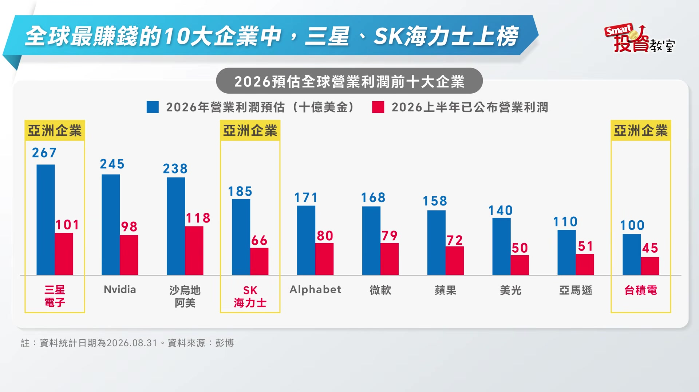
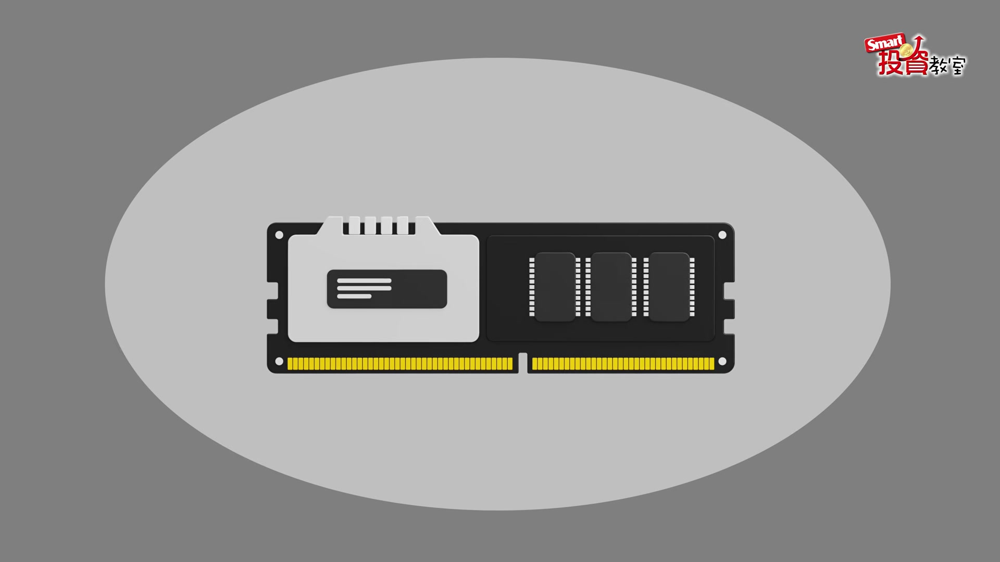
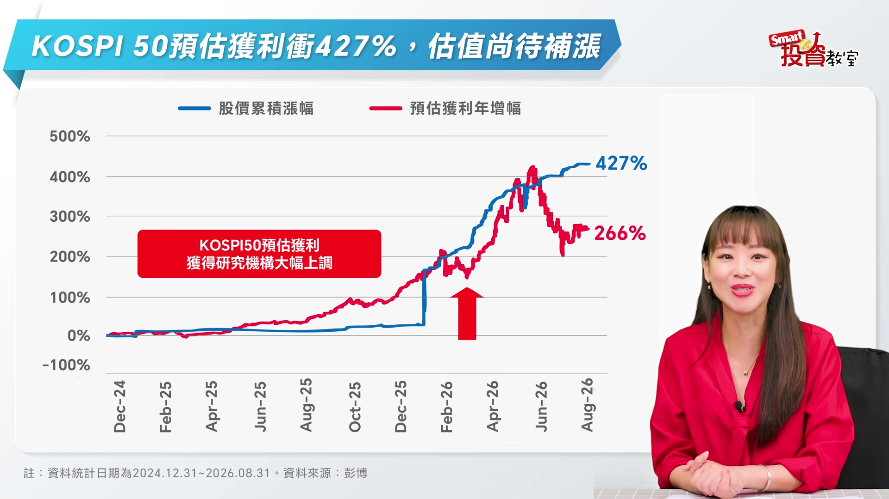

# smartmonthly-bw_pItgJoTM7DA — 關鍵畫面索引

- 來源逐字稿：[smartmonthly-bw_pItgJoTM7DA_FIN.srt](smartmonthly-bw_pItgJoTM7DA_FIN.srt)
- 影片：https://www.youtube.com/watch?v=pItgJoTM7DA
- 截圖數：6

## 00:00:05

**逐字稿片段：** 財政部剛剛公佈了最新的8月進出口統計, 出口延續強勁,年增率高達41%,夠猛了吧? 可是你知道嗎,同樣是靠著出口吃飯的韓國, 8月出口年增率是多少呢? 答案是68.7%。 大家來看一下這張圖,我打賭你看完之後會忍不住哇一聲。 藍色的這個柱子是韓國每個月的出口總額 那條上下起伏的黑線則是出口的年增率 從2000年算起20多年來 這個柱子大多在中間這一帶來回 黑線也是有高有低起起落落 但是如果你把視線移到最右邊 紅框圈住的這一段 柱子則是一根接一根往上疊 直接頂到了20多年來的天花板 那黑線更誇張了 幾乎是直接噴出去 沒錯就是這麼狂 把它推上去的 就是這波AI浪潮 硬生生把韓國的出口動能 拉抬到了前所未見的新高度 出口的動能這麼的旺盛 企業當然是賺寶寶 投資圈的預估 韓國企業在2027年 他們的營業利益會正式站穩 1000兆韓環大關 其中三星電子SK海力士 這兩家的記憶提倡 擠進了全球最會賺錢的

**話題推測：** 介紹台灣8月進出口統計這個新話題

---

## 00:01:31

**逐字稿片段：** 十大企業榜單當中 我們甚至可以說 三星的獲利能力 已經跟輝達是同等級的 大家或許會想問說

**話題推測：** 提及兩家公司躋身全球最會賺錢的十大企業榜單

---

## 00:01:40

**逐字稿片段：** 這個記憶體為什麼這麼搶手 關鍵就在於AI運算的瓶頸 已經從算力轉移到了傳輸 一臺AI伺服器裡面 GPU真正拿來計算的時間 其實只佔了一到三成 剩下大多都是耗在資料的搬運上面 所以卡關的是平寬還有存儲而不是算力 這樣一來 記憶體在裝置裡面的分量就越來越吃重了 一句話總結

**話題推測：** 開始解釋記憶體變得搶手的原因

---

## 00:02:09

**逐字稿片段：** 它已經從配角升級成了AI時代的主角 更重要的是 這波記憶體行情不是曇花一現 因為現在大廠學乖了 改採長期價格協定 接多少的單才會擴多少的產能 不會再重演過去那種殺價競爭 所以記憶體的景氣循環 從過去的兩到三年拉長到了三到五年 那麼實際問到的投資專家也說 記憶體的行情2027年肯定是更好的 2028也差不了太多 獲利能見度都已經拉這麼長了 但是大家看一下這張圖 藍線是COSIP50預估互利年增幅 從2025年以來到今年8月底 預估是427% 可是紅線的股價累積漲幅才266% 藍線一路的往上噴 紅線的漲勢卻是遠遠跟不上 所以說現在的韓股估值 真的是有點委屈了

**話題推測：** 總結記憶體已從AI配角升級為主角

---

## 00:03:13

**逐字稿片段：** 簡單總結一下 韓國的出口動能大增 企業獲利噴發 記憶體的景氣循環又被拉長 基本面可以說是又猛又長 偏偏它的估值到現在 還被市場給低估 一邊是實力很紮實 一邊是評價不高 大家可以很清楚的看到

**話題推測：** 總結韓國經濟基本面強勁的各個論點

---

## 00:03:32

**逐字稿片段：** 投資機會就藏在這個落差裡面 市場資金 接下來會不會大舉的進駐呢 就讓我們拭目以待 Smart投資教室 我們下次見 申告前音響月公開說明書

**話題推測：** 點出投資機會存在於基本面與低估值之間的落差

---
