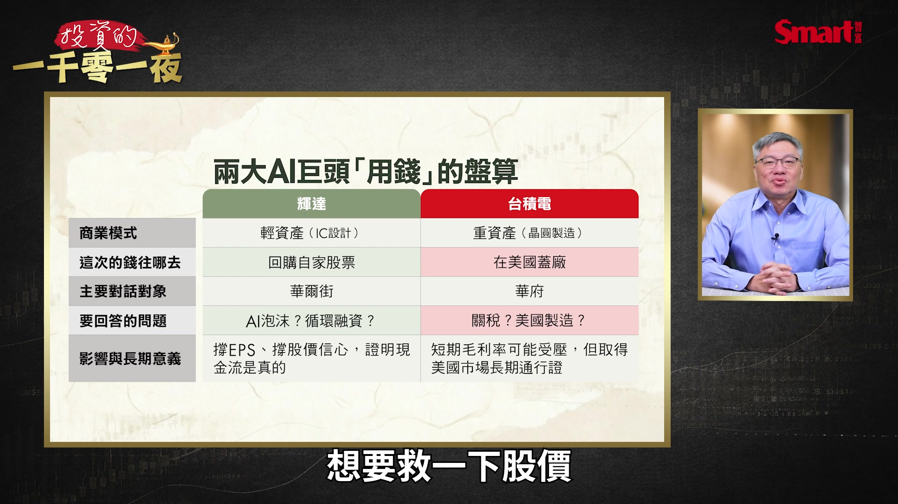
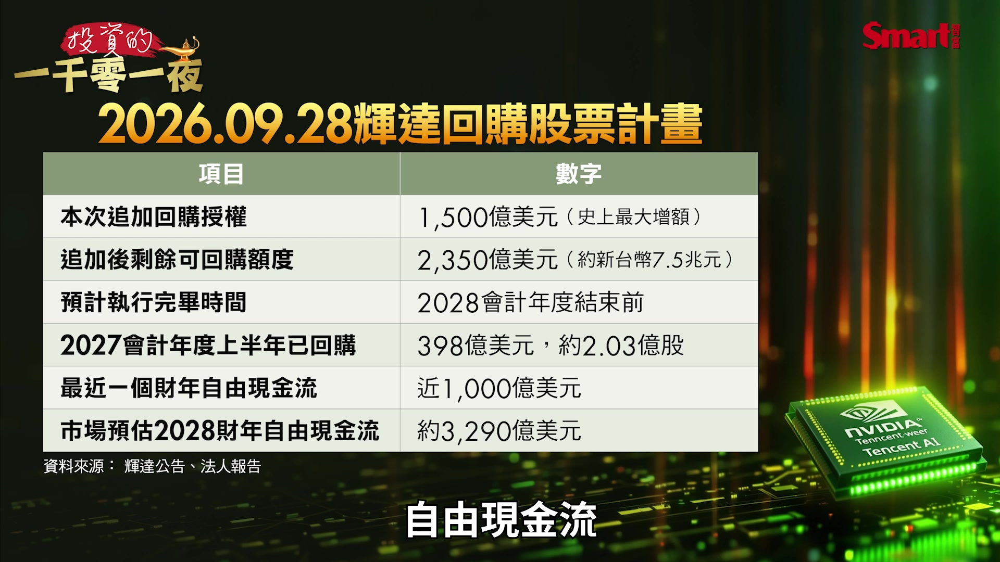
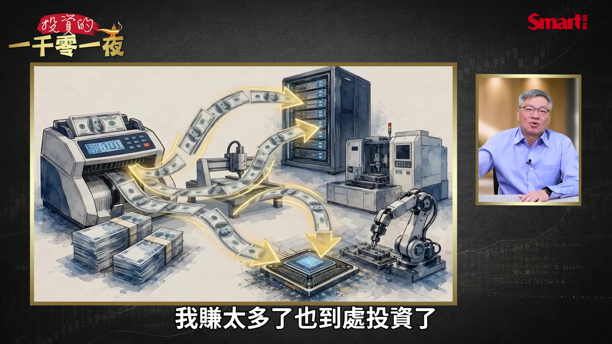
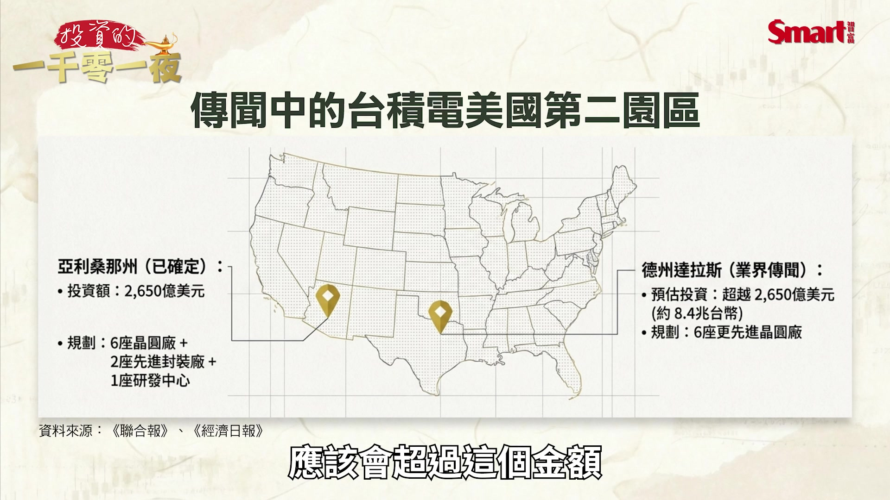
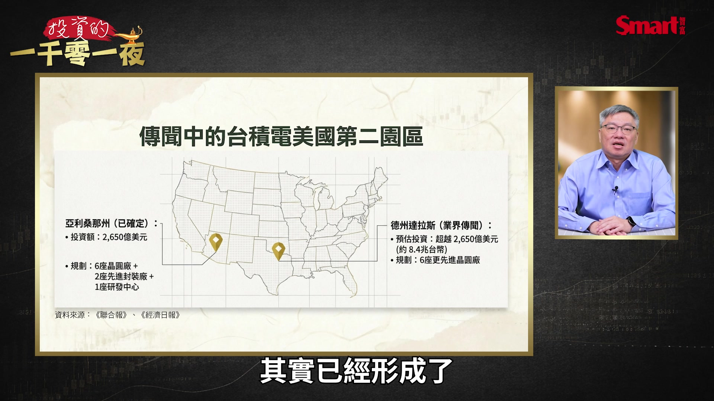
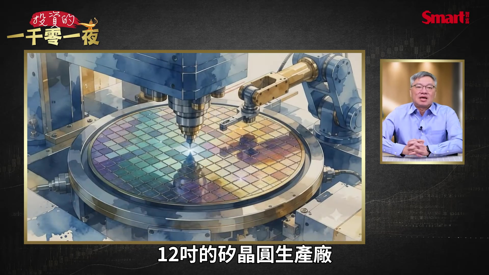
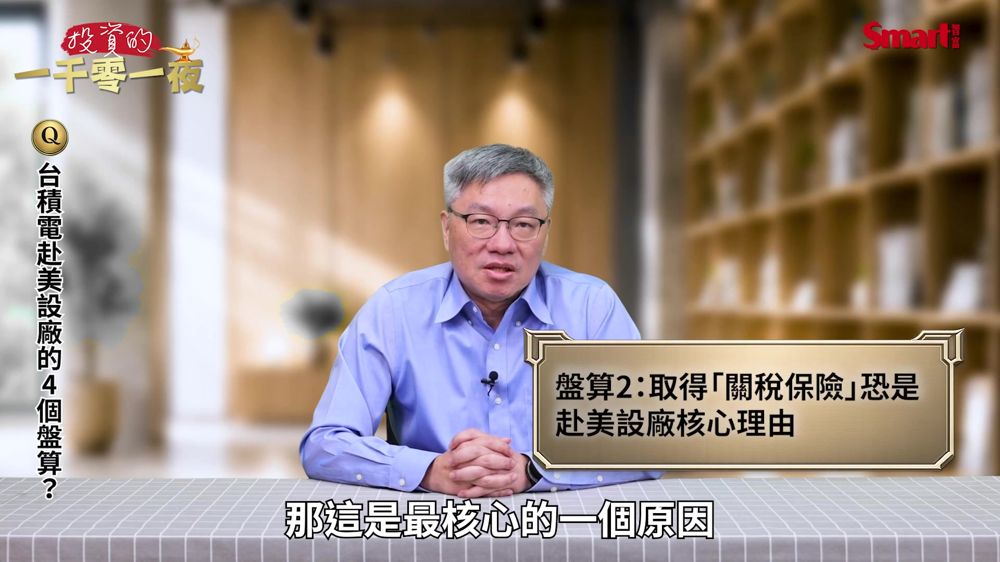
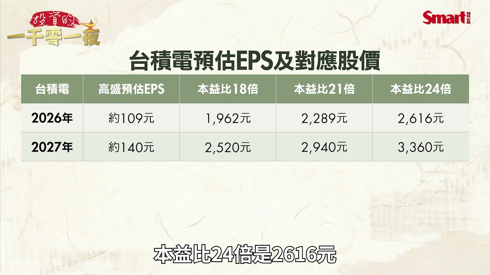
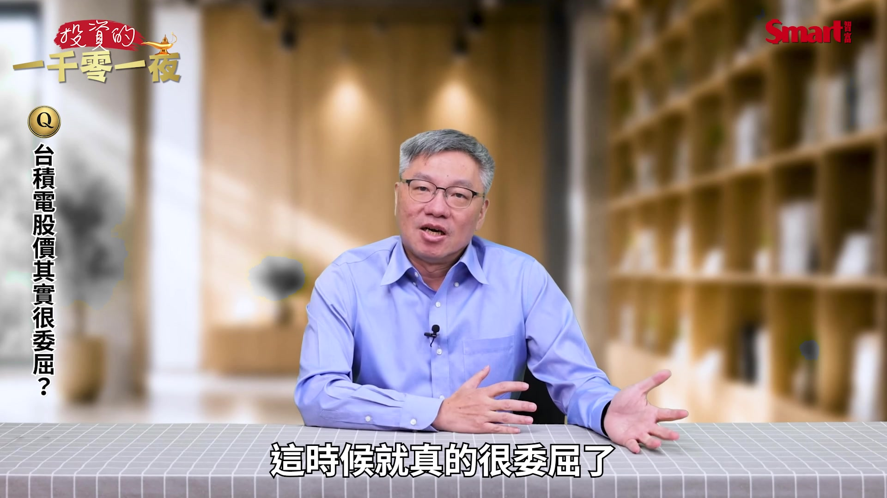
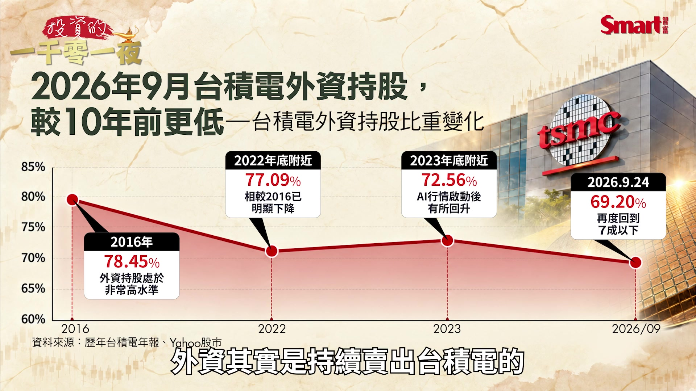

# smartmonthly-bw_ri3QpRmhBCM — 關鍵畫面索引

- 來源逐字稿：[smartmonthly-bw_ri3QpRmhBCM_GT.srt](smartmonthly-bw_ri3QpRmhBCM_GT.srt)
- 影片：https://www.youtube.com/watch?v=ri3QpRmhBCM
- 截圖數：17

## 00:00:18

**逐字稿片段：** 輝達跟台積電 一個是美國最好的晶片公司 一個是台灣最強的晶圓代工 也是全世界最強 但為什麼 它們的股價 最近都漲不太動 它們業績很好 口袋很多錢 那些錢又花到哪裡 這是我們今天這一集 要討論的題目 我們先來看一個很重要的事情 就是9月28號這一天 我們在新聞上 看到有兩個很重要的事 一個是輝達宣布追加了 1500億美元的 回購自家股票的授權 那這是美國企業史上 最大的一次 回購授權的增加的金額 那直接又打破了 蘋果在2024年的 1100億美元的紀錄 那另外一個很重要的消息是 半導體 大家最重要的 關心的台積電說 傳出 這是傳出 說要在美國蓋第2個園區 那第二個園區落腳在 美國的達拉斯 這個呼聲現在是最高 預計是要蓋6座先進晶圓廠 總投資金額甚至估計會超過在 亞利桑那州鳳凰城的 2650億美元 所以這個 換算成新台幣就是一個 8.4兆新台幣的一個大數字 一家公司是把錢拿來買 自己的股票 另外一家是把錢拿去美國 蓋工廠 所以我們今天跟大家拆解是 這兩個決定 它們背後到底在盤算什麼 首先我們把這兩件事情 湊在一起 看似不相關 不過是同一個 AI浪潮的兩種花錢方式 我們來看輝達它是輕資產 錢太多 所以它用回購來回答市場 對AI泡沫 循環融資的質疑 這是過去一段時間以來 大家常常在挑戰的 就是你們是不是靠 自己的錢在循環 另外台積電是重資產 它的錢要花在蓋廠 所以它用德州新廠 這個新投資來回答 川普的關稅威脅 所以一個是跟華爾街講話 跟投資人講話 另外一個是跟華府講話 跟政治勢力講話 對投資人來說輝達的回購股票 是顯示它 口袋還有錢 而且是很多錢的底氣 那這個目標我覺得是 想要救一下股價

**話題推測：** 介紹輝達與台積電兩家公司作為討論主題。

---

## 00:02:43

**逐字稿片段：** 畢竟輝達的本益比 可以說是直直落 所以投資人就不禁發毛 是有什麼我不知道的壞事嗎 不然輝達本益比 為什麼一直往下掉 那台積電的德州廠就比較像是 因應地緣政治風險的保險費 再加碼 這確實有可能會 壓低台積電的毛利率 但換來的是 未來長期在美國市場的通行證 以及可以避開 沒完沒了的關稅威脅 那我們再來看 輝達這1500億美元 回購自家股票 這個金額到底有多大 我們來看1500億美元 這個是史上最大增額 追加後 剩餘可回購額度 因為之前它回購了一次 但這個金額還沒買完 所以兩次加起來 有2350億美元 預計執行完畢的時間 會到2028年的 會計年度結束 那2027年會計年度 事實上就大部分發生在 2026年的日曆年 所以已經執行了大概 398億美元 那最近一個會計年度的 自由現金流

**話題推測：** 討論輝達本益比持續下跌的現象。

---

## 00:03:50

**逐字稿片段：** 輝達有將近1000億美元 很驚人 口袋真的很深 可是市場更預估 它2028年的會計年度的 自由現金流會來到 3290億美元 這是一個更驚人的數字 所以輝達真的很有錢 那我們大家要注意一個細節 就是前面剛才講到 輝達今年就2次 大幅的加碼 回購自家股票 5月18號加碼800億美元 這一次又加碼1500億美元 也就是說5月28號那次 都還沒買完 這次幹嘛又加這麼多 你可以等到買完再加 為什麼要急著又加 所以我們來把

**話題推測：** 提及輝達最近一個會計年度的自由現金流數字。

---

## 00:04:23

**逐字稿片段：** 輝達這幾年的回購授權 都排一下就知道 很驚人 你看2024年的8月 500億美元 2025年的8月 600億美元 2026年的5月 800億美元 到了2026年9月 居然已經來到了 1500億美元 所以這個 幾乎每年都有 而且速度還愈來愈快 我們光看這一次的 1500億美元 這個金額來講 不要講說兩次 增加加起來有多少 光1500億美元 這個金額就大於 大概84%的 S&P 500成分股的 企業的市值 也就是說大概有84%的 這個成分股的市值都沒有高過 1500億美元 所以這個金額之大 你大概就可以想像 那輝達為什麼要這麼做 我覺得至少有3層盤算 第1層真的口袋錢真的太多了 而且它又不需要蓋工廠 因為輝達是IC設計公司 晶圓是靠這個 台積電在蓋廠在燒錢 所以輝達賺來的錢 它不需要大量的投入廠房設備 所以它最近一個會計年度的 自由現金流 就將近1000億美元 那我們剛才前面講到 市場預估2年後還可能變成 3290億美元 這個錢與其放在帳上 不如還給股東 可以刺激一下 低迷的股價

**話題推測：** 展示輝達歷年回購授權的時間與金額。

---

## 00:05:44

**逐字稿片段：** 因為我們來看輝達今年到 9月28號為止 它的股價上漲 大約是22%多左右 可是跟競爭對手 AMD Intel比起來 真的是遜色不少 因為你知道AMD 上漲了183% Intel更是 漲幅來到了214% 所以輝達的22% 看起來就是一個很遜色的表現 那第2層主要是回應 循環融資的質疑 這是我覺得最關鍵的一點 因為在今年7月底的時候 市場就爆出說輝達正在洽談 大概是2500億美元的 融資擔保要協助OpenAI 去承租俄亥俄州的資料中心 那根據彭博統計 輝達今年以來宣布了 類似這樣的交易就超過了 5400億美元 所以市場的疑慮很簡單 就是輝達它把錢 投資給客戶 客戶又拿輝達 投資它們的錢來買輝達晶片 那這個買晶片的需求 是真的需求還是自己養出來的 就是我們所謂的循環的融資 所以雖然黃仁勳9月在 高盛的科技大會上面 正面回應說輝達成長的上限 是來自於供應面的問題 而不是需求面的問題 不過嘴巴說就不如真金白銀 拿出來給大家看 所以1500億美元的 回購就是在告訴市場 如果你認為我的錢 都是左手換右手 那我哪裡來這麼多的錢 可以買回自己的股票 所以這是一個 他一個信念的一個表達 就是他自己 真的很有錢的表達 那第3層就是它可以抵銷 員工股票造成的稀釋 來撐住每股盈餘 因為科技公司每年會發 大量的股票給員工 特別是這幾年 因為績效非常好 所以你就會必須發 更多的股票給員工 所以股數會持續的膨脹 透過回購可以把這些 膨脹的股數買回來 讓每股盈餘 不會被稀釋得太嚴重 那這是一個比較 技術面的理由 可是長期的股東 真的很喜歡你這麼做 我們知道 股東看到公司回購 通常絕大多數都是很正面的 不過我們也來講一下

**話題推測：** 展示輝達今年截至9月28日的股價漲幅。

---

## 00:07:53

**逐字稿片段：** 它的風險 回購固然是好事 代表公司有錢 代表公司對自己的未來有信心 可是我要提醒大家 如果一家還在高速成長的公司 它卻在推動 大規模的回購 某種程度代表它目前 找不到更好的地方去投資 像蘋果在2024年 那一次 它1100億美元的回購 建構在的背景是 手機成長已經大幅放緩 甚至手機都可能有一點 要面臨衰退 那輝達就不一樣 它明明還在高速成長 公司還預估2028年 會計年度的營收 還要再成長約70% 所以這一次就比較像 我賺太多了也到處投資了

**話題推測：** 轉向討論公司股票回購可能帶來的風險。

---

## 00:08:36

**逐字稿片段：** 像台灣的聯發科都得到了好處 得到輝達將近 35億美元的投資 可是就是還有剩錢 不過投資人要記得 回購的授權不一定會買完 就像我們前面講的 它上一次的授權都還沒有買完 所以 它只是一個上限 你真正要追蹤的是 它最後真的買了多少 而這些錢 實際對市場的 產生的刺激的效果 又有多少

**話題推測：** 提及輝達對聯發科的35億美元投資。

---

## 00:09:03

**逐字稿片段：** 接下來我們來看的是台積電 它的德州第2園區 目前還是傳聞 當然我相信大家因為會 繼續追這個消息 而且既然會傳出這個消息 也不可能完全都是 沒有一點根據 不過台積電並沒有 正式的證實這件事情 所以大家還是要先確認 台積電並沒有 正式的講過這句話 但是這個傳聞有它的邏輯 我們可以來看數字 因為以現在來比較 亞利桑那州 2650億美元 那德州傳聞 應該會超過這個金額

**話題推測：** 轉向深入討論台積電在德州建設第二園區的傳聞。

---

## 00:09:37

**逐字稿片段：** 那規畫的內容 前面我們講過 亞利桑那州 6座晶圓廠 2座先進封裝跟1座研發中心 那德州傳聞是6座的 先進晶圓廠 製程當然 後發的會更先進 那為什麼 在德州的達拉斯會有吸引力 那當地稱為叫矽草原 包括德儀 包括三星 包括Coherent 包括特斯拉 其實都已經在那裡設廠了 從半導體 光通訊 國防軍工的聚落 其實已經形成了

**話題推測：** 比較台積電亞利桑那州與德州廠的規劃內容。

---

## 00:10:09

**逐字稿片段：** 那台積電的供應商 環球晶也在達拉斯北邊 謝爾曼市 蓋全美最大的 12吋的矽晶圓生產廠

**話題推測：** 提及台積電供應商環球晶在德州的投資。

---

## 00:10:19

**逐字稿片段：** 那台積電在那邊 生產邏輯上 應該有4個盤算 那第1層主要當然就是 客戶就在美國

**話題推測：** 介紹台積電在德州設廠的四個主要盤算。

---

## 00:10:27

**逐字稿片段：** 因為從2026年的 上半年的統計 台積電的營收大概 有差不多75% 是來自美國客戶 輝達 蘋果 超微 英特爾 全部都要求在美國製造 當然也不是它們 堅持在美國製造 而是美國政府要求它們 提高在美國製造比例 所以它們被迫 一定要在美國製造 那客戶在哪裡 工廠就要跟到哪裡 這是一個鐵律 那過去是因為實在是 在美國生產成本太高了 但現在受到政治壓力 你就幾乎是沒得選了 那第2層就是關稅保險 那這是最核心的一個原因

**話題推測：** 指出台積電營收來自美國客戶的比例。

---

## 00:11:04

**逐字稿片段：** 因為9月9號 川普又在達拉斯的造勢場合上 點名台灣說 台灣晶片要賣到美國 要付100% 要付200% 現在幾乎是關稅課多少呢 就是川普突然想到什麼 他就說什麼 所以到底會不會變成政策 你也不知道 可是那個威脅總是在 但我們要確定的就是說 這個所謂的100% 200% 都不是馬上要實施的政策 目前真的實際會生效的 是今年1月15號 根據232條款 對特定的高效能運算晶片 要加徵25%的關稅 至於第2階段 怎麼擴大呢 現在只是一個說法 並沒有真正的定案 不過這裡面還有一個關鍵機制 就是說根據台美的協議 如果台廠赴美投資 所產生的這個 產能的效益 最高可以得到 2.5倍的免稅配額 所以這個意思就是說 如果你在美國的投資愈多 你實際生產出來的產能愈大 能夠得到 免關稅的進口的配額的額度 就愈大 所以德州第2個園區 它不只是為了要蓋 一個能夠生產的工廠 而是在買一個 關稅保險就是 亞利桑那州買完了 現在在買在德州 因為你也不可能 過度的集中在亞利桑那州 因為亞利桑那州 現在現實的問題 它同樣有水電跟人才的問題 特別是人才的問題 是一個很大的瓶頸

**話題推測：** 提及川普關於對台灣晶片課徵高關稅的言論。

---

## 00:12:32

**逐字稿片段：** 那第3層就是台灣自己的 水電的供給能力 確實也很有限 因為先進製程 確實非常 吃水電的供應 所以你把這個 未來一部分產能 放到美國 也是在分散台灣這邊的 這個供給的壓力 那第4層分散地緣政治風險 就不用特別講 這個現在大家都知道 從美國的政府到美國的客戶 現在也都很擔心 地緣政治風險 愈來愈升高 所以供應鏈不希望 全部集中在台灣生產 所以台積電去 美國蓋廠我們知道 最大的代價就是毛利率 那台積電過去 在法說會上也提過 海外廠會稀釋毛利率 這也大家都知道 全台灣投資人 應該沒有人 不知道這個道理 但是毛利率 下降這件事 畢竟是一個可管控的風險 這個代價 值得付也應該要付得起 因為如果不去而你要面對的 是關稅風險 以及潛在的 地緣政治風險 那這個真的就是很難管控 而且風險 可能變得非常高 而且你如果想想 現在美國如果未來 整個政黨競爭關係 美國兩黨的政府 都競相飆車要求 台積電要提供更多 所以這就變成一個潛在 難以預測的風險 所造成的傷害會遠遠大於 毛利率降幾個百分點的 這個風險 一句話來總結 我們前面講的論點就是輝達 它是用錢來證明 自己不是泡沫 台積電是用錢來證明 自己不會被關稅擋在 美國市場的門外 接下來我們談股價的影響 就做這些事之後 對輝達跟對台積電的股價 影響是什麼 我們先來看輝達 那截至9月28號 輝達股價是 228.86美元 那如果用過去的12個月獲利 來計算也就是所謂的 落後本益比算出來大概是 28.5倍 可是如果你用市場預估的 輝達未來的獲利 去算前瞻本益比 這個數字甚至降到只有 18倍到19倍 如果你把這個數字 放到輝達的股價歷史來看 你會覺得 那真是非常便宜 因為過去在多頭時期的階段 輝達本益比常常可以達到 50倍以上 甚至到70 80倍都有 那一家營收還在高速成長 AI晶片市占率是居於 市場領先地位的公司 前瞻本益比居然不到20倍 這說真的不太像 典型的高成長 科技股的估值 輝達本益比下跌 主要原因 並不是因為股價跌 而是它EPS上升的速度 遠快過股價 但這又很矛盾 因為傳統上 大多數的成長股的股價漲幅 都會強過 EPS的增幅 所以現在這種奇怪現象 就是所謂的本益比壓縮 也就是市場擔心 輝達現在的預估EPS 到底能不能實現 AI產業帳面的獲利 到底是虛幻的還是真實的 這也就刺激輝達這麼做 就之前回購還沒買完 再加碼就是因為知道 現在市場缺的不是帳面EPS 而是信心 它用這一招是希望 買回投資人的信心 所以我覺得這麼做 一定會有激勵股價的成效 但這個效果也沒有達到會讓它 大漲的程度 因為目前市場擔心的並不是 輝達的口袋有多深 而是整個AI鏈的口袋 還有沒有錢 接下來看台積電的股價 我們也用本益比來看台積電 上半年EPS49.32元 這是公司財報 那如果你加上第3 第4季的 這個法人的預估 我們來看一下高盛的預估 2026年的全年 高盛預估大概差不多是 109元的EPS 所以我們如果換算成 本益比18倍是1962元 本益比21倍是2289元 本益比24倍是2616元

**話題推測：** 闡述台積電赴美設廠的第三個原因：台灣水電供給能力有限。

---

## 00:16:44

**逐字稿片段：** 那如果到2027會計年度 高盛預估的EPS來到 140元左右 那本益比18倍是2520元 本益比21倍2940元 本益比24倍就會來到了 3360元 所以如果我們用9月29號 台積電收盤價 2475元來計算大概就是 目前的本益比只有22.7倍 那明年的獲利來算 就真的連18倍都不到 這時候就真的很委屈了

**話題推測：** 引用高盛對台積電2027年EPS的預估。

---

## 00:17:16

**逐字稿片段：** 因為台股指數 已經創新高了 但台積電股價沒創新高 所以股價這麼委屈到底為什麼 我們去找別的原因 因為看起來不是基本面的原因 那是不是籌碼面的原因 所以如果我們去分析籌碼 我們會發現 台積電這段盤整 橫盤 沒辦法創新高的階段 其實外資整體來看 其實是沒有什麼賣超的 就是買買賣賣 但是賣超並不大 反而是內資縮手了 不管是從投信的買賣超 或從融資餘額的變化 你都可以看出來內資追價 台積電現在的意願 沒有過去1年多那麼強 甚至我們可以這麼推論 最近幾年 外資其實是持續賣出台積電的

**話題推測：** 比較台股指數與台積電股價的走勢差異。

---

## 00:18:06

**逐字稿片段：** 因為外資在台積電的持股 最高曾經達到78%以上 那本土資金 反而是持續買進的 目前外資持有台積電 已經降到 70%以下 並且在這裡 開始碰到瓶頸就是 外資賣出的這個水位 本土資金的買盤 沒有像過去那麼大 變慢了 而台積電的市值就太大 就導致股價推不太動 所以我們可以看到 台股的市場上 那些萬金股 甚至5000 6000元 7000 8000元的 股票還在衝 可是台積電就不動如山 所以總結來看 AI這場仗還沒打完 但是已經從比技術到了比口袋 跟比未來布局的階段 所以 短線看資金 長線看發展 即使輝達跟台積電最近的股價 表現平平 可能很多人也滿失望的 不過它們的長期的投資價值 跟長期發展 目前來看還是相當正面 只是說實現這個價值的過程 變慢了 變久了 你需要更有耐心 以上就是今天分享 喜歡我們節目歡迎幫我們 按讚訂閱分享以及開啟小鈴鐺 謝謝大家

**話題推測：** 展示外資持有台積電股權比例的歷史變化。

---
