# smartmonthly-bw_tFVq0jnAq0M — 關鍵畫面索引

- 來源逐字稿：[smartmonthly-bw_tFVq0jnAq0M_GT.srt](smartmonthly-bw_tFVq0jnAq0M_GT.srt)
- 影片：https://www.youtube.com/watch?v=tFVq0jnAq0M
- 截圖數：31

## 00:00:04

**逐字稿片段：** 最近聯準會 就是終於 就是不確定性結束了

**話題推測：** 討論聯準會的最新動作。

---

## 00:00:08

**逐字稿片段：** 那就確定升息一碼

**話題推測：** 公布聯準會升息的具體數字。

---

## 00:00:09

**逐字稿片段：** 那台股呢 因為在不確定性 消失之後 開始往上反彈 那我們現在離前高呢 已經越來越近了 但這個時候 投資人就會非常糾結 因為前高 它到底會不會變成 一個天花板 還是突破之後呢 有可能醞釀 新的一波行情呢 今天呢我們要從 技術分析的角度呢 帶大家來看看說 欸到底接近前高 我們要怎麼做判斷呢 今天我們 邀請到的來賓是 技術分析的專家 王老師 老師好 佑佑好 然後鏡頭前的投資人 大家好

**話題推測：** 轉向討論台股的反應。

---

## 00:00:45

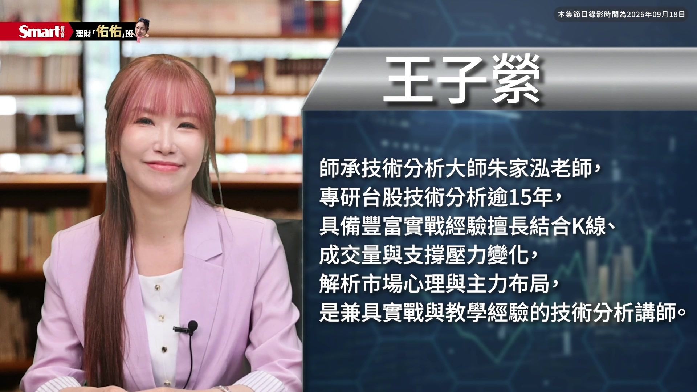

**逐字稿片段：** 老師第一題我要先問你 就是因為我們其實現在 常常會聽到 就是 尤其在技術分析的領域 來說 我們常常會聽到 前高前高這個詞 但是很多人呢 其實他會把前高 當成一個壓力區 那想要先請教老師說 前高它在技術分析裡面 到底代表什麼樣的意義 為什麼市場 走到這個位置的時候 投資人會特別關注呢

**話題推測：** 進入問答環節，提出第一個問題。

---

## 00:01:06

**逐字稿片段：** 前高 在技術分析裡頭很重要 是因為 前高代表就是說 前面有人買股票嘛 套牢在那然後回檔了嘛 所以它就會有一個 漲到那裡他想要賣 叫解套賣壓

**話題推測：** 講者開始解釋技術分析中「前高」的意義。

---

## 00:01:20

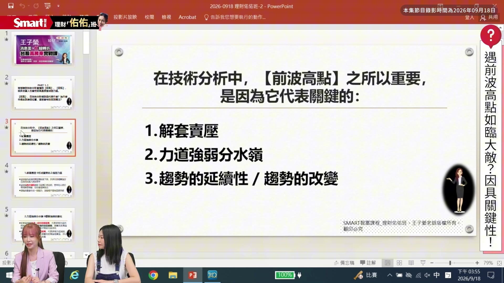

**逐字稿片段：** 再來呢 我們怎麼樣從 回跌的這個位置 漲回去前高 你是一天漲回去 兩天漲回去 還是一個月以後 三個月以後 這個就是力道的強弱 這個時候我們要看它 怎麼漲回去 再怎麼表現 在前高這個附近 還有就是K線在那裡 怎麼反應 所以這個最重要 第二點就是 我們可以看出來 它力道強弱的差別 那再來呢 我們如果說 有的時候 漲到前高的時候 它就下來了 或突破了之後就失敗了 甚至是轉成空頭 所以這個時候 它就沒有辦法 我們繼續從 從事原來趨勢的操作 因為盤整我們不操作 空頭的話又要轉成 空頭的方式的操作 就是你多頭的股票 可能得先獲利了結啊 或者得出場 就不是原來的操作方式 所以至少這三點 是非常關鍵的 老師那我想要問你 因為現在我們看到台股

**話題推測：** 說明從回跌位置漲回前高的力道判斷。

---

## 00:02:11

**逐字稿片段：** 我們今天錄影的時間是 9月18號禮拜五 那聯準會其實公佈好 就是確定升息之後 台股其實開始 出現一些明顯的反彈 那今天禮拜五嘛 台股收盤收在4萬7以上 其實離前高4萬8千多點 已經差1000點左右 那這個百分 百分比例其實不到 大概3%左右吧 不到3% 那已經越來越接近了嘛 老師你怎麼看現在大盤 它到底是 接下來比較有可能 算是遇到壓力 還是說接下來突破之後 有機會再醞釀 新的一波行情呢

**話題推測：** 提供錄影當天的市場日期與狀態。

---

## 00:02:41

**逐字稿片段：** 佑佑這個問題問得很好 因為最近的行情 說實在真的波動很大 發這個訪綱的時候 我們先看到的是這個 上個星期五 星期五是在這個 一號這個位置 二號這個位置呢 是星期四9月10號 其實9月10號那一天 已經跌破五均了 在我們操作轉折波 短波段來說 那個時候 這一短波的轉折 已經正式確立回檔 所以前面的兩個高點 綠色跟紫色的這個部分 確定就是 那個部分的壓力 沒有能夠攻克 所以呢 後來 後來發生什麼

**話題推測：** 老師開始針對大盤走勢進行分析。

---

## 00:03:15

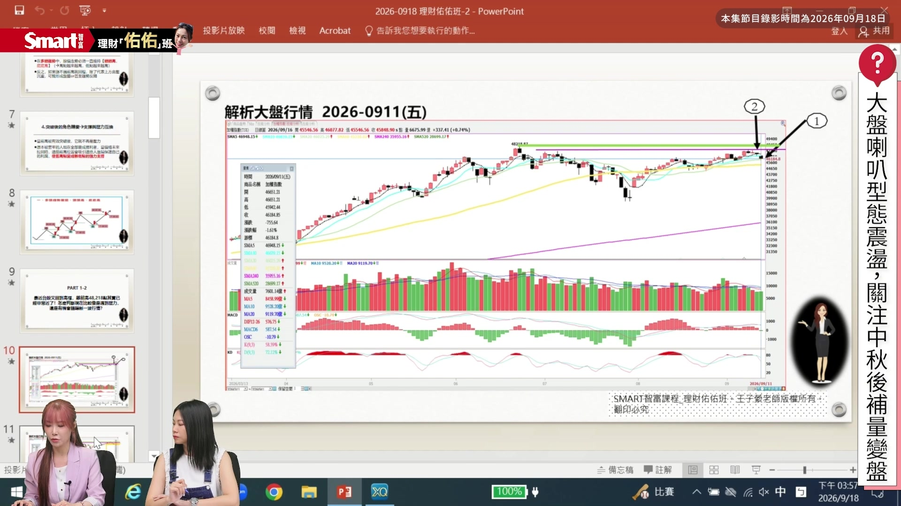

**逐字稿片段：** 後來發生的是 到了星期三 這個星期三的時候 欸結果它居然在 這邊有這個 遇到低檔支撐處 不跌的這個現象 這個低檔支撐處 我們會看一個 有一個爆大量的這一天 在我們八大支撐壓力 裡頭 大量也是 一個支撐的位置 所以這個位置 它沒有跌破 然後呢 還轉還這邊有收紅 似乎有這個 要轉折的現象 但是我們都還 沒有辦法判定 是不是轉折 這是昨天的行情 大盤在盤中 漲了1000多點 然後大家都很興奮 結果收盤的時候 收了好長好長的上影線 所以今天就變成 非常非常的關鍵 為什麼很關鍵呢 因為我們希望所以呢 能夠功課昨天的高點 那這一波的這個漲勢 就會很確立 因為那昨天呢 賣出來的賣壓 其實都被換手換過去了 所以這邊的大盤

**話題推測：** 轉向說明本週三的市場變化。

---

## 00:04:13

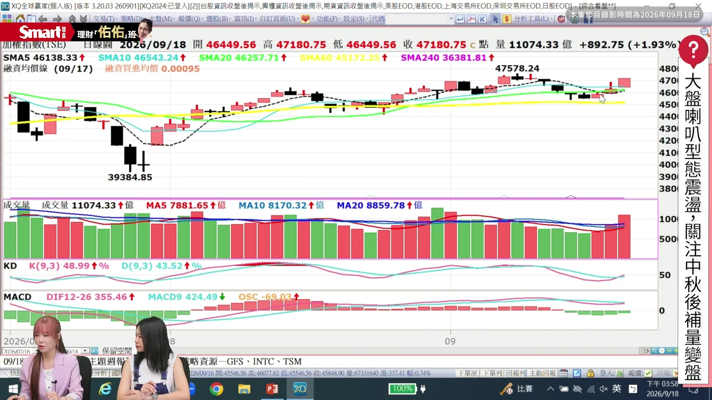

**逐字稿片段：** 下一次我們要注意什麼 一樣還是 要注意 這個高點 跟 這個48218的歷史高點 這兩個高點要注意 那因為下個星期 有長假嘛 我們大概中秋節 也是星期五放假 所以其實一到四 是交易日 那星期四 因為接近長假前 其實量一定會很縮 所以其實下星期 比較有好的成交量 應該都集中在 星期一二三 那這三天的成交量 加上第四天 可能量會更縮的話 其實整週的均量 其實是不太夠的 所以其實走到這裡 我們大概都可以判定說 中秋節後很容易 會有變盤的行情 那這個變盤會有兩種 一種是往上變 一種是往下變 那為什麼會這樣講呢 因為在技術分析 操作裡頭 最重要最重要 我們看的是趨勢 那這裡的趨勢呢 其實是 B進入盤整 要怎麼看盤整呢 因為這裡是 低點破低點 然後這裡是高點過高點 在技術分析裡 這是一個形態 我們叫喇叭形態 所以下次如果 所以我們這邊 正式進入盤整之後 如果量能不足 我們是沒有辦法 功課這個盤整的區間的 所以希望是 中秋節回來之後 量能潮回來 然後能夠往上功課 就會很容易其實 量夠 前高應該都不是個問題 那如果說 更好的走法是怎麼樣 繼續整理 甚至回來再打一個腳 讓它能夠有回後買上漲 這樣子的話 我們會更容易上車 然後這個波段也會走得 會很安穩這樣子 所以不管是往上往下變 其實這一次有很可能 我們都會碰得到 就叫中秋變盤 了解其實目前 老師這樣定調 就是看起來 下禮拜的盤勢呢 因為遇到連假 所以大家投資 會比較縮手 所以下禮拜 基本上可以預期 可能是一個量比較縮 然後有可能 是一個比較盤整的 一個狀況 主要還是要等到 就是中秋節 後面的那一個 應該是 9月底的最後一周 對 沒錯 那一周可能會比較出現 比較大的震盪 那大家可能就要注意說 到底是往上還是往下 所以老師 你怎麼看接下來 比如說中秋節過後 從我們 從技術線型的圖面來看 我們有辦法判斷出

**話題推測：** 提醒投資人接下來需注意的關鍵高點。

---

## 00:06:31

**逐字稿片段：** 中秋節過後 它比較可能 往上或往下的 就是機率 哪一個比較高嗎 應該是說我們現在處於 量縮的情況 那因為這幾天 才剛開始放量 如果說我們以前面 都是量縮的情況 像這邊都在量縮 所以一直不會有行情 對 那這幾天才剛開始放量

**話題推測：** 主持人提出關於「創新高」的下一題。

---

## 00:06:53

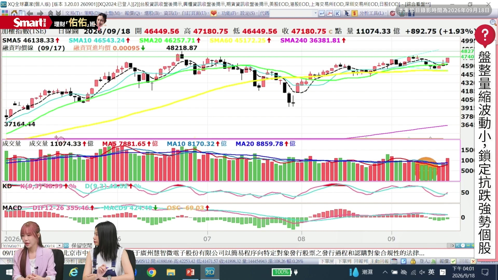

**逐字稿片段：** 可是這個剛開始放量 剛好又碰到週末 那這個週末的期間 我們用週線看 就會很清楚 看得出來 這個週線其實 就看得出來 都是小小的K線 其實小小的K線在 技術分析的理論上 這個就是沒什麼力道 然後大家 如果看週線量能 也看得出來 這整個就是在退潮的 所以一定要有一個 比較明顯的量能潮出來 然後加上比較明確的 K線現象出來 我們才能夠判定 它要繼續往上 還是要往下 因為對於在盤整的 這個結構來說 往上往下都是方向 就是只有在整理裡頭 不是方向 所以我們現在就是要等 有方向出來 也會比較好操作 然後不管是往上往下 都是一種操作 另外在盤整區間裡頭 其實個股是沒有差異的 你還是可以做個股 就像我們前一陣子 大盤在量縮的時候 你看 光學股裡頭 不管是玉金光啦 還是這個聯一光 都長得很兇 那最近像什麼 最近像有一些小型股 這幾天都有 有新的股票我還記得 他們也都是能夠脫離 這個盤整的區間 繼續創新高繼續往上漲 我想各位同學如果去 找一下那個特別報價 其實就看得到 那在盤整區間裡頭 這是很明顯的 就是你只要找到 還在走強勢的股票 那你就繼續操作 強勢的股票 那這時候 就跟大盤的狀況 沒有關係了 了解所以結論應該是說 下禮拜量縮 但到再下個禮拜 中秋節回來之後 就要觀察量能 有沒有進來 希望那個沒抽到 漢測的朋友們 記得趕快把錢投回來 好開玩笑

**話題推測：** 討論目前大盤量能不足的問題。

---

## 00:08:31

**逐字稿片段：** 我們回來下一題 就是老師我接下來想問 假設真的 我們中秋節之後 我們看到量進來了 那市場 有創新高的跡象在 那很多人 會覺得說創新高 樂觀的人就會想說 哇接下來萬里無雲呢 我們是不是 可以馬上進場 老師你會建議 怎麼樣去判斷 創新高這件事情 因為有時候 它可能會是假突破啊

**話題推測：** 主持人回到下一問題，關於創新高。

---

## 00:08:53

**逐字稿片段：** 在技術分析裡頭 應該是說 我們是追強不追高 今天除非我的高點 正好這個新高點 或者前波高點 是形態突破點 盤整突破點 那這個地方就是起漲點 所以同時我追強也追高 但是我們正確的理論 應該是 我是追強不追高 我買強 賣更強 是這樣子 我們因為你操作價差嘛 所以 以創新高來說 我們是不追的 按照這個這個這個解答

**話題推測：** 講者解釋「追強不追高」的原則。

---

## 00:09:26

**逐字稿片段：** 那再來呢 什麼樣的突破 是有價值的 那我們要先想說 什麼樣的突破是假突破 好 因為假突破為什麼叫假 第一個 它一定是在多 所謂的假突破 一定是在多頭發生 那它就是吸引你 希望在高檔的時候 你進去跟他換手 他拿你的錢 你拿他的股票 然後結果後續發展 不如預期 你就被套在那 所以就叫做 主力又多的多頭陷阱 或者是又多 這個就是假突破

**話題推測：** 討論有價值的突破與假突破。

---

## 00:09:57

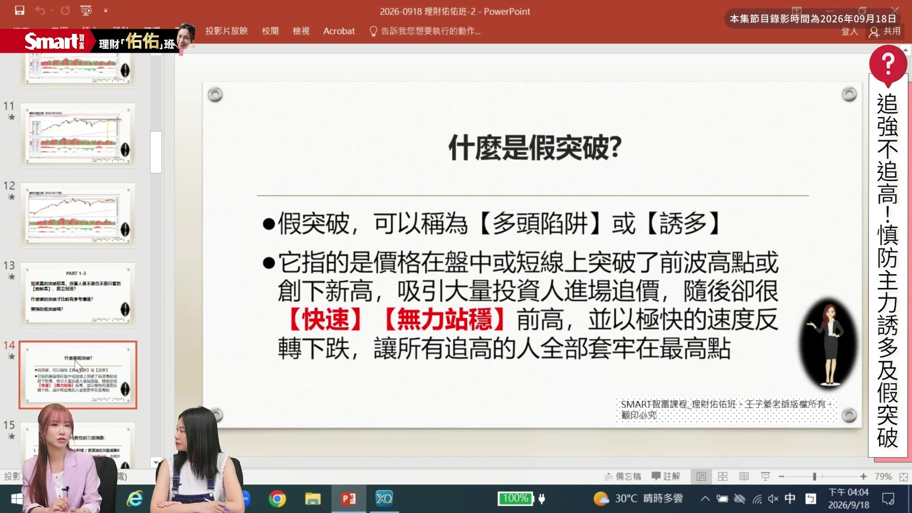

**逐字稿片段：** 所以通常是 我們就會發現 發現它可能會有的 一些什麼現象 它沒有辦法站穩 在它前高的位置 該站在的關鍵位置 然後 它甚至是很快速的 就會回跌 所以呢 還有會發生什麼情況 我們收盤的時候 很容易就會看到這個 長上影線啦 或者是紅K變黑K啊 這紅K變黑K或長上影線 很 用盤中的理解喔 大家去想一下 如果是大家都一直願意 追高的時候 K棒就是紅的 然後下影線很長 絕對不會有上影線 所以上影線很長的時候 就表示什麼 有人不斷的在倒貨給你 然後散戶買的力道 本來就不是 主力買貨的力ado 零零星星買 所以自然買壓很弱 賣壓很強 那它收的上影線 就會很強 甚至最後 會收成實體長黑 那很容易 在假突破的位置 會出現這種 這種K棒的現象

**話題推測：** 說明假突破的常見現象，如無法站穩前高。

---

## 00:10:51

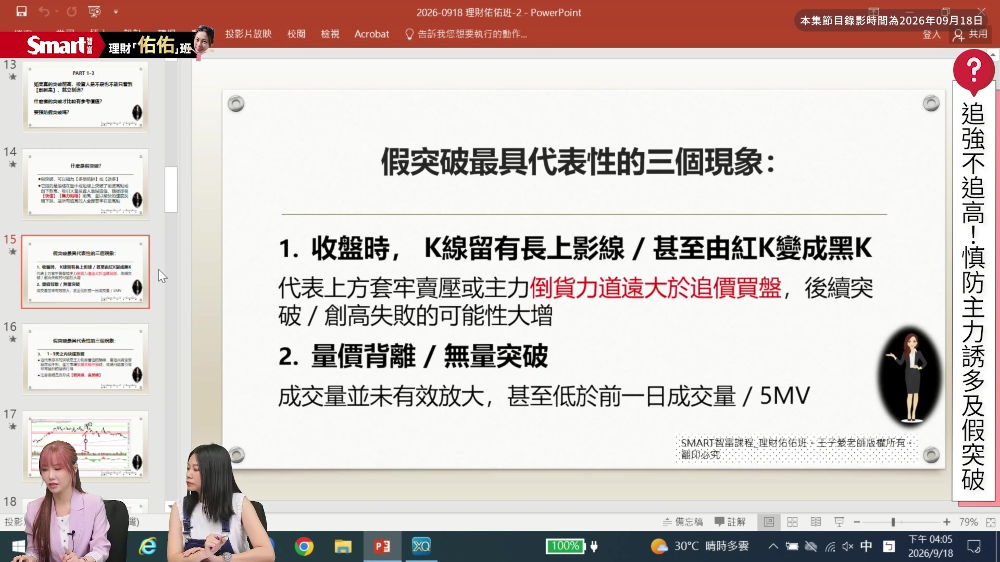

**逐字稿片段：** 再來是什麼 我們剛剛是不是有講到 大盤沒有量的問題 大盤為什麼現在表現 表現還算蠻強 是因為沒有量 它還維持在 相對很高的位置喔 一般來說 我們除非是漲停的突破 那它沒有量 所以呢 如果是不是漲停的突破 沒有帶量的時候 你有沒有想到一件事 是表示什麼 大家不敢追高 那這個位置是表示 有人了解的人 不管是什麽面向 去了解這支個股的人 他就是覺得這個追 追高我的獲利不大了 所以不願意追 如果用白話的理解 這樣子你就可以理解說 為什麼我們需要量放大 因為量就是 願意花錢買的籌碼 那再來呢 另外一個就會 我們為什麼會談到 它需不需要 是很快速 或是在某個時間點內 不能跌破一定要站穩 因為 每一天的K棒 都是要用錢畫出來 成交量就是錢 所以它如果 越多天站得穩 是不是 表示這個結構越扎實 如果它今天漲停 明天跌停 是不是表示 昨天的量就是空的 這樣就很好理解 所以就表示如果 在很快速的一到三天內 這個是理論上 我們就是一到三天內 或實務上也是 一到三天內 非常快速的跌破的話 就表示什麼 昨天買漲停 今天全部的人都砍出來 產生的是什麼 市場集體共識在停損 那這很可怕 所以後面可能甚至 假突破會產生什麼 如果跌破支撐點位 就會變成真的翻轉 所以假突破的時候 我們不只是要 在假突破的位置 要停損它 後續可能你就要看 觀看那個 大支撐的位置 甚至是 你 這個 損失掉的這個部位 其實可以用 後面真翻轉的部位 反手把它賺回來 會賺更大 這樣 嗯 了解 所以其實接下來 在操盤上面 要很注意一件事情是 因為現在大盤 已經越來越接近 新高了嘛 所以如果同學 是做波段的話 你可能就要 慎防 就是如果接下來 它真的有機會創新高 要留意有沒有 假突破的現象

**話題推測：** 連結大盤量能與假突破的關係。

---

## 00:12:49

**逐字稿片段：** 我講幾個圖形 用看的會很清楚 你看一下 我們這個

**話題推測：** 講者開始用個股圖形案例說明假突破。

---

## 00:12:54

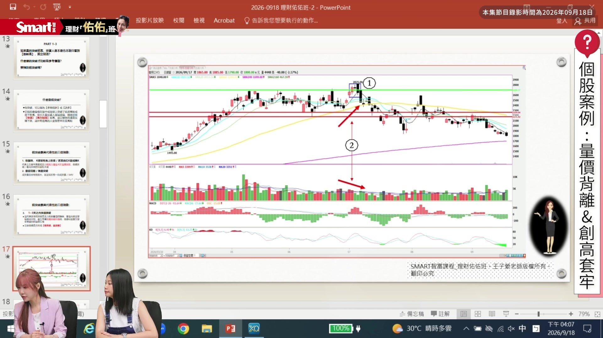

**逐字稿片段：** 第一個圖形是誰 第一個圖形是智邦 這個2345的智邦 因為這個在看這個 這個中間 這個一號的這個位置 這個就是我們K棒的 長紅 變盤線 長黑 這個是一個夜星組合 左邊這一 這個綠色的這個線 代表的就是 這好幾個頭碼 都是這個頭壓的部分 這個頭壓的部分 它它是不是 用一根長紅K 然後但是呢 它卻 那我們剛剛講的 它是不是最好要有量 這個量是縮的 這個二號的位置 表示的是什麼 價漲量縮 所以它是 用量價背離的方式 在突破這裡 然後一到三天內 長黑跌破 這個 跌回這個區間裡 後續它這邊的整理 再跌就容易 變成是大空頭的 這個應該是說 中線的空頭就會跌出來 你看大盤 從六月 七月跌完之後 整個八月翻轉 幾乎都漲回前高 智邦跟大盤的表現 就非常非常的不一樣 這裡的線型 就可以看得到 我們剛剛講的幾個現象 然後看另外一個圖也是 另外一個圖是3450 不過這個的假突破 就是只有短時間的 突破回跌 這個的手的位置 還守得可以 所以後續可以觀察 它只是說因為剛好是 前一陣子 大盤量能不足 所以這支個股的 量能也不足 除非它要再跌破這邊的 這個二號這邊的前低 它可能才會 走勢走得更弱 目前只是 它又回到 這個盤整區間裡了 那大家之前 今年最紅的飆股國巨嘛 國巨就是很 也是很明顯的假突破 它是怎麼突破的 它這個頭型 長得比較特別 這裡這個灰色的線 不知道大家 看不看得清楚 這個灰色的線 這裡是它的轉折波 然後是這樣子跌下來的 那這裡的圖形就是 突破在這個位置之後 假突破之後真下跌 那它的量也是 符合我們剛剛講的 漲到上面的時候 它的量就是一直退 所以其實就是 沒什麼人在追價 它在突破前呢 這個主力還很厲害 就是一直做震盪整理 突然就拉出一根 然後就有人 被吸引到最高點 捨不得賣 最後這個二號 產生的位置 就是集體共識 大家都在停損 或者是長波段 獲利出場的時候 後面就會產生 一大波急跌出來 所以為什麼 又又剛在講的 就是我們在創新高 要追的時候 像這個國巨 這個一號位置 為什麼這麼可怕 你在創新高追的時候 因為這個追的 不是我們多頭 可以進場的起漲點 你這個追的叫追創高 而不是追起漲 追強 那後續你又不懂得 停損的時候 一旦趨勢反轉的時候 就會非常可怕 嗯 我覺得大家 老師剛剛講一句話 我覺得很好 可以當作金句 就是我們記得 看到創新高的時候 不要太興奮 你要記得是追強不追高 一定要去判斷 它的標準有沒有符合 才做進場

**話題推測：** 舉例說明智邦(2345)的假突破案例。

---

## 00:15:37

**逐字稿片段：** 好 那我們講完 就是從技術面的角度 但我還是想問老師 因為其實現在 我們每天 其實大家手機啊 或新聞會看到 超多的訊息 有時候我們看到 那個訊息進來的時候 你會發現 你會預想說 這個好消息 應該股價會漲吧 或是壞消息 股價應該會跌吧 但我們常常 在現在的這個階段 會看到 利多不漲或是利空不跌 老師你怎麼判斷 或是投資人 要怎麼解讀這個消息面 呃利 我們我們看到 這個消息出來的時候 為什麼要考慮一下 這個消息出來的時間 因為我們的股價 反應的一定是未來 它反應的不是現在 也不是過去 那消息公布的前的時候 我們是因為預期 而上漲嘛 所以消息出來的時候 我們就要去觀察 這個出來之後 實質上市場 是怎麼判斷的 就像這次的聯準會升息

**話題推測：** 主持人切換到下一個話題：消息面影響。

---

## 00:16:31

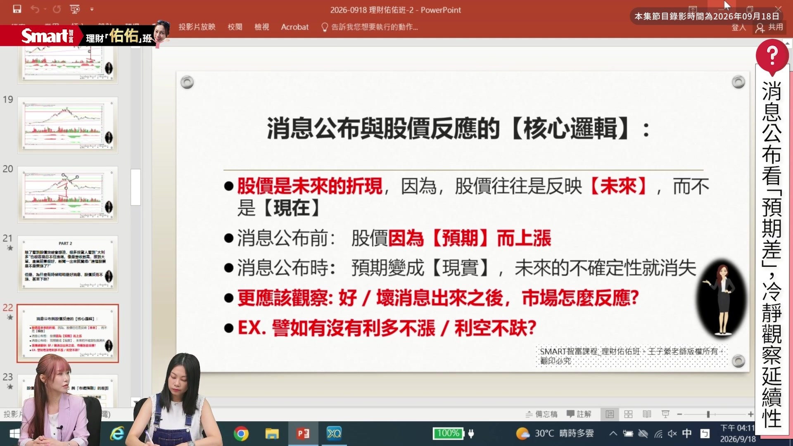

**逐字稿片段：** 就大家都說 會不會是利空出盡 可是昨天 因為漲了1000點 盤中大殺 拉一直殺下來的時候 大家就想 啊是不是 這個利空還沒出盡 然後 事實上這個消息出來 其實是可以 沉澱觀察個一到三天 就會看得出來 真正的好壞消息 出來的時候 有沒有所謂的利多不漲 跟利空不跌 它在時序上 應該是要這個樣子 就是說我們 因為買進的時候 其實在消息公布前 通常散戶是不會買進的 那如果從技術線型上 其實是看得出來 有人已經開始買進 所以它等到 你消息公布的時候 或者甚至是 報紙出來的時候 或者是我們 在手機的App上 軟體上看到 跳出來 哪一條重要消息的時候 你才會跳進去買的時候 那就是變成 我的預期的想法 變成現實的時候 不確定性下降的時候 這時候是考驗 你的想法跟市場的想法 有沒有產生共識 因為一旦你的想法 跟市場上的想法 沒有共識的時候 那個你的 獲利就會變成是 主力的獲利 你的口袋 就會變成是損失

**話題推測：** 以聯準會升息為例說明消息面影響。

---

## 00:17:41

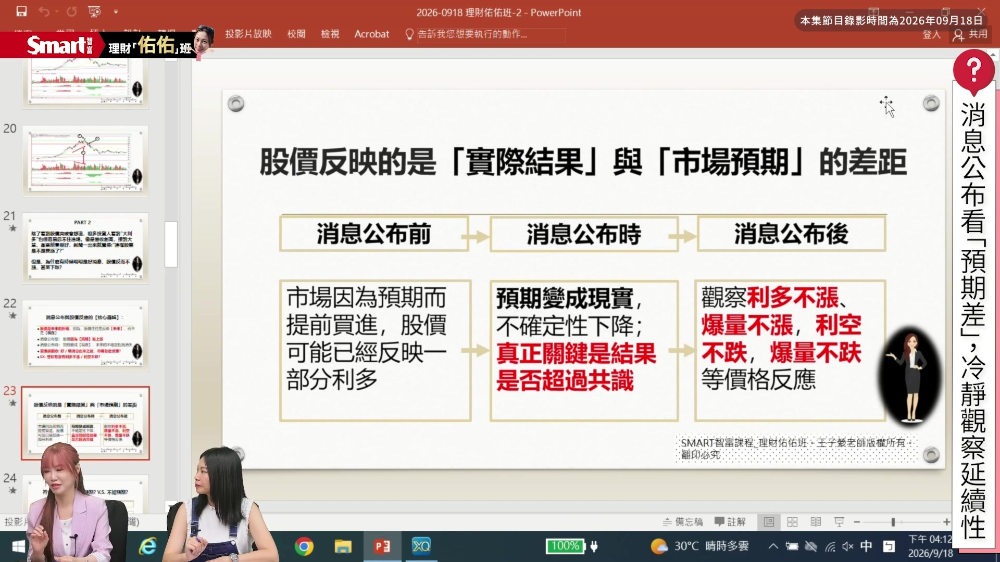

**逐字稿片段：** 所以消息公布後 最重要就是觀察四件事 利多不漲 爆量不漲 利空不跌 爆量不跌 因為尤其是我們 還要再搭配位階 那些現象的時候 你就可以 很明顯的分得出來 我的價格反應 加上我的趨勢走向 最後才是 這四種狀況的答案 其實簡單來說它就是 市場它其實 應該不是 在交易那個消息 發 出來的當下 而是在交易那個預期差 可以這麼說 就是消息出來之後 交易的是 那個預期差的部分 預期時間差的獲利 很多人其實 看到好消息出來之後 會覺得很興奮 但還有另外一件事情 也會覺得很興奮

**話題推測：** 總結消息公布後應觀察的四個重點。

---

## 00:18:18

**逐字稿片段：** 就是爆量 其實這個老師前面 有講了一些觀念 但我還是想要 特別針對這個問題 再請老師 幫我們解析一下說 因為有時候 我們看到爆量的時候 大家可能 第一個反應是說 是不是大戶要進場了 但其實 老師剛前面有聊到嘛 其實有些人是趁機出貨 但但到底 我們看到 爆量大漲的時候 我們要怎麼去判斷說 這是接下來要往上漲 還是要往下呢 還是有可能會往下 這個 量本身 其實是一個中性的觀念 就是因為我 我們只知道 當天有多少人在換手了 譬如說 一兆的大盤成交量 就是有一兆的資金額 在做換手 你今天沒有辦法判定 因為你不是控制 這一支股票的 背後黑手嘛 所以你不會知道 你只會知道就是說 你的錢換籌碼 或你的籌碼 換成錢這樣子 所以它本身 是一個中性的訊號

**話題推測：** 主持人切換到下一個話題：爆量判斷。

---

## 00:19:16

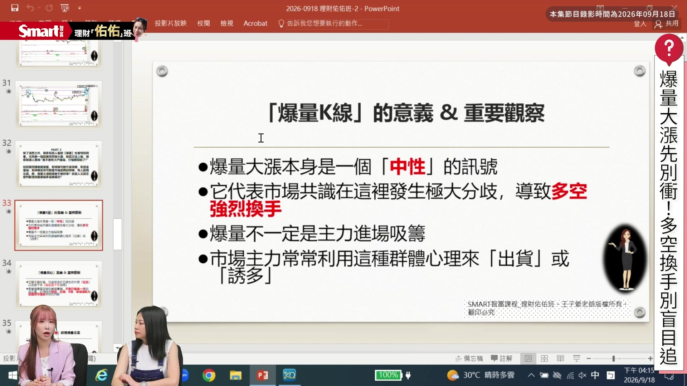

**逐字稿片段：** 那要 那所謂的爆量 就表示是什麼 量越大就表示 這裡出來的分歧 意義越大 因為表示有人想賣 有人想買 那麼大的量要賣 所以跟你的想法 是不是不一樣 所以表示多空在那裡 一定是強烈換手 那爆量要注意的是說 我不一定是 有的人很興奮覺得說 啊這個 長紅K爆量 可能是主力進場吸籌碼 不一定 因為有的時候 我們在多頭 走到高檔的時候 他在出新聞啊 出消息 很可能就會用來 是用來出貨啊 用來誘多 產生剛剛假突破的 這些現象 那你要怎麼去 判定這些爆量長紅K 它是不是好事 還是是什麼狀況 最重要最重要其實是 它發生在什麼位置 那因為我們會希望 它最好的位置 是發生在低檔 絕對不是 它可能在低檔 也有可能是在 中段整理的時候 但是如果在高檔 一定不是好事 對不對 就像我們現在會知道 就是說 哦 那個 可能1000塊的台積電 是便宜 3000塊很多人不願意追 這是一樣的道理 那所以位置在 爆量的紅K上 這個我們必須要先去 思考出來 它的位置是在什麼地方 那再來就是說爆量裡頭 我們還要搭配就是說 這個趨勢 長到哪裡了 股價的位階到哪裡了 K線是怎麼表現 像我們剛剛看到 這個高檔 有的時候你高檔爆量 不見得是出現是紅K 就我們剛剛講 有可能就是 這個散戶買力不足 就一路從最高點 殺到最低點 的這個黑K 常常在那種一日的消息 見光死的這種型態 都會看得到這種 那所以還有要搭配什麼 我們剛剛講到的 很多的情況其實 投資人都太興奮 當下想追 其實如果你 緩個一到三天的時候 你就可以看得出來 很重要的 後續續航力 後續的續航力 我們就可以看得出來 它的價量防守的位置 防守的好不好 防守的強不強弱不弱 可以 我們就可以知道 我們這一個股票 它以後的走勢 會長什麼樣子 像是我們 在這個股價位階裡頭 大概這六個位階 譬如說我們 是低檔的爆量 低檔爆量有分喔 爆量還是爆天量 等一下我們例子上 可以看到 什麼叫做 台積電低檔爆天量 那你就會看 我怎麼沒有 在那裡買那麼多 聽起來 我根本就不要 不要不要說什麼 分分 這個叫做定期定額 分批都不需要 那個你會很難得見到 低檔的這個現象 然後低檔的爆量 低檔爆天量 還有低檔的首度爆量 這個大部分都是 指的是剛打底完 那高檔我們 會容易看到是 高檔連續放量 高檔連續爆量 那還有高檔裡頭 還會也會 產生爆量或爆天量 意義都不一樣 還有一個 就是我們前面講到的 你今天是 突破前高的爆量 突破盤整的爆量 還是最後 這個最可怕 常常在這個消息 見光死的時候 開高走低的爆量 這個最可怕 我們來看一下 我們剛剛講的 我們台股的權王 現在有沒有覺得 這兩個位置看得出來嗎 是不是低檔爆大量 好吸引人啊 我直接用現在線圖 弄給你們看 那個位置在哪裡 那個大家一定想說 怎麼會有這麼前面 沒有很前面 覺得很久嗎 750 時間點是2025 只不過一年半前 對 現在多少錢 2000多 對 現在的2000多 快3000的價位嘛 對不對 所以這兩根 夠不夠低檔夠大量 超級 那個量超大 對 因為這個是 我們把它縮很小很小 我們都 不看其他東西的時候 只看量的時候 你就會看得到 這就是 因為尤其它是權王 它更不容易 產生這種現象 對 因為這就兩兩 兩大個人在接貨 然後漲到現在 哦 感覺以後 台積電爆量的時候 我就要先解定存 所以不是像佑佑講的說 啊 我的中長線或長線 好像不太需要 用到技術分析 我們希望這次的課程 要打破大家的迷思 不是消息面只能做短線 或極短價差 我們希望 我們這次可能是 這個系列的第一堂課 希望是先讓大家 能夠存到長線的 但是當然是 也要搭配大盤的位階啦 我們等一下再講一個 再講一些其他的圖 大家可能會更有興趣 來看一下 這個股票是旺宏 這是旺宏長在哪裡 中間有沒有看到一個 老師這邊畫了 一個黃色箭頭的地方 是爆大量吧 那根黑色的量夠大嗎 對 所以我們有的時候 說爆大量 不見得黑不見得紅 不見得黑不好 也不見得紅是好的 最重要我們講過 趨勢跟位置 這個位置你怎麼判定 是不是隔了幾天之後 發現它突破了 然後你看一下 旺宏的這個位置 我們叫做 中段的換手的這個位置 就在這裡 然後如果說以 我們以時間軸來看的話 這個價位 應該才五六十塊我記得 因為 我我會特別去觀察 這些位置 看一下給大家看一下 大概就在這個位置 在這個區間 對 我沒有用 我沒有用小標畫 比較不精準 大概這個位置 這個位置就算是60喔 你在 有的人很多人說 老師老師 我從這個二三十 已經漲到五六十了 漲很高欸 這個股票還能買嗎 來看一下答案 這個股票能不能買 漲到快200吧 對不對 五六十到192 這個就是 我們趨勢跟位階 都搭好的時候 在相對的正確位置 或低檔位置 爆量的時候 換手成功 後面一定是搭行情 我們剛剛講的是說 這個爆量如果用在 因為現在大盤 可能會往上突破 或者是看 是還是往下回檔 都是一個 要等待變盤的時候 等待變盤的時候 大盤一旦有變盤的時候 相對帶來的量 在個股上也會 個股會有量 所以個股 就會有比較大的行情 所以這時候你就要觀察 你手上的股票 是走到高檔 還是 其實是有股票 是現在低檔剛突破的 那這時候你也可以用 低檔剛突破的這個概念 去找這些 相對的量的位置 看有沒有換手成功 然後去觀察 你就可以再切進去賺 這是賺 它多頭的這一波 但如果說你的股票相對 已經走了一大波 在高檔的時候 那你就要注意

**話題推測：** 解釋爆量的意義與多空分歧。

---

## 00:25:22

**逐字稿片段：** 像這個 我們現在看到這個圖喔 這個一號的位置 跟三號的位置都是 一個三號是低檔大量 這樣很明顯吧 然後一號的這個位置 是不是等於是 高檔的大量 非常明顯 然後這個高檔到量 之後呢 漲停之後還收長黑 然後 還收成什麼 我們趨勢上 講的不是多頭趨勢 它已經變成什麼 頭頭低 已經進入盤整 所以這個時候 這一整波波段 你就要小心 它是不是要結束 這個就是華新科 所以它跟 國巨頭型的走法 不太一樣 但事實上 他們兩個也是做出來 就是有頭型的方式 只是剛剛我們看的國巨 是用 假突破的方式 但是它是量價背離 那華新科不是 它是做出小M頭的方式 然後但是它 是用爆量的方式出貨 所以一樣就是 我們剛剛講到的觀念 今天你是高檔低檔 還是說 它的這個量 出在什麼位置 你都要特別去注意 那這個也是 這一支股票 也是之前很紅的股票 光學類之前前一陣子都 陸續譬如說大立光啊 玉晶光啊 最強是聯一光嘛

**話題推測：** 舉例說明華新科的高檔爆量出貨。

---

## 00:26:26

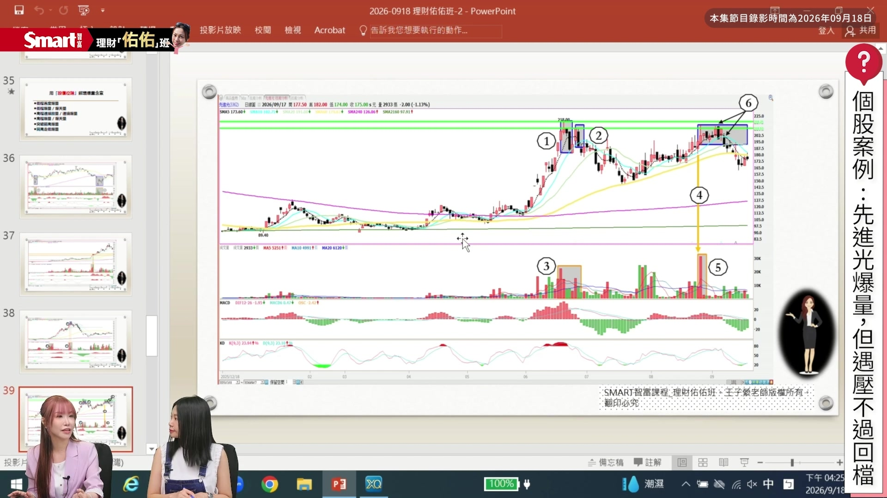

**逐字稿片段：** 那先進光也是光學類 這是裡頭走得比較弱的 這個投資人自己 就可以看一下 大概這個標的 這個六個位置 都可以顯示得出來 這裡是前壓 後面這個六號的位置 也是壓力 所以它一直過不了壓 可是一直頻頻 在壓力區放量 所以它後面 一旦跌破 這個壓力區的時候 它就很容易回檔 這個時候 不管你是原本是從 這個這邊開始上車的 還是從中間這個回折點 開始上車的 你都要對它做調節 或者獲利 出場的動作這樣子 那這就是所謂的爆量 出現在不同位階的時候 你要做好的是進場 怎麼進出場怎麼出 的一些準備 跟觀察的現象 今天其實跟老師 一路聊下來 大家可以發現說 有時候你看到一個 很興奮的事情 不管是爆量 或是利多消息 或是要準備創新高 你都不可以因為 單獨這一個 訊號出現 就是貿然的進場 它其實有很多 要做搭配的地方的 那我覺得這個其實也跟

**話題推測：** 舉例說明先進光(3362)在壓力區放量。

---

## 00:27:23

**逐字稿片段：** 老師接下來要在 就是Smart這邊 開的一個課程 它有一個很大的關聯 因為老師這堂課叫做 《消息面成語 K線轉折 台股高勝率的 一個實戰課》 因為老師在這堂課 你會完整的把 這些東西就是做一次的 分享給大家嘛 對不對

**話題推測：** 主持人介紹老師的線上課程。

---

## 00:27:40

**逐字稿片段：** 對沒錯沒錯 我們大概分成三段好了 第一段喔 這個就是 我們一般散戶喔 在面對消息面的時候 為什麼會很容易 衝動追高 那甚至是有 因為其實散戶很容易 會有一個叫 FOMO症候群 我們這次會解解 專門解析這個東西 然後呢我們也會 特別解釋就是說 你在實戰當中 因為我們比較 這個課程強調 用在實戰上 那你在實戰上裡頭喔 通常這些散戶的 羊群效應 你會一定會有這 十大的盲點跟交易風險 所以我們希望說能夠讓 技術面當作你 消息面或籌碼面的 防護網 去做到讓你能夠掌控 這個進出場跟保護自己

**話題推測：** 老師介紹課程第一部分內容。

---

## 00:28:21

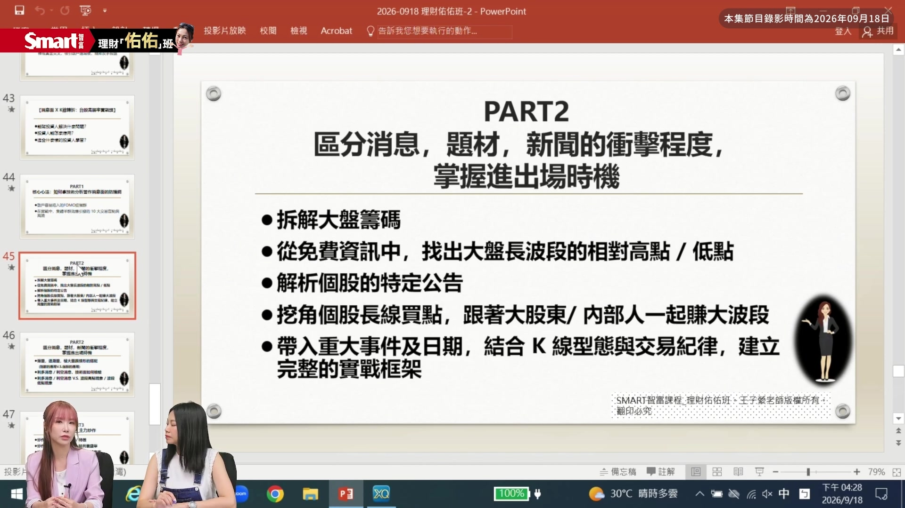

**逐字稿片段：** 那再來呢 我們在這次區分 消息題材跟新聞的 這個裡頭 我們要怎麼樣找出 進出場時機 最重要的其實喔 大家可能都不曉得 在免費的資訊裡頭 我們其實可以找得到 大盤長波段的 相對高點跟相對低點 不用 在沒有看技術線圖的 情況之下 那當然在搭配上 技術線圖的時候 你就可以 大概很清楚知道 這個位置可能是 就像六月那時候 其實在七八月 開始回跌之前 六月的一些 大盤的 報導啊 大盤的譬如說 券商給你的報告啊 免費盤後的報告 其實都看得出來 這次呢 上課會特別先從 這個部分 去掌握 因為這個裡頭我們也會 談到關於大盤的量 大盤的爆大量 那這樣搭配起來 就會很清楚 你自己在什麼位階 那大的環境在什麼位階 然後之後我們再找 個股在什麼位階 這樣就會相對更安全 那再來呢 我們會解析很多 個股的特定公告 所謂的特定公告叫做 我們會再盤後有時候 重大重訊裡頭 看到的一些訊息 那這些重大訊息 我會特別挑 因為重大訊息有百百種 可能有超過100種 可是我們會特地挑 其中的幾種出來 我們要看出來 這些公告其實 是你長線的這個 藏寶圖的那個 鑰匙 為什麼呢 因為它就是告訴你說 我大股東要進來了 或者我大股東 已經進來了 我甚至是我 的內部人 花我的內部人 花了多少錢 我準備要買多少的部位 因為它是大股東 跟內部人 那這個我們這個 金管會這邊 是有保障 我們這個所有投資人 所以他其實盤後都會 公布這些資訊 那你如何利用這些資訊 再搭配技術線圖 你就會知道 這個是我個股很長 長線 我們不一定說多長線 至少一定一段時間 都會出現中線的買點 有 那搭配某些特定的 很有誠信的大股東 我這樣講 它甚至會變成是一個 非常非常長線的買點 所以我們希望是 從這裡開始建立 然後所以在裡頭會 搭配很多的時間 日期事件 然後再搭配K線的型態 跟你的交易紀律 你才有辦法說 喔我在這裡建倉 之後我要怎麼面對 這個市場的波動 那再來呢 我們這個裡頭當然就是 為什麼 這都要環環相扣 大盤的量個股的量 通通搭配在一起 這樣子的應用 才能夠讓你自己 再面對利多消息 利空消息 你要怎麼去檢驗 甚至是檢驗的時候 你還要知道就是說 啊我這部分的長波段 我要放長波段 一部分呢我要做調節 我可以做短短trade 短價差 那這部分你就要 學會認得說 欸這個地方是我的 短波高點到了 還是這是我的 短波低檔來了 我我可以在加碼一些 那這裡頭呢 這些部分 如果都很熟的話

**話題推測：** 老師介紹課程第二部分內容。

---

## 00:31:15

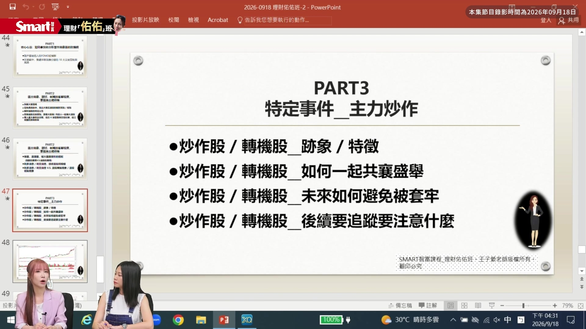

**逐字稿片段：** 我們就會進到 真正的飆股 因為有一些主力是 市場非常有名 的 它呢 我們這次 準備了一個例子喔 就是它 其實在做股票之前 這個新聞上都已經 已經已經讓你知道了 它要來了 在你還沒有看到 那個線圖之前 所以你大概就知道 我可能可以鎖定 這些公司 那在然後我們再等 技術線圖發生的現象 跡象之後 我們再來看說 我們是不是可以 跟他一起上車 這叫做 主力做好了 你跟他幫你一起抬轎 然後你跟他一起 做一段價差 魚頭魚尾都給他 我們只要吃 中間的魚肚子 因為他做好轎之後 他一定得賣嘛 你在他做出頭 要賣股票的時候 你又趕快賣掉 所以你就可以賺到魚身 那做這種特定事件 主力的炒作股 這個真的就叫做股票 非常快 所以叫飆股 所以飆股一旦上車之後 最重要叫做到第三點 我要做到怎麼被 避免被套牢 以後這個飆股 還能不能夠 值得我追蹤 再來一趟 這個也是我們這次 上課會講到的重點 這樣子 大概是分這幾個部分 好 聽完老師講完課綱 我也想要去上課 因為 我覺得裡面很多東西 都是平常我們真的 上網看到 但你看完你沒有感覺 你就是覺得 就是一個事件 然後過去了 可是老師的課綱裡面 讓我覺得說 這個東西看到 好像可以拿來做一點 什麼事情這樣子

**話題推測：** 老師介紹課程第五部分（如何找到飆股）。

---

## 00:32:32

**逐字稿片段：** 好 老師呢就是 又會把這個連結 放在資訊欄 那大家如果有興趣的話 可以幫我們點選 這個課程的資訊 參考一下囉 那我們就謝謝老師 今天跟我們分享 我們下次見 謝謝 掰掰

**話題推測：** 主持人引導觀眾至課程資訊。

---
