# themarketmemo_DRiYHzY83T0 — 關鍵畫面索引

- 來源逐字稿：[themarketmemo_DRiYHzY83T0_GT.srt](themarketmemo_DRiYHzY83T0_GT.srt)
- 影片：https://www.youtube.com/watch?v=DRiYHzY83T0
- 截圖數：51

## 00:00:34

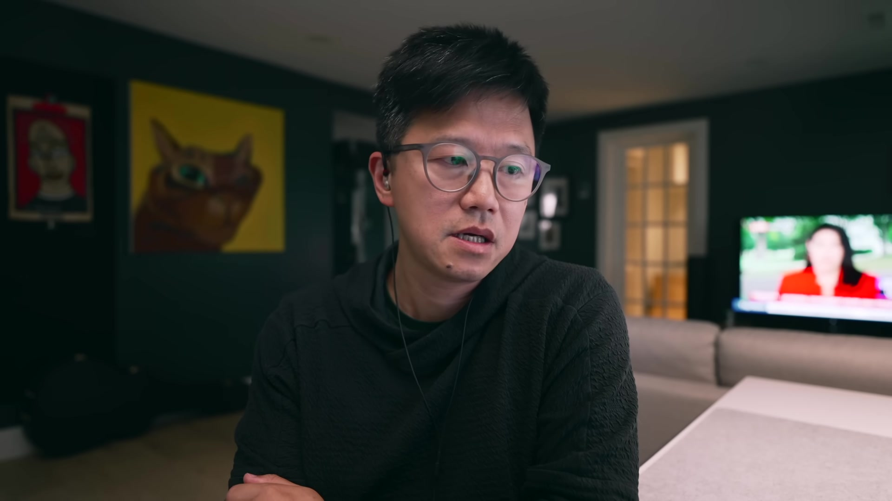

**逐字稿片段：** 今天我來講幾個我自己的小故事 希望這些故事能夠對你有啟發 我是1999年大學畢業 大學畢業以後我就留校做老師 當時我是在杭州

**話題推測：** 讲者开始分享自己的小故事

---

## 00:00:46

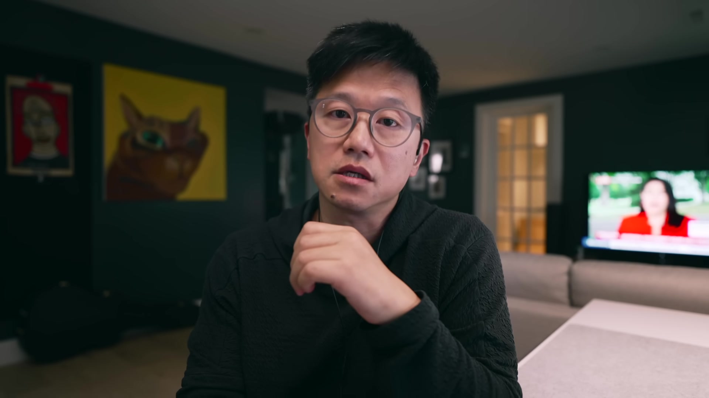

**逐字稿片段：** 當時的工資只有900塊錢一個月人民幣 剛畢業的時候也沒有房 要麼自己租房子住 要麼就是住集體宿舍 那麼我選擇自己租房住

**話題推測：** 提到当时的工资是900块钱，可显示数字

---

## 00:00:58

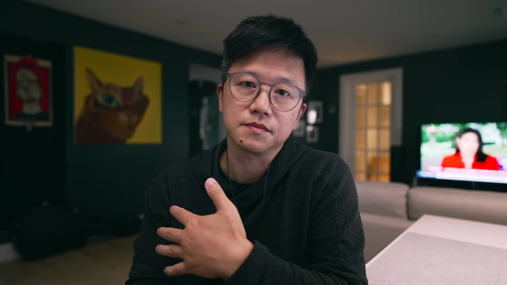

**逐字稿片段：** 後來到了2000年的時候 中國的房地產商業化就逐漸展開了 那麼普通人是可以貸款買房了 我當時作為教師 可以獲得不少貸款的優惠 當時我是看中了一套房 在杭州的鼓樓地區 位置是非常好的

**話題推測：** 时间点切换到2000年

---

## 00:01:18

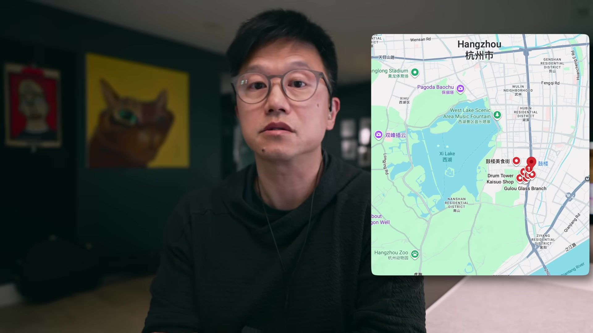

**逐字稿片段：** 房價19萬首付5萬 然後每個月大概是900塊錢的月供 我當時手上的錢 基本上只夠付首付 其實真正的難度是在後面 是在月供上面 因為月供基本上等於我的工資了 那麼交完月供之後 我基本上就只能喝西北風了 我媽當時就說 這個房子太貴了 我們買不起 不過當然後來我還是買了 買不起是當時大多數普通人 當時的第一直覺反應 那麼我的反應就是說 我想提高自己的生活 我不想租房子了 我希望自己的生活上一個臺階 我可以用我的工資 去還月供 那麼我在想辦法 從業餘時間當中

**話題推測：** 详细列出房价19万和首付5万，可显示数字

---

## 00:02:08

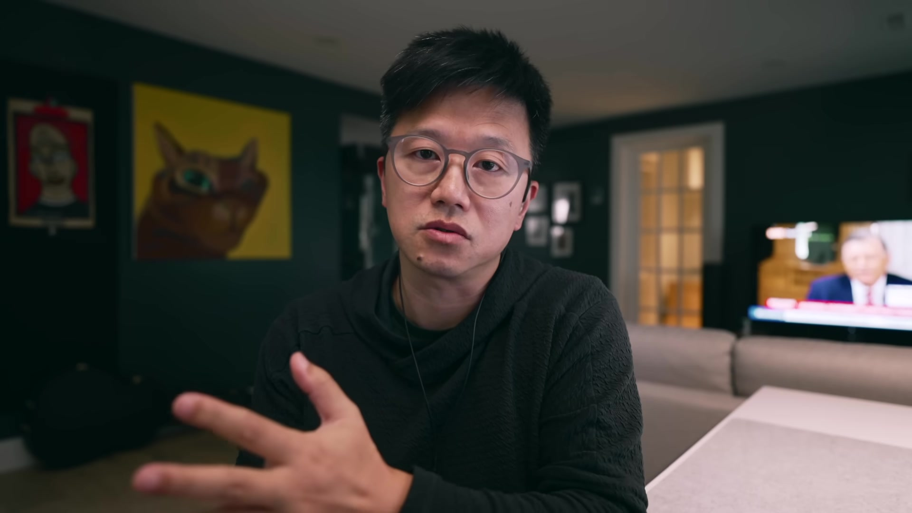

**逐字稿片段：** 去拓展一些收入渠道 我當時是在美術學院工作 那麼空餘的時間也是比較多的 我們美術學院的老師 基本上都在想辦法掙錢 其實我在讀大學的過程當中 其實就一直在做一些商業項目 因為那個時候剛好趕上了 中國的房地產 慢慢起步的這樣的一個浪潮 所以說我認為 我是有能力 可以掙到這個錢來還房貸的 那麼為了還房貸 那麼我也擴大了 我自己的設計工作室 招了人

**話題推測：** 谈到拓展收入渠道，可配思维导图

---

## 00:02:46

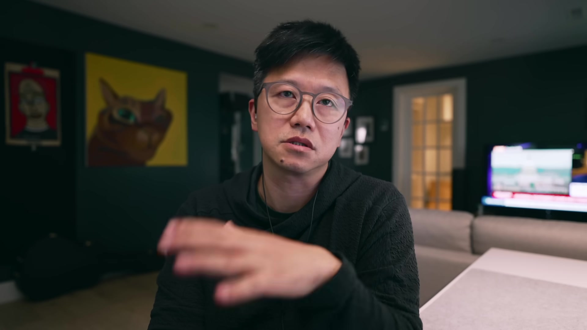

**逐字稿片段：** 成立了公司 那麼項目也是越做越大 那麼我的第一桶金 就是來自於我自己做設計公司 買了這個房之後

**話題推測：** 提到成立了公司，可配公司Logo或成立示意图

---

## 00:02:58

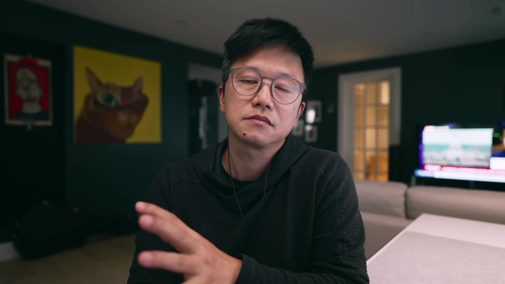

**逐字稿片段：** 2010年

**話題推測：** 时间点切换到2010年

---

## 00:02:59

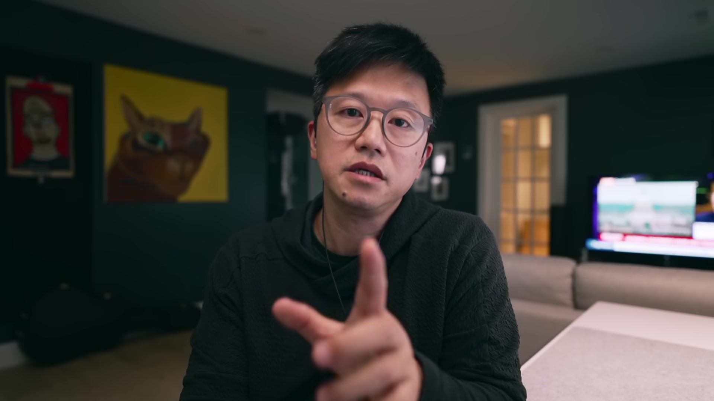

**逐字稿片段：** 我辭職 離開杭州去上海發展的時候 我這套房已經漲了10倍

**話題推測：** 提及辞职，可配辞职或职业转变的图示

---

## 00:03:06

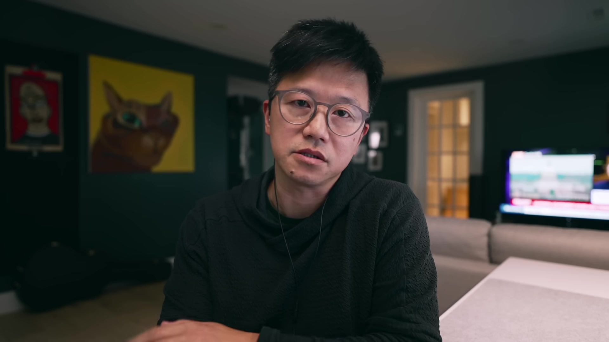

**逐字稿片段：** 這個故事我想表達的是 我們不能夠被自己的 當前的狀態 限制住了自己的想象力 而是要用想象力 去拓展自己的能力圈 去開發自己的潛力 如果我不是想提升自己 的生活水平 我就不會去想買這個房 當時買房 還是有風險 對不對 有很多事情 你不知道未來會怎樣 當時的房對很多普通人來說 也都是負擔不起的 如果不是因為買這個房 那麼我也就不會去開這個公司 我不會有這個公司 就不會有我的第一桶金 對不對 那麼有了第一桶金 有了一定的資本之後 那麼我需要更廣泛的自由 所以後來才會從零開始 學習投資 然後再一步一步 現在移民到海外 那麼我現在自己的生活 簡單來說就是四個字

**話題推測：** 转入故事的启示和总结

---

## 00:04:04

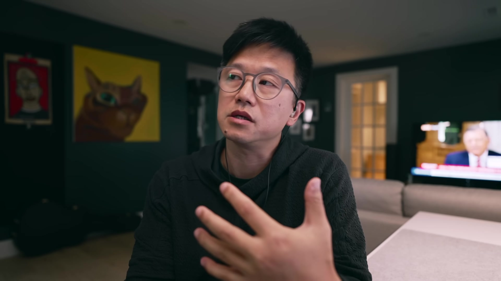

**逐字稿片段：** 叫做自由富足 這一切 其實都是源於當初的一個想法 說到底 我不想做個普通人 如果你也有同樣的想法

**話題推測：** 总结目前生活为“自由富足”，可做标题卡

---

## 00:04:16

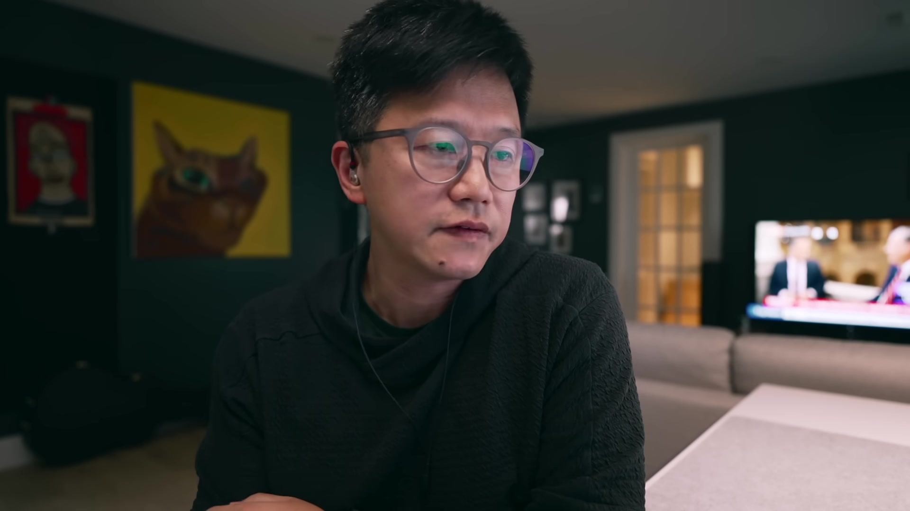

**逐字稿片段：** 我下面再講幾個小故事 希望對你有啟發 我讀大學本科時候 學的是環境藝術設計 研究生讀的是纖維藝術 它是雕塑藝術下面的一個研究方向 前面我說了 我的第一桶金 是來自於我的本專業是設計 但是我在2010年以後的生活和發展 就全部都是靠投資了 但是不管怎麼說 一個學藝術的人

**話題推測：** 预告接下去会讲更多小故事

---

## 00:04:43

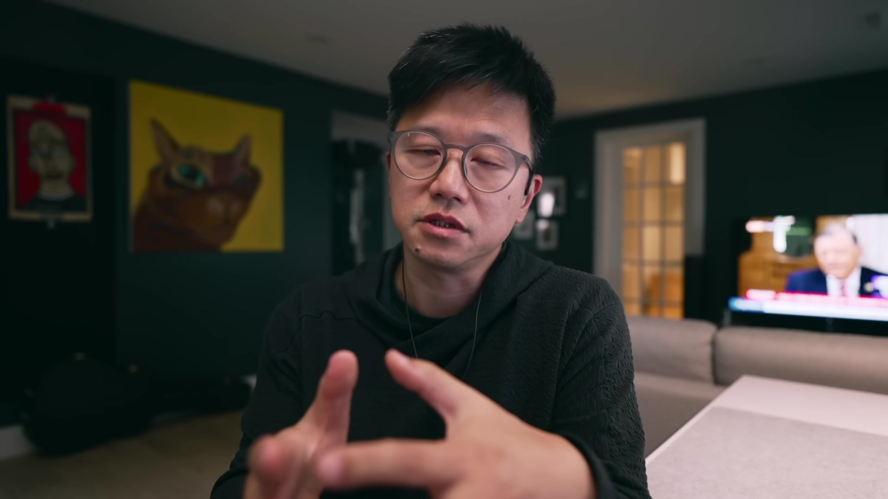

**逐字稿片段：** 跨界到了金融領域 那麼對於普通人來說 這是一個非常大的跨越

**話題推測：** 强调从艺术跨界到金融领域，可做对比图示

---

## 00:04:49

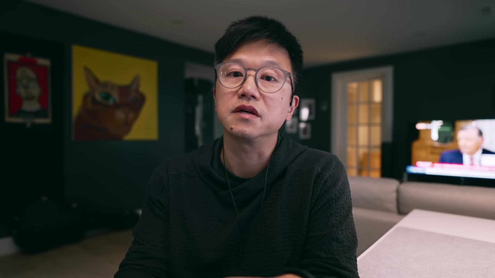

**逐字稿片段：** 我是怎樣實現這種跨越的 我認為首先就是 要拓展自己的知識結構 1995年到2000年左右 中國大陸的房地產市場逐漸商業化 那麼對建築對環境設計的需求 是非常大的 那麼我這個專業 在當時算是一個 恰好趕上了好時代 所以我很早就接觸到這些 商業領域 那麼我對商業 對創業 對經濟方面的這些內容 也都是非常的感興趣 這就使得我的知識結構 很自然的 從藝術設計這種美學框架 逐漸就拓展到了 更廣泛的商業領域 我很早就訂閱了 像華爾街日報 經濟學人 這些著名的媒體 那個時候在中國不需要翻牆 就可以看得到這些東西的 就是到了2003年以後 這個就越來越難了 那就不得不翻牆了 為了看這些內容 就沒辦法 就搞懂了翻牆 對吧 然後搞懂了 怎樣使用國際信用卡支付 還順便知道了

**話題推測：** 提出如何实现跨越的问题，可做问题卡

---

## 00:05:58

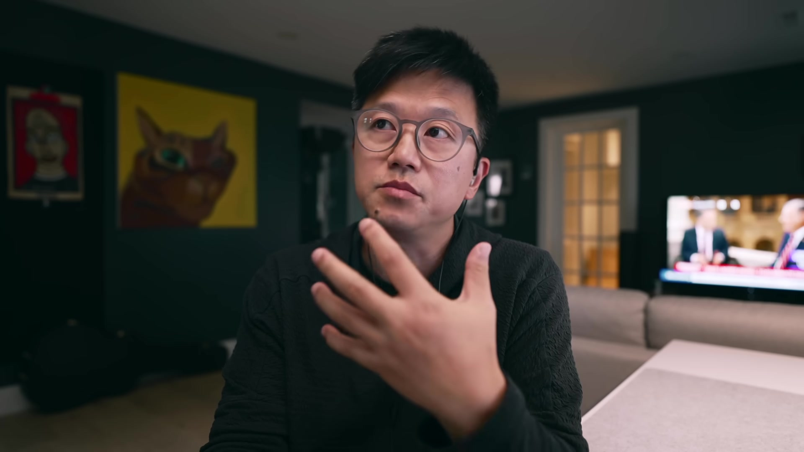

**逐字稿片段：** 那裡有一個美國的股票市場 然後當我發現了美股這個 大金礦以後 我就開始想辦法

**話題推測：** 发现美国股票市场，可配美股市场图表或Logo

---

## 00:06:06

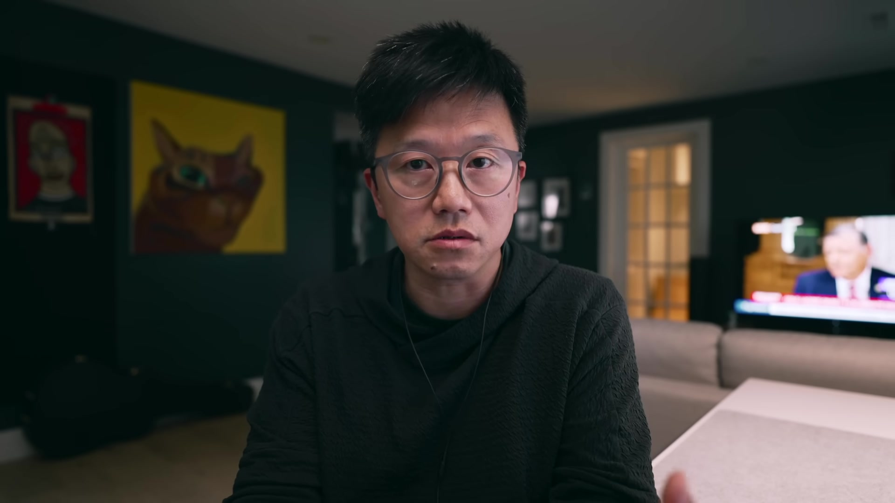

**逐字稿片段：** 把資金移出海外 更重要的是就是 做這些事情

**話題推測：** 决定把资金移出海外，可配资金流动或全球地图图示

---

## 00:06:11

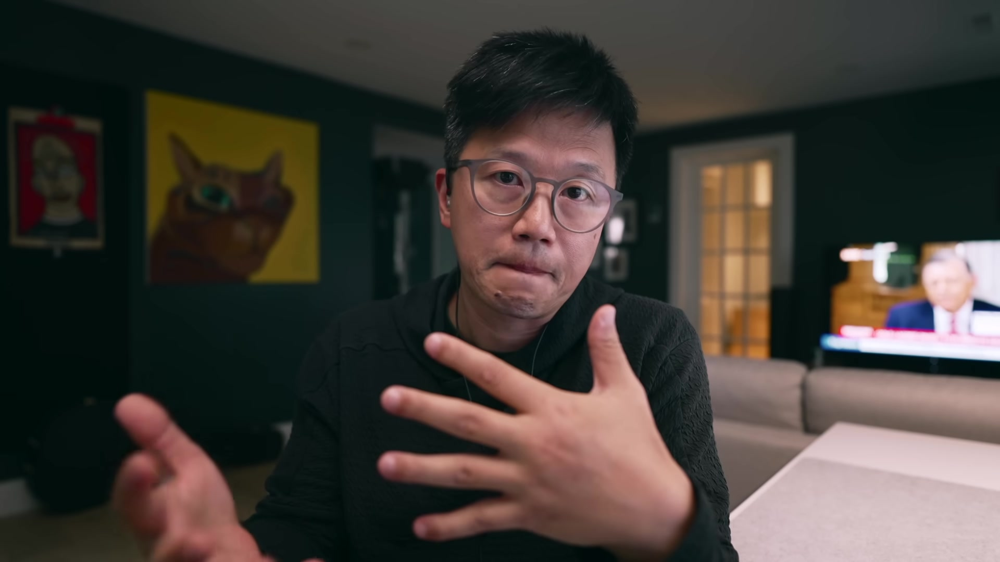

**逐字稿片段：** 讓我逐漸有了這種國際的視野 翻牆出來 最開始是用翻譯軟件看英文 那麼後來久而久之

**話題推測：** 谈到培养国际视野，可配地球或全球化图示

---

## 00:06:21

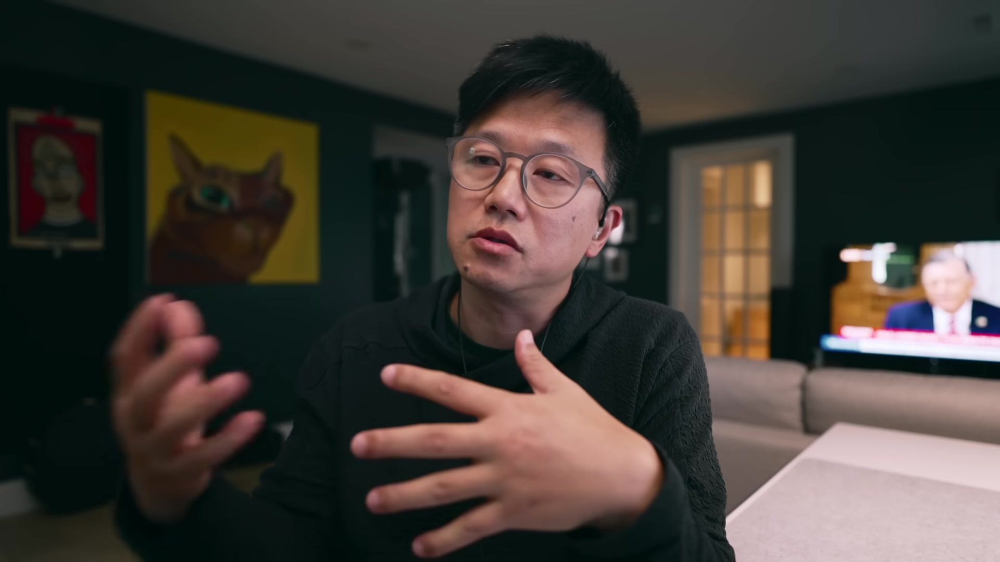

**逐字稿片段：** 英文水平也有了一定的提高 那麼英文水平提高以後 又讓這個視野 更加的打開了 那麼在知識結構 有了一定的擴展之後 就有了

**話題推測：** 提到英文水平提高，可配语言学习或进步图示

---

## 00:06:35

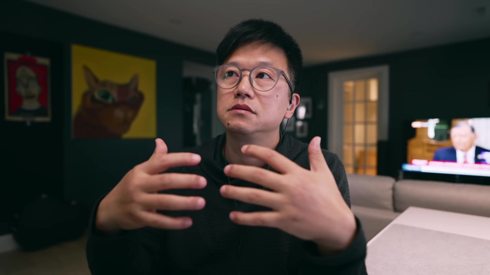

**逐字稿片段：** 拓展自己朋友圈的 這樣的一個願望 有一句話說的是

**話題推測：** 提出拓展朋友圈，可配社交网络图示

---

## 00:06:40

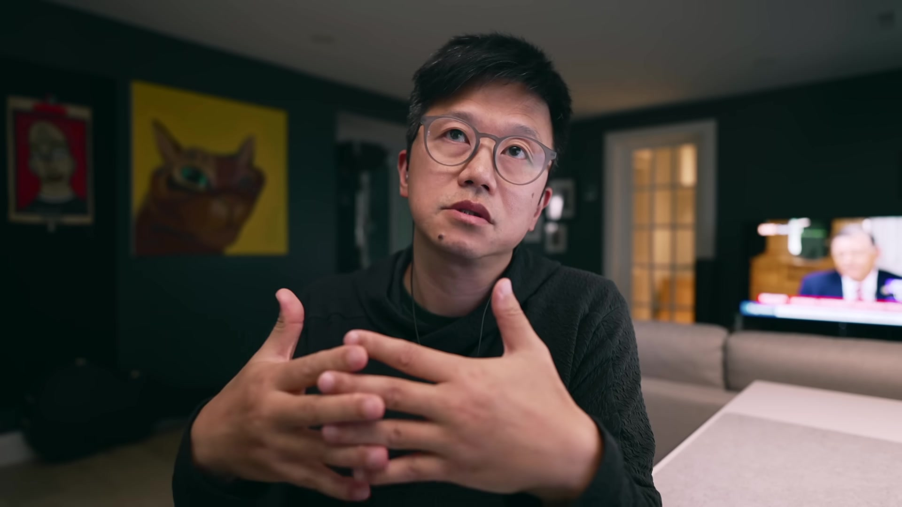

**逐字稿片段：** 你的五個朋友 決定了你的認知水平 如果你身邊的人 都喜歡刷短視頻 喜歡聊八卦 那麼你很難接觸到 所謂的這種破壞性創新 或者說資本偏好這一類話題 所以說 拓展朋友圈是非常必要的 如果說你對投資感興趣 就應該儘可能的多結交 這種投資圈創業圈的朋友 當然了 在現實生活當中 普通人要想跨越自己的階層 或者說跨越自己的圈子 去別人的圈子 去有錢人的圈子 那是相當不容易的

**話題推測：** 引用“你的五个朋友决定了你的认知水平”观点，可做引言卡

---

## 00:07:18

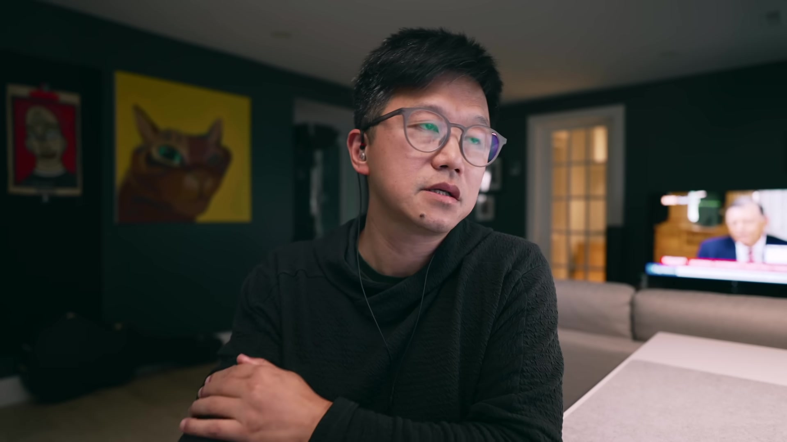

**逐字稿片段：** 但是現在網絡這麼發達

**話題推測：** 话题转到网络社交的便利性，可配网络连接图示

---

## 00:07:21

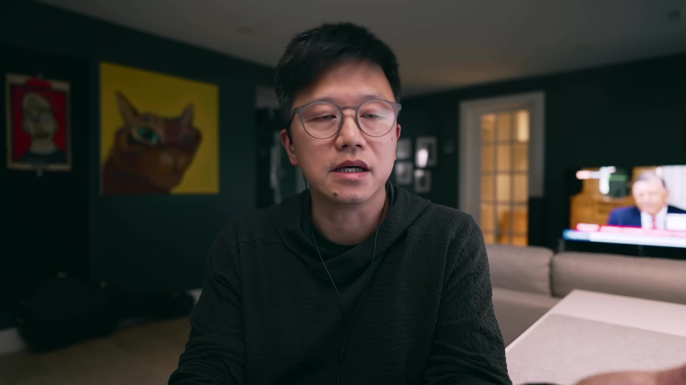

**逐字稿片段：** 一些有意思的這種論壇 股東會 什麼大師課之類的 我認為是有必要去學一學 去看一看的 那麼如果說有投資方面的圈子 也可以結識到一些牛人 我記得以前我在上海的時候

**話題推測：** 提及有意思的论坛，可配论坛界面截图

---

## 00:07:37

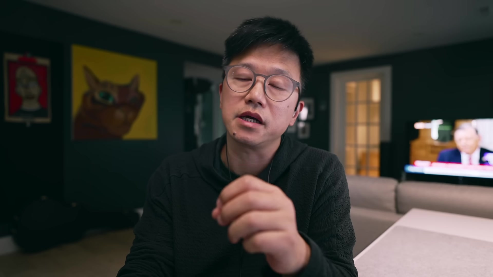

**逐字稿片段：** 那個時候雪球 每年會舉行一個雪球大會 在大會上面 也會認識到一些投資圈的朋友 那麼還有一段就是說有一些 投資圈的大咖

**話題推測：** 提及雪球平台，可显示雪球Logo

---

## 00:07:51

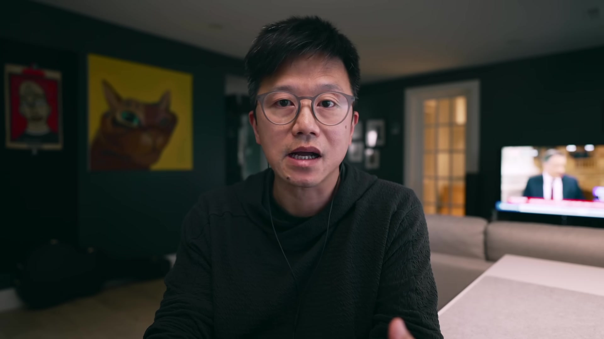

**逐字稿片段：** 開的社群 我認為也是可以參與的 當然了

**話題推測：** 提及投资圈大咖开设的社群，可配社群Logo或示意图

---

## 00:07:56

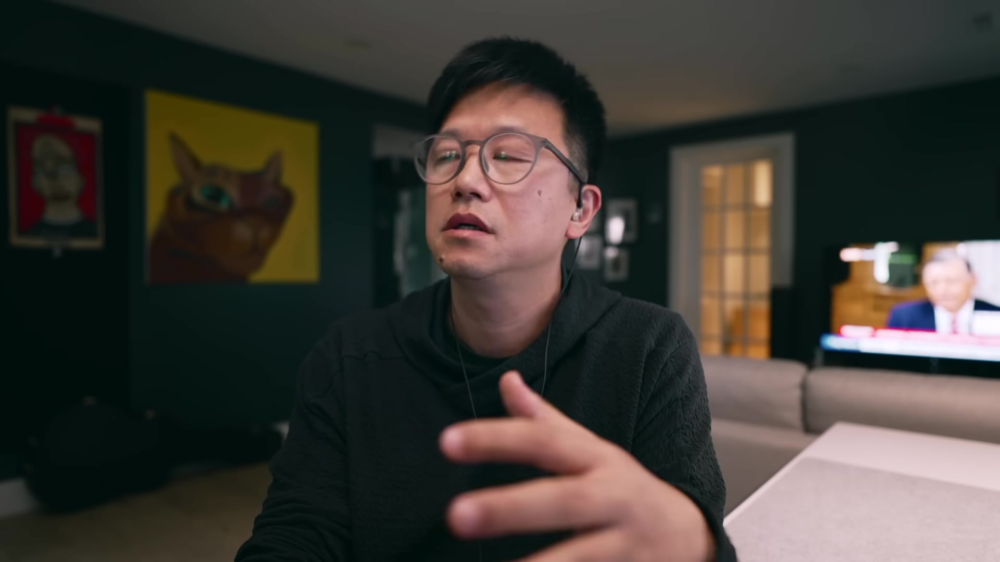

**逐字稿片段：** 大多數的好東西都是要付費的 而且並不便宜 總而言之 我認為找一個靠譜的圈子 帶著問題 去找答案 看看有沒有人能解決你的問題 如果沒有 那就再換一個圈子 有時候 某一個人的一句話 可以改變你的人生

**話題推測：** 强调好东西多半要付费，可配价格标签或付费会员图示

---

## 00:08:17

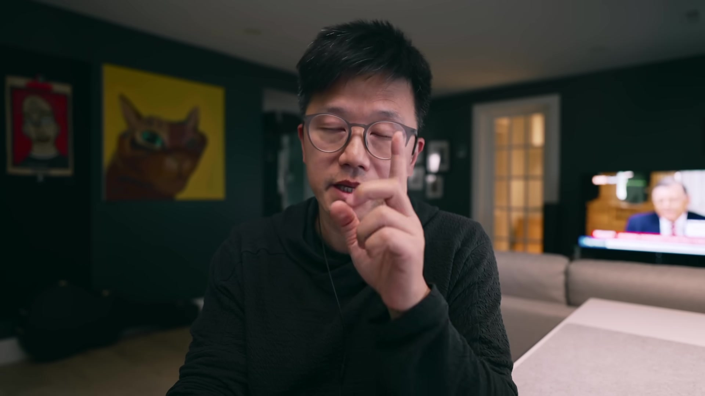

**逐字稿片段：** 接下去我還有一個小故事 專門講這件事情 學會提問 這是最快的學習方式 是進步最快的學習方式 不要以為付費的內容都是割韭菜 是吧 購買付費的內容 反正你就帶著你的思想 帶著你的問題 進去 打開話匣子 說完你的問題 看誰能幫你解決 解決完了也走 不解決也走 對不對 那麼我自己的購買這些付費內容 我有一個經驗 就是說 我從來不買那種付年費 年費看上去便宜 但實際上 有一種不舒服的感覺 我寧可貴一點 我也願意 一個月一個月的付 不滿意我隨時可以走 我沒有多大損失 那麼感覺好的話 我隨時也可以再回來 我的自己的社群 我也是取消了年費 你願意進來 隨時來都可以 你有什麼話題 我們可以聊 聊完你走 最核心的一點 就是你想得到什麼 有一個觀念

**話題推測：** 预告下一个小故事

---

## 00:09:19

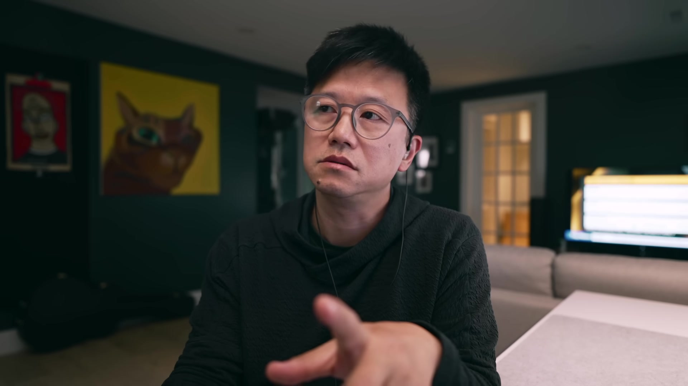

**逐字稿片段：** 就是說叫做第一性原則 用第一性原則來思考問題 會讓你的人生變得非常的簡單 我做投資 從設計跨界到了做投資 那麼我的主要目的 並不是賺更多的錢 因為在當時 我的業務非常好 我的設計公司項目做不完 如果我想賺更多的錢 我只需要僱傭更多的人 把公司規模搞大 就可以了 對吧 賺錢的思路 但是我發現這種生意模式

**話題推測：** 引入“第一性原则”的概念，可做标题卡

---

## 00:09:50

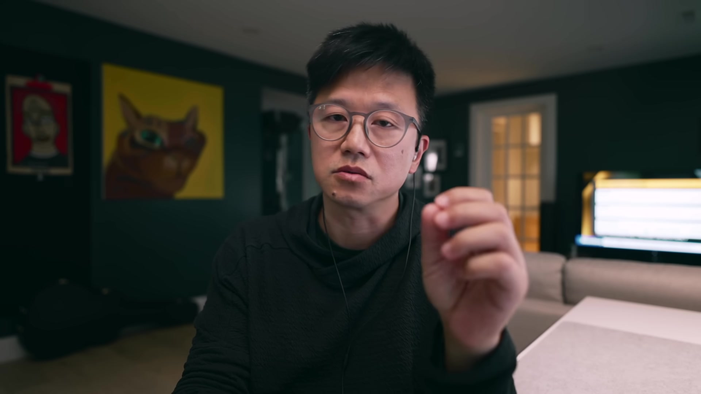

**逐字稿片段：** 無法降低邊際成本 越做大 人就越多 人越多越難管理 越難管理 最後就形成了一個死循環 雖然可以賺很多錢 但是它不是一種

**話題推測：** 谈到边际成本，可配经济学曲线图

---

## 00:10:05

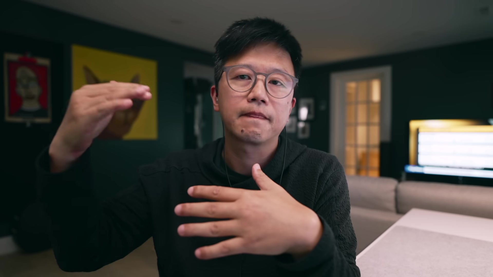

**逐字稿片段：** 看得見的指數級的增長 所以說 我希望是用

**話題推測：** 提及指数级增长，可配指数增长曲线图

---

## 00:10:10

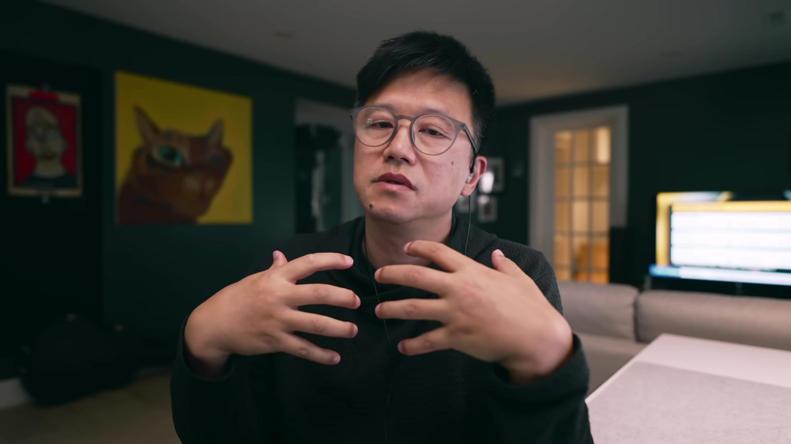

**逐字稿片段：** 錢來賺錢 賺最容易賺到的錢 這是我的第一性原則 我可以接受 資本增長的速度慢一點 但是我希望它能夠自己成長 不需要我付出額外的努力 在我睡覺的時候 它也能夠增長 這是對我來說 我反覆在思考的一件事情 那麼我這兩年 在網絡上分享的一個

**話題推測：** 表达“钱来赚钱”的理念，可配金钱生钱的动画或图示

---

## 00:10:38

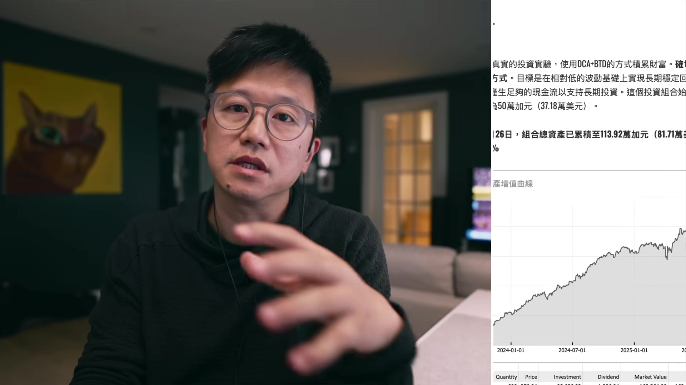

**逐字稿片段：** Hi5 組合 一個投資組合 它就是符合我的第一性原理 解決問題的這種方案 我分享這個組合 就是想用實例 來告訴所有人 這是普通人

**話題推測：** 提及Hi5组合这一投资组合，可配投资组合界面或Logo

---

## 00:10:51

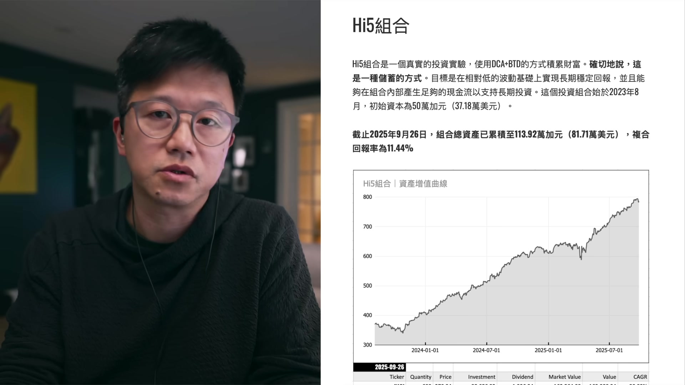

**逐字稿片段：** 積累財富最快最簡單的路徑 你不相信？ 我就做給你看 這就是我為什麼要公開這件事情 我把所有的詳細記錄 都公佈在網上

**話題推測：** 强调这是积累财富最快最简单路径，可配财富增长路线图

---

## 00:11:02

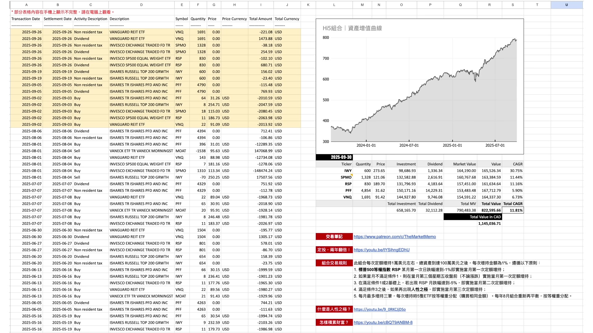

**逐字稿片段：** 在下面這個網址 你就可以找得到 我做了11年的大學老師 我是有那麼一點點 傳教士精神的 我就是喜歡 把我認為好的東西 傳播給更多的人 我享受這個過程 進一步說 第一性原理 簡單來說 如果放在每個人身上 你思考一下 如果說你的目標

**話題推測：** 提示查看网上公开的详细记录和网址，可显示网址

---

## 00:11:28

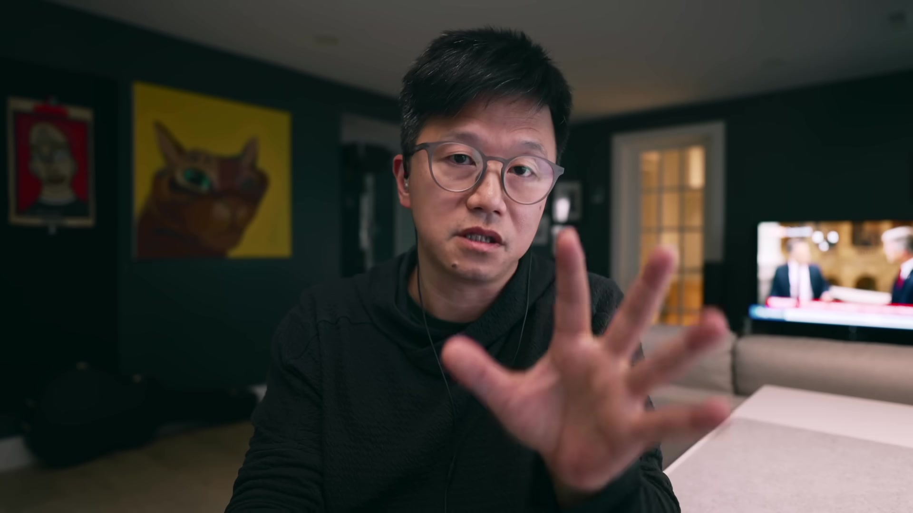

**逐字稿片段：** 是獲得職位升遷 通過加班努力是沒有出路的 你需要為你的公司 解決更大的問題 創造更大的價值 提升你在公司當中的重要性 那麼自然你的地位就會得到提升 對不對 那麼如果說你的目的

**話題推測：** 举例目标是获得职员升迁，可配职场晋升阶梯图

---

## 00:11:46

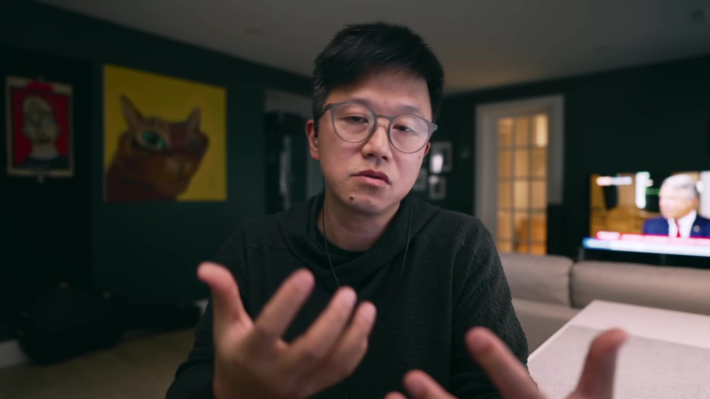

**逐字稿片段：** 你的目標是賺更多的錢 那麼 靠別人去推薦幾支牛股給你 是沒有前途的 你要知道沒有牛股會一直漲 它的波動的過程當中 是會讓你非常痛苦的 所以說你要用一種策略 或者說是

**話題推測：** 举例目标是赚更多的钱，可配金钱或财富图示

---

## 00:12:03

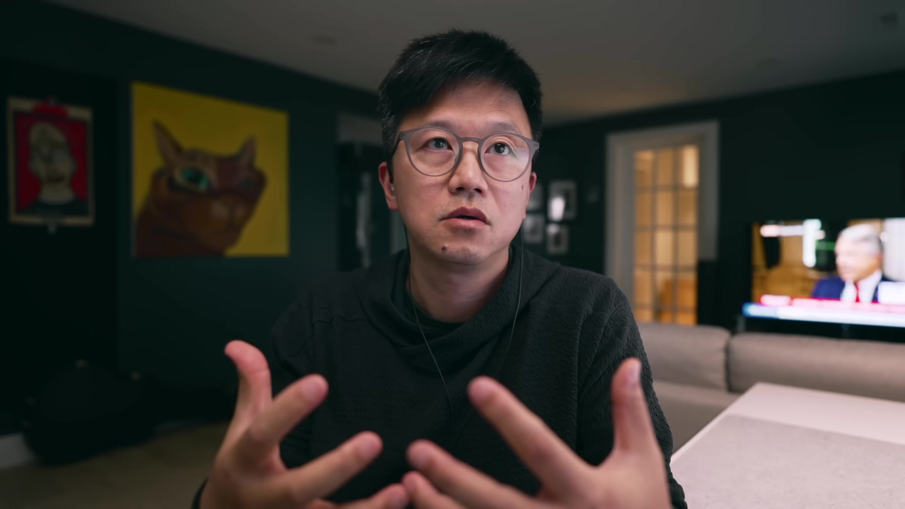

**逐字稿片段：** 用槓桿的方式去放大收益 這些內容

**話題推測：** 提及用杠杆放大收益，可配杠杆原理图

---

## 00:12:07

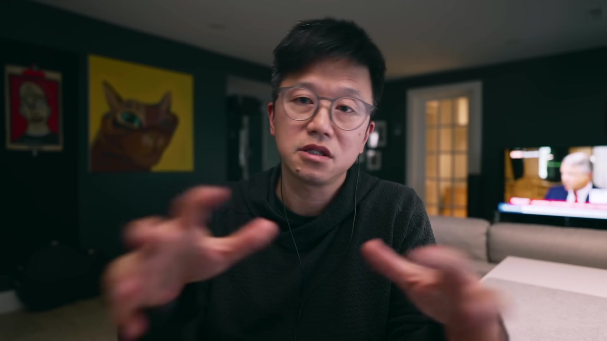

**逐字稿片段：** 在我的YouTube頻道 你都可以找得到 總而言之 想清楚你要什麼 然後根據目標 去設計你的路徑 這才是解決問題的 正確的姿勢 前面我也說了 就是說 我發現我做設計公司 商業模式 不符合我的第一性原理 但是我當時 並不知道怎樣去解決 對吧 那麼但是這個思考 一直在我的腦海裡頭轉

**話題推測：** 提及YouTube频道上的相关内容，可配YouTube频道截图

---

## 00:12:35

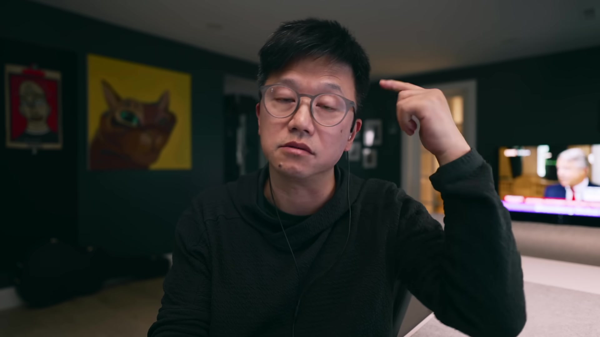

**逐字稿片段：** 直到有一次 機緣巧合

**話題推測：** 引入另一个小故事

---

## 00:12:38

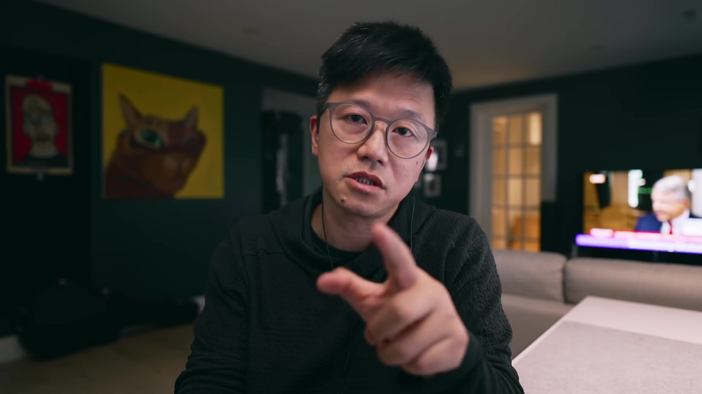

**逐字稿片段：** 在2004年 我做了一個 湖北武漢的一個設計項目 當時設計項目的老闆 後來我知道 他是一個 當年在杭州 做商品期貨的一個高手 我和老闆 老闆姓余 我們就叫余總 余總 我跟他有一次 因為設計上面的一些觀念的衝突

**話題推測：** 时间点切换到2004年

---

## 00:13:02

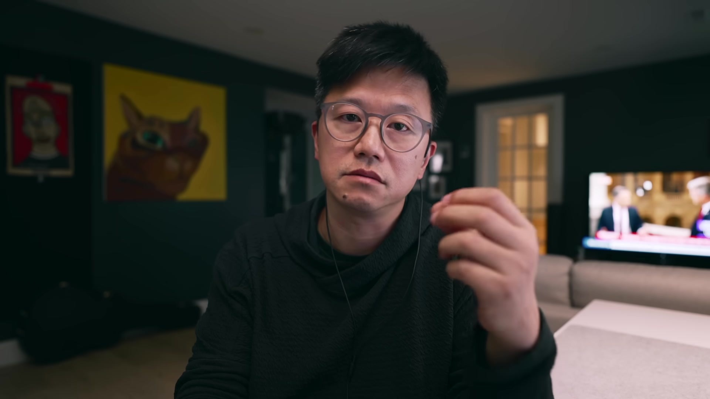

**逐字稿片段：** 發生了一次很激烈的爭吵 那麼在這一次爭吵當中

**話題推測：** 描述与余总的一次激烈争吵，可配争吵的示意图

---

## 00:13:08

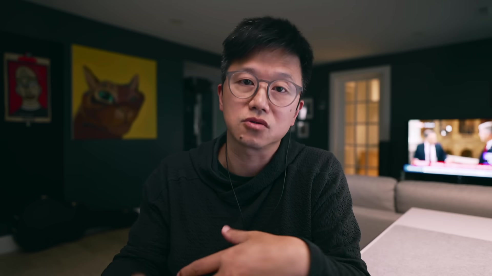

**逐字稿片段：** 余總有一段話 對我的衝擊是非常大的 大概的意思就是說 他說 你們這些學藝術的人 學設計的人 有點自以為是 自以為清高 自以為自己很優秀很特別 但是我告訴你 我選你來做這個項目 不是因為你優秀你特別 而是因為我不想再花更多的時間 去挑選別人了 你還行 所以用你 對於我來說 用你和用別人沒差別

**話題推測：** 引入余总的一段话，可做引言框

---

## 00:13:41

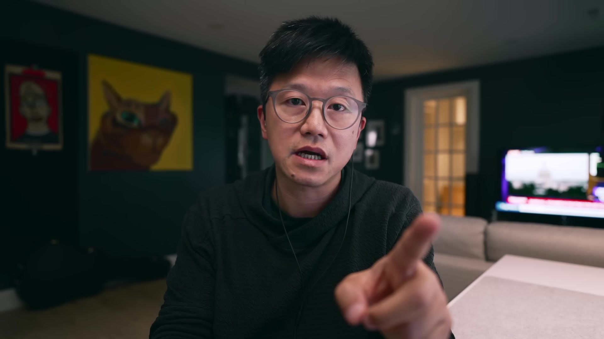

**逐字稿片段：** 你們只是我實現目標的工具而已 你能想象我當時的心情嗎 不過因為 我當時一直在思考 我怎麼樣去解決我這個問題 第一性原理的問題 所以我當時並沒有去跟他去 去爆發 所以我還是耐下心思 聽他說 說完以後 我把我的 我在腦海裡想的這些顧慮 這些問題 說出來 我說 余總 我碰到了這樣的問題 給我出點主意 然後就是這樣的一次談話之後 余總為我解開了我的疑惑 讓我明白 投資是符合我的第一性思考 後來我就開設了人生當中的 第一個投資賬戶 是一個期貨賬戶 也正是這一次機緣巧合 我就非常幸運的 在中國的銅期貨的大牛市當中

**話題推測：** 展示余总最具冲击力的话语，可做重点文字呈现

---

## 00:14:42

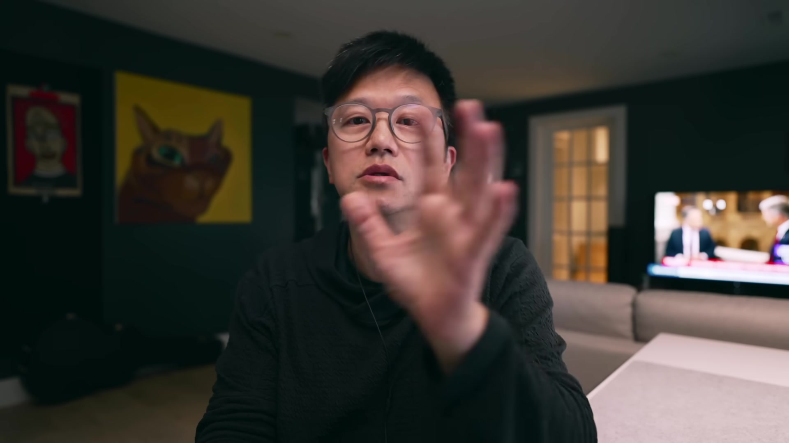

**逐字稿片段：** 賺到了人生的第二桶金 第一桶金是我的設計 做設計公司 那麼第二桶金就是用 我做設計賺來的錢 放到資本市場 放大 成為了我的第二桶金 也是受到余總的影響 那麼我做投資的起點是非常高的 我並沒有大多數人的這種散戶思維 那麼我投入的金額是比較大的 投入的時間也是非常多的

**話題推測：** 赚到人生的第二桶金，可配金币或财富积累图

---

## 00:15:10

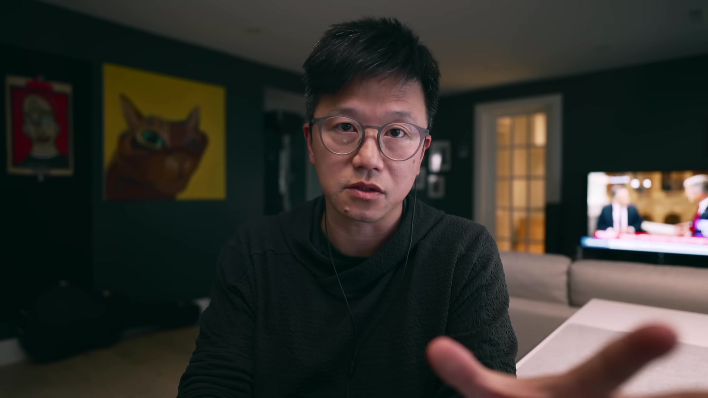

**逐字稿片段：** 甚至後來我把公司逐漸的脫手 我專心來做投資 我想說的是 如果說有人對你說的話非常的刺耳

**話題推測：** 提及将公司逐渐脱手，可配股权转让或公司出售图示

---

## 00:15:21

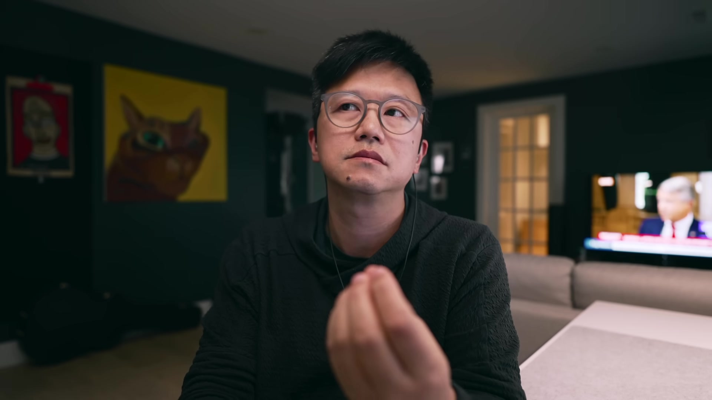

**逐字稿片段：** 你可能碰上貴人了 那是你成長的機會 這年頭大家都很忙的 沒有人願意在你身上多花一分錢時間的 對不對 那麼如果說有人願意在你身上花時間 願意對我說壞話

**話題推測：** 总结刺耳的话语可能意味着遇到贵人，可配箴言卡

---

## 00:15:38

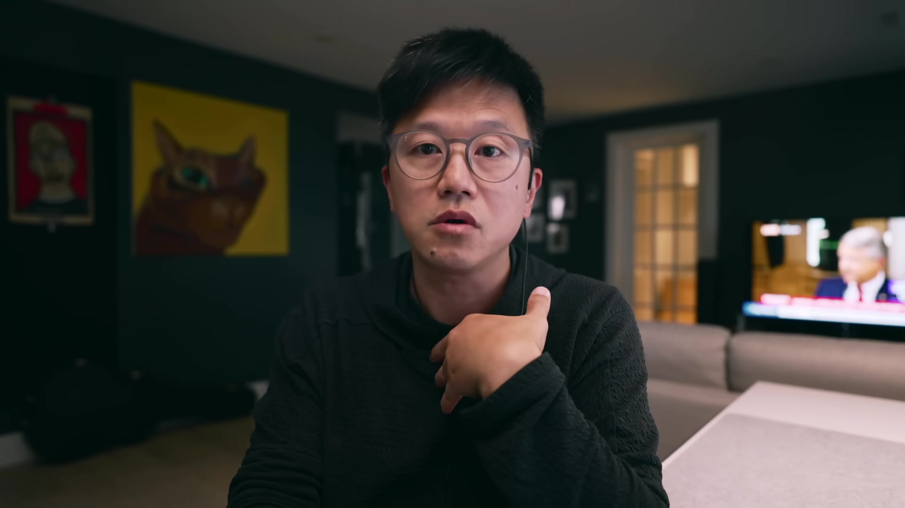

**逐字稿片段：** 有人願意在我的評論區留言 這都是非常好的東西 我一直認為 黑粉才是死忠粉 他們對我的批評都是非常好的 我是非常在意的 雖然我事後可以把他們拉黑 但是我絕對不會忽視他們的建議的 總而言之 我們不能只看跟自己觀念相同的 跟自己觀念相一致的觀點 思維的碰撞 有些人從反方向來觀察你 他提出你的弱點 這是非常好的

**話題推測：** 举例评论区留言，可配YouTube评论区截图

---

## 00:16:10

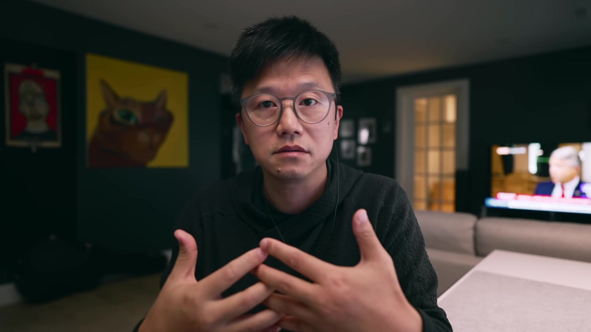

**逐字稿片段：** 對不對 思維的碰撞比認同更有價值

**話題推測：** 总结思维碰撞比认同更有价值，可做对比总结图

---

## 00:16:15

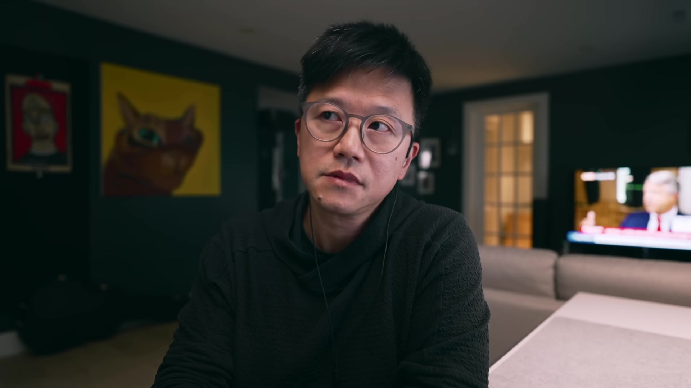

**逐字稿片段：** 那麼我自己在性格上面也有一個特點 就是說 我不會把一件事情想到百分之百再去做 我差不多想到百分之六七十 感覺模糊正確了 那麼我就會去做 那麼我們經常會聽到這樣的一種說法 說等我有了錢 我就去移民 我就去全職投資 blah blah blah 這種句式其實是把條件看得比目標更重要 言下之意就是說 如果說沒有錢 那我就放棄這個目標 我就放棄這個目的 那麼我可以毫不客氣的說 凡是用這種套路說話的人 最終都是無法達成目標的 我的人生只有一個目標 就是更廣泛的自由 和更高品質的生活 這兩件事情是相輔相成的 如果說沒有自由 就談不上什麼高品質的生活 所以我把這兩個目標合二為一 變成一個目標 所以我所有的人生歷程 人生經歷 所有的坎坷 成功 快樂 痛苦 都是我希望是朝著目標方向前進的 聽上去好像很寬泛 但其實執行起來非常簡單 每當我要做任何選擇的時候 或者說要花錢 或者說是要付出精力等等 我都會思考一下 我做這件事情 會不會讓我變得更自由 會不會讓我的生活 提高一個檔次 或者說朝著我想要的方向發展 如果答案是 那我就去做 不論多大的代價 我都會去做 如果說是否定的 那就不做 很簡單 我認為 去到目標的過程

**話題推測：** 转入讲者自己的性格特点

---

## 00:18:06

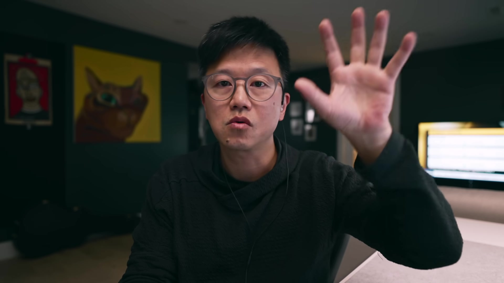

**逐字稿片段：** 比結果更重要 人生就是上臺階 一臺階一臺階往上走 很多時候你也只能是 走一步看一步 但是目標 必須是非常清晰的 至少那個方向 必須是非常清晰 我希望我的每一步 都更接近目標 或者說每一步都是 朝著模糊正確的方向在走 那麼這個過程就是快樂的 東拉西扯說了這麼多 我就想說 如果說 你想過得跟普通人不一樣 你不想做個普通人 那麼首先

**話題推測：** 强调去到目标的过程比结果更重要，可做对比图

---

## 00:18:46

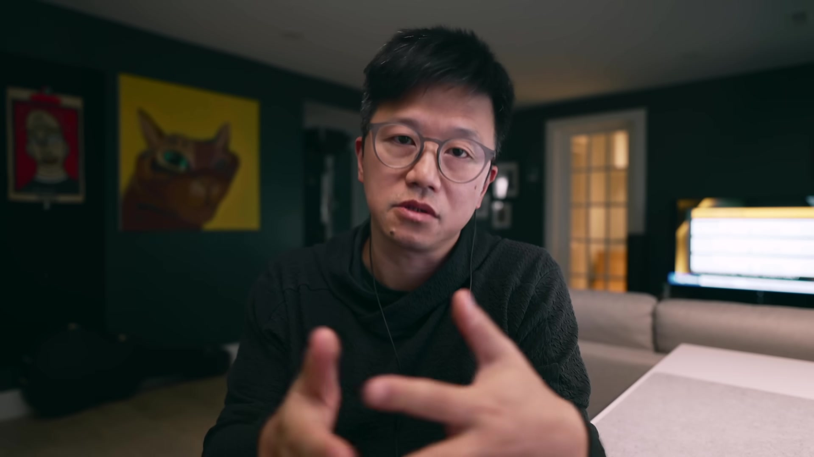

**逐字稿片段：** 想辦法去擴展自己的認知

**話題推測：** 总结第一点：扩展自己的认知，可做总结要点图

---

## 00:18:49

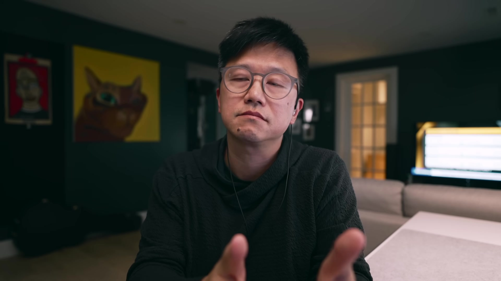

**逐字稿片段：** 然後擴展自己的圈子 最重要的是

**話題推測：** 总结第二点：扩展自己的圈子，可做总结要点图

---

## 00:18:53

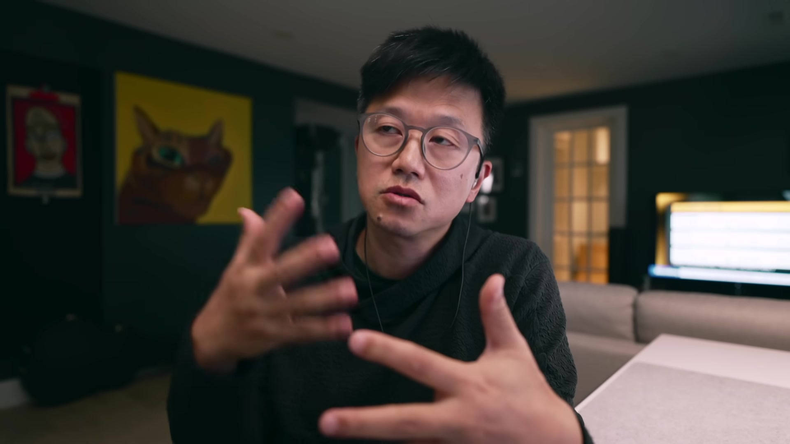

**逐字稿片段：** 搞清楚你想要什麼 有一些人 有一些事讓你不舒服 你要注意 它有可能會改變你的人生 總而言之 一定要讓你的目標 你的方向非常的明確 讓每一次的選擇 更接近目標 對吧 好 那麼就說這些 我的故事 希望對你有啟發 88

**話題推測：** 总结第三点：搞清楚自己想要什么，可做总结要点图

---
