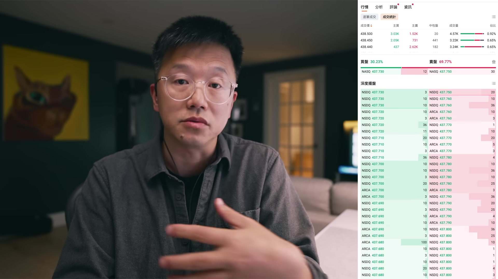
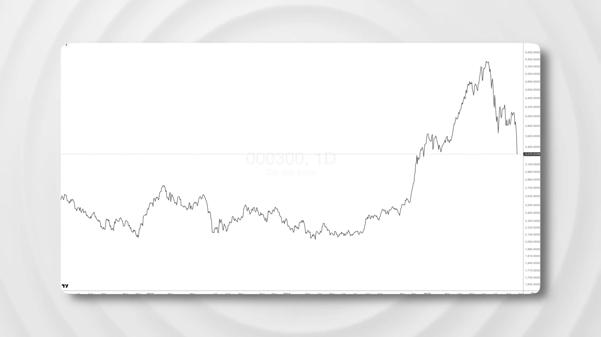

# themarketmemo_IMZgGZVQu2M — 關鍵畫面索引

- 來源逐字稿：[themarketmemo_IMZgGZVQu2M_GT.srt](themarketmemo_IMZgGZVQu2M_GT.srt)
- 影片：https://www.youtube.com/watch?v=IMZgGZVQu2M
- 截圖數：13

## 00:00:00

**逐字稿片段：** 流動性是什麼 簡單來說 流動性就是錢的流動的規模和速度 也可以說是資本的動量 流動性好的標的 買賣雙方的交易活躍 買賣價差比較小 交易量比較大 資本流動的速度也非常的快

**話題推測：** 介紹「流動性」這個主題

---

## 00:00:17

**逐字稿片段：** 而流動性比較差的標的 買賣交易通常是不活躍的 很長時間才會有一筆交易 買賣的價差非常大 那麼資本在其中的流動速度 也是非常慢 為了說明這個概念 我來舉一個例子 比如說市場崩盤 表面上看市場崩盤 是因為價格快速下跌 但實質上來說 所有的崩盤都是因為流動性枯竭 導致的一個連鎖反應的結果 崩盤通常來說 是由於某一個重大的利空事件 引起的 比如說

**話題推測：** 對比說明「流動性比較差的標的」的特徵

---

## 00:00:52

**逐字稿片段：** 2025年3月 美國總統川普對全世界 開打貿易戰 那麼面對這種突如其來的 並且是顯而易見的風險 市場上有一些這種先知先覺的資本 就會最先撤離市場 由此就產生了市場上的 最開始的大量賣壓 突如其來的大量賣壓 就打破了正常的這種供需關係 供需平衡 使得買盤不足 買盤不足 就會導致 引發價格的快速下跌 急跌又會導致後續的這些買家 逐漸的撤銷買單 那麼既然下價格會持續下跌 我不著急現在買 我等一等 將來也許有更好的價格 那麼這樣一來 這個市場的買盤 就快速的消失了 賣家為了儘快的成交 那就只能是不斷的 在更低的價格上面去尋找買單 這樣就進一步的 導致價格出現斷崖式的下跌 那麼買賣價差會進一步的拉大

**話題推測：** 以「2025年3月川普打貿易戰」為例，說明崩盤觸發事件

---

## 00:01:57

**逐字稿片段：** 這還沒完 價格繼續暴跌 對不對 價格的暴跌 會導致 大量的 使用槓桿的投資者 被催繳保證金 也就是所謂的margin call 甚至有一些小的券商 會直接強行平倉客戶的持倉 總而言之 市場去槓桿的過程 是不計代價的 而且這一些拋售的這些籌碼 在缺少買家的的一個市場中 將會進一步的 把價格推向一個極端

**話題推測：** 進入崩盤的下一階段：價格暴跌導致追加保證金(Margin Call)

---

## 00:02:28

**逐字稿片段：** 在這種狀況下面的強制平倉 首先會從一些 高風險的資產開始 那麼然後逐步的 蔓延到這些優質的資產 從而導致更大範圍的恐慌 和進一步的這種強制平倉 這就是崩盤的真相 它不是一個有序的退場 這樣的一個過程 它是所有人在同一個時間 朝著同一個狹窄的出口 的一種這種踩踏事件 在那個時候 資產的所謂的公允價值 所謂的內在價值 其實都不重要 唯一重要的是 這個時候我能不能夠脫離風險 儘快的兌換成現金 那麼價格的崩潰 本質上就是 我們說的這種流動性枯竭 導致的連鎖反應的最終的結果 那麼在災難當中 流動性好的標的 下跌的幅度相對小一些 如果要退出變現 也相對容易一些 而流動性比較差的標的 下跌的幅度通常是比較大的 買盤消失 甚至會出現你想賣都賣不掉的情況 甚至就是說 就算是賣掉 也是不得已要斷臂求生了 所以說到這裡 我想已經說明白了 流動性的重要性 這裡我再講一個小故事

**話題推測：** 說明強制平倉從高風險資產蔓延至優質資產的過程

---

## 00:03:51

**逐字稿片段：** 2015年6月 中國A股崩盤 當時我在上海 為什麼崩盤 說實話 我已經記不得了

**話題推測：** 提及「2015年6月中國A股崩盤」的具體事件

---

## 00:03:58

**逐字稿片段：** 不過2014年到2015年 這一年當中 A股的大牛市 確實是積累了巨大的漲幅 我和我的一些朋友 都是盈利非常的豐厚了 所以說市場剛開始下跌的時候 我們其實是在第一時間 做了股指期貨 做了對沖的 其實一開始的時候 下跌還是可以接受的 我們基本上一股都沒賣

**話題推測：** 回顧2014-2015年A股大牛市的背景

---

## 00:04:22

**逐字稿片段：** 後來跌勢擴大 就導致中國的證監會介入 他先是要求這種公募基金公司 不許賣出股票 然後禁止股票的融券做空 最後是禁止股指期貨 賣空開倉 甚至提高期貨的保證金

**話題推測：** 講述中國證監會介入市場，限制賣出與做空

---

## 00:04:40

**逐字稿片段：** 這樣一來 基本上就是把股指期貨的 對沖的功能 就給閹割掉了 這是壓倒駱駝的 最後一根稻草了 那麼既然我們沒有辦法對沖 那就只能是賣出股票了 所以說 股指期貨閹割令一下來以後 就大量的私募基金 就不得不賣股求生了 那麼這就加劇了 整個市場的下跌 這個就控制不住了 那麼政府為了控制住局面 那麼甚至派遣警察 到私募基金抓人 那麼也有一些消息說 一些著名的投資人 頂不住這種壓力 跳樓自決的都有 也正是因為這樣的一個 突如其來的崩盤 那麼以及在崩盤過程當中 中國政府的一系列的一些亂象 或者說是 一些不可理喻的事情 那麼 包括中國政治經濟 都感覺像是在開倒車的感覺 所以那個時候我就下決心 清倉 換匯 移民出海 那麼我目前的狀況 除了房產以外 我的絕大多數的資產 都是放在美股市場 和美債市場裡面 因此為了保障我自己的資金的安全 那麼我對投資標的的流動性 是有比較高的要求的 那麼這裡我也分享幾個經驗之談 供大家參考 第一個 對於長期投資的標的 對於股票來說 我只投資美股 三大交易所上市的股票 確保我的投資標的 是在嚴格的監管之下的 我從來不交易場外交易所 也就是OTC市場的股票 第二個就是說 我投資的股票 市值不應該低於10億美元 最近三個月的日均成交額 不能低於5000萬美元 請注意這裡指的是成交額 不是成交量 這兩個意義你多思考 我相信你能理解 為什麼是成交額 不是成交量 這是不同的

**話題推測：** 說明股指期貨對沖功能被閹割的影響

---

## 00:06:48

**逐字稿片段：** 那麼對於ETF來說 我要求ETF的資產規模 不低於100億美元 那麼最近三個月的日均成交額 不低於5000萬美元 市值 成交額 這兩個重要的指標 市值和成交額 是衡量流動性水平 最好的指標 市值越大的標的 那麼 100億的市值 和10億的市值 它能夠承載的資本的吞吐量 是不同的 市值越大的東西 那麼它能夠容納的資金也就越大 另外一個 成交額越大的標的 資本的流動性 流動速度就更快 那麼有一些股票日內交易 大概也就是幾十萬 上百萬美元 最多了 這樣的股票 基本上是沒有辦法 吸引長期投資者的 更不會有什麼大體量的 這種基金在裡面 這種小體量的股票 資金進出是非常困難的 但是 正是因為流動性不足 用很少的錢 就能夠撬動這隻股票 大幅上漲 這就使得 某些股價操縱行為 就有了可能性 這類股票 通常是日內交易者 最喜歡的品種

**話題推測：** 對ETF提出資產規模與日均成交額的要求

---

## 00:08:09

**逐字稿片段：** 流動性較差的股票 買賣盤相對的稀疏 對吧 這也意味著 一旦出現大的買盤 大的賣盤 那麼股價就會被劇烈的推高 或者是劇烈的壓低 日內交易 正是要捕捉這種 由於買賣失衡 所導致的快速的價格波動

**話題推測：** 解釋流動性差導致買賣盤稀疏，股價劇烈波動

---

## 00:08:32

**逐字稿片段：** 有時候幾分鐘之內 這個股票就可以大漲百分之之幾十 甚至翻幾倍 對不對

**話題推測：** 提及股票在幾分鐘內大漲甚至翻倍的可能性

---

## 00:08:39

**逐字稿片段：** 我以前也做過一些這種日內交易 最重要的日內交易指標 就是觀察相對成交量 比如說 一隻股票 它平時一天的成交量 大概也就是10萬股 或者說是10萬美元 但是某一天突然一開盤 第1個小時 就成交了10萬股 或者說是10萬美元 這說明 有熱錢進入了 做日內交易 就是要對這種 細微的價格的這種信號 要非常的敏感 要以最快的速度跟單進去 你就能吃到這一波漲幅 當然了 做這種交易 怎麼說呢 是一個雙刃劍 你有可能一分鐘之內 讓你賺個百分之幾十 那麼下一分鐘 也有可能讓你虧個百分之幾十 有時候明明是賺錢的 是浮盈的 但是因為流動性太差 平倉出局的時候 損失掉了 大部分收益 甚至搞不好還要虧損出局了 所以說絕大多數的日內交易 真正的交易 它的交易金額是不大的 他們的獲利 主要是靠很多個小筆的收入 叫積少成多 總之 日內交易 就是個體力活 這絕對不是一個叫什麼 賺最容易賺到的錢 這是很難賺到的錢 那麼今天我聊這個話題 主要是因為 近期有一些網友在提問的時候

**話題推測：** 講者分享自己曾做過日內交易的經驗

---
