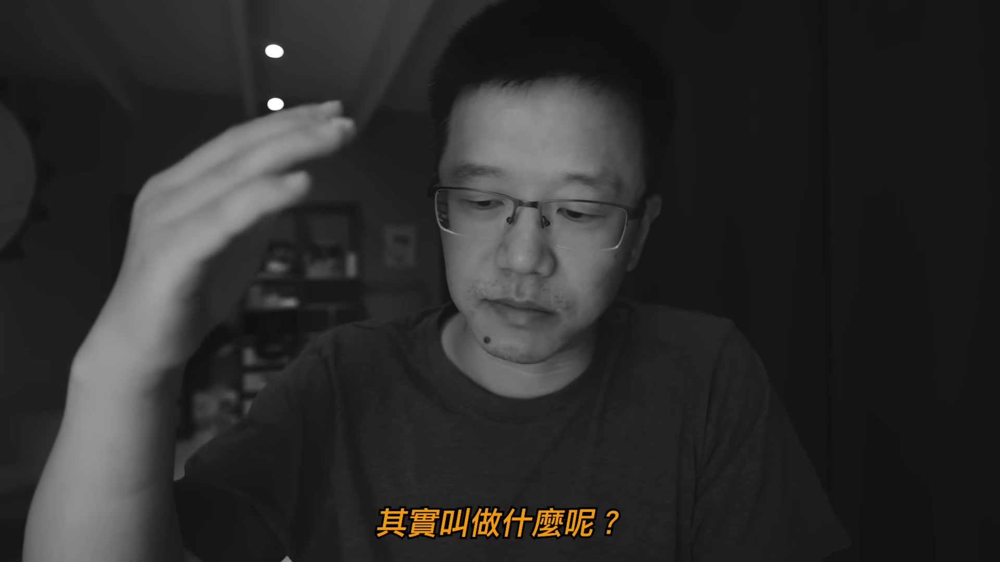

# themarketmemo_U1rRnRWnMz8 — 關鍵畫面索引

- 來源逐字稿：[themarketmemo_U1rRnRWnMz8_GT.srt](themarketmemo_U1rRnRWnMz8_GT.srt)
- 影片：https://www.youtube.com/watch?v=U1rRnRWnMz8
- 截圖數：20

## 00:00:00

**逐字稿片段：** 股票大作手回憶錄 這本書 可以說是股票交易者的一本經典書 這本書和 絕大多數市面上那些股票成功學不太一樣 它主要是講人性 它講思考 它講的是一種失敗的經歷 描述失敗的這種書籍 實在是太少太少了 這類書籍遠比那些所謂的成功學來得更有價值 所以今天呢？ 我打算開一個專題 聊一聊著名的股票大作手 Jesse Livermore的一些感悟 挑選他的一些經典的語句 來結合我自己的一些經驗 來分享一些我自己的看法 利弗莫爾說

**話題推測：** 影片開場，介紹《股票大作手回憶錄》這本書

---

## 00:00:46

**逐字稿片段：** 華爾街沒有新鮮事 投機像山嶽一樣古老 股市上今天發生的事 過去發生過 將來也必然會再次發生 這段話裡面呢？ 其實道出了 一個一個本質叫什麼呢？ 人之本性是 趨利避害的 那麼我們接觸過很多新進入市場的 一些投資者 一些交易者 他們很多人都幻想着什麼說呢？ 上漲的時候都有他的份 下跌的時候 他最好就已經不在了 或者說呢？ 是漲之前買入 跌之前賣出 這種心理狀態 這種心理狀態本質上就是叫做趨利避害 市場之所以有規律可尋 我們說就是因為是人性亙古不變 某些關鍵的價格某些關鍵的位置上出現 集體性的它會觸發 集體性的趨利避害的行為 這就使得我們有跡可循 這就是市場規律 所以才應了這一句話叫做 今天發生的事 過去發生過 將來也一定會發生 這就是市場規律 應該說我們交易的是什麼 我們交易的就是人性 當然有經驗的交易者 有經驗的投資者都知道 股市裡是沒有辦法 做到完全的趨利避害的 很多時候呢？ 我們要想獲得一個比較大的一個收益 就必須要忍受一定程度上的帳面損失 有時候呢 也要煎熬相當長的一段時間 這是成本 它也是代價

**話題推測：** 引用利弗莫爾的第一句經典語錄

---

## 00:02:27

**逐字稿片段：** 因此 我做交易的兩個基本原則 一個叫做 盈虧同源 另外一個叫做 盈虧比 每做一筆交易 這一筆交易進去在我的腦海裡頭 是沒有勝算之說的 都是盈虧各佔50% 那麼我只能說我儘量去找那種 能夠觸發人性趨利避害的那些關鍵位置 能夠有比較大的盈虧比 一旦是我做對了 我的贏面非常大 我能賺很多 那麼萬一我做錯了 我損失很少的那種位置 這樣的去做 相當於是什麼呢？相當於是 把我的風險回報比做到最優

**話題推測：** 講者提出自己交易的兩個基本原則

---

## 00:03:11

**逐字稿片段：** 利弗莫爾說漲跌總有原因 我十四歲的時候就從不問為什麼漲跌 我現在四十歲了 我依然不問 這段話呢？ 其實我自己也有我自己的一個解讀 那就是不聞不問 這個市場上 總有一些事情我們不知道 因此搞清楚為什麼（不重要） 你真正搞清楚的可能都是歷史 對於當下來說毫無用處 對於當下來說 當發生了一些事情 不要問為什麼 最重要的是考慮好怎麼辦 這就要求我們要有計劃 我們要有各種各樣的計劃 應對不同的可能出現的情況 要做推演 要對未來做一個大致的估算 完了以後呢 要有多個方案 也就是說出現什麼情況怎麼辦

**話題推測：** 引用利弗莫爾的第二句經典語錄

---

## 00:04:06

**逐字稿片段：** 你要有A計劃、B計劃和C計劃 因此 不聞不問 學會動態做推演 想好出現什麼情況怎麼辦 立即採取行動 而不是等待搞清楚原因再動手

**話題推測：** 說明應對市場的A、B、C多個計劃方案

---

## 00:04:22

**逐字稿片段：** 有些股票會莫名原因 出現一些不尋常的漲跌 這是我們第一時間可以看到的事實 是結果 也許收盤以後 或過一段時間你會看到相應的報道 這是以後的事情 原因比事實遲到了很多 市場上 總有一些先知先覺的人 他們總有他的信息渠道 他們有一些優勢啊 等等方面那麼也會有 一些叫做後知先覺的人 那麼先知先覺的人 帶動後知先覺的人來 第一時間 他們算是第一時間做出反應的人 他們的行動一定會在市場上 留下各種各樣的跡象 留下他們的痕跡 這就是所謂的出現一些 不同尋常的漲跌 那麼所以我在我的交易理念 或者說是交易系統當中呢 我非常重視市場的 一些重要的跡象

**話題推測：** 開始討論股票出現不尋常漲跌的現象，可能搭配走勢圖

---

## 00:05:28

**逐字稿片段：** 比如說大量 缺口 那麼某些關鍵位置突破前的 一些異常的情況 比如說均線多頭排列 或者說是不可避免的交叉 這些事情 都是用來觀察市場動向的一些重要的跡象 在交易高手的詞典裡面 是沒有原因 reason 這個詞的 而是另外一個詞 叫做驅動力 或者叫做催化劑

**話題推測：** 列舉觀察市場動向的重要跡象，例如大量、缺口、均線等

---

## 00:05:57

**逐字稿片段：** 英文叫做Catalyst Catalyst的目的是讓市場產生反身性 要讓更多的人 相信這個事情是這樣的 所以呢 市場就有了更多的動力 也就是說Catalyst的主要目的 是讓市場形成自我強化 於是自我強化能形成一個趨勢 因此利弗莫爾說立即採取行動 而不是等待搞清楚原因後再動手 這句話至關重要 這就是我以前也經常說這麼一句話 當你看見了一些跡象 看到了一些不同尋常的現象的時候 你必須在第一時間做出反應

**話題推測：** 介紹並解釋「驅動力」或「催化劑」(Catalyst)這個詞

---

## 00:06:39

**逐字稿片段：** 叫做 Trade what you see. 很多時候呢？ 交易是來自於一種怎麼說呢？靈感 它是來自於長期的嚴謹的訓練下 有時會產生一種直覺 說實話我的這個交易生涯當中 我無數次被我的直覺 所拯救 或者說是我有時候也是為自己 一些直覺交易感到很驚訝

**話題推測：** 引述並強調「Trade what you see.」這句交易格言

---

## 00:07:09

**逐字稿片段：** 在市場出現信號之前不要出手 我失誤的原因主要是不能堅持自己的交易原則 頻繁的交易是導致虧損的主要原因 我想呢？這段話呢？ 在股市中有閱歷的人都會有一些體會 應該說 很多時候交易的失敗 往往不是技術性的 不是不知道 也不是沒有事先的計劃 也不是不知道應該怎麼辦 而是情緒影響之下 導致的一種誤操作 或者是叫做 緒影響了智商 另外呢 就是由於太過豐富的想象力呢？ 會讓人情不自禁的去猜行情 今天在漲 那麼明天會不會漲呢？ 今天漲這麼多 明天會不會跌呢？ 今天跌這麼多 明天會不會反彈呢？ 人會有一種這種不由自主的去偏離實際情況去猜 去賭 這是萬萬要不得的 因此 在市場沒有出現 一些標誌性的動作 一些關鍵的跡象之前最好的動作就是不動 很多時候人 一旦有了一個猜想 一旦你的思想錨定在這一個猜想上 比如說今天大跌 明天會不會反彈呢？ 一旦你腦海裡頭冒出了 這麼一點點反彈 要去抄底的念頭的時候 你的行為已經就缺乏彈性了 假設明天不反彈 繼續跌 你根本就無法做出及時的反應 因此 千萬千萬不要去發揮你的想象 千萬千萬不要去猜不要去賭 一定要讓自己的交易 讓自己的行為 讓自己的情緒 保證在一個最佳的狀態 保持在最有彈性的狀態 讓你自己的交易系統處在一種比較怎麼說呢？ 叫做高度容錯的狀態下 所以新手的一個特點 最大的問題吧 應該說就是太過敏感 對一些小東西 特別特別敏感 還有呢就是太過勤奮 總是要做點什麼 其實叫做什麼呢？

**話題推測：** 提出「在市場出現信號之前不要出手」的交易原則

---

## 00:09:26

**逐字稿片段：** 不見兔子不撒鷹 獵物沒有一點動靜 沒有任何風吹草動的情況下 其實最好的辦法 就是不動 該幹嘛幹嘛休息去 不需要時時刻刻盯着市場的

**話題推測：** 引用俗語「不見兔子不撒鷹」，比喻等待市場明確信號

---

## 00:09:41

**逐字稿片段：** 股市上只有贏家和輸家 除此之外 再無其他 俗話說凡事皆有兩面性 但股市只有一個面 既非牛市的一面也非熊市的一面 而是正確的一面 這段話呢？ 我實際上用了很長的時間才悟到 什麼叫做把事情做對呢？ 這也是我經常說的 不要太在意盈虧 儘量把事情做對 那麼什麼叫把事情做對呢？ 兩件事

**話題推測：** 引用利弗莫爾關於股市只有「正確的一面」的觀點

---

## 00:10:14

**逐字稿片段：** 第一 要有計劃 第二 要按計劃行事 這兩件事相當於一個人的兩條腿 它必須是協同着走的 你不能一條腿走路 即使做錯了 你可以不斷的修改 不斷的迭代 不斷地修正 完了以後讓你的這兩條腿的走路姿勢 做到一種最優化 最協調 無限接近正確 但是如果說沒有計劃或者說 你有計劃不按計劃行事 那 你就無法去協調無法去修正和迭代 讓它去進步 簡而言之 如果你是一個每筆交易 前都願意花一點時間去做計劃的人 並且呢？ 你在不斷的實踐過程當中不斷的去迭代 修正你的這些交易邏輯和你的計劃 長遠來看 你必定是個贏家 失敗的教訓讓 我明白一個道理

**話題推測：** 列出把事情做對的兩個關鍵要素：計劃與按計劃行事

---

## 00:11:16

**逐字稿片段：** 只有當我確信自己不會賠錢時才出手 如果我不能確信一定賺錢 那我就按兵不動 出手後發現不對 必須及時止損 必須果斷 這段話呢？ 我有我自己的理解 啊 那麼首先 股市裡沒有確定性 沒有人能夠確定自己一定不賠錢 沒有人能做到 但是 某一些位置或者說是某一些特殊的形態 如果說這個形態出現了變化 如果行情按照我希望的方式走出來 我可能會賺很多 而萬一行情不按着我的思路走 走反了 那麼我止損認錯出來 我的這個虧損很小 這就叫做什麼叫做高盈虧比的位置 另外 還有比如說是多週期共振的位置 一旦說是成功了 這個行情反轉了 或者是行情突破了 則會在多個週期內 同時打開空間 那麼這種位置都是值得去交易的位置 而這種位置機會都是很難得的 要耐心等待獵物靠近 等待機會 等待的是什麼機會呢？ 等待的就是這個機會 當然了即便如此 我們雖然說廟堂之算 我們算了很多 結果呢？萬一這個行情沒有 按照我們的思路在走 這也沒什麼 任何這種我們說叫做盈虧同源 你即使算的很清楚 你想的很明白進去以後你還是要做好失敗的 這種準備的 因此呢？

**話題推測：** 引用利弗莫爾關於「確信不賠錢才出手」的原則

---

## 00:12:50

**逐字稿片段：** 我就有一個叫做交易三問這麼一個東西就是說 為什麼做這一筆交易 這就是說 逼迫我們去思考這一筆交易的邏輯是什麼 我的計劃是什麼 比如說我是因為這個關鍵位置 因為一個盈虧比 很高的位置 我又去做這一筆交易好 既然你打算做這一筆交易馬上第二個問題 就是說 你的預期是什麼 那麼我預期這個位置如果說得到突破 那麼上行空間大概有百分之多少 萬一這個突破不成功 或者說是失敗了 那麼跌下來呢？我要止損 那麼止損位置空間是多少 贏面除以虧面 大概的這個盈虧比是多少 哎 你看這就是盈虧比就算出來了 那麼也就是說先搞清楚為什麼做這筆交易 第二個搞清楚你的預期是什麼 然後搞清楚 你的底線是什麼 算出盈虧比那麼就好 不達預期 也沒有跌破底線 那怎麼辦 你就拿着不動 那麼達到預期兌現走人 跌破底線止損走人 這就是紀律 這就叫做

**話題推測：** 講者提出自己的「交易三問」原則

---

## 00:13:56

**逐字稿片段：** 計劃你的交易 交易你的計劃 另外呢？ 還有一個 我自己很重要的一個原則 當然 這是一個非常彈性的原則

**話題推測：** 強調「計劃你的交易，交易你的計劃」這句交易紀律

---

## 00:14:05

**逐字稿片段：** 叫做 讓自己舒服 當一筆交易也許 你計劃得非常好 非常周密 行情也按照你的思路在走 但是 有些行情會讓你的情緒不可控 也就是說 要避免情緒影響智商 如果你發現這筆交易 這個市場的波動已經讓你的情緒 發生了波動的情況那麼怎麼辦 如果是我的話 我就會讓自己舒服 把倉位降下來 或者實在不行 這筆交易就不做了 總而言之讓自己舒服 那麼很多時候 我前面也說了 很多時候交易上的成敗 不是說你的技巧 你的能力 你的知識不是這些東西 重要的是你的心態 心態沒了什麼都沒了

**話題推測：** 講者提出個人交易原則：「讓自己舒服」

---

## 00:14:51

**逐字稿片段：** 一定要有自己的方法 一定要到市場中去驗證自己的方法 只有賠錢了 才會認識到自己的方法錯了 而掙錢則是證明自己是對的 投機就是這樣 這段話呢 也對也不對 我們不能簡單的說 賺錢就是對 虧錢就是錯的 因為你不加上時間 不加上一個整個的一個邏輯在裡面的話 你失去這個前提 只看結果 其實是不對的 我們不能以成敗論英雄 因為在投資市場上 在交易領域沒有絕對的對錯 你今天止損出來了 它明天大漲又回去了 你很難說你當時的判斷是正確還是錯誤的 但是有一點是肯定的就是說 任何人的方法理念都是基於他自己的 這個知識結構框架下的產物 它是有一個前提的 這個前提很重要 如果我不具備巴菲特那樣的知識結構 這種框架 那麼說實話 我們也就無法去踐行他的那個理念 因此投資交易其實是一個非常非常 個人化個性化的一件事情 所以說呢？

**話題推測：** 引用利弗莫爾關於驗證交易方法的說法

---

## 00:16:08

**逐字稿片段：** 要找到自己的Niche 要找到自己的Edge 要找到自己的Limit 其實非常重要 就是說你要有自己的 比較優勢 你也要知道 自己的認知侷限 這非常非常重要 一個能夠把自己的性格特徵 融合進去的投資方式 或者說是交易方法 那一定是最好的方法 就比如說我自己的方法就是說

**話題推測：** 提出要找到自己的「Niche」、「Edge」和「Limit」等關鍵詞

---

## 00:16:35

**逐字稿片段：** 均線系統動態推演的這種方式磨合正確的 一種交易的態度 那這種東西它是一個自成閉環 它是符合我的個性 符合我的這種認知結構的 那麼 這種東西 它就有點像是 長在你身體裡面的一種東西 它會逐漸的成為你的一種本能

**話題推測：** 講述自己的具體交易方法：均線系統動態推演

---
