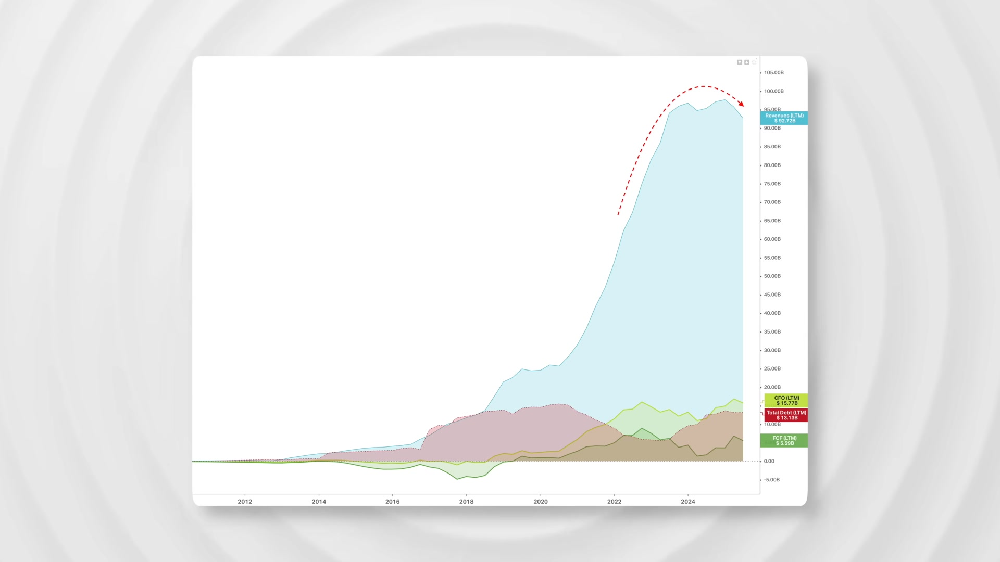
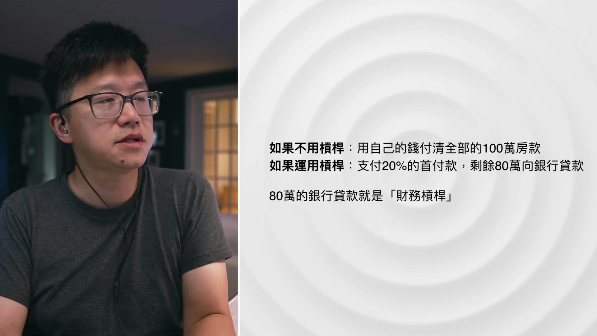
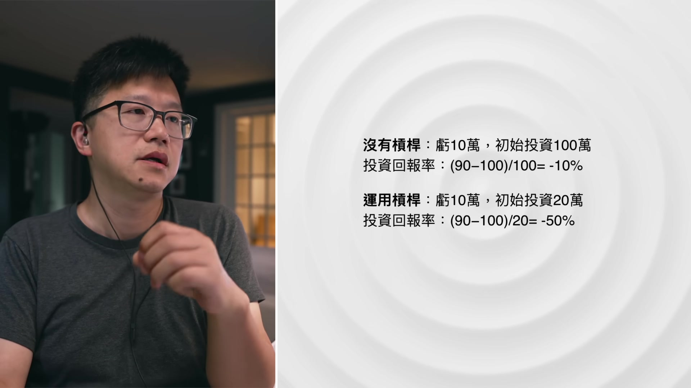
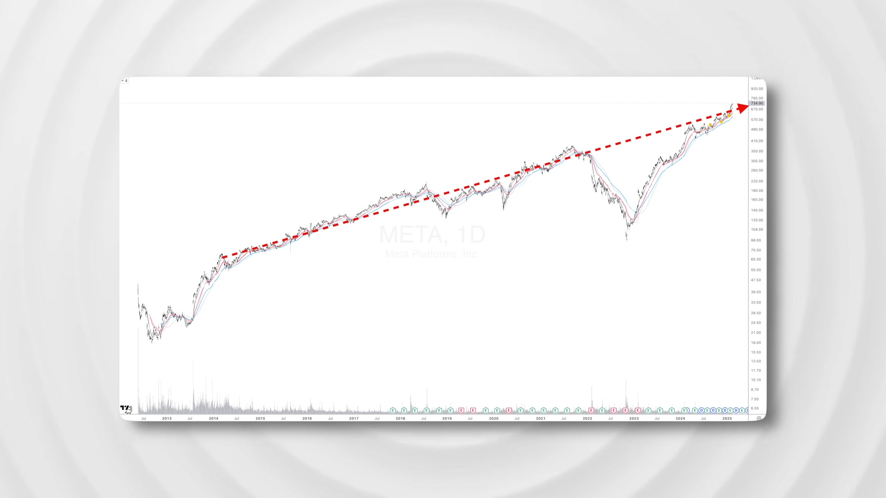
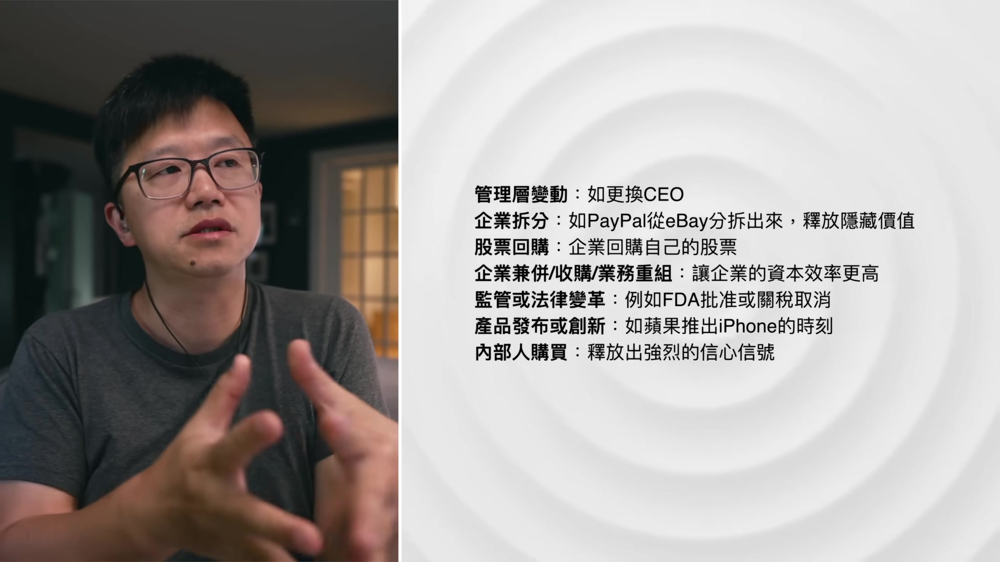

# themarketmemo_YtPfvTaSE8k — 關鍵畫面索引

- 來源逐字稿：[themarketmemo_YtPfvTaSE8k_GT.srt](themarketmemo_YtPfvTaSE8k_GT.srt)
- 影片：https://www.youtube.com/watch?v=YtPfvTaSE8k
- 截圖數：17

## 00:00:18

**逐字稿片段：** 首先我們來看看慣性這個概念 慣性這個概念是來源於 艾薩克·牛頓的第一運動定律 它是這樣描述的 一個物體如果說沒有受到外力作用 它會保持原來的運動狀態不變 也就是說 靜止的物體會一直保持靜止 那麼運動中的物體會保持運動 並且以相同的速度和方向來進行運動 直到有外力來改變 那麼在現實的商業環境當中 企業的經營也是有慣性的 優秀的企業往往會傾向於保持優秀 那麼平庸的企業也會持續的平庸下去 那麼除非有外力去改變他們的慣性 外力可以是某一個經營決策 某一個產業政策 或者說重大的科技進步 所以說在評估企業基本面的時候 我會比較注重企業的商業基本面的慣性 這個慣性很重要

**話題推測：** 介紹「慣性」的概念，預期為標題或定義畫面。

---

## 00:01:17

**逐字稿片段：** 主要是考察兩個方面 那麼第一個方面就是說 企業的運營慣性是怎樣的 第二個就是觀察 慣性是否有重大的變化 具體來說 我會比較喜歡的企業是 收入規模比較大 增長也是保持一個比較穩定的姿態 那麼運營利潤率保持一個比較平穩的 比較高的水平 那麼接下去就是運營現金流 是跟隨著收入增長而增長的 並且保持 現金流和收入的比率 是一個比較平穩的比率 滿足這三個條件 我會認為這家企業有比較好的 向上的這種經營慣性 那麼有慣性的企業 我們才能夠給出合理的預期 這一點非常重要 預期就是在慣性的路徑上的 未來的某一個點 對吧 我們可以有慣性 我才能預期那個點

**話題推測：** 說明考察企業慣性的兩個方面，預期為列表或圖表。

---

## 00:02:16

**逐字稿片段：** 金融就是一個預期的遊戲 我們經常會看到某股票財報超預期 然後股價大漲 為什麼會大漲 因為超預期表明企業的慣性 在加速 斜率在加速 那麼很顯然投資者預期的未來的回報 也會加速 有一些財報不及預期 它大跌 這也很好理解 就是說 因為不及預期 導致了它原有的上升的慣性 發生了減速 對吧 那麼投資者預期未來的點 也要下降 投資者預期的回報也要降低 所以說一家企業的經營慣性 發生了不好的變化 要麼是企業的內部出了問題 要麼是企業的外部經營環境出了問題 無論如何 那麼經營慣性開始減速 或者下降的這些股票 是千萬要當心 千萬要警惕的

**話題推測：** 轉向討論金融市場中的「預期」與股價表現，預期為新的概念畫面或案例。

---

## 00:03:16

**逐字稿片段：** 但是我們都知道 市場的變化 是發生在基本面之前 市場會先於基本面發生變化 那麼等到我們說 看到了財務報表上 看到數據上 已經慣性發生變化的時候 實際上股價已經大幅下跌了 那麼因此在我看來 股價的慣性變化 遠遠要比基本面的慣性變化 更值得重視 很多時候價格的變化 會告訴我們一些不為人知的消息 也許我們暫時還不知道 將來等財報出來了 消息出來了 為時已晚 所以說根據我自己的 多年來的實踐經驗 當然也是受到前面我說 這個牛頓的 這個啟發

**話題推測：** 將討論從基本面慣性轉向股價慣性，預期為對比或新的分析角度畫面。

---

## 00:04:03

**逐字稿片段：** 那麼我發現了 我自己的 叫做金融市場第一定律 我的金融市場第一定律 這個定律是這樣描述的 在金融市場中 如果說價格波動 不受到外力影響 不受到外力作用 那麼它將保持原有的方向 並加速運行 這裡和牛頓是不一樣的 牛頓是勻速運行 我這裡有一個加速運行 之所以會加速 是因為 人性是有這種貪婪恐懼的特點 人性貪婪 會使得是一個上升的慣性 自然會加速 那麼人性的恐懼 也會使得下降的趨勢 下降的慣性 自然的加速 那麼所以說金融市場和 自然科學裡面略有不同 所謂的價格慣性 就是我們經常說的一個趨勢 那麼我有一個影片 專門是講這個趨勢的 那麼有興趣的網友可以去看一下

**話題推測：** 提出講者自己的「金融市場第一定律」，預期為重要的定律說明畫面。

---

## 00:05:01

**逐字稿片段：** 接下去就是說 與慣性相關的 另外一個概念 就是動量 所謂動量就是 科學的描述叫做 動量等於質量乘以速度 那麼動量模型告訴我們 就是說企業的商業規模越大 那麼它的競爭優勢就越是明顯 比如說像谷歌 像微軟 像Amazon這種超大的企業 他們的生意巨大 那麼他們的優勢 是許多中小企業 是難以與其抗衡的 那麼他們吸收資本 吸收人才的這種能力 也是巨大的 那麼在金融市場當中 也是同樣的道理 體量越大的企業 或者說 市值越大的企業 一旦形成上漲 或者說下跌的慣性 就很難停下來 或者會形成那種 強者恆強的這種馬太效應 弱者恆弱 這就是動量

**話題推測：** 介紹第二個重要概念「動量」，預期為標題或定義畫面。

---

## 00:05:56

**逐字稿片段：** 那麼我們把慣性和動量 結合起來看 給我們一個投資者的 一個重要的提示 要去投資那些 細分行業當中 生意規模比較大 並且他們的生意慣性 和價格慣性 都同時向上的企業 要投資那些強於大盤的企業 投資這一類股票 是最容易賺到錢的方式 儘量去遠離那些 慣性是向下的 不管它是基本面慣性 還是價格慣性 同時是往下走的這種企業 儘量就不要去碰它 儘管有些這種股票 看上去很便宜 按照所謂的估值來看 很低 但是估值低 一定有低的道理 只是你暫時不知道而已 所以說不要與趨勢作對 不要與慣性作對 關於估值 那麼我這裡也有一篇文章 有興趣的網友 也可以去看一下 估值不是越低越好 那麼估值高 也不見得是壞事

**話題推測：** 結合慣性與動量，給出投資建議，預期為總結或 actionable advice 畫面。

---

## 00:07:00

**逐字稿片段：** 第三個我們來說說槓桿 阿基米德說 給我一根槓桿和一個支點 我可以撬動地球 槓桿簡單來說 就是用少量的資源 去產生更大的結果

**話題推測：** 介紹第三個重要概念「槓桿」，預期為標題或定義畫面。

---

## 00:07:13

**逐字稿片段：** 舉例來說 如果你想買一棟價值100萬的房子 用於投資 如果說不用槓桿 你就必須要自己付清全部的100萬 如果用槓桿 你可能只需要支付20%的首付款 也就是20萬 那麼剩下的80% 或者說80萬 向銀行貸款 這80萬的銀行貸款 就是你的財務槓桿 那麼接下去

**話題推測：** 以購買房產為例，解釋槓桿如何運作，預期為數字案例或圖示。

---

## 00:07:38

**逐字稿片段：** 我們來看兩種情況 第一種情況是房價上漲 假設一年後 房子的價值 從100萬漲到110萬 漲幅為10% 在沒有槓桿的情況下 你賺了10萬 你的投資回報率 就是10% 假設你使用槓桿 同樣是賺了10萬 你的初始投資只有20萬 所以你的投資回報率 是110萬減去100萬 再除以20萬 你的投資回報是50% 但是任何事物 它都是有兩面性的 槓桿的一面是會加大利潤 它的另外一面就會加大風險

**話題推測：** 展示房價上漲對槓桿投資的影響，預期為計算結果或對比圖表。

---

## 00:08:17

**逐字稿片段：** 如果說房價下跌了10% 那麼從100萬跌到90萬 在沒有槓桿的情況下 那麼你的賬面虧損就是10% 但是在有槓桿的情況下 你的賬面虧損 就是90萬減去100萬除以20萬 虧損幅度是50% 那麼這個例子

**話題推測：** 展示房價下跌對槓桿投資的影響，預期為計算結果或對比圖表。

---

## 00:08:35

**逐字稿片段：** 可以得出這樣一條經驗 就是在我們投資上面 我們儘量去投資 那些慣性向上的行業 首先找行業 因為大環境不好 你很難保證說 企業個體能夠怎樣 在慣性向上的行業當中 景氣度比較高的行業當中 去投資那些槓桿率 相對比較高的企業 那麼投資這種槓桿率相對高的企業 就會比 那些投資槓桿率相對低的企業 更容易獲得更高的回報 但是在慣性向下的行業 景氣度向下的行業當中 槓桿率低的企業 往往會有更好的韌性 更容易從這種逆境當中去翻身 記住這一點 這些說到底 都是我花費了巨大的代價 從市場裡學來的經驗 那麼我建議你拿個小本 記下來

**話題推測：** 從槓桿案例中得出投資經驗，預期為總結性建議畫面。

---

## 00:09:38

**逐字稿片段：** 接下去我們再來聊一聊 催化劑這個概念 很多時候 我們會發現某些企業 明明基本面還不錯 但是股價就是不漲 然後突然間 因為某一件事情 在幾個月很短的時間之內 就股價快速翻倍幾倍 這樣漲上去 那麼這種突然來的變化 我們通常把它稱之為 叫做催化劑 在投資的世界裡 催化劑的作用就在於 讓投資者意識到 那個期待已久的變化已經來臨 讓市場產生一種共識 讓企業的價值 迅速的得到認可和釋放 怎麼理解 Meta是一個非常好的例子 在2022年 扎克伯格曾經豪賭元宇宙 我們都知道 甚至把自己的公司的名字 都改成了Meta 那麼由此可見 小扎的決心 是非常大的 他想賭這一把 但是投資者並不認可 投資者其實很現實 他們是要看到每股收益 你收益是怎樣的 我來評估你的價值 你那麼賺錢的廣告生意不在乎 不好好去做 非要去搞那麼一個 一個投錢無底洞 還目前還找不著邊際的 這麼一個元宇宙 所以說投資者就拋棄了Meta 那麼Meta的股價 一度暴跌了70%多 儘管它的核心廣告業務 還是在增長的 企業的基本面 並沒有發生根本改變 但是元宇宙這件事情 成為了Meta股價 暴跌的一個導火索 或者說是催化劑 然後在2023年 Meta宣佈 實施所謂的績效年 那麼他們開始大幅的削減成本 重新專注於廣告業務 那麼結果也是立竿見影的 立即就受到了投資人的認可 那麼投資人認為 這家企業本身的基本面還是好的 只是你暫時偏離了軌道 那麼你重新回到軌道 那麼我再重新認可你 所以股價也從最低點 一口氣漲了差不多9倍 又回到了原來的上升的 這樣的一個慣性上面

**話題推測：** 介紹第四個重要概念「催化劑」，預期為標題或定義畫面。

---

## 00:11:56

**逐字稿片段：** 那麼再比如說 英偉達這隻百倍股 那麼它也是經歷了幾次 重要的催化劑加速 才成就了今天 全球市值最大的企業 一次是比特幣挖礦的需求爆發 再一個就是 AI算力的需求爆發 當然了老黃的商業嗅覺 商業眼光 讓這家企業 提前佈局了AI算力晶片 但是真正的催化劑 還是在2022年底 OpenAI推出ChatGPT這件事情 一下子讓投資者意識到 那個期待已久的事件 終於來了 也就是老黃佈局AI晶片 這件事情 終於得到了投資者的認可 那麼英偉達這個股價 瞬間就進入了這種

**話題推測：** 以英偉達公司為例解釋催化劑作用，預期為英偉達股價走勢圖或公司相關新聞畫面。

---

## 00:12:47

**逐字稿片段：** 加速的狀態 投資中常見的催化劑 大概總結一下 有下面幾種

**話題推測：** 總結常見的投資催化劑類型，預期為列表畫面。

---

## 00:12:52

**逐字稿片段：** 第一個比如說是 管理層變動 更換CEO之類的 第二個就是企業拆分 比如說之前PayPal 從eBay當中分拆出來 那麼釋放了PayPal的隱形價值 第三個就是股票回購 相當於是管理層 告訴投資者 這個股價是低估的 那麼股價也可以一飛沖天 那麼第四個就是 企業的兼併、收購、業務重組等等 就讓企業的資本效率 變得更高 這是在企業內部的 進行的一個變革 第五個就是說 監管或者說是法律上的變化 比如說某某藥企 突然得到了FDA的批准 某某企業 突然因為關稅方面的變化 產生了一個重大的變化 就外部環境變化 導致成為它的催化劑 那麼另外就是說 某些新產品的發佈 比如說蘋果發佈iPhone 新的iPhone 那麼會一下子會刺激股價 還有一個就是說 內部人士 買自家的股票 那麼釋放出一種強烈的 信心 這樣的一種 一種觀念 總之催化劑 我們也可以看作是一種外力 但是催化劑並不改變 企業內部的基本面特徵 它是什麼還是什麼 那麼也不會改變外部環境 它只是 催化劑只是把企業本身的這種能力 和外部環境這兩個東西 忽然間把它聯繫在一起了 把它結合在一起了 讓企業價值快速的釋放出來 有很多企業 它本身的素質就非常好 甚至股價已經做好了 爆發前的各種各樣的準備工作 你會發現它已經跌不下去了 它已經開始在橫向整理了 在積極做準備了 這個均線系統 市場認可度 慢慢消息也開始好起來了 但是它就是需要一個催化劑 那麼如果你懂這個行業 你就會明白哪些事情 可能會成為催化劑 你懂 你就能賺到這種錢 有時候這種回報也是非常高的

**話題推測：** 列出第一種催化劑：管理層變動。

---

## 00:15:12

**逐字稿片段：** 那麼對於美股市場整體上來說 市場一旦動起來了 形成了慣性 它就會保持慣性運行下去 那麼直到有一個外力 或者說是某個催化劑 來改變慣性 但是我們回顧美股的百年曆史 我們會發現 雖然中間有無數次的干擾 但是市場的慣性一直是向上的 沒有被改變過 好 那麼今天的影片 我們就聊這些 希望對你有啟發 感謝收看 拜拜

**話題推測：** 總結美股市場的整體慣性，預期為長期美股走勢圖。

---
