# themarketmemo_hDOZ5n9PJFI — 關鍵畫面索引

- 來源逐字稿：[themarketmemo_hDOZ5n9PJFI_GT.srt](themarketmemo_hDOZ5n9PJFI_GT.srt)
- 影片：https://www.youtube.com/watch?v=hDOZ5n9PJFI
- 截圖數：24

## 00:00:06

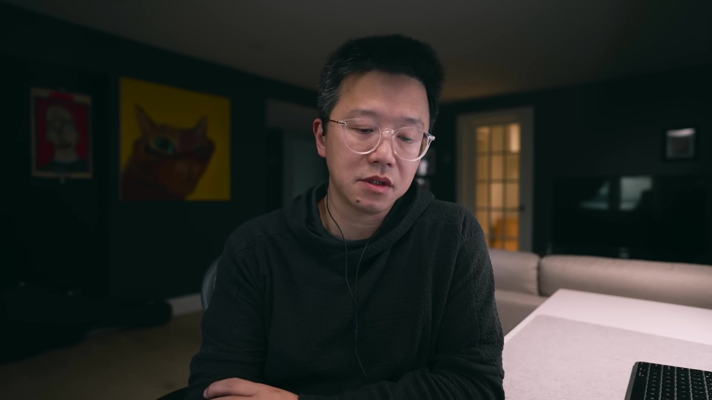

**逐字稿片段：** 如果辭去你的工作 做全職投資需要具備哪些條件 首先我想說投資是一門生意 既然是生意 它就需要有一套 切實可行的 能夠盈利的這樣的一個商業模式 而不是靠運氣 對於全職投資者來說 你需要有一套完整的投資策略 比如說投資哪一個市場 投資哪一類標的 然後是怎樣進入 怎樣退出 對吧 資金的配置是怎樣的 等等等等 有很多人認為職業投資者 就是那種特別會選股票的人 然後買幾隻股票放在那不動 長期持有就完事了 其實不是這樣的 作為職業投資者 最大的挑戰 你要記住 沒有人給你發薪水 你的日常生活的現金流從哪裡來 除去生活之外 一些重要的硬軟件支出之後 你還有多少自由現金流 可以用於持續的投資 這很重要 那麼最重要的是 現金流還必須要非常的穩定 你不能吃了上頓沒下頓 對不對 所以說這就牽涉到一個 資產配置的問題 有多少比例去配置在 增長型的資產上面 有多少比例配置在固定收益的品種上面 獲取現金流 我之前分享過一個Hi5組合 你可以把它看作是一個生意 那麼這個生意有非常清晰的 盈利模式 和盈利預期 我們來拆解一下 首先Hi5組合 它投資美股市場

**話題推測：** 影片主題：做全職投資所需條件的介紹

---

## 00:01:37

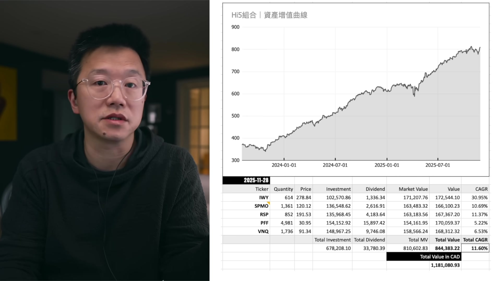

**逐字稿片段：** 其次它不投資個股 它只是投資指數型的ETF Hi5組合當中 最重要的核心資產就是RSP 它是用來獲取 美股市場的平均回報的 此外還有兩隻ETF IWY和SPMO 它是用來獲取 超越市場平均的回報的 那麼另外還有兩隻ETF 是用來獲取現金流的ETF 比如說VNQ和PFF 所以說這5只ETF 構成了一個有機的系統 其中40%是用來 產生現金流的 另外60%是用來提供 資產增值的部分 這個組合我採用的是 DCA加BTD的投資方式 也就是說 我每個月都會有一筆 固定的金額投入進去 然後在市場 持續下跌的過程當中 我還會增加投入

**話題推測：** 說明Hi5組合的投資標的：指數型ETF而非個股

---

## 00:02:33

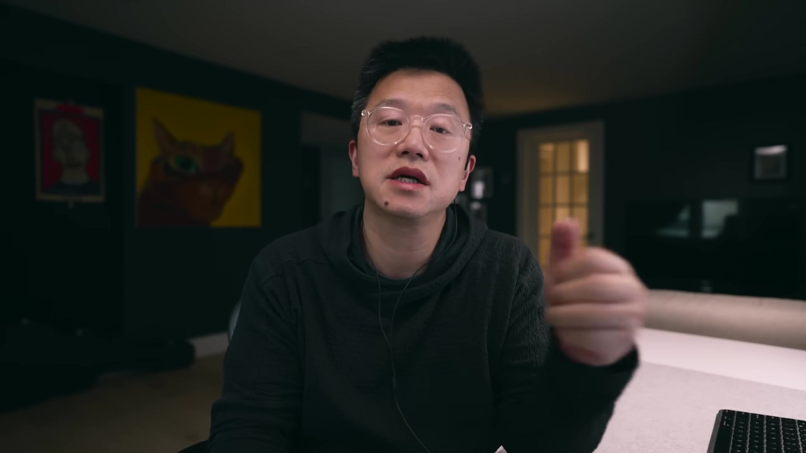

**逐字稿片段：** 這是詳細的交易規則 目前這個組合 它的規模還比較小 它會慢慢長大 將來有一天 它的內部產生的現金流 不僅可以養活我 同時它還能夠有 它持續的自由現金流 來維持組合的自動運轉 這是我希望達到的目標 這個組合 它本身就是一個完整的系統 你把這個系統交給任何人 它都可以執行 都可以自動的運轉 都可以達到相同的效果 這才是生意 我認為生意 不應該是 非得要我在裡頭 如果說離開了我 這個生意就玩不轉了 那說明這不是一個生意

**話題推測：** 說明詳細的交易規則

---

## 00:03:16

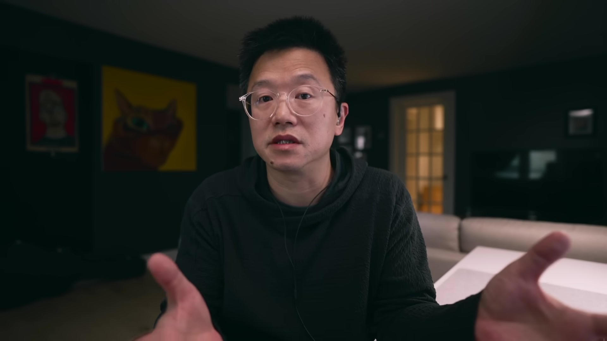

**逐字稿片段：** 這只是一個項目 最後生意的 盈利預期 也是非常明確的 通過對這5隻 ETF的歷史數據回測 以及目前兩年多以來的 運行情況來看

**話題推測：** 討論Hi5組合的盈利預期

---

## 00:03:26

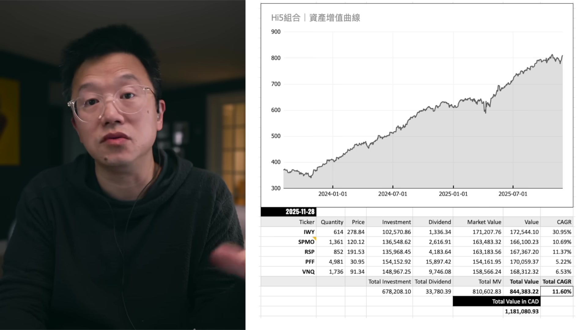

**逐字稿片段：** 它的年複合增長率 差不多就是10%左右 有了一個明確的盈利預期

**話題推測：** 提出年複合增長率的預期數字：10%左右

---

## 00:03:32

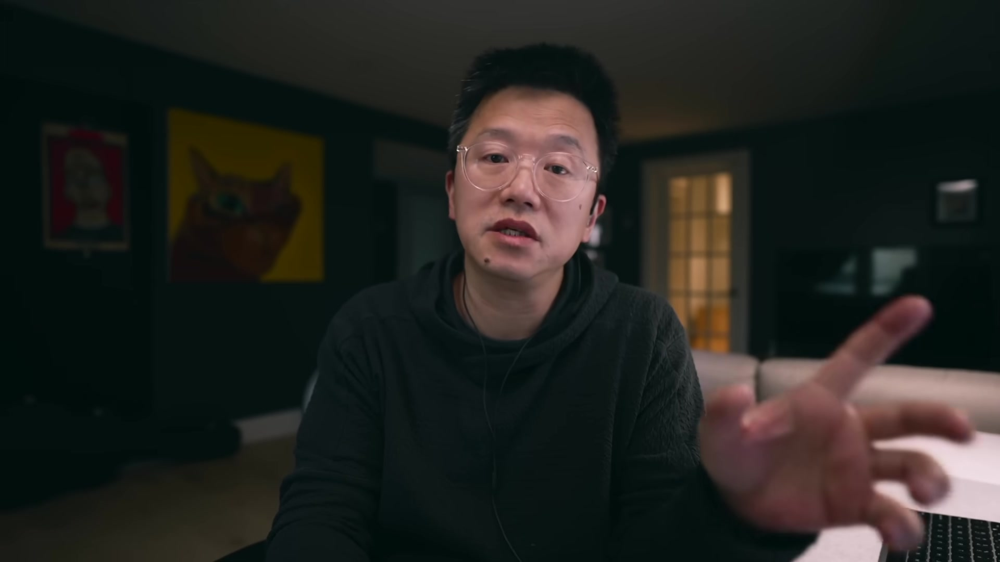

**逐字稿片段：** 我就可以估算出這個生意 大概在第10年的時候 它的價值大概會達到327萬美元

**話題推測：** 預估Hi5組合十年後的價值：327萬美元

---

## 00:03:39

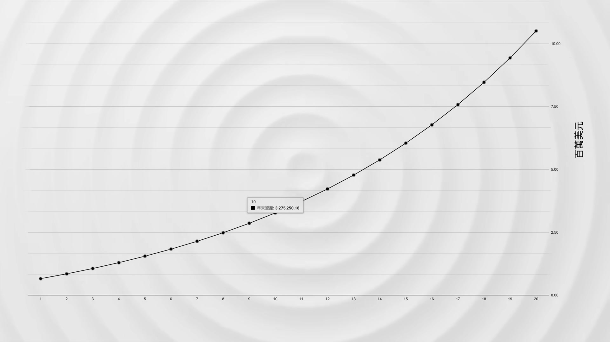

**逐字稿片段：** 在第20年的時候 這個生意的規模可以超過1000萬美元 我舉這個例子的目的是想表達 如果說你想做一個全職的投資者 你就需要把投資 當做一個生意來做 你需要建立一個類似於這樣的系統 或者說要建立一個盈利模式 讓這個系統為你掙錢 而不是你非常辛苦的 每天坐在電腦面前 去做交易 去掙錢 不是這樣的 那麼最重要的 是在你睡覺的時候 它依然能夠為你賺錢 甚至你把這個系統 交給別人去管理 它依然可以為你掙錢

**話題推測：** 預估Hi5組合二十年後的規模：超過1000萬美元

---

## 00:04:18

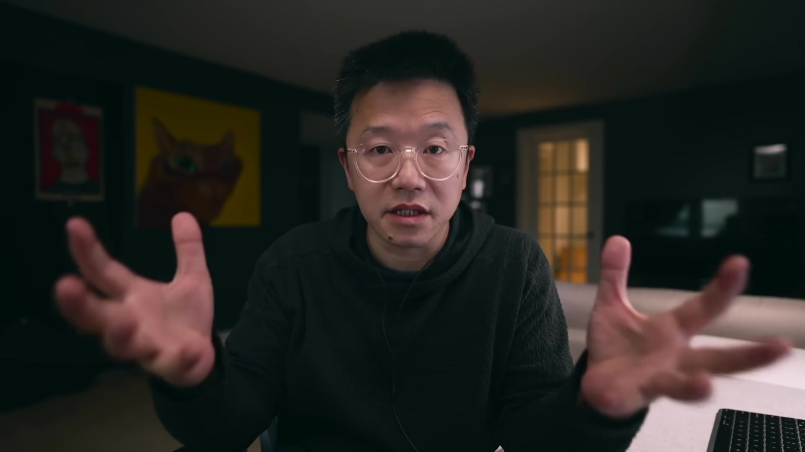

**逐字稿片段：** 除此之外 作為職業投資者 你不能只有一種盈利模式

**話題推測：** 引入新的概念：職業投資者不應只有一種盈利模式

---

## 00:04:23

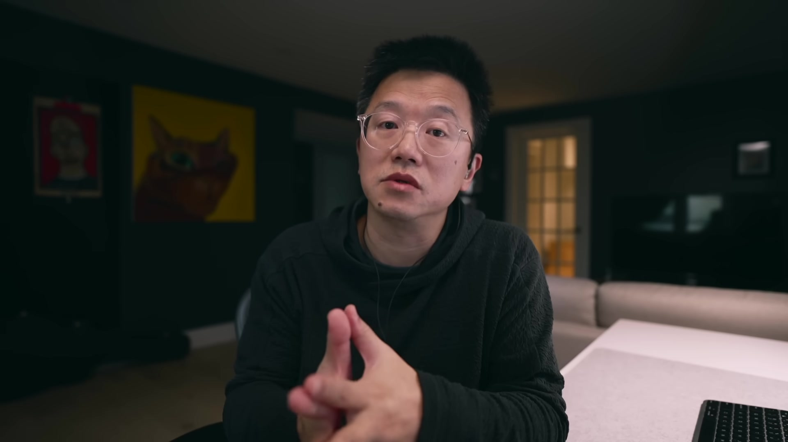

**逐字稿片段：** 比如說 我並不只有這一個Hi5組合 我還有其他的組合 有完全主動交易的系統 有完全被動交易的系統 還有半主動半被動的系統 有專門投資股票的系統 有完全不投資股票的系統 也有股票和其他的標的 混搭在一起的系統等等 不同的系統 我使用不同的賬戶 它們之間相互不干擾 這就有點像

**話題推測：** 開始列舉其他類型的投資組合

---

## 00:04:50

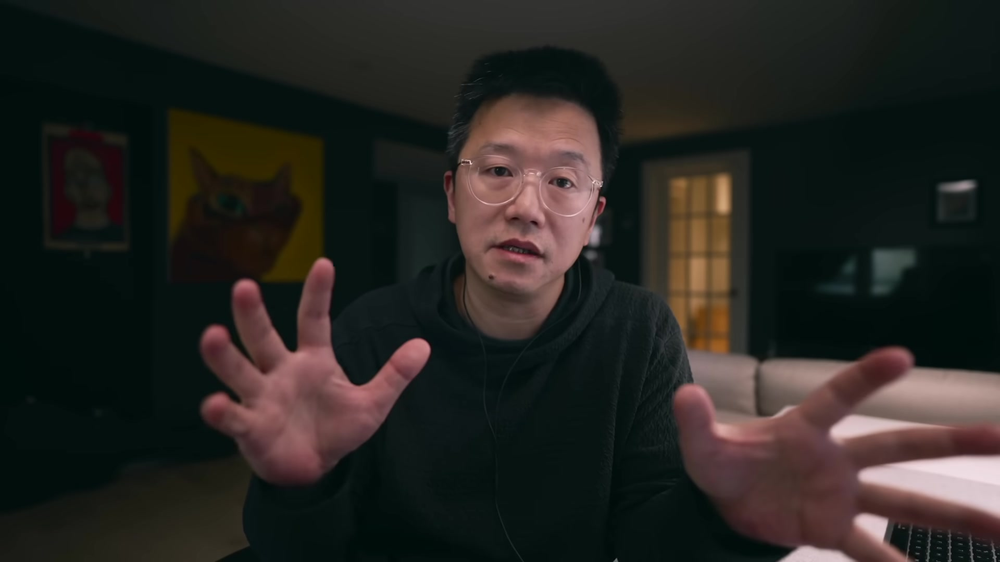

**逐字稿片段：** 我有一個集團公司 那麼集團公司下面 有許多的子公司 做不同的生意 但是它們之間 有互補 它們為我提供不同類型的收益 同時它們之間 也有一定的風險抵消的作用 總而言之 作為職業投資者 你需要用這樣的系統化的方式思考問題 有了成熟的系統 你就具備了 職業投資者的技術條件

**話題推測：** 使用集團公司與子公司比喻多樣化的投資系統

---

## 00:05:19

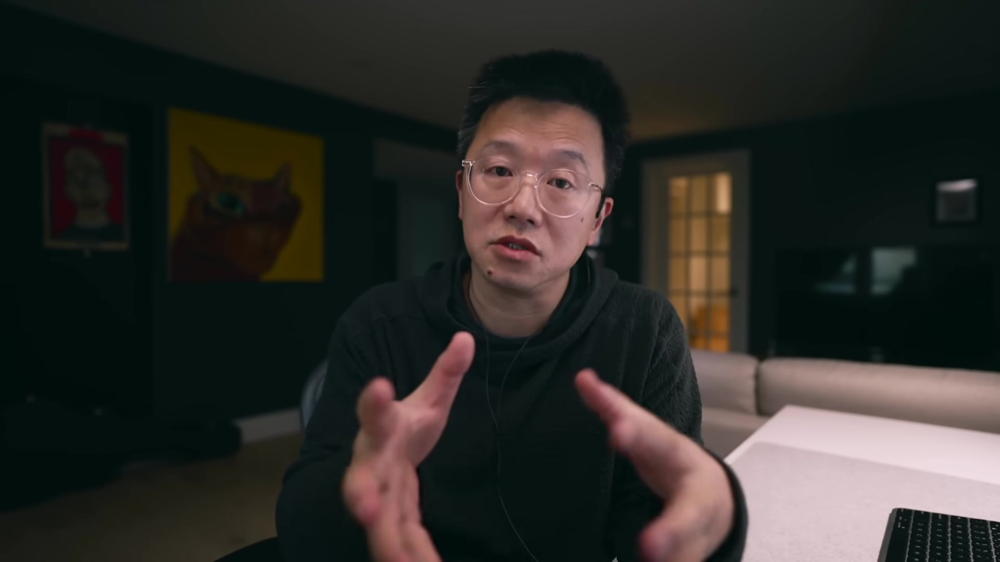

**逐字稿片段：** 當然最重要的 你需要有資本 做投資說到底 是一個用錢賺錢的生意 但是在思考你有多少錢 可以用於投資之前 我們先來做一個 生存能力的一個測試 我這裡有三個硬指標 你思考一下 第一 你手邊 必須要有至少三到五年的 生活費 也就是說 你要準備好三到五年 萬一你掙不到錢 你依然可以活下去 這是一個基本的保證 為什麼要三到五年 以美股市場為例 熊市的平均長度 差不多是一年不到一點點

**話題推測：** 轉向新的主要條件：需要具備足夠的資本

---

## 00:05:57

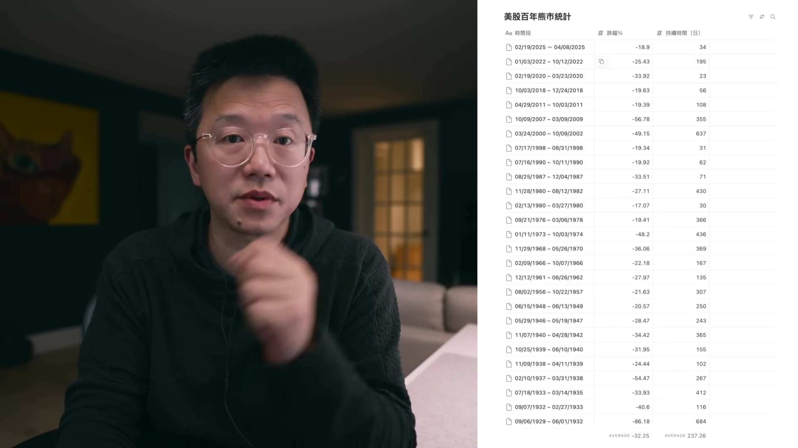

**逐字稿片段：** 但是像2000年 互聯網泡沫熊市 持續了它差不多兩年半的時間 所以說有三到五年的生活費 就是給自己一個足夠的安全墊 如果你沒有安全墊 為了生存 你就不得不賣股求生 這是萬萬要不得的 甚至你有可能在 明明知道是不該進場的時候 進場 對不對 因為你要生活 你要生存 你渴望看到收益 對不對 總之你越是著急用錢 你就越有可能做錯 在錯誤的時期 做錯誤的事情 毫無疑問是投資的大忌了

**話題推測：** 以2000年互聯網泡沫熊市為例，說明熊市持續時間

---

## 00:06:36

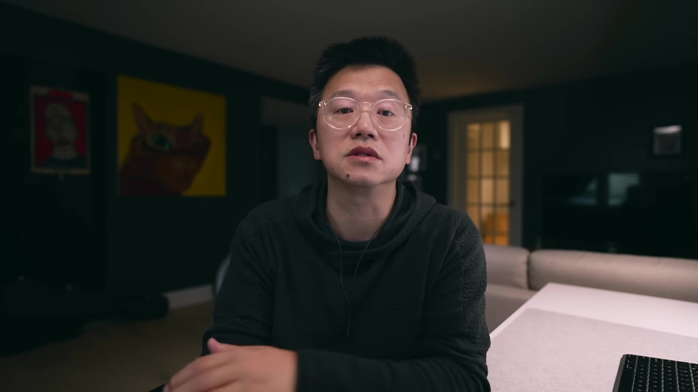

**逐字稿片段：** 現在在北美一個中產家庭 一年的開銷差不多是10萬美元左右 這裡包含了日常的支出 房貸 各種各樣的稅費 保險等等

**話題推測：** 提供北美中產家庭年開銷的具體數字：10萬美元左右

---

## 00:06:48

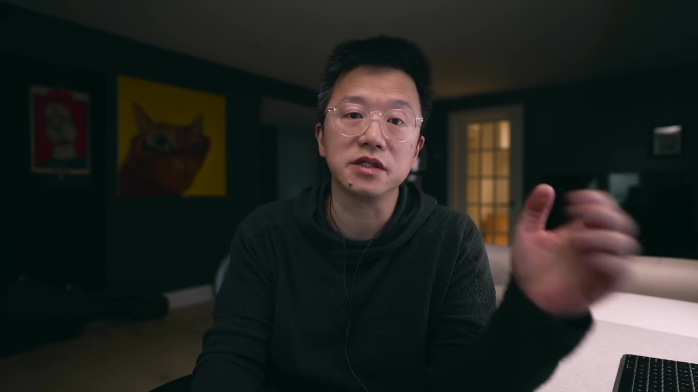

**逐字稿片段：** 三到五年的生活費 差不多就要準備30萬到50萬美元了 這筆錢是不可以用於投資的 它只是你的安全墊 那麼第二個硬性指標 就是 你的生活不能有高槓杆 房貸 車貸 信用卡貸款 那麼這些債務每個月 都在消耗你的現金的 尤其是信用卡貸款 現在信用卡 基本上是20%左右的年利率 你想想看 你到哪裡去找一個 能夠穩定提供20%年化回報的投資呢 是不是 很不容易的 之前有一位網友問我 券商的融資margin做投資 券商的margin利率 基本上現在是6%左右 高的可能達到10%以上 那麼這些利率 也都是直接吃掉你投資收益的東西 所以我的看法是 融資 券商的margin 可以用來做短期的週轉之用 它只能短期用 絕對不可以拿券商的margin 當做一個投資本金來用 這是萬萬要不得的 總而言之 你的現金 減去所有的開銷貸款 所有的支出之外 如果說你還有現金盈餘 這個就叫做自由現金流 那麼自由現金流 是你可以用作增加投資的資本 有了自由現金流 才是一種 可持續的一種狀態 當你在投資當中 遇到困難的時候 那麼自由現金流 可以讓你做到 心靜如水 你有錢 你不著急去買入對不對 而不是說是 我下個月沒米下鍋了 我必須要做一點什麼 我必須要背水一戰 這是不行的 當市場 比如說 低迷一個三五年 也不會影響你的生活 在這種狀況下面 你才能夠保持理性 你才有足夠的定力和耐心 去等待正確的時機 做正確的事情

**話題推測：** 計算三到五年生活費所需的總金額：30萬到50萬美元

---

## 00:08:53

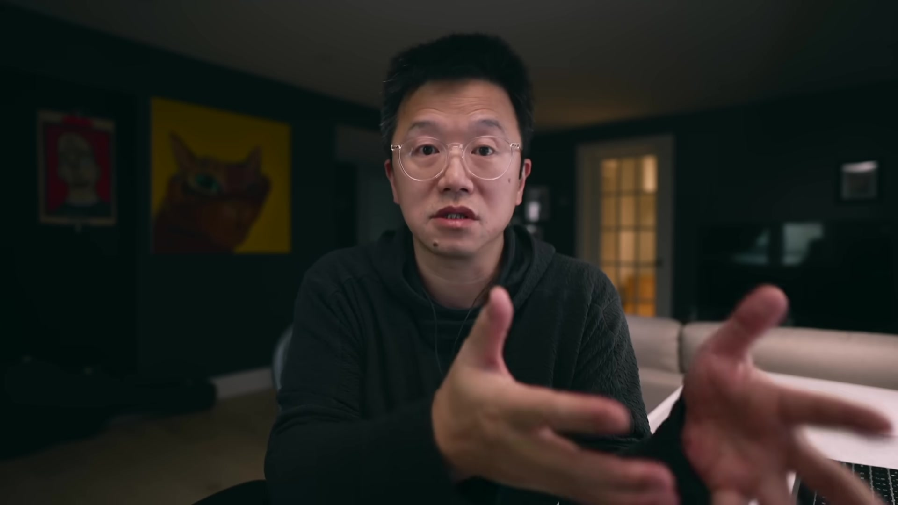

**逐字稿片段：** 第三個硬性指標 就是除了前面說的 三到五年的生活費之外 那麼做全職投資 你真的需要 比較大的資本 前面說了 光是三五年的生活費 你就需要準備 30萬到50萬美元 這30萬到50萬 用完之後怎麼辦

**話題推測：** 說明第三個硬指標：需要比較大的投資資本

---

## 00:09:12

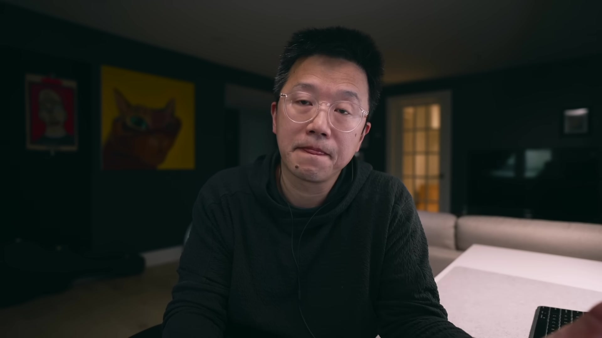

**逐字稿片段：** 這也就是說 做職業投資 你必須要有一個收入替代系統 有一個觀念 我希望廣大網友 你能明白 作為職業投資者 我們最理想的狀態 就是永遠不賣出 讓股票待在賬戶當中 慢慢的增值 不賣出它就能夠最大化的 獲取這種 複利 對不對 不賣出 你也不會需要交稅 對不對 也就是說 職業投資者不是靠賣出股票 來獲取現金流的 你記住這一點 職業投資者 不靠賣股票 獲取現金 正常的現金 我們需要去 固定收益品種當中去獲得 比如說債券 房地產信託 或者說是優先股 這些東西 固定收益 fixed income 顧名思義 它就是能夠為你提供比較穩定的 分紅派息的 為我們提供穩定的現金流 那麼目前市場上 固定收益的品種 比如說短期的債券ETF 差不多可以有4%左右的利率

**話題推測：** 引入新的概念：收入替代系統

---

## 00:10:24

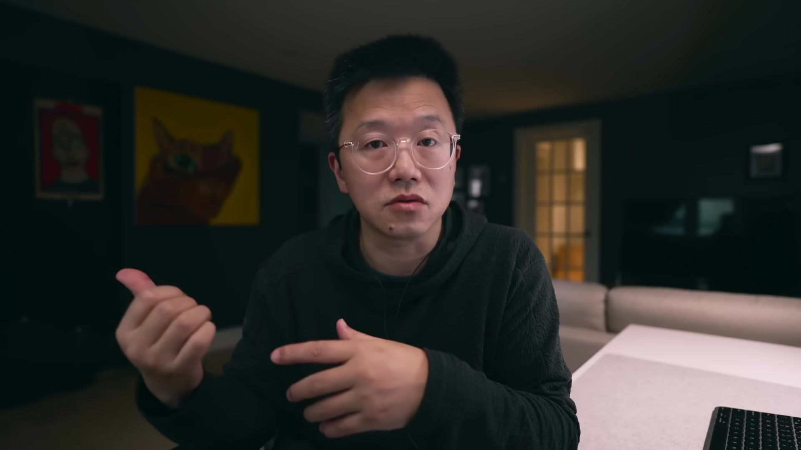

**逐字稿片段：** 稍微風險高一點的 比如說高等級的企業債的ETF 差不多可以獲得6%左右的利率 那麼你大概算一下 假設你一年的開銷要10萬美元 如果還希望有一些 更多一些的自由現金流 我們就算它 一年需要12萬美元 那麼你倒算一下

**話題推測：** 提供高等級企業債ETF的預期利率：6%左右

---

## 00:10:45

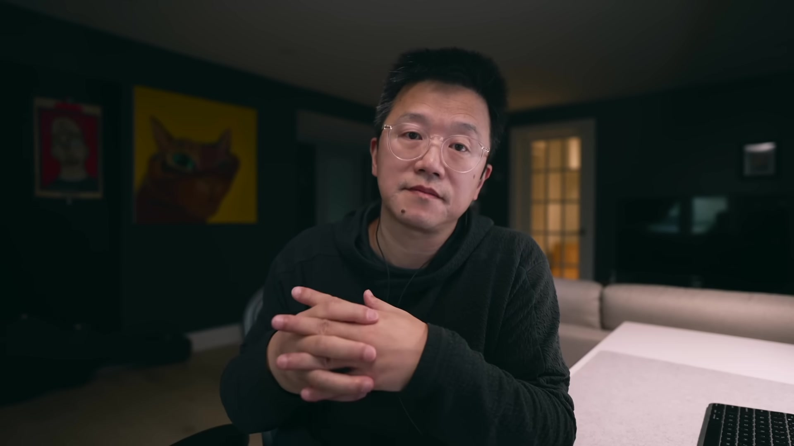

**逐字稿片段：** 12萬美元除以4% 就是300萬美元

**話題推測：** 計算在4%利率下需準備的資本額：300萬美元

---

## 00:10:49

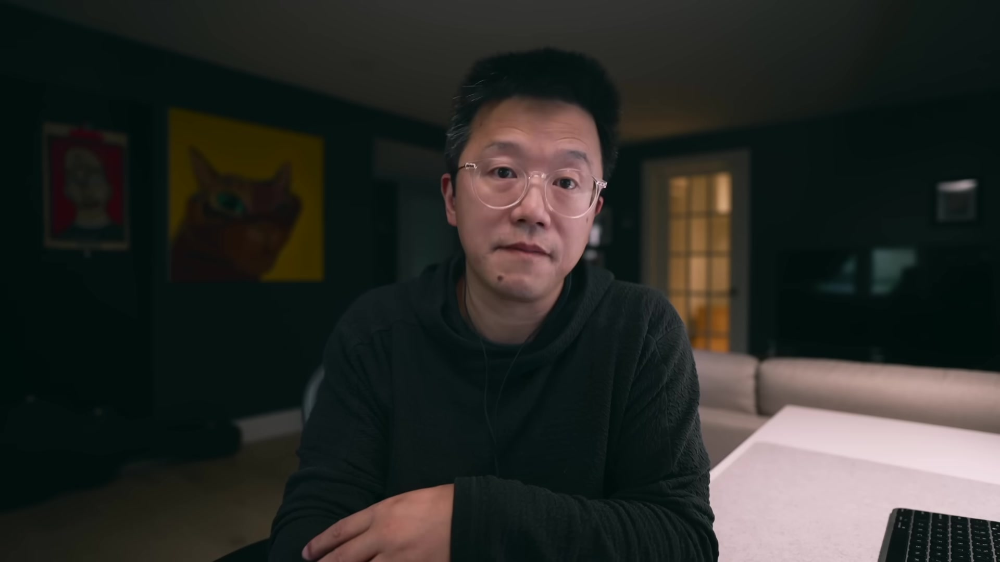

**逐字稿片段：** 如果說是除以6% 就是200萬美元 你就需要有這麼多錢 放在這些固定收益裡面 不動 讓它去每個月 去獲取現金流 這一部分的資本 我們就把它稱之為 叫做收入替代系統 那麼當然美聯儲可能會持續降息 持續降息 會導致所有的這些利率 都會下降 利率下降 意味著你需要有更多的資本 來進入收入替代系統 所以說你看 還沒開始投資 三五十萬的安全墊 再加上300萬左右 也許會更多的收入替代系統 這就350萬了 說不定要400萬以上了 確實做職業投資 是需要相當大的資本的 假設你資本不是問題 我們接下來講一些 有關於心理的問題 很多人認為 我們在市場上做投資 最大的敵人是市場波動 是熊市 其實不是的 我們做投資最大的敵人 就是我們自己 尤其是走職業投資這條道路 是非常非常孤獨的 所有的痛苦煎熬 你都得自己一個人去承擔 為什麼我喜歡在互聯網上 分享一些思考 一些東西 其實這也是一種叫做 自我解壓的一種方式 我做的視頻有人看 有人評論 有人點贊 甚至有人黑 沒問題 這些事情讓我顯得不那麼孤獨

**話題推測：** 計算在6%利率下需準備的資本額：200萬美元

---

## 00:12:32

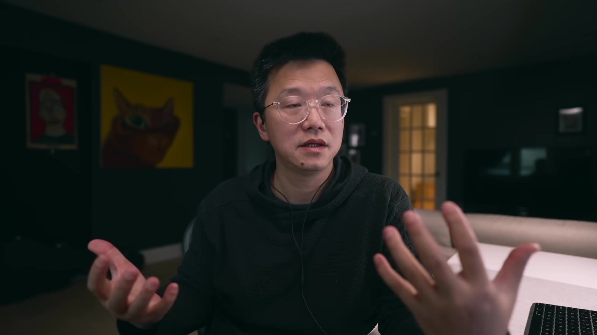

**逐字稿片段：** 另外全職投資最難的 其實是自律

**話題推測：** 引導至新的心理挑戰：自律

---

## 00:12:37

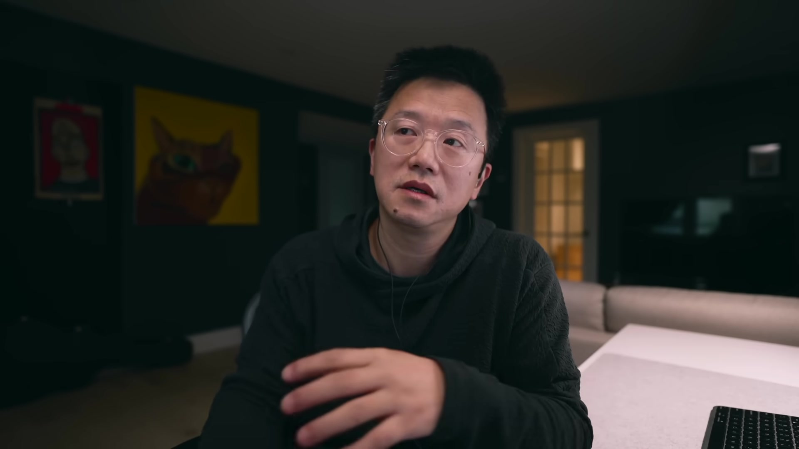

**逐字稿片段：** 巴菲特說 我們不必比別人更聰明 我們只需要比別人更有紀律 但是自律這件事情 它不是一個與生俱來的 它不是天生的 它是需要通過嚴格的 後天的訓練來培養 所以我也在刻意培養 我自己的自律能力 比如說 我現在每個交易日 我都會寫一篇交易筆記 我把我對市場的看法 我的預期 我的底線 我的計劃 甚至我把我的執行計劃的過程 都完整的記錄下來 那麼這件事情 對我來說是非常有意義的 一方面來說 每天寫一篇筆記 每天做一件同樣的事情 這本身就是一種訓練自律的 一種最佳的方式 另外一方面 我的筆記有很多讀者 他們都是監督我自律的人 我曾經想過 就是說 把我每日的交易筆記 改成每週一篇 然後就有很多網友 讀者提出反對意見 所以迫於讀者的壓力 那麼我就一直堅持下來 一直堅持到現在 那麼現在寫交易筆記 已經成為了我的一個習慣了 很多網友說 他看我的交易筆記 也成了他的一種習慣 這就非常好 那麼這也是一種培養自律的 一種方式 那麼如果你感興趣 可以來這個地方來看看 還有一個就是說 作為職業投資者 你需要有長期投資的耐心

**話題推測：** 引用巴菲特的自律名言

---

## 00:14:14

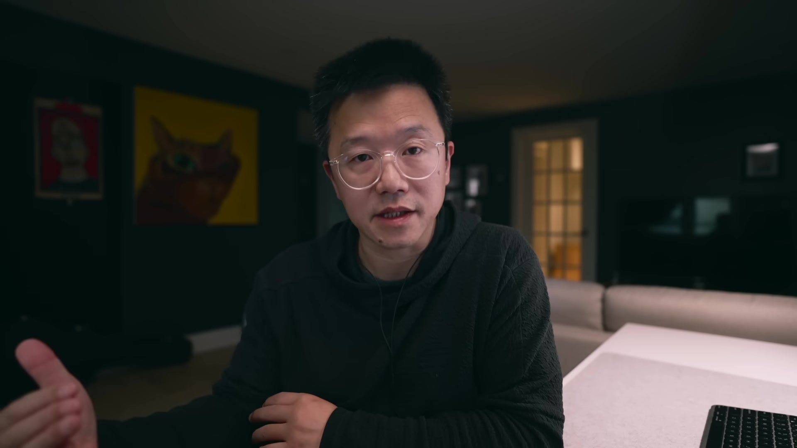

**逐字稿片段：** 做投資有點像農民種莊稼 春耕秋收 它是有季節的 在該播種的時候播種 在該收穫的季節你才可以有收穫 對不對 你不能說我今天播下去的種子 我明天就要看到果實 這是不對的 你得有耐心 同時你也得理解一件事情 天有不測風雲 它可能會把你辛辛苦苦栽培的莊稼 一夜之間就給毀掉 這都是很正常的事情

**話題推測：** 以農民種莊稼來比喻投資的長期性

---

## 00:14:48

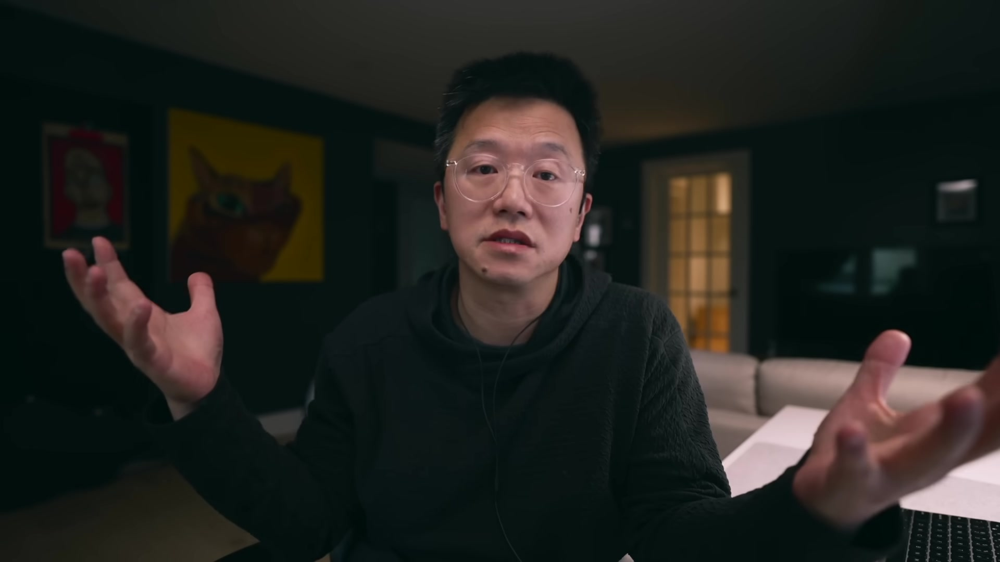

**逐字稿片段：** 就像美股市場 每隔兩年就會來一次崩盤 這是再正常不過的事情 你沒有必要躲避 你也無法躲避 最好的辦法 就是不要孤注一擲 就像我前面說的 我有好多個生意相互配合 相互抵消風險 就算是一個生意被毀掉了 其他的生意還活著

**話題推測：** 討論美股市場的常態性崩盤

---

## 00:15:13

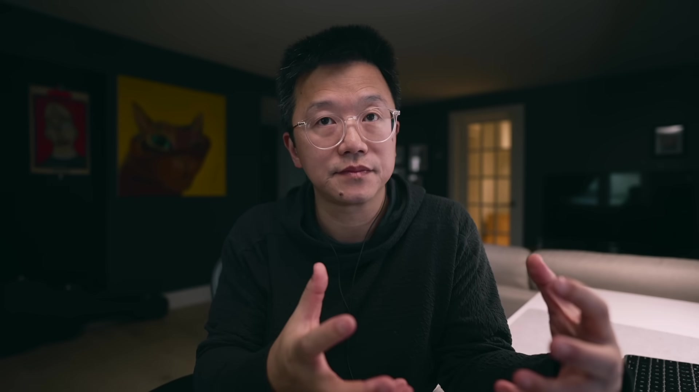

**逐字稿片段：** 這就說到重點 活著 做全職投資 最重要的條件 就是活著 無論怎樣的市況 你都能活著 這就是做職業投資 最重要的 充分必要條件 好 就說這些 拜拜

**話題推測：** 總結全職投資最重要的條件：活著

---
