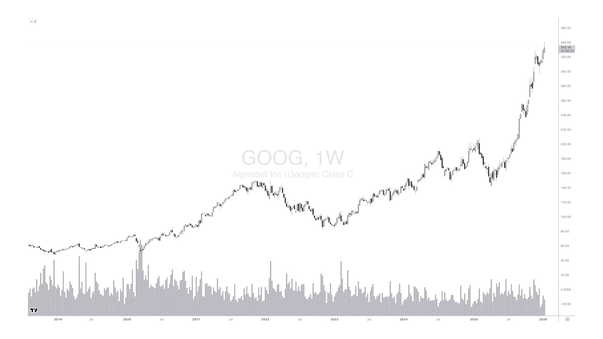
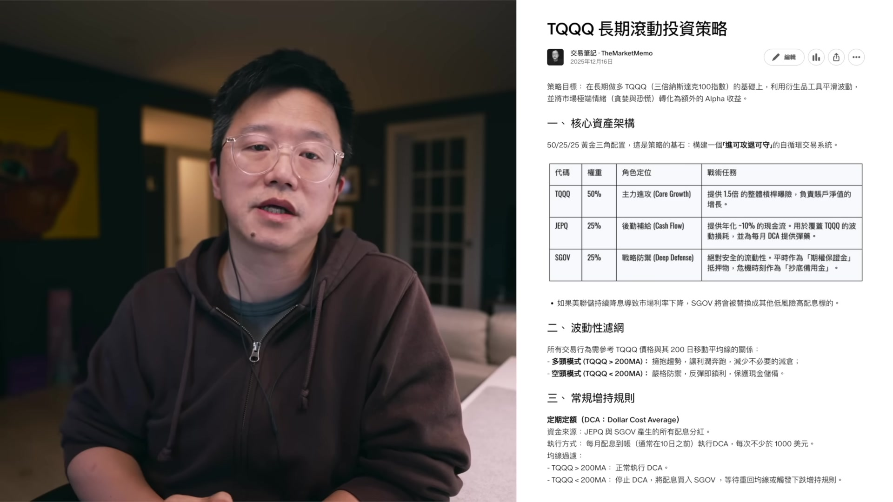
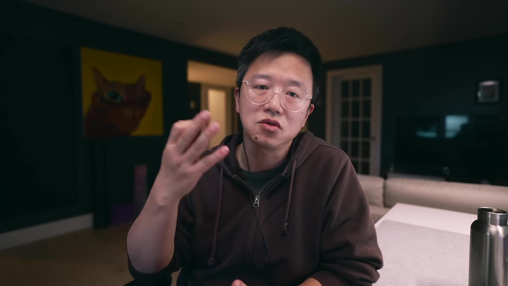

# themarketmemo_tNzUUET5opY — 關鍵畫面索引

- 來源逐字稿：[themarketmemo_tNzUUET5opY_GT.srt](themarketmemo_tNzUUET5opY_GT.srt)
- 影片：https://www.youtube.com/watch?v=tNzUUET5opY
- 截圖數：18

## 00:00:25

**逐字稿片段：** 所以今天我就想來聊聊這個話題 為什麼我不希望你叫我老師 為什麼真正的職業投資者 反而需要做內容輸出 首先我們就先來說 老師這個稱謂 老師這個稱謂 在中文的語境裡頭 它是一個非常尊貴的詞彙 在2000多年的 這種儒家文化的影響之下 我們華人是有尊師重道的 這種傳統 那麼老師也有傳道授業解惑 這樣的一個神聖的職責 所以說 人們對老師這個稱謂 有著一種天然的敬畏感 那麼潛意識裡面 我們認為老師 是代表著掌握真理的那一方 但是這種文化慣性 如果帶入到金融市場裡面來 它就變成了一種 致命的認知缺陷 為什麼呢 因為金融市場 它的本質是混沌的 是隨機的 在這個市場裡面 根本就不存在 所謂的真理 也不存在一個全知全能的 絕對的權威

**話題推測：** 影片主軸介紹，預期畫面會顯示本集主題或標題

---

## 00:01:34

**逐字稿片段：** 那麼為什麼大家還是 熱衷於去尋找 並且稱呼別人為老師呢

**話題推測：** 提出問題：為什麼人們熱衷於稱呼他人為『老師』

---

## 00:01:40

**逐字稿片段：** 那麼我分析下來 主要有三個層面的心理機制 首先就是對不確定性的恐懼 大多數的散戶進入投資市場 面對這種紅綠跳動的數字 感受到的是一種巨大的 失控感 這種失控感 在心理上是非常痛苦的 所以說叫一聲老師 本質上是在尋求一種心理庇護 這就像是在驚濤駭浪的大海上面 你試圖抓住一塊浮木 你希望這個人告訴你 別怕 聽我的 你一定能賺到錢 這是一種求生欲 也是一種情緒外包 你希望透過確認對方的這種 絕對權威的地位 來消除自己 內心的恐懼

**話題推測：** 揭示三種心理機制，預期畫面會列出數字或項目符號

---

## 00:02:27

**逐字稿片段：** 其次這是一種認知的懶惰 獨立思考是非常辛苦的 你去研究一家公司的財報 去分析 宏觀經濟數據 去推演政策的影響 這些都是需要消耗大量的腦力 也是需要相當深厚的 專業知識和技能的 那麼相比之下 你去聽一個老師 講一個美妙動聽的故事 然後給你幾個代碼 然後你可以無腦跟單 這顯然要輕鬆的多 這就是一種思維上的 一種懶惰的行為 是一種搭便車的行為 那麼更有意思的是 有些網友 去別人那裡 聽來了一個股票 然後買了 然後被套了 結果跑到我這裡來說 老雷我應該怎麼處理 我真的是 怎麼說呢 哭笑不得

**話題推測：** 說明第二種心理機制：認知的懶惰

---

## 00:03:21

**逐字稿片段：** 第三個就是說 叫別人一句老師 其實這是一種 這什麼 責任轉嫁的心態 如果說是你自己做決策 買入一隻股票 結果跌了 你將會面臨巨大的自我懷疑 你會覺得自己很愚蠢 然後做了一件錯事情 那麼承認自己的錯誤 是非常困難的 尤其是這種金錢的損失 你要割捨這些錯誤 是非常非常痛苦的 但是如果說 你是跟著某個老師買的 賠了錢 你就可以理直氣壯的 去罵他 你是個騙子 你的水平太差 你發現沒有 別小看老師這兩個字 叫一聲老師 其實是你為自己 買了一份心理保險 如果是賺了 那是你跟對了人 你很有眼光 如果是賠了 那是老師不行 老師是個騙子 不是你的責任 你是受害者 那麼這樣一來 你的自尊心 就得到了最完美的保護 總而言之 當你稱呼別人為老師的時候 其實你是在主動降格 你預設對方 至高無上的地位 或者說是他能夠掌握真理 同時你也放棄了自己 作為一個獨立的投資者 應有的這種批判性思維 那麼這在投資領域 是極其危險的信號 接下來我們來聊第二個問題 也是我經常受到的一種質疑 就是說 既然你是職業的投資者 既然你已經財富自由了 你為什麼還要每天 辛苦的寫文章錄視頻呢 你自己悶聲發大財不好嗎 這種觀點 聽上去似乎很有道理 也很有市場

**話題推測：** 說明第三種心理機制：責任轉嫁的心態

---

## 00:05:06

**逐字稿片段：** 但實際上這是一種 非常典型的邏輯謬誤 心理學上被稱之為叫做投射效應 同時也暴露了 典型的這種打工者思維模式 什麼是投射效應 簡單來說 就是以己度人 用自己的狀態 用自己腦子裡想的東西 去猜測別人的動機 比如說對於絕大多數 這種朝九晚五的上班族來說 工作 是一種為了生存 而被迫進行的 一種痛苦的交換 對吧 在打工者思維模式當中 工作是因為缺錢 如果說我有了錢 那麼我第一件事情 就是吵了老闆 停止工作 去享受 去躺平 所以打工心態的人 看到我在做視頻 在寫文章 他就會下意識的推導出 這個傢伙還在工作 說明他沒錢 說明他的投資收益是假的 他是在騙人 他是在割韭菜

**話題推測：** 引入心理學概念：投射效應

---

## 00:06:08

**逐字稿片段：** 然而如果說你站在 資產擁有者的角度上來看 工作的意義就完全不同 你說 馬斯克 缺錢嗎 你說巴菲特缺錢嗎 為什麼馬斯克 還要這麼有錢 世界首富了 還要沒日沒夜的工作 為什麼巴菲特90多歲了 還要每天閱讀幾百頁的報告 所以說 達到一定財富階段的人來說 或者說財富自由的人來說 他已經自由了 他不需要去 去為 為錢而工作 那麼工作已經不再是 他的謀生手段的時候 那麼 工作就變成了一種 自我實現的方式 就比如說我以前 那麼我以前是從事這種 藝術設計工作 那種創造出一個作品 的這種快感 和我現在 構建出一個投資組合 或者說 製作出一個高品質的影片 他們產生出來的快感 本質上是一樣的 這是我獲得滿足感的一種方式 另外這裡還存在一個叫做 零和博弈的 認知偏差 很多人認為 賺錢的方法 如果我告訴你了 那麼我就沒得吃了 我就賺不到錢 所以他們認為 真正 股市裡的牛人 都應該是藏著掖著的 不會把自己的 賺錢的方法說出來 換一個角度說 他們會認為 凡是說出來的方法 都是騙人 那麼這種 思維方式 或許適用於這種什麼 內幕交易 或者說是高頻套利 因為內幕交易和高頻套利 它靠的就是信息不對等 這是它的獲利的關鍵 那麼一旦如果說是我把信息 告訴來了 公佈出來了 那麼這種就沒有套利空間了 這或許是我認同 你不應該把這種 這種消息說出來 但是對於像我這種 我們是基於宏觀趨勢的投資體系 那麼我分享觀點 甚至我完全公開 我所有的交易細節 根本不會稀釋我的獲利 就像我一直在說的

**話題推測：** 對比打工者思維與資產擁有者思維的工作意義

---

## 00:08:23

**逐字稿片段：** Hi5 組合 這個組合的每一筆交易 都是公開的 交易規則 也都是事先明確的 任何人按照這個邏輯 按照這個規則來做投資 都可以獲得同樣的結果 那麼我公佈這個組合 它並不會讓我有任何損失 甚至我認為有更多的人 參與進來 反而會讓這個市場的流動性增加 讓這個市場的深度變好 這對所有參與者都是有利的 這是一個多贏的局面 更重要的是 投資者的護城河 從來不是某一個秘笈 或者是某一個指標 而是在於你的性格和執行力 就比如說 我在很早以前 我就公開說過 如果說只買一隻股票 我的推薦是谷歌 你相信嗎 你能夠一直持有到今天嗎

**話題推測：** 提及自己的投資組合『Hi5組合』，預期畫面會展示組合的細節或績效圖表

---

## 00:09:12

**逐字稿片段：** 我在2025年 4月市場暴跌過程當中說 牛市在向我們招手 那個時候你會相信嗎 你敢在市場下跌的過程當中 持續買入嗎 所以說 我想表達的是 分享這些內容 並不會讓我失去什麼 因為真正的壁壘 是你無法複製我的心態

**話題推測：** 提及2025年4月市場暴跌時的預測，預期畫面會顯示相關市場指數圖表

---

## 00:09:34

**逐字稿片段：** 那麼在打工者思維模式當中 收入是等於時間乘以時薪的 在他們的觀念當中 一旦有了錢 就不應該出賣時間 這是一種打工者思維形態 但是在資產所有者的思維模式裡面 我做YouTube視頻 我寫交易筆記 這不是在打工 這不是在出賣時間 而是在建立我的資產組合 在這個頻道 這些影片 那麼我的幾百篇的交易筆記 這些都是24小時 不間斷為我工作的資產 它能夠為我帶來影響力 能夠為我帶來人脈 甚至可以帶來穩定的現金流 這就是黑天鵝的作者 塔勒布所說的 叫做反脆弱結構 投資收益是高波動的 但是這些內容 收益是相對穩定的現金流 用穩定的現金流 去養一個高波動的優質資產 這是一種 非常高級的資產配置策略 所以說我在我的 TQQQ長期滾動投資策略當中 我就配置了SGOV和JEPQ 這種配置方式 就是一種反脆弱的結構 那麼感興趣的朋友 可以去看看

**話題推測：** 比較打工者與資產擁有者對時間與收入的看法，預期畫面會顯示公式或對比圖

---

## 00:10:47

**逐字稿片段：** 那麼為什麼說 作為一名職業投資者 反而需要做內容輸出 這就要牽涉到一個叫著名的 叫費曼學習法 我們都知道投資是一項非常 依賴邏輯推理的活動 那麼我們的大腦中的想法 很多時候是碎片的 是模糊的 有時候我會對某一個投資機會 有感覺 但是如果說這個感覺 不經過整理和深入的去挖掘的話 很有可能這個感覺 就只是一個直覺 然而做視頻 或者是寫文章 這是一種強制輸出的過程 為了要把一個觀點講透徹 講清楚 要讓多數的觀眾能夠理解 我就必須要強迫自己 去查閱更多的資料 去驗證每一個數據的真實性 去推演邏輯鏈橋當中的每一個細節 去尋找反面的觀點來攻擊我自己 那麼這個過程非常的痛苦 但是也是非常有價值 這就是費曼學習法的精髓 教會別人 其實是最好的學習方式 所以說每當我發佈一個影片 每當我寫完一篇文章 其實我就是完成了一次深度的覆盤 那麼很多時候 正是在我寫稿的過程當中 我理清了自己的邏輯 我發現了自己的這種某些上面的漏洞 甚至很多時候 它避免了潛在的一些投資風險 所以說某種程度上說 我並不是在教你做什麼 而是我通過對你講述這種方式 來完善我自己的投資體系 來完善我自己的投資邏輯 這是一個利人利己的過程 所以我經常說的一句話 就是說 分享者 是分享的最大受益者 所以說如果說你希望自己 在投資的道路上 走得更遠 走得更高 我認為 你應該要儘可能多的輸出 去創作內容 當然不僅僅是投資了 於任何一個行業都是這樣子

**話題推測：** 引入『費曼學習法』概念，預期畫面會顯示其標題或解釋

---

## 00:13:00

**逐字稿片段：** 說了這麼多 如果說你不叫我老師 那麼我們之間的關係如何定義 我建議你把我看做三種角色

**話題推測：** 進入新的討論階段：定義講者與觀眾的關係

---

## 00:13:08

**逐字稿片段：** （無對應逐字稿內容）

**話題推測：** 列出三種建議的關係角色，預期畫面會顯示數字或項目符號

---

## 00:13:09

**逐字稿片段：** 第一 我們是同行者 我在投資這條路上面 摸爬滾打了20多年 你正在經歷的 都是我經歷過的 我分享我的經驗教訓 這些都是我的偏見 偏見沒有好壞之分 每個人都在用自己的偏見看世界 重要的是 我的偏見也許能幫助你 看到事物的另外一個方面

**話題推測：** 說明第一種關係：同行者

---

## 00:13:34

**逐字稿片段：** 第二個就是說 我們是平等的交流者 市場之所以存在 就是因為有分歧 我有我的觀點 你有你的觀點 觀點不同是很正常的事情 你不需要贊同我 我也不會為了要你的點贊 要你的贊同來做任何內容

**話題推測：** 說明第二種關係：平等的交流者

---

## 00:13:52

**逐字稿片段：** 第三個 你可以把我看做是你的分析師 我分享了大量的數據資訊 通過我的邏輯加工 然後呈現給你 這些數據訊息邏輯 你都可以拿走 但是我的結論僅供參考 那麼如何看待我分享這些內容

**話題推測：** 說明第三種關係：分析師

---

## 00:14:15

**逐字稿片段：** 我覺得 你要有能力區分 什麼是事實 什麼是觀點 比如說 美聯儲今天宣佈降息25個基點 這是事實 但是如果我說 美聯儲降息將刺激市場上漲 這是觀點 觀點需要被驗證 所以說一個理性的投資者 最重要的技能 我認為應該是 你要有能力把事實 和觀點 這兩件事情中間缺失的邏輯鏈條 把它補全 所以我希望大家與我討論邏輯 而不是來問我 現在股票能不能買 明天大盤會不會漲之類的 實話告訴你 我不知道 也不會有人知道的 我經常說的一句話 叫做 關於未來 沒有人比你知道更多 你需要觀眾的不是預測 而是邏輯推演的過程

**話題推測：** 強調區分事實與觀點的重要性，預期畫面會顯示『事實』與『觀點』的對比

---

## 00:15:13

**逐字稿片段：** 我希望大家來看看我的交易筆記 如果說你做投資是認真的 你會發現其中的價值 好 就說這些 下期節目再見 拜拜

**話題推測：** 呼籲觀眾參考自己的交易筆記，預期畫面會顯示筆記頁面截圖或相關連結

---
