# wealth1974_41YfdcyP4SA — 關鍵畫面索引

- 來源逐字稿：[wealth1974_41YfdcyP4SA_GT.srt](wealth1974_41YfdcyP4SA_GT.srt)
- 影片：https://www.youtube.com/watch?v=41YfdcyP4SA
- 截圖數：20

## 00:00:00

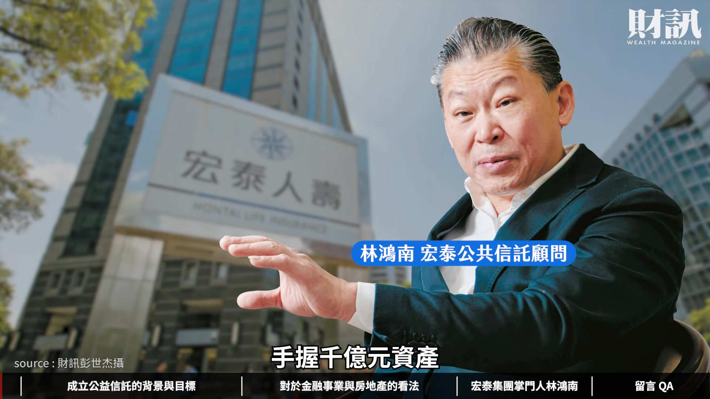

**逐字稿片段：** 手握千億元資產 卻不愛社交 外界認為他精明霸道 他卻說自己是一個社恐 I 人 他是宏泰集團掌門人林鴻南 這次從公益信託 金融 土地開發 到各種轉投資事業的想法 他都完整的揭露

**話題推測：** 介紹宏泰集團掌門人林鴻南，並提出其千億元資產規模。

---

## 00:00:14

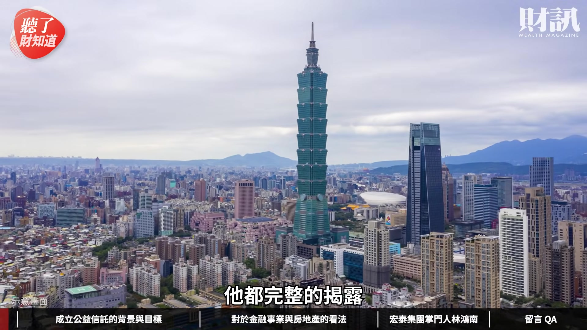

**逐字稿片段：** 今天這集我們會先聊聊 當時成立公益信託的背景與目標 再來分享一下 現在宏泰集團對於金融 地產 轉投資事業的想法 最後我們談一下 到底林鴻南是一個怎麼樣的人 大家好 我是今天主持人陳彥淳 今天來賓是財訊雙週刊的主編游筱燕 歡迎筱燕 總編好 各位觀眾朋友們大家好 我是筱燕

**話題推測：** 影片主軸的第一個討論重點：公益信託的背景與目標。

---

## 00:00:34

**逐字稿片段：** 宏泰集團的創辦人林堉璘先生 他素有台灣地王之稱 意思就是說他在台灣 擁有非常多的土地

**話題推測：** 介紹宏泰集團創辦人林堉璘及其「台灣地王」稱號。

---

## 00:00:41

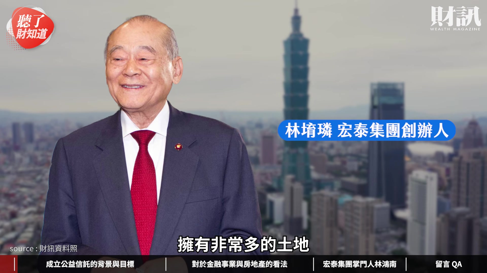

**逐字稿片段：** 初步盤點 包含當時在信義計畫區有 6 塊土地 非常的精華 林堉璘先生在 2018 年時候已經過世 他當時就透過一個架構

**話題推測：** 提及林堉璘在信義計畫區擁有的土地數量。

---

## 00:00:50

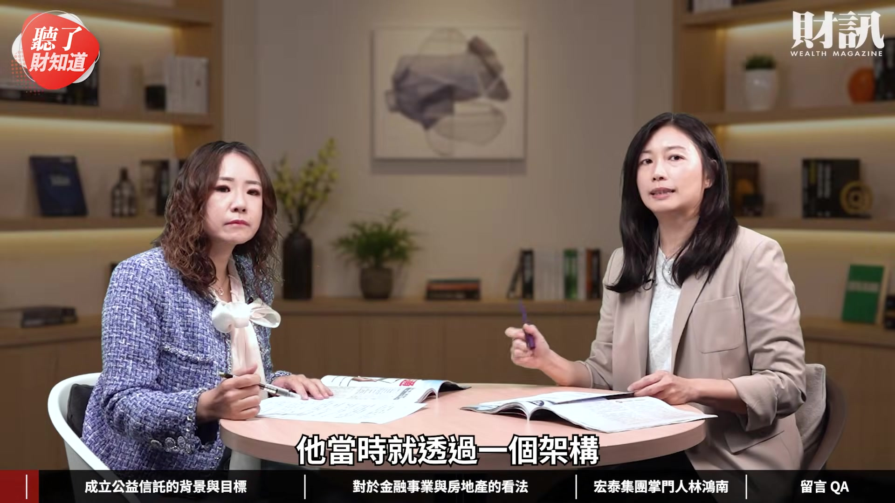

**逐字稿片段：** 成立了公益信託 把事業捐進去公益信託裡 一直發展到現在 他當時指派的接班人 就是林鴻南先生 林鴻南原本是公益信託 林堉璘宏泰教育文化基金會的執行長 他現在已經轉任顧問了 基本上他還是宏泰集團的掌門人 這就是為什麼這次 我們要採訪他的原因 我覺得他這次 還原了非常多的事情 市場上其實對宏泰集團 有滿多的好奇 爭議以及質疑 我們就一一的問他 他也直球對決坦然面對 這個部分我們會一一來跟大家分享 先講一下當時林堉璘 在成立公益信託的過程中 他們家族是怎麼樣分家 怎麼樣討論這件事情的 林堉璘過去有台灣地王之稱 就是因為他手握信義計畫區有 6 塊土地 這 6 塊土地超過 1.1 萬坪 市價超過 2000 億元 對 幫大家 highlight 一下

**話題推測：** 介紹林堉璘成立公益信託的架構與原因。

---

## 00:01:41

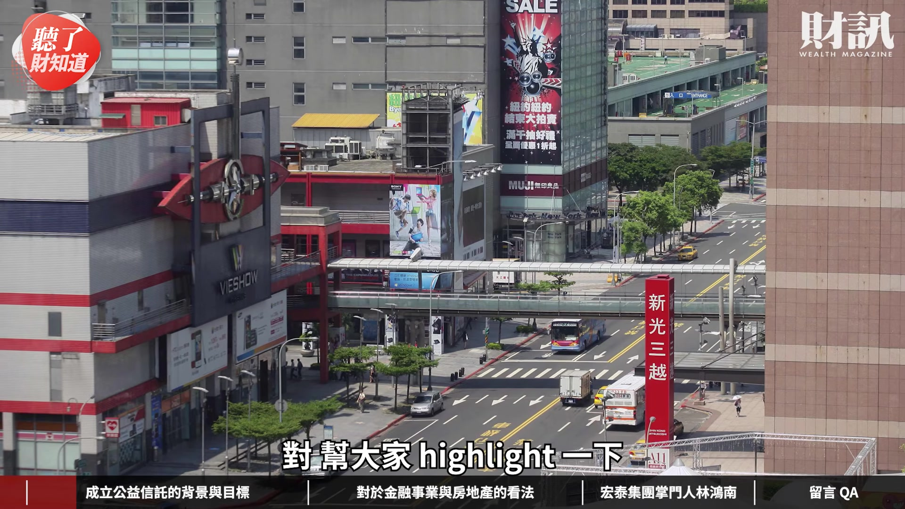

**逐字稿片段：** 那土地是哪一些 就是現在的威秀影城 信義計畫區那邊 A14 的 ATT 4 FUN 還有 A16 A17 的信義威秀 A19 的 Neo19 那裡 還有就是 B3 的 宏泰交易廣場 跟 B4 的群益金融大樓 就是這 6 塊土地 然後在松山區的民生東路 跟敦化南路口的 宏泰世界大樓跟宏泰金融大樓 這兩棟商辦大樓 也是屬於林堉璘的資產

**話題推測：** 列舉林堉璘在信義計畫區擁有的具體地標性土地名稱。

---

## 00:02:07

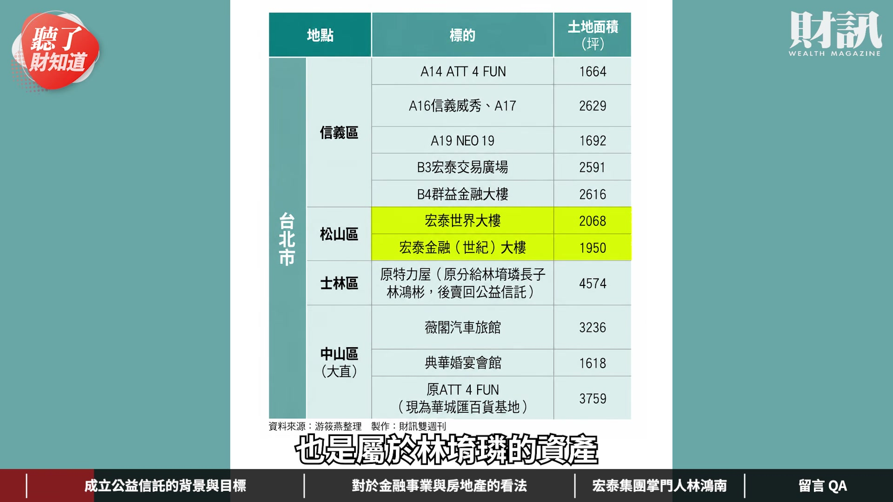

**逐字稿片段：** 除此之外他的土地還有 就是在士林中正路上會看到特力屋 有 4000 多坪的土地也是他的 還有在大直的薇閣汽車旅館 還有典華婚宴會館 跟原本是作為 ATT 的商場 最近也要改成華城匯百貨基地的這個地方 也是林堉璘當年的投資 當時候買信義計畫區的時候 都是在稻田的時候買 在大直買的時候周遭也是農田 旁邊很多養雞養鴨的那時候 就已經買進這個土地了 所以眼界算是滿厲害的 大家都說他是台灣地王

**話題推測：** 補充林堉璘在士林、大直等其他區域的土地投資。

---

## 00:02:36

**逐字稿片段：** 所以他在 2018 年 台灣的富豪排行榜 是排行到第 3 名的 他土地這麼多 他還有其他轉投資事業 包括金融待會我們會提到 但他從 2015 年開始 他陸續把這些事業 都捐到公益信託下面 他把哪些事業捐進去 又哪些事業開始做一些劃分 他就把信義區的 這 6 塊非常精華的土地 都捐進去了 放在公益信託裡面 還有民生東路上面的兩棟商辦大樓 也在這公益信託裡面 還有就是他旗下掛牌的這些上市公司 就是宏盛建設 群益證券 還有安泰銀行跟宏泰人壽 都在這個公益信託的範疇裡面 其他以外呢 就是士林區原本是特力屋的這個地方 分給了他的大兒子 大兒子因為覺得他沒有心力 去經營這樣的商場 所以他就把這個土地 再賣回給公益信託 剩下剛剛講到大直的土地 就是薇閣汽車旅館 他就分給了他的第 4 個兒子 典華就分給他的第 2 個兒子 現在是華城匯的百貨基地 他就分給他的第 5 個兒子 他整個信義計畫區 跟比較市中心的土地 都是放在公益信託裡面 外圍周遭的 他就是分給了自己的兒子這樣子 那當時林鴻南分到什麼 林鴻南他跟我們分享說 他是分到了素地 他就把它賣掉 就把它賣掉 所以這樣看起來 我們現在檯面上看到 所有宏泰集團的事業 包括精華區的土地 除了大直之外 基本上都在公益信託的架構下面 早年我們在做公益信託時曾經有質疑過 就是說公益信託是不是他的控股公司 它等於有點變相控股的概念 這個部分我們其實也有請教他 說他怎麼看這件事情 因為這是在他父親的時候就成立了 他怎麼說 林鴻南就回答說 它們不是控股公司 他說就是公益信託 他覺得這是父親留下來的一個事業 然後希望可以就是 為台灣這片土地捐出更多錢 然後幫助台灣

**話題推測：** 提及林堉璘在2018年台灣富豪排行榜的位次。

---

## 00:04:20

**逐字稿片段：** 其實這次我們有整理 關於公益信託的架構 可以看到說公益信託下面 有 4 家主要的控股公司 然後透過再多層的投資之後 再控制了宏泰集團 包括金融事業 地產事業跟轉投資 他有講得滿明白的 他就說大家會看起來 覺得是一個控股公司的架構 但父親當時的確是想 把事業捐進去之後 可以透過各事業 不斷的創造營收跟獲利 讓公益的支出可以穩定 然後為台灣做一些事情 這是他當時的想法 一路走來他們透過 公益信託向下的投資公司 做了非常多的事情

**話題推測：** 闡述公益信託下的控股公司架構。

---

## 00:04:52

**逐字稿片段：** 我們看到除了之前的中嘉案之外 最近包括（投資） 101 包括國票 都是在公益信託向下的 投資公司在做的 雖然是用公益信託的架構 但是還是有控股公司 操作的內容在裡面 我覺得這當然是大家會覺得 比較疑惑的地方 會覺得說公益跟事業之間 到底要怎麼分 因為這個概念 所以我們有再進一步問他說 公益信託從 2015 年成立以來 它一直都維持在 300 億元左右的規模 旗下的事業體系 每年都在成長 土地資產又很龐大 都在精華區 我們都覺得它有 千億元資產規模的潛力 但是它 11 年來的資產規模 都維持在 300 多億元 它每年的公益支出呢 大概都是 3 億元左右 所以我們就有問他 因為他既然這麼要求 他下面的公司 希望它可以創造獲利 讓公益信託可以做更多的好事 那為什麼這些規模沒有增加 然後公益支出也沒有增加 他其實也有正面回答 對 他有回答我們說 做善事是要有效益 就是說我 1 分錢 我真的花下去做這個善事 我也要持續的監督它 是不是真的有完全的執行 可能也要陪跑 到最後真的落地了 然後它的成果怎麼樣 他都是要一路去監督的 所以林鴻南有分享說 他這幾年花非常多的心力 都在公益信託各個案子 他都會親自去看 然後也都會親自去評比說 要給誰得分或什麼的 他一直十分強調效益 效益 覺得 1 分錢要槓桿出更多事情 而不是讓錢就直接丟入大海 做一件善事就沒有了 所以他也強調說 他這幾年會維持到 3 億元 是因為他也還在學習說 要怎麼好好的做有效益的善事 他也說希望未來 在他愈來愈熟練之下 他希望把金額提高到 5 億元 他不斷的告訴我們說 經營事業要有效率 他對於公益信託向下的 這些投資公司或事業的要求 就是要持續成長 持續獲利打敗通膨 一樣的邏輯 我們來要求公益信託的支出 應該也要這樣 他自己講的 他認為這個要求非常合理 他覺得過去他們 因為不知道怎麼操作 又要追求效益 所以錢有點花不出去 這是他的說法 我覺得畢竟是公益信託 它有公益性質在 所以我覺得大家應該都 一起來繼續監督 他接下來是不是 把公益愈做愈大 把支出愈做愈多 另外一個我覺得想講回來 因為公益信託下面的事業 其實非常多 撇除公益信託的架構之外 其實它每個事業在市場上 都有一些舉足輕重的地位在

**話題推測：** 提及公益信託旗下投資公司近期投資的標的，如101和國票。

---

## 00:07:10

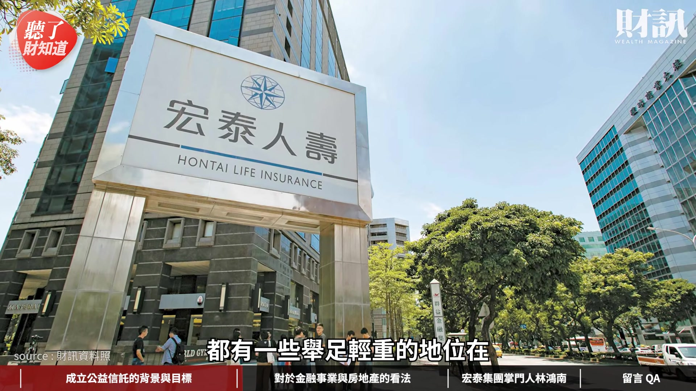

**逐字稿片段：** 最近市場上就不斷的討論到 到底它們是不是要合組金控 因為它們的集團事業下面 有證券 有投信 有銀行 有人壽 對 問他說 他有沒有要成立金控公司 因為看起來這些都完備了 他就直接說沒有這個想法 他也沒有要成為 大金控公司的這個願景 他只是希望說旗下這些公司 能夠穩定的獲利 然後最後回到基金會 讓基金會有穩定的獲益 因為其實現在整個金融版圖下

**話題推測：** 開啟新話題：市場討論宏泰集團是否會合組金控。

---

## 00:07:38

**逐字稿片段：** 比較關鍵大概就是 宏泰人壽跟安泰銀行 這兩個大家比較關心的 因為像宏泰人壽 最近有一些官司案 對 就宏泰人壽過去 掌握了滿多在淡海新市鎮的土地 今年的時候它被檢調搜索 就說它是不是土地 有左手換右手這件事情 就是當年因為宏泰人壽 持有太多土地 然後被金管會盯上 希望它們可以把這個土地 就是把它趕快釋出 把它賣掉 回歸到原本它們的本業 它們就是把它標出去了 但是它標出去的公司呢 找出來叫做泰和建經 它是跟宏泰集團有相關的子公司 所以今年就被檢調搜索說 它是不是有左手換右手這件事情 就是標給自己另外一個公司 宏泰集團過去也有很多不動產的操作 就是在淡海新市鎮 像是海洋都心這個案子 也是非常有名 宏泰人壽也有持有

**話題推測：** 聚焦討論宏泰人壽與安泰銀行兩家關鍵金融機構。

---

## 00:08:28

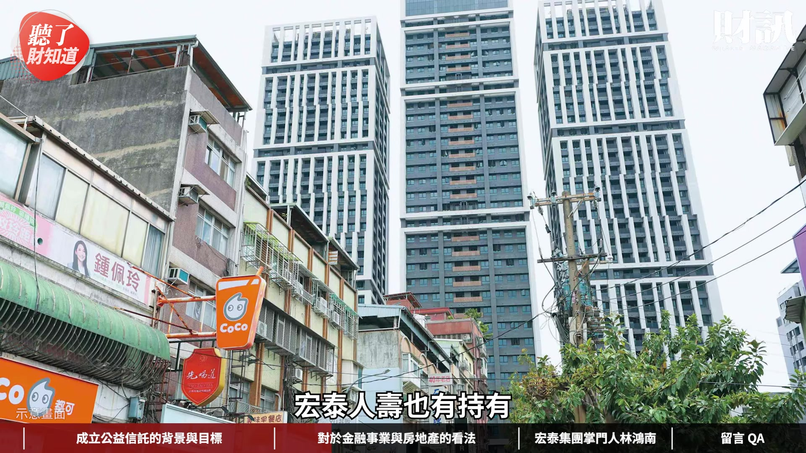

**逐字稿片段：** 最近就是在石牌 有三大棟商城的案子 宏泰人壽其實也有持有 所以就知道說宏泰人壽在過去 一直都是在這個土地跟不動產 操作就是滿積極的 所以這方面的爭議也滿多的 不過他這次有講 他就說既然已經進入司法階段了 所以就是面對司法 該怎麼樣就怎麼樣 這個是宏泰人壽的部分

**話題推測：** 提及宏泰人壽在石牌持有的三大棟商城案子。

---

## 00:08:46

**逐字稿片段：** 另外就是安泰銀行 因為之前曾經一度要跟國票合併 然後 後來不了了之 就結束了 因為它經營的體質 一直都滿辛苦的 而且他自己開玩笑的講說 這個雷也踩 那個雷也踩 代表說其實經營的比較辛苦一點 我們有問他說要不要賣掉 或是跟別人整併之類的 那他怎麼講 他沒有要很積極賣掉 至少目前確定 他是沒有在找買家 他也是希望說安泰銀行 可以愈做愈好 就是至少要有穩定的獲利 配回給公司 他當然也知道說安泰銀行 就是規模比較小 然後可能國際競爭力也不足 他早年的願景是說 它雖然規模小 可是可以（經營）小眾化市場 然後做一些優質的客戶 在上面發揮 他未來是希望朝這方面進行 因為市場上很多傳言說他要組金控 再來就是說他可能會有一些 分切 包裹出售的問題 我們都有問他 他就說沒有啦 沒有啦 外界的謠言真的很多 就是跟大家可能想像不太一樣 但在生意場上可能有來有往 我們不曉得過程是怎麼樣 但至少我們在問他的時候 他認為第一個 他沒有成立金控的想法 第二個 他認為是父親留下來的事業 如果可以做 他覺得還是要繼續做下去 我覺得這些事情 都是他的選項 可能就撐撐看 然後希望它們可以改善 它們的經營的成果 還有另外兩個也是滿有趣的 就是最近他投資了國票 然後也投資了 101 這兩個案子也是市場上 滿引發討論的 我們當然也有問他 他說他們在早期的時候 就已經投資 101 算是 101 的小股東了 因為 101 其實是他堂哥 林鴻明他們宏國一手策畫的 101 從興建 從規畫 這個過程他其實都有參與到 所以他其實對它是有感情的 而且他也覺得 101 是台灣國際很有名的地標 它現在商場跟整個國際知名度 都經營的非常不錯 現在商辦的租金行情 也有在不斷的提升當中 就是整個獲利的狀況 都滿不錯的 所以他也覺得滿值得投資的 也是穩定的投資 然後就是希望它可以 多配發一些錢回來公益信託這裡 他的概念是這樣子 他看起來都是很希望 有穩定的現金流進來 可以往公益信託的方向去 國票金的概念其實也是一樣 他覺得國票金過去以來 就是績效很不錯的公司 所以當時候 00919 才會 去買國票金滿多持股的 所以當 00919 要釋出之後 他旗下的投資公司 就覺得這標的很不錯 就買了國票金的股票 才揭露說原來宏泰有去買國票金 大家也知道國票金裡面的 股東成分比較複雜 早年就有說要跟公股合併的 大家就說他是不是 要再加入這個混戰裡面 他是跟我們說 他其實就是單純 因為它的這個獲利狀況還不錯 所以才投資的 然後是旗下的投資公司投了 他才知道說原來他們有投 他是這樣跟我們回應的 他就是純粹一個投資的心態 他也沒有要去爭什麼董事 或是什麼席次的 反正公司就是要穩定賺錢 配錢回來給我就對了 我覺得國票金跟 101 都有個共通點 就是官股現在比較多 他覺得跟著官股投資 就是支持政府 他覺得這是他們的方向 再來就是說他滿看好 信義區的商辦行情 這個成長性是夠的 希望它可以有穩定的獲利 跟現金流進來這個公司裡面 整體來看他對各事業的想法 都是要有穩定 然後現金流 然後持續成長 抗通膨 這是他的核心概念 所以他第一個是先守住他的家業 父親留下來的事業要先守住 再來就是說如果有好的投資機會 他就加碼 但他評估的重點呢 就是穩定的現金流

**話題推測：** 討論安泰銀行過去曾與國票合併的經歷及目前經營狀況。

---

## 00:12:03

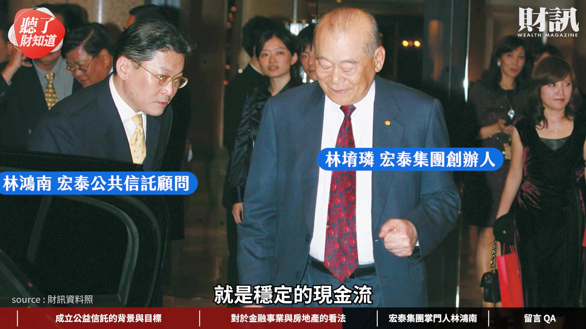

**逐字稿片段：** 事實上這次他投資中嘉的事情 他也是這樣講 他覺得中嘉原本是一個好生意 但現在的進度 跟現在的情況是怎麼樣 他說到現在可能配息 還沒有達到自己的想法 但是他說有線電視台現在 就是因為有網路（媒體競爭） 就是經營的滿辛苦的 就是第四台的剪線潮 寬頻原本是搭贈的 因為大家都很需要網路 現在變成賣寬頻 然後搭贈送第四台 他說這個風潮也還是有的 雖然用戶在持續下降中 但是（寬頻）業務其實有呈現交叉 這個事業未來還是有機會 然後不會都完全的沒有 他當時花了滿多錢 來投資中嘉的時候 他就是著眼於穩定的現金流 希望它可以有穩定的配息 但他也不否認說 他們當時投資到現在 配息的表現是不如預期的 就看看中嘉有沒有轉機 他就說只能盡量的 建議那個經營團隊繼續加油 只能這樣做 OK 暸解

**話題推測：** 討論宏泰集團投資中嘉案的現況與表現。

---

## 00:13:17

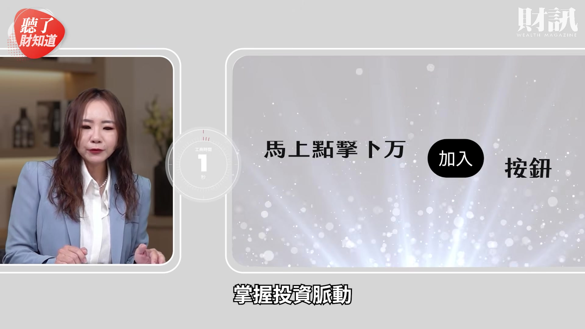

**逐字稿片段：** 外界過去以來 對於林鴻南的印象 都是覺得他很霸氣 對數字非常的精明 然後好像不太在意外界的看法 這次我們去採訪的時候

**話題推測：** 開啟新話題：林鴻南的個人形象與外界印象。

---

## 00:13:26

**逐字稿片段：** 他居然說他自己是社恐 I 人 我覺得這個反差感滿大的 對 他說外面很多謠言 說他很霸氣 然後很精明 很會算 他說他都知道 但是因為他就是不太善於 跟大家解釋這件事情 所以他的傳言就愈傳愈多 真的 在林堉璘的時代 林鴻南就很少直接對外溝通 對不對 對 就是其實對外面 也不會找媒體記者 然後講什麼事情之類的 他說他是社恐 I 人 是因為他說 他如果有時間 他可能就是都自己在家 或想事情之類的 沒有一定要去外面社交 他到現在周邊朋友 都是他小時候 然後同窗時期的一些好朋友

**話題推測：** 林鴻南自稱「社恐I人」，與外界霸氣形象形成反差。

---

## 00:14:02

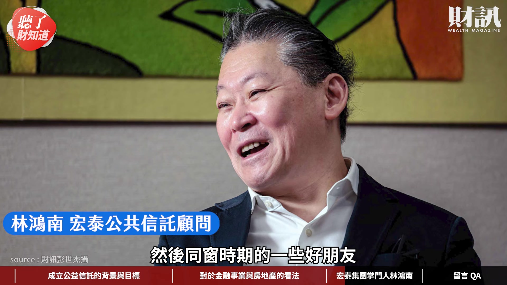

**逐字稿片段：** 他有提到他跟父親的相處嗎 他有提到說他父親 對小孩的要求都滿高的 都是希望 望子成龍 望女成鳳 都是很要求 所以他爸爸在他面前 是比較有威嚴 所以平常也不太敢跟爸爸 講一些什麼心事或是什麼的 自從他爸生病之後 他突然覺得說 他跟他爸之間的距離 好像沒有那麼遙遠了 他爸就是也多花一些時間陪孫子 所以林堉璘在過世前的這幾年 變得比較和善 然後這時候他才知道 什麼叫做天倫之樂 變得比較溫和一點 過去是在商場上 很霸氣的大老闆 到晚年的時候可能還是覺得 家人的相處比較重要 的確是 其實這次我們在跟林鴻南聊的時候 我們都丟出非常多爭議性的問題 我覺得他基本上他坦然面對 而且就是頂著爭議 就繼續往前走 也不是很在意外界的想法是怎麼樣 他只要覺得他對的事情 他就做 不對的事情當然 就由司法或主管機關來做評判了 然後這次我覺得 比較大的突破點是說

**話題推測：** 討論林鴻南與父親林堉璘的相處方式與轉變。

---

## 00:15:00

**逐字稿片段：** 大家都知道林堉璘 土地買了非常多 他也跟我們證實說 就是除了核心區的這些土地外 都已經分家分出去了 就是說其實家族沒有什麼爭議 就是和平分家 算是和平分家 我覺得從這次的採訪裡面 也看到說林堉璘對於他的資產規畫 其實有很完整的想法 他覺得想要可長可久的 他就把它放到公益信託裡面去 單塊土地他就分給他的小孩們 當然小孩們可能有各自的規畫在操作 但我覺得重點是林堉璘 指定了林鴻南作為集團接班人 可能是他長期的互動跟信任感 他覺得林鴻南可能 能夠把他的家業帶著繼續往前走 然後透過孳息 透過穩定的現金流 可以對台灣做一些回饋跟公益 大概是這個邏輯 然後林鴻南一開始有強調說 他其實就是延續整個創辦人的 這個理念一直做下去 我們就問他說 那未來的接班狀況 誰會來接班 他也跟我們說 他其實沒有一定要林家人接班 他覺得從外面找比較厲害的經理人 可能優秀的人更多 所以他並沒有侷限一定要林家人 可能是專業經理人接棒的概念 他就說總之就是有適合 有優秀 然後可以延續他父親理念的人 都是適合做接班的 瞭解 因為事實上我們有問他說 大家都稱為你是接班人 那你自己怎麼看你自己的定位 然後他就說 他不是掌門人 也不是接班人 他其實是守球員 守球員 就是把這個家業守住 然後把這個父親的理念守住 一直傳承下去 然後為台灣做更好的付出 他覺得這是對他自己的期許

**話題推測：** 證實林堉璘家族的土地資產已和平分家。

---

## 00:16:33

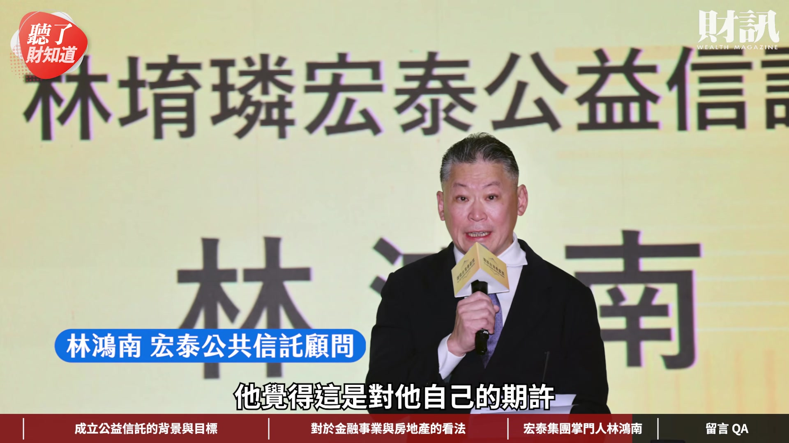

**逐字稿片段：** 在這次財訊第 773 期裡面 我們對林鴻南的公益信託 還有各個事業 都有滿完整的報導 裡面非常多的細節 我覺得讀者可以好好的來參閱 尤其是他對金融版圖 對土地開發的想法 還有他對轉投資事業的想法 其實我覺得都非常精彩 因為畢竟宏泰集團的 事業範圍滿大的 當然我們常常說投資一家公司 就是投資一家公司的老闆 所以我們透過試著理解跟爬梳 讓他多講一點 讓大家可以更認識林鴻南這個人 大家可以再繼續觀察這個集團的發展 因為畢竟林鴻南 他的方向跟他的決定 還是會左右他旗下 5 家上市公司的表現情況 所以我們會為大家繼續的追蹤 今天非常感謝筱燕的分享 看完今天的影片 你對林鴻南印象 最深刻的事蹟是什麼呢 歡迎大家留言 分享你們的觀點 如果不想錯過我們的節目 歡迎訂閱財訊頻道 或是加入頻道會員 解鎖所有的會員影片 接下來我們要回覆財團在 《聽了財知道》 第 369 集 台灣三十年老屋比你想像更多 裡面的留言 我們的財團 May Wu 他說 重點在台灣沒有強制規範住戶 每個月要提撥修繕基金 作為防止定期外牆結構修繕 清潔和維護費 如果能借鏡日本的管理辦法 台灣的房子就可以延壽 減輕都更的時間壓力 對 這個意見滿好的 因為我們都有發現說 日本房子好像都比較新 因為它們好像 如果你的外觀不太好的話 是會罰錢的 所以早年的時候還有說 如果去日本要投資透天的民宿 也要注意 因為你那透天民宿太老舊 然後你就放在那邊不管

**話題推測：** 影片結尾，宣傳《財訊》第773期雜誌關於宏泰集團的報導。

---
