# wealth1974_4T18lB7pbI0 — 關鍵畫面索引

- 來源逐字稿：[wealth1974_4T18lB7pbI0_GT.srt](wealth1974_4T18lB7pbI0_GT.srt)
- 影片：https://www.youtube.com/watch?v=4T18lB7pbI0
- 截圖數：13

## 00:00:05

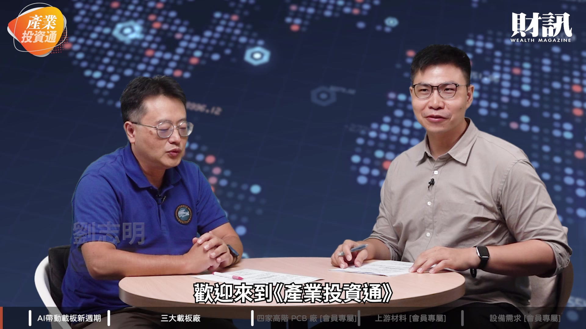

**逐字稿片段：** 最近台灣電路板協會 TPCA 示警 AI 帶動載板需求大增 但業者的新產能

**話題推測：** 台灣電路板協會（TPCA）示警，顯示產業新聞或報告摘要

---

## 00:00:12

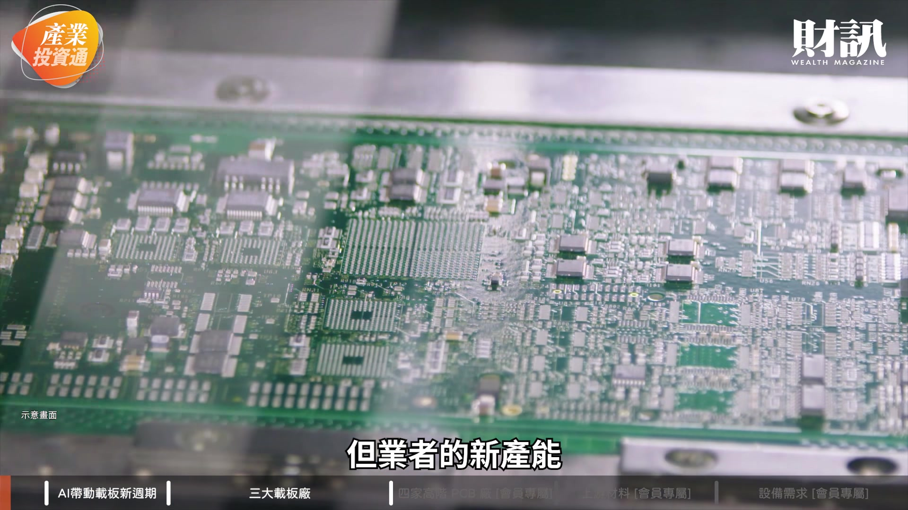

**逐字稿片段：** 要到 2027 至 2029 年 才會陸續開出 供應緊張至少延續到 2027 年 就在這個時候

**話題推測：** 載板新產能開出時程，預計顯示時間軸或相關數據圖表

---

## 00:00:20

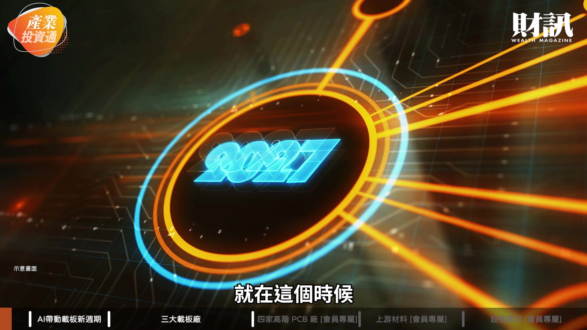

**逐字稿片段：** 載板龍頭欣興宣布斥資百億元 在新竹湖口 買下近 2 萬坪廠區擴產

**話題推測：** 載板龍頭欣興宣布斥資百億元擴產，顯示欣興公司圖標、股票走勢或新聞標題

---

## 00:00:27

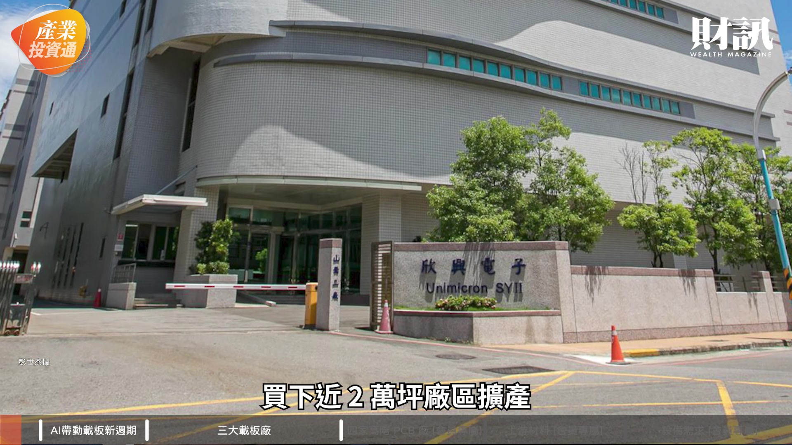

**逐字稿片段：** 隔天 ABF 載板 與 PCB 族群同步轉強 今天這一集 我們就要來跟大家聊聊

**話題推測：** ABF載板與PCB族群股價轉強，預期顯示相關類股走勢圖或市場分析

---

## 00:00:34

**逐字稿片段：** AI 晶片升級帶動載板新週期

**話題推測：** 本集主題：AI晶片升級帶動載板新週期，預計顯示節目主題標題

---

## 00:00:37

**逐字稿片段：** 三大載板廠和四家高階 PCB 廠 以及最後的上游材料 與設備同步受惠 志明哥我們其實 這不是第一次來聊載板這個題目 我記得 8 月多的時候我們才聊過 當時聊是 ABF 載板 那我們這一次聊會更擴大一些 是整個載板的環境 我們都來聊一聊 能不能請志明哥幫我們解釋一下 為什麼這個時候 我們又要再來聊一下 載板這個題目 過了短短 1 個月的時間 有什麼樣的變化嗎

**話題推測：** 介紹三大載板廠、高階PCB廠、上游材料與設備，預期顯示供應鏈圖或公司列表

---

## 00:01:04

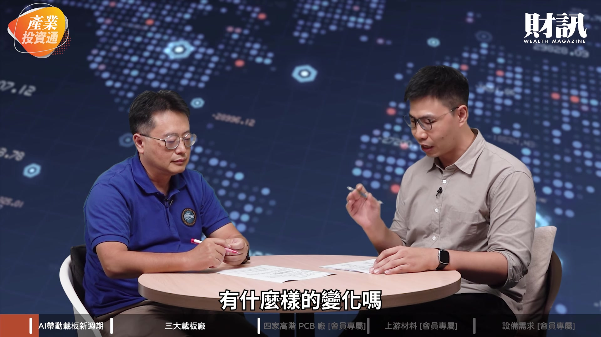

**逐字稿片段：** 其實 10 月 20 日 台灣有電路載板的一個大展 那其實展覽前 當然就會有很多好的消息 相關公司的股價 相對會被激勵 那其實簡單來講就說 昨天我參加 一家外資券商總經理的演講 他有講 他跟台積電朋友聊說 最近的新增晶片的產能怎樣 他說如果你 沒有載板的產能的話 就不用來跟我談新增晶片產能 非常的直接 所以說晶片的產能雖然有缺 但是沒有像載板那麼吃緊 其實看這樣的趨勢 載板的需求 還有 PCB 的需求 的確會變高 那主要的原因就是 AI agent 的部分 它是從 GPU 延伸到 CPU 那 CPU 它的運作的東西又更多 搜尋資料 執行程式 系統調度 記憶體的存取 那這部分你等於是 CPU 的速度要變快

**話題推測：** 提及10月20日台灣電路載板大展，預計顯示展覽資訊或活動圖示

---

## 00:02:01

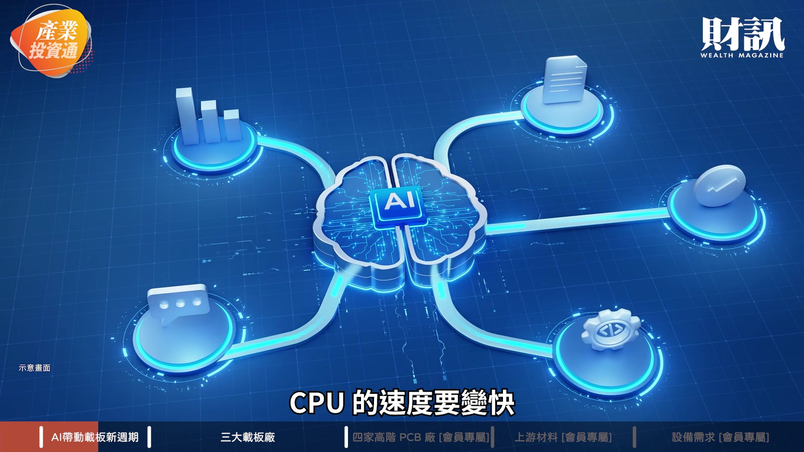

**逐字稿片段：** 它的核心就會變得愈來愈多 核心上升的話 它其實就更需要很多的 這種先進封裝跟載板配合的 這些整合的一個態勢 那這部分就會促進 這個載板應用面會愈來愈多

**話題推測：** CPU核心數量增加對載板需求的影響，預期顯示CPU核心數成長示意圖

---

## 00:02:16

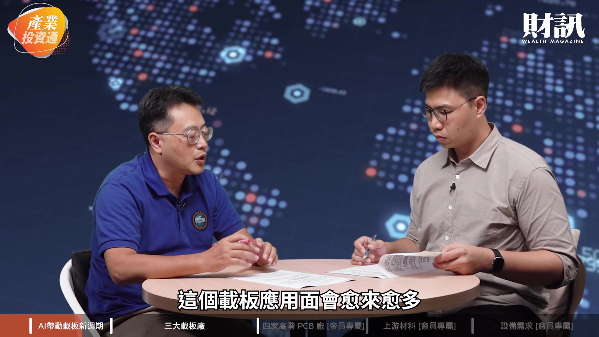

**逐字稿片段：** 今天我參加一個記者會 它也是講到說 大家都覺得 AI 看起來這個算力 大家都很擔心 某種程度上來說 台灣這一波股市 往上一直攻高 都是源自於 AI 算力的需求 那就會有人擔心 未來需求如果說 沒有那麼需要了 會不會有問題 但那個經理人告訴我們說 沒有 未來當你的 AI 的功能 從過去的聊天的方式在聊 未來可能會更多 更衍生到實體的 AI 從推論到更多衍生性的功能 其實算力的需求 只會一直的增加 我想這可能也呼應到 為什麼載板會這麼缺的 一個原因這樣子 其實載板載板 很多廠商都在做 但針對 AI 這一塊 我們看的是高階的 ABF 載板 它其實有一定的製程的門檻 但市場預估其實 供需已經開始吃緊了 那其實我們剛才聊了一下 這個吃緊的程度 是可能超乎大家的想像 像台廠有欣興 景碩 南電三雄 這個我相信 已經幾乎是投資人的 common sense 了 那能不能幫我們解析一下 載板三雄的狀況呢 我們簡單來看就是 它（載板）就很像一個千層的蛋糕 比如說它以前只有 16 層 那現在到 16 到 20 幾層 甚至以後會更多

**話題推測：** 提及參加記者會對AI算力需求的觀察，預計顯示記者會重點摘要或相關報導

---

## 00:03:22

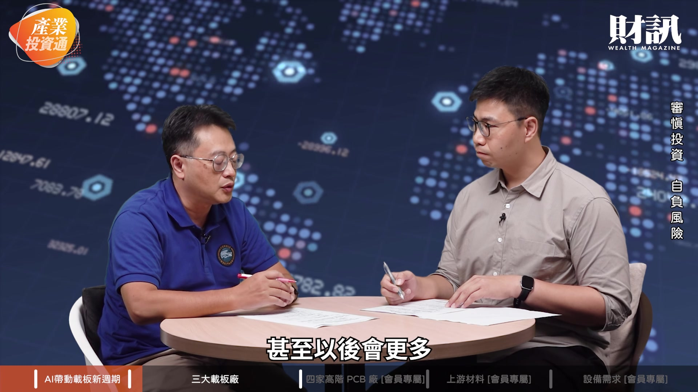

**逐字稿片段：** 現在預估 2027 年缺口是 26% 那 2028 年可能到 46% 所以說缺口的幅度是在變大 那在變大的狀況下 你觀察最近欣興花了 100 億元 去買一個新竹的廠房 2 萬坪 規模是滿大 那我們跟這種業界的聊說 其實載板未來 相關這些廠的需求 可能有 20 座廠 那台灣的欣興 可能會新蓋 10-12 座 那景碩可能是在 5-6 座以上 那南電至少也有 2 座 那這原因就是因為 除了日本的 IBIDEN 之外 其實台灣這三家 是最重要的供應鏈 但是日本的擴廠的速度 還是比台灣的廠商要慢 所以說未來新增的這些 跟晶片配合 先進封裝配合的 這些 ABF 載板需要的東西 可能都是由台廠去供應 滿大一部分的比率 這邊的商機是會愈來愈高的

**話題推測：** 預估2027年和2028年載板的供需缺口，預計顯示供需預測圖表

---

## 00:04:16

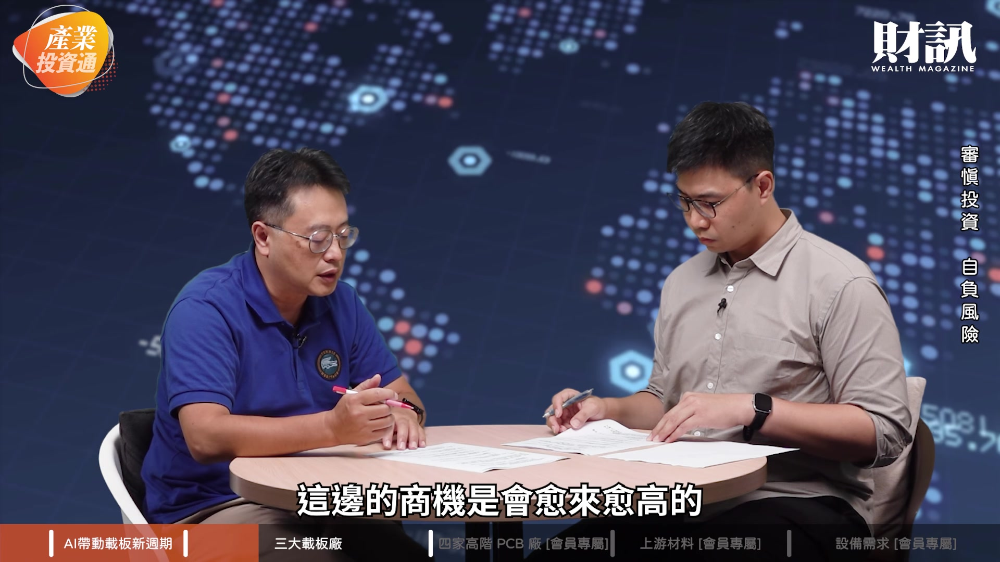

**逐字稿片段：** 我們知道欣興跟 Intel 跟台積電其實配合都滿高的 尤其是 Intel 的 EMIB 的 這種先進封裝的部分 台積電是做中介層整片 就是跟邏輯晶片 跟記憶體整合在一起 那 Intel 的做法 是邏輯晶片跟 HBM 記憶體的是分開 但是中間是有一個 中介橋的部分 那這部分其實 要跟載板是完全配合 等於在載板上 切一個溝槽 那這部分載板的地位 可能就會愈來愈重要 欣興有這樣的技術 然後 Intel 也有跟它 做滿密切的配合 那不管是未來的 新的 CPU 甚至是 ASIC 甚至是 CPO 其實未來跟這些 PCB 載板 或是 PCB 的整合度 其實是愈來愈高 愈來愈緊密 價值會愈來愈高 好 那我們剛剛講到欣興的部分 其實 20 座它就占了 10 到 12 座 這個最主要的一個來源 也是我們剛剛前面提到的 新竹湖口廠的這個部分 那景碩跟南電呢 景碩其實業界的傳聞 就是它跟台積電 要做一個類似 Intel 的 EMIB 的一個技術 那它合作部分就是跟景碩 所以說景碩在楊梅 有擴好幾個廠 那當然未來的業績 也會持續成長

**話題推測：** 欣興與Intel、台積電在先進封裝的合作，預期顯示Intel EMIB或台積電CoWoS示意圖

---

## 00:05:31

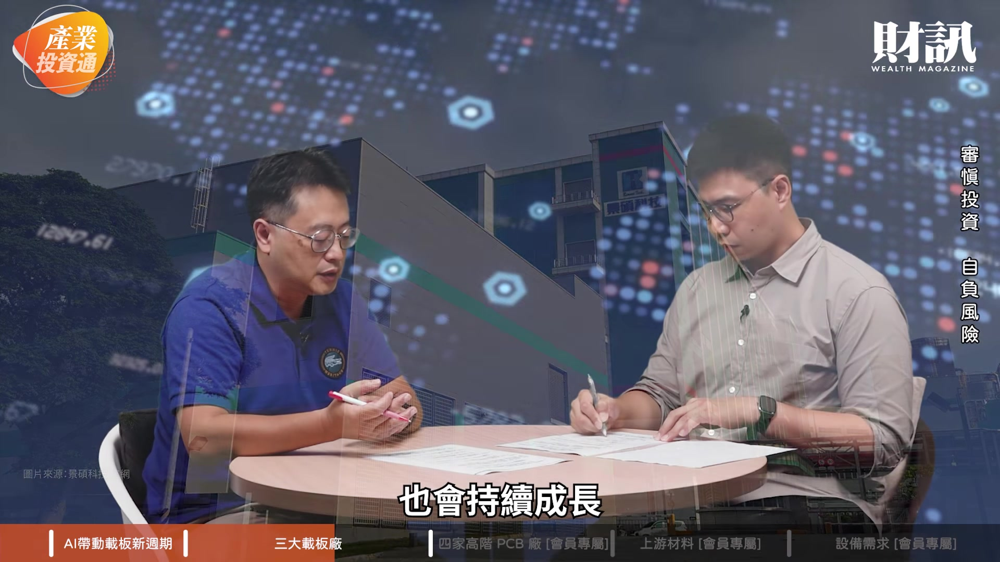

**逐字稿片段：** 那南電也是 AMD 有跟南電有滿密切的配合 也都是有這種包廠的動作 那看起來就是說 你現在觀察它們這幾家公司的

**話題推測：** 分析南電與AMD的密切配合與包廠動作，預期顯示南電公司圖標、股票走勢或相關新聞

---

## 00:05:40

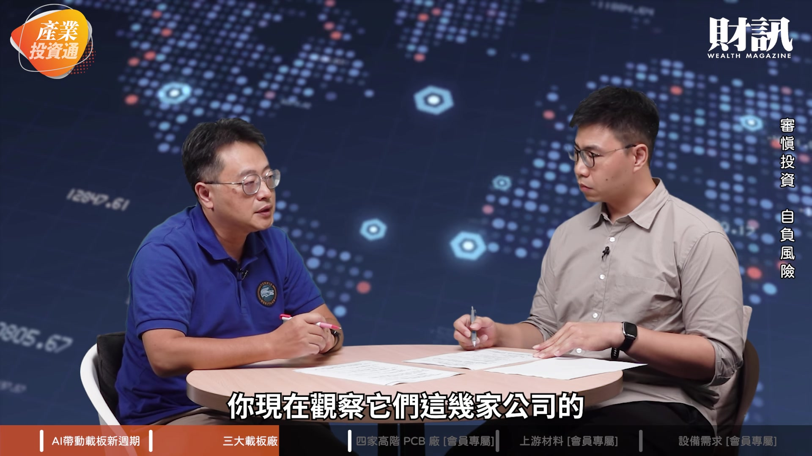

**逐字稿片段：** 毛利率在 26% 27% 甚至 30% 左右的這樣的狀態 但是未來 因為這缺貨 然後漲價 它可能會跟記憶體一樣 就從 20-30% 的毛利率 變成 50-60% 甚至未來更高 這未來的趨勢是 站在它們這邊 尤其為了做一些 先進封裝的整合部分 載板的技術層次會愈來愈高 受到重視的程度也會愈來愈高 對 剛才志明哥 其實有講到一個關鍵字 就是良率 其實在未來 你堆疊愈多層 對於整個工法上的難度 是愈來愈高的 那這也考驗一家公司 能不能夠交付出 它的客戶需要的良率 像這三雄中 有很明顯的技術領先的嗎 在這種高階層的載板的難度上 目前看起來就是 欣興的高階的製程 是比其他的要好一些 尤其它又有一些 特殊的規格的這種變化 當然 其實應該三家 都是慢慢都在精進 自己的相關的技術 都是往更高階的先進封裝去前進 而且未來的 AI 晶片 就是需要它們這樣的技術 所以說長線來講 它股價往上走的機率 是很高很高的 而其實它現在三家公司的股價 都上千元 都是千元高價股 但是未來可能會更高 是 就是整體需求 都是非常的大的 所以其實在這種 競爭的壓力下 可能未來會有更多的態勢改變 對 所以我覺得大家就持續關注 財訊的《產業投資通》 我們會為大家帶來 更多相關的資訊

**話題推測：** 載板三雄毛利率現況與未來趨勢預測，預期顯示毛利率比較圖表

---
