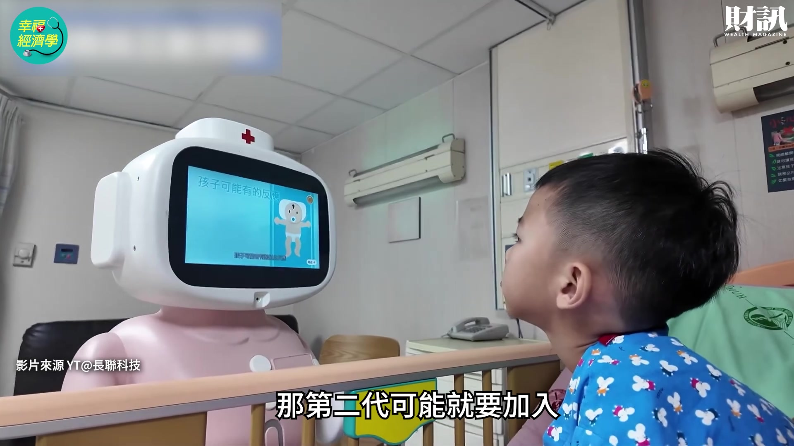
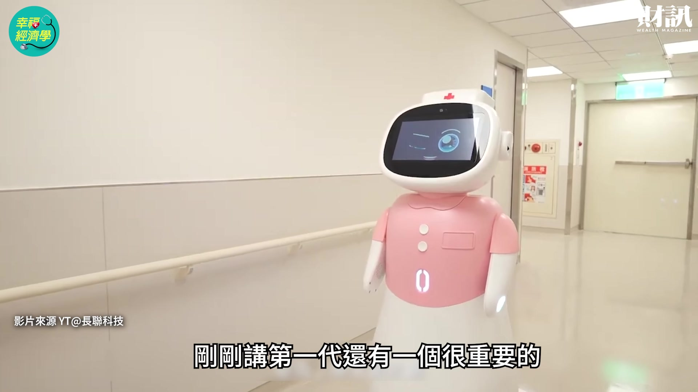
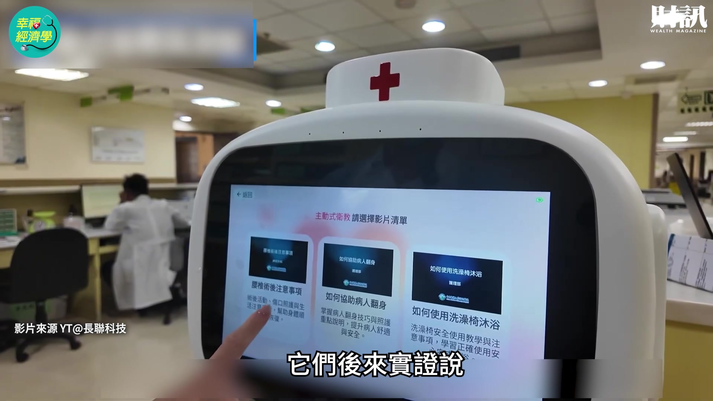
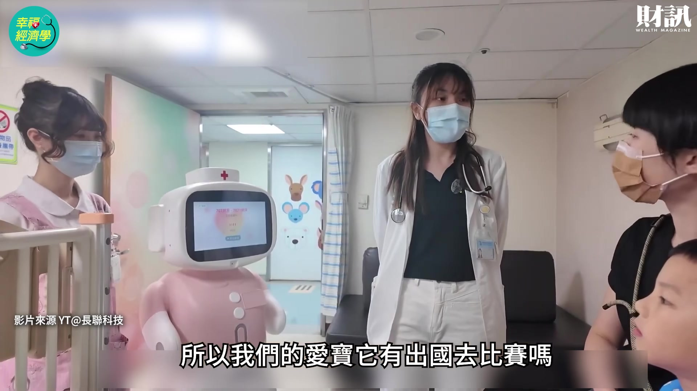
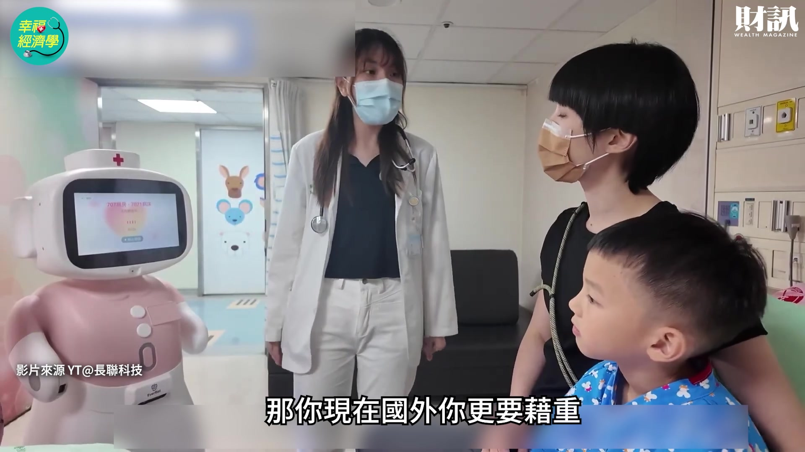
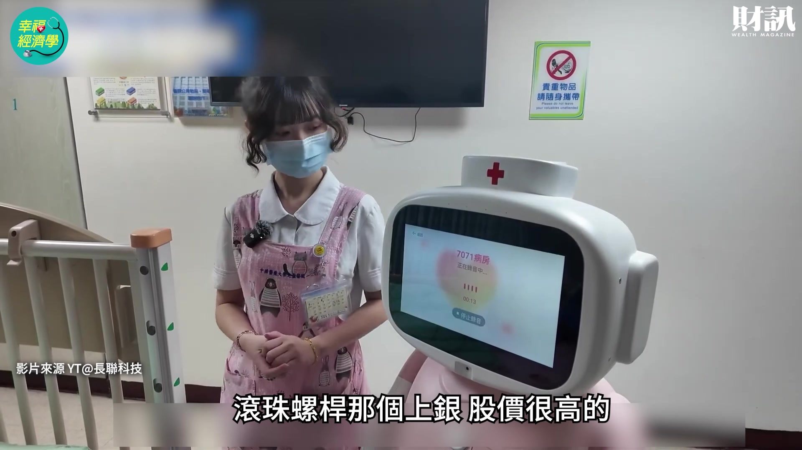

# wealth1974_5gxEt8Vgtiw — 關鍵畫面索引

- 來源逐字稿：[wealth1974_5gxEt8Vgtiw_GT.srt](wealth1974_5gxEt8Vgtiw_GT.srt)
- 影片：https://www.youtube.com/watch?v=5gxEt8Vgtiw
- 截圖數：21

## 00:00:06

**逐字稿片段：** 照護機器人的服務到家 照護新時代來了 想要知道的觀眾朋友 記得要看到最後

**話題推測：** 介紹主話題：照護機器人與照護新時代

---

## 00:00:13

**逐字稿片段：** 今天的來賓是我們財訊的 總主筆劉軒彤 軒彤妳好 各位觀眾大家好 我是劉軒彤 那當然我們都知道就是說

**話題推測：** 介紹來賓：財訊總主筆劉軒彤

---

## 00:00:20

**逐字稿片段：** 台灣已經進入超高齡社會了 而且少子化很嚴重 真的 真的好嚴重 現在真的小 baby 好少 今年好像統計 可能應該新生兒不會到 10 萬 對 我們那個年代是 30 幾萬 30-40 萬 30-40 萬 好可怕 好 所以現在就是因為人口的結構 是這樣的轉變 也就是說 隨著人口的年齡一直提高 就是需要照護的人是愈來愈多 但是能夠提供照護的人力 卻愈來愈少 對 就像之前那個 三班護病比入法就是法律規定 比如說醫學中心來說 白班 小夜班 大夜班 以前大家都打成一包 所以可能晚上只有 很少的護理師在照顧 可是非常的疲憊 那現在就分成三班 三班這樣護病比 那這個護病比就是比如說 你白班只能一個人照顧六個人

**話題推測：** 討論台灣超高齡社會與少子化問題

---

## 00:01:08

**逐字稿片段：** 變成法律在 2027 年開始上路的時候 就是醫院沒照這來就是違法 對 那你想像看現在你剛講說 30-40 萬變成 10 萬個人 但是需要住在醫院裡的人又愈來愈多 是的 對 所以最近我們常聽到什麼 病房不夠得要去 就是在急診室等很久什麼 都是互相聯動的 其實就像我剛剛講的護病比 那是最基本的就是說住院 你想說一個護理師照顧六個人 假設你 10 個 你就只能開 60 床 對 那你下面的人沒辦法上來 因為你護理師不夠 這就是 所以並不是沒有病房或沒有病床 而是沒有護理師 對 那你就不能開這個病房 現在產業面 我們也曉得

**話題推測：** 提到護病比新法將於2027年上路

---

## 00:01:43

**逐字稿片段：** 就是照護機器人絕對是 未來的一個強大的需求 真的也有很多業者都開始 朝這個方向努力了 對 連那個台積電董事長魏哲家 我覺得他講那句話非常的讓人有感 他本來就是常常在提機器人的重要性 然後他又特別強調就是說 年紀大了之後機器人 永遠會比另外一半給你的照顧更多 而且更有效率 可能有時候你另外一半照顧你 還會嫌東嫌西 因為另外一半也老了 對 所以真的大家都在期待就是說 透過科技的方式 然後能夠來滿足 大家被照護的這一塊的需求 那我們知道就是說現在其實 已經有一些明確的進展了 在國內的業者的部分 我們在財訊 2024 年 大家都知道 那時候我們做了一個 十大黑科技 那時候我負責這個 醫療部分就有寫到這個 醫療照護機器人 但是我記得 2024 年寫的時候 台灣還沒有什麼樣本 我們都在寫國際 那時候只覺得說 它們推出了機器人 在試用在醫院但是 如果是放在醫院裡面幫護理師拿藥 處理一些簡單工作 這些機器人我記得那個時候我看到說 一個月省掉幾十萬或上百萬公里的 護理師不用跑那麼多地方我覺得好棒 其實鴻海在今年 6 月 Computex 的時候 它其實就已經有宣布 它有一些護理協作機器人 那它跟台中榮總做了一些 臨床的驗證實證 然後準備要進入這個 可能要生產或什麼的方向 要往那個方向走 那在 7 月的時候友訊 一個網通廠 那老牌的網通廠它也宣布說 它想要成立一個子公司 要做這個智慧陪伴或者是這種 安全照護的機器人 但事實上跑最快的是長聯科技 長聯科技是中國醫藥大學 我們今天要講的這個 中附醫這個體系 對 主題 因為它已經到目前為止 我想至少到七八月的時候 已經量產了大概 50 台了 那今年可能要量產 100 台 它是真正有量產的 那你看距離我們 2024 年也不過 兩三年就冒出來了 就表示台灣也在往這個方向做 表示說其實兩年之內 真的看好這塊市場 然後積極研發其實速度是很快的 我們今天講的主題是講長聯科技 它至少我們看到它有一個叫愛寶 你只要去那個機器人展 或者是醫療科技展 你就看到那個粉紅色的那個愛寶 因為它有量產所以我們拿它來當樣本 那妳剛說這個兩年 其實台灣的硬體真的很方便 很快 對 你只要台灣走一圈 你就可能 100 多個零組件或者組裝什麼 它就有辦法幫你做到 那剩下就是大腦 那為什麼長聯跑得比較快 成因就是 2024 年 那一年我想大家應該都還記得 就是護理師很缺 那時候就開始關病床了 對 很多人搞不清楚然後就 等病房可能等好久好久 那這時候就有很多的爭議出來 然後大家就會為護理師發聲啊 要加薪等等 可是加薪不是絕對的辦法 它是一個 不是根本之道 對 它還是要解決他過勞的問題 那那個時候就是 中國醫藥體系的這個

**話題推測：** 轉向討論照護機器人是未來的強大需求

---

## 00:04:41

**逐字稿片段：** 董事長 大家長 蔡長海 他自己是小兒科醫師出身 他就問他們下面的說 要解決這個問題你們要怎麼做 那他就叫長佳

**話題推測：** 提及中國醫藥體系董事長蔡長海推動機器人發展

---

## 00:04:49

**逐字稿片段：** 他下面有個長佳智能 是上市櫃公司 它是作為 AI 醫療就是 AI 醫療診斷判斷那些 他覺得 你要提高工作效率第一個一定想到 AI 所以他就叫長佳智能說 你們去想想看 怎麼樣解決這個問題 因為它們是一個很大的醫療體系 長佳智能的總經理李友錚 就是現在的長聯科技的董事長 他當時他們的團隊就提出說 AI 雖然可以解決效率但是 護理師去照顧病人這一個 人的實體動作是不可能解 被取代 不可能被取代 所以他說一定要一個載體 所以他們就決定做機器人 是大概是這樣的成因過來的 他們提了很多的方案 至少被蔡長海退了十幾次 比如說你這個機器人要不要有人形 要不要有腳 那其實就有一些想法 但後來發覺說其實 在醫院你也不需要有腳 你只要能夠做 移動就好 對 而且你真的像個人形 半夜走到你旁邊也會嚇到 我也不曉得 對 就是其實真的 你一個全新的產品的設計 從內到外 都有很多東西都需要考量 所以我們現在知道就是說 今年就會有 50 個愛寶出生 已經有 50 個愛寶 在各大醫院這樣子在試用 所以它們已經 我們在大醫院裡頭 也許有機會已經看得到愛寶來服務你 對 它們這 100 台大概有 10 個醫院 以中南部為主 包含它們自己的中附醫 你如果有去中附醫大概就看得到 不過一般是在病房區 或者你去醫療科技展也看得到 其實剛剛講了說 硬體在台灣是非常容易的 你很容易就找到這個組合 但是軟體就是你的大腦 再怎麼樣 AI 要做人的事 就是那個大腦 那中附醫非常的快的速度是因為 它們很積極 而且它們本來就有自己的一些 那個整個體系 資料庫 資料庫就醫院的這幾十年 它們就已經有一些結構化的資料 那它們就把這個資料分類 很快的速度把它分成十幾類 然後每一類這樣子一直灌輸給這個愛寶 一直訓練它 就餵它 對 餵它訓練它 後來就發現說 它們拿連續三年的 國家護理師的國考測驗給它做

**話題推測：** 提及長佳智能在AI醫療領域的角色

---

## 00:06:44

**逐字稿片段：** 它都考了 93 分 事實上我也去問了一些護理師 它們講說如果都考 93 分 這是基本上就是狀元等級 因為你這個基本上 那種醫療沒有做到 100 分的 93 分已經非常難了 非常厲害 所以它幾乎是狀元等級 所以它們就可以確認說 至少它的衛教知識跟那些護理的知識 是 OK 的 然後造出來之後就把那個大腦放進去

**話題推測：** 提及愛寶機器人國考分數高達93分

---

## 00:07:05

**逐字稿片段：** 然後再放到中國附醫裡面去試了半年 它的醫療體系裡面去試了半年 用實證來一直修一直修 因為一定有一些問題存在 那就是一直不斷的修 然後修到現在可能第一代已經 OK 了 那就開始有訂單可以量產出貨 我有點好奇因為我們知道就是說 明年第二代的愛寶也要出生了 對 因為這個東西就像我們剛剛一開始講 它一定循序漸進 會愈來愈進步 現在第一代的一定是幫護理師拿藥 比如說去拿一些醫材 它有一個固定的路線去幫他搬運東西 它不用護理師自己來回跑 第二個是幫它送東西到病房 還有衛教 比如說我今天是腎臟病好了 我要注意什麼我要吃什麼 他們有時候平常好像知道 可是你真的躺在那張床上的時候 你的家屬也會開始想 我到底要怎麼樣我生活要怎麼做 那有一些很簡單的環境導覽 那些等等的都可以靠這個 愛寶的工作內容 對 衛教 可能衛教 很基本的或者跟你 say hello 這些 很基本的都有 那第二代可能就要加入

**話題推測：** 說明愛寶機器人已在中國附醫體系實測半年

---

## 00:08:03

**逐字稿片段：** 可以幫你巡房 現在我們不是護理師還是要親自去看 那個尿袋是不是滿了 你的點滴是不是快結束了 那我要去換當然現在 可能還不能讓機器人換 可是機器人可以去幫你看 你又省了一些時間 剛剛講第一代還有一個很重要的

**話題推測：** 說明第二代愛寶機器人將新增巡房功能

---

## 00:08:18

**逐字稿片段：** 就是交班 我們以前那個護理師他要 不但要把你每個病人的那個情況寫下來 然後還要告訴下一個人 比如說你現在什麼狀況 然後接下來要注意什麼 對 白班四點下班 他可能要多花半個小時一個小時 去交給下一個人 然後前面他也花一堆時間去接班 所以大家耗費很多時間在這邊 這個都是第一代已經可以做到的事 那現在第二代我剛剛講巡房 巡房有個小問題就是 那我怎麼開門 第一代可能沒有手 我以長聯來說 不是說所有機器人都這樣 那它第二代可能它手上 就要做鉤子或什麼 可以開門我才能自己進去 不然每次還要護理師幫你開門 這動作比較精細 對 就開始有一些這個不同的 那可能第三代以後 未來當然長期是希望 有這個載體可以做更多的事 甚至以後是不是直接幫你做一些掃描 做一些什麼都有可能 那就要非常多的 AI 功能進去 那可能就要合作 其實最終極的我覺得

**話題推測：** 提及第一代愛寶機器人可協助護理師交班

---

## 00:09:10

**逐字稿片段：** 政府不是在推在宅醫療嗎 有些你可以到家裡住 然後有護理師什麼的 他可以把它當作我在醫院 假設我是中附醫好了 我在醫院的一個幫手 一個護理師的幫手延伸到你家裡 可以去做一些工作 但是到了終極其實就更難了 因為它可能在你的家裡你的環境 你是可以這樣自由移動嗎 每個人家不一樣 問了一些人就可能自動導航 跟你汽車自駕一樣 他必須要知道怎麼判斷 你不要去撞人你不能 要避開路障 對 這些我覺得未來一定會發生 只是說它可能久一點點 因為這種安全認證還是要有的 而且因為它負載了更多的功能之後 它對比如說環境 還有使用者本身也要有基本的認知 什麼什麼這些東西 這整個來講都還是需要培養的 是 這是我們的一些願景 那當然台灣我們知道就是說 因為我們畢竟是超高齡社會 所以會有一定的 就是對於像愛寶這樣子的 照護機器人的人力 一定是會有需求的沒錯 但是對廠商來講 當然會希望就是說這個規模愈大是愈好 也就是說愛寶今天它不是為你做一隻 或者是為哪一家醫院做十個 所以到底對長佳智能來講 或者是說對長聯科技來講好了 它們要怎麼樣去打開這個市場 應該是說我們現在回過來看 這個整個世界的 其實各地都有 你到日本也有到美國也有 每個地方都有 你如果去看一些展覽 它們可能都有各自的功能 可是能不能很快的推展到 而且適用每個場合其實不一定 像國外有一些大廠 它們可能方便的話 你就用雲端 你所有資料上雲 然後你的衛教 我就從大語言模型雲端抓那個 比如說我剛剛講的腎臟病 要注意什麼 它可能就一個規定的答案給你 那你要做出差異化來 比如說像長聯科技 它不斷的訓練 然後它一直在實證說 我們今天比如說回答講 500 句 告訴你所有東西 可是有些我不要 它們後來實證說

**話題推測：** 討論政府推動的在宅醫療政策

---

## 00:11:01

**逐字稿片段：** 大概講 200 字就像我跟你對話 我大概講 200 就已經是極限了 再下去那些病人可能 就會變廢話 就忘記了對 所以它們一直在實證 其實這些都是小小的地方 就是它不斷的在實證說 我到底要把那個語言設計 這些都是很細的功 很細微可是這些細的功 就是你慢慢的要有差異化 那當然它們也在想 妳剛剛講第二個怎麼推展到其他醫院 有些醫院就是 奇怪我為什麼要用你 對 我們各門各派 對 那他們現在做的就是 它把它的大腦 可能它區分很快很多模組 那我現在給你一個是公版 可是你可以在它有一個平台 可以讓你拿回去二次設計跟調教 你拿回來以後我的大腦 我要適應我台大的文化 或什麼高醫的文化 我再用一點我自己內部的資料 去再訓練它 或甚至針對不同的科別 對 沒錯妳講的沒錯 妳很聰明 對 要強調的部分 是 它可能有各種醫院 它有自己的那個 那它就會設計一些模組 然後讓它們可以二次加工 對 但是我當然相信 未來可能更多競爭者也會刺激它們 那所以它要做的第一件事情要差異化 你第一個也不曉得國外的法規怎麼變 因為這個到底以後門檻設得多高 法規都不一樣 所以它們第一個這件事一定是做

**話題推測：** 提及愛寶機器人衛教對話長度約為200字

---

## 00:12:14

**逐字稿片段：** 你那個 ISO 的那種認證 不管是資安認證 它們說還有什麼持續運作認證 就是你不能說一下 突然 shutdown 了怎麼辦 一直去給它認證 或者像我剛剛講的那些 它們的小語言模型 你回答這些衛教知識到底對不對 我們自己考國考就罷了 但是它還要有認證啊 我跟外國人講說我這是對的 也很難

**話題推測：** 討論機器人相關的ISO及資安認證

---

## 00:12:33

**逐字稿片段：** 那它們就找比如說德國萊因 就這種認證的正確性 就是有東西我就去認證 那剛剛你講到還有就是 其實我們之前有一個人工智慧基本法 那可能有些人都會覺得這些法 跟我們好像很遠 但事實上對它們這些廠商來說 反而有一些法它可以給我強制 可是因為我夠嚴苛 我就可以在 它設了門檻 對 那以後不是一些什麼人都可以進來 或者說我出去國外的時候 至少台灣出來一個基本法在那邊 你的水準有一定的 然後你的門檻更高 就是這個種種都是 我覺得是國家社會跟一般人 還有這些醫院 大家產業大家的合作 妳剛才也有提到就是說 很多先進國家啦 或者說鄰近的國家都有碰到高齡化 少子化類似的問題的國家 都有這樣的需求 然後它們的科技能力可能也很強 然後也都在開發他們自己的這樣的東西 所以我們的愛寶它有出國去比賽嗎

**話題推測：** 提及尋求德國萊因等機構進行認證

---

## 00:13:26

**逐字稿片段：** 它們八月已經送了兩台到新加坡 給代理商就是常駐在東南亞 它們兩台放在那邊 就是讓它經銷商到處帶著去看 我想要進到美國那些 真的離我們太遠了 而且它們的法規 它們的醫院的生態不一樣 所以一般都是先從東南亞這邊開始 那它們以新加坡為基準 不管怎麼樣我們都知道 醫院是個封閉的通路 台灣都已經很封閉了 要打開了 那你現在國外你更要藉重

**話題推測：** 提及愛寶機器人已送至新加坡拓展東南亞市場

---

## 00:13:50

**逐字稿片段：** 就比如說他們的大股東有什麼上銀 滾珠螺桿那個上銀 股價很高的

**話題推測：** 提及長聯科技的投資方上銀科技

---

## 00:13:55

**逐字稿片段：** 還有趨勢科技這些 它們都是科技業 也有投資長聯科技 那它們就願意說在董事會裡面 而且它們可能在海外的行銷的 對 管道是更多的 對 它們有建立很多管道 那大家就互相

**話題推測：** 提及長聯科技的投資方趨勢科技

---

## 00:14:07

**逐字稿片段：** 所以這種互相包括什麼中華電信遠傳 它們也會將來跟 AI 這邊一定都有相關的 所以它們也都願意幫忙 就是大家組成一個聯盟 那當然它現在希望 下游的這些聯盟會更多 就是一直加入 因為將來我剛剛講的那個 AI 載體 它以後可能不是只做護理師 它可能順便幫你檢查什麼的 那你是不是要有 AI 的診斷什麼的能力 科別那麼多 妳剛剛已經說了 你一家長佳智能一家長聯科技 根本不可能做到 所以將來一定是打這個聯盟戰 所以它們也希望 它們現在跟中華電信 遠傳 或者是趨勢 上銀 或者甚至帆宣 那個設備廠帆宣 它們在聊過以後 大家都很願意幫忙台灣做出這個 因為做出來以後 也許大家將來都有 我們對我們自己都會用得到 對 或者說大家都會從中找到 硬體或軟體的商機 對 也是新的機會 是 沒錯 謝謝軒彤的分享 看完今天的影片 你看好照護機器人這件事情 它未來的發展嗎 歡迎你來留言分享你的看法 如果不想錯過我們的節目 歡迎訂閱財訊頻道 或是加入頻道會員 解鎖所有的會員影片

**話題推測：** 提及與中華電信、遠傳等夥伴合作

---

## 00:15:14

**逐字稿片段：** 接下來我們要回覆財團 在《幸福經濟學》 為什麼缺牙會影響大腦的功能呢 這一集裡面的留言 好 有一個財團 niat 他說北榮的說法就真的還是在觀察 並不能證明有因果關係 從觀察中的結果就是失智跟缺牙 有外在表現的關係 就算回推年齡 也有可能只能證明說 從那個年齡就已經出現失智的輕微現象 壓根就不會證明缺牙和失智有因果關係 那某個年代以後 青少年牙齒矯正都已經非常普遍了 面對普遍矯正後的牙齒 到底還有沒有參考價值 我想這個這個聽眾朋友說法 也沒有什麼錯 因為當初這個北榮它就只是 告訴大家說它沒有縱貫式 就是它沒有從頭這樣 比如說長達十年去觀察這個因果 所以它們也講了確實是這樣子 我覺得這些實證也只是告訴 因為我們現在正在高齡化 我想年輕人可能沒有辦法體會 我們這一輩小時候沒有人在注意牙齒的 真的父母都沒有辦法養大我們了 他沒有辦法注意 等到我們有錢的時候 我們一些根本就是身體可能也沒有顧好 什麼沒顧好 所以很多老人家 可能就是因此這樣子缺牙 那缺牙他又覺得好像也沒關係 那隨便就好了 我覺得這個北榮這些研究 只是在幫助大家說 你不要忽略這些 盡量減少 那至於你說以後的青少年牙齒都很好 那當然是一件很好的事情 那我們就不用再擔心那些缺牙的事 對 牙齒也是屬於你的健康表現的一部分 對 那到底是不是直接說 只要缺牙就會失智 或是什麼這麼強烈的 可以做這樣的直接推斷 我覺得到也不至於說 硬要這樣套上去 不過總之就是說 牙齒可能是一個表徵這件事情 就是值得參考 對 尤其缺很多牙齒的 對 很重要對

**話題推測：** 進入留言回覆環節，主題為「缺牙與大腦功能」

---

## 00:17:01

**逐字稿片段：** 那第二個是財團 Newton Hung 他說缺牙不是一日造成的 牙齒的缺失是從蛀牙開始 現在的熟齡人口小時候的蛀牙 都是用含汞的銀粉補牙 當這些汞上了牙齒之後 就會慢慢擴散到整個頭部 甚至掉牙 汞已經留在頭部組織了 會造成到處發炎的慢性汞中毒症狀 這可能是缺牙老人失智症 不為人知的一個主要原因 我們的財團真的都 好專業 對 好專業 對 這其實有點類似我剛剛講的 就是我們小時候沒有保養好 對 早年的時候醫材也沒有那麼講究 當時的考量都不會是想到說 它之後可能對身體造成什麼影響 對 以前真的沒有這種概念 如果您還想要瞭解更多的內容 歡迎點擊資訊欄裡面的文章連結 或者是購買第 769 期的電子雜誌 《幸福經濟學》我們下次見 bye bye

**話題推測：** 回覆第二則留言：網友Newton Hung的看法

---
