# wealth1974_Dzi5i-FcZgs — 關鍵畫面索引

- 來源逐字稿：[wealth1974_Dzi5i-FcZgs_GT.srt](wealth1974_Dzi5i-FcZgs_GT.srt)
- 影片：https://www.youtube.com/watch?v=Dzi5i-FcZgs
- 截圖數：21

## 00:00:16

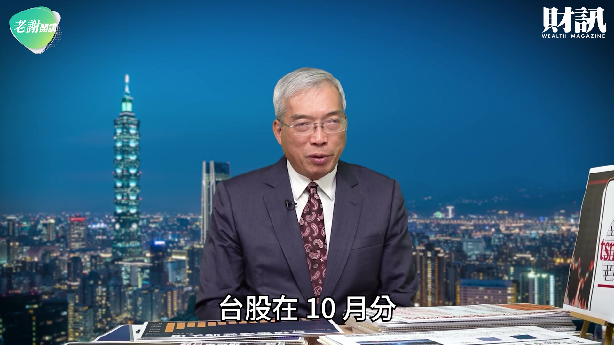

**逐字稿片段：** 正式開始挑戰 5 萬點 這個 5 萬點的關鍵 應該是台積電 未來的第四季當中 我們如果從投資的角度 從台灣的戰略的角度 來剖析的話 台積電在今年的第四季 它一定會扮演非常重要的角色

**話題推測：** 台股挑戰5萬點

---

## 00:00:45

**逐字稿片段：** 我想最近有兩則重要的新聞 那麼大家可以看到 第一個是川普 在造勢的場合當中 他特別提到偉大的 台灣晶片公司

**話題推測：** 兩則重要的新聞

---

## 00:00:56

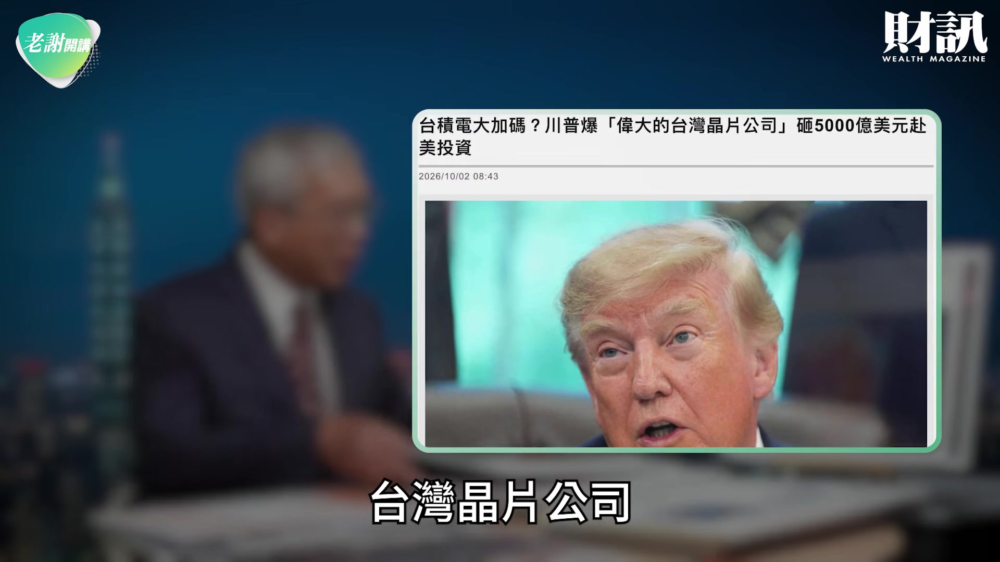

**逐字稿片段：** 要到美國投資 5 千億美元 我們大概可以想像得到 川普也不會信口說來 那經濟部它也表示 如果要投資 5 千億美元 一切要由台積電 自行來評估 要看台積電自行的規畫 所以 未來的拍板還是要落在 魏哲家董事長身上 所以我們大概回頭看一下

**話題推測：** 川普提到台積電赴美投資5千億美元

---

## 00:01:17

**逐字稿片段：** 在現在的亞利桑那廠的投資 從 2022 年的 650 億美元 那麼到 2025 年的 1 千億美元再加 1 千億美元 2026 的 7 月再加 1 千億美元 現在已經到 2650 億美元的 這個投資的額度 如果川普要 5 千億美元 扣掉 2650 億還有 2350 億 所以這個 2350 億

**話題推測：** 台積電亞利桑那廠投資額度變化

---

## 00:01:40

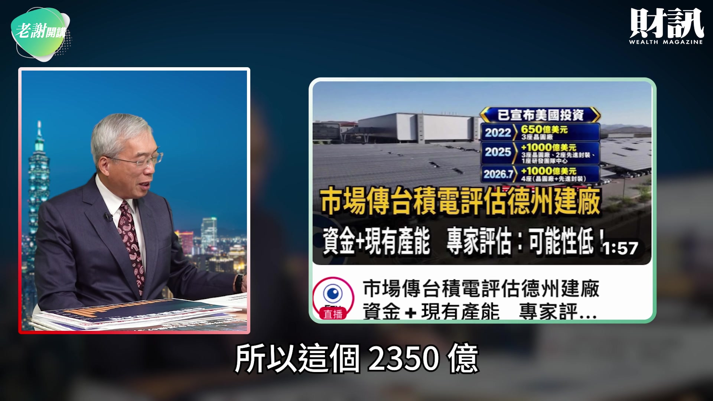

**逐字稿片段：** 大致上是在評估可能到德州 現在德州很多的產業園區 由台灣正在規畫當中 所以我們也看到 現在包括緯創它們都在德州 啟動德州園區的計畫 如果德州要設廠 除了 6 座 先進晶圓廠之外 美國的第二個園區 很可能會跟周邊的 包括封裝測試 甚至跟光通訊有密切的關聯 那麼大家也可以想像得到 如果台積電要到德州去設廠 我想以現在 台積電的實力來講 大家回頭看一下 在過去台積電 要到美國去投資的時候 很多人都反對 認為 台積電會掏空台灣 甚至認為有人把 台積電的名字 改為美積電 但是如果大家仔細看 從 2024 年之後

**話題推測：** 台積電德州設廠評估

---

## 00:02:26

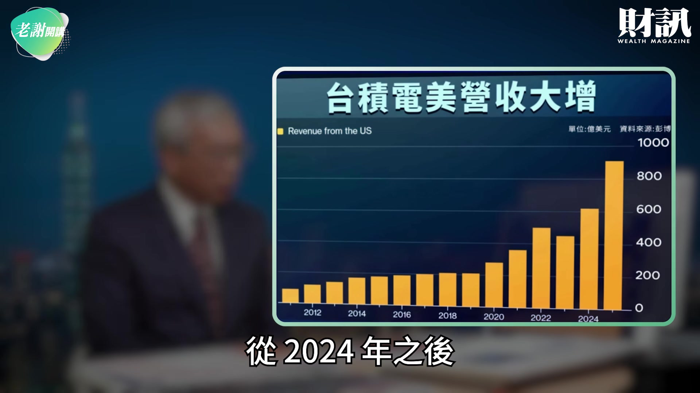

**逐字稿片段：** 台積電在美國的營收 跟它的獲利 不斷的水漲船高 這個水漲船高其實 也展現了台積電 它的業績 放大成長的情況之下 台積電加碼到美國去投資 其實是一條寬闊大道

**話題推測：** 台積電在美國的營收與獲利成長趨勢

---

## 00:02:41

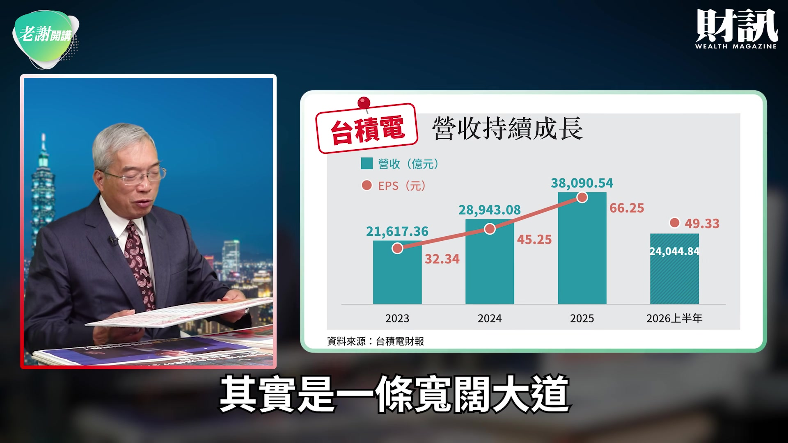

**逐字稿片段：** 你可以看到黃仁勳 他特別提到 他說台灣告別代工島 他說台灣老早就不便宜了 他不斷的向 美國的各界在喊話 黃仁勳也跟白宮在喊話 他說 高通 蘋果 這些公司如果沒有台灣 怎麼會有今天 那麼今天的美國半導體產業 老早就被日本壟斷了 是台灣拯救美國半導體 不是反過來說 台灣搶走了美國的 半導體的技術 所以他說台灣 自願到美國設廠 這是台灣的智慧 絕非受到脅迫而來 所以我們現在看到 如果到德州設廠 台積電的 5 千億美元的 繼續再投資計畫 2650 億已經是投下去了 那麼如果要再繼續加碼 我相信台積電 一定有這個能力跟空間 這個時候也告訴大家 在這些年當中其實 我們看到幾個面向 第一個最近日本 日本經濟新聞 有一篇專題報導

**話題推測：** 黃仁勳談台灣告別代工島

---

## 00:03:37

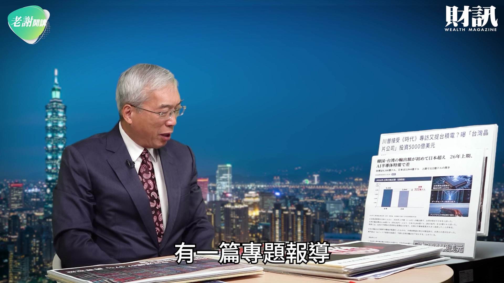

**逐字稿片段：** 它說台灣的出口 在上半年是 4166 億美元 那麼日本 3844 億美元 今年上半年台灣的出口 比日本還多出 322 億美元 如果大家對比 今年台灣的出口 很可能到 9 千億美元 日本很可能 7 千多億美元 雙方可能會差距 超過 1 千億美元以上 這個時候大家可以想像的到 日本經濟新聞在講說 要學台灣 這個台灣其實最大的關鍵 是學台積電 所以我們大家可以看到 台積電被號稱是 AI 淘金熱的終極的贏家 我們大家可以看到 上半年台灣的

**話題推測：** 台灣與日本上半年出口額比較

---

## 00:04:16

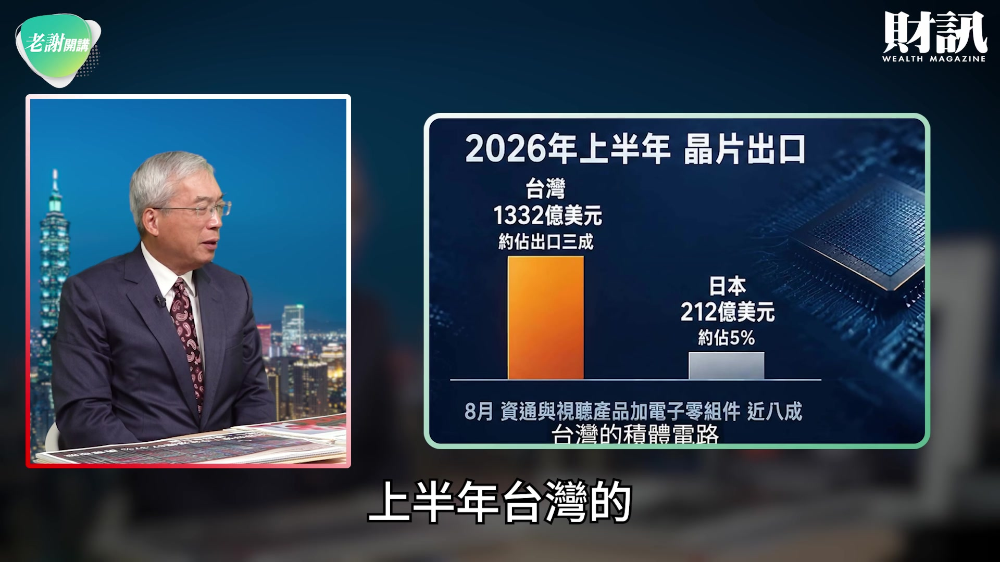

**逐字稿片段：** 半導體的晶片出口 是 1332 億美元占出口的 3 成 占出口的 3 成 日本只有 212 億美元 大概占日本的出口 5% 另外一個角度在 先進晶片當中

**話題推測：** 台灣與日本半導體晶片出口額與佔比

---

## 00:04:29

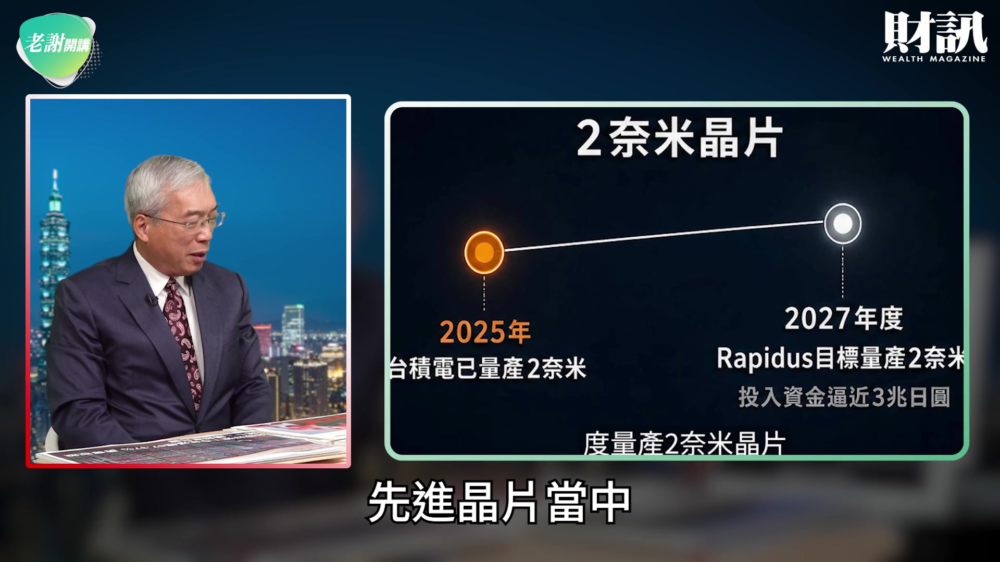

**逐字稿片段：** 在 2025 年 台積電已經量產 2 奈米 但是日本到 2027 年 Rapidus 大概才可以 生產 2 奈米 所以日本用舉國之力 來支持 Rapidus 在日本的生產 但是技術還跟台灣有點落差 那麼大家可以看到 現在台積電的 現在的熊本廠 進入獲利的狀態 所以

**話題推測：** 台積電與日本Rapidus在2奈米技術量產時程對比

---

## 00:04:50

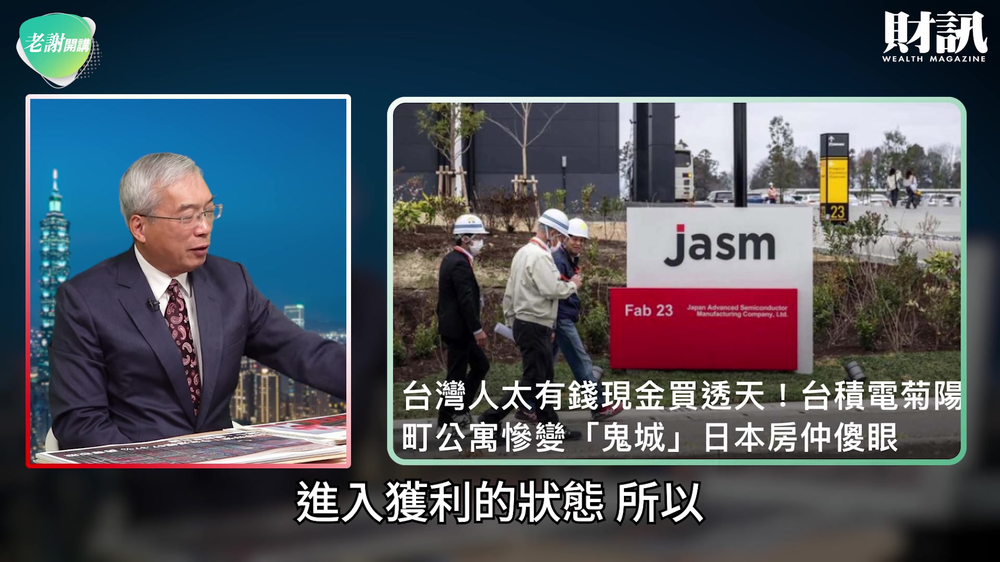

**逐字稿片段：** 台灣的人均所得 今年會落在 42103 美元 日本會在 35703 美元 所以雙方 差了 5 千美元的差距 南韓今年可能到 39309 美元 所以如果用這個對比的話 那麼大家也可以看到 在過去一段時間 台灣經常在 日韓台當中台灣排名第三 但是現在 如果以今年台灣的經濟成長率 台灣很可能 不是只有 42000 美元左右 是到 45000 美元起跳 所以這個時候 大家可以想像得到 熊本的建廠從

**話題推測：** 台灣、日本、南韓人均所得對比

---

## 00:05:24

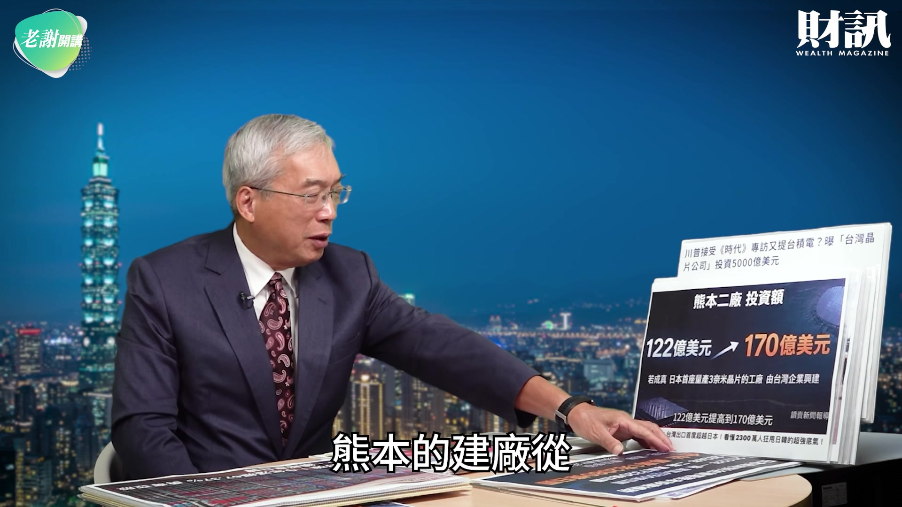

**逐字稿片段：** 122 億現在增加到 170 億 日本政府補貼的 一廠跟二廠的金額 從 4760 億日圓到 7320 億日圓 現在補貼台積電已經 1 兆 2080 億日圓 這包括 Sony 包括日本的電裝 同時包括豐田 共同來參股 所以 日本的媒體 日本經濟新聞在講 它說日本 提供很多關鍵設備 它們賣給了台積電 台積電把日本提供的設備 那麼把它轉換成黃金 這是台灣整個大起 非常重要的關鍵 所以我們看到 台灣的人均所得 不斷的往上發展 最近大家都在談論一個報告 就是 德國的安聯集團 那麼 公布全球財富報告當中

**話題推測：** 台積電熊本廠建廠金額與日本政府補貼變化

---

## 00:06:09

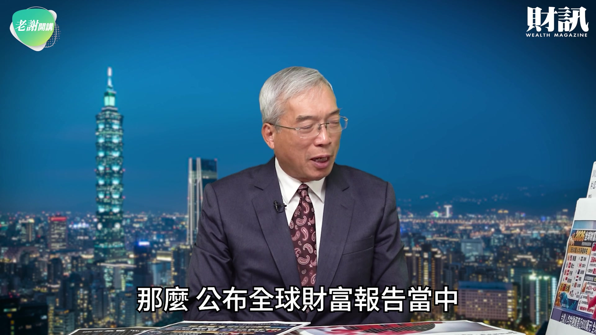

**逐字稿片段：** 台灣的人均金融資產 如果用這張表 大家可以看到台灣已經排名 全世界第五大了 也就從美國到瑞士 到丹麥到新加坡 台灣的人均金融資產 164470 歐元 這個也是大幅領先日本的 89420 歐元 所以 台灣的格局在這個地方 台灣現在的人均所得 超過日本 超過南韓 而且差距正在拉大 台灣的人均金融資產 現在遙遙領先日本 你知道南韓現在排名 20 名 所以我相信台灣的富足 在全世界 台灣現在的經濟力處在一個 歷史上空前地位 那麼今年到 9 月底為止

**話題推測：** 德國安聯集團全球財富報告：台灣人均金融資產排名與數字

---

## 00:06:51

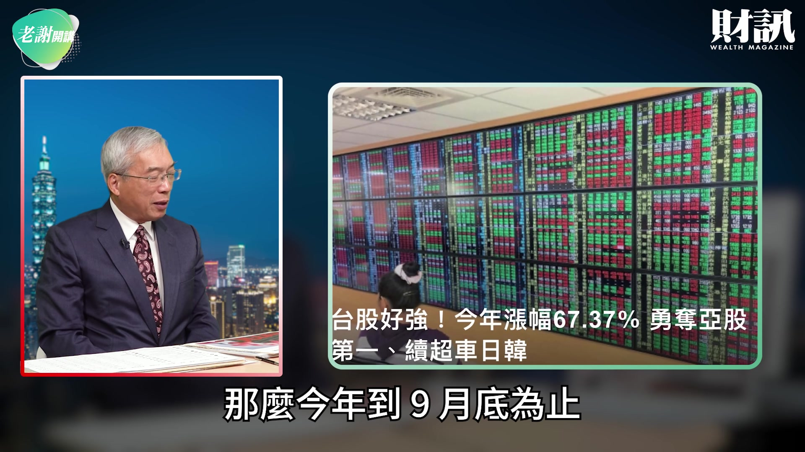

**逐字稿片段：** 台股上漲 67.37% 在亞股當中我們超越了南韓 現在成為在 亞洲當中漲幅最大的市場 台積電現在的今年的獲利 我們節目播出之後 大致上台積電要召開 第三季的法說會 我估計

**話題推測：** 台股今年至9月底漲幅

---

## 00:07:07

**逐字稿片段：** 台積電 8 月到 5148 億 那麼它在第三季 很可能稅後淨利超過 9 千億 如果到 9 千億的話 台積電今年的 全年的稅後淨利 一定會在 3 兆以上 如果台積電賺 超過 3 兆或 3.3 兆 那麼大家可以回頭想 亞馬遜在 2025 年的全年 稅後淨利是 775.6 億美元 蘋果賺了 1112 億美元 微軟賺了 1012.8 億美元 最大的是 Google 賺 1328 億美元 台積電跟這一些 美國的數據大廠 包括 AI 的公司 差距已經非常有限了 所以如果我們從 它的市值排名來看

**話題推測：** 台積電8月營收、第三季及全年稅後淨利預估

---

## 00:07:52

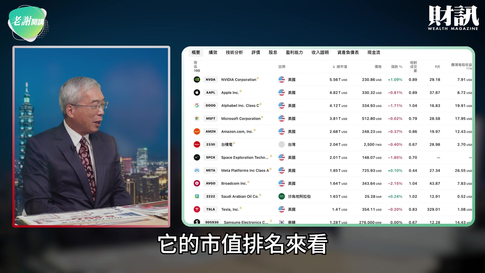

**逐字稿片段：** 台積電現在在市值排行榜 在輝達之外 蘋果到 Google 到微軟 然後到 Amazon 台積電排名世界第六大 第六大我們也看到 在全世界資本支出當中 台積電其實名列前茅 我們今年有到 640 億 明年可能 1200 億起跳 那麼科技大廠當中 我們看到最近的蘇姿丰特別 再度來到台灣 其實 她對台灣的 採購依存度愈來愈高了 我們也看到 現在在資本支出 大增的情況之下 台灣很多企業 躍升到國際的舞台上面 所以這是台灣的影響力 我們要非常珍惜 你看到 晶圓代工

**話題推測：** 台積電全球市值排名與其他科技巨頭

---

## 00:08:30

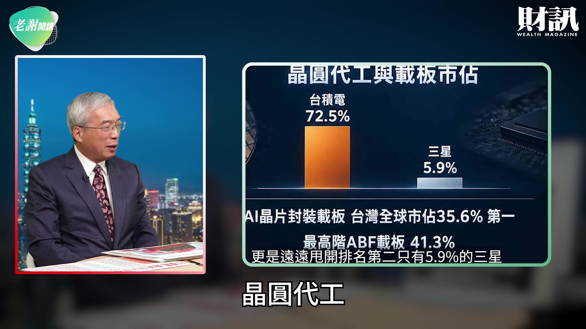

**逐字稿片段：** 跟載板的市占率 台積電有 72.5% 遙遙領先 三星的 5.9% 從 AI 晶片到封裝載板

**話題推測：** 晶圓代工市占率：台積電與三星對比

---

## 00:08:39

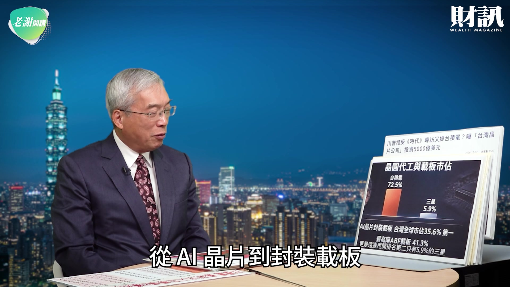

**逐字稿片段：** 全球台灣市占率 35.6% ABF 載板 41.3% 這個都是 非常重要的台灣的代表作 我們也看到 除了川普的 5 千億投資之外 這個時候你知道彭博出來的 專欄作家高燦鳴先生 他特別揭露這個消息

**話題推測：** 台灣在全球AI晶片與ABF載板市占率

---

## 00:08:57

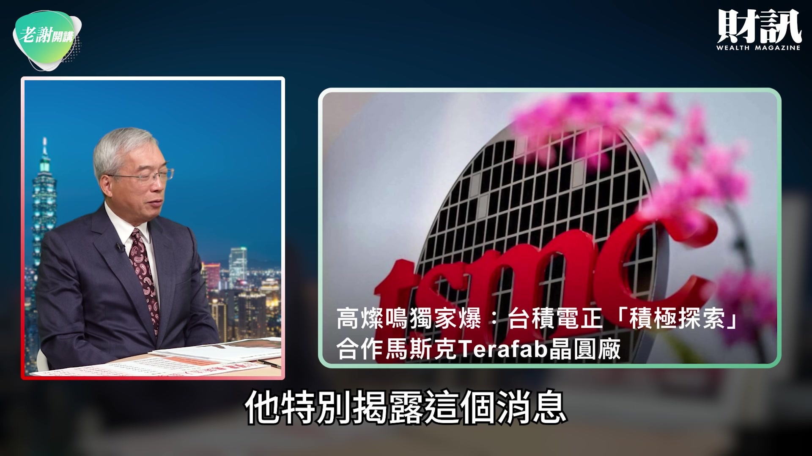

**逐字稿片段：** 他說台積電正在積極探索 跟馬斯克來合作 Terafab 這個雙方的合作 基本上得到馬斯克正面回應 那麼這個時候 大家可以想一想 大家在先前看到 馬斯克曾經公開講 他蓋的晶圓廠將來可以 在無塵室裡面抽菸 這個吃漢堡 但是現在看起來 他只是天馬行空的想像 這個實際上的困難 比他想的還來得要巨大 所以這個就告訴大家 那麼在未來的 這個馬斯克的建廠 台積電怎麼樣用最高智慧 來跟馬斯克合作 那麼大家很擔心 如果台積電跟馬斯克合作 台積電的員工到底會不會被 馬斯克挖走 它的技術會不會外流 那這是未來魏哲家 在考量當中一個非常 重要核心的焦點 那麼台積電在 過去的合作當中 我們也看到它也跟 HBM 的海力士 有共同合作的經驗 那麼現在大家回頭想 這麼多年當中 其實很多人要講 他說台灣只有 台積電一個人的武林 我常講一家台積電 它養大的整個生態系 這個生態系 台積電把它現在的供應鏈 在台灣在地化之後 它創造更大的活力 我相信這是台灣整個 在發展做大 非常重要的關鍵 台積電現在成為 全球第六大的公司 台股站上 5 萬點之後 繼續要往上走 台積電一定會扮演 非常重要的角色 我們可以想像的到 在最近當中 聯發科的股價漲到 5480 元 如果大家仔細看

**話題推測：** 台積電與馬斯克合作Terafab的可能性

---

## 00:10:28

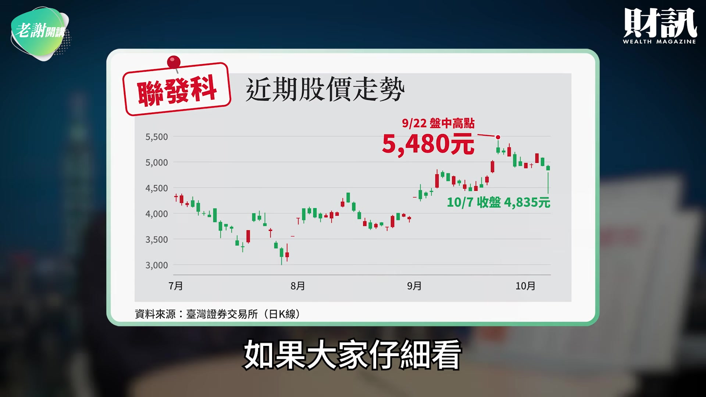

**逐字稿片段：** 聯發科的上半年的 EPS 是 30.44 元 但是台積電上半年的 EPS 是 49.33 元 台積電的 EPS 遠遠超過聯發科 那麼如果以聯發科 今年的成長 它頂多可能 EPS 80 元 但是台積電很可能 EPS 110 元起跳 在這種情況之下 如果台積電今年 EPS 110 元 明年挑戰 EPS 150 元的時候

**話題推測：** 聯發科與台積電上半年EPS對比

---

## 00:10:50

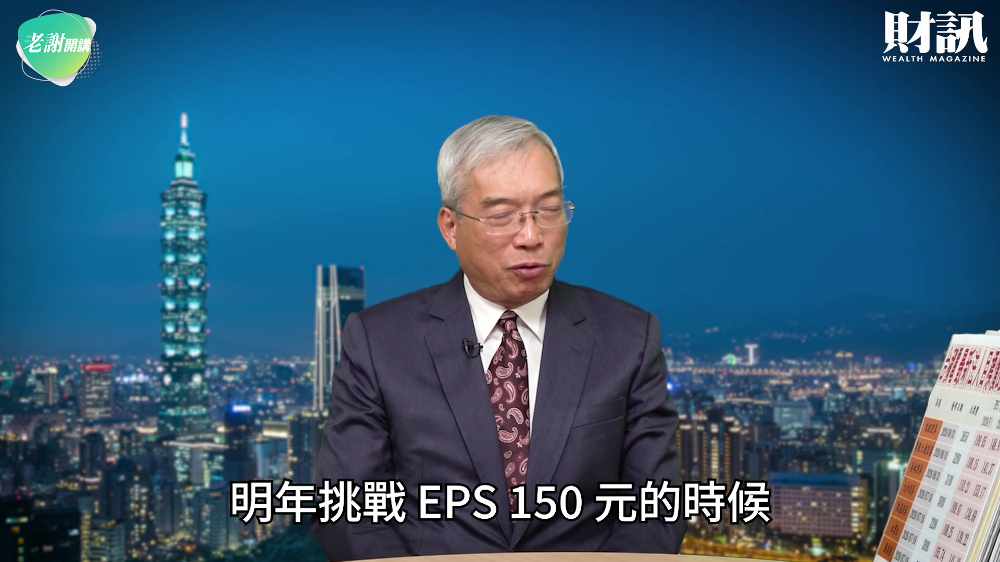

**逐字稿片段：** 那麼外資報告 現在沒有一家 （目標價）低於 3 千元以下 所以就告訴大家 像瑞銀是 3650 元 摩根大通 3200 元 那麼美林證券 3100 元 大和證券 3000 元 凱基證券 3200 元 永豐金 3090 元 國泰證券 3200 元 大致上所有外資報告 看台積電都落在 3 千元以上 這個時候我想對台灣來講 這是一個非常好的開始 我相信台積電領軍當家 我相信台股會屹立不墜 這是今天《老謝開講》 跟大家分享 感謝大家的觀賞 下週見

**話題推測：** 外資券商對台積電目標價列表

---
