# wealth1974_GIVExayTQwM — 關鍵畫面索引

- 來源逐字稿：[wealth1974_GIVExayTQwM_GT.srt](wealth1974_GIVExayTQwM_GT.srt)
- 影片：https://www.youtube.com/watch?v=GIVExayTQwM
- 截圖數：24

## 00:00:00

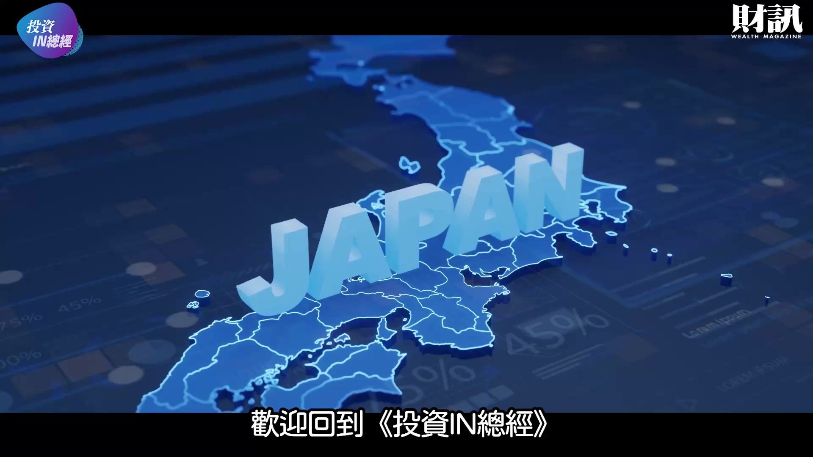

**逐字稿片段：** 歡迎回到《投資IN總經》 股神巴菲特在 6 年前 開始買進日本五大商社 當時他看到的是日本商社很便宜 獲利穩定以及股利很高 但是 6 年之後 巴菲特已經將公司交棒給阿貝爾 波克夏和日本商社的關係 可能正在發生一個更大的變化 今天這集我們就來聊聊

**話題推測：** 節目開場，可能顯示節目名稱或片頭。

---

## 00:00:21

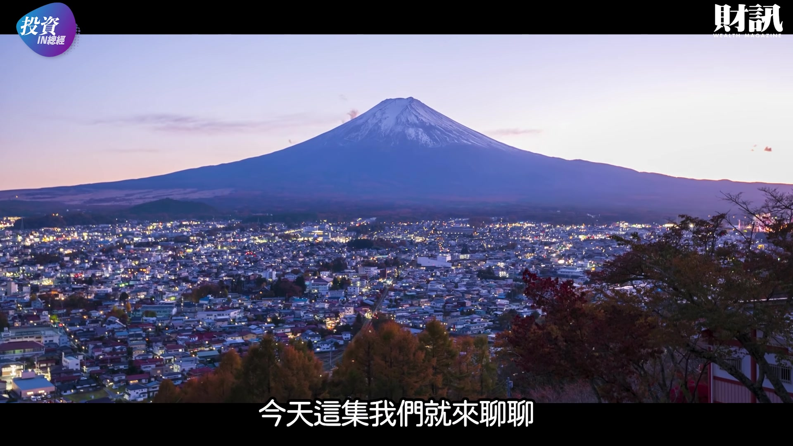

**逐字稿片段：** 日本五大商社再進化 波克夏要的不只是結盟

**話題推測：** 影片主標題或新段落標題：日本五大商社再進化。

---

## 00:00:33

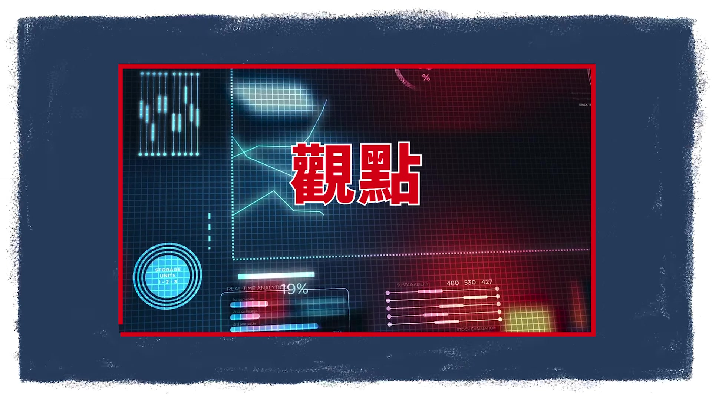

**逐字稿片段：** 波克夏海瑟威從 2019 年開始 陸續買進日本五大商社 一開始對每家持股保持在 5% 左右 現在持股比率都超過了 10%

**話題推測：** 開始說明波克夏投資日本商社的具體數字和時間點，可能顯示投資比例或時間軸。

---

## 00:00:44

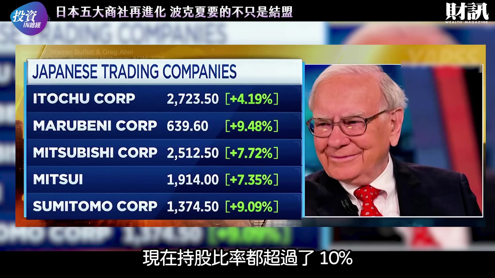

**逐字稿片段：** 除了五大商社 波克夏今年 3 月 還投資大約 18 億美元 取得東京海上控股公司 2.49% 的股權

**話題推測：** 提及波克夏對東京海上控股公司的新投資，可能顯示該公司名稱或標誌。

---

## 00:00:52

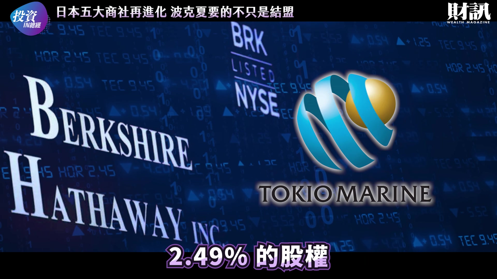

**逐字稿片段：** 波克夏在這些公司的總投資額 達到約 440 億美元 日本顯然已經成為波克夏 僅次於美國的第二大投資國

**話題推測：** 總結波克夏在這些公司的總投資額，可能以大數字呈現。

---

## 00:01:02

**逐字稿片段：** 為什麼波克夏或者是說是巴菲特 對日本商社情有獨鍾呢 理由除了股價與估值相對便宜 而且它們的事業多元 現金流穩定 最重要的是 五大商社不只是貿易社 它們也是遍布全球的投資型企業 也就是說 巴菲特買的其實不只是五家公司的股票 而是看上它們的全球產業網絡 以及長期產生現金流的能力 但是巴菲特目前已經將公司 交棒給葛瑞格阿貝爾管理 波克夏與五大商社的關係 會有什麼變化嗎

**話題推測：** 轉換話題到波克夏情有獨鍾日本商社的理由，可能顯示重點列表或圖解。

---

## 00:01:37

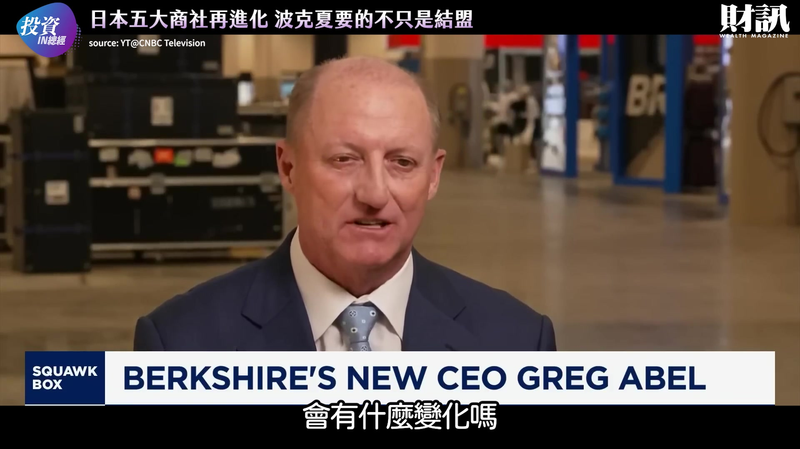

**逐字稿片段：** 在今年 1 月剛出任 波克夏新執行長的阿貝爾 在 9 月第一次造訪日本 第一站到了福島縣磐城市 視察旗下工具大廠泰珂洛 之後便與各大商社 以及東京海上控股的高層會面 在接受日本經濟新聞專訪的時候 他說 這一次並沒有和商社討論 具體增加持股的事 不過會持續關注情況 有需要的時候就會加碼 他也對 CNBC 說 這確實是一項長期的投資 我們打算在未來數十年 持續持有日本商社的股份

**話題推測：** 切換到阿貝爾接棒後對商社關係的影響，可能搭配阿貝爾的照片或訪日路線圖。

---

## 00:02:13

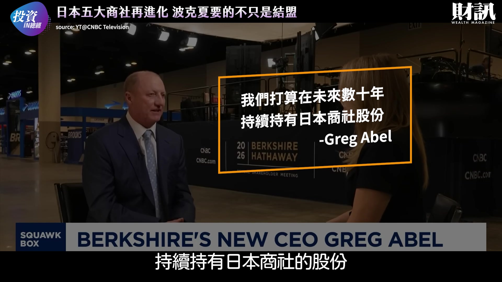

**逐字稿片段：** 阿貝爾透露 各家商社正在尋找 適合與波克夏共同收購的企業 並且已經提出具體投資案 日本五大商社 擁有遍布全球的事業與情報網絡 波克夏則是握有雄厚的資金 雙方可能會共同進行事業投資 以及企業併購

**話題推測：** 提及商社與波克夏共同尋找收購企業的新合作模式，可能以合作示意圖呈現。

---

## 00:02:31

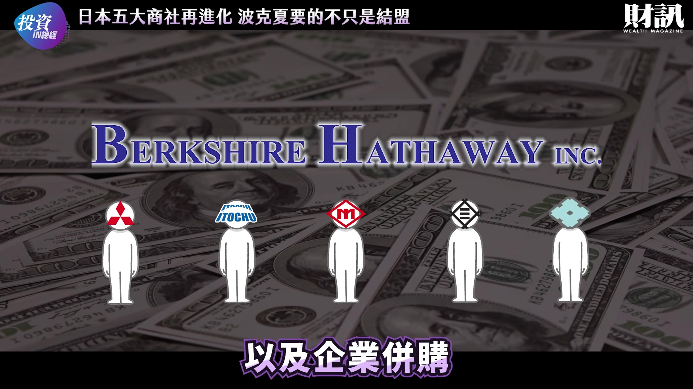

**逐字稿片段：** 像是住友商事這次就與阿貝爾討論 要在美國 Cove Point 液化天然氣事業 合作之後 進一步擴大合作的可能性 三井物產與丸紅也證實 正在與阿貝爾討論未來的合作 由此可知 波克夏與日本商社的關係 正在愈綁愈深 巴菲特時代開始的日本商社投資 到了阿貝爾時代正在進入下一個階段 可以說阿貝爾這一次訪日 真正的重點是 波克夏有沒有辦法開始利用 日本商社的全球網絡 尋找到新的投資與併購機會

**話題推測：** 以住友商事為例說明具體合作項目，可能顯示公司標誌及項目名稱。

---

## 00:03:06

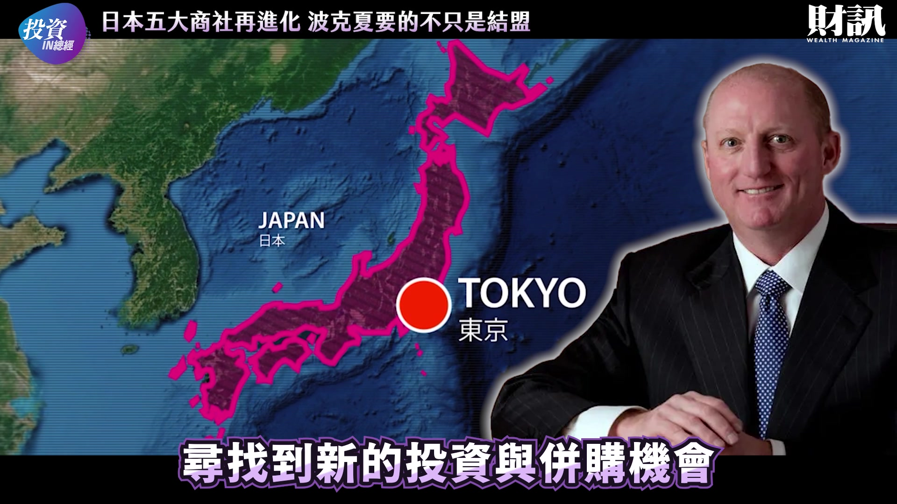

**逐字稿片段：** 而接下來五大商社的鉅額投資 將會押寶在哪些領域 我們稍後再一起來看

**話題推測：** 轉向討論五大商社接下來的鉅額投資方向，可能作為新章節的開頭。

---

## 00:03:13

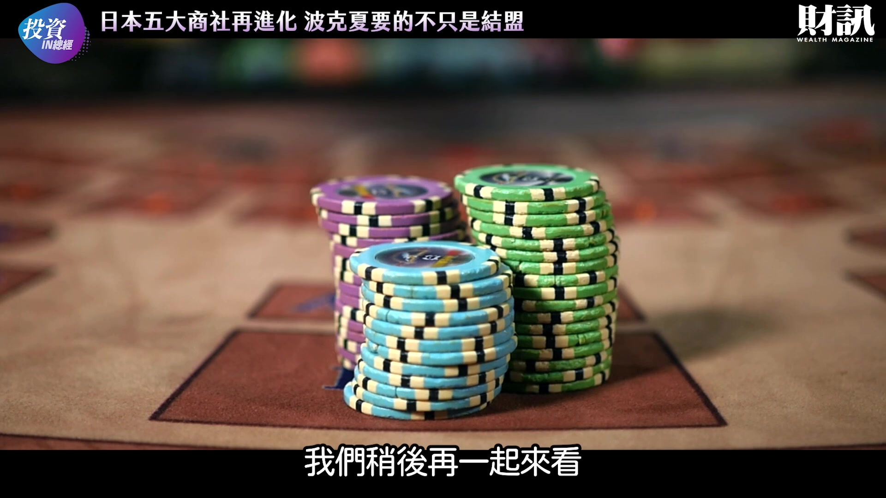

**逐字稿片段：** 先來看看今年以來 日本五大商社的股價漲幅 雖然表現不如日經股價指數 但和 2020 年 8 月 31 日來比較 五大商社平均漲幅達到 467% 遠遠超過日股大盤的 181% 長期投資魅力不減

**話題推測：** 展示日本五大商社的股價漲幅數據，可能顯示股價走勢圖或比較圖。

---

## 00:03:31

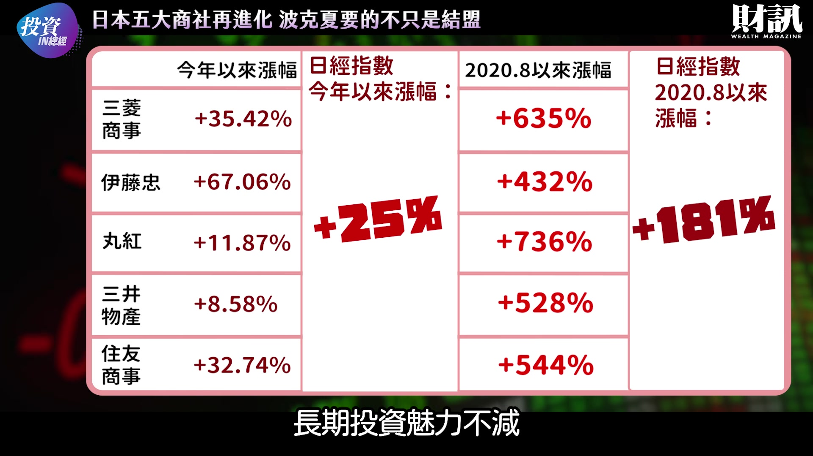

**逐字稿片段：** 而在回饋股東方面 2026 年度第一季 伊藤忠宣布要買回 3000 億日圓的自家股票 丸紅和三井物產也分別設定 買回自家股票的金額上限 為 1000 億和 2000 億日圓 同時五家公司都維持或增加股利

**話題推測：** 介紹五大商社回饋股東的措施，例如庫藏股和股利政策，可能顯示各公司回購金額表格。

---

## 00:03:49

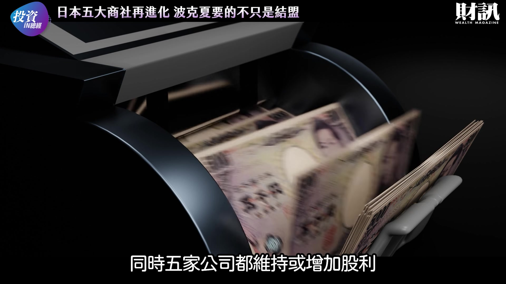

**逐字稿片段：** 那麼五大商社接下來都將投資眼光 瞄準哪些事業體呢

**話題推測：** 開始分析各家商社的具體投資領域，可能作為介紹各公司的分段標題。

---

## 00:03:54

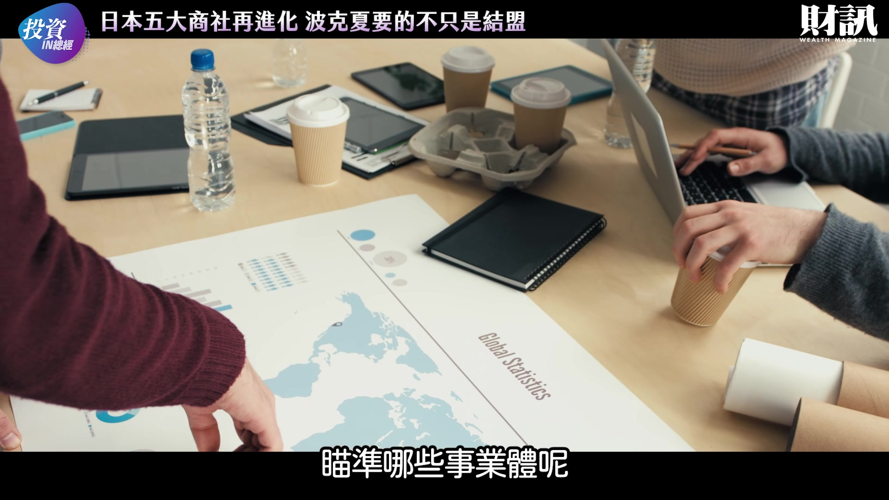

**逐字稿片段：** 五大商社中 營業額最高的三菱商事 在到 2027 年度結束為止的 3 年內 將要進行 1 兆日圓的更新投資 和 3 兆日圓的擴張新投資 今年最具代表性的是 7 月完成收購 美國天然氣開發商 Aethon 能源 取得德州和路易斯安那州的頁岩氣資產 股權金額約 52 億美元 另外承擔約 23.3 億美元 這也是該公司史上最大規模的併購案 三菱商事希望藉此強化北美天然氣供應 和能源市場的地位 同時未來能把上游的天然氣 加上既有的液化天然氣 電力 資料中心和化學品事業 全部串成一條價值鏈

**話題推測：** 聚焦三菱商事的投資計畫，可能顯示公司標誌與投資金額。

---

## 00:04:38

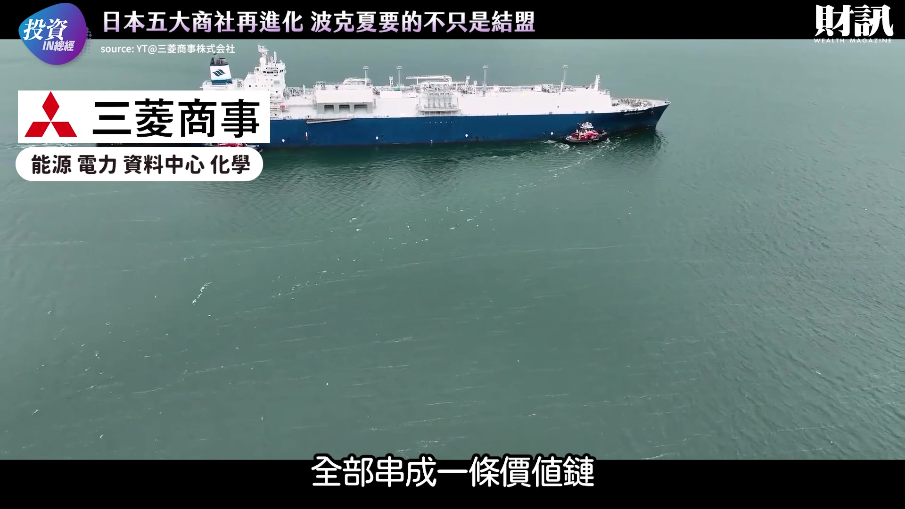

**逐字稿片段：** 而伊藤忠則是在 2025 年度 因為旗下事業公司的獲利 持續擴大之外 加上過去累積的投資成果也逐步顯現 使得集團淨利達到 9003 億日圓 創下歷史新高 2026 年度將把投資額度 由前一年的 1 兆日圓 再調高到 1.5 兆日圓 日本經濟新聞分析 原本伊藤忠強調利在下游 因此過去投資偏重消費 食品 零售等等非資源領域 主要集中在 提高已有業務往來公司的持股比率上 但是今年投資範圍還擴大到電力 基礎建設 與資源事業等等 產業鏈的中上游

**話題推測：** 切換到伊藤忠商事的投資計畫，可能顯示公司標誌與投資額度。

---

## 00:05:19

**逐字稿片段：** 再來看到三井物產 在到 2025 年度為止的 3 年計畫中 投資了 2.4 兆日圓 是原先規畫的兩倍 雖然還沒有明確透露接下來的投資額 但社長堀健一說 公司目前正在研究的投資案件 金額超過 6 兆日圓 三井物產仍然很重視金屬資源與能源 並認為這些大型投資 在 2030 年後會陸續進入收成期 同時也要擴大 像是汽車 化學與醫療等等 非資源事業

**話題推測：** 切換到三井物產的投資計畫，可能顯示公司標誌與投資項目。

---

## 00:05:50

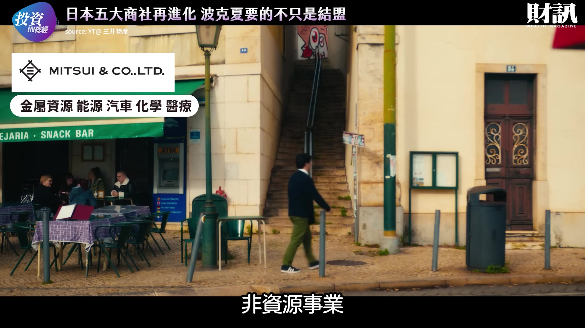

**逐字稿片段：** 因此 2025 年投資大約 8000 億日圓 取得澳洲 Rhodes Ridge 鐵礦石礦山 4 成權益 創下該公司史上最高單筆投資紀錄

**話題推測：** 提及三井物產對澳洲Rhodes Ridge鐵礦石礦山的投資，可能顯示礦山地理位置或投資細節。

---

## 00:06:01

**逐字稿片段：** 另外今年 7 月還和 Penske 公司 聯合提出讓美國大型汽車經銷商 Penske Automotive 集團私有化的提案 顯示汽車相關事業 也是三井物產的擴張方向之一

**話題推測：** 提及三井物產與Penske公司的合作，可能顯示Penske公司標誌或汽車相關圖像。

---

## 00:06:14

**逐字稿片段：** 丸紅則是預定 在 2027 年度為止的 3 年內 進行包括 1.1 兆日圓新投資 和 6000 億日圓的設備投資 總投資額達到 1.7 兆日圓 它不是只追求投資量 而是一邊出售成長性較低的事業 一邊把資金 重新配置到戰略平台型事業 像是資源 基礎建設 金融 以及長期培育的新事業

**話題推測：** 切換到丸紅的投資計畫，可能顯示公司標誌與戰略性投資領域。

---

## 00:06:40

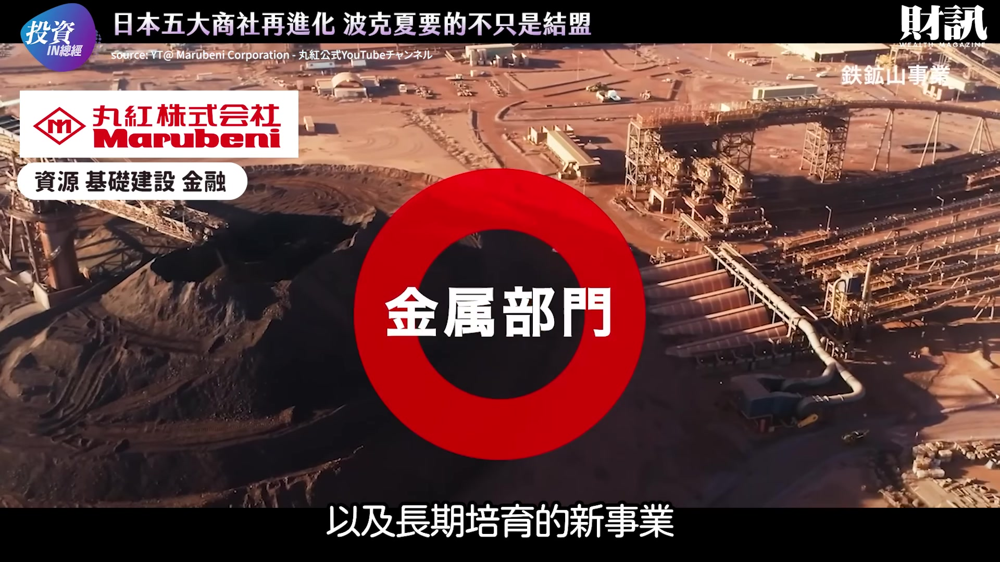

**逐字稿片段：** 最後看到住友商事的中期計畫 是 2026 年度為止的 3 年內 要投資 1.8 兆日圓 集中在農業 建設系統 租賃 能源解決方案 鋼鐵 數位 醫療 不動產等八大成長領域

**話題推測：** 切換到住友商事的投資計畫，可能顯示公司標誌與八大成長領域列表。

---

## 00:06:55

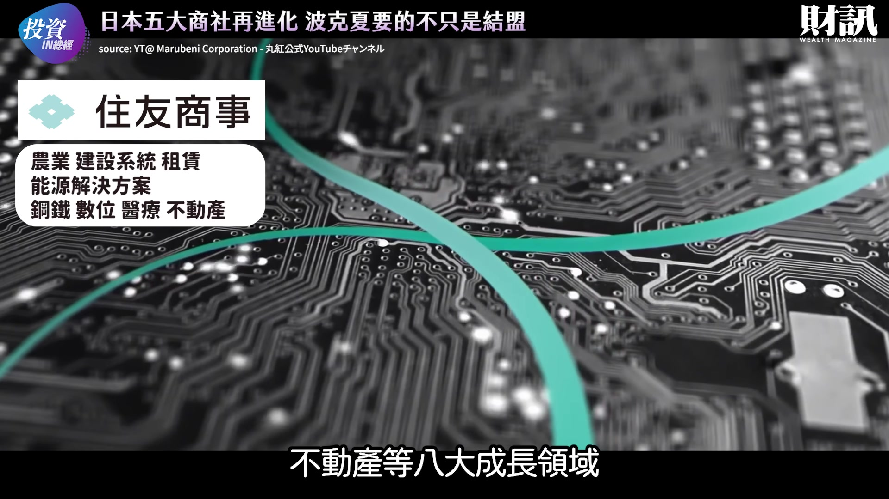

**逐字稿片段：** 住友往 AI 和數位轉型的動作很明確 最具象徵性的就是 今年把 IT 解決方案提供商 SCSK 公司完全納入旗下 總收購金額約 8820 億日圓 是該公司史上最大單筆投資 住友希望結合 SCSK 和自己分布在 64 國 約 900 家事業公司的資料與產業知識 發展 AI 和數位服務

**話題推測：** 強調住友商事在AI和數位轉型方面的動作，可能顯示相關概念圖或案例。

---

## 00:07:22

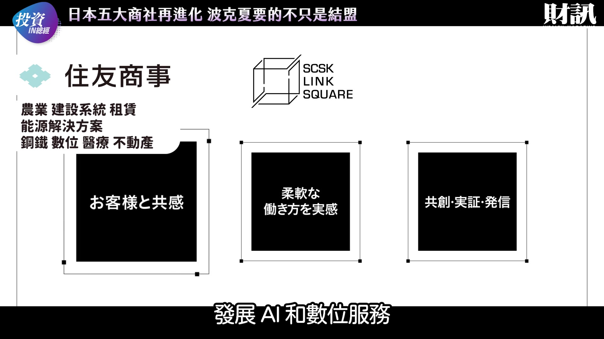

**逐字稿片段：** 綜觀目前各家公司提出的成長策略中 都以加碼自身優勢領域的「橫向延伸」 最為常見 尤其站在 AI 和數位轉型的交叉點 在獲利成長抵達飽和點之前 五大商社是否能夠找出 具有未來性的下一個事業 將是決定日本商界未來前景的關鍵

**話題推測：** 總結各家公司的成長策略，可能顯示總結性圖表或重點概覽。

---

## 00:07:42

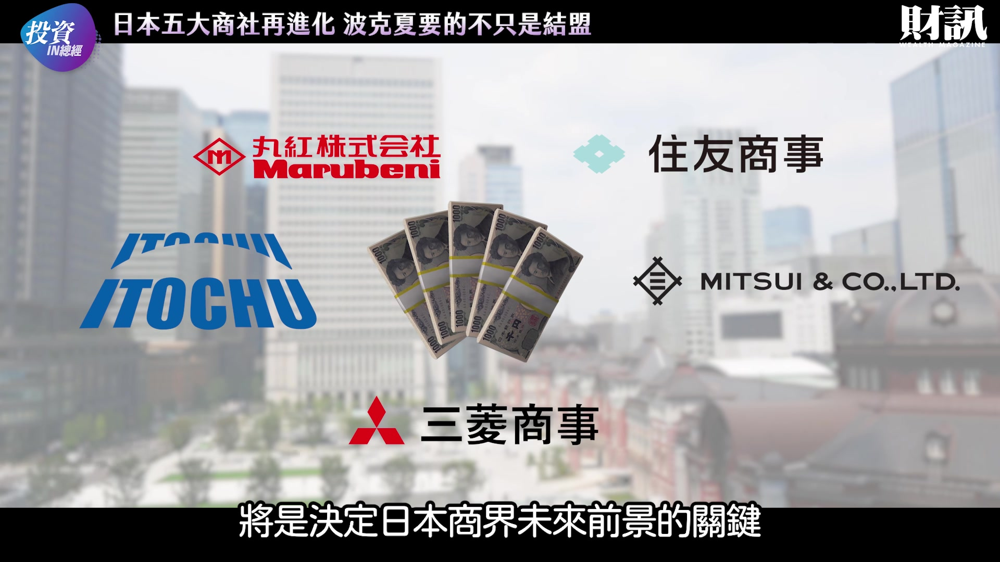

**逐字稿片段：** 可以說當年巴菲特雖然看上的是 五大商社物美價廉 但現在這些商社本身 都正在進入巨額投資期 動用兆日圓級資金 尋找下一個成長引擎 波克夏若能順利深化 與五大商社的合作 強強聯手 必會是股東之福

**話題推測：** 節目結尾總結與呼應開頭，可能再次顯示巴菲特或商社的圖像。

---

## 00:08:02

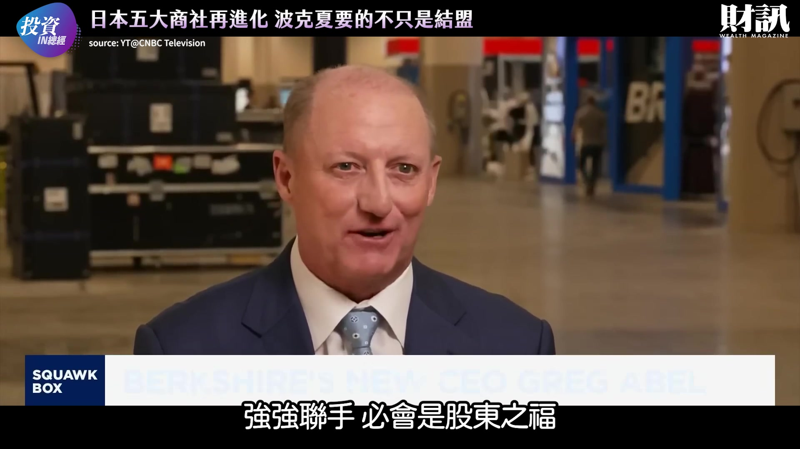

**逐字稿片段：** 財團粉絲們 您認為波克夏 能從深化與五大商社的合作中 獲得更多利潤嗎 A 可以 波克夏的資金加上商社的全球資源 成功率會更高 B 不行 日本企業的全球擴張效率很低 C 我有其他答案寫在評論區裡 留言告訴我們吧 今天的《投資IN總經》到這邊告一段落 喜歡這個節目的觀眾 記得幫我們按讚與分享喔 我們下次見

**話題推測：** 影片互動環節，提出問題讓觀眾參與，可能顯示投票選項或留言區提示。

---
