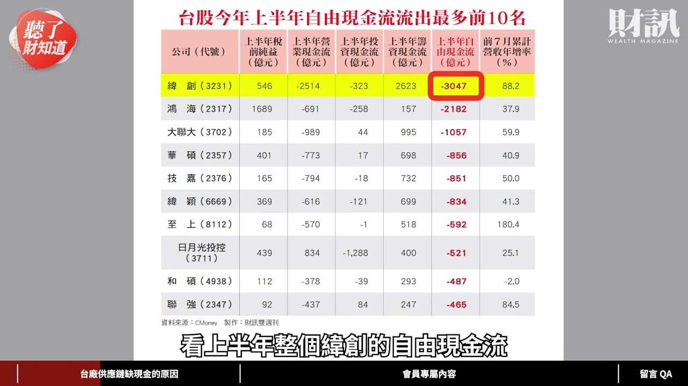
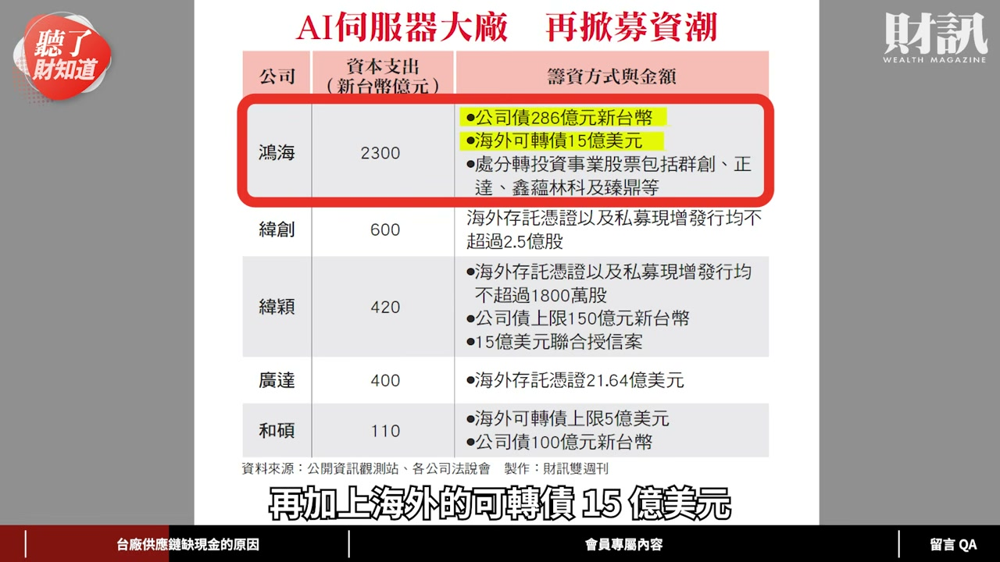
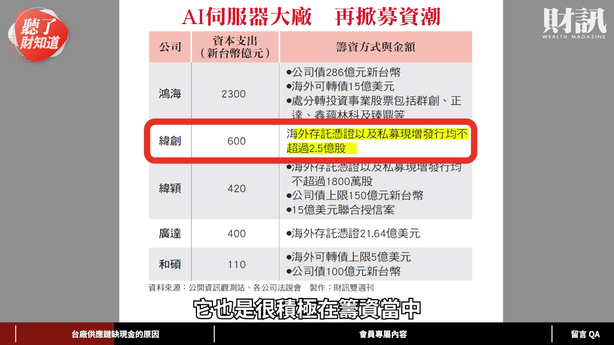
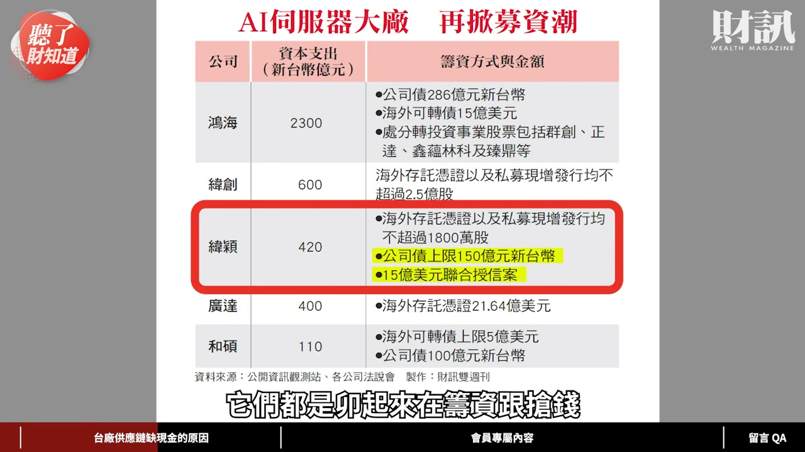
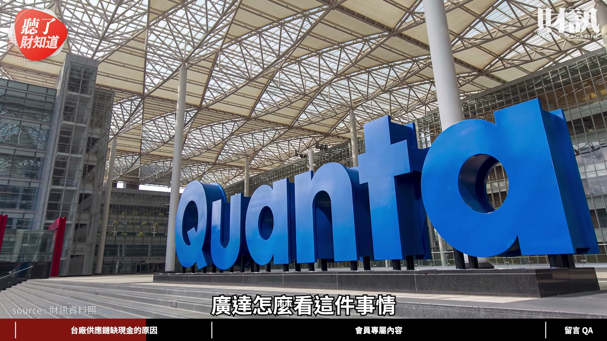

# wealth1974_JOLqghWExO8 — 關鍵畫面索引

- 來源逐字稿：[wealth1974_JOLqghWExO8_GT.srt](wealth1974_JOLqghWExO8_GT.srt)
- 影片：https://www.youtube.com/watch?v=JOLqghWExO8
- 截圖數：16

## 00:00:11

**逐字稿片段：** 今天這一集 我們會先來聊一聊 台廠供應鏈 短缺現金的情況 這樣會影響股利的發放嗎 再來檢視一下 台廠的現況與因應對策 最後我們會分享一下 到底現在誰的現金流 會逆勢增加 投資人接下來 應該注意哪三個重點

**話題推測：** 影片內容大綱介紹

---

## 00:00:26

**逐字稿片段：** 大家好 我是今天主持人陳彥淳 今天來賓是 財訊雙週刊的撰述委員楊喻斐 歡迎喻斐 各位觀眾大家好 我是喻斐 AI 從雲端的運算 走向落地的應用 台灣身為全球 AI 的製造中心 供應鏈的業績表現 都非常非常的亮眼 但我覺得現在市場上 掀起了一波資金搶錢大戰 就是說大家都瘋狂的在做資本支出 因為市場太好需要擴廠 我們就盤點了一下 每家公司的自由現金流 發現說我們有些 不一樣的解讀跟理解

**話題推測：** 主持人與來賓介紹

---

## 00:01:01

**逐字稿片段：** 這個部分就要先 請喻斐幫我們分享 第一步先來讓我們的觀眾 理解一下說 什麼叫做自由現金流 它為什麼重要 自由現金流就是 企業賺進了現金 它扣除營運與資本支出之後 可以自由分配給股東 債權人 或者是保留公司的現金 現在比較尷尬的情況 就是我們盤點之後發現 營收愈大 獲利愈高 但是現金流出現 流出更多的情況發生 反而愈緊就對了

**話題推測：** 解釋「自由現金流」的定義與重要性

---

## 00:01:35

**逐字稿片段：** 辜朝明最新書籍 《被追趕的經濟體》 出版囉 本書結合他長期參與 多國經濟政策的經驗 提出對目前各種挑戰的解方 現在熱賣中 可以到財訊官網 博客來 誠品 金石堂購買

**話題推測：** 辜朝明新書《被追趕的經濟體》廣告

---

## 00:01:54

**逐字稿片段：** 這次喻斐幫我們盤點了 台股今年上半年 自由現金流 流出最多的前 10 名 第一名是緯創 第二名是鴻海 再來依序是大聯大 華碩 技嘉 緯穎 這些公司 看得出來是 AI 伺服器相關的 主要的自由現金流 流出的公司 沒錯 我們可以看到前兩名 緯創跟鴻海 它們營收真的是成長很大 今年幾乎都是倍數的增長

**話題推測：** 盤點台股上半年自由現金流流出最多的前10名公司

---

## 00:02:23

**逐字稿片段：** 對 我幫妳補充一下 緯創今年前 7 個月的營收是成長 88% 鴻海也很不錯 它前 7 個月的營收成長也有 37.9% 看樣子就是它們營收成長當下 它們也必須花更多錢 在做營運的周轉 因為它們壓入的成本也變高 我們爬梳了之後發現為什麼 它們要花那麼多錢的原因有兩個 第一個當然就是擴廠 前陣子緯創的美國達拉斯廠才剛啟用 它也邀請了輝達的創辦人黃仁勳 有過去一起參與活動 當時它有說這個廠 接下來有 1 期 2 期 3 期 好幾期要繼續擴 初期的投資就花了 7 億美元 而且還剛開始 所以前期的買地 建廠 到現在整個製造的環節 還有一些更重要的東西 就像電力的設施 這些跟過去以往 要增加更多的投入成本 都要花錢 對 都要花錢 所以你看它前面花了這麼多的時間 在購地 買設備 到正式的啟用動土 這麼長的運作 同時要有資金的周轉 我們就可以看到 它們也開始借錢 就是發很多公司債開始募資 除了我們剛剛講擴廠 第二個會花錢的當然就是購料 今年以來 所有的零組件都在漲 當然就是記憶體漲最兇 4 倍 5 倍這樣的漲 接下來我們有看到像 MLCC 什麼 CPU 全部都在漲價 對 最近我們在寫這個 ABF 載板也都在漲價 全部都在漲價 而且 往往它們要爭取客戶先下訂單 它們要先搶料 會先付定金出去 當然你先付定金 購料進來到真正成品出來 中間會有一段時間 可能會放在你的庫存 所以你更需要一些資金做周轉 這個部分我覺得就是讓廠商 當你接到的訂單愈來愈大的時候 它付出要作為採購原料的 這些成本的壓力就會升高 愈來愈大 所以意思就是說生意做愈大 你的資金準備要愈足夠 看上半年整個緯創的自由現金流 上半年是流出 3047 億元台幣 那鴻海是流出 2182 億元 其實金額都滿龐大的 代表它們生意也做很大就是了 剛剛看了緯創跟鴻海 它們在做募資跟籌資的方面 也做了滿多的動作 對 因為像鴻海 尤其是今年會更明顯 因為今年就是 整個伺服器的單價 幾乎是最高的一年 就是過去我們知道 從有生成式 AI 開始之後 產品迭代 單價愈來愈高 所以它們今年的募資動作 真的是非常的積極 而且金額都是更勝以往

**話題推測：** 緯創與鴻海前7個月營收成長數字

---

## 00:04:40

**逐字稿片段：** 看上半年整個緯創的自由現金流 上半年是流出 3047 億元台幣 那鴻海是流出 2182 億元 其實金額都滿龐大的 代表它們生意也做很大就是了

**話題推測：**「台股今年上半年自由現金流流出最多前10名」表格，紅框標記緯創列（上半年自由現金流 -3047 億元）

---

## 00:05:20

**逐字稿片段：** 所以你看鴻海光是公司債 它就 286 億元新台幣 再加上海外的可轉債 15 億美元 然後它今年也處分了很多轉投資 像群創 正達 還有最近股價還不錯的臻鼎 所以看起來資金的現金流 還是希望可以充裕一點 所以如果有好的機會 跟好的募資管道 它還是會積極的增加 那緯創呢 緯創它現在目前的規畫是海外存託憑證 以及私募現增不超過 2.5 億股 但價格現在還沒有定 它也是很積極在籌資當中

**話題推測：** 鴻海公司債、可轉債等募資金額及處分轉投資的細節

---

## 00:05:26

**逐字稿片段：** 它就 286 億元新台幣 再加上海外的可轉債 15 億美元 然後它今年也處分了很多轉投資

**話題推測：**「AI伺服器大廠 再掀募資潮」表格，紅框標記鴻海列（00:05:20 抓到的畫面卡在鏡頭轉場過渡瞬間、表格尚未出現，此為轉場後表格完整顯示的畫面）

---

## 00:05:59

**逐字稿片段：** 加上它另外一個關係企業緯穎 緯穎的動作也是很大 因為它以整機櫃出貨方式為主 所以它接下來不管像 公司債的上限 150 億元台幣 還有像 15 億美元的聯合授信案 它們都是卯起來在籌資跟搶錢 我看這個自由現金流流出的名單 基本上就是今年以來在台灣大擴廠 可能是也包含了美國大擴廠 所以其實像封裝 最近很熱 日月光看起來也是積極籌資的公司

**話題推測：** 介紹緯穎的籌資情況與金額

---

## 00:06:19

**逐字稿片段：** 還有像 15 億美元的聯合授信案 它們都是卯起來在籌資跟搶錢 我看這個自由現金流流出的名單 基本上就是今年以來在台灣大擴廠 可能是也包含了美國大擴廠 所以其實像封裝 最近很熱 日月光看起來也是積極籌資的公司

**話題推測：** 同一張募資表格中，紅框標記從緯創切換到緯穎（與 00:05:59 為同一版面，去重演算法誤判為重複而漏收）

---

## 00:06:32

**逐字稿片段：** 日月光現在目前 台灣加海外總共有 7 座工廠 正在興建當中 是很驚人的 它們說這是它們前所未見 以前可能 1 年 1 座工廠 現在是 1 年同時間有 7 座工廠 其實是滿挑戰的 這對於財務規畫的挑戰 跟過去是完全不同的 對 而且它們說 因為台灣現在真的是一地難求 所以一旦確定所有的建置規畫 第一個你要搶人了 你的營建的相關人力 所以它們說這個對於它們來講 第一個就是整個規畫 然後資金的調度 都是滿大的一個挑戰

**話題推測：** 說明日月光同時興建7座工廠的驚人現況

---

## 00:07:14

**逐字稿片段：** 所以它們今年前一陣子法說會剛宣布 上修資本支出衝破 100 億美元 對我們投資人來說 一則以喜 一則以憂 就是說你擴大資本支出 代表新產能增加之後 你會帶動營收 代表公司的前景是成長的 但同時自由現金流 一旦呈現負數的時候 它可能會有一些資金風險

**話題推測：** 日月光上修資本支出衝破100億美元的數字

---

## 00:07:35

**逐字稿片段：** 當然這是大公司它們是有原因的 像剛剛妳講的 它其實是為了擴廠 為了買原料 所以在這個中間的平衡點 該怎麼看呢 比如說這次妳有問到廣達 廣達怎麼看這件事情

**話題推測：** 探討廣達對於自由現金流與擴廠的看法

---

## 00:07:47

**逐字稿片段：** 廣達它跟我分享說 這是短期的效果 因為畢竟它們現在營收規模 已經來到了好幾兆 1 年的營收 然後 1 個月營收就是 3000 億-4000 億元這樣子的規模 所以對於它們來講 現在的籌資雖然看起來 哇 700 億元 跟去年比是 double 的 這樣的籌資金額 它們會覺得是合理的範圍 因為以它們的營收對照 那的確現在因為購料 投資 它要先付出 但事實上因為它的訂單一直在進來 它可能下一季就會平衡回來 所以有時候它會提醒 大部分的投資人就是 不要看太短期的一些狀況 不會是一直現金流出 因為現在整個伺服器的金額非常貴 所以你在投入之後 它如果可以立刻創造營收回來的話 基本上這件事情很快會被 cover 掉 如果你看到一家公司的 自由現金流為負數的時候 接下來就要觀察它的營收狀況 是否會跟著成長 這是滿重要的觀察指標

**話題推測：** 廣達說明營收規模與籌資金額，並提及700億元的籌資

---

## 00:08:50

**逐字稿片段：** 除了這個營收可以觀察之外 另外一個投資人 一定會關心的就是說 我的自由現金流 如果減少了或成負數 那會不會影響到我的 配息配股的狀況呢 我覺得這滿關鍵 也是很多投資人會關心的 因為今年真的是大家 資本支出一直上修創新高 而且明年有可能還是維持高檔 很多老闆甚至不排除 明年的資本支出 可能還會再上修 那再加上它們要衝刺業績 就不可能放掉任何的 投資的機會 所以擴廠的動作 一定會一直持續 對於每家公司在營運資金 跟股利政策 因為股利政策就是 真的是要拿現金配出去 你不可能去跟什麼銀行借錢 然後再來配現金 那我問到廣達 廣達是非常的老實說 就是它們的老闆其實不是拿薪水的 它們老闆是領股息的 所以對它們來講 它們股利政策 不會有太大變動 它還是會盡量維持比較 相對高配息的狀況 我們知道有些公司 像以前鴻海它的配息率 一直都大概只有 5 成多 最近幾年是因為 劉揚偉董事長上來之後 他有提高一點點 不過我們看它現在的 整個現金流的狀況 是比較挑戰的 那後續會不會影響 我覺得就是看每家公司的股利政策 到底是怎麼執行 另外還有一家可以特別強調

**話題推測：** 探討自由現金流負數是否會影響公司配息配股

---
