# wealth1974_JkQcyPHusrA — 關鍵畫面索引

- 來源逐字稿：[wealth1974_JkQcyPHusrA_GT.srt](wealth1974_JkQcyPHusrA_GT.srt)
- 影片：https://www.youtube.com/watch?v=JkQcyPHusrA
- 截圖數：50

## 00:00:00

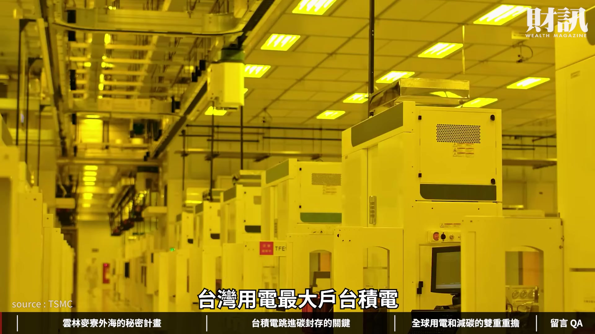

**逐字稿片段：** 台灣用電最大戶台積電 低調布局了 3 年 動員千人 並且結合了相關的業者 和智庫單位 研擬在雲林的麥寮外海 進行一項秘密的計畫 這到底是怎麼回事 今天這一集我們就要來聊聊

**話題推測：** 介紹台灣用電最大戶台積電。

---

## 00:00:14

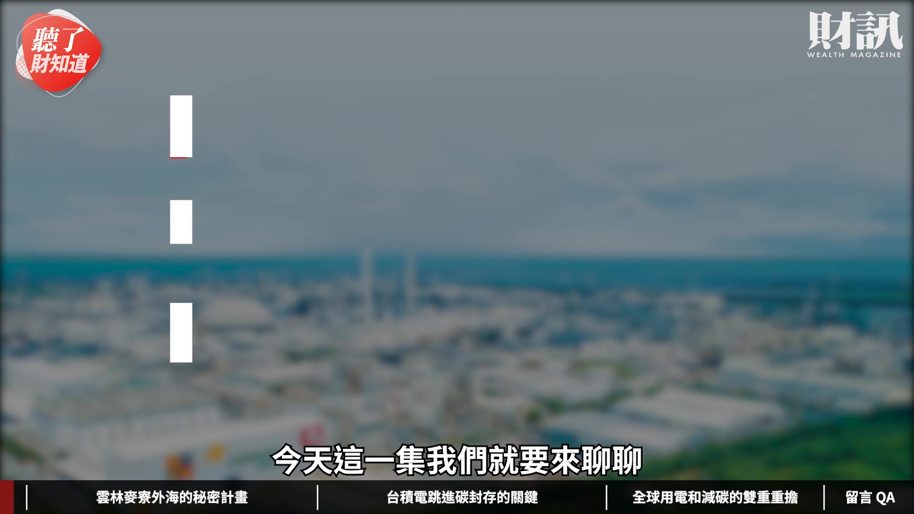

**逐字稿片段：** 麥寮外海的秘密計畫

**話題推測：** 介紹第一個主題：麥寮外海的秘密計畫。

---

## 00:00:16

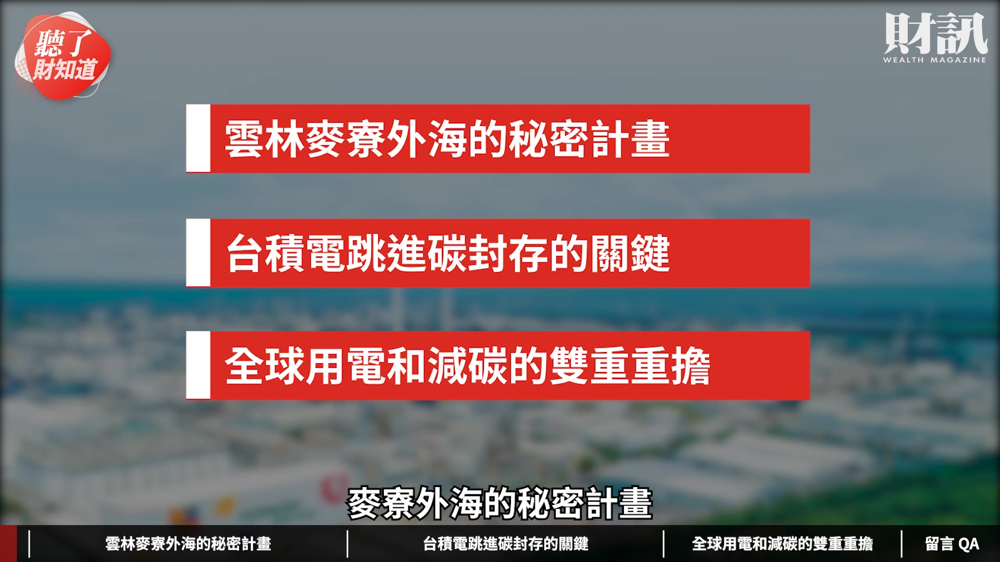

**逐字稿片段：** 再來分享台積電 跳進碳封存的關鍵一步 最後再來談一談

**話題推測：** 介紹第二個主題：台積電跳進碳封存的關鍵一步。

---

## 00:00:20

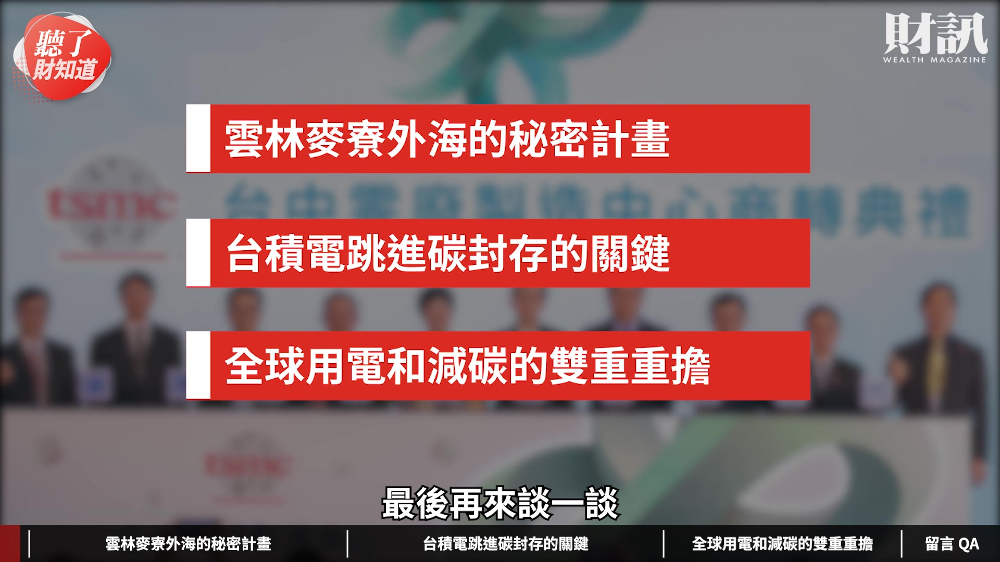

**逐字稿片段：** 全球和台灣用電 以及減碳的雙重重擔

**話題推測：** 介紹第三個主題：全球和台灣用電以及減碳的雙重重擔。

---

## 00:00:24

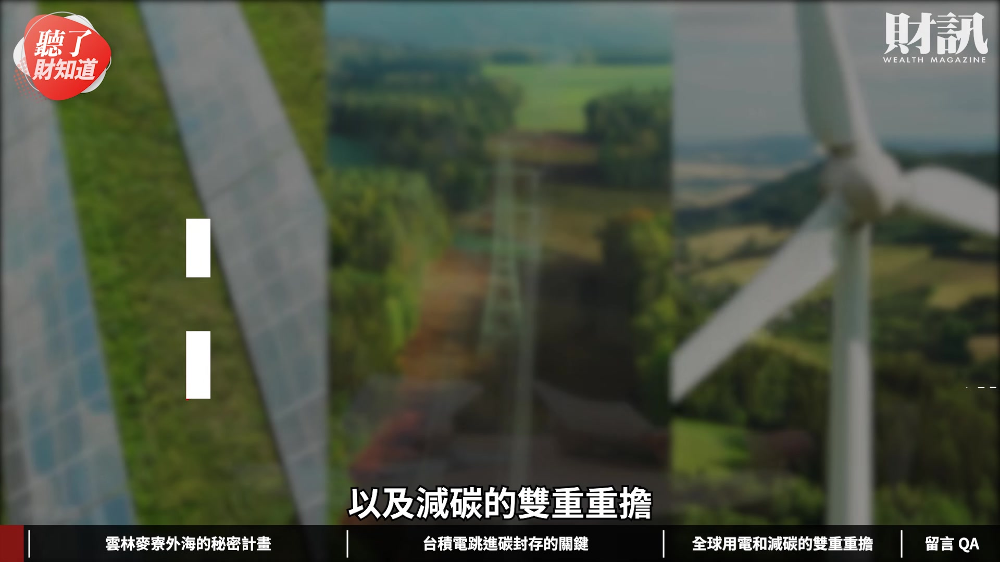

**逐字稿片段：** 我是主持人洪綾襄

**話題推測：** 主持人洪綾襄自我介紹。

---

## 00:00:26

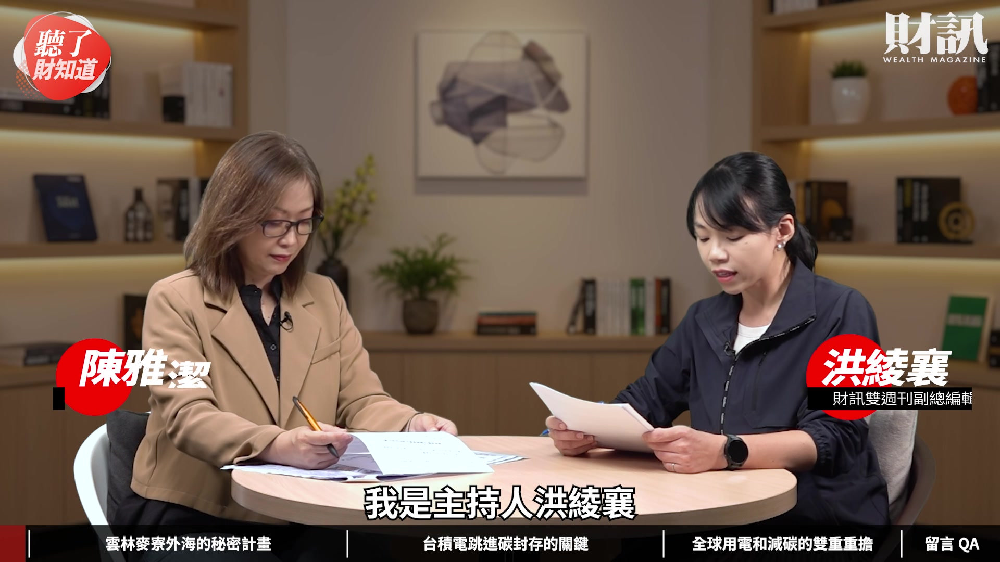

**逐字稿片段：** 今天的來賓是財訊的 執行副總編輯陳雅潔 各位觀眾大家好 我是陳雅潔 今天雅潔來跟我們談一個 跟我們日常生活息息相關 就是有關於用電這件事情 用電 缺電這件事情 民眾都非常的關心 可是其實 還有人比民眾更關心 更擔心 其實我們聽說 就是從產業界紛紛的傳來消息 告訴我們在雲林麥寮外海

**話題推測：** 介紹來賓陳雅潔。

---

## 00:00:50

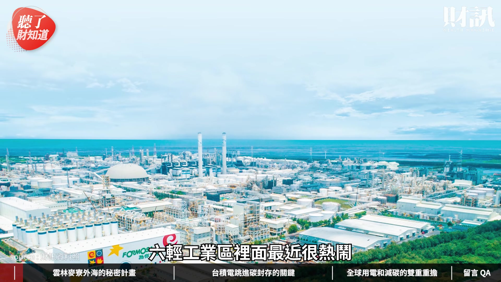

**逐字稿片段：** 六輕工業區裡面最近很熱鬧 地面上台塑投資了 1300 億元的電廠 正在改建中

**話題推測：** 提及雲林麥寮外海六輕工業區的熱鬧景象，可能搭配地圖或空拍圖。

---

## 00:00:57

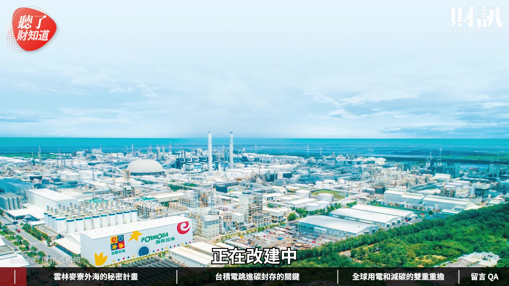

**逐字稿片段：** 而地面下台積電 還有台塑化 埃克森美孚的大計正在展開 那我們這邊請雅潔 跟我們分享產業界這個 看起來很驚天動地的大事 到底是什麼 其實說驚天動地當然沒有 因為它們真的都非常低調 但是它們是動地 對 有到動地沒錯 那這件事情

**話題推測：** 轉向地面下台積電、台塑化、埃克森美孚的合作計畫，可能顯示公司Logo或三方關係圖。

---

## 00:01:17

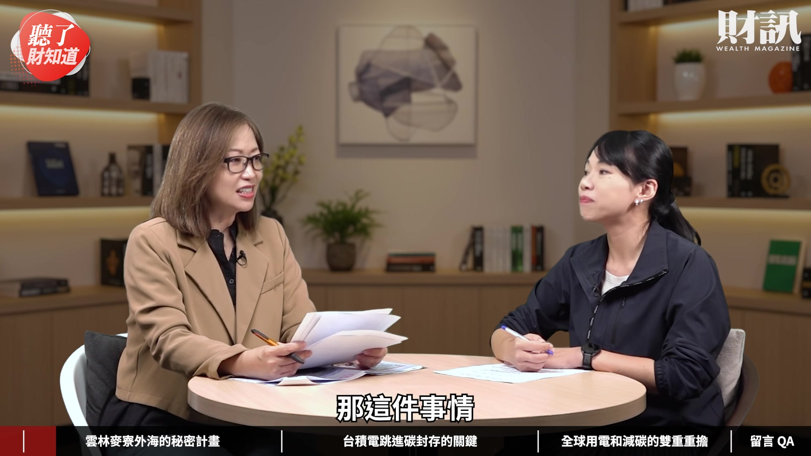

**逐字稿片段：** 其實是台積電起的頭 這是讓我們最驚訝的

**話題推測：** 指出台積電是此計畫的發起者，可能強調台積電的Logo。

---

## 00:01:20

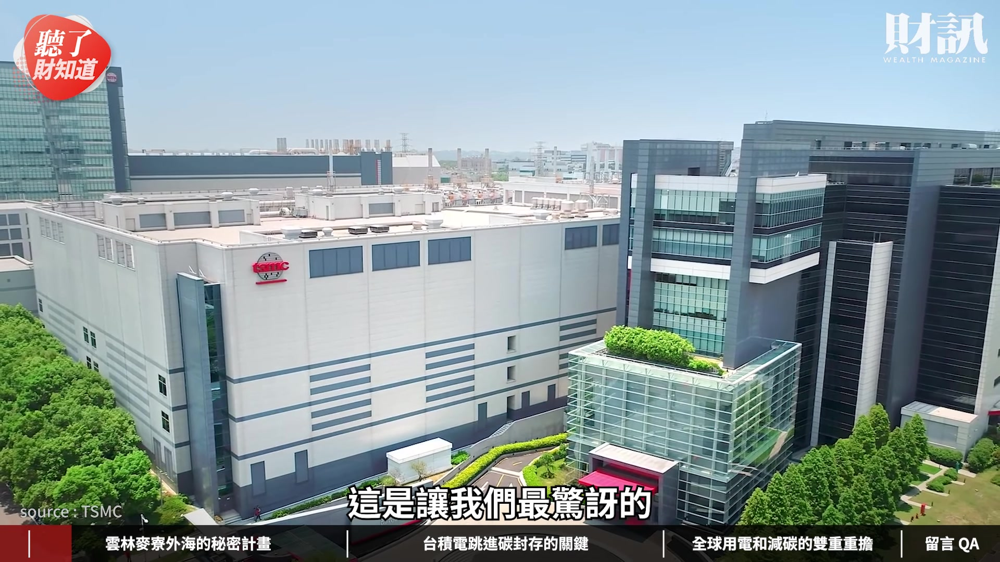

**逐字稿片段：** 台積電其實從 2023 年開始 它們就對於二氧化碳這件事 想要多做一點 所以它們 2023 年的時候 就開始推動了一個計畫

**話題推測：** 提及台積電從2023年開始關注二氧化碳議題，可能顯示時間軸。

---

## 00:01:32

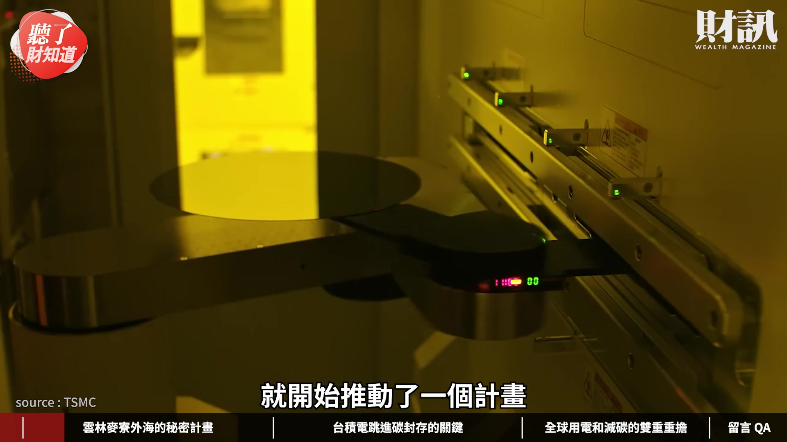

**逐字稿片段：** 叫做「二氧化碳捕捉利用技術先期評估計畫」 今天相關的計畫以及法條 名字都很長 好 然後呢

**話題推測：** 提出台積電「二氧化碳捕捉利用技術先期評估計畫」的名稱，可能顯示計畫名稱標題。

---

## 00:01:43

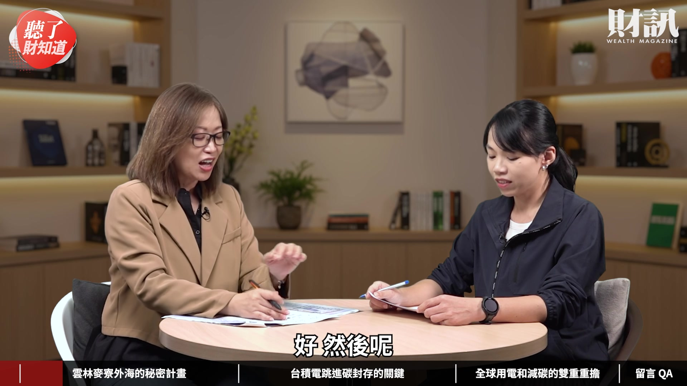

**逐字稿片段：** 這個時間點剛好和麥寮電廠 它的整個改建計畫 因為我們知道麥寮電廠 它過去是一個燃煤電廠 一直以來地方上有很多的意見 除了空污的問題之外 還有就是現在有要朝淨零減排 這樣子的方向去推動 所以燃煤碳排放量實在是太高了 本來麥寮電廠就一直有要 規畫改成燃氣的方向去走 整個計畫就是它們要重新建 兩座新的裝置容量很大的 燃氣機組的這件事情 在 2023 年的時候環評通過 但還沒有開始進行 相關細部設計以及工程 什麼都還沒有開始 台積電是在這個時候就覺得說 台灣有一個很大的硬傷 就是我們的用電

**話題推測：** 連接麥寮電廠的改建計畫，可能顯示麥寮電廠圖片或改建資訊。

---

## 00:02:31

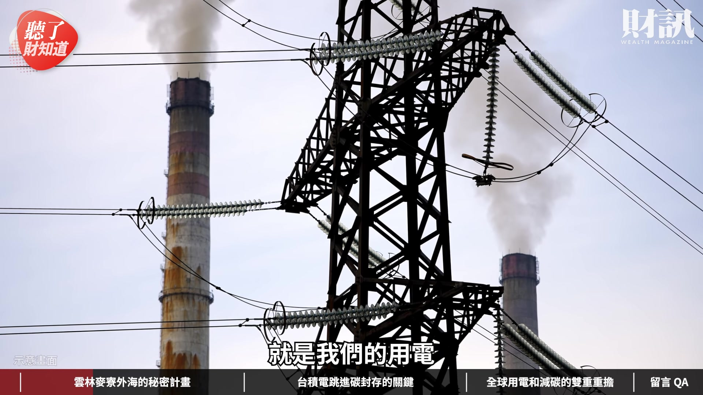

**逐字稿片段：** 都是火力發電 那這一點對於所有台灣的產業 就是你無論如何 你的碳足跡就是比人家多了 所以它找了政府部會 然後學研單位等等 一起找到了台塑化討論 我們來幫麥寮電廠減碳 怎麼減 就是我們利用碳捕捉的技術 在你發電的時候 我們把碳捕捉下來 捉下來之後 我們把它存到海底去

**話題推測：** 說明台灣用電以火力發電為主，可能顯示台灣電力結構圓餅圖。

---

## 00:02:54

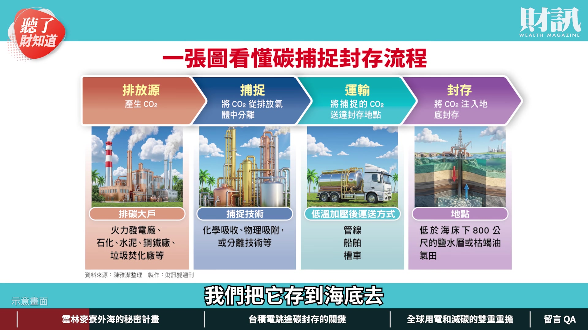

**逐字稿片段：** 所以就是碳捕捉封存的技術 應用在麥寮電廠加 CCS 的計畫 那過去都沒有碳捕捉的計畫嗎

**話題推測：** 解釋碳捕捉封存（CCS）技術，可能顯示CCS流程圖解。

---

## 00:03:02

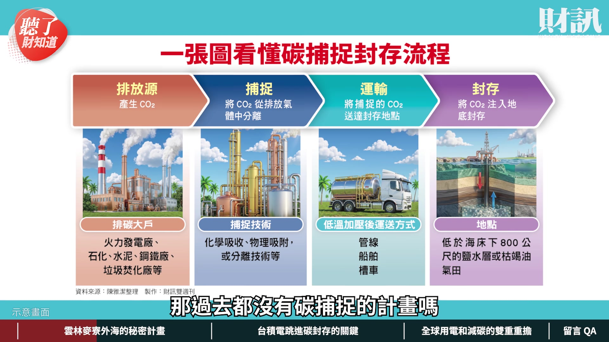

**逐字稿片段：** 就是聽說之前譬如說中油 還有我們的中鋼 可能都有一些碳捕捉的計畫 但是好像在碳封存這個部分 比較少著墨 其實封存這件事情 就是要往地表下面打進去 讓它能夠安全的存在裡面 不要再跑出來了 過去台灣政府比較積極 然後民間也比較有在進行的

**話題推測：** 提及中油和中鋼過去的碳捕捉計畫，可能顯示公司Logo或相關報導。

---

## 00:03:20

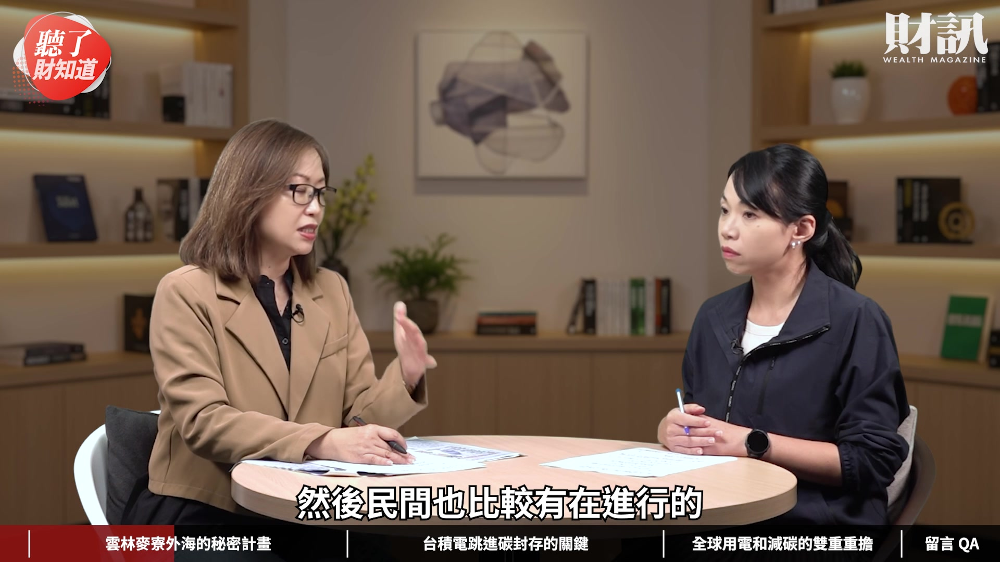

**逐字稿片段：** 應該是中油的鐵砧山 它也是一個廢棄的油氣坑 另外就是台電在它們的

**話題推測：** 提到中油鐵砧山的封存案例，可能顯示鐵砧山位置圖或相關新聞。

---

## 00:03:27

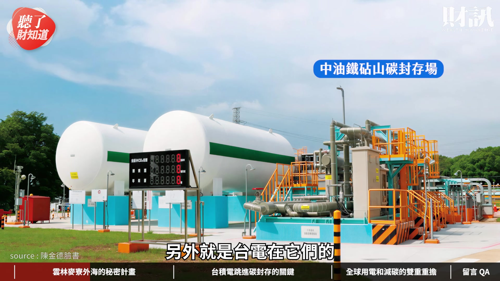

**逐字稿片段：** 台中火力電廠內部 有在做所謂的減碳園區 就是希望把碳捕捉下來之後 再做封存的動作 我們知道其實碳捕捉下來

**話題推測：** 提及台電台中火力電廠的減碳園區，可能顯示電廠圖片。

---

## 00:03:36

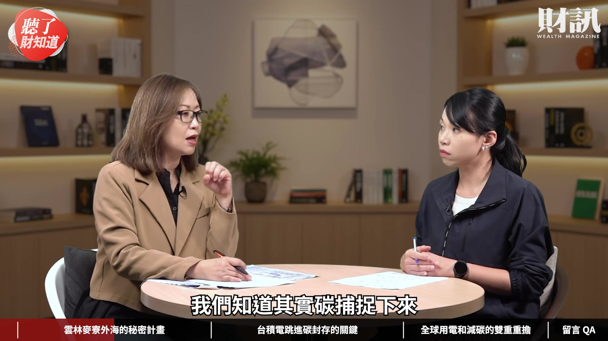

**逐字稿片段：** 有兩個路徑 一個是再利用

**話題推測：** 介紹碳捕捉後的兩個路徑：再利用與封存，可能顯示流程圖。

---

## 00:03:39

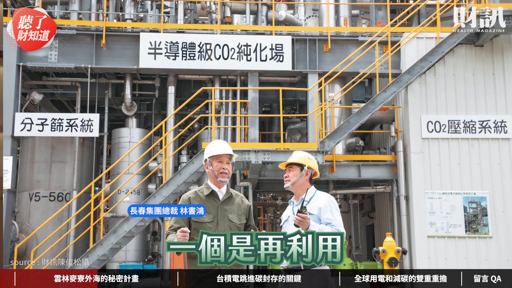

**逐字稿片段：** 比如說長春石化 它可以想辦法再把它重新純化 成為半導體材料 我們知道在半導體製程當中 是會需要這種二氧化碳的 但問題是量沒有那麼大 價格又非常的高 另外一個路徑 就是讓它不要再出現了 就把它封存起來 封存這件事情 在國外是很多例子的 但是在台灣 我們比較沒有什麼油礦或氣田 所以過去一直都沒有嘗試 要把它封存起來這樣子的方向 而且可能也沒有地方放

**話題推測：** 以長春石化為例說明碳的再利用，可能顯示長春石化Logo或產品圖。

---

## 00:04:11

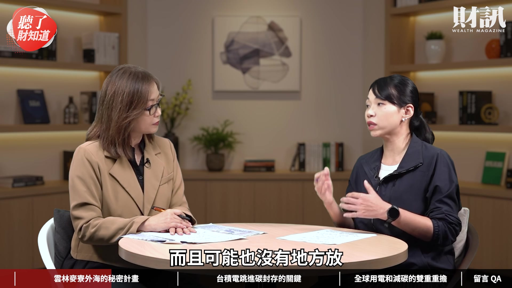

**逐字稿片段：** 我這邊有訪問到環境部部長 他就有提到今年年初的時候

**話題推測：** 提到環境部部長的發言，可能顯示部長姓名卡或照片。

---

## 00:04:15

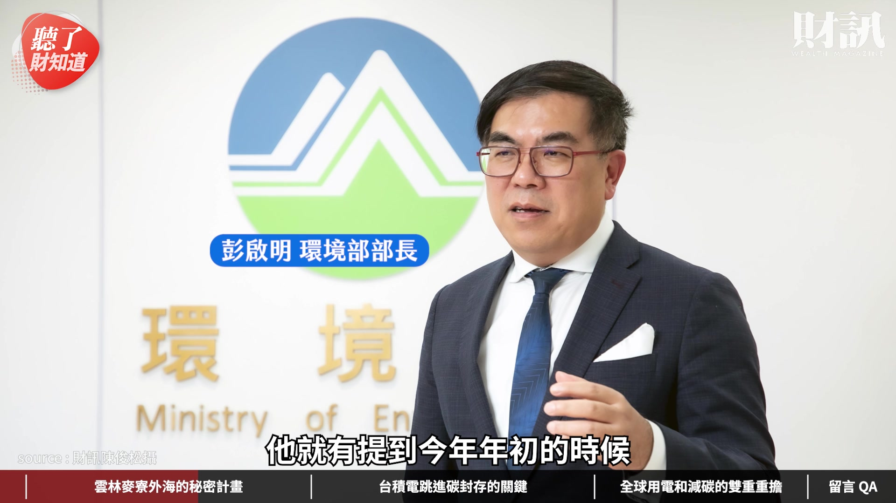

**逐字稿片段：** 環境部的重點法案是循環雙法 那下半年 8 月 25 日的時候 環境部它公布了 《二氧化碳捕捉後封存管理辦法》 這樣的一個法條出來 我們科技組的同事 在路線上就聽到了很多 產業界上面的一個動態 所以我們就開始做這一個 相關的一個報導 那目前 就我們自己側面瞭解 聽到的滿多就是台積電 或者台塑化都非常的低調 目前這三方它們規畫的 我們有探聽到一些 什麼樣新的訊息 可以請雅潔跟我們分享 目前我們掌握到的資訊

**話題推測：** 提及環境部推動的「循環雙法」，可能顯示法案名稱或概念圖。

---

## 00:04:45

**逐字稿片段：** 就是台積電 台塑化 和埃克森美孚三方 已經簽了前期的 探勘測試的合約

**話題推測：** 再次確認台積電、台塑化、埃克森美孚三方的合作，可能顯示三方Logo。

---

## 00:04:53

**逐字稿片段：** 就我們瞭解在碳捕捉的這塊 當然是台塑化在處理 然後到時候那個注入的動作 會是埃克森美孚 因為它就是美國最大的石油業者 所以它們這方面的技術是很成熟 像前期例行的探勘什麼的 也是它們的專長 所以它們內部是已經有一些分工了 現在因為法令已經正式公告了 所以台塑化據說已經

**話題推測：** 解釋三方在碳捕捉與注入上的分工，可能顯示合作關係圖或流程圖。

---

## 00:05:17

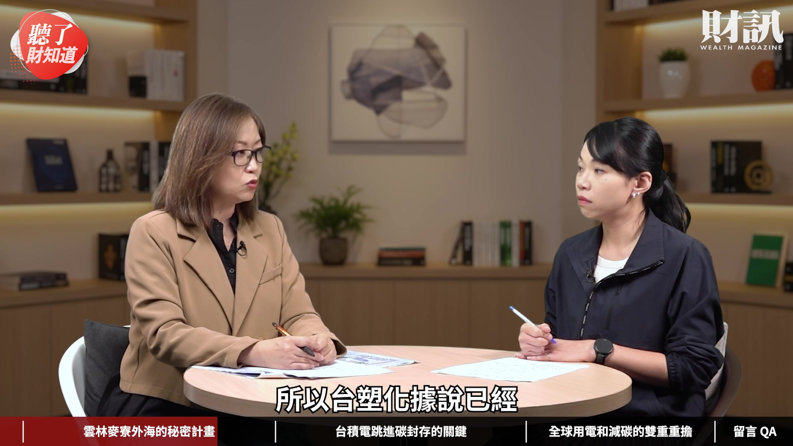

**逐字稿片段：** 準備要在今年之內 就會提出探勘的申請 這個法令的公告它最重要的 就是讓想做的人終於 有法可據 可以做了 不然的話 比如說它們真的要開始來動地了 但是卻沒有法令依據 可以讓它們怎麼樣去依循 怎麼做等等的 過去是沒有的 之後還要怎麼管理 要監測什麼 然後責任歸誰或什麼的 這些相關的遊戲規則要訂出來 那現在這個法令出來之後 業界就開始有了遵循的方向 所以也才讓麥寮電廠加 CCS 的這個計畫 可以開始浮上檯面 這件事情台積電 我們說它推動了 3 年 從 2023 年開始 但它也不是只去找台塑化喝茶聊天而已 為了要促成這整件事情可行 像我們剛才講的 你必須要有遊戲規則什麼的 所以它們在政府單位 也是很努力的去推進 我們知道是各個部會都見過 莊子壽副總經理的身影 他最近常常出現 對 就是他真的好忙 我發現他還要去德國 還要去美國蓋廠 在台灣還要想辦法找埋碳的地方 所以台積電它從找適合的場址 到法規建制 到讓整件事情成形 台積電都花了很大的力氣 整個投資金額 就我們目前掌握到的 前期要開始進行探勘這樣子的階段 目前的投資金額大概是 50 億元左右 之前我們偶爾就會聽到 一些業界談到碳封存或碳管理 但是好像都是雷聲大雨點小 這一次台積電跳進來做 意義特別的重大 主要就是因為台積電本身 就是台灣的用電大戶 而且它也不只是用電大戶 它還是綠電的怪獸

**話題推測：** 提及台塑化準備提出探勘申請，可能顯示新聞報導或申請流程圖。

---

## 00:06:58

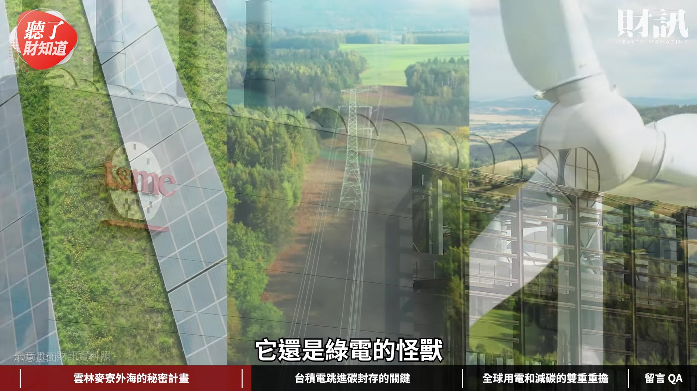

**逐字稿片段：** 全台灣 9 成的綠電都被它買掉了 還不夠用 為了它未來擴廠的計畫 它還需要更多的綠電 所以它乾脆就跳下去自己做了 為什麼台積電它要這麼用力的 去做這件事情 剛才一開始有講到台灣的一個硬傷 就是我們火力發電的占比非常的高 每一度電的碳排係數就很高 這個碳足跡都是所有的廠商一起背負 台積電它也曉得這個問題 現在它 9 成的產能都還是在台灣 無論它在海外怎麼買綠電 它在台灣的碳排就是很難降 現在這個方式 就是它請麥寮電廠把碳給去掉之後 讓這個電變成低碳電力之後 我再跟你買 那就跟我買綠電是一樣的道理了 變成說我用的電 雖然不到 100% 綠電的程度 但也已經不再是純火力發電的灰電了 我們也有去盤點過 台積電它接下來要建廠的這個需求

**話題推測：** 指出台積電購買全台灣9成綠電，可能顯示綠電使用比例圖。

---

## 00:07:57

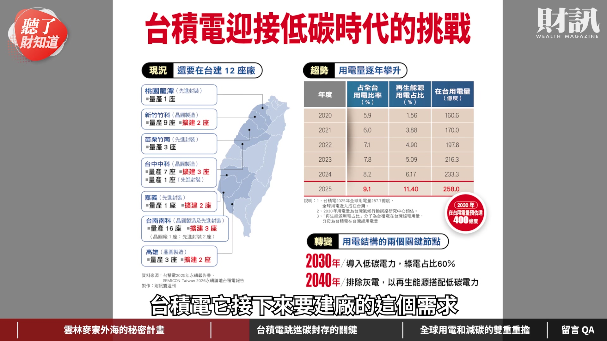

**逐字稿片段：** 我們知道台積電現在的廠房遍地開花 大概台灣西部沿岸 高鐵每一站 都可以看到台積電正要建廠 可是它過去一個新的廠蓋起來 它可能就是再請台電 再多給它一點電 要不就是自己想辦法 再去多買一點綠電 但是現在它再怎麼樣的買綠電 它都很難再降低它的碳排了 所以唯一的辦法 就是回頭去讓台電的電變綠 所以長期來講 它是要讓整個大的電網裡面的 碳排降低的 麥寮電廠只是一個點 就是它先初步的去跟麥寮電廠 採購電力這樣子的方式 來讓自己電力的碳排降低 未來如果說這樣子的模式可行的話

**話題推測：** 說明台積電廠房遍佈台灣西部，可能顯示台灣地圖及廠區標示。

---

## 00:08:43

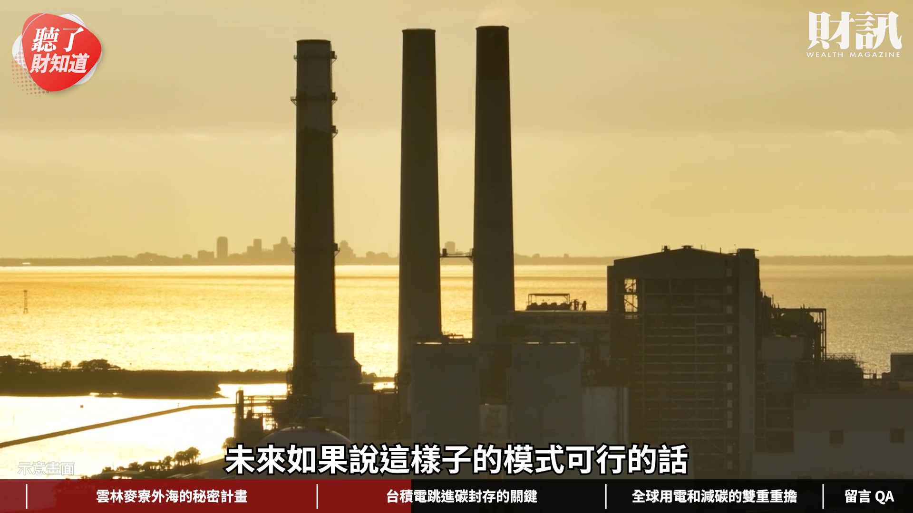

**逐字稿片段：** 那台電的所有火力電廠 或者是說其他的民營火力電廠 都也可以比照這樣子的方式的話 其實對台灣的整個碳排 是真的有很大的幫助 真的 因為台積電不是只有台灣的台積電 它是世界的台積電 所以它真的是竭盡所能的 在想辦法節能減碳 像我這一件大家可能看不出來 其實是台積電的廠服 我看一下它的材料 都是用再生纖維做的 其實它真的還滿認真的 在做這些事情

**話題推測：** 討論將此模式推廣至台電所有火力電廠，可能顯示台灣火力電廠分佈圖。

---

## 00:09:09

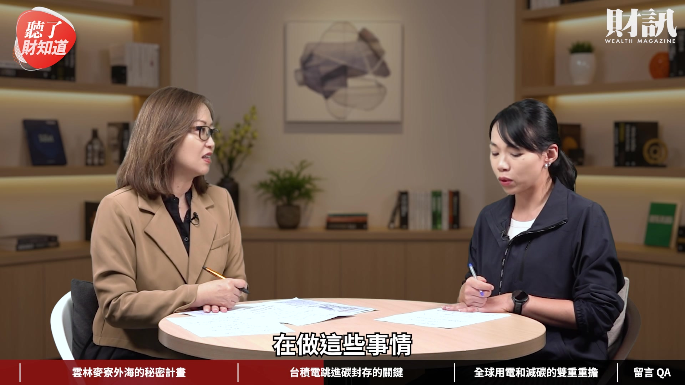

**逐字稿片段：** 能源其實黃仁勳也有提到 他就是說電力 就是未來 AI 產業 很重要的一個基礎建設 不只是台灣 可能是全球 AI 都必須要面臨的關卡 大家不要覺得說可以去國外 買便宜的碳權回來抵 不行 現在全世界的趨勢就是說 在地產生的碳排 你就要用在地產生的碳權 來去抵減 不能夠就是去外國買 挖東牆補西牆這樣子是不行的 就我們的採訪得知的話 台積電還有哪些布局嗎 我們知道的就是 它還是會繼續的採購綠電 它之前就已經簽了兩座大的風場 比較特別的就是 它們在 2026 年 8 月底的時候 公布了 2025 年的永續報告書裡頭 第一次有談到它們要開始 採用碳封存這樣子的方式 然後在今年的半導體展 它們廠務裡頭的丁瑞華處長

**話題推測：** 提及黃仁勳對電力的看法，可能顯示黃仁勳照片或引言。

---

## 00:10:13

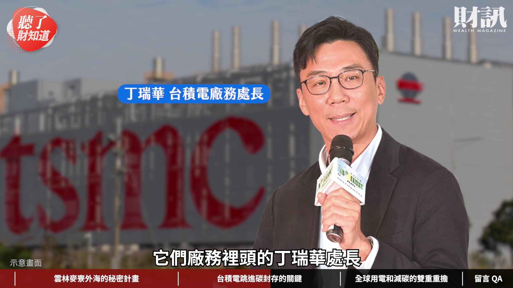

**逐字稿片段：** 他也第一次提到台積電在 2040 年 就要完全不使用灰電 它原本之前就有發布過 它要在 2040 年就達到 RE100 那就是不使用灰電 但是問題是 100% 使用綠電這件事情 其實連在美國都還滿難做到的 現在它們變成怎麼樣 去補那個綠電的缺口 要靠的就是低碳電力 丁瑞華處長他在公開的演講裡頭 講到就是說他們會開始 從不管是燃煤或者是天然氣的電廠 從發電端就開始來進行 CCS 從電的源頭開始減碳

**話題推測：** 提及台積電2040年完全不使用灰電的目標，可能顯示目標圖表或時間軸。

---

## 00:10:50

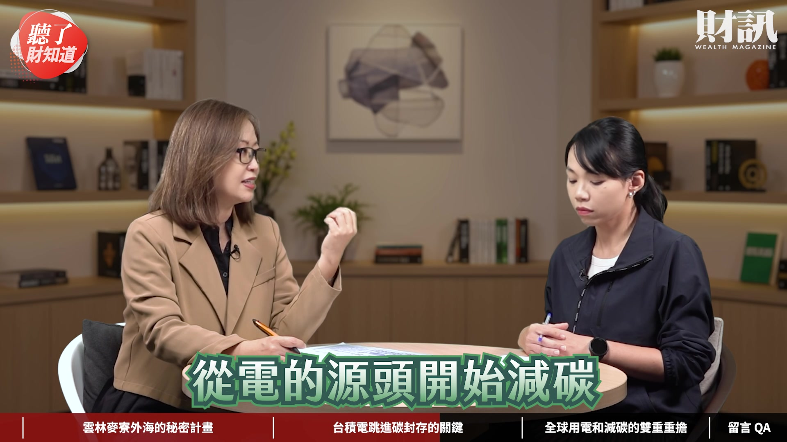

**逐字稿片段：** 然後他也講到了台灣西海岸是一個 很適合封存的場域 未來如果說碳捕捉和碳封存 能夠串成一個完整的生態系的話 其實是滿有機會的 過去我們在節能減碳上面 有很多空白區沒有辦法填滿 但接下來如果說碳捕捉和碳封存 這方面的法制化 遊戲規則說清楚了 技術也到位了 那它們也有錢可以來做這件事情了 台積電的這一步的影響 其實是很大的 因為過去其實有很多廠商 本來就有在做碳捕捉 只是捉下來的碳 到底要怎麼處理 過去台灣一直沒有走封存的這條路 是因為我如果是一個負責封存的廠商 但是我沒有足夠的碳源 那我永遠都沒有辦法回本 我如果是一個會產出碳的單位 但是我沒有地方可以封存 我捉下來也沒有用 所以就變成大家都在等 我等你開一個場址來 然後你等我生出碳來 大家都覺得說對方應該先走一步 台積電它現在這麼做 很明確的就是 你只要有碳封存的地方 那我的碳給了你之後 我就來買你這個 已經去了碳之後的產品 那所以它就會滿明確的保障 這個碳源之後有了去處 碳封存廠的這個營運商 它也有一定的來源 這就形成了一個

**話題推測：** 提及台灣西海岸為適合封存的場域，可能顯示台灣西海岸地圖。

---

## 00:12:13

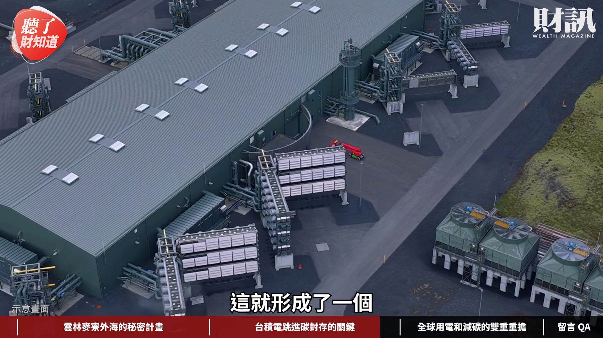

**逐字稿片段：** 新的電力產業鏈的概念 對 它真的就是起了一個 很重要的帶頭作用 以前的中油和鐵砧山這樣一個案例 中油它在生產過程中 雖然它已經盡量的做到節能減碳 但是可能過程中 還是會有逸散的碳跑出來 那它自己必須要投資很多錢 在碳捕捉這件事情 但是它捉了碳捕捉之後 它沒有地方可以存 我們沒有天然氣或者是油田 可以把它原封不動打回地裡面 如果是埃克森美孚 它們就有這樣的技術 所以說這個就是會有個斷點 接下來台積電它發起了 找了台塑化還有埃克森美孚 兩個廠商這樣一個媒合 然後它自己作為最終使用 去化的一個管道 就可以把這個整個模式給建立起來 但是國際最近是不是有

**話題推測：** 闡述新的電力產業鏈概念，可能顯示產業鏈關係圖。

---

## 00:12:54

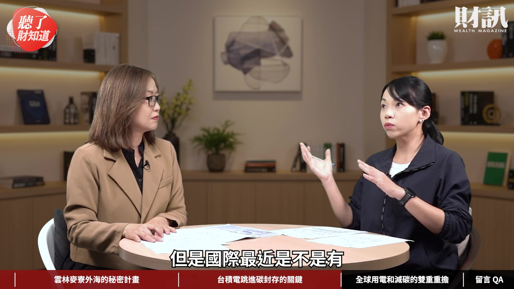

**逐字稿片段：** 碳捕捉和碳封存的一些趨勢改變 而導致說台積電願意去做這件事情呢 其實前面我們剛剛已經講到 就是 RE100 很難達成

**話題推測：** 轉向國際碳捕捉和碳封存趨勢，可能顯示國際新聞圖或地圖。

---

## 00:13:03

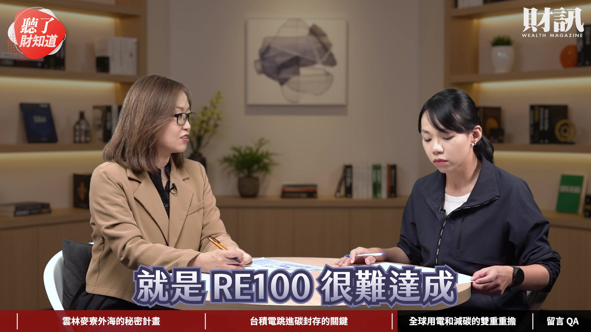

**逐字稿片段：** 因為 《巴黎協定》 是在 2015 年時候的事情

**話題推測：** 提及《巴黎協定》在2015年簽署，可能顯示協定標誌或時間軸。

---

## 00:13:06

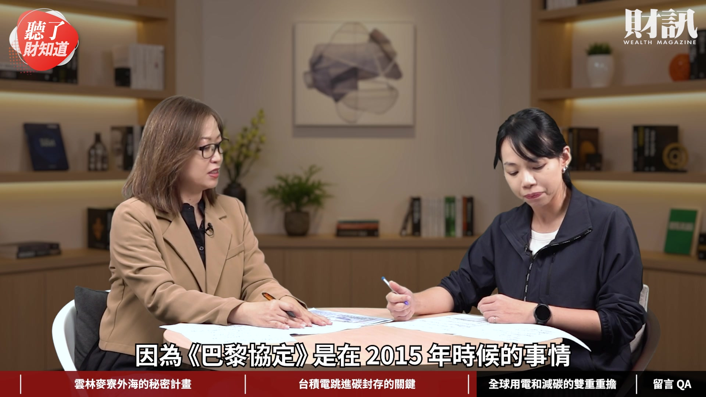

**逐字稿片段：** 那 RE100 是在 2014 年的時候提出 因為大家實在太急著要把碳給減下來了 最激進的方案就是 我們全部都不要再燒火力電廠了 全部都改用再生能源這樣 但是這麼多年來已經證明 第一個是再生能源對電網來講 它就是有一個不穩定的天性 很難作為電網 100% 負載 這個是已經確定的 所以我們看到從 2021 年之後 開始全球返核 但是核能並沒有被 RE100 認定為綠電 因為它無法 renewable 它是零碳電力沒有錯 但是它並不是再生能源 所以這個也是一個 對 RE100 這個倡議的挑戰 那現在就是說 除了大家開始走核能這條路 因為它是零碳之外 現在又有了新的想法 就是那我們就用天然氣電廠 然後搭配 CCS 最具體的就是 Google 它們是在去年的時候

**話題推測：** 提及RE100在2014年提出，可能顯示RE100標誌或時間軸。

---

## 00:14:04

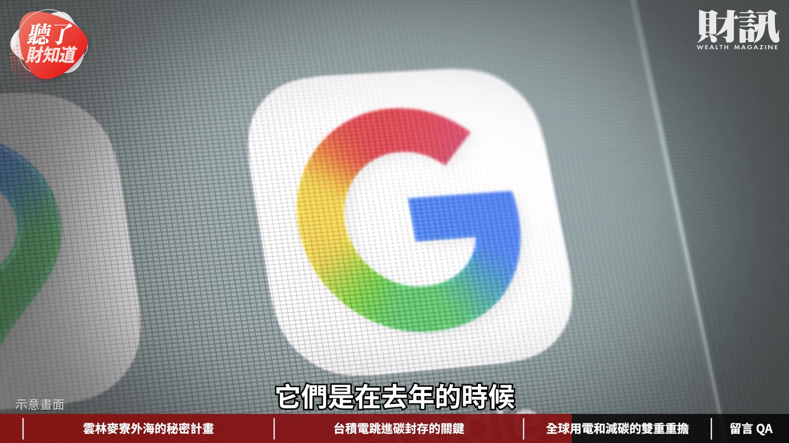

**逐字稿片段：** 就跟美國的 Broadwing 能源公司 簽了一個合約 就是它們要一起蓋一座 天然氣加 CCS 的電廠 然後到時候可以封存

**話題推測：** 提及美國Broadwing能源公司，可能顯示其Logo。

---

## 00:14:13

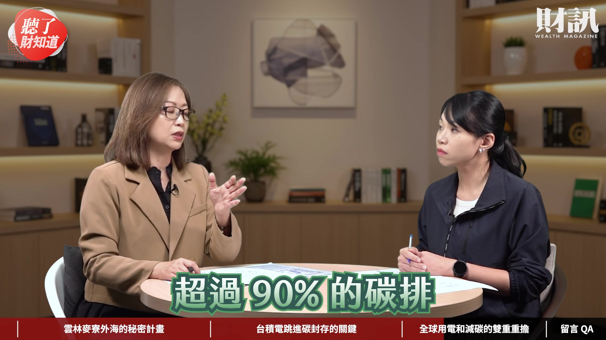

**逐字稿片段：** 超過 90% 的碳排 透過這個方式來取得低碳的電力 那現在根據科技基礎減量目標倡議

**話題推測：** 提及Google計畫封存超過90%的碳排，可能顯示減排比例圖。

---

## 00:14:21

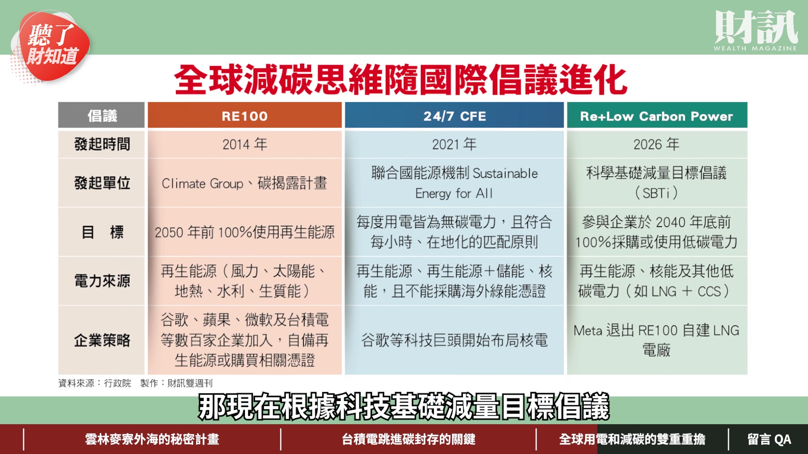

**逐字稿片段：** 就是 SBTi 它最新提出的一個

**話題推測：** 提及SBTi（科學基礎減量目標倡議），可能顯示SBTi Logo或解釋。

---

## 00:14:24

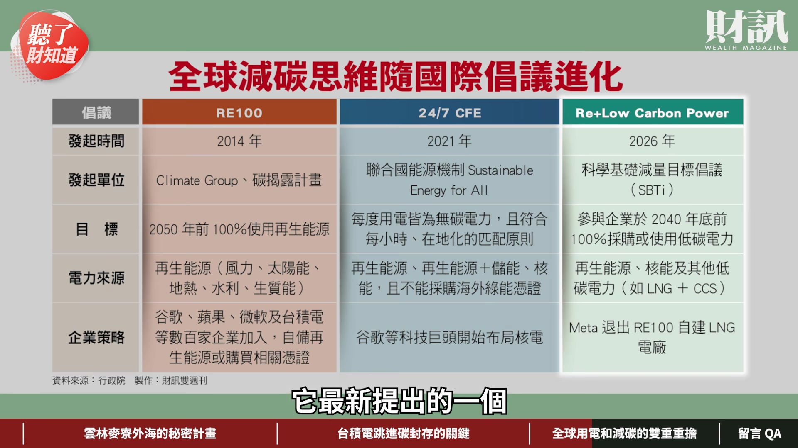

**逐字稿片段：** 《企業淨零排放標準 2.0 版》 裡頭 它已經開始把低碳電力 納入可以作為能源解方的一個方式 那所謂的低碳電力 就是天然氣加上 CCS 那就是因為它可以把將近 90% 甚至更高的碳排給去掉的話 根據 SBTi 的定義 所謂的低碳電力就是 你每一度電可以排的碳

**話題推測：** 提及《企業淨零排放標準2.0版》，可能顯示文件封面或重點摘錄。

---

## 00:14:49

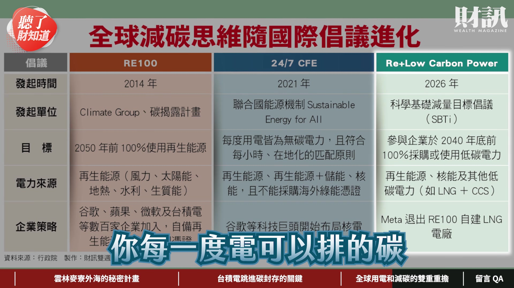

**逐字稿片段：** 只有 24 克 那現在天然氣每一度電排的碳

**話題推測：** 說明低碳電力定義中每度電碳排24克，可能顯示數字比較圖表。

---

## 00:14:55

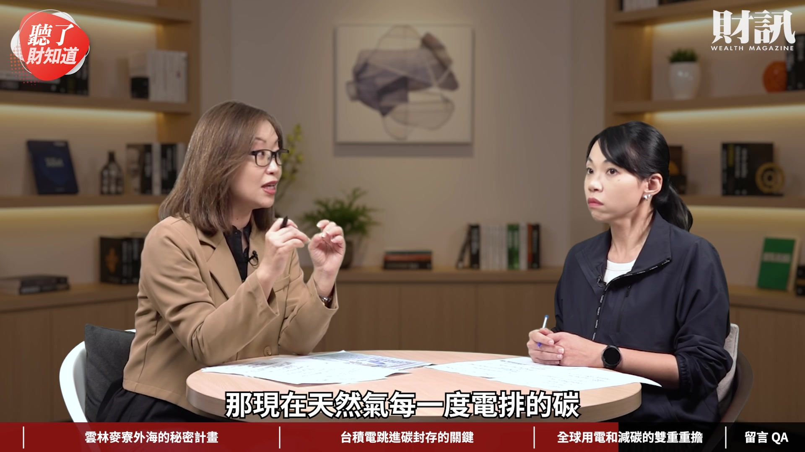

**逐字稿片段：** 大概 400 多克 但是當你的碳捕捉封存 如果可以去掉 90-95% 以上的碳的話 就可以符合這個低碳電力的定義了 這是為什麼企業開始思考朝這個方向 然後現在國際間 除了剛才 Google 的那個例子之外

**話題推測：** 說明天然氣每度電碳排約400多克，可能顯示數字比較圖表。

---

## 00:15:12

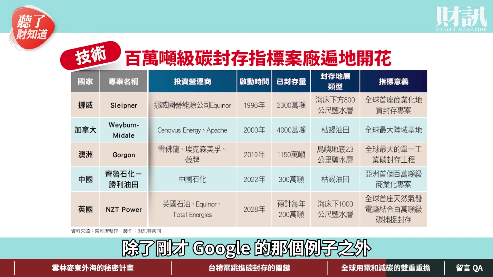

**逐字稿片段：** 英國也開始有天然氣電廠 直接加上 CCS 的裝置 目前遊戲規則已經確定了 然後也有科技巨頭 加上石化還有就是外商 它們願意進來做案場的開發 那我們能源署有沒有一些

**話題推測：** 提及英國也有天然氣電廠搭配CCS裝置，可能顯示英國地圖或電廠圖片。

---

## 00:15:26

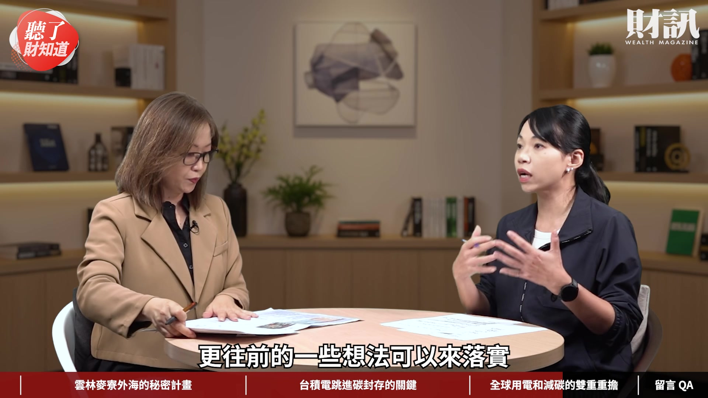

**逐字稿片段：** 更往前的一些想法可以來落實 然後甚至促進這個商機呢 我覺得我們的行政部門 它們默默在做很多事情

**話題推測：** 轉向能源署的政策推動，可能顯示能源署Logo或相關圖表。

---

## 00:15:33

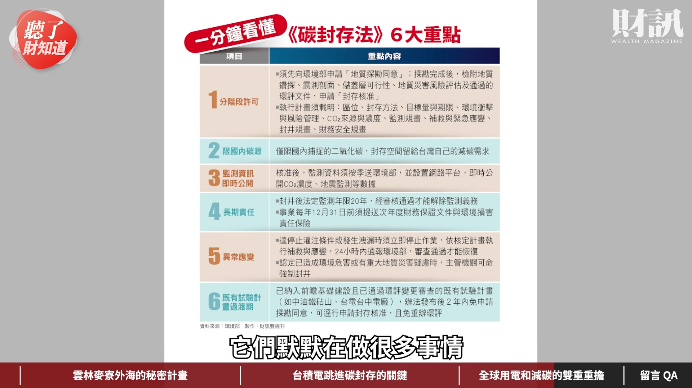

**逐字稿片段：** 像 2025 年的時候 已經提出了新的淨零目標 也提出了新的淨零路徑 然後六大部門都有提出 減排的旗艦行動方案等等的 那其中在能源的部分 就是有加上碳封存 法令發布之後

**話題推測：** 提及2025年提出新的淨零目標和路徑，可能顯示目標或時間軸圖。

---

## 00:15:50

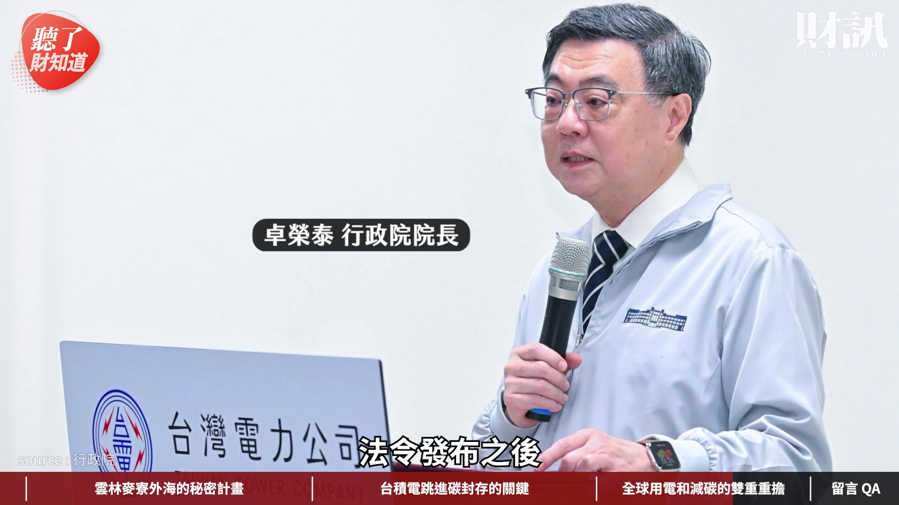

**逐字稿片段：** 我們的卓院長 他在台中電廠燃氣機組 商轉的典禮上面 他就有提到未來台中電廠 也會加上 CCS 的裝置 另外我們的能源署署長 他也有在我們跟美國 碳封存技術合作的 這樣一個場合就有講到 推動火力電廠的去碳化 是可以補足台灣在 淨零轉型當中減碳的缺口 因為我們真的是面臨那個 國際供應鏈減碳要求 壓力很大的一個國家 所以現在這件事情必須推動 它是一個國家級的戰略 沒錯 像之前我們有討論到 碳權就是所謂的碳定價 不管是碳費或是買碳權 碳權交易這樣的一個概念

**話題推測：** 提及卓院長的發言，可能顯示卓院長姓名卡或照片。

---

## 00:16:30

**逐字稿片段：** 那我這次在訪問彭啟明部長的時候 他也提到說過去大家都是講碳權 它其實相對比較低成本 因為它是靠花錢就好了 而且是基準年 就是你減下來的碳 一噸多少去算這樣子 現在碳捕捉雖然大家都覺得它很貴 但是大家也必須要考慮到 這個是有可能要被交易的這件事情 未來我覺得這個都可以再 互相激盪和思考 在減碳的路徑上面 這真的是一個馬拉松 而且我覺得就成本這件事情 你如果跟台灣現在 用電的價格比起來的話 加上 CCS 之後的電價 肯定很貴 但是技術一旦有一個突破口 成本的下降速度也是很快的 對 當然大家都會覺得說節能減碳 好像不用特別的認真去做 因為川普怎樣怎樣怎樣 但是這幾年來就是 氣候變遷真的是加劇 那極端的氣候真的是太多了 而且這件事情真的是人力 沒有辦法去回復的 真的發生很多很多的災情 所以我們真的還是必須要 好好的關心地球 一起努力思考怎麼樣讓地球更永續 好 今天謝謝雅潔的分享 看完今天的影片 你覺得電力需求和 淨零碳排的雙重壓力 應該如何緩解呢 歡迎留言分享你們的觀點 如果不想錯過我們的節目 歡迎訂閱財訊頻道 或者是加入頻道的會員 解鎖所有的會員影片 接下來我們要回覆財團在

**話題推測：** 提及彭啟明部長的發言，可能顯示彭部長姓名卡或照片。

---

## 00:17:47

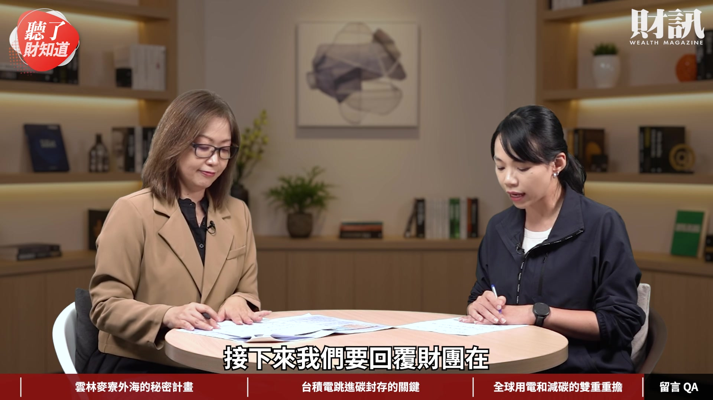

**逐字稿片段：** 《聽了財知道》 的 366 集 台股市值暴增百兆元 有錢人都在做的資產規畫 裡面的留言 這個好像是訪問我自己 對 來 那讓我來問妳好了 我們的財團 MG Tsai 他說

**話題推測：** 轉向回覆觀眾在《聽了財知道》第366集關於台股市值暴增的留言，可能顯示節目封面圖。

---

## 00:18:02

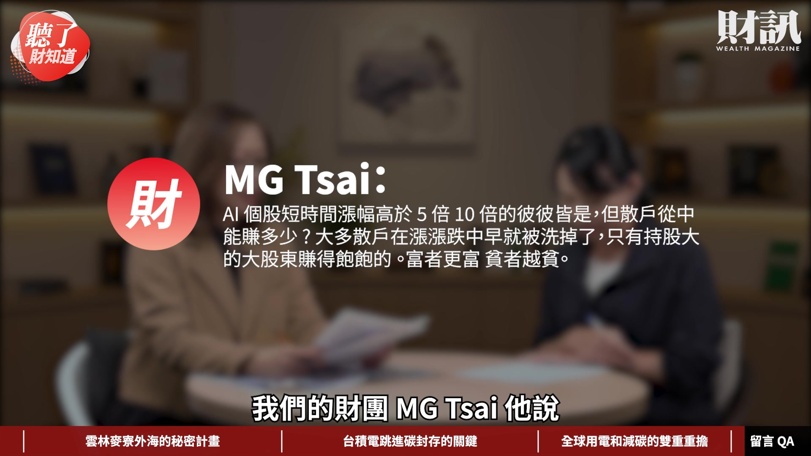

**逐字稿片段：** AI 個股短時間漲幅高於 5 倍 10 倍的 比比皆是 但散戶從中能賺多少 大多散戶在漲漲跌跌中 早就被洗掉了 只有持股大的大股東 賺得飽飽的 富者更富 貧者愈貧 對 其實我們也是覺得說 台灣的貧富差距是在擴大 但是如果你有瞭解 真正的投資方向 認真研究 對 那你就會有機會可以 為自己攢足一定的資產以上

**話題推測：** 提及AI個股短時間漲幅高於5倍、10倍，可能顯示股票漲幅圖或相關數據。

---

## 00:18:29

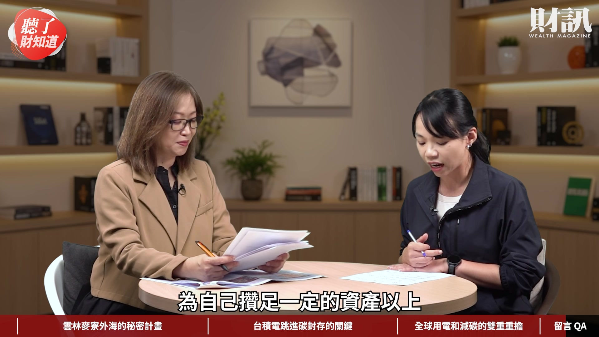

**逐字稿片段：** 再來這一位好朋友 Robert Tsao 他說 這幾年沒有投資股市 或者投資的本金不夠多的 已經被遠遠拋在後頭了 台灣很幸運踩在這波 AI 紅利的風頭上 台灣真的是幸運的 但是我們也不是 就純粹是天上掉下來的 我們也很努力 對 我們也是有一定的基礎 才接得住這樣的機會 所以包括投資人也是一樣 你如果沒有做一定的研究 其實你也是真的很可能 就如前面那一位好朋友說的 你就會被洗掉 真的 而且那時候我們都很擔心說 不做淨零碳排的話 其實你就會被供應鏈刷掉 那看得出來我們台灣人真的很努力 台積電也帶著我們一起做這件事情 所以現在所有的供應鏈 都不能沒有台灣 接下來 Tom Chen 他說 台灣是很好的標的

**話題推測：** 回覆觀眾Robert Tsao的留言，可能顯示留言內容截圖或帳號名稱。

---

## 00:19:19

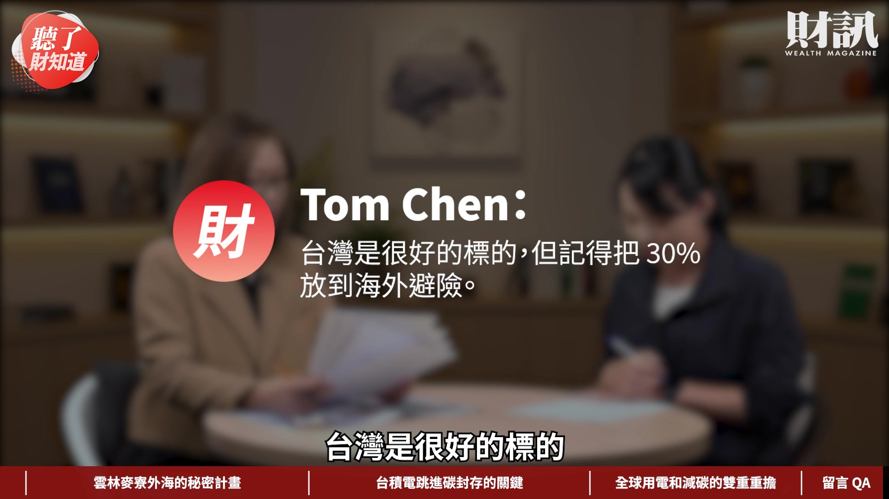

**逐字稿片段：** 但記得把 30% 放到海外避險 嗯 好喔 這就是雞蛋不要放在同一個籃子裡 好 那今天謝謝雅潔的分享 如果你還想瞭解更多的內容 歡迎點擊資訊欄中的文章連結

**話題推測：** 提及將30%資金配置到海外避險，可能顯示資產配置圓餅圖或示意圖。

---

## 00:19:32

**逐字稿片段：** 或是購買財訊的 773 期雜誌 跟我們一起追蹤政經趨勢 掌握投資脈動 《聽了財知道》 我們下次見 bye bye

**話題推測：** 提及購買財訊773期雜誌，可能顯示雜誌封面圖。

---
