# wealth1974_TSzRULiMuys — 關鍵畫面索引

- 來源逐字稿：[wealth1974_TSzRULiMuys_FIN.srt](wealth1974_TSzRULiMuys_FIN.srt)
- 影片：https://www.youtube.com/watch?v=TSzRULiMuys
- 截圖數：36

## 00:00:15

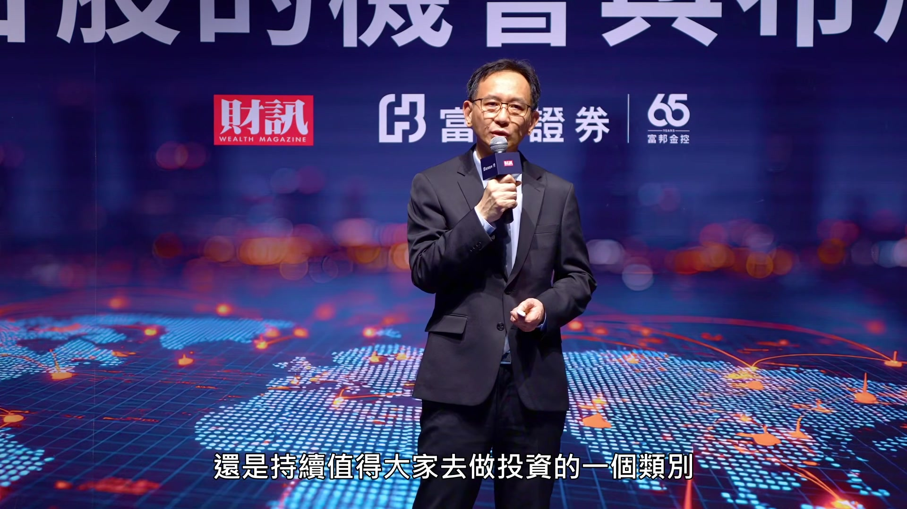

**逐字稿片段：** >> This wave will reach between 53,000 and 60,000 points by next May. >> In fact, looking at the current situation, there shouldn't be much suspense about this upward trend. After

**話題推測：** 提出市場指數明年五月預期點位（53,000至60,000點）。

---

## 00:00:28

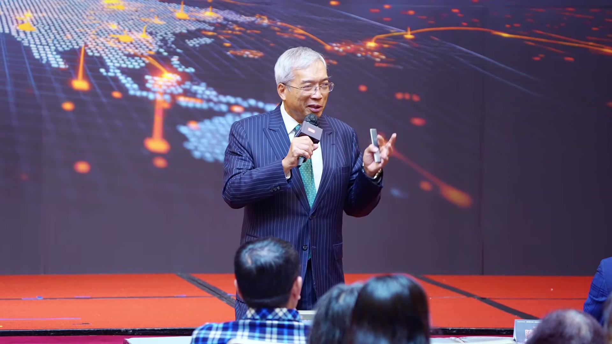

**逐字稿片段：** looking at this chart, you will all understand why we have gained 59%this year, which is very, very good. We hope that if we reach 100%, the broader market will rise to 50,000 points, given that our lowest point this February was 29,000 and the current

**話題推測：** 說明今年市場漲幅（59%）、目標漲幅（100%）與歷史高低點（29,000與48,218點）。

---

## 00:01:08

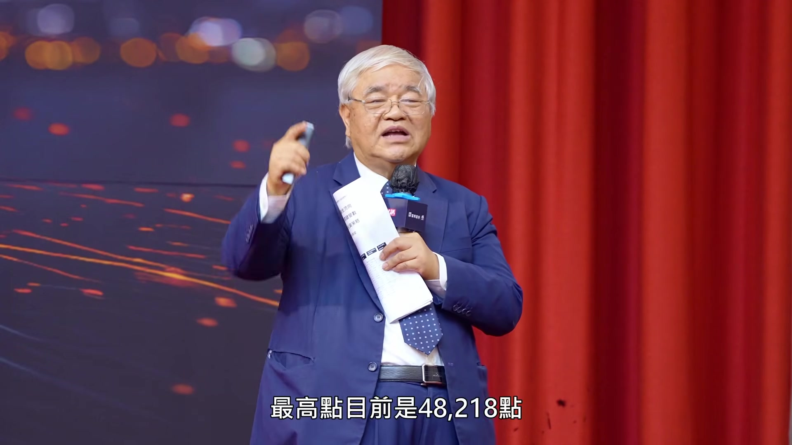

**逐字稿片段：** high is 48,218. Our GDP for Q1 this year is about 15%, Q2 is 12%, and the full year is around 11%, with 6% expected next year, so listed company profits are looking very, very good.

**話題推測：** 列出今年Q1、Q2及全年GDP成長率預期數字。

---

## 00:01:21

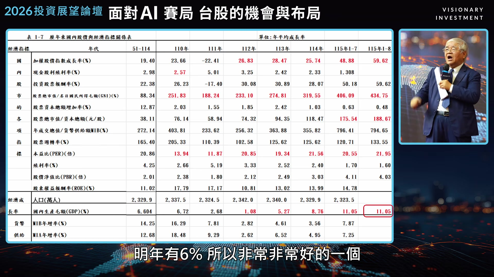

**逐字稿片段：** Furthermore, the second set of data I presented shows that listed company profits will grow 60%this year and 29% next year, so these two sets of data are excellent. We originally predicted the main rally would be next May, with the final phase lasting until February to May 2028; as long as you watch

**話題推測：** 展示上市櫃公司今年與明年獲利成長率預期數字。

---

## 00:01:42

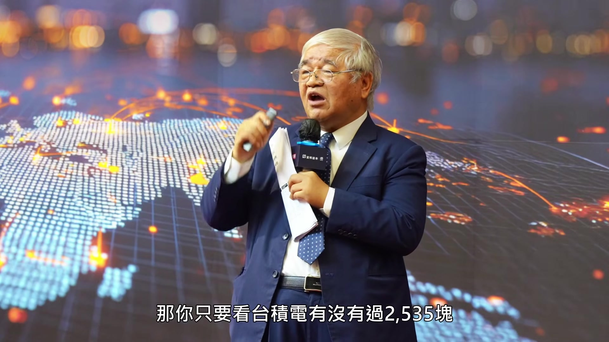

**逐字稿片段：** whether TSMC surpasses 2,535, the market will break through 48,000 or 50,000 points. Everyone remembers our Taiwan stock market from June and July; our market rose 6%in August while digital transformation stocks rose over 30%. From January to August, the market rose 59%, while digital transformation stocks rose over 170%, so we have slightly shifted from AI to digital finance. Finance has climbed higher this time, for instance, Fubon Financial has risen to 155.5. After the November 28th election ends, theoretically our stock market will continue to rally until next May, and

**話題推測：** 提及台積電（TSMC）股價與大盤指數的連動門檻（台積電2,535元）。

---

## 00:02:20

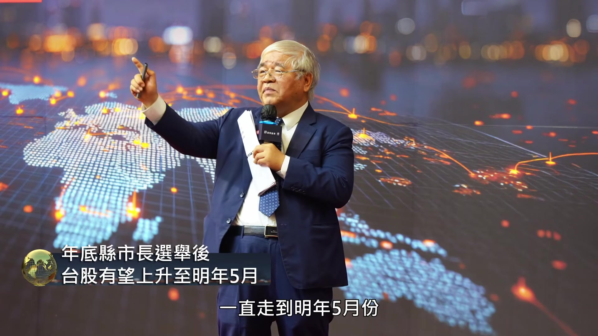

**逐字稿片段：** remember, next May marks a 55-month high. Looking at our index, we are currently about 600 points away from an all-time high; our maximum volume is

**話題推測：** 說明距離大盤歷史高點的差距與55個月高點的意義。

---

## 00:02:30

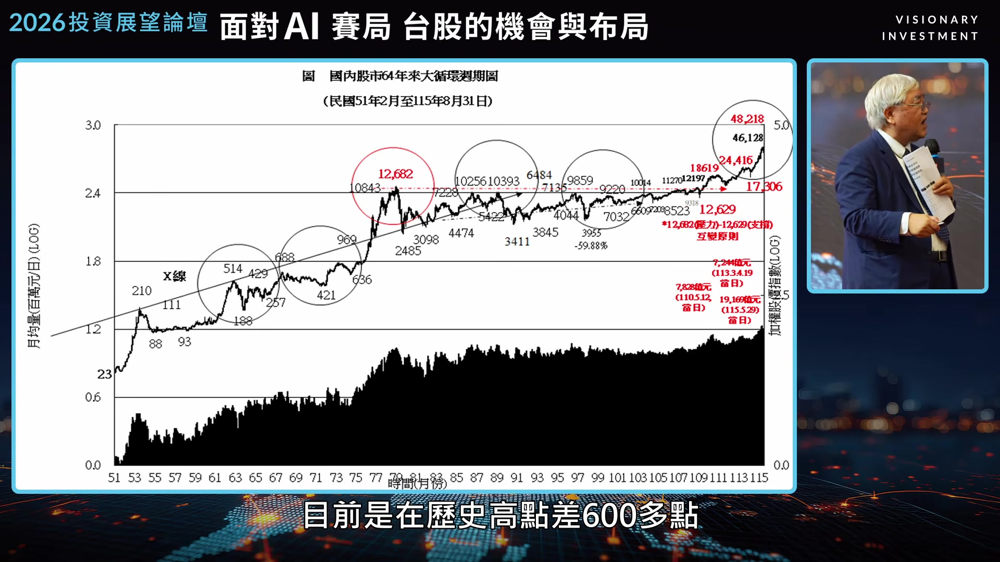

**逐字稿片段：** around 1 trillion, and our current volume is about 1 trillion, so if we reach 1.2 trillion in volume, the Taiwan stock market will break 48,000 or 50,000. We are currently seeing a bottom volume of around 800 billion; this bottom volume is quite solid, representing 50%of our June peak volume of 1.2 trillion, so 39,384 is our bottom volume, and 40,000 points will be the low of this wave; after consolidation at 40,000, staying above 40,000 marks the low of this trend. Therefore, when we see a pullback next May, the low will be above 40,000 points, and 40,000 times two is 80,000 points; this is our target. Regarding

**話題推測：** 分析市場成交量數據（目前1兆，突破1.2兆可破48,000/50,000點）。

---

## 00:03:17

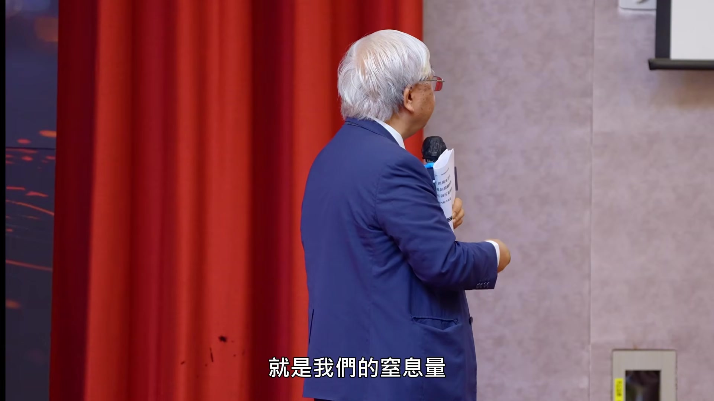

**逐字稿片段：** our Elliott Wave theory, we originally planned for a high point this year and another in May next year. We have now completely revised this wave theory; please look at the latest wave theory on the next page. Our projection for May next year is 50,000 to 53,000 points, followed by a correction to 40,000 points, and then a rise to 80,000 points between February and May of 2028. How did we project this? From

**話題推測：** 引入艾略特波浪理論（Elliott Wave theory）並表示已修正理論，將展示新圖表。

---

## 00:03:44

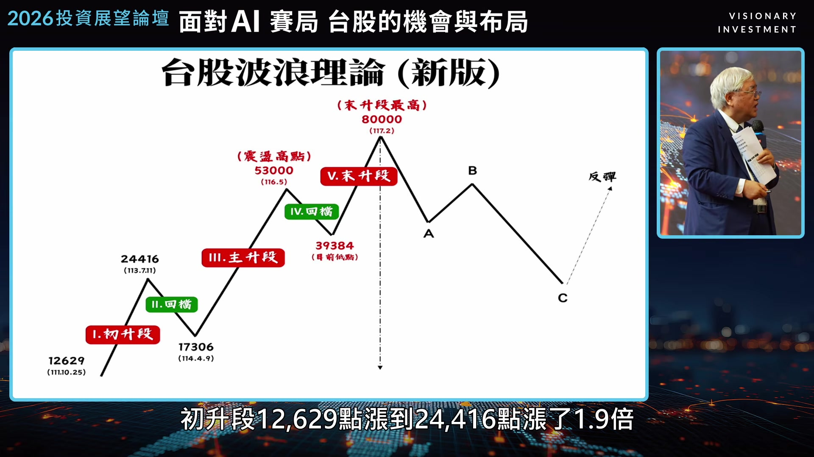

**逐字稿片段：** 12,682, it rose to 24,416, an increase of 1.9 times, with a 60%retracement. From 17,300, it rose to 53,000, a three-fold increase, followed by a 25% retracement. Then, from 40,000, it doubles to 80,000. So, the technique we use is the wave. Based on the percentages of the wave theory— doubling, tripling, then doubling again —we project this wave to reach 53,000 to 60,000 by May next year, rest at 40,000, and then reach 88,000 between February and May of 2028. At 53,000 points, TSMC will reach 3,000 NTD, and at 80,000 points, TSMC will reach 5,000 NTD. If TSMC reaches 5,000 NTD, that translates to over 89,000 points on the index. Next, let's look at the daily K-line of the Taiwan stock market. We are currently approaching 48,000, about 600 points away. Many are asking if it can hit 48,000 to 50,000 by the Mid-Autumn Festival around September 20th. I don't buy that, because I believe it's stuck in a box range. Remember, since breaking 40,000 on July 30th, it has bounced through 44,000, 46,000, and 48,000. It has passed 46,000, with a high of 47,500, just shy of a new high. It only needs to pull up TSMC to get there. However, since the volume is only around one trillion, you should view this as box-range consolidation. Personally, I think the Taiwan stock market will remain in a box range after the Mid-Autumn Festival , roughly between 3,000 and 3,000 points. So, this is my take on the market trend. In my top 20 foreign investment list, TSMC is first, MediaTek is second. TSMC is red. Look at the bottom right, number 19 is Quanta Computer. Remember the day Trump fell to the limit? Foreign investors were already buying Quanta. Then number 20 is Compal. All my stocks are among these 20. So, when people ask me what stocks to buy, just look at this chart, and that's it. Up to this point, we still firmly believe that AI remains a category worth investing in, but many might ask: with AI having risen so much and people discussing a bubble, has it truly reached a bubble state? First is

**話題推測：** 詳細解說波浪理論的各階段漲幅與回檔百分比（1.9倍、60%回檔、3倍、25%回檔等）。

---

## 00:06:10

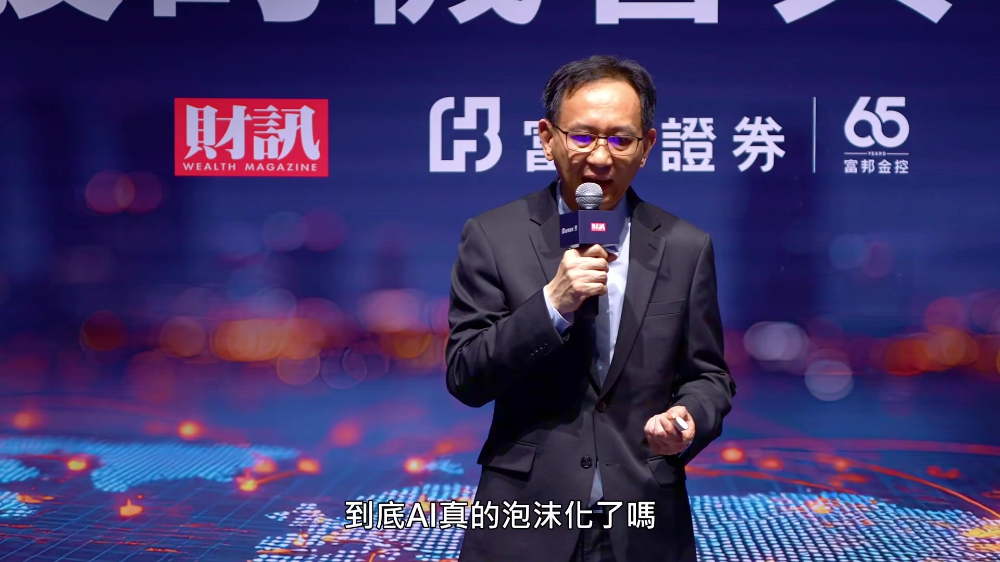

**逐字稿片段：** Meta, which is renting out or selling its computing power. When they purchase the latest AI servers, they can rent out their earlier, lower-spec versions to small and medium-sized enterprises or clients who don't actually require such high computing power. Therefore, their choice to rent out—or sell— that computing power at this time is, in my view, very logical and wise. Will this really bring them benefits? Will it lead to significant premiums, as Zuckerberg suggested? We looked at the years they invested and the prices of AI servers at that time, and using some simple assumptions to calculate depreciation, it comes to about 1.5 dollars. Adding electricity and other costs, I think 2 to 3 dollars should be

**話題推測：** 討論Meta公司租售算力的商業模式。

---

## 00:06:54

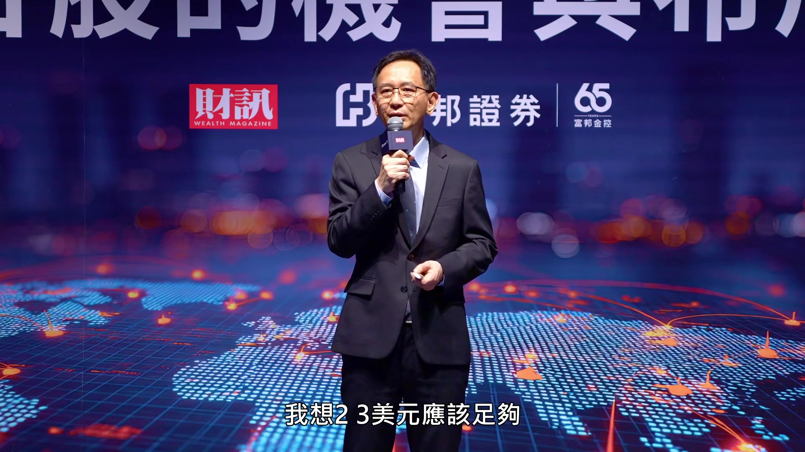

**逐字稿片段：** sufficient. Looking at the chart on the bottom right, this shows the latest AI computing rental rates in North America ; they were around 3 dollars mid-year, and now they have reached 5 dollars. So this will definitely generate profit for Meta; we estimate it could bring in at least 10 billion dollars in revenue and add at least 3 dollars to their EPS . This is actually how they are revitalizing their assets for better and more efficient use, rather than representing over-investment. Looking

**話題推測：** 明確提到「右下角這張圖」，展示北美AI算力租金費率。

---

## 00:07:20

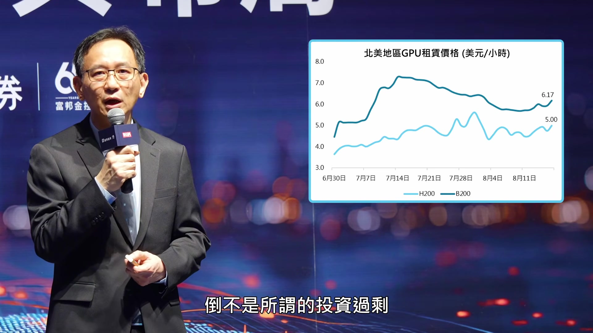

**逐字稿片段：** at the second-quarter earnings reports released this year, the capital expenditures of the four major CSPs are quite substantial. This year alone, these four companies have already exceeded 700 billion dollars, and next year it is estimated to reach 960 billion dollars, which is still a 35% growth. Such a large figure is truly difficult to imagine for anyone, regardless of whether it's for investment purposes. Because so much money is needed, we have seen these AI companies taking on a lot of debt this year, leading people to wonder if their finances are deteriorating from all

**話題推測：** 展示四大CSP業者（雲端服務供應商）的資本支出數據（今年逾7,000億美元，明年預估9,600億美元）。

---

## 00:07:51

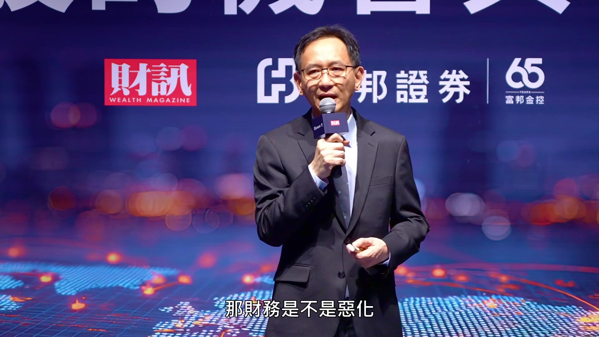

**逐字稿片段：** that borrowing. In particular, one benchmark stock among them, Super Micro , has a smaller capital base but wants to expand business, so it took on a lot of debt; as a result, it was downgraded . Its CDS surged to 200 because of this , which also drove up CDS prices for other CSPs and high-tech companies. However, we took a closer look, and the current debt of these four major CSPs is actually quite sound, with five-year CDS spreads ranging from 44 to 84, which is even lower than the 122 average for IG bonds overall. So, from this perspective, while they are taking on debt, we don't actually see any financial risk of a collapse. As for

**話題推測：** 以美超微（Super Micro）為例，說明AI公司舉債擴張業務導致的信用評級問題。

---

## 00:08:32

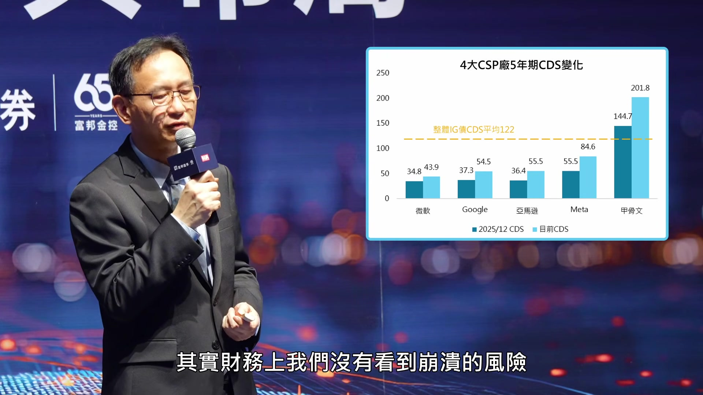

**逐字稿片段：** the aggressive low pricing of Chinese models, I personally don't see that as a negative factor at all. It’s like the Jevons paradox we mentioned before; the chart in the bottom right illustrates this example. When PC prices were slashed from $ 2,000 to $ 1,000 back then, the total value of the PC market actually grew from $ 120 billion to $ 220 billion. As prices fell, the market grew, embodying the concept of high-volume, low-margin sales. Therefore, I think the low-price competition from Chinese models is actually a good thing for stimulating AI adoption, as the biggest beneficiaries are consumers like you and me, or general small and medium-sized enterprises. So, regarding this race to capture the market with low prices, I am actually quite optimistic, because it can help grow the market as a whole. This last point is actually what I think we should focus on most, because in the capital markets, the most important metrics are the P/E ratio and whether stock prices are expensive; that’s what I believe everyone needs to watch to see if there is an AI bubble. We were actually a bit concerned about tech stocks in the first half of the year. Looking at the S&P 500 tech index, it reached as high as 32 times earnings, which is above the mean plus one standard deviation. This means that staying at such high levels for long is unlikely. But after the global stock market correction in July, combined with the very impressive earnings we've seen in the US market, share prices have fallen while profits have risen, so the calculated P/E ratio has actually become lower and lower. So we see that the current P/E ratio is actually below the mean minus one standard deviation. Applying the same logic as the previous example, it won't stay at this level for long, so we find the current position quite attractive.

**話題推測：** 引入「傑文斯悖論」（Jevons paradox），說明中國AI模型低價競爭的影響，並明確提到「右下角這張圖」作說明。

---

## 00:10:23

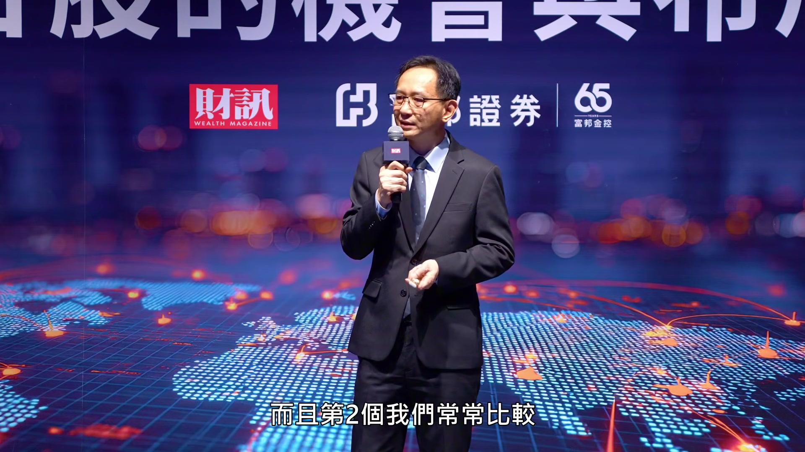

**逐字稿片段：** Secondly, we often compare the ROIC of tech stocks before Y2K with current ROIC levels. You can see in the chart at the bottom right that the dark green section representing pre-Y 2 K shows an ROIC of only about 9. The lighter fluorescent green section represents current AI, and it has actually doubled , meaning its return on invested capital is much more efficient. If we

**話題推測：** 明確提到「右下角這張圖」，比較Y2K前與當前AI科技股的ROIC（投入資本回報率）。

---

## 00:10:48

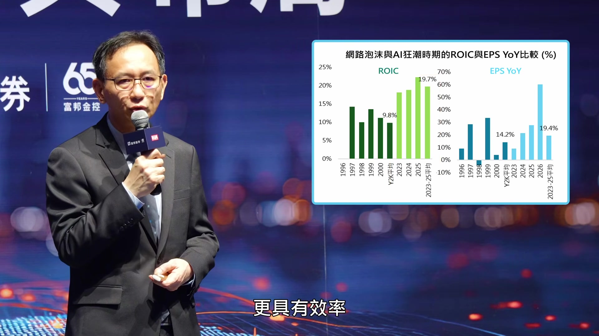

**逐字稿片段：** look at earnings growth, it was volatile back in the Y2K era with an average growth rate of about 14%, but since the recent surge, we have seen explosive growth from 2023, 2024, 2025, and into this year, 2026. Throughout 2023 to 2025, the EPS growth driven by AI has consistently shown an average rate far higher than that of the Y2K period. In short, the AI of today is genuinely stronger than the Y2K era in terms of both fundamental quality and overall strength. So, from this perspective, aside from valuation or stock price concerns, we haven't seen anything particularly worrying. The

**話題推測：** 比較Y2K時期與當前AI時代的科技股獲利成長率（14% vs 爆炸性成長）。

---

## 00:11:32

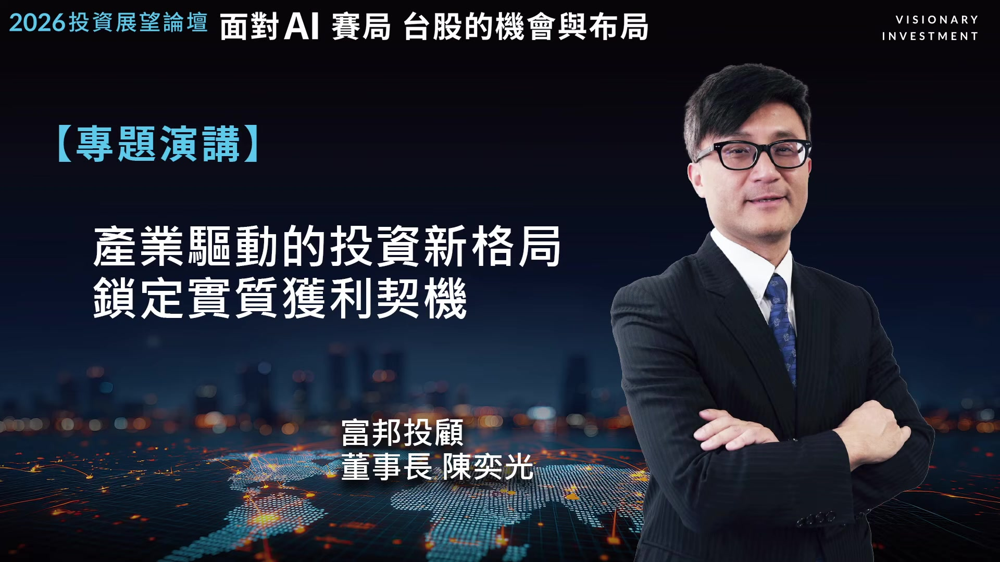

**逐字稿片段：** four stages of AI investment. Let's first take a look at the first part. Looking back at the entire electronics

**話題推測：** 介紹「AI投資的四大階段」的總覽。

---

## 00:11:40

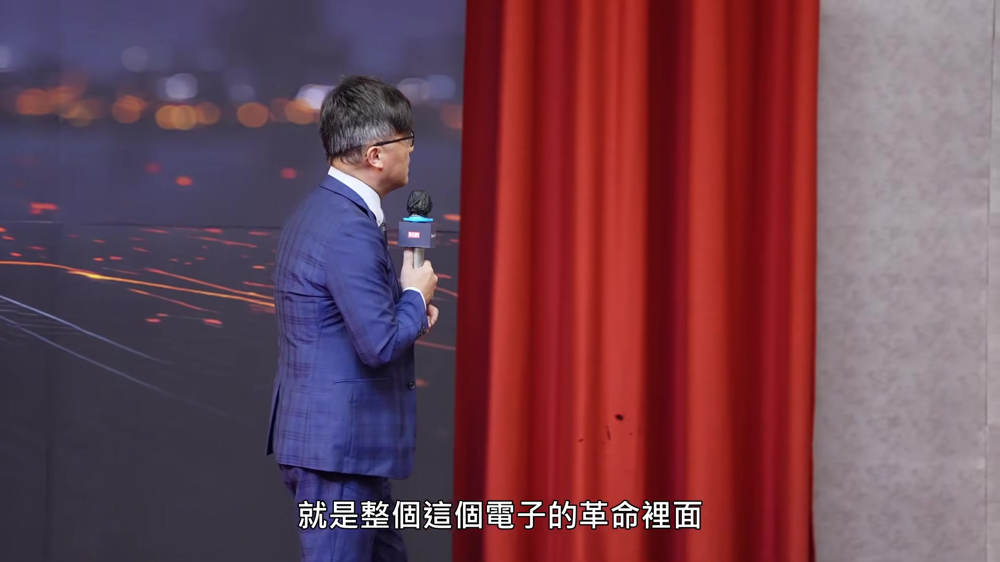

**逐字稿片段：** revolution, let's start with PCs and mobile phones, which we often use as examples: from 1994 to 2000, that seven-to-eight-year period was the peak of the PC era, while 2009 to 2016 was the smartphone era. So, if you look at the structure of tech hardware, it moves in seven-year cycles. Then, in

**話題推測：** 回顧電子產業（PC與手機）的七年週期，作為AI發展的借鑑。

---

## 00:12:00

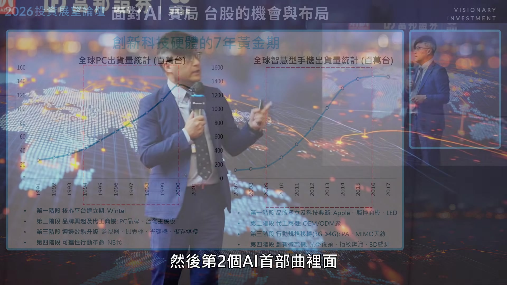

**逐字稿片段：** the second stage, the first priority is servers. You can see it in the stock prices of Nvidia and TSMC. Starting in 2023, TSMC’s EPS jumped from 50; this year it reached 100, 103, 104, with next year projected at 135 to 140, and the following year at 186. From this perspective, the first stage, spanning 2023 to 2025, should be driven by GPU computing power and server foundry services. Now, looking at the second

**話題推測：** 闡述AI投資第一階段「伺服器」的邏輯，並提供台積電的EPS預測（50、100、135、186）。

---

## 00:12:30

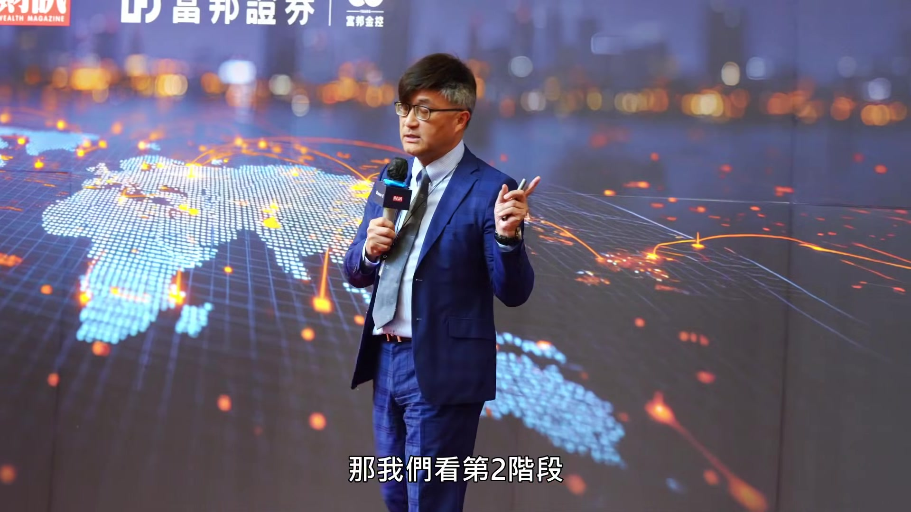

**逐字稿片段：** stage, power and utilities, I believe this is still underway because the current power shortage remains quite severe. Looking at the chart on the left, you can see that from 2026 to 2027 and 2028, the data center capacity being built is actually set to peak next year. So, you can see why TSMC's revenue can reach 514.8 billion; it truly reflects what CEO Wei said: orders are chasing your capacity. This is our perspective from the second stage, focusing on power and utilities.

**話題推測：** 轉向第二階段「電力與基礎設施」，並明確提到「左手邊這張圖」展示資料中心建置容量預估。

---

## 00:13:01

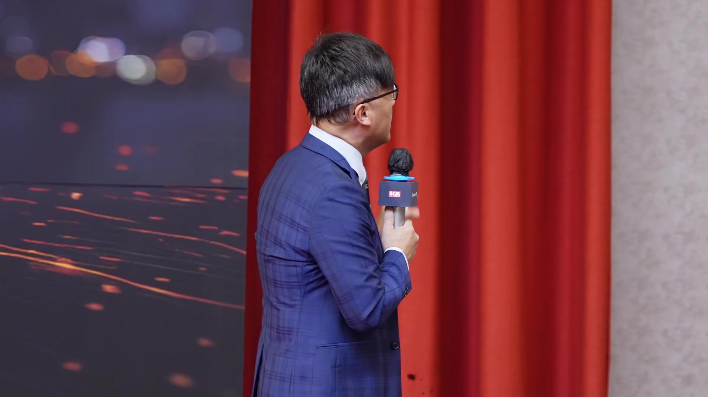

**逐字稿片段：** As for the third part, hardware architecture and key components, from the H200 to the B200 and GB200, you will notice the specifications constantly rising. Whether it's thermal management, cables, or power, these four areas are all critical. Any supply bottleneck is where the profit lies, which is why we now have over 50 " thousand-dollar" stocks in our tech sector; these are all places where the money is. Wherever your bottleneck is, you must find a way to overcome it. In the process of overcoming it, there are supply chain issues, so you can continuously expand your volume. Thus, you can see an overall component upgrade, from 18 to 22 layers, and now to 32 layers—this is the third stage

**話題推測：** 討論第三階段「硬體架構與關鍵零組件」升級趨勢，提及Nvidia H200、B200、GB200等型號。

---

## 00:13:49

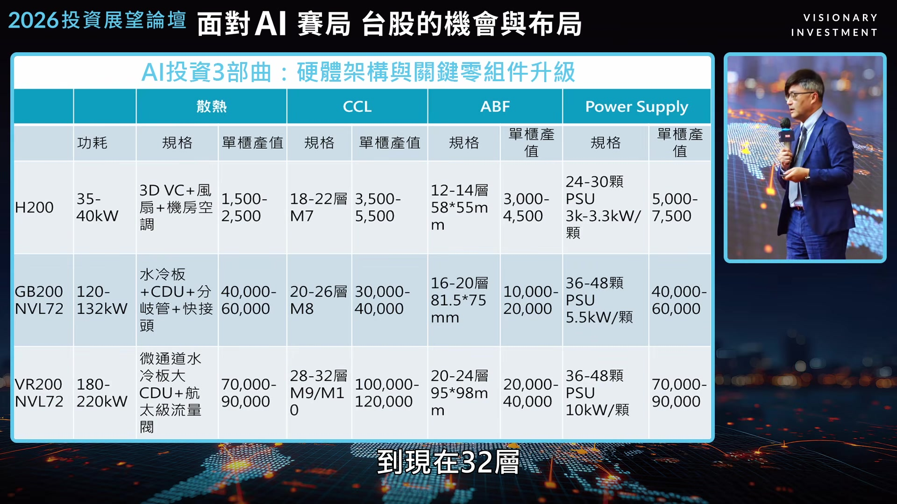

**逐字稿片段：** we see. Alright, the fourth stage is our next phase: humanoid robots. You can see the global market value in the bottom left corner here. By 2030, it will reach 35 billion USD, so the growth in this sector is actually quite

**話題推測：** 介紹第四階段「人形機器人」，並提及「左下角」展示全球市場規模預計（2030年達350億美元）。

---

## 00:14:04

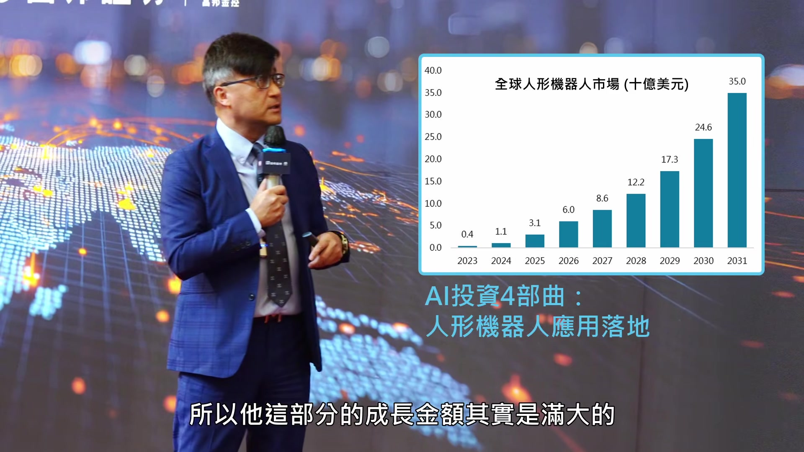

**逐字稿片段：** significant. On the right, we introduce the industry components, including the joints, the end effectors (hands), and the core sensing parts. This is the fourth part, and in 2027, we enter the physical phase, which is what we call the robotics sector. Now let's look at

**話題推測：** 介紹人形機器人產業的組成部件，如關節、末端執行器、感測器等。

---

## 00:14:20

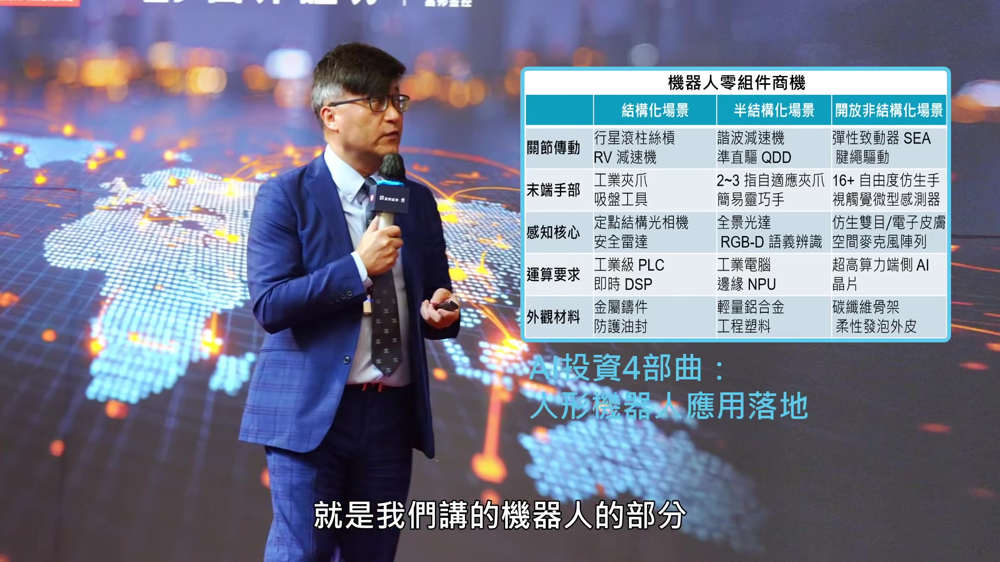

**逐字稿片段：** the final part: what is the logic behind our investment for the second half of the year? First, let's look at

**話題推測：** 引導至下半年投資邏輯的總結部分。

---

## 00:14:26

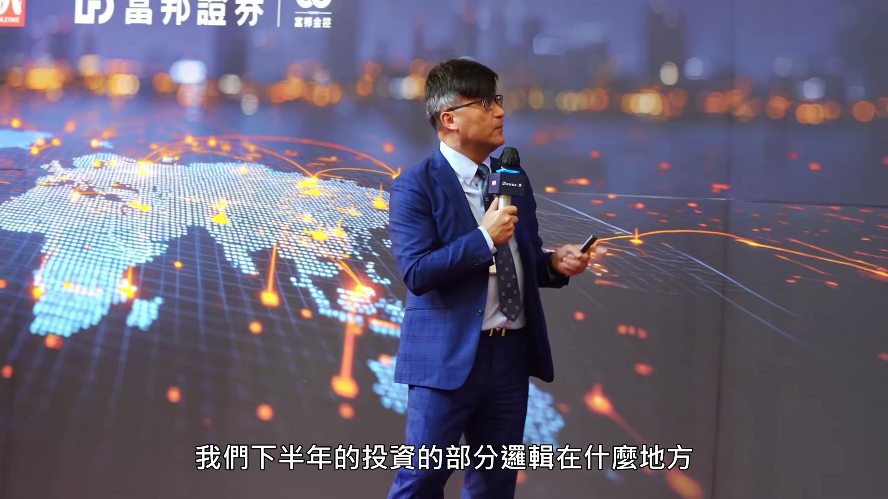

**逐字稿片段：** the US, which is currently engaged in buybacks. Buybacks mean they are repurchasing stock, and the total value should hit a record high this year. So you'll find that any market crash is actually a good opportunity to buy the dip. Second is the Fed Chair. His May

**話題推測：** 分析美國企業庫藏股（buyback）回購情況，預計今年將創新高。

---

## 00:14:45

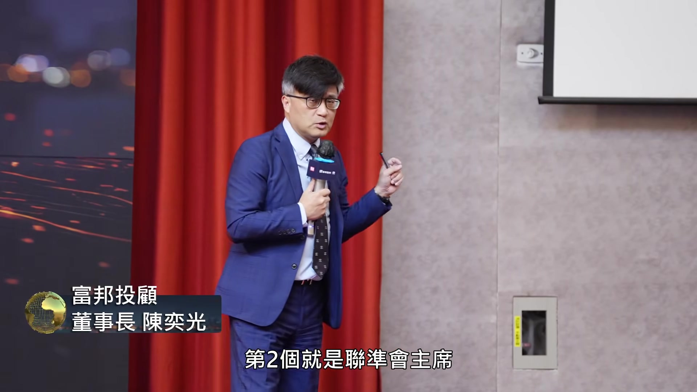

**逐字稿片段：** 22nd inauguration period has passed, and he has given three public speeches. There is significant pressure from the market and internal pressure from his superiors, so you'll find that everyone has high expectations for overall earnings. However, if you look at past new Fed Chairs, the stock market performance one, two, or three months after taking office isn't usually great , but over the following six months to a year, the performance is relatively higher. So, looking at it now, it's May 22nd. If you count until November, that's about half a year, and you'll find that the rate of return here has already started to turn positive. Looking at it from the perspective of historical overall averages, we can see that moving forward, the overall interest rate policy should tend toward more stability. Next are the elections

**話題推測：** 探討聯準會主席上任後的市場表現歷史數據。

---

## 00:15:39

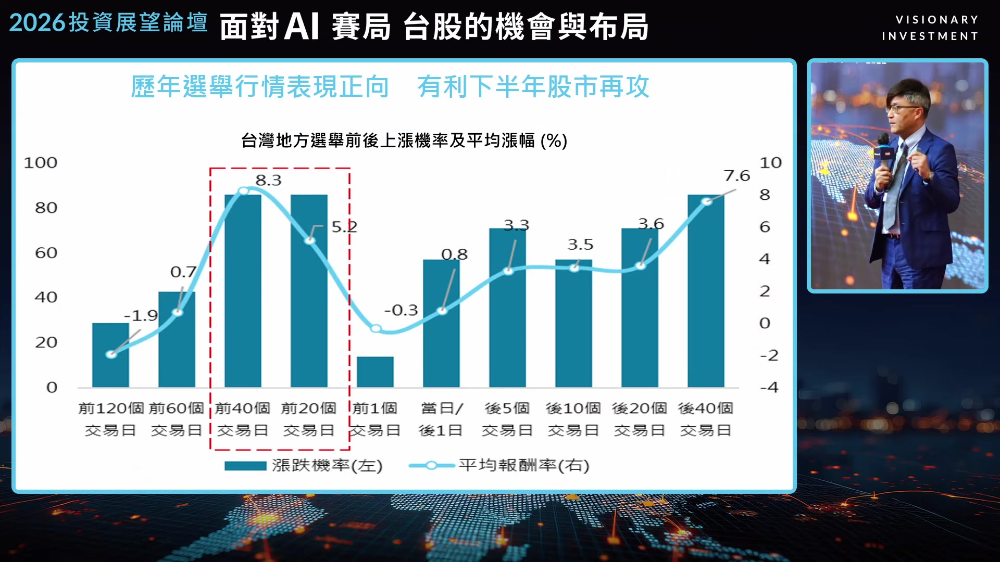

**逐字稿片段：** in Taiwan and the US. If you look at the 40 days and 20 days prior to past elections, the probability of a rise in the 40-day window is over 80%, with an 8.3%gain, while the 20-day window sees a 5.2%gain. In other words, in the month leading up to the election— specifically by October 28 th—my projection for the index is that it should cross 48,218 by October 14th. When the exchange rate was 32.5, the Taiwan stock market low was 39,384; at 31.7, the index was at 48,218. So, if you benchmark that, the current exchange rate is 31.6. Therefore, it will definitely cross 48,218. From a timing perspective, if you count 55 days from 39,384, it should reach October 16th, which is when it should cross 48,218. So, looking at the pre-election probability combined with the exchange rate index benchmarking we just mentioned, you'll see that's roughly the situation. On the right is the US. The pre-election gains there are also 4.9%, with the 20-day period performing better than the 40-day period, and the post-election gains are even larger. Okay, from this perspective, as we welcome the year-end "dream rally," it currently looks like the trend is headed upward. This unit

**話題推測：** 分析台灣與美國大選前市場上漲的機率與漲幅數據（選前40天80%機率上漲8.3%）。

---

## 00:17:03

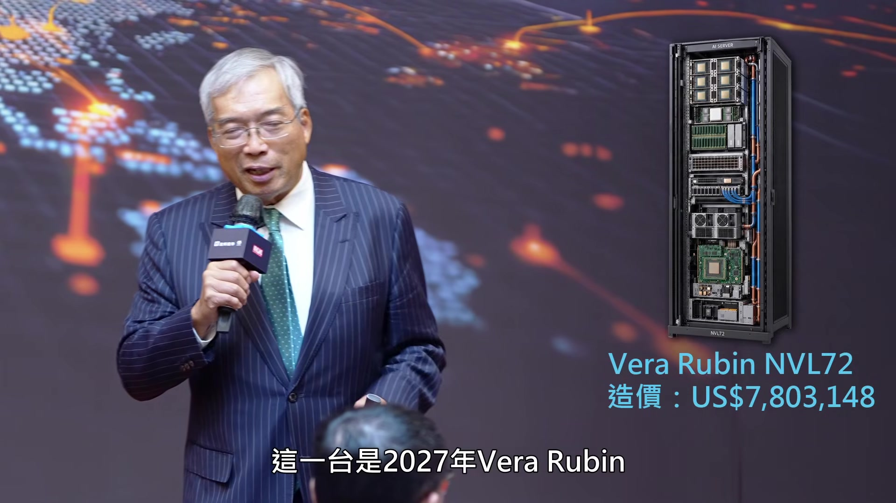

**逐字稿片段：** is the 2027 model, Nvidia's NVL72. The manufacturing cost for this server rack is $ 780,148 USD. From this server rack , you can calculate which Taiwanese industries will truly benefit. This is very crucial, so you need to look at

**話題推測：** 展示Nvidia NVL72伺服器機櫃（2027年模型）的製造成本（780,148美元）。

---

## 00:17:23

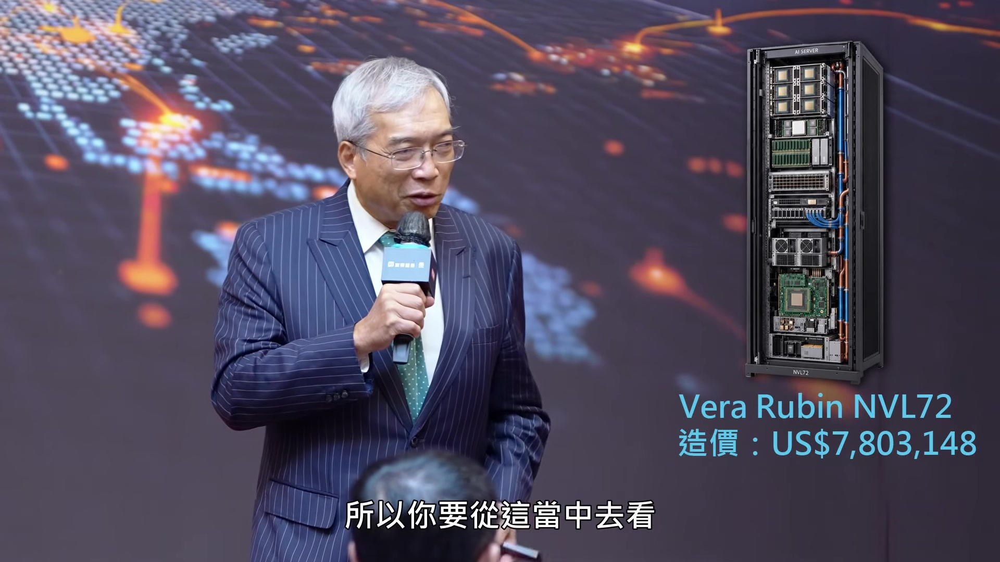

**逐字稿片段：** the first tier within it; the first one is the GPU, right? A single rack uses 72 GPUs. That is Nvidia's. Who makes Nvidia's GPUs? TSMC. So TSMC is definitely involved. Next, it requires 36 CPUs, Nvidia CPUs. That cost is $ 180,000. The third one is very

**話題推測：** 開始細部分析伺服器機櫃中的GPU數量與供應商（Nvidia, TSMC）。

---

## 00:17:48

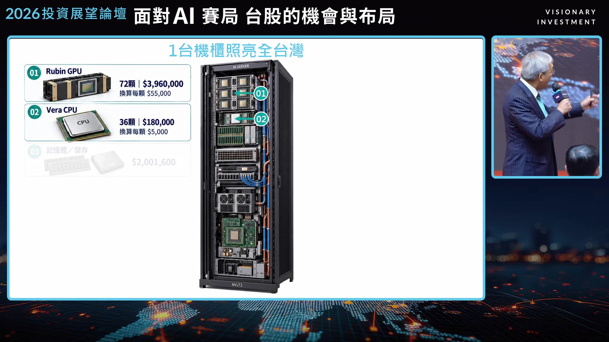

**逐字稿片段：** important: HBM, memory, and SSDs— specifically HBM and SSDs. Why are SK Hynix and Samsung doing so well? Inside that rack, the memory costs $ 2 million USD. So that $ 2 million is incredible; why? Within that third category, you identify three companies; why? The first is the one with the highest memory market share. Currently, SK Hynix has a 61%market share. Next are Micron and Samsung, both at about 21%, and then the three NAND flash memory players, including Western Digital and Japan's Kioxia, right? You have these seven companies sharing that two million US dollars mentioned above. So the pie is huge; moving to the fourth item, that’s called switches. For switches, the baseline is Accton, right ? And then, what's next after networking equipment? You see the cooling sector, right? 72,080. In cooling, you know why Auras has risen so much, including Kaori, and now Chaun-Choung, as well as Auras. They are all in that category. Next is power supply units, at 76,000 US dollars. What everyone sees now is mainly Delta Electronics, right? Looking further down, there's printed circuit boards, at 1167. For PCBs, the most impressive one you see is probably Gold Circuit. Gold Circuit is now at 10.8 billion a month; in fact, I see Compeq is at 10.3 billion. They both exceed 10 billion a month, which is historically unimaginable. You know EMC; they earned 9.7 billion in the second quarter, and I believe the third quarter will definitely start at 10 billion, including Lian Hwa, Tripod, and Elite Material Co. And then, how about the ABF substrate? Just over 20,000. That " just over 20,000" actually involves only three companies in Taiwan, including Unimicron, Kinsus, and Nanya PCB. Mainland China isn't strong in cooling either. Taiwan is uniquely strong. ABF substrates are held by Taiwan. Next, you see MLCC passive components, right? For this passive component sector, it's 4,320 US dollars . Passive components don't hold a large share of this opportunity. You remember how the market was hyping passive components too aggressively a while ago , right? They hyped Yageo to an unimaginable level, to 1,220 yuan, right? Actually, they don't have a high share in that opportunity, so after the recent fall, Yageo dropped quite deep. As for other components, like the King Slide you see now, it falls under the " others" category. Why? That server slide rail. That slide rail is like the one you have at home when you open your wardrobe, right? That's the one. That's why I say traditional industries must upgrade. If you just make them for kitchenware, you can't sell them for much, but now that you sell them as slide rails for server racks, they become expensive. Why? King Slide's revenue was 6.405 billion in July and 6.445 billion in August. It has been 6.4 billion for two consecutive months. Two strips of metal selling for 6.4 billion—that’s no joke. The final component at the end is 28,800, which is server assembly. This chart tells everyone that as long as AI remains the key momentum for future global development, Taiwan will surely remain in an invincible position. Currently,

**話題推測：** 說明HBM、記憶體與SSD在伺服器機櫃中的成本（200萬美元），並點出受惠廠商（SK海力士、三星）。

---

## 00:21:45

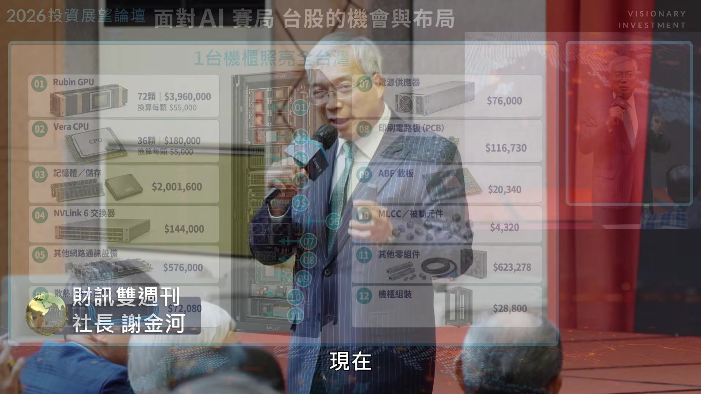

**逐字稿片段：** Taiwan's ICT products are at 251.8 billion with a growth rate of 5%, and electronic components and semiconductors are at 204.44 billion with a growth of 45.8%. If you add ICT and semiconductors together, it's 452.87. Look at the proportion of exports, see that? The rest are all quite small; after looking at this table, you'll know where we should invest our money, okay? First, let's

**話題推測：** 展示台灣ICT產品與電子零組件及半導體的出口額與成長率數據。

---

## 00:22:18

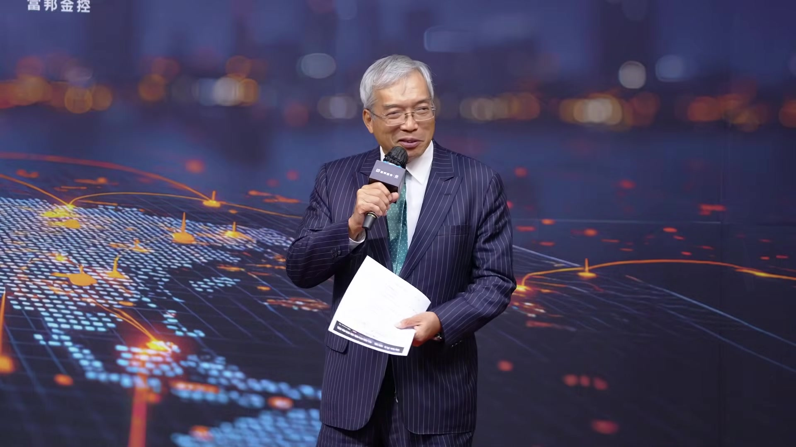

**逐字稿片段：** have Du Lao share the five best stocks for this year. My top holding is TSMC, likely around 50%, and second place would be MediaTek and Quanta. I bought Quanta well this time, and Delta Electronics has dropped quite a bit, taking a break, but I believe in "Three Tai, One Hwa." I didn't buy Taipower, though my daughter often day-trades it; then, I bought Nanya and Nanya Technology quite well this time, so for that spread, and financial stocks must be bought, so I bought them. I bought Fubon Financial, and for individual stocks, it's currently UMC and Innolux; I also buy some traditional industry stocks like cement and steel, and for cement, I bought TCC because they have a board election coming up, so the top ones we mentioned are TSMC, MediaTek, Delta, Nanya, and Nanya Technology; these are basically the individual stocks I hold. If the listed companies

**話題推測：** 杜老分享他今年看好的五檔股票，包含台積電、聯發科、廣達、台達電、南亞科、富邦金、聯電、群創、台泥等。

---

## 00:23:18

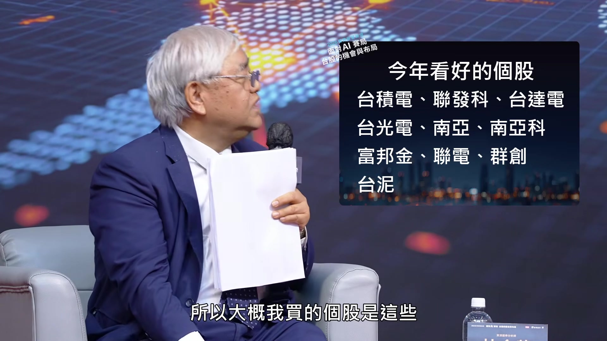

**逐字稿片段：** earn 8 trillion this year—let me clarify, brother Yi-guang—if they earn 8 trillion this year, what state will our entire market be in? Regarding the economic climate, it could reach 8.7 to 9 trillion; this is the first point, looking from the perspective of the economy, it should be quite positive. Second, from the perspective

**話題推測：** 討論上市櫃公司全年獲利預期（8兆至9兆）。

---

## 00:23:38

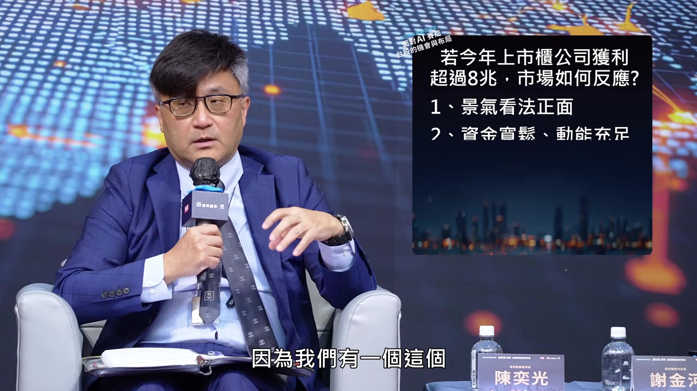

**逐字稿片段：** of capital, because we have relatively low interest rates, currently around 2.2%, the funding looks quite loose. Next, we have an excess savings of 9 trillion; I think the momentum of capital will be very, very strong. On the supply side, I think foreign investment net selling is mainly targeting arbitrage trading in TSMC and futures, that's first, and the second supply point is ETFs. For our ETFs, if I add up active, passive, and mutual funds, the current AUM or stock balance is around over 8 trillion. We’ve checked, and funds expected to be issued by year-end total around 500 billion, so the total AUM of these funds should reach 9 trillion by the end of the year. This supply of chips means retail investors are becoming a third force. Regarding our margin trading, it was at 610 billion in March and April; it’s now around 560 to 570 billion. There’s room for another 45 billion in margin growth. Since market value is roughly double the margin, if margin increases by 50 billion, retail investors could buy another 100 billion in market value by year-end. Looking at the overall economy, liquidity, and supply, I think there is a very high chance of surpassing 50,000 by year-end . Regarding the variables we face in the second half of the year, I would like to ask Vice President Chen to share his insights on these factors.

**話題推測：** 分析資金面狀況，包括低利率（2.2%）與超額儲蓄（9兆）。

---

## 00:25:00

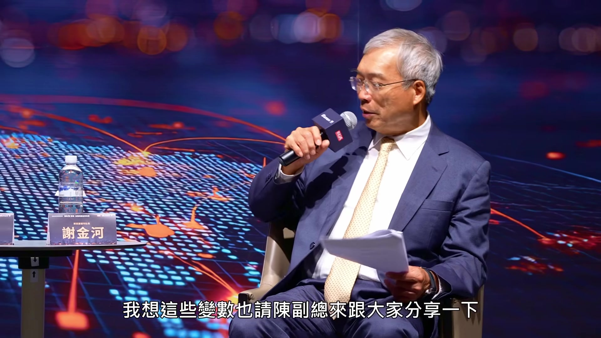

**逐字稿片段：** When we talk about the market, there are two factors: one driven by the macroeconomy, and the other driven by earnings reports. With earnings reports coming out in October and November, our profit estimates aren't as optimistic

**話題推測：** 介紹影響市場的兩大驅動因素：宏觀經濟與財報表現。

---

## 00:25:12

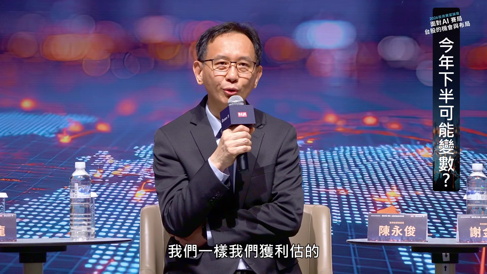

**逐字稿片段：** as the mayor's 8 trillion, but we are projecting around 7.7 trillion. We see the Taiwan stock market having a chance to hit new highs in the fourth quarter, and the S&P 500's fourth-quarter earnings growth is currently estimated to be over 25%, roughly between 25%and 30%. So, with the upcoming election market or fundamental earnings-driven market, we don't rule out the possibility of seeing 53,000 by the end of this year. This is our outlook for M.

**話題推測：** 副總陳分享對台灣股市獲利（7.7兆）與第四季新高預期，以及S&P 500第四季獲利成長（25-30%）。

---
