# wealth1974_VFecODa6O2E — 關鍵畫面索引

- 來源逐字稿：[wealth1974_VFecODa6O2E_GT.srt](wealth1974_VFecODa6O2E_GT.srt)
- 影片：https://www.youtube.com/watch?v=VFecODa6O2E
- 截圖數：14

## 00:00:04

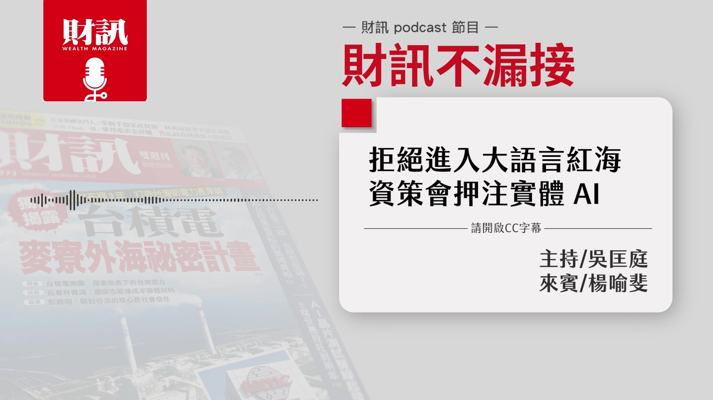

**逐字稿片段：** 拒絕進入大語言的紅海 資策會押注實體 AI 想要知道的聽眾朋友 記得聽到最後 今天的來賓是 財訊的撰述委員楊喻斐 各位聽眾大家好 我是喻斐 好 那也提醒大家 這是財訊的 Podcast 節目 如果是透過 YouTube 平台 來收聽的聽眾 可以打開右下角的 CC 字幕 那我們就開始吧 好 首先第一段 我們進入一下市場的動態 那最近我有發現 就是那個鴻騰科技 它有一個科技日 好像滿有趣的 我們知道 過去 6 年來 有所謂的鴻海科技日 旗下其實有很多的子公司 也會在這個時間共襄盛舉 不過從去年開始 它下面的子公司 叫鴻騰科技 就是 FIT 它決定要自立門戶 在台灣舉辦屬於它自己的科技日 那今年是進入第二屆 不過當然是沒有像 鴻海科技日來得這麼盛大 鴻騰科技日的時間 大概就是半日的時間 它沒有到一整天 不過這次很特別 是鴻海集團董事長劉揚偉 工業富聯董事長鄭弘孟 還有富智康的董事長黃英士 全部都到場支持 這個是很難得的 總共有 4 家上市公司的老闆 一同參加這個活動 就表示非常的力挺 那鴻騰科技它在做什麼 為什麼 它可以自己辦自己的科技日 然後大家又都來幫它站台 我們都知道 目前 AI 伺服器 主要的組裝 代工 製造 是放在工業富聯 還有鴻佰的身上

**話題推測：** 節目主題：資策會押注實體 AI

---

## 00:01:52

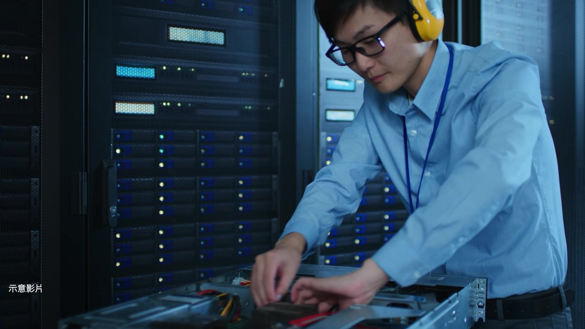

**逐字稿片段：** 鴻騰精密扮演的是 關鍵零組件的角色 一開始它是連接器起家的 像機殼 連接器 一些金屬相關的關鍵零組件 其實都放在鴻騰身上 那最近我們可以看到 鴻海在 AI 伺服器領域 積極地打造 垂直整合的供應鏈

**話題推測：** 鴻騰精密在 AI 伺服器供應鏈中的角色

---

## 00:02:14

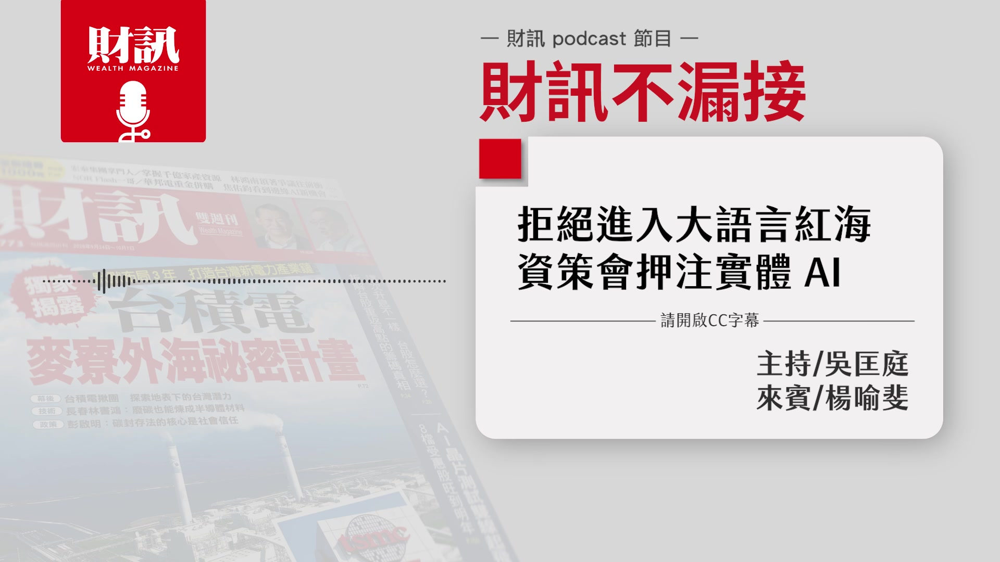

**逐字稿片段：** 鴻騰科技扮演的角色 就是散熱 做了很多散熱相關的 關鍵零組件 大家知道液冷散熱 需要的一些分歧管 跟金屬沖壓有關的一些 幾乎全部都是 鴻騰科技來負責 所以在液冷散熱這一塊 就是扮演很重要的角色 瞭解 那一天科技日 有沒有什麼特別的事情 可以跟大家分享一下 其實從去年 鴻海科技日 我們就有看到 光通訊的一個 CPO 的技術的展示 那今年鴻騰科技日 其實它鎖定的焦點 也是光通訊相關的領域 它希望可以做 相關的封裝 技術跟業務的開發 所以這次它請來的嘉賓 幾乎就是 跟它業務有往來的 像 Lumentum 的 全球業務副總裁 袁武鵬 歐司朗的光互聯業務的副總 叫做阿什坎．賽義迪 還有像 NTT NTT 主要是做 IOWN 也是跟光通訊相關的 它是請來了 創新設備株式會社的執行顧問 佐藤義明 所以我們就看到這些大咖 主題全部都是圍繞著光通訊 代表說接下來 是它們想要積極卡位的 一個新的戰線 再來還有一個話題是 Meta 在 9 月 8 日 它推出了 Muse

**話題推測：** 鴻騰科技在 AI 伺服器散熱領域的布局

---

## 00:03:43

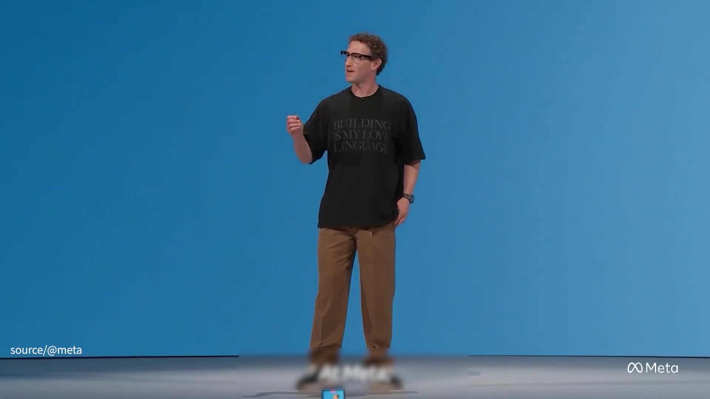

**逐字稿片段：** 推出後不到兩週 下載量就破 250 萬 大家就發現 Muse 它不但能夠跨帳戶地找資料 還可以填一些表單 還可以幫你整理信箱 當然也隨之而來 帶來滿多的一些風險 就是它可能亂下指令 或者是亂幫你訂東西之類的 不過根據 Meta 它們釋出的就是 它們這個 Muse 它們未來期待

**話題推測：** Muse 上線兩週內下載量突破 250 萬次

---

## 00:04:05

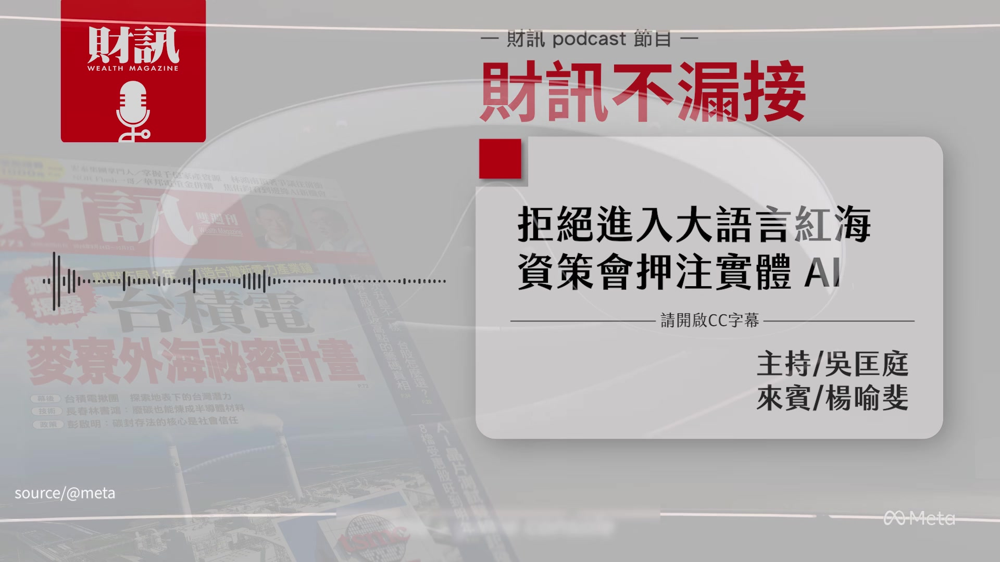

**逐字稿片段：** 是能夠在元宇宙 智慧眼鏡跟 Agent 它的 3 個路線 可以整合在一起 這部分喻斐有什麼 可以跟大家分享嗎 那一天才跟朋友討論說 LLM 最近好像安靜了一點 一講完 Muse 就出現了 所以我們也知道 就大語言模型的競賽 沒有放緩腳步 那 Muse 顧名思義 它就是繆思女神的一個命名 除了剛剛講到 比如說找資料 填寫表單 其實它可以幫忙付錢 但它很強調 它的安全無虞 就是為了這個 Muse 其實它在資安領域上 它也有下足功夫 那就是看 因為它也只有 在美國才可以使用 其實台灣 是不能用這樣的功能的 所以 不曉得接下來 它還會有什麼樣的問題發生 不過我們可以看到 就是 AI Agent 這個趨勢 就是銳不可擋 它就是一個 大家都想要押注的方向之外 它也是可以展示 自己軟體能力的 一個護城河之外 因為它也有智慧眼鏡 我們知道這一次

**話題推測：** Meta 將 Muse 整合至元宇宙、智慧眼鏡與 AI Agent 的策略

---

## 00:05:10

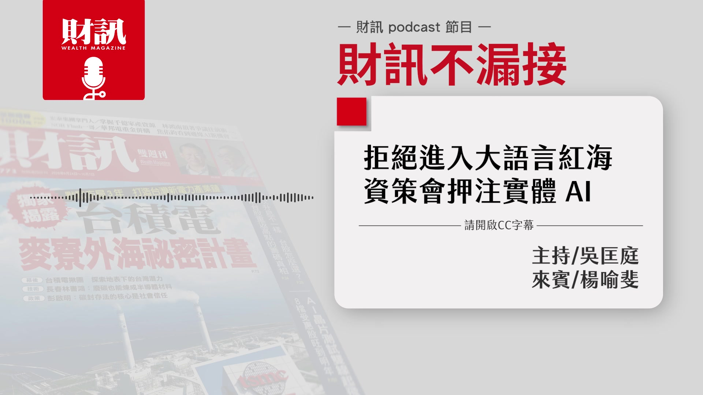

**逐字稿片段：** 它在 Connect 2026 年大會上 其實一口氣推出了 超多款的 AI 眼鏡 它喊話接下來 搭配像雷朋或是 Oakley 就是幾個品牌的 AI 智慧眼鏡

**話題推測：** Meta 在 Connect 2026 大會上推出多款 AI 眼鏡

---

## 00:05:24

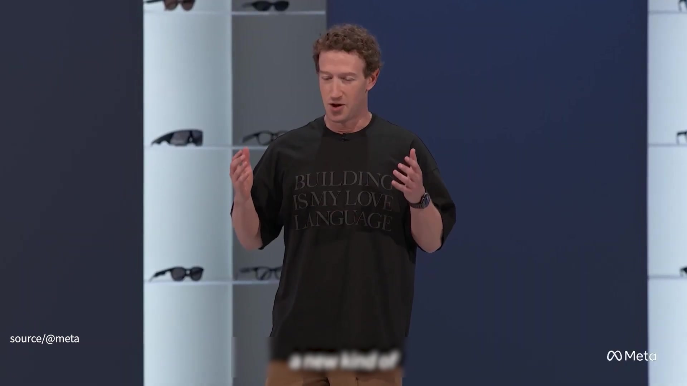

**逐字稿片段：** 至少會有 100 款之多 所以我們就看到 Meta 在眼鏡這塊 還是非常積極 然後它希望鋪更多的品牌 然後一起把它的眼鏡 加入更多年輕世代的 一個標準配備 那它也會搭載 它的 Muse 這個 APP 然後去做互動 好 最後一個 我們來看一下就是

**話題推測：** Meta 預計將推出超過 100 款與品牌合作的 AI 智慧眼鏡

---

## 00:05:48

**逐字稿片段：** 9 月 28 日世界先進 它跟恩智浦合資的 VSMC 首座的 12 吋廠 它在新加坡開幕了 這方面也請喻斐分享一下 這個對世界先進來講 意義重大 因為我們知道過去 世界先進跟台積電 它們會有業務的分割跟分工 基本上世界先進 就是只有 8 吋廠 那 12 吋廠的部分 就是全部由台積電來負責 這就是它第一座的 12 吋廠 而且是海外 所以我覺得這是讓大家覺得 對世界先進來說 是非常有指標性意義的 因為它終於蓋了 第一座 12 吋廠 而且它是全新的廠在新加坡 不過目前看起來 它還是 不是走先進製程 對 它是大概鎖定在 40 奈米以上 成熟製程為主 應用方面也不是走 非常先進的邏輯 AI 晶片 而是比較成熟的 相關的晶片的需求 當天其實滿多嘉賓都到了

**話題推測：** 新聞重點：世界先進與恩智浦合資的 VSMC 首座 12 吋晶圓廠在新加坡開幕

---

## 00:06:53

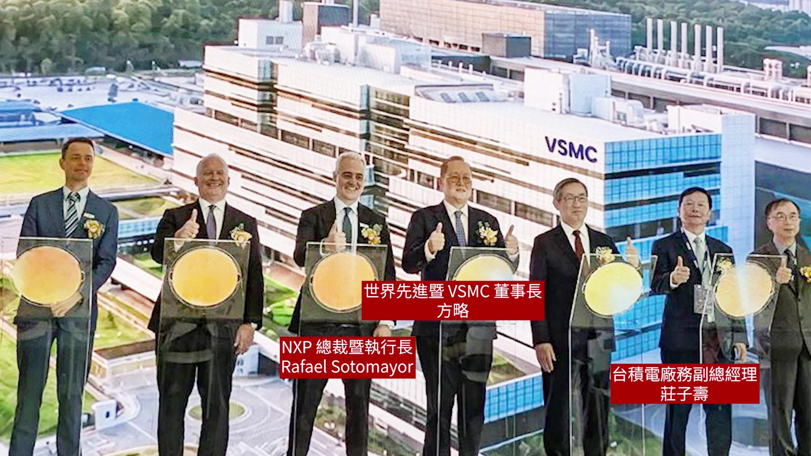

**逐字稿片段：** 世界先進的董事長方略 NXP 的執行長 然後新加坡政府 還有台積電 廠務副總經理莊子壽 其實很多人都到場 像我們台灣的設備廠商 漢唐 亞翔 高階主管其實都有去 是非常熱鬧的 感覺它們的目標也滿大的

**話題推測：** VSMC 晶圓廠開幕典禮出席貴賓名單

---

## 00:07:14

**逐字稿片段：** 就是在 2027 年要開始量產 然後 2029 年它預估 滿載的月產能有 4.4 萬片 感覺就是 AI 效應 持續擴散到成熟製程端 好 那我們接下來 就進入今天的主題 剛剛我們也有聊過就是 在 AI 的發展速度 很快的情況下 可能每個月就會有小更新 然後每季就會有大更新 半年就會迭代 這樣的狀況下 台灣的 AI 到底要怎麼樣 才能走出自己的路呢 我們剛剛講的就是 LLM 大型語言模型的競賽 真的是白熱化 而且大家也在做軍備競賽 的確以台灣的先天的條件來講 其實做大型語言模型 的確是比較挑戰的 所以我們這次有採訪到 資策會的人工智慧研究院 院長戴偉峻 他就有分享 他們當初做 AI 相關題目的時候 他就不是鎖定大型語言模型 因為他也知道 第一個 我沒有算力 第二個 台灣蒐集語料跟 Data 都有智慧財產權的問題 其實沒有那麼簡單 他們就換個角度想 到底他們可以做些什麼事情 我們知道就是 這兩年其實 生成式 AI 的應用 鋪天蓋地而來 它可以變成 很多人手上的工具 但是能夠真正讓公司 因為 AI 提升效率 甚至把它當成一個 獲利工具來講 其實 還是有一段路 資策會的任務 就是希望把這些 AI 能夠真正落地到各行各業當中 戴偉峻院長有跟我們分享 台灣目前最有機會的幾個項目

**話題推測：** VSMC 新廠預計於 2027 年量產，2029 年月產能達 4.4 萬片

---

## 00:09:03

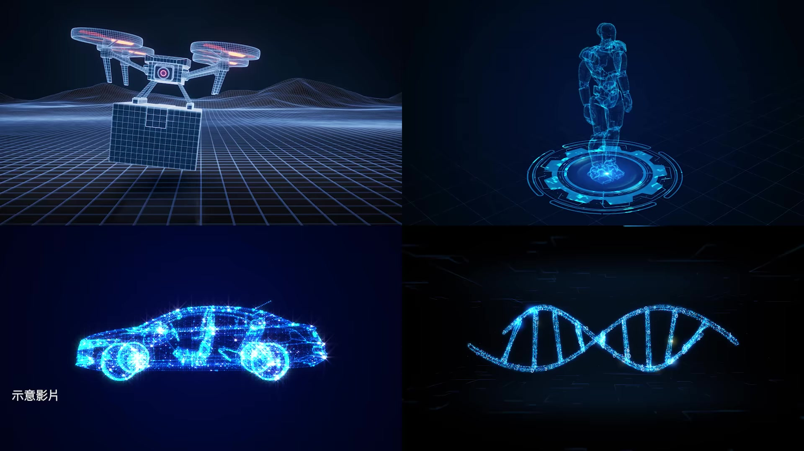

**逐字稿片段：** 包括無人機 機器人 自駕車 還有智慧醫療 我們可以做些什麼 在評測這一段 其實是很缺乏的 台灣過去很多東西 都是要送到國外去做評測 不管是自駕車 無人機 那做完評測之後 不見得可以掌握到 所有評測的結果 那他就有分享

**話題推測：** 資策會聚焦無人機、機器人、自駕車與智慧醫療等 AI 應用領域

---

## 00:09:26

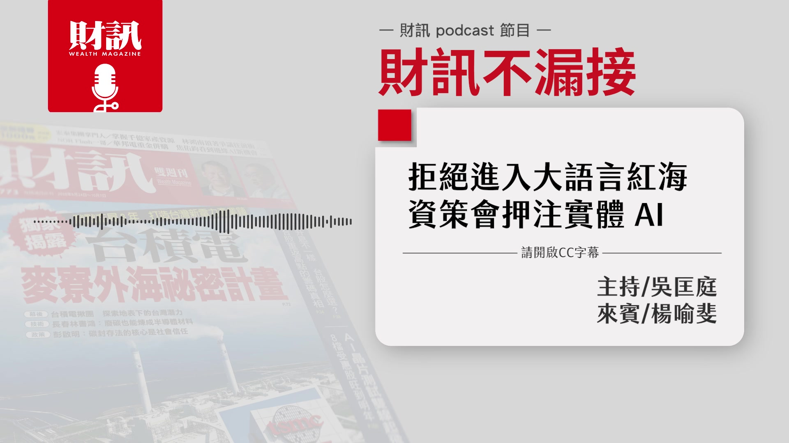

**逐字稿片段：** 第一個層級 就是出題目 那你考得好 我就知道大概你的層級到哪裡 但是這個太容易了 就是一般人都會做 那第二個 就是所謂的紅隊測試 透過誘導攻擊方式 找出一些系統的漏洞 第三個就是模擬環境測試 第四個就是實地的測試 直接把系統放在 真實場域的運作 那資策會它們主要是 朝哪一種測試方向進行 他選擇了第三種 就是模擬環境測試 他就有分享 譬如說森林大火的時候 我不可能真正 啟動一場森林大火 然後送 100 台無人機進行滅火 不太可能的事情 而且就是成本又很高 然後這樣的場域 到底要怎麼去尋找 大家想到的這些天災意外 不管是土石流 然後就像雪崩 或者是地震 各種東西 那實地測試的代價真的很高 現在有了 AI 就不一樣了 它可以去蒐集很多的資料 開始建模 它會模擬真正森林大火的時候 我的無人機 會面臨到什麼樣的問題 然後進行修正

**話題推測：** AI 系統評測的四個層級

---

## 00:10:42

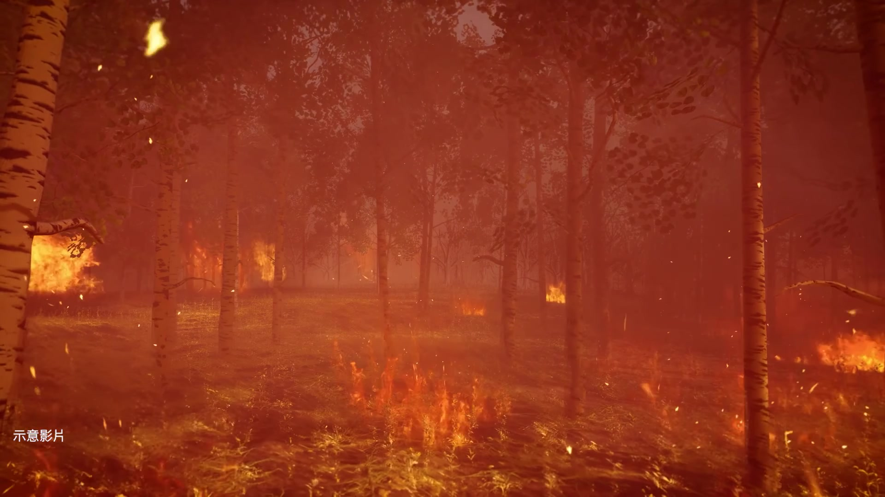

**逐字稿片段：** 透過像是數位孿生 這樣的一個技術 去做大量的測試 再把這個驗證結果 導入到真實的環境當中 嗯 所以感覺就是 它們走的路 不是大語言模型 而是要怎麼樣讓 AI 落地應用 那剛剛有提到 它們落地應用是著重在 無人機 機器人 自駕車 智慧醫療 那我們分別來看 那首先是無人機的部分 它們有做哪些努力

**話題推測：** 透過數位孿生技術模擬無人機於森林大火的應變測試

---

## 00:11:10

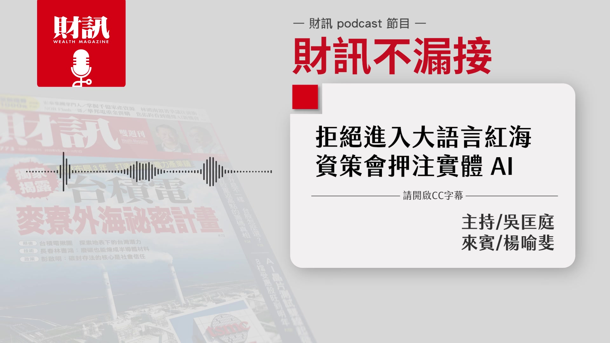

**逐字稿片段：** 未來無人機 它會從單機智慧 走向群體智慧 就是它們彼此是可以溝通 交換資料 而且自主做出決策 資策會的角色就是希望 可以幫這些無人機 做到群體智慧這樣的階段 結合像 AI 通訊 控制與模擬環境的綜合考驗 去幫它設計它的系統 因為以前好像就是 無人機一台一台都單點 那你那一台被擊落 或者是被軟殺 它就失去功能 那你如果變成群體智慧的話 那或許戰力可以再更提升 對 它會協作 其實就是更聰明 就可以達到需要的效果 那再來就是自駕車 這個在美國應該是 有一定規模跟成熟的發展 但如果要在台灣應用的話 感覺比較困難一點 對 我們也知道 像美國地廣人稀 它隨便找一個地方 就可以一直測 我們也知道特斯拉的自駕車 光是在德州 愛怎麼測就怎麼測 可是在台灣你看 還要特別是半夜的時段 然後特別的路徑 但是自駕車已經談非常久了 我不曉得各位聽眾應該 有這樣的技術以來 我看應該走了 有沒有 10 年的時間 但是台灣目前還是 還是沒有辦法上路 資策會也是想說 到底要怎麼幫助 這些自駕車業者

**話題推測：** 無人機從單機智慧走向群體智慧的發展趨勢

---
