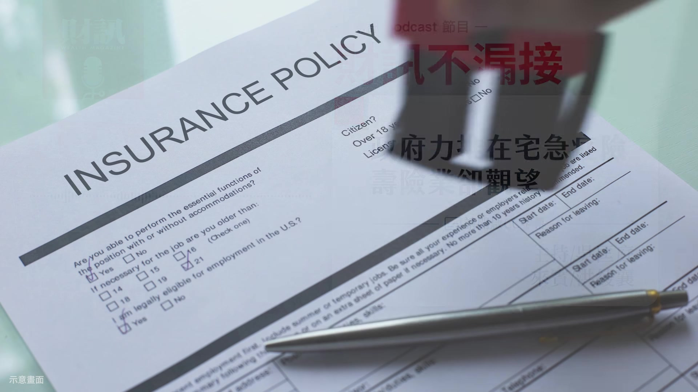
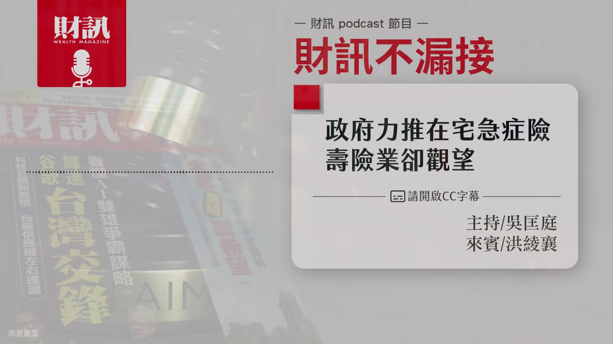
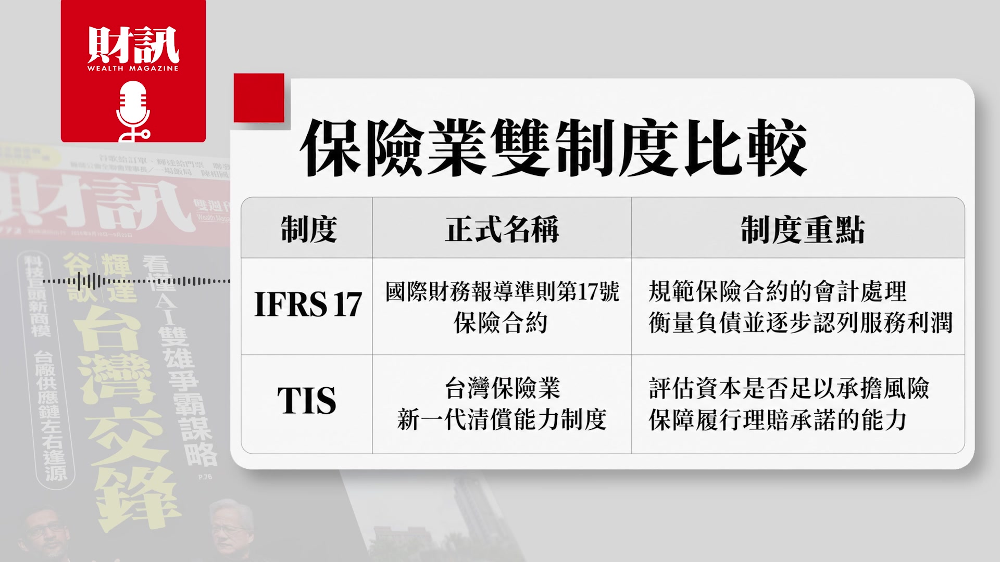
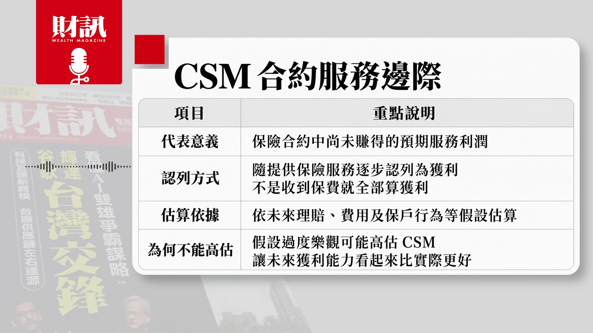
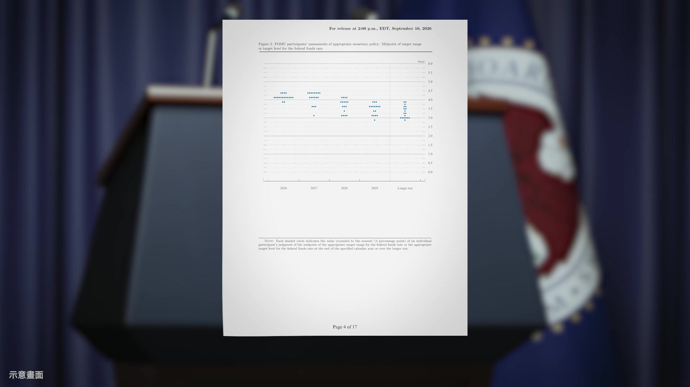
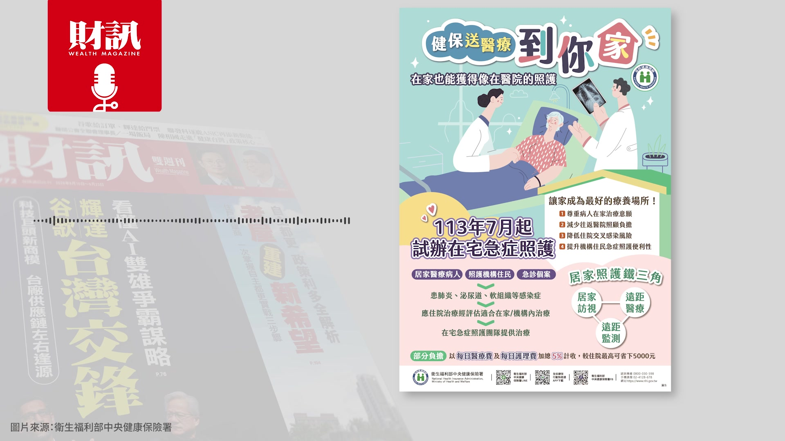
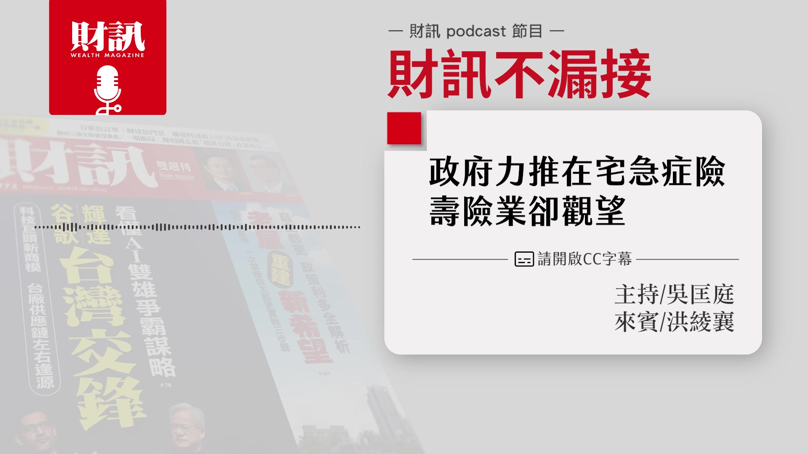

# wealth1974_X9BmCSkTuyw — 關鍵畫面索引

- 來源逐字稿：[wealth1974_X9BmCSkTuyw_GT.srt](wealth1974_X9BmCSkTuyw_GT.srt)
- 影片：https://www.youtube.com/watch?v=X9BmCSkTuyw
- 截圖數：29

## 00:00:03

**逐字稿片段：** 政府力推在宅急症險 壽險業卻觀望 想要知道的聽眾朋友 記得聽到最後 今天的來賓是 財訊的副總編輯洪綾襄 各位聽眾朋友大家好 我是綾襄 好 節目開始前也提醒大家 這是財訊的 Podcast 節目 如果是透過 YouTube 平台 來收聽的聽眾 可以開啟右下角的 CC 字幕 那我們就趕快開始吧

**話題推測：** 介紹影片主軸：政府推動在宅急症險，壽險業觀望

---

## 00:00:26

**逐字稿片段：** 首先第一段 進入我們的市場動態 那最近市場上或路線上 有沒有可以跟聽眾朋友 分享一下的呢 好 因為我的路線 主要是金融保險這一塊 有一些事情可以跟大家分享的 首先就是 最近大家有沒有發現 就是你去申請保險理賠的時候

**話題推測：** 節目進入第一段「市場動態」主題

---

## 00:00:42

**逐字稿片段：** 拒賠的狀況好像愈來愈多了 而且很多人 都去跟保險公司打官司

**話題推測：** 提及申請保險理賠拒賠狀況增加的現象

---

## 00:00:47

**逐字稿片段：** 金融評議中心它有統計 就是現在很多 醫療就是自費或是健保給付 那有些人認為說 自己有買了保險 特別是實支實付險 就可以用雜費去補 可能譬如說用健保的醫材 或是健保的給付的項目 就已經很好了 但是保戶他們就覺得 我們有保險 那我們就要用最貴最好的 進口的這些醫材 可能過去只要醫生認可 那就會被視為是必要性醫療 那保險公司它就會去理賠 但實在是現在的醫材 真的是愈來愈貴了 然後很多保險公司 它們開始縮手 我聽說有些保險公司 它們的實支實付的保單的損失率 已經將近 200% 了 就是它只要賣 1 張 它就賠 1 張這樣子 大家都是會拜託醫生 然後醫生也是醫者父母心 就會說好 能寫我就會幫你寫這樣子 所以保險公司不堪其擾 所以就開始愈來愈多拒賠的狀態 那保戶當然不開心 他們就會想說就去告 先從金融評議中心 然後後來就去法院那邊告這樣子 所以實在是太多了

**話題推測：** 引用金融評議中心的統計數據

---

## 00:01:44

**逐字稿片段：** 1 年可能法院那邊有好幾千件

**話題推測：** 提及每年法院處理數千件保險訴訟

---

## 00:01:46

**逐字稿片段：** 所以說呢 就是金管會它最近發函 就是告訴說 就是保險公司 它一定要落實辦理 在招攬醫療險的時候呢 一定要提醒保戶 到時候呢 它們理賠會以參考 醫學專業的意見來審核 是否是必要性的醫療 另外也要求保險公司要在網頁 還有續保通知這些文件裡面 要加強宣導 這表示說 金管會要提醒民眾 保險公司有可能不會理賠 你之前所申請的項目 大家也必須要瞭解到 其實這是個時代的一個趨勢 那當然這個之後會怎麼樣發展 我們也會持續幫大家看這樣子 那另外一個就是說 金管會它除了 就是在看這個商品之外 也開始加強對於壽險公司的

**話題推測：** 說明金管會對醫療險招攬發函要求

---

## 00:02:26

**逐字稿片段：** 財報監理這個部分 那雖然說就是今年 就是已經有 就是接軌了國際雙制

**話題推測：** 討論金管會加強壽險公司財報監理

---

## 00:02:31

**逐字稿片段：** 就是 IFRS 17 還有 TIS 就是新一代清償能力的這樣要求 那現在它們也要求說 就是要強化保單的合約利潤

**話題推測：** 提及接軌IFRS 17和TIS等國際會計準則

---

## 00:02:41

**逐字稿片段：** 也就是 CSM 這塊的那個數字 不可以浮報 因為其實大家發現說 就是壽險公司 它們可能會一直對外宣稱說 因為它的醫療險 這些高 CSM 特定這些保單呢 賣得很好 所以我 CSM 今年 可能可以賺個幾百億元這樣子 然後對 我們明年不一定要增資 這樣的 這種言論就出來了這樣 金管會它們就是希望說 不要造成市場有這樣的誤解 所以它就會特別說 要針對特定的險種的 CSM 的假設呢 要把它放在 TIS 就是新一代清償能力制度裡面的 一個自有資本計算 它的公式也會在未來逐步明朗 那這樣很好啦 對我們來說就是 因為其實很多人都說 壽險公司的財報就是一個魔法書 很多人都看不懂這樣子 所以說 愈清楚 資訊愈揭露得愈清楚 其實是愈好的一件事情這樣子 不過也是有好消息 雖然你好像監理這邊是在收緊 但是呢 今年壽險業的 前 8 月的新契約保費收入

**話題推測：** 解釋保單合約利潤（CSM）的重要性

---

## 00:03:33

**逐字稿片段：** 已經破兆了 而且是達到了 對 就是 1 兆 542 億元 那它年增率是 6 成 就終於就是有比較多的收入進來 不再像前幾年 都是那個保費淨流出的一個狀態 因為其實之前有滿多人 會去把保單贖回 然後或者是拿去投資股市 或者拿去買房子 壽險公會它其實就分析說 其實這一波呢 買氣比較熱絡的其實是投資型保單 對 那因為就是投資市場很熱絡 壽險公司它就跟銀行 還有投信的一些通路合作 所以它今年其實帶動這一波銷售業績的 其實是投資型保單這樣子 好 好 那最近其實 國際上滿熱的話題就是 國際央行週 不管是美國 日本 台灣 都央行利率決議會出來 美國先出來 9 月 16 日 FED 在 FOMC 的會議 它們是一致決定要升息 1 碼 那就會升息到 3.75% 到 4% 的利率區間

**話題推測：** 公布壽險業前8月新契約保費收入已破兆元

---

## 00:04:30

**逐字稿片段：** 那根據它們的預測點狀圖來看 有 18 位官員中 有 16 位預期年底 至少還會再升息一次 就可以看得出來就是華許 他還是認為美國經濟很強勁 所以它們是有升息的這個底氣的 升息也僅僅是收回部分的寬鬆 日本跟台灣也都有動作 綾襄可以跟大家分享一下

**話題推測：** 提及點狀圖顯示官員對未來升息的預期

---

## 00:04:53

**逐字稿片段：** 好 那 9 月 17 日的下午 那央行的理監事會 楊金龍總裁呢

**話題推測：** 報導台灣央行9月17日的理監事會決議

---

## 00:04:58

**逐字稿片段：** 他是宣布 其實利率是不動的 他也適時的再次的放寬 選擇性信用管制這個部分 他除了就是第二戶的可貸成數呢

**話題推測：** 說明台灣央行宣布利率不動

---

## 00:05:08

**逐字稿片段：** 從之前的 6 成 就把它提高到 7 成 你就可以多借一些錢了這樣子 那另外他還刪除了 就是之前會要求建商 它就是在撥款之後 18 個月內 一定要動工這件事情 他就是說有考量到 缺工缺料這些問題 所以就不逼著建商 一定要趕快在 1 年半的時間之內 一定要動工這樣 但是楊金龍他非常重視的就是說 他還強調我們現在利率 還是偏緊的一個狀態 那包括就是我們最近也討論到 如果你要去借錢的話 其實利率是偏高的 甚至很可能借不到錢這樣子 那另外就是日本的話 日本是在 9 月 18 日的早上呢

**話題推測：** 具體說明第二戶可貸成數從6成提高到7成

---

## 00:05:44

**逐字稿片段：** 它宣布了升息 1 碼 本來之前大家是很擔心說 日本央行會不會有比較顯著的動作 就是會把日圓 有一個急升的機會這樣子 討論這件事情其實是擔心

**話題推測：** 說明日本升息1碼的具體行動

---

## 00:05:53

**逐字稿片段：** 過去有一個日圓的那個套利交易 就是借便宜的日圓 然後去投資日股 兩頭都賺這樣子 但是現在呢 日圓看起來好像只有升息 1 碼 就不如預期 所以說這個套利交易的平倉潮 可能就是不會出現 大家就反而還好 所以說 9 月 18 日這一天的 那個國際股市 其實看起來還是風和日麗的一天 對 好 那接下來就進入 我們這一次的主題 有看到綾襄這一次寫的文章 就是有發現在 2024 年起 已經滿久一陣子了 就是健保署它們當初大力在推動 在宅急症照護試辦計畫 但一直到了今年 7 月底 已經過滿久 才終於有壽險公司申請試辦計畫 可以先跟大家說明一下 目前的狀況大概是怎麼樣嗎 我們其實台灣 有 20-30 家保險公司 但是目前只有國泰 富邦 南山 這三家來申請試辦 它們其實就是響應健保署推動 這個在宅急症照護試辦計畫 其實這件事情更早的原因

**話題推測：** 解釋日圓套利交易的背景

---

## 00:06:53

**逐字稿片段：** 是疫情期間 就是很多人他們可能因為染疫了 但是他們就沒有辦法去醫院 或是進去醫院很麻煩 所以他們只能在家裡面 但他們還是需要有一些醫療照護 或是申請理賠

**話題推測：** 追溯在宅急症照護試辦計畫起源於疫情期間

---

## 00:07:05

**逐字稿片段：** 當時為了這個防疫險的 大家應該還心有餘悸吧 就是不管是搶辦還是要搶理賠 那個時候其實非常的麻煩 另外其實還有一個大環境的因素 為什麼我們要做在宅急症照護 這件事情就是因為 我們其實已經進入了 高齡化的 少子化的一個社會了 對 我們醫護人力 其實是非常的短缺的 所以它們就覺得說 其實如果是一些急重症 與其說就是一直 頻繁來醫院 舟車勞頓 還不如就是說在醫生的許可之下 在家裡面你就可以進行治療 和恢復的一個狀況這樣 當然就是政府有做這樣的試辦 那當然它也希望說 如果可以的話 保險公司也能夠 提供金融的一個支持 因為以往可能我們的健康險 都是要住院 在醫療院所接受的醫療照護 你才能夠申請理賠 那如果你在家裡面的話 插管或者是敷料這些的 如果沒有其他的金融支持的話 你全部都要自費的話 其實對民眾來說 也是滿大的一個負擔的 政府它做這件事情 以比較社會福利的角度 去做在宅急症照護這件事情之外 也希望民間的金融機構 也能夠響應這件事情 但是真的就像匡匡剛剛講的 就是拖了很久 終於國泰 富邦 南山這三家 來進行來試辦這樣子 那其實這個也呼應了一件事情 就是醫療的型態 已經開始去中心化了 那過去醫療就是要以住院為主 那現在就是開始要遠距在宅 這樣的一個方向去做這件事情 聽起來就是政府當初在規畫 或者是當初立意是很良善的 不過為什麼拖了這麼久 到現在為止只有三家試辦 我看到就是文章中有寫 富邦有推出安心在家保單 那主要問題是卡在哪裡呢 因為其實我們也是聽說 其實壽險業它們就不想做 有一家壽險公司 他直接就是那個商品部的主管 他直接跟我們講說 1 年多前就是政府找他們去談 而且他們是跟衛福部談 然後他們一聽就講 不行我們不能參加 就是一聽就是賠錢的商品這樣子 而且尤其一年前 保險公司它們其實財務的壓力 都滿大的 力不從心 它們沒有辦法去響應這樣子 而且在宅急症照護 這樣的一個保單好像很簡單 但其實要做整個配套 你要想說就是其實就是把你 在醫院能夠享受到的一切的服務 你在家裡面也要能夠實現 比如說你是像這個肺炎好了 你可能需要做呼吸器的治療 要有人送一個呼吸器去你家 我確認你的狀況之後開藥給你 或者是做什麼樣的處置 這其實真的是一件不容易的事情 而且醫生就算不到你家 那也要有清晰的設備

**話題推測：** 提及過去防疫險理賠的經驗

---

## 00:09:40

**逐字稿片段：** 遠距聽診或者是監測的一些儀器 那這些誰來做呢 保險局副局長他就有講說 其實這些就是所謂的 遠距醫療設備 還有相關的服務的這整個配套 這些配套呢 保險公司它們也要做系統的開發 確保說就是這個過程中 保險業務員如果他們要賣這些保單 給他們的保戶的時候呢 他們會不會講錯 給他們的保戶過多的期待 如果不講清楚的話 可能會造成後面理賠的麻煩這樣子 他們就說其實因為 這個也是新的業務 健保署它自己 就沒有很多的前例可以循 沒有前例可以依循的話 它們就沒有辦法計算發生率

**話題推測：** 說明遠距聽診、監測儀器等設備需求

---

## 00:10:18

**逐字稿片段：** 也沒有辦法計算損失率 沒有這兩個數字 它們就沒有辦法確認說 那我這個商品要訂多少價格 簡單來說它們就很怕 像之前防疫險 像一賠下去就是賠到它們破產

**話題推測：** 強調缺乏發生率和損失率數據難以定價

---

## 00:10:29

**逐字稿片段：** 這樣子 3600 億元就這樣沒了 對 所以說就是為什麼 就是背後它們會拖這麼久的原因 瞭解 感覺就是 相關的配套措施還沒有想好 然後遠距醫療的相關的設備什麼 也都還沒有健全 那我們詳細檢視一下 目前有三家願意試辦 當然三家試辦它們的商品是 僅限於肺炎 尿路感染 還有軟組織感染 這三大急症 而且是 1 年期的保單 不保證續保 那為什麼會有一點受限的感覺 剛剛也提到就是健保署它們 開辦的這一個所謂的 在宅急症照護試辦計畫 這個裡面它就是只有 納入這三個急症而已 所以說就是能夠取得數據 也就這三個 剛剛也提到就是說 其實這幾年才開始的計畫 所以說這個數據非常的少 所以它們業者就是已經 勉為其難接手來做這個燙手山芋了 它們當然也就想說 就是先以這個試水溫這樣子 所以其實我也問了 另外一家壽險的財務長 他就說既然有同業願意做 那就好 我們就幫它拍拍手這樣子 而且因為其實新的保單 它們可能隨時都要改款 每一次商品的改款 都要重新申請再上架 然後才能銷售 與其這樣子的話 那我們就在這個部分 我們先當個後進者好了 所以這個是其他業者的一些想法 那其實如果是說民眾這邊的話 如果說要講到在宅醫療的保單的話

**話題推測：** 提及防疫險賠付3600億元的慘痛教訓

---

## 00:11:46

**逐字稿片段：** 其實他們想要獲得的是癌症 對 還有失智這個部分這樣子 這些事情就是也很困難 因為其實老實說 癌症或是失智 並沒有在健保的理賠的項目中 如果還要把它弄到在宅那邊去的話 那可能又有新的理賠項目要去核可 這個整個架構 其實是要變化很快的 所以說就是民間的需求 和就是目前政府開放的 會有這樣一個 沒有辦法對接的一個狀態這樣子

**話題推測：** 指出民眾期待在宅醫療保單能涵蓋癌症和失智等疾病

---

## 00:12:15

**逐字稿片段：** 那我們綜合盤點下來 跟這個採訪下來 如果之後要繼續推 這個在宅急症照護險的話 可能會碰到哪些瓶頸呢 對 其實剛我們一開始就有講到 台灣的那個高齡少子化的一個狀況 實在是真的 就是生不如死的一個狀態這樣子 但是目前就是保險 就是畢竟它是一個支持的一個商品 它是支持性的金融 它就需要很多精算 數據來去支持 它才能去設計這些商品 但是健保署的資料要不要開放 開放到哪裡 然後納入哪些病症呢

**話題推測：** 總結在宅急症照護險推行的瓶頸

---

## 00:12:48

**逐字稿片段：** 權責是在衛福部 那有金管會和內政部這邊 它們能夠扮演什麼樣的角色 其實這很困難 保險公司它作為民間機構 它更困難 因為它還要跟社會大眾 還有股東交代這樣子 它不能夠隨便開發一個賠錢的商品 那如果能夠理賠的話 那到底是由保險公司來決定呢 還是醫院來決定 還是民眾去申訴 然後打官司 由法官來決定 剛剛也提到了 有關於就是保險的訴訟 就是愈來愈多了 就是很複雜的狀態 因為這個參與者實在太多了 然後另外就是我們剛剛也有提到 就是在宅醫療為優先考量的 一個治療的方式的話呢 那我們這個基礎設備 可能還沒有備齊 像我們醫院它在協助一個病人 治療和照護然後到他痊癒 這個鏈是非常的長的 這個服務鏈都非常長 那整套服務呢

**話題推測：** 指出衛福部、金管會、內政部等多方權責協調困難

---

## 00:13:34

**逐字稿片段：** 會由健保和商業保險共同分擔嗎 還是說健保出比較多 然後商業保險是補充的呢 還是就健保它只出最基本的 然後其他全部都是去看 這保戶他自己有沒有辦法 買到多少商業保險來負擔 其實是沒有共識的 還有就是保險公司 它到底怎麼認定 這個是叫「必要醫療」 如果在國外的話 美國的話 因為它們的保險公司 跟它們的醫療體系 結合非常的密切 醫生他可以依據這個保戶 他有哪些保險 然後來決定他的治療方式 所以它們會有那種什麼 醫保或是社保的特約醫院 如果你要申請某一項保險理賠 你是某一家保險公司的保戶的話 你就去它指定的醫院去治療 那邊它們就會有 適合你保單理賠的一套治療的服務 對 那但是台灣不是 台灣就是你走進任何一家醫院 然後任何一家醫院的收據 然後保險公司都得賠給你這樣子 那到底你遇到的是什麼樣的醫院 像我剛剛看到一個 就是保險論壇上面大家在討論 一個鼻中隔的手術 竟然要價 32 萬元 就是你會覺得說 不是就是開一下嗎 但我看到就是 譬如說他還打了血小板 還打了什麼生長激素幫助他恢復 然後還用了微創的一個方式這樣子 然後如果說是癌症的話 那是救命 那我們再另論 那這是鼻中隔的一個手術 他需要開到 32 萬元嗎 那中間這些項目 是不是必要性醫療呢 就是社會的期待和觀念 都還有很大的一個空間 要去磨合 去討論的啦 對 那第三個當然就是

**話題推測：** 提出健保與商業保險分擔服務成本的困境

---

## 00:15:00

**逐字稿片段：** 政府醫界還有保險業者 還要再建立共識這樣子 這也是保險業者 它們沒有辦法再多做一點的原因 因為它們沒有辦法計算說 我要多做到哪裡才是邊界 對 所以保險業者有它為難之處 那每一個人都有 他們想要爭取的部分 那我們也是 也是只能 就是希望大家能夠趕快有一個共識 聽起來就是要推行的話 還有滿多的問題需要釐清 設備 配套 還需要完整的規畫 各界還需要凝聚共識 不過我們也可以看到 其實不只是台灣 就是在國際上就是 在宅醫療感覺 它的趨勢已經是愈來愈明顯的狀態 那如果之後我們要持續的發展的話 有什麼樣的建議呢

**話題推測：** 強調政府、醫界、保險業者需建立共識

---

## 00:15:40

**逐字稿片段：** AI 愈來愈普及了 可能應用愈來愈廣 那可能未來就是說 你真的可以不用去醫院 你在家裡面 就可以租一個照護機器人 或者是一些遠距醫療 就可以來照顧你這樣子 但是呢 現在目前這些很多的 就是遠距醫療的一些輔具 設備 視訊 其實是沒有在保險的給付項目裡面的 不管是保戶他要不要買這個保險 或者是保險公司要不要開發這個商品 都是一個滿大的一個阻力啦 高齡少子化一個狀態之下呢 就是在宅醫療 它勢必還是得要 就是往這個方向去推廣 國際機構它們有推估 就是如果在宅醫療這件事情 能夠再推廣下去的話 那美國聯邦的醫療保險的一個費用 可能有至少 4 分之 1 可以移至住家 那其實這可以幫每個國家的財政 節省非常多的一個支出 它以美國的聯邦醫療的保險

**話題推測：** 展望AI在在宅醫療中的應用潛力

---

## 00:16:31

**逐字稿片段：** 它規模大概是 2650 億美元 有 4 分之 1 就可以移到住家去 那其實對美國來說 其實是一個滿大的一個緩解

**話題推測：** 具體提到美國聯邦醫療保險規模約2650億美元

---

## 00:16:40

**逐字稿片段：** 那另外又就是台灣產業 因為台灣真的在宅醫療 能夠發展起來的話 其實台灣產業有很多的商機 因為台灣對不管是 AI 或者是資通訊 然後還有就是生理監測 輔具這些 還有所謂的行動診間 我們很快都可以依照需求 然後幫你打造出 設計一套 solution 出來 但這個過程中 就是會有很多磨合啦 那中間我們還是要大家一起來找 發展的一個方向 好 那今天感謝綾襄的分享 那聽完今天的節目 你會想要投保在宅急症險嗎 歡迎大家留言分享你們的想法 如果還想瞭解更多的內容 歡迎點選資訊欄中的文章連結 或是購買財訊第 772 期的雜誌 跟我們一起追蹤政經趨勢 掌握投資脈動 《財訊不漏接》我們下次見 bye bye

**話題推測：** 分析台灣產業在在宅醫療發展中的商機

---
