# wealth1974_c68PvMZYzOo — 關鍵畫面索引

- 來源逐字稿：[wealth1974_c68PvMZYzOo_GT.srt](wealth1974_c68PvMZYzOo_GT.srt)
- 影片：https://www.youtube.com/watch?v=c68PvMZYzOo
- 截圖數：48

## 00:00:28

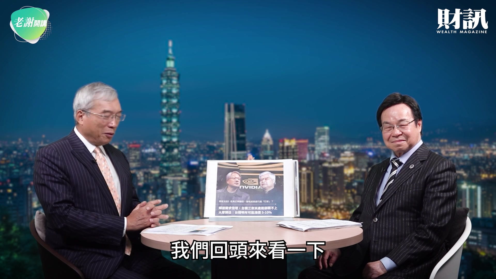

**逐字稿片段：** 在這張圖表當中 大家都記得黃仁勳 在 2023 年的 5 月 27 日（口誤） 到台大參加畢業生的畢業典禮 他在畢業典禮上致辭 正式揭開 AI 的新時代 從 2023 年到現在 在 AI 的賽道上 AI 的軍備競賽 台灣是全世界最重要的心臟

**話題推測：** 介紹黃仁勳與AI新時代的圖表

---

## 00:00:47

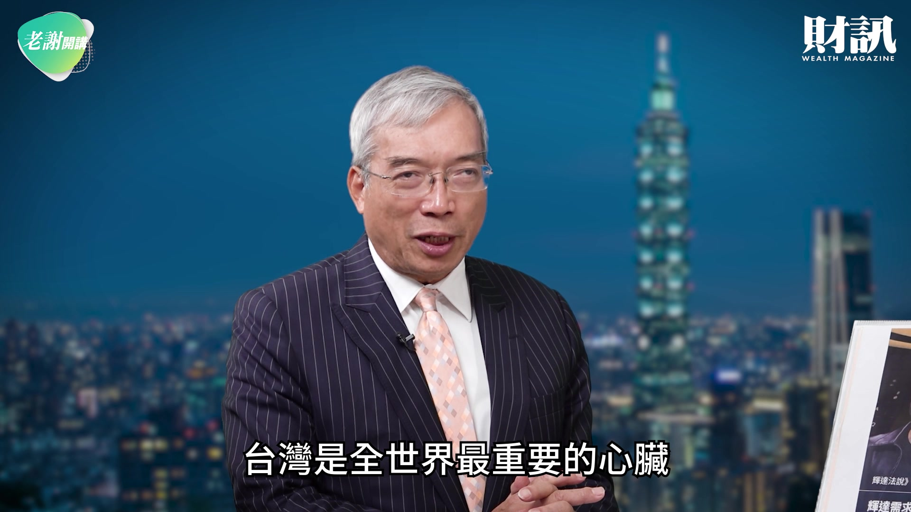

**逐字稿片段：** 我們看到台灣 在上半年的全體上市櫃公司 賺了 3.67 兆元台幣 這個比去年同期 成長 95.3% 這個在歷史上是難以想見 台積電成為護國神山

**話題推測：** 台灣上市櫃公司上半年獲利數據圖表

---

## 00:01:00

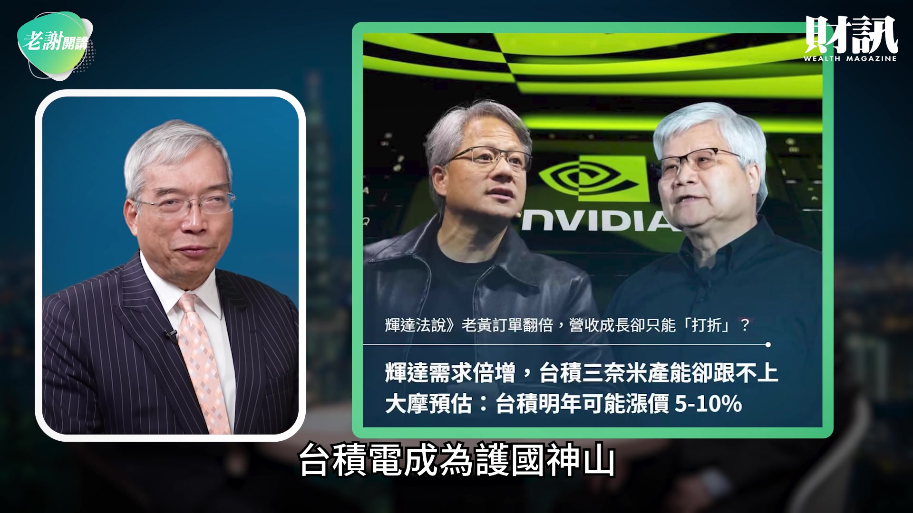

**逐字稿片段：** 現在它成為 全世界第六大的公司 全世界都在不斷地 建置資本支出 亞馬遜到微軟 再到 Google 一直到 Meta

**話題推測：** 台積電成為全球第六大公司的資訊

---

## 00:01:12

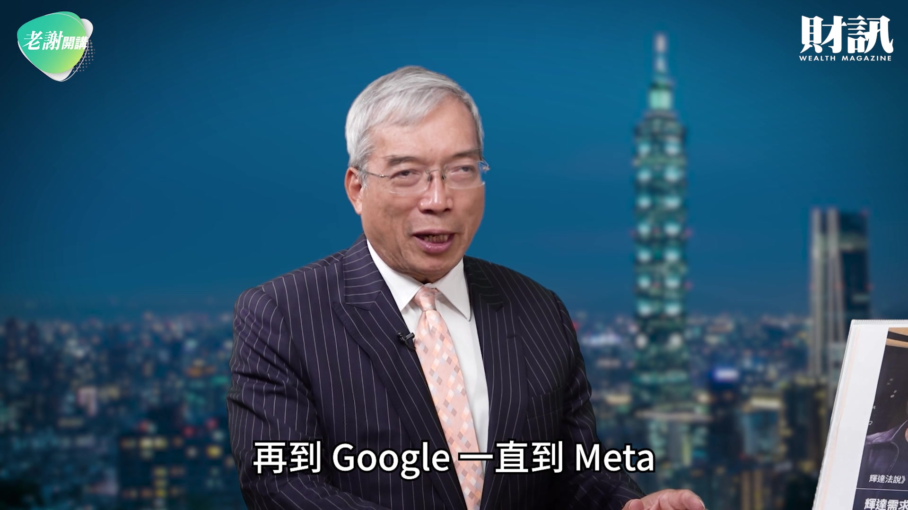

**逐字稿片段：** 這四家公司呢 它在今年的資本支出 已經高達 7450 億美元了 AI 帶給人類 前所未見的新的浪潮 那麼今天要讓王文欽董事長 來跟大家介紹 細胞跟 AI 健康晶片當中 它是什麼樣的一個形成 今天所帶來的新的觀點 我想威力先進的王文欽董事長 我們先請王董事長 跟觀眾朋友問候一下 社長好 各位觀眾大家好

**話題推測：** 亞馬遜、微軟、Google、Meta 等公司資本支出圖表

---

## 00:01:37

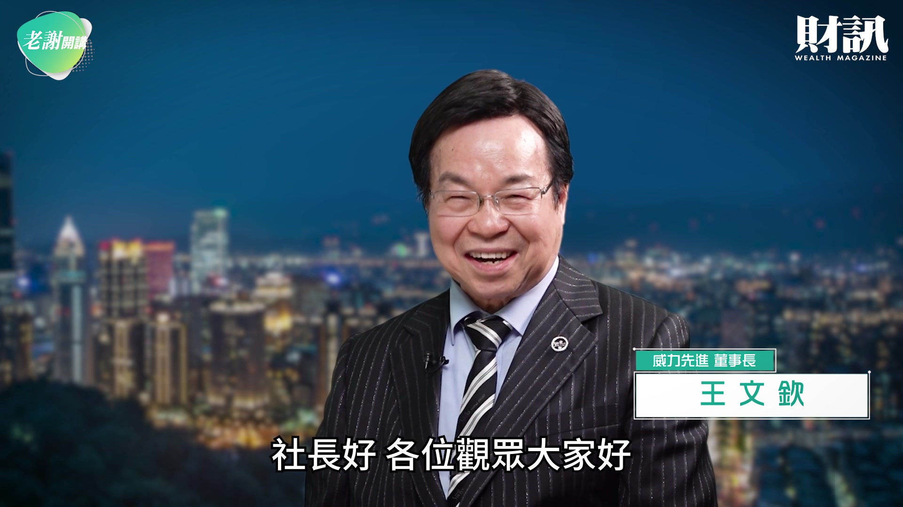

**逐字稿片段：** 好 今天要特別請教王董 我想大家現在都很好奇 人類非常關心健康 所以我在這幾年當中 我也特別提到 第一個 現在人類的 抗癌的行動在未來 10 年 一定有非常大的突破

**話題推測：** 人類抗癌行動與壽命延長的健康話題

---

## 00:01:51

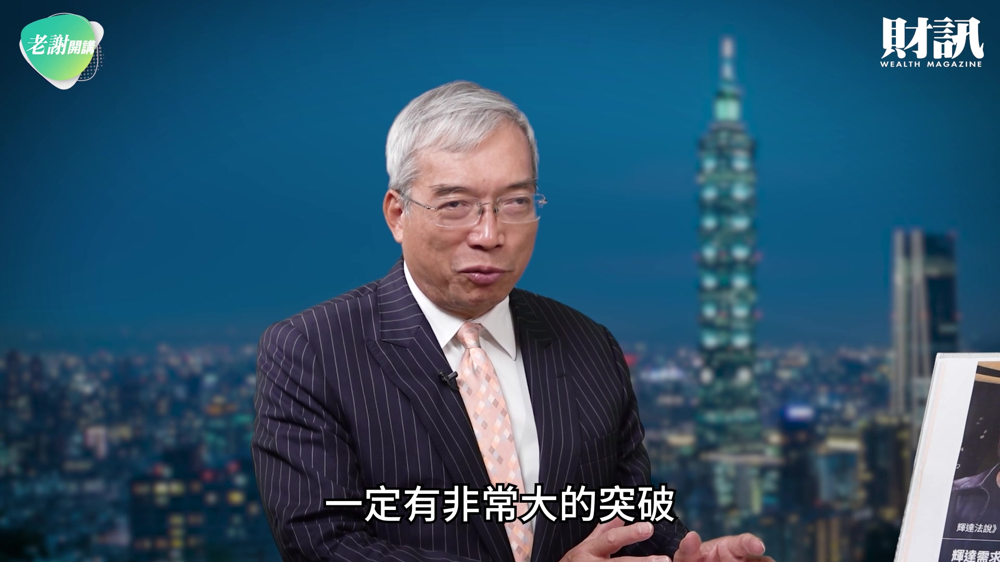

**逐字稿片段：** 最近大家看到莫德納 它現在又有一款新藥出來了 未來治療癌症 可能會發揮很大的效益

**話題推測：** 莫德納新抗癌藥物的介紹

---

## 00:01:57

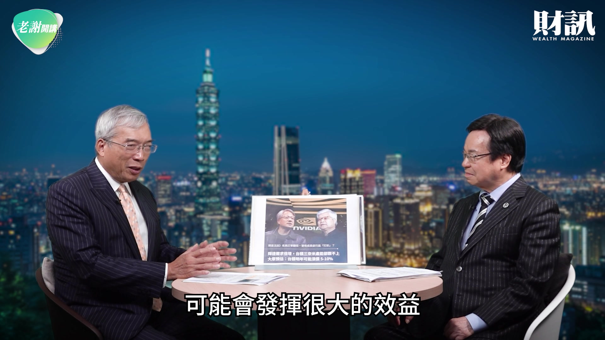

**逐字稿片段：** 人類的壽命 很可能從現在的 80 歲 到 90 到 100 歲 所以健康管理 我相信是未來人類在發展 在有了財富之後呢 我相信是最重要的一堂課

**話題推測：** 人類壽命預期延長的趨勢圖

---

## 00:02:09

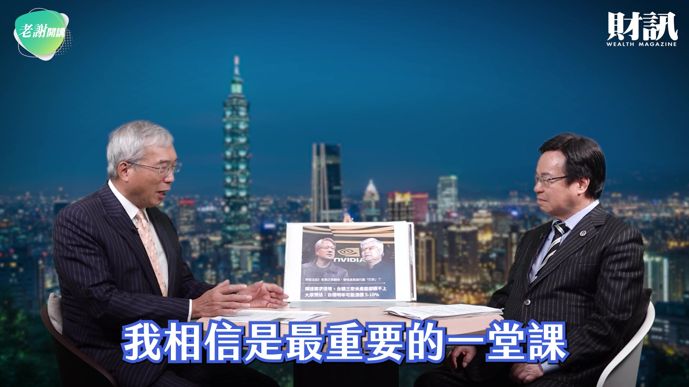

**逐字稿片段：** 所以今天 要先請王董事長來 告訴大家什麼叫做 從這個算力到生命力 你的健康晶片 到底怎麼樣能夠 在這個產業當中落實 然後在台灣形成一個 更巨大的一個產業革命

**話題推測：** 健康晶片在產業中落實的討論

---

## 00:02:23

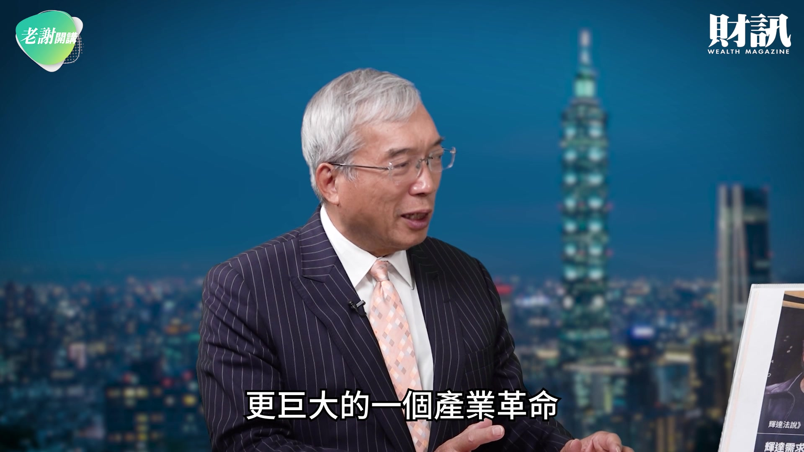

**逐字稿片段：** 謝謝 我們都知道 那個半導體晶片 AI 可以讀懂全世界 但是不一定能夠讀懂人類 所以我在這個地方 看到一個很大的商機 就是 如何讓半導體晶片 變成可以讀懂 人體所有資訊的一個工具 這一方面我們做了 其實已經有逾 20 年的研究 感謝頻道會員長期的支持 因為有您們的肯定 才能讓我們持續帶來精彩的內容 如果您也喜歡我們的節目 也歡迎大家幫我們 按讚訂閱還有分享

**話題推測：** 王董事長介紹AI無法讀懂人類的挑戰與商機

---

## 00:03:00

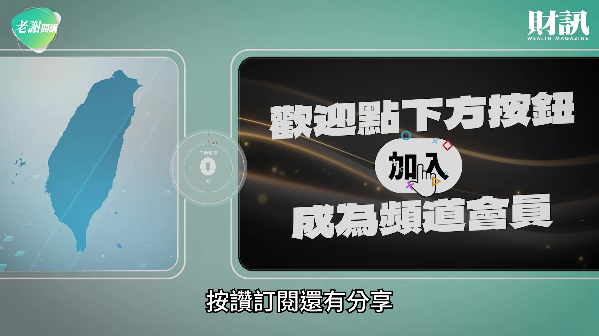

**逐字稿片段：** AI 算力其實可以很容易看到 基因裡面的東西 基因知道了 那就會知道很多潛藏的因素 這個是一個預防醫學的基本

**話題推測：** AI算力在基因分析上的應用

---

## 00:03:13

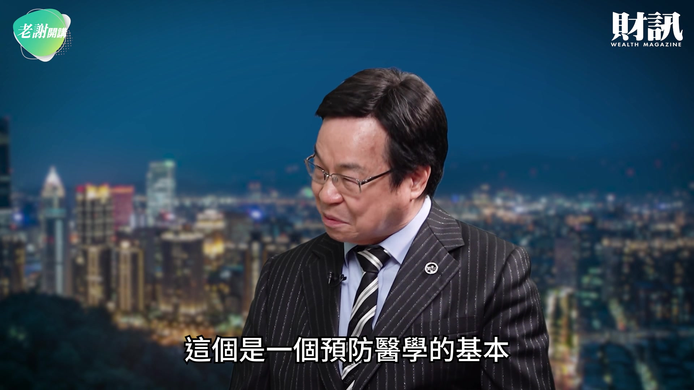

**逐字稿片段：** 好 我們怎麼樣利用晶片 來解讀人體的細胞 這個現在我想 整個 AI 建置的路上

**話題推測：** 晶片如何解讀人體細胞的流程或示意圖

---

## 00:03:20

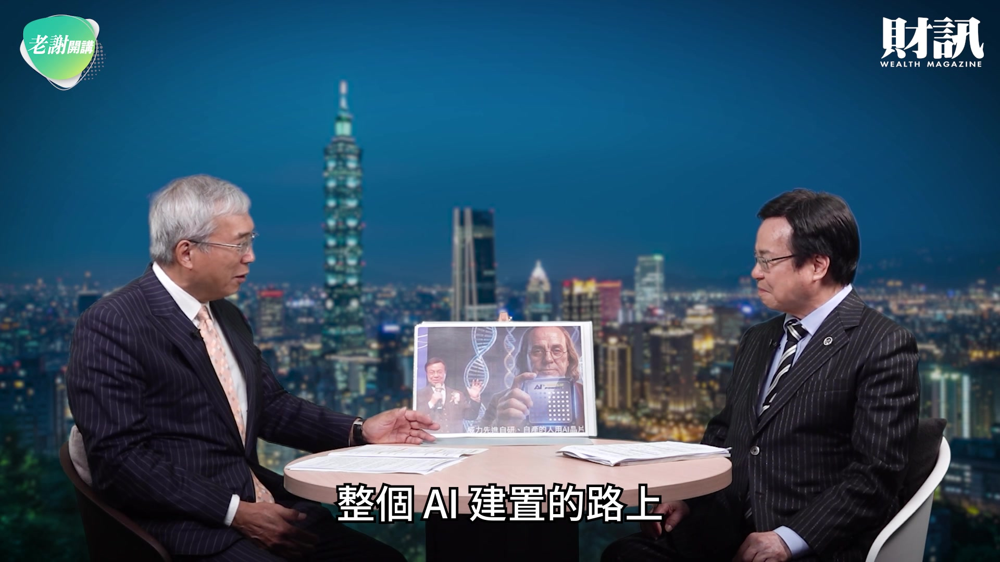

**逐字稿片段：** 現在威力先進主要產品 你提供哪些服務 首先我們把人體所有的資訊 變成晶片可以讀的資訊

**話題推測：** 威力先進的主要產品與服務介紹

---

## 00:03:30

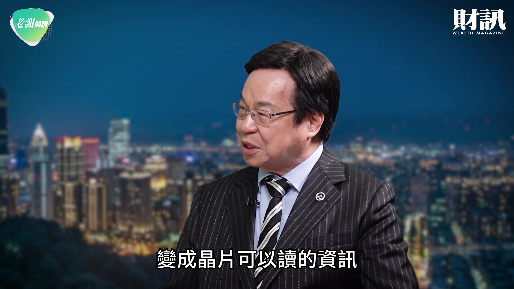

**逐字稿片段：** 在基因裡面解讀的是 ATCG 四個鹼基 所以第一個就是說 我們收集很多人體的資訊 這個第一個碰到的問題 就是每一個國家 都有它們的醫療的法規 所以我們避開這個法規 我們找出一個方法 就是從口腔黏膜 那個就不是醫療行為 黏膜 然後經過萃取 因為黏膜裡面的 很多細胞是破碎的 所以基本上是拿不到 足夠的量來做檢測 現在我們自己研發了一套 精準的 高效的萃取機 這個我們也有專利 然後可以從黏膜 就拿到足夠的基因片段 把它放在所謂的生物晶片裡面 這個最重要就是說 要做一個樣板 這個樣板就是 我們所謂的伊甸園模式 因為伊甸園 亞當跟夏娃是完整的 他是沒有病的 這個標準模式出來以後

**話題推測：** 基因鹼基ATCG的解讀圖示

---

## 00:04:26

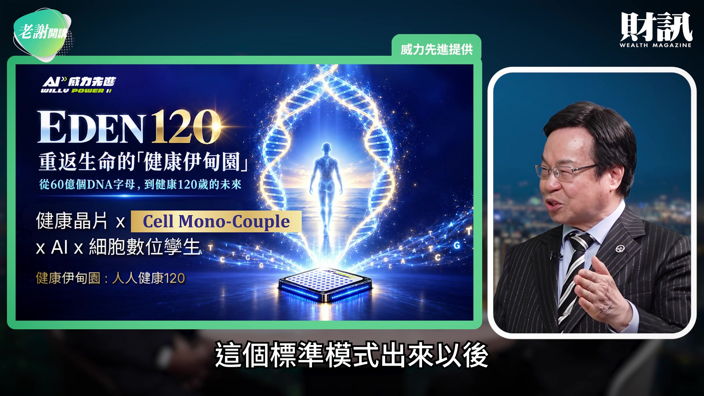

**逐字稿片段：** 我們就把各種有病的 比如說十大癌症 心血管疾病的基因 植入那個 我們已經做好的晶片裡面 檢體拿到以後 就拿來跟它做對比

**話題推測：** 疾病基因植入晶片進行比對的示意圖

---

## 00:04:40

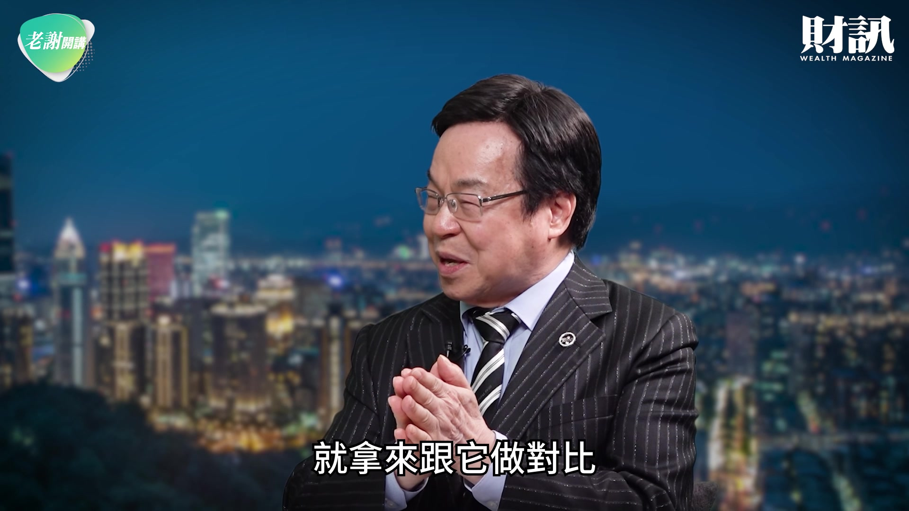

**逐字稿片段：** 我們的技術已經精準到 可以單一個鹼基 可以檢驗出來

**話題推測：** 單一鹼基檢驗精準度的技術說明

---

## 00:04:46

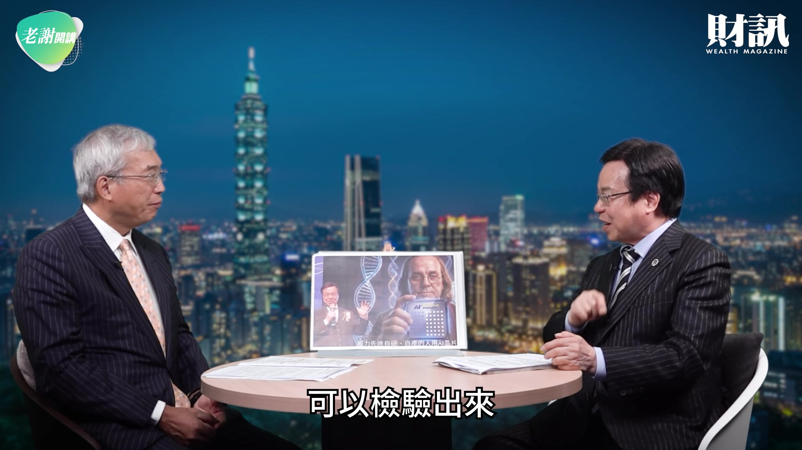

**逐字稿片段：** 我們的基因裡面 有 30 億個鹼基對 每 1 對有 2 個 所以又是 60 億個鹼基

**話題推測：** 人類基因組中鹼基對數量的數字

---

## 00:04:54

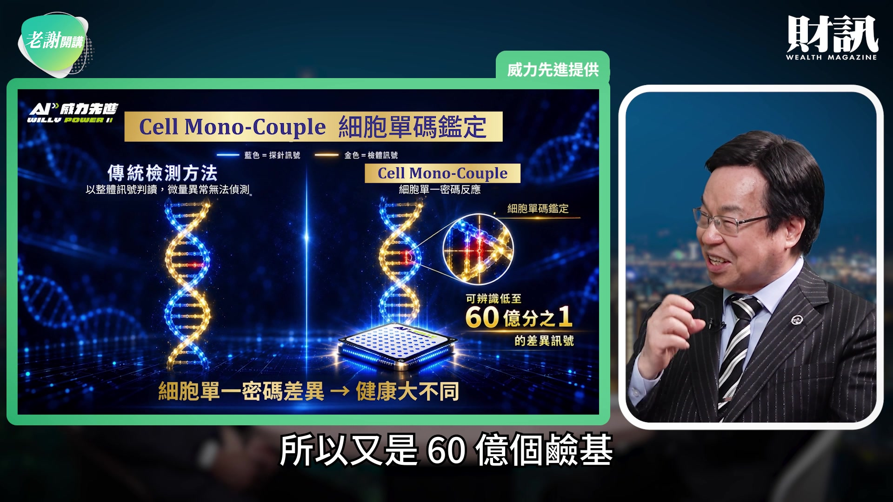

**逐字稿片段：** 大概從基因定序的原理開始 是不是 對 基因定序出來以後 我們就在上面一直探討裡面 到底是哪裡出錯 導致這個人有癌症 那我們把有癌症的放進去 把檢體放進去 一比對馬上知道了

**話題推測：** 基因定序原理的解說

---

## 00:05:10

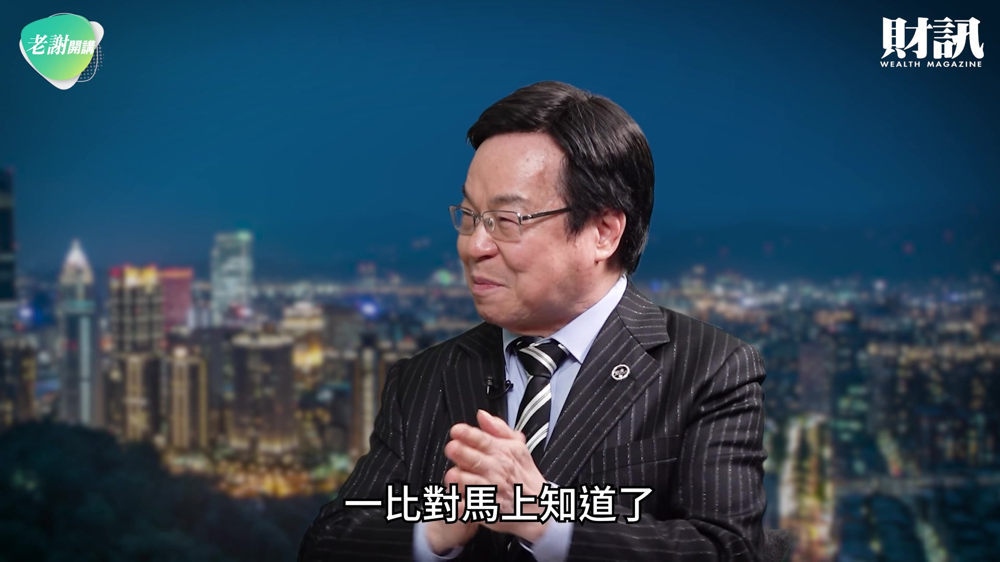

**逐字稿片段：** 最近 AI 出來以後 我們可以精準地計算到 不是說你跟一般人 大概有 10 倍 20 倍的得癌機率 以前都是這樣講 現在我們可以算到 38% 的得癌機率 或者是 50% 的得癌機率 80% 我們可以算到 那個幾個 % 了 非常精準的 是 你看這個現在就是說 AI 的算力 它現在已經從晶片外擴了 在過去來講 大家建構資料中心 在算力 這個算力下一步 它就變成邊緣運算 所以邊緣運算 我們最近也看到 原來很多的工業電腦 它是純粹像收銀機那種系統 但是邊緣運算 現在應用變更廣

**話題推測：** AI精準計算癌症機率的數字

---

## 00:05:54

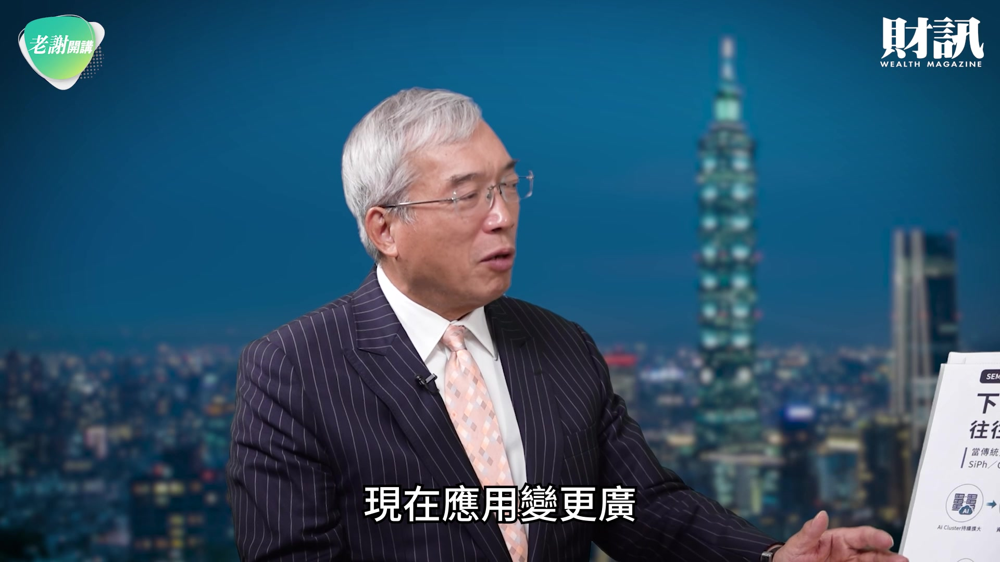

**逐字稿片段：** 比方說現在大家在講 人形機器人 這種整個應用的廣度 再拉開 這個拉開之後 現在大家更好奇就是說 威力先進在這些年當中 你們在 AI 的算力導進 在健康管理上 這個產業可能會帶來 多大的商機

**話題推測：** 人形機器人應用的畫面

---

## 00:06:09

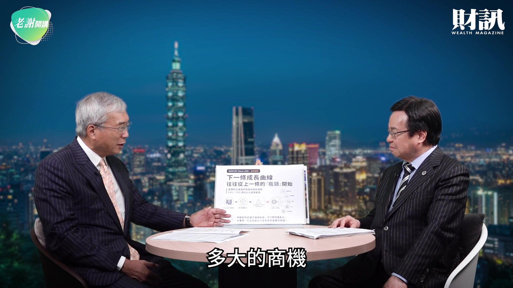

**逐字稿片段：** 這個商機是非常的可怕的 是 因為關係到人體的健康 是 因為關係到人體的健康 全球 80 億人是 人人都需要 都需要健康的 那我們從基因 還有從現狀兩個比對 知道現在需要採取什麼措施 很多人都在做知 但是沒有那個解決方案

**話題推測：** 全球80億人口對健康管理的需求

---

## 00:06:30

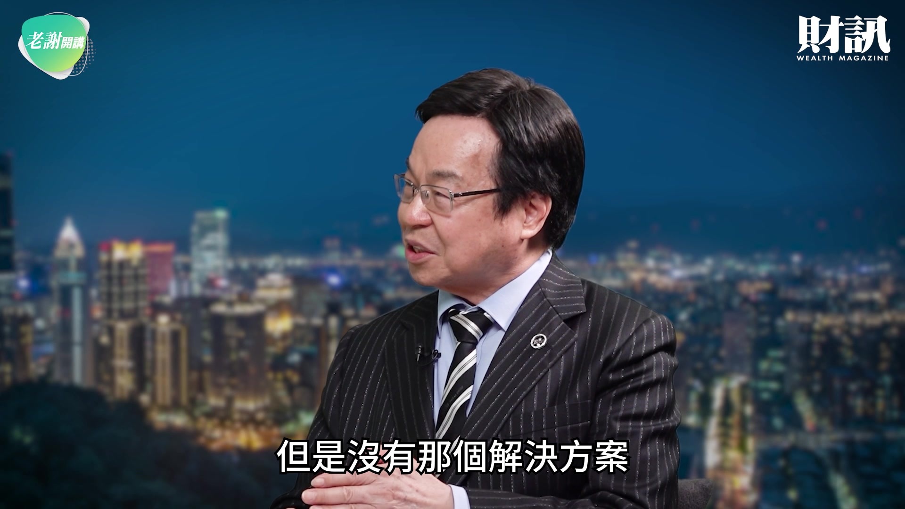

**逐字稿片段：** 基因裡面有 結構基因那是不會變的 但是有一些機能的基因 它是會改變的 所以一個人的癌症的發生 是從細胞先改變 細胞改變是從基因裡面的 某一個鹼基 排錯位置導致的 那我們如何 把那個位置導正回來 哪一個位置決定什麼癌症 這就是基因定序裡面 學基因的人全部都明白 但是他們一下子 還找不到解決方案

**話題推測：** 結構基因與機能基因的比較圖

---

## 00:07:07

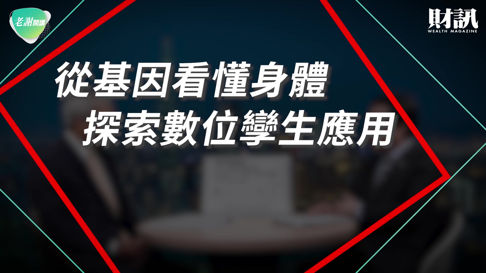

**逐字稿片段：** 那我們一邊研發 一邊跟我在瑞士的團隊 是做解決方案的人 就對接 所以我們現在做的 其實是從基因 然後到解決方案 如果透過晶片 它可以把人體各種潛在的 比方說癌細胞的反應 你能夠很精準的去檢驗說 哪一個部位 這個時候它在健康管理上面

**話題推測：** 威力先進與瑞士團隊合作的說明

---

## 00:07:30

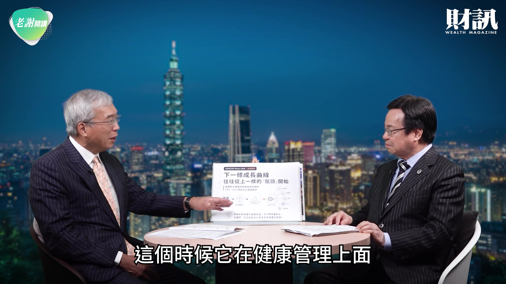

**逐字稿片段：** 也就是說 現在很多的 大醫院的這種健檢 有些醫院健檢收費愈來愈貴 它的檢測項目愈來愈多 這個時候我們如果把 AI 的應用 用在這一些 比方說你現在透過血液 然後你剛剛講 透過唾液也可以 在 AI 的應用上 如果這個能夠百花齊放 你評估對整個生技產業 商機跟影響 它能不能在台灣創造一個 一個很蓬勃發展的生技產業

**話題推測：** 傳統大醫院健檢的現況與收費比較

---

## 00:07:57

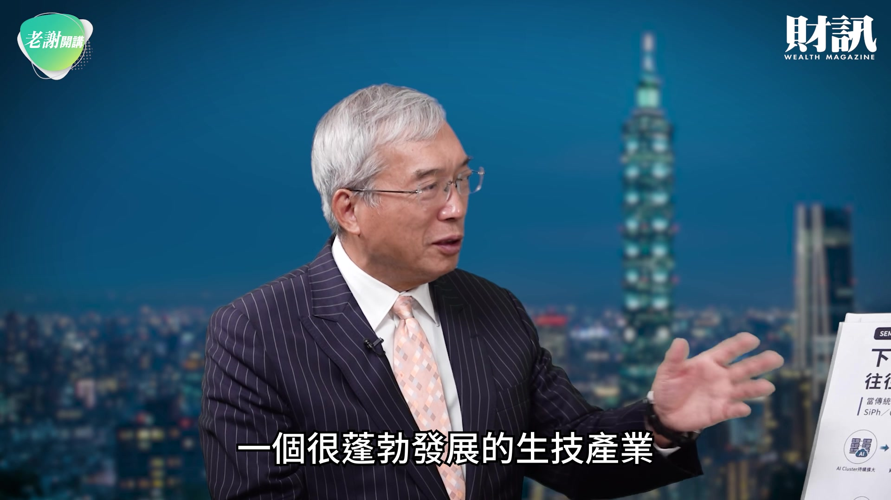

**逐字稿片段：** 社長你講的護國神山 第一個護國神山當然是台積電 但是第二個護國神山 到底是 AI 還是 生物晶片 這個人體 我相信 這兩個都極有可能 對 它講說下一條成長曲線 大家也在找 對

**話題推測：** 台灣「護國神山」的討論，台積電與生物晶片的比較

---

## 00:08:14

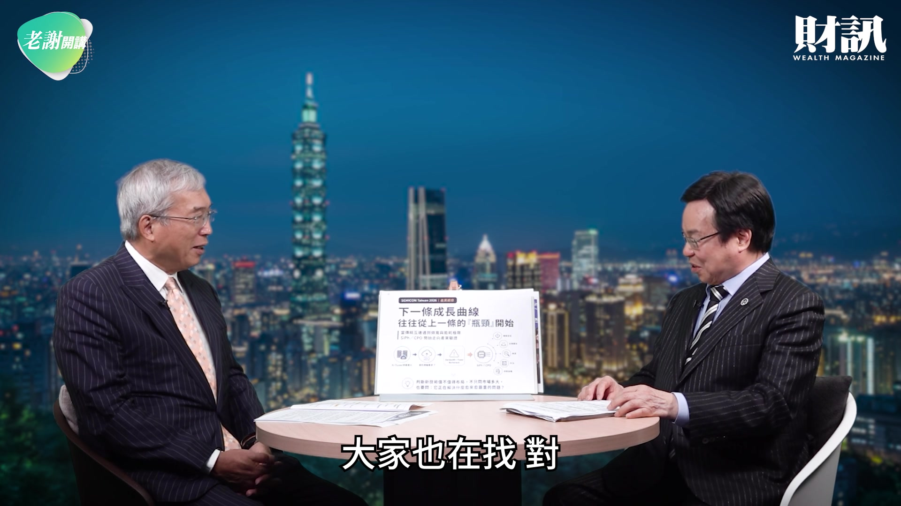

**逐字稿片段：** 舉例說我們剛剛開動 在每一個國家 我們很快得到 印尼的一個集團的認可 它們立刻下了一個 6000 萬美元的訂單給我們 而且訂金到位 它們要買的就是 我們這一個晶片 還有我們這一系列的 有專利的機器

**話題推測：** 印尼集團的6000萬美元訂單

---

## 00:08:34

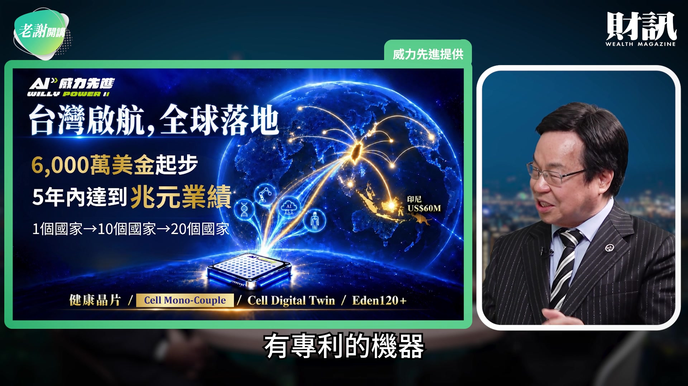

**逐字稿片段：** 萃取機 晶片 然後解讀機 所以我相信剛剛開始我們 在台灣不用講 我們已經展開了這個業務

**話題推測：** 威力先進系列產品（萃取機、晶片、解讀機）的圖示

---

## 00:08:43

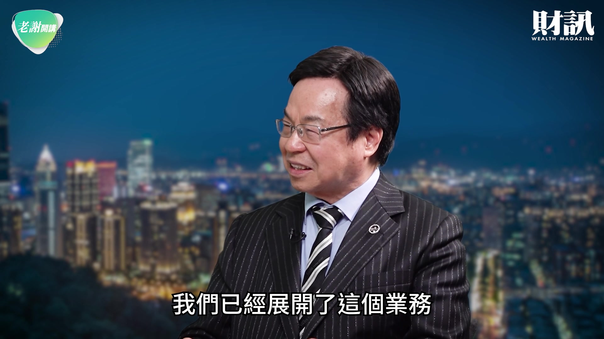

**逐字稿片段：** 有 20 個國家我們也都開始動了 但是印尼是打第一槍 下了一個訂單給我們 給我們很大的鼓勵 所以將來應該是兆元 而且是兆美元的一個商機 這個如果能夠 達到那個目標 我相信台灣會創造 更大的產業的新的福報

**話題推測：** 威力先進在全球20個國家展開業務的示意圖

---

## 00:09:01

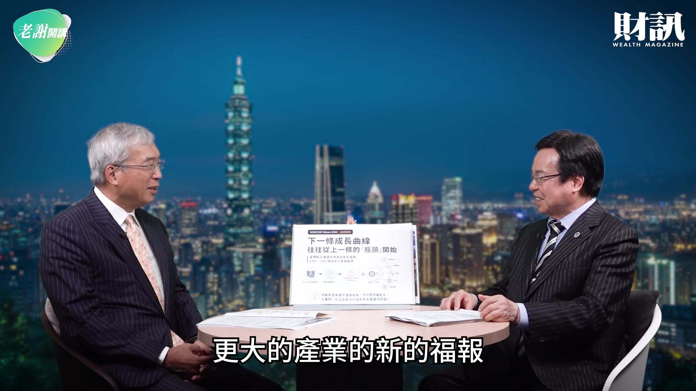

**逐字稿片段：** 那我想還有一個請教 威力先進現在 我們剛剛講這個晶片之外 還有一個是 細胞數位孿生的生態系 這個看起來學問很大 我要特別請教王董 來介紹一下 細胞數位孿生

**話題推測：** 威力先進的「細胞數位孿生生態系」介紹

---

## 00:09:16

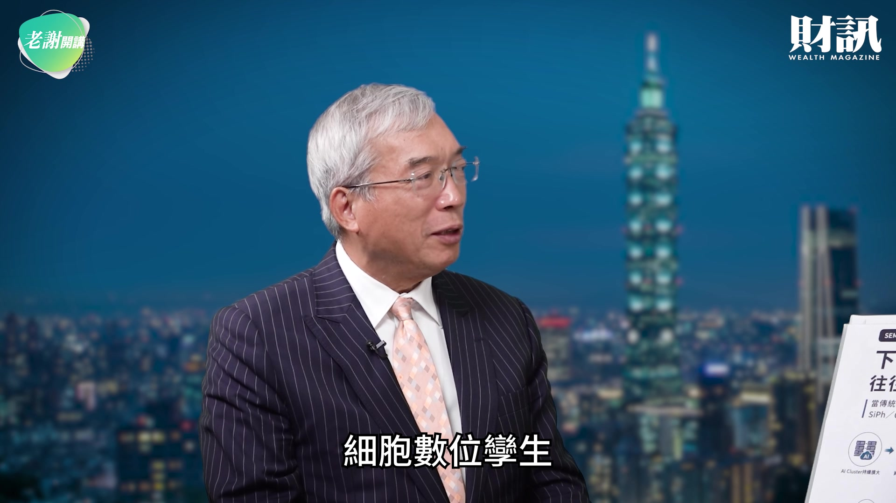

**逐字稿片段：** 我們瞭解了人體的時候 就會複製一個人 比如說複製了我 把我的心跳 把我的腦波 新陳代謝的數字 這些數據灌入這一個虛擬的人 那個其實就是活生生 真實的人跟一個虛擬的人的對比 現在 在 AI 的運算裡面 幾乎就可以問它說 那我明年我會變成怎麼樣 後年會變成怎麼樣 採取措施是什麼 所以這個虛擬的人

**話題推測：** 細胞數位孿生概念的示意圖，包含心跳、腦波、新陳代謝數據

---

## 00:09:49

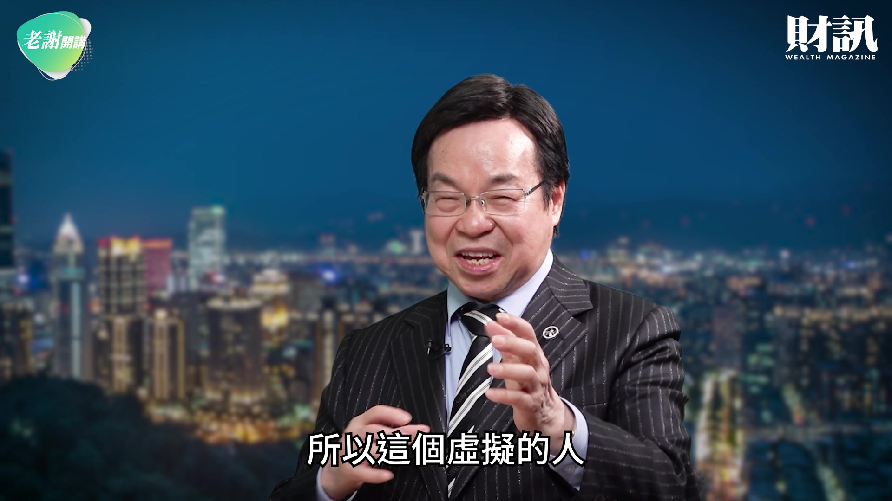

**逐字稿片段：** 將來也可以把它發到手機裡面 所以一個真實的人 看到手機裡面 一個跟自己完全一樣 心跳 腦波 新陳代謝的速度 都一樣的人 將來預防醫學就在這裡發生 甚至於我們以後的臨床 根本不需要 去找很多人來做臨床 我們用這個數位孿生 就可以在上面 給它什麼藥吃 變成怎麼樣 給它什麼營養吃 它變成怎麼樣 這個是其中一個 更大的商機在裡面 所以整個是一個兆元的商機 細胞數位孿生 是可以運用到每一個 個人 那這個呢 我們有一點點想法 就去申請專利看看

**話題推測：** 手機上的數位孿生應用介面

---

## 00:10:34

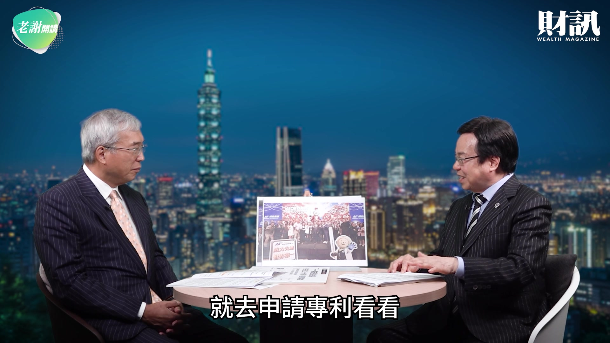

**逐字稿片段：** 結果我們批准了 這個細胞數位孿生 我們已經有了專利 那我想這個是很好的開始 對

**話題推測：** 細胞數位孿生專利證書的展示

---

## 00:10:41

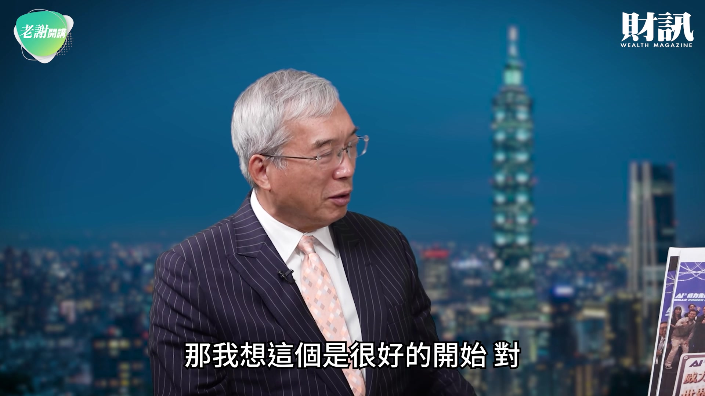

**逐字稿片段：** 那要特別請教 我看你這個照片 是很氣勢萬千 就是 你已經大概在國際舞台上 能夠打進全球市場 剛剛講到印尼 我們看到在東南亞你有很多布局 順便利用這個機會 介紹你自己好不好 OK 我一開始是在瑞士僑居 那退休以後才回來 我發現這是一個非常大的商機 所以我就 本來想退休的 就重新啟動我以前所做的東西

**話題推測：** 王董事長個人在國際舞台上的照片或簡歷

---

## 00:11:09

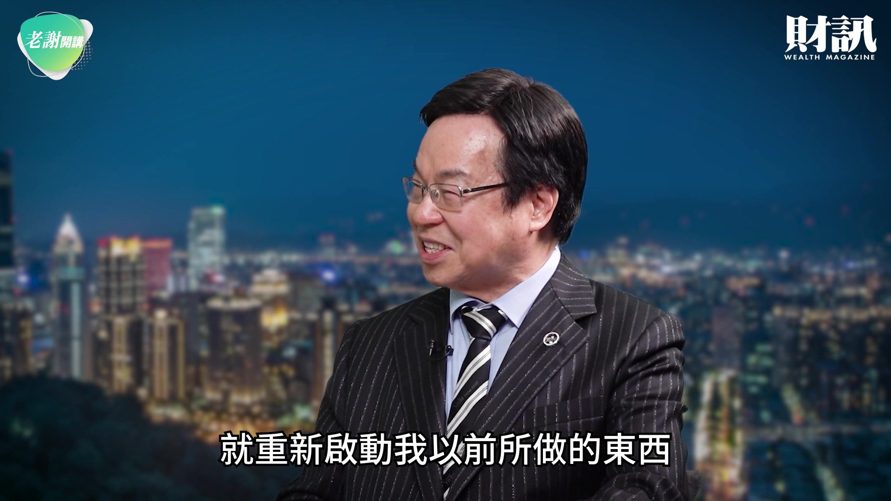

**逐字稿片段：** 因為我發現大家在營養上面 其實是概念 是沒有很健全的 隨便講一個 這個免疫 大家都講不清楚 到底什麼是免疫

**話題推測：** 營養與免疫力知識誤區的討論

---

## 00:11:20

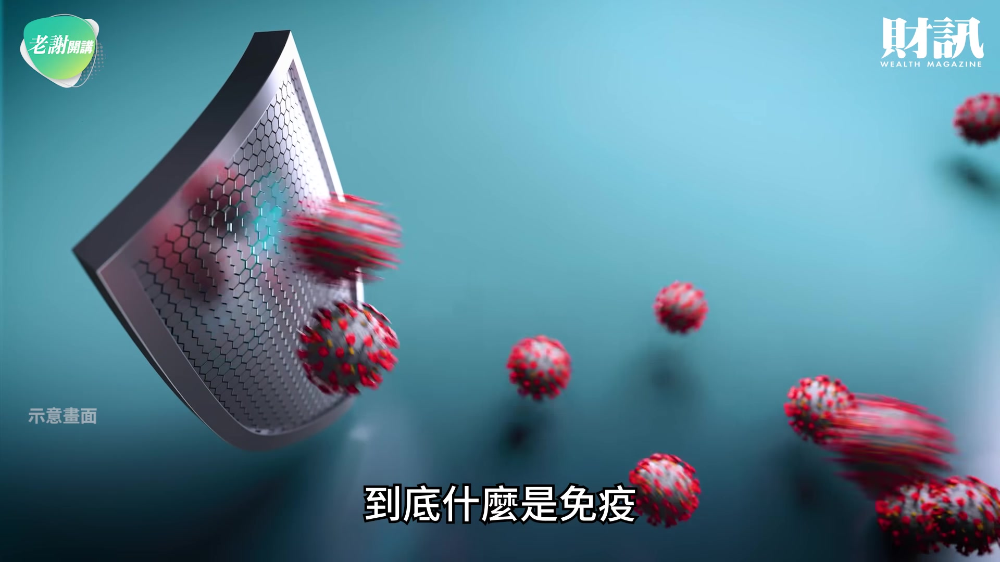

**逐字稿片段：** 那因為我是 物理系出身的 來學生化 所以我看到很多不一樣的商機 所以我就直接重新創業 就以教育訓練為主的 推廣這個健康 沒有很用力的情況

**話題推測：** 王董事長的學經歷背景說明

---

## 00:11:36

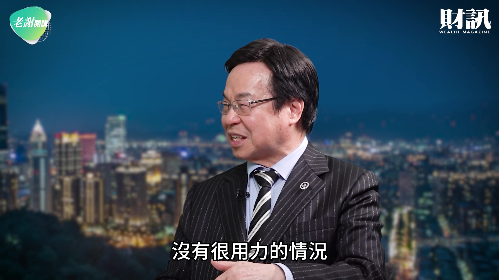

**逐字稿片段：** 這已經擴展到 差不多有 20 個國家 那現在慢慢地把它轉成 預防醫學的一個領域裡面去 現在海外的布局裡面 哪一個市場你們現在使力最大 台灣當然是現在 已經占差不多有 40% 然後日本 韓國 新加坡 馬來西亞 印尼 越南 泰國 菲律賓 都是很大的市場 這些都是我們現在布局比較多的

**話題推測：** 威力先進業務擴展至20個國家的地圖標示

---

## 00:12:08

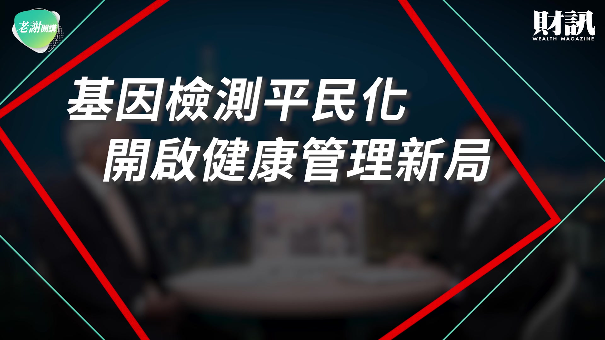

**逐字稿片段：** 好 這個現在回頭來看看 威力先進現在 大致上已經上路了 也就是說在健康晶片上 你已經真正啟動了 在國內來講 我看類似的公司很少 所以我想大家也很關注 媒體也在報導 就是說 在健康晶片當中 到底怎麼應用 台灣在 AI 已經打下的基礎

**話題推測：** 威力先進健康晶片已啟動的里程碑

---

## 00:12:31

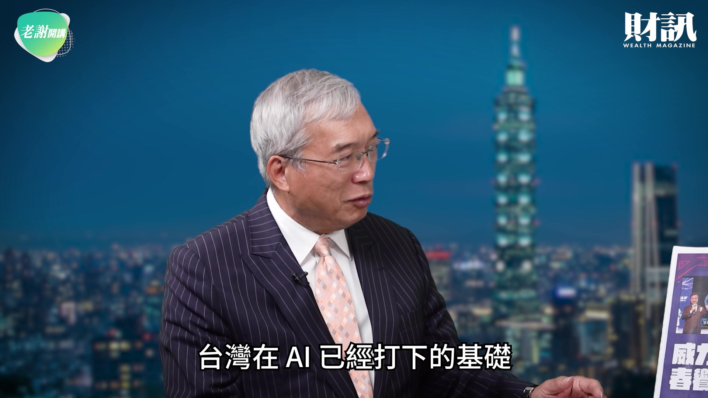

**逐字稿片段：** 台灣的生技業一直以來 大家都沒有營業額 新藥研發路上也很坎坷 所以我想威力先進 現在走這一條路 你希望這樣的一家公司 將來會在台灣的企業的舞台上 它扮演什麼角色 生物科技是很難走的路 因為它都是 漫長的時間在做研究 不過我來做會比較輕鬆 因為我前面已經走了 30-40 年的研發的工作 所以這個基礎上 還有我們公司現在有 7-8 個博士 他們也是在這個領域裡面 這是浸了很久的 現在大家匯集起來這個力量

**話題推測：** 台灣生技業發展困境的討論

---

## 00:13:08

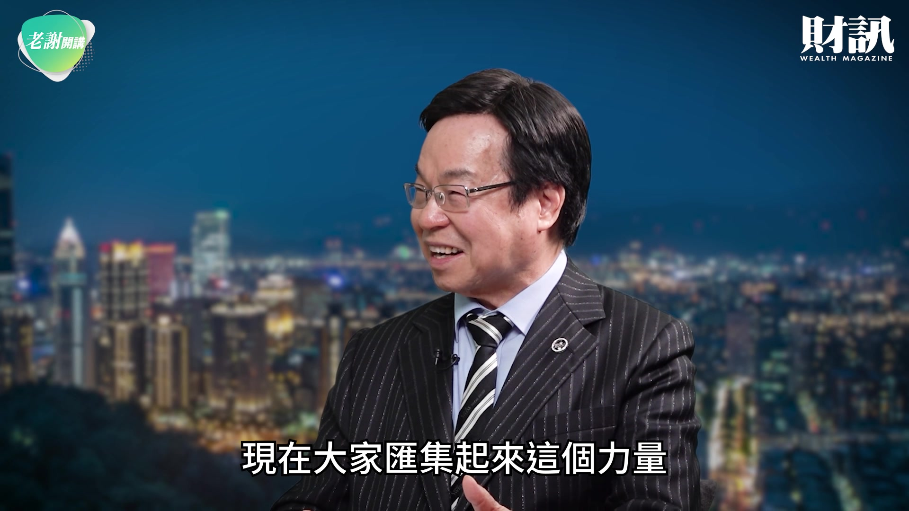

**逐字稿片段：** 我們的優勢是在 我們已經有了一個 比較難得的資料庫 就你講說那個 仿生 AI 應用的落實 這個大家對這個是 看起來也非常的注意

**話題推測：** 威力先進仿生AI應用與資料庫優勢

---

## 00:13:20

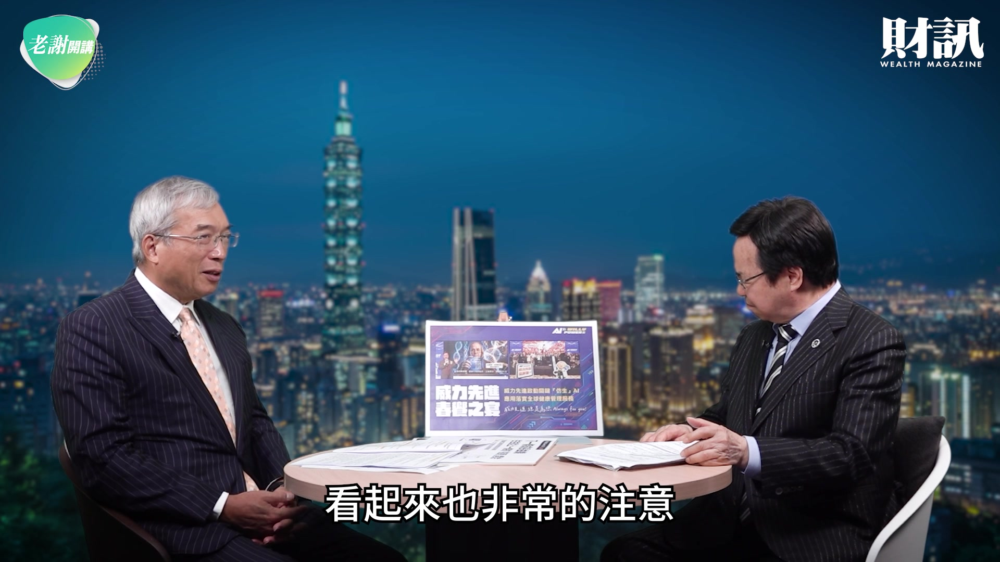

**逐字稿片段：** 那個仿生其實是在孟德爾講 它以前叫做雜交 我覺得雜交這個名字 是有點怪怪的 不好聽 所以我把它叫做 Mono-Couple Couple 就是夫妻 Mono 就有一點像是一夫一妻制 就是說基因 它有另外一個基因 跟它是相似的 它就會結合在一起 這樣我們很容易用這個方式 來鑑定出各種 不同的疾病 非常精準 這個是我們現在 已經很成熟的技術

**話題推測：** 孟德爾遺傳學與「Mono-Couple」新術語的解釋

---

## 00:13:54

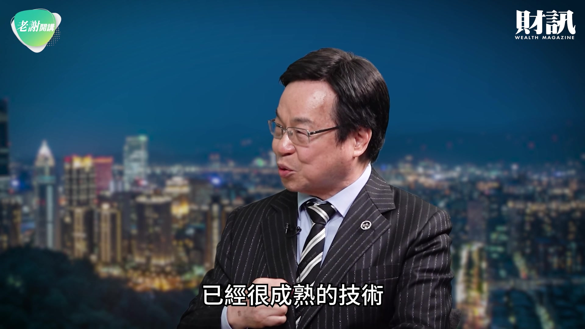

**逐字稿片段：** 我想這個現在最後一個問題 來看一看就是說 檢測的廣度跟它的深度 深入細胞核心 DNA 跟 RNA 的表現

**話題推測：** DNA與RNA表現檢測的廣度與深度討論

---

## 00:14:02

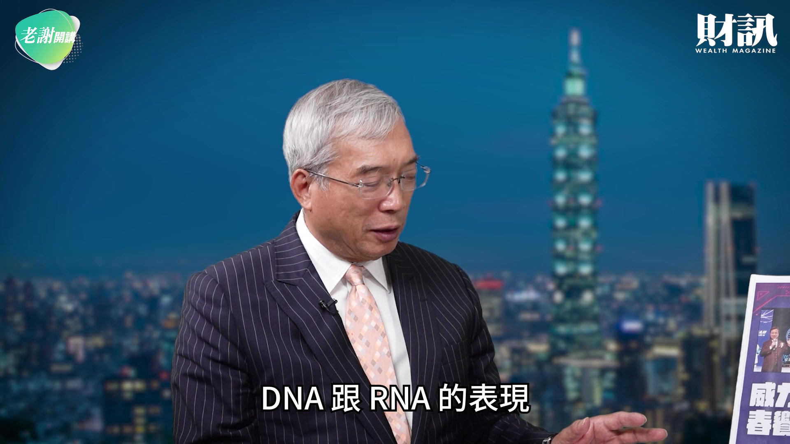

**逐字稿片段：** 針對人體最關心的 癌症 失智 心血管 代謝的風險 這些都是我們在生活中 你的朋友或你的家庭 都要面對的 那我們如果能夠讓健康晶片 深入到每一個家庭 這就是一個早期的偵測系統 所以我們如何在這個市場裡 能夠讓大家都能夠廣泛地接受 在廣度上面

**話題推測：** 癌症、失智、心血管、代謝等疾病風險列表

---

## 00:14:27

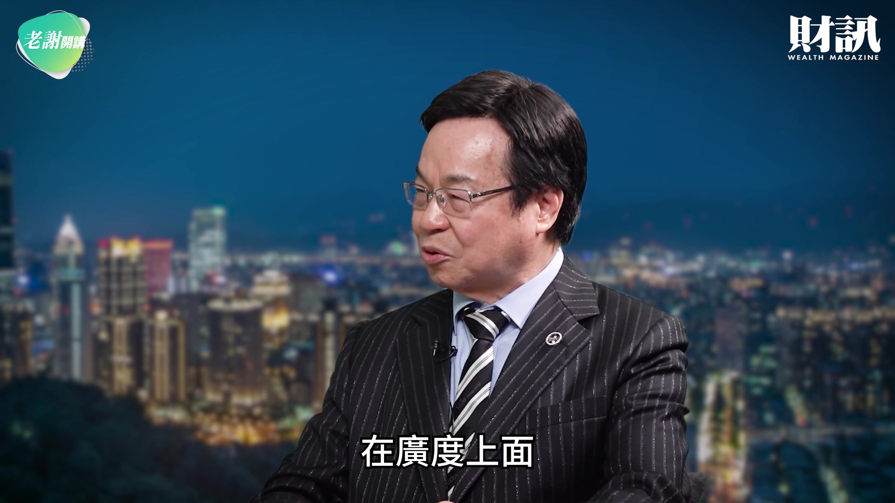

**逐字稿片段：** 我是十幾年前 我從歐洲回來台灣 我是第一個把台灣的驗血 從一個驗血大概 6000-7000 元 我是帶頭把它壓到差不多 現在的 2200 元 我到台大醫院去看那個抽血 我說那個規模之大 你難以想像 我看到一天要抽好幾萬人的血 對 那我是好像 現在 在市場上的驗血中心 它們被我 改變了它們整個的思路 它現在都是逾 2000 元 就能夠把差不多 60 項的驗血都驗出來 那現在基因也是 驗基因呢 因為我們自己的技術 而且我們完全是自主做晶片 所以我把基因也壓到 現在市場上的價格的 10 分之 1 所以這個就是我希望 在全民都 很輕鬆地可以來驗基因 因為價格非常低 驗基因就是分成 5 個 第 1 個是十大癌症 十大癌症以前都要一個一個驗 我們是一次就驗十大癌症 再加上因為我們 用的方式是不一樣 是那個晶片做的 那這十大癌症 我們還把那個心血管 跟腦血管放在一起

**話題推測：** 台灣驗血費用從6000-7000元降至2200元的價格比較圖

---

## 00:15:39

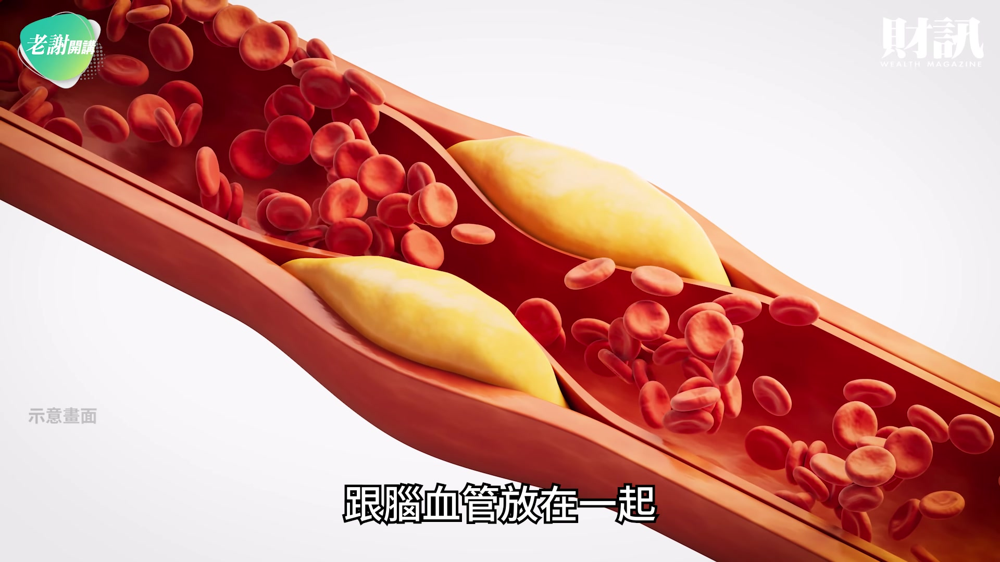

**逐字稿片段：** 你有把它走向平民化 平民化 因為大家都驗的話 你這個一方面就是說 大家會知道 我到底怎麼了 有人驗出來是基因 是明明沒有乳癌 但是她現在有乳癌 那我們知道這一段時間 你的飲食生活習慣要立刻改變 不然你無法挽回 那有人調過來 她明明這個基因裡面 是有乳癌可能的 但是她今天沒有乳癌 所以她一定要 keep on 現在的情況不能改變 這是飲食跟生活習慣 基因我就又把它分成

**話題推測：** 乳癌案例說明基因與生活習慣的影響

---

## 00:16:11

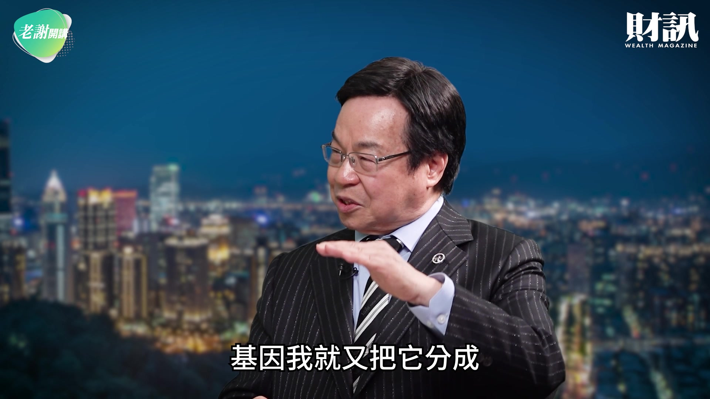

**逐字稿片段：** 底下幾個層次 第 1 個是跟神經有關的 失智 帕金森這些問題 這是第 2 部曲

**話題推測：** 基因檢測第二類：失智、帕金森氏症等神經相關疾病

---

## 00:16:19

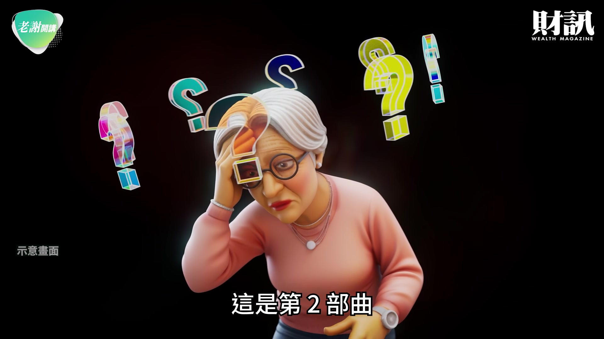

**逐字稿片段：** 第 3 部曲就是跟新陳代謝 跟內分泌 糖尿病 婦科毛病有關的 這是第 3 類

**話題推測：** 基因檢測第三類：新陳代謝、內分泌、糖尿病、婦科問題

---

## 00:16:27

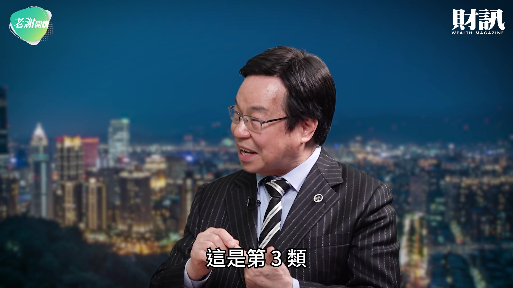

**逐字稿片段：** 第 4 類跟骨頭跟肌肉有關的 這是運動器官有關的 第 5 類是精神狀態 你的生命的長度有關的 所以我把它分成 5 類 這個是非常平民化的 我想你走到平民化 對我們國人來講是很大的福氣

**話題推測：** 基因檢測第四類：骨骼與肌肉相關疾病

---

## 00:16:46

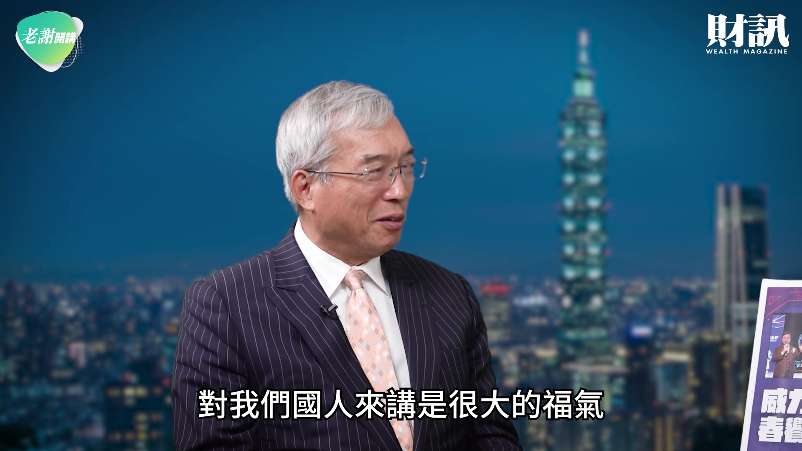

**逐字稿片段：** 所以我想今天我們非常感謝 王文欽董事長 現在的威力先進 它也希望能夠走上 上市的路

**話題推測：** 威力先進尋求上市的目標

---

## 00:16:54

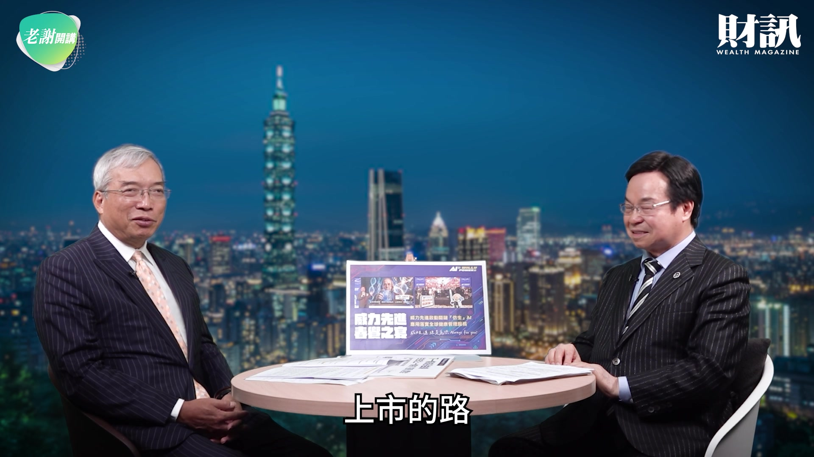

**逐字稿片段：** 我想我們過去從算力到電力 現在到算力到生命力 我相信他的健康晶片 會在未來產業 帶給大家更不同的新的面貌 也帶給產業更巨大的衝擊 今天非常感謝王文欽董事長 感謝大家觀賞下週見 謝謝社長 謝謝各位觀眾

**話題推測：** 從算力到電力再到生命力的願景總結

---
