# wealth1974_fflsSlBwb9U — 關鍵畫面索引

- 來源逐字稿：[wealth1974_fflsSlBwb9U_FIN.srt](wealth1974_fflsSlBwb9U_FIN.srt)
- 影片：https://www.youtube.com/watch?v=fflsSlBwb9U
- 截圖數：56

## 00:00:23

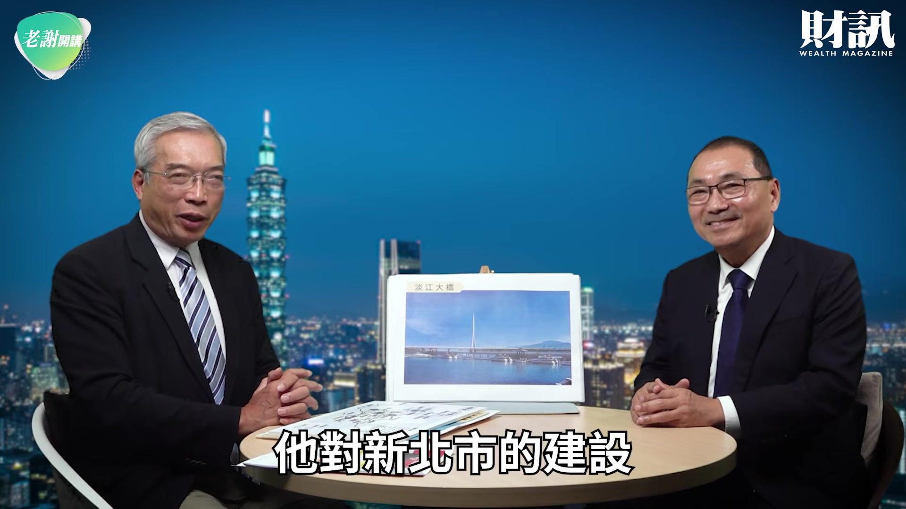

**逐字稿片段：** development. As you can see, the Danjiang Bridge has opened. Everyone has noticed that the traffic congestion in Tamsui has been completely resolved; this is the immense convenience brought

**話題推測：** 介紹淡江大橋開通與對交通的改善，可能配搭橋梁畫面。

---

## 00:00:35

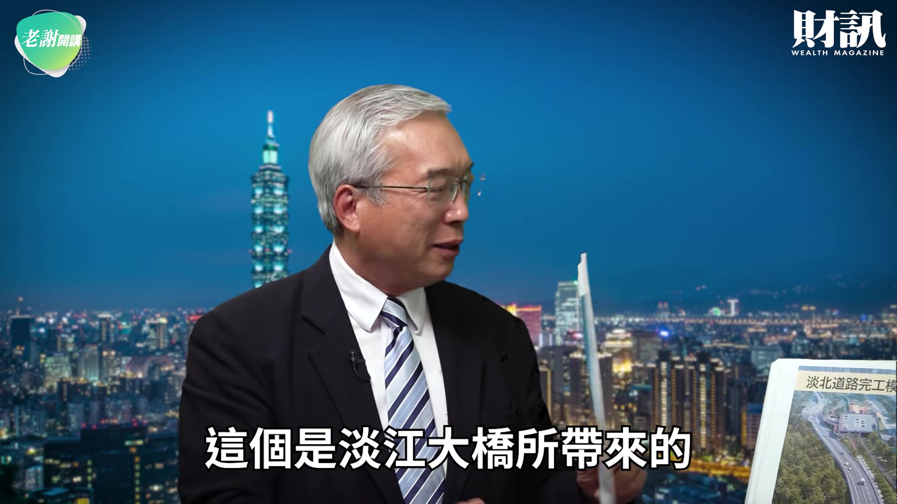

**逐字稿片段：** by the Danjiang Bridge. At the same time, you can see that the entire road network in New Taipei City is now very complete. When I stayed at a hotel in Xiyudon recently, I went for a morning run and found the walkways incredibly beautiful—this is another significant achievement during Mayor Hou’s tenure . You have seen the Ankeng Light Rail,

**話題推測：** 說明新北市整體道路網絡的完善，可能配搭城市道路鳥瞰圖。

---

## 00:00:54

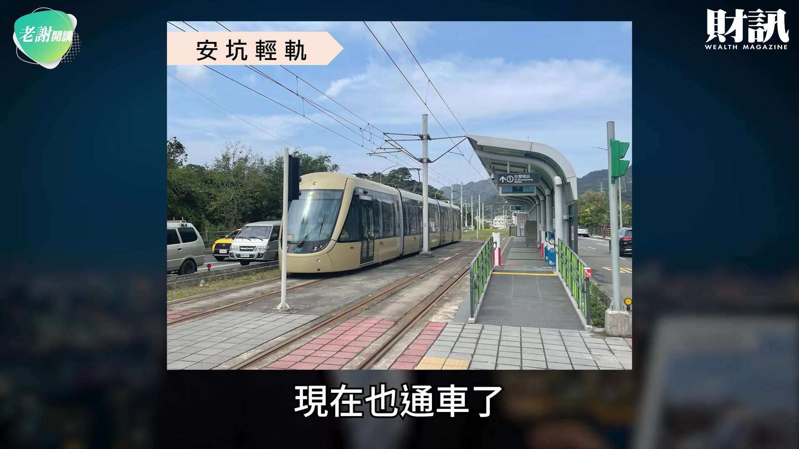

**逐字稿片段：** which is now operational. Recently, you have also seen the Tamsui Light Rail become a vital transportation tool for citizens in their daily lives. From the "Four Rings and Eight Lines" to the " Four Major Urban Developments," I believe that over Mayor Hou’s eight years, including his eight years as deputy mayor, he has given New Taipei City 16 years of dedication. I believe New Taipei citizens feel they have had an outstanding mayor. He spent 16 years building New Taipei City. As he is about to step down, I am glad we have this opportunity today to have Mayor Hou talk about the changes he brought to New Taipei City during his eight years as mayor. Welcome, Mayor. Hello, Mayor. >> Hello, Mayor Hsieh, hello Brother Chin-ho. >> I think everyone is going to miss you very much. As you are about to lay down your heavy burden, looking back at these eight or 16 years, what are you most gratified about bringing to the citizens of New Taipei? Over these 16 years, we have transitioned from being a mere satellite city of Taipei to a vibrant international metropolis with New Taipei City as its core.

**話題推測：** 提及淡海輕軌的重要性，可能配搭輕軌畫面。

---

## 00:02:03

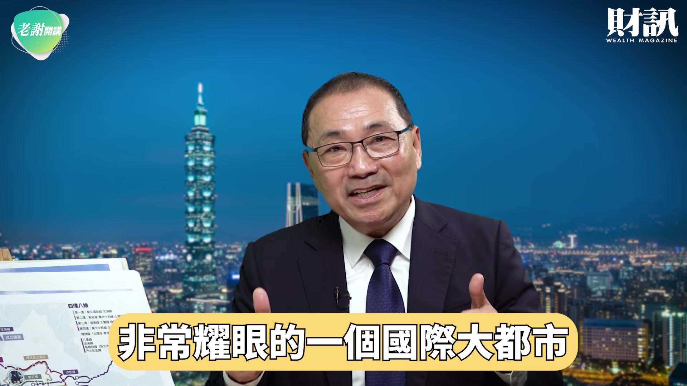

**逐字稿片段：** >> When we go to Banqiao, the urban landscape looks truly magnificent. Our efforts over these years have been recognized by the rest of the world.

**話題推測：** 展示板橋的都市景觀變化，可能配搭今昔對比畫面。

---

## 00:02:12

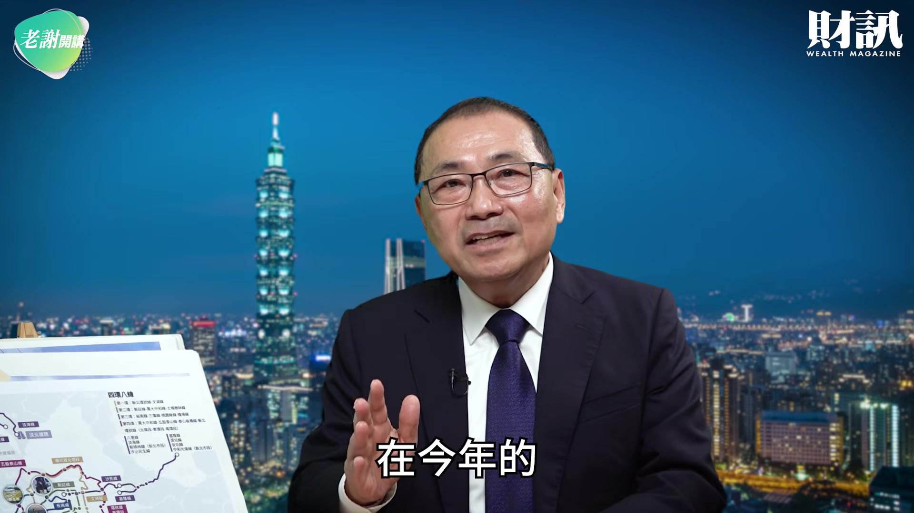

**逐字稿片段：** This year, the UK-based Institute for Quality of Life evaluated 1,000 major cities, selecting the top 250, and we were ranked 44th among the world's 50 greatest cities. We are no longer just a satellite city of Taipei; we are a major metropolitan city driving the prosperity of the ten million people in the North-Keelung-Taoyuan region. Over my eight years as mayor, including my time as deputy mayor, I’ve realized that a city's greatness depends on its transport network to drive industry and urban renewal. New Taipei City, formerly Taipei County, was essentially a collection of towns—it needed a complete transformation. Of course, you face many impossibilities during this process. Over a decade ago, the "Three Rings and Three Lines" proposal was dismissed as an empty promise. When I became mayor, our rail projects were underway but unfinished. Over these

**話題推測：** 顯示新北市在世界城市排名中位居第44名，可能配搭相關圖表。

---

## 00:03:11

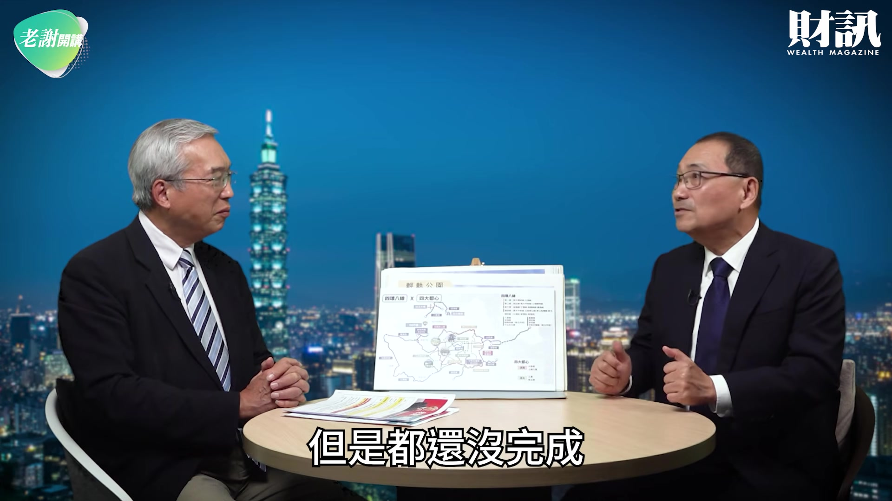

**逐字稿片段：** eight years, I have completed four MRT lines and the Circular Line.

**話題推測：** 展示八年任內完成的四條捷運與環狀線，可能配搭捷運地圖。

---

## 00:03:16

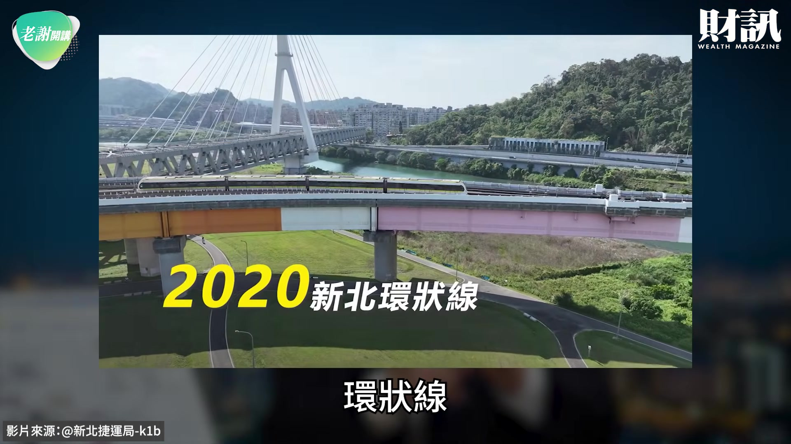

**逐字稿片段：** >> With the completion of the Danhai, Ankeng, and Sanying lines, our MRT network has reached 108 kilometers and 90 stations, making it the most extensive rail construction effort. >> So, seeing the MRT open in Sanxia is no easy feat. From the start of construction to completion, these rail projects are not only the longest in the country, but we also have the

**話題推測：** 顯示淡海、安坑、三鶯線通車後捷運網絡達108公里、90站的數據圖表。

---

## 00:03:41

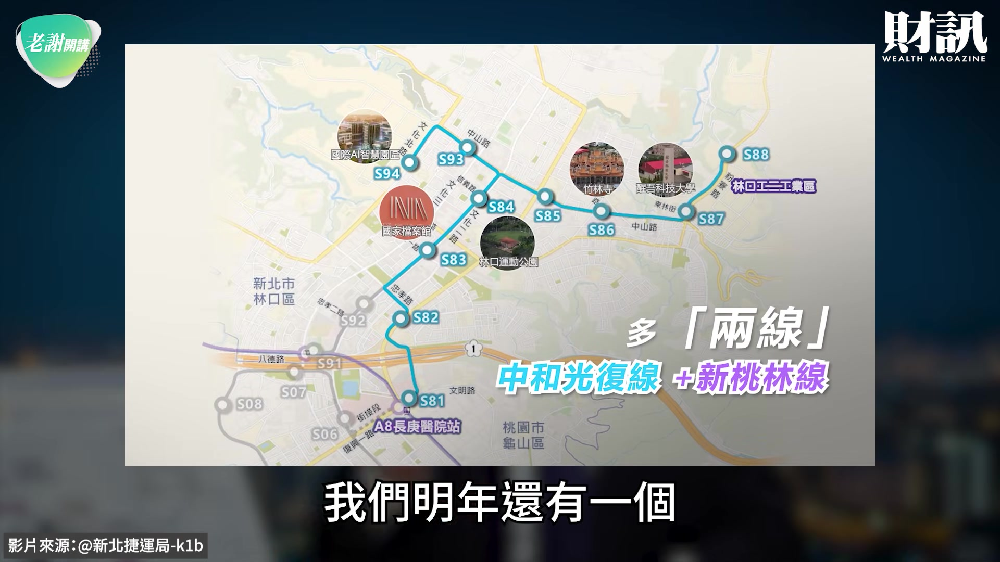

**逐字稿片段：** Wanda-Zhonghe line finishing next year. In the next two years, one or two lines will open annually, because I have

**話題推測：** 提及萬大中和線預計明年完工，可能配搭工程進度圖。

---

## 00:03:48

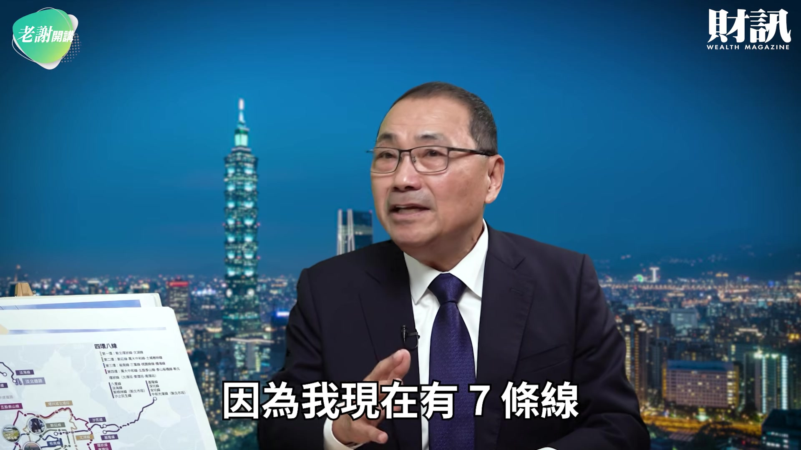

**逐字稿片段：** seven lines currently under construction and another seven in the planning stages. As I step down, I look at our past and our present; in the

**話題推測：** 列出七條施工中與七條規劃中的捷運線，可能配搭路線圖。

---

## 00:03:59

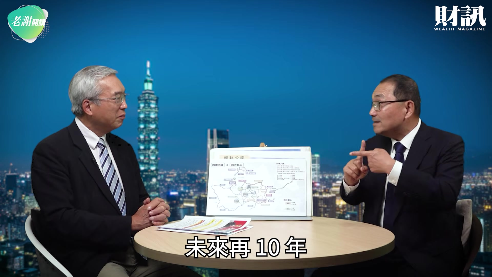

**逐字稿片段：** next ten years, we will reach 189 kilometers and 182 stations. This means

**話題推測：** 展示未來十年捷運路網將達189公里、182站的願景圖及數據。

---

## 00:04:05

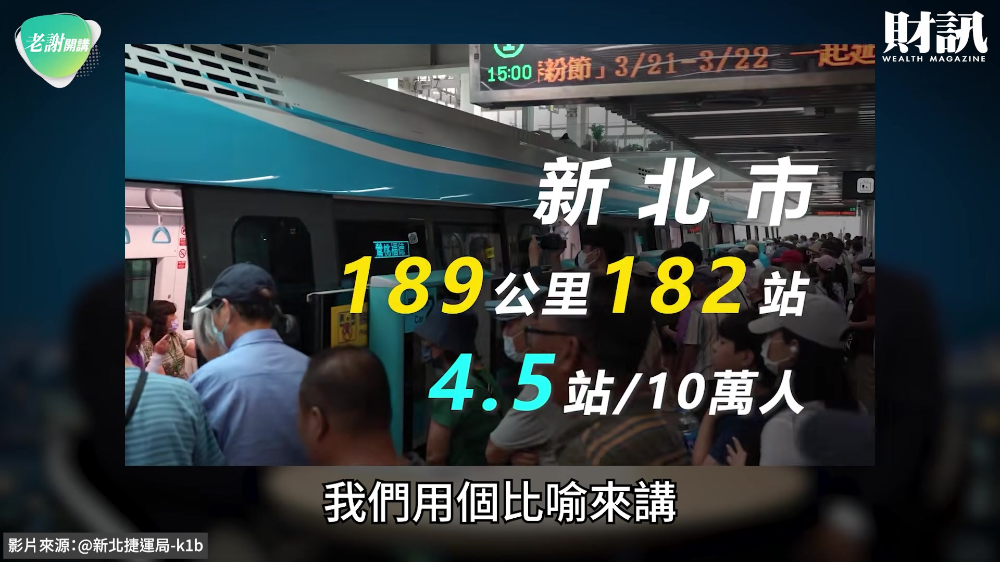

**逐字稿片段：** that for every 100,000 people in New Taipei City, there will be 4.5 stations . With a population of millions, that’s just one station for every 100,000 people—a real milestone! New Taipei's rail construction has driven

**話題推測：** 說明新北市每10萬人擁有4.5個捷運站點的覆蓋率，可能配搭數據圖。

---

## 00:04:22

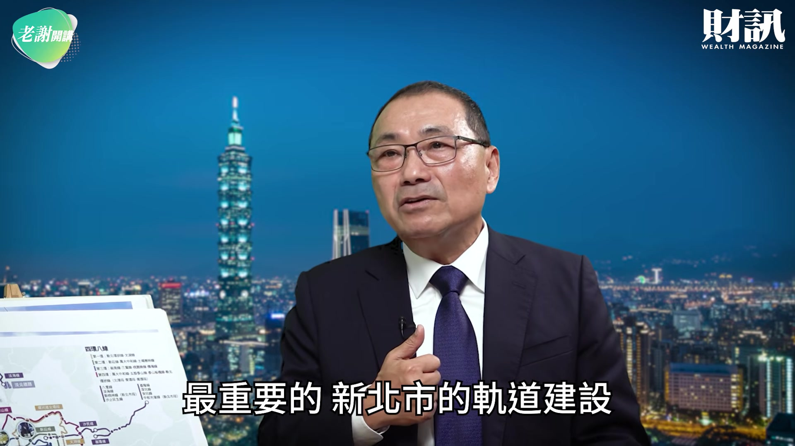

**逐字稿片段：** two significant developments: we’ve moved from the "Three Rings and Three Lines" to my "Three Rings and Six Lines ," and now to the "Four Rings and Eight Lines." Regarding these "Four Rings and

**話題推測：** 顯示捷運路網從「三環三線」演進到「三環六線」再到「四環八線」的演進圖。

---

## 00:04:38

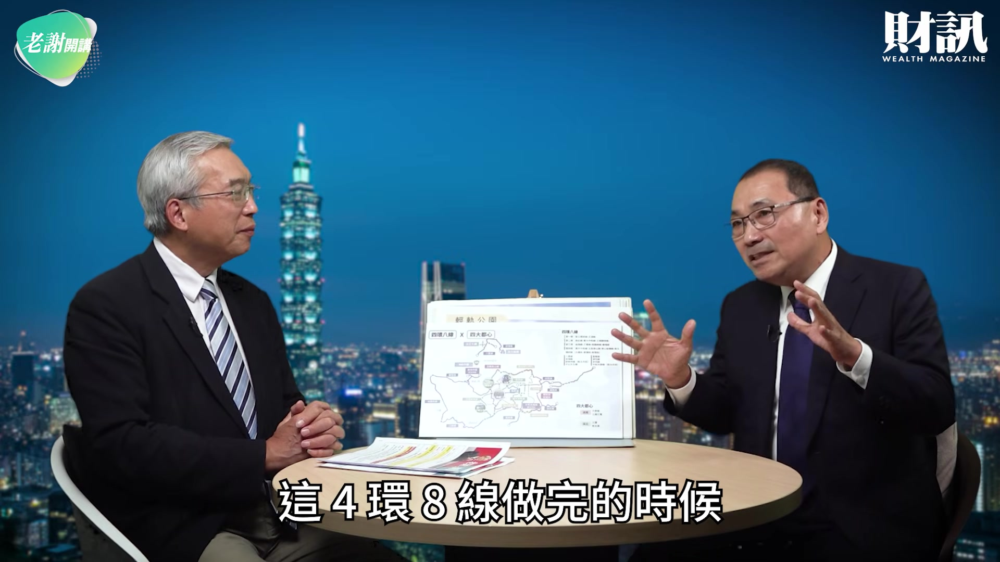

**逐字稿片段：** Eight Lines," we are even helping Keelung build their MRT in the north.

**話題推測：** 提及協助基隆建設捷運，延伸新北路網至北部，可能配搭路線圖。

---

## 00:04:46

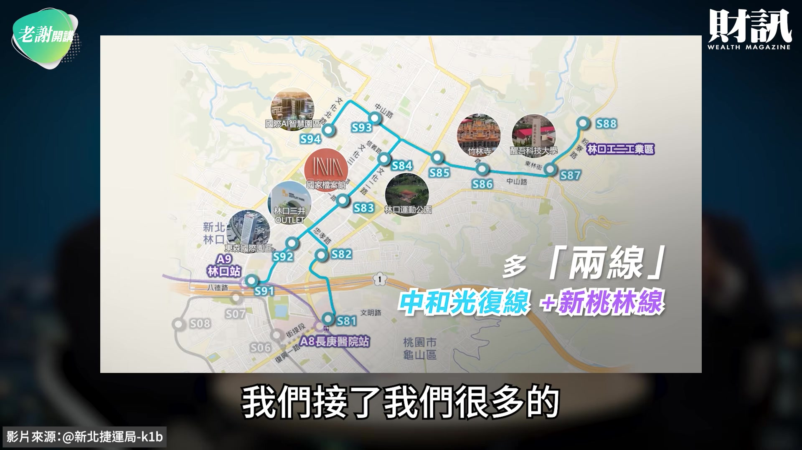

**逐字稿片段：** >> To the south, we connect to Taoyuan; our New Taipei lines connect to the San-Ying and Huilong lines, effectively shifting the hub of this network to New Taipei, which in turn boosts the entire region's functionality. >> The core significance lies in the transformation from Taipei County to New Taipei City, which relies on major construction and urban renewal. Eight years ago, when I took office, I said: wherever the MRT goes, urban renewal follows. >> So, that is why we will have 182

**話題推測：** 說明新北捷運路網向南連結桃園，包括三鶯線和迴龍線，可能配搭路線圖。

---

## 00:05:26

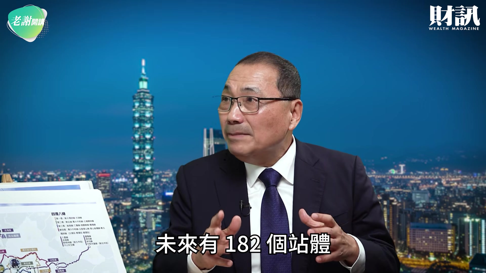

**逐字稿片段：** stations in the future. There are at least 35 key nodes among the 182 transit stations, including rail and road junctions. We implement urban renewal wherever the transit goes, leveraging floor area ratio incentives within a 480-meter radius to carry out large-scale redevelopment. I visited the Dachen urban renewal project with the mayor recently. You can imagine the high level of difficulty; the area was incredibly dense. Successfully redeveloping it, resettling the residents, and giving them a sense of honor and happiness is no small feat.

**話題推測：** 列出未來182個捷運站中35個關鍵節點的都更範圍圖。

---

## 00:06:01

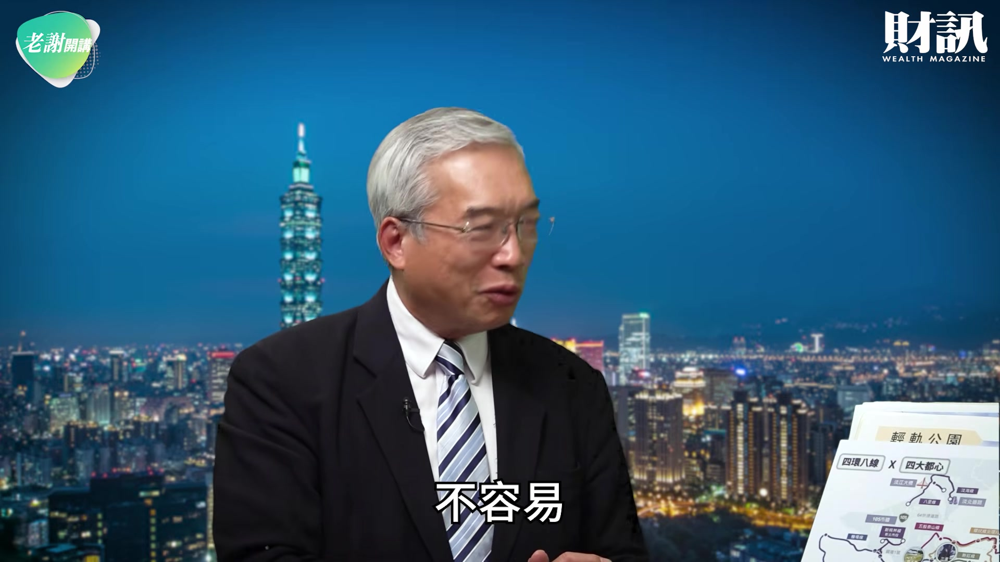

**逐字稿片段：** >> So, wherever we get the 8.6-hectare contribution, we carry out urban renewal. Through this, we can secure

**話題推測：** 說明都更案中8.6公頃公共設施用地的捐贈與再利用，可能配搭數據圖。

---

## 00:06:11

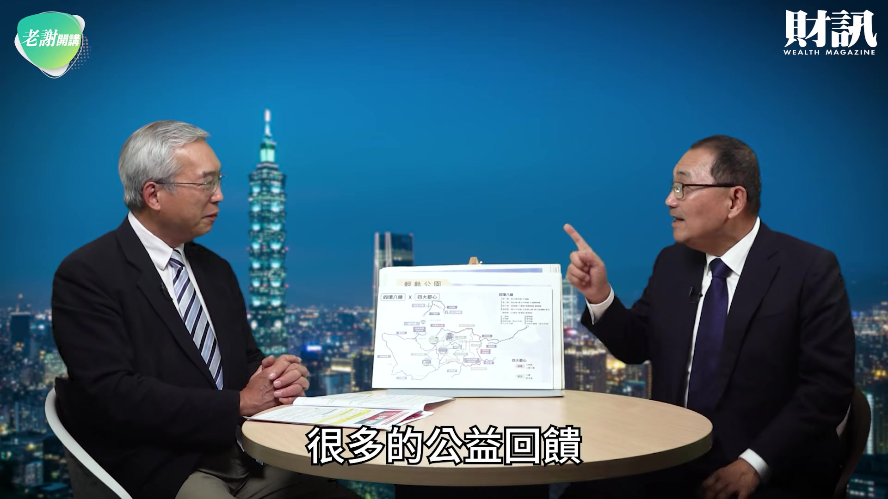

**逐字稿片段：** significant public welfare contributions, which we use to bring in private development for public day-care centers and community centers. >> As well as providing care for many people with disabilities. This is why I have been encouraging rail construction to drive urban development and secure public welfare contributions over these past few years. In recent years, we

**話題推測：** 展示都更帶來的公共福利設施，如公托中心和活動中心圖片。

---

## 00:06:32

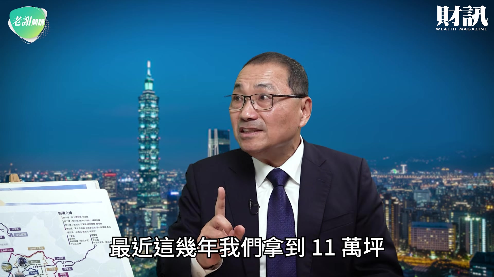

**逐字稿片段：** have gained 110,000 square meters of space. Think about it, that’s 110,000 square meters of floor space; much of our social welfare support relies on these public contributions. Urban renewal is transforming New Taipei

**話題推測：** 顯示近年透過都更取得11萬平方公尺公共設施空間的數據。

---

## 00:06:47

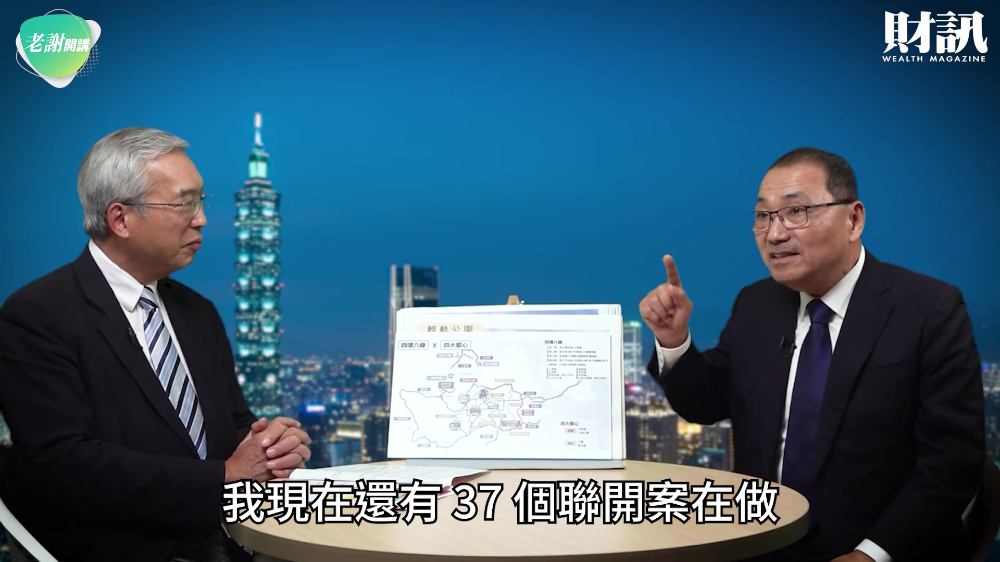

**逐字稿片段：** City's landscape, and I have 37 joint development projects aligned with our six major industrial layouts. New Taipei is different from Taipei. Beyond surrounding Taipei, New Taipei has a

**話題推測：** 列出37項聯合開發案與六大產業布局圖。

---

## 00:07:00

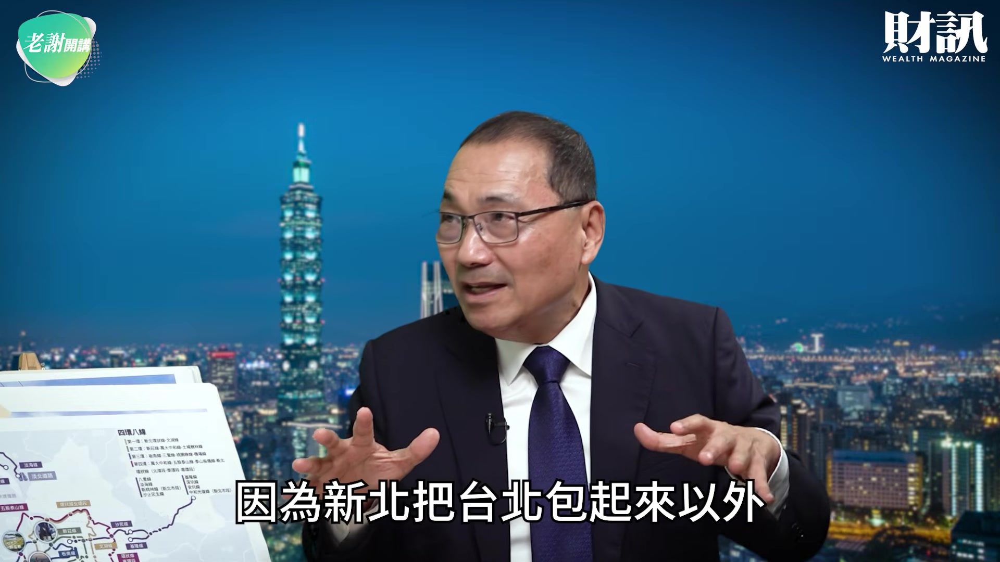

**逐字稿片段：** vast land area. While many headquarters might be in Taipei, the entire industrial supply chain, including factories and business sites, is mostly located in New Taipei. >> Now, I see a lot of AI-related enterprises in Zhonghe and Yonghe. >> Right. >> The industrial supply chain is vast, so the bulk of that volume is in New Taipei. Beyond the rail construction transforming our city, I have used it to build new urban centers. You stayed

**話題推測：** 比較新北與台北的產業分工與供應鏈分布，可能配搭地圖。

---

## 00:07:35

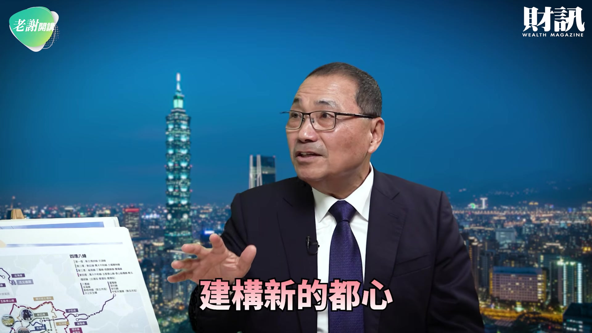

**逐字稿片段：** in Banqiao the other day, >> That is one of our urban centers. Yes, that center is beautiful; it has the skyline of an international city. >> That project is still moving forward. In fact, within my tenure, we have

**話題推測：** 展示板橋作為其中一個城市中心的面貌，可能配搭城市高樓景觀。

---

## 00:07:51

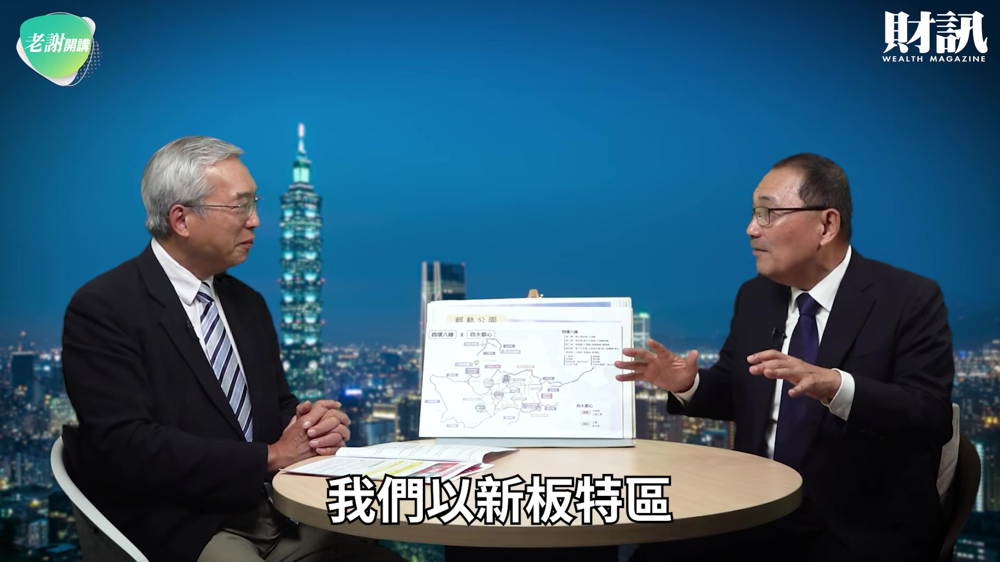

**逐字稿片段：** developed New Taipei into four major urban centers. The second center, which

**話題推測：** 列出任內推動的四大城市中心開發計畫地圖。

---

## 00:07:57

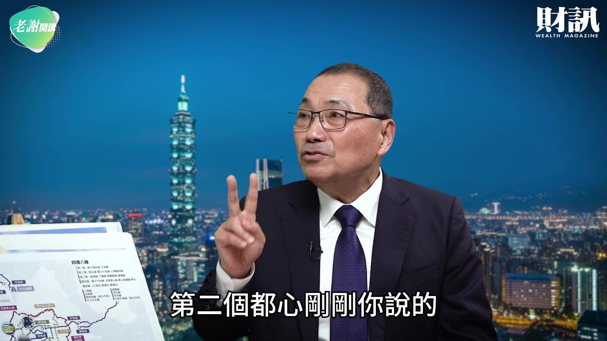

**逐字稿片段：** you just mentioned, is our Wenza. Once Wenza’s 400 hectares are fully developed, it will be 2.6 times the size of Taipei’s Xinyi Planning District. That is incredible. It’s like a blank canvas right now, waiting for us to paint upon it.

**話題推測：** 介紹第二個城市中心塭仔圳開發區，佔地400公頃，可能配搭地圖及面積數據。

---

## 00:08:12

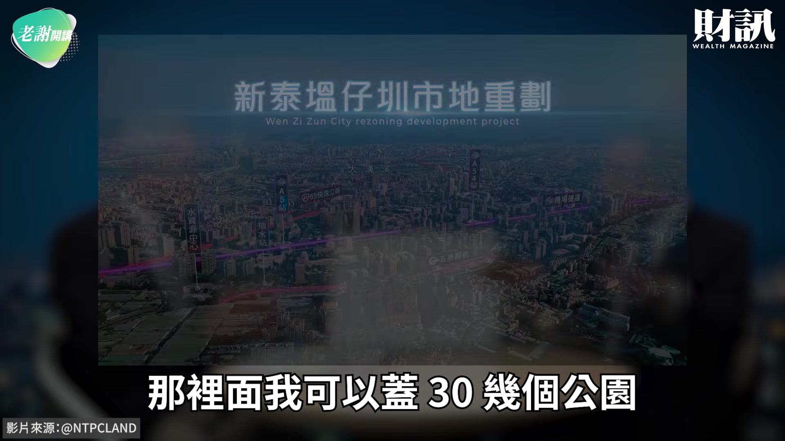

**逐字稿片段：** >> In that area, I can build over 30 parks . Future rail lines will run right through the center, and there will be schools, medical facilities, and a university. I will build a university town with industrial clusters and commercial zones to create another core district for New Taipei City. The neglected Wugu trash mountain nearby has been turned into an environmental park. Once the restrictions on Wugu are lifted, development there will accelerate. Together with neighboring Taishan, Fengjiang, and Wugu, that area will become our second core district.

**話題推測：** 詳述塭仔圳未來將建設30多座公園、軌道、學校、醫療與大學的願景圖。

---

## 00:08:47

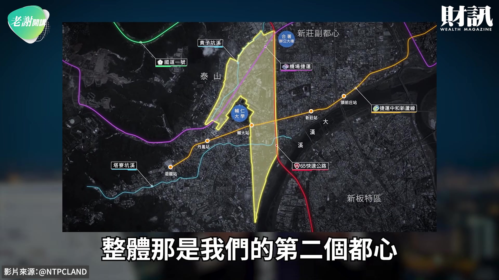

**逐字稿片段：** Where is another core district? Does everyone remember that highly controversial piece of land from back then—the Ting Hsin case? >> That plot of land in Sanchong, yes. >> That location is excellent, right next to the MRT station. >> Right. For the Sanchong area, besides improving our standard infrastructure, I am using that center as a focal point to expand outward. With the New Taipei

**話題推測：** 引導至第三個城市核心，提及與頂新案相關的三重土地開發區位圖。

---

## 00:09:14

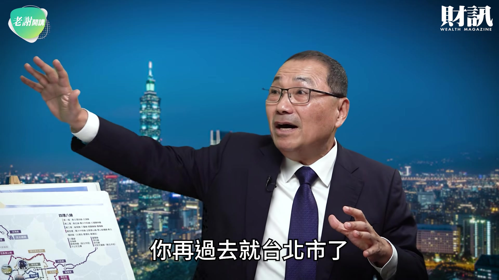

**逐字稿片段：** Metropolitan Park along the river, I am adding a second main library, which will cost about 4 billion. Rail development is also doubling; beyond

**話題推測：** 說明三重將建設大都會公園、第二座總圖書館（耗資40億）的規劃圖。

---

## 00:09:24

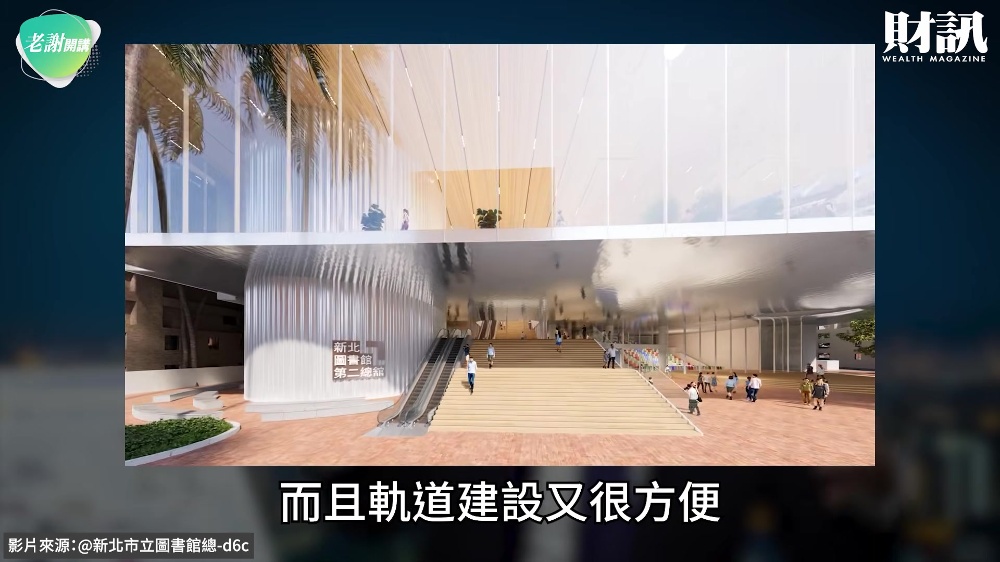

**逐字稿片段：** the existing station, we have the North Circular line and the future Wutai light rail. So, that land we originally acquired—We recovered over 40%of the land, and through public contribution, we are building a high-rise. That building has been under construction for six years during my term and will be completed this year. That building

**話題推測：** 說明三重捷運站將有北環線和五泰輕軌匯聚的交會圖。

---

## 00:09:47

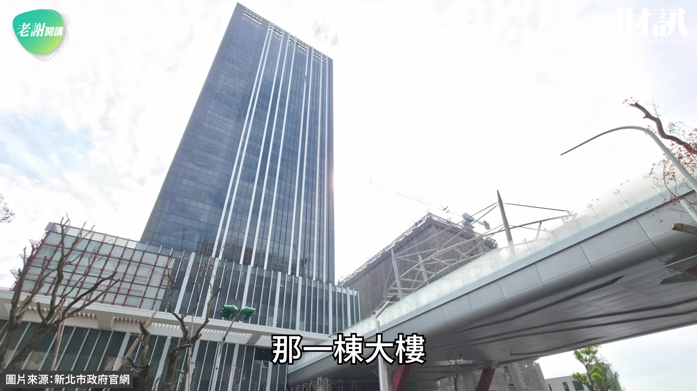

**逐字稿片段：** will become our security center. In the future, the Police Department, Health Department, and Transportation Department will all be located there, bringing 3,000 civil servants to work in that area. Why is it called a security center? That building will

**話題推測：** 介紹三重將完工的「安全中心」大樓外觀圖。

---

## 00:10:01

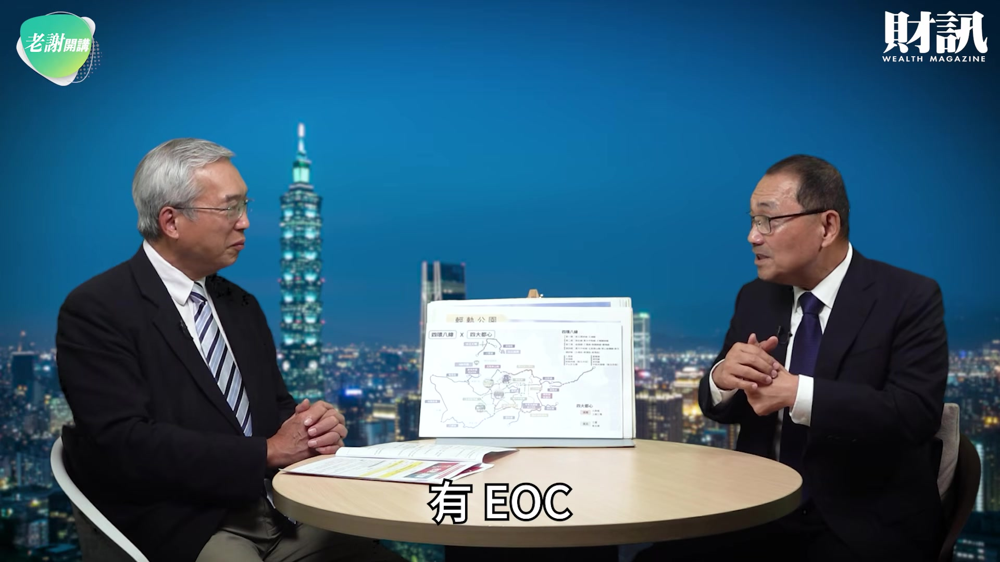

**逐字稿片段：** house the EOC, a smart disaster prevention center for pre-disaster management. It will include the Police Department's command center, the war room, the Health Department's food safety monitoring center, and the Transportation Department's traffic monitoring and control center. Everything will be digitized in this hub, acting as the heart that protects the citizens of New Taipei. By connecting these systems to optimize the environment and traffic, it becomes our third core district. There is another core district, which is the New Taipei Big Egg I just announced. The

**話題推測：** 說明安全中心將進駐警察局、衛生局、交通局，並帶來3000名公務員的列表。

---

## 00:10:37

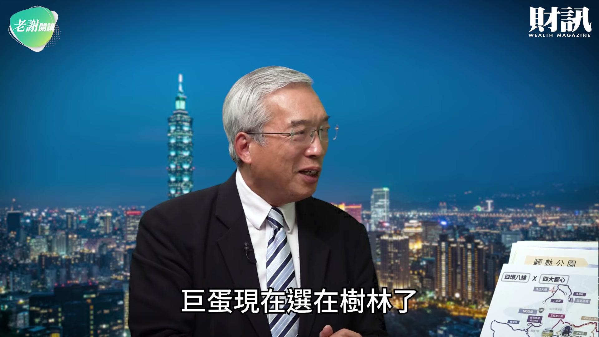

**逐字稿片段：** Big Egg is now set for Shulin. I originally thought it would be in Danshui, but I listened to many experts 'suggestions. After all, it shouldn't just be my opinion. It turns out that location is correct. Why? First, the land is large enough.

**話題推測：** 說明新北大巨蛋最終選址樹林的原因，可能配搭選址地圖。

---

## 00:10:52

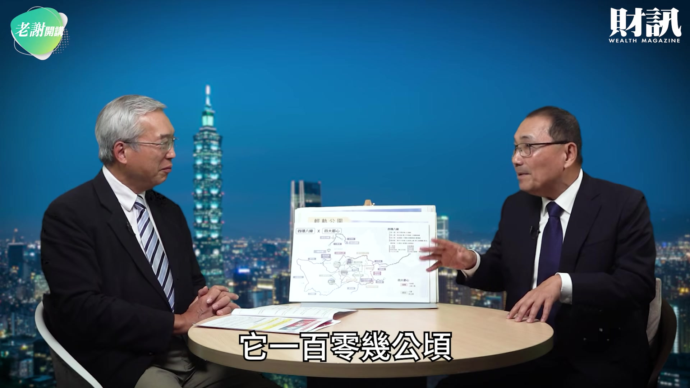

**逐字稿片段：** >> Over ten hectares of land in New Taipei City, so land development is consistent

**話題推測：** 指出樹林大巨蛋基地擁有十餘公頃土地的優勢，可能配搭面積圖。

---

## 00:10:56

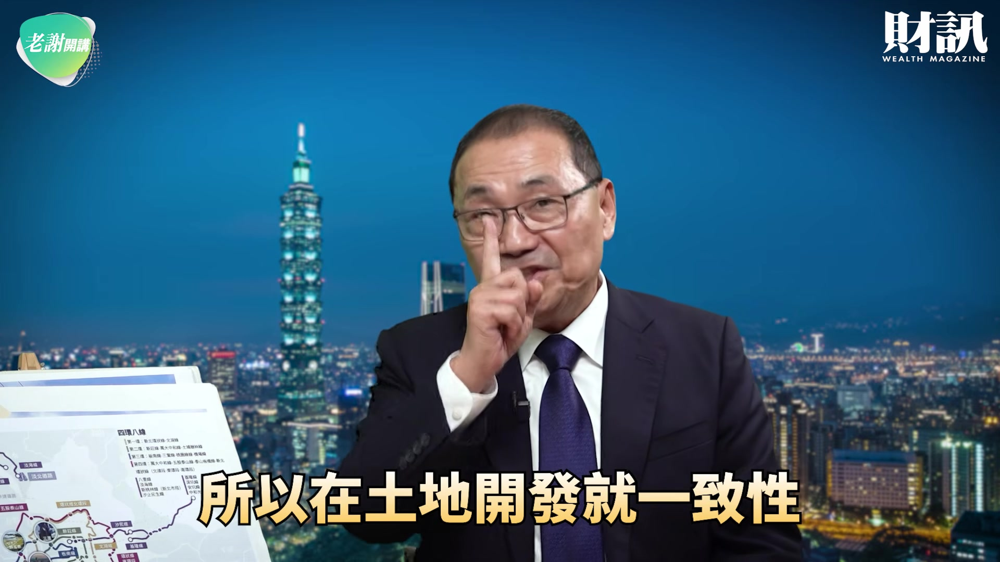

**逐字稿片段：** . Secondly, there's the Taiwan Railways , which is also our New Taipei line, so we have both Taiwan Railways and the MRT, and the MRT station is right there . >> Besides that, it connects to the 65

**話題推測：** 說明樹林大巨蛋的交通便利性，結合台鐵與捷運的交通網絡圖。

---

## 00:11:08

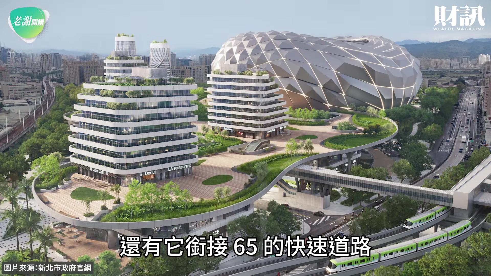

**逐字稿片段：** Expressway. I plan to designate 25 to 30 hectares to become a sports park. During the construction of the large stadium, zoning issues will be resolved quickly, so I estimate the preliminary

**話題推測：** 規劃25至30公頃的體育園區，並連接65號快速道路的規劃圖。

---

## 00:11:21

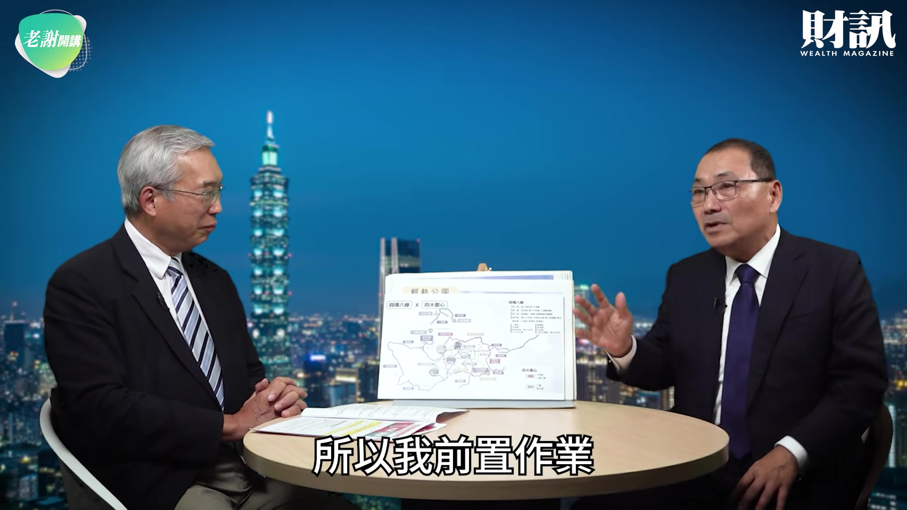

**逐字稿片段：** work can be finished within five years. Our stadium will have 50,000 seats, and we will build a large platform for the connection system. With the Taiwan Railways and the MRT lines, as our

**話題推測：** 預計大巨蛋前置作業可在五年內完成的時程表。

---

## 00:11:34

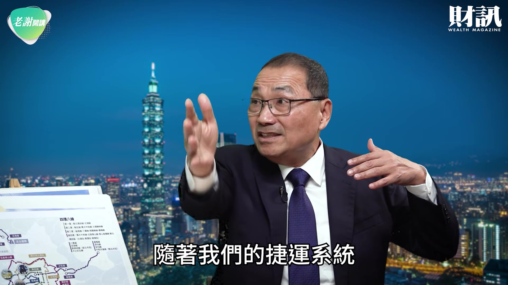

**逐字稿片段：** system is set to be completed in 120 months, the stadium's facilities will definitely be the most modern. The issue with current stadiums is their utility. Every time I visit, the biggest hassle is the venue transition —switching from a baseball field to a concert venue or for an exhibition. >> Nowadays, it can basically be converted

**話題推測：** 預計大巨蛋系統將在120個月內完工的整體工程時程表。

---

## 00:11:55

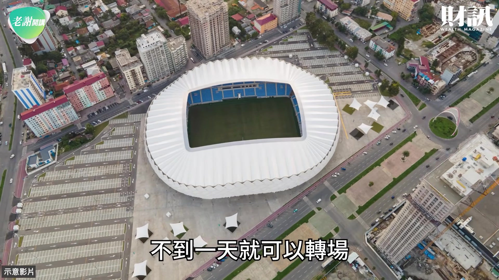

**逐字稿片段：** in less than a day, everything is automated with technology. I can go from a baseball field to a soccer field , then to a tennis court, using automation, so the transition time takes only a day. Take the Tokyo Dome

**話題推測：** 展示新式體育場能在一日內透過自動化技術轉換場地用途的示意動畫。

---

## 00:12:06

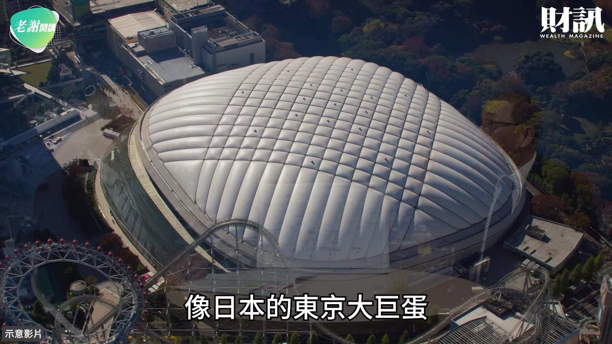

**逐字稿片段：** in Japan, for example; it is almost fully booked 365 days a year, with a lot of time spent on transitions. Because you are building it new and using a lot of new technology, there is more room for imagination. >> So this transition efficiency is crucial because, sometimes, the costs are all in the transition. If I only get three days for a concert and spend four days transitioning, it’s different from having six days out of seven, where the transition only takes half a day or a day. So, by using new technology and new methods to lead a highly practical, modern economic stadium, it’s not just for sports—

**話題推測：** 舉東京巨蛋為例，說明場地使用率與轉換時間的重要性，可能配搭圖片或數據圖表。

---

## 00:12:34

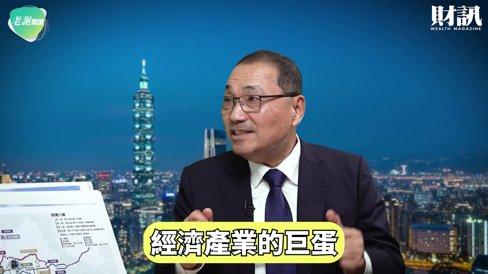

**逐字稿片段：** it’s an entire economic industrial chain. This economic industrial chain

**話題推測：** 強調大巨蛋不僅是體育場，更是帶動地方經濟的產業鏈示意圖。

---

## 00:12:38

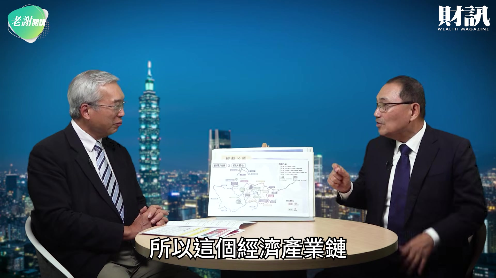

**逐字稿片段：** in Tucheng and Sanxia will make this area flourish. Moreover, this location is excellent, sitting right outside our transportation hub. Taipei is just a stone's throw away, and we are at the

**話題推測：** 指出大巨蛋將帶動土城、三峽地區的經濟產業鏈發展，可能配搭地圖。

---

## 00:12:48

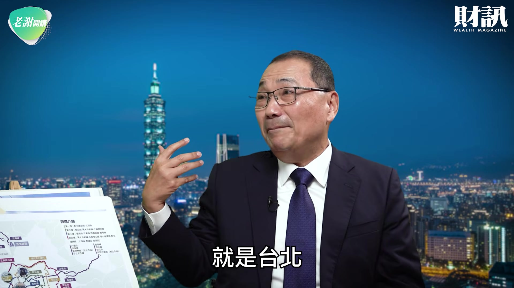

**逐字稿片段：** center point where we can reach both Taipei and Taoyuan in about half an hour. >> Taking the MRT now is much faster than taking a taxi or anything else. I went to Tucheng the other day, and I was

**話題推測：** 說明大巨蛋區位優勢，半小時內可抵達台北、桃園的交通時間圖。

---

## 00:12:58

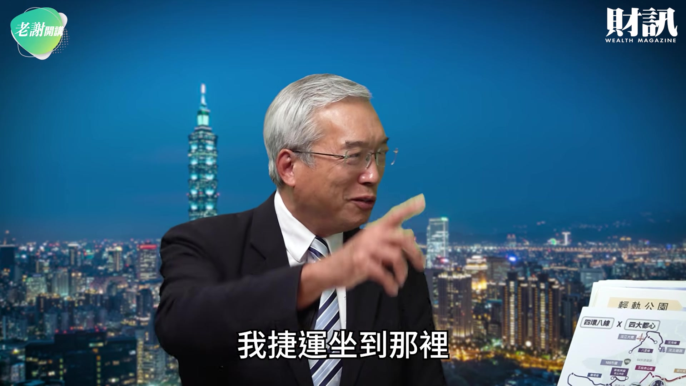

**逐字稿片段：** surprised that the MRT took only 18 minutes to get there; I can't imagine how long it would have taken to drive to Tucheng. In the past, those of us living in Taipei rarely looked toward this area, but looking at it now, it's not bad at all. In fact, our future outlook and vision for land development are clearly centered on the growth of the Tucheng-Sanxia region. In addition

**話題推測：** 分享搭捷運前往土城僅需18分鐘的個人經驗，可能配搭路線與時間圖。

---

## 00:13:22

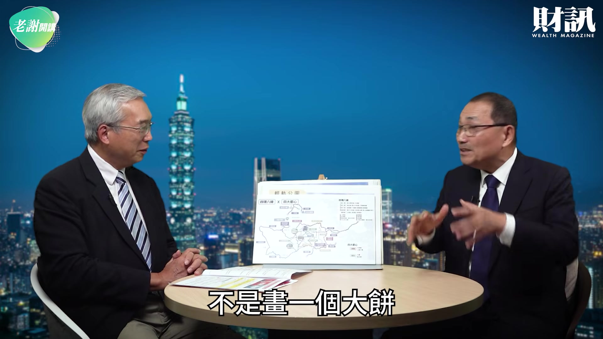

**逐字稿片段：** to the main stadium itself, there are two other large plots of land nearby. >> Yes. >> There’s the one next to the Linkou North Side development, and another

**話題推測：** 指出大巨蛋周邊還有兩塊大型土地可供開發的示意圖。

---

## 00:13:33

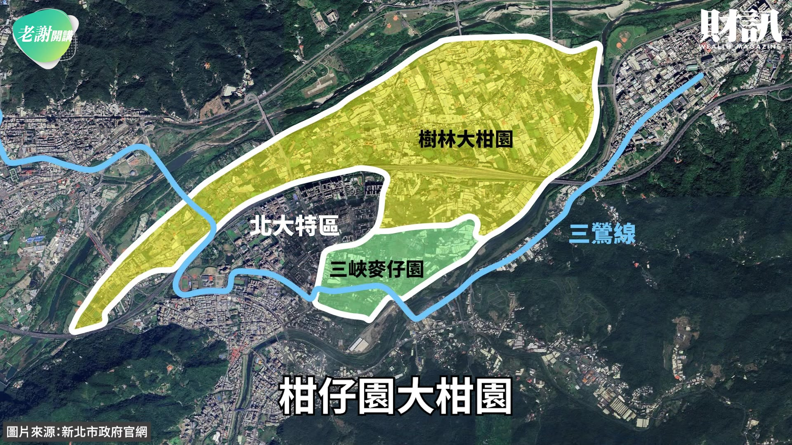

**逐字稿片段：** even larger one covering about 621 hectares. These will become industrial-type urban areas in the future, conveniently located right next door. Its development goes beyond just the sports economy; it can also attract significant industrial growth to those two adjacent sites. Once this fourth urban center is established, along with the development of our rail infrastructure, New Taipei City’s entire urban and rural landscape, its metropolitan character, and its industrial economic corridors will be transformed. We can see this taking shape over the next ten years. I have laid the groundwork, the foundations are already complete, and we have begun planning for the future. The roots planted by those before us are now bearing abundant fruit. I believe that under Mayor Hou's efforts, your successor will be very fortunate. When

**話題推測：** 詳細說明其中一塊土地位於林口北側，面積達621公頃的地圖與面積數據。

---

## 00:14:29

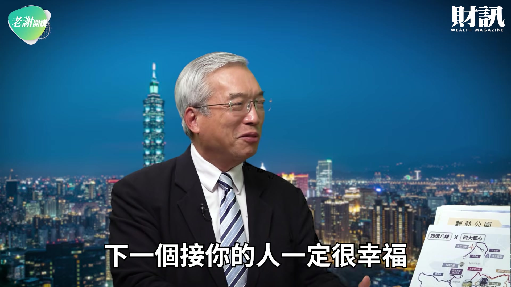

**逐字稿片段：** I visited the mayor's office, I saw the goal of "living in peace and working with joy," and it seems that this objective has been almost entirely achieved. Furthermore, from the perspective of "working with joy," what you have brought to the citizens of New Taipei City these past few years, including employment and industrial clusters, shows that New Taipei City has truly become a self-contained industrial hub. >> Yes, for New Taipei City, what matters

**話題推測：** 顯示侯市長「安居樂業」的施政目標與達成情況的標語或願景圖。

---

## 00:14:51

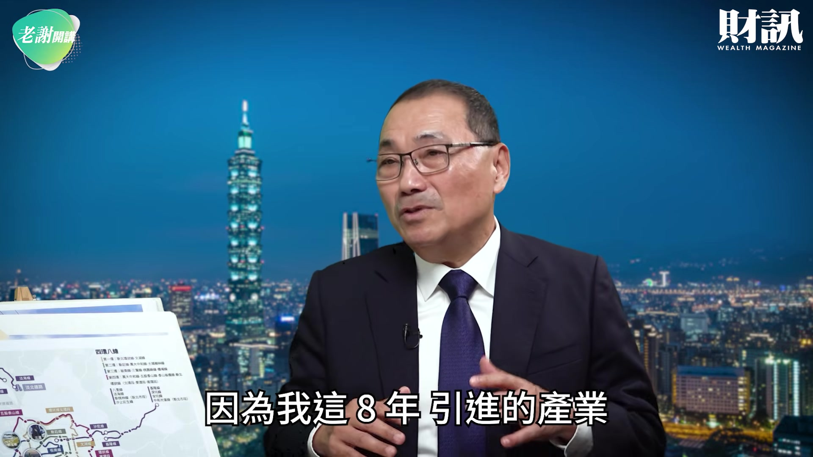

**逐字稿片段：** most is the classification and layout of the industries I have introduced over these eight years. For areas like Bali, Linkou, and Tamsui, we have the Port of Taipei, so I brought in these industries to develop here; for example , logistics will thrive in this region, which makes transportation crucial. Regarding the Danjiang Bridge you

**話題推測：** 展示八年來新北市各區產業分類與布局地圖。

---

## 00:15:10

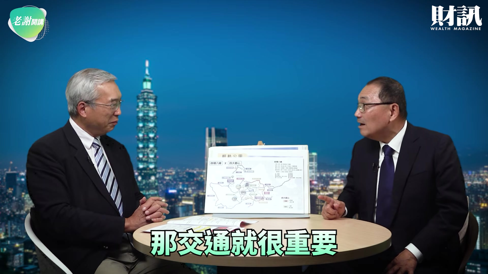

**逐字稿片段：** mentioned earlier, it used to take an hour to get from my office to Tamsui Fisherman's Wharf, but now it only takes about 25 minutes. As logistics develop and transport improves with the opening of rail lines, roads, and bridges, the logistics zone in that area will gradually come together. I also have a future idea regarding a road that is very difficult to travel, leading to the Linkou Golf Course. >> There’s a small path behind it. Exactly, that path is hard to navigate,

**話題推測：** 再次提及淡江大橋縮短辦公室到淡水漁人碼頭的時間（1小時變25分鐘）的交通時間對比圖。

---

## 00:15:37

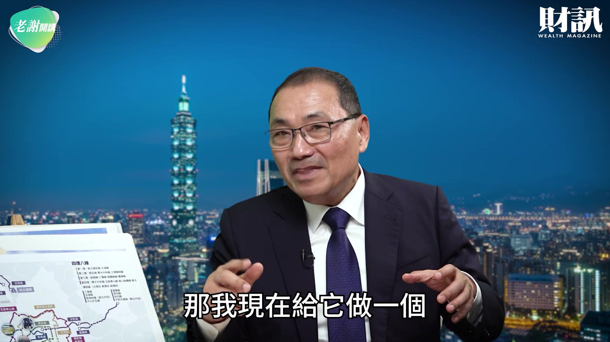

**逐字稿片段：** so I am planning a dual-way bridge that leads directly to the Linkou Golf Course. In the future, this will connect to National Highway 1, ensuring that the industries in the Port of Taipei, Bali, and Tamsui areas can thrive without getting stuck in the traffic network. >> I see major construction works in Bali

**話題推測：** 規劃連接林口高爾夫球場的雙向橋樑規劃圖。

---

## 00:15:53

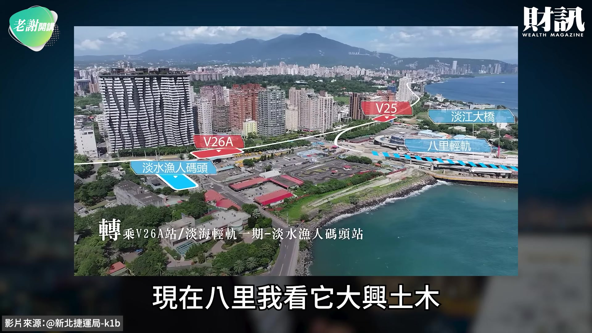

**逐字稿片段：** right now. Yes, Bali is now a logistics hub. I've always thought about the Keelung MRT. The line would go from

**話題推測：** 展示八里地區目前的大型建設與物流中心現況圖。

---

## 00:16:01

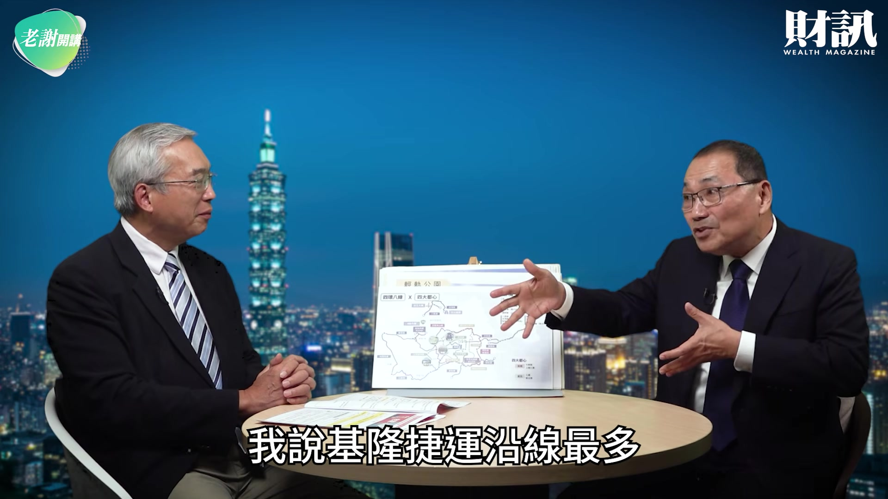

**逐字稿片段：** Bali to Xizhi. Many container yards and depots, in the future industrial development, will relocate those current sites to Bali because that original area is no longer suitable; it was for Keelung Port, but it will shift to Taipei Port, so the industrial corridor—The logistics industry, including Linkou. Linkou is crowded now . I once led a group that wanted to stay there, but the hotels were all full. There’s no helping it, because when we were planning, the population was 70,000; now it’s nearly 140,000. And foreigners now wanting to stay there are finding it difficult. I— >> We built a few schools, like the Morrison Academy, then Kang Chiao came, and later a Canadian school branch also opened. There are many international schools. Education came first, and I also built several large, beautiful parks. At the time, we also brought in

**話題推測：** 提出基隆捷運從八里延伸到汐止的規劃路線圖。

---

## 00:17:03

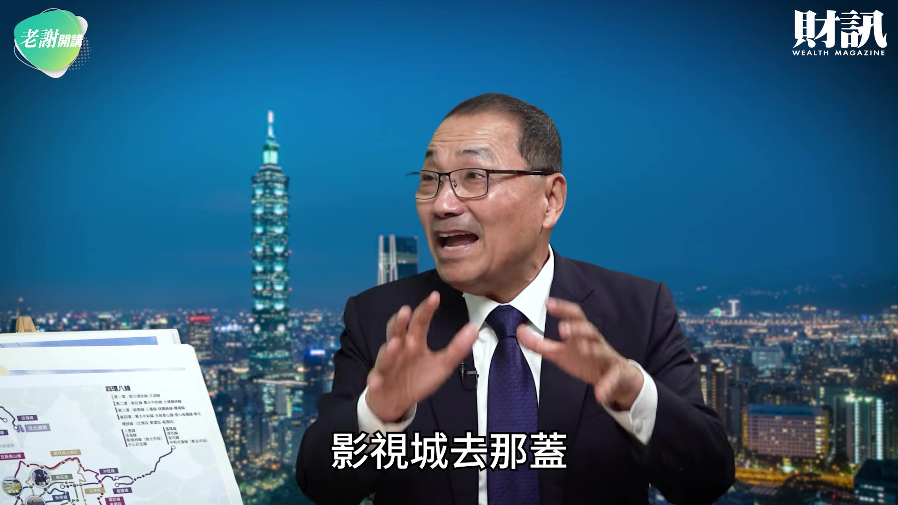

**逐字稿片段：** the FTV Media Center, which is now very lively. >> That will be finished by the end of this year; it’s also a film and media venue. Beside the A9 station, in the back, is an industrial zone. The land is already prepared and handed over.

**話題推測：** 提及民視媒體中心的進駐與活絡，可能配搭建築或活動畫面。

---

## 00:17:19

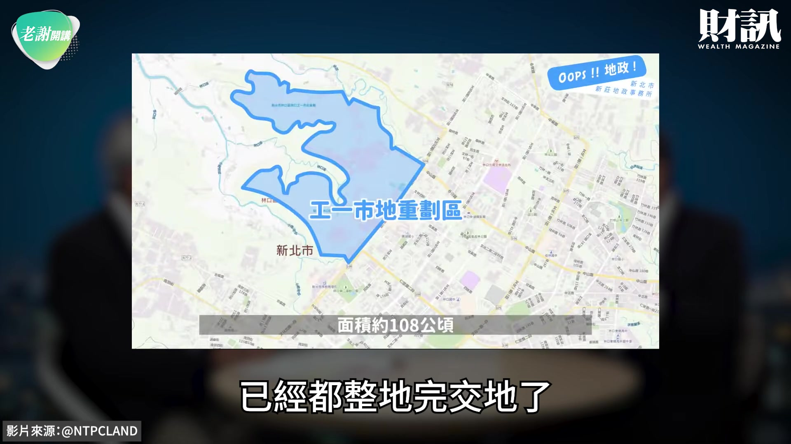

**逐字稿片段：** ASML and many other industries have moved in. So, that area is not just a film and media park, but also a technology park. Linkou also needs to integrate with Wugu and the Huadian area in Taishan, so it’s actually a very good film and media industrial park. Looking back at the San-Ying line

**話題推測：** 展示A9站後方的產業專區，已有ASML等多家企業進駐地圖與企業標誌。

---

## 00:17:39

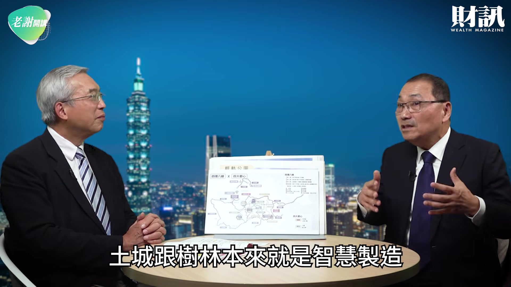

**逐字稿片段：** , Tucheng and Shulin were originally hubs for smart manufacturing and high-tech industries, gradually moving toward the Yingge area. As I mentioned,

**話題推測：** 回顧三鶯線沿線土城、樹林智慧製造與高科技產業發展，並延伸至鶯歌的產業發展地圖。

---

## 00:17:51

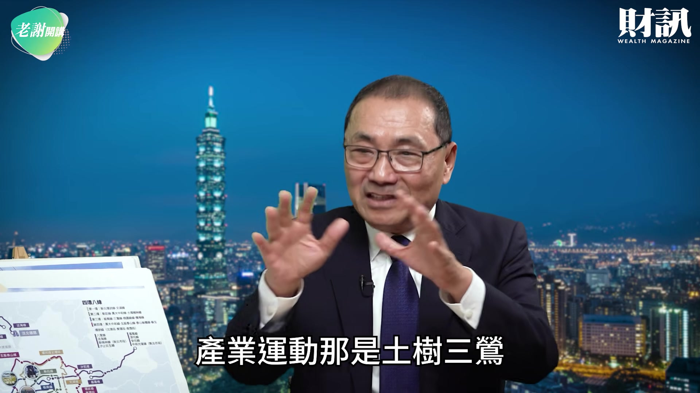

**逐字稿片段：** sports and technology are in the Tu-San-Ying area. Smart manufacturing is in Tucheng and Shulin, while the New Taipei City Art Museum combines with our Yingge Ceramics Museum, Hakka Culture Park, Sanxia and Yingge Old Streets to form a corridor of traditional arts and culture. Many foreigners now like to take the MRT to see the museums and visit the industrial parks, which focus on

**話題推測：** 總結土三鶯地區發展主軸為體育與科技的關鍵詞圖示。

---

## 00:18:23

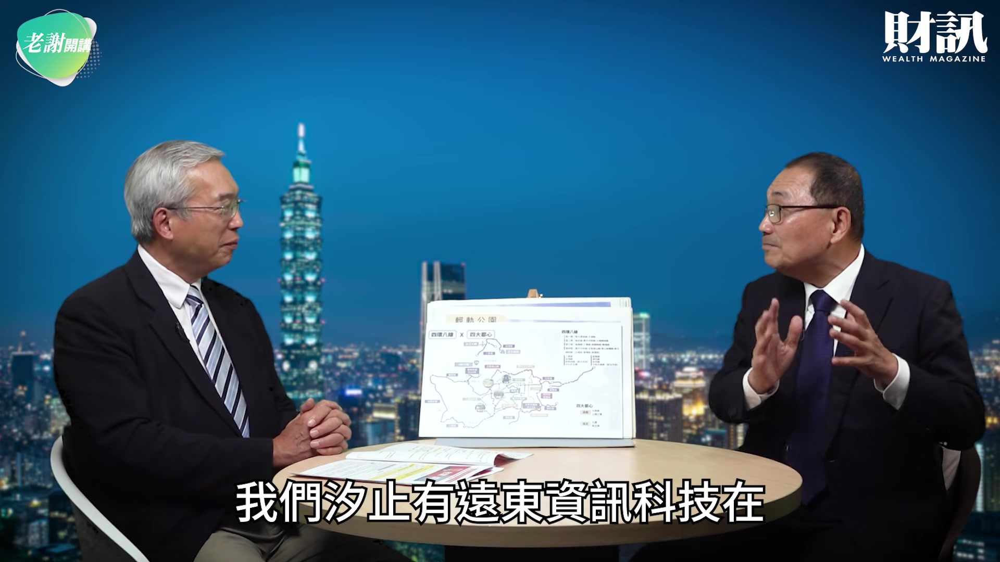

**逐字稿片段：** biotechnology, information technology, and electric vehicles. Our industrial corridor layout is very clear. And of course, Banqiao has the

**話題推測：** 指出產業園區重點發展生物科技、資通訊、電動車產業的圖示。

---

## 00:18:34

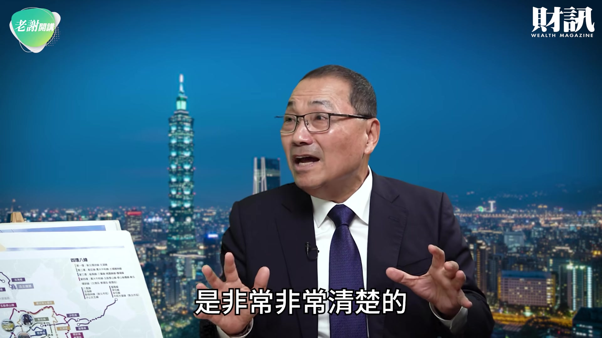

**逐字稿片段：** telecommunications park. We combine the medical and telecommunications sectors right here in Banqiao, and Foxconn is nearby. So, our industrial corridors and urban planning are all developing along the rail lines. You've spent eight or sixteen years building up New Taipei City, and you know it by heart, every corner, and every detail so clearly. To govern a city with all your heart, I feel that is the greatest achievement and the most fulfilling part of life. So I’ve been thinking, if the next administration in Taiwan were to ask you to take charge, I think —in my mind—you are an excellent candidate. You mentioned that the mayor might be ready to pass the torch. After doing so, I’d really like to know what plans you have for your own future . Would that be alright? >> Thank you. Working with joy is what matters most. Life is about doing your job well and seeing how Taiwan develops and moves forward. Yes, perhaps next time you can share some of your reflections. Just think, throughout

**話題推測：** 說明板橋的電信園區發展現況圖。

---

## 00:19:35

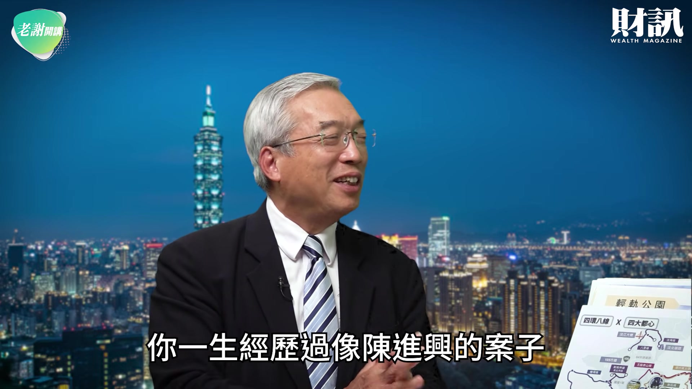

**逐字稿片段：** your career, you’ve handled cases like the Chen Chin case, and so many other major ones. I imagine one day, reporters will come to see you to look back on your life and all the obstacles you've overcome. >> I’ve had two main careers: one as a criminal investigator, and the other, my sixteen years working for New Taipei City. Although they are different fields of work, the core remains the same: loving this land with all my heart. So, having walked this path for 50 years, I am truly grateful to everyone who has helped me. I am deeply thankful to the citizens of New Taipei City for their support, and to my colleagues for fighting by my side. >> In your lifetime, among all the political figures I’ve known, you are one I truly admire. So today, congratulations to Mayor Hou on your successful tenure. At the same time, I believe your life won't stop here; there will be an even better future, and we look forward to seeing your next chapters be even more brilliant. Thank you so much, Mayor Hou, for all you have contributed to the development of New Taipei City throughout your life. I believe the citizens will always hold that gratitude in their hearts. It’s been an insightful conversation today. Thank you, Mayor, and thank you all for watching. See you next week. >> Thank you all.

**話題推測：** 提及市長過去偵辦如陳進興案等重大案件的經歷，可能配搭資料畫面。

---
