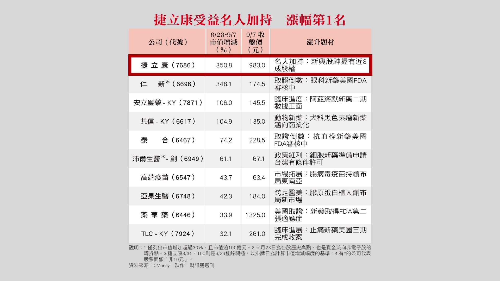
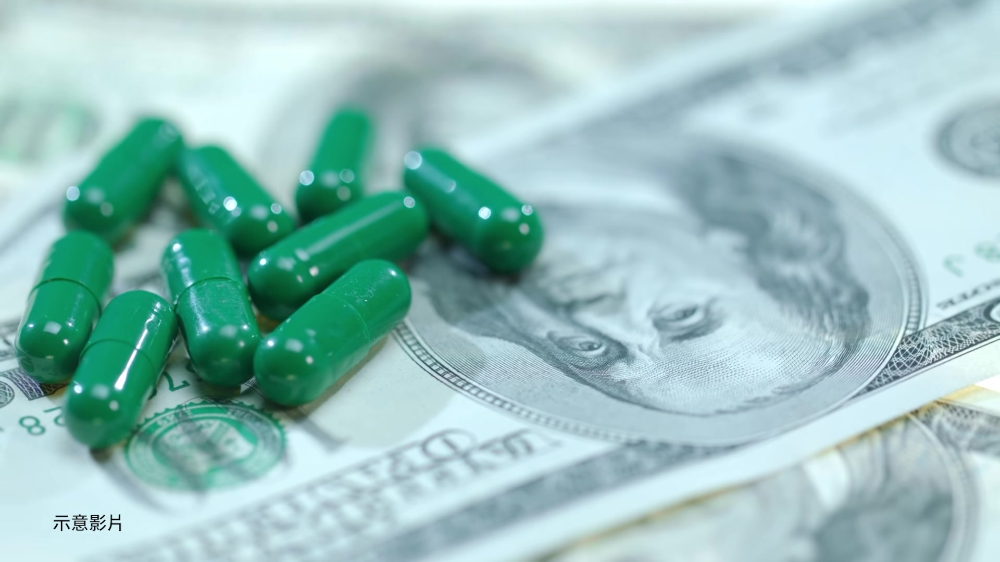
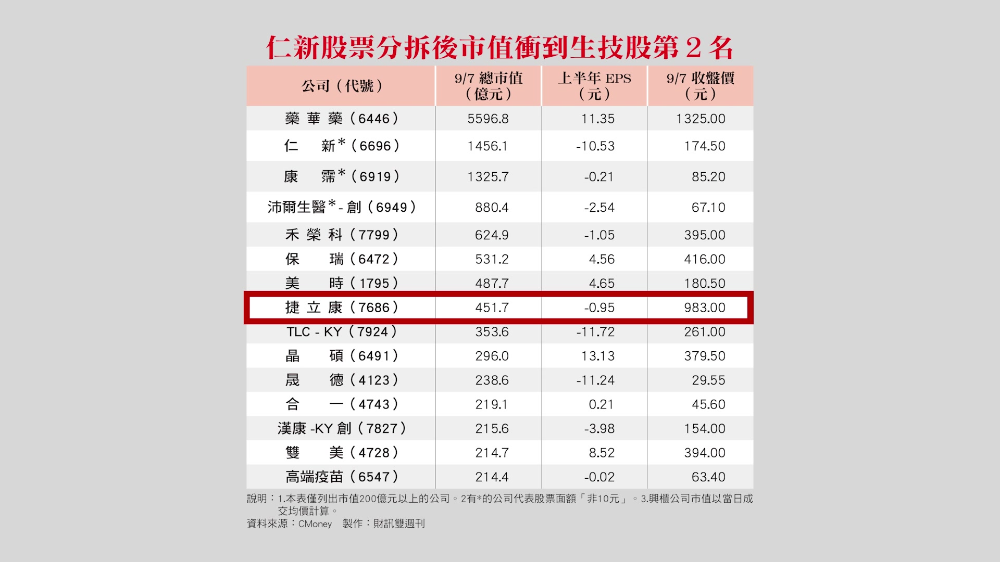
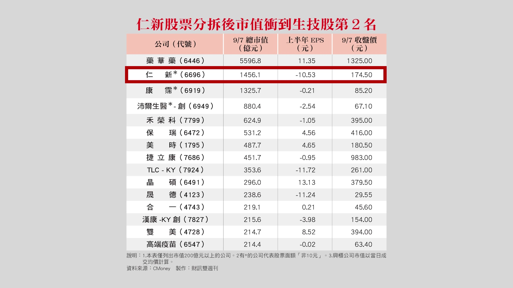
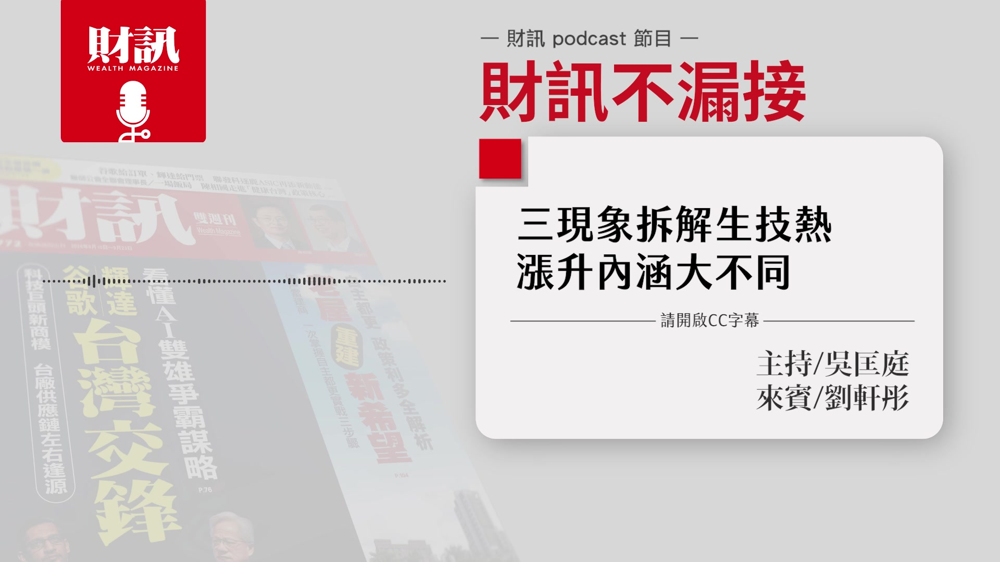

# wealth1974_kDBwZJ7kMxQ — 關鍵畫面索引

- 來源逐字稿：[wealth1974_kDBwZJ7kMxQ_GT.srt](wealth1974_kDBwZJ7kMxQ_GT.srt)
- 影片：https://www.youtube.com/watch?v=kDBwZJ7kMxQ
- 截圖數：12

## 00:00:03

**逐字稿片段：** 三個現象拆解生技熱潮 漲升的內涵大不同 想要知道的聽眾朋友 記得聽到最後 今天的來賓是 財訊的總主筆劉軒彤 各位聽眾朋友大家好 我是軒彤 好 節目開始前也提醒大家 這是財訊的 Podcast 節目 如果是透過 YouTube 平台來收聽的聽眾 可以打開右下角的CC字幕 那我們就開始吧 那首先第一段 我們先來看一下最近的市場動態 最熱的就莫過於 Apple 它發表的新機 是 我是 iPhone 的死忠的 果粉就對了 應該也不是 那是因為剛開始有那種 進階到智慧型手機的時候 我第一台就是用 iPhone 因為那個時候是跑鴻海 那鴻海 不是幫它代工嗎 所以我們就要去體會那種感覺 所以第一台用 就不自覺的就用到現在 18 代 讓大家比較意外的是 以往啦 就是新款的手機發布之後呢 舊款會降價 但這一次沒有 舊款不降 反而還漲價 然後還有一個就是 它們發表苦苦等待已久的 折疊式 對 沒錯 不過好貴 大概 75000 看到那個新聞講說 中國好像傳說黃牛 還賣到合台幣大概幾十萬 當然那個是傳言啦 不知道是真還假 可是確實有人就開價 就是要搶第一手這樣子 沒錯 然後呢 比較主力型的旗艦型的產品 像是 iPhone 18 Pro 或 Pro Max 或者是折疊機我們剛剛講的 Duo 它是搭載台積電 2 奈米 製作出來的 A20 Pro 的晶片 那另外一個大家討論度也滿高的 就是它的那個 Siri AI 終於要登場了 大家一直過去都認為 Siri 不夠聰明 那之後我們就會期待看看 到底有沒有什麼不一樣 對 有一個聰明的 AI 伴侶 好 那另外一個市場關注的就是 這一週是超級央行週 就是包括美國 台灣 日本的央行 都會做出利率決議 另外一個市場關注度滿高的 就是那個 AI 的議題 就是 Anthropic 的執行長 他就說覺得現在應該要回頭 更加強安全的防護措施 要放慢 AI 模型的開發速度 他一講這件事 結果 OpenAI 的執行長奧特曼 還有馬斯克 他們都表態支持 那唯一比較不認同的 大概就是川普總統 他認為 AI 持續的發展 還是利大於弊 其實也跟大家分享一下 就是 Anthropic 它預計 今年 年底應該要掛牌上市 然後也有可能會改寫 美國 IPO 的金額的紀錄 有可能會超越之前 就是最大的 SpaceX 的上市規模 OpenAI 可能今年底 就可能不太會上市這樣子 所以基本上這個就是 資訊安全的問題 愈來愈多駭客跟那個惡意的組織 在那邊濫用這些 AI 所以他們的希望是 踩煞車是希望 資訊安全能夠做得更好 那個川普的話 他基本上就是選舉前 什麼事情都不要發生 就是要照我以前的規矩就好了 其實 AI 還是個趨勢啦 好 那在國際政經局勢就是說 我們錄影時間是 9 月 14 日 原油價格又破百美元 那原本就是美伊戰爭 所以荷姆茲海峽它有一些封鎖 無人機攻擊沙烏地阿拉伯 所以它上個週末 把重要的油管把它封閉了 沒錯 那能源狀況又更吃緊 那可能也會讓通膨壓力更高啦 是 那我們也會持續的追蹤 好 那接下來就進入我們今天的主題 好 最近股市真的是 盤勢是滿黏的 有一點想要創新高 又沒有 那又回來這樣子 就是夾雜在 AI 趨勢 那些多頭還是有 可是問題是 就是像我們剛剛講的 超級央行週這個 整個把大家整個都搞亂了 對 所以就是盤整 但是我們有觀察到一個現象 就是雖然大盤是盤整 但其中有一個族群 就是生技類股 統計來看是從 6 月中旬 然後到現在 有一波漲勢這樣子 對 我在 772 期的財訊雙週刊 有稍微點了一下 那個時候 因為我們是計算到 9 月 7 日 當時我們是用 6 月 23 日為基準 為什麼是 6 月 23 日 6 月 23 日就是台股 衝破 48000 點的那一天 台股的歷史高點 從那一天開始以後 你就發現到現在 加權指數其實是黏著的 就是震盪的 好 我們就算到 9 月 14 日 其實我剛剛稍微算了一下 加權指數從那個高點 到現在大概跌了逾 2% 跌逾 2% 可能還好 就是在這個區間 可是生技股 同樣的時間 它是反向大概超過 3% 之前我在寫的時候 因為是到 9 月 7 日 那時候是反向漲了 10% 那最近有一些下來一點點 但是你還是可以看到 就是它相對於大盤來說 生技股是往上的 所以你可以感覺到說 有一些資金 它所謂的避險 當然金融可能是很大的一個區塊 也有一些資金會走到這些生技股 看有實質支撐的股票裡面 當然它會選 那漲幅最大我們好奇 漲幅最大其實就是 最近大家在講那個捷立康 其實捷立康是 8 月 31 日才掛牌 那在我寫稿的 9 月 7 日的時候 它已經盤中超過 1000 元 它幾元掛牌

**話題推測：** 節目主題與標題頁：三個現象拆解生技熱潮

---

## 00:04:59

**逐字稿片段：** 8 月 31 號才 200 元 那 6 個交易日內 就衝破 1000 元 一些投資人他會覺得 我就是追 就是線型走東北角的強勢股 那可是如果你真的去追它的話 是對的嗎 沒有所謂對錯 但是我們就在討論這件事情說 為什麼會有一個公司是走這麼快 剛掛牌 那到底它是什麼公司 所以那時候我們才會想說 寫一寫評論這樣子 像我們社長就一直在講 就是公司要有基本面 你要有獲利 要有營收

**話題推測：** 捷立康股價從200元飆升至1000元的走勢圖

---

## 00:05:30

**逐字稿片段：** 那我們就回來看一下 捷立康它的基本面是怎麼樣 我們這樣講好了 在台灣生技醫療股 其實真正的分類叫生技醫療族群 這個類股 那證交所的生技醫療類 把所有保健品 醫療食品 生技或者醫管什麼那些 它都放在同一個籃子裡 那在美國那邊 因為它很成熟了 它們的投資人會分得很清楚 什麼叫生技 生技就是高投入 燒錢燒很多 它可能高報酬 可是也非常高的風險 它一旦一支藥成功 它就報酬率很高

**話題推測：** 捷立康公司基本面或產品介紹

---

## 00:06:01

**逐字稿片段：** 你看藥華藥一樣 一下就這樣 一直爆賺 那同樣你要是失敗的話 可能血本無歸 那有一種叫做醫材或者醫療 或者它們是大型製藥 就像你說你看那個什麼輝瑞 羅氏 什麼這些 你不會看到它什麼 賺很多又突然變成虧損 它是比較平穩 它們因為夠大了 它就是一個穩定的製藥公司 它會有新的產品在承受風險 但它舊的產品一直在賺錢 所以它是完全不同 或者它保健食品或醫療 它那種東西是有區隔的 可是我們台灣就因為 證交所把它放在同一個類股 它可能覺得它還不夠大 所以它放在一起 所以我們都統一叫生技股 但生技股其實有很大很大的差別

**話題推測：** 藥華藥股票走勢圖或公司營收圖作為新藥成功案例

---

## 00:06:38

**逐字稿片段：** 捷立康也是生技股 那它是主打增脂 像康霈是減脂 局部減掉你的脂肪 是屬於減肥 捷立康它是屬於說 譬如說有些女性術後 乳癌術後 她切除部分組織 她覺得說那個地方比較垮 她希望能夠重塑她乳房的形狀 那它的想法是說 它們用一種分子這樣打進去 它就會增脂 那個東西因為它 偏醫美嗎 對 它目前是偏向醫美 當然它宏大的理想是說 它將來因為生病 而沒有脂肪的時候 你可以(使用) 但是那個太長遠 最主要是因為 到現在 它還處在動物試驗 就是才做完老鼠 那現在 在做那個大型的動物 因為才在動物試驗 所以你還沒有東西 那也許它有一些醫美的產品 會先出去 可是醫美的東西不一樣 就跟我們的生技的那種 高報酬的想法是不同的 對 所以大家會覺得說 你也還沒有做什麼 你也才剛開始轉型做這個 可是你從 200 元漲到 1000 元 而且在 5-6 天之內 最重要的是 它今年 2 月的時候增資 才 40 元 然後到了 7 月 就變 200 元 然後就一上去 又變 1000 元 所以大家會覺得說 這個現象是值得探討 我們沒有說它一定是錯的 不會成功 而是說 這個現象要注意一下 所以我們這次 我就有看到軒彤姐 盤點出了三大現象 那我們就一個一個來談 首先第一個 第一個就是名人光環 其實這在康霈的時候 有看到一點點 但是康霈是後來漲很高的時候 我想大家還記得康霈那個 那個時候我們有寫過 它有一些少年股神有買 可是他們都是在它漲上去 已經後段的一點點在買 並不是從頭 可是這一次的捷立康完全不一樣 它現在最大股東 至少八成 都是在這些所謂的 我們的新興的股神 尤其是少年股神 那有一個就是

**話題推測：** 捷立康（增脂）與康霈（減脂）產品應用比較圖

---

## 00:08:21

**逐字稿片段：** 我們曾經財訊寫過的優式資本 就是標下大谷翔平那顆球的優式資本 優式資本基本上就是一個創辦人 叫劉興漢 那他是叫做套利王 他們做那個量化高頻交易 賺很多錢 那他就是最大的 他大概占了逾 60% 跟他的公司 等於是他 不管是優式或者是劉興漢 加起來就逾 60%

**話題推測：** 優式資本公司介紹或創辦人劉興漢照片

---

## 00:08:43

**逐字稿片段：** 然後 廖學邦很有名 凱基松山哥 這大家都聽過 他是當時那個當沖最厲害的 大家就常常把他名字拿出來 那一個鄭俊忠 他常常是一些生技公司的 買一買就變成大股東 大家都叫他中年股神 還有一個權證的高手 蔡順丞 他是股市權王 就是權證的高手 那他們這幾個加起來 將近要八成 所以大家就第一次看到 這些生技的少年股神 新富的股神 把錢放到這邊 而且是一掛牌就 6 天 200 元衝到 1000 多元 大家會覺得 這好像是名人光環 大家就會想到說 當年浩鼎也是 海歸派回來 或者是尹衍樑先生投資 那時候大家也是一窩蜂就買上去 可是它後來失敗 不是公司失敗 就是臨床失敗了 所以後來就變成整個消下來 那同樣的名人光環 這次是少年股神 但少年股神有什麼不同 不知道 但是至少目前為止 少年股神把他們的籌碼集中 跟可能市場上有一些這種 造神的光環 而且股權真的太集中了 所以有心人的話就很好操作 對 因為它是興櫃 可能很多投資朋友 或者是一些散戶 他們很喜歡看技術線型 或者是喜歡名人加持 或者是看到強勢股 想要追東北角 對 就像我剛跟你講的說 生技股它 它都還沒有賺錢 它的產品都還沒有進臨床 那你怎麼賣 沒有辦法賣 那這個情況下 你就已經飆到 1000 多元 就等於它的市值大概 400 多億

**話題推測：** 其他知名投資人（凱基松山哥廖學邦、鄭俊忠、蔡順丞）姓名或代表圖片

---

## 00:10:07

**逐字稿片段：** 就台股的（生技股）第八大了 那你一下飆到這麼高 請問你現在買到 800 多元 或者買 1000 元好了 你什麼時候能夠解套 你要等多久 就是它那個臨床 我們都知道臨床很久 沒有 5 年以上不可能 第二個是 你要承受多大的風險 你沒有保證它一定成功 還有 就算成功以後 給的是什麼藥證 就像康霈本來想很多 但是它最後 FDA 就要求它調整這些 它的適應症什麼 就稍微調整它的方式 所以都不知道最後怎麼樣 那你要承受多久跟多大 因為它是一個滿新的公司 對 所以你買在高檔 追強勢股 你要知道 不是說強勢股它的產品 一定是最好跟一定 OK 還是要經過 FDA 對 那還有另外兩個現象是什麼

**話題推測：** 台灣生技股市值排名，捷立康入榜第八大

---

## 00:10:51

**逐字稿片段：** 第二個就是講說 不管是康霈或者捷立康 它比較特別就是 它們都是偏向醫美 當然捷立康希望將來 它要做更多的那個 其實康霈也希望將來 可以做更多跟身體的疾病有關 但是目前我們還看不到 我們目前看到就是 還是偏向醫美 那醫美就有一個問題 就是它的路線 其實跟救命的新藥 當然它們也是生技沒有錯 但是它們市場不同 你知道像比如說消脂 減脂 我不曉得你的審美觀是怎麼樣 像我就不見得會願意 去接受人家那種審美觀 就是說一定要打什麼 一定要怎麼樣 然後還有就是說 你不管是消脂 增脂 現在有別的方法可以填充 那或者是有別的方法可以消脂 那這些東西就是說 醫美的東西 你比較沒有辦法說 我今天有一個罕見疾病 比如說像我們等一下講仁新好了 仁新那個斯特格病變的遺傳性疾病 它沒有藥 它就是等著慢慢失明 他們就可以估算 比如說美國有 5 萬個病人 現在沒有競爭對手 5 萬個病人裡面 我可能好 我一開始只要 5% 或者 10% 5000 個 然後我大概藥價賣多少 我就可以算 我大概可以獲利多少 他們再推現金流 你現在的股價應該值多少 你的市值值多少 這樣我就可以判斷說 我可以給你 我可以承受 多少估值 對那些創投或者說那些專業投資 他們是這樣子回推 因為你現在是損益表是虧的 他就是從未來 5 年 10 年 去這樣倒推回來的現金流 然後他願意忍受多久 持有多久 可是醫美就比較不適用這種邏輯 它有一些話術 你到底要用這個產品 還是那個產品 還是這種那種 有時候是看醫生跟看什麼 不是說我覺得我的產品 可以取代所有的 它比較不容易 所以它會有比較多的那種話術 而不是說看 FDA 的那個疾病 像去年的康霈 今年的捷立康 用醫美的這種 讓大家都去衝 因為醫美 大家好懂 你會覺得好像在你生活旁邊 那我今天跟你講一個斯特格病變 你可能覺得 那關我什麼事 你就沒有辦法想像 所以它這個東西是 完全不一樣 那我今天舉這兩個例子是說 還是有一些好公司 它們做了生技產品 它們可能有機會成功 可是因為它們看到 其實真的很多朋友 也跟我們講說 他們看到康霈 捷立康這樣漲 他們不是說 它們不能漲 而是投資人眼光 永遠都看到那些 都沒有看到我們這些 有可能成功的 然後他們籌資籌得很辛苦 所以他們就會覺得 有點委屈嗎 對 很沮喪 我們這些救命的就沒有人理 然後到最後我們反而青黃不接 最後就是出走 公司出走 人才出走 那其實對台灣是比較不好的 其實我們重視的是這樣的現象 而不是說 捷立康不能漲 康霈不能漲 並不是這個 只是說投資人 應該要搞清楚這些事實 聽下來感覺就是 醫美跟新藥真的是很不一樣的產業 難怪美國會把它分開 應該是說 它們也不是說 真的完全不一樣 而是它們的 專業投資人或者它們的創投 他們的那些分析師 他們都知道是不一樣的事情 我們不能這樣講 但是就舉個例子 如果今天你台灣端出去 全部是醫美的東西 那台灣的醫療都沒有嗎 新藥都沒有嗎 就是比較不一樣 當然不是說醫美不行 只是說這個會讓那些 真正做新藥 他們就出去就覺得很沮喪 那第三個現象是什麼 第三個現象我想 剛才講的這個康霈 它之前被大家詬病 是因為它兩次 兩次分拆 但是 我們現在說實話 我們回過頭去想這件事情 它真的錯嗎 也沒有 只是說那個時候 它認為說它分拆 它比較好再去募資 因為它並沒有很強大的 有錢的股東 它不像以前浩鼎 有尹衍樑 它沒有 它就是想說 用這樣子去吸引更多人 因為你從 1000 元 分拆以後變 100 元 再分拆一次 可能就變 10 元 這種方式 它拆了變成 1 拆 20 它的面額才 0.5 元 那我們過去對於這個東西 投資人不太接受 覺得你好像是 假生技之名行金融操作之實 都有這種想法 但是這個真的是不對嗎 其實我們回過頭來看 美國它們是彈性面額 它們不只生技股 很多都是 馬斯克的公司也分拆過 所以這個東西就變成說 生技它是面對全世界 現在大家慢慢覺得說 生技很多分拆 沒有關係 但是你要告訴我 你的市值 我們看市值 不要再看股價 你看它的市值 比如說康霈現在市值 1200 多億元 合不合它現在已經進入臨床三期 它起碼進到三期了 它為什麼市值從 3000 多億 這樣掉下來 可能大家那時候覺得 這個東西還要等 那可能就會有人下車 所以這個東西就是 你看市值 那同樣的捷立康到底 市值 400 多億 合不合 這個沒有一定的對錯 就是說大家知道 現在要看市值 沒有關係 你去分拆沒關係 但是不要過度的操作 不要過度的利用說 我好便宜 那種心態 那投資人也不要陷入這種說 分拆以後好便宜 我就大買 其實你是 1 股 1 元 跟 1 股 0.5 元 跟 1 股 10 元 是不一樣的 所以重點 以後要看市值 配不配得上它的基本面 那最新的就是 最近市值表現比較好 就是衝到第二名的仁新 仁新好像也要分拆 它已經分拆了 它就是分拆以後 股價快速地上去 就一下到 160 幾元 那其實就是等於 1600 多元 是那個道理 但是它的分拆就比較 「有機之彈 」

**話題推測：** 點出第二個現象：醫美與新藥路線差異

---

## 00:16:05

**逐字稿片段：** 因為它有一個斯特格病變那個東西 已經在美國 FDA 審查 而且數據漂亮 那明年 最晚最晚明年二月 就可以有那個結論 甚至可能提早

**話題推測：** 仁新醫藥新藥FDA審查進度與數據

---

## 00:16:16

**逐字稿片段：** 然後它也申請了日本 其實很難得有一個藥 美國跟日本 在前後一個月之內就來審 表示這個藥是滿重要 那它的取證的機率很高

**話題推測：** 仁新醫藥新藥美日雙邊審查進度

---

## 00:16:26

**逐字稿片段：** 它是用美國子公司 當年就是台灣不讓他們 台灣上市路不順 它乾脆把那個藥切出去 到美國上去叫 Belite Bio 就到美國以後 美國投資人認可這樣的東西 他們就會算 我看過他們算那些那種 現金流算回來 它是 6 美元掛牌的 他們就認為它值 200 美元 這幾年時間他們看著它 一期 二期 三期這樣上去 覺得它值 200 美元以上的股價 那大家是這樣 回推回來 仁新持有它大概逾 40% 就是還它的價值 但是它那時候在 它現在還是興櫃 那時候你將近上千元的時候 可能就有些人買不下去 因為它還沒賺錢 那它們就用分拆 但是分拆就是 讓大家認識它 大家就會覺得說 其實我們再回過頭去看 生技股的那些分拆 反正就是看市值 市值如果太大 那當然就會修正 如果市值 OK 的話 就 OK 大概是這樣子 好 那我們這次透過三個面向 盤點了這一波生技股漲勢的熱潮後 然後也看到一些美國一些狀況 那有沒有什麼是我們 台灣可以學習或借鏡的地方 股市本來就是投資跟投機並存 所以我剛剛一直在講說 我們沒有要批評任何公司 就是說捷立康漲也沒有關係 但是大家要知道 它為什麼漲 它可能籌碼很鎖定 但是它的東西 還沒有做完動物試驗 所以你要承受 比較長 比較久的這個風險 那你就要評估 你自己買在什麼價位 你這樣適不適合 那第二個就是 我們比較不希望說 不管是哪一種主力 老的或新的 然後它又籌碼戰 因為它太集中了 或者是說 名人光環這些

**話題推測：** Belite Bio公司介紹或與仁新醫藥關係圖

---
