# wealth1974_ksWBCvgQR5k — 關鍵畫面索引

- 來源逐字稿：[wealth1974_ksWBCvgQR5k_GT.srt](wealth1974_ksWBCvgQR5k_GT.srt)
- 影片：https://www.youtube.com/watch?v=ksWBCvgQR5k
- 截圖數：26

## 00:00:05

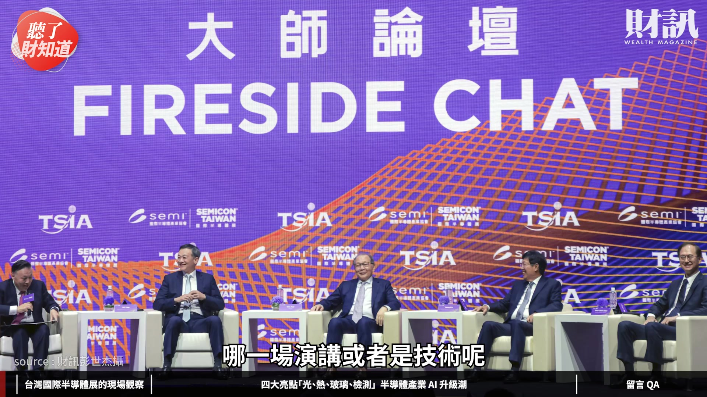

**逐字稿片段：** 今天這一集我們會透過 台灣國際半導體展的現場觀察 歸納出今年產業的 4 個亮點 包括光 熱 玻璃跟檢測 和大家一起探討這波 AI 升級潮

**話題推測：** 介紹本集主題與架構：歸納SEMICON Taiwan 四大亮點 (光、熱、玻璃、檢測)

---

## 00:00:15

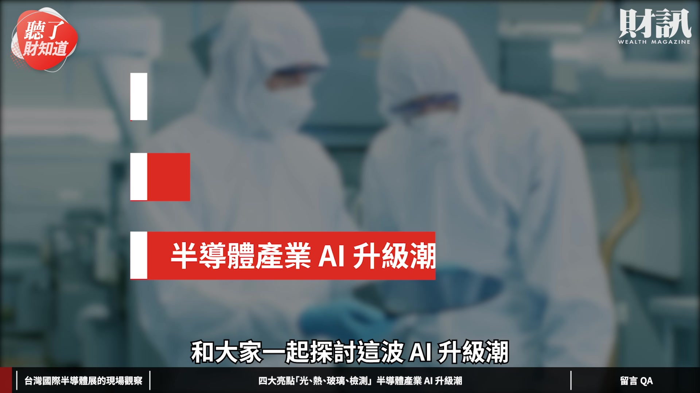

**逐字稿片段：** 大家好 我是今天主持人陳彥淳 今天來賓是財訊雙週刊的主編陳碧珠 歡迎小珠 大家好 我是小珠 繼上半年的 Computex 之後 下半年的重點就是 SEMICON SEMICON Taiwan 真的是非常的熱鬧 你可以想像嗎 SEMICON 是個半導體的技術論壇 結果人山人海是發生什麼事

**話題推測：** 介紹主持人與來賓姓名

---

## 00:00:35

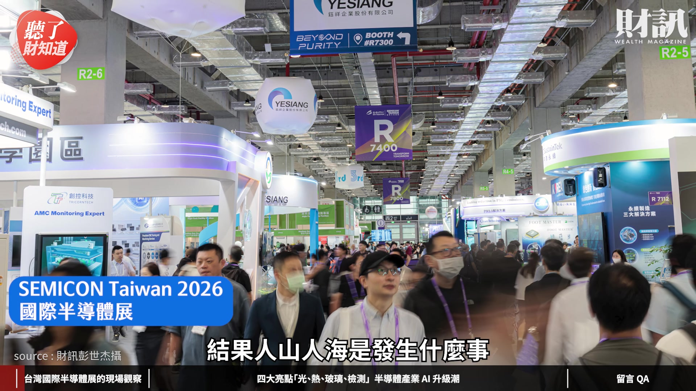

**逐字稿片段：** 它今年本來是 3 天 就是 （9 月）2-4 日 但是其實它 8 月 31 日就開始 有滿滿的論壇 一場接一場 今年技術的分享就超過 50 場了

**話題推測：** 說明SEMICON Taiwan的舉辦天數變化

---

## 00:00:45

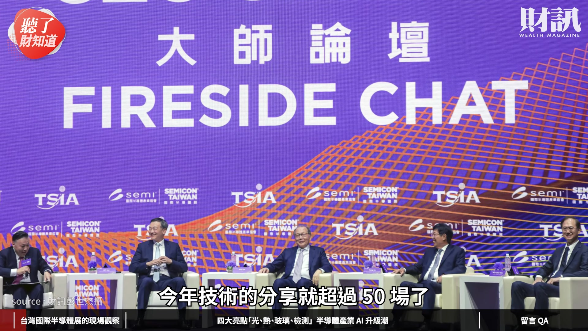

**逐字稿片段：** 參觀人次創新高 有 13 萬人湧進 有 60 幾個國家來 每一個論壇都滿精彩的

**話題推測：** 提及SEMICON Taiwan參觀人次與參與國家數量

---

## 00:00:51

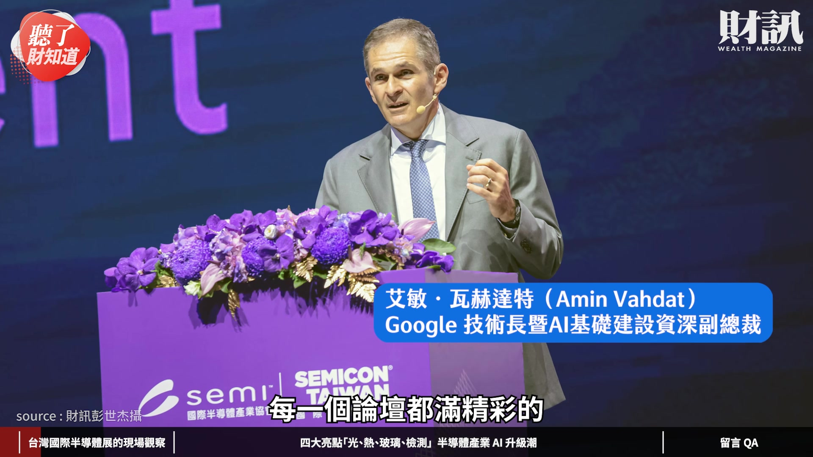

**逐字稿片段：** 今年的大咖真的非常多 很多都首度來台 包括我們的這次封面 就是 Google AI 技術長艾敏 其實輝達也請了技術長來 然後包括像科磊 默克 或者是美光 真的是滿滿的大乾貨

**話題推測：** 列舉SEMICON Taiwan的重量級演講嘉賓 (Google, 輝達, 科磊, 默克, 美光)

---

## 00:01:04

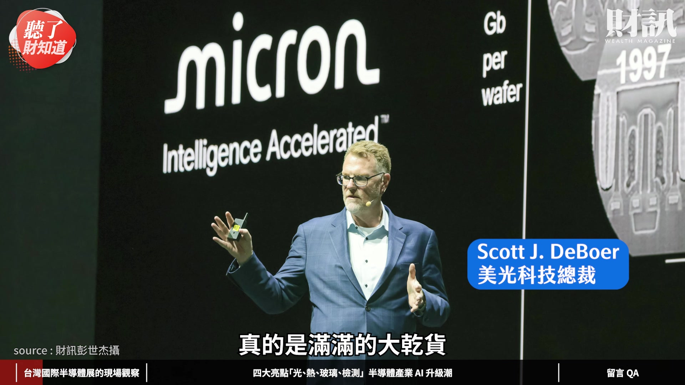

**逐字稿片段：** 大家還記得之前 AMD 的執行長蘇姿丰講說 她在台南鄉下路上 都聽到人家討論 CoWoS 最近這個半導體展的時候 路上都在講半導體 大家討論 CPO 然後討論說這個進程到底是怎麼樣 想說台灣人的半導體知識 未免也太通俗了一點吧 對 就是其他國家 沒有像台灣一樣 對半導體的知識能見度 這麼高的密度 真的 而且重點是這是技術層次 不是說你這個麵包賣多少錢 飲料賣多少錢 是一個非常高深的技術 你看不到 難以理解的東西

**話題推測：** 從AMD執行長蘇姿丰談CoWoS轉到此次展覽熱議的CPO技術

---

## 00:01:36

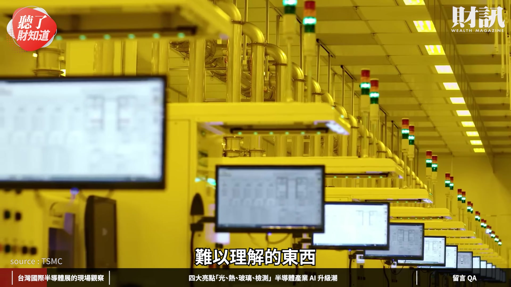

**逐字稿片段：** 其實這次的 SEMICON 我覺得是圍繞著 輝達跟台積電的技術路線 它們所帶動半導體的大升級潮 以它們兩個作為主軸

**話題推測：** 總結SEMICON Taiwan展覽的核心主軸：輝達與台積電的技術路線

---

## 00:01:45

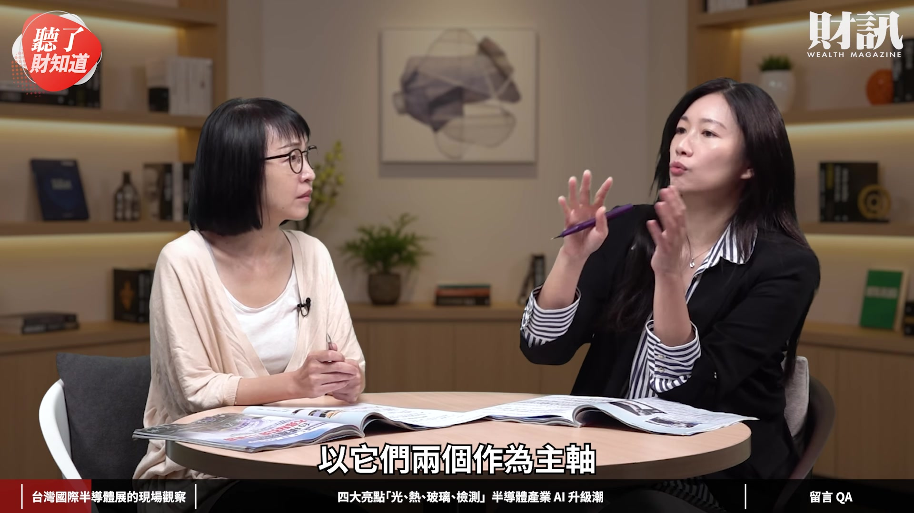

**逐字稿片段：** 可以從這次台積電的主題演講來開始講起 因為畢竟它們就是一個技術的領先者 這次台積電出席 就是派高管們來演講的論壇

**話題推測：** 深入探討台積電在SEMICON Taiwan的主題演講與其重要性

---

## 00:01:55

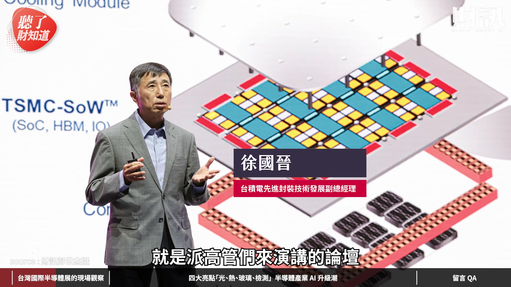

**逐字稿片段：** 有超過 14 場 在 50 場裡面來說算很多 我覺得最近台積電跟外界溝通的 頻率跟意願都愈來愈高 對 因為畢竟先進封裝 在整個 AI 算力裡面 已經愈來愈吃重 那它們也在從 CoWoS 這個事情的演變 不同的技術路線 一直在開展中 所以大家都想聽它們開示 就是它們要往哪個方向走 廠商都要快點去測試 快點去卡位 對不對 然後尤其現在 愈來愈有一些路徑的時候 大家都想要知道說 我在哪一塊可以先開花結果 就會演變成設備商它們 很多的商機出現

**話題推測：** 說明台積電高管在論壇中的演講場次

---

## 00:02:30

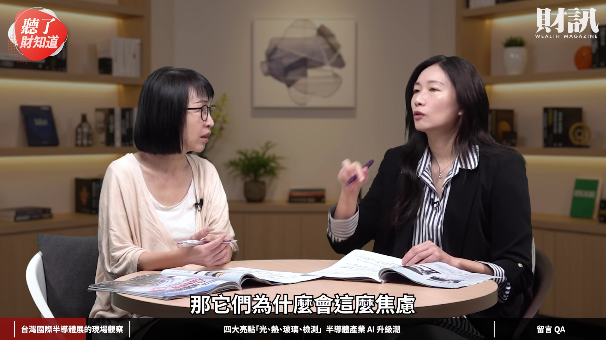

**逐字稿片段：** 那它們為什麼會這麼焦慮 我覺得可以從侯永清 就是台積電的副共同營運長 他說現在台積電 是 20 座新廠正在建置中 但是 還是趕不上市場的需求 你光聽這句話你就知道說 技術的突破有多麼的重要 這件事情其實他就是想要釐清的是 AI 並沒有泡沫 第二個就是我們真的一直在滿足 可是就是一直追不上 所以他裡面也有點到一些瓶頸 但是也在克服 那重點是他覺得 AI 的晶片 它已經不是單一製程的問題 早期在跑（製程）的時候 可能是說幾奈米 幾奈米 可是現在是系統化的推進 所以這次的 SEMICON Taiwan 我覺得很不一樣的是 你可以發現像比如說 緯穎的總經理林威遠 健策的總經理林錦隆 這些扮演零組件 或者是 System 的人 都跑出來了 那意思是什麼 意思是我晶片做得好沒有用 我還要把我整個封裝的架構搭建好 才能夠把系統的效能給提升 環環相扣 真的是環環相扣 我覺得這也是台積電 為什麼要這麼積極跟大家溝通 知道它們在做些什麼事情之後 廠商可以一起前進 一起進步 一起升級 不然只有它們自己獨自升級 這是沒有辦法的 對 台積電它已經很清楚 在 AI 資料中心裡面 我必須要知道 User 端 想要知道什麼 然後來告訴大家 我的半導體技術路線要怎麼跑 瞭解 那因為技術其實真得滿細的 今年大概分成四個重點 就是剛剛講到的 光 熱 玻璃跟檢測 那我們一個一個來談好不好

**話題推測：** 引述台積電共同營運長侯永清談公司正在建置的20座新廠

---

## 00:04:13

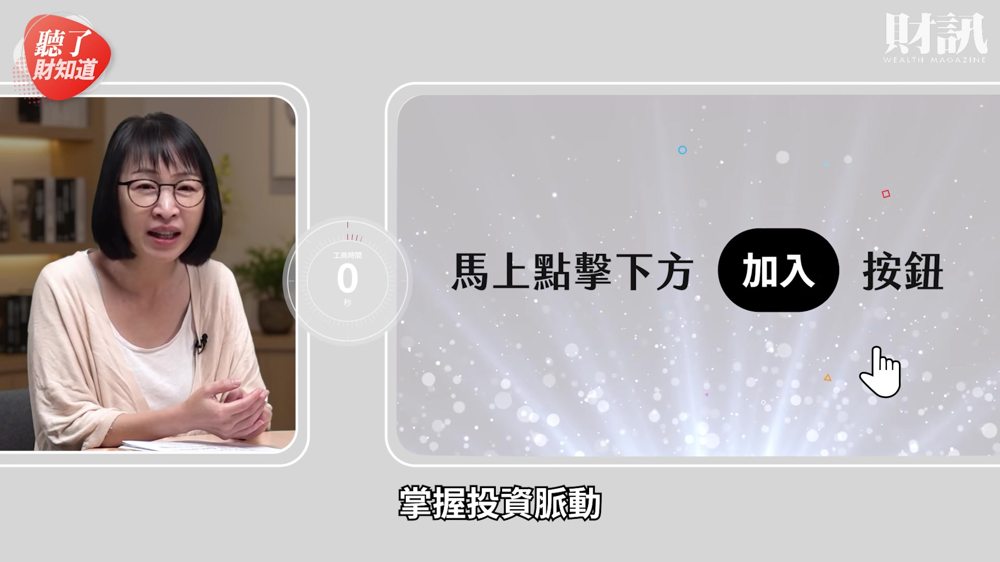

**逐字稿片段：** 先講光 光大概是現在最熱的話題 對 因為光它走光速 它就不會有電子物理極限 也不會熱 一下就可以把這些資料傳到目的地 真的 而且還不用散熱 可是光的處理的問題 跟電處理的問題又不一樣 電會碰到熱 光不會 可是光會碰到什麼 光會碰到散色 對準的問題 然後你要把電的訊號轉成光 又會有轉換效率的問題

**話題推測：** 開始討論第一個亮點：光技術 (CPO光學元件、光電整合測試)

---

## 00:04:37

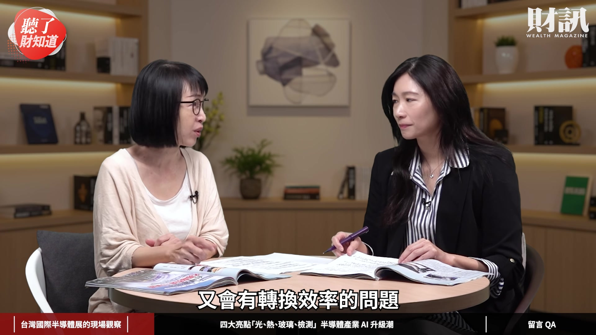

**逐字稿片段：** 在這次的一館 1 樓跟 4 樓 你就會看到那些做測試的 比如說穎崴 中華精測 旺矽 這種在晶圓做好之後的測試 以前是電測 現在都光電整合 我們講光電整合就是說 因為之後要電子下面放一個光子 這個東西的測法又不一樣 就很難 第二個你還要加 FAU 就是現在要對位 對位又再測一次 對完位之後呢 你整個成品又要再測一次

**話題推測：** 列舉光電整合測試相關廠商：穎崴、中華精測、旺矽

---

## 00:05:02

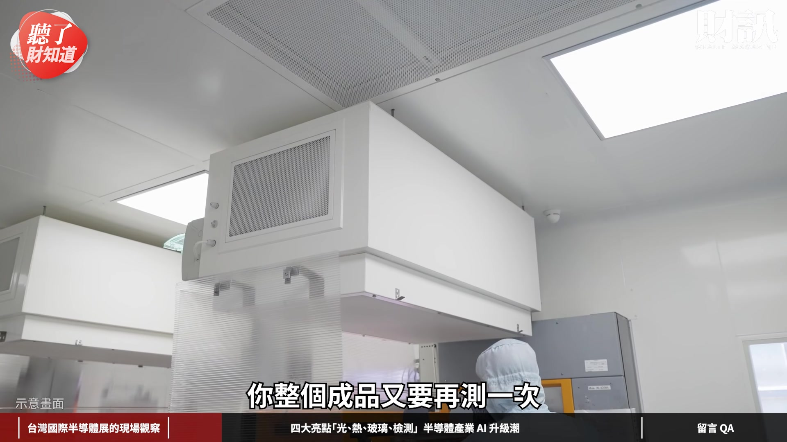

**逐字稿片段：** 所以連鴻勁都下來了 所以就是 不是光是你做出來 你還要確認它可以 所以檢測的關鍵又更重要了 就是精度 然後以及你要測它訊號 到底有沒有對位 看到這些機台 其實它們鴨子划水很久了 不是說現在就擺出來就給你看 它們其實都一直在做 你就知道說台積電的 COUPE 這個東西的平台原來不是一次到位 而是花了 7 年 那它需要靠設備商的努力來成就

**話題推測：** 提及鴻勁也參與光電整合測試領域

---

## 00:05:27

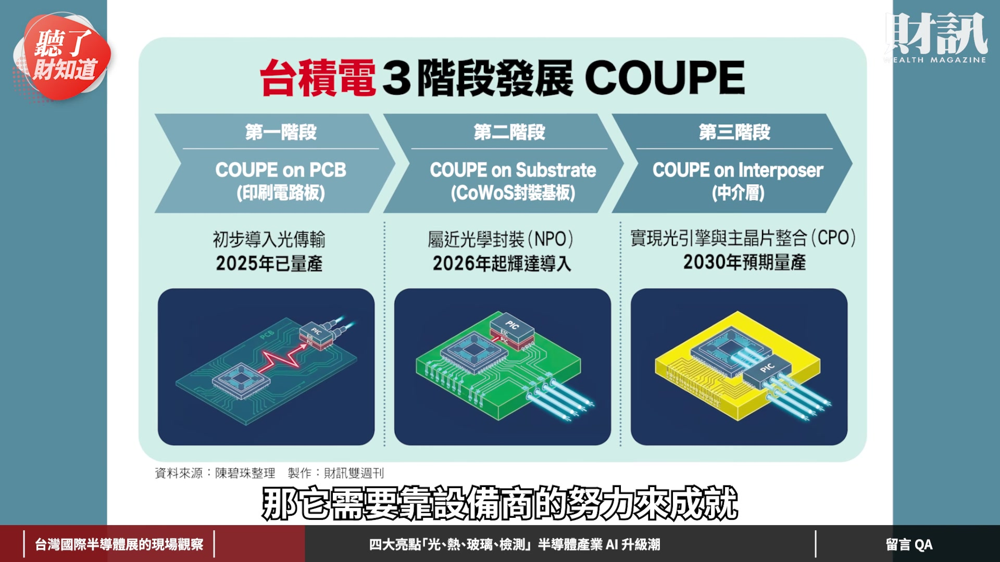

**逐字稿片段：** 其實像一些傳動模組 因為你這些東西你要對位 你要對得準 原來你也要好的傳動 所以這些東西 也有台灣的供應鏈在裡面 像台達電這次也展出來了 所以它們會各自拉黨結派 弄一個生態系共同來測試嗎 然後你就會看到一館那些廠商們 其實彼此都認識

**話題推測：** 談論傳動模組及其供應商：台達電

---

## 00:05:43

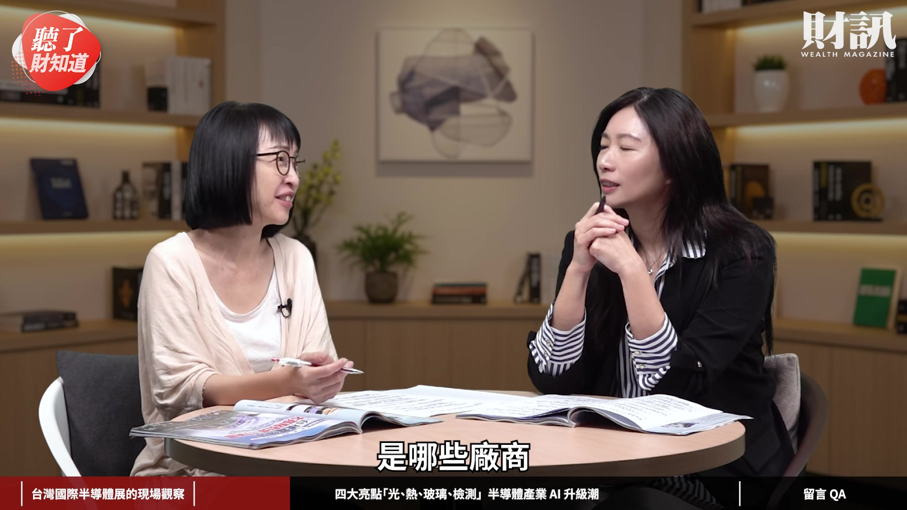

**逐字稿片段：** 是哪些廠商 萬潤 鴻勁 設備廠商 它們看起來是競爭可是又合作 就是大家都在互相打聽說 哪裡有不行 哪裡有問題要去解決 我覺得那個氣氛是好的 像晶圓探針三雄 它們其實本身就已經有 很好的位置優勢了 對 因為它們本來就做檢測 那現在在整光裡面 它們又扮演台積電 滿不可或缺的重要角色 另外還有提到在耦合過程中 還有這個電阻裝的部分 東佑達這個我們比較不熟悉 可以介紹一下 就我剛剛講這些傳動 就是我看它們在做 這些光電整合的測試 是很快掃過去 你能不能協助它們做 傳動模組就是東佑達在做的 那高明鐵也在做 台達電也在做 台達電以前它有做工業自動化 那它對這些東西其實並不是陌生 而且是有底氣的 所以它是有很多技術 是可以延伸到半導體領域裡面來 協助這件事情 就有點像是傳統產業的升級 好 剛剛講完了光 再來就是散熱 散熱的話題其實滿多的 包括之前健策 市場上有很多討論 就說健策需求到底是怎麼樣 還曾經一度造成它股價的修正 這次健策的總經理林錦隆 他在 3D IC 論壇裡面的談話 也真的非常有趣 也自嘲 因為他覺得大家對散熱擔心就是說 有光 是不是散熱不見了 剛剛講了說光比較沒有散熱的問題 我覺得以後都會並存 因為每一個環環節節 不是完全都用光取代 畢竟它有投資報酬率 跟它有它的效益的問題 那時候健策 大家會擔心說 之後在晶片裡面 如果我連到光 可能就會消失這個需求 然後健策的總經理林錦隆 他就自己講說 我那時候股價還打 6 折 年中慶 他講的喔 是年中慶 意思是這不是常態的意思 對對 然後 後來健策的股價也真的回溫 原因是什麼呢 他有講到說先進封裝 如果等到最後的封裝再去做散熱 真的是來不及 現在的晶片效能很高之外 功耗也愈來愈大 以前健策在 CPU 的時候 就一直有幫 Intel AMD 這種公司做散熱片 所以它對晶片裡面如何散熱 是有經驗研究的 但我們講了 你光做均熱片是不行 現在走到液冷了 所以才會有所謂的微流 就是用液體帶走晶片的散熱 這個東西在台積電主導 登高一呼下 確定會走這個方式 大家就歡欣鼓舞說 果然這就是一個未來之路 因為台積電認證 代表會有使用者 這最重要對不對 背後就是輝達 所以這樣子的環環相扣之下 就是健策它當然就是有它的主導權 在晶片裡面有液漏這個問題 這不得了 都是幾百萬元的成本 所以這個就更挑戰它們的難度 也提升它們的價值 晶片現在貴得要命 漏水這還得了 但是它真的是最有效 可以帶走熱能的第一環 所以這就是為什麼林錦隆說 不要再等封裝之後再做 因為封裝之後再做的是 傳統的冷水板

**話題推測：** 列舉設備廠商：萬潤、鴻勁

---

## 00:08:31

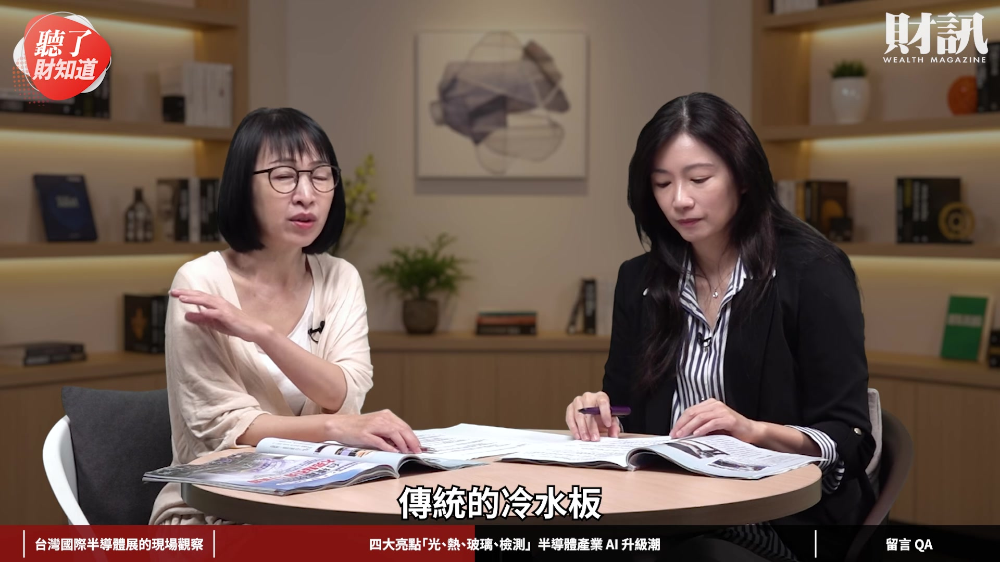

**逐字稿片段：** 做完機櫃之後也要做 CDU 就是雙鴻 奇鋐在做 都沒有不重要 但是從源頭開始做更好 效益更高 但代表整個過程中 會有散熱扮演不同的角色 並不是相互取代 沒錯 應該是這樣講 然後 而且有新的需求跑出來 就是這一塊 未來這一塊的價值 尤其是它又愈靠近晶片 做得好 你的價值就愈高

**話題推測：** 提及雙鴻、奇鋐在CDU (Coolant Distribution Unit) 方面的發展

---

## 00:08:55

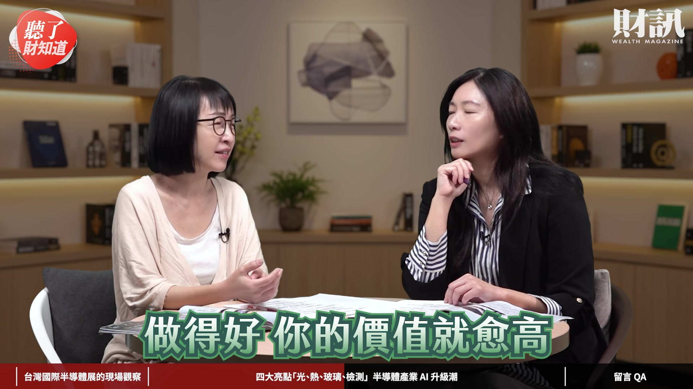

**逐字稿片段：** 那接下來我們想談一下玻璃 玻璃也是最近非常熱的話題

**話題推測：** 開始討論第三個亮點：玻璃基板技術

---

## 00:08:58

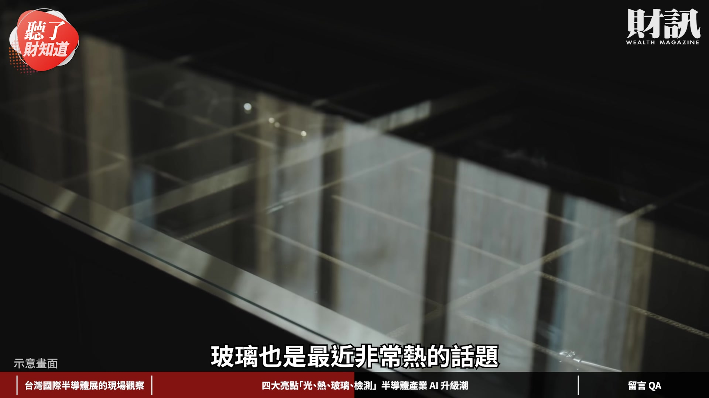

**逐字稿片段：** 這次康寧也有來展 然後康寧旁邊就是友達 它依附在它集團底下達興材料 提供它玻璃通孔 這個東西的加工成品 友達之前本來都不講說它會做玻璃通孔 這次跟康寧結合 所以引起滿多人的觀測

**話題推測：** 介紹康寧、友達與達興材料在玻璃通孔技術的合作

---

## 00:09:15

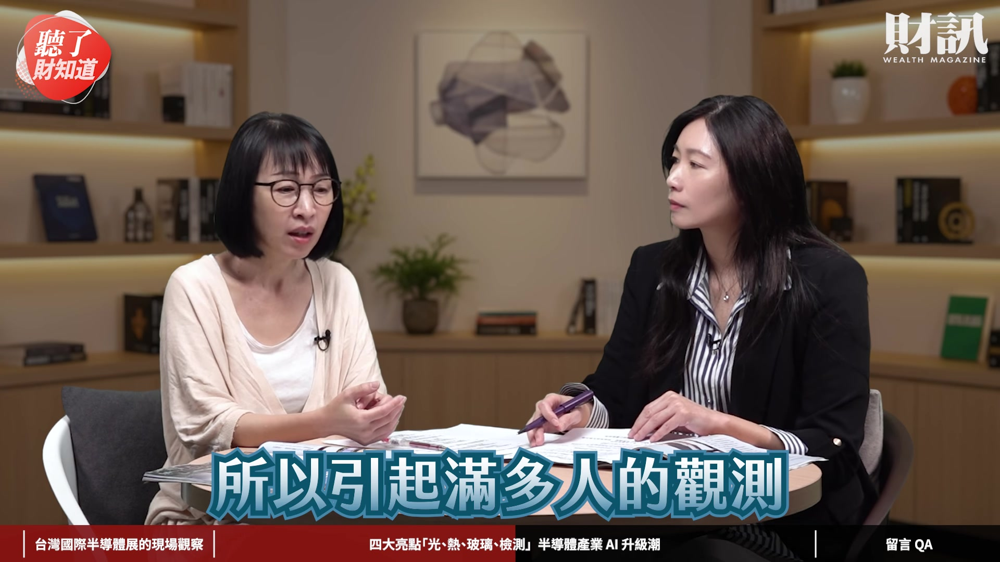

**逐字稿片段：** 這時候就必須要講台積電 在封裝裡面就是兩個路線 一個是走光 它把光帶進封裝 第二個就是從 CoWoS 中間那一塊載板 因為現在要承載的東西愈來愈大 會有所謂的翹曲問題 所以玻璃就要進來 可是玻璃進來 你要把這個晶片的訊號 傳到下面的載板 讓它成為一個成品 可以好好的運算 這時候的玻璃通孔加工才是最難的 又呈現一個新商機出來 以前大家說雷射誰不會 以前那麼多雷射加工 問題是雷射打洞 那個孔那麼小 又那麼窄 又那麼深 裡面有沒有藏污納垢 有沒有碎裂 有沒有必叉 類似像這樣 都非常細節 萬一你導電導不進去 你下面都接不上來 你這一顆百萬元的 先進封裝封完的成本就報廢掉了 玻璃看起來好像很厲害 可以平整 然後也沒有熱的問題 但是這一塊的技術難度也不低 對 現在就是台積電廣發英雄帖 每家廠商都在測試

**話題推測：** 闡述台積電在封裝中引進玻璃基板以解決CoWoS翹曲問題

---

## 00:10:09

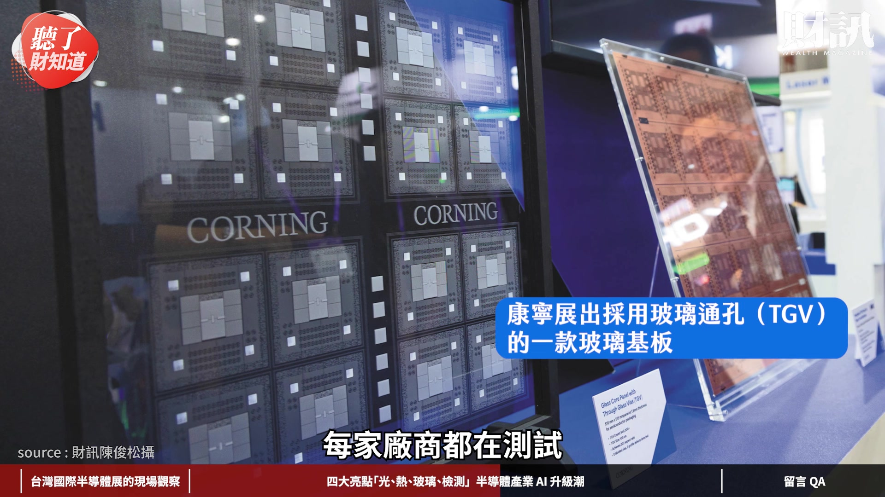

**逐字稿片段：** 包括剛剛講到的康寧 友達 其實群創之前我們也討論過 它也在跟 IBIDEN 跟台積電在做測試 現在到底誰會勝出 到目前為止沒有一個最後的定案 就是大家都有自己的一個劇本 但是大家都還不知道 自己會不會成為其中的主角 還有就是說 到底哪樣做最有效益 群創因為 IBIDEN 的關係 它們已經開始要做玻璃通孔的加工 不是只有做玻璃載板 就是那個載板而已 它們跟台積電合作確實是有 就像妳剛剛講的 也還沒有確定

**話題推測：** 提及群創與IBIDEN及台積電在玻璃通孔加工上的合作

---

## 00:10:38

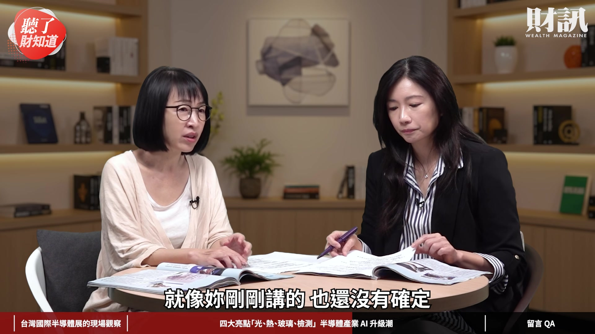

**逐字稿片段：** 群創這一次是在二館 跟著南科管理局的一個小攤位 比較低調 我記得以前群創在 SEMICON 的時候 不是這樣 結果一問 他們說沒有啦 我們其實私底下另闢一個預約室 潛在客戶有興趣 我們闢室密談 所以相對於友達的高調 群創的低調也是滿耐人尋味的 我不用跟你公開比武招親 那我可能可以私下跟客戶見面 我們就談生意 更多東西可以跟你私下分享 可以自己想像 可以自己腦補 好不好 玻璃這件事情其實我覺得 它的戲路其實以後還有很多進展 因為除了取代它原來的 CoPoS 之外 它通孔加工的雷射商機也是滿大的 所以在展場上你也會看到 那些像 G2C 剛加入的東捷 因為畢竟它們以前傳統是從 PCB 跟面板設備起家 對於這個面板的整個設計 精度這些瞭解的程度是滿深的 東捷大股東是東台 做工具機的 所以它們也希望能夠走 這個加工的服務 又是一個傳統產業轉型升級的故事 這次真的有很多這種 最後我們來聊一下檢測的部分 光學檢測現在真的是「百百檢」 百百檢 現在「萬萬檢」會不會 也可以這麼說 因為其實光是封裝來說 它真的是上千道 數千道也有可能 但是太細節了 真的也數不上來 這個產品要出貨之前 它可能就要先檢查 所以這個等於是從一個零件到出貨 真的搞不好是萬萬檢 像這次科磊 科磊擅長的是前段 它幾乎掌握了關鍵製程 9 成以上的檢測 它也很擅長 AOI 就是光學檢測 去看它每一道程序的瑕疵這些東西 它後來發現先進後段的封裝 這一塊商機愈來愈重要 台積電比如說光封裝 面板封裝 也愈來愈多需求 所以它這次進軍在這邊 卡位到這裡 希望告訴大家說我也能做這個服務 我覺得這是一個宣示意義 那我們去看說在科磊周邊 有沒有什麼樣的台灣供應鏈 也在做這些東西 那有跟一個班底來自科磊的政美應用 它們在定位上面就知道說 前段是科磊在掌握 所以它們就深耕後段 它們比較厲害的是 它們也在做 CPO 相關的光檢測 跟面板級的光檢測

**話題推測：** 描述群創在展覽中的低調策略與其潛在客戶洽談方式

---

## 00:12:41

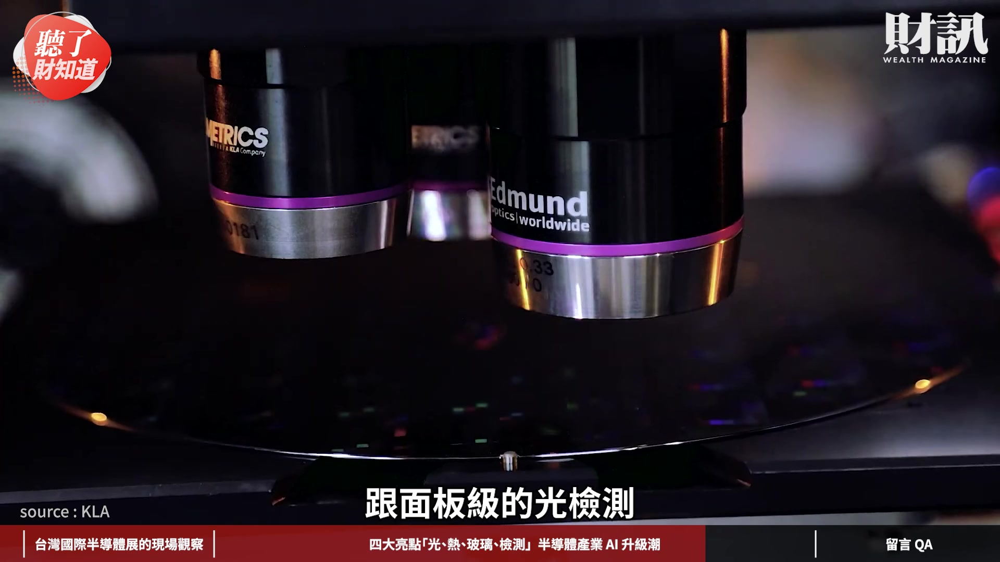

**逐字稿片段：** 以 CPO 來講 大家最擔心的其實是封完之後的對位 裡面有沒有產生任何的瑕疵問題 這個東西它們其實可以看得到

**話題推測：** 強調CPO封裝後對位與瑕疵檢測的重要性

---

## 00:12:50

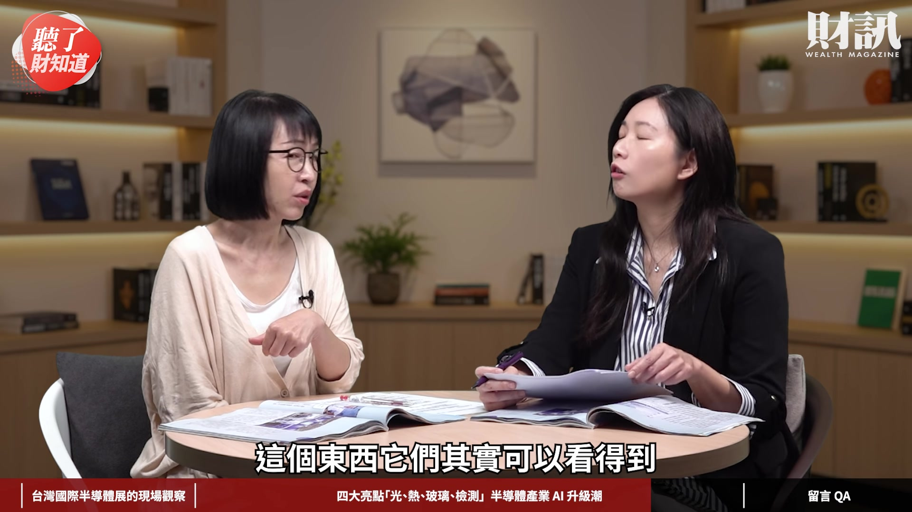

**逐字稿片段：** 那第二個是面板 我們講玻璃檢測為什麼重要 就是因為玻璃不導電 可是你要讓它導電 你就要先做雷射 讓玻璃裡面先鑽出一個孔出來 讓銅鍍進去 你才能夠有好的傳輸效果 那你要讓它長得好 又讓它能夠完整的傳輸 檢測就很重要了 瞭解 所以真的是百百檢 百百檢 而且真的是很細 你可以想想看那個 要在玻璃上面穿孔這件事情 就已經非常困難了 然後還要鍍銅讓它可以導電 這真的是非常考驗技術 不過我覺得這也是精密半導體 最困難跟建立門檻的地方

**話題推測：** 解釋面板級玻璃檢測對於確保導電傳輸效果的必要性

---

## 00:13:26

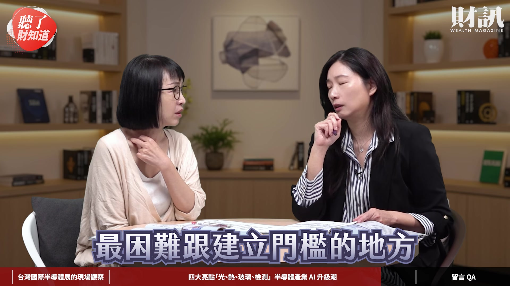

**逐字稿片段：** 我覺得整個來說 為什麼會百花齊放 就是晶片愈做愈小 你要讓它發揮到最好的效能 大家都想追求極致 所以就是你必須要不斷的練功 那以前（晶片）大的時候 就像傳輸 以前 10G 哪在乎你有沒有斷訊的問題 現在不是 現在是好幾百 G 在跑 萬一有一個東西卡住 你就完了 對 你可以想像說 以後如果是自駕車的邏輯 它是運算完全不能中斷的 所以它背後牽涉到各種 從這個傳輸到這個機房 到各個零組件的精密運作跟配合 這件事情是個大工程 因為畢竟以後無處不 AI 包括機器人也好 就是生活上面 我們可能都會用到 AI 相對的東西 現在大家用網路用那麼方便 都已經習以為常 可是一斷網大家都哀哀叫 對 沒錯 對不對 也是這個道理 半導體就更困難了 好 謝謝小珠幫我們介紹 SEMICON 的展 真的是技術層次很高 滿滿的乾貨 但我覺得對於有興趣 想瞭解這個產業的人來說 提供一個入門款的概念 代表說其實台灣的產業 還在持續進步中 而且老實說台廠真的扮演 非常重要的角色 不僅看到原本的科技廠商在升級 也看到傳統廠商跟得上這個腳步 在裡面扮演重要角色 所以我覺得這真的是台灣的大事 好 今天非常感謝小珠的分享 看完今天的影片 你最看好四大亮點中的哪一個領域呢 歡迎大家留言分享你們的觀點 如果不想錯過我們的節目 歡迎訂閱財訊頻道 或是加入頻道會員 解鎖所有的會員影片

**話題推測：** 總結晶片微縮與追求極致效能推動了檢測技術的發展

---

## 00:14:53

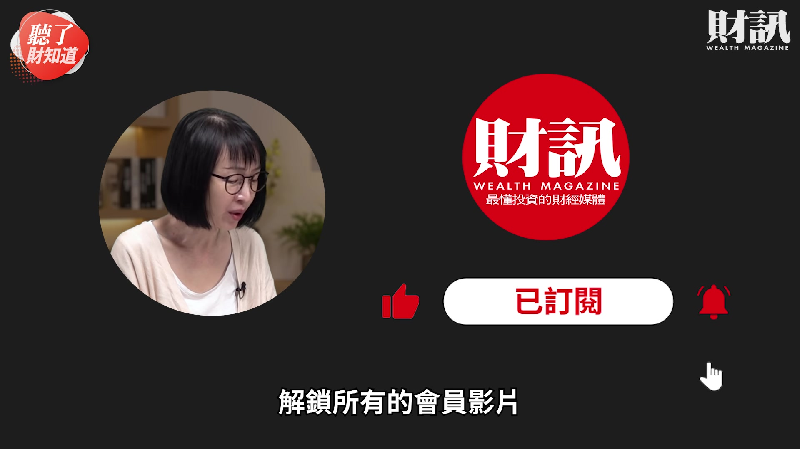

**逐字稿片段：** 接下來我們要回覆一下 財團在 《聽了財知道》 第 364 集 AI 訂單讓台廠大賺錢 但卻缺現金流 裡面的留言

**話題推測：** 開始回覆觀眾在《聽了財知道》第364集中的留言

---

## 00:15:03

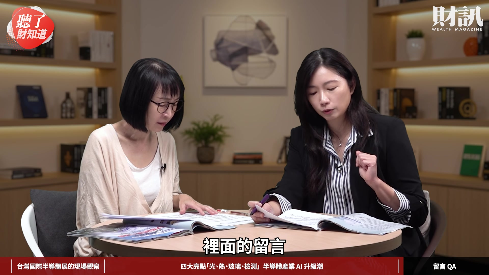

**逐字稿片段：** 財團 Taiwan Allen 他說 業績在擴增 建造廠房購買機器 現金量減少是一定的 這就是資本支出增加 是為了追求成長 這個表示它真的是 是一個積極的活動 只是說我們在檢視的過程當中 是誰重誰輕的問題 沒錯 就是現在的廠商 不只技術要追得上 基本上財務操作 也變成一個大的考驗 這件事情就變得很重要 財團龍興華先生說 台灣的廠商最大風險就是 不能不聽美國客戶的話 後續的訂單會更多 你要擴充產能 交貨要更快 但是 AI 泡沫如果真的出現了呢 你砸下去的錢是你家的事 客戶不再下單或是翻臉不認帳 甚至原來的下單都會取消 這些都是以前發生過的 沒錯 這位觀眾留言得非常精準 第一個是先回答說 不能不聽美國客戶的話 邏輯上是我們是為客戶服務 今天 AI 客戶的主要 user 就是美國 那當然台灣的角色 就是扮演軍火商的角色 所以客戶很重要 其實過去的經驗 很多廠商都有曾經追隨過某個大廠 結果後來發生了這個 因為趨勢不對 或是它們棄單的情況 的確 這是台廠的風險沒錯 所以這個東西 就是要各自廠商自己來評估 然後我覺得就是階段性的檢視 這也是我們的任務 就是我們畢竟比較能夠 全面性的看到一些東西 不管是財務動作 或者是大廠它們的一些訊息 我覺得這些東西 其實一定有一些指標可尋

**話題推測：** 回覆觀眾Taiwan Allen關於AI訂單與現金流的評論

---
