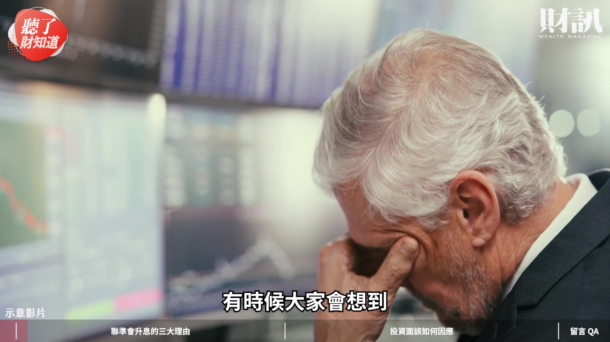
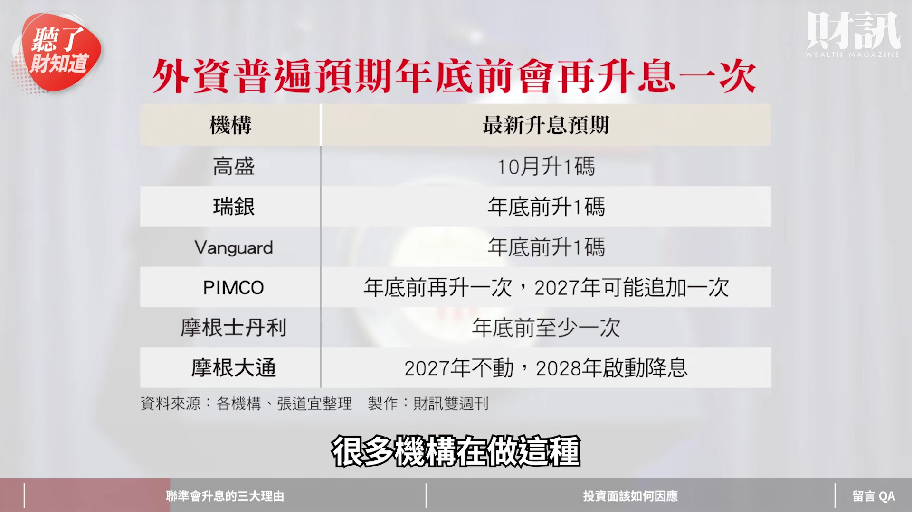

# wealth1974_mPb3BC9Z1OM — 關鍵畫面索引

- 來源逐字稿：[wealth1974_mPb3BC9Z1OM_GT.srt](wealth1974_mPb3BC9Z1OM_GT.srt)
- 影片：https://www.youtube.com/watch?v=mPb3BC9Z1OM
- 截圖數：13

## 00:00:06

**逐字稿片段：** 可是 台股也創了新高 為什麼會這樣子呢 那今天我們這一期就來聊聊

**話題推測：** 台股創歷史新高的走勢圖

---

## 00:00:12

**逐字稿片段：** 聯準會升息的三大理由 然後我們再跟大家談一談

**話題推測：** 簡報：聯準會升息的三大理由

---

## 00:00:15

**逐字稿片段：** 投資該如何的因應 我是主持人劉軒彤 今天的來賓是

**話題推測：** 簡報：投資該如何因應

---

## 00:00:20

**逐字稿片段：** 財訊的資深記者 張道宜 我們歡迎道宜 軒彤好 各位觀眾朋友大家好 我是道宜 道宜 我們錄影的現在 其實台股又創了新高 9 月 18 日 美國剛升息了一碼 聯準會是帶頭的馬車 大家會覺得升息好像就 對股市是比較屬於這種 不好的影響 有時候大家會想到

**話題推測：** 來賓張道宜的姓名與職稱卡

---

## 00:00:40

**逐字稿片段：** 2022 年那個暴力升息好可怕 當然這次不一樣

**話題推測：** 2022年暴力升息時期股市走勢圖

---

## 00:00:43

**逐字稿片段：** 可是這次定調叫 預防性升息 你可不可以解釋一下這個 整個緣由 沒問題 華許本身 並沒有去做這樣的定調 我們剛才講的 預防性升息是市場的解讀 華許這一次確實 他釋放很少的訊息 這一次的記者會 只開了不到 30 分鐘 是我看 YouTube 從柏南奇以來 最短的一次記者會 省話 非常非常省話 所以其實很多 確實很多的軌跡 或是很多的看法 是我們從市場去解讀出來的 所以這個得先說明 那為什麼是預防性升息呢 第一個 通膨到底有沒有失控 通膨好像很嚴重 油價非常的高 那地緣政治又解決不了 聯準會被逼著要去上了這個 升息的十字架 實際上其實我們從華許的言談 以及事後的市場反應 顯然不是這個樣子 嚴格來講 通膨並沒有失控 因為 8 月的 CPI 核心 CPI 是 2.4% 雖然說聯準會希望的 PCE 或者是 CPI 都是 2% 為目標 但其實你說失控 2.5% 3% 甚至更高 好像也不到那個程度 那第二個就是 經濟持續的在走強 我講的是美國的部分 因為在華許的記者會中 其實可以發現 第一個是

**話題推測：** 簡報：預防性升息的定義或說明

---

## 00:02:04

**逐字稿片段：** 失業率的下修 第二個是 經濟成長率的上修 也就是說 華許其實是非常看好 美國的經濟持續的走強跟強勁的 第三個就是

**話題推測：** 美國失業率下修的圖表

---

## 00:02:14

**逐字稿片段：** 我們也問到了一些市場人士的觀察 就是說其實大家如果還記得 在 2025 年 其實美國聯準會是有做了 3 次的降息 事後回來看 因為 今年發生了很多很多的事情 地緣政治的因素 AI 的持續的成長 所以 事後來看當時的降息 好像有點沒必要 但這是市場人士的解讀囉 所以也有人認為說 好像這一次的升息 是有把當時多降的 拉回來的感覺 所以這次回來看 很多機構在做這種

**話題推測：** 簡報：升息理由三：市場人士觀察

---

## 00:02:43

**逐字稿片段：** 升息次數的預測 大概不外乎是 9 月一次 那今年底前再一次 那頂多 2027 年再一次 所以其實大概就是 2-3 次的區間 就有點呼應這一個預測 這個是有一點道理在的 這也是呼應一開始軒彤講的 為什麼這一次是一個 預防性的(升息) 被大家市場定義 而不是聯準會定義的 所以剛剛你講通膨就很有感 因為我記得 2022 年 那個股市其實是從

**話題推測：** 機構對未來升息次數的預測圖表

---

## 00:03:07

**逐字稿片段：** 我記得 18000 點掉到 13000點 那段時間其實滿煎熬的 那個時候的通膨 好像最高到 9% 還是幾 % 所以跟現在的 2.4% 是完全狀況不同 完全不一樣的 但是你的意思是說 2.4% 還是在聯準會的標準之上 所以它要稍微做一點預防性的反應 沒錯 那再加上去年的降息 其實跟川普剛上任 可能也有關係 有一些政治上面的 算計跟壓力 對 那所以你剛剛提到了一個重點就是說 雖然我們大家覺得 好像經濟很穩 還有 AI 這些在衝 但是問題是大家都預期 年底可能還會再升一次 然後明年也許還會有一些動作 那既然是這樣子 你剛剛講了說 其實狀況沒有失控 他為什麼還要做這麼多次的預防呢 沒錯 其實這也是華許 在他的記者會中另外一個重點 就是他很擔心一件事情就是 通膨的擴散 我們剛剛講的 其實通膨大概出現在 2 個地方 第一個是油價 對 這個沒有人能夠解決 我們不能解決 對 這個是華許無法靠利率政策解決的 雖然 FED 是神通廣大 第二個就是 AI inflation 就是 AI 的通膨 對 AI 可能除了導致於我們其實看到 終端的電子設備的價格的成長之外 那包括對電費 也是有一個 擠壓的效應在 對 這些都不是聯準會可以解決的 但是他其實觀察到一件事情就是 市場上開始好像已經有 預期到 好像通膨就這個樣子了 過去大家講說 聯準會就把 2% 當成是一個標準 現在的標準 好像慢慢上修了 這個就是華許擔心的 怕大家以為這習慣了 好像是正常的 然後以後就慢慢修 修到哪一天又失控了 我們大家 經濟學會講說 通膨有所謂的自我實現性 自我實現性講的就是說 當我聽到 好像物價要漲了 我會做什麼事情 我先去買東西 那我可能會要求要加薪 那我的房東可能就 要通膨了 我就會先漲房租再說 這些事情 就會推升 通膨真的會發生 華許就是擔心這件事情 所以他必須要趁這個時候去 建立它聯準會的威信 特別是在 通膨這一塊 所以我們也看到 其實在之前美股讓大家非常擔心的 長天期的利率 特別是 10 年期公債殖利率 突破 5% 的時候 其實讓市場真的非常擔心 因為那個是 應該是金融海嘯之後第一次 回頭來看 其實它的長天期的殖利率 10 年期的公債殖利率其實 已經下降到 4.956% 感覺沒有很多 但是其實已經是 有很明確的往下降的趨勢 30 年期是 5.286% 他有控制住長端的殖利率這個部分 控制住長端殖利率這件事情 讓市場有正面的解讀 這也補充到上面一題 這也印證了 為什麼現在華許要做這件事情 第二件事情 當然我們大家都覺得 川普任命華許 是要來降息的 當然華許不會承認 但是這個政策使命 我們其實也有一個解讀 你現在如果不做升息的動作 通膨失控了 真的讓這個通膨 延續到了民生經濟上面的話 我也許到 2027 年 我必須要做更多次的升息 來解決通膨這件事情 這個就可能跟他的這個 密令就有點不太相符 也就是說其實現在華許在做一件事情 他有一個五大工作小組 他要做聯準會的改革 包括其中一個很重要 是他要重新去做 通膨的框架 可能比較專業的觀眾朋友會知道說 聯準會它會用 PCE 特別是核心 PCE 作為利率政策的一個判準 華許顯然是對這一套框架 不是很滿意的 他有一套 他希望能夠真正的去 有效的去瞭解 通膨跟利率政策的關聯 但如果說我要明年推出這個政策 結果我現在被逼得 要一直升息 那我這框架就完全沒有用處了 我的改革就推動不了了 所以他現在其實也有一點這種意味 我現在先蹲後跳 我先升息一部分 局面控制下來 為我之後的改革或是降息 去做布局 基本上就是 不希望成本外溢的效應 一直在擴散 沒錯 然後先做一些安全的措施 後面才好施政 對 就一些方針 市場的解讀是這樣子 是 那如果是在你解說的這樣的情況下 到底我們的投資該怎麼辦呢 因為現在 感覺上好像創新高又沒事了 可是真的沒事了嗎 這個事情肯定是有 但我要引述一段 我今天看到 真的很有意思的一句話 就是說 S&P 500 在 8 月 14 日創歷史新高 到現在大概過了一個月 這個月發生很多事情 油價一直飆 公債值率一直往上飆 聯準會升息 日本央行也升息 然後呢 沙烏地阿拉伯的油管也被炸了 結果 過了一個月這麼多事情 才跌了 2.07% 也就是說 其實市場對於美股 或者是我們可以更精確地講 對於成長型的這種板塊 也就是說 AI 科技 其實還是非常的有信心 我要解釋為什麼了 第一個 為什麼升息會對於股市造成影響 因為它會影響 本益比的下修 估一個公司的股價 我可能是獲利乘以本益比 如果我的本益比下修了 當然我的未來預估股價 就會往下掉 但是你會發現 另一個獲利 因為相關的公司 獲利實在太強勁了 即便我本益比真的去做下修 我只要獲利夠強勁 那基本上我是可以打消掉 這樣子的疑慮的 為什麼現在要看成長股 就是因為其實 你獲利夠強勁 你就可以去克服 現在升息帶來的逆風 所以我解釋一下 基本上就是 其實大家在估那個 長線的這個價值 都有一個所謂的折現率 比如說我現在期待你 幾年後你（EPS)賺 100 元 那你那 100 元回過頭來 可能對我這個投資來說 我希望它大概 現在股價值多少 可是現在因為利率墊高了 我的無風險成本 我本來放在銀行 就已經有這麼高利率 那我就會期待你 未來的 100 元 可能要更高 你才符合 我現在願意給你的這個估值 所以它就會變成說 為什麼這個升息以後 大家的那個估值 本益比就會下來 那道宜的意思就是說 你未來必須賺的 比我想的還要再更多 我才願意去付這樣價格 不然我就會把你的本益比 往下修一點 那修一點 股價就會影響 是 所以就是一定要聚焦在 那種真正會成長的 而且成長得很高的公司 對 特別是它可能 一直在打敗市場預期的公司 對 這可能是一個 但其實在選這種股票的時候 其實大家要記得一點 因為借貸成本在上升 因為升息了 而且高利率的這個狀況 還是會持續一段時間 因為剛才講的 我們通膨的狀況 還是在延續中 所以呢 你成長來源是怎麼來的 你是自己本身 就有很充沛的現金 台灣很多科技龍頭 都是有充沛的現金 去做我的資本支出 但也有一些 靠借貸 當然也有不同的募資模式啦 我可能是做 現增 我可能做增資 我可能是在用借錢的方式 那你就要去篩選了 如果 我本身是靠 很大的高槓桿 我靠借錢 來去支撐我的資本支出的話 這個可能就會受到 升息的影響比較大 我並不是說它不好 但它會受到升息的影響 會比較大 就是它成本可能大一點 但是問題 還是要看未來的成長性 對 沒錯 這是第一種 AI 的 那第二個就是說 如果今天你是比較保守 或是比較重視 穩健現金流的投資人 但你又想享受到這個 今年以來非常強勁的獲利成果 那也許高股息 ETF 是 可以考慮的一個目標 我們也有整理出來 其實今年台灣 規模前幾大的高股息 ETF 它其實科技股的含量 已經滿高的了 那如果你本身 如果你是這種 高科技含量的 ETF 呢 你就可以享受到 今年的獲利 它反映到明年的 除權息的行情 也就是說今年的高獲利 明年會配給我們 對 它就可以延續 再加上明年 其實 真的未來事情很難講 但是你可以想像 今年股票漲了這麼多 明年一定會有高基期的壓力 對 如果你會對這件事情有點擔憂的 會有點沒信心的 那也許高股息 ETF 就是一個選項 就是有人幫你操作 它又有科技股的含量 又有這個高股息的保護 所以進可攻 退可守 這是一種 ETF 那還有沒有其他 債券呢 你常跑債券 有沒有債券的一些 基本的建議 對 債券當然跟升息 降息 是非常密切相關的 那當然升息 直覺來看 對債券是比較不有利的 其實 現在市場反應真的很快 長天期的殖利率 已經到了 5% 的狀況下 其實這個對於債券來說 確實是一個有吸引力的點 因為債券殖利率愈高 代表債券價格愈低 也就是說你現在去 進去買這些債券型的 ETF 或是買債券 本身來講其實是一個 比過去更有吸引力的買點 當然你就會想說 很多年以前 大家講的 20 年 長天期美債的風暴 因為沒降息嘛 一直都 沒有一個很明確的降息 所以導致於大家會覺得 對於長債 對於債券 ETF 印象不是很好 但是 總歸來說 你現在假設你的長天期利率是 5% 那價格夠便宜了 你去做領債息的部分 其實是一個 很有吸引力的部位 當然 降息不會很快發生 像我們剛剛講的 Higher for longer 這個趨勢 應該是維持下去的 所以你也不要去預期 資本利得這件事情 那第二個就是我的天期 我的 duration 我要怎麼選呢 目前來看 可能還是以中短天期為主 但是要注意一件事情 聯準會的升息動作 它終究是一個不可預測的東西 華許也是持續在修正 那短天期的利率 它就是跟聯準會的政策利率 會是一個比較直接的對應 所以如果你選擇 是中短天期的 你就會比較容易受到 這種聯準會政策的波動的影響 其實債券 你對應的是 2 年期或是 10 年期 或者是更高的 20 年期以上 30 年期 它都有各自對應的政策風險 這個是投資債券 ETF 要去注意的地方

**話題推測：** 2022年台股從18000點跌至13000點的走勢圖

---

## 00:12:18

**逐字稿片段：** 第三個 你要去避開的就是 CCC 三個 C 等級以下的非投資等級債 因為這些公司會落到 CCC 就是它借很多錢 可能風險比較高 那對利率的敏感度非常高 所以變化會很大 沒錯 所以這個就是現在很多投資人 如果你真的要選擇債券 ETF 那也許可以從這個方式 來去做一些瞭解 好 其實道宜剛才幾個關鍵字 就是說 利率 可能會高檔維持一段時間 我們不能 篤定說它一定會怎麼樣 就是我們有一些的假設 但是它至少說 高利率可能會有一段的時間 第二個重點就是 這世界變化真的太大了 你看這幾年 一下跑出一個戰爭 又跑出什麼東西的 就是說 變化很大 我們沒有辦法完全預測 不過現在能夠做的事情就是

**話題推測：** 簡報：債券投資注意事項：避開CCC等級債券

---

## 00:13:02

**逐字稿片段：** 聚焦這個所謂的 K 型經濟 這個上面的這一塊 可能就是 AI 為主要聚焦 而且要更有這個成長性 那再來就是 如果不會挑 我們就找進可攻 退可守的 高股息的 ETF 好 我們感謝道宜的分享 那看完今天的影片 你會如何調整自己的投資組合呢 歡迎大家留言分享你們的觀點 如果不想錯過我們的節目 歡迎訂閱財訊頻道 或是加入頻道會員 解鎖更多的會員影片 接下來呢 我們要回覆 財團在《聽了財知道》第 367 集 手足特留分刪除後 影響到哪些人的留言 大家非常喜歡這一集喔 OK 就關於這個遺產的事情 OK 好 你來念吧 我來念一下留言 就是財團 戴雨農 就是重點在於 為什麼不想把錢留給某人 請那些想白嫖的人 想想自己憑什麼 這個我想就是 很多家族會面臨到的問題 這就是為什麼 要有手足特留分刪除這件事情 沒錯 好 第二個 財團 ONCE ELU 同時還是 一些 的部分 的樣子 的愛用戶 我覺得他講的應該是我 口頭禪 或是一些講話的習慣 所以大家如果 原來就是你喔 對 那大家如果有發現這一次 我有盡可能的減少這類的用詞 那也希望大家再多給我們一些鞭策 讓我們有持續進步的動力 是 接下來呢 然後財團 Alex Chen 要有遺囑才能免除 根本為德不卒 其實根本不要有特留分才對 像這些是值得 可以來商討啦 因為這個東西 有時候有不同的情境 是 當然我們也希望其實 遺囑這件事情 雖然聽起來是很麻煩 但我覺得還是一個 你去思考未來規畫的一個方式 值得去參考啦 沒錯 對 好 如果您還想瞭解財訊更多的內容 歡迎點擊資訊欄中的文章連結

**話題推測：** 簡報：K型經濟的說明

---

## 00:14:44

**逐字稿片段：** 或是購買財訊的 773 期的雜誌 跟我們一起 追蹤政經趨勢 掌握投資脈動 《聽了財知道》 我們下次再見 bye bye

**話題推測：** 財訊773期雜誌封面

---
