# wealth1974_ngCJQuiSKnY — 關鍵畫面索引

- 來源逐字稿：[wealth1974_ngCJQuiSKnY_GT.srt](wealth1974_ngCJQuiSKnY_GT.srt)
- 影片：https://www.youtube.com/watch?v=ngCJQuiSKnY
- 截圖數：21

## 00:00:13

**逐字稿片段：** 今天這一集我們會先聊一下 長春在做碳捕捉 為什麼林書鴻說 做得出來卻算不過來 再來分享長春為什麼 不選擇碳封存 它的想法是什麼 最後我們來聊一下 長春集團總裁林書鴻 他對於碳捕捉 跟未來的市場的建議 大家好 我是今天主持人陳彥淳 今天來賓是財訊雙週刊的 撰述委員林苑卿 歡迎苑卿 各位觀眾大家好 我是苑卿 財訊第 773 期的封面故事 我們做了台積電的麥寮外海祕密計畫 裡面大概提到了 那接下來我們就更進一步地 聊一下說 到底現在台灣 在做碳捕捉技術 誰做得比較好 大家一致通過 就認為是長春石化 長春集團做得比較好 一向往高值化的發展 是不遺餘力 碳捕捉這個領域 它現在做的情況怎麼樣 碳捕捉的技術 它就是要把二氧化碳 捕捉下來之後 把它純化成高質量的二氧化碳 其實長春集團 它在每一個廠區的表現 其實都不太一樣

**話題推測：** 介紹本集節目主軸與討論議題。

---

## 00:01:14

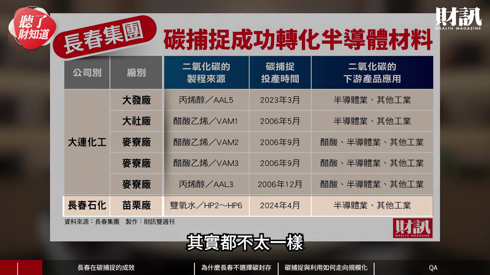

**逐字稿片段：** 如果以苗栗廠的話 它已經從 7 個 9 經過一年多的優化之後 現在目前已經可以達到 8 個 9 8 個 9 是什麼概念 就是 99. 後面還要再加 6 個 9 所以它原本是做 7 個 9 現在可以多到 8 個 9 代表是純度愈來愈高 沒錯 在這樣的一個前提之下 所以它未來也計畫

**話題推測：** 介紹長春苗栗廠在碳捕捉技術上的表現與純度數字。

---

## 00:01:38

**逐字稿片段：** 要在彰化廠蓋一座 碳捕捉的工廠這樣子 另外 其實我們之前 也有去麥寮廠去參觀 現在麥寮廠的化學合成方式 它是把碳捕捉之後 拿去做醋酸

**話題推測：** 提及長春計畫在彰化廠新建碳捕捉工廠。

---

## 00:02:03

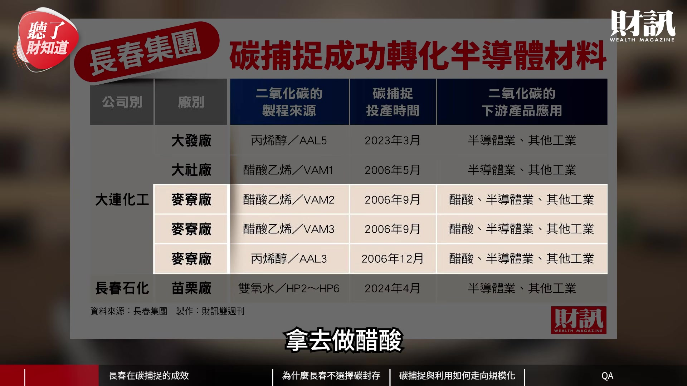

**逐字稿片段：** 所以它每年可以去化 另外還有就是大發廠 其實大發廠它比較特別 它是直接從汽電共生的煙道 捕捉二氧化碳

**話題推測：** 提及麥寮廠每年可去化二氧化碳的具體數字。

---

## 00:02:16

**逐字稿片段：** 2014 年的時候 它已經跟清華大學合作 去建設試驗工廠

**話題推測：** 提及大發廠與清華大學合作建設試驗工廠的年份。

---

## 00:02:22

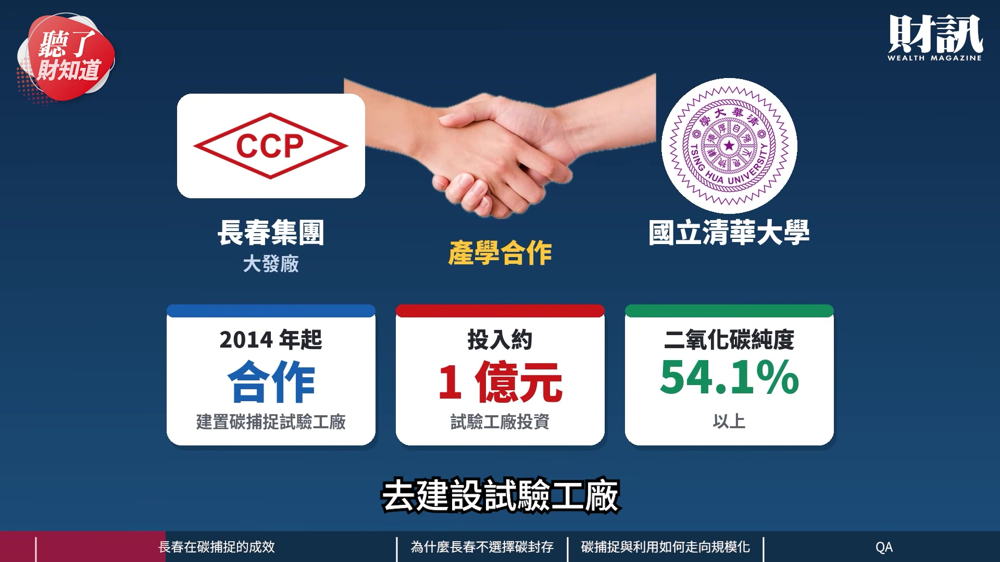

**逐字稿片段：** 現在捕捉的二氧化碳 已經可以純化到 99.9% 以上 其實真的滿早就開始 剛剛苑卿有提到 基本上長春集團 是從 2014 年就開始研究 碳捕捉的技術 大家都知道 石化廠的排碳量 比較高的產業 所以它們長春集團 利用碳捕捉的技術 那剛剛苑卿講了 它把它純化到 8 個 9 的程度的時候 基本上已經可以成為

**話題推測：** 提及大發廠碳捕捉純度的具體數字。

---

## 00:02:51

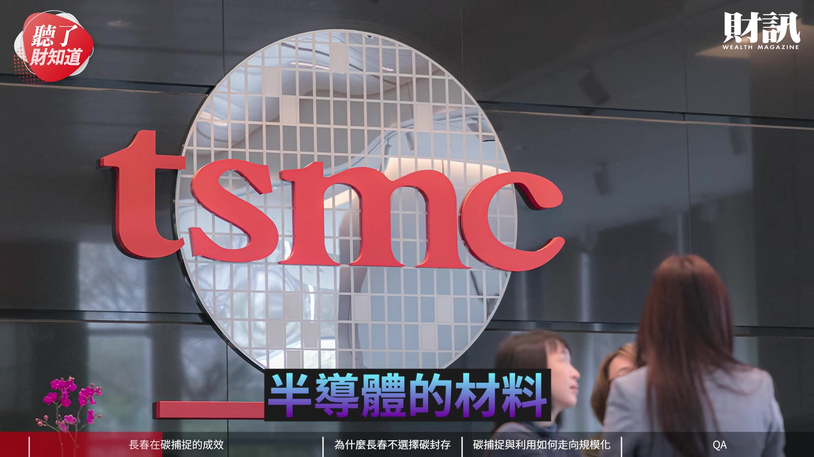

**逐字稿片段：** 所以現在賣的情況怎麼樣呢 已經到一個供不應求的情況 那這樣看起來價值很不錯 就是可以把碳 原本是產生汙染的東西 轉化成高附加價值的產品

**話題推測：** 轉向討論碳捕捉產品的市場銷售狀況。

---

## 00:03:05

**逐字稿片段：** 但沒有 因為其實 初期的資本支出 其實相當的龐大 這次去專訪 長春總裁林書鴻的時候 他其實有提到說 現在技術其實都是做得出來 但是成本的部分 是一個非常值得去探討的議題 因為如果以長春來講的話 它們現在捕捉 1 噸的二氧化碳 對 他覺得至少未來 要降到 2000 元的話 才會比較符合經濟效益這樣子 所以它們目前也找到 更合適的像化學吸收材料 或者是薄膜分離的方式 去研究超重力 加快吸收的效率 林書鴻他在說的過程中 我覺得很有趣 他說 所謂算不過來 就是用台語就是袂和的意思 就是說成本還是偏高 那事實上它們 我知道它們是用各種方法 以及在純化技術之後 希望可以做出 更高值的半導體的材料 所以這個來來回回 其實經過非常多的測試吧 沒錯 如果以苗栗廠 來說的話 其實它之前 已經投入超過 20 億元 資本支出 可是它預計 要 7 年才可以來做這個部分的回收

**話題推測：** 轉向討論碳捕捉技術的初期資本支出問題。

---

## 00:04:09

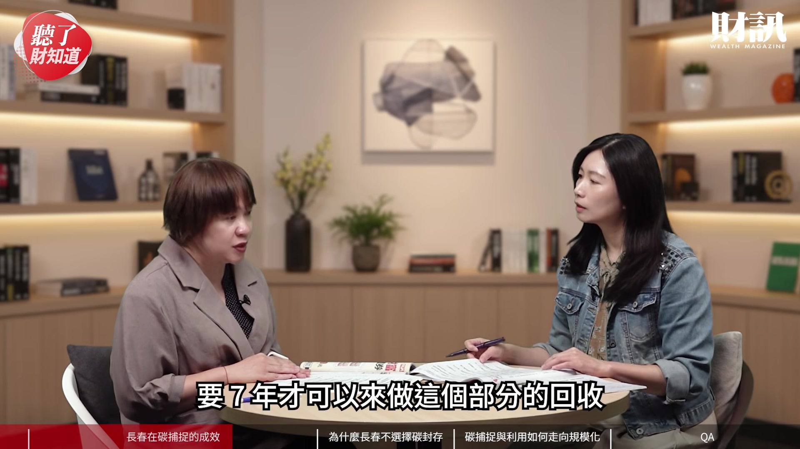

**逐字稿片段：** 更值得一提的是說 因為我們有詢問到他 那個綠色溢價這件事情 那他是覺得說 客戶的想法是覺得說 但是可能不會提供 更多的綠色溢價在這個部分 所以它們會覺得說 資本支出很龐大 如果要從綠色溢價 做這個部分的回收的話 現在目前看起來 並沒有大家預期的那麼的樂觀 真的 我覺得這個議題 真的很有趣 大家都覺得說要環保 要有綠色的這個經濟 但是到底客戶願不願意 就是說高純度的二氧化碳 並不是只有長春能夠提供 今天如果別人 也能夠提供的時候 還是呈現出比價的情況 就是說如果 雖然我知道你這個 是比較環保 比較綠色 但如果比別人貴 對我來說成本就變高 是 而且這個部分其實 他說用在半導體製程的 其實會影響到製程的良率 意思是說它們技術很厲害 純度很高 如果它們 做得不好的話 會影響到晶圓的良率 對 但是即使它們已經 可以符合客戶 在半導體製程 但是綠色溢價的部分 還是沒有如大家 所預期的那麼的高 真的 不過我覺得對長春來說 是一兼二顧 就是說它基本上 本來就要減碳 減排 所以它的碳捕捉 基本上也是為了自己減碳 那如果可以把這些廢碳 變成高附加價值的半導體材料 當然又更加分 所以它可能是個過程 如果愈來愈成熟的話 或許成本就會愈來愈低吧 嗯 沒錯 那其實 因為這次我們有提到說 轉換高附加價值的產品 做得非常好

**話題推測：** 討論綠色溢價對碳捕捉技術回收成本的影響。

---

## 00:05:38

**逐字稿片段：** 那我們就很好奇 它既然可以做碳捕捉 那它有沒有考慮 嗯 其實這件事情 真的非常的有趣 等到我們去深入瞭解以後 才發現說 長春它不做碳封存 其實是經濟規模的這個 因為它其實不像是鋼鐵廠 或煉油廠或者是燃煤廠 它們的是比較集中 在單一產品的生產 二氧化碳排放 其實是可以單一又非常大量 但是如果以長春集團 它們旗下的產品

**話題推測：** 轉向討論長春集團為何不選擇碳封存。

---

## 00:06:11

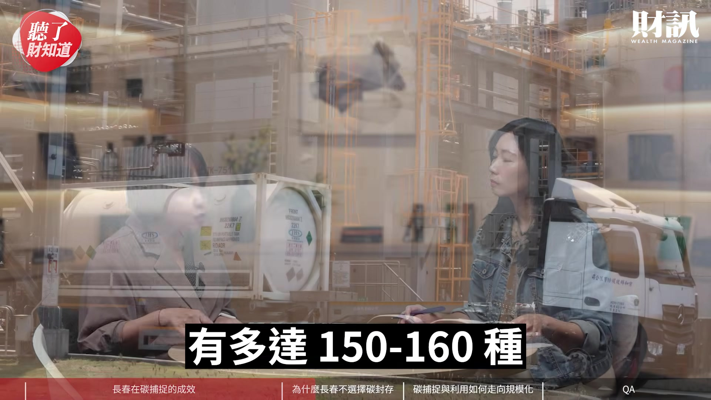

**逐字稿片段：** 其中有含碳的產品 就至少有 30 種 那你要在這麼多的產品當中 分散地去收集 這個二氧化碳的部分 經濟規模來講 其實它不如像鋼鐵或煉油廠 這麼有經濟規模 所以因為其他的 大型的這個石化業 或者是發電廠 應該這樣說 那石化業它的排放 是比較分散的 因為它產品非常的多元 所以對它來說 它去做碳封存這件事情 是比較不符合效益 可是其實這一次 在受訪的過程中 林書鴻有特別提到說

**話題推測：** 提及長春集團旗下含有碳的產品至少有30種。

---

## 00:06:41

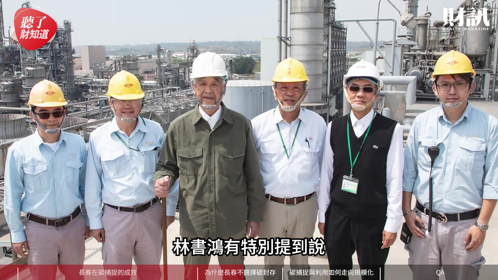

**逐字稿片段：** 它其實可以成為這個 工業鏈的樞紐 為什麼呢 因為它們 這件事情就是 把碳捕捉的效益變得更高之後 你再來做碳封存 事半功倍對不對 所以這個部分 它就希望說 它們會持續地發展 碳捕捉的技術 希望把碳捕捉的技術 發揮到極致之後 沒錯 沒錯 它們其實 也有研究過說 碳封存這件事情 他說其實不是像外界所想的 就是地上挖一個洞 然後把那個二氧化碳 灌進去就好

**話題推測：** 提及林書鴻認為長春可以成為工業鏈樞紐的觀點。

---

## 00:07:10

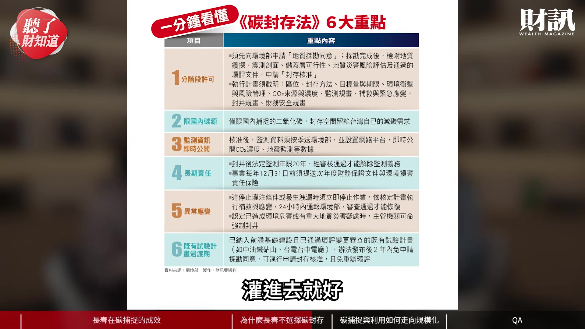

**逐字稿片段：** 這當中其實還牽涉到 比如說像地質條件 或土地利用 或政府許可 這些非常複雜的因素 對啦 這個可能就超過 長春集團現在目前的專業 但對於傳統的油廠 在探勘的時候 可能就跟它們的專業比較接近 所以我覺得長春集團 就做它們自己擅長的那一段 一起來合作做這件事情

**話題推測：** 說明碳封存涉及的地質條件、土地利用和政府許可等複雜因素。

---

## 00:07:32

**逐字稿片段：** 那最後我也想知道說 整個長春集團 在做節能減碳 然後做高值化的過程中 它對於政府有什麼建議嗎 是 大家也知道說 石化業它們是屬於排碳大戶 所以政府會去跟它們 徵收比較大的碳費 林書鴻他有提到說 政府不能只去跟石化業廠商 去徵收碳費這件事情 它要鼓勵讓企業 比如說他舉了一個例子 像鋼化聯產 它的技術上是可行的 那預計在 2032 年的產值 也可以達到 350 億元 那潛在的產值 是可以上看到 480 億元 但是目前其實有 3 個 大的一個瓶頸 一個當然就是說 然後第二個就是說 台灣其實缺乏 然後第三個當然是說 捕捉和建置的成本 初期實在是太高了 投資抵減的這個部分 對它們來講 還是遠遠的不夠 所以他會希望說 政策上面需要 跟技術的加持 然後也要長期資金的一個支持 然後協助企業 它可以跨過這個 示範到量產的這個資金的缺口 還有就是他有提到說 其實台灣在天然資源上面 是相當的有限 而且我們的能源轉型 也會受到滿多的限制 比如說現在我們可以 透過 CCU 的部分的技術 朝這個低碳的目標邁進 但他還是希望說 可以用實質的獎勵 跟技術的加值 去取代單純的這個處罰

**話題推測：** 轉向討論長春集團對政府節能減碳政策的建議。

---

## 00:09:00

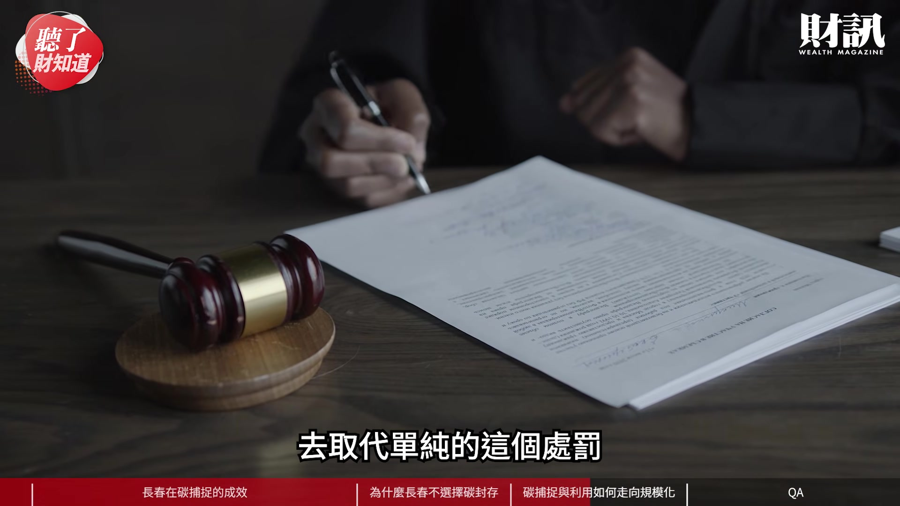

**逐字稿片段：** 然後可以去落實 像適度的費率 然後自主減量 還有就是產創投抵 這樣的一個政策輔導跟支持 透過公部門跟私部門的 一個協力合作 就是可以真正地 瞭解 其實低碳能源 已經是大勢所趨了 就像我們這期做的封面故事 跟擴張低碳能源的使用狀況 所以我覺得其實 所有的化工業 甚至台灣的產業 都要一起往這個方向去努力 因為其實我們訪過林書鴻 他分享過滿多次 就是認為說政府 對於石化業這件事情 應該真的要稍微關注一下 因為大家都把目光 放到科技業上面去而已 但不要忘記 今天如果沒有最上游 也沒有最下游 那就是如何保持一個 尤其是像長春石化 它其實有非常非常多 它雖然沒有上市 可是它有非常多的半導體的原料 都是靠長春石化供應的 而且就像剛剛那個苑卿講 這其實很關鍵 我們之前也有一直不斷地在重複 一個關鍵詞 叫做供應鏈安全 台灣還是要 保有自主的這個能力 去支撐台灣在半導體產業 就是未來的前景

**話題推測：** 提及政府應落實適度費率、自主減量及產創投抵等政策。

---

## 00:10:11

**逐字稿片段：** 預告一下說 大家可能覺得石化業 看起來還是很低迷 但是事實上已經 有點不太一樣了

**話題推測：** 預告石化業的現況與未來趨勢。

---

## 00:10:17

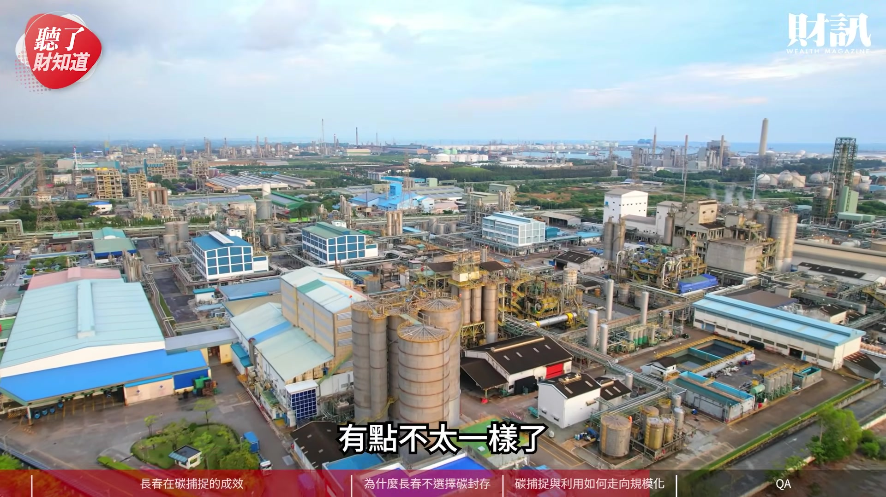

**逐字稿片段：** 其實今年上半年 我們盤點了一些石化業的表現 其實已經略有起色了 到底是一個轉折點呢 還是一個這個重新出發的開始呢 這接下來苑卿會為大家 一一來解答 好不好 好 今天非常感謝 苑卿的分享 看完今天的影片 你認為企業減碳 還有什麼好方法呢 歡迎大家留言 分享你們的觀點 如果不想錯過我們的節目 歡迎訂閱財訊頻道 或是加入頻道會員 解鎖所有的會員影片

**話題推測：** 提及今年上半年石化業的表現狀況。

---

## 00:10:43

**逐字稿片段：** 接下來我們要回覆 財團在《聽了財知道》 第 372 集 用電焦慮讓台積電號召各界 打造能源新路徑 裡面的留言 這一集真的是非常的熱烈 那我覺得自己 在做這個題目的時候 我也自己覺得很有感受 就是說能源這件事情 是台灣共同要面對的事情 當然台積電領頭 真的非常非常棒 但是台積電跟企業跟政府 就剛剛苑卿所講的產官學 大家一起來努力 建造台灣非常有前景的未來 我想能源的議題 包括就是外商來台灣投資 它們最關心的也是 沒錯 就是能源的議題 對 所以我們要繼續 帶動台灣的成長 我覺得能源是我們 不可迴避的話題 那是不是請苑卿 幫我們唸一下

**話題推測：** 轉向回覆觀眾在上一集影片的留言。

---

## 00:11:24

**逐字稿片段：** Justice 他贊助了 75 元 然後以現在台積電 擴張的速度 台灣低碳電力 完全趕不上需求 如果有一天台積電宣布 要蓋發電廠或買下核三廠 核四廠 我不會感到意外 有一家可以帶領 台灣經濟向上提升 又願意付出社會責任的台積電 身為台灣人很幸運 沒錯 所以它是我們的護國神山 林建宏他有提到說 小型或舊有核能 供應民間使用 科技端培養綠電 工廠端實施火力加碳捕捉 重劃區重新布線才能分流 對 其實能源就是要分散多元 這件事情其實政府 也提到滿多次的 只是說在這個 轉型的過渡期間 其實很多事情 必須要相互配套跟重新調整 那這個是需要時間的 好 然後 124DWS 他有提到說 地震不會把碳封存震出來嗎 下面立刻有專業的人 回覆他了

**話題推測：** 閱讀觀眾Justice的留言，提及台積電對電力需求的影響。

---

## 00:12:22

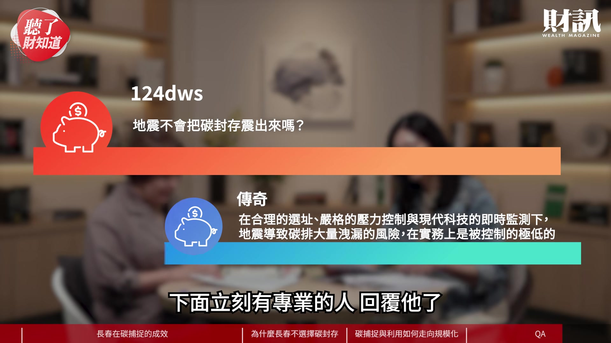

**逐字稿片段：** 傳奇有回覆他說 在合理的選址 嚴格的壓力控制 與現代科技的即時監控下 地震導致碳排大量洩漏的風險 在實務上是被控制得極低的 對 這個部分其實 在這次的財訊的封面故事裡面 其實也有詳列了國外經驗 其實國外做碳封存這件事情 其實已經有長達數十年之久了 我覺得台灣雖然才剛起步 但是我們為了能源的需求 我們就會多方學習 所以當然這個顧慮會是有的 這次我們在採訪

**話題推測：** 引用網友傳奇對碳封存安全性的專業回覆。

---

## 00:12:56

**逐字稿片段：** 環境部部長的時候 他講到這件事 他講到說 碳封存能否成形 我覺得這就是有關 訊息的溝通跟透明度 也是我們的責任 我們就是要把訊息 跟大家一起分享 也非常感謝您的關心 如果想瞭解更多的內容 歡迎點擊資訊欄裡面的文章連結 或者購買財訊第 773 期雜誌 跟我們一起追蹤政經趨勢 掌握投資脈動 《聽了財知道》 我們下次再見 謝謝苑卿 謝謝大家

**話題推測：** 提及採訪環境部部長，可能顯示部長照片或引言。

---
