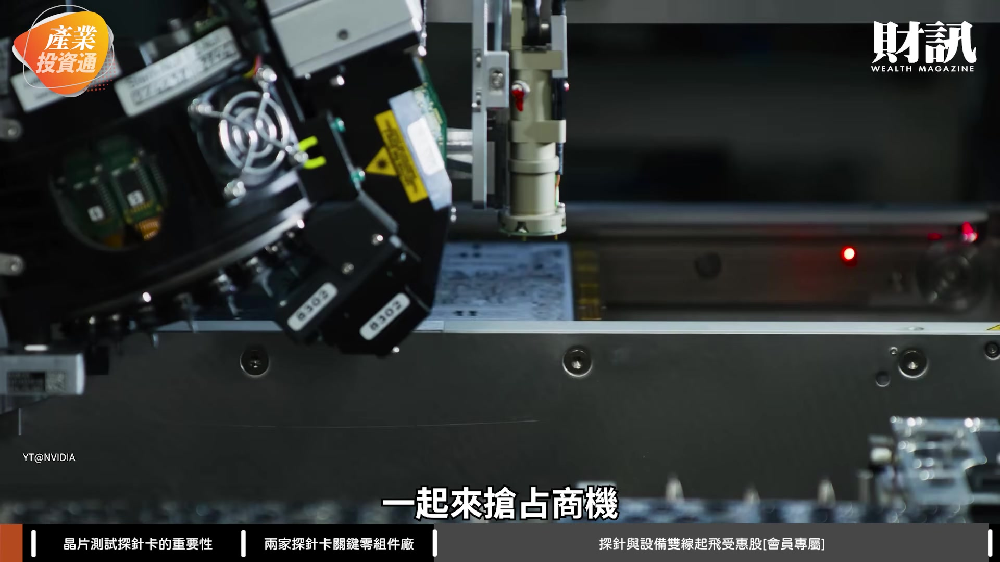
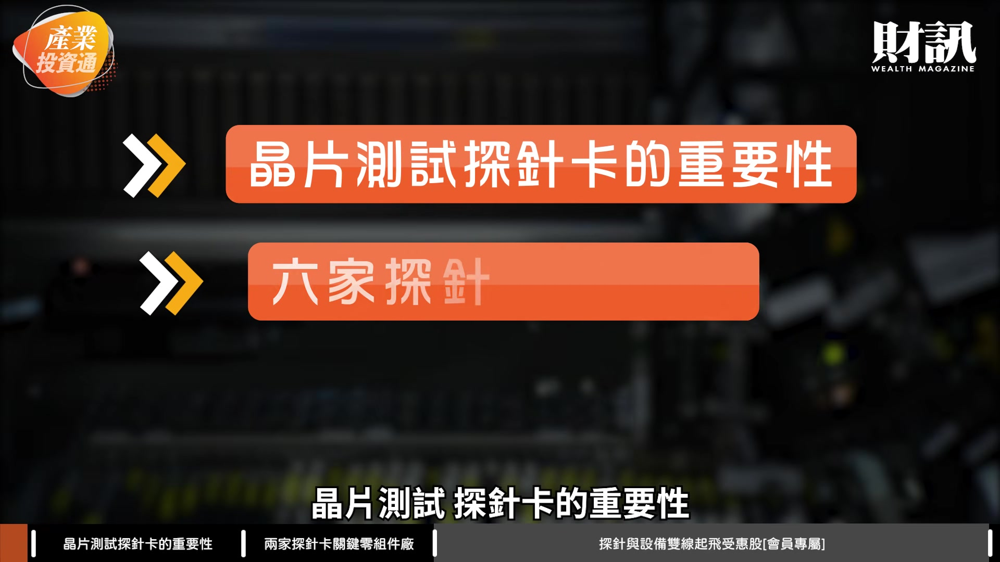
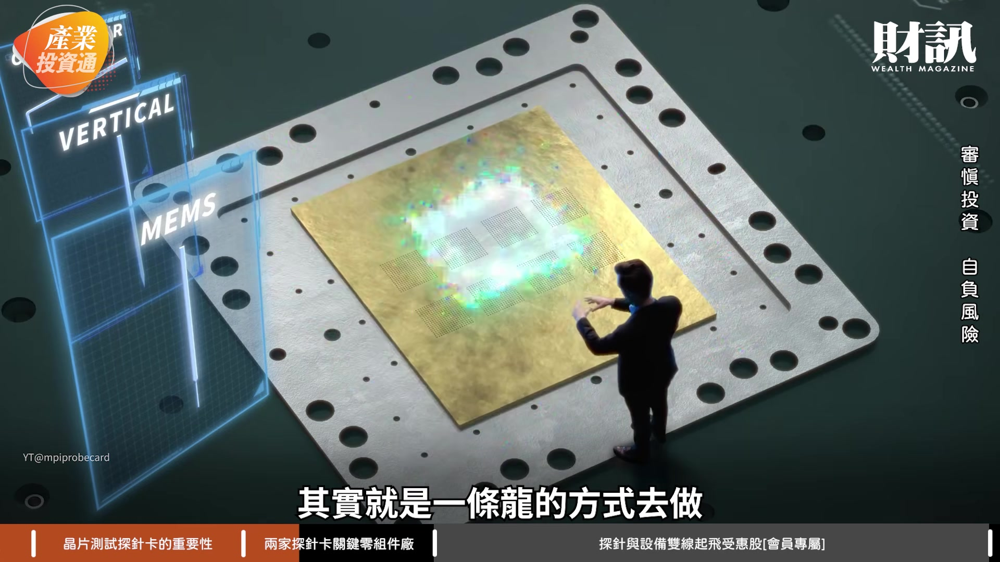

# wealth1974_qL5ms5oowHA — 關鍵畫面索引

- 來源逐字稿：[wealth1974_qL5ms5oowHA_GT.srt](wealth1974_qL5ms5oowHA_GT.srt)
- 影片：https://www.youtube.com/watch?v=qL5ms5oowHA
- 截圖數：12

## 00:00:05

**逐字稿片段：** 之前黃仁勳表示 他預計輝達明年的晶片的銷量 會是今年的 2 倍 當然我們覺得這有可能 是在幫市場提振信心 但我相信真正的原因 是 AI 帶來的效益 跟貢獻真的很大 AI 持續暢旺 相關的需求設備 其實也跟著是 一起來搶占商機

**話題推測：** 黃仁勳表示輝達晶片銷量預計成長2倍

---

## 00:00:23

**逐字稿片段：** 那今天這一集 我們就來跟大家聊聊 晶片測試 探針卡的重要性

**話題推測：** 介紹本集主題：晶片測試探針卡的重要性

---

## 00:00:28

**逐字稿片段：** 6 家探針關鍵零組件廠 以及 2 家測試設備雙雄 成長強勁 在 AI 浪潮的推動下 其實相關產業鏈都一直缺貨 那我們前面已經探討到了記憶體 我們探討到了 PCB 那接下來 我們這次就來聊聊 檢測晶片 探針卡 請志明哥分享一下 探針卡跟設備 它的重要性在什麼地方

**話題推測：** 提及6家探針關鍵零組件廠與2家測試設備雙雄

---

## 00:00:49

**逐字稿片段：** 其實因為新一代的 AI 晶片 它的電晶體的數量 跟接點的數量跟耗電量 都同步增加

**話題推測：** 解釋AI晶片電晶體、接點、耗電量增加的趨勢

---

## 00:00:57

**逐字稿片段：** 一個晶片裡面有放 CPU GPU HBM 未來還有 CPO 這樣的晶片 開始要導入進去 那這裡面如果你之前 沒有去做一些設計測試的話 你等於是其中一個部分 有些問題的話 你等於是整個晶片都會報廢 那這對生產廠商來講 是不可承受之重 所以說等於是 把一個晶片的設計圖做完以後 用探針的方式 讓它的電訊先測試一次 這個部分過了 那就往下一個階段去做 等於是愈來愈複雜 愈來愈困難 尤其現在像探針卡這部分 它都要什麼高壓 高電流 然後低雜訊的這種配置的話 其實探針的數量會愈來愈多 密度會愈來愈高 所以測試的時間會愈來愈長 所以是對台灣廠商 其實就有很大的受惠 因為其實台灣廠商 在這部分的技術能力 都還滿強的 所以它的受惠程度是愈來愈高 對 所以就是說 其實晶片愈來愈複雜 探針卡的針數

**話題推測：** 列舉晶片內含的CPU、GPU、HBM、CPO等元件

---

## 00:02:03

**逐字稿片段：** 我們這邊有查到 就是從原本現在 VPC 就是垂直式的探針卡 它是每一張大概就是 2 萬到 2.5 萬支 那現在新一代可能 3-5 萬支 甚至少數可能會到 10 萬支 就是這塊它的技術 也是一直不斷的在演進 這些廠商隨著技術演進的升級 它就有新的機會 新的契機這樣子 那剛才我們跟志明哥聊到 就是說我們另外有一個 叫封測這個概念 志明哥可以聊一下 封測跟測試這兩個 它聽起來有點像的詞 它的不同點在什麼地方 我可能用比較簡單 大家能理解的方式來講 比如說你去蓋一棟大樓對不對 你要有設計圖 你什麼地方會有電梯 什麼地方會有樓梯 這在設計的時候就完成 那但是一般大樓 是要蓋完以後才能驗屋 那其實晶片的設計過程也是 它每個步驟都會 就是電導入之後 探針放下去的時候 電是可以通過 然後這些訊號都沒問題 那它表示你這個階段都是 OK 的 就可以往下一個階段走 那最後就是 你晶片已經封裝出來以後 其實你還是要做各式各樣的測試 它測試完以後 它才知道你這個晶片是 OK 的 那你才可以裝到伺服器上面 所以這裡面每個過程 都有很多不同的設計 然後不同的解決方案 那像以前針數比較少的時候 像探針可能用一支一支 用顯微鏡的方式 放在一個探針卡上面去測試 那現在幾萬支 那你人工就沒辦法 你可能要做很多這種自動化設計 那這裡面成本就提高 當然為了這個晶片 現在一顆晶片愈來愈貴 它的這種自動化的效益 也要愈來愈高 所以說 這方面的技術 層次是提升了 對台灣廠商來講 它的受惠會愈來愈高 對 而且現在就是 我需要量變大 而且需求也孔急 所以我們要完成 這些每一個流程的速度 也愈來愈快 所以即便自動化 它的成本是高的 但其實為了要更快的去交付出 符合廠商要求的 這些品質的這些晶片 我想這些都是必要的 資本投資跟投入 那當然對於我們投資來講 其實最重要的瞭解趨勢 瞭解產業是一回事 更重要的是 瞭解機會在什麼地方 財訊這一期的報導中 我們也盤點了相關的台廠

**話題推測：** 提供探針卡針數從2.5萬到10萬支的數據變化

---

## 00:04:14

**逐字稿片段：** 我們看到了這次幾家 旺矽 穎崴 中華精測 創新服務 漢測跟雍智科技 但漢測我相信 這已經是出圈的一個公司了 在上個禮拜 上櫃的募資的過程 其實很多人都有去抽 除了漢測之外 這 6 家是不是請志明哥 也幫我們解析一下 其中很多人也很關注的 旺矽跟穎崴呢 旺矽 穎崴其實就是 在這個領域算是 第一名跟第二名

**話題推測：** 列舉旺矽、穎崴、中華精測等6家探針卡相關台廠

---

## 00:04:40

**逐字稿片段：** 旺矽它 1 個月營收 都 20 幾億元以上 你看 它雖然是龍頭 但是它的年增率 也是 60% 到 70% 左右 那主要是因為 它是完整的從懸臂式的 垂直式的跟 微機電式這種系統 都可以做一個完整的配套措施 其實就是一條龍的方式去做

**話題推測：** 提及旺矽月營收逾20億元

---

## 00:05:01

**逐字稿片段：** 那其實你看它最近的這種產能 它今年可能是 200 萬針 還有 500 萬針 然後還投入了 大概 20 億元去擴廠 等於是它其實從現在開始 到明年 後年 因為 AI 晶片的複雜度的增加 它還是會持續的受益

**話題推測：** 提供旺矽產能擴張與20億元擴廠投資數據

---

## 00:05:18

**逐字稿片段：** 那另外一家穎崴 其實它雖然營收比旺矽少一點 但其實它的年增率是很高的

**話題推測：** 介紹另一家公司穎崴

---

## 00:05:25

**逐字稿片段：** 比如說它 8 月營收 是 17 億元左右

**話題推測：** 提及穎崴8月營收約17億元

---

## 00:05:28

**逐字稿片段：** 但是年增是逾 230% 這部分就是它還有很多 比如說散熱條件的一些介面的測試 其實它這方面的技術能力很強 所以說你看它 8 月營收 是幾乎過去同期的 2 倍 那其實就表示 它這些高階的測試機台的探針需求 是滿大的成長 旺矽跟穎崴 其實都是技術能力很強 那也是台灣這些 IC 設計公司 甚至是晶圓代工廠 非常倚重的合作的廠商 所以看起來股價都是幾千元的 未來還是有機會往上成長 對 從 9 月 18 日的收盤價 來看的話 就這幾間 確實穎崴跟旺矽 應該是這 6 家千金股中 股價最高的 對 所以其實這也是 為什麼我們會從這兩家 來先介紹的原因 也補充幾個數字 旺矽它其實在 2027 年的上半年 它會有湖口新廠的一期完工 這部分可能就是剛才講 它的未來大概產能 還會再進一步的往上這樣子 因為我們知道其實 晶片現在有輝達的晶片 也有 ASIC 的晶片 其實不同的晶片 所以我的想像中 也許這 6 家其實各自 有擅長的一個地方 它們這 6 家算是直接的競爭者嗎 還是說其實各有各的戰場呢 應該是每個部分都有部分的競爭 然後大家也有些優勢 所以重點是這些 IC 設計 輝達或是 Google 這些信賴的公司是誰 然後它新增的這些設計的測試 是會給誰做 那這部分就是它未來成長的

**話題推測：** 提及穎崴年增率逾230%

---
