# wealth1974_tpUuNwcWiFU — 關鍵畫面索引

- 來源逐字稿：[wealth1974_tpUuNwcWiFU_GT.srt](wealth1974_tpUuNwcWiFU_GT.srt)
- 影片：https://www.youtube.com/watch?v=tpUuNwcWiFU
- 截圖數：52

## 00:00:19

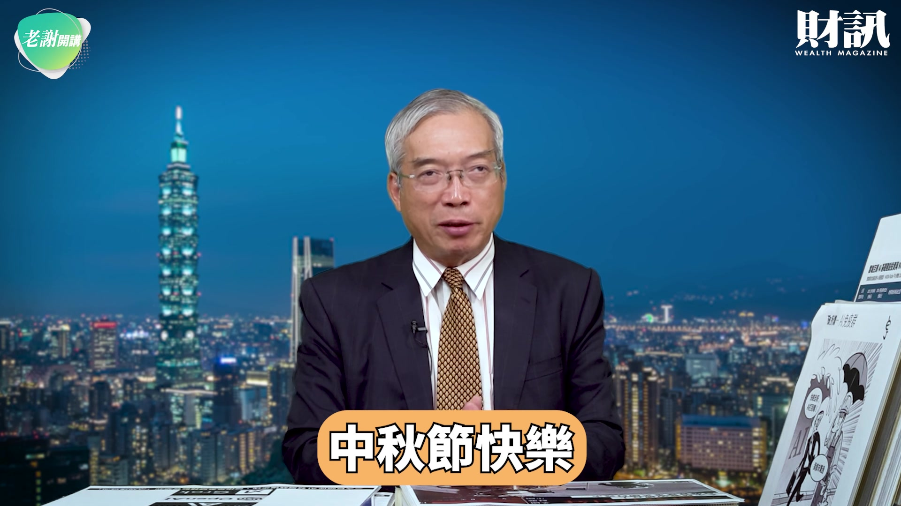

**逐字稿片段：** 那麼在 AI 的賽道上 在中秋過後 大家都很期許 還有一個更美好的未來

**話題推測：** 介紹 AI 賽道上的新進展

---

## 00:00:26

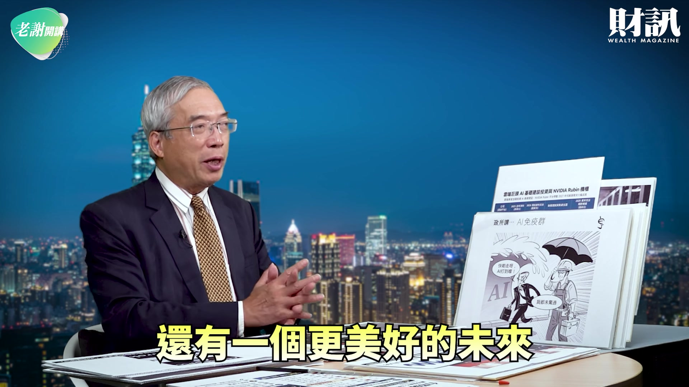

**逐字稿片段：** 這個禮拜給大家來分享 中國的國家主席習近平 到訪美國之後 川普祭出非常高規格的接待 在川普跟習近平的會面之後 到底美中的角力賽會緩和 還是進入另外一場的賽局 這個時候大家可以高度注目 基本上在這一場 AI 的賽道上 我們最近看到一個比較大的變化 川普正式任命 AI 的部隊 他也要任命 AI 的沙皇 這個就是大家現在所看到的

**話題推測：** 討論習近平到訪美國與美中角力賽

---

## 00:01:14

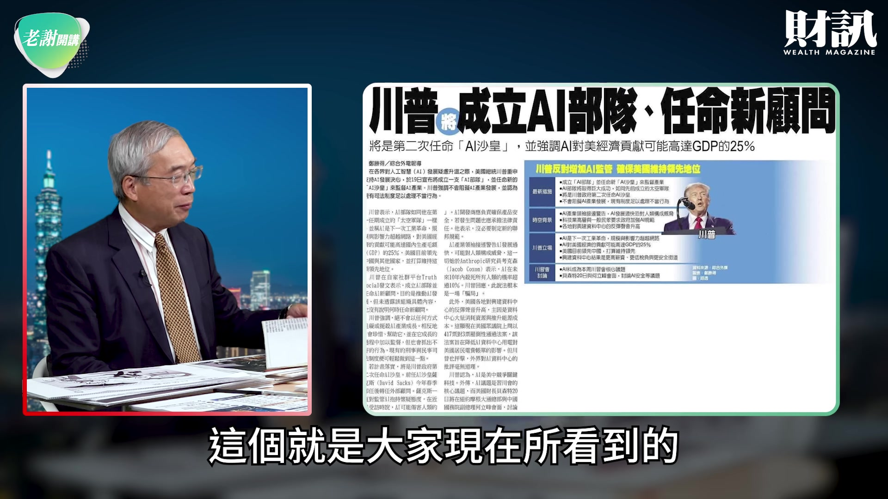

**逐字稿片段：** 川普在 1.0 的時代 他任命一個叫做太空軍 就是展示美國在太空競賽中 美國的企圖心 這個時候川普把調性拉回來 任命 AI 的沙皇 他強調 AI 對美國經濟的貢獻 可能會讓 GDP 成長 25% 這個時候大家也可以看到 川普在這個時候 為什麼祭出這麼大的動作 也告訴大家 未來的 AI 到底會走向 美中的合作或是美中的分化 再競爭或是再角力 或是一個國家戰略的競賽 這個是非常值得大家關注的焦點

**話題推測：** 回顧川普任命太空軍的時代

---

## 00:01:51

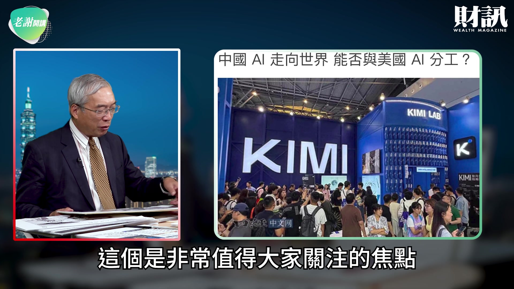

**逐字稿片段：** 我們也看到美國的兩黨議員 他們現在都站出來認為 AI 的主導權不能夠讓給中國 所以這是一個非常明朗的賽局 也就是美國會加大力道 在 AI 的基本建設上 不斷的加碼再投資 這個時候 AI 在美國 到底會扮演什麼角色 我們大家可以看到

**話題推測：** 美國兩黨議員認為 AI 主導權不能讓給中國

---

## 00:02:15

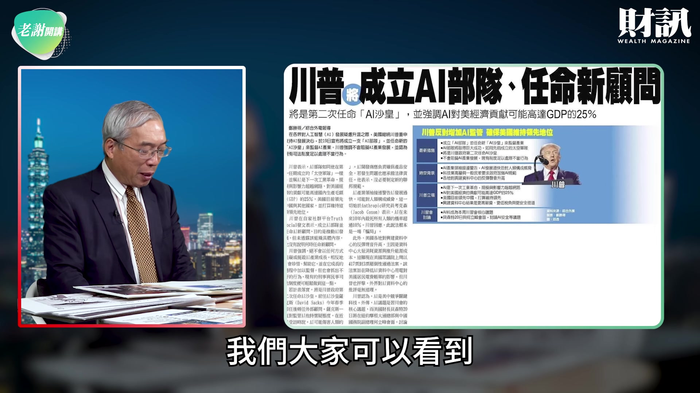

**逐字稿片段：** 川普在講說 AI 是下一個工業革命 規模跟影響力會超過網路時代 AI 對美國經濟的貢獻 可能會高達 25% 美國目前領先中國 並且打算繼續領先下去 興建資料中心的結果 會推高薪資 更低的稅率跟更安全的街道 基本上 這個也會牽涉到未來的資安 川普在成立這個 AI 軍當中 我們大概看到這樣的一個背景

**話題推測：** 川普談 AI 是下一個工業革命

---

## 00:02:42

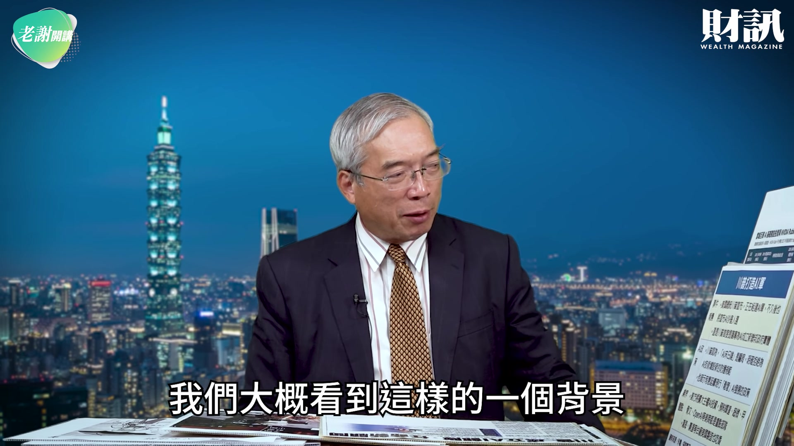

**逐字稿片段：** 這個時候川普認為 講到 AI 的末日論 這是一個陰謀 也就是 現在你可以看到 有非常多的輿論 認為 AI 搶走人類的工作

**話題推測：** 川普對 AI 末日論的看法

---

## 00:02:54

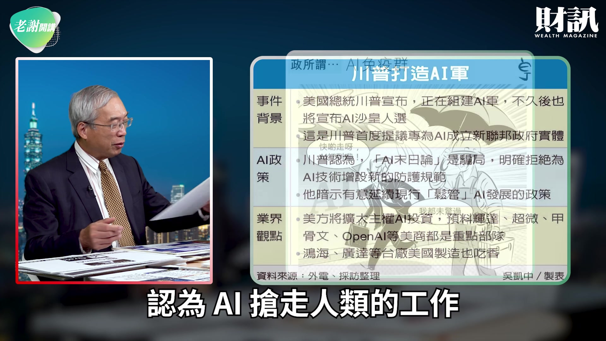

**逐字稿片段：** 這個是漫畫 你可以看到 全世界對 AI 的未來的發展 其實 一則以喜一則以憂 大家都在討論 AI 到底會不會對人類 帶來更大的衝擊或是浩劫

**話題推測：** 討論關於 AI 搶走人類工作的漫畫

---

## 00:03:06

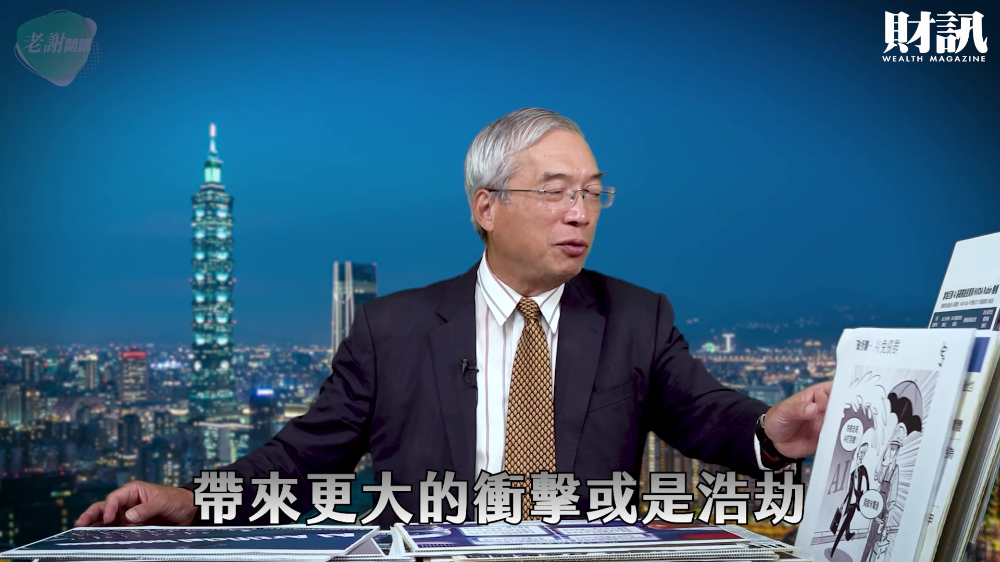

**逐字稿片段：** 你看到美國現在很多專家 認為 AI 會滅絕人類 包括比爾蓋茲 美國很多的 AI 巨頭都 在思考 AI 對未來人類的影響 我們也看到 AI 到底 會對世界帶來什麼影響 你可以看到 有一些專家認為 AI 到目前為止沒有產生生產力

**話題推測：** 提及比爾蓋茲等專家認為 AI 會滅絕人類

---

## 00:03:27

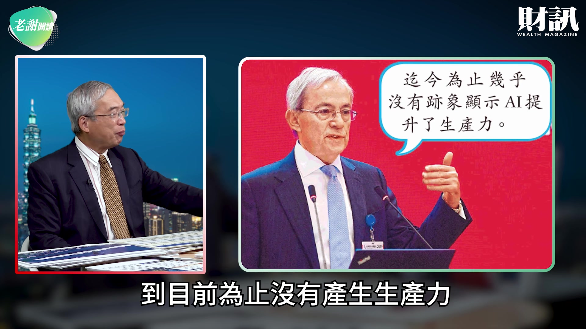

**逐字稿片段：** 孫正義說 用泡沫來形容 AI 是一種侮辱 所以這個時候大家可以看到在 美中角力當中 這是一個停不了的賽道 換句話說 在 AI 的軍備競賽上 這是一條不歸路 這個不歸路 大家會不斷的在 賽道上加碼去投資 所以

**話題推測：** 孫正義對 AI 的看法：用泡沫形容是侮辱

---

## 00:03:45

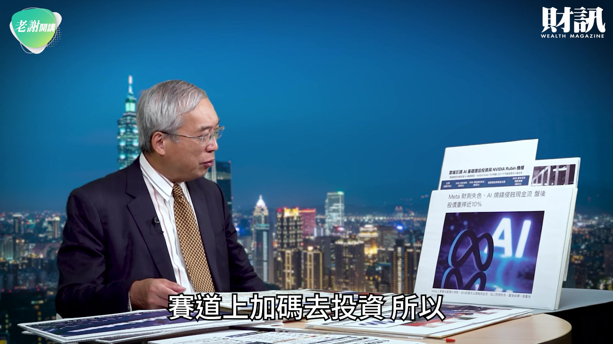

**逐字稿片段：** 這張圖大概可以看得很清楚

**話題推測：** 講者提示將展示圖表

---

## 00:03:47

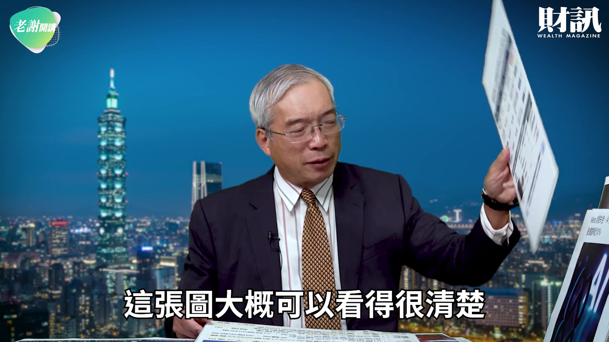

**逐字稿片段：** 大家可以看到 美國的資料中心 CSP 的四大巨頭 它們在今年的資本支出 都達到人類歷史上 沒有看過的空前規模

**話題推測：** 美國資料中心 CSP 四大巨頭的資本支出

---

## 00:03:59

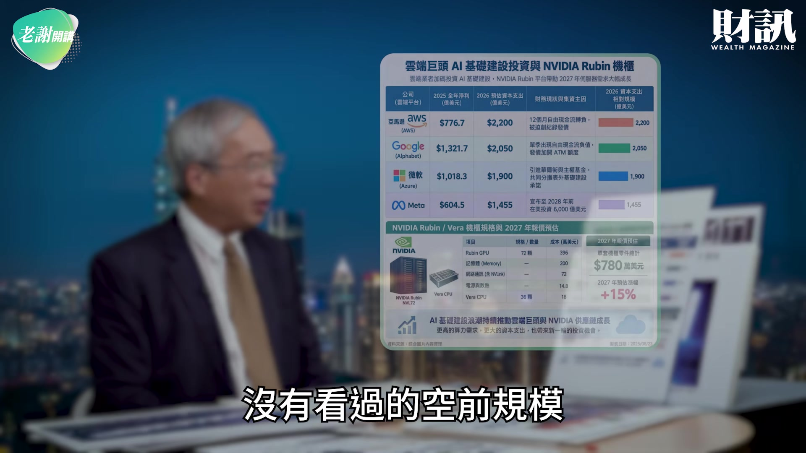

**逐字稿片段：** 我們看到亞馬遜在去年 稅後淨利 776.7 億元 但是它的 資本支出達到 220 億元 這個 220 億元當中單單今年 亞馬遜發行的可轉債 就達到 540 億美元

**話題推測：** 亞馬遜的稅後淨利與資本支出數據

---

## 00:04:14

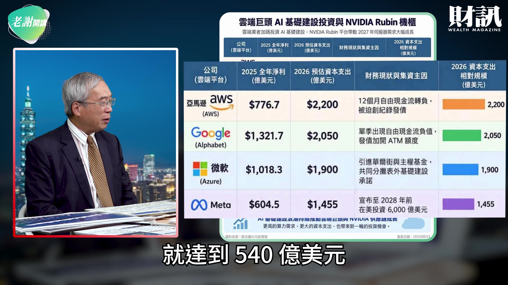

**逐字稿片段：** 同時 Google 它的 2025 年的稅後淨利 1321.7 億元 但是在今年的資本支出 2050 億美元 所以 現在都是資本支出 遠遠大過它前一年度的獲利 微軟賺了 1018.3 億元 但是它的資本支出 1900 億元 Meta 稅後淨利 604.5 億元 資本支出 1455 億元 這樣的一個大規模的投資 已經帶來了一個大的效應

**話題推測：** Google 的稅後淨利與資本支出數據

---

## 00:04:42

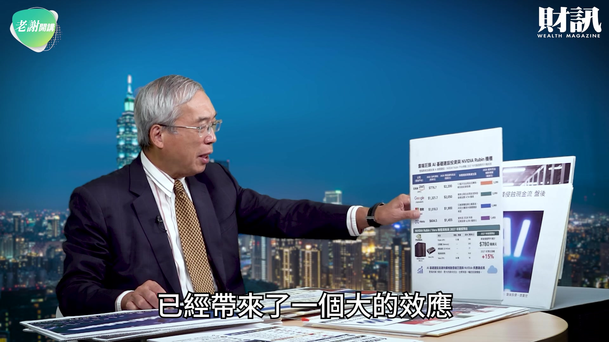

**逐字稿片段：** 你可以看到 Meta 的財報失靈 它的 AI 燒錢 燒光了現金流

**話題推測：** Meta 財報失靈、AI 燒錢燒光現金流

---

## 00:04:47

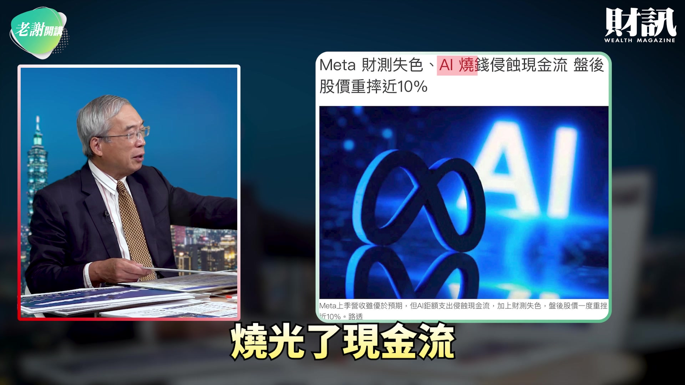

**逐字稿片段：** Alphabet 的情況 也有同樣的 異曲同工之妙 你看到 在過去一段時間 它的自由現金流都飽飽 第三季跟第四季 都有將近 250 億美元的 自由現金流 到今年的第一季 它已經降到 100 多億元 第二季變成負的 59 億元 所以這個給市場帶來 非常大的驚愕

**話題推測：** Alphabet 自由現金流的變化

---

## 00:05:13

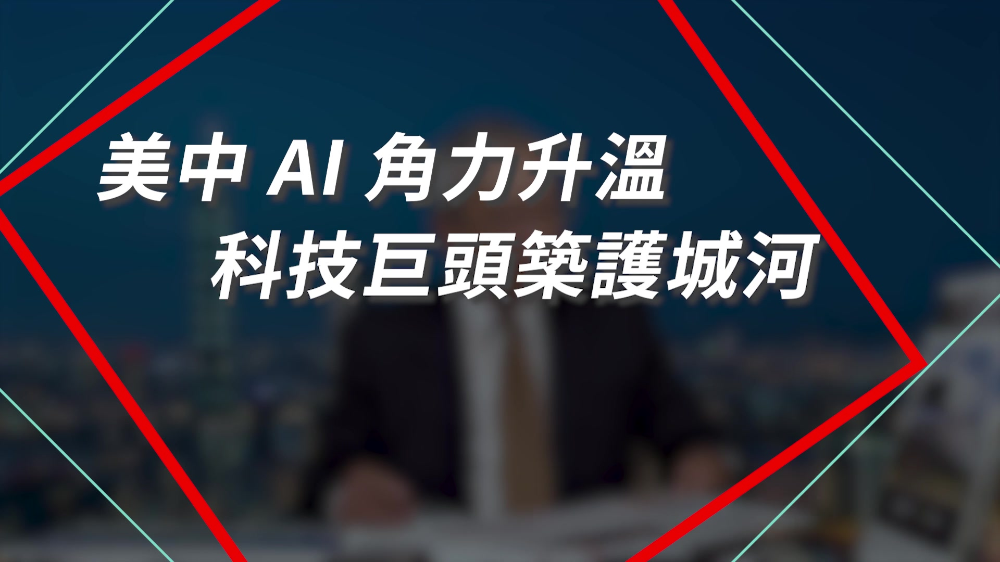

**逐字稿片段：** 我們看到現在 AI 賽道上的建置 大家都馬不停蹄

**話題推測：** AI 賽道上的建置情況與合作夥伴

---

## 00:05:18

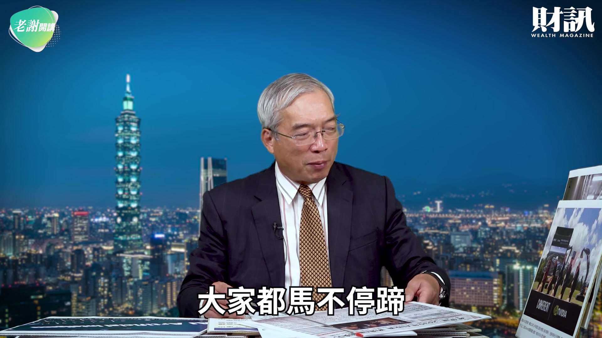

**逐字稿片段：** 這個是輝達跟 Coherent 就是在光通訊產業 共同籌建新廠的破土典禮 所以它認為 AI 連結的光的產業 輝達在 2026 年上半年 它總共投資 60 億美元 去投資 Coherent 在矽光子在建置

**話題推測：** 輝達與 Coherent 共同籌建新廠的破土典禮

---

## 00:05:34

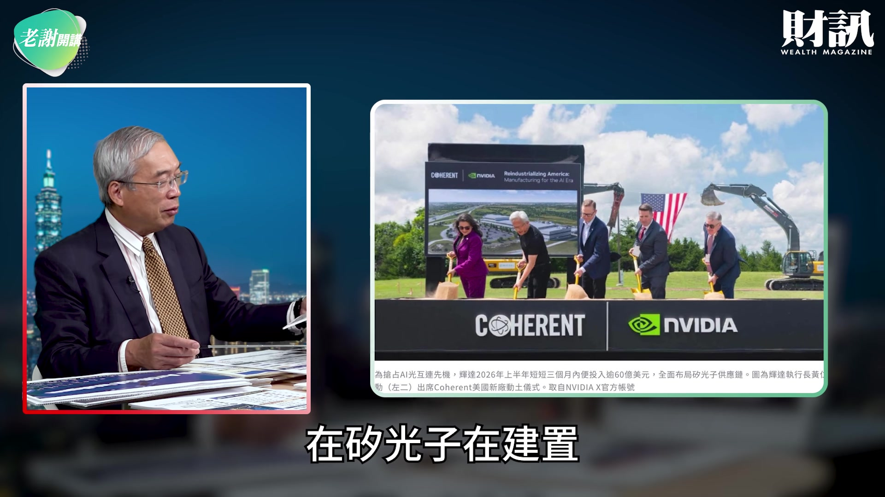

**逐字稿片段：** 到 2030 年 輝達在 AI 的投資 會達到 4 兆美元 所以這是一個 非常燒錢的產業 這個產業你可以看到 在資料中心當中 它帶來非常多的生態系

**話題推測：** 輝達在 AI 領域的預計投資額 (4 兆美元)

---

## 00:05:47

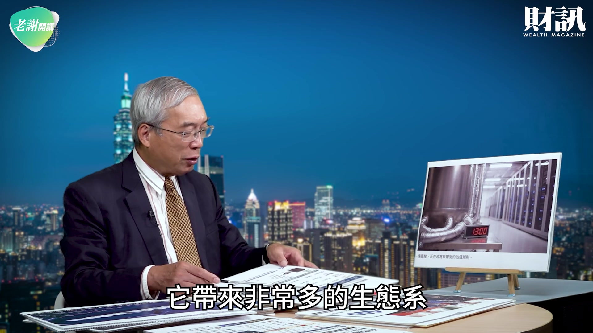

**逐字稿片段：** 這個生態系 美國會不斷的加碼 對中國 它同樣採取非常多的規範

**話題推測：** 美國對中國 AI 發展採取的規範

---

## 00:05:53

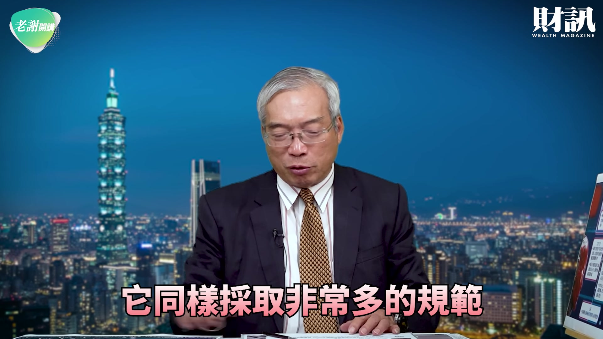

**逐字稿片段：** 我們大家可以看到在去年 梁文鋒發表了 DeepSeek 之後 讓美國人覺得 中國看起來要取代美國

**話題推測：** 梁文鋒發表 DeepSeek，讓美國感受到壓力

---

## 00:06:01

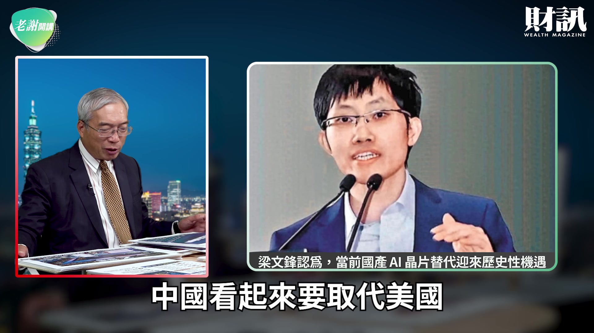

**逐字稿片段：** 今年的智譜 同樣帶來很大的威力

**話題推測：** 智譜帶來威力

---

## 00:06:04

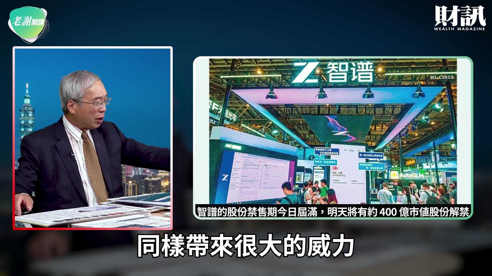

**逐字稿片段：** 最近的月之暗面叫 Kimi K3 也讓美國產生非常大的壓力 所以你可以看到 在過去這段時間 中國的 AI 語言模型 有眾多的公司 從 Kimi 開始 智譜 到阿里巴巴 然後到稀宇科技 我們看到月之暗面 小米 通通都是 中國在 AI 有非常多的評價 都不輸給美國 所以中國等於是 在未來發展的產業賽道上 把國家重要的資源

**話題推測：** 月之暗面 Kimi K3 讓美國產生壓力

---

## 00:06:36

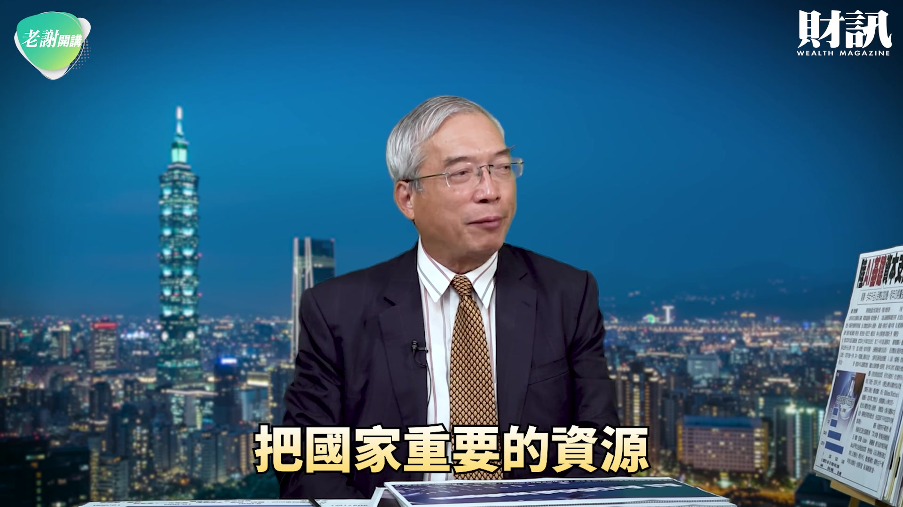

**逐字稿片段：** 你可以看到過去 20 年前 它去發展房地產 再過來發展電動車 現在電動車產業的補貼 也大概告一段落了

**話題推測：** 中國過去發展房地產、電動車的產業重心轉移

---

## 00:06:45

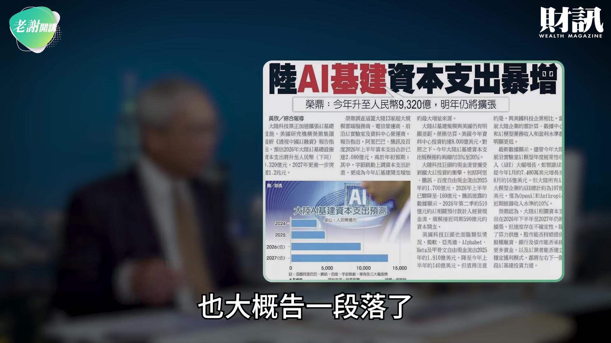

**逐字稿片段：** 現在中國用舉國之力 來建置 AI 產業的發展 所以這很清楚可以看出來 美國跟中國的 AI 競賽當中 中國絕對不會（停）下手

**話題推測：** 中國用舉國之力建置 AI 產業發展

---

## 00:06:57

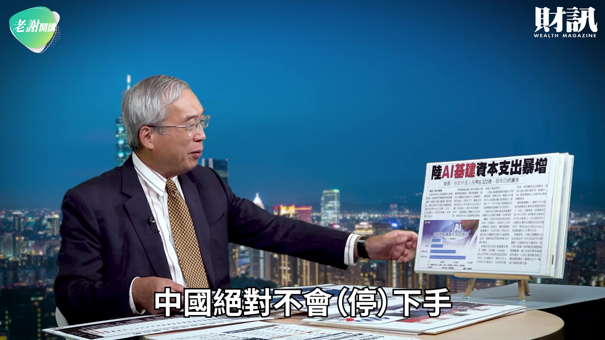

**逐字稿片段：** 它今年的資本支出 大概 9320 億元人民幣 但是如果你拿來跟美國的 資本支出來比 中國還是有一段很大的差距 所以這是一個 我們現在看到 美中在角力的路徑當中

**話題推測：** 中國今年的資本支出數據

---

## 00:07:11

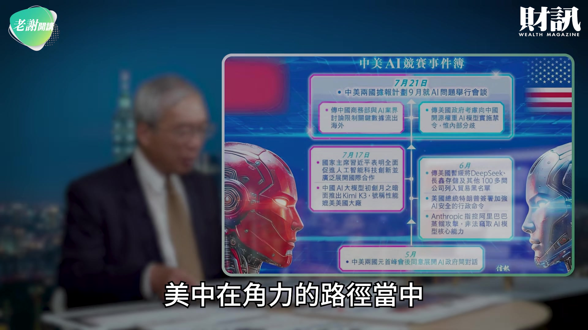

**逐字稿片段：** 5 月的時候 中美兩國的元首峰會 他們同意展開 AI 政府對話

**話題推測：** 中美兩國元首峰會同意展開 AI 政府對話

---

## 00:07:18

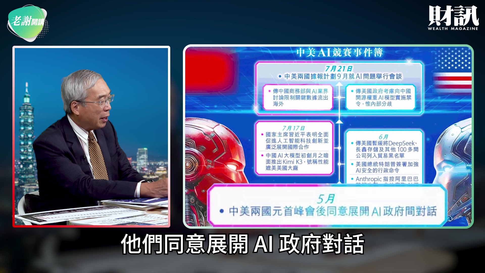

**逐字稿片段：** 6 月美國把 100 多家 包括 DeepSeek 長鑫存儲 列入貿易的黑名單

**話題推測：** 美國將 DeepSeek 等公司列入貿易黑名單

---

## 00:07:24

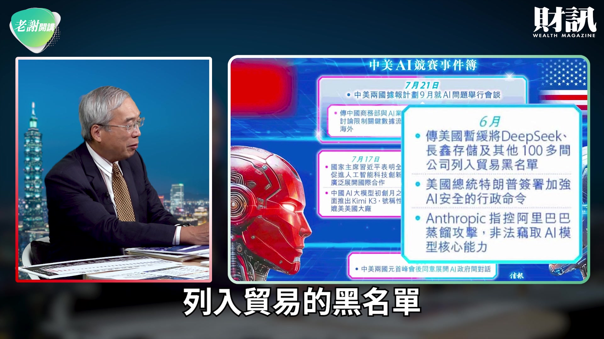

**逐字稿片段：** 美國總統川普是 加強 AI 控管的行政命令 我們大家可以看到

**話題推測：** 美國總統川普加強 AI 控管的行政命令

---

## 00:07:30

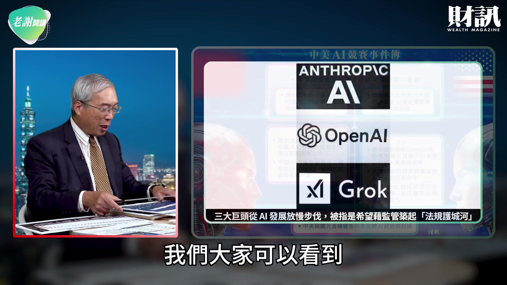

**逐字稿片段：** Anthropic 包括 OpenAI 包括 Grok 它們都希望政府 能夠加強監管的腳步 它們的看法跟黃仁勳不太一樣 黃仁勳說 如果過度監管 不利美國的競爭力 這時候為什麼它們有這種想法 中國在發展 大型語言模型 它們的競爭對手是 Anthropic 包括 OpenAI 包括 Grok 所以這 3 家公司 都希望美國 高築護城河 這個護城河其實 也跟現在的非紅供應鏈 有異曲同工之妙 換句話說 中國的國家之力 打遍世界無敵手 這個時候 很多的科技巨頭都認為 美國應該要築起護城河 所以看法不太一樣

**話題推測：** Anthropic、OpenAI、Grok 等公司希望加強監管

---

## 00:08:17

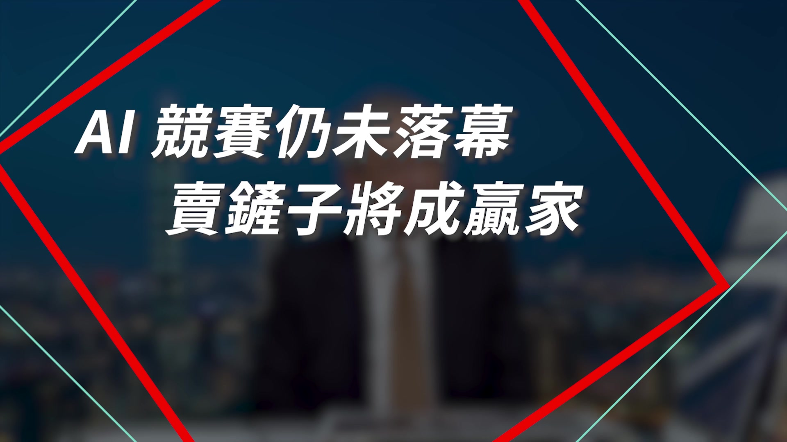

**逐字稿片段：** 川普最近又有新的想法 他把原來的 Artificial Intelligence 現在改成 Super Intelligence 換句話說 川普在 AI 的賽道上 現在看起來 他是不會停息 也不會手軟

**話題推測：** 川普將 Artificial Intelligence 改稱 Super Intelligence 的新想法

---

## 00:08:31

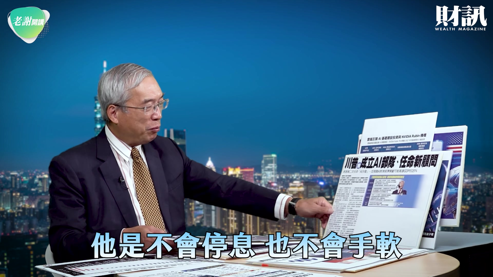

**逐字稿片段：** 解放軍要用中國模型抓異常 結果敏感資料 被 Claude 看光光 那你們可以看到

**話題推測：** 解放軍使用中國模型抓異常導致資料外洩事件

---

## 00:08:37

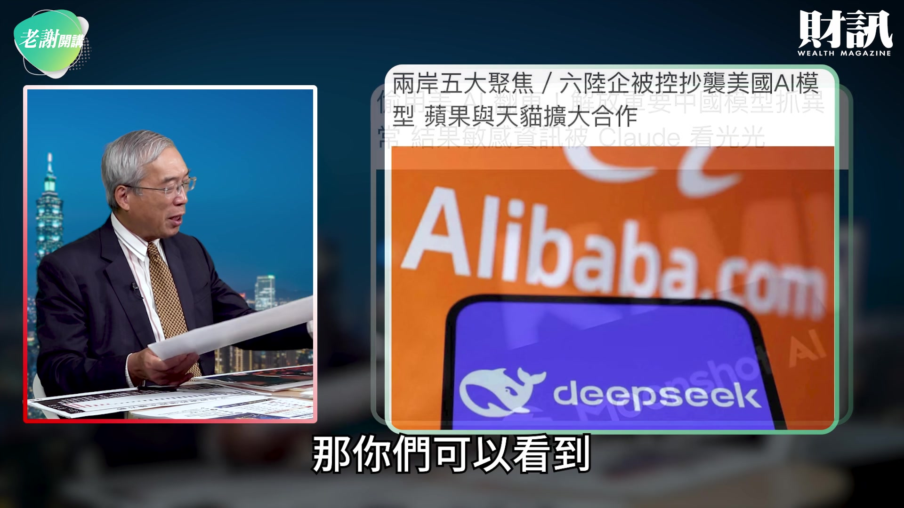

**逐字稿片段：** 現在 6 家中國的企業 被指控 抄襲美國的 AI 模型 那麼在過去一段時間

**話題推測：** 六家中國企業被指控抄襲美國 AI 模型

---

## 00:08:44

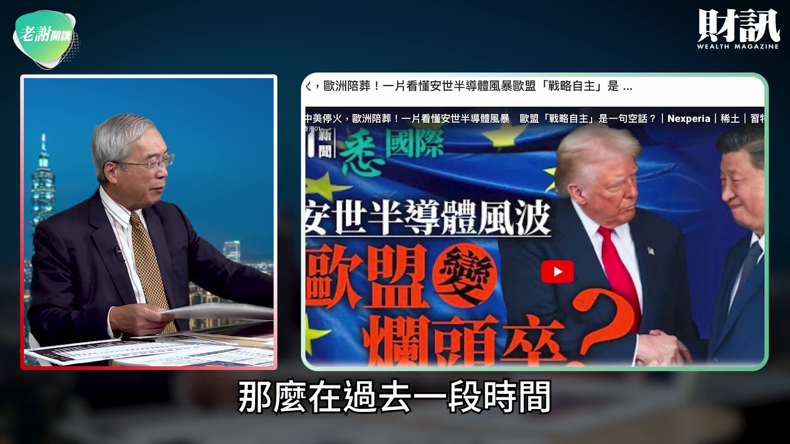

**逐字稿片段：** 荷蘭的安世半導體在 功率元件 它跟中國的聞泰科技 劃清界線 所以這個併購並沒有成功 這個沒有成功也告訴大家 美國在 AI 的賽道上 現在是 採取堅壁清野的戰略 所以如果你拿 美國的 CSP 大廠的實力 來跟中國來做比較 你可以想像得到 在未來的 AI 應用當中 中國看起來 也不會輸給美國 你看到

**話題推測：** 荷蘭安世半導體與中國聞泰科技劃清界線

---

## 00:09:08

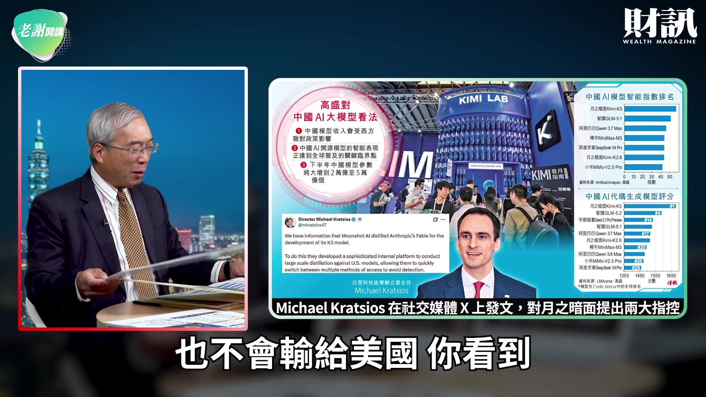

**逐字稿片段：** 你看到這個型態在改變 亞馬遜在進入 AI 的時代 它的廣告收入其實 不斷的在上漲 這個也是看到 AI 應用這一端 愈來愈成熟

**話題推測：** 亞馬遜進入 AI 時代廣告收入上漲

---

## 00:09:18

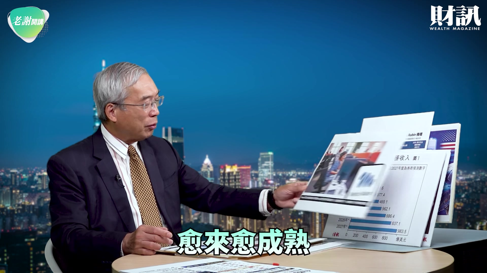

**逐字稿片段：** 那 Meta 不斷的在研發 代理的 Muse 的這個 它的功能

**話題推測：** Meta 研發代理的 Muse 功能

---

## 00:09:22

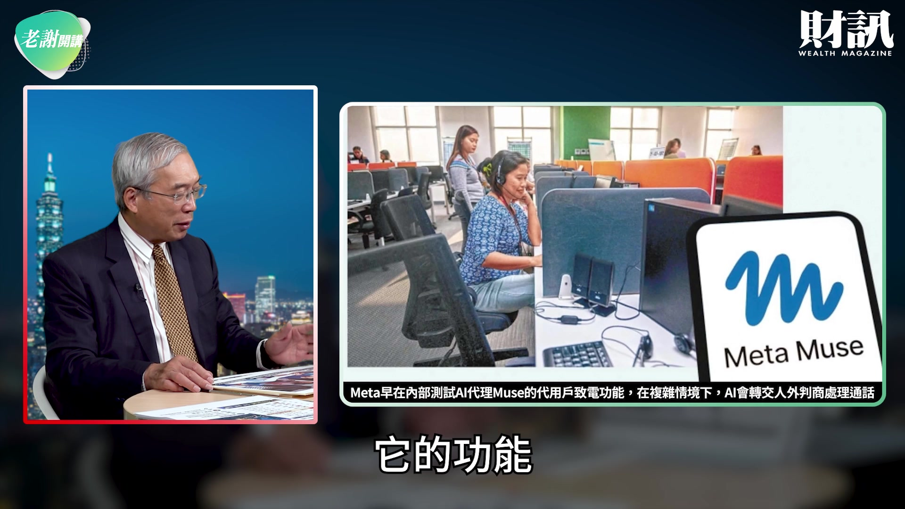

**逐字稿片段：** 所以美國現在有非常多的 個人工作室 在培養未來的 AI 人才 那中國也沒有停息

**話題推測：** 美國個人工作室培養 AI 人才現況

---

## 00:09:30

**逐字稿片段：** 大家現在可以看到 用 AI 所製作的 AI 短影片 其實 1 個月可以生產 50 億部 這個是大家難以想像的

**話題推測：** AI 製作短影片每月可生產 50 億部

---

## 00:09:38

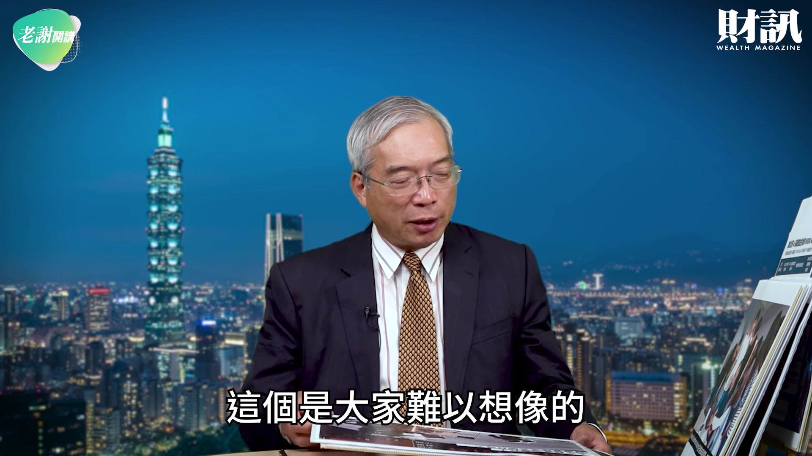

**逐字稿片段：** 那麼 AI 的應用 這也是下一個回合 台灣要非常注意的 台灣在 AI 的使用率 現在 33.8% 那麼在全球第 19 名

**話題推測：** 台灣在 AI 應用上的使用率與排名

---

## 00:09:47

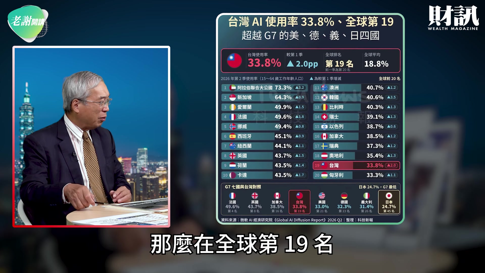

**逐字稿片段：** 那麼我們大家可以看到 在這樣一個排名當中 沙烏地阿拉伯聯合大公國 排名第 1 再來新加坡 再來愛爾蘭 法國 然後挪威 西班牙 台灣大致上 列在歐洲的國家的後段

**話題推測：** 全球 AI 使用率排名，沙烏地阿拉伯第一

---

## 00:10:00

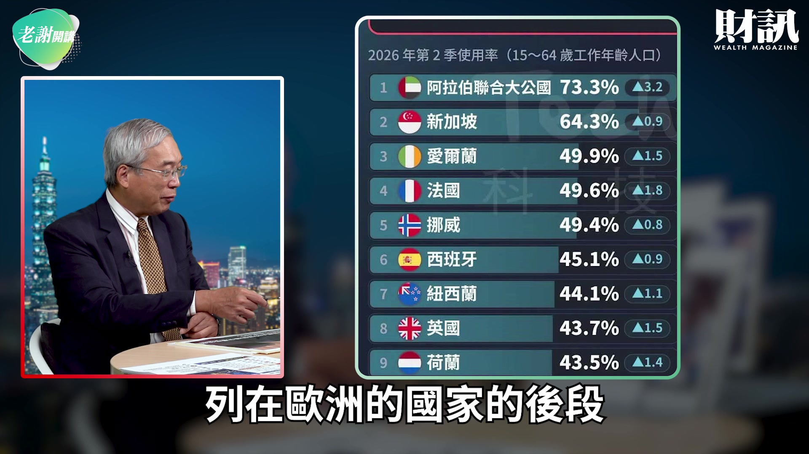

**逐字稿片段：** 但是相較來看 7 大工業國當中 台灣 33.8% 美國 33% 德國 32.3% 義大利是 31.4% 日本 24.7% 台灣還有往上的空間

**話題推測：** 台灣與七大工業國 AI 使用率比較

---

## 00:10:13

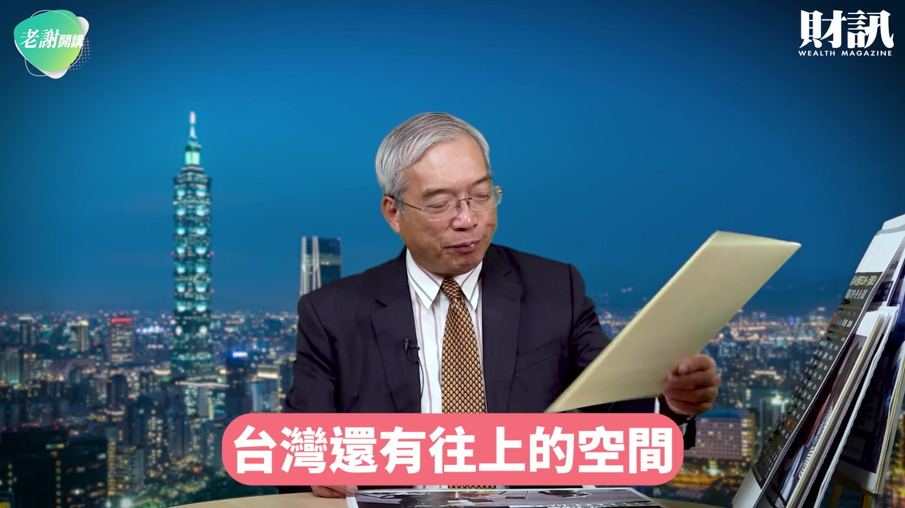

**逐字稿片段：** 我們也看到央行總裁 除了管貨幣政策之外 他最近也提到他說 台灣是 AI 投資熱潮 主要的受益者 要去拚百工百業的 AI 化 好台灣在 AI 的推波助瀾當中 股市不斷的水漲船高

**話題推測：** 央行總裁談台灣是 AI 投資熱潮的主要受益者

---

## 00:10:29

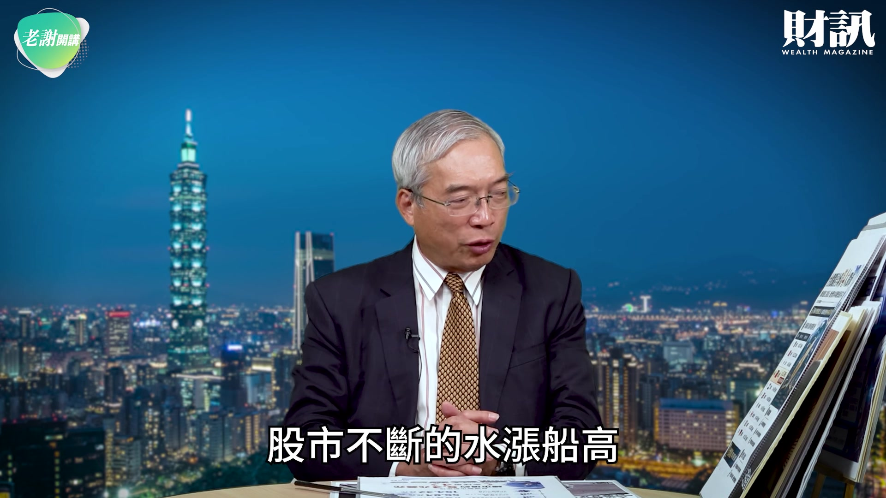

**逐字稿片段：** 9 月 23 日為止 台股的總市值 到了 5.3 兆美元

**話題推測：** 截至 9 月 23 日台股總市值達 5.3 兆美元

---

## 00:10:35

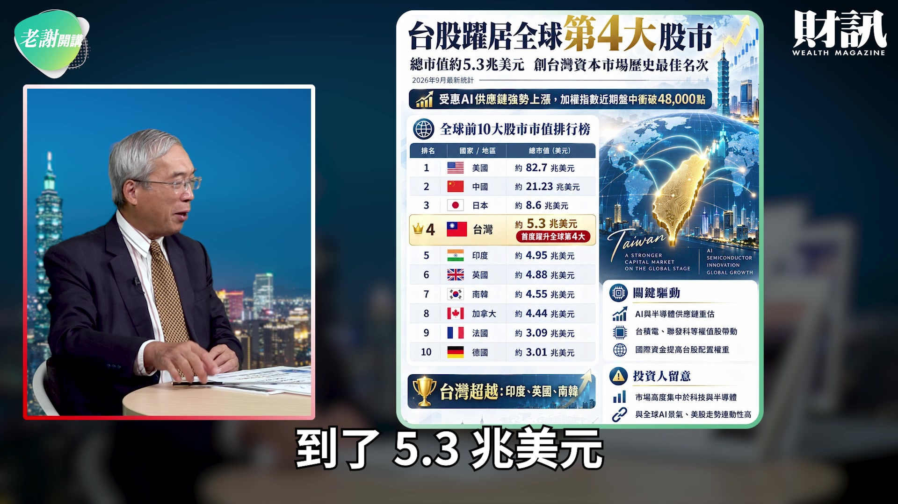

**逐字稿片段：** 5.3 兆元 你可以比較一下 排在前面是日本的 8.6 兆元 中國深圳 上海 加 香港 21.23 兆元 美國 82.7 兆元 台灣已經領先 印度的 4.95 兆元 領先英國的 4.88 兆元 更拉大領先南韓的 4.55 兆元的差距 台灣成為 世界第 4 大的股票市場 這個是非常不容易的

**話題推測：** 台灣股市市值與日本、中國、美國等國比較

---

## 00:10:57

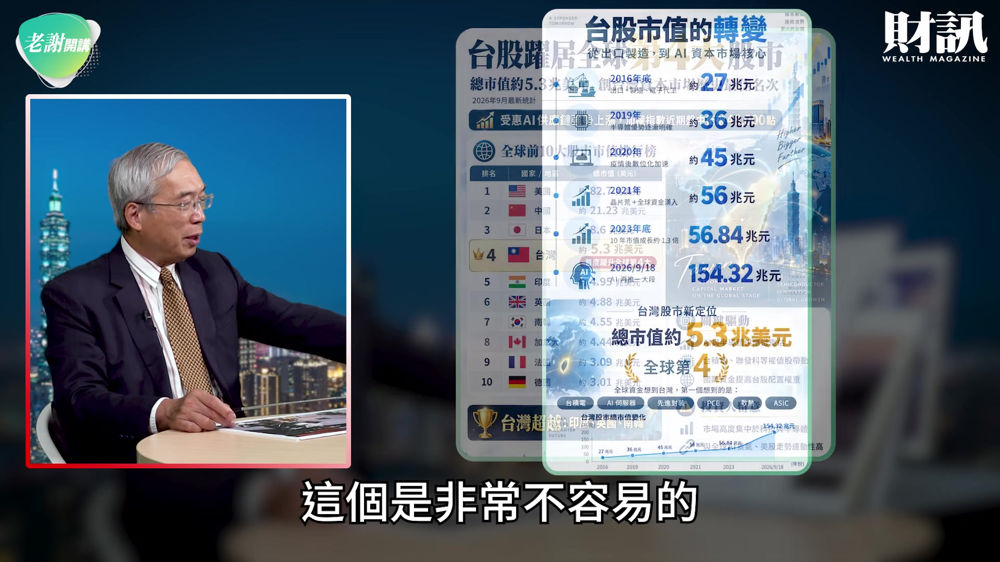

**逐字稿片段：** 如果把 台股市值的轉變 還原新台幣來算 我們 2016 年年底 台股 27 兆元 在小英剛剛上任的第 1 年 2019 年的 36 兆元 2020 年到 45 兆元 現在已經到了 154.32 兆元了 這個 154.32 兆元 是來得非常不易

**話題推測：** 台股總市值以新台幣計的歷史轉變

---

## 00:11:15

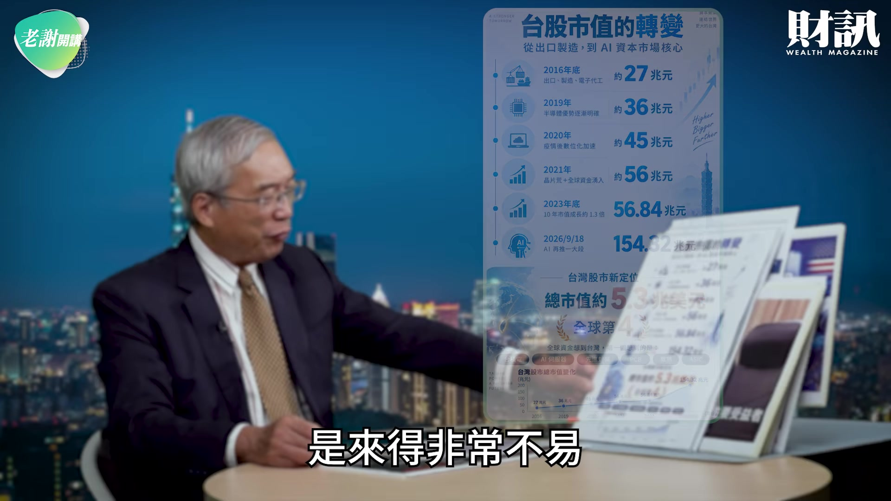

**逐字稿片段：** 在 AI 的 新的軍備競賽之下 台灣是賣鏟子的人 美國的 CSP 大廠 是買鏟子的人

**話題推測：** 將台灣比喻為 AI 軍備競賽中賣鏟子的人

---

## 00:11:23

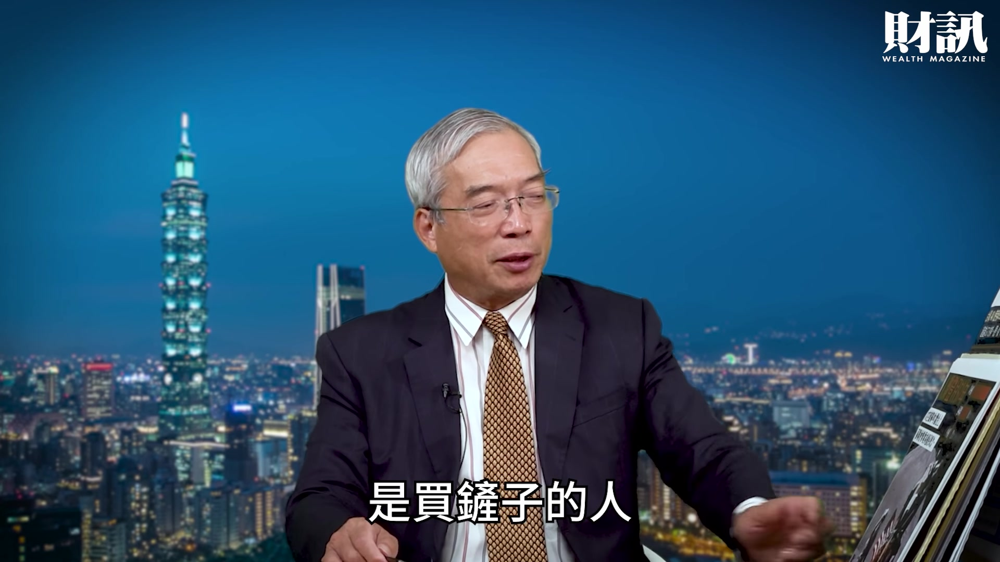

**逐字稿片段：** 現在我們回顧一下 在 1960 年代的時候 蘇聯開始把太空人 送上月球 那個時候 美國如喪考妣 它們認為說 美國在 太空競賽輸掉了 到了 1961 年 蘇聯的加加林之後 美國震撼更大

**話題推測：** 回顧 1960 年代美蘇太空競賽

---

## 00:11:39

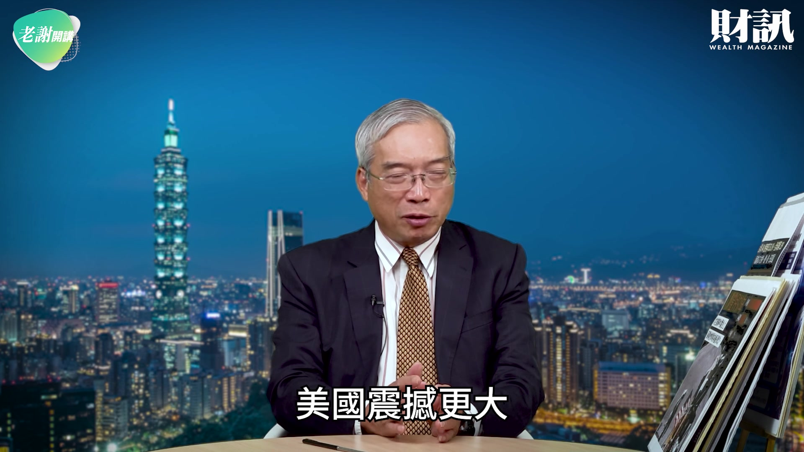

**逐字稿片段：** 到 1962 年 甘迺迪總統在 萊斯大學發表聲明 希望在 60 年代結束之前 能夠把太空人送上月球 在美國的太空總署的努力之下 終於在 1969 年的 7 月 12 日 阿姆斯壯跟艾德林 終於登上月球 而這個是阿姆斯壯 開始第一步踩上 月球的 跨出的第一大步 美國開始反敗為勝

**話題推測：** 甘迺迪總統在萊斯大學發表登月聲明

---

## 00:12:05

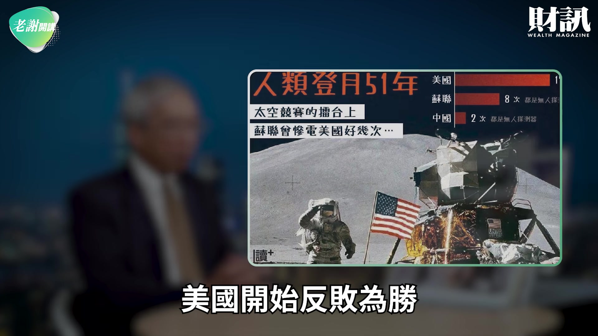

**逐字稿片段：** 那麼在這一輪的 AI 賽道 美中的角力最後 誰會勝出

**話題推測：** 總結 AI 賽道上美中角力誰會勝出

---

## 00:12:10

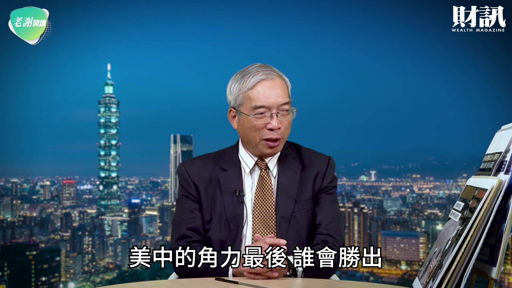

**逐字稿片段：** 基本上第 1 個 在資本支出不斷的 砸重本的情況之下 台灣是 AI 軍備競賽 最大的贏家 我們是賣鏟子的人

**話題推測：** 台灣是 AI 軍備競賽最大贏家（賣鏟子的人）

---

## 00:12:20

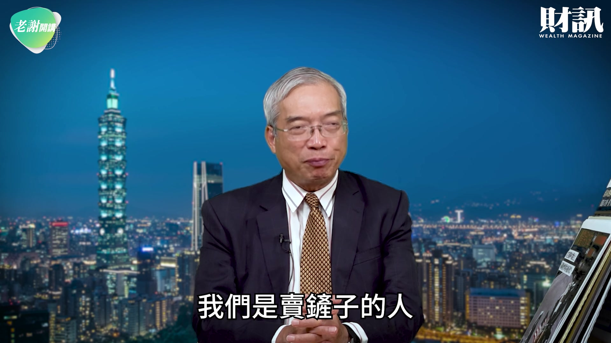

**逐字稿片段：** 第 2 個 美國不斷的加大 資本支出的力道 中國一定要被迫跟進 那跟進的情況之下 過去中國有很多補貼的產業 像類似電動車 它很可能會現出原形

**話題推測：** 美國加大資本支出，中國被迫跟進

---

## 00:12:32

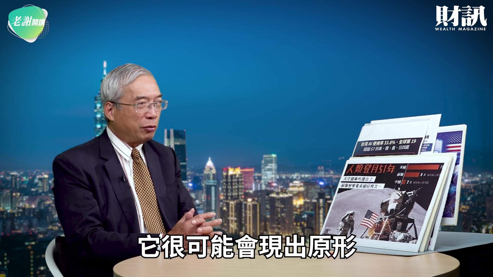

**逐字稿片段：** 在過去一段時間 中國房地產的泡沫化 帶給中國非常大的壓力 這個都是現在 在美中角力之下 中國面臨的巨大挑戰 那麼這個時候 美中不斷的擴大 軍備競賽的時候 台灣站在相對有利的一方 台灣的股票市場 水漲船高之後 我們的稅收增加 這個時候政府要 開始思考 第 1 個如何把 現在得到 AI 紅利的這個錢 用在被 AI 相對襲捲的產業或個人

**話題推測：** 中國房地產泡沫化帶來的壓力

---

## 00:13:01

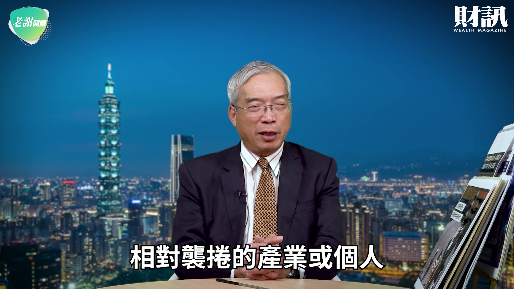

**逐字稿片段：** 第 2 個 政府要去投資未來 也把台灣未來 明日產業 能夠把它標示出來 然後大家在未來的賽道上 繼續加碼再投資 台灣在 現在的資本支出 我們非常的澎湃 這個是奠定台灣未來產業發展 非常重要的一個新的命脈 感謝大家觀賞 那麼也祝大家中秋節快樂 下週見

**話題推測：** 政府應投資未來並標示明日產業

---
