# wealth1974_yN2CYvg11QA — 關鍵畫面索引

- 來源逐字稿：[wealth1974_yN2CYvg11QA_GT.srt](wealth1974_yN2CYvg11QA_GT.srt)
- 影片：https://www.youtube.com/watch?v=yN2CYvg11QA
- 截圖數：20

## 00:00:00

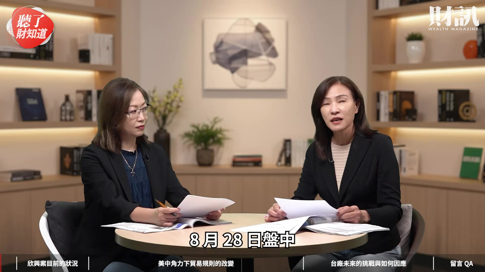

**逐字稿片段：** 8 月 28 日盤中 欣興的股價從 1230 元急殺 地檢署約談了多位主管跟員工 疑似有洗產地的爭議的問題 這件事的幕後

**話題推測：** 影片開場標題畫面，顯示日期與話題預告

---

## 00:00:11

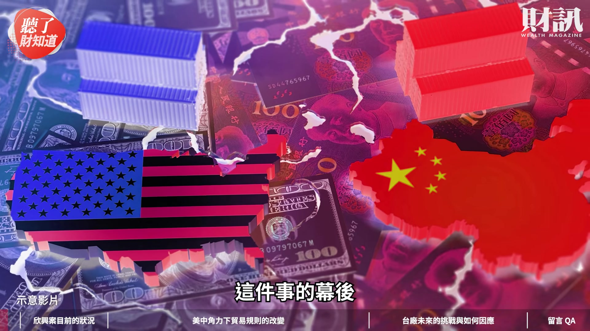

**逐字稿片段：** 牽涉到很多美中角力戰的背景因素 因此呢 今天我們這一集 就來談一下

**話題推測：** 話題轉向美中角力戰的背景因素，預期顯示美中關係相關圖表

---

## 00:00:16

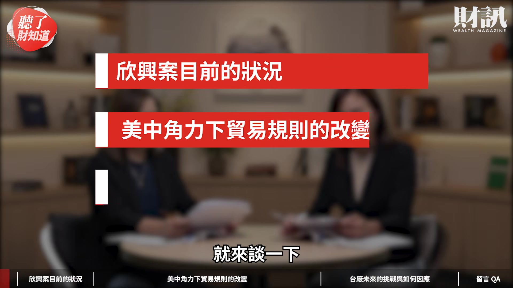

**逐字稿片段：** 欣興案目前的狀況 然後呢 我們再來分享

**話題推測：** 節目議程的第一點：欣興案目前狀況

---

## 00:00:20

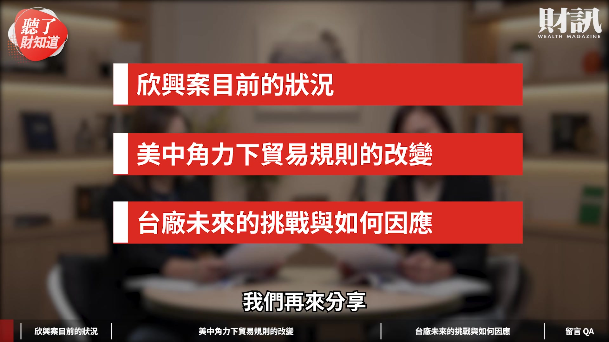

**逐字稿片段：** 美中角力下貿易規則的改變 最後再來談談 台廠未來的挑戰與如何因應

**話題推測：** 節目議程的第二點：美中角力下貿易規則改變

---

## 00:00:26

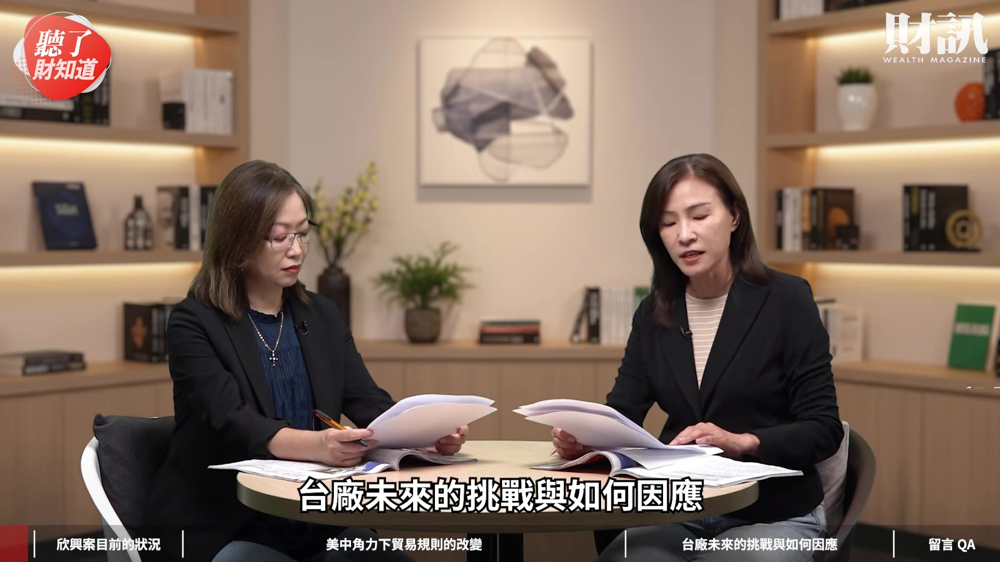

**逐字稿片段：** 我是主持人劉軒彤 今天的來賓是 財訊的執行副總編輯 陳雅潔 我們歡迎雅潔 各位觀眾大家好 我是陳雅潔 好 雅潔 欣興的事件 其實因為欣興是 ABF 載板的龍頭 所以它這件事 引起非常多人的關注 也影響到這個族群 所以我們 現在先把這個事情釐清一下 好不好 最新的狀況是怎麼樣 好 其實從 8 月底 這個訊息傳出來之後 欣興也有發布重訊 然後桃園地檢署 也有發布新聞稿 大概說明這個情況 桃園地檢署應該是收到檢舉啦 對 然後就知道就是說 欣興疑似把在中國生產的 PCB 也就是一般的印刷電路板 運回台灣之後 換貼標籤成台灣製造 MIT 的標籤 對 然後準備要出口美國 這樣就可能會觸及 刑法的偽造文書罪 然後另外還有一個就是 妨害農工商罪 也就是所謂的洗產地 所以才會進行就是說 當時去搜索了 就是欣興的龜山的總公司 然後還有就是它們 另外在中壢的合江廠 然後也約談了 好多 真的相當多的主管 對 然後還有一般的員工等等的 然後最高的保釋金 好像有上千萬等等 那欣興它說明 它是有就是強調 剛才我們講的 就是說這個爭議產品是 PCB 所以跟載板沒有關係 不是我們那個 AI 最高階那個 不是現在搶貨搶到不行的 然後呢那主要是因為產能不足嘛 所以它們就向 中國它們那邊的黃石廠去調度 然後呢 對於公司的營運 財務 業務 都沒有重大的影響 那這是公司的說法 那現在就是相關的調查 都還在進行中 就是地檢署那邊 還沒有最新的消息 但是公司說沒有什麼太大的影響 它們就要努力的說明就是 我想因為現在公司是 全力在拚 ABF 的出貨 對 但是其實它們 剛才妳提到它是 ABF 的龍頭廠 其實它也是 PCB 的龍頭廠 PCB 再怎麼講 在它們的業務有一定的占比 OK 所以這一件事情其實 當然我們在股市 看到這個高價股 又是這麼重量級 我們會覺得很害怕 跟好像發生了什麼重大事 但是現在目前的狀況 是地檢署還在調查中 所以我們沒有任何的這個後續 我們就不會做任何的評斷 但是我們從這一件事情來看 以前我們都覺得 洗產地 這些事情好像不是那麼嚴重 在我說早年 那看到這件事情以後 好像有很多 故事的開始 要從美中貿易戰說起 其實洗產地這件事情 是已經在國際貿易之間存在很久了 對 沒有錯 那什麼樣的情況會發生洗產地 那你只要是有關稅落差 這樣關稅落差 洗產地才有意義 對 就是為了 因為我從我這裡出口過去 你要給我課很高的關稅 那所以我就換一個地方 運過去的話 那就沒有關稅的問題 這是一個 另外一個就是禁止性的貿易 就像我們 對於中國的產品 有很多在台灣是禁止進口的 那可是 我們也知道中國的東西就是便宜 那不管是國內 是不是真的有這樣的需求 或者是說中國那邊的廠商 它有這樣的企圖心 想要運來台灣 那它可能就會透過 其他的地方進來 所以像我們知道的 譬如說像越南茶葉 其實很可能是中國茶葉 是 或者是說 我們知道很多農產品都是 用這樣的方式 換一個管道進來 這就叫規避貿易的原則啦 像我們現在有很多正在向 就是財政部或經濟部 提出一些反傾銷調查的產品 比如說像鋼材 也有這樣的情況 就是它很可能是 透過東南亞再轉運進來的 中國製鋼材 所以其實在 傳統產業這邊也滿多這種 只是它的 對 過去都有啦 只是例子比較少一點點 那現在就是形態變了 是因為在美中貿易戰之後 我們知道就是 美國對中國課了更高的稅 對 要輸往美國的東西 它直接輸過去關稅會很高 如果說它是變成是 MIT 出口到美國的話 就不會有那麼高的關稅爭議 那這一次呢 欣興的案子 比較可能就是碰到這樣的情況 因為我們知道 PCB 其實並不是 美國的管制性的那種高科技產品 就是完全禁止採用中國的 可是問題是 它直接從中國出口到美國的話 那會碰到高關稅的問題 OK 對 所以現在就是很可能 如果說 欣興它真的是因為關稅的考量 把中國的產品引進 然後再從台灣出口的話 那就是疑似洗產地這樣子的情況 好 那我們講到洗產地 其實美國非常非常的在意 妳在我們這期財訊 772 期 寫了一篇相關的報導 我記得那時候妳就 轉給大家看 白宮發的轉運大騙局 那時候我們還在討論說 它那個封面設計是一隻木馬 木馬屠城的概念 對 然後木馬上面還設計都是貨櫃 我仔細看了一下是貨櫃 那妳可不可以幫我們解釋一下這個東西 對 因為其實美國 老實說它從發動貿易戰以來 它背後一直都有一個很大的動機 就是它要降低它的貿易逆差 它對全球很多地方的貿易逆差 然後 它覺得那些都是 讓它流失關稅的很重大的原因 那包括像違規轉運這件事情 也就是 白話文就是洗產地 所以它在今年 8 月的時候 發布了一個 轉運大騙局的報告 那它倒也不是針對台灣 它是針對全球 跟美國有進出口關係的貿易國家裡頭

**話題推測：** 主持人劉軒彤出場介紹

---

## 00:06:05

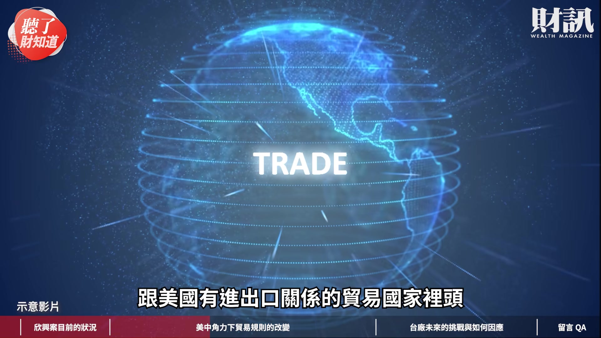

**逐字稿片段：** 它有 40 多個國家 就是說它們認為 中國就是透過這 40 多個國家 來洗產地 它還把這 40 多個國家給分成三級 然後第一級就是 像台灣不用講 我們本來就是 台廠非常多都是兩岸有設廠 而且主要又是以美國為出口市場的 所以台灣就完全符合第一級的定義 對 包括日本 韓國好像也是第一級 對 沒錯 然後歐盟等等的 其實主要的國家都進去了嘛 是 然後它們認為說 就是因為中國 透過這些國家違規轉運 洗產地 把它們的低價商品賣到美國了 所以讓美國 就是間接造成工作機會流失 國民生產毛額減少 然後 當然更不用講 就是關稅的減少等等 所以就是

**話題推測：** 指出全球40多個國家被美國列為洗產地對象，可能顯示世界地圖或國家列表

---

## 00:06:53

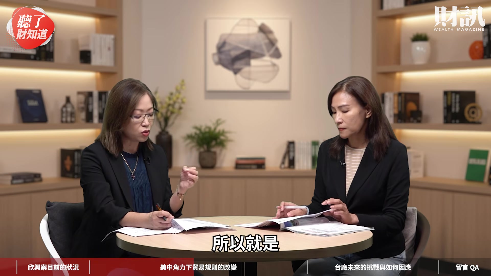

**逐字稿片段：** 每年平均都是好幾百億的財政損失 對 所以它們才會非常在意 洗產地的這件事情 那當時它們推出這份報告的同時 就也有預告 它們會再更加強就是海關的查緝 不排除就是之後會對這一些 可能洗產地的國家 祭出懲罰性的關稅 妳為了寫這篇稿子 妳跟很多人聊過 那其實他們覺得說 在這樣子愈來愈嚴苛的環境下 台灣到底要怎麼做 才能跟上這個 它們美國法令的腳步 其實我覺得台廠 一定自己都可以感覺到 反正就是 要出口去美國 成本就是愈來愈高了 光是一個通關的成本就高了 對 因為我們 也有跟報關行的朋友聊 什麼的 如果觀眾朋友有印象的話 今年 5 月左右吧 美國它也有新的規定 就是要到美國去的那種 2000 元以下的小額的包裹 過去是免稅的 現在全面都取消了 那事實上美國在今年以來 它在針對加強海關查緝 或者是說 加大執法力道的這一些部分 它頒了非常多的行政命令 包括 過去可以簡易通關 可以簡易報關什麼 這些都取消了 然後現在如果你是進出口貿易商 你變成就是說 你的保證金提高了 然後甚至於 你如果是美國的進口商 你必須要有一定比例的 在美國的資產等等的 也就是說 它一直在拉高那個門檻 就是讓你 違規轉運的機會降低 是 那到底它查過多少案子 有沒有 這些到底成案的比率有多少 一個統計就是我們看到的那個

**話題推測：** 討論美國每年因違規轉運造成的財政損失，提及好幾百億美元的數字

---

## 00:08:29

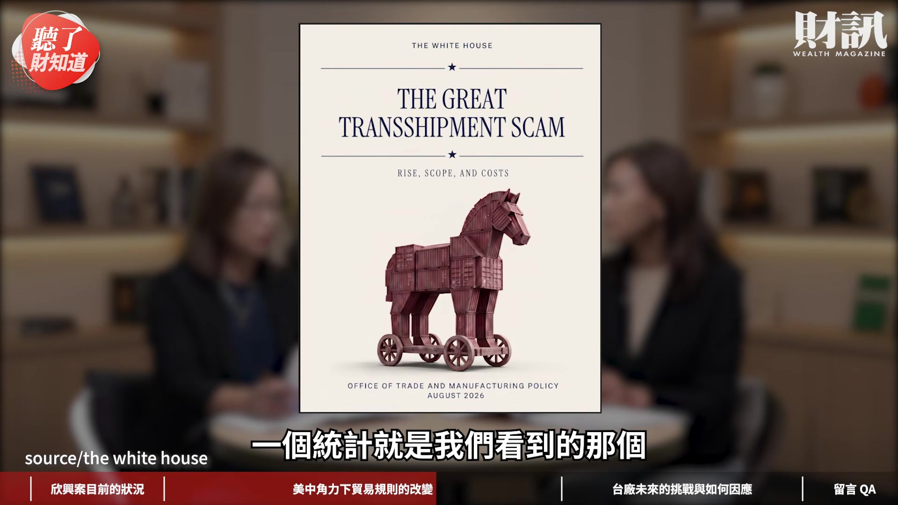

**逐字稿片段：** 轉運大騙局的這個報告裡頭的數字 是 那台灣海關這邊有查到嗎 它這邊 就是美國財政部這邊統計的話 2025 年的非法轉運的金額

**話題推測：** 引用「轉運大騙局」報告中非法轉運的統計數字，預期顯示相關圖表

---

## 00:08:38

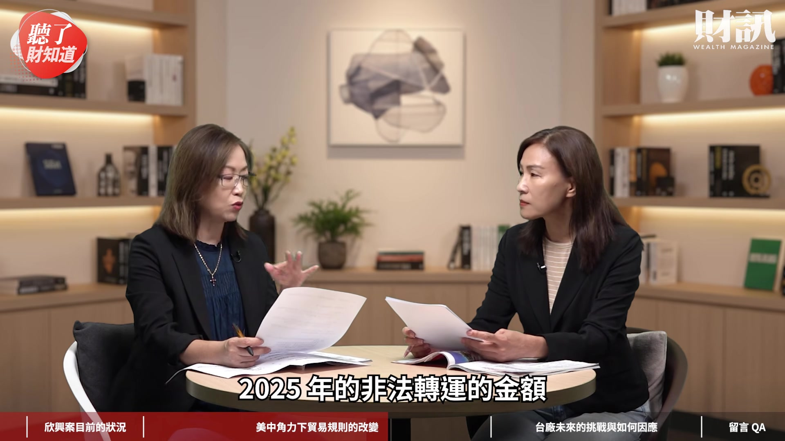

**逐字稿片段：** 大概是到 670 億美元 670 億美元 對 這是美國那邊查的 對 所以也是很驚人的數字了 已經上兆了 換成台幣的話 我們其實也感受到 美國那邊來的壓力 對不對

**話題推測：** 提及2025年非法轉運金額高達670億美元

---

## 00:08:52

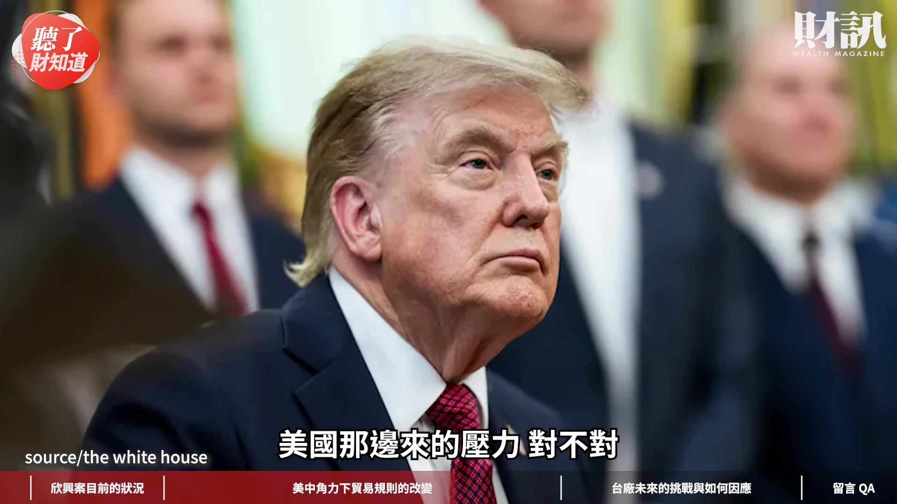

**逐字稿片段：** 所以財政部 2025 年 4 月的時候 成立了一個 強化違規轉運查核小組 那這個是針對在海關 保稅倉庫 總之你已經到了海關這邊的 這些貨櫃 貨品等等 就抽查什麼這樣 對 它去查 然後就是從去年 4 月成立 然後到 8 月 4 個月之內其實就查到

**話題推測：** 討論台灣財政部成立「強化違規轉運查核小組」的行動

---

## 00:09:12

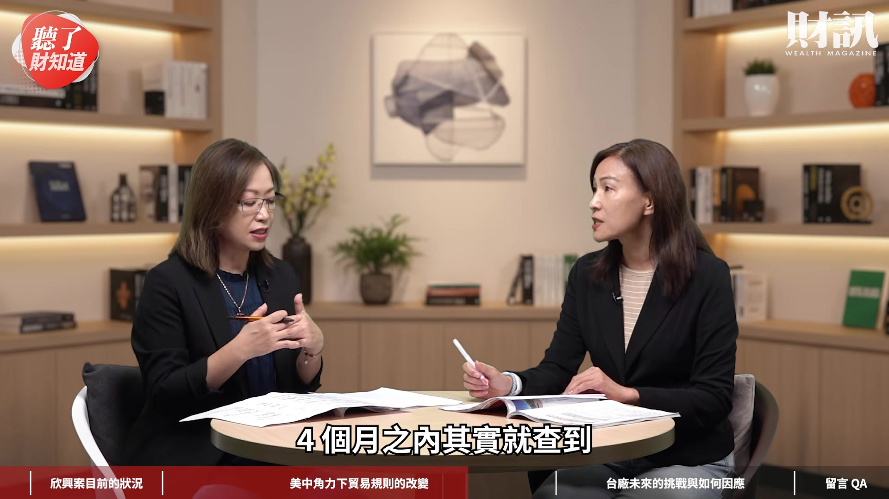

**逐字稿片段：** 1 萬多筆是要輸到美國的產品 裡頭有 168 件 是違規轉運的 但這個是 4 個月的成績 可是其實從 去年 8 月到今年 8 月呢 違規轉運的疑似的情況呢 是變成是有 400 多件 所以大概是 1% 很難說 老實說 因為財政部並沒有說 它是不是普查 OK 對 到底是普查還抽查 不過就是 它查到的 1 萬多筆裡頭呢 有好幾百件 大概都有至少 1% 以上 然後就是會有一個 疑似違規的情況 因為它們 只能查到疑似違規 之後它們是再轉給 經濟部的國際貿易署 它再去進行後面的 比如說 你要找廠商來說明 然後你要確認就是說它 比如說你貼 MIT 的標籤 那你是不是真的有經過 一定的加工程序等等的 到現在已經確定有處分的 是 257 件 OK 所以妳剛剛強調的那些案子 大部分都在海關抽查 查核的時候發現 但跟欣興的這個不太一樣 所以 它是在還沒出工廠就被 這一次的特別就在於 這些事情並不是發生在海關 通常你沒有到海關 我就不能確定說你 你是要出去 對 因為 我要確定你是要出去 才能夠曉得說 你真的是有這個意圖 但是它現在不是 欣興它是 還在自己的工廠裡頭 然後就被檢舉 然後就被追查 可以看得出來這個 我們在全面查緝 洗產地的這件事情的力道 已經變成說 從不能過海關 到讓你不能出工廠

**話題推測：** 提及四個月內查獲1萬多筆產品中，有168件疑似違規轉運

---

## 00:10:43

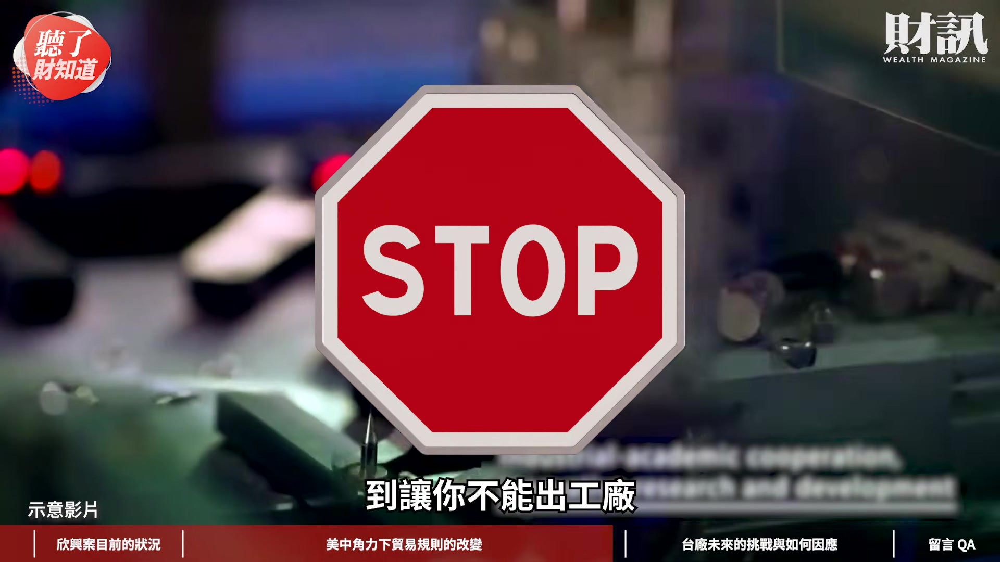

**逐字稿片段：** 也就是說你在工廠裡頭 愈來愈嚴格了 對 就是變成那個線 愈拉愈長 那到底妳訪問這麼多專家 有什麼樣的特別 或者說讓我們讀者有一點知識性的

**話題推測：** 強調查緝洗產地的範圍從海關擴大到工廠內部

---

## 00:10:54

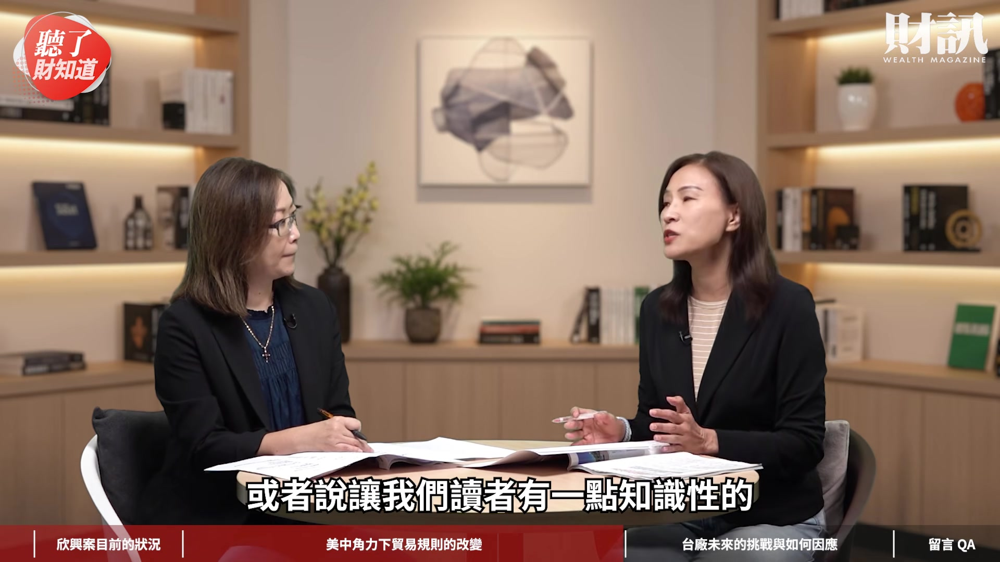

**逐字稿片段：** 到底該怎麼做 會比較穩當 不要踩到紅線 對 因為現在美國針對中國的貿易 有非常多的規定 就如同我們剛剛講的 它在海關的查緝的這個部分 它要求愈來愈多 而且它還要求你要 出具很多的原產地證明 各種各樣的出廠證明等等的 它就是要確保 非紅供應鏈這件事情 應該是說 美中貿易戰的兩大目標 一個就是要降低它自己的貿易逆差 另外一個就是 它要建立信任供應鏈 非常重要的一個元素 就是排紅 就非紅 對 就是非紅 所以現在到處都在強調 你能不能夠百分之百的非紅 對 所以現在就是說 對台廠來講 它也許覺得說 我的某一個產品裡頭 有某一個成分是中國製的 難免 還可以 對 難免 但是問題是 你不知道美國 它會不會介意這一個成分 OK 對 所以現在就是台廠 尤其是你是 有兩岸產能調度的台廠 或者是說 你有共同採購行為的台廠 兩岸我都需要 所以我就統一大採購 全球採購之後 我中國也用 然後我台灣也用 但是 美國它可能搞不清楚 它會搞不清楚 你現在用的這個東西 裡面的這個 到底是從中國來的還是怎麼樣 然後另外還有一個 就是勞權的問題 今年也有一個例子就是巨大 所以它如果覺得說 你是在當地 用了跟美國不同的勞動條件 比如說你就是可以無限制的加班 是壓榨勞工的方式 然後以至於 可以達成你的產能 是不行的 對 這種 被它發現了都不行 所以就變成說 台廠應該就是直接要 直接要全面對齊美國法令 對 那尤其我們今年不是 因為在跟美國的貿易談判之後 簽了一個 ART 就是台美對等貿易協定 那當中就有明確的要求台灣 以後就是要遵行 美國的製造的相關規範 是 對 所以就變成說 你台廠你不要覺得說 我只要在台灣 符合台灣的法律就算了 變成說你在 所有的出廠跟生產的程序裡頭 你都要符合美國的規範 那這件事情就變成說 你的法遵的範圍擴得很大 我們會說這是一個 公司治理的一個大挑戰 那台灣的法令 有沒有跟著這個 稍微修改去因應呢 有 但是其實 像我們採訪的學者 他就認為說 我們雖然是有 但是腳步上慢了點 然後而且也還不夠嚴格 剛才我們講到的 除了財政部加強在海關查緝的動作之外 那今年以來我們做了一件事情 老實說我看到的時候有點嚇一跳 就是過去 我們對於檢舉洗產地這件事情 我們是發獎狀

**話題推測：** 轉向討論台廠避免踩紅線的知識性建議

---

## 00:13:41

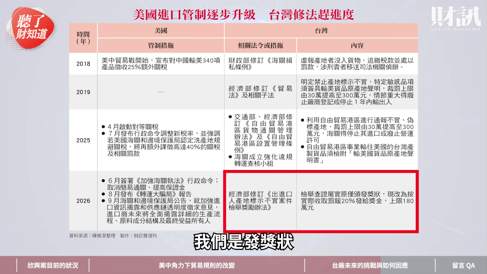

**逐字稿片段：** 現在發獎金嗎 現在發獎金了 這個誘因了嗎 對 就是誘因會提高 OK 而且獎金可能就是

**話題推測：** 提及台灣政府對檢舉洗產地從發獎狀改為發獎金的政策改變

---

## 00:13:50

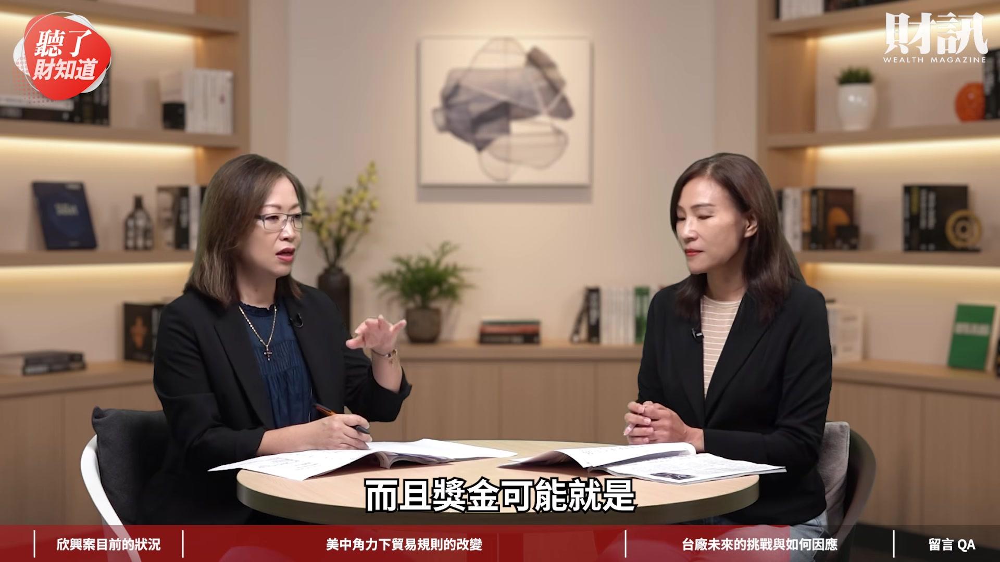

**逐字稿片段：** 你的違規金額的 20% 然後上限是 180 萬等等 至少 你有更實質的誘因 讓大家一起來 警覺你身邊是不是 有可能你碰到了 有人在洗產地這樣的情況 因為現在就是 洗產地已經變成 有可能涉及供應鏈漂白 這個就是美國最在乎的 這樣講下來 我真的覺得這一些 我們現在尤其什麼台積電這些大廠 其實它們要應對的事情 真的非常多 從以前 遺留下來的一些背景因素 可能那時候沒有注意到 那現在要去注意 所以真的還是要向這些科技廠致敬 沒錯 只是說難免還是有疏漏的地方 對 但是之所以要非常小心 是因為這個東西 你一旦踩到了紅線 那個連坐效應是非常大的 就是怕影響整個台灣都被 沒錯 因為它如果有一家台廠 不管你是什麼廠 只要被查到你有洗產地的嫌疑 以後就是對所有台廠 我們都一視同仁 嚴查 對 甚至於有可能 我們就是失去信任 那就是會被踢出國際供應鏈 所以我們也希望 這件事能夠好好的解決 然後大家也要從中看到一些 不同的經驗跟警訊 雅潔 妳還有沒有最後要補充的 最後補充的就是 我覺得台廠很可能 過去有一些很習慣做的事情 現在真的都是 公司 管理層都要 真的要特別注意 像產能調度 共同採購 還有勞權的問題 這三個點 我覺得是特別要去小心的 是 好 我們感謝雅潔今天的分享 看完今天的影片 你怎麼看新興案帶來的影響呢 歡迎大家留言 分享你們的觀點 如果不想錯過我們的節目 歡迎訂閱財訊頻道 或者是加入頻道會員 解鎖所有的會員影片

**話題推測：** 說明檢舉獎金為違規金額的20%，上限180萬

---

## 00:15:30

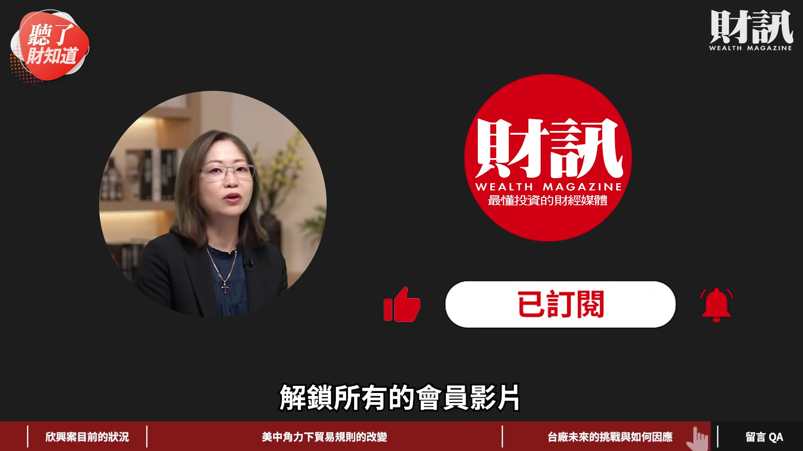

**逐字稿片段：** 接下來我們要回覆 財團在聽了財知道第 366 集 財富外溢下的資產傳承 信託和贈予占 87% 的留言 雅潔幫我們念一下財團的留言

**話題推測：** 節目轉向回覆觀眾留言，可能顯示「觀眾來函」或「留言區」畫面

---

## 00:15:43

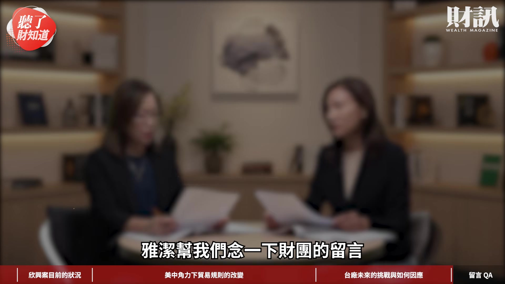

**逐字稿片段：** 第一位財團好朋友 YH Chen 他說一個人的認知 決定了他的財富 同意 對 不得不同意 是 絕對同意 那第二位財團好朋友

**話題推測：** 顯示第一位觀眾留言：「一個人的認知決定了他的財富」

---

## 00:15:53

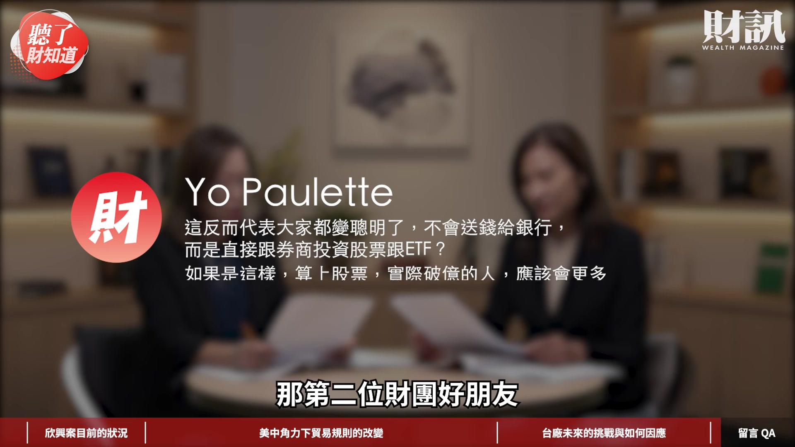

**逐字稿片段：** 他說這反而代表大家變聰明了 不會送錢給銀行 而是直接跟券商 投資股票和 ETF 嗎 如果是這樣的話 算上股票 實際破億的人應該會更多 其實我相信是 對 其實隱藏的還是滿多的 隱藏的富豪很多 我們後面這一位財團好朋友就 分享他個人的經驗 鍾國偉 對 這一位鍾國偉他說 我這 6 年完全有跟上股市的資產成長 月薪普通 但是在股市資產就有幾千萬 吸收資訊 做出正確選擇和行動 有多少認知能力 就賺多少錢 這就是一個很典型的例子 真的現在大家 可能證券帳戶裡面的價值 真的是比你投進去的金額 就是高出很多 對 而且我覺得很重點就是 真的是要吸收資訊 因為像 包括今天這件事情 還有我們更多財訊的這些節目 因為投資愈來愈專業 你要是理解的話 你就可以在 比如說殺的時候 撿便宜 但是高檔 如果你理解 也許在高檔你就知道這個不對了 所以這個東西 該了結了 對 所以這跟知識非常的有關 好

**話題推測：** 顯示第二位觀眾留言，關於投資股票和ETF的觀點

---

## 00:17:00

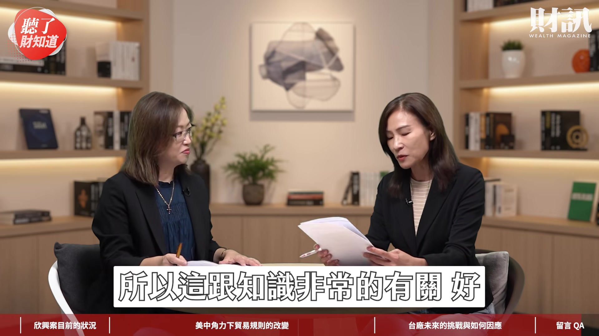

**逐字稿片段：** 然後財團凱恩 他說 全都放在股市 真的大跌 他們會賣嗎 虛的終究要回歸現實 其實這個 進出本來就是個人的選擇 對 而且沒有人保證一定是賺 或者一定賠 一定是多 一定是空 你說來個系統性風險 就像當年金融海嘯 你好好的在台灣活著 可是美國一個房地美 房利美 就造成全部的資產 就這樣子崩盤而下 突然之間 對 所以這種系統性風險 有時候真的是很難說 如果你還想瞭解更多的內容 歡迎點擊資訊欄中的文章連結

**話題推測：** 顯示第四位觀眾凱恩的留言，關於股市大跌的疑問

---

## 00:17:34

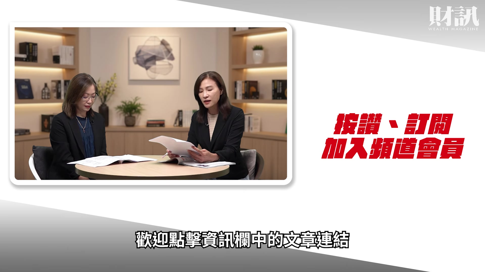

**逐字稿片段：** 或是購買財訊 772 期的雜誌 跟我們一起追蹤政經趨勢 掌握投資脈動 《聽了財知道》我們下次見 bye bye

**話題推測：** 提及購買財訊772期雜誌，可能顯示雜誌封面

---
