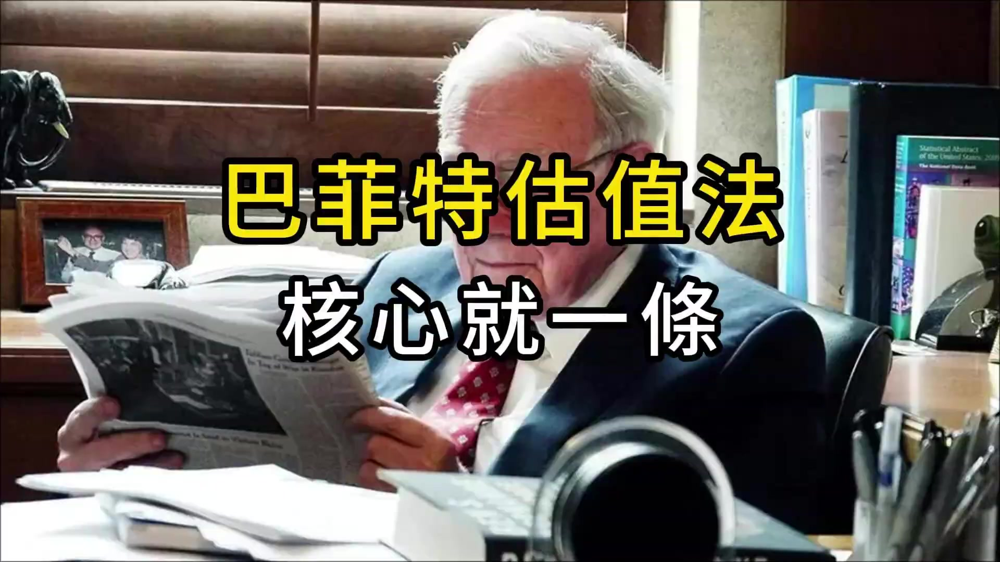
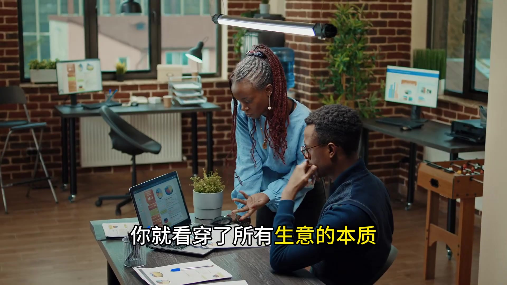
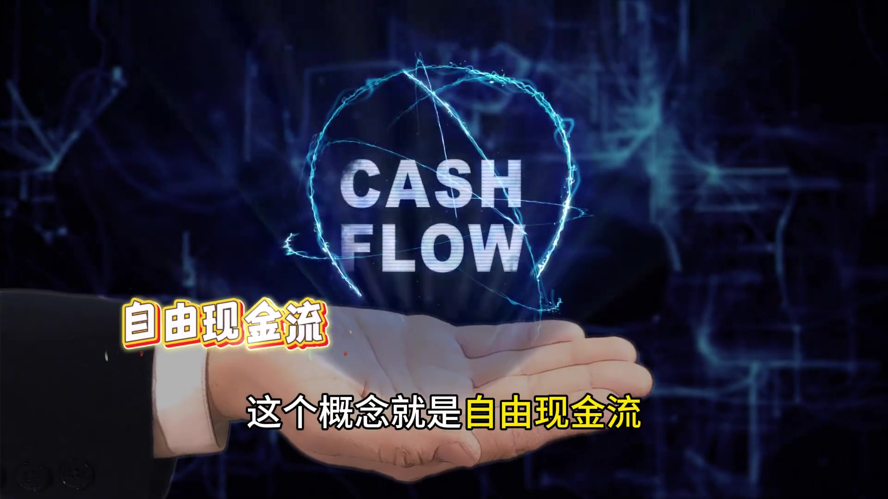
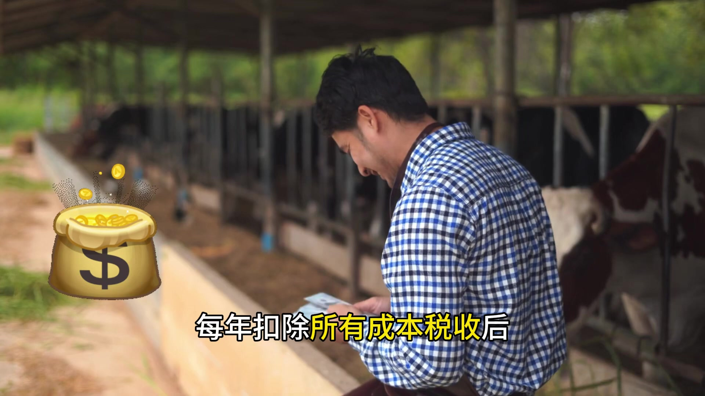
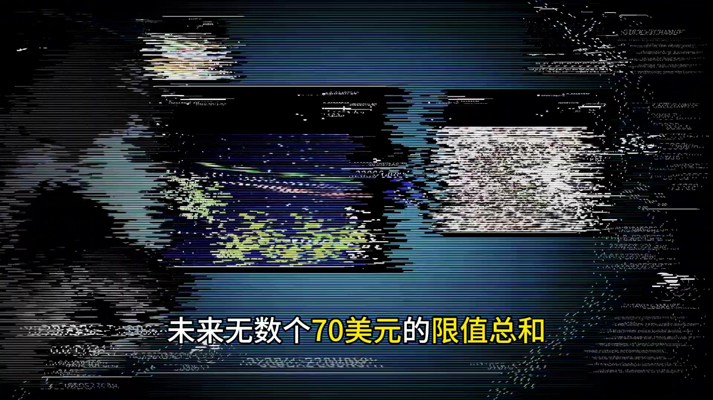
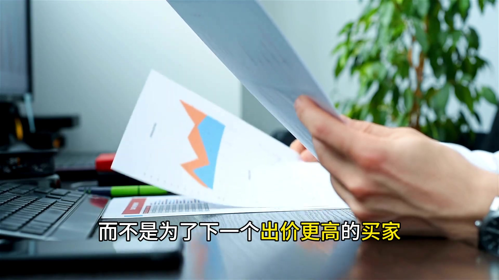
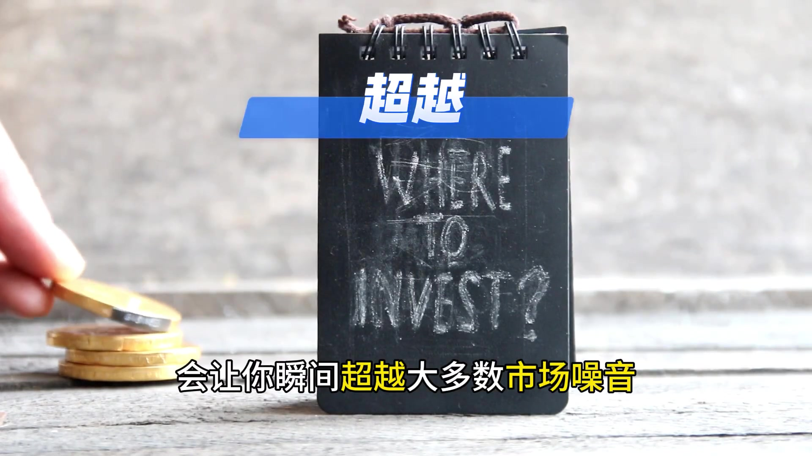

# x_Ofio1iI-i50 — 關鍵畫面索引

- 來源逐字稿：[x_Ofio1iI-i50_FIN.srt](x_Ofio1iI-i50_FIN.srt)
- 影片：https://www.youtube.com/watch?v=Ofio1iI-i50
- 截圖數：9

## 00:00:00

**逐字稿片段：** 市盈率、市淨率、DCF模型,是不是覺得公司估值複雜得像天書? 巴菲特說, 別搞那麼複雜, 估值的核心、歸根結底只有一個概念, 掌握了它, 你就看穿了所有生意的本質,

**話題推測：** 介紹複雜的公司估值方法，可能搭配標題圖示或簡報頁。

---

## 00:00:15

**逐字稿片段：** 這個概念就是自由現金流。

**話題推測：** 提出核心概念「自由現金流」，可能搭配定義或概念圖。

---

## 00:00:18

**逐字稿片段：** 巴菲特用一個農場的例子完美解釋了它, 假如你買下一個農場, 每年扣除所有成本稅收後,

**話題推測：** 引入巴菲特農場的例子，可能搭配農場插畫或案例標題。

---

## 00:00:25

**逐字稿片段：** 竟賺70美元。 而且這70美元你不需要再投回農場裡去維護 那麼這70美元就是你作為農場主 每年能實實在在揣進口袋的錢 這個農場的價值就取決於未來無數個70美元的限值總和

**話題推測：** 提出農場每年賺取「70美元」的具體數字，可能顯示在圖表中。

---

## 00:00:42

**逐字稿片段：** 這就是價值投資的精髓 我們買的不是股票 是生意的一部分 我們投資是為了資產本身能生財 而不是為了下一個出價更高的買家

**話題推測：** 總結「價值投資的精髓」，可能搭配重點摘要頁面。

---

## 00:00:54

**逐字稿片段：** 所以他可以僅通過閱讀財報

**話題推測：** 引入巴菲特收購克萊頓房屋公司的真實案例，可能顯示公司名稱或巴菲特照片。

---

## 00:00:56

**逐字稿片段：** 就決定花170億美元收購克萊頓房屋公司 甚至連CEO都沒見過 因為他看的不是故事 不是概念 而是財報背後那個生意 能產生多少真金白銀的自由現金流

**話題推測：** 提及收購金額「170億美元」及公司名稱，可能搭配新聞標題或交易數據圖。

---

## 00:01:11

**逐字稿片段：** 下次當你看到一家公司 別先看它的股價漲跌 問自己一個最簡單的問題 如果我100%買下這家公司 它每年能給我口袋裡放進多少實實在在的現金 這個思維轉換 會讓你瞬間超越大多數市場噪音

**話題推測：** 轉向給觀眾的實際操作建議，可能搭配「下次這樣做」或「關鍵問題」的提示。

---

## 00:01:28

**逐字稿片段：** 你可以試著用這個思路 看看你身邊熟悉的奶茶店 小超市 它們值多少錢 在評論區聊聊你的看法

**話題推測：** 建議將估值思路應用於身邊的「奶茶店、小超市」，可能顯示生活化例子圖片。

---
