# x_SE5CoXNuG_Y — 關鍵畫面索引

- 來源逐字稿：[x_SE5CoXNuG_Y_FIN.srt](x_SE5CoXNuG_Y_FIN.srt)
- 影片：https://www.youtube.com/watch?v=SE5CoXNuG_Y
- 截圖數：13

## 00:00:00

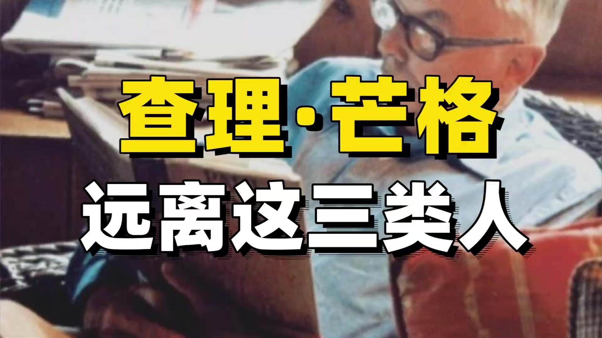

**逐字稿片段：** 芒哥一生反覆強調一個被大多數人忽略的真相,人生90%的悲劇都來自於你選錯了身邊的人。

**話題推測：** 引出影片主題：芒格對選擇身邊人的觀點

---

## 00:00:06

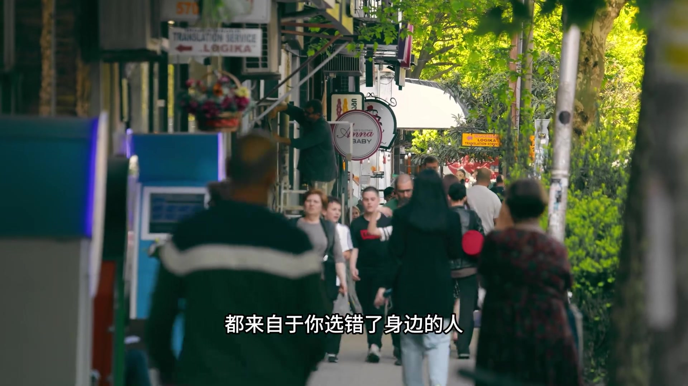

**逐字稿片段：** 07年他在南加州大學畢業典禮上明確說過, 你會逐漸變成你每天相處的人, 這種影響是潛移默化的, 等你意識到的時候已經被同化了。 如果你身邊都是抱怨的人,你會慢慢變得憤世嫉俗,如果你身邊都是投居俱巧的人,你可以慢慢丟掉自己的底線。

**話題推測：** 提及芒格2007年在南加州大學畢業典禮上的發言

---

## 00:00:22

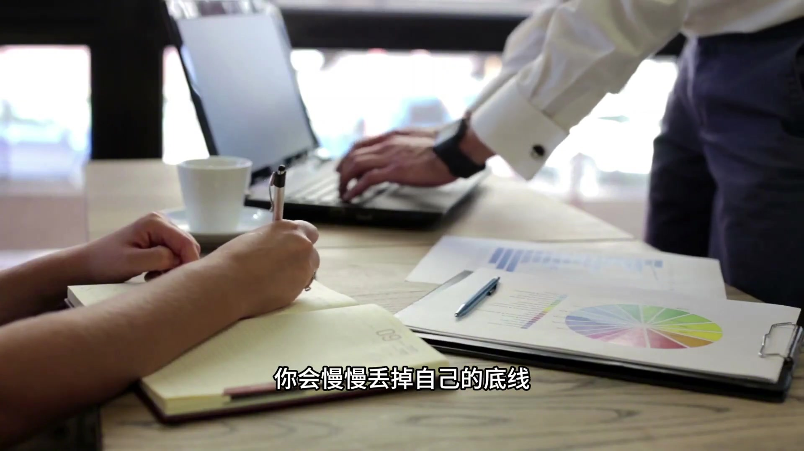

**逐字稿片段：** 芒哥自己很早就定下了一條鐵律 永遠不要為你不尊敬的人工作 也永遠不要和你不尊敬的人做朋友 他說這不是道德潔癖 這是你最有效的生存策略 他這輩子見過太多聰明人 就是因為跟錯了人 最後毀了自己的一生

**話題推測：** 引出芒格定下的一條「鐵律」

---

## 00:00:37

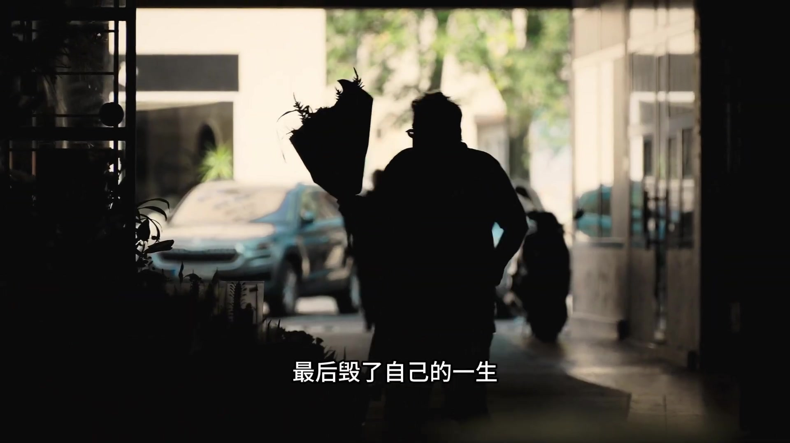

**逐字稿片段：** 人生就像一片果園 你想要結束好果子 就得定期修剪枝葉 那些既不結果 又在搶奪陽光和養分的枯枝 就是你真命裡消耗你的人 你必須毫不留情地把它們剪掉 才能把有限精力 留給真正值得的人 這不是功利 這是你對自己的生命最大的尊重

**話題推測：** 透過「果園」比喻人生與人際關係的修剪

---

## 00:00:54

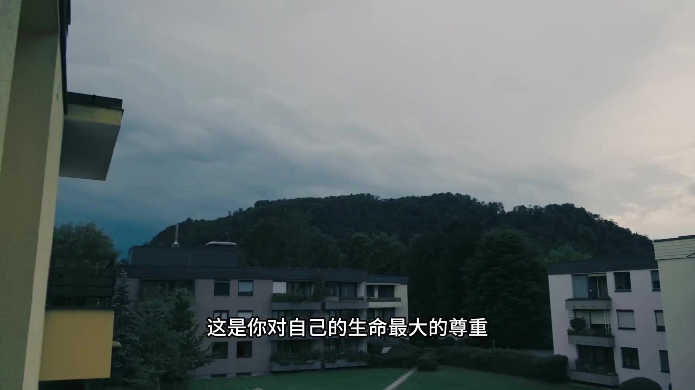

**逐字稿片段：** 有三種人 哪怕是你的親戚 也要果斷保持距離 第一

**話題推測：** 引出三種需要果斷保持距離的人

---

## 00:00:58

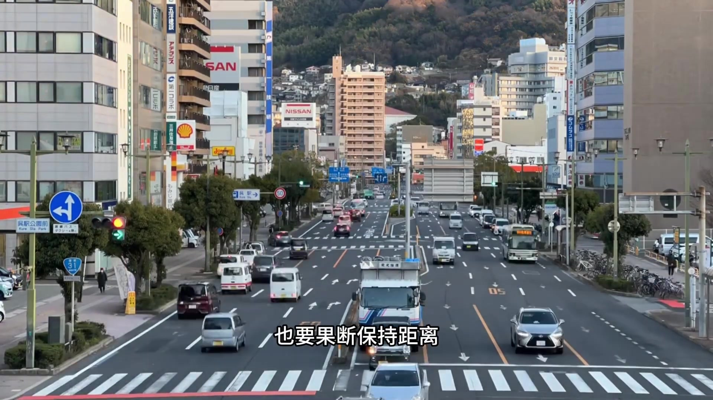

**逐字稿片段：** 深受受害者心態的人

**話題推測：** 第一種人：深受受害者心態的人

---

## 00:01:00

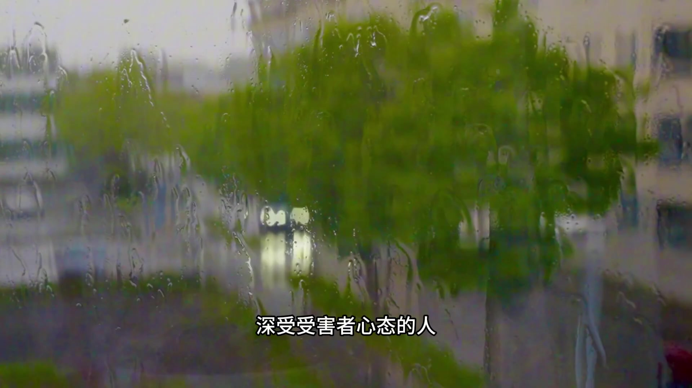

**逐字稿片段：** 在《清查理寶典》這本書中 寫著芒格的原話 四連是人類最糟糕的精神毒藥 這種人永遠覺得全世界都在針對他們 沒有一件事是他們自己的錯 工作不順是老闆蠢 投資虧錢是市場黑 生活不如意是別人對不起他 他們根本不想解決問題 只是想一遍遍付出自己的痛苦 把你拉進他們的負面情緒裡 芒哥年輕時也遇到過這樣的人 最後果斷斷交 幾十年後 再見到 那個人依然在原地抱怨 人生沒有任何起色

**話題推測：** 提及《窮查理寶典》這本書

---

## 00:01:28

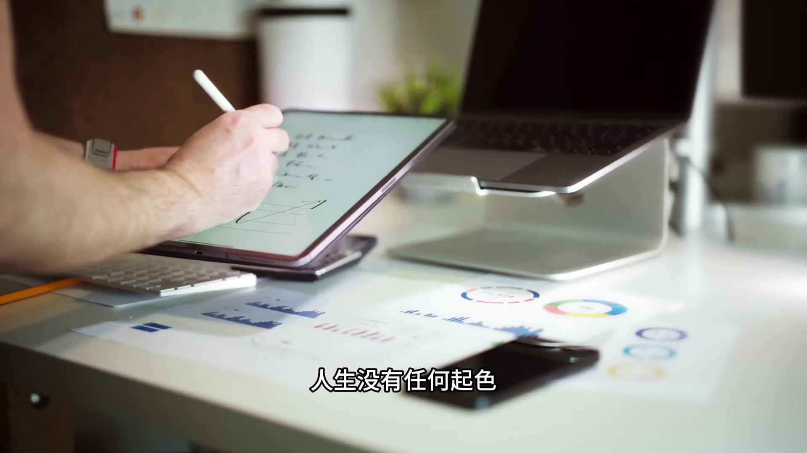

**逐字稿片段：** 第二種 不誠實的聰明人 算是最危險的一種人 芒哥說 與壞人打交道 做成一筆好生意 這種事我從來沒有預先過 這種人往往非常迷人 口才極好 智商極高 你會不由自主地 被他們吸引 但他們沒有底線 為了利益可以除賣任何人 一個人如果在小事上不誠實 在大事上一定會背叛你

**話題推測：** 第二種人：不誠實的聰明人

---

## 00:01:46

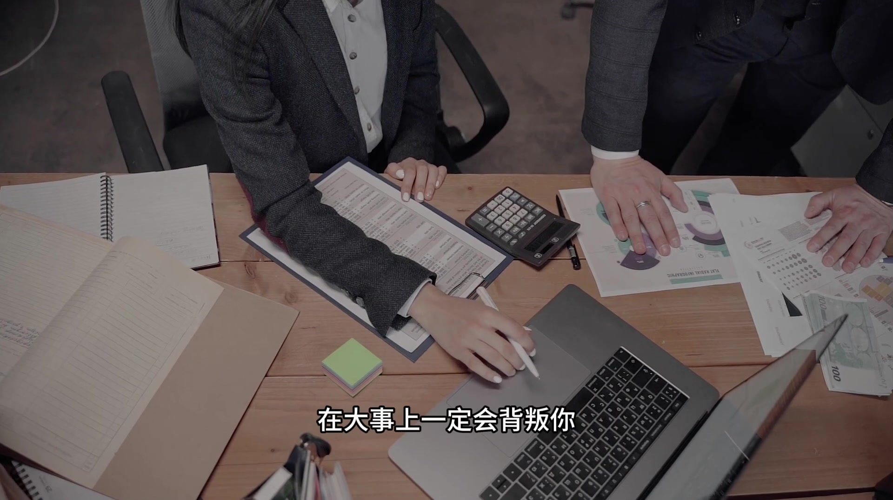

**逐字稿片段：** 芒哥說他寧願和一個智商130 但誠實可靠的人共事 也不要和一個智商150 但滿嘴懷念天才共事

**話題推測：** 提及芒格對智商與誠實可靠的比較

---

## 00:01:53

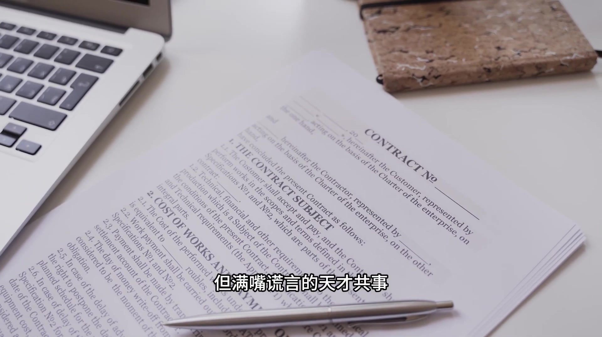

**逐字稿片段：** 第三種 嫉妒心強的人

**話題推測：** 第三種人：嫉妒心強的人

---

## 00:01:55

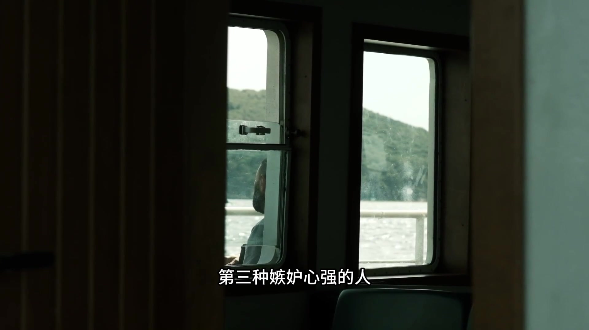

**逐字稿片段：** 芒哥在86年哈佛畢業典禮上說過 嫉妒是系統罪裡最愚蠢的一種 因為它是唯一一種 不會給你帶來任何快樂的罪惡 你嫉妒別人 對方卻毫髮無損 你卻自己折磨自己 嫉妒你的人 見不得你好 你過得越好 他越難受 他會在背後詆譭你 給你使絆子 這種人哪怕是你親兄弟 也要保持距離

**話題推測：** 提及芒格1986年在哈佛畢業典禮上的發言

---

## 00:02:14

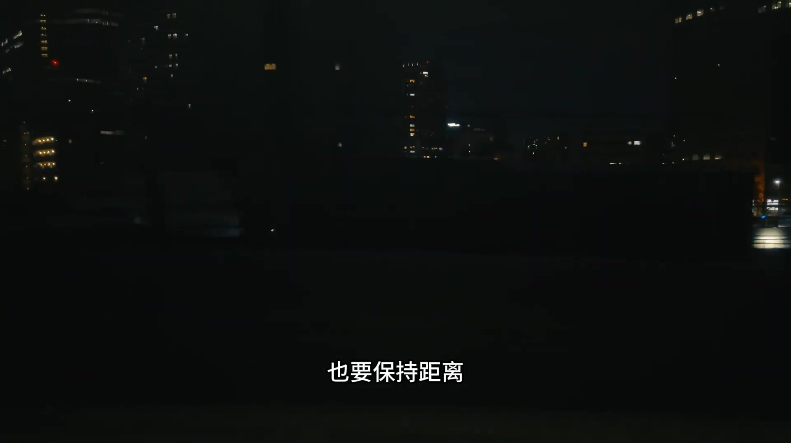

**逐字稿片段：** 很多人說 這樣是不是太冷漠了 恰恰相反 你把消耗你的人清理出去 才能同摸出空間 給真正愛你的 支持你的人

**話題推測：** 對清理人際關係的提問與總結

---

## 00:02:22

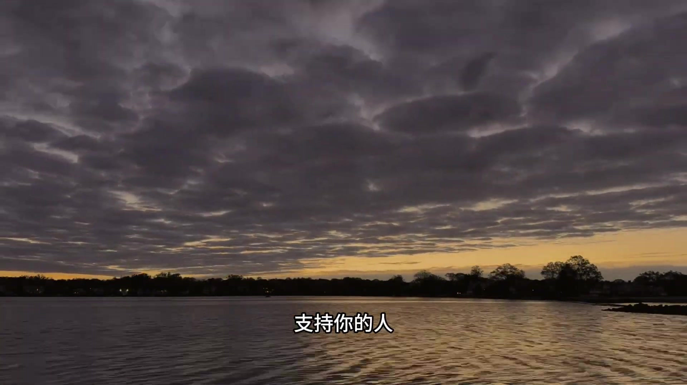

**逐字稿片段：** 他這輩子最好的朋友 巴菲特 李克格林 都是他發自內心尊敬的人 和這些人在一起 你不用設防 不用內耗 只需要專注於把事情做好 人生最大的幸運 不是中彩票 是你在年輕的時候 遇到了幾個對的人 你身邊的人 就是你的命運

**話題推測：** 提及芒格的摯友巴菲特與李克格林

---
