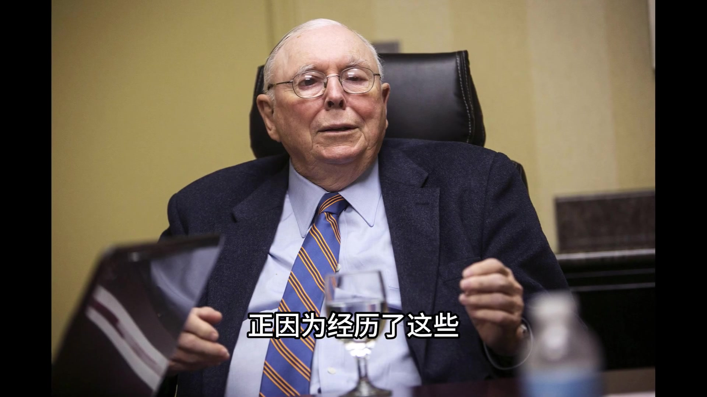
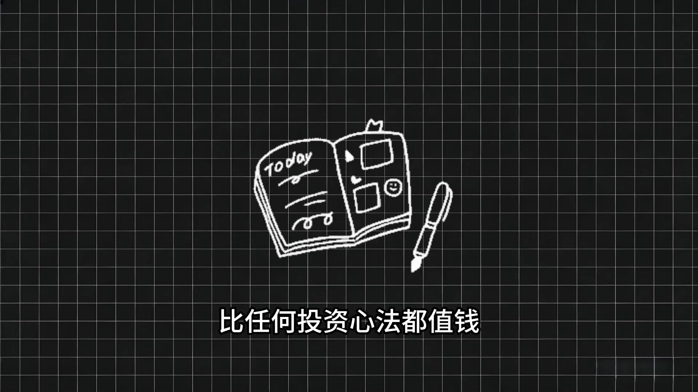
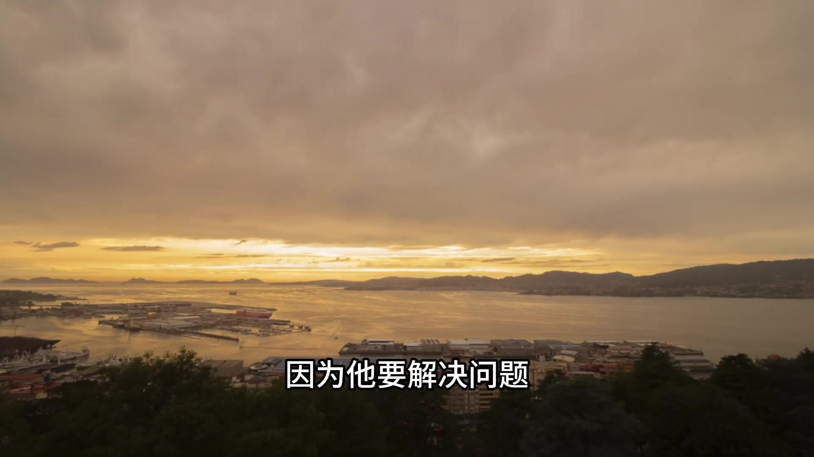
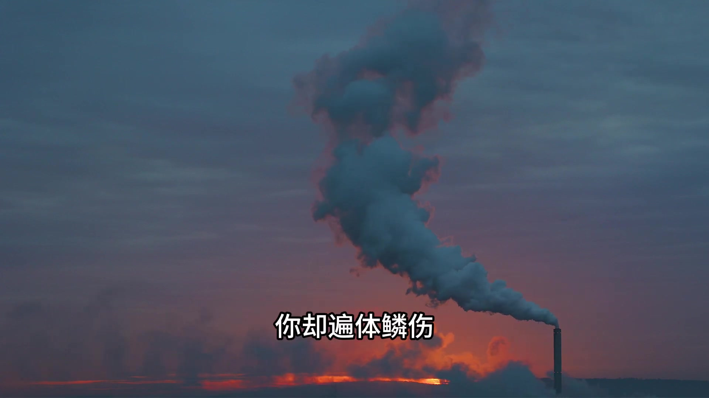
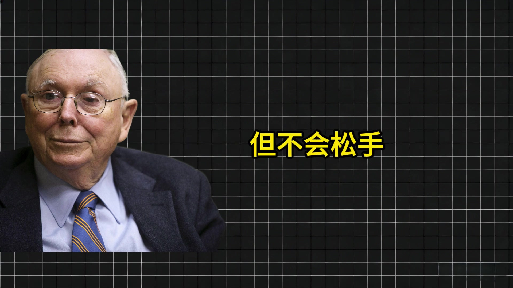
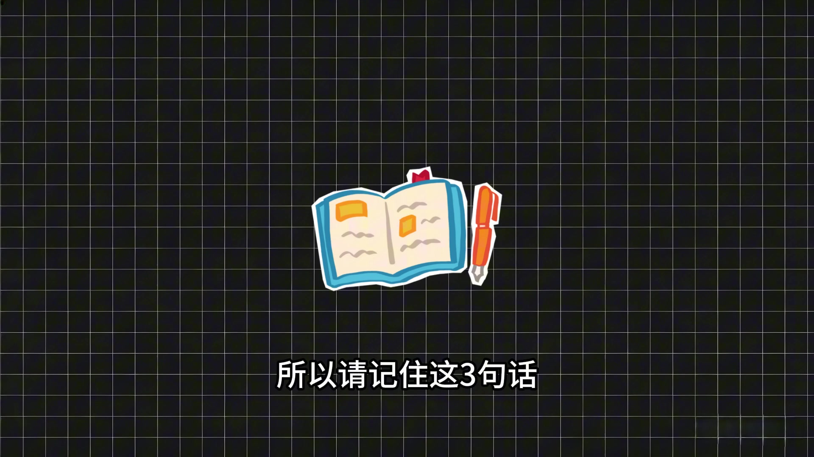
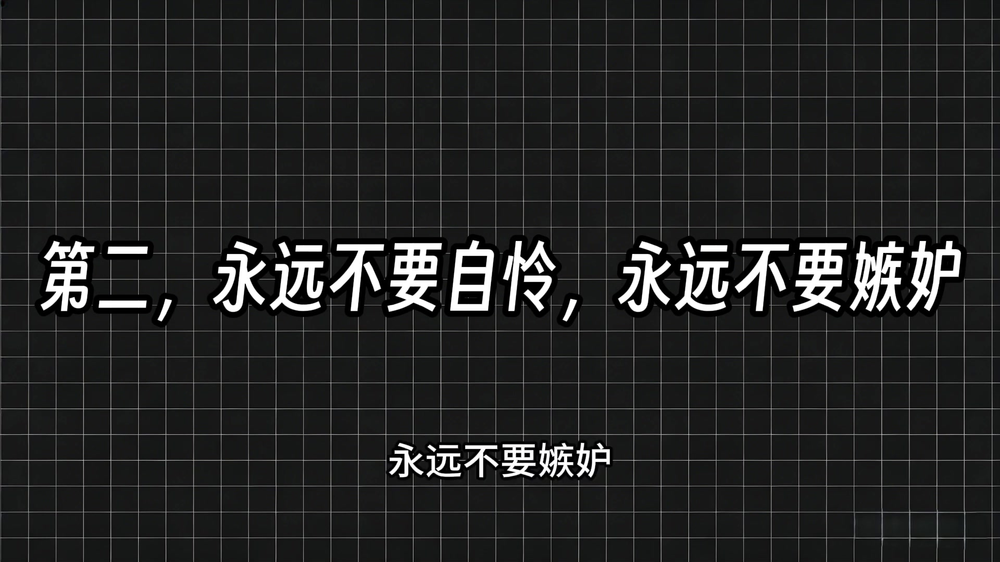

# x_WozyR-uRgUs — 關鍵畫面索引

- 來源逐字稿：[x_WozyR-uRgUs_FIN.srt](x_WozyR-uRgUs_FIN.srt)
- 影片：https://www.youtube.com/watch?v=WozyR-uRgUs
- 截圖數：7

## 00:00:49

**逐字稿片段：** 他才總結出兩條 用血淚換來的人生鐵律 比任何投詞心法都值錢

**話題推測：** 介紹芒格總結出的人生鐵律

---

## 00:00:54

**逐字稿片段：** 第一條 永遠不要自戀 哪怕你的孩子 正裡面癌症連演一系 他不是站著說話不腰疼 他兒子生命那三年 他每年下班就往醫院跑 他面了所有醫學書 拼命地賺錢 找最好的專家 他根本沒有時間自戀 因為他要解決問題

**話題推測：** 芒格人生鐵律的第一條原則

---

## 00:01:08

**逐字稿片段：** 第二 永遠不要嫉妒 嫉妒是其中最終 唯一一種 不會給你帶來任何快樂的罪惡 嫉妒就像是你喝了毒藥 卻盼著別人死 對方毫髮無損 你卻遍體鱗傷

**話題推測：** 芒格人生鐵律的第二條原則

---

## 00:01:18

**逐字稿片段：** 23年11月 99歲的芒格 生前最後一次接受採訪 他說 生活的鐵律就是 每個人都在掙扎 你無法讓死者復生 你無法治癒垂死的孩子 你留不住要走的人 有做不成所有想做的事 你必須要有壓堅持 如果有壓堅持的一部分 是你去藥上街上每天哭幾個小時 那就盡情地哭吧 但你不能退出 雖然是也會疼 但不會鬆手

**話題推測：** 提及芒格於2023年11月生前最後一次採訪

---

## 00:01:39

**逐字稿片段：** 所以請記住這三句話

**話題推測：** 總結三個重要的生活原則

---

## 00:01:40

**逐字稿片段：** 第一 承認痛苦是人生的常態 不用假裝堅強 第二 永遠不要自憐 永遠不要嫉妒

**話題推測：** 第一個生活原則

---

## 00:01:47

**逐字稿片段：** 第三 你可以哭 但絕不能放棄 最後送給大家芒果的一句話 坦然接受到來的苦難 也坦然接受到來的福氣

**話題推測：** 第三個生活原則

---
