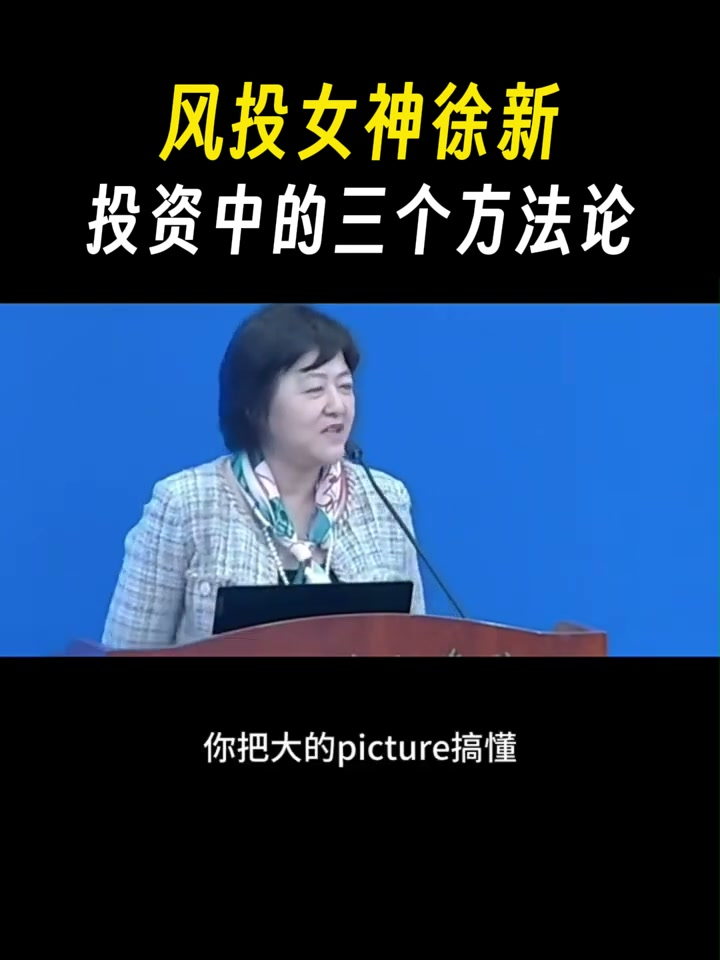
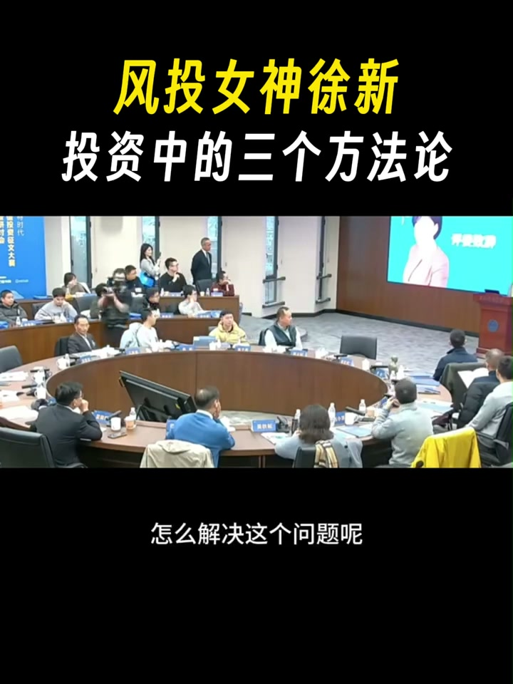
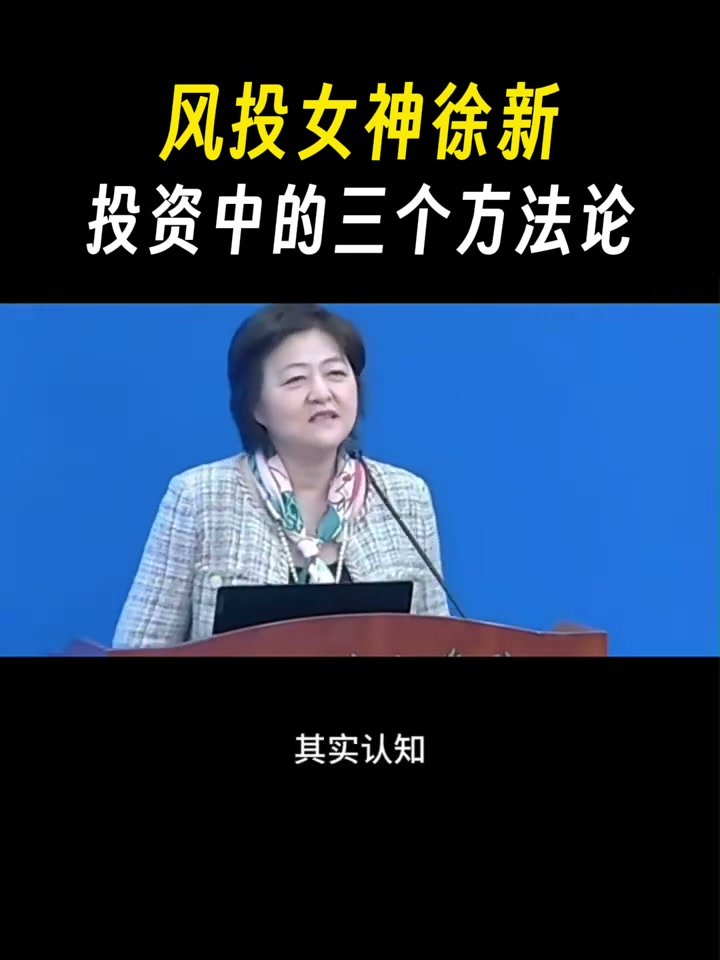
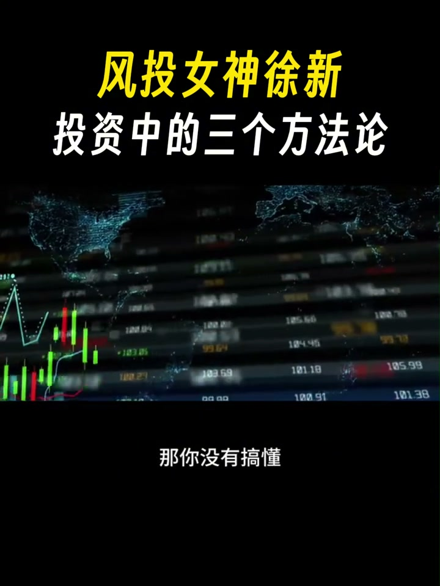
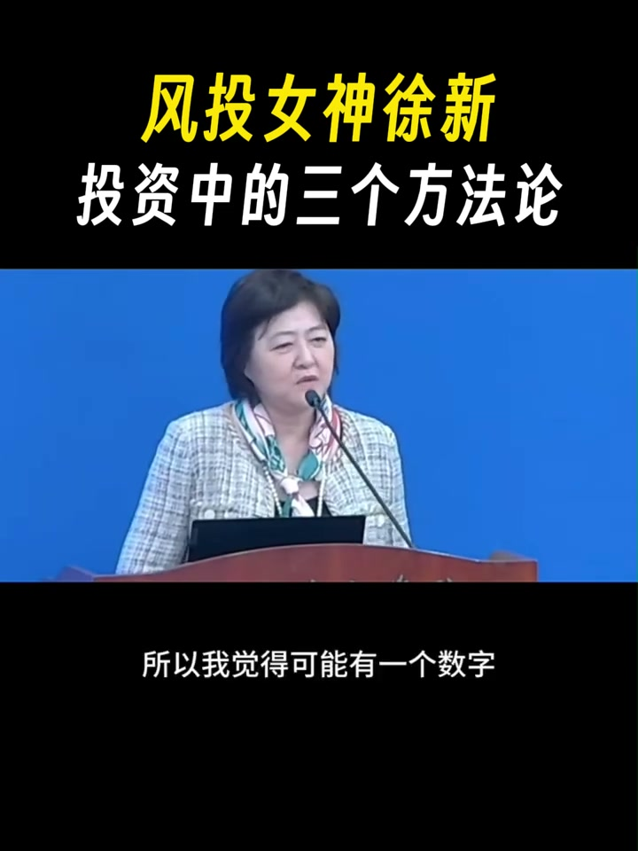
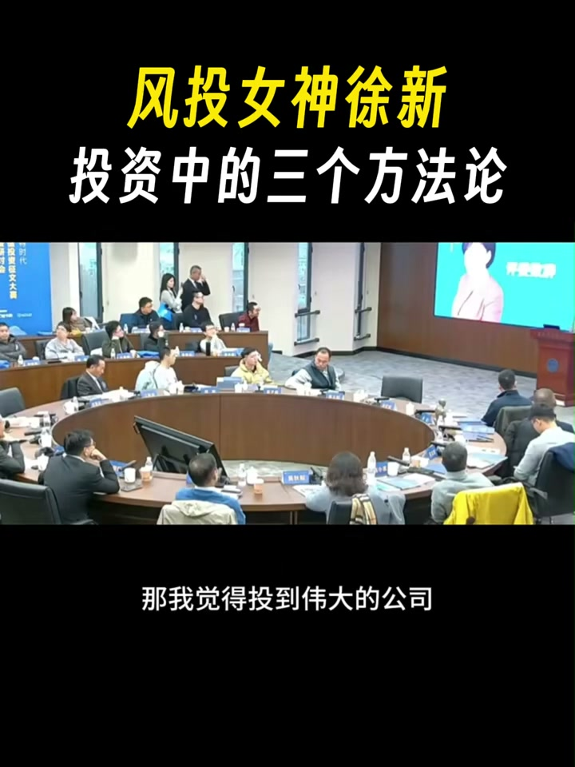
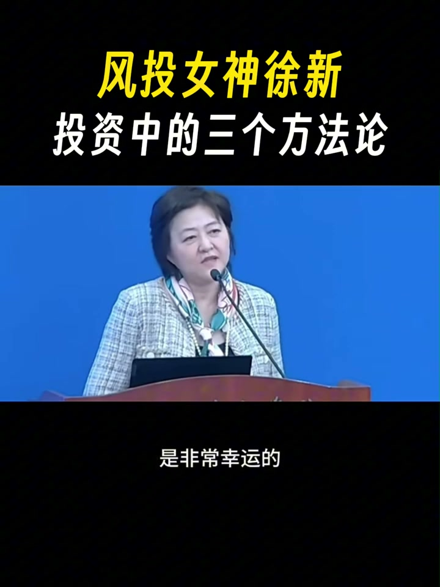

# x_dzTP-abkWCc — 關鍵畫面索引

- 來源逐字稿：[x_dzTP-abkWCc_FIN.srt](x_dzTP-abkWCc_FIN.srt)
- 影片：https://www.youtube.com/watch?v=dzTP-abkWCc
- 截圖數：8

## 00:00:14

**逐字稿片段：** 然後我看了一下那個芒格說, 他說你一生需要幾個偉大投資, 不需要太多, 四五個就夠了, 花兩年時間看懂一家公司, 要有這種耐心。 我們做風險投資其實是沒有這個奢侈的 我們是看一個月就得下單的 不下單這個公司就沒了 別人就投了 下一輪股市就高很多了 所以你怎麼樣解決這個問題 就是你怎麼解決 在這麼短的時間要真正懂得一家公司 怎麼解決這個問題呢

**話題推測：** 引用芒格的名言，可能顯示芒格的圖片或引言文字。

---

## 00:00:38

**逐字稿片段：** 我們現在是找到了三個方法 第一就是你要做Winner Pattern Study 你要研究贏家的法則 第二你要做Consumer Deep Diving 就消費者深度洞察 就對用戶深度洞察 第三你就是要 我們叫Code for Competition 你要把所有的石頭都搬開看一下 你不要看一家 你把這個行業的 十家二十家全部看完 你可能就是說 你不能只建樹木不建森林 那你怎麼才能看到森林 你就把所有的樹木都建一遍 當你建了足夠多的樹木 你心裡就有那個森林 你自己是知道的 所以這三個方法呢 我再具體稍微闡述一下 就是我覺得 我們是靠認知賺錢的 其實認知可以用一個

**話題推測：** 提出解決問題的三個方法，預期畫面會列出這三點。

---

## 00:01:16

**逐字稿片段：** 簡單的公式來表示 第一 你的認知等於你的信息輸入 加上你的信息處理 最後等於信息輸出 那個輸出就是你的認知 那你怎麼樣提高 你的信息輸出的質量呢 有兩點 第一你信息輸入的質量要好 第二你的決策要是有科學的 我覺得對於process

**話題推測：** 提出一個簡單的公式來表示認知，預期畫面會顯示此公式。

---

## 00:01:33

**逐字稿片段：** 我只有兩句話想講 第一你要用第一性原理 第二用長期主義 這就是整個決策的過程 有的時候我發現 這個認知它是迭代的 因為我們確實有這個現實的問題 就我可能在一個月之內 要做決策了 那我怎麼在 我不可能一個月搞懂一個公司 所以我只能是這樣子 就是我看好了這個賽道 我把這賽道所有人都見一遍 我可能見到 I don't know 我見到可能第十幾個的時候 我可能就會有一個 oh aha moment 我好像搞明白了 這個生意的身負手是什麼 那你沒有搞懂

**話題推測：** 介紹決策過程的兩點，預期畫面會列出這兩點（第一性原理、長期主義）。

---

## 00:02:02

**逐字稿片段：** 你就不要投 我這一點特別佩服段永平同學 他就是好像是不投 這件事情做得特別極致 特別堅決 很多人說他就做不到 因為有很多 像我們這個行業 有個叫fear for missing out 就你怕投不到 那個偉大的公司 對 就在這裡面 你怎麼平衡這個fearful missing out 和你這個 投了一個什麼品用的公司 對吧 就這裡面你是怎麼樣 怎麼樣去判斷的 所以我覺得

**話題推測：** 提及段永平作為投資案例，可能顯示他的照片或相關資料。

---

## 00:02:28

**逐字稿片段：** 可能有一個數字 我也一直在抓 就是說 這種偉大的公司 到底有多少個 就你一期基金 能投到幾個偉大的公司 我現在so far的learning 就根據我自己的經驗 就是說 就我們這一行做風險投資 最關鍵是你要 打到那個home run 就你要投到那個偉大的公司 對於偉大的定義 我是這麼定義的 就是第一 你投資要回報18倍 然後你單一一個項目 我們能賺到三億美金這樣子 就是我們每個家定義不一樣 那我覺得投到偉大的公司

**話題推測：** 引入關於偉大公司的數字討論，可能顯示一個關鍵數字或統計。

---

## 00:02:56

**逐字稿片段：** 就是說這裡面有兩個element 一個是它的頻次 就是你一個七基金 一七基金大概四五年投資 你能投到幾個偉大的公司 這叫頻次 還有一個就是叫強度 也就是intensity 就是說你投到的一個能賺多少錢 我覺得這個頻次是靠命運給你的機會 就是我們so far 作為中國的富豪投資是非常幸運的

**話題推測：** 將投資偉大公司分解為兩個要素，預期畫面會列出頻次與強度。

---

## 00:03:20

**逐字稿片段：** 我們趕上了互聯網 趕上了移動互聯網 現在又趕上了AI 這都是技術 technology的刷品 帶來的機會 這個其實是跟運氣 很相關的 你在哪個時代 哪個國家 你有沒有這樣的運氣 我覺得這個可能 50都是靠運氣的 那我們so far 還是比較幸運 第二個呢就是 第二個其實就是強度 強度就是說 你一旦運氣很好 投到這個偉大的公司 你能賺多少錢 這個完全決定兩件事情 一個是 你有多少股份比例 或者你投到多大的金額 第二個就拿多長時間 有沒有賺到時間的複利 所以對我們來講 如果平次是命運給你的機會 那你就take it 那我覺得這個數字 我自己感覺就不管你投多少家 可能一期基金就是三到四個 我也問過別人 有一個天使投資 就有一個天使投 他一年投150個 我問他有幾個偉大公司 他也告訴我四個 我現在已經問了大概五六個人了 他們都說是四個 我覺得這是個magic number 如果這個四個是個magic number的話 然後就看你的heat rate是多少了 對吧 我覺得最好的heat rate可能是20% 那也就是你整個投的項目 不應該超過20 這不知道是不是科學的方法 我也在思考 就是說你到底應該 投多少家公司 即使早期你 因為這裡面有一個coverage 有一個是寬度 一個是深度 因為你投太多 你就沒有時間瞭解他們 沒有時間瞭解他們 因為你不可能 比如說你對20家公司 每天都跟得那麼緊 我覺得我自己的maximum 可能就6到8家 就你覺得願意跟他花時間 從他上能學到東西 我經常跟我們的企業家 每次聊天 就兩個月聊一次 每次都是3到5個小時

**話題推測：** 列舉中國風險投資業抓住的技術浪潮（互聯網、移動互聯網、AI）。

---
