# x_nNtdo6Lsop4 — 關鍵畫面索引

- 來源逐字稿：[x_nNtdo6Lsop4_FIN.srt](x_nNtdo6Lsop4_FIN.srt)
- 影片：https://www.youtube.com/watch?v=nNtdo6Lsop4
- 截圖數：16

## 00:00:05

**逐字稿片段：** 巴菲特在股東大會上說過這樣一段話。 你一聽這話是不是覺得這市場有毛病啊? 老師培養一個孩子 影響他一生 護士守護一個病人 可能會挽救一條生命 這難道不比唱一首歌 打一場拳賽重要嗎 在你仔細一想 市場的每一分錢背後 都是一個活生生的人 在主動投票

**話題推測：** 引述巴菲特在股東大會上的話，可能顯示巴菲特頭像或股東大會畫面。

---

## 00:00:39

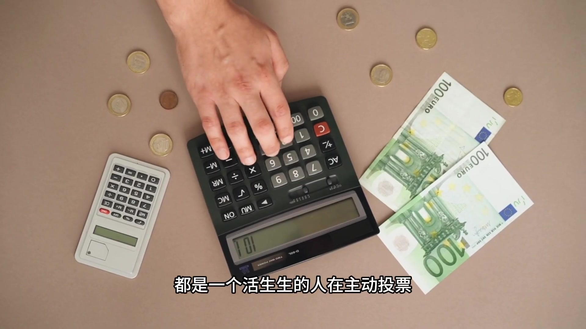

**逐字稿片段：** 你買演唱會門票 你充視頻會員 你熬夜看世界盃 這不是市場逼你的 是你自願的 每一分錢的流向 背後都是一個人真實的選擇 所以市場其實只是一個 特別真實的投影 它把我們所有人的真實偏好 毫無修飾地 塗在了搜索排行榜上 那問題就變成了

**話題推測：** 舉例說明市場投票，可能顯示演唱會門票、串流媒體會員介面或世界盃畫面。

---

## 00:00:56

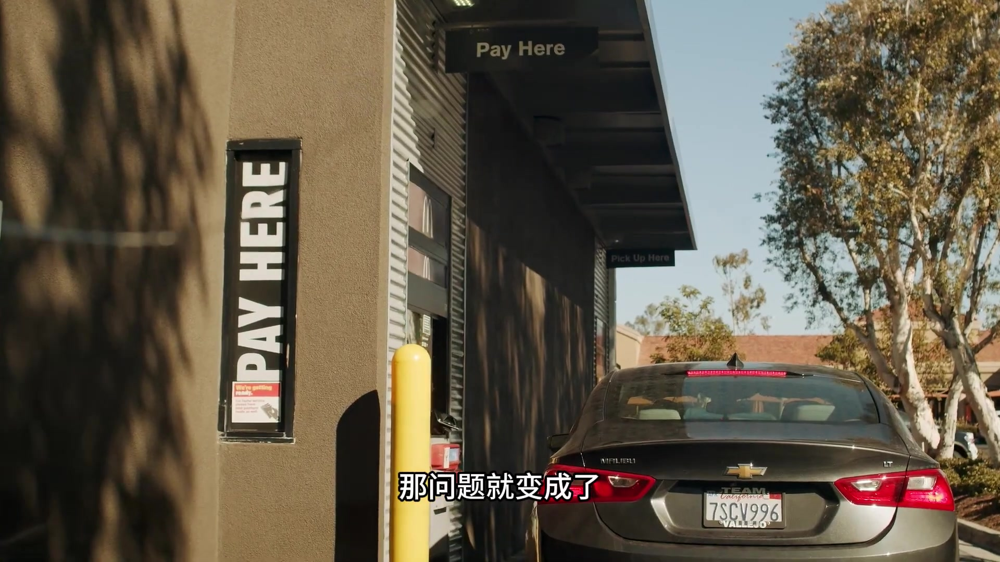

**逐字稿片段：** 為什麼我們嘴上說 教育重要 醫藥重要 掏錢的時候提把票 我給了理論

**話題推測：** 提出核心問題，可能顯示問題文字或圖表。

---

## 00:01:01

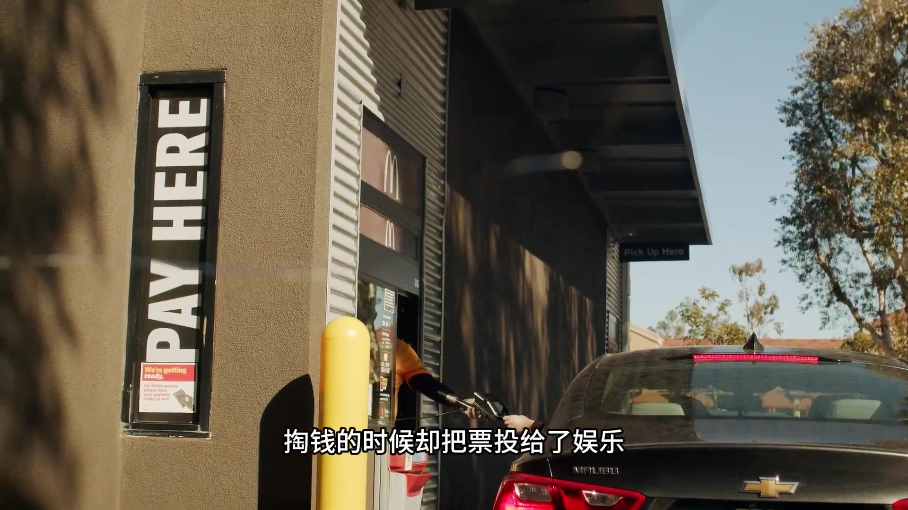

**逐字稿片段：** 讓我們把問題拆開看一下 就一個原因 人類天然願意為 即時可感知的情緒價值付費 而不是為延遲的抽象的通風價值付費

**話題推測：** 準備拆解問題，可能顯示圖解或解釋框架。

---

## 00:01:09

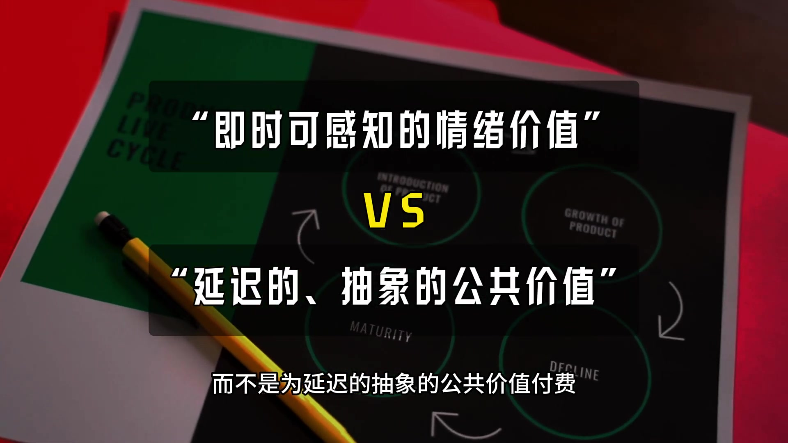

**逐字稿片段：** 我給你舉個例子 在世界被你支持的球隊 或球星見了球 你會非常開心 可能賞的都含雅了 這種衝擊你不需要思考 會繞過你的大腦皮層 直接激進你的情緒 給你大腦帶來獎場服務

**話題推測：** 引入具體例子，可能顯示世界盃足球比賽畫面。

---

## 00:01:21

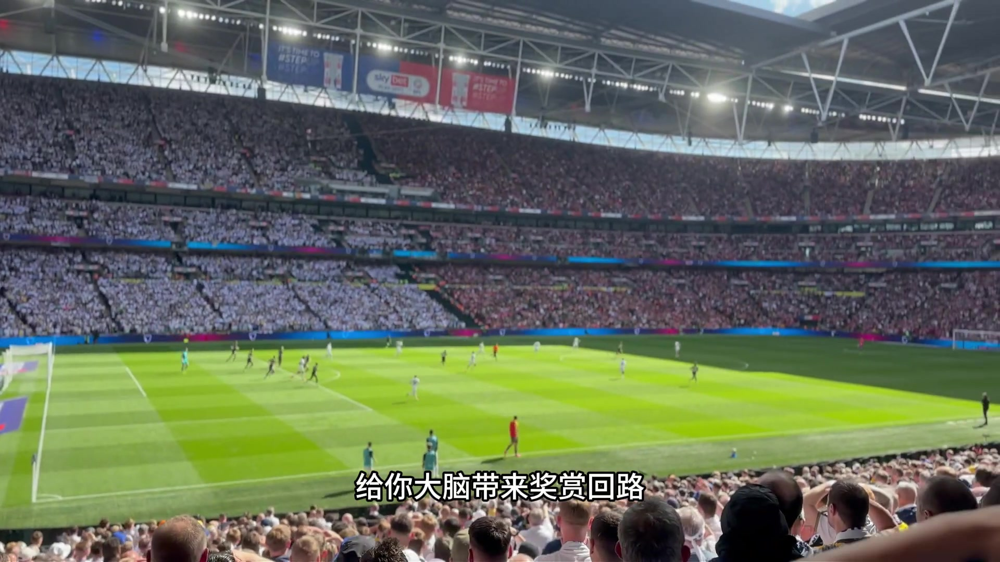

**逐字稿片段：** 而一個老師 對一個學生的思維方式的塑造 一個護士對病人的尊嚴的維持 這種價值極度真實 也極度深刻 但他沒辦法 在短時間內 給你完整消費掉 沒法讓你獲得立刻的敗感

**話題推測：** 轉為對比老師和護士的價值，可能顯示相關職業形象或抽象價值圖示。

---

## 00:01:32

**逐字稿片段：** 所以巴比特才說 如果人們想看泰克爾泰森 因為一花兩千五百萬美元 但他打到能起真宗 市場就源源不斷地 生產人們喜歡的東西 你看這個因果關係 不是市場先產生了娛樂 然後強行塞給我們 是我們先有了 渴望被娛樂的原始程度 市場才推上來滿足它

**話題推測：** 回到巴菲特引言，可能顯示巴菲特引言文字或相關圖表。

---

## 00:01:50

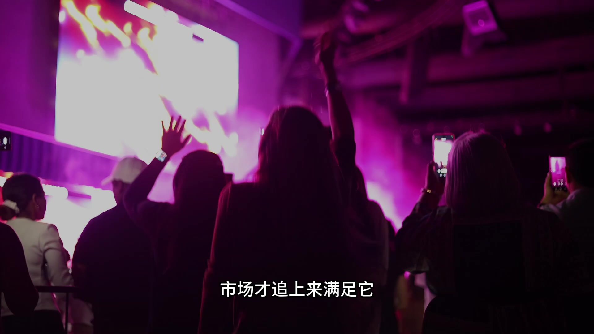

**逐字稿片段：** 所以回到開頭那個扎心的問題 為什麼教師護士這些職業 收入不高

**話題推測：** 回顧開頭問題，可能顯示開頭問題文字或轉場動畫。

---

## 00:01:54

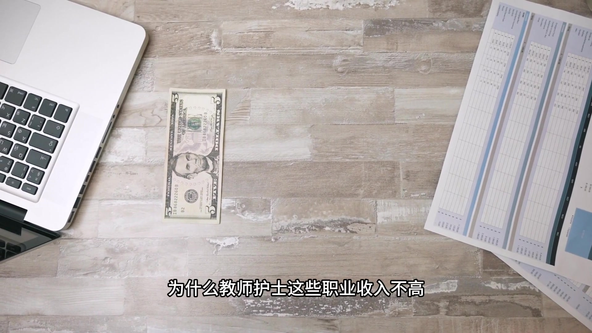

**逐字稿片段：** 因為社會在用兩套 完全不同的標識 補養職務 一套叫價值認同 我們用掌聲 用贊格 用教師節來支付 這套標識下 老師和護士 獨立存放

**話題推測：** 闡述社會兩種不同的評價標準，可能顯示對比圖或列表。

---

## 00:02:04

**逐字稿片段：** 不可爭議 另一套叫支付意願 我們用真金白銀來支付 這套標識下 只能讓人感覺到快樂 讓人感覺到成為價值 才能獲得不同比例的回報 這兩條標誌之間的鴻溝 就是我們每個人內心的真實寫照 一個說教育重要 一個刷打氣筋停下來 那看到這你可能會問

**話題推測：** 介紹第二套評價標準「支付意願」，可能顯示其定義與相關圖示。

---

## 00:02:20

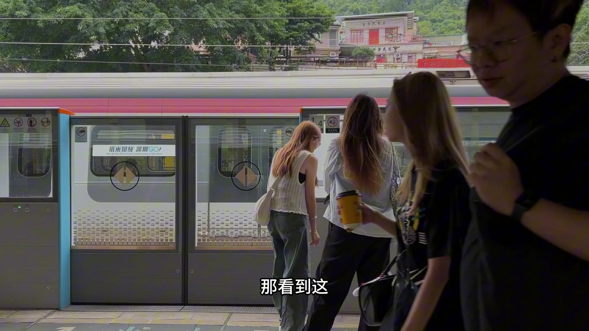

**逐字稿片段：** 那年輕人該怎麼辦 都去當老虎嗎

**話題推測：** 提出年輕人如何應對的實際問題，可能顯示問號或解決方案的標題。

---

## 00:02:22

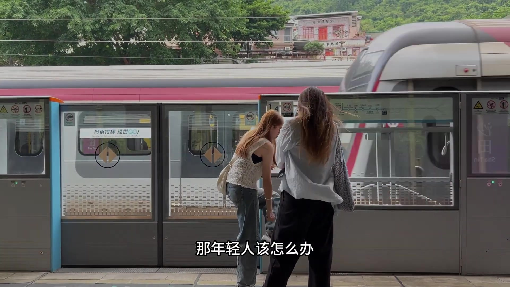

**逐字稿片段：** 達菲特的建議特別樸實 他說找到一份正經工作 一步一步往前走 才是更靠譜的起點 他沒有鼓吹人人都去當明星 因為他知道那種集團的成功 屬於概率遊戲

**話題推測：** 轉述巴菲特給年輕人的建議，可能顯示巴菲特頭像或建議文字。

---

## 00:02:33

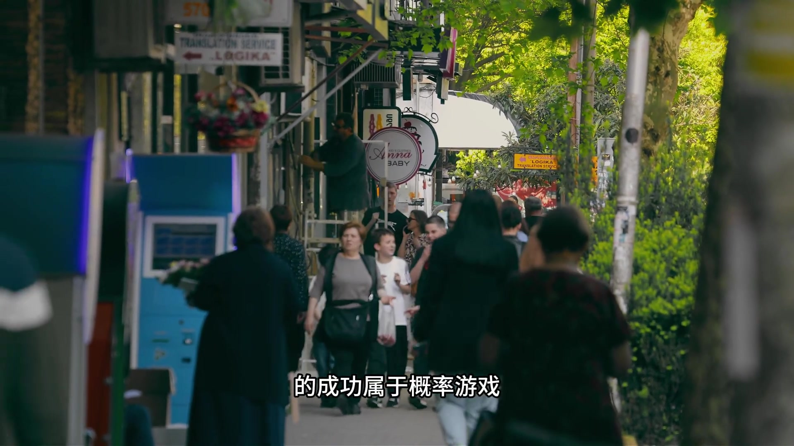

**逐字稿片段：** 還補充了一句更重要的 他說遇到的不平等永遠會存在 真正需要警惕的是機會的不平等 但人與人之間的能力的差異 永遠都會存在 所以理解這一切之後

**話題推測：** 補充巴菲特的另一句重要建議，可能顯示補充建議文字。

---

## 00:02:43

**逐字稿片段：** 你面前其實有兩條特別清晰的路 一條是參與這套遊戲 去提供人們願意付費的情緒價值和吸血能力 換取市場給你的鉅額回報 這條路竟能激烈 但規則透明

**話題推測：** 提出人生兩條清晰的路徑，可能顯示流程圖或對比圖。

---

## 00:02:54

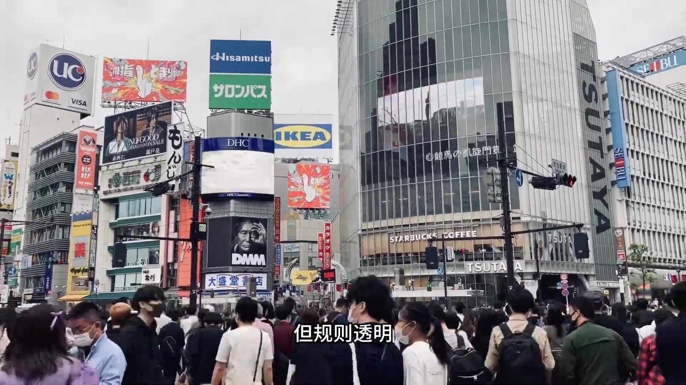

**逐字稿片段：** 另一條是跳出金錢標尺 去做那些只能用意義來定下的事 同時坦然接受 它不會讓你暴富 這條路可能清貧 但它有自己的尊嚴 兩條路都不容易 也都值得尊重

**話題推測：** 介紹第二條人生路徑，可能顯示不同於第一條路的視覺內容。

---

## 00:03:06

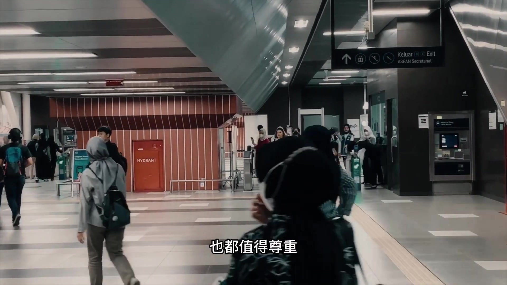

**逐字稿片段：** 但真正清醒的是什麼 不在用錢圖客的時候假裝高漲 也不在追求意義的時候抱怨貧窮 看見真相 然後為自己的選擇買單

**話題推測：** 提出對「清醒」的最終總結，可能顯示總結性文字或引人深思的畫面。

---
