# x_vF4QvcDmWIs — 關鍵畫面索引

- 來源逐字稿：[x_vF4QvcDmWIs_FIN.srt](x_vF4QvcDmWIs_FIN.srt)
- 影片：https://www.youtube.com/watch?v=vF4QvcDmWIs
- 截圖數：15

## 00:00:09

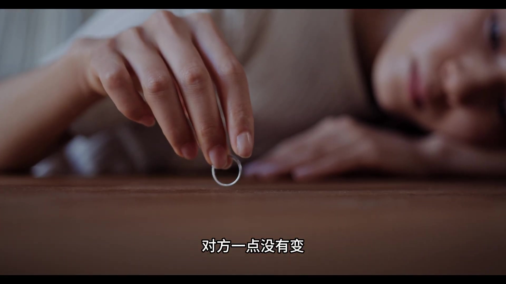

**逐字稿片段：** 今天我們用地心原理結合巴威特和芒格的原話,把這件事的本質說透。

**話題推測：** 介紹影片主旨，結合巴菲特和芒格的觀點

---

## 00:00:30

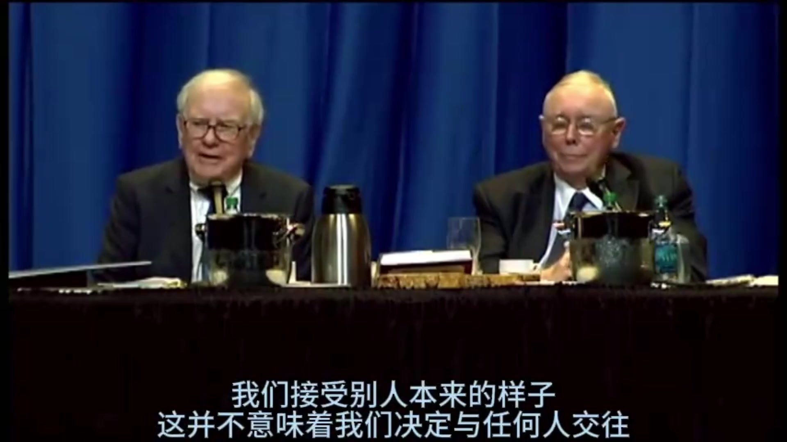

**逐字稿片段：** 先講底層邏輯 改變別人本質上是一筆特別虧的買賣 一個人的觀念 習慣 行為模式 是到過去幾十年所有經歷利益 環境共同塑造的結果 相當於一套運行了幾十年的底層系統 你想靠幾句話 幾次爭吵就能改起這套系統 其實這是一個能耗極高 中功率極低 完全不符合成本收益的底層邏輯 你投入的是最寶貴的 不可再生的時間和精力 但控制權100%在對方手裡 這是所有投資裡 形象比最差的一種

**話題推測：** 影片進入新的段落，講述底層邏輯

---

## 00:00:57

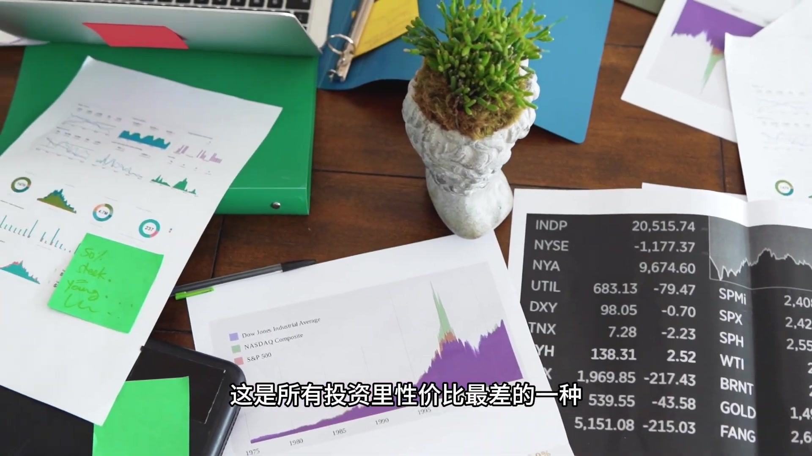

**逐字稿片段：** 艾維特在2015年的一次演講中說 為了改變對方而結婚是瘋狂的 僱一個人來改造他 也同樣瘋狂 為了改變對方而成為合夥人 更是瘋狂 我們拆解一下他的這段話

**話題推測：** 引述巴菲特（艾維特）在2015年演講中的名言

---

## 00:01:08

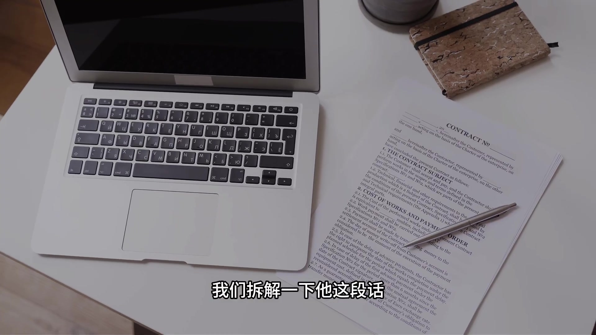

**逐字稿片段：** 分三個層面 第一個是關於婚姻的 其實很多婚姻痛苦的根源 是試圖改造配偶 很多人明知道對方身上 有你不可接受的問題缺陷 卻抱著 不以後能慢慢改造他 感化他 糾正他的僥倖心態 卻選擇了這個人當伴侶 是絕大多數人都會踩的普遍人性誤區 現實裡很多人進入婚姻 不清楚對方的性格 習慣 三觀 有自己不能接受的地方 但都會自我說服 結婚了他就會收心 有孩子了就懂事了 我對他好 總能慢慢感化他 這就是巴菲特所說的 為了改變對方而結婚是瘋狂的

**話題推測：** 預告將巴菲特的話拆解成三個層面

---

## 00:01:39

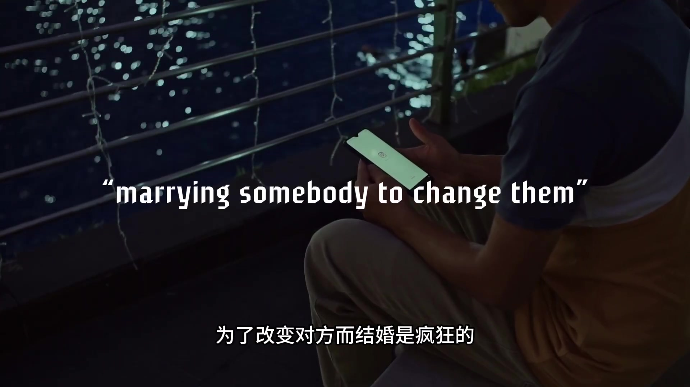

**逐字稿片段：** 芒格更是直白的不忠道 如果你想毀掉自己的生活 就花一輩子試圖改變你的配偶 這太愚蠢了

**話題推測：** 引用芒格關於婚姻的直白建議

---

## 00:01:45

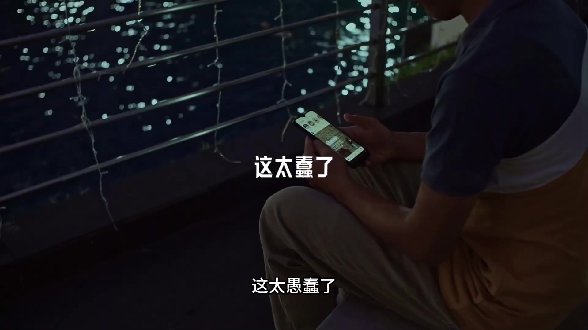

**逐字稿片段：** 第二條層面是關於商業上 管理層的變動和婚姻變動一樣 痛苦耗時 而且充滿不確定性 這是巴菲特說這句話的核心語氣 針對當時市場上 買好公司換爛管理層的流行投資策略 很多企業收購時 覺得這些公司業務沒有問題 只是管理層不行 我們接盤換掉 改造就行 像現實生活中招聘時覺得 這個人能力還行 就是有些毛病 進來之後我好好帶帶他 糾正就可以 巴菲特認為 這和想改造配偶一樣瘋狂 這個系列幾十年的核心策略 就是隻收購本來就很優秀 靠譜管理層的公司 過後完全不干預不改造 圓滿人馬繼續運營 根本不做改造人的事

**話題推測：** 展開第二個層面的討論，聚焦於商業管理

---

## 00:02:21

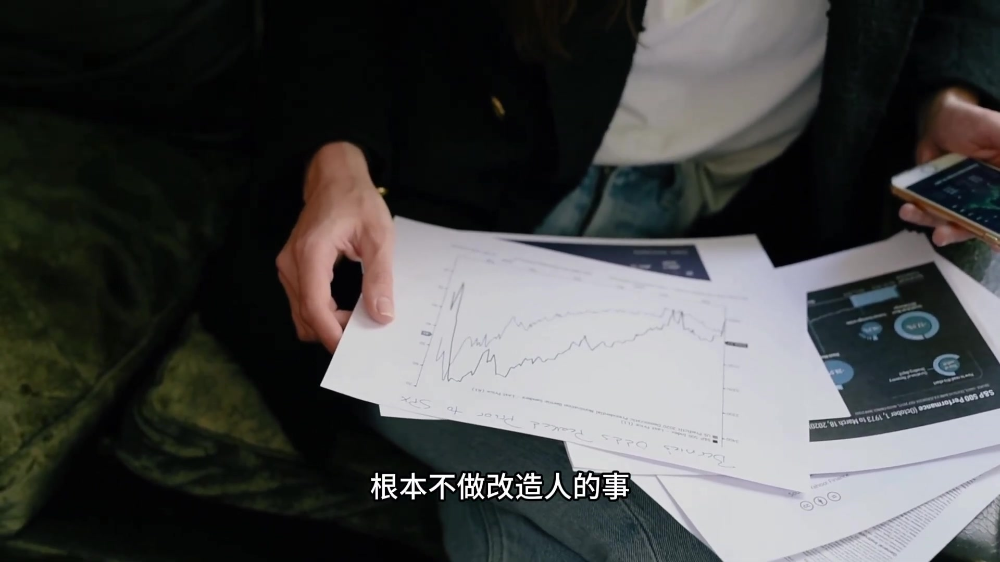

**逐字稿片段：** 第三個就是一個合夥場景 很多人和合夥人做生意 做項目 明知道對方人品 做事風格 價值觀有明顯問題 就覺得 一起做事我能盯著他 影響他 把他掰過來 最後幾乎都是內耗 反物 虧損收場 巴比特這句話的本質是 重篩選輕改造的底層邏輯的延伸 人和人的底層特質 是幾十年形成的 改造的成本極高 成功率極低 最優解呢 永遠是一開始就選對人 而不是選了之後 再試圖改造 就像巴菲特說的 我們不試圖改造別人 這效果並不好 我們接受人們本來的樣子 我不會花一秒鐘 去改變任何一個人 除非他自己一定要改變

**話題推測：** 展開第三個層面的討論，聚焦於合夥場景

---

## 00:02:57

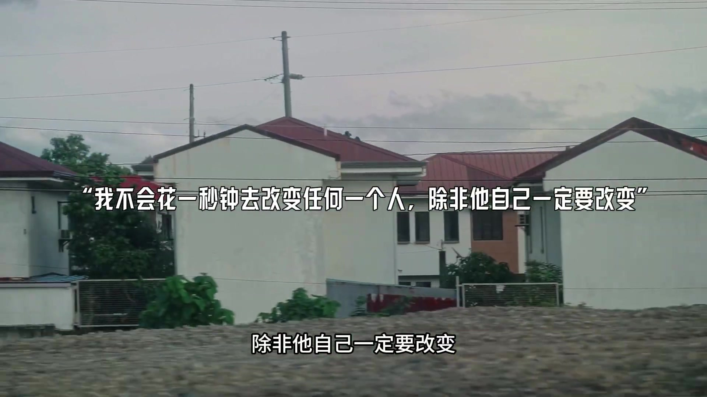

**逐字稿片段：** 芒格在《懲差類寶典》中 也反覆呢 去提到這樣一個觀念 遇到認知和你不在一個層面 甚至消耗你的人 第一反應應該是遠離 而不是試圖改造 你改變不了他們 只能把自己拖下水

**話題推測：** 引用芒格在《窮查理寶典》中的觀念

---

## 00:03:08

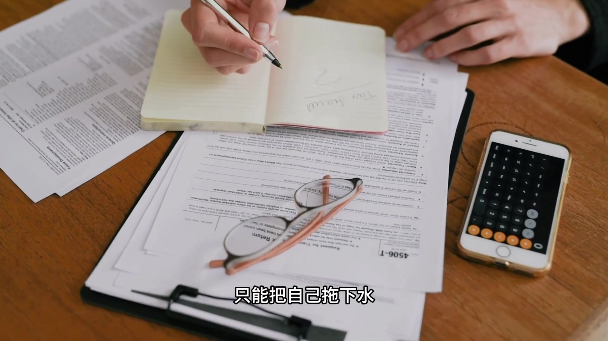

**逐字稿片段：** 反過來 投資自己 就是這個世界上唯一一筆 穩賺不賠的買賣 你所擁有的所有資產裡 只有你自己的能力 認知技能 完全受你控制的 它不會被通脹歧視 不會被別人搶走 不會笑開任何人的臉色 而且呢 用的越多反而越增值 經濟成本趨近於0 回報是複利式

**話題推測：** 影片主要話題轉折，從「不改造別人」轉向「投資自己」

---

## 00:03:26

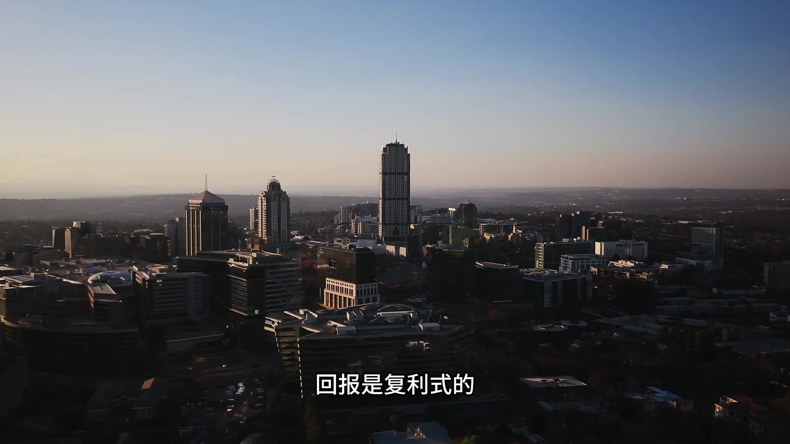

**逐字稿片段：** 巴維特的98年佛羅內達大學研究中 講了一句被反覆驗證的話 你能做出的最好投資 就是投資你自己 沒人能對他徵稅 也沒人能把他從你身上奪走

**話題推測：** 引用巴菲特在1998年佛羅內達大學研究中的名言

---

## 00:03:36

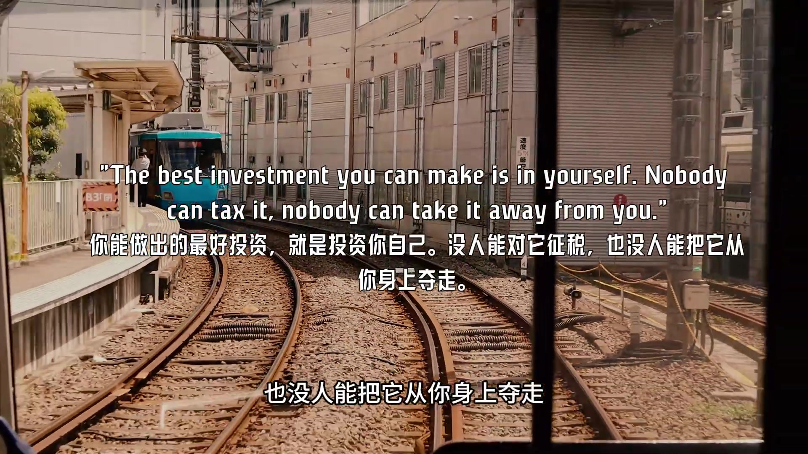

**逐字稿片段：** 他在20年股東大會上又重申了一遍 對抗通脹最好的辦法 就是讓你自己成為某個領域裡面 頂尖的優秀的人 你的本事是你唯一不會貶值的資產

**話題推測：** 引用巴菲特在2020年股東大會上重申的觀點

---

## 00:03:45

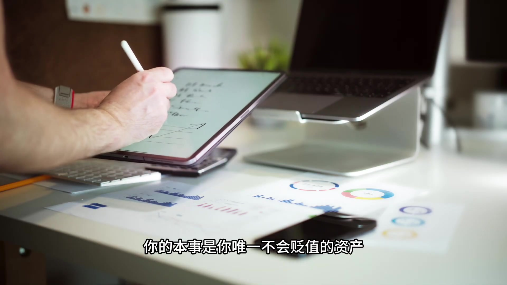

**逐字稿片段：** 芒格一輩子暫行的也是這個邏輯 找到好配偶的最佳方法 請你首先值得擁有好配偶 因為好配偶絕不是傻瓜 說白了 與其花力氣改造別人來適配你 不如花力氣提升自己 去匹配更好的人和事

**話題推測：** 提及芒格關於「投資自己」以找到好配偶的邏輯

---

## 00:03:58

**逐字稿片段：** 這裡呈現一個誤區 不是說要變得冷漠 好像不協作 而是不要抱著 改造者的心態去相處

**話題推測：** 提出一個關於前面觀點的常見誤區

---

## 00:04:05

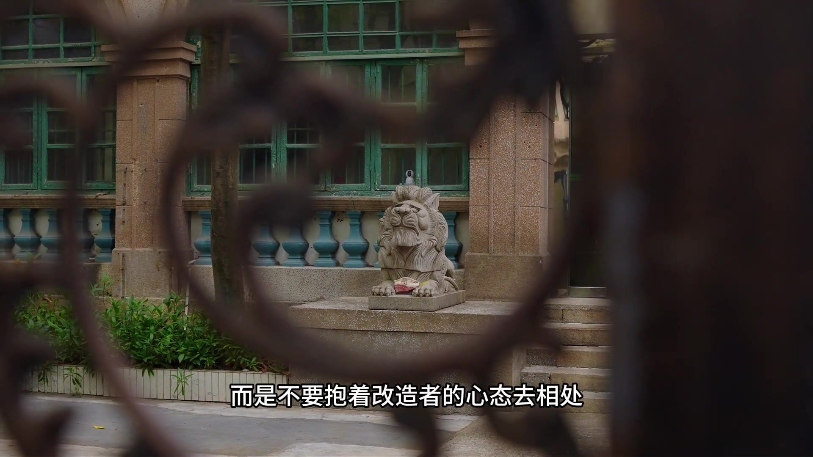

**逐字稿片段：** 如果你真的想影響一個人 王河呢 引用過富蘭克林的一句話 如果你想要說服別人 要赤諸利益 而非赤諸理性 這不是改變 是共贏 你不用了掰碎講道理 只要讓對方看到 這麼做 對他自己也有好處 他自然會動 而如果他看不到 你說再多也沒有用 人的經歷呢 是個長料 你花在改造別人身上的 每一分鐘 都是從投資自己身上

**話題推測：** 引入富蘭克林關於如何影響他人的引言

---

## 00:04:26

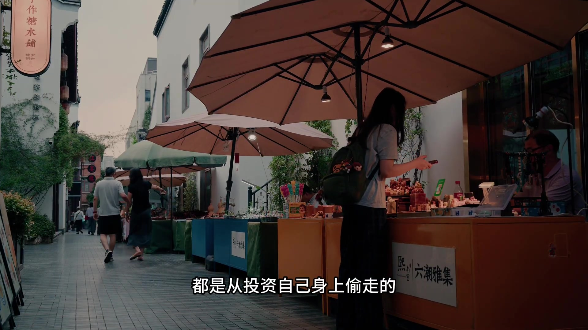

**逐字稿片段：** 來偷走的 停止做別人的人生導師 把能量呢 收回來 用在自己身上 如果你變強了 你身邊的人和事 反而都順了 如果你不斷學習 世界就會被引到路

**話題推測：** 影片的最終總結和行動呼籲

---
