# x_vlDErtgEyFM — 關鍵畫面索引

- 來源逐字稿：[x_vlDErtgEyFM_FIN.srt](x_vlDErtgEyFM_FIN.srt)
- 影片：https://www.youtube.com/watch?v=vlDErtgEyFM
- 截圖數：12

## 00:00:00

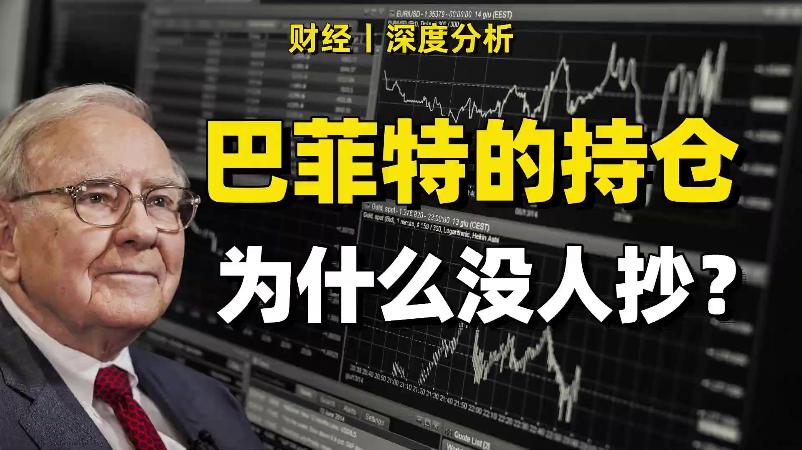

**逐字稿片段：** 你有沒有想過,既然巴菲特的持倉是公開的,那為什麼很多人不直接照抄呢? 這就好比學霸把答案公佈出來,你直接照抄不就好了嗎? 但現實結果是很少人會照抄,其實很多人是看不上巴菲特的收益率。

**話題推測：** 引入影片主題：為何巴菲特持倉不被照抄。

---

## 00:00:11

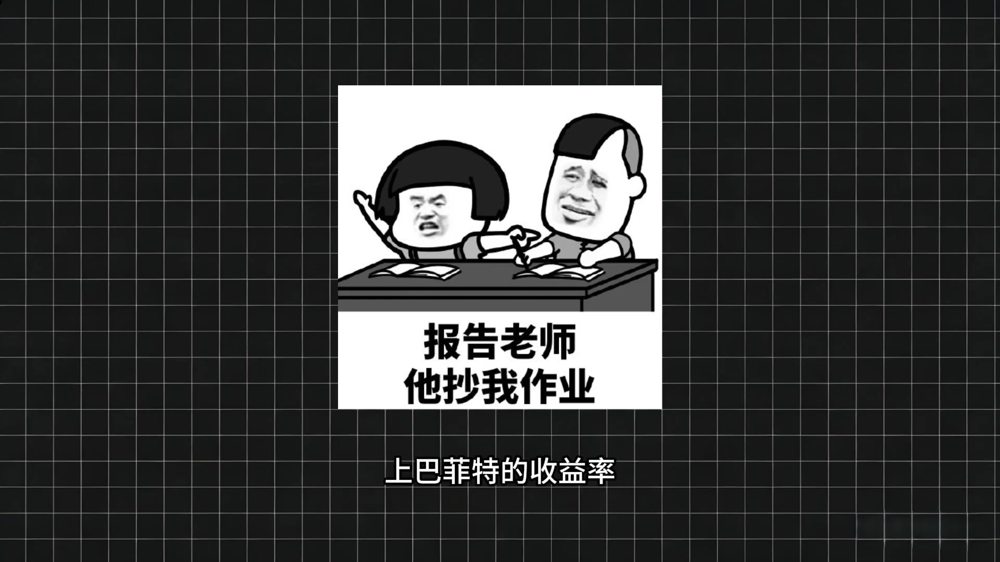

**逐字稿片段：** 先看一下伯克希爾最近10年的年化收益率是13.7%,比標普高了1個百分點。 聽著不錯,但對很多人來說不夠。 很多人想要的是一年翻倍,三年財務自由,年化10%,這有些太莫解。

**話題推測：** 呈現伯克希爾近10年年化收益率數據圖表。

---

## 00:00:24

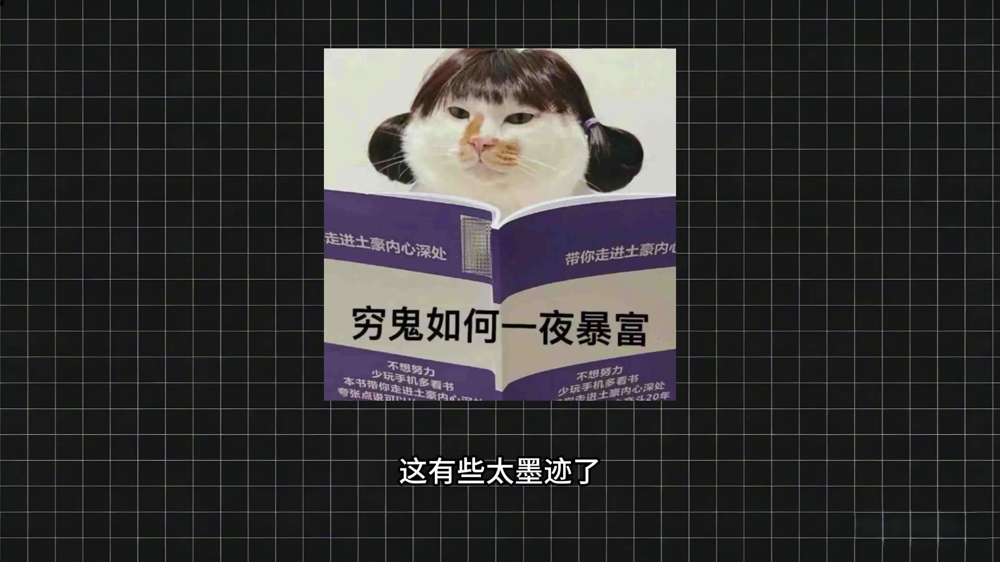

**逐字稿片段：** 其實芒哥早就說過,沒有人願意慢慢變幅。 但真相是 能十年連續跑贏市場 不中斷 已經是鳳毛麟角了 不信你去看看各種基金 私募 能長年站上指數的有幾個

**話題推測：** 顯示芒格關於慢慢致富的語錄。

---

## 00:00:35

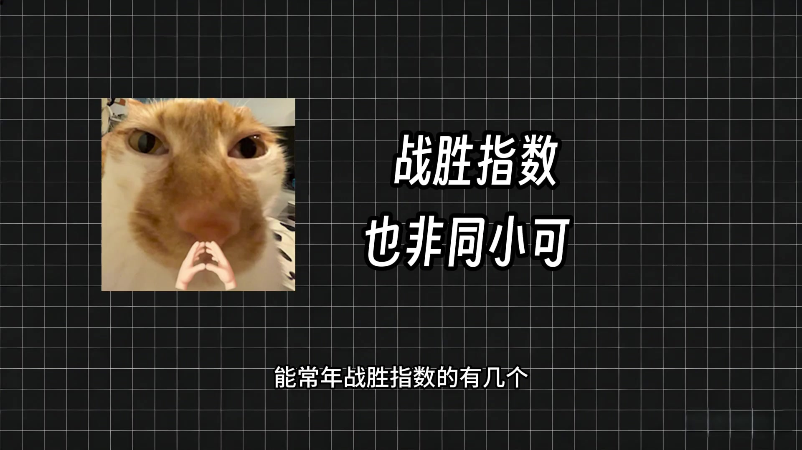

**逐字稿片段：** 還有就是你抄的有可能是過期答案 巴菲特的持倉也一樣 他每個季度向SEC提交報告 但你看到的時候 已經是一兩個月之後的事了 但你知道 可能股價已經上漲了一些 而且他賣了你根本不知道 因為賣出是可以獨立即披露的 當然了 伯克希爾市倉比較多的股票變化不會那麼快

**話題推測：** 提出第二個不照抄原因：持倉資訊可能過期。

---

## 00:00:52

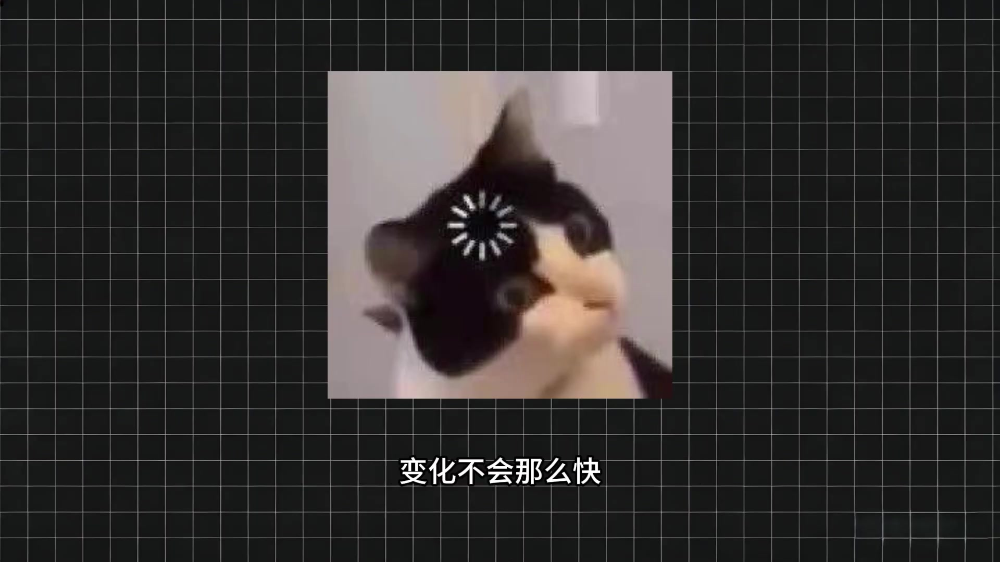

**逐字稿片段：** 如今伯克希爾市值超過1萬億美元

**話題推測：** 展示伯克希爾的市值數據。

---

## 00:00:54

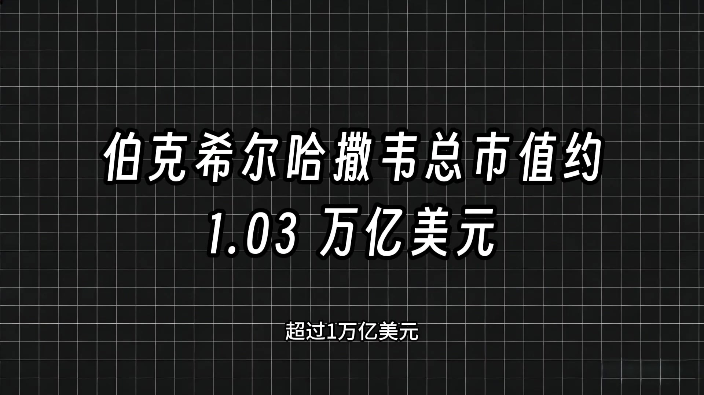

**逐字稿片段：** 現金等價物約3000多億美元 妥妥一艘航空母艦 起量太大 選股必然只能選萬億級別的巨無霸 小公司再優質 對整體收益也毫無影響 巴菲特也坦言

**話題推測：** 展示伯克希爾的現金等價物數據。

---

## 00:01:05

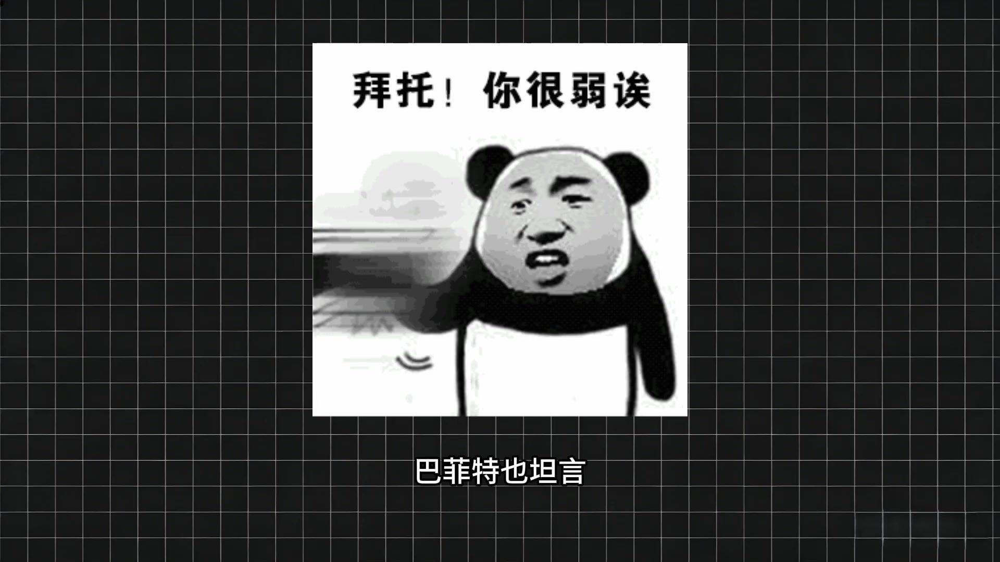

**逐字稿片段：** 規模大是投資效率的最大阻礙 其實巴菲特曾經說過

**話題推測：** 引用巴菲特關於規模是投資阻礙的言論。

---

## 00:01:09

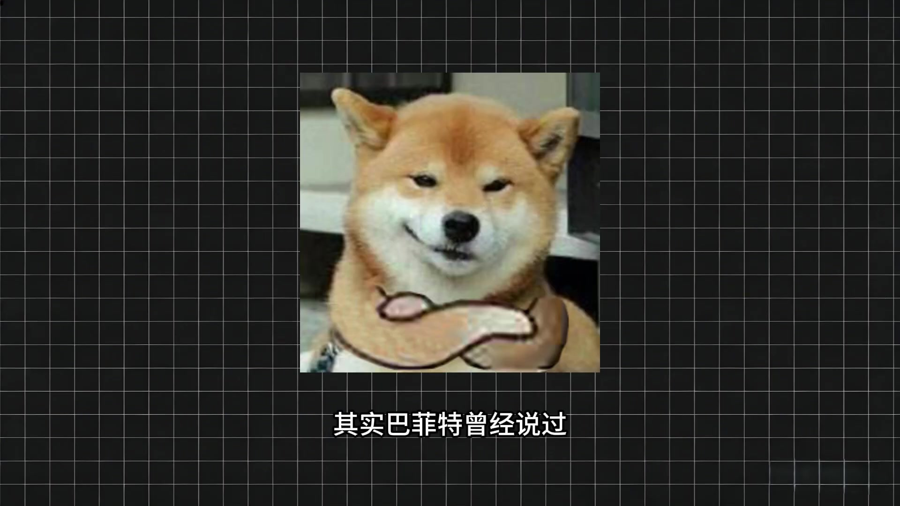

**逐字稿片段：** 如果給他100萬美元 他能賺到年化50% 其實巴菲特早年資金量小時

**話題推測：** 介紹巴菲特關於小資金年化收益率的假設。

---

## 00:01:14

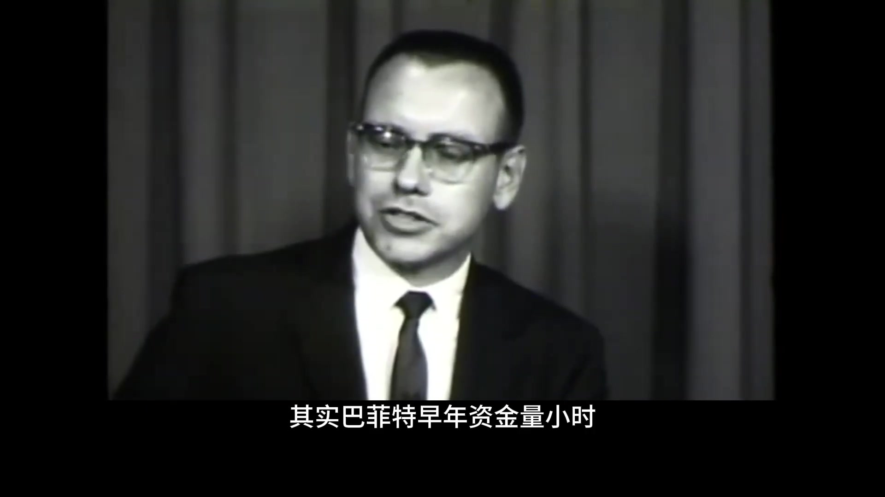

**逐字稿片段：** 10年真實年化就達到過50% 這才是小資金應該參考的範本 巴菲特早年的投資體系 不靠長期持有巨頭 而是做煙地投資 它有三套核心打法 深挖被低估的公司 高具體性套利 取得公司控制權 重塑價值 靠著這套方法

**話題推測：** 展示巴菲特早年實際達到的高年化收益率。

---

## 00:01:30

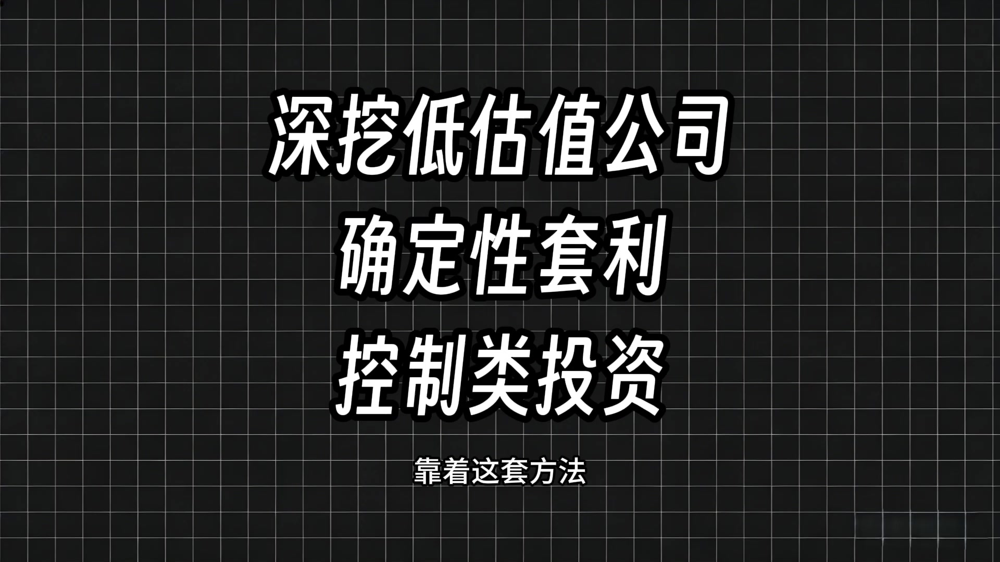

**逐字稿片段：** 30歲的巴菲特 就賺到了相當於如今的

**話題推測：** 提及巴菲特30歲時的成就。

---

## 00:01:33

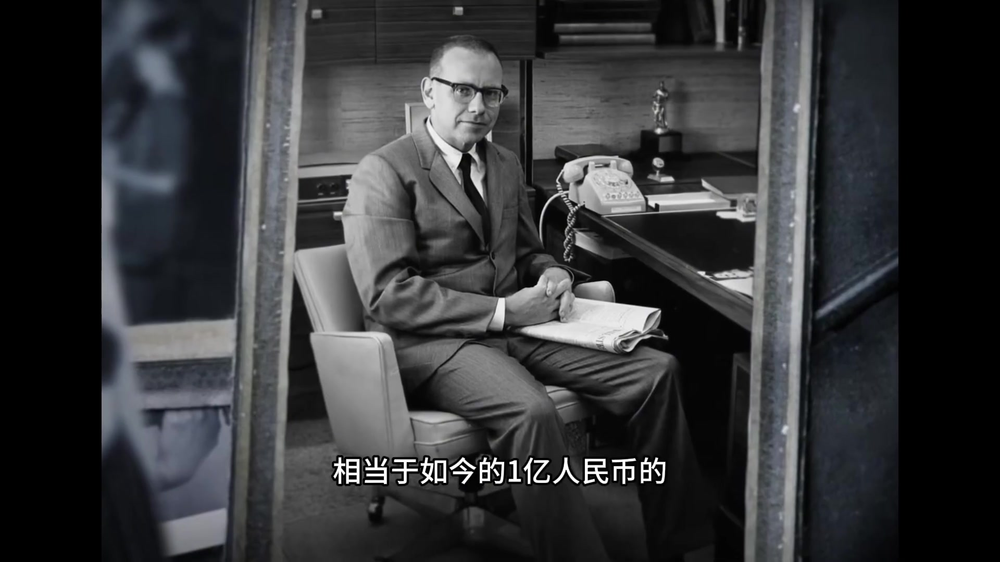

**逐字稿片段：** 1億人民幣的資產 你之前有沒有超過大佬的持倉呢 結果如何 評論區聊聊

**話題推測：** 顯示巴菲特30歲時累積的資產額。

---

## 00:01:37

**逐字稿片段：** 想拆解巴菲特長年的具體打法 記得關注 我們下期聊

**話題推測：** 預告下期影片內容。

---
