# yutinghaofinance_6weg9-YmGVs — 關鍵畫面索引

- 來源逐字稿：[yutinghaofinance_6weg9-YmGVs_GT.srt](yutinghaofinance_6weg9-YmGVs_GT.srt)
- 影片：https://www.youtube.com/watch?v=6weg9-YmGVs
- 截圖數：29

## 00:00:24

**逐字稿片段：** 現在是臺北時間2026年9月4號 禮拜五早上8點三十二分 大家早上好 我是游庭皓 每天早上開盤前半小時 我們在這邊陪伴著各位 一起解讀國際財經新聞 時事變化 那一早再跟投資朋友宣傳 最後一次了 明天晚上禮拜六8點鐘就是 我們財經皓角第四季的聽友會了 每一個季度我們都會針對 當前行情來做一些推演 也會針對過去一個季度的 資產操作和行情判斷來做檢討 那同時也要做一些前瞻預估 我們直播分享很多市場動態是沒錯 但個人的實際觀點通常 都會在我們的訂閱系統 或者在聽友會當中來做分享 短期波動都是這樣子 最近盤還有點悶 不過長期一定會依循著某些規律 我們在聽友會當中 就是去尋找這樣的規律 如果大家常聽我們直播 對於我們的內容有興趣的話 歡迎也可以來到我們 的網站來下取訂單 好那禮拜六就可以在直接線上做收聽 或者對於我們內容更多興趣的話 也可以加入我們的訂閱系統 裡頭除了有一整年的聽友會的收聽權 還會有一些個人資產部位周知 一些專題影片 宏觀專業報告 其實有時候現在所下的決定 你也不用完全的看死ai 100%一定會怎麼樣 看好個股一定會怎麼樣 一樣是分析幾率的大小 我們過去常舉過例子 你在討論一個比如已經很 貴的蛋黃區房價的時候誒 投資人經常會講說 這個房價 比較高的幾率會上漲 下跌的幾率比較小 可是這並不是所有投資 都是漲跌幾率大小的問題哦 以前巴菲特舉過一個 比較極端的例子 那個俄羅斯輪盤 就是最早是把一顆子彈放到一把 有多個彈倉的左輪手槍裡頭 那就隨便轉的彈倉嘛 然後最後你就把槍口 對準自己的太陽穴 那看誰的運氣最壞會遇到那顆子彈 好那假設呢 有99%的幾率 你都可以賺到1,000萬 就是你只要沒有射中你 你就可以把這1,000萬拿走 跟你有1%的幾率有可能射中自己 哦那是從幾率角度而言 那當然玩這場遊戲好像很適合 可是如果一輸 就會千金散盡 那這場遊戲還玩得下去嗎 好所以對於投資來說 賺錢的幾率大小 它並不是判斷投資價值的唯一標準哦 賺錢的時候能夠賺多少 賠錢的時候能夠賠多少 它也是一個非常重要的因素 所以有時候我們面對AI行情 針對個股的選擇 其實面臨到這樣的一個挑戰 你知道大方向在哪裡 可是還是有很多人在 今年7月份就被洗掉了 這是我們後續會探討的方向 歡迎大家有空的話可以來一起參與 好我們回過頭說美國股市 這一波在昨天稍微反彈 主要還是來自於 美債殖利率的稍微回落 誒 9月份的降息預期 誒不是講降息 升息預期從60%下滑到50%了好 這一次不管是聯準會理事華勒的談話 有明顯情緒的改善 他說現在呢 的確我們的通膨數據還是 比FOMC的目標值來的高 不過近期的數據已經有 開始通膨降溫的跡象 那未來兩周如果公佈的 數據延續的這樣的一個趨勢 那麼也許9月份的升息就往後延了 跟我們的過去的預判差不多 雖然大家一直認為要它升要它升可是 真實我們知道 華許這一次的談話 其實跟前幾次FOMC也沒有太大區別 真正的問題來自於股市 股市很悶 不只是台股 美國股市也有這樣的感覺哦 我們看最近市場 並不如同大家原本 想像中的那種漲勢擴散 在第三季的做夢行情順勢爆發 並沒有發生這樣的事情 更像是資金在不同族群 當中玩那個搶椅子 從6月下旬以來 我們看資金從科技AI就已經

**話題推測：** 顯示節目開場資訊與日期時間

---

## 00:04:09

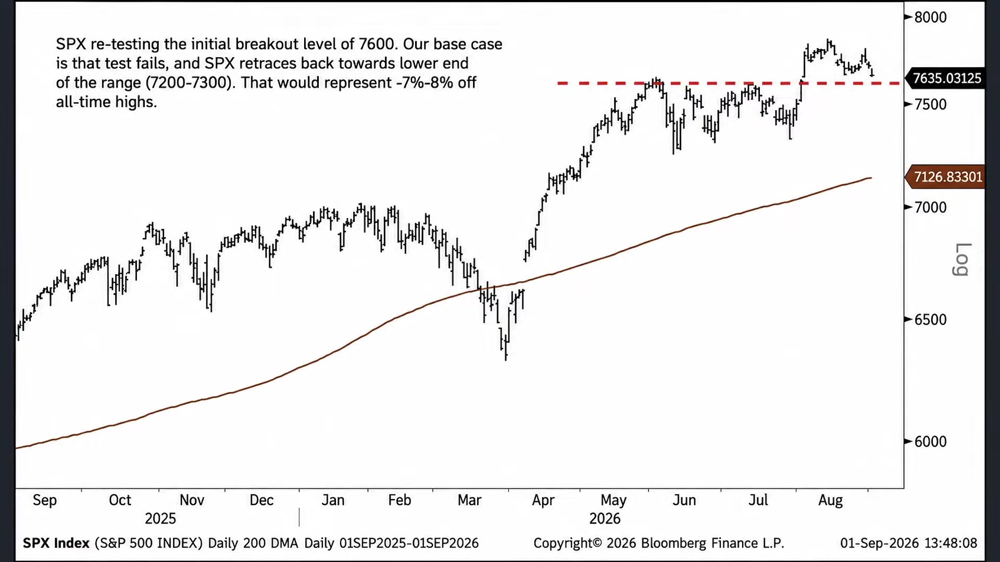

**逐字稿片段：** 逐步地轉往景氣循環和價值股 標普500指數大概還在6月2號附近 那市場廣度反而開始惡化了哦 有一陣子市場廣度是全面 拉升就是從原本的AI持續的 全面外移到所有板塊當中 然後不斷的高速輪動 不過現在呢 感覺整體而言 族群的輪動感正在降低 變成單一個股的表現機會了 那尤其現在量能又在縮 然後之前我們提到比特幣好 當時關鍵關卡就卡在7.6-7.7萬美元左右 所以指數還沒有大跌 不過市場內部很明顯有 內部分化的局勢存在 同時間也少了那個AI內部的輪動感 好台股其實也差不多 台股最近創高的股票

**話題推測：** 顯示資金從科技AI轉往景氣循環和價值股的趨勢圖

---

## 00:04:53

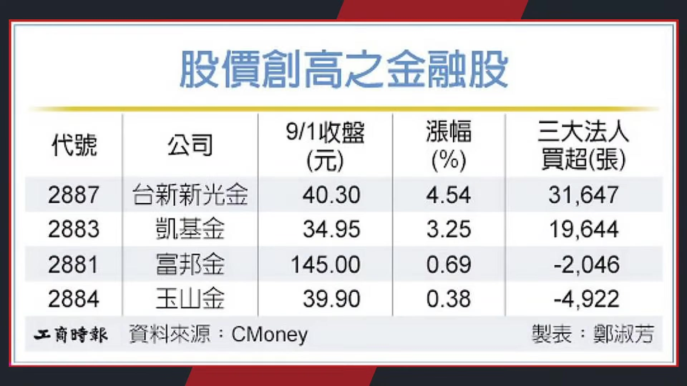

**逐字稿片段：** 嗯很多都是金融板塊嘛 哦那如果是防禦型的 金融板塊來順勢帶高 那其實就代表著市場的避險 情緒還是比較濃厚一點的 我們看從8月下旬 進入到法說旺季以後 富邦金是最早在 8月24號法說之後 隔日股價沖高 那凱基的部分是9月1號創歷史新高 台新星光金是最近開始加入 所以金融股的創高 當然也不是壞事 長期股價都要創高 可這個節骨眼上有 比較顯著的外資買盤 哦那你就大概可以瞭解市場 現在對於臺灣市場的態度 尤其外資而言也是如此 再來看看造成這一波6月7月 份股價大跌的根本板塊

**話題推測：** 顯示台股金融板塊創高表現圖

---

## 00:05:35

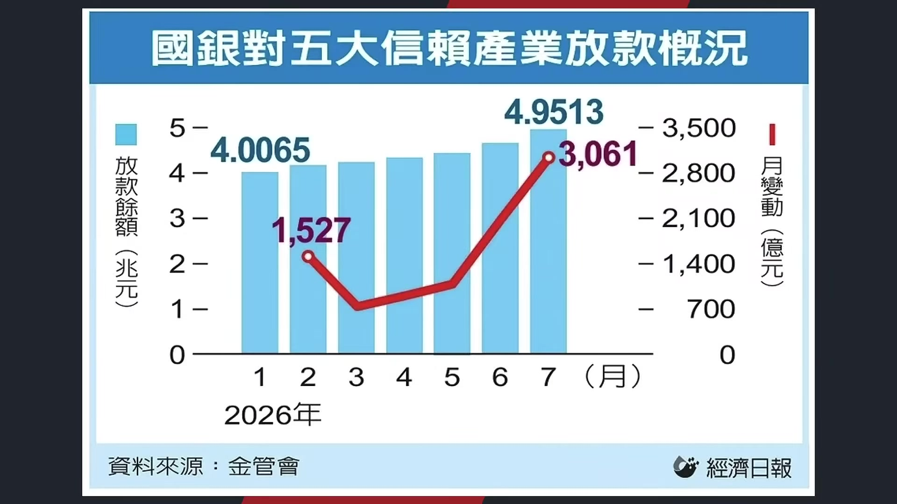

**逐字稿片段：** 就記憶體族群 其實也是目前處於盤整格局 你看最近 AI供應鏈裡頭 最值得注意的現象就是

**話題推測：** 轉換到記憶體族群的股價分析

---

## 00:05:43

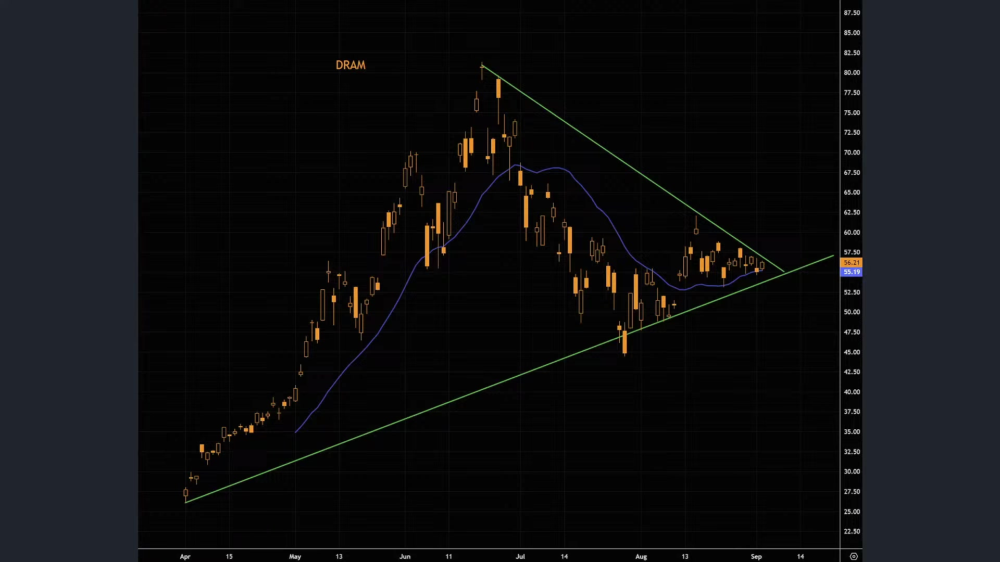

**逐字稿片段：** 記憶體的實體報價還在走強哦 可是相關的股票已經停止上漲了 我們從過去幾個星期來看 不管是DRAM相關的標的 三星SK海力士還是美光 股價大部分都已經進入到整理 那當然了 基本面跟股價當中出現一段落差 是不是代表著要麼就股價要補漲嘛 要麼就是 低潤實體合約價遲早要往下彎 但是至少可以觀察 市場上量能推不動 無法回到五六月份的水準呢 那基本上就卡在這樣的位階 我們舉幾個例子來說 現在一個比較重要的訊號 就是一般產品如果價格漲太多 客戶就會開始砍單 延後採購 最後形成需求破壞嘛 那現在的記憶體價格 一直到7月底 一直到8月初 到目前為止哦 都還沒有真實反映這種現象 就是如果股價下跌 是因為後續會有利空傳出來 到目前為止哦 一個都沒有 所以基本面強不代表股價天天會漲 但至少可以看得出來 基本面上行的趨勢 完全沒有停下來的跡象 我們舉幾個例子來說

**話題推測：** 顯示記憶體實體報價與相關股票走勢的對比圖

---

## 00:06:46

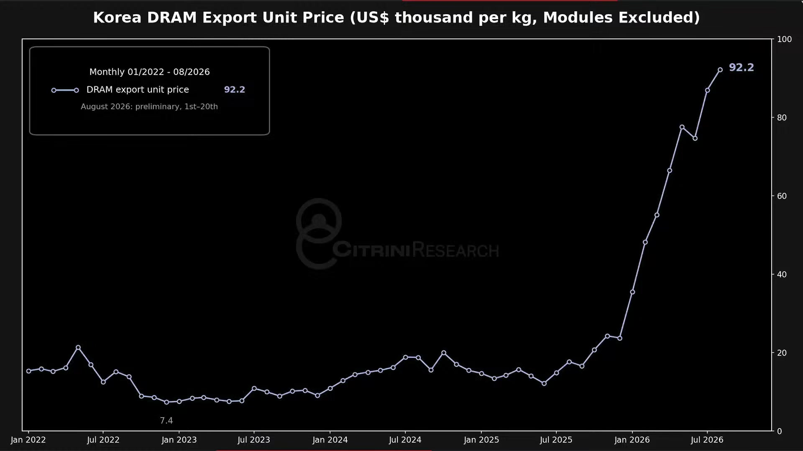

**逐字稿片段：** 你看韓國的低潤的出口單價 我們用每公斤來看 每公斤當時在25年下半年呢 大概還不到2萬美元呢 到26年8月 哎已經來到9.22萬 還在創高 完全沒有停下來的跡象 這使得傳統的低潤供給更加來得稀缺 那如果從股價來看 三星目前就在一個很壯的位置 因為股價還在長期上升趨勢線附近 不過現在有點類似 那個錘頭線的k棒形狀 代表的是低檔有承接 但明顯也沒什麼人真正想要追高 大拜就是低本一筆買盤

**話題推測：** 顯示韓國DRAM出口單價圖與具體數據

---

## 00:07:19

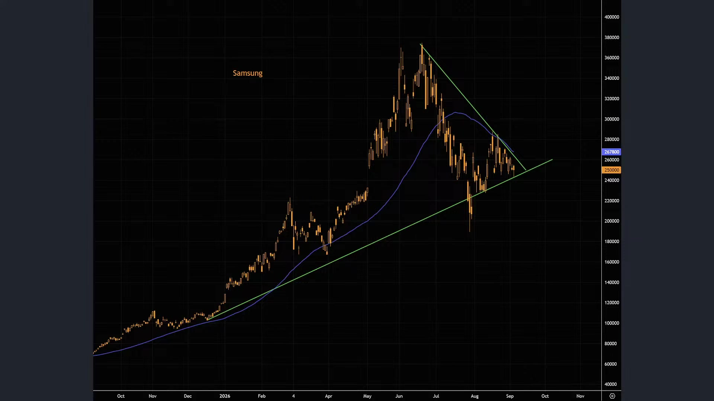

**逐字稿片段：** SK海力士情況也非常類似 同樣卡在長期的上升趨勢線 和短期的下降趨勢線之間 而且50日均線還是明顯高於目前股價 所以是有均線反壓的那再來 相較之下 美光的數據就稍微好看一點點了 美光同時處於長期的上升趨勢線和 前波高點以來的下降趨勢線之間不過 現行至少比三星SK海力士好看一點呢 好不過呢 我們也知道美光 在臺灣 因為現在有一半的產能呢 而臺灣是否會有大規模的調薪行動 或者獎金的發放 這會不會影響到接下來的 運營計畫 我們拭目以待 不過從三檔股票都看得出來 整體波動率 其實大家都在下滑 追高意願不是特別強 你看前一段時間 韓國散戶追逐半導體和AI概念股 當時投機熱潮很強嘛 結果你看VIX 現在一路的滑落 誒已經滑到今年3月份左右的水準了 所以你也不感覺他特別緊張 很恐慌現在的跌幅 可是他也沒有意願再重新追高了 從韓國股市券商的帳戶存款呢 大概是回到接近25年年底的水準了 你說那從位階來看還是很高 因為記憶體行情從去年就開始漲了 沒錯了記憶體行情從去年大概從總 券商存款大概60兆韓元哦 一路上升到140兆韓元附近 所以韓國股市的散戶雖然相對於 今年五六月份已經淡化很多了 不過相對於去年還是偏高了 至少從帳戶的證券的存款餘額

**話題推測：** 顯示SK海力士股價走勢圖

---

## 00:08:50

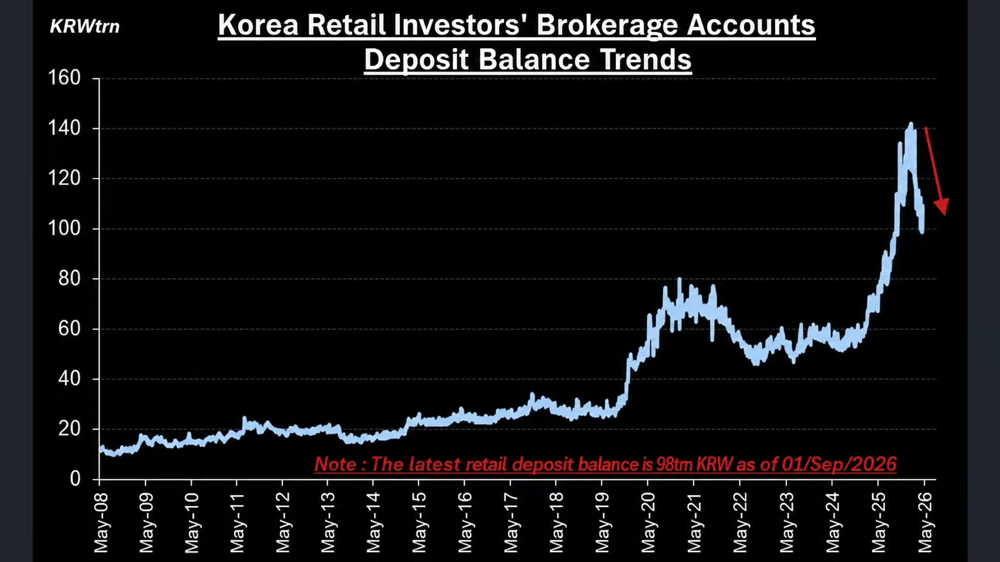

**逐字稿片段：** 而且今年韓國股市有80%的 散戶居然是賠錢的 而這裡很神奇 今年到目前為止 韓國股市就僅次於臺灣股市 漲幅還是有50%左右 好所以這說明的時間買不對 即便 漲幅今年以來非常漂亮 還是有可能會顯著負報酬 那這種環境最有意思的 地方就是基本面很明顯 沒有任何的惡化 但股價已經把情緒先洗掉了一輪 如果記憶體價格維持強勢哦 雲端資本巨頭沒有轉弱 那你說這些股票有沒有機會再漲 我的根本看法是哦 三星總有一天股價會創高的

**話題推測：** 顯示韓國股市散戶賠錢比例與市場漲幅數據

---

## 00:09:24

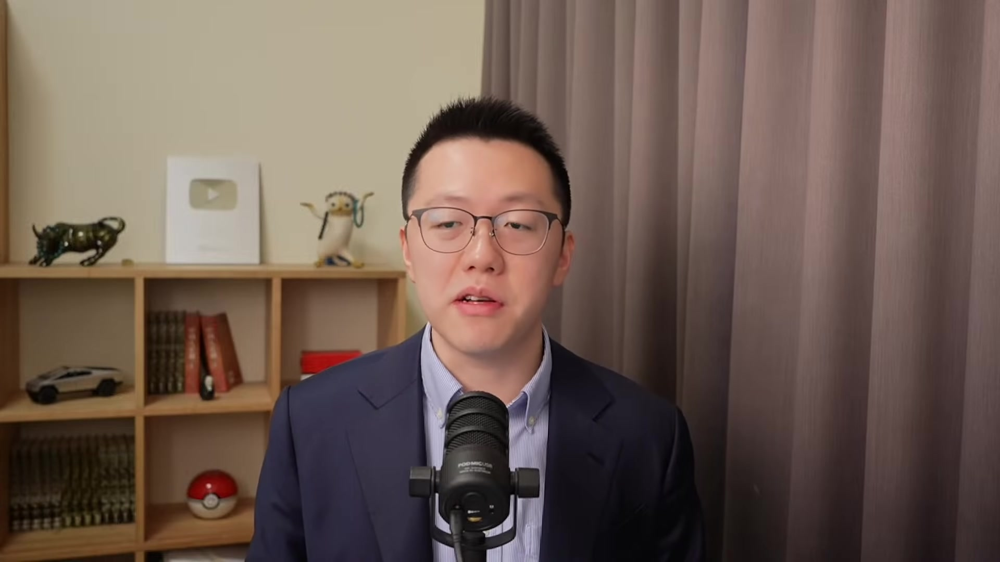

**逐字稿片段：** 台積電總有一天股價會創高的 雖然都悶了一陣子 但是至少我們可以看得出來 整體而言 在長期的多頭合流圖當中 不是每個人都可以待到最後 即便你看好長期 你可能就被洗掉了嘛 那當然了 我們也知道中國記憶體 現在市場上最擔心的 就是擴廠速度加大 會不會導致原本在2031年到 2033年可能達成的供需缺口完成 提前到29年或者28年提前發生 我倒不是這麼認為的 因為中國記憶體就算現在擴產 也主要是供應國內 我們看長鑫存儲的確在

**話題推測：** 提及台積電股價走勢

---

## 00:09:57

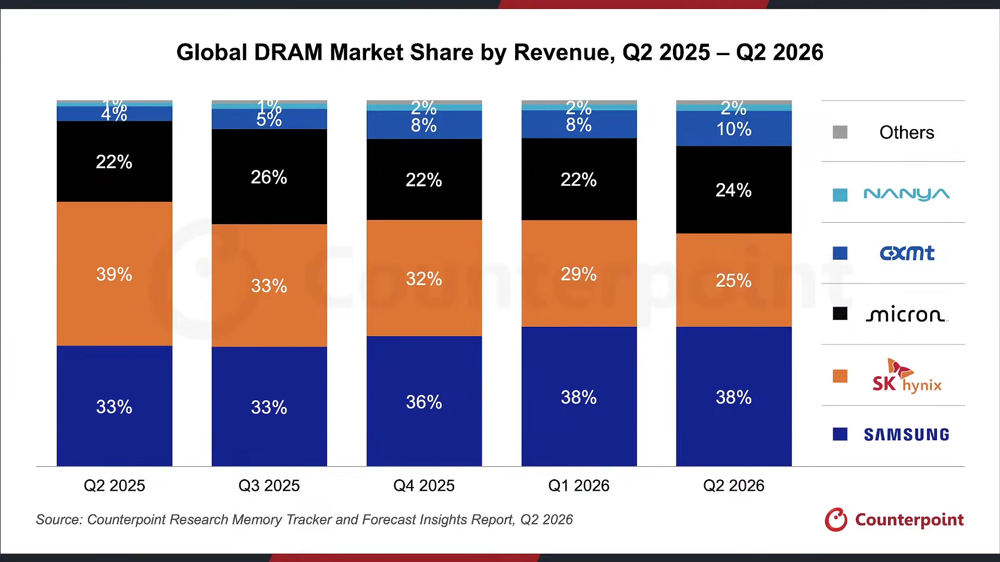

**逐字稿片段：** 第二季的全球DRAM營收市占率 前一年是四% 哦這一次到10%了哦 其實上升也蠻快的 翻了一整倍 三星SK海力士和鎂光合計的 市占率是從994%下滑到8%7 那如果是看NAND快閃 長鑫存儲的市占率是 從9%上揚到14% 哇它超過Sandisk了 好所以的確 這是市場上比較擔憂的方向 假設蘋果最後會向中國廠商來下單 而且美國政府也不阻止的話那的確 在2030年以後的市占率變化 會不會大幅影響到這些GET廠商 是有可能的 可是現階段而言 大家都在增量市場了 讓一點市占率給你 都不會影響到我的獲利暴升程度 因為大家都在缺貨 好所以這第一個部分 就代表的流動性某種不足 導致現在即便合約價還在上行 但市場的追價意願已經越來越滑落那 第二件事情就要聊的是 那就代表著總體環境 看起來錢就是沒這麼多了 誒沒錯 如果我們衡量實質貨幣成長和

**話題推測：** 顯示長鑫存儲DRAM營收市占率及其增長

---

## 00:11:01

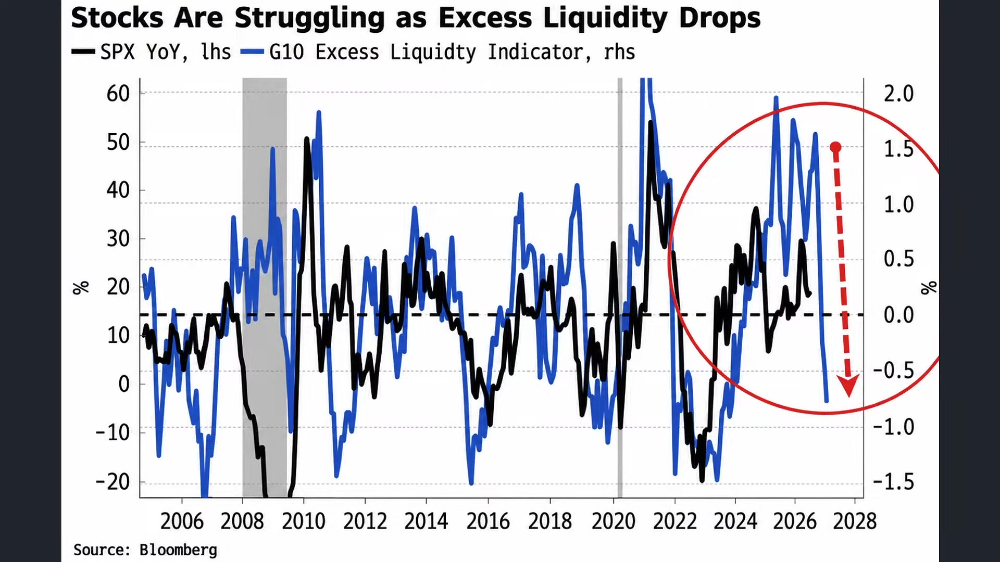

**逐字稿片段：** 經濟成長當中的超額流動性 早在6月中旬左右已經 默默地跌入到負值了 那這個指標它通常是 領先風險資產3-6個月 這代表著現在逐步 對於股票市場產生影響 全球的金融條件其實也在收緊 包括實質利率普遍上升 臺灣你的借貸額度 我們也的確 除了房地產稍微沒有這麼嚴重了 相對於前兩年 但是我們知道 在臺灣不管是信貸 還是不限用途借貸 整體而言收縮程度 不是利率問題 因為你現在報酬很漂亮嘛 利率從3%到4% 可能很多人都不是很在乎 大家更在乎的是額度呢 你說你給我兩%的 質押利率 告訴我50萬額度 那那有什麼好借的 所以就會變成這種情況 最終就是大家借不到錢 全球信用市場都在收縮 流動性就缺少了進一步的推升 尤其美國是主要靠 實質利率的大幅拉升 所以讓大家的借貸意願也 沒有像前陣子這麼高了 另外一方面 流動性的預期 它會反映在通膨數據對於加息的影響 如果通膨居高不下 或者通膨預期持續拉升 那麼大家認為呢 這個要寬鬆的步調就 有可能因此而放緩

**話題推測：** 顯示實質貨幣成長與經濟成長中的超額流動性趨勢圖

---

## 00:12:13

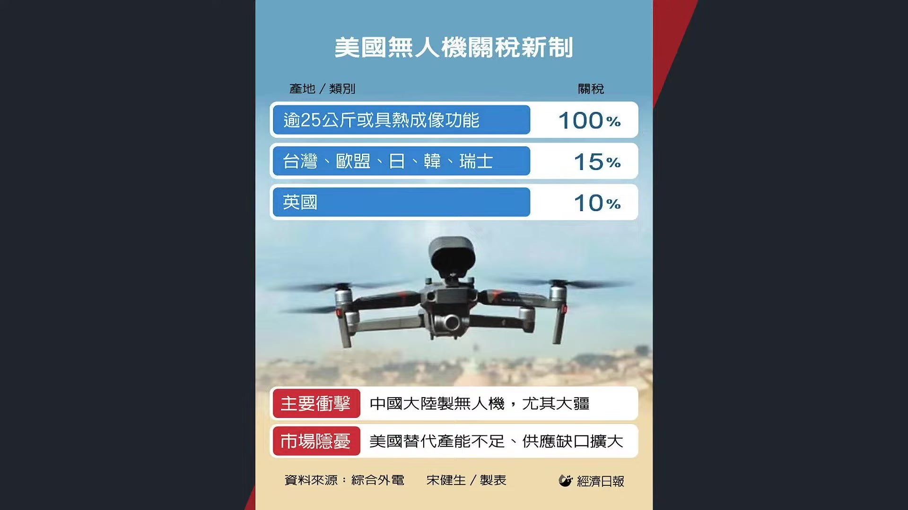

**逐字稿片段：** 這兩天川普正式啟動了無人機關稅 從9月3號正式生效 超過25公斤或者使用熱 成像技術的無人機 會被課征100%的關稅 那主要是針對中國市場產品 大疆本身就占了全球 商用無人機70%以上 好那這一次比較策略是 打中共扶盟友 因為臺灣歐盟日本韓國 瑞士的稅率只有15% 那問題來了 那我們的比較貴嘛 所以你說因為這樣子 就沒有通膨傳導嗎 也不是而且他還是扣了15% 所以第一件事情就是全球的 商用無人機在美國的版圖 產生大規模改變 我們知道其實在這之前 其實我們也知道 那很多美國員警 一些公務機關 它也是用大疆嘛 所以要全部改用台款歐款日款韓款 那我們就看一下 第一是戰略的擴大第二 那一定會有價格層面的傳導 那另外一方面是232關稅 陸續即將要出爐了 那臺灣的應應方向當然了 昨天魯特尼克已經講了嘛他都說 臺灣現在正在赴美投資

**話題推測：** 顯示美國對中國無人機課徵關稅的新聞

---

## 00:13:15

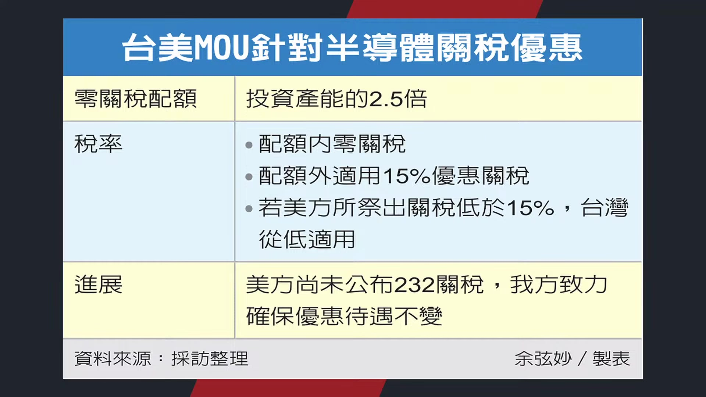

**逐字稿片段：** 換取關稅豁免 那看起來就是我們只要赴美 應該關稅就能夠豁免 至少維持在15%嘛 所以等到本月底的232的關稅 課征基礎陸續出來以後 臺灣應該不會受到太大影響可是 那美國會不會有進一步通膨傳導呢 好這些事情 都是讓聯總會被迫保持 緊縮的一些次要原因 當然主要原因還是

**話題推測：** 顯示台灣赴美投資換取關稅豁免的政策說明

---

## 00:13:36

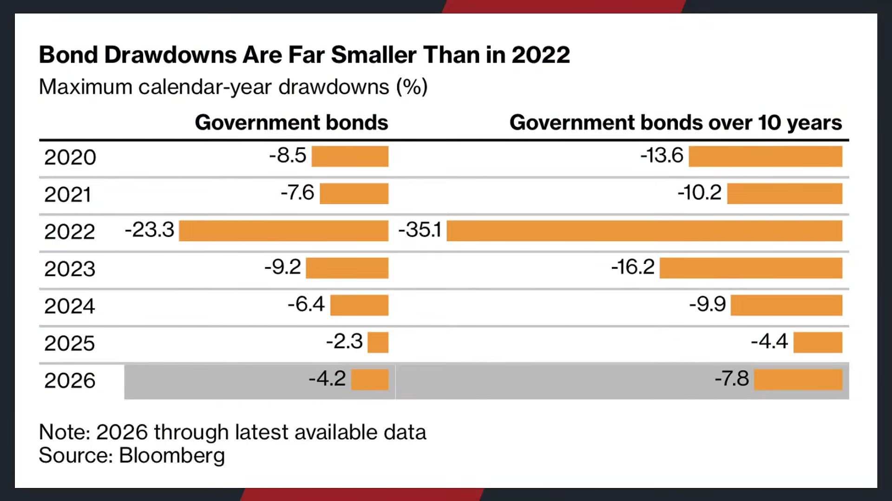

**逐字稿片段：** 來自於債市的拋售潮 那跟投資等級債的發行就有關了 因為10年期公債殖利率現在 就在4.7-4.8附近持續震盪 日本10年期公債殖利率碰到3% 本世紀第一次碰到 英國和德國10年 期殖利率也分別升到5.28和3.39 但是我們還是要這樣講哦 雖然我們知道現在債券 市場還是表現很不好 但是這一波債券市場的債災 就應應該應該叫股災嘛 這個叫債災 程度哦仍然遠低於2022年 你看當時全球市場 債券市場的總體跌幅是23.3% 如果是政府10年期公債是跌35%所以 現在跌4.2 7.8 其實相對於當年還是稍微好一點 現在其實是利率保持在高檔 而並不是一個債券的崩跌 所以產生全面性流動性 收縮還是有點難度 它就是一個央行貨幣環境偏緊的感覺 但好處是什麼好處是 至少現在 聯總會理事們所透露的感覺 不會立即要升息的地步 9月份原本升息幾率60%哦哎

**話題推測：** 顯示債市拋售潮的圖表

---

## 00:14:39

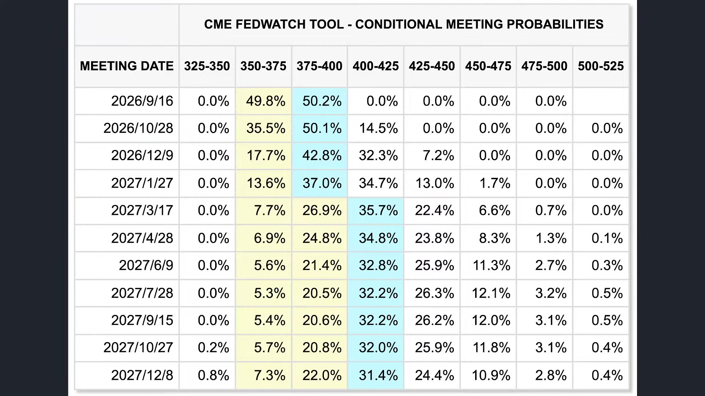

**逐字稿片段：** 最近回到50%了 再往下一點點 搞不好9月份就不會升了 這是有機會的 好所以不管怎麼說 這些訊息 它都導致了另外一層效果那就是 債券問題不解決 股票市場的問題也無法立即的轉好 那如果債券問題借由國家 力量的幹預把它解決了 那股市會因此而好嗎 那這個時候就要取決於匯率的變化 為什麼要這樣講呢 因為全球針對美元的市場賣壓 它會取決於對於債券市場的控制 假設呢 由於回購的力量 硬是撐住了債券殖利率哦 那麼市場對於你的信用還是 要在其他資產層面展現嘛 你要我維持住目前債券的評價 那美元就得貶嘛 這過去我們提過相關的概念了 就是 用其他方式來補足我 對於你要求的風險溢酬 你不給我更高的實際利率 你只給我適度買盤做支撐 那我就在美元的貶值 來換取我的風險溢酬 所以在這樣的效果底下 全球剛好現在美元的普險呢

**話題推測：** 顯示9月份升息機率從60%回到50%的圖表

---

## 00:15:38

**逐字稿片段：** 也大概來到了十幾年的低點呢 這個時候就會變成 一旦避險回補 就可能形成新一波的美元賣壓 好美債的跌幅跟美元 它是相互聯動的 假設沒有避險情緒的突然爆發 或者說 市場上突然也爆發一場戰事的話 我們看日本加拿大臺灣澳洲丹麥芬蘭 六個市場的大型退休基金和保險機構 截至6月底對外幣的 資產平均避險比例哦

**話題推測：** 顯示美元普險（避險比例）來到十幾年低點的圖表

---

## 00:16:03

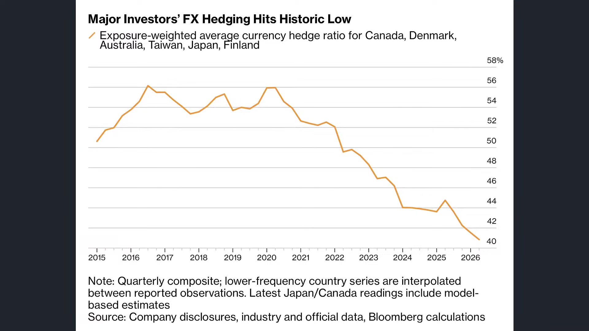

**逐字稿片段：** 大概只有41%哦 這是15年以來的最低哦 那這些市場合計大概有4.6 造美元的外幣資產 其中很大一部分是 美國債券和美國股票 大部分是債券了 那過去投資人不願意避險 因為美元在市場動盪的時候會升值嘛 而且避險成本很高 現在兩個條件都在改變 第一是美元本季度已經下跌2.4%了 市場會擔心美國政策 可能會削弱美元價值 同時縮小美日的利差 那這個時候就要做避險了 那第二個就是日元投資人的 三個月的美元避險成本已經從 23年10月份的高點6%下滑到2.75 歐洲投資人下滑到1.32 那你要知道 臺灣這麼多壽險業 如果美元突然暴貶 哦那匯兌的影響 收回來的錢就會形成極大壓力 因為美元不值錢了嘛 那你還要繼續發那個保單的配息 儲蓄險的配息 誒這個時候就會形成壓力 所以我們仔細觀察 你像臺灣的部分 臺灣壽險哦 海外曝險是非常非常龐大的 但問題在於它的匯率 避險還是不到一半 在全球主要機構投資人當中 臺灣壽險業對於外幣 的曝險是6,960億美元 我這規模大概就

**話題推測：** 顯示六國大型退休基金和保險機構對外幣資產平均避險比例為41%的圖表

---

## 00:17:11

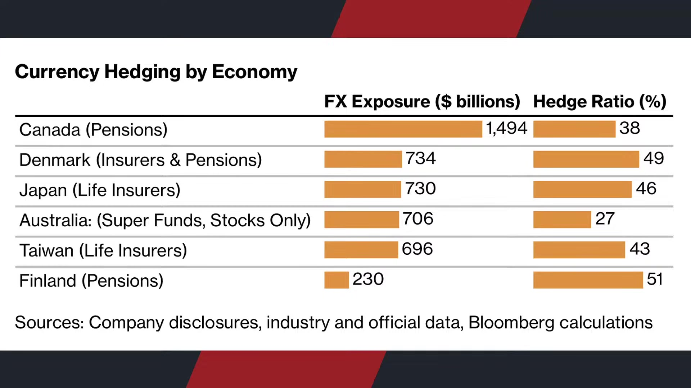

**逐字稿片段：** 僅次於加拿大的退休基金 丹麥的保險基金 那這也說明著臺灣的 匯率避險比例43% 還是有比較大的一個壓力哦 那未來美元的暴貶呢 就有可能陸續的 回過頭來做影響 那這會不會讓臺灣市場的壓力變大 哦當然會 我們看彭博最近所做的專題哦 臺灣壽險業現在管理的 資產大概是1.2兆美元 其實很龐大 規模比臺灣一整年的GDP 甚至還要來得高 其中有6,900億美元 光是美國公司在 哦這個就1,620億了 其他算是美國公債 或者不同的主權債 但是整體而言 我們知道 因為壽險公司哦 是我們用新臺幣賣給臺灣民眾嘛 那未來理賠或者保護提領 他要用新臺幣支付 可是我的資產端 是有大量的美元債券的 哦這個就是我們過去所講的

**話題推測：** 顯示台灣壽險業外幣曝險規模與其他國家比較圖

---

## 00:17:59

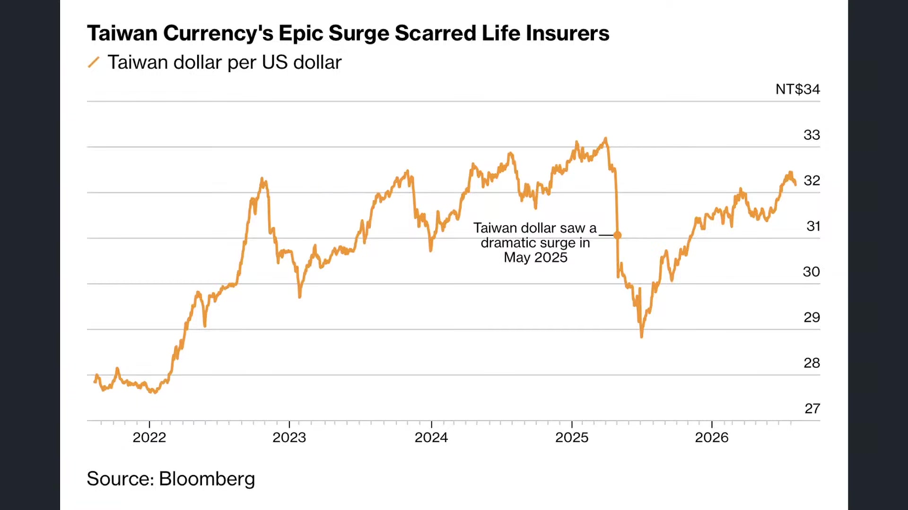

**逐字稿片段：** 叫做幣別的錯配 那什麼意思呢 就說臺灣大型公司因為 主要的配置都是在債券 你你看

**話題推測：** 解釋「幣別錯配」的概念

---

## 00:18:07

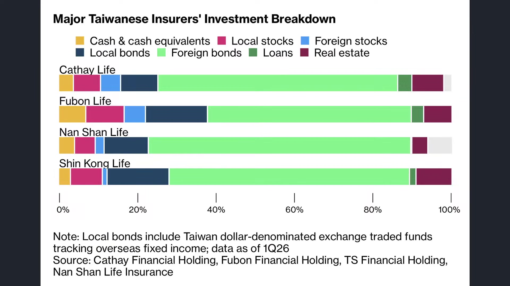

**逐字稿片段：** 看這個樹狀圖 你很明顯那個綠色區塊就是海外債券 壽險業雖然我們不知道唉 你說最近呢有買台積電買什麼 但是買股票的比例哦 可能搞不好占整體 尤其國內股票1/10的資產都不到 你像是國泰富邦南山新光海外債券 的占比大概都是50%到67%左右 如果再加上一些國內債券 那就來到八成了 所以臺灣壽險基本上就是債券大亨 那在這樣的一個效果底下 我們就清楚知道了 這個錯配問題就會逐步的產生 今天台幣急升 那這些以美元等外幣計價的資產價值 在美元貶值的情況底下 在換回台幣的時候就會大幅縮水 那這個時候帳面的 資產就會急劇的萎縮 形成龐大的未實現損益 那市場可能就會提前反映資本壓力 去年就曾經反映過一次

**話題推測：** 顯示台灣壽險公司資產配置樹狀圖，強調海外債券佔比

---

## 00:18:58

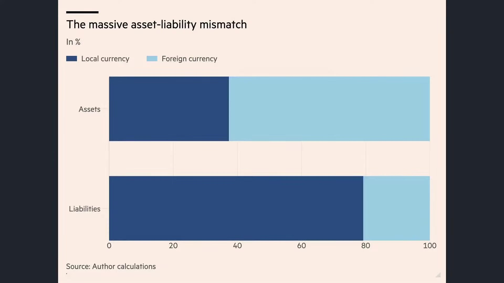

**逐字稿片段：** 你看這是臺灣目前的資產變化 整體而言 大概是30% 是屬於本幣貨幣 那麼60% 是屬於外幣資產 那在負債的層面呢 就他欠我們的保單了 60% 他 80%他還在用台幣支付嘛 只有20%他是以外幣支付 這就是比較明顯的錯配壓力 因為他欠我們的都是新臺幣 所以如果新臺幣升值幅度太快 美元貶值幅度太強的話 那麼壽險業就會遇到極大的難關 哦所以我們看到金管會最近也 開始採取了一定程度的動作 第一個動作就是 要求壽險降低 漢新臺幣負債不相稱的海外資產 簡單來講就是 不是要求壽險業不能買美債 那你要拿什麼負債去配 你如果是收美元保單 你買美金那沒問題嘛 那你一直拿新臺幣的保單 然後去買美元資產 金管會最近在呼籲 新的保單 美元對美元 台幣對台幣 那第二個動作是要求 壽險業增加美元保單唉 邏輯很簡單嘛 因為我們現在臺灣投資管道有限嘛 所以你在臺灣就不要 再發行那麼多新臺幣 你要多發行美元 美元對美元才能夠解決問題 因為我也不期待你能夠 在臺灣買到多少資產嘛 那第三呢 就是今年壽險業和金管會已經 逐漸的設定年度降低幣別錯配目標 到底要減少多少新臺幣負債連接 的海外部險來增加國內投資 那這些問題都是 美債的問題出事以後 影響到美元 美元的貶值如果快速加大 就會影響到台幣的升值 這個是金管會 目前比較關注的方向 也是值得大家留意的 好所以金融股的創高 我倒是沒有這麼樂觀了好 這個幣別是一個比較大的一個問題 那補漲當然是一個原因了 那證券手續費的交易上升 銀行的借貸量上升 它都是一個景氣好的象徵 可是它背後其實隱藏 的一個比較大邏輯 因為金融股主要就是國泰富邦 佔據了比較大的一個權重嘛 所以我們必須承認 以前壽險公司為了追求比較高的收益 就會大量的買進美元債券呢 那當時看起來只是多賺一點利息 甚至被視為穩健投資 但是我們必須要承認是 保單負債都是新臺幣嘛 資產你都是持有美元 匯率風險都留在自己身上 那我們避險的那個規模又非常低 所以新臺幣一升值 壽險公司就要承擔資產縮水 那你覺得3132往升值的 方向走的幾率大不大 哦所以 這個就是大家觀察 借鑒到個人投資也差不多了 有時候我們投資台股賺到股價價差 但是因為利息或者稅負 這個就可能賠掉 或者說你為了賺股息 結果價差就賠掉了 有人到日本買房 那想說房價上漲 賺到價差唉 結果日元貶值了 賺到的房價被匯差給吃掉了 很常遇到這樣的一個問題

**話題推測：** 顯示台灣壽險業資產與負債的幣別分佈圖

---

## 00:21:40

**逐字稿片段：** 那之前不是講一個男的 在超市買東西 發現有一個老太太一直盯著他看呢 那結帳的時候 那老太太就跟他講 不好意思 你真的長得很像我剛過世的兒子 哇男人聽到有點難過 那老太太問 你可以幫我一個忙嗎 等我離開的時候 可以跟我說一句 媽媽再見 那男的覺得小事嘛 就答應了 那老太太拿著東西離開 男生還很配合 媽媽再見 那輪到他結帳的時候 那店員說 一共10萬塊 男生說什麼 我才買兩三樣東西耶 那店員說 你媽媽說她那份你會付 所以有時候我們投資 一開始看到的只有收益 但是你真正要付出的代價 可能藏在資產負債表裡頭 看似穩定的報酬 你背後可能隨著杠杆 利息匯率或者稅負 甚至是流動性機會成本 你如果每天就盯著那個獲利數據 你就覺得是一個小事 最後發現對方的帳單 你要一起承擔 好這個也是值得我們做一些醒思的 壽險業現在面臨的挑戰就是這樣子 好按照目前好 不管是債券市場的貶值 其實如果持有直債還好了 但是很多債券相關產品的 價格不斷的蒸發以後 對於未來的新臺幣的保單 的支付就形成極大的壓力 好當然我們繼續往下看 整體來說 市場上其實更進一步關注的是 那不管如何 現在這些AI模型是否能夠讓 臺灣有不斷的資金流入 能夠緩解這種短期上的錯配問題呢 就是那你就 保單進來的錢夠快 那資產減損的問題就暫時不是問題了 因為我有新保單客戶的錢可以 做資產的配置來沖銷成本嘛 好所以在這樣的一個效果底下 如果AI持續保持隆景 這個炸彈也不一定會爆了 但是至少金管會已經 意識到正在做內部的改革 而債券市場影響到 股票市場的前提一定要優先改善 美股市昨天是稍微反彈 道瓊上漲六百二十四點 一點一八% 在53,686點 標普上漲八十一點 一點零六% 在7,747點 納指上漲三百六十六點 一點四% 收在26,584點 最後是費半 上漲12點 0.1% 在11,352點 那昨天市場上最為關注的新聞呢 當然就是Openai推出了GPT six astral模型 它宣稱說要搶回AI王座 我剛看了一下它好像 還沒辦法上線哈 好應該是部分人先上線 那他也宣稱 軟體工程和科學研究在 治安領域已經取得全面領先那 ChatGPT也發表說 這一次的意義不只是產品升級 Openai嘗試正在奪回被

**話題推測：** 分享關於「媽媽再見」的超市購物趣聞

---

## 00:24:19

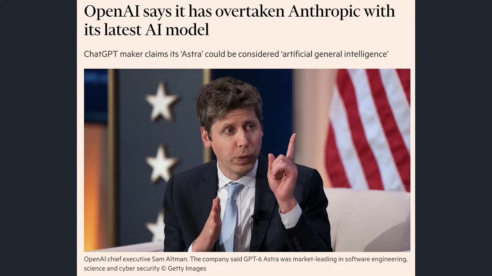

**逐字稿片段：** Anthropic搶走的技術話語權 我們知道今年呢 Anthropic的市值已經來到9,650億已經 逐漸地超過了Openai Openai大概8,500億左右吧 那anthropic呢 某種程度上 它是上市前的重要技術和估值挑戰 extra可以視為這種世代級的躍升 我看一下了 看應該過幾個小時它就會上線了 我來看一下它的 使用感到底是不是特別好 我總覺得最近那個5.6 好像有點down 而耍另外一個特點 是奧特曼提到 它會從單純的聊天模型 進一步走向真正能夠 執行工作的AI代理 那Openai也宣稱在財務 模型報稅資料中心 甚至是填表等重複性工作上 都有明顯的提升效率很明顯 它就是要跟 Anthropic在上市之前一戰高下 現在看起來是Anthropic會在10月 份到11月份左右會上市 那Openai可能要到明年年初了 但是雙方的競爭仍然在持續當中 這些事情其實也說明的 市場上針對這些新模型的發佈 但是價格 尤其是旗艦模型 看起來目前是沒有任何調漲的計畫 你推出越好的模型 但是現在記憶體價格漲成這樣 被動元件漲成這樣 你居然沒有進一步調漲價格 那你就是吸收成本 那你的債務壓力就會持續的拉升 那市場上就會進一步的去推敲 到底我們現在的算力付費牆 付款牆何時會到賬呢 因為今年是自由現金流剛剛轉負嘛 那明年就會加大 那明年來不來得及扭轉 這種自由現金流惡化的跡象 就成為市場上的關注重點了 我們具體來說 現在很多人會把現在的 貸款週期的付款週期拿來跟07

**話題推測：** 顯示OpenAI與Anthropic市值或技術話語權競爭的圖表

---

## 00:26:01

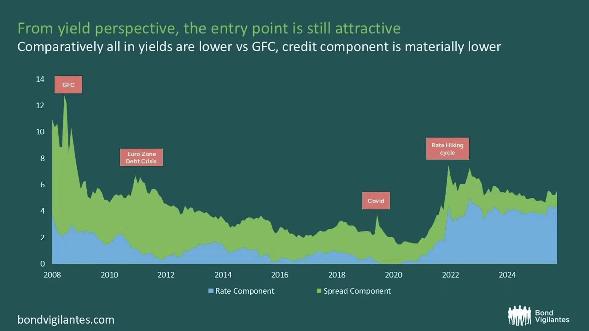

**逐字稿片段：** 07年到08年來進行對比哦 那因現在其實也很像嘛 之前是買預售嘛 然後包裝次包裝成次代產品 那現在呢 是大量的算力合約 是先簽約後付款嘛 尤其Openai和Anthropic已經 公開簽下了巨頭多年的算力承諾 那真正的付款通常要等機房完工 供電到位 算力正式交付之後才開始 所以明年會有第一批的 智料中心開始逐步的精簡完成 那Openai現在所欠下的錢到底有多少呢 我們來細節看一下 真正的財務考驗呢 其實Openai今年都還算還好 從05年到 26年 05年大概是110億美元 而且還好 它市值就已經高了三倍 2026年是370億美元到 一口氣挑戰27年是1,320億 28年是1,690億 29年是2,010億 2030年是2,110億 看得出來 26年到30年大概是7,500 億美元的一個資本支出 光是Openai一家公司那這些 支出呢主要是來自於雲端 這種合約的直接採購 那基礎設施交付之後才要全面的付款 要不然先前都先不用付哦 它只是記在帳面上而已 因此呢現在重點速度來自於 那未來幾年營收毛利和現金流 的成長速度能不能追上每年 超過2,000億美元的算力承諾 不過呢 至少第一批的付費期哦

**話題推測：** 顯示當前貸款週期與2007-2008年對比的圖表

---

## 00:27:28

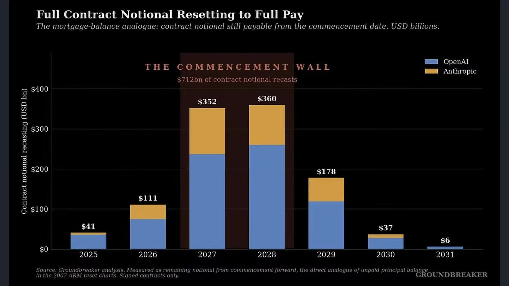

**逐字稿片段：** 如果我們從圖表來做觀察 就會發現差不多就是明年的 明年和後年是要繳最多錢的 所以從算力交付之後開始 承擔的剩餘的合約名目價格 你看21年才410嘛 26年1,100 27年就3,500了 28年3,600 然後29年30年看起來會有第一批建制潮 新建之後的滑落看了 搞不好到時候又增加了可是 明年和後年是第一批的大量付錢時期 所以這一次推出旗艦 模型有個重要意涵嘛 搶奪市占率 而且我猜啦 27年28年哦 應該要調漲價格了 再不調好 他就沒有能力付出這些錢了 付出這些訂單的算力採購合約 那當然Openai面對的不只是高速成長了 是你要先超過Anthropic 超越之後 搶奪市占率 而且價格還要陸續的做抬升 如果不提升 那就代表著市場的需求 一定要毫無止境的大爆發 那我們當然就要觀察 一下後續產生的效果 不過呢 這些事情呢 其實都看得出來 大家都覺得自己只要 提前下一張算力合約 為未來的AI成長預留一些資源 雲端公司相信模型業者能夠付得出錢 模型公司又相信營收能夠快速成長 然後晶片商又相信 算力需求會不斷的增加 這場遊戲是這樣子一開始玩下去的嘛 那每一家企業都用同樣的 樂觀假設擴大承諾以後 那個量級就很龐大嘛哇 要一間企業未來三年要投8,000億 那很大筆一筆錢呢 所以一個人做一件事情 本來就是認為影響很小 小到幾乎可以忽略 但成千上萬的人現在 都做出同樣的選擇 韓國人買AI股 那雲南公司 相信模型業者會賺錢 我們作為晶片商 不斷的相信算力需求而擴產 最後就形成一股足以 改變市場和社會的力量 好可是 第一波考驗就真的要來了 因為明年就真的要開始第一批 治療中心蓋成之後的付款單 到賬了所有人都採取相同做法 當然會推高價格 累積債務 但是速度和效率也可能會因此而加大 所以我們就看到時候的跡象了 但是至少可以觀察出來 好現在就是我們要承擔過去兩年 大家都相信AI之後的後果了 迎來第一波挑戰 那有點像那個 最近不是那美軍去芭提雅嘛林肯號 250天的海上任務嘛 然後到芭提雅附近 5,000名美軍官兵終於 踏上陸地展開休整了 我聽說了 我聽說人家在講說那個 一群大兵 那的確想要找一些樂子嘛 但不一定每個人都很喜歡亞洲人 所以很多美國大兵他 本身還是喜歡白人嘛 那有時候找那公關 那公關就問他 哎你想要 這邊比較多白人是 那個俄羅斯和烏克蘭的 還問那個大兵說你比較支持 的是普丁還是澤連斯基 哇那大兵說這有什麼講究嗎 他說你的每一個選擇 都會影響世界格局 你選擇俄羅斯的 那俄羅斯的妹子就會把資金寄回去 變成子彈 打向烏克蘭 你選擇烏克蘭的 她就會寄回烏克蘭 購買軍火反抗 我那很多那個大兵猶豫老半天 而且影響真的很大 想不到一次選擇居然有 可能是三戰的導火索 後來想想不能夠破壞世界格局 兩個都一起選了這樣 所以我們看了 先生真是大愛 還風險對沖 那我們講的其實就是現在的格局 那每一個人呢都 同時做一件事情 看起來影響很小 小到幾乎可以忽略 成千上萬的人都做出 這樣的一個結果之後 個人行為就不是簡單加總了 它就變成一股足以 改變市場和社會的力量 好所以我們現在看到的AI模型就是前 兩年我們現在都選擇同一個敘事 那後兩年呢 我們當然就要承擔第一波的結果 檢驗一下 付不付得出來 如果付得出來 生產力有效的提升 那我們下一場遊戲就繼續往下投嘛 這個就是第一波的檢驗 我認為合乎常理 給投資朋友多些思考了 好

**話題推測：** 顯示算力交付後開始承擔的剩餘合約名目價格圖表

---

## 00:31:30

**逐字稿片段：** 臺北股市上漲582點 收在46,439點呢 我們今天聊的範圍 主要是從整個債券市場的流動性稀缺 還有產業 以及股價內部價格的分化來 看待市場的防禦性買盤已經出現 但是它的根本原因還是來自於債券 市場的買盤消失導致的流動性緊缺 全球錢變少以後推 不太動量能開始減弱 但是呢這個量能減弱的過程當中 其實市場還是有一絲的希望 如果明年這些企業真的能夠把現在 過去幾年過度投射的預期 能夠真正的拉升 那也許下一場遊戲就玩得下去 現在市場上其實就是停停看停而已 來看看你明年付不付得出來 這給投資朋友做一些思考 那每個禮拜我們通常都會 跟投資朋友導讀一本書

**話題推測：** 顯示台北股市上漲的數據

---

## 00:32:16

**逐字稿片段：** 今天介紹的這本書 叫做智慧通膨下的新商機

**話題推測：** 顯示本週推薦書籍《智慧通膨下的新商機》書封

---

## 00:32:22

**逐字稿片段：** 好是 這個是程世嘉先生的新書 好那我們以前導讀過他的書籍 好那這本智慧通膨很有趣 而是從比較特殊的觀點來看 講的不是人類變笨了 講的是AI會讓知識分析和 內容的供給突然暴增好 過去你作為一名律師一名顧問工程師 之所以能夠取得高薪 是因為他們掌握掌握了 一般人沒有的知識和判斷 但你現在打開AI 不是幾秒鐘就可以看得出來 一份好像很專業的報告 法律說明或者投資分析 大家都能夠得到至少像樣的答案 答案本身不再稀缺 那問題出現了 AI可以提供很多答案 誰來保證這個答案是對的呢所以

**話題推測：** 顯示作者程世嘉的資訊

---

## 00:33:05

**逐字稿片段：** 確定性就會變成很有價值的原因嘍 因為AI生成的內容 它可能非常的流暢 但它不代表沒有任何錯誤嘛 它可以整理大量的資訊 卻不一定知道哪些數據可信 它可以提出很多的 給你我們 投資都會問 稍微問一下投資建議 但是你問完之後 你通常都會回過頭來確認 一下他講的數據是不是真的 因為什麼 因為他不會替你承擔虧損嘛 那當資訊越多 答案越快 真正願意讓人付錢的 那不一定是AI 真正願意讓人付錢是什麼 有人可以確保AI 生成出來的數據 它還可以説明你排除錯誤 確認風險 並且在結果出問題的時候負責 好所以你想想看 金融醫療法律 治安工業控制這些產業 它不會因為AI能夠回答問題 它立刻變成免費的服務 客戶不會只想要買一個資訊的 他是我能不能相信你這個結果 我能不能知道一件事情出事了 永遠知道你就對了 這在臺灣可能比較不明顯呢 在中你看在中國在美國 比如說你從加州 有的要飛到紐約去看一個機房 發現就是一個線沒有插上 把它插上去了 你說這種問題不是很好取代的嗎 沒有他買的就是那個信任感就是 有任何問題 我隨時call你 你會親自來我公司幫我把線接上 即便我只是忘記插了一條線 所以我們看到最終 這個AI產生的競爭力 它不只來自於AI可以 協助醫師來閱讀影像 但是病人呢 他需要一個願意為他的

**話題推測：** 討論在AI時代「確定性」成為新價值的概念

---
