# yutinghaofinance_BTBH4-RZZXg — 關鍵畫面索引

- 來源逐字稿：[yutinghaofinance_BTBH4-RZZXg_GT.srt](yutinghaofinance_BTBH4-RZZXg_GT.srt)
- 影片：https://www.youtube.com/watch?v=BTBH4-RZZXg
- 截圖數：23

## 00:00:35

**逐字稿片段：** 美債殖利率終於開始回落不過呢 美國股市的拉抬效果還是很有限 原因在於美國股市 本來就在高位做震盪 而且這一次美債市場的反彈 其實部分是來自於目前法國 的財政問題引發的避險需求 是因為法債拋售的情況相對比較惡劣 所以導致美債有一點喘息空間

**話題推測：** 美債殖利率回落趨勢圖

---

## 00:00:58

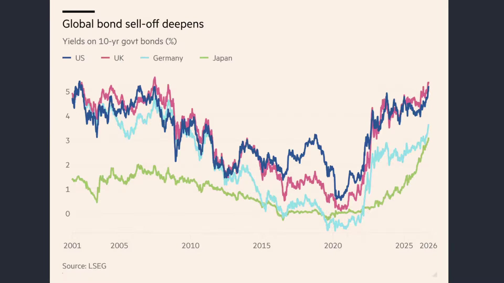

**逐字稿片段：** 這一次美國2年 期公債殖利率稍微下滑10個基點 來到4.78% 10年期的殖利率也下降了5個基點 來到5.24% 聯準會的副主席傑佛森表示 現在正在評估是否即要進一步升息 可能會有更多的時間 那的確緩解了10月份升息的擔憂 不過呢 全球10年 期公債殖利率在整個第三季 基本上都在快速地沖高 那現在呢 又有國債市場的重重壓力 混合起來 其實它也不是美國單純的問題 全球都在面對利率會 維持更高更久的壓力 美國法國日本 不同的債市問題會互相傳染 如果法國更加嚴重 其他國家的公債會稍微好過一點 那另外一個國家更嚴重 那也可能又會導致 下一個國家稍微緩和一點 但是大家殖利率其實都在走高 所以從這樣的一個角度來做思考 那就變成了 對於償債而言 市場的不信任角度就來得越來越大 我們過去提過 如果是從債券的恐慌指數 MUV指數來做觀察 拿來跟股票市場的恐慌指數VIX 它完全屬於不同位階 所以的確 及長債市場的賣壓 大家也沒有恐慌到必須要 全面出清股票市場的地步 因為目前來看 股票市場根本就沒有 任何的避險情緒 可是長債實際利率不斷的升高 總有一天會回壓到股票市場 那美國股市是不是已經完全 消化完了本次的實際利率衝擊

**話題推測：** 美國2年期與10年期公債殖利率變化圖表

---

## 00:02:27

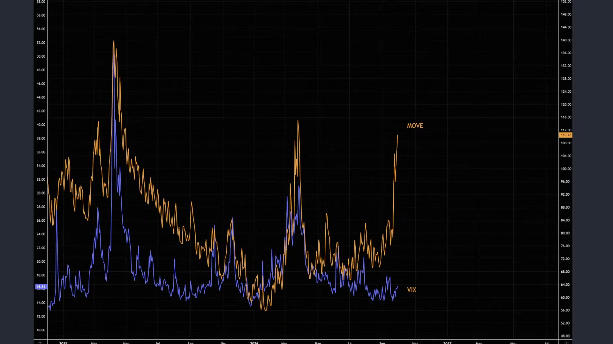

**逐字稿片段：** 我們細數一下到底目前市場上 針對債市拉警報的 根本原因有哪一些 目前彭博主要整理出了大概10個角度 10個利空 第一個就全球經濟真的很強 所以經濟強其實對於 債券反而是利空 債券通常在經濟衰退的時間最受歡迎 那現在美國的經濟表現還是非常強勁 最新所公佈的製造業 景氣也是維持在相對高點 經濟越強 資金當然是留在股票 或者相對的風險資產當中 那另外一方面也代表著 需求不容易快速的降溫 央行肯定沒有太多降息空間嘛 所以這第一個角度 就經濟太強

**話題推測：** 債市拉警報根本原因列表開頭

---

## 00:03:06

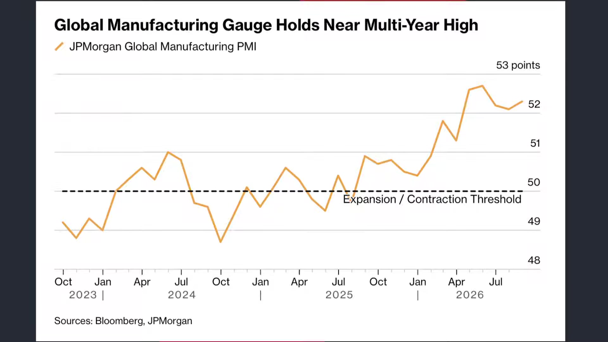

**逐字稿片段：** 第二個呢 當然就是全球能源通膨的問題 由於原油價格已經外溢到食品價格 所以汽油柴油價格的上升以及 這一段時間 我們知道歐洲 全球各地受到熱浪的影響 食品價格的走高 通膨越高 未來收到固定利息和本金 實值購買力就越低 那投資人當然就會要求 更高的殖利率作為補償 再來呢是全球央行的確已經 慢慢進入到緊縮循環 從聯準會的升息 到日本央行韓國央行歐洲央行 全世界除了臺灣央行沒有升息以外 基本上能升的都已經升了 所以讓市場上有意識到 全球央行進入到新一輪的緊縮循環 這第三個原因 第四個原因就是來自於本輪的爆發點 AI的軍備競賽導致大量 投資等級債的發行 科技投資 者發行的總體債券呢 光是過去一整年就超過了4,000億美元 很大一部分集中在美國 所以搶奪了美國政府大量發債的買盤 最後呢使得國債殖利率必須要 付出更高的風險貼水 那第五個就是美國的 財政赤字的確很大 OECD國家今年需要融資18兆美元 美國政府債務已經超過了40兆 其實就是供需問題 政府發行的債券越來越多 而且都是短天期 即將要陸續到期了 買家的資金沒有同步增加 債券價格就會因此而下跌 此利率就會上升 再來有其他幾個原因 像是全球的軍費爆升 我們知道現在北約中東 亞洲都開始重新武裝 我們講的不是美伊戰爭哦 講的就是各國為了要 打造自己的國防供應鏈 必須要取更多的債

**話題推測：** 債市利空原因二：全球能源通膨圖或油價走勢圖

---

## 00:04:45

**逐字稿片段：** 那再來呢 是日本從全球的資金 提供者變成了賣家 日本過去是長期維持超低利率 是全球相對最便宜的資金來源 結果現在日本升息了 日本去日本借日元 他是要錢的 以前是不用付利息的現在 過去我們講說借便宜日元來 買海外高收益資產的套利 交易已經開始正式逆轉了 所以日本現在不再是 一個免費的資金提供者了

**話題推測：** 債市利空原因七：日本資本角色轉變圖表

---

## 00:05:12

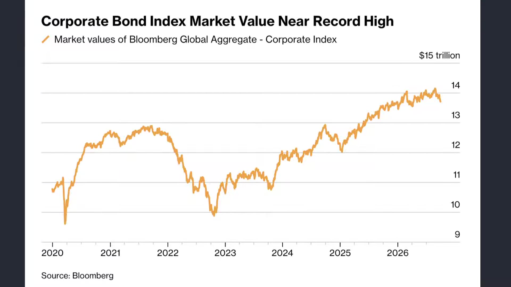

**逐字稿片段：** 那第八點是貿易戰讓全球 重新面對結構性的通膨 關稅戰其實還在持續 全球生產效率的下滑 成本提高 大家會要求債券更高的報酬 再來呢就是聯準會 和外國央行一樣哎的確 它也不再開始大量的持續買美債了 以前美債有兩群非常重要的買家 一個是聯準會 一個就是外國央行 這些機構在持有美債的情況底下 往往都不是為了追求報酬 都是因為貨幣政策 或者外匯存底的需求 像臺灣央行 你說美債賠不賠錢 它根本不管嘛 重點是台幣要值錢 就要買足夠多的美債 結果呢 現在很多的私人資金 包括資產管理機構 避險資金 他們非常看重價格 如果呢殖利率不夠高 就選擇不買了 而現在他們是主要的承接者 最後就是全球的 錢太多時代已經慢慢消失了 以前08年以來 全球有大量的儲蓄 追求有限的投資機會 現在卻完全相反 政府要錢AI要錢 能源轉型要錢 軍事擴張要錢 人口老化 退休金都要錢 全世界需要錢的地方越來越多 但是儲蓄沒有像以前這麼充沛 最後資金本身就變得昂貴 資金變昂貴的代價是什麼 就是利率提高嘛 好所以我們隨便一講 就講了10個理由 包括經濟太強 食品價格的上漲 全球央行緊縮循環 AI的軍備競賽 美國政府的斥資 全球軍費的暴增 日本央行正式從 資金提供者變成賣家 貿易戰的問題 還有外國承接者 全球錢太多的時代陸續消失其實 理由一堆了 其實我只是硬挑了10個 其實可以挑100個 跟那個沈玉琳講過的一樣 人家問他當小三有什麼好處 他說不用負責公婆嘛 不用當黃臉婆 每天只要開心相處就好了 那其實好處有30個 隨便講就3個 那現在美債殖利率到底上升 它的背後的根本原因有哪幾個 其實你可以找到100個 不過我們就挑10個重點來講 但是大概市場的敘事就在這 10個之間不斷的做移轉 與此同時 在短期內 市場上比較聚焦的壓力還是來自於 能夠觀察摸得到的新聞 因為剛才提到的那些角度 有很多根本就解決不了 你不要講說今年能不能解決 未來30年 美國政府財政赤字的問題能夠解決嗎 只要它還是世界第一強國 貿易逆差國本來就要繼續赤字嘛 所以在短期內 大家比較多做一些留意的是 美伊戰事的淡化以及通膨 在政策端能夠處理到什麼樣的位階

**話題推測：** 債市利空原因八：貿易戰與結構性通膨圖示

---

## 00:07:48

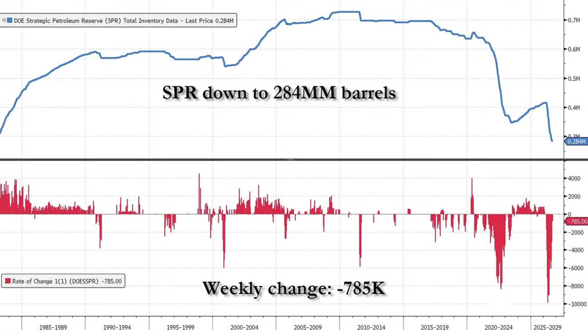

**逐字稿片段：** 因為美國的能源庫存呢 最近又再度的拉響警報了 最新一周商業原油庫存增加了92.2萬桶 可是汽油庫存反而減少了168.4萬桶 哦所以從這樣的一個角度來做觀察 美國現在SPR戰略原油 儲備還在快速的下滑 尤其是中西部的汽油庫存 哦從數據來看 這應該是有記錄以來的最低 從來沒有美國庫存原油這麼低過 從這樣的一個角度來做思考 等同於 美國人口還在增長 照理來講 戰略原油儲備不能夠破敵的 可是市場上很明顯知道 川普其實能夠用的招已經用了 即便呢 有可能會損害到國防的利益 但是川普還是盡可能的把 戰略原油儲備盡可能的釋出 美國柴油現在每加侖 已經超過了6.5美元了

**話題推測：** 美國能源庫存警報新聞圖卡或圖表

---

## 00:08:41

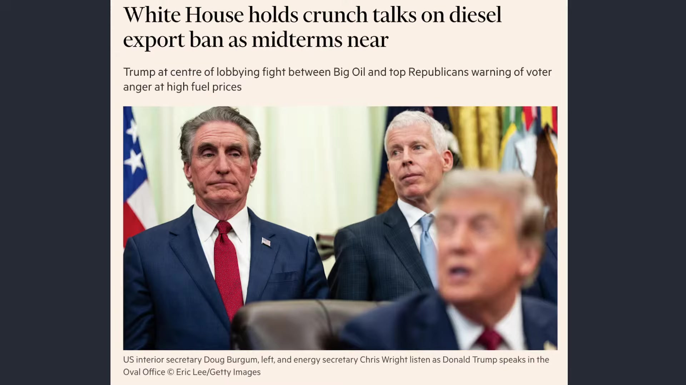

**逐字稿片段：** 白宮最近已經開始 正在討論是否有必要開始 限制或者暫停柴油的出口 希望增加美國國內的供給 壓低價格 目前還沒有做出最後決定哦 不過如果為了期中選舉 我認為是有其必要的 要立即停止任何柴油的出口 來快速讓柴油價格能夠稍微適度下壓 那當然了 把自己的能源儲備做 適度的釋出是一個角度 可是剛才也看到SPR 其實位階已經很低了 再往下掉 美國國防供應鏈就會出事了 所以最好的方式是什麼呢 我們看白宮最近要求 歐洲盡可能去釋放柴油的戰略庫存 原因很簡單 就是因為美國現在 已經盡可能已經釋放了 可是你歐洲人呢 都還沒有做任何的柴油 戰略原油庫存的釋放 美國已經做了盡可能的事 來做緩和 那歐洲也要表達一些態度 那目前歐洲的能源專員已經 跟法國德國英國義大利還有 愛爾蘭官員來進行協商 美國是希望未來6個月內快速釋放 1.2億桶庫存 那能源業者估計 用這樣的一個效果能夠快速 的去壓低全球的柴油價格 不過看起來 歐洲內部也並不願意一次把 手上的安全庫存給大量用掉 現在很明顯是受到白宮的壓力 那白宮其實也有表達一定的態度了 他說我們也不是強迫你 我們也盡可能的把自己的 戰略原油儲備進行釋放了 但是你們總得表達出一些態度 幫助我們期中選舉好過關嘛 另外一方面 我們也清楚知道 其實歐洲帳面上1.95一桶 的柴油的戰略庫存呢 其實還算是偏高 相對於過去以往的水準呢 所以歐洲能不能 對本輪的能源局勢稍微產生緩和作用 這是值得觀察的重點的

**話題推測：** 白宮討論限制柴油出口新聞圖卡

---

## 00:10:30

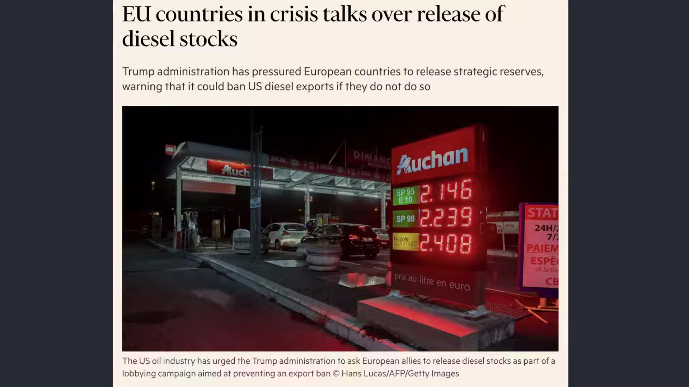

**逐字稿片段：** 現在美國的整體經濟 就處於一個非常有趣的位階 那就是美國現在經濟最大矛盾 就是利率其實對於股市是不太有利的 油價對於股市也是不太有利的 可是經濟和股市總是比 預期還要來得更為強勁

**話題推測：** 美國經濟矛盾概況圖解

---

## 00:10:46

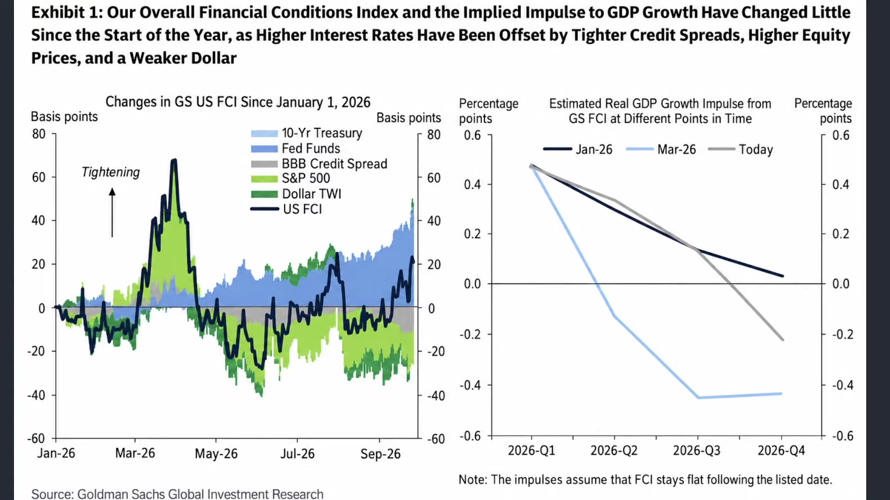

**逐字稿片段：** 我們根據高盛的估算 美國在第三季的經濟年化 成長率大概可以來到3.4% 今年第四季相對於去年 第四季大概還會年成長2.2% 關鍵之一是什麼 利率明明在升高 可是我們都很清楚 知道整體金融環境呢 雖然略微收緊 可是它主要來自於內生經濟的爆發 錢變這麼貴 磁利率變這麼高 恰恰好就是內部的 經濟表現太好所導致的 就是因為人人都在搶錢 一個所有人都想要拿錢去做質押 去做進一步投資 那某種程度就是一個 經濟的增量的樂觀 社會那最後導致的結果就是 本來在樂觀的過程當中 錢就會越來越貴嘛 所以如果細節觀察 在過去八個季度 整體科技業的整體增幅大概 獲利成長 平均而言呢 在廢版大概是成長接近 有180%到280%左右 人工智慧相關的投資平均在 整體而言 光是投資就是年化成長26% 所以高油價到底有沒有去 侵蝕掉消費者的購買力 的確有 但是它不足以完全壓垮經濟 甚至光是在AI的投資 它就足以把整個經濟給往上帶 這就是真實跡象

**話題推測：** 高盛美國GDP成長預測圖表

---

## 00:12:05

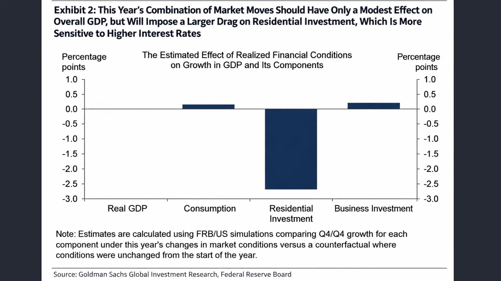

**逐字稿片段：** 從昨天公佈的9月份製造業PMI雖然呢 相對於初值略為下滑 可是還是創下了2022年5月 份以來的最高水準呢來到54.5 在ISMP製造業經理人採購指數的部分 這說明著新訂單仍然在快速的增加 尤其雖然我們知道有部分 民眾受到購買力的衝擊

**話題推測：** 9月份製造業PMI走勢圖

---

## 00:12:28

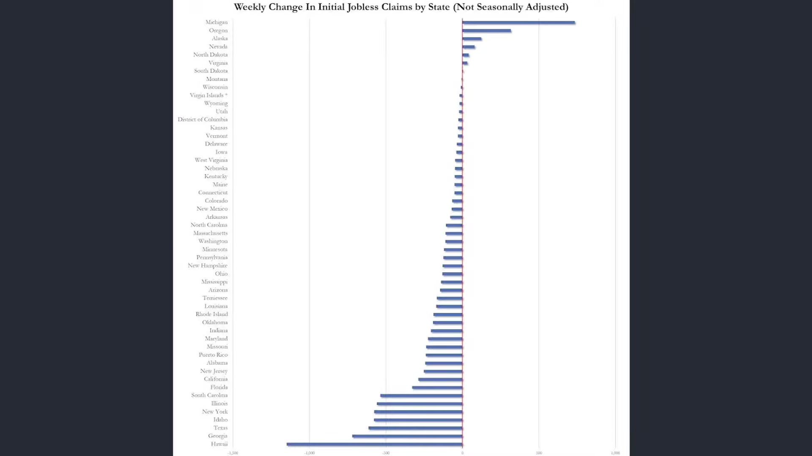

**逐字稿片段：** 可是初領申請失業救濟金呢 這還是只有19.7萬呢 就是你雖然現在過得很不好 可是也沒有到那種廣泛性失業 沒有工作可以做的地步 在這樣的一個效果底下 即便是續領失業救濟金人數 也創下了2023年3月份以來的最低哦 所以這就變成市場上最大矛盾 AI投資正在為製造業和 就業保持足夠的韌性 它也讓通膨更難以下滑 而且讓資金來得更為昂貴 所以這來講 資金昂貴會讓錢無法有效 產生在經濟的持續推升 可是它的內生經濟 正恰恰來自於 因為經濟太好 所以資金才會因此而昂貴 好這個有點因果的關係論 互相的維持 不過至少可以看到 我們很容易把過去活過的世界 就是誤以為原本的樣子 過去十幾年呢 我們迎來的時代是什麼 就全球化嘛 然後壓低生產成本 能源價格又很便宜 全球儲蓄很充沛 金融海嘯之後 全球央行基本上都維持相對低利率 所以企業已經習慣這種便宜錢 很長一段時間了 結果呢 發現利率現在要突然回到高位 大家覺得無法接受 利率這麼高一定會死人的 唉結果真實表現的跡像是什麼 就是大家開始習慣 一個新的高利率社會 因為經濟變好了 經濟變好 所以錢本身就要更值錢 錢的更值錢單位就是利率

**話題推測：** 美國初領失業救濟金人數圖表

---

## 00:13:56

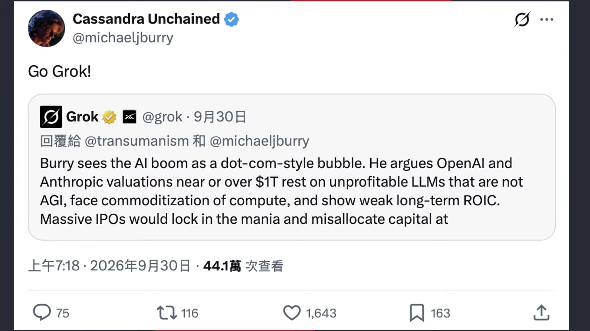

**逐字稿片段：** 這兩天我才去那個維也納 佛洛伊德的故居 去做一些這個 算是致敬 一走進去 其實有一件事情我特別驚訝 一直覺得很奇怪 因為佛洛德很有名嘛 當年他也在這裡生活 看診這麼多年了 我發現那個房子有點空 那我原本想說 我應該看到那個傢俱 尤其是那個病人不是在躺著 做那精神分析的沙發 都不在這裡 後來我才知道 這是佛洛德人生最後 一段最戲劇化的故事 就是1938年 納粹德國併吞奧地利 那佛洛德是猶太人 遭到迫害 82歲了他還要被迫離開已經 住了幾十年的維也納 流亡到倫敦 那他很多的傢俱 著名的那個 診療的沙發都帶去英國了 好這件事情對我最大衝擊是什麼 就是一個人呢 他花了幾十年建立自己的 事業理論名聲或者生活 晚年八十幾歲了 突然之間整個大改變 被迫離開以為自己會住一輩子的家 所以我覺得 我們對照今天的高利率時代 環境改變的速度 有時候遠遠比人類 想像的速度還要來得快 我們很容易用昨天的世界去預測明天 覺得08年以後 經濟差不多就這樣子 一輩子都不會好轉了 我們永遠都要處在寬鬆的社會 甚至負利率時代即將到來 想不到過了20年 高利率時代已經到來了 AI時代已經爆發了 那這個時候資金重新變成昂貴的時代 包括 政府的財政 企業的估值 房地產股票的本益比 過去我們習慣的資產配置的方式 也許都必須要重新的適應 這給投資朋友做一些思考了 其實我們還是可以觀察到 市場上還是有暴食的 對於AI比較戒慎恐懼的角度 這也是好事情 至少有一個提醒者嘛 你像最近大賣空的 嗯Michael Berry 最近又再度針對AI熱潮提出強烈警告 昨天他發文了 他說如果真的讓Openai跟 Anthropic如果能夠順利地上市 可能會從資本市場當中 吸收數兆美元的資金 那最後呢 我們應該為了 不希望股票市場出現足夠大的崩盤 我們應該阻止這兩家 公司推進首次的公開募股那當然 它的背後核心還是AI的龐大投資 能不能產生足夠的回報 如果大家真的把錢都投到這些 還沒有具體營收回饋的企業 那你只是把人類的金融 世界完全跟這兩家企業 掛上鉤那最後所造成的崩盤 全人類都會因此而受害 這也很有趣哦 Michael Berry 以前是資本支出太高 不切實際看空 後來是估值太高看空 第一體景氣 最後變成供給過剩看空 現在為了人類 你知道嗎 為了人類的福祉 他也看空 這高度越來越高 但是至少可以看得出來 市場上 在不同的認知當中 我們看Michael Berry 他就是依照的過去的庫存循環供給 過剩的角度來做思考 根據過去的資本支出的循環 根據過往的估值來做一個判斷 那會不會AI時代 我們必須用不同的標準來判斷呢 有時候看 瞭解說 這個時代 也許慢慢改變

**話題推測：** 佛洛伊德故居照片

---

## 00:17:10

**逐字稿片段：** 以前我們跟大家分享過嘛 以前港片不是有一部叫 中國最後一個太監嘛 那裡面那個主角就叫來喜嘛 這清朝已經搖搖欲墜 革命黨四起 眼看就要翻頁了 那你知道窮苦人家最大的問題是什麼 就是他不知道時代變了這 到處都革命黨了 你還到進宮 然後去切掉小雞雞 所以最後 我們看到 因為他是最後是服侍溥儀皇室嘛 有時候小時候看到這段電影都很難過 怎麼會這樣呢 都已經知道世界要改變了 你還把自己命根子送出去 但有時候我們講說 很多時候大家不知道時代變了 但是從很多的數據看得出來 時代已經慢慢改變了 這是我們要予以警惕的 好那回過頭來說現在 其實從經濟數據來看 美國經濟最有趣的地方 就是高利率維持了這麼久 經濟沒有如市場原先 擔心的那樣快速的衰退 企業投資和就業還是有韌性 我們看美股股市在昨天 仍然保持在高位震盪 AI資本支出繼續支撐住 目前的製造和整體消費 對一般而言 高利率和高物價帶來 的壓力沒有消失哦 可是最後反映的效果是什麼 就是其實總體數據表現的並不差 真正的代價是政治上的

**話題推測：** 電影《中國最後一個太監》海報或劇照

---

## 00:18:27

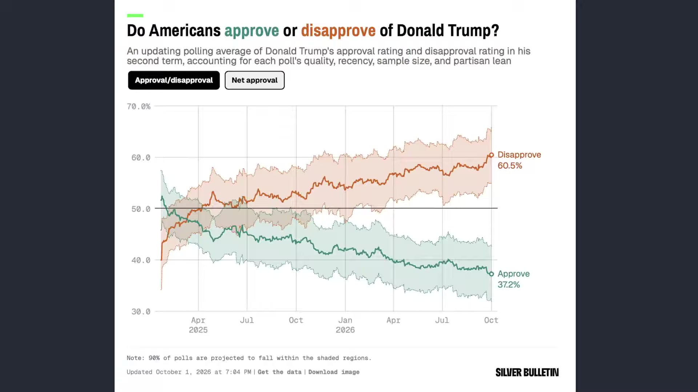

**逐字稿片段：** 我們看到最新川普民調顯示 川普的淨支持度已經 來到-22.7個百分點 創下本屆任期以來的新低了在本周 好所以這就是一個很有意思的反差 高利率到底有沒有把美國經濟給打垮 我的看法是沒有 但是它透過房貸透過 車貸透過信用卡的利率 還有生活成本的壓力 它先把川普民調給擠垮了 好這是最終結論了 所以高利率到底對於 經濟有沒有衝擊 有但是沒有想像中來的大 恰恰相反 正由於經濟夠強 才會有如此高的利率 而唯一受害的很明顯 是執政黨 是川普目前的民調壓力 那當然回過頭看臺股 台股這一鋪 到底有沒有因此受賄和受害的地方呢 台股第一個交易日在10月份呢 震盪走高 其實還是創下了收盤新高 來在48,353點 成交金額來到8,374億 從這樣的一個角度來做思考 台股其實相對於美國 股市強勁的非常多 原因就來自於我們在AI 循環站穩了重要的位階

**話題推測：** 川普民調支持度圖表或照片

---

## 00:19:33

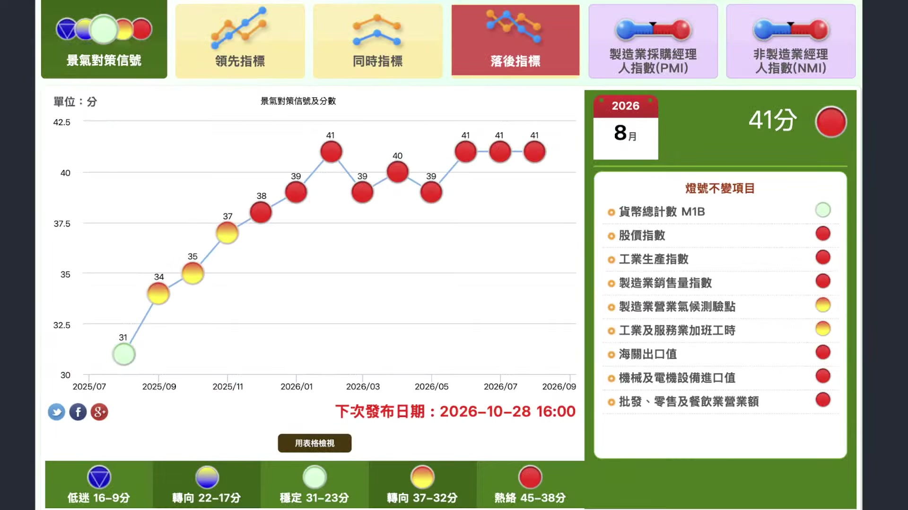

**逐字稿片段：** 針對國發會所公佈的 8月景氣對策信號燈 又來到41分 連續三個月持平 呈現高度的擴張格局 如果我們細看分項 除了M1B還在綠燈 那是貨幣的問題 我們看到其他像是 工業服務的加班工時 製造業營業氣候測驗點呢 通常以往因為傳產壓力很大嘛 所以通常指標表現並不好 現在要麼就是紅燈 要麼就是黃紅燈 結果呢 我們從今年1月份以來 應該從去年12月份開始 就已經連續9個月都 保持高強度的紅燈 跟著我一起闖紅燈吧 我們看得很清楚 其實可以發現臺灣的景氣概況 前所未有的大好 從三大科學園區半年的營收來做思考 臺灣三大科學園區在26年上半年 的營收合計是增長了3.54兆元 這也是歷史同期的新高 南科的部分是一兆7,739億 年增幅28% 竹科的部分是一兆1,195億 年增幅36% 其實南科在三年前就 已經超越竹科的營收了 從整個AI伺服器和算力建設 從整體需求來看 你可以看得出來 中科也不錯 中科上半年營收是6,436億 成長幅度大概也有20.63%哦 好這都反映出整個AI熱潮 它不是單純反映在營收 它已經轉化成新一輪投資和就業

**話題推測：** 台灣國發會景氣對策信號燈圖

---

## 00:21:04

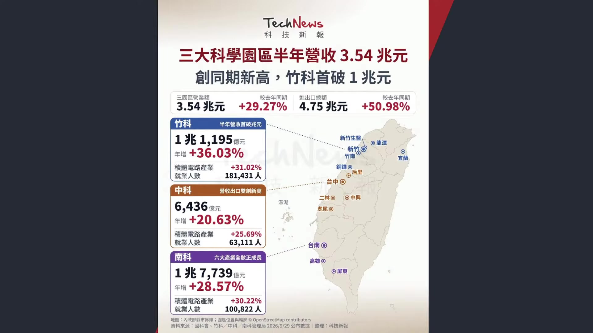

**逐字稿片段：** 三大園區就業人數是34萬人 竹科有18萬人 南科10萬人 中科6萬人 而且你要知道哦 南科現在的營收比足科高 可是南科的人數只有10萬人 足科有18萬人哦 好所以其實中南部地區目前的AI 投資紅利上升幅度也非常快 好這麼高強度的一個營收發展 對於工程師的業績 足以貢獻 我們看最新在昨天 2026年安聯所公佈的全球財富報告 臺灣在去年年底的人均金融資產淨值 居然已經高達16.4萬歐元 新臺幣折合594萬元 已經晉升到全球第五名了 僅次於美國的296,000元 瑞士的27萬 丹麥19萬 新加坡的19萬 也比日本的8.9萬高非常多 大概是日本的接近兩倍左右 臺灣家庭的總金融 資產也成長8.7% 來到4.5兆歐元呢 扣掉7,142億的歐元負債以後 淨金融資產來到3.8兆歐元 年增幅是9.1% 這個也跑贏了通膨 其實如果細節觀察了 我們大概分成兩種指標來做思考 一個是人均 淨金融資產 這是左邊 就是我們把現金把 存款把股票基金保險 全部加起來 然後扣除掉你的房貸 扣除掉你的信貸 你的質押 除以人口 這個比較偏向家庭 真正擁有的金融資產 現在是排行全球第五名 那排行第六名的是人均金融總資產 就是我不看負債了 那數字一定比較高嘛 那整體而言呢 大概是排第六 不管怎麼看哦臺灣 我們當然知道 因為我跟郭董 平均身價也是數百億起跳 我要講的概念是哦 你的老闆很明顯比其他 國家的老闆有錢非常多 這是跟不是跟台日韓來做對比哦 這個日本韓國已經 遠遠被臺灣拋在後面了 我們講的是其他先進國家 基本上不管是加拿大 澳洲荷蘭紐西蘭 臺灣的金融總資產都比這些 國家的金融總資產還要來得高 這是扣除掉負債的情況底下 當然了 有一部分可能是我們知道 臺灣這幾年估值快速的提升 這是去年數據哦 去年台股也才 年底也才3萬點以下嘛 現在4萬8哦 所以你說2026年這個 排名會不會再往前呢 臺北股市有沒有跑贏新加坡股市 有有沒有跑贏跑贏丹麥股市 跑贏瑞士股市 照這個速度 過幾年你要說超越 新加坡也不是太難的事情了 超越丹麥也不是太難了 基本上準備就是挑戰瑞士美國了 按照這個速度 所以我們當然並不是 說平均每個人594萬 每個人就有594萬但是 就算用財富集中k型 分化的角度而言 臺灣的大股東 臺灣的老闆 都已經比全世界其他的大 股東和老闆相對來的有錢了 這個就是我們講的游資 要區分成兩種一個是 財富分配的問題 另外一個是你的老闆 有沒有比其他國家的老闆有錢 那這樣才有加薪理由嘛OK 這給投資票做些思考了

**話題推測：** 台灣三大科學園區就業人數圖表

---

## 00:24:14

**逐字稿片段：** 當然呢最大的問題來自於哪裡 最大的問題當然就來自於臺灣呢 很有趣的一個跡象就是 明明人均淨資產正在快速提升 可是我們卻觀察到 在最近銀行業卻出現了錢荒 哎這什麼事情呢 就臺灣銀行業 這幾個月大家也感受到了 雖然是沒有升息了 可是你已經感覺到銀行自己已經先 自主升息了 央行是沒有升息 可是錢越來越不好貸了

**話題推測：** 台灣銀行業錢荒新聞圖卡

---

## 00:24:41

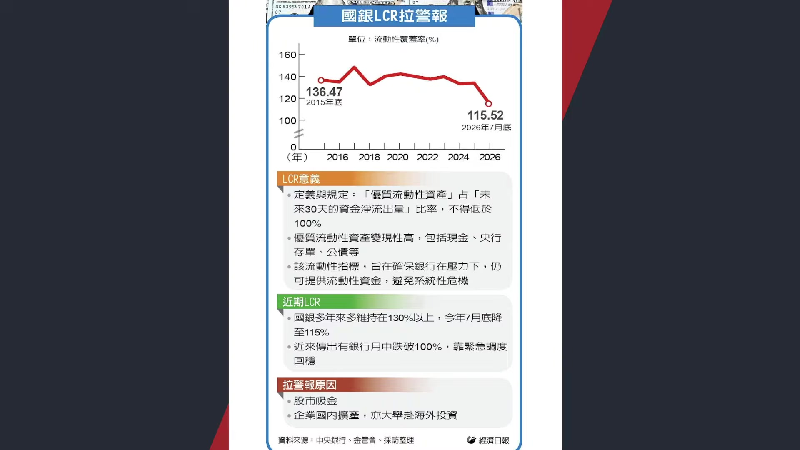

**逐字稿片段：** 最明顯的數字就是 銀行的流動覆蓋率 就是衡量銀行能不能靠手上的現金 公債央行的存單這些高流動性的資產 來撐過未來30天的資金大量流出的 指標法定最低標準是100%了 現在大概在115左右 唉前陣子 今年年初是130哦 等於是半年就少掉了15個百分點 甚至傳出銀行有在本月月中 一度跌破100%的法定的底線 他最後是靠調度資金才重新 在月底重新拉回標準之上 那這些事情就意味著銀行 現在的確缺錢的壓力已經 反映到企業和民眾的借貸成本了 那很多銀行為了要守住流動性呢 還拜託一些大額的存款 客戶不要把錢領走 還要控制放款和撥款的速度 那怎麼會發生這樣的一個跡象呢 明明錢進來的速度這麼快其實 主要的原因有兩個 第一個是 市場資金移轉更快了 錢一進來馬上就進股市 所以反而能夠放款的錢不多 能買股票的錢很多了 但是要去借錢的 沒有人願意 就沒有人想要把錢停留在銀行 讓銀行去放款 因為你只能領活期或者定存的錢嘛 那我寧願買股票 所以銀行就沒錢了 那第二種角度是來自於臺灣 企業赴美投資的規模非常龐大 所以有很多錢 我們認列財報是很龐大 可是錢沒回來 就直接落地在亞利桑那 在日本的熊本就直接設廠 繼續擴廠了 好所以這是產生的雙重效果 但它根本背後的一個角度 其實就來自於目前整體遊資的 概況和體感溫度的一個區別 當然最後 市場上最為關注的還是 那你剛才說到瑞銀所公佈的 應該講不應該不是講瑞銀 安聯所公佈的總體 財富的淨資產持續創高 到底薪資角度為何呢 其實如果是從去年年底來看 全體臺灣的平均勞動報酬是88.3萬元 比前一年增加了3萬左右 不過呢如果細節觀察一個變數 就是固定每個月可以 預期拿到的經常性的薪資 占整體勞動報酬比重 已經降到65% 比10年前還少了3個百分點反而是 薪資獎金分紅加班費 上升到21個百分點 比10年前增加了3個百分點 什麼意思 就現在企業 更喜歡發獎金呢 不願意直接加底薪呢好 那你大概理解老闆為什麼會這樣幹呢 就是很多企業無法 確認AI繁榮會維持多久 所以更傾向用一次性的獎金留才 而並不是提高你的固定薪資 那其實就意味著 接下來即便AI持續繁榮 它在用這樣的一個方式 你就可能稍微能夠按耐住你哦 可是只要AI當年度 財報沒有表現特別好 它就不給你發獎金了 所以整體而言 市場未來的薪資波動 幅度可能會持續的加大 這也是我們看到帳面上 現在有可能最便宜最划算的選擇 不一定是真正成本最低的選擇 因為每個人害怕的風險不同嘛 經濟學上很多決策都不是 用眼前的價格來做計算 而是把未來可能發生 的一件事情算進去 你要硬要這樣講 好像老闆也是有道理的 當一個決定很容易做 但是卻很難反悔的時候 現在很多企業就寧願多付一點成本 換取未來的彈性 好對於企業來講 景氣好的時候直接加薪了 看起來每個月好像只多付一點錢了 可是未來底薪一旦提高 就變成長期的固定成本了 我們並不是講說財富分配的角度 我們講說從老闆的利益來看呢 他就會這樣幹好 所以我們才會導致財富暴增速度加快 但是底 心卻遠遠跟不上的一個感覺 如果未來景氣反轉 獲利下滑 他可能就覺得 那我收不回來了 那我乾脆不要去建立 一個未來很難收回的承諾 哎這就是目前觀察到的事實方向 就很多時候我們人 願意付出的額外成本 其實是在替自己買一個未來的確定性 這個是目前臺灣的 老闆大概心裡的想法 之前講一個故事嘛

**話題推測：** 銀行流動覆蓋率（LCR）走勢圖

---

## 00:28:40

**逐字稿片段：** 講一對老夫妻 去以色列旅行 突然太太心臟病發過世 當地葬儀社就告訴丈夫 埋在這裡只要100美金 但如果要把她運回國安葬的話 要1萬美元 那丈夫想了想 嗯還是幫我運回去好了 那葬儀社的人很驚訝 這裡可是聖地 而且便宜這麼多 那丈夫搖搖頭嘛 我聽說以前有一個男的埋在這裡 三天之後又復活了 我不想冒這個風險了 所以現在 不管是企業對於AI紅利的態度 你看AI帶動臺灣的科技業成長 很多企業現在就是需要一個是什麼 需要一個 未來一個確定性 人願意付出的額外成本 其實就是在替自己買 一個未來的確定性 他寧願給你多一點獎金 給你極度亮麗 在當年的額外的紅利回饋 他也不願意調高 一點點你的固定薪資 好這個就是市場上 不想冒這樣的一個風險呢 當然不代表說企業不相信AI 他相信現在很好 但他還沒法確信以後 每一年都會這麼好 這就是我們觀察到的實質跡象了 當然呢 這就是雙方需要進行 勞資協調的部分 所以才去 需要在趁現在缺工的情況底下 繼續的做協商嘛 這個才是勞團目前應該做的事情 我們看到跟資方的一個糾結 有必要繼續持續 畢竟現在有利的是勞方 市場大缺工嘛 AI紅利大好 當然應該要順勢的調 高自己的固定薪資 回過頭說 對於政府而言呢 那就是財富分配嘛 我們看到立院最新會期開議之後 普發現金再度成為了朝野的攻防焦點 目前行政院是規劃27年每人普發1萬塊 總額是2,357億 希望在農曆年前後會發放 那國民黨團 是主張加碼每人2萬元 並且嚴擬透過特別條例來推動 並且提出修改預演算法的構想 未來稅收只要超過預算一定規模 就直接進行固定分配 按還稅於民 當然呢我們先不去講說程式的問題 立院照理來講沒辦法做直接性的規劃 然後來進行發放 不過回過頭說 那至少兩黨都想要發嘛 一個發多一個發少嘛那 還稅於民呢 某種政策而言呢 你都發現了 沒有人考慮退稅 沒有沒有一個黨團考慮退稅 目的什麼 好因為這是一個 財富再分配的過程 大家都已經認可了 並不是你多繳一點稅 你就多退一點了 基本上就是只要超征 永遠都是進行普發來回饋民眾 那某種程度它就是一種 財富分配的一個角度 來緩解我們在k型分化 當中所遇到的一個問題 好這個就是行政院 和立法院 或者我們講說不同黨團 目前所給予的態度 當然呢你說那錢是不是應該撥到 其他地方更有道理的呢

**話題推測：** 老夫妻以色列旅行故事配圖

---

## 00:31:35

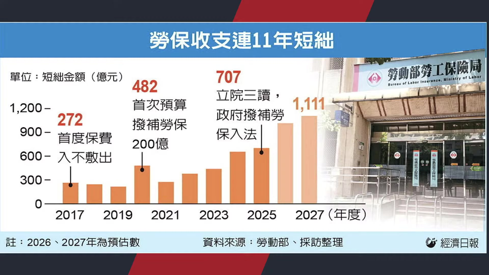

**逐字稿片段：** 比如說現在勞保的收支已經連續11年 進入到短處 勞保的財務壓力越來越大 再來看我們這也知道 在軍公教的部分呢 在最近 教師節才剛過嘛

**話題推測：** 勞保基金財務壓力圖表

---

## 00:31:47

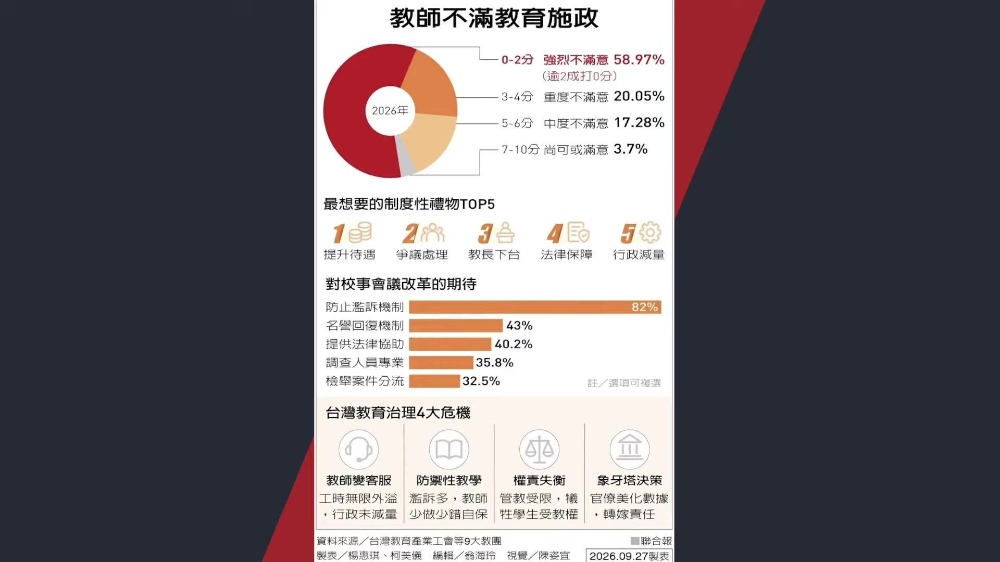

**逐字稿片段：** 我們看臺灣教育產業工會 好最近公佈了教育施政滿意度調查 好基層對於中央政府教育的評分呢 10分滿分只有2.37分呢 很多人認為 那是不是在教師層面呢 應該要做進一步的加薪之前是 在國防部有適度做調薪嘛 那有沒有可能在各大領域 公家部門 進行全面性的調升 大家都在做做觀察 某種程度而言呢 其實我們講的事情是 不管是對於美國 我們今天的主軸 對於經濟持續保持在成長的過程當中 但是川普的民調卻創下了 算是本屆以來的新低 臺灣市場也是如此 我們的人均淨資產金融 淨資產全部都在創高 可是民眾的生活感受是否有變好 它在變成兩件事情了 美國經濟是很強了 那民調很明顯他就不看好嘛 臺灣的AI出口股市其實不斷地創高 但我們明顯感受到 財富和薪資的紅利 它並不是一個平均的分配 所以從這樣的一個角度來說 一個國家最困難的 現在看起來也不是AI成長的問題 是如何讓這一波成長 讓大多數人能夠感受得到 不過至少可以確認的事情是 你感不感受得到 跟它是否會創高 它是完全兩個不同的問題 給投資朋友做些思考了 今天主要跟投資朋友稍微梳理一下 美國經濟和臺灣經濟的概況以及 背後政府所面臨的挑戰為何 給投資朋友做些思考 如果喜歡我們節目 記得幫我們訂閱按讚加分享

**話題推測：** 台灣教育施政滿意度調查結果圖表

---

## 00:33:16

**逐字稿片段：** 台股小跌21點 收在48,332點 創新高休息一下 好那我們後續再來跟投資朋友 追蹤全球這種AI時代的浪潮 那是不是代表著淨資產的提高 財富效應可以推動 全球經濟好一陣子呢 給投資朋友做些思考 如果喜歡我們節目 記得幫我們訂閱 按讚加分享 我們就禮拜一早上8點半 早晨財經速解讀再相見

**話題推測：** 台灣股市收盤指數圖表

---
