# yutinghaofinance_BxtHhc6P1n0 — 關鍵畫面索引

- 來源逐字稿：[yutinghaofinance_BxtHhc6P1n0_FIN.srt](yutinghaofinance_BxtHhc6P1n0_FIN.srt)
- 影片：https://www.youtube.com/watch?v=BxtHhc6P1n0
- 截圖數：30

## 00:00:36

**逐字稿片段：** 我們看美國股市這一次在9月份的升息預期, 在這一次跌升後, 快速拉昇之後, 對於股票市場和債券市場的影響為何? 禮拜五是很明顯 沒有股市三大指數是全面收黑 尤其納斯達哥指數收跌超過0.5% 倍半賣壓也算沉重 可是如果是從周漲幅來看 其實大家還是收漲的 你像道瓊是收漲了0.5% 標普收漲0.4% 納指收漲0.8% 主要集中的賣壓 其實就是集中在 過去反彈比較高的晶片股身上 所以這一次聯準會在 華許的談話底下突然的放音 就把市場從原本的等待降息 重新拉回到升息道路上 它的確重申2%的通膨目標是明確的 而且是固定的 也指出說目前的金融環境 其實也談不上緊縮

**話題推測：** 討論美國股市及9月升息預期

---

## 00:01:26

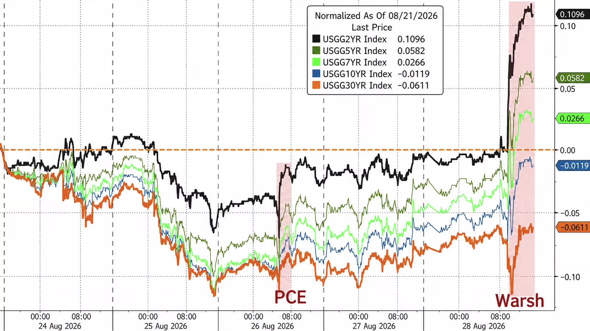

**逐字稿片段：** 美國個人消費支出物價年增指數 年增幅還有3.7吧 所以從整體華許所釋出的態度來看 現在就業其實也還不錯 經濟也維持在韌性 而且消費支出還跟通膨差不多 沒有到真的很緊縮的地步 當然這樣的一個效果直接導致9月份的升息幾率 從演說前的35%上行到60% 兩年期美債殖利率一天也上升了11個基點來到4.30% 相反的黃金是重挫3% 那比特幣也從8.1萬美元直接跌回到7.7萬 當然瞭如果我們仔細觀察 債券市場完全相信華許會升息嗎 因為現在最大的變數並不是華許說了什麼 是經濟數據能否逼迫聯準會採取行動 我們仔細觀察 大部分的債券投資人 其實從利率定價來看 並沒有完全相信這樣的一個劇本

**話題推測：** 提及美國個人消費支出物價年增指數數據

---

## 00:02:21

**逐字稿片段：** 我們舉一個比較直觀的數據 你看當時美國CPI年增 從3.4%一路下滑 然後現在預估到2027年 畢竟會到2% 然後再慢慢上升到2.5%

**話題推測：** 展示美國CPI年增率及市場預估（至2027年）

---

## 00:02:32

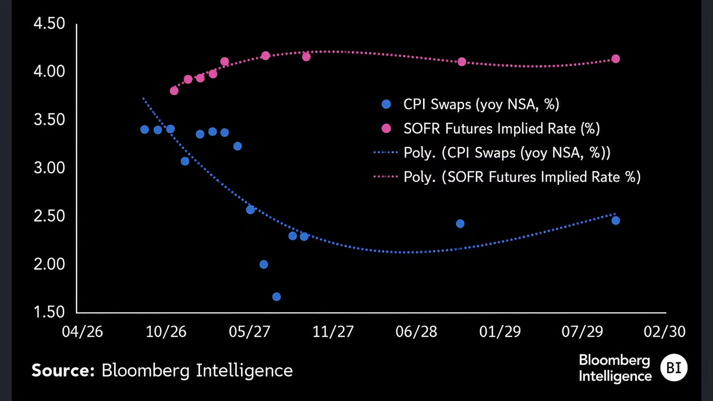

**逐字稿片段：** 可是你看粉紅色線的SoFi 期貨隱含政策利率 它大概就維持在4%左右 就是市場上其實利率預期並沒有想象大幅度的波動 只是短期內大家的預測波動變大了 可是放到長期本來就已經反映年底有可能會升息 只是可能原本預估11、12月會升 那現在可能9月就要升息而已 所以大家才會覺得說現在滑雪所釋出的氛圍 也沒有想象中來得這麼陰 股市是得修正一下 但是也不是一個史詩級的重大的利空災難 所以最大的變數並不是說它說了什麼 那未來的數據是否佐證他說的是對的 逼迫他採取行動 這個才是我們關注的重點 因為近期就業和零售銷售 的確並沒有明顯的重新加速 所以其實從就業端 從經濟端來看 來導致聯準會要升息這件事情 肯定是不夠理由的 單純就是通膨問題而已

**話題推測：** 顯示SoFi期貨隱含政策利率的走勢

---

## 00:03:26

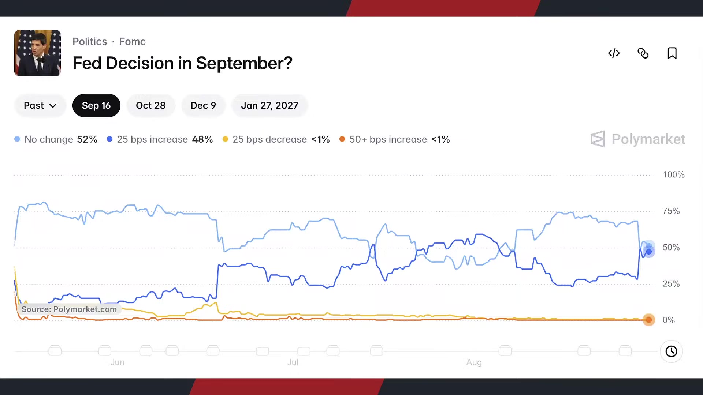

**逐字稿片段：** 更重要的事情是 華許現在是準備改變聯準會和市場溝通的方式 他很明顯已經表達 不願意再提前告訴投資人 下一步該怎麼走 所以每一次都是逐次會議 逐次的數據決策 意味著市場的波動 本來就可能會因此而放大 所以在這樣的一個消息底下 也不能說現在就是單純的好消息 或者單純的壞消息 而是每一次都根據當前的利率預期 來做決定 而且按照華許目前所透露的氛圍 那感覺遲早有一天 他跟川普會反目成仇 我都已經讓你當聯總會主席多久了 你居然一碼 連半碼都不給我降 我還以為華許跟我一樣 都喜歡看五碼 我是說領碼 想不到他還是喜歡生個一碼 但是不管怎麼說 聯總會把抗通膨放到第一順位以後 的確稍微穩住了市場的重心 讓大家意識到資產價格 不能夠毫無節制的往上漲 目前通膨問題 看起來是比經濟問題 就業問題還要更為優先

**話題推測：** 分析華許改變聯準會與市場溝通方式

---

## 00:04:26

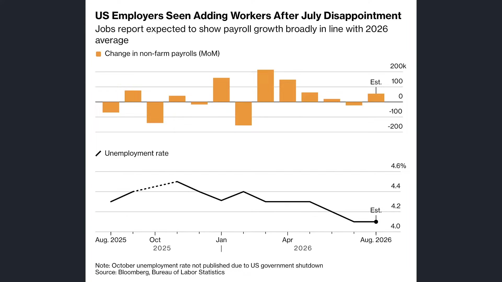

**逐字稿片段：** 華許其實剛才有提到 金融環境並沒有真正的限制活動 某種程度就奠定的 其實他認為現在是不緊的 他們現在資金流並沒有被聯準會給抽乾 利率仍然是聯準會達成政策目的的重要工具 而且他告訴大家 現在不要覺得利率已經高到足以壓制需求 已經很緊縮了 我們現在其實才剛剛開始而已 只要2%的通膨目標沒有達到 我們仍然會保持這樣的一個態度 所以這也代表著市場上 除非經濟有衰退或者明顯的弱化 要不然華許的目標很明顯是放在年性通膨的部分 那通膨降得夠不夠快 即便到時候市場就業市場降溫很快 聯準會也未必會救經濟 看起來他所目前事出的論調是如此 當然這就代表著通膨問題端上桌以後 全球的新興市場和歐洲央行 是否會被迫跟進這樣的一個緊縮環節 就值得留意了 因為你硬要講 其實全球央行現在並沒有在跟聯準會 大家都在超前聯準會

**話題推測：** 重申華許關於金融環境並不緊縮的觀點

---

## 00:05:31

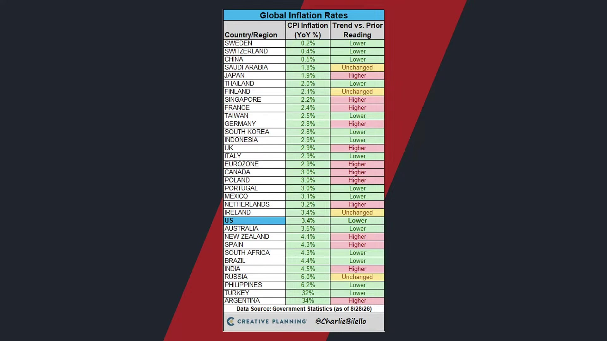

**逐字稿片段：** 我們從最新通膨數據來看 美國CPI年增幅大概3.4 3.5 其實總體趨勢還在緩步的下滑 可是你看其他國家 真正高通膨的都是集中在新興市場 俄羅斯6% 菲律賓6.2% 土耳其 阿根廷更高達32和34% 你看韓國央行這次就直接升息了 說明聯總會其實已經 動在這個利率很長一段時間了 反而是其他央行開始優先升息 這個值得我們9月份 臺灣的央行理經事會議 做更進一步的留意 因為以前美國聯總會通常都是領頭羊 帶著大家一起升息一起降息 結果現在明顯的聯總會要看其他央行的動作 來決策內部是否要採取更進一步的緊縮 值得注意的事情是 因為歐洲8月份的通膨也升到3.3%了 德國是3.1% 意大利是3.4% 這個其實硬要講都比歐洲央行2%的目標來得高 可是歐洲內部的消費比美國還差勁

**話題推測：** 顯示美國CPI年增幅數據

---

## 00:06:30

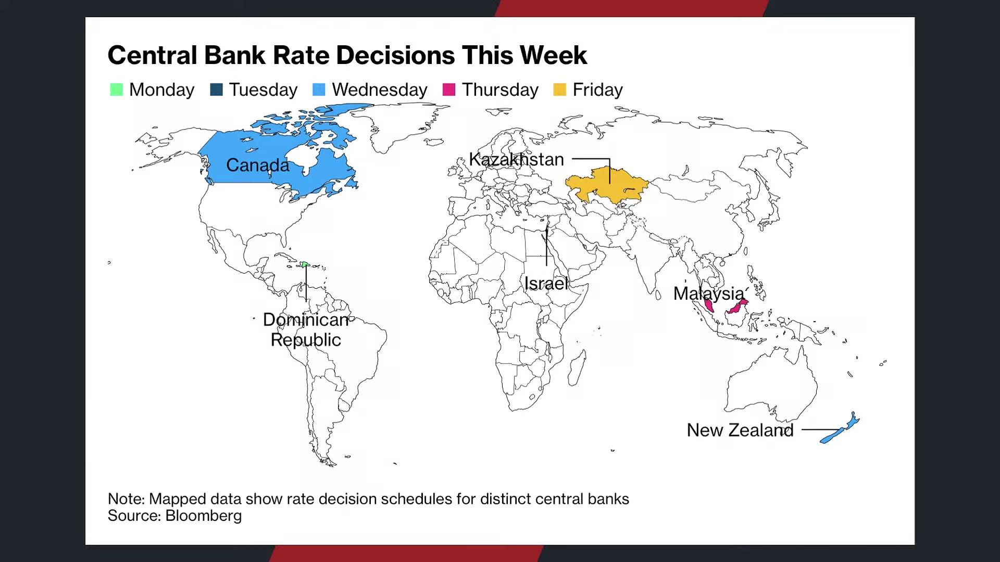

**逐字稿片段：** 紐西蘭也可能會再次升息 以此來對抗中東能源的衝擊 亞洲不叫分化 印度第二季的經濟成長率7.3% 馬來西亞是受到AI的顯著動能 本身而言都有可能保持在當前 內地位階沒有太大變動 那以前前一年 大家幾乎都在等降息 可是現在都要重新面對一個可能性 就是AI爆發以後 大多數經濟產業並沒有變得更好 可是AI把總體數據給推高了 導致沒有太多降息的理由 可是如果撇開AI 再撇開美醫戰士 早就該降息了 這就是目前所進入的死循環 那當然華許從15年前 就保持著比較相對鷹派的角色 那現在到底有沒有符合 當時原本的預測呢 至少從他心裡的根本認為 因為他現在也不願意 做太多的前瞻之意 我們也不確定他的決策依據是什麼 不是說他硬要講說 他要升還是降 也不是說暗示升還是暗示降 這種事你不知道 就知道他現在的具體的前瞻利率指引的決策依據是什麼 他根本就不做前瞻嘛

**話題推測：** 討論紐西蘭可能再次升息以對抗能源衝擊

---

## 00:07:31

**逐字稿片段：** 那如果我們仔細觀察 在07年到11年 這段時間他擔任聯準會理事的時期 其實比多數同僚更甘心通膨 所以他過去是一個標準的鷹派

**話題推測：** 審視華許在2007-2011年擔任聯準會理事時期的觀點

---

## 00:07:42

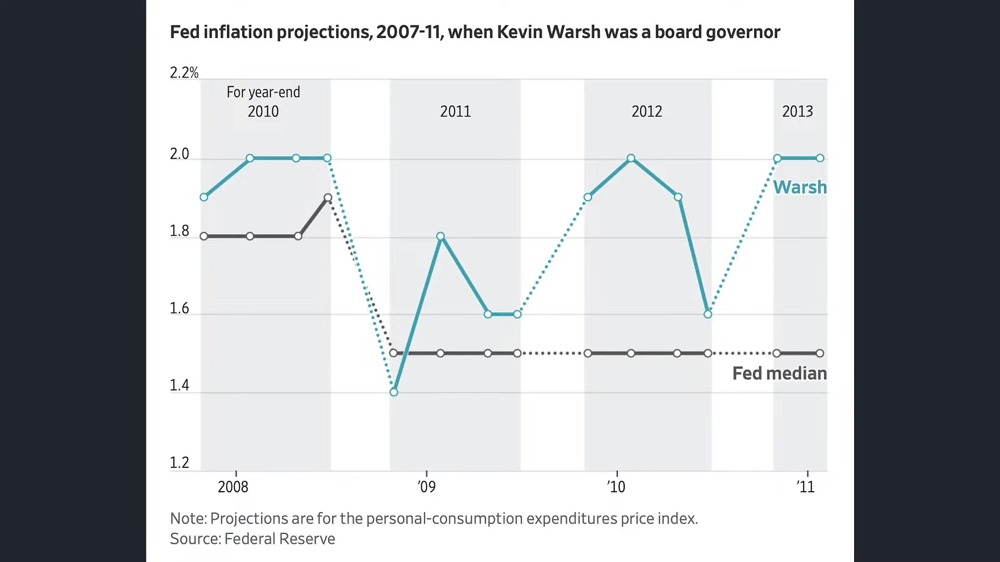

**逐字稿片段：** 金融海嘯以後 美國失業率一度超過9% 多數官員都認為大量的失業代表經濟還有龐大的閒置產能 所以物價是不容易上漲的 這麼差勁根本沒人消費 可是華許在08年09年 即便經濟這麼差勁 他都認為目前很有可能 失業已經產生了結構性問題 加上監管或者財政貿易政策 所產生的壓抑 所以高失業在這樣的一個情況底下 很有可能會讓供給鏈 部分產生斷鏈 反而讓通膨壓力來得更大 尤其08年以後又撒了這麼多錢 所以當時即便09年10年 幾乎都累通縮了 可是華許很擔心 撒了這麼多錢 他會塑造一系列的停滯性通膨 所以當時最通俗的時候 他都已經開始思考 停滯性通膨的風險 更何況是現在 所以大家會有一個心理的預估 華許也許跟川普之間 做了某些協議 某些政治承諾 不過從他骨子裡來看 當時經濟這麼慘 他都還抱持著 對於通膨極大擔憂 更何況是現在 所以華許其實 從離開聯準會之後 美國的失業率就一路降到 2020年的3.5% 通膨就長期低迷 我們有好長一段時間 幾乎十幾年通膨都非常低 消費幾乎無法做提整 現在反而變成了 經濟從總體數據表現非常不錯 內需經濟表現算平平 但是通膨極高 那麼目前按照他過去十幾年的經驗 他本身內部的態度 肯定也是比較平向硬派的 這比較合理 當然所以最大的壓力 就來自於通膨問題 如果把通膨問題給打消 其實他本身而言 就有回到降息通道的路徑

**話題推測：** 提及金融海嘯後美國失業率一度超過9%

---

## 00:09:22

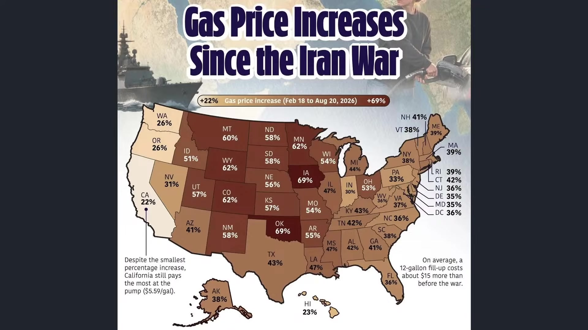

**逐字稿片段：** 因為我們必須承認 今年沒有美伊戰事 整個通膨路徑 這裡來講 現在不應該是上行的 從整個伊朗戰爭爆發之後 我們看美國汽油價格 在8月底 拿來跟228之前的戰前價格 來做對比 全美平均每家輪 大概多了1.25塊 哇那漲幅是44% 這就真的很多 如果一臺車 每年消耗450家輪 一年大概就要增加 560美元的價格 漲最多的是愛華州 汽油價格 美加侖是2.45塊 上升到4.14塊 暴增6成9 奧格拉荷馬州 也從2.29% 2.29美元 上升到3.87美元 漲幅也有68% 其他你反而 你說加州地區 因為油價已經很高了 它漲幅反而沒那麼多 大概是21% 可是就連油價這麼高的地方 它漲幅都有兩成 美加侖已經來到5.59塊 這件事情都說 說明著美國內部的壓力 民意上的反彈肯定會比較大 而汽油價格 能源價格 是讓本輪通膨壓力最大的根本原因 另外一方面 我們之前也提到 因為這次能源價格上漲之後 已經形成了部分的外溢效果 現在又有滲音現象 大家有沒有發現 臺灣這兩年極端氣候也很明顯

**話題推測：** 探討美國與伊朗戰事對通膨路徑的影響

---

## 00:10:37

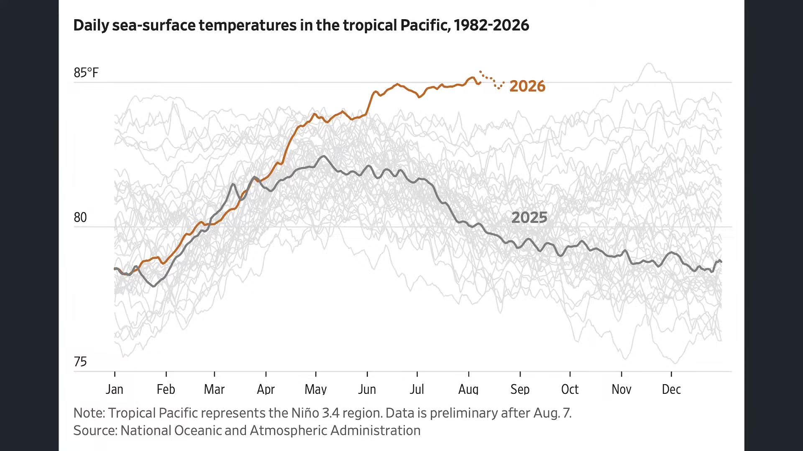

**逐字稿片段：** 巴拿馬今年5月到8月的降雨量 比過往少了34% 有一個地方瘋狂下雨 這肯定代表著另外一端 瘋狂的乾旱 所以這就是我們觀察到的實質現象 包括智利在7月份也遭遇異常的風暴 還下大雪 秘魯因為海水升溫 提前停止提魚的捕撈 魚粉價格也衝上歷史新高 這種極端氣候 包括盛音現象 都會導致全球的農糧價格 產生極大的不確定性 印度的季風降雨 目前已經比同期大概減少了 至少有13%以上 亞洲稻米產區的乾旱風險 也在快速的升高當中 所以米價今年漲幅大概是20% 按照這種速度 明年再漲兩成 全球就吃不起米了

**話題推測：** 展示巴拿馬5-8月降雨量數據

---

## 00:11:24

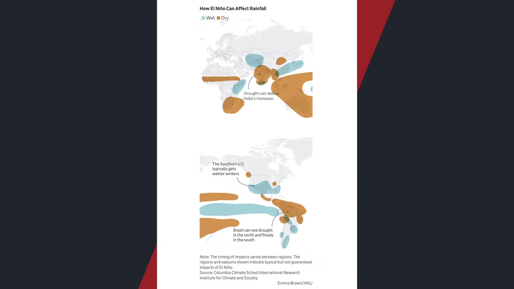

**逐字稿片段：** 所以這是第二層食品通膨的部分 第三層是AI所帶動的意外通膨 的確這個的確有一點超乎市場預期 原本都認為 今年的通膨應該就是主要集中在地緣政治 但是AI資本支出 的確正在製造新的通膨壓力 以前都講說AI會先壓低通膨 從生產力角度來看是如此 你只要用AEI就可以降低成本 降低成本等同於壓低通膨 結果因為你要降低成本 你要先蓋很多資料中心 你蓋資料中心的過程 就把通膨價格給拉動了

**話題推測：** 引入第三層通膨原因：AI帶動的意外通膨

---

## 00:11:56

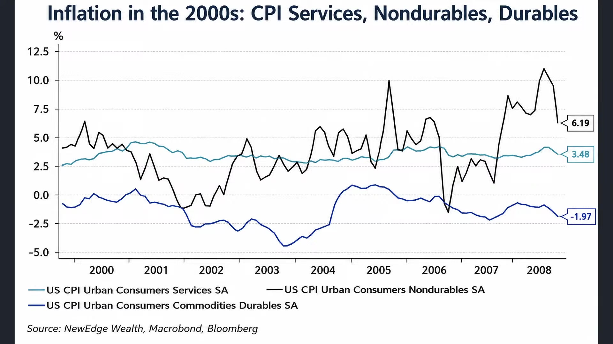

**逐字稿片段：** 所以今年資本支出 本來年初預估是成長30% 現在是成長80% 這種角度的確造成了 某種AEI生產力的奇蹟 但是帶動的效果 就是AEI的服務業成本 超級核心通膨 晶片價格 電力價格 原用料價格 還有資本本身的價格 就是資本本身價格就利率 錢變貴了 本身都在帶動通膨 進一步的往上拉 我們大概這幾個月 已經觀察到很明顯的跡象 就是AI我們用起來 是不是越來越便宜了 答案是如此的 就是你總有方式 用不付費的方式 可以問到AI 你想要問的問題 包括幫你生圖 生成影片 可是背後所需要的 晶片和算力反而越來越貴 所以等同於 現在用AI是很爽的 因為照理來講 你應該要付更高的訂閱費 可是他為了搶市佔 先給你低價 然後呢 反而是大部分的人在做補貼 先自己蓋資料中心 免費給你用 或者用比較便宜的額度 那最後所造成的效果就是 記憶體的算力成本 沒有同步下滑 可是AI價格在快速下滑 所以你的體感 你不覺得使用AI有多貴 可是真實來說 AI是非常貴的

**話題推測：** 比較今年年初預估與實際AI資本支出成長率（30% vs 80%）

---

## 00:13:06

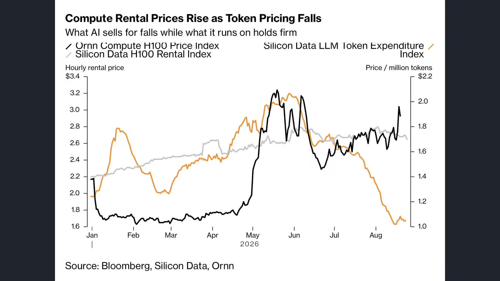

**逐字稿片段：** 我們看OpenAI在過去一個月 已經三度調降旗艦模型的價格了 但是半導體供應 我們知道現在還很吃緊 輝拿的伺服器預估2027年出貨 平均上漲是15% 三星也把先進晶圓代工的新訂單 調漲價格大概15%左右 所以不管怎麼說都會發現 現在科技通膨加上能源通膨 使得這件事情幾乎有一點難解 那也是華許所面臨的挑戰 這也是為什麼我們最終認為 他必須要釋放緊縮談話的原因 不過待會我們會談 他釋放不一定要真的做了 因為他也許在做一種前瞻之影 也許你沒有發現 可是他其實是在告訴你 我隨時都有可能升息 雖然你本來就預估今年會升益

**話題推測：** 提及OpenAI多次調降旗艦模型價格

---

## 00:13:48

**逐字稿片段：** 那我們回過頭說 現在美國的就業情況 是否代表著 就算他升息也沒有太多空間 甚至有可能 9月份的利率預期 只是曇花一現 也許過兩週會被壓下來了 因為美國就業市場 真的蠻糟糕的

**話題推測：** 討論美國就業情況對升息空間的影響

---

## 00:14:03

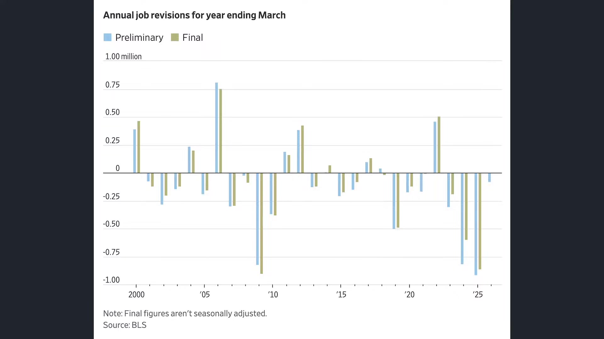

**逐字稿片段：** 這次勞工統計局 最新所公佈的數據 美國實際就業 在過去的一年內 可能又比原先預估的 少了7.9萬人 那以前已經校正迴歸很多次了 這一次又校正迴歸了 這說明前一年 我記得有一次是接近到百萬規模的修正 那個是有點離譜了 可是現在又每個季度 每個月度 幾乎每一次修正值都在往下修 其實就說明著 就業市場從過去幾個月以來 都是越來越差 我們把2023 2024 2025的數據拿過來看 幾乎過去三年 就業市場都在持續的萎靡 它沒有到大財源的地步 可是就是沒有新的公司 想要招募新的員工 基本都是舊有的職位 不斷在進行輪替 所以現在市場上 比較擔心的條件是 也許實體經濟表現已經不是特別好 可是有部分因素 支撐了目前的實體經濟 是什麼呢 資產價格 就是說傳統上 我們都知道 連總會面對通膨 主要就是升高短期利率 然後去壓低借貸和消費 但現在短期利率 可能已經對實體經濟產生影響了 可是對於AEI還沒有產生影響

**話題推測：** 呈現勞工統計局公布的美國實際就業數據修正（減少7.9萬人）

---

## 00:15:12

**逐字稿片段：** 你看私人部門的薪資年增幅 現在只剩下0.5% 失業之所以沒有明顯上升 那也有可能是因為 勞動供給已經同步減弱 這跟臺灣有點像 臺灣長期來看 失業率是一定要越來越低的 假設經濟沒有任何的波動 也沒有成長 失業率都必須要被迫越來越低 為什麼 因為少子化 那美國也面臨同樣的問題 美國只要沒有進一步的移民開放 本身失業率就會越來越低 所以它並不代表就業市場 持續大好 有可能只是反映 發達市場的勞力稀缺 一直在形成 那第二件事情 是股票市場 現在還是在歷史高點附近 那我們都知道 金融市場的貨幣換取 它會某種程度 堆砌起一定程度的消費 可是這種消費是很不確定的 很不穩固的 假設過兩個月 臺股跌到現在2萬點 你肯定不敢再訂機票了 你肯定不敢餐餐去吃buffet了 到時候我們就終於可以訂得到了 不過你大概也不想訂了 所以財富效應 它是代表著 它不是你實質上獲利的錢 你也會因此而決定 你的消費的擴張或者收縮 那現在的問題又來自於 其實內需經濟表現 並沒有想象中來得好 應該差不多要降息了 可是第一 通膨還在持續升高 第二 目前的K型經濟分化角度 財富換角的壓力 試圖還保持著消費 保持在緩步的增溫 所以很多人的看法是 第一 聯準會現在 感覺要應該繼續 縮減資產負債表 讓持有美國國債和抵押 帶款債券能夠自然的到期 那第二 聯準會應該用更多的監管潛力 讓AI融資 有透過更多的銀行體系能夠完成 不要大量的轉往私人信貸 那最重要的一點就是 華許很明顯是要讓市場知道 央行不會在資產價格 一出現大幅修正的時候 就立刻救市 市場現在已經有好幾十年 都存在這種聯準會保護店的期待 所以資產價格才越漲越高 那財富效應就永遠上去 那華許試圖想要打破 原本市場原本的共性 這給投資品種做些思考了 不過這次我們可以承認的事情 是川普親自任命的主席 現在很明顯已經變成了最大的主力 提名到現在你居然 你不要講說降息了 你連釋放即將降息的談話都沒有出現 這川普可能每一次看那個轉播都受不了 準備要罵又想到是自己提名的 壓力很大

**話題推測：** 顯示私人部門薪資年增幅數據

---

## 00:17:31

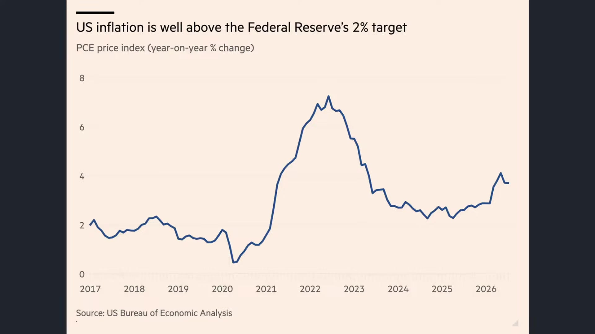

**逐字稿片段：** 那當然這種說變就變 情緒轉變大家也不要太當回事 我們很容易在資訊不完整的情況下 直接接受別人安排好的劇本 就市場原本是相信通膨正在降溫 聯總會即將降息 所以股市黃金比特幣就上漲 這前兩週

**話題推測：** 提醒聽眾不要過度反應市場消息的快速變化

---

## 00:17:49

**逐字稿片段：** 然後當聯總會主席華許表示 通膨改善不足 不足到讓聯總會能夠成功放行 金融環境也不是很緊縮 市場又改寫劇本了 變成9月份升息機率升高 就這樣子一天就可以轉變來轉變去 真正值得注意的事情是 華許並沒有宣佈9月份一定要升息 市場只是根據幾句話 就直接跟鷹派來掛鉤 重新建立一套完整的交易敘事 而這反映投資人往往不是先確認 聯總會說了什麼再說出判斷 而是先接受他應該會講起的劇本 等到新資訊出現之後 然後再急著切換成聯總會要升息 那面對市場消息 你最重要的就不是每天跟著劇情走 你要分清楚已經發生的事實 尚未確定的推測 以及市場自行加上去的想像 所以這件事情其實很重要 這種說變就變 情緒轉變也不要太當回事 我們很容易在 資訊不完整的情況底下 就每天在接受 別人的安排好的劇本 你要有自己心中的投資哲學 前陣子看到有個故事 講說朋友突然跑過來 拜託一個男的 兄弟幫我一個忙 我正在跟牧師的老婆偷情 等等做禮拜結束之後 你想辦法拖住牧師一個小時 那男的覺得很缺德 不過朋友都已經開口了 只好答應 那做禮拜結束以後 男生就瘋狂的去問牧師問題 問聖經 問天堂 問地獄 人生意義 全部都問一輪 那最後牧師受不了了 你今天到底怎麼回事 男的良心過不去 只好坦白 對不起牧師 我朋友現在正在跟你的老婆偷情 他叫我拖住你 那牧師沉默了一下 拍拍他的肩膀 孩子 你最好趕快回家 我根本沒有娶老婆 所以我們很容易在資訊不完整的情況下 直接接受別人安排的劇本 但受害的可能是自己 看到股市上的景氣一定好的不得了 看到聯準會轉陰就認為升息即將到來 看到比特幣大漲 美元性又要崩潰了 這種單線推論 這些不管是三段論推論等等 很多時候我們看到的片段消息 背後可能有更大的資金流向部位調整 你不要永遠只用一部分的資訊 來替整個市場補上完整的故事 即便這麼說 我自己個人都不覺得 九月份真的會升息 它目前所釋放的談話 跟九月份一定要升息 沒有太大的相關 它只是更注重通膨問題而已 搞不好只是一種前瞻指引而已 好 那回過頭來說 現在更大的問題 其實來自於債券市場的利率變化 因為雖然華許釋放出 比較鷹派的談話 可是貝森特 他連話都沒講 他都直接做非常寬鬆的措施 我們知道貝森特 現在最大的麻煩 就是他已經準備要採取寬鬆了 在9月份 可是政策並沒有湊效 反而市場開始質疑他的判斷力 你看在短短一個月以內 他先動用公共資源來支撐日元受到批評 那現在日元匯率又回去了 不知道要不要做二次互盤

**話題推測：** 描述華許鷹派言論後市場對9月升息機率升高的反應

---

## 00:20:51

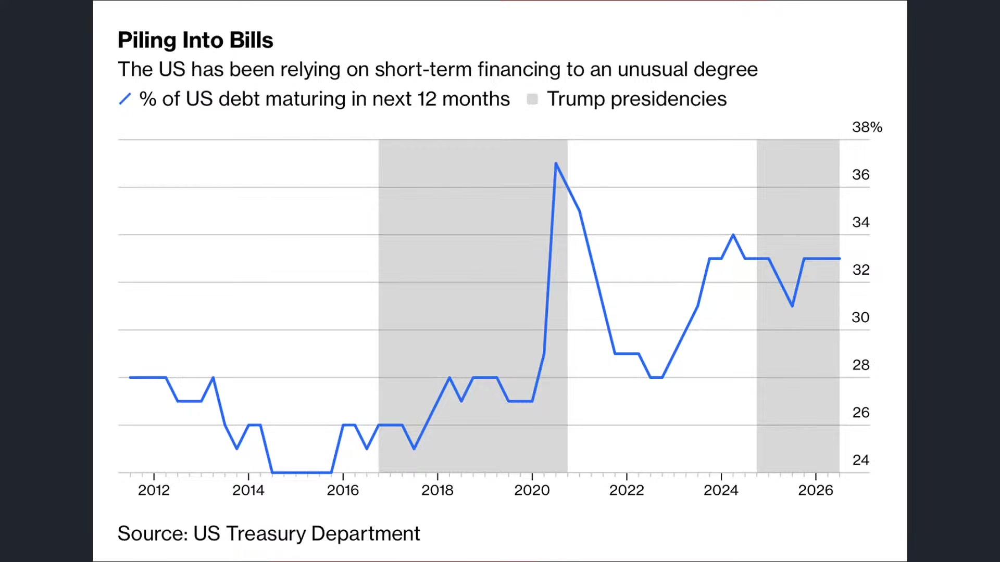

**逐字稿片段：** 再來是他的前導師 當時都公開批評這種操作 用擴大美債回購來壓低長期利率 而並不是用聯邦赤字的改善 那畢生特訓貸 我們看財政部又傳出信息 準備動用TGA的資金 來直接購買長期公債 而且資金量體預估會非常龐大 TGA可以理解成 美國政府的銀行賬戶 這裡面有很多錢 用完對於美國的預算壓力會很大的 因為它有很多是要直接做天然災害 或者因應政府關門的水位 目前規模是9540億美元 這幾年是故意保持在比較高的水位 因為政府太常關門了 錢不夠壓力很大 如果把這些現金拿去買償債 效果就不只是單純去調整債務期限 那你等同於把財政部的流動性 灌到金融市場當中 所以雖然這樣子算不算量化寬鬆 因為量化寬鬆應該是央行在做的 應該是聯總會在做的事情 但財政部版的量化寬鬆 隨時都有可能開始 那這邊最大的矛盾 就是我們剛才提到的 華許在收錢 被認特正在反向放錢 一個在做信用管制 一個在推新青安 不是 這兩個不違背 這個是福利政策 我講的是財政部繼續的進行刺激 可是央行一直在收錢 那麼最後就取決於兩者的角度了 但是至少可以呈現的是 雙方明顯不同調 現在如果連TGA的現金都拿來買債 就會變成直接縮減政府手上的安全墊 那根據財政部借款諮詢委員會的分析 美國政府每週支出規模大概有數千億美元 平均真正額外保留的緩衝資金大概就2000億 所以其實錢也沒有這麼多 賬面上算是接近一兆了 真正能夠動用的不過就2000億 2000億 那對於聯準會目前的寬鬆力度 或者說整體資金規模 還有美國債務的40兆美元的體系 這筆錢其實也不是多大 那第二個問題就是 美債回購制度 本來就不是拿來操控殖利率的 最初的回購計劃 通常都是改善非最新券的市場流動性 因為通常財政部不斷髮行新債之後 舊券的交易量可能會下滑 那你透過回購 就可以讓整體的美債市場運作更順暢 它是一種流動性的角色 就是有不好賣的古董 那你交給我 我可以稍微幫你轉化一下 但是並不是讓你做大量的 大規模貨幣寬鬆 來讓所有的古董流動性突然就變增長了

**話題推測：** 引述對貝森特擴大美債回購操作的批評

---

## 00:23:15

**逐字稿片段：** 所以現在比較大的一個問題 其實就是政策溝通越來越誇張了 以前他提出333 預算赤字降到GDP的3%失敗 經濟成長率3%失敗 能源增產3%失敗 所以目前赤字目標 還反而是失敗當中的失敗 然後最近他又把伊朗的金融制裁 形容成D-Day 宣佈要發動史上最大規模的金融攻勢 結果到目前為止 還沒有公佈一家確切的大型金融 結果其實D-Day 因為D-Day通常都是 採取行動之後的事後的公佈 很少是我宣佈要在 採取經濟制裁之前宣佈一個D-Day 就跟那個八年抗戰一樣 同志們加油 我們已經是 八年抗戰當中的第七年了 再堅持一年 我們就要勝利了 這種感覺一樣 你怎麼會知道是低貸呢 不管怎麼說 這次事件的確 讓市場上知道 財政部目前的態度 跟目前滑雪的態度 是顯著分歧的 那這個債券體系的壓力 它又會重新回過頭 壓力回到美國的債券市場身上 導致公債殖利率 仍然居高不下 然後這個市場上 壓力最大的部分 那麼華許這次是並沒有特別提到 針對美國債務產生的負擔效果 它更著重於當前的通膨 和就業市場的平衡 而並不是去處理美國債務的壓力 但是我們要知道 美國的國債現在突破40兆美元以後 現在已經真的很難回頭了

**話題推測：** 批評當前政策溝通的誇張性

---

## 00:24:45

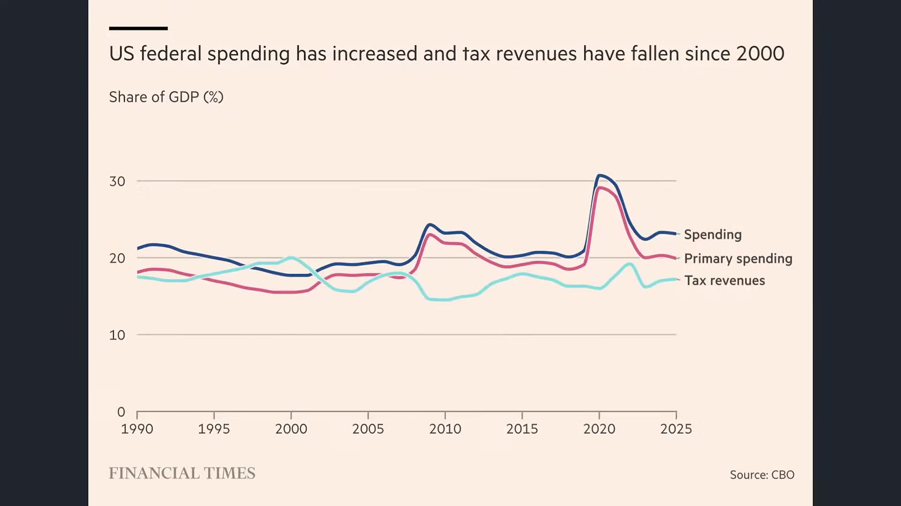

**逐字稿片段：** 我們看最新數據是40.047兆 當時我們知道 40兆美元當然只是一個里程碑 但重點來自於利息支出的上升 越來越快 先看債務佔GDP比值 2001年大概是31.5% 當時聯邦政府甚至連續4年出現財政盈餘 現在這個比例是100% 差不多就是回到1945年的高點 差不多就二戰時期 當時升那麼高 從40%上升到100% 主要原因是打仗 所以借很多戰爭國債 現在也算打仗 不過我們很清楚知道 是整體美國的債務 在過去十幾年週期的膨脹 現在最大問題就是 美國已經沒有再衰退了 它沒有在重大經濟危機的年份 持續出現相當於GDP 約6%的財政赤字 那現在利率又這麼高 那你看起來現在要進行 發短就長 把長天期國債給買回 那你肯定財政部未來 有更多的短期國債的發行計劃嗎 那到時候的利率壓力 或者利息壓力 就會越來越大 這個是市場相對不樂見的 這是第三層 我們看到在華許的放音政策底下 加上貝森特目前的財政政策 基本上已經前縷繼窮 就是儘可能把自己的政策給拖出了 市場上也無法去預估 你有更進一步的寬鬆措施了 都導致債券市場可能會持續 遭受到一陣子的沉壓

**話題推測：** 顯示美國最新國債數據為40.047兆美元

---

## 00:26:14

**逐字稿片段：** 最後當然就是川普所採取的做法 雖然川普嘗試了淡化過去的通膨壓力 嘗試進行牛肉關稅 或者部分關稅的赦免 不過我們知道 現在美加的關係仍然不是特別好 一旦一系列的關稅貿易戰 重新爆發以後 會不會導致美國內部的通膨快速傳導 因為它並不是根據什麼 電子產品的消費性通膨 它是直接針對一美元 對一美元的報復措施 那比較困惑的是 因為雙方連談判為什麼破滅 其實都還是有不同說法

**話題推測：** 討論川普可能採取的牛肉關稅或部分關稅赦免

---

## 00:26:45

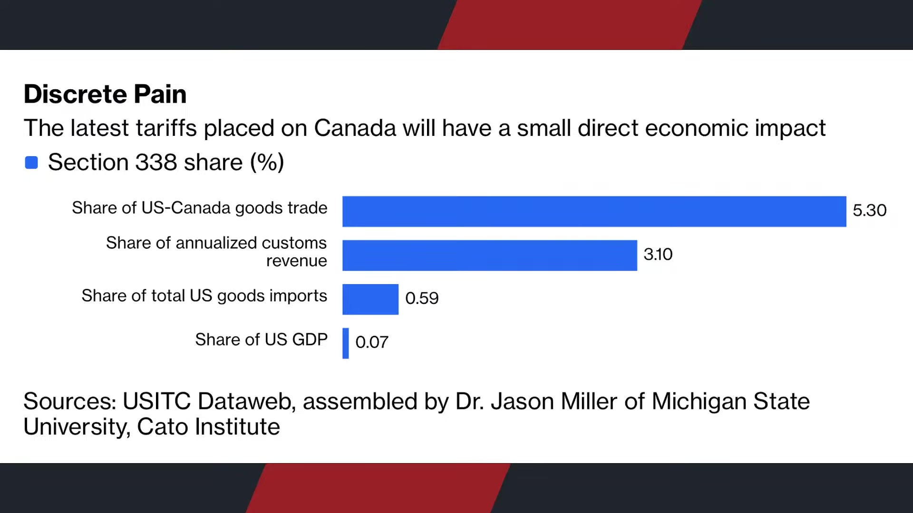

**逐字稿片段：** 卡尼的意思是說 美國最後階段所提出的條件 加拿大無法接受 他還硬要多提一個 傷害加拿大的主權 那麼美國貿易代表則是否認華府在最後一刻突擊 他認為加拿大本來就應該要接受 雙方都可以接受的一個協議 但是大家對於談判的基本事實擁有完全不同的認知 所以最後最基本的互信都開始消失 那比較麻煩的是美國這一輪談判 因為川普都已經放話了 那有一種零和思維 就好像你對方讓一步 然後就被解讀成有繼續施壓的空間 所以就一個要求接著一個要求 那對於加拿大來說 那為了選票 你要不要接受一套 可能被國內理解為犧牲主權的條件 傷害經濟是一回事 傷害我的選票 那肯定是更重要的 所以明明加拿大其實面臨的經濟風險 遠遠比美國來的大 但民意反而大多數是支持政府退出談判的

**話題推測：** 引述卡尼對美加貿易談判破裂原因的說法

---

## 00:27:45

**逐字稿片段：** 目前有四分之三的加拿大認為 加拿大人認為 政府立即選擇離開談判桌 是正確的決定 所以加拿大民眾 當然不是不知道貿易戰會痛 但是大家認為這個代價相對於持續退讓 感覺更能夠接受 那這種僵局很快的會往下進行傳導 如果我們細看 目前這一份關稅清單所實施的規模 主要集中在能源肥料礦產海鮮 以及原本就已經受到國安關稅的金屬器材 或者一些木材汽車價格等等

**話題推測：** 展示加拿大民眾對政府退出貿易談判的支持度（四分之三）

---

## 00:28:18

**逐字稿片段：** 那清單當中現在554項 即將在9月中旬左右來克取關稅 有66項去年根本沒有加拿大進口 另外有136項進口金額不到100萬美元 所以有三分之一其實有點像政治宣誓 但是有比較龐大的一個關稅衝擊 會反映在具體的一些進口物品身上 比如說能源和肥料價格 我舉例來說 你像2025年供應美國進口威士忌 大概加拿大有73% 這個金額不大 可是對於加拿大本土的壓力是很大的 其他像乳製品或者乳清蛋白 大概也佔了45%到95%的加拿大的一個出口 所以這一次其實市場壓力是很大的 因為雙方都知道真的打下去 美國的通膨一定會因此而揚升 好我們看一下美國股市四大指數表現

**話題推測：** 說明關稅清單中554項產品及其中無進口或低進口額的項目

---

## 00:29:07

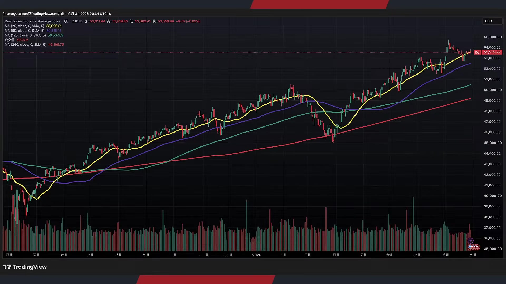

**逐字稿片段：** 道瓊下跌9點0.02% 所在53559點 標普下跌19點0.25% 所在7711點 納指下跌138點0.52% 所在26402點 最一半下跌412點 3.47% 是在11469點

**話題推測：** 顯示道瓊指數收盤數據

---

## 00:29:22

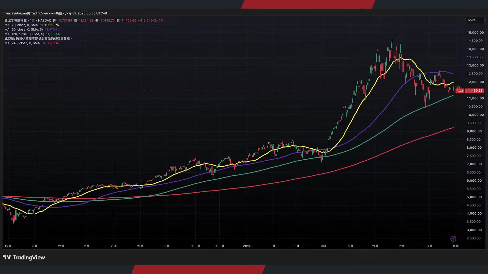

**逐字稿片段：** 臺股你不要看上禮拜 還是有受到市場上一些壓力 不過上禮拜周性 還是漲了1100點 我們就看一下 過兩分鐘開盤之後的實質表現 但臺股的現行 很明顯比美國股市費半 看起來表現還要好得多 其實我們主要跟投資品 就稍微做一些宏觀上的分享 你會發現 如果真的因為短期的一次 利率預期的轉變 一次談話 就大幅的轉變你的投資決策 那其實是有很大風險的 因為新聞每天都有 好 臺股開盤下跌477點 收在45869點 還好啦 先不用回公園 那文字這麼多

**話題推測：** 討論臺股上週的表現（周漲1100點）

---

## 00:30:02

**逐字稿片段：** 好 By the way 順便宣傳一下 本週六晚上8點鐘 就是我們2026年財經號角 第四季的聽友會了 那每個季度我們都會針對 當前行情來做一些推演 也會針對過去一個季度的 資產操作和行情判斷來做檢討 直播主要就是分享一些市場動態 那大多數的實質觀點 會在我們的會員系統 或者在我們聽評會當中 來做一些分享 我們每天聊的數據其實很廣 那你總要有一個判斷依準 這些數據最後形成什麼樣的一個決策 但是當然每個人的吸收角度不一樣 有些人覺得聽聽就好 有些人當新聞 有些人聽聽笑話 那都OK 那總而言之 能夠提供大家有進一步的思維 更客觀的知識 更客觀的宏觀數據 那也是我們的榮幸 因為前陣子放暑假 今天才剛開學 之前就看到那個爸爸不是 常常給那小朋友一堆閒書嗎 然後暑假不是教小朋友 看股票 你先學財經這樣子 兒子問 爸爸 為什麼我們要多讀書 那爸爸說 如果你讀了書 炒股票的時候 你就知道什麼是非農 什麼是零售銷售 什麼是華許 什麼是FOMC利率決策會議 什麼是人均GDP 購買力循環 庫存循環 停滯性通膨 這些你就懂了 如果我不讀呢 爸爸說如果你不讀書 你只會說靠又跌了 所以讀書最大的好處 不是讓你遇到的事情變少 你至少可以看得懂 講兩句 講兩句這件事情 也是很重要的一件觀察重點

**話題推測：** 宣傳即將舉行的財經號角第四季聽友會

---
