# yutinghaofinance_FsIraI_ezPI — 關鍵畫面索引

- 來源逐字稿：[yutinghaofinance_FsIraI_ezPI_FIN.srt](yutinghaofinance_FsIraI_ezPI_FIN.srt)
- 影片：https://www.youtube.com/watch?v=FsIraI_ezPI
- 截圖數：28

## 00:00:36

**逐字稿片段：** 昨天道瓊跌了440點, 反而9月份跌最慘的是道瓊, 月季線都是雙雙收黑, 不過現在更為值得觀察的事情是, 現在十年急公債之利率還在衝高, 那到底什麼樣的效果會對於科技股形成沉壓呢? 畢竟現在好像賣鴨都是集中在傳參股 都是實業股 科技股的表現在9月份和第三季的行情 現在正式落幕之後 表現還不差呢 所以利率這麼高 是不是能夠跟相對高股價能夠並存呢 不過至少是相對低基期 大的本益比都在下滑 納指在9月份單月是上漲了接近有1.9% 標普維護下跌0.5% 道瓊是重挫了4.3% 那要如何來理解這樣的一個現象 在高估值的區間 到底道瓊是否還遭受到 如此大的一個劇烈衝擊 今天來跟投資朋友做一些留意 首先我們觀察到 對於美國股市 這一次大家最為關心的是

**話題推測：** 道瓊指數下跌數據

---

## 00:01:35

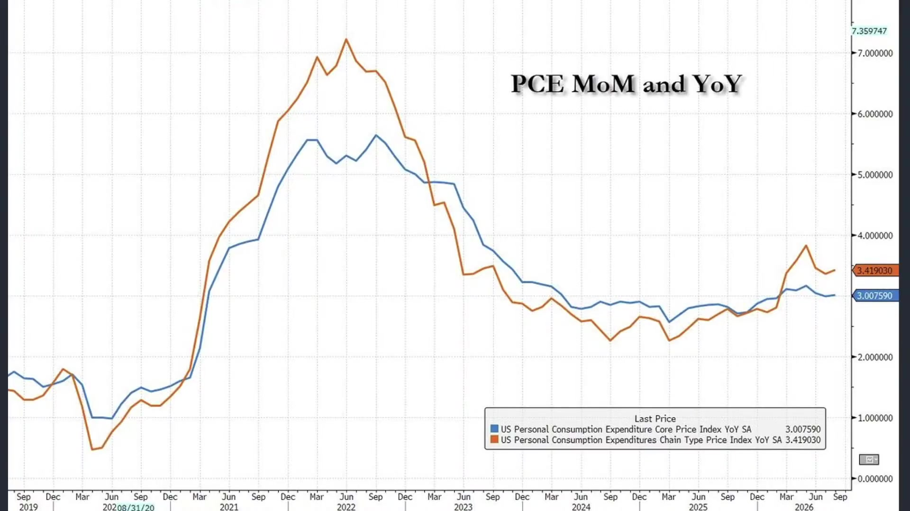

**逐字稿片段：** 核心通膨的部分 反而意外的降溫 在整個8月份 整體物價指數月增幅是0.3% 這算是符合市場預期 年增幅只有3.4 這個就比原本市場預估的3.7% 還要來得低了 其實你有CPI和PPI之後 已經很好的去估計 PCE物價指數不太可能會失控 可是它至少還是比預期還要來得低 算是一個好消息 如果排除食品和能源 月增幅大概只有0.2% 也比市場預期的0.3%還要來得低 核心年增幅則是降到3%左右 這也比市場原本預估的3.3%還要來得低 至少從這份數據來看 10月份立即升息的壓力應該是沒有了 不過我們仔細來做一些拆解 你會發現通膨壓力還是沒有消失

**話題推測：** 核心通膨數據與市場預期對比

---

## 00:02:24

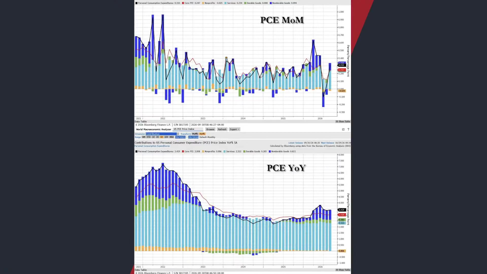

**逐字稿片段：** 尤其是在深藍色區塊 也就是在能源通膨的部分 壓力還是比較大 尤其在把排除住房之後的核心服務價格 現在月增幅還是有0.4% 其中我們看到 其他服務類別的價格指數 是大漲了0.9% 如果細節觀察 這個很明顯 是手機價格 手機方案 以及教育成本的上升推動的開學季 那更重要的是8月份的物價指數 其實還沒有完全反映完

**話題推測：** 能源通膨壓力的圖表區塊分析

---

## 00:02:54

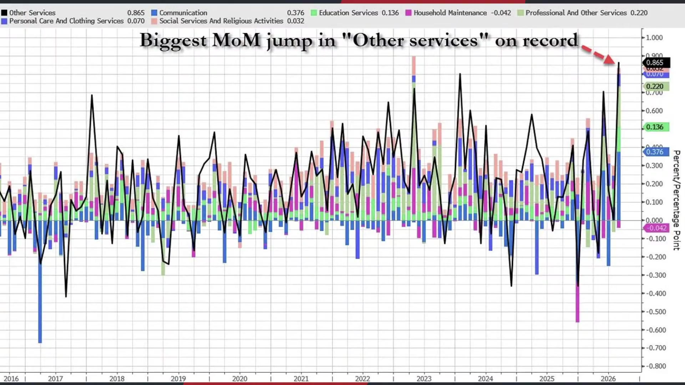

**逐字稿片段：** 9月份的能源市場的劇烈變化 我們知道現在美國的柴油價格 又創下歷史新高了 這個汽油價格也在持續的 往下游來做傳導當中 所以其實9月份的物價水準壓力 應該是比8月份還要來得更為大一點的 那唯一值得有一個好訊號是什麼 就是美國的消費 看起來沒有說收縮到一定的離譜地步 雖然收入已經開始有點跟不上了

**話題推測：** 九月份能源市場變化與柴油汽油價格走勢

---

## 00:03:19

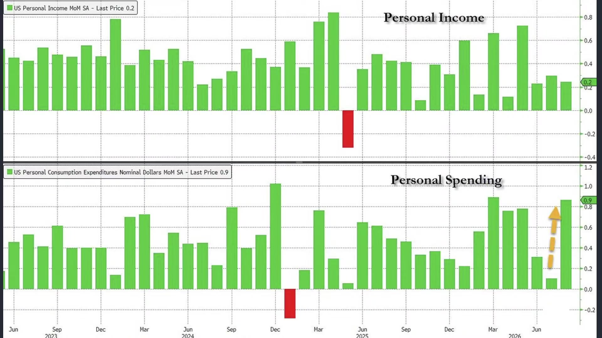

**逐字稿片段：** 美國市值薪資現在又開始轉負了 可是8月份的明目個人消費 支出月增幅是0.9% 明顯比7月份的0.1%增加了幾點9倍 所以從這樣的一個角度來看 大家花的錢還是很多 但不代表說大家過得更好了 只能說因為個人所得只增加0.2 你的消費增加0.9 你的個人所得只有增加0.2 那就是實質購買力衰退了 所以衰退是衰退 但至少現在的你的儲蓄量 你還是有能力去因應如此高的物價 這是往好的方向向 如果真正的情況是消費已經收縮了 而物價還在繼續上漲 那就完了 現在就是稍微稀釋一下購買力而已 所以我們看到唯一的結果就是 美國的家庭現在進一步的消耗儲蓄 個人儲蓄率的部分 從7月份的4.6% 現在降到8月份的4.1% 這個是2022年以來最低的水準 所以我們現在的確迎來了 在過去4年來最大的購買力衝擊 當然這一次的核心通膨大幅降溫

**話題推測：** 美國實質薪資轉負數據

---

## 00:04:25

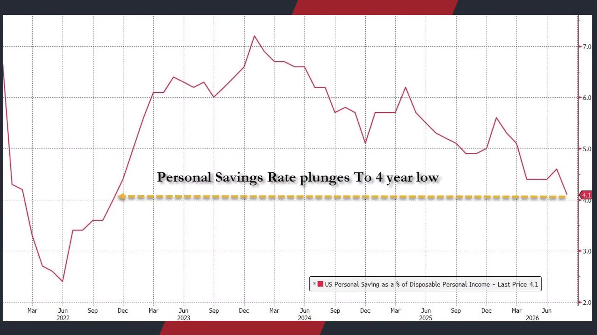

**逐字稿片段：** 還有一部分來自於統計方法的調整 包括投資組合管理服務 電腦軟體或者法律服務的計算方式都被修改 而且已經回縮到2021年 所以這份數據還是有點矛盾 賬面上的核心通膨 的確比預期還要來得漂亮 不過服務通膨還是有壓力 家庭收入的增速又跟不上消費 儲蓄率還在持續的下滑 能源價格還沒有完全的反應 所以從這些數據來做觀察 只能夠說稍微暫緩了 10月份的升息壓力 但不代表接下來的利率預期 會全然消失 其實真正最大的壓力

**話題推測：** 通膨統計方法調整說明

---

## 00:05:01

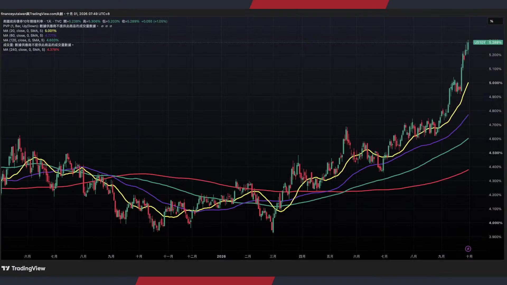

**逐字稿片段：** 還是來自於市場的投票利率 10年期美債值利率 哇 昨天週三盤中碰到5.3 最後尾盤是收在5.29 還在衝高 這一波不知道衝高到哪裡去 真正有趣的是 它衝高到這樣的一個地步 好像受害的都是道瓊 科技股好像也沒什麼太大影響 從十年期美債殖利率 這一次突破5%來看 一定會對於某些人來說有吸引力 而且尤其只對持有一年的投資人來說 風險在於殖利率只要再往上走一點 債券價格的下跌 有可能就會吃掉利息的優勢

**話題推測：** 十年期美債殖利率突破5%走勢圖

---

## 00:05:36

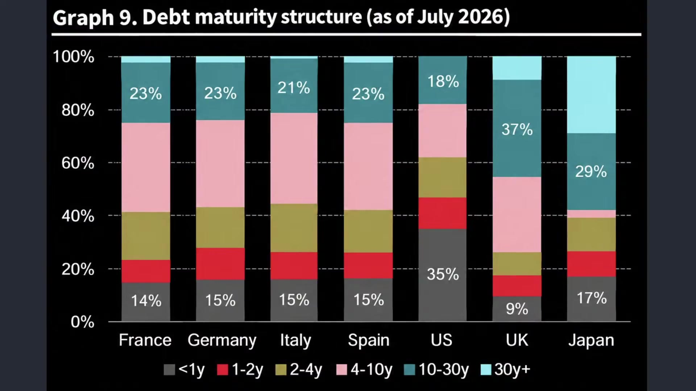

**逐字稿片段：** 我們以聯準會未來一年 每季如果都升息一碼的情境來做估算 持續投資三個月的國庫券TIPS 一年大約可以獲取4.5%的報酬 那十年金額在殖利率如果不變 一年總報酬大概5.13到現在5.2 但殖利率只要再升高十個基點 報酬就有可能下滑4.4% 所以這個就是大家會擔心的空間 真正最麻煩的是從圖表上來看 就是美國財政部其實沒有太多等待的空間 我們看美國其實有35%的政府債務 一年內就要到期了 這個相對於法國的14% 德國的15% 意大利15% 英國9% 日本17% 美國是有非常多的債建 即將要到期了 大概60%都是在4年內會到期 這就必須要借新還舊 美債現在平均利率是3.1 但目前市場融資成本是4.8 你等於借非常貴的利息 然後去還以前的債務 代表高利率會隨著舊債到期 逐步的反映到政府的利息支出當中 所以如果不降息 或者利率持續保持在高位 你又一直髮債 那麼美國人的債務 以前都是欠你五年十年之後再還你 現在過一年就要還你了 而且還要付你這麼高的利息 那麼整個美國的財政問題的壓力 來得越來越大 所以我們才講說 這一次美債殖利率的上升 不能夠完全怪給通膨 通膨是一個重要的因子 可是更重要的原因來自於 哇你有35%的債券 一年內就要到齊了 你還要再發行 更高的殖利率的債券給我 我敢接嗎 這個就是市場上 針對整個美債的實質擔憂 當然它還是流動性最好的產品 所以不見得會市場上進一步的崩潰 可是至少市場的遲疑是真的 好那高利率你說 到底對於美國股市 好像指數沒有太大的影響 細節來看呢 其實慢慢的產生效果了

**話題推測：** 聯準會升息情境下不同債券報酬率預估表

---

## 00:07:34

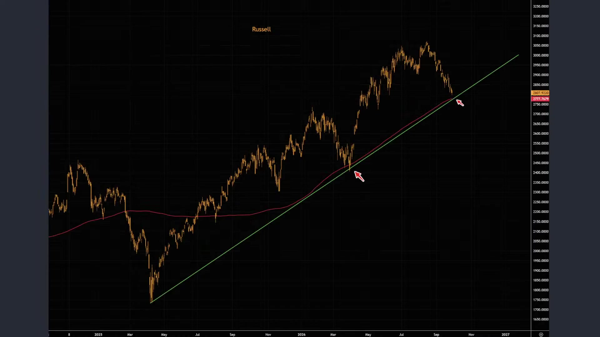

**逐字稿片段：** 第一步就是小型股的部分 我們過去提過小型股一直都是高利率環境底下最受傷的族群之一 米浪聯發科臺積電借的錢多個一個基點 兩個基點十個基點二十個基點 其實沒差了 人家毛利率賺的錢這麼多 貸款條件稍微緊一點都不受到太大影響 可是很多中小型企業他就靠那一點利率活下去 羅素2000在整個8月份的高點這樣子跌下來 已經跌了快要10%了 同期是明顯落後給標普白指數 那背後最大的壓力 其實就是美國十年期公債 殖利率的快速上升 小型企業通常它的負債比較高 融資的期限比較短 所以市場利率上升的時候 資金成本會比大型企業 反映的更為快速 那現在不只是基本面承壓 還多了一股機械式的賣盤 我們如果細節觀察 現在市場上小型股 同時面臨著高利率 加上系統性的資金賣出 因為AI行情都是集中在部分的科技巨頭 所以如果你錯失掉這些科技巨頭的漲幅 那很有可能在未來的AI爆發期當中 就會錯失掉長期的資本回報 可是小型股的部分 由於握有AI終端頂尖技術的產品 並不是特別的多 所以反而容易為了要穩住指數 賣更多的中小型股 如果以羅素2000來看 現在從長期的趨勢支撐來做思考 其實已經有一點跌破的感覺了 我們到時候就要來更進一步的去觀察 這一波上升趨勢線是否會順勢跌破 第二個就是對於利率比較敏感的公用事業類股 這個看起來就是道瓊下跌的主因 現在已經打到一個很極端的位置 過去兩個月美國的公用事業類股ETF叫做XLU 這一次拋售情況也非常之劇烈 已經跌破年線了 相對強弱指標大概也降到了近年的新低 因為XLU其實這幾年 大概都跟是年紀公債殖利率 呈現高度的反向走勢 殖利率越高 公用事業這類高股息 資本密集的產業 它的估值和融資的壓力來得越大 所以從這樣的一個角度來做思考 美債殖利率開始延伸到 道瓊以及中小型股的市場成壓 照理來講 美國科技股也該跌了 可是它還是沒跌 原因是什麼 因為美國科技股是少數在板塊當中

**話題推測：** 高利率對小型股的影響及羅素2000指數走勢

---

## 00:09:59

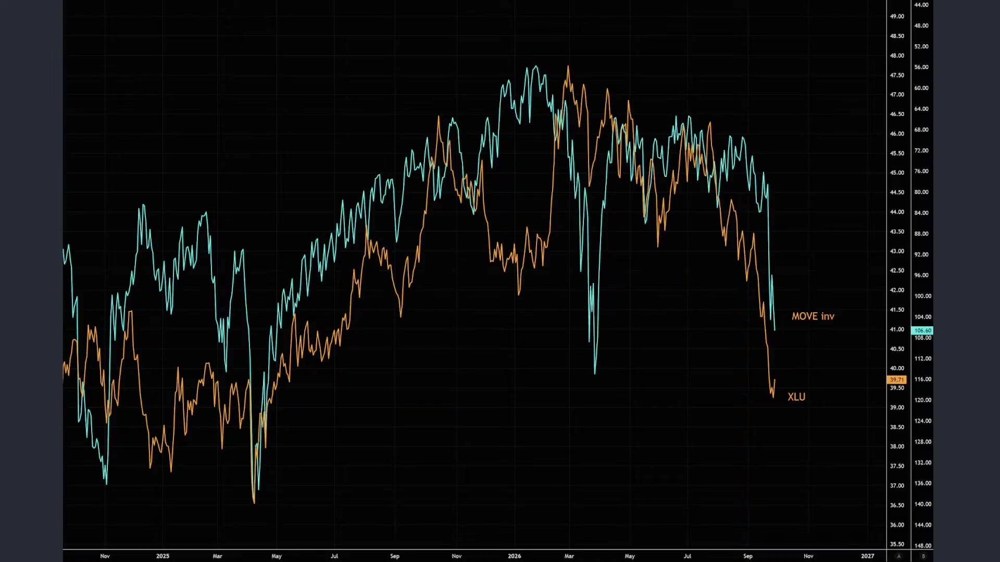

**逐字稿片段：** 獲利正在大幅成長的 所以它的股價雖然沒跌 不過本益比也下滑非常多了 所以其實大家都在跌 只是有的是在跌本益比 有的是直接跌股價 跌股價的通常是獲利上升 幅度沒這麼快的 那這裡形成一種結果 就是在整個9月份 現在最大的矛盾就是 指數看起來沒有跌多少 甚至納指還在走高

**話題推測：** 科技股獲利大幅成長圖表

---

## 00:10:20

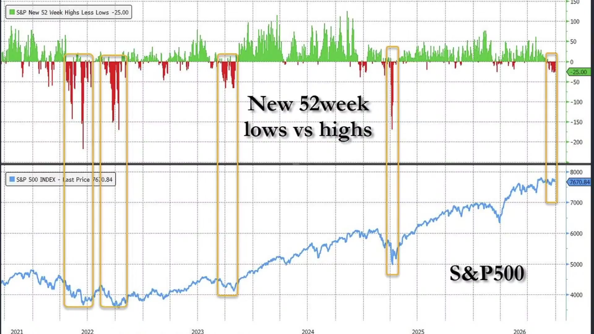

**逐字稿片段：** 但是多數股票其實已經明顯修正了 標普整個9月份現在是跌0.5% 不過成分股有78%收黑 11大類股當中更有9個是下跌的 金融股下跌6.5% 房地產跌了6.2 原物料跌了6% 反而資訊科技上漲了4.8% 通訊服務上漲了5.1% 那個股差距更誇張 很多個股跌都是三層四層起跳 在標普白指數當中 結果指數居然還在高位 持續的走高 所以這就代表著 內部的裂痕看起來來得越來越大了 成分股的中位數 下跌平均是4.5% 但是從總平均數來看 僅僅只有下跌0.5% 這說明著 現在就靠少數幾隻科技巨頭 硬是把指數撐在高位 不過對於部分個股而言 其實大概也做了 比較大的本益比修正

**話題推測：** 九月份標普500成分股與指數表現對比

---

## 00:11:15

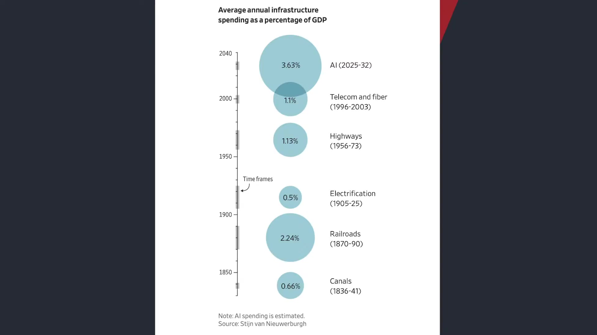

**逐字稿片段：** 其實從美國的AI基礎建設 到現在為止 還是可以看得出來 硬體股獲利上升幅度 為什麼會這麼快 從整個25年到32年 現在AI基礎建設的總投資 大概預估已經上升到10.3兆美元 平均每年相當於GDP的3.6% 規模我們看起來已經超過了鐵路革命 公路革命 電氣化革命 甚至已經超過了2000年的網路建設期 現在光是AI投資 今年大概佔美國GDP就已經高達1.9% 所以這就是大量的資金往資料中心來做集中 那就排擠到其他資產價格或者產業的表現 如果我們以實體建造量來看 從整個2025年以來 私人的建築 不管是做商辦 還是我們看到的 整體私人住宅 基本上都在快速的往下掉 可是資料中心是少數 不斷的往上累堆的 所以我們才講 昨天提到說 為什麼現在的擔保債券 跌勢正在進一步的加劇 因為AI的好 已經抵過所有的不好 硬是把指數給撐在高位 另外一方面 也把錢都給吸走了 我們之前才提到

**話題推測：** 美國AI基礎建設總投資額與GDP佔比圖

---

## 00:12:27

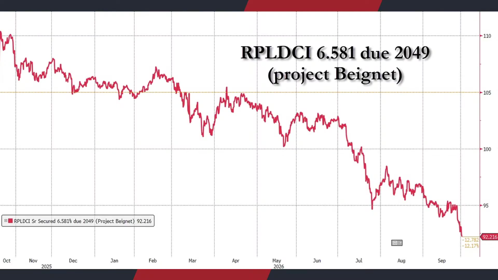

**逐字稿片段：** Meta這一次在2049年才到齊的債券 這個習票6.58%的擔保債券 現在跌勢已經跌到92塊了 本來面額是100 這其實已經跌算是蠻重的 所以即便大家陸續開出7% 8%的直列率 還是有人願意繼續往下借錢 都足以彰顯的 這些巨頭相信AI是真的 所以敢勇敢的往下借 那從AI基礎建設類股 目前的本益比 中位數來看 4月份大概是32倍 所以不能講說非半沒跌 它就是跌本益比而已 大概從32倍跌到 現在接近22倍左右 所以從整體估值來做計算 我們現在大概對於

**話題推測：** Meta 2049年到期債券價格走勢

---

## 00:13:09

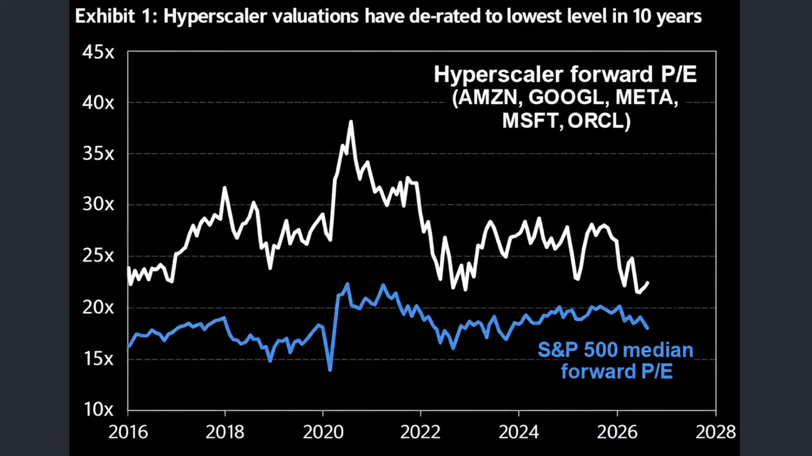

**逐字稿片段：** 未來的情境有幾種規劃 第一個就是 現在的下跌 其實是反映資金變得更緊繃 無法讓所有肋骨都給推高 第二件事情是 如果硬要做選擇 大家還是優先選擇那些科技巨頭 雖然你覺得科技巨頭也沒有怎麼漲 但至少他沒怎麼跌 原因就來自於 他的獲利還在往上推 第三階段就是來自於 這些雲端業者未來幾年的爆發 他至少先對於硬體的製造商 有了一股支撐 先不論AI會發展到什麼地步 至少錢會先進來

**話題推測：** 未來市場情境規劃（多點說明）

---

## 00:13:40

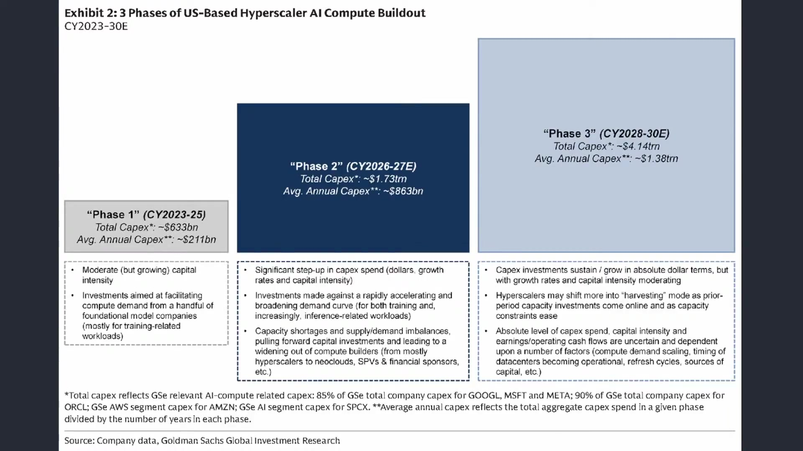

**逐字稿片段：** 高盛大概分為三個階段 2023年到2025年 就是過去幾年 確定GPT剛發表 大概是6330億美元的資金規模 那今年到明年已經暴升到1.7兆 明年到2030年預估還要再投4兆 平均一年是投1.3兆 那第二階段已經大概投 現在有70%左右已經真實投進去了 你像今年 你像Amazon是投了4000億 Google投了4700億 微軟投了3200億 那Meta大概也投了3091左右 現在比較大的問題就折舊了 因為AI的運算設備 大概是使用5年 資料中心通常建一個資料中心 至少用15年 在這個前提底下 第二階段就是現在 資產每年的折舊大概就2700億了 六家公司必須每年要創造 1640億美元的營業利益 只有才能夠拿到1295億美元的 稅後的營業利益 達成15%的資本回報率 所以現在問題又來自於 GPU的實際經濟壽命到底是不是5年 還是其實更短是3年了 如果太頻繁的去換晶片 AI所需要跨越的營收門檻 就會進一步的提高 所以這個是目前在AI發展過程當中 大家最大的質疑 就是我們現在買的這些產品 會不會其實買的過貴了 以後沒有這麼貴 可是我們必須要創造更高的營收 這個就是接下來市場上最大的壓力 因為必須承認

**話題推測：** 高盛AI投資三階段時間軸與資金規模

---

## 00:15:08

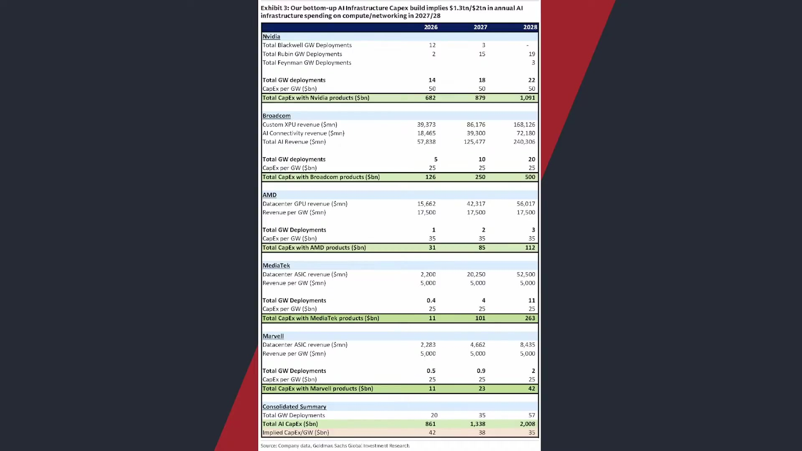

**逐字稿片段：** 現在Token價格其實一直在跌 我們明明感覺我們用的算力當中的電力 整體算力,GPU,被動元件,記憶體 照理來講,我們的算力價格看起來成本是越來越貴的 可是我們的Token成本卻越來越便宜 那到底我們的技術是否已經好到 讓Token成本如此的快速下滑 還是隻是大家硬是吸收虧損 來讓大家有更多的市佔率做提升呢 這個是最大的一個疑慮 畢竟現在大概Token價格這樣子整體往下跌 其實也跌了接近兩成到三成左右了 高盛預估要達到15%的投資的報酬率 每一集大概要116億美元的營收 即便要求30%的報酬率 也只需要156億 所以不管怎麼說 整體而言 GPU的出租價格和Token價格 一直往下跌 那你總會感覺 那算力是不是已經不稀缺 變過剩了 可是現在很明顯 我們知道算力還是很稀缺的 可是它價格又在跌 只能大概理解成 這些AI的模型廠商 為了要搶市佔率 用非常便宜的價格 讓你使用去的GBT 讓你使用Enthropy 讓你使用Gemini 用這樣的一個方式 儘可能的擴大市佔 然後稍微壓低自己的一個價格 但是其實它的成本 還是越來越貴的

**話題推測：** AI Token價格下跌趨勢圖

---

## 00:16:29

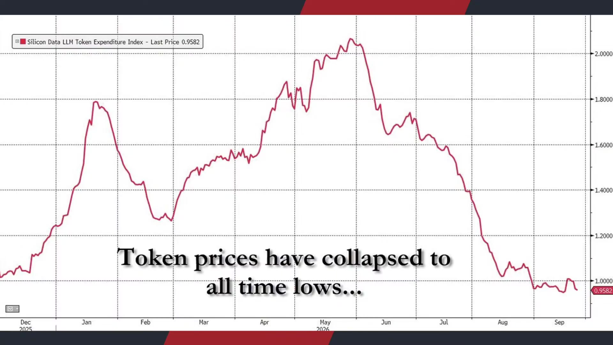

**逐字稿片段：** 所以我們才講說 真正的風險 並不是大家都不知道風險 是整個系統都相信 到時候如果真的有警報的時候 Token價格一定會持續性的暴跌 到時候再說 現在只是一箇中繼戰而已 美國現在投資這麼多錢 大量的提供融資 現在每個人似乎都相信 只要AI的回報真的不如預期 到時候信用市場就會先提高利率 債券價格就先下跌 股市就修正了 如果到時候所有指標都已經達到相對位階 那麼到時候再離場 這也許是市場上 現在還留在市場上的人的一個重要的想法 大家也不是說覺得AI會毫無止境 任何的科技革命 它都是真的 我們講的是資產價格的問題 很多人都會覺得 等到AI產生的現金 真的撐不住了 他完全借不到錢了 到時候再說 可是這個時候就變成 每個人都在賭下一個階段 因為大家越來越不願意 放棄或者錯過 已經既有的資產的征服的報酬了 到時候還來不來得及消化利空 或者說尖叫聲來得太晚 也許市場壓力就比較大了 也許市場的賣壓 就會比想象中還來得大 雖然我是比較偏樂觀論者 但至少可以看得出來 市場的擔憂就是 就是又擔憂錯過行情 又擔憂Token價格成本一直的往下跌

**話題推測：** AI發展的潛在風險與市場行為分析

---

## 00:17:46

**逐字稿片段：** 昨天我才看到那條新聞是非以色列的客機 那不是駕駛艙兩個機師在打架 然後嚴重衝突 然後其中一個飛行員拿刀去刺另外一個飛行員 然後飛機就失去正常控制 然後大家就開始尖叫 然後左右搖晃 然後最後有乘客衝到駕駛艙裡面 去把駕駛給制服 然後現場都是血這樣子 那讓我想到之前有一個故事 他講說一架飛機準備起飛 兩個機師走進客艙 兩個人都戴著墨鏡 一個牽著導盲犬 另外一個拿著白手杖 那乘客就很緊張 但是大家覺得這應該只是開玩笑 結果飛機在跑道上就開始加速 越來越快 眼看的跑道就要到底了 前面就是海 所有乘客東雲人不住 開始尖叫 就在尖叫聲響起的瞬間 飛機就順利拉起來了 飛上天空 大家鬆了一口氣 然後在駕駛艙裡面其中一個機師就擦了擦汗 我跟你說總有一天這群人尖叫的太晚 我們就完了 所以我們講說很多系統 它真正的安全機制並非掌握在控制者手上 是建立在其他人在關鍵時刻做出反應上 有時候AI巨頭一直借錢 他也知道不能夠停 可是你沒有人要求我停 你要求我停 市場對於我擴大資本支出 股價是下跌的 我就停了 可是大家對於一般散戶而言 又覺得你要繼續投入AI資本支出 才讓我相信AI的夢是真的 大家不敢尖叫 雙方就在互相博弈 所以我們才講說 真正的安全機制 現在到底是在這些科技巨頭自己手上 他要不要暫緩資本支出 還是取決於我們 當他借更多錢 我們開始恐慌賣出股票的時候 那會不會已經為時已晚 所以有時候我們講說 這其實很像金融市場 在企業管理 甚至在AI發展 平時看起來系統運作很正常 久而久之 大家都認為市場會主動去示警 監管會會介入 投資人會主動停手 風險模型會自動的來做提醒 變成理所當然 結果大家都在等自己不做事情 別人會主動示警 這樣的一個事情發生 或者這樣的一個事件發生 從更深層來看 最可怕的都是 大家都已經不等警報響起了 或者說警報已經響起了 我也不啟動 我等到真的有煙霧飄進來了 我再離開 看起來大家有這樣的感覺 好了 那不管怎麼說 現在如果細看 可是剛才所聊到的 照理來講 高殖利率的壓力 對於科技股的估值 似乎沒有想象中還要來得大 你要知道 在當時7月份的廢辦下跌 跟殖利率沒有太大相關 那主要就是高槓杆部位的下跌 由韓國股市所帶動的下挫 可是現在明明利率預期越來越高

**話題推測：** 以色列客機機師衝突新聞畫面或示意圖

---

## 00:20:37

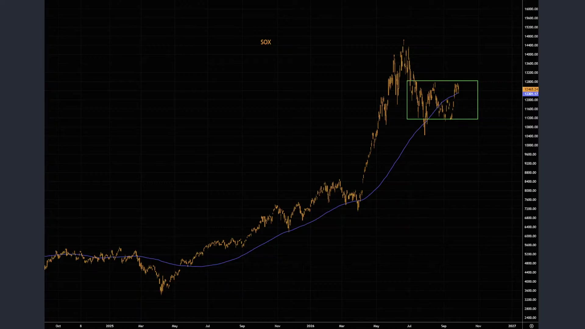

**逐字稿片段：** 但是Fib明明是今年漲最多的股票 現在還在高位進行盤選 這就非常有趣了 原因是什麼呢 因為最新半導體股 美股盈餘在未來12個月的前瞻 又上升了30% 哇 今年已經上升幾次了 居然在第三季財報即將要開始陸續公佈的時候 現在又開始陸續的上調了獲利預期 而且是成長三成左右 其實我們就看得出來 今年全球半導體的前瞻EPS是一路的上修 從整個7月之後 你不要覺得說好像晶片股當時的 我們講說槓桿賣壓開始出入以後 獲利就停止調升了 沒有7月份上升的速度看起來越來越快了 到現在9月底10月初 已經逼近年初的兩倍水準了 原本你年初預估只賺一塊 你居然到9月份你已經預估會賺到兩塊了 這很離譜 100萬變200萬 1億變2億 兩者就出現了非常明顯的背離 另外一個就是對於軟鐵股而言 所以股價雖然沒有相對應的反應 如此高強度9月份的上修 可是獲利的上修 已經導致本益比快速的下滑

**話題推測：** 費城半導體指數(SOX)今年表現與利率對比

---

## 00:21:51

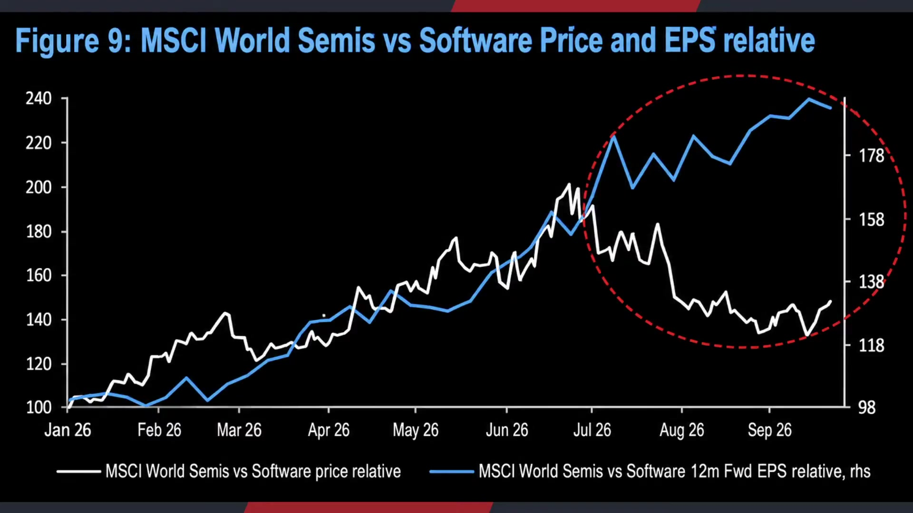

**逐字稿片段：** 美國的半導體總銷售 現在也在快速的急升 從整個25年下半年到現在為止 25年下半年 也不過20%到30%的水準 那已經很快了 年增幅到2026年的銷售年增幅 60% 到2026年的5月份130 到6月份145 所以你可以觀察的說來 這種成長速度 實在是讓股價沒有漲個一倍 說不過去了 因為你的獲利真的就是翻一整倍 所以我們看美光 在昨天所公佈的最新一季的財寶 AI所帶來的記憶體需求

**話題推測：** 美國半導體總銷售年增幅趨勢圖

---

## 00:22:26

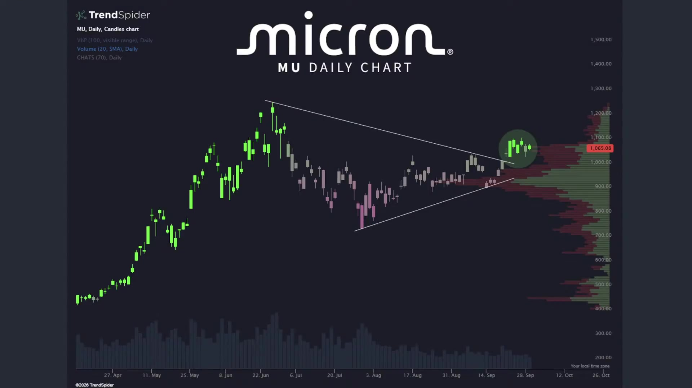

**逐字稿片段：** 它就直接反映在數字身上 第四季的營收是高達542.3億美元 比市場預估的510億還要來的高 相對於去年同期 營收翻4倍 去年才賺113億 去年記憶體已經開始爆發了 它現在已經相對於去年賺了4倍 本來賺1塊現在變賺4塊 更值得注意的事情是 美光的裁測認為這波需求 沒有降溫的跡象 公司預估下一個季度的營收 可以高達615億美元 比華爾街原本預估的570億美元 再高出8% 每股營業來到38塊 也比預估的35塊還來得高 那美光你不要看說上一次的股災 好像賣壓很重 其實你從量價度來看 已經慢慢慢慢開始收斂了 上方其實也沒有多少賣壓了 你說記憶體行情已經全面結束嗎 如果從本益比角度來看 它的營收是以4倍的速度進來 你覺得它的股價 有以4倍的速度上行嗎 所以從這樣的一個角度來做思考 你看美光今年股價大概是漲273% 相對於它4倍營收的成長 看起來好像比非凡漲幅誇張了很多 可是從它的獲利角度來看 好像也沒有漲得這麼誇張 這就給投資朋友觀察的實質跡象

**話題推測：** 美光最新季度財報數據及預估

---

## 00:23:42

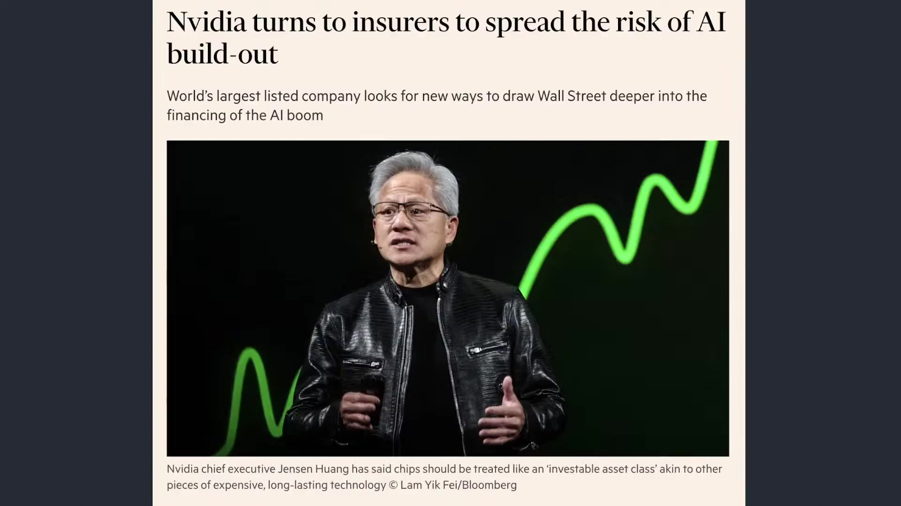

**逐字稿片段：** 其實輝達現在把AI晶片 我們昨天提到 把它當成金融資產 就是希望可以見諒 從原本的半導體晶片股的獲利拉伸 大家的市場焦點 往中下游端來進行投送 所以我們才提到說 因為輝達現在是希望 希望可以跟保險公司討論新的融資模式 最大的構想就是銀行把錢 借給輝達的小型新興雲端產業客戶 然後用輝達當中的晶片當做抵押品 如果業者倒閉 晶片二手出售的價格不足以償還貸款 那由保險公司來承擔部分的損失 所以它取決於保險公司看不看好 輝達的晶片是值錢的 那輝達可能會以適度折價的方式 或者以幕後擔保人的方式來做承押 那用這樣的一個方式 能夠嘗試的把資金 從半導體外溢出去 要不然現在就是 大家似乎都集中在 本益比比較偏低的硬體股身上 那當然從硬體股角度而言

**話題推測：** 輝達將AI晶片視為金融資產的融資模式

---

## 00:24:40

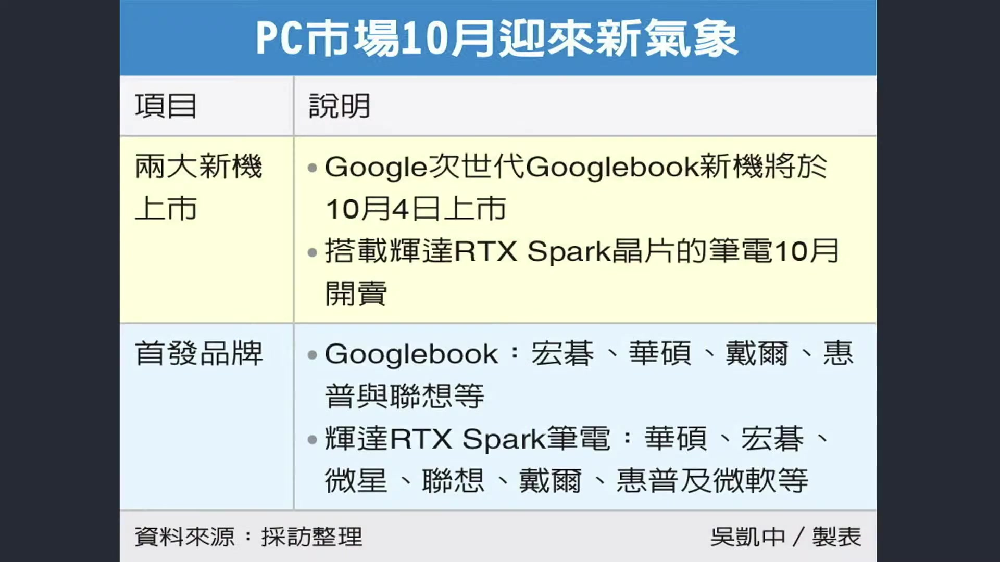

**逐字稿片段：** 現在PC在10月份 尤其是AIPC 當時揮打主推的這些PC 即將迎來新一波的換機潮 那有沒有可能伴隨著 iPhone Duo來做進一步的延伸呢 這也是大家值得留意的方向 因為10月份現在就是兩股刺激 一個就是iPhone多 我記得是10月13號才開始開賣 這幾天我在歐洲 我還跑了幾個店 也沒有iPhone多 它真的應該是10月初 才在美國開始陸續上市 然後歐洲的話 好像稍微晚一點 大概是10月中旬左右 再就是PC PC就是第一個 是Google推出新一代的Google Book 在10月4號就會正式上市 紅機、華碩、戴爾、惠普、聯想 都有相對應的一個產品 那Google主要以前是推那個Chromebook 主要推那個教育市場的部分 這次Googlebook 明顯是往中高界來做移動 我們就看看 能不能借由揮達的方式 第一讓中小型股能夠因此而受惠 第二那從硬體的換機潮而言 十月份是否有匹極泰來的空間 要不然今年 其實上半年手機市場銷售不錯 都是由於記憶體的漲價潮 下半年大家其實並不是特別樂觀 不過我們也必須承認AI其實就是這樣子一點一滴的慢慢的改變世界的 其實AI所帶來的創新 它也不是真的直接快速的把舊世界給推倒 它就是把新想法寄生在世界的成本當中 就是現在扮演一個角色 寫程式 做設計 做翻譯 包括3C電子產品 研究行銷 創業的成本大幅降低 讓一個很小的團隊也能夠做到一家公司可以完成的事情 他也不是憑空創造一個新的世界 他本身就是建立在 人類過去的文字知識 還有城市和經驗之上 慢慢一步一步的改變 所以真正有競爭力的地方 他不是把舊的地方全部淘汰掉 他就慢慢融入到你的AIPC AI手機 那把新工具疊加在既有的知識身上

**話題推測：** 十月份AIPC與iPhone新機發布及換機潮預期

---

## 00:26:42

**逐字稿片段：** 因為我最近在奧地利維也納街頭 我覺得 歐洲城市跟東亞城市 最大區別是什麼 就是舊的東西很多 那幾百年前的宮殿、教堂、公寓、街道都還存在嗎? 那其實很接近,我之前是聽羅胖還是誰 他講的一個城市規劃者叫做雅格布斯 這叫什麼?這叫城市多樣性 一個有活力的城市 他不應該全部都在同一個年代同一個價格的新建築 他需要新舊建築不同租金不同幼徒混合在一起 所以他比較不傾向去做一個全新的重劃區 他認為最有名的一句話就是 新觀念往往需要住進到舊房子 但是舊觀念很難住進到新房子 原因很簡單 就是新大樓的成本高 住進高 通常只有大銀行大企業 連鎖品牌或者商業模式負擔著起 老建築有時候破破舊舊的 還有一點味道 反而能夠讓小餐廳工作室 藝術家新創公司不同 或者說不知道還能不能賺錢的新點子 有地方可以做測試 所以一個地方如果同時有新建築 有舊建築 而且能有便宜的建築 也有貴的建築 有混合住宅 有商店 有辦公 有觀光 就容易讓不同的 雖然在臺灣 可能大多還是比較偏化 重畫區比較乾淨 但是從歐洲人的角度而言 萬華就是最具發展力的地方 我講的就是 我們現在看到的AI的發展 其實就是舊知識舊工作 用新的技術來進行取代 但並不是把它給推翻掉 用這樣的一個方式 彼此的共存 文明發生的力度就來得更快了 我相信這也是黃仁勳 目前正在做的事情 但至少現在看得出來 從指數層面 他對於AI其實還是蠻樂觀的

**話題推測：** 奧地利維也納街頭景觀照片

---

## 00:28:33

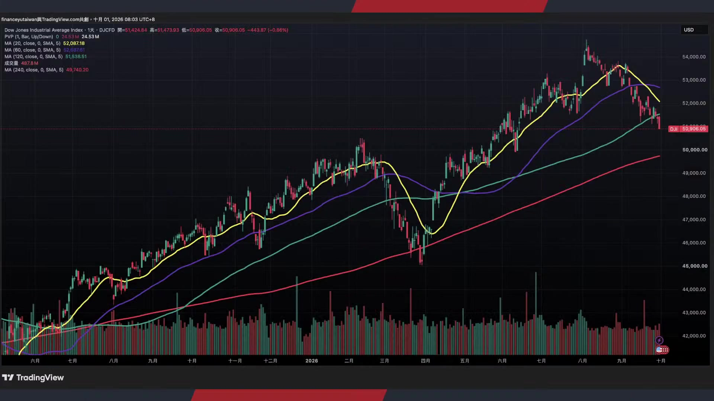

**逐字稿片段：** 真正跌最終的是道瓊 最近下跌443點 0.86% 收在50906點 這道瓊跌死人了 很多人還想說買實業股 最具護城河 最具防禦性價值 結果道瓊現在跌最慘 反而是科技股的估值 還繼續維持在高位 買到的大概 買到窮的可能也快昏倒了 這怎麼會發生這樣的一個事情 我明明買的是防禦股 道理來講 現在去估值最不容易的 應該就是去我的估值 就搞得現在 大家呼吸困難了 受不了了 之前在醫院有聽到嗎 那一個女的不打針 喘得不行 那護理師跟她講 先生呼吸 那阿姨說 我是小姐不是先生 呼吸困難了 所以到窮真的很離譜 居然在如此高值利率的情況底下 是第一個受難的 反而其他指數表現還好 標普指數也不過下跌19點 0.25% 就在7651點 還在創新高邊緣 那斯達克指數上漲63點 0.24% 在26861點 也在創高邊緣 費班的部分下跌0.54點 這個昨天政府不大了 不過至少底部已經形成了 就因為2628點 最慘的就是道瓊了 那最漂亮的

**話題推測：** 主要美股指數當日漲跌幅對比 (道瓊、標普、納斯達克、費半)

---

## 00:29:48

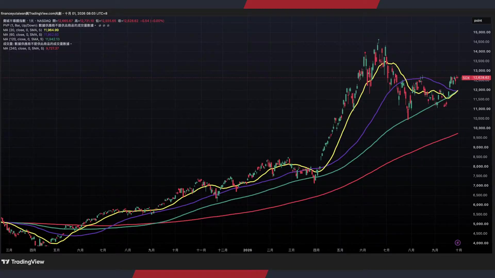

**逐字稿片段：** 你把臺股跟費辦拿來做比較 那臺股也很離譜 臺股明明就是 文權就是晶片股硬體股 結果創下新高 在9月份 9月份最後一個交易日 雖然市場上賣壓還是比較重一點 不過至少可以看得出來 把時間拉長 整個9月份 臺股是上漲了1811點 漲幅是3.93% 月線連續第二個月收紅 第三季同樣上漲了1814點 漲幅3.93% 更是寫下季限零六紅 所以我們看得出來 這個臺股費辦看起來 還是比臺股更具有吸引力 臺股都已經創高了 費辦未接還沒有想象中來得高 從整體資金量來做觀察 外資在整個9月份 是賣超417億臺幣 投信買了527億 你就瞭解 怎麼9月份外資賣這麼多臺股沒跌 散戶硬是把外資幹過去了 就基本上這幾個月 不管我們從除了元月份過年 大家出國玩之外 從二月份到現在 投信每個月都買超 ETF每個月都買 外資今年三月賣最多 然後在六月七月也賣很多 從年限來看 外資在今年還是賣的 接近有1.37兆左右 去年他賣了5900億 前年他賣了6900億 2022年他賣了1.2兆 2021年他賣了4500億 2020年賣了5300億 你就知道臺灣人都有錢 你說臺灣人的錢 難道可以抵擋外資一輩子嗎 只要AI行情還存在 我們的外匯收入 就是會以這樣的一個速度進來 所以緊急信號燈的部分 臺灣經濟的部分 我們就稍晚再來跟投資朋友 做些敘述了 但是臺灣在本輪硬體股 晶片股的獲利暴升 就是能夠抵擋外資 抵抗匈奴的主要原因

**話題推測：** 台股與費城半導體指數表現對比

---

## 00:31:36

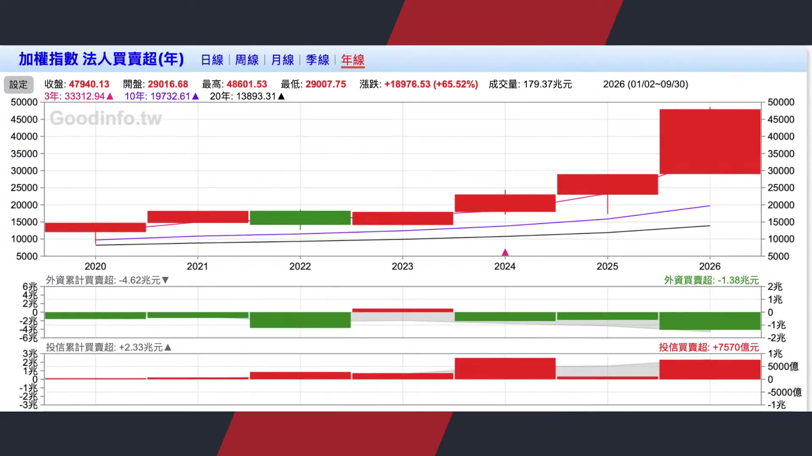

**逐字稿片段：** 據零二分 臺股上漲240點 摔4萬8181點 現在雖然量等 還是沒有想象中來得大 但至少看得出來 市場上對於目前的獲利動能 至少能夠先撐住指數 可是美國股市內部 其實已經開始有點分化的味道 臺股可能也有點像 但我們要怎麼處理這樣的一個矛盾呢 資金肯定是不夠的 如果利率越來越高的話 那我們只能祈求 錢要花在刀口身上 而市場上 尤其是內部 散戶對於這些科技股的評價 或是未來大家觀察的重要指標 總有一天 我們會告訴這些科技巨頭 你在毫無節制的繼續借錢 那你的股價是會跌的 那借由市場的反應 來抑制科技巨頭無條件的投入 它是一種解決本輪AI 毫無止境擴張的一種方式 那第二種方式 就是生產力只要能夠足以提升 提升到我相信不行 你得繼續投 因為AI的爆發實在是太強大了 所以你必須要投更多 那這也是一種解決的方式 生產力的提升 那第三種效應 就是雙方同時發酵 一方面你不能夠毫無節制的投 第二生產力的確有所提升 第三終於從這些科技巨頭 外移到一些中小型的新創企業身上

**話題推測：** 台股即時指數與漲跌幅

---

## 00:32:52

**逐字稿片段：** 這個時候才可以達到真實的產業革命 給投資朋友做一些思考 今天零三分 如果喜歡我們的節目 記得幫我們訂閱按贊加分享 我們就明天早上半半 早晨財經速點路再相見 祝各位投資朋友開盤順利 操盤愉快

**話題推測：** AI產業革命實現的三種情境圖

---
