# yutinghaofinance_FtPa8H718To — 關鍵畫面索引

- 來源逐字稿：[yutinghaofinance_FtPa8H718To_GT.srt](yutinghaofinance_FtPa8H718To_GT.srt)
- 影片：https://www.youtube.com/watch?v=FtPa8H718To
- 截圖數：33

## 00:00:35

**逐字稿片段：** 一早來觀察 美股股市因為週五是全面反彈 當時國際油價從高點開始回落 可現在亞洲盤開了 原油價格又開始飆了 所以三大指數在上禮拜 雖然道瓊還是有比較顯著的做拉動哦 嘗試的收復過往市場顯著賣壓 不管我們看到在三大指數 層面其實都還在高位震盪 那費半反而是底下有撐 但這一次在禮拜五的8月份核心 消費者物價指數CPI的年增幅 符合預期 可是月增幅是稍微高於預期 這也使得本周的FOMC利率決策會議 升息一碼的機率已經來到80%了 那在現在原油價格又 重新拐頭上彎的情況底下 市場會如何來做重新定價 就值得留意 雖然在100這個關卡感覺是卡了一關 不過呢 至少相對於 8月份7月份6月份 其實已經創了3個多月以來的高點了

**話題推測：** 開始觀察美股股市走勢，預期為美股市場指數圖表。

---

## 00:01:31

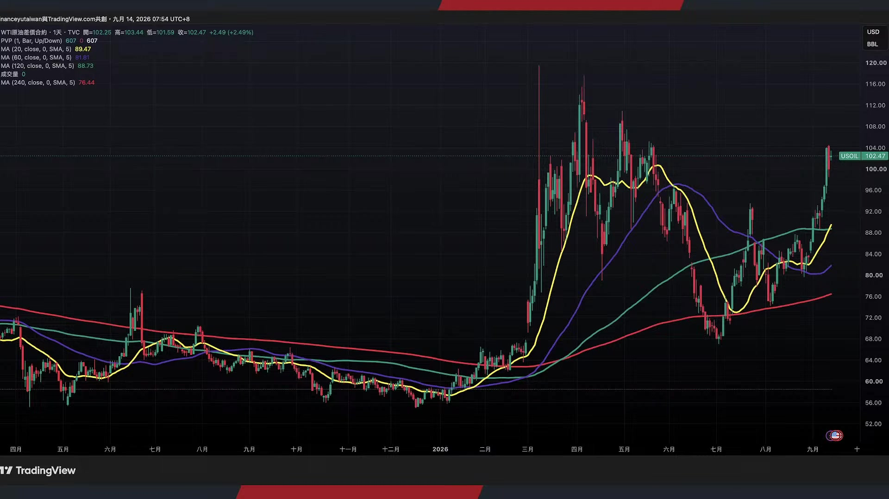

**逐字稿片段：** 那原油價格這一次站穩100塊以後 全球債券市場也跟著失火 布蘭特原油這一次大概 在105-109左右持續震盪 美國30年期公債殖利率 已經衝高到5.37% 這是07年以來新高

**話題推測：** 話題轉向全球債券市場，預期為全球債券市場指數圖表。

---

## 00:01:46

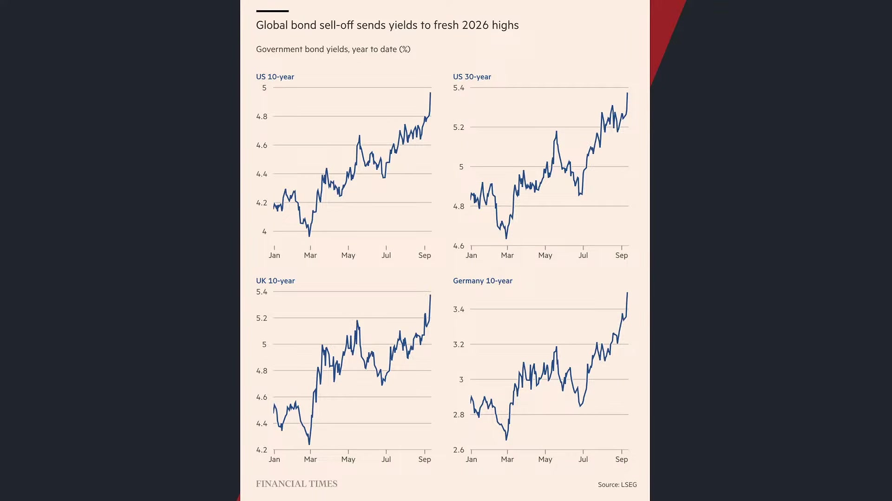

**逐字稿片段：** 10年期公債殖利率大概在4.95 逼近5%大關 尤其上禮拜 美國財政部原本是希望透過 60億美元的償債回購來穩定市場 不過現在市場上看起來整體對於 財政部的回購力度 看起來是有點不滿的 持續針對債券價格進行拋售 另外一方面 壓力來自於各地 不只是我們看到英國10年期國債 德國法國陸續創下歷史新高 當然從短期因子來看 肯定是有中東局勢在本 週末的侵擾所造成的 因為伊朗所支持的葉門青年運動 好持續往沿海來做擴張 好在上禮拜已經正式攻下了港市墨加 好進一步控制了 紅海南部具有戰略位置的漢尼西群島 好那這說明著 如果兩邊同時都有航道封鎖的跡象 那整個中東局勢會使得 原油價格有進一步的上漲 當然了曼德海峽是紅海通往 印度洋的重要出口 所以航運惡化以後 就必須要從 徹底的繞開這兩個海峽 那就只剩下路上管線了 那路上管線這種衝擊底下 很難有足夠的產能來往外做運送 好甚至我們看到在葉門的部分 好最近甚至按照金融時報的報導 這個葉門武器小組已經使用 Claude code來參與三項武器計畫 這是Anthropic在上禮拜 緊急發佈的報告 他描述說現在葉門有 大量的武器研發小組 正在使用我們的軟體 來研發多極彈道飛彈 不同型號的飛彈和導引火箭 我在想有那麼離譜嗎問問 問一下AI就有火箭的製造能力 但不重要 重點是Anthropic主動把這一項情報 主動釋出 來告訴大家 中東有不少人在使用我們的Claude來 完成軟體工程師本來該完成的工作 包括撰寫導引 導航控制軟體系統 甚至把開雲的自動駕駛 系統整合到飛行電腦當中 都使得市場上有進一步的緊張局勢

**話題推測：** 提及美國10年期公債殖利率逼近5%大關，預期為公債殖利率圖。

---

## 00:03:49

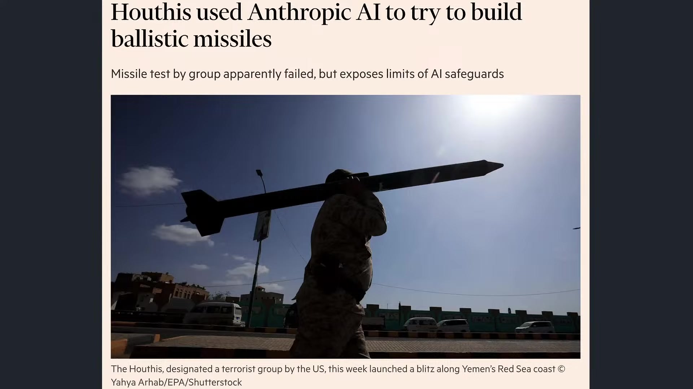

**逐字稿片段：** 當然對於沙烏地阿拉伯來說 那等同於過去哦 我們講說東西向的 輸油管道同時遭受到壓力 因為左邊出不去 右邊也出不去 那沙烏地阿拉伯又沒有 直接面對印度洋的港口 而這個時候壓力就比較大了 另外一方面 連東西向輸油管在本週末都 遭受到多架的無人機攻擊之後 被迫短期內關閉哦

**話題推測：** 討論沙烏地阿拉伯東西向輸油管道受壓，預期為沙烏地阿拉伯輸油管道地圖。

---

## 00:04:12

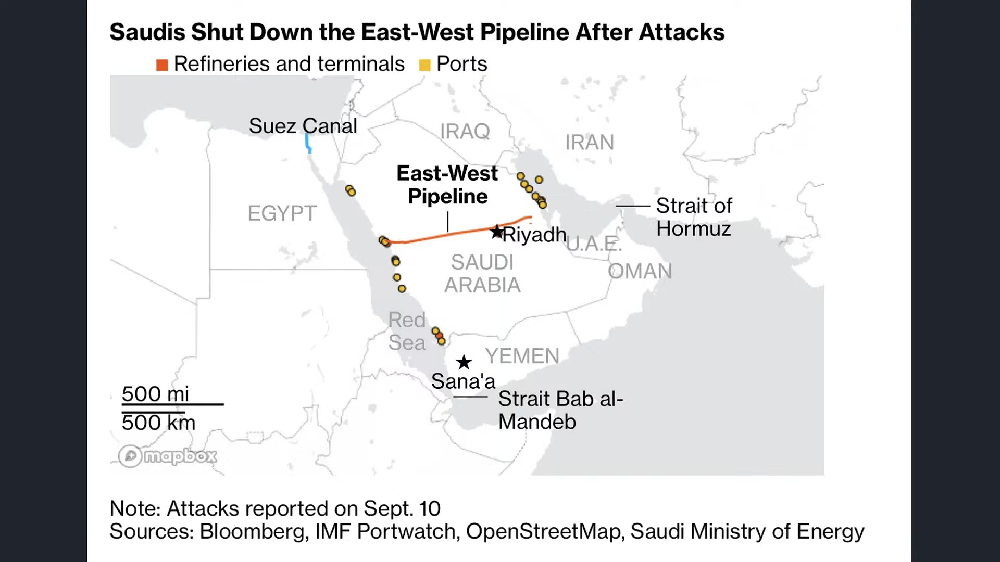

**逐字稿片段：** 那比較敏感的是 伊拉克政府調查發現 來自於靠近伊朗的攻擊可能性比較大 那紅海現在有胡塞武裝 然後霍爾木茲海峽又有伊朗 這使得整個供應鏈的數據哦 在短期內整個8月份原油出口 沙烏地阿拉伯已經降到每天300萬桶 居然創下17年以來的新低了 也就是現在明明整個 中東局勢的緊張局勢哦 我們知道是明顯比3月四月 還要來得低的 結果在整個8月份的出口居然 比3月4月還要4月份還要來得低 好這個衝擊就真的比較大了 那當然了 這也使得全球的中東路 上絲路再度引起 大家想辦法從土耳其繞道 或者說呢 就一路的往下延伸從沙特 阿拉伯或者阿拉伯聯合大公國的方向 慢慢的往外運

**話題推測：** 提及伊拉克政府調查伊朗攻擊可能性，預期為地圖或新聞報導。

---

## 00:05:00

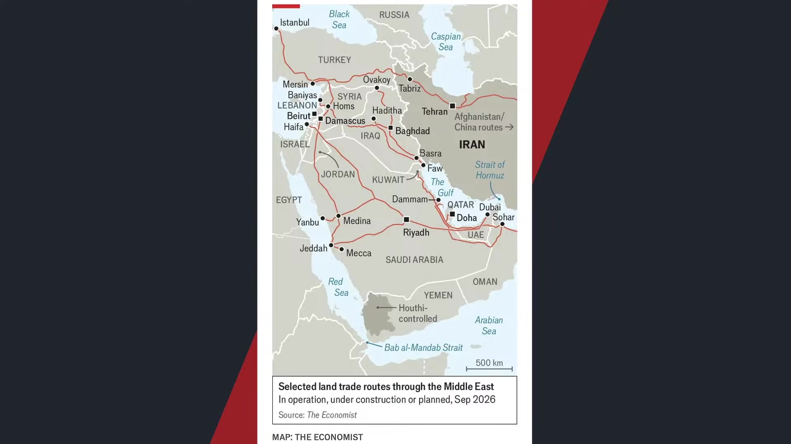

**逐字稿片段：** 尤其伊拉克現在每天大概 有1,300輛的油罐車要出去 來回一趟大概就需要10天 那目前這條路線呢 本來只占一%左右的石油出口 已經上升到5%了 主要就是市場上在想 有什麼辦法可以靠陸路 的運輸來把原油運出去 再這樣下去沒辦法 可能要空運了哦 不可能 空運太貴了 哦但至少可以看得出來 整個中東的局勢哦 兩邊海峽同時封鎖 形成市場的利率預期開始升高 另外一方面 美軍的確也符合當時的承諾 開始針對霍爾木茲海峽採取適度護航 可是美國特別要求 希望獲得軍事保護的油輪 儘量集中在每天兩個 指定的時段來通過海峽 原因是因為伊朗在 近期加強了夜間的攻擊 美軍從5月到6月開始哦 其實已經針對靠近阿曼海岸 航運的商船來提供空中的掩護 原本是在夜間 長時間視窗來做進行了 但現在呢 變成兩個特定時段 一個是早上9點大家統一出發 那就旁邊會有美軍的 軍機或者驅逐艦在旁邊 伴行那夜間呢 現在反而是予以取消 現在改成下午時段也來一次 所以從這樣的一個角度來看 就說明著美國去縮短護航的時期哦 他並不是說就以後不航不復航了 或者慢慢褪去哦 這反映說這個衝突 美軍也意識到從短期 危機變成長期消耗戰了 一架先進的美國軍機哦 你伴隨著它飛行一個小時 成本大概就是5萬美元了 如果每天維持12-24小時 長期成本和軍旅負擔都相當驚人 所以他要求 如果你真的要從霍爾木茲海峽 真的要開出來的 那我們統一 早上9點一起出來 好這樣子我美軍伴行也比較方便 我們沒辦法 12個小時每天都在伴行 所以從這樣的一個角度來看 往下做延伸呢 就變成中東局勢變成本輪 原油價格的上漲導火線

**話題推測：** 提及伊拉克每天有1,300輛油罐車運輸，預期為油罐車運輸數據圖。

---

## 00:06:55

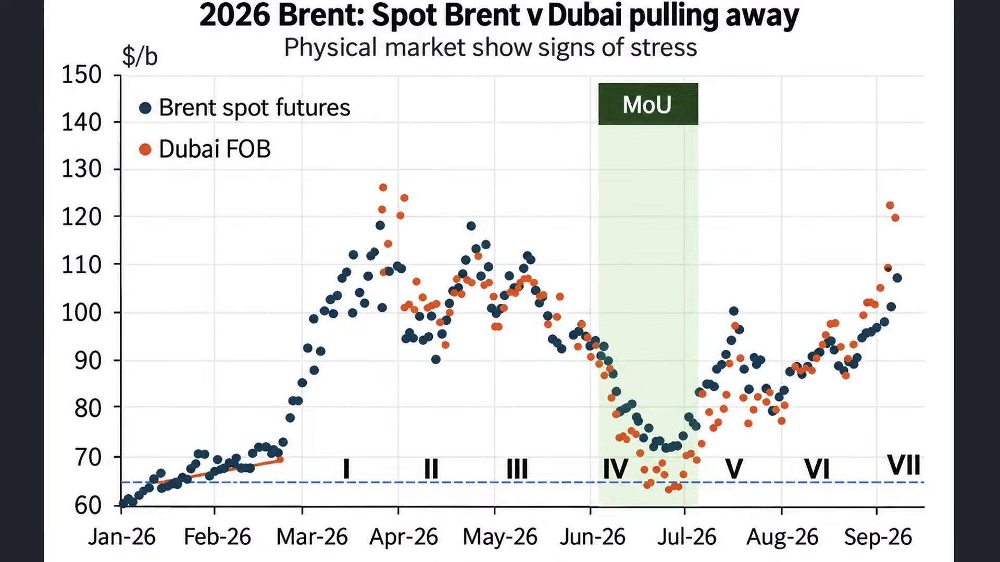

**逐字稿片段：** 那第二步呢 就是實體原油出現了出口的受阻 還有庫存下降 按柴油短缺的三重壓力 因為第四季是真正的用油旺季了 我們從最新數據來看 在上個禮拜 中東原油裝船量平均 大概每天是1,330萬桶哦 好但是還是比平常少了接近500-600萬桶 那更麻煩的事情是 前一個階段 我們知道每個國家都有 適度的戰略原油儲備嘛 可以拿來救急的庫存哦 現在已經被消耗不少了 先前市場已經大概吸收2億到 3億桶比較容易動用的原油 那中國在第二季是很明顯的 因為它幾乎沒進口嘛 那一定動用了超過 2.5億桶的庫存來支撐需求 那中國的進口量一度 掉到每天700萬桶哦 不太可能下半年一點油都不進 中國經濟雖然很差 也沒有差到是完全不進口的地步 那這也使得市場上在原油 需求第一批庫存消耗殆盡的情況底下 市場上開始針對原油 來做進一步的拉貨 而這個時候剛好供給又稍微停擺了

**話題推測：** 切換至實體原油出口受阻、庫存下降、柴油短缺的三重壓力點，預期為庫存或供應鏈圖表。

---

## 00:07:58

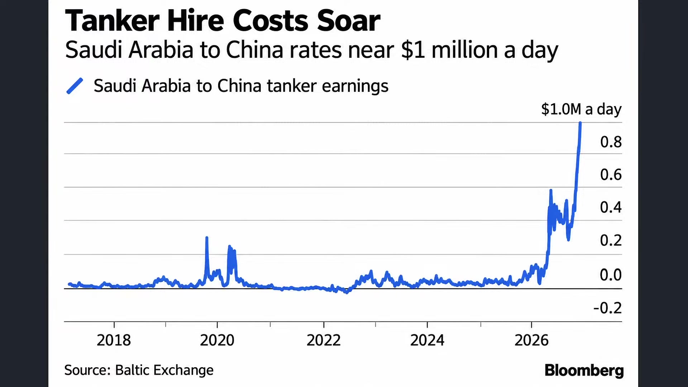

**逐字稿片段：** 我們舉例來說 這張圖表是我們看到 布羅地海交易所最新所公佈的數據 從中東到中國的超大型油輪日租金 居然一天要100萬美元 哎這之前也才多少 之前也不過就50萬美元以下 所以這代表霍爾木茲海峽以外 從阿曼出發到中國 價格也開始陸續抬升 日租金大概是57.1萬 大概也是往年的接近10倍 以前呢大概就是5萬到10萬左右了 現在大概你租一艘 油輪大概就要100萬了 重點是還不一定出的去哦 紅海南端的曼德海峽現在 是胡塞武裝控制的風險嘛 所以兩個關鍵水道同時承壓以後 不管你是要去從美國 墨西哥灣採購的亞洲買家 光運費你就要多增加每桶大概18元 要麼就更遠了 以前都依賴中東嘛 要麼從美國來載原油回來 要麼現在叫 租金價格變貴了 而且呢按照華爾街日報的報導哦哦 最新的獨家川普 雖然對外宣稱說伊朗戰事在11月 的期中選舉之後就會立刻結束 不過白宮呢 其實內部已經開始討論 另外一種比較現實的情境 就是這場戰爭呢 有可能會一路拖到川普任期結束 甚至超過29年的1月份 最近像是盧比奧或者範斯都已經向 川普來做提醒 伊朗未必會被海上 封鎖和制裁快速壓垮 大家要有長期部署的準備 現在中東的部分部隊

**話題推測：** 明確提及一張圖表：布羅地海交易所中東到中國超大型油輪日租金，預期為油輪租金走勢圖。

---

## 00:09:21

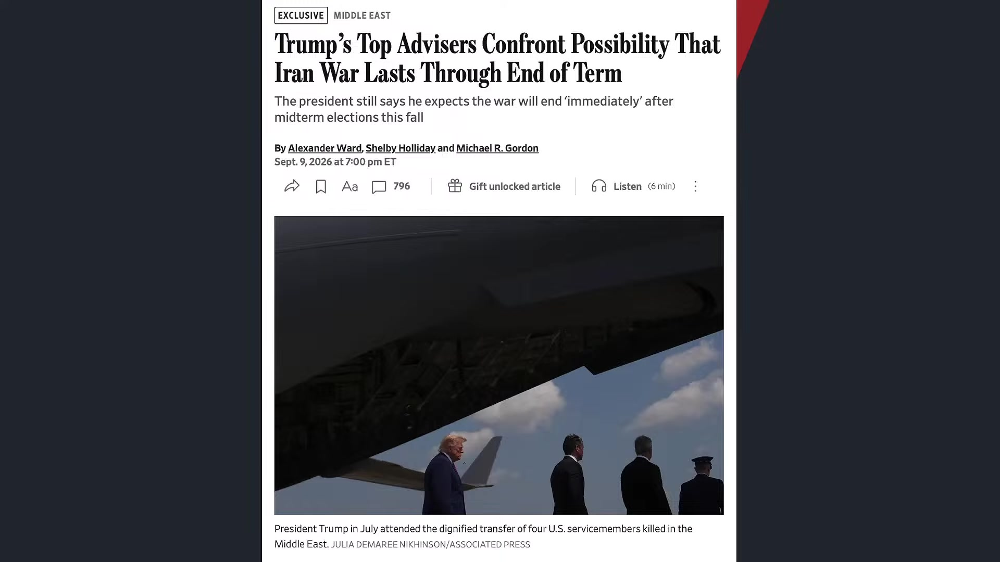

**逐字稿片段：** 已經延長駐防到2027年 大概是5萬美軍 防空系統 海軍陸戰隊 還有F6機隊都持續來做輪調 好這就說明著 這個戰爭拖長也不代表未來 幾個月每天都會更激烈了 不過市場上要進行重新定價 第一個就是習慣高油價 第二習慣高軍費 第三習慣高風險高風險一籌 那最後呈現的效果 就是長期維持高利率 這是市場上給予的評價認知嘛 就假設這件事情無法有效的處理解決

**話題推測：** 提及中東部分美軍部隊延長駐防到2027年，預期為駐軍數量與時間軸圖。

---

## 00:09:54

**逐字稿片段：** 當然我們往下看了 真正的壓力 其實期貨價格還沒創高 照來講通膨的預期感不會比 3月4月份來得嚴重 那3月4月你也沒有高強度升息 你也沒有那種史詩級 暴利升息的預期 那為什麼現在在7月8月9月 那利率預期就開始越來越緊繃了呢 因為哦期貨價格雖然沒創高 哎可是柴油價格創高了 如果我們細看 柴油價格已經創下了在 過去幾年的歷史新高記錄

**話題推測：** 提出柴油價格創高作為通膨真正壓力的觀點，預期為柴油價格與原油期貨價格對比圖。

---

## 00:10:23

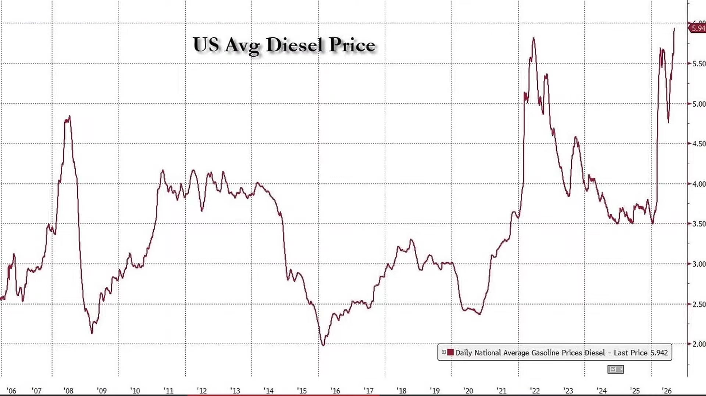

**逐字稿片段：** 加州地區是尤其嚴重 我們看像聖地牙哥 加油站的柴油每加侖大概是 9.99美元 哎有這麼高嗎 有沒有加州的朋友 現在柴油價格是9.99 那不是已經碰到 因為很多那個傳統的電子架板它只能 顯示三位元數的上限嘛 那加州全州的柴油平均價格每 加侖大概已經突破了8美元 全美則是第一次站上6美元 那背後除了這次伊朗戰事的升級之外 加州本身呢 又缺乏把燃料大量輸入到州內的管線 所以煉油產能下滑 加上周級的燃油稅還是偏高 所以使得供給更加吃緊 那你要知道柴油不單單 是那個卡車司機在用哦 它一路會往下滲透到物流 工程農業和各種服務價格哦 好你像加州的搬家公司 柴油車隊 每個月的燃料支出哦 從去年8月份大概是8,200美元 現在增加到1.6萬美元 我那成本就接近是翻倍了 但向客戶的收取燃料費 大概是從60提升到70 漲幅是7% 所以如果呢 跟柴油高度聯動產品沒有漲價翻倍的 哦這說明的 現在是生產者的成本還大於消費者 持續往下游傳導的 可能性還是比較高的哦 哦這就是全球的柴油荒 也就是上游端呢 通膨的僵固性持久以後 下游端陸續轉嫁 每個人都多轉嫁一塊

**話題推測：** 提及聖地牙哥柴油每加侖9.99美元，預期為加州柴油價格看板圖或數據圖。

---

## 00:11:46

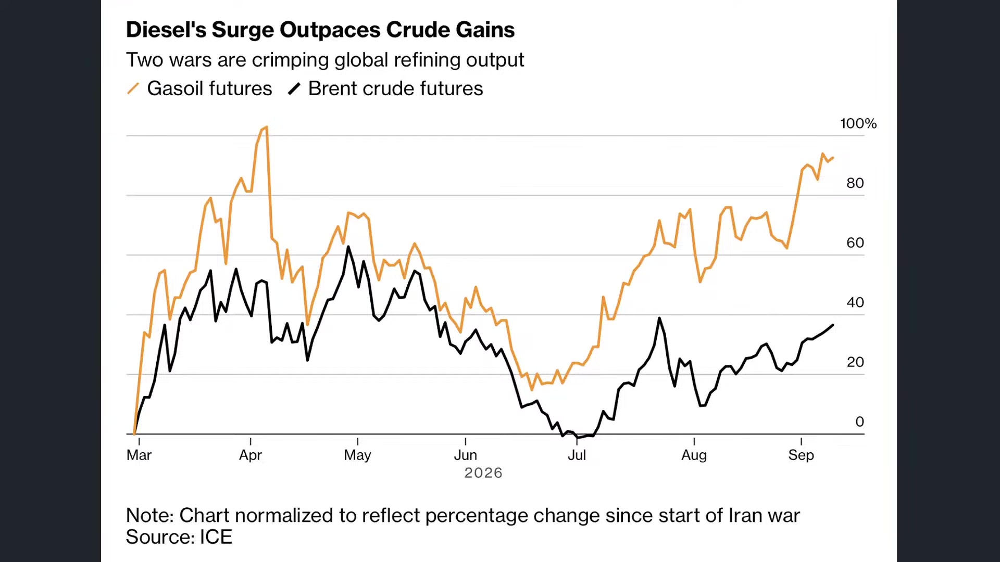

**逐字稿片段：** 下游端的漲價幅度 就會比想像中來得高 那現在最大的壓力 其實來自於時間 就是正常來講 時間是有利於通膨的 時間拖久了 那通膨年增幅就慢慢的往下掉 那就最後趨近於0嘛 油價也沒跌 不過這場年增幅解決了 可是問題在於 在年增幅趨近於0之前 還有一個高峰 就是今年冬天 為了搶高利潤 美國亞洲和歐洲煉油廠 現在都在高負荷的運轉 設備長時間的超時間運作 故障機率也會因此而提高 所以一旦年底之前有 大型的煉油廠意外停機 那市場就幾乎沒有任何的緩衝哦 所以從這樣的一個角度來看 柴油價格是對於川普本身衝高 到最大的一個中期選舉的變數哦 這很有可能是本次中期選舉 最終共和黨垮臺的根本原因了 那就柴油的問題 要不然你只要股市漲得比 大眾資產價格還來得多 還勉強說的過去 購買力勉強提升嘛 或者薪資漲上來 超過大眾水資產的水準就可以了 那另外一方面是中國原油 中國原油其實在過去幾個月 它是抑制全球原油通脹的重要推手 為什麼因為你看從今年5月6月7月以後

**話題推測：** 話題轉向中國原油對全球通脹的抑制作用，預期為中國原油進口量與通脹關係圖。

---

## 00:12:54

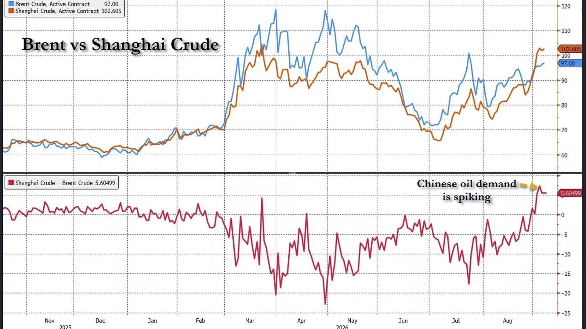

**逐字稿片段：** 當時整個 中國的進口量它 並沒有因此而顯著攀升 反而進口量正在快速收縮 結果呢在7月到8月慢慢開始做回補了 這說明之前整個中國市場 很明顯是動用戰略原油儲備 來嘗試的把原油價格在 國際油價當中嘗試的做壓低 另外一方面 這幾年也存了非常多嘛 那來試試看到底我存了多少 能不能應付這種長天期的中東戰事 結果呢從7月到8月 進口量已經開始緩步提升了好 這對於原油價格的拉抬 效果可能會又會持續的湧現 好所以這是第二層問題 那就是我們看到 第一層是期貨價格的上升 第二層是現貨價格開始創高 那第三層呢 就是市場上的額外的 需求者開始重新進場

**話題推測：** 具體說明中國7、8月進口量緩步提升，預期為中國原油進口量趨勢圖。

---

## 00:13:44

**逐字稿片段：** 那從CPI來做觀察 到底有沒有達到這樣的條件呢 其實CPI年增幅還算是符合預期的 重點是月增幅 單月上漲0.4% 這就比7月的0.1%來得高了 也就是雖然我們的年增幅 還沒有明顯預期的失控 可是至少相對於過去 幾個月正在增加速度 這是今年5月份以來最大的單月漲幅 年增幅大概就保持在3.4 還可以理解哦 那美國現在的通膨情況 它就不是單純的通膨年增地緩 它是進入一個比較複雜的階段 核心通膨長期趨勢確實已經持續改善 但是能源價格硬是把 整個通膨給拉起來 那再加上部分服務和 科技產品季體價格的升溫 使得短期通膨出現極大的粘稠度 那大家最擔心的就是 黏一黏就算了 過幾個月就下滑了嘛 現在怕的是就跟柴油一樣 黏一黏它就往下游進行傳導了 所有東西都被迫要漲一輪

**話題推測：** 重新觀察CPI數據，聚焦月增幅0.4%，預期為CPI月增幅圖表。

---

## 00:14:40

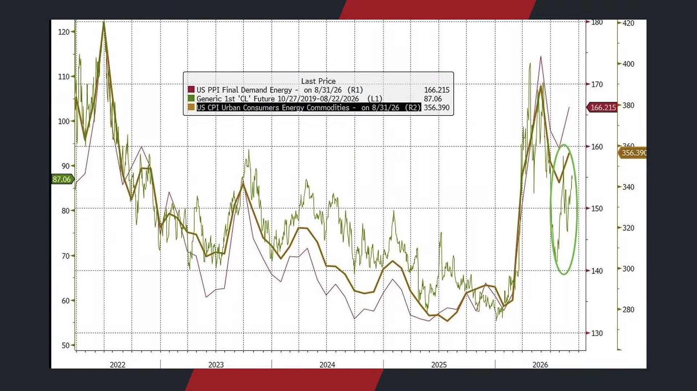

**逐字稿片段：** 8月份的能源價格單月是上漲2.1% 這是最明顯的來源 汽油價格是3.9% 其實你光是汽油大概就 貢獻了1/3的整體CPI月增幅哦 這個就是通膨現在最大的變數哦 所以我們真的講 只要沒有美伊戰事哦 搞不好現在在降息格局也不一定呢 不過呢 如果我們把能源和食品排除的話 核心通膨其實就改善了哦 這就我們剛才講的 真的就是 這場戰爭不要發生哦 這有很高的機率 我們現在可能已經降息一碼或者兩碼

**話題推測：** 提及8月份能源價格單月上漲2.1%，汽油3.9%，預期為CPI分項貢獻圖。

---

## 00:15:11

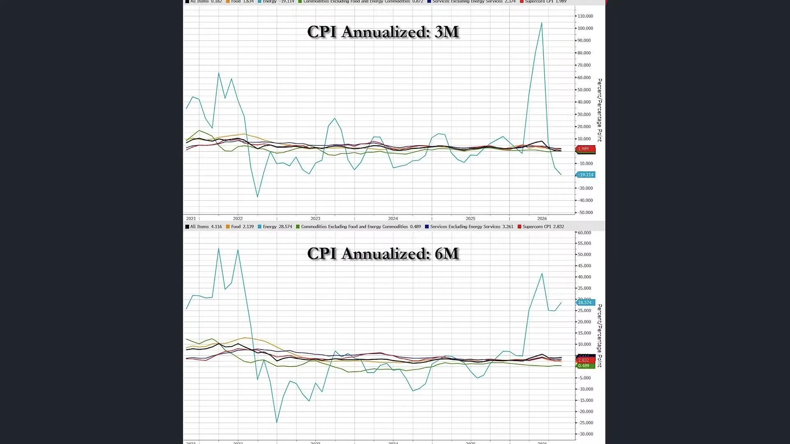

**逐字稿片段：** 8月核心CPI單月上漲0.3% 但年增幅是從2.5下滑到2.4 說明不看能源食品呢 物價看起來正在 明顯的收縮 已經準備達標了 基本上降息格局可以開啟了 那住房通膨現在還是 有點正面的效果了 8月份住房通膨單月份年增幅在0.3% 不過呢業主等權租金只有0.2% 好這也是美國房地產市場 現在還在收縮的原因了 那現在只要租金持續降溫了 就看一下能不能稍微沖銷一下 這個能源通膨所帶動的效果了 好就借由消費市場的疲憊來壓抑物價 好這就是比較不樂見的 就是我們希望的通膨降溫了 是因為供給過多 到處都是手機 生產力提升 AI的幫助 所以呢物價下跌 這個時候 這是大家開心的通膨閉環 可是如果通膨閉環的原因 是因為核心通膨消費正在快速收縮 因為沒有人有能力消費了 因為買不起東西了 所以通縮了 哦這個就比較不樂見了

**話題推測：** 公佈8月核心CPI單月與年增幅數據，預期為核心CPI走勢圖。

---

## 00:16:13

**逐字稿片段：** 那現在很值得注意的一個新現象 就是科技和AI投資哦 它慢慢的往消費端來做價格傳導 不像是能源通脹這麼嚴重 不過也慢慢往下了 說明整個AI的爆發 它並沒有第一時間達到通縮效果 他先帶動了通脹 那通縮要等到生產力提升嘛

**話題推測：** 引入科技和AI投資對消費端價格傳導的新現象，預期為AI對價格影響的概念圖或相關產品價格圖。

---

## 00:16:31

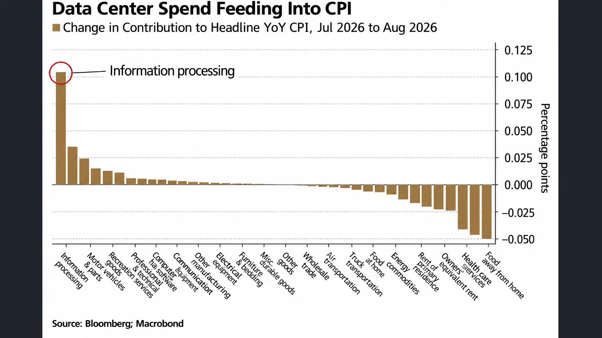

**逐字稿片段：** 我們看最近的教育通訊產品價格 好最近在8月份大漲 好這很明顯就是因為開學季嘛 電腦手機通訊服務 都是大漲價 那主要是季一體價格已經 反映到本季度本年度的開學季 部分品牌也透過新功能搭配著漲價 把成本轉嫁給消費者 要麼就直接漲了 然後告訴你有一些AI的新功能 要麼就是慢慢的把它降規 但是保持原本價格 但都是同樣的意思哦 都是記憶體通膨往下傳導 所以市場上現在最大 壓力來自於哪裡其實 通膨也沒這麼可怕 在一個經濟好的情況底下 本來就會有適度通膨 可是問題是 如果你的薪資跑輸給通膨 那就是實質購買力衰退了嘛 那現在就處於這樣的一個階段

**話題推測：** 提及8月份教育通訊產品價格大漲，預期為教育通訊產品價格指數圖。

---

## 00:17:14

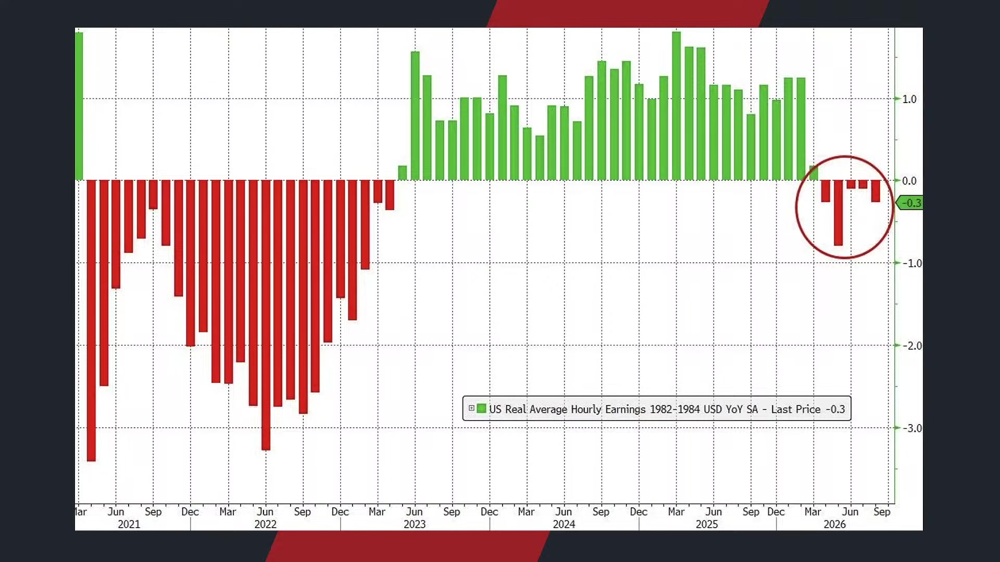

**逐字稿片段：** 我們看美國目前的消費者 實質平均時薪哦 大概已經5個月負成長了 哼你有沒有發現 就是伊朗戰事開打以後他就 負成長了 在伊朗開打以前的整個 2024年到2025年都是正成長哦 只要沒有打這場戰爭 美國的薪資已經連續接近3年 跑贏通膨嘍 結果就美伊戰事爆發以後 連續5個月它都是負成長 你就知道這場戰爭對於美國實體 內部的經濟的實質購買力壓力有多大 好所以接下來觀察美國通膨哦 我們也不會只單一盯著CPI的年增幅了

**話題推測：** 指出美國消費者實質平均時薪已5個月負成長，預期為實質時薪走勢圖。

---

## 00:17:50

**逐字稿片段：** 重要的事件有三個 第一個就是油價和汽油價格 會不會持續往上來做拉升 第二住房通膨的降溫 能不能去沖銷掉原油 價格和汽油價格的上升 那第三呢 是扣除掉住房之後的服務通膨 能不能重新的降溫 搭配著科技和通訊通膨 能夠在開學之際之後 能夠適度的均值回歸 好如果呢 這三個數據 都往好的方向想 原油價格不要再創高了 那住房通膨繼續下行 然後呢開學季之後 校正回歸 那勉強還可以稍微壓制一下 好但現在市場的壓力很明顯了 已經開始提前預估原油 價格會往中下游端來做傳導為什麼 因為的確它有部分 產品已經形成外溢效果 跟我們過去所提過的一樣

**話題推測：** 總結觀察美國通膨的三個重要事件，預期為總結列表或關鍵指標圖示。

---

## 00:18:35

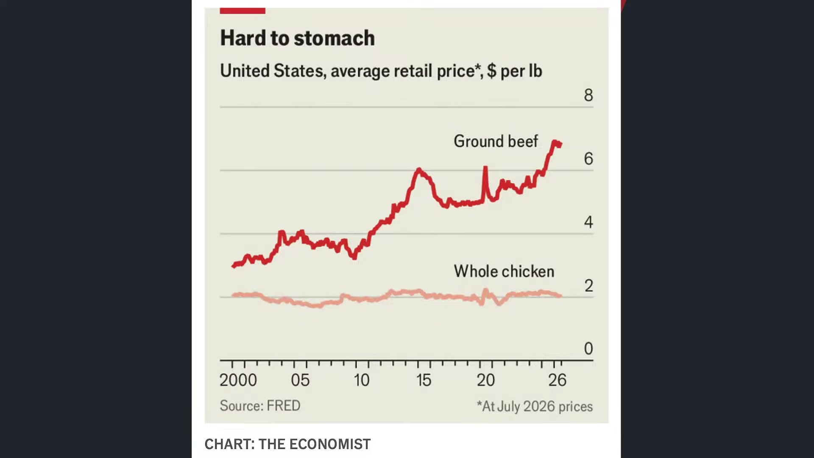

**逐字稿片段：** 現在像是農糧價格的部分 美國牛肉價格從疫情以來 已經漲了7成了 漲幅是超過通膨的兩倍 那當然呢 川普的態度 很明顯是指向大型的肉類加工商 像泰森像巴西肉品 巨頭 國民牛肉 這四家公司哦 大概掌握了全美85%的牛只的屠宰量 那他認為呢 高集中 代表的企業正在暴利 可是你要知道哦 好這些公司哦 股價都跌得很慘哦 因為他們牛肉都在虧照來講 他們應該反映更多的牛肉價格漲幅的 但是由於中央政府的口頭干預哦 所以大部分漲幅是遠遠低於實體肉價 泰森股價 從2021年以來已經跌了40%了 真正的原因其實來自於供給端了 美國牛群正在大幅度減少 所以上一次打關稅戰的時候 我們就已經講過了 你根本就不用擔心買美牛的問題 美牛沒有給他配給上限 全部進口 0關稅都沒差 負關稅也沒差為什麼 美國牛根本就不夠 美國牛現在美國人自己都不夠吃了 好臺灣現在 能夠進口的規模其實也很有限的 因為現在美國牛價格 美國人自己都不夠吃 價格漲幅已經高達70%了 雖然70%它價格相對於其他 海外市場還是有競爭力了 但是內部其實供給出 了比較大的問題哦

**話題推測：** 切換至農糧價格，提及美國牛肉價格從疫情以來上漲7成，預期為牛肉價格走勢圖。

---

## 00:19:52

**逐字稿片段：** 第二個方面呢 是來自於目前歐洲的飼料危機 因為玉米價格哦 最近也創下3年來的高點了 乳價壓力開始升溫 我們以前都知道臺灣 有時候那個熱浪一來的時候 那個乳牛那個乳汁就滲不出來

**話題推測：** 引入歐洲飼料危機和玉米價格創3年高點的話題，預期為歐洲玉米價格走勢圖。

---

## 00:20:06

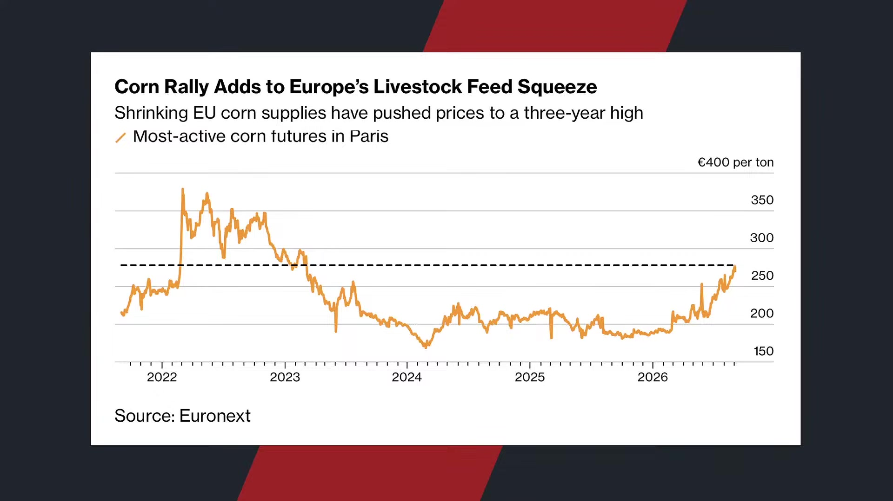

**逐字稿片段：** 唉英國現在歐洲也是一樣 牧場的枯萎 使得農民提前動用原本 留給冬季的乾草和飼料 部分農場的每頭乳牛的每日 的飼料成本大概已經增加5.8 8歐元比正常水準呢翻倍以上 那加上現在又有熱浪衝擊哦 那滲不出乳汁來呀哦 所以全球牛奶價格是否會往 中下游端來進行進一步傳導 值得觀察 那當然最大挑戰呢 是市場上擔憂的聖嬰現象 因為我們知道經濟 衝擊已經開始浮現了嘛 今年5月到8月

**話題推測：** 說明英國乳牛每日飼料成本增加5.8歐元，預期為乳牛飼料成本圖。

---

## 00:20:41

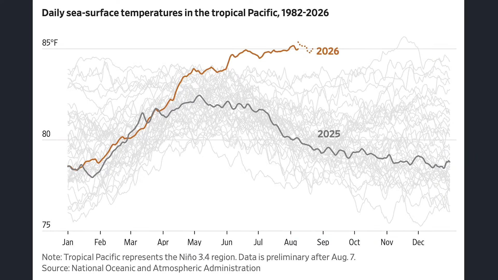

**逐字稿片段：** 整個南美洲哦 巴拿馬的降雨量比平均少了34% 但是呢在整個東亞市場 大概多了10%到20%左右 有一個地方沒下雨 有一個地方就會瘋狂下雨嘛 那這一種聖嬰現象 衝擊全球經濟的結果 會不會形成市場上在食品價格的輸出 形成短期部分商品供給過剩 短期商品呢 根本沒有供給呢 好所以這個是食品價格 最後一波的炸彈 值得留意 當然了這些問題 最後形成了一種結果 就是10年期30年 期公債殖利率的集體創高 那在這創高的過程當中 第一種解決辦法是供給面改革嘛 你嘗試著把產能給開出來呀 原油產能要開出來 食品產能要開出來 可以借由科技的介入 政府的協調 開出來 但目前這個問題無解 連聯準會都沒有能力做到 那要如何阻止實質利率預期上彎呢 先把預期打消 已經供給稀缺的守不住 可是想囤貨的 我要狙擊你 我要阻止你去囤貨

**話題推測：** 提及巴拿馬和東亞降雨量數據，預期為全球降雨量異常地圖。

---

## 00:21:42

**逐字稿片段：** 好所以美國財政部在上 禮拜就做這樣的事情呢 宣佈擴大長天期公債回購 哎結果呢 實際買回金額卻是低於市場預期的 反而導致殖利率更進一步的上升 好直接衝高到4.94了 好財

**話題推測：** 提及美國財政部宣佈擴大長天期公債回購，預期為財政部政策公告圖或債務回購圖。

---

## 00:21:56

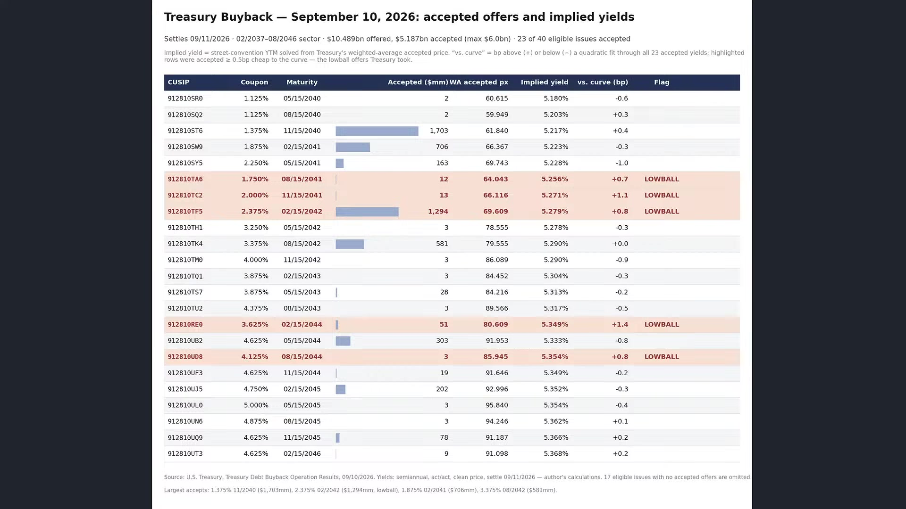

**逐字稿片段：** 這次財政部原本是預估10- 20年其公債回購額度 幾乎會用滿到60億 最後是買了51.8億 好那在收到105億美元的賣單之後 只接收到不到一半 好這背後 當然是部分持有人開出的賣價太高 等於想要趁財政部救市 的時候去賣出高價嘛然後再 因為現在財政部在買債嘛 然後再用市場低價買回套利嘛 財政部最後選擇不全盤接受 這也說明一個問題 連擴大回購都壓不住 長天期的直利率 美國財政部未來可能得要採取 更為激進的債務的管理措施 包括削減償債的標售規模 或者甚至取消20年期公債的售出哦 如果按照美銀的預估 如果仿照21年到22年 那個時候也是降低償債的發行嘛 可能會額外壓低殖利率接近20個基點 可是這件事情都說明著 現在市場就是典型的 我知道你要複盤 我有點反應 剛開始可是不代表是好反應 財政部原本是希望透過 買債改善市場的流動性 穩定長端利率 而市場一開始是反應的嘛 這 一開始告訴你說我 現在準備要救你了 你先冷靜下來 後來發現那個手術刀已經開下去了 身體完全沒有好轉 這個時候反而是政策都出了 利多就來了 大家就會有那種利多盡出的感覺了 除非你給我馬上釋放 一個更高強度的刺激 要不然呢 政策短期內壓不住了 這市場有沒有反應 一開始是有反應的 可是最後發現 不代表是好反應 之前還看到網路上一個段子 講那個一個病人來諮詢性功能障礙 對太太有點提不起勁了 那醫生說你對太太還有衝動嗎 那病人說有是有 那醫生說那對嘛 那情況還沒那麼糟 那你告訴我 你上次對她有衝動是什麼時候 那男的想了想 她撞壞我車子的時候 有反應不代表是好反應 就財政部擴大長天期美債的回購 市場到底有沒有反應 有但是反應是什麼 10年期公債在利率沖高到4.95了 所以投資有時候最怕的 也不是市場沒有反應 它真的反應了 它的方向完全跟你想的不一樣 這跟股市有時候降息 股市不一定漲 經濟數據很好 唉那股市也不一定漲 那可能會害怕利率的預期升高嘛 政府救市去出手救債市 實際利率會一一定跌嗎也不會 因為從頭到尾都是預期的問題 你回購幅度低於我市場預期 我照樣給你舉旗 這個就是我們看到市場上極大壓力

**話題推測：** 提供財政部公債回購額度及實際買回金額數據，預期為債務回購數據圖。

---

## 00:24:27

**逐字稿片段：** 我們看美股股市四大表現 現在唯一的好處是什麼 就講了這麼多利空 那債市是跌幅很重了 股市是沒什麼受傷了 道瓊指數上禮拜五還上漲509點 0.98% 收在52,573點

**話題推測：** 總結美股四大指數（道瓊、標普、納指、費半）表現，預期為美股四大指數總覽圖。

---

## 00:24:40

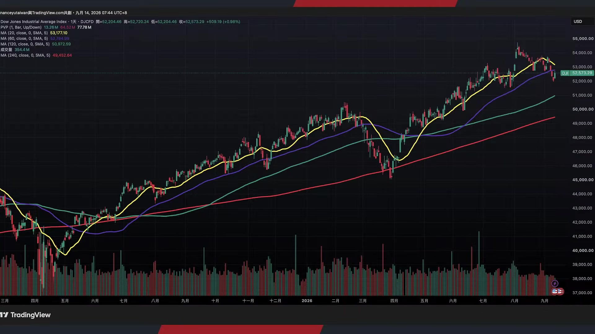

**逐字稿片段：** 標普上漲65點 0.86% 收在7,656點

**話題推測：** 提供標普指數上漲點數及收盤價，預期為標普指數K線圖。

---

## 00:24:44

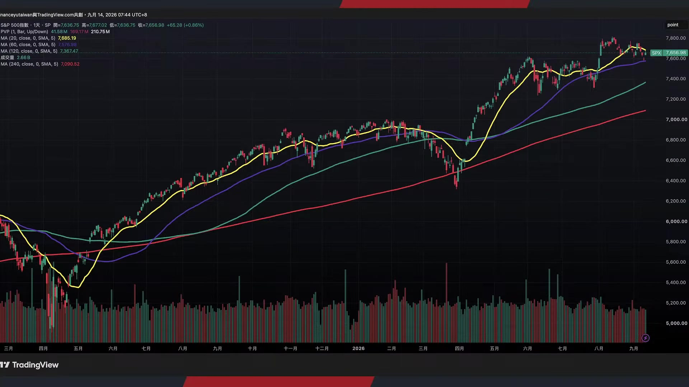

**逐字稿片段：** 納指上漲251點 0.96% 收在26,330點

**話題推測：** 提供納斯達克指數上漲點數及收盤價，預期為納斯達克指數K線圖。

---

## 00:24:49

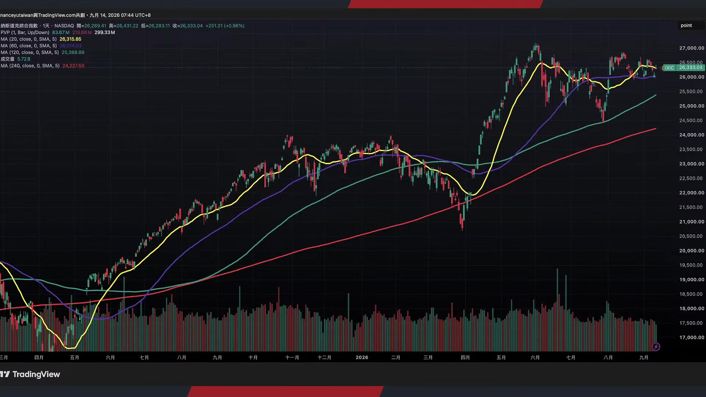

**逐字稿片段：** 費半上漲200零九點 1.8% 收在11,824點 三大指數還在高位震盪 那費半呢 我倒是覺得那個半年線的買盤 下方買盤其實蠻強勁的 而且現在有量說 而總有一股感覺 好像大多數人的想法 都是再跌再跌我就進場 就每個人現在都是手上現金 比例在7月份之後開始提高 等待一個更大的乖離修正 那的確了

**話題推測：** 提供費城半導體指數上漲點數及收盤價，預期為費城半導體指數K線圖。

---

## 00:25:15

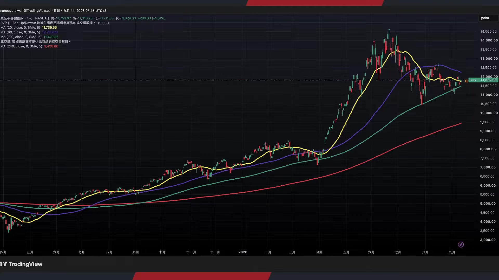

**逐字稿片段：** 我們看今年半導體股 堪稱美國股市最戲劇化的族群 費盼今年6月一度上漲100% 7月份又快速跌入到熊市現在呢 還是維持的年漲超過50% 那問題是這種劇烈波動 它不只是影響到科技投資了

**話題推測：** 話題聚焦於半導體股的戲劇化表現，預期為半導體指數走勢圖。

---

## 00:25:31

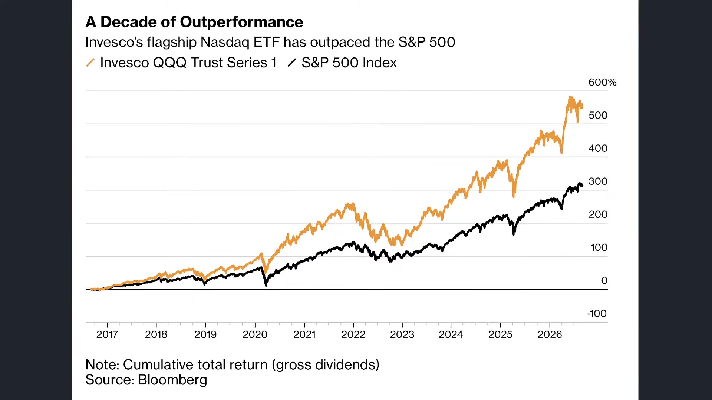

**逐字稿片段：** 因為半導體股現在占整個 標普500權重也高達17%了 可是它貢獻了指數40%以上的漲幅 在納斯達克100指數當中 晶片股的權重更是高達了32%好 所以過去十年納指100累計報酬是550 勝過標普的315% 其中有很大一部分呢 當然是來自於科技巨頭了 可是更大一部分來自於這 兩年晶片股的超額的顯著報酬 好所以今年半導體就是 一個很好的例子 一度漲100% 然後後來又跌到熊市嘛誒 現在漲幅還是超過50%哦 它還是緊緊跟在臺灣 和韓國股市之後哦 那其他股市還是輸給費半的哦 所以如果你中途受不了波動賣掉 未來利率預期又提高 你就說我不玩了 誒你可以 現在你要決定要減碼怎麼樣的 每個人的資金配置情況不同了 但如果利空發生了 股市下跌了 你才決定不要玩 哦那你就要瞭解自己是不是 適合做長期股市的河流圖投資哦 後面漲回去你又痛苦 如果你一路抱著不賣 7月暴跌你也會痛苦 賣一半留一半 它漲了後悔 賣掉那一半 跌了又後悔留下來那一半 好這有時候這個我們講 投資最經典的悖論 你想要得到半導體長期的超額報酬 就必須要接受它中間 可能會出現的巨大波動 好所以有時候是躲不掉的 但更重要的來自於 如果只是利率預期的 升高造成的股市下跌 那你是不是加碼的好時機呢 這個要先想好哦 因為現在看起來利空蠢蠢欲動 股市還沒有完全反應呢 你想要完全躲掉每一次大跌 也要瞭解到 你很有可能會躲掉最重要的上漲 所以我們講說賣股票 是不是一種失去 為什麼獲利了結的 時候不會感覺到痛苦呢 那你想想看 你賣掉之後 你再等看它漲50% 你發現賺錢也可能是一種痛苦 你賣一半留一半呢 漲了你後悔賣掉一半 跌了你又後悔怎麼只賣一半 所以選擇也是一種痛苦 那乾脆長期投資都不賣呢 那你會知道 費半一年漲100%以前 中間也會先跌進到熊市 所以你一樣會有痛苦 投資最痛苦的地方 就是你想要得到上漲 你又不想要承受波動 你想要躲過下跌 你又不想要錯過任何的上漲 可是市場從來都沒有這樣的選項 所以你要能夠選擇 你到底是持有的波動的痛苦 還是踏空之後的後悔 而這很重要 最近網友在傳一段 話過來哦 他講什麼 拉屎也不是一種失去嗎 為什麼你沒有感覺到痛苦呢 那如果你試著 吃回去 這個時候得到也是一種痛苦 如果拉一半夾夾斷 那你發現 挽留也是一種痛苦 那喝點瀉藥試試 發現無法控制的失去 才是真正的痛苦 當你拉不出來時 才是最痛苦的 放不下也是一種痛苦 所以你就知道有時候 很多時候 他是進退兩難 你沒有 自己一個顯著的原則讓你去遵守 你會發現 你買股票也不是 賣股票也不是 賣一半也不是 買一半也不是 遇到的很多問題 都是因為你原則沒有提前先思考好 很多投資時候都是這樣的問題 痛苦都不是因為你真的做錯 就你有時候太想要把每 一件事情都做到完美 你知道嗎 買在最低 賣在最高 想要吃到全部漲幅 又想要閃過每一次下跌 沒有那麼順利的了 好市場上不會你每一次 想要抓到最後一個高點 摳出最後一點報酬 你就能夠全面獲勝 因為中間還是會有波動 對對 正在吃早餐呢 為什麼要講這個 你在吃早餐呢 那那吐出來也是一種失去嘛 你如果捨不得 那就吞回去 哎你馬上就發現 得到也是一種痛苦 如果你含在嘴巴裡頭 不吞也不吐呢 那就是套牢嘛 進退兩難更痛苦 好所以人生跟投資幾乎一模一樣 有時候最痛苦的不是失去 也不是得到 是你明明知道這個東西你不該留 你卻還捨不得停損 然後上點價值 突然覺得好有收穫 講的自己好佩服自己 好我們看下美股股市

**話題推測：** 說明半導體股在標普500中的權重及漲幅貢獻，預期為市場權重圓餅圖或貢獻度分析圖。

---

## 00:29:33

**逐字稿片段：** 臺北股市現在開盤表現 好台股的部分 對對對 對我自己講的也有點噁心 那還是不要再講下去了 好下跌600點 好我們看下沒有 臺北股市概況 手機當機了你看 講講太興奮你知道 剛剛連看盤軟體都沒有開 好了我手機真的就這樣當機了ok 台股下跌643點 收在45,541點 我們今天聊的範圍很廣哦 我們今天聊了很多 對好噁心好噁心 剛才那段要剪掉 好險我們現在線上人不多 剛才那段剪掉好了 今天聊事情很多 我們從商品大漲到 美國股市的獲利創高 原油價格沖上100美元 好到現在市場上針對 利率預期的收縮 其實都還是可以看得出來 在美國股市當前的 基本面強勁的效果底下 稍微抵抗住了目前的高利率 可是高利率如果一直維持上去 或者利率預期不斷的提高 也遲早會對於股票市場形成抑制 形成估值的縮減 這個時候就要回到我們 的原則的投資初心 就是如果是由於利率 預期所造成的估值收縮 那對於左側投資者來看 它是一個買進的時間點 還是準備要停利離開的時間點呢 這個是要想清楚的 從宏觀環境來看 那第二點是我們觀察到 在整個通膨最大的一個難處 其並不是短期期貨價格的沖高 因為期貨價格沒創高 是柴油價格先創高了 說明真正通膨最大的難題

**話題推測：** 切換至臺北股市開盤表現，預期為臺灣加權指數即時走勢圖。

---
