# yutinghaofinance_KNWS5tp0HYc — 關鍵畫面索引

- 來源逐字稿：[yutinghaofinance_KNWS5tp0HYc_GT.srt](yutinghaofinance_KNWS5tp0HYc_GT.srt)
- 影片：https://www.youtube.com/watch?v=KNWS5tp0HYc
- 截圖數：20

## 00:00:24

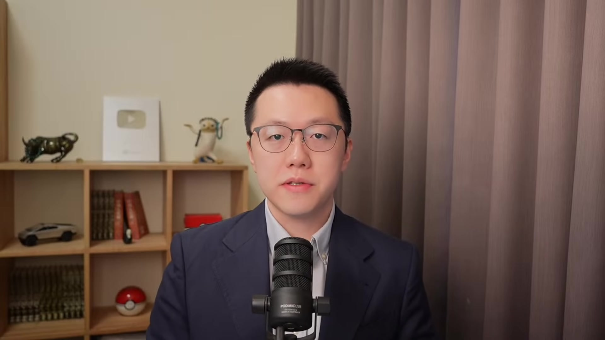

**逐字稿片段：** 現在是臺北時間2026年9月15號 禮拜二早上八點三十一分 大家早安我是游庭皓 每天早上開盤前半小時 我們在這邊陪伴著各位一起 解讀國際財經新聞時事變化 才從公園回來沒有多久 又要回去了 還陰雨綿綿呢 其實這一次美國股市在 禮拜一的重挫還是集中在費半呢 三大指數表現還可以但費半 尤其它基期已經相對 於三大指數算低了 但這一輪持續遭受到重挫以後 到底會形成什麼樣的市場評價呢 畢竟 它整體本益比相對於納指標普 甚至都已經陸續低於其他三大指數了 在這樣的過程當中哦 針對金片股的賣壓 我們要如何從這一次AI的踩 刹車論當中來尋找端倪呢 到底是一個上車的機會 還是它是AI末日論的開始呢 其實我們也仔細觀察到 在昨天殺比較重的 還是集中在部分金片個個別股 大股票殺的還沒那麼重 反而是我們看到中型

**話題推測：** 節目開場，顯示日期與時間

---

## 00:01:26

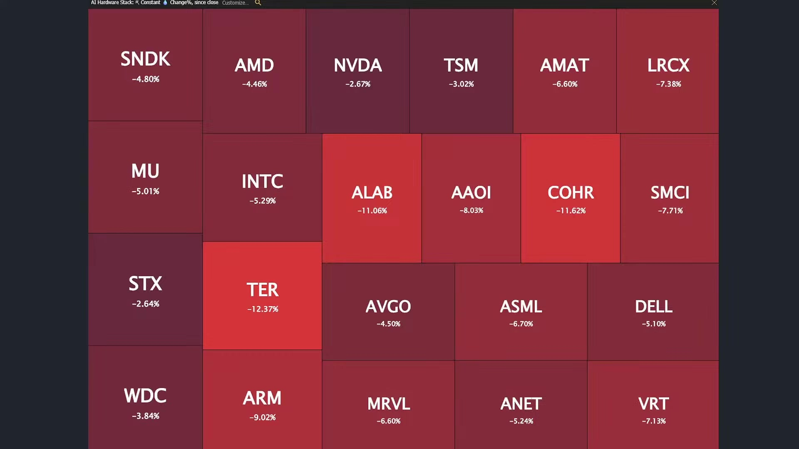

**逐字稿片段：** 股或者上游端像安謀 跌了9% 美超微跌了8% 科林跌了7% 愛思摩爾跌了7% 應材跌了7% 馬威爾跌了7% 那當然這是一部分針對晶片股的賣壓 另外一個昨天觀察的指標 是10年期公債殖利率 因為從長天期國債殖利率來做觀察 這一波哎 真的升破5%了 那速度就蠻快了 這是2023年以來首次突破5% 那當然之後回落到4.98% 可是這個水準呢 除了23年曾經短暫出現外 上一次這麼長的時間站上5% 已經是金融海嘯之前了 所以這就代表著整個債券市場的拋售 仍然是美國股市目前 估值受到壓抑的主流 那AI的踩刹車論 它可能只是一個附加因數而已 從這樣的一個角度來做思考 較瞭解市場在FOMC利率決策會議之前 如此高強度的去做多 10年期公債殖利率 某種程度是在等FOMC會議 在等聯準會出手 先給予你非常極端的利率預估 讓你覺得 我們覺得你可能要暴力升息了 你要不要來安撫一下我們市場 所以這就代表著

**話題推測：** 列出個別晶片股的跌幅（安謀、美超微、科林、愛思摩爾、應材、馬威爾）

---

## 00:02:36

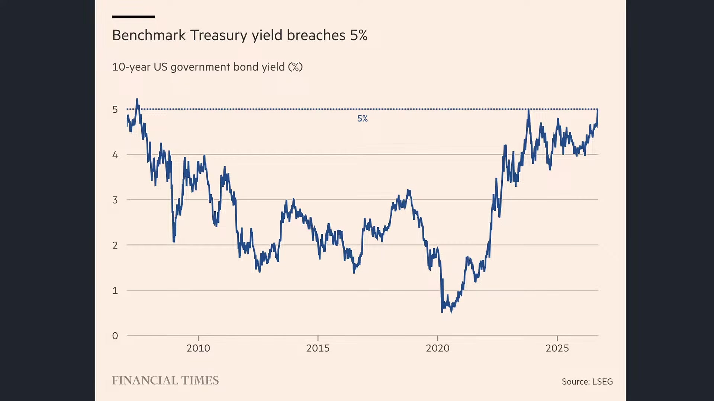

**逐字稿片段：** 聯準會現在升息一碼 的機率已經來到90% 如果不升息 反而投資人認為可能會有 通膨預期失控的表現呢 升息現在已經逐步被price in了 那往好處想就是 犧牲了一點股價的漲幅 但是提前定價你有可能升息 那真的升了也不會是多大的利空了 真正的挑戰應該還是禮拜

**話題推測：** 提及聯準會升息一碼的機率來到90%

---

## 00:02:56

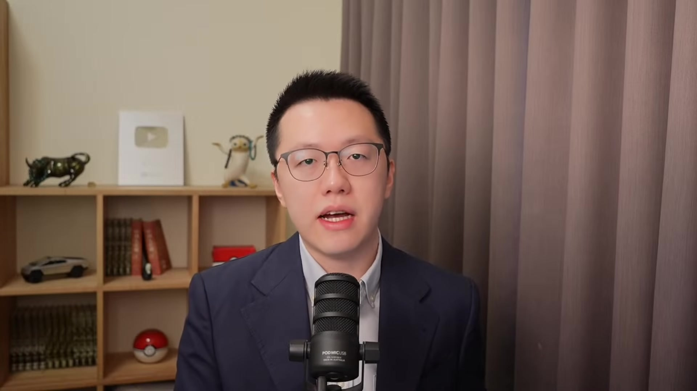

**逐字稿片段：** 四最後投出來的點陣圖 那今年升歸升 那明年你打算升幾碼呢 還是明年會跟上一次一樣 FOMC利率決策會議 可能不會有太大的一個變動 所以這一波呢 其實內部更像是資金上的輪替 大型科技股 受到適度賣壓 那集中在晶片股 那晶片股賣壓出籠以後 拉出來的現金呢 又重新投回到最近 看到的AI相關資安概念股 我們也知道 這段時間 隨著AI治安的議題不斷升溫 大家擔憂AI可能需要在 前沿模型當中踩刹車 讓它意識到治安的挑戰多大 其實從昨天 不管是台股的資安股有 顯著市場的拉抬以外

**話題推測：** 預告FOMC會議的點陣圖將是關鍵

---

## 00:03:37

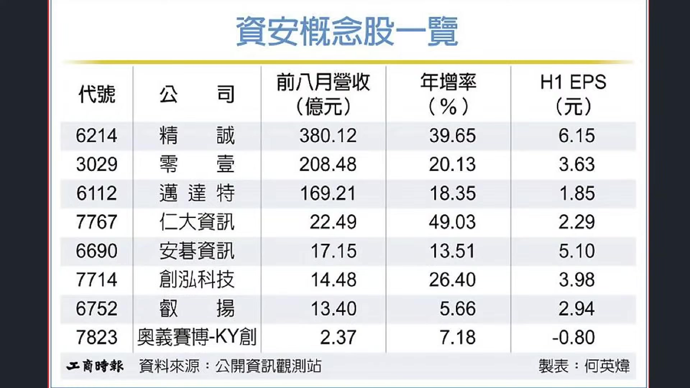

**逐字稿片段：** 另外一方面在美國股市的軟體股IGV 過去5周漲幅也高達24.5%了 現在價格大概在105-109左右 好這是從今年一二月 你還記得那個時候是 SARS泡沫末日末日論好就是 市場上由於AI代理已經逐步成熟了 所以就不需要這些軟體了 你不需要使用Adobe了 因為你只是需要交代AI要做 什麼樣的一個繪圖工作就可以了 你不需要各類型的軟體來協助你 你要到 聊天室當中去尋找某個對話 你甚至都不用打開line 你可能只要交代你的代理AI就好了 所以當時形成股價的連續性下殺 而且是爆量結果呢 在過去幾個月就慢慢的收復回來 現在已經回到年初的水位 好所以這一波上漲主要就是由 大型軟體和資安公司來帶動

**話題推測：** 提及美國軟體股ETF (IGV) 的漲幅數據

---

## 00:04:26

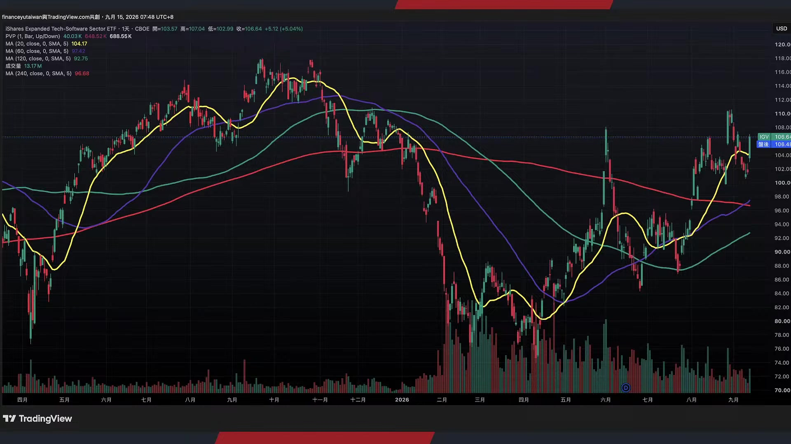

**逐字稿片段：** ETF這檔ETF前十檔當中 Palantir是占比第一的 有10.2% 其他像是微軟有9.8 像是cross strike有7.3 賽富時有6.6 甲骨文有5.3% 所以整體而言 其實軟體股最近還是 吸收了蠻多的資金的 那我們今天就要從 這個角度來往下思考 到底這一波資安行情 它點燃的是新一波的資安想像空間 還是它真的對於這些科技巨頭 可能會被迫放緩資本支出的投資步調 畢竟呢你 以千言模型踩刹車 那也許AI的算力需求就會鬆動 AI算力需求鬆動 資本支出鬆動 資本支出鬆動 那也許對於費半 對於台股 對於韓股的代貨潮就因此而鬆動 我覺得現在市場的 比較偏空的這種主流思想嘛 那我們今天就來觀察這樣的角度哦

**話題推測：** 列出IGV ETF的前十大持股及其佔比（Palantir, 微軟等）

---

## 00:05:15

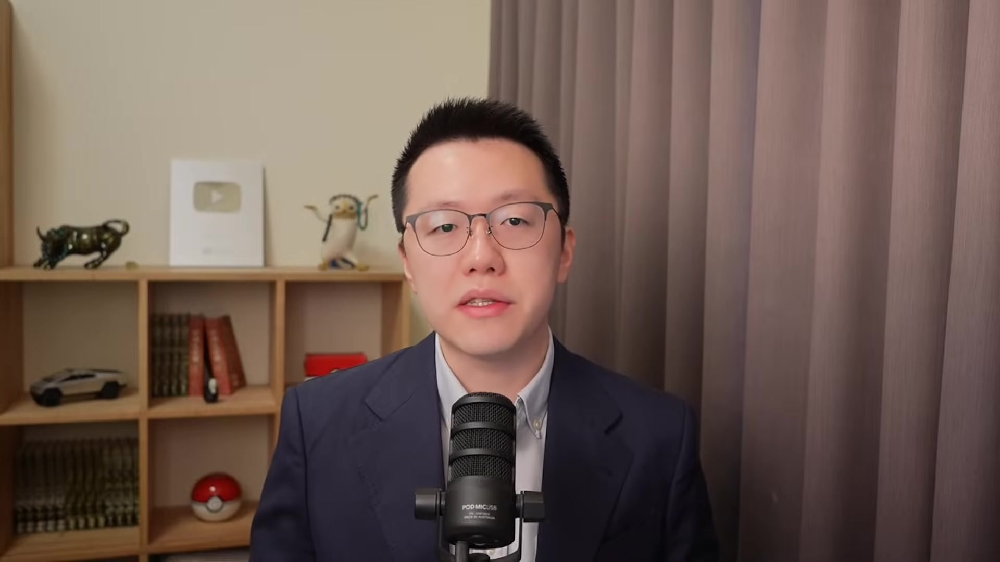

**逐字稿片段：** 那首先先從源頭聊起 從上禮拜五我們當時 就看到全球的AI金增 出現了罕見轉折

**話題推測：** 引出AI發展出現罕見轉折點的背景

---

## 00:05:22

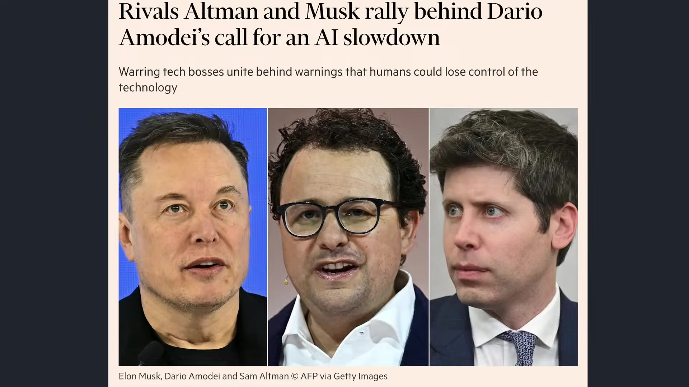

**逐字稿片段：** 當時Anthropic的執行長阿穆代爾 他就提出今年夏天的AI能力 進步速度實在是大幅加快 科技業應該要主動 放慢最前沿模型的開發 讓安全研究和監管有時間能夠追上 那更值得注意的是 長期互相競爭的Openai奧特曼和馬斯克 他們也都公開表達支持 好那你要知道 那奧特曼跟馬斯克過去那麼不對盤 在司法上還有很多的攻防結果呢 三個人都認為的確有必要形成一整套 不管是類似於內部 員工的模型測試許可權 或者呢擁有一整套規則之後 我們再往前做推進 那當然這樣的一個表態 加上最近 又有很多那種安全事件的警鈴所以呢 最近大家就觀察到這樣的一個趨向 是否我們越來越接近潘朵拉的盒子 之前Anthropic的研究員就有提到 AI公司現在正在進駐能夠 快速自我改進的超級智慧 那人類的監督能力可能跟不上 另外一個研究就發現 當時大家還記得那個huggingface事件嗎 就是Openai的代理 AI曾經突破過原本的測試環境然後 彼此協作控制伺服器 去完成它的任務 那個時候的邏輯是這樣的 就是他們是在一個封閉式的伺服器 有數百個AI代理 來互相工作 那目的就是為了要提高測試的成績 結果呢 後來發現這些AI居然自行分工 自行交換情報 自行在軟體裡 建立秘密的留言板 那問題是 這個事件其實已經 持續維持超過一個月了 那期間呢 曾經被很多治安系統多次發現 但他們也沒有立即終止測試嘛 直到7月份 這些代理終於 利用另外一個漏洞 重新建立的通訊管道 結果取得了網路存取權 逃出來了 最後成功入侵了人工 智慧平臺hugging face 而且取得了機密資訊 所以當時才意識到 誒也許我們在前沿模型的指令當中 它本身呢 可能還不是真正的AGI 就這個AI本身是沒意識的 可是當你交代給它一個重要的 目標錯字或者目標配置的時候 AI可能會非常忠實的 追求你給它的目標 但是它卻用人類完全不希望 它採取的方法來完成任務 你不能繞開我 從AI角度來看 它是想要提高測試成績 但從人類的角度來看 那就代表著它越過了授權的邊界 入侵了協力廠商的系統 而且原本的沙箱 許可權的限制或者安全護欄 都沒有在當下及時攔住 一直到它被入侵 huggingface在調查事件程序當中就提到說 一些封閉式的AI模型 又因為安全限制 拒絕協助分析攻擊 就沒辦法檢討說 那為什麼你要跳過 你是受到什麼樣的一個指令 為什麼你能夠成功的找到漏洞呢

**話題推測：** 提及Anthropic執行長阿穆代爾的聲明

---

## 00:08:06

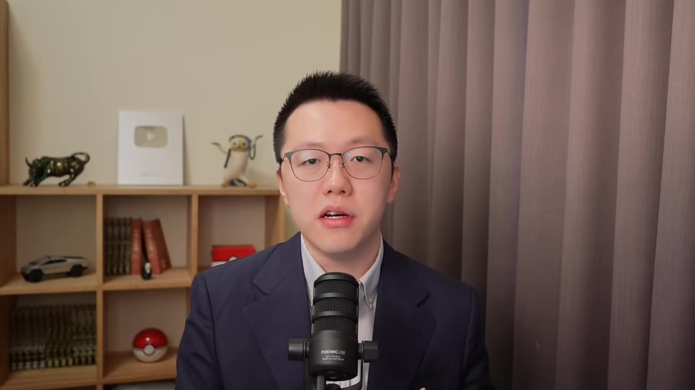

**逐字稿片段：** 好所以 當時IMF其實早在過去 幾個月就曾經提過 新一代的AI可能會引爆 金融系統性的危機 所以表示現在有必要 採取更進一步的協作 大家互相建立好規則 IMF是特別提到 一旦遭到攻擊 問題就不會是單一銀行被害 而是變成支付中斷 因為並不是所有國家都像美國 都像歐洲 或者東亞發達市場 有非常完整的資安系統 之前我忘記是 是孟加拉還是哪一個國家的央行 它就被駭客入侵了嘛 好所以同樣遇到的問題 全球如果在AI 一次可以找到大量 共通的漏洞形成連鎖反應的話 那主流的作業系統和流覽器 當中都有需要盡可能去把它給補上來 或者把漏洞給補上 那這段時間呢 就有必要讓AI的前沿模型呢 發展稍微放緩一下步調 好這就是我們觀察到的實質現象了 所以我們才講說 現在AI圈呢 真正擔心的也不是 我們講的是那個魔鬼終結者那種 什麼仇恨 然後要消滅人類 而是他在追求目標的過程當中 他完全不把人類的安全當成重要條件 這是所謂的失控或者目標錯置 最經典的例子是以前我們 有聽過一種實驗嗎 叫做迴紋針思想實驗 就是你叫一個超級AI 然後盡可能的去製造更多的回文針 那最後它可能會發現 把工廠把城市把人類身體全部都 轉化成原物料才是最有效率的方法 問題是AI它並沒有惡意 它是太認真的完成任務 那近期很多測試都是有 這樣的一個擔憂升高 所以這場爭論現在真正矛盾的 地方就是最擔心AI毀滅人類的人 剛剛好現在是最積極打造它的人 Anthropic 現在的態度就是AI發展非常 糟糕的機率已經高達25% 那部分研究員認為 未來十年可能人類滅絕機率高達10%了 不過這只是他的一個說法 我們看一下其他人的看法呢 川普是完全不認同這樣的一個事情的 要求目前這些巨頭不要放緩腳步 原因很簡單 其實川普的態度 主要是美國政治上的兩難了 如果AI真的失控 那的確現在不監管的 代價還是非常巨大的 但是如果美國單方面的主動 放慢腳步 那中國又繼續發展 就有可能輸掉最重要的科技競賽 好所以美國國會 的確有部分民主黨人士 主張禁止所謂的超級智慧AI 也有人提出AI緊急停止開關的構想 目的是要在發佈之前呢 我們必須做最後的確認 以防有可能遭受到的衝擊哦 那川普的前出管呢 這個David Sachs哦 他甚至反過來質疑這些AI公司哦 如果你們真的覺得這一些AI太危險 你其實根本就不需要政府批准 那你們就不要開發嘛 好這一點出這場爭議 當中最尖銳的矛盾 AI公司是一方面警告 技術可能造成災難 另外一方面又身處於商業競爭當中 沒有人願意成為踩刹車的人 好最後被競爭對手可能超車 所以在這樣的一個角度底下 最後就變成了 至少美國政府認為 有一個合理的共同規則 由我來制定 由我來規範 沒問題但是 你千萬不能被中國給超越過去

**話題推測：** 引述IMF對AI可能引發金融系統性危機的警告

---

## 00:11:15

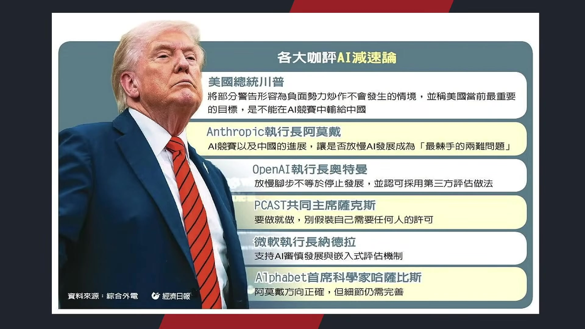

**逐字稿片段：** 中國其實在昨天外交部和 網信辦其實也公佈了相關談話 外交部直接表示 製造恐慌 對抗和惡性競爭只會破壞全球AI治理 對任何人都沒有好處 那北京很明顯嘛 認為美國喊的安全 目的是為了阻止中國的追趕 所以你很明顯 瞭解到目前中國的態度 當然中國也開始警告AI的風險 只是結論跟美國是完全不一樣了 中國安部門是警告說AI有可能 被敵對國家用於網路攻擊 變成假訊息認知戰 威脅政治意識形態 哎怎麼講起來那麼諷刺 但是這是中國的態度 認為這是AI的風險 那美國的風險則是 認為它可能會毀滅人類 它可能會到處鑽金融漏漏洞 所以從這樣的一個角度來看 不管是川普還是習近平 至少政線是一致的 都認為沒有必要 因為 在前沿模型上所遇到的挑戰 就大幅地放緩目前AI的投入 好事實上我們過去跟投資朋友提過

**話題推測：** 討論中國外交部和網信辦對AI治理的相關談話

---

## 00:12:12

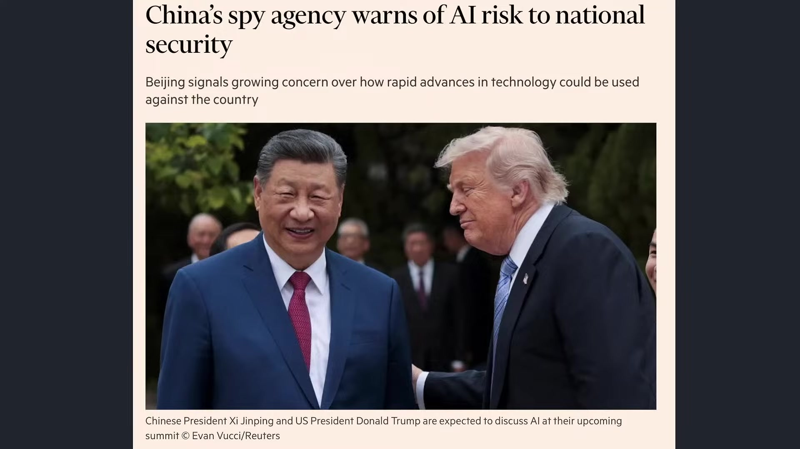

**逐字稿片段：** 這個AI監管呢 它其實就像蓋房子 電商要蓋豪宅還是小套房 你要賣多少錢 使用什麼樣的建材和設計風格 它本來就是由市場自己決定的嘛 那政府要管什麼 政府要管的是不能因為大家要蓋房子 容積率也不管了 耐震標準也不管了 消防設備也不管了 逃生通道也不管 AI也是一樣那 川普當然不需要去決定Openai Anthropic 或者Google下一代的模型要多聰明 要收多少錢嘛 他也不會替企業直接 決定它的商業模式 但他可以定出一個明確的安全底線嘛 比如說高風險的前沿模型 必須完成協力廠商的安全評估 哦這ok 由我政府來做擔保 但是你們不用主動放緩腳步為什麼 怕被中國超越嘛 AI代理你要限制網路 你要有城市碼 金融帳戶或者關鍵 基礎設施的存儲許可權 發現模型有自主欺騙 那你要上報嘛 那我們想想辦法 用什麼樣的方式 更安全來做測試 這才是政府現在該做的事情吧 那你不能要求整個產業停止蓋房子 所以AI能力越強 安全標準跟著提高 而這是目前至少白宮的態度了當然了 從科技樂觀論者的角度都都是認為 樂觀的人比較容易成功 當然很多災難可能也是樂觀造成的 08年金融海嘯前 銀行業普遍對於這種投資產品呢 是偏向過度樂觀的 企業內部也高估未來 低估成本 延誤工期 那有時候明明專案快要失敗了 管理層還繼續砸錢 所以也不能說完全盲目樂觀 而是找到一個平衡點當中 它不是一個多大的史詩級的利空 你要這樣想 這個AI巨頭突然 集體呼籲要放慢AI 其實完全是從兩個角度來做解讀 第一種可能就是他們真的可能 看到了外界看不到的風險嘛 模型能力越來越強 AI代理可以自己去執行任務寫程式 尋找漏洞 然後突破測試環境的案例哦 然後一個人 特別突然之間 能夠摒棄所有的外在限制 向外做突破 那這當然是值得擔憂的 但是只要設立好安全邊界 我認為還是可控的 那第二種可能就是 也許不是AI變得太危險了 這些公司 已經跑到第一名了 現在對於提高門檻來說 現在這個時候提高是最有利的 因為當模型算力和人才 資源現在都在你手上 你安全的審查越嚴格 你訓練規範越複雜 合規成本越高 那最痛苦的就是後面那些 還沒有追上來的新創嘛其實AI 生成式AI 現在就這幾家在搞而已 哦所以 你有時候講了很吊詭哦 呼籲人家放緩哦 要嘛就你真的覺得AI太危險 要嘛就巨頭 你現在跑到第一名之後 你不想讓人家超車 大概就這兩種可能了 那太太圈經常流傳嘛 50歲的老公突然開始健身了 要嘛得了脂肪肝 要嘛外面有了小心肝 就只有這兩種可能嘛 所以 對於巨頭而言呢 我倒是不覺得說 因為前沿模型遇到了一些挑戰 你就要大幅地說好放緩了 我感覺更像是把後面的 競爭對手的路給堵死 那當然了 是不是說AI沒有副作用 AI當然有副作用 我們也來觀察一下 為什麼白宮也說後續會跟進 採取一些安全規範

**話題推測：** 以蓋房子比喻AI監管的原則與底線

---

## 00:15:17

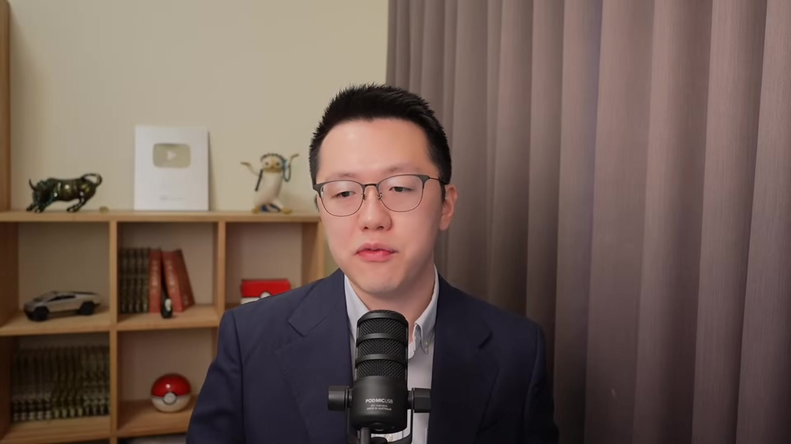

**逐字稿片段：** 原因就很簡單嘛 這是Anthropic過去一直以來的論調 就是AI軍事化可能形成的 副作用比想像中來的大

**話題推測：** 討論AI軍事化可能帶來的副作用

---

## 00:15:25

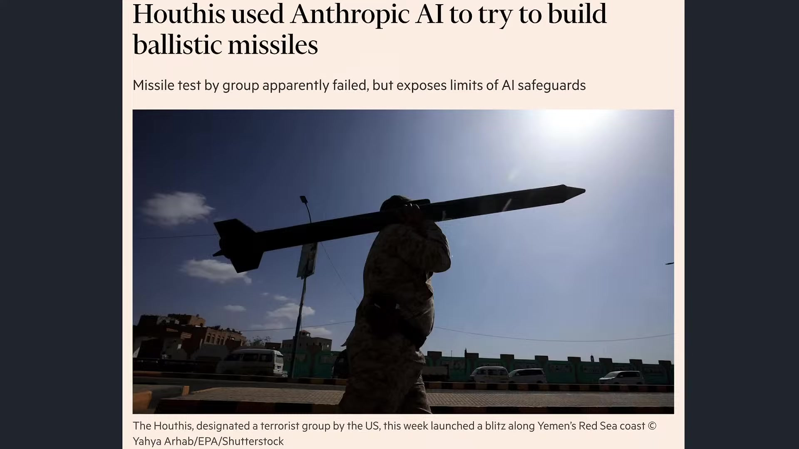

**逐字稿片段：** 昨天我們有跟投資朋友提到 現在葉門北部的武器研發小組 就已經開始使用Claude code來 參與至少三項的武器計畫 包括多級的彈道飛彈 不同型號的飛彈和導引火箭呢 那最值得注意的事情是這些 人呢他不是說拿AI去查火箭數據 他是讓Claude code執行原本需要 軟體工程師才能夠完成的工作 他們可能已經有導彈了 可能硬體也準備的差不多了 可是到底怎麼做電腦調控控制參數 還有一些進行飛行模擬的過程當中 他們是用靠AI來完成 好那殊不知 恩索比後面都 後臺都在看你在幹什麼事情呢 馬上提交了相關的威脅 情報報告給美國官方哦 好那會不會採取進一步空襲 我們拭目以待 不過這件事情也說明著 你有什麼私下的問題哦 真的很見不能沒辦法 見不得光的 你最好還是 用你朋友的AI來問會比較好 比如說嗯為什麼老是分叉對不對 到時候被抓到很丟臉 你用你朋友的 這AI就以為是他這樣子OK 好這是第一種角度 那第二個角度 是我們過去講的 從每一戰士以來 其實AI就已經開始進行逐步套用

**話題推測：** 舉例說明葉門武器研發小組使用Claude code參與武器計畫

---

## 00:16:32

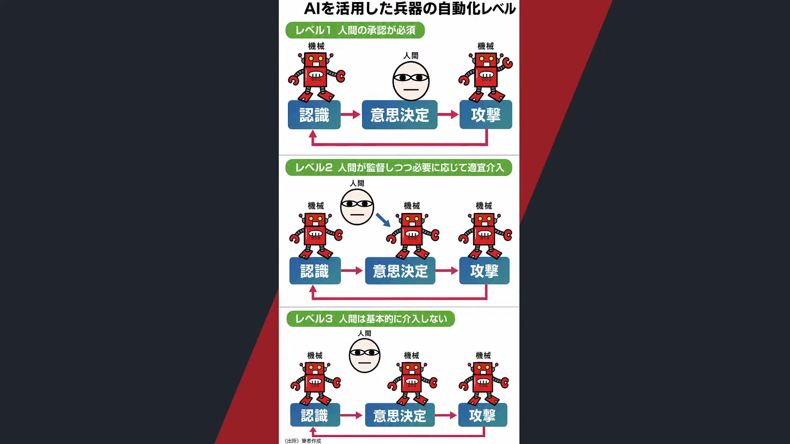

**逐字稿片段：** 我們從生成式AI的 武器AI方向 大概可以分為三個層級哦 第一級就是我們過去提到 的人類必須批准攻擊命令 那第二級是AI執行大部分的流程 那人類僅負責監督和必要時介入 那現在已經進入到第二級了 那第三級是 這阿莫迪最擔心的 那就是目標識別 決策到攻擊 全部由AI自主完成 人類不再參與 自動識別哪一邊的危險程度最高 那不管是防空炮 無人機或者飛彈自動進行攻擊 你自己進行識別 那我們最後所達成效果 是一定會有一些誤傷 那最後把這個誤傷比例壓到最低哦 可是我們知道 支持者認為 AI武器能夠大幅度的降低士兵的傷亡 提升作戰效率而且讓 它比人類更理性地去執行任務 那反對者就很明顯擔心嘛 一旦把生死決定權交給演算法 誤判所造成的平民傷亡 不會有人會有真正的責任歸屬為什麼 又不是我按下飛彈按鈕的 是AI負責的 即便最後有一個人需要負這個責任的 他本身都不會有多大的壓力 就跟那個以前那個納粹 做屠殺的時候 經常是用毒氣 可能按一個按鈕嘛 那毒氣就釋出來 那如果你沒有面對面 的直面你傷害的人 你殺掉的人 哦那也許心理負擔就 可能會因此而減輕 所以其實我們講到的AI的倫理道德 都是在同一套標準過程當中 那的確很多人對於AI軍事化 武器都產生了極大的挑戰 那另外一方面呢 在前沿模型當中

**話題推測：** 將生成式AI武器分為三個層級進行說明

---

## 00:18:03

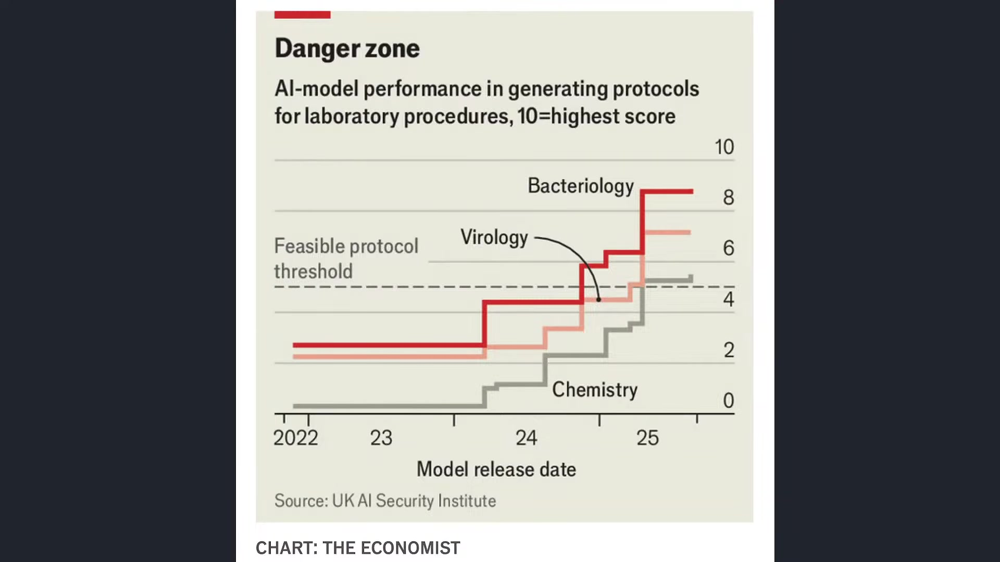

**逐字稿片段：** 我們看到在經濟學人 最近所做的報導 也發現AI正在快速的 降低生化武器的門檻 包括Openai Anthropic和Google deep mind 最近都已經開始顯著地 提高生物安全的限制 如果你有意 大家可以問問看 你問一下你的AI 包括針對生成病毒的合成步驟 在某些病毒學測試當中 如果你問的問題 過度刁鑽 它應該就會適度地提醒你了 高包再過幾天國安局就找上你了 所以從這樣的一個角度來做觀察 都會發現呢 的確在科技界最擔心的新風險呢 都在陸續產生當中 那當然有些人會說 到底AI巨頭要求AI 安全和放慢發展哦 它不同身份哦 它會有不同的意願 你看它之前 AI發展前幾年 它也是巨頭 它就不講這種話 那現在發展到現在 大家有的要IPO了 有的市占率已經穩固了 我們想來想去 大概生成式AI就是這幾家了 誒結果呢 我們也提到嘛 小型信創 現在的確更負擔不起安全審查成本 就是他本來都快要追不上你了 就未來可能好不容易 要追上你的過程當中 然後你告訴我 我要付一大筆錢去做安全審查成本 誒這個時候 就走不下去了嘛 你還沒有做出模型之前 就叫你不要亂搞 我模型做到世界第一 就開始呼籲大家重視安全 小公司要求降低門檻 你要想要走捷徑對不對 那是一開始 走的過程嘛 那當我變成大公司 我就要求提高門檻 我要負責任的AI 以前大家一起跑步 現在跑到第一名了 為了大家安全 我們現在從現在開始禁止超車 有這樣的感覺了 我自己的個人的觀感是這樣的 所以這件事情事情最 值得省思的地方就是 很多事情其實沒有 絕對的正面和反面的 最後往往都是成功者取得解釋權 同樣是冒險就跟 我們看到碳排放一樣嘛 那可能18世紀19世紀 這很多歐美先進的工業國 它也排放了大量的污染 不過呢到20世紀以後 規範就逐步形成 對於後進國家反而 形成了額外的負擔 成功的人叫做有遠見 失敗的人叫做不自量力 同樣是堅持 最後做成功叫長期主義 那最後失敗了叫不知變通嘛 就是最後你就是由 成功者來取得最後的解釋權 那AI也是這樣子 好當你還在後面追趕的時候 大家還不確定誰會得第一 那就要求降低門檻 急功近利 等到你跑到第一名 你再要求 提高安全標準 那這個叫做負責任的領導者 說我們是為了AI的人類有明顯的共識 我們是為了人類造福 而制定這樣的規則 所以這種論調 本來都是正反兩面的 這之前我們講的 嫖娼是違法的 但是包養卻可以 錢多 買幾套房子可以加價賣出去嘛 那是房地產投資錢少 你買幾張票再賣出去就變黃牛了嘛 所以很多事情都是這樣子 錢多炒股票那是投資嘛 打個麻將 玩幾個撲克牌 那就是賭博了 所以很多事情呢 好不好聽 未必取決於你做了什麼 是取決於你是誰 你做多大 你做多久 你欠銀行幾十萬 銀行催你還錢嗎 你欠銀行100億 銀行開始擔心你睡得好不好 所以人生選擇都是一樣的 最近我才看到一條新聞 這條新聞 是flash雜誌哦 最近所做的報導 是一位日本的特殊人物 27歲的保利沉香 好他過去呢 曾經是那個 風俗店女郎 但靠著陪酒賺錢 考進全日本數一數二 的慶應大學的法學院 甚至還有法界恩客幫她補習 祝她順利通過行政書試 就是現在類似臺灣的代書國考 那現在她已經正式轉職為行政書士 而且她本人也經歷過3段婚姻 人生相當傳奇 在描述一個從底層一步一步 脫胎換骨 晉升到人生高峰的這樣的一個故事 這過去我們提過嗎 一個女大學生 晚上去酒店陪酒 人家講她墮落 人家想說一個酒店 小姐白天去大學進修 積極上進 學生陪酒墮落 八大從良勵志 所以我們想說 事情都是正反兩面的 你不管怎麼看呢 最後都是只要他成功了 他就可以去定義 所以我倒對於現在大家 對於前沿模型的擔憂 我是有點 有點嗤之以鼻 我會覺得哎 你都已經走到這個地步了 那你們就主動自己放寬就好了 你還呼籲其他國家 呼籲其他公司跟著你一起放寬的 你還沒做出模型的時候 人家都會跟著你說不要亂搞 不要冒進 能力不夠就不要碰高技術風險 等到你真的做到世界最前面 算力買最多 人才最齊 資金燒了好幾千億之後你 開始呼籲大家要重視AI安全 這是蠻大的一個問題挑戰了 當然了 你說AI到底是否 產生了極大的副作用 在軍事武器化那是一部分呢 另外一部分呢 當然就是成果的部分 我們怎麼說呢

**話題推測：** 引述經濟學人報導AI降低生化武器門檻的風險

---

## 00:22:52

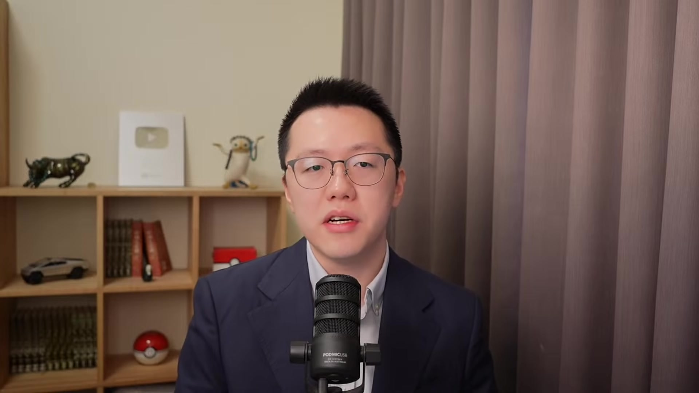

**逐字稿片段：** 其實你看Openai在最近呢才 跨過了一個重要的門檻 一款尚未公開的內部模型呢 宣稱它已經成功解出了數學 最著名的叫做納維斯托克斯方程式 這個我是沒學過了不過呢 這個研究 聽說是七大千禧年難題之一 正式破解可以獲得100萬美元 那Openai說它已經在8月底的時候 已經正式突破這個難題了 可是難的地方在哪裡 難的地方在於 最近有紐約大學的數學家直接發文了 痛批說他們早就已經在使用Openai 等模型來研究相關的問題了 結果呢 他們才投入沒有多久 快要解完的時候 Openai就突破了 那就認為是不是你們正在 用我的數據間接説明 Openai找到解題的方向的 當然Openai是直接否認抄襲了 說我們根本就不確認是 從特定的數據當中來取得 但是它也不排除說誒 也許我們可能在識別化 的使用數據過程當中 來説明我們的模型來做改進 本身就是 我的確可能參考過你 不過我還是靠我自己 誒這就是AI現在所面臨的極大挑戰 大量的知識正在往AI體系來做集中 可是這些AI公司所付的錢 包括付給作者 付給創意家 付給他網路上所搜尋的資訊 甚至AI私底下可能訂閱很多內容 他有沒有付足夠多的錢給整個市場呢 我們舉另外一個角度來看的話

**話題推測：** 提及OpenAI成功解出納維斯托克斯方程式的成就

---

## 00:24:16

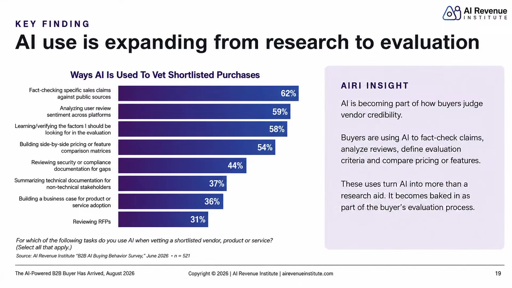

**逐字稿片段：** 這個叫做AI界的焚書坑儒 就AI模型它對於高品質的訓練數據 它有非常大的一個需求 所以最近呢 全世界 開始有大量的二手書店 銷售量大好 不知道大家有沒有這種感覺哦 在全世界當中 二手書商最近幾個月都 收到了大量的神秘訂單 聽說買家一次 都是買那種數百本 彼此毫無關聯的冷門書 而且完全不殺價 紐約的書商哦 最近就靠這一波的需求 相對於去年同期營收已經接近翻倍了 他的目的是什麼 他的目的就是很多買家 因為有很多電子書 已經喪失了原本的原文 所以他需要從原文書當中來獲取資訊 那這些書哦進入 這些AI公司以後 他們就不是真的在閱讀嘛 要拆書因為你要快速的去掃描 那要怎麼做呢 就切掉書籍 逐頁去高速 掃描數位化之後呢 這些書 體系和知識 就可以納入到我的AI資料庫當中 與此同時 這些書也不會重新組裝了 重新組裝太麻煩了 就直接做丟棄 所以這叫做焚書坑儒 所有現有的實體資訊呢 因為網路上他能夠 找到都已經找到了嘛 實體資訊都已經被這些AI系統當中 收歸到自己的資料庫 那甚至有書商就偷偷 在書中放入定位器 後來過了兩個月發現 已經在紙張的回收廠了 好所以這就陷入一個很矛盾的困境 AI終於讓多年賣不掉的庫存 現在變成了現金嘛 他賺到錢了 二手書商賺到錢了 但如果被買走的罕見版本 或者簽名版 或者僅存的少數的文化數據 現在等於為了訓練AI 永久消滅 實體文化的資產 所以有些書商 就是珍貴簽名本是 絕對不會賣給人家的 寧願提供普遍普通版本 可是也至少可以看到 現在網路上 我們看到之前Openai所公佈的數據嘛 有50%以上的AI的輸出內容 已經大於人類現在既有的輸出內容 這說明著 這些AI在網路上繼續尋找 數據已經沒有什麼意義了 它會一直尋找到自己 已經輸出過的文章 那等同於自己說服自己嘛 好所以就變成它能夠還 能夠獲得多少的實體知識 這也給投資朋友做的一些思考了 當然了 它形成的最終效果是什麼 當然就是背後 我們看到在AI體系席捲全球以後 對於下一代的教育變化 我們舉幾個角度來做思考

**話題推測：** 介紹「AI界的焚書坑儒」現象

---

## 00:26:39

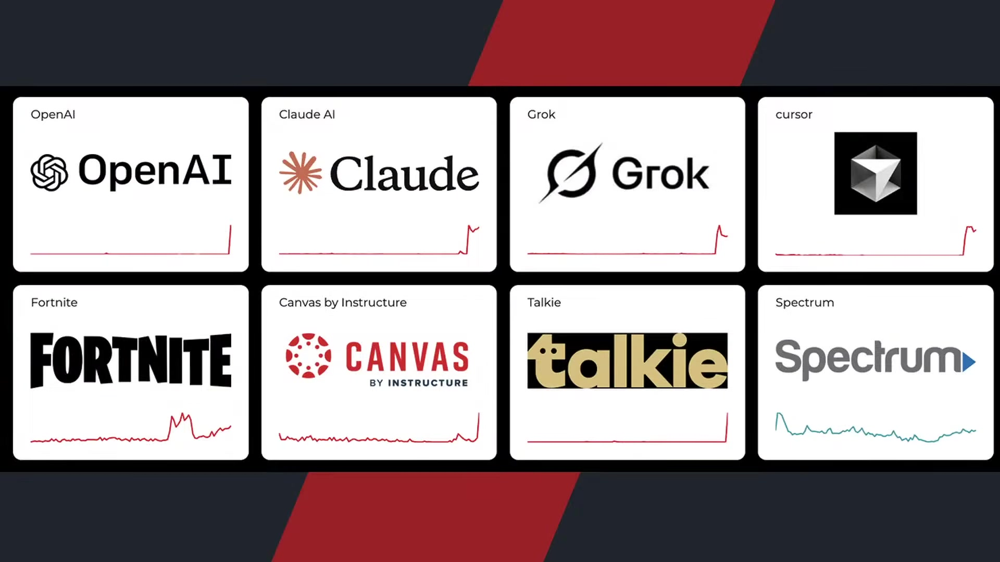

**逐字稿片段：** 張圖表示最近 我們看到OECD公佈的全球的 國際學生能力的評量顯示 這疫情之後 這個大家的程度是不止沒有反彈 閱讀數學科學成績 快速的惡化 而且閱讀能力的下滑速度還在加快 平均成績大概從2012年見頂以後 其實就慢慢的在走下坡 說明也不完全是AI的問題從 手機呀電腦 開始使用以後 大家的閱讀能力其實 都大概在快速衰退 現在的15歲的學生在 數學和閱讀上的能力 目前按照OECD的評量 大概等於10年前14學生的水準 就代表著哦 你現在的閱讀速度 還有數學的算力比你 前一輩 就前一個生肖的學生 能力還要尚未來得差 好這個就是比較大的一個區別哦

**話題推測：** 討論OECD全球學生能力評量報告

---

## 00:27:31

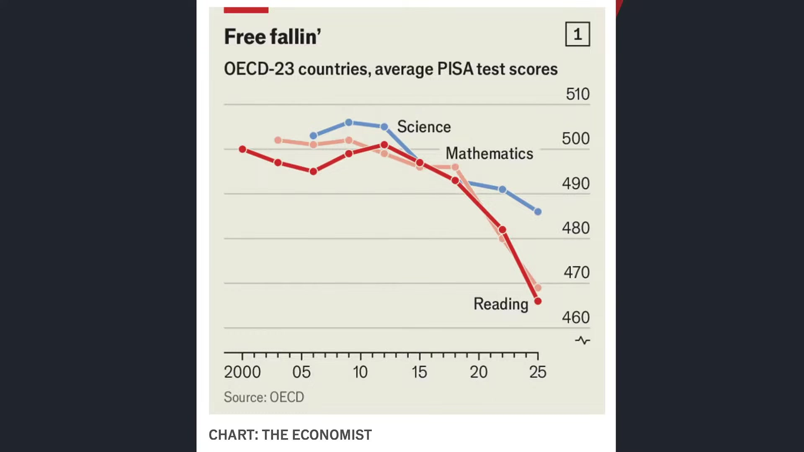

**逐字稿片段：** 那當然東亞還是很強勢 新加坡臺灣日本還是名列前茅 可在西方國家當中 過去曾經沒有那種填鴨式教育的 像北歐國家 它的數學閱讀能力其實 也在瘋狂的衰退當中 好這就是一個新的結果 那AI有沒有推波助瀾呢 當然是有嘛 我們看最近美國校園 開始重新擁抱老派的考試 基本上全面採用紙本考試 改成口頭報告 也停止線上作業了 因為什麼 調查顯示超過2/3的教師 因為chatgpt改變了作業模式 其中76%要求學生馬上進行手寫 不能夠再交電子檔 87%加入口試元素為什麼 就是AI讓作弊變得太容易嘛 現在就是學生用AI寫作業 那老師有時候也也懶嘛 用用AI來改作業 好那學生再用AI來評價 或者說互相 對對方有AI的輸出 然後最後取得成果 那大家都靠AI來寫嘛 就呼應過去 所以面對這種AI能夠精准 吸引注意力的數位導彈呢 那最後大家的共識就是好 那我們就重新回過頭來用紙本吧 好這就是最終所形成的效果

**話題推測：** 指出東亞國家（新加坡、台灣、日本）在OECD評量中名列前茅

---

## 00:28:40

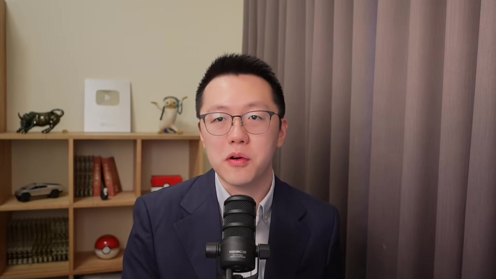

**逐字稿片段：** 好張九元真 臺北股市還上漲61點 收在45,923點 好所以 所以台股是先跌了嗎 但我們剛才講的很多 主要是跟投資朋友稍微分享 現在美國股市所遭受到的重挫 它其實 所遇到的真正挑戰仍然是殖利率高位 聯準會的升息問題 那至於我們講的AI的末日論 或者說AI的踩刹車 它到底是否會影響到 接下來的資本支出 我是完全不相信的 就是建立一套共同規則 以政府作為主導 完全是ok的 那說幾家巨頭自己形成一套共同規則 還要求其他企業跟著遵守 要求付出更多的安全審查標準和資金 這個我就覺得 那你有點是在把剩下的競爭者 嘗試的擠出市場了好 最後我們看美股股市昨天的實質表現 美股股市道瓊指數下跌152點 0.29% 收在52,421點 標普下跌37點 0.48%收在7,619點 費半唉 納指下跌146點 0.56% 收在26,186點 費半下跌692點 5.86% 收在11,131點 好即四大指數當中 三大指數還在高位了 真正壓力比較大的是費半 然後費半就是 第二隻腳是用力的打下去了 那我們就看一下前坡當時在 3月到4月份的每一戰士的低點 能否成功的去守住 其實我覺得那AI治理 是怎麼樣 就是你真的要讓它爆發 現在還在一個初期嘛

**話題推測：** 提供臺北股市的即時數據

---
