# yutinghaofinance_KUZC2NyCCCY — 關鍵畫面索引

- 來源逐字稿：[yutinghaofinance_KUZC2NyCCCY_GT.srt](yutinghaofinance_KUZC2NyCCCY_GT.srt)
- 影片：https://www.youtube.com/watch?v=KUZC2NyCCCY
- 截圖數：26

## 00:01:25

**逐字稿片段：** 我們今天要觀察的幾大方向 要分別從美國日本和歐洲目前所面臨 面臨的這種政府在執政上的挑戰 來回過頭看 現在不包括像是日幣的貶值 美債美債的賣壓 甚至是歐洲經濟的疲憊 如何看到全球在2026年當中 明明是一個AI大爆發 資產價格的繁榮 可是各地政府似乎都 相對比較疲憊一點呢 面臨著相當大的挑戰 那現在美股股市在昨天呢 終於會它 終止了連7跌 四大指數開始回漲可是 畢竟接下來 12個小時內 輝達就要公佈財報了 那輝達公佈財報以後 它能不能順勢奠定未來 包括一到兩個月空窗期的做夢行情呢 我們就拭目以待 道瓊工業指數在過去一天上漲160點 0.3%所以53,500 577點標普上漲24.0點三個% 在7,677點 納指上漲一百七十一點 0點六% 收在26,151點 費半的部分 上漲幅度也沒有到很多 1.44% 收在11,588點

**話題推測：** 開場切入今日主軸，預期出現美國、日本、歐洲政府與債市壓力的總覽簡報。

---

## 00:02:36

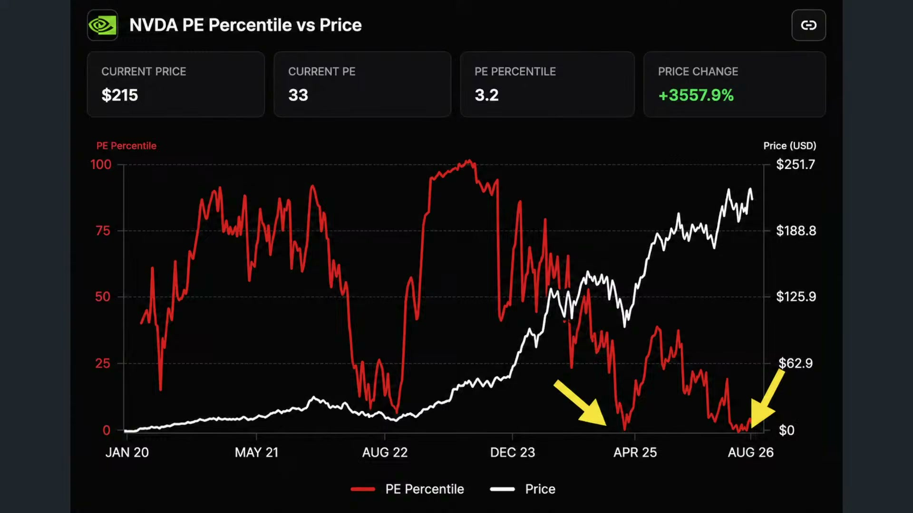

**逐字稿片段：** 重點是輝達啦 他禮拜二終於 連續7天的下跌之後 彈了2.19% 每股收在213塊 那當然 這一次盤後公佈上季的營收年增幅 可能要接近一整倍 來到920億哦 所以市場給予的高標很高 那大家我看出 看得出來 現在市場真的輝達的買盤呢 可能都只剩下左側買盤了 右側也沒什麼人想要追了 因為如果是從左側平均本益比 現在當前本益比是33倍左右 你不要看出33倍還是有點偏高 其實這個倍數 差不多等同於今年的 烏俄戰事左右的水準了 如果你回過頭看 甚至比 去年的關稅戰都還要來得稍微低一些 甚至你把22年當時烏俄戰事 那個時候是大長空嘛 你比較起來 其實英偉達的本益比也比 那個時候還要來得低 所以輝達股價雖然還在高位做盤旋 可是輝達的本益比 應該已經創下疫情以來的最低了 那當然 市場不願意追高 可能也有背後的原因 那它市值第一名的企業 你還想漲多少 它漲一趴可以讓好多股票漲停板了 我才不願意去推這檔股票呢 好所以 它的本益比從週期來看是非常便宜的 可是由於體量過大 可能追高意願並不強 大多數都是採取回補效果也就是 如果本益比低到一定位階以後 就稍微做一些買盤支撐一下那 比特幣 在這段時間呢 也曾經一度站回到8萬美元 好那這一波市場上明顯 有部分資金的軋空 針對個股或者個別資產 可是呢我們也清楚知道 市場上現在更進一步聚焦的是

**話題推測：** 聚焦輝達連跌後反彈與財報預期，預期切換到輝達股價或財報預估表。

---

## 00:04:17

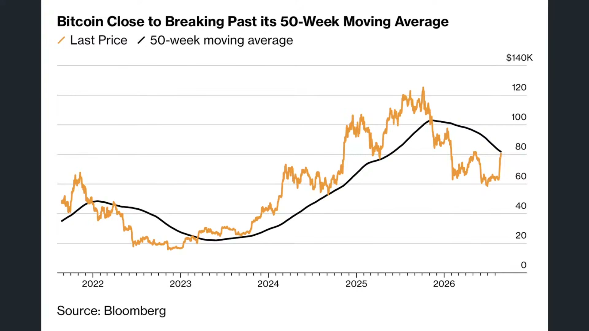

**逐字稿片段：** 信用市場流動性是否能夠好轉 如果信用市場無法好轉那麼 股市的錢就回不來 因為連債市都救不起來 這個時候 針對整個美國市場 尤其是債券市場的買盤是否 能夠有效提升就很重要了 那債券市場的有效提升 一方面當然取決於貝森特的回購計畫 規模是不是如同CNBC所說的 本來是三四十億哦 現在告訴你要投一兆 有可能嗎 那第二個

**話題推測：** 轉向信用市場與美國債券流動性，預期顯示美債殖利率或信用流動性圖表。

---

## 00:04:45

**逐字稿片段：** 那當然就是華許在Jackson Hole他的談話 能不能釋放相對比較鴿派的言論 來讓市場的通膨預期能夠下滑一下滑 那未來發行的債券的 利率成本就沒這麼貴了 因為利率有可能下滑嘛 好相反的如果呢 華許對於美伊戰事 仍然抱持著戒慎恐懼 持續保持著相對比較緊縮的態度 誒那有可能 市場上就被迫要讓10年期 30年公債子利率繼續的做多 不過華許也自己也講了 他比較不喜歡做前瞻指引就是了 就永遠讓你猜不透 就像個渣男一樣 那差別就在於沒有叫 人家煮牛肉麵給他吃 那重點就來自於 華雪好像從過去的慣性也 不太願意透露太多的意向 所以呢我們這個時候反而要 觀察整個中東局勢 是否這一次的經濟戰 某種程度就是淡化在 美國在中東的色彩呢 就經濟戰的意味並 不是真的要發行經濟戰 而是讓市場上意識到 美國已經沒有想管這件事情了 我們也不會引起進一步的軍事衝突了

**話題推測：** 轉到Jackson Hole與華許談話影響利率預期，預期顯示Fed官員或利率預期畫面。

---

## 00:05:47

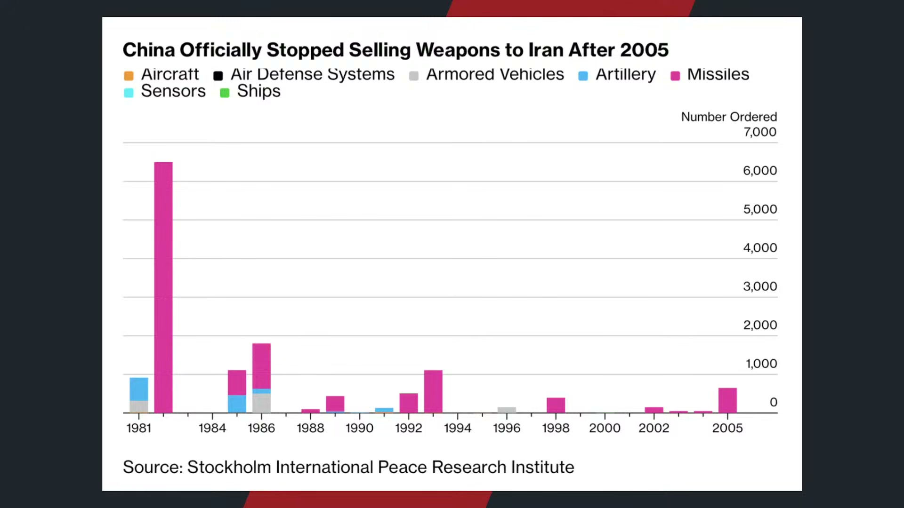

**逐字稿片段：** 事實上在昨天 中國已經正式拒絕 配合美國去孤立伊朗 當時美國是制裁了數十家 跟伊朗往來的中國實體嘛還把 一家未具名的大型 金融機構列為下一波的目標 那北京直接回應呢 說中伊正常合作 不受到任何的干預 並且表示會採取必要 措施來維持自身利益 因為中國現在是伊朗最大的石油買家 那金融體系也是如此 對於德黑蘭來說 它是一個非常重要的經濟支柱 好那美國採用的這一場經濟戰 如果沒有針對中國 那有打跟沒打一樣 如果沒打 那就幾乎確定了 那川普就是不希望在期中 選舉之前引發新一波的衝突 讓通膨預期升高 那第二件事情呢 中國也未必會完全忽視華府的壓力 因為9月24號再過一個月 川習會又要登場了 那雙方看起來基本上都是 想要做適度的籌碼累積 到時候可以一次性的釋放 好但不管怎麼說 至少對於川普的壓力 開始逐步展現 我們先看 美國其中選舉 目前Polymarket賭盤 這個house就是眾議院 幾乎沒什麼好說了 幾乎100%民主黨能夠獲得絕對多數了 好那從市場的交易量級來看 現在重點來自於參議院 就參議院到底會不會也失去呢 如果參議院也失去 現在大概是五五波 你不要看五五波好像差不多 民主黨現在獲得勝選 的幾率在參議院呢 已經上升20個百分點了 相對於過去兩個月 共和黨則是下滑22個百分點 代表即便是參議院也正在 快速的向民主黨來靠攏 那因為參議院你知道 每次只改選1/3的席次 它的勝負更取決於當年度 哪些州正在進行改選 所以即便全國環境 對於民主黨轉而有利 它也不像眾議院一樣 接性的反應 可是至少可以承認 你是要有一個心理準備哦 也許本場中期選舉之後 彈劾戰就要準備開始了 如果在選舉之前 川普無法在通俄問題 在伊朗戰事 在可負擔政策上有明顯的作為誒 那明年我們大概就會看到 美國就要再一次出現分裂國會了 彈劾的可能性也非常高 因為等同參眾議院都是 民主黨作為絕對多數 誒那等同於朝小野大誒 一年前川普才絕對執政呢 過了兩年 突然之間就變跛腳總統了 朝小野大 川普可以先來臺灣取經 跟那個賴賴總統借鑒一下 誒最近那個賴總統民調 支持度接近五成了 川普才31% 誒那比川普高多了 你知道嗎來這邊 這個借鑒一下 學習一下 你發現那個中央政府的這種 執政的慣性氛圍也不一樣對不對 一個很困難很困難 很努力 那車票錢不夠 很努力我們要堅持 另外一個是 這個我也行 那個我也行誒 最後民調呈現出來的不太一樣哦 所以我們可以看得很清楚哦 市場上的氛圍哦 在不同的影響 不同因素 經濟問題上 你會發現 呈現出的特色 川普是一個強人政治 好但是在民調上的反應很明顯 他是有非常高的幾率 參眾議院全部輸掉的那當然

**話題推測：** 切入中國拒絕配合美國孤立伊朗，預期顯示中美伊朗制裁新聞。

---

## 00:08:56

**逐字稿片段：** 川普經濟政策現在所面臨的壓力 一方面當然是 面臨的高債務 現在是債券市場壓力最大的 再來是高能源價格 高借貸成本 那美國的聯邦債務現在 本周是突破了40兆美元嘛 而且年度的財政赤字占GDP是5.8% 只比2024年的6.4%稍微小幅改善 但是債務體量上升幅度還是特別快 現在真正的問題在於 第一市場對於美伊戰事 大多數普遍不支持哦 直接是總統滿意度 大幅下滑的主要原因

**話題推測：** 轉到川普經濟政策壓力與高債務、高能源、高借貸成本，預期顯示美國債務或宏觀壓力摘要。

---

## 00:09:30

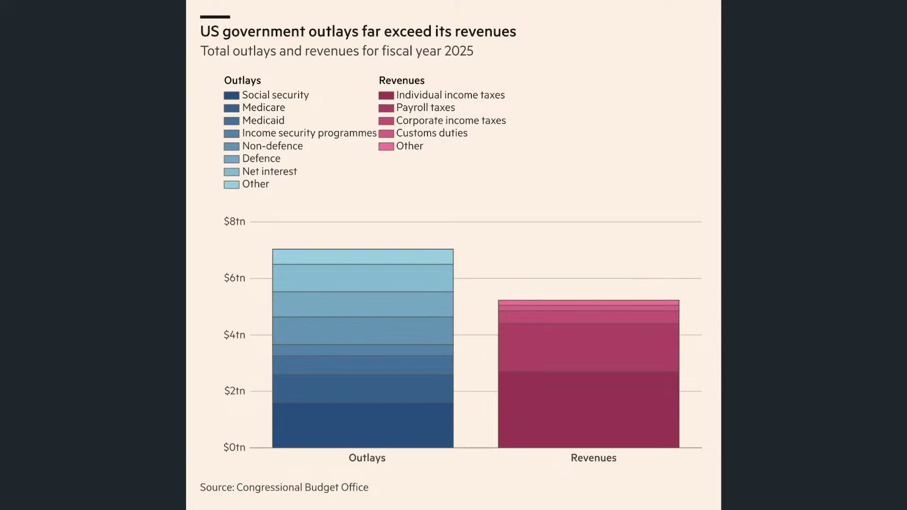

**逐字稿片段：** 我們根據路透社的報導 還民調統計 31%的受訪者是支持美國 對伊朗採取軍事行動可是 3月份還有38%呢 本來就不高了 現在更低了 那即便在共和黨支持者當中 支持度也從77%下滑到69%有8 83%的美國人認為這場戰爭會 維持相當長的一段時間呢 那民眾對於長期戰爭的擔憂正在升高 這些壓力也直接反映在川普 的直接性的民調支援度身上 只有33%的受訪者認同他的執政表現 已經連續兩次創下歷史低點了 從二二八戰爭爆發到現在 美國汽油價格每加侖 比戰前高出一美元 接近歷史高檔 原本他的承諾就是要壓低通膨嘛 這是他能夠取代拜登的主要原因 好他取代拜登原因絕對 不是因為股市漲更多 拜登股票是漲也漲得很誇張 重點都是通膨問題 無法壓抑通膨就更難說服選民了 好所以現在呢 即便是獨立選民呢 支持民主黨的比例還是有33 共和黨是19% 這大幅沖銷 目前共和黨的支持度 那另外一方面是這

**話題推測：** 引用路透民調談美國民眾對伊朗軍事行動支持度，預期顯示民調數據圖。

---

## 00:10:38

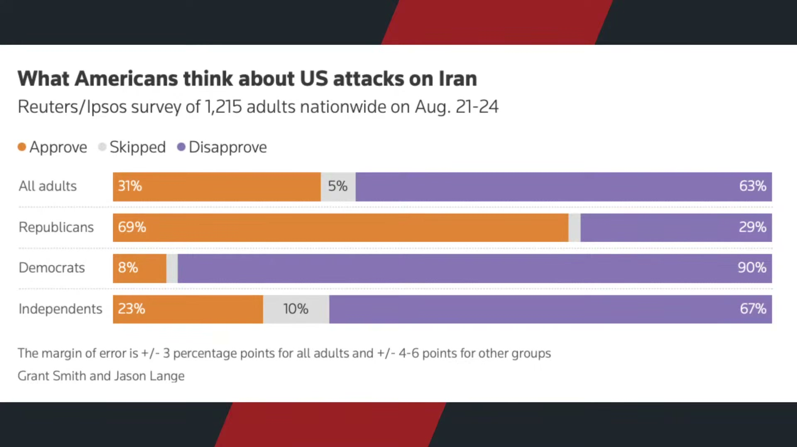

**逐字稿片段：** 幾個月所採取的動作 包括Ipsos所做的民調統計 川普第二任最大的政治 風險之一就是利益衝突 69%的美國受訪者認為 川普很明顯有私人商業 利益正在影響總統的決策 太明顯了 2/3的獨立選民 90%的民主黨 甚至連共和黨有超過一半都相信 對了 川普總統做的事情 一定是對他的商業帝國 他的家族有一點利益的 另外一方面 63%的受訪者認為川普和家族 透過加密貨幣的獲利 並不恰當 因為他發行很多川普幣嘛 然後認為這樣是不太妥的 所以種種效果都說明 這個其中選舉 已經觸碰到那種川普過去要 清理華府深層政府的政治承諾 覺得你變成那一群人了 好所以從民調層面 這個是我們看到的第一層結果

**話題推測：** 轉到Ipsos民調與川普利益衝突風險，預期顯示利益衝突與加密貨幣獲利民調。

---

## 00:11:28

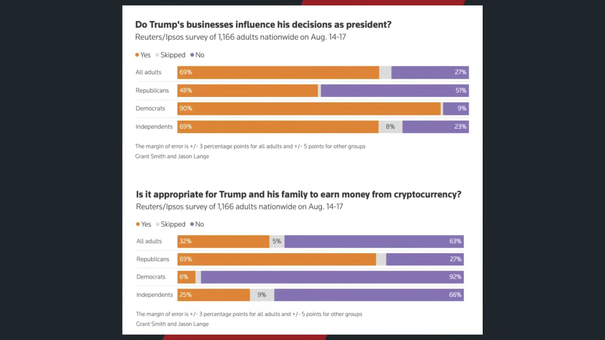

**逐字稿片段：** 那第二層結果當然是 生活成本的問題 通膨如果上漲了 只要薪資漲更快 也沒什麼好說的嘛 我們重點關注的是購買力 而不是單純物價 可是這一波我們看到 從川普第二任期來以來 生存成本或者生活 成本上升幅度很快哦 你看汽油價格 剛上任的時候 每加侖是3.1塊嘛 哦那現在是4.2塊 漲幅3十一% 電價上漲13% 每度電從16.3美分上升到18.5美分 那相較之下 唯一比較好的是房價 房價只漲0.4 哎可是每個月租金漲了4.7呀 所以房價看起來幾乎沒漲 可是能源和居住支出 仍然在快速的上升 而且各大搖擺州當然差異也很大了 以電價來看緬因州 哎漲了5成五 阿拉斯加漲了5成3 new Hampshire漲了4成8 愛荷華州反而稍微低了一點二3% 所以從不同角度來看 它可能對於搖擺州的 影響還是有比較大區別 可是現在也不是普選嘛 它是各州的選舉 尤其是食品價格 食品價格比較明顯的 分化是牛肉大漲了19% 咖啡23 牛奶7.9% 在過去一年 雞肉和麵包價格漲了2.7和1.1 唯一跌的只有雞蛋 雞蛋是因為前一年基期高囤蛋嘛 最後跌了43.3% 所以只有買蛋吃蛋吃多的 人可能對於政策比較有感 那大部分的人都覺得 食品通膨壓力比較大 因為我們還是要這樣講 通膨的確沒有像21年22年這麼誇張了 若硬要跟拜登比 可是通膨下降一直都 不等於價格下降 你每個月 本來胖兩公斤的 現在變胖一公斤 那的確是有改善 那衣服還是越來越緊嘛好 所以川普所說的通膨在降溫有沒有錯 如果是通膨年增幅是在降溫沒錯了 可是美伊戰事又把 這個下行路徑給打消 那第二選民說生活 沒有變便宜也沒有錯啦 大家是拿不同的尺在量一件事情呢 因為當時21年到22年實在是太痛苦了嘛 事實上

**話題推測：** 第二層結果切入生活成本與購買力問題，預期顯示汽油、電價、房租等通膨表格。

---

## 00:13:29

**逐字稿片段：** 最重要的還是來自於時薪 其實從川普第二任任期來看 美國的平均時薪大約還有成長4%呢 不過很多的生活 成本漲幅明顯更快了 比如電價 剛才講嘛 漲是17嘛 那汽油是漲了40%嘛 好所以房價雖然持平 但房租漲了5% 所以你不管 你只要跟生活有關的 要加油的食衣住行 那很少漲幅是低於4%的 那說明其大多數的生活 成本明顯比你的時薪 比你的工資上漲幅度還來得更快 那當然少部分人由於AI的爆發 資產價格的繁榮能夠稍微突破 可是如果是以工資作為主要生活成本 壓力就很大 好簡單來講 買股票的 其實沒什麼好反對的了 那的確資產價格的增幅已經讓你 沖銷掉所有物價的購買力侵蝕了 可是你是以工資來生活的 哦那就完全不一樣的狀態了 那當然呢 為了要緩解這樣的壓力 兩件事嘛一個呢 是要解決目前債務流動性的問題 讓有股票的人繼續能夠適度的膨脹 引發財富效果 讓更多人願意消費 貝森特這一次 進行長天期美債的回購規模 很多人說太小 所以他慢慢的放大 可是有另外一種解讀 就像這一項政策的真正目的 它不一定是要改變長期的基本面 也許只是在期中選舉之前呢 利用市場部位去製造短線的擠壓 什麼意思呢

**話題推測：** 切入平均時薪與生活成本漲幅比較，預期顯示工資成長對比通膨項目圖。

---

## 00:14:52

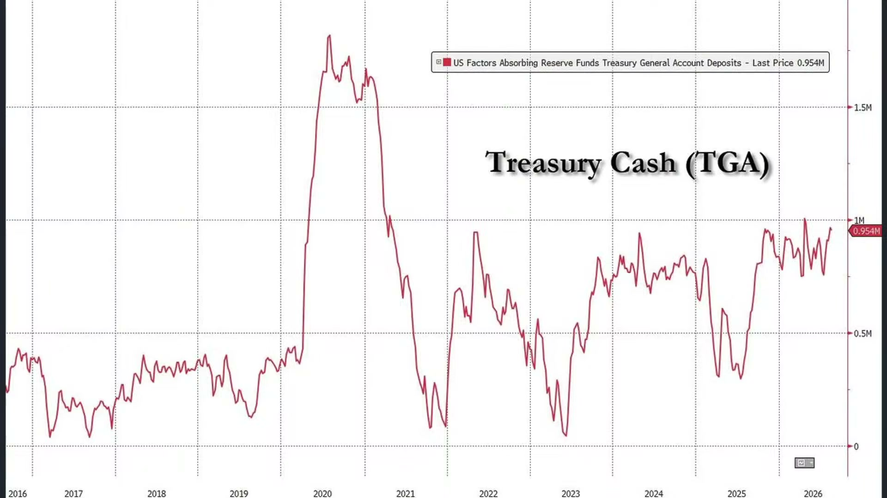

**逐字稿片段：** 我們按照目前CTA趨勢基金呢 現在所追蹤的全球債券市場的空頭 部位是1.5億美元左右的這個三倍 空頭那如果是以債券價格在 一個月內漲超過兩個標準差 那就有1.5億以上規模的空單呢 就被迫要重新買進了 形成空頭擠壓 好所以人家在看 說貝森特他當然知道 30億40億能夠改變什麼 美國的財政問題 如果呢是用空頭擠壓軋空呢 軋空讓這些人被迫離開 那麼在其中選舉之前 美債市場至少就可以表現穩定了 你不要讓它創高就好了 就維持在這樣的一個區間 好所以有沒有可能 貝森就是這樣的一個意圖和做法 值得觀察 可是我們都知道 真正的那個病灶是什麼 是高赤字 40兆美元的國債和通脹壓力 但是政府卻選擇回購長債 直接壓低殖利率 那就好像哪裡有問題就切哪裡 殖利率降下來 你也不代表財政問題消失 那反而壓力可能轉到 美元黃金或者比特幣 所以如果不先處理赤字 華府打算就是 把那個償債硬給他拉起來 用更多的錢來救已經 發生的債務危機哦 哦那其實這樣問題可能 很快要重新發生嘛 那之前那網路上故事 不是講說那個病人 這個醫生 我左邊的那個睾丸好像變黑了 完了醫生一看 你這是病變要切掉 哎這做了手術 那過了一個月以後醫生 我右邊的睾丸好像也變黑了 哎呦這擴散了 醫生說那也要切掉 又做了一次手術 又過了一個月 醫生 我中間的部位也變黑了 我那醫生一看 哦那應該是你的內褲掉色 就有時候我們東切西切 今天切掉左邊的殖利率問題 另外一邊切掉通膨問題 那你那個 財政赤字的問題 你從來從頭到尾沒有解決嗎 你龐大的財政赤字 持續的發債壓力 好政府看到的只是償債值利率 但是沒有把債務問題給解決 它只是下一次的舊而複燃 不過為了集中選舉 也沒有什麼辦法了 就是 華許儘快降息 或者透露出降息意願 貝森特呢 盡可能去購債 維持市場的流動性 好這是美國的部分

**話題推測：** 提出CTA趨勢基金全球債券空頭部位，預期顯示債券空單與軋空機制圖。

---

## 00:17:07

**逐字稿片段：** 第二個部分我們來聊聊日本的部分 日本呢其實債務問題 那比美國嚴重的多了 只是大部分的債務是 由國內銀行所承擔 這一次日本的個人國債 誒也開始爆發了哦 因為個人資金快速地流向國債 日本政府也鼓勵大家去購買日本國債 因為殖利率變高了嘛 從整個4月到8月 個人向國債發行額也來到4兆661億 比去年同期大增了66.3% 那家庭存款現在的確有非常多 資金已經開始被高利率吸走 你要想看哦 日本已經活了十幾年了 那相信國債頂多就0.5-1%的利率 現在告訴你 我有接近3%到4% 吸不吸引人呢 這是一個時代的一個轉類 可是我們也清楚知道

**話題推測：** 正式切換到日本部分，預期顯示日本國債、日圓與日本央行政策主題頁。

---

## 00:17:54

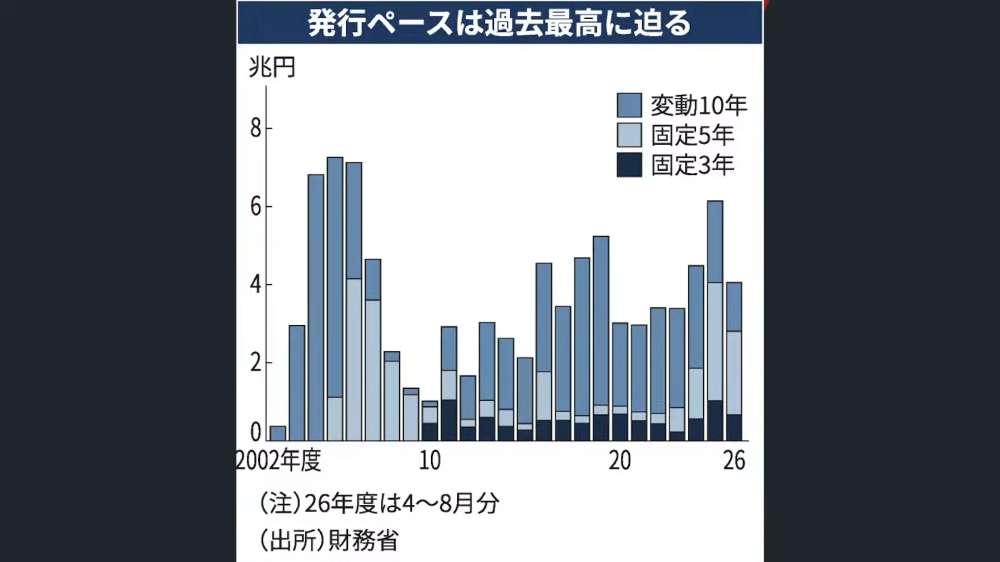

**逐字稿片段：** 主要還是來自於日本央行 這一次的高強度升息動作 這一次預估9月份升息 幾率已經來到74%了 過去哦 高市早苗政府一直都比較 擔心升息可能會傷害景氣了 可是由於內部低 通膨壓力仍舊存在 那第二日元實在太疲憊了 疲憊到這個市場的購買力實在太弱了 日本人都不敢出國了 那外外國物價怎麼這麼貴 台幣對日元都1:5了 日本人來臺灣根本買不了什麼東西 而東西可能也沒有比日本好所以 根本不想出國 這種壓力是很大的 所以高市看起來 跟日央是有所協調 願意一邊進行持續財政寬鬆 一邊允許你升息哦 那真正值得注意的是速度了 看起來升息一定是方向 日銀目前的政策利率是一% 再升的話就會是1989年泡沫高峰 以來12個月內最快的升息週期 所以就問題是 那你要升得多快呢 之前美日曾經一度 聯手去救日元 但真正的分歧還是日本到底要 以多快的速度升呢 現在呢美日一起做調控 就代表著美國是不能夠 放任日元一路的貶值下去的 可是難道你要讓日本人 自己升息把日元救回來 那升息到什麼樣的幅度呢 日本經濟現在表現也不是特別好

**話題推測：** 轉到日本央行升息機率與高市政府態度，預期顯示日銀政策利率與升息機率圖。

---

## 00:19:12

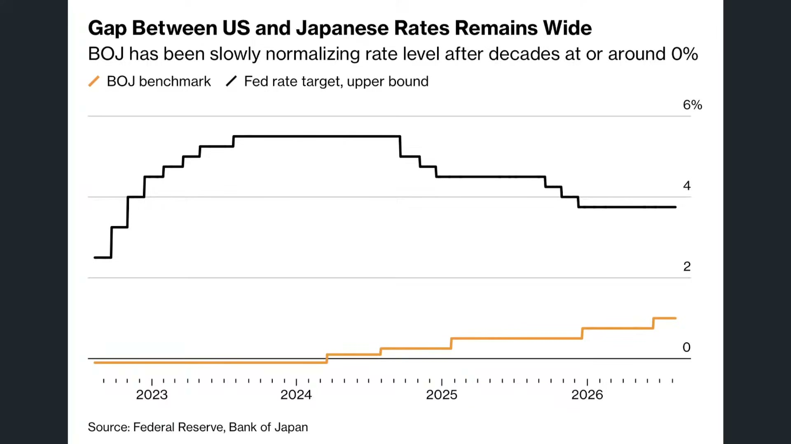

**逐字稿片段：** 雖然GDP下連續3個季度成長哎 臺灣GDP成長是多少 10趴了日本呢 1.1 所以從季度連續慣性來看 的確它連續三個季度成長了 但是哦這一次成長很明顯 不是日本的內需變強 是進口減少所帶來的統計 由於霍爾木茲海峽接近封鎖 所以日本呢 現在出現了能源上的壓力 進口的季減幅是1.5% 有很多能源沒必要就不進口了 大家省省電 那真正注意的是日本 的國內需求也在轉弱 現在占GDP約一半的個人 消費季減幅也是0.02% 然後這是8個季度以來首次的負成長 設備投資減少了1.2% 我跟你講 住宅投資它也減少0.5 那跟臺灣是兩個極端 臺灣是什麼都在暴增 那個人個銀也在做暴增 法金也在暴增 住宅投資雖然稍微比較疲憊 也比去年好了 但是日本呢 即便我們很清楚 採取了這麼高強度的財政刺激 仍然對於實質經濟的 拉抬幅度是有限的

**話題推測：** 轉到日本GDP連三季成長但內需疲弱，預期顯示GDP組成或進出口數據。

---

## 00:20:15

**逐字稿片段：** 那你不要看日本通膨現在1.8% 好像比臺灣低哦 扣掉政府補貼以後 就已經回到3%以上了 所以日本現在跟臺灣一樣 都是進行油價和電價的直接性補貼 不讓它反映在實質民間身上 日本的電價已經創下 2023年以來的新高了 現在每度電呢 因為上個禮拜是一次漲了20% 週一升到每度電25.18塊好 大概是二三年最大的一個升幅 一方面是因為用電量太大 所以日本政府採取一些調控 另外一個就中東戰事 仍然讓日本這個高度 依賴進口能源的國家 還是要面臨更高的燃料成本 那日本已經舉很多債了 如果不斷的進行補貼 財政上也會有所壓力 好不容易 終於盯到通膨高以後 日本企業終於加薪了 可是中產家庭呢 並沒有因此實際到手 實值到手的收入變得更高

**話題推測：** 切入日本通膨、能源補貼與電價新高，預期顯示日本電價與補貼政策圖。

---

## 00:21:08

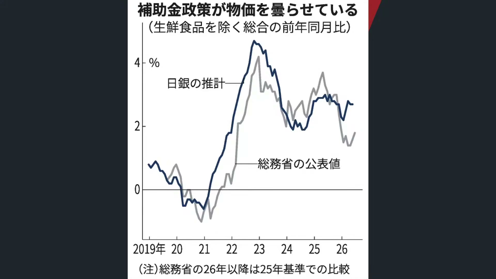

**逐字稿片段：** 我們舉一個比較直觀的數據 這個數據 它是講說 有工作的兩人以上的家庭呢 你把物價扣除以後 19年到25年 實值可支配所得平均下滑兩%哦 哎你要知道 我們好不容易擺脫了通縮 迎來了通膨 結果實值可支配所得 居然還下滑兩% 其中年收入500-550萬的家庭呢 大幅驟減14.6% 什麼意思 就是夫妻兩人呢 現在1:5嘛 夫妻兩人年薪100萬 加起來加起來 一個人50萬 加起來100萬了 少了14%的佳品 500萬到600萬下滑了11% 就是日本所有的資產階級 都在大量的減少當中 有的是中產變赤貧 有的是資產列入到中產階級 好所以中產階級你不要看 說名目薪資正在增加 可是物價稅負和社會保險 目前屬於的經濟衝擊是非常大的

**話題推測：** 提出日本家庭實質可支配所得下滑，預期顯示收入階層變化統計。

---

## 00:22:04

**逐字稿片段：** 最痛的是誰 最痛的就是我們過去講說 1993年到2004年進入職場的這一代 我們稱之為就業冰河時期 為什麼叫就業冰河時期呢 因為他們一畢業就泡沫破滅了 然後企業大幅的縮減招募 許多人只能做派遣契約或者低薪工作 當年的大學生的求職比哦 大概高峰是3倍了好就是 三個人搶一份工作 而跟臺灣不一樣 臺灣現在一個人可以有3份到4份工作 你還可以慢慢挑嘛 所以導致整個世代的職壓 起點就非常明顯的落後 好那現在好不容易走出長期通縮了誒 通膨開始了 可是加薪呢 主要加在年輕人身上 20歲到30歲 目前的名目薪資 比5年前高了10-16% 好這一批大學生真的賺很多錢 不能講賺很多錢 薪資真的漲很快 但50歲的族群呢 根據經濟學人的統計 下滑了1.3% 為什麼呢 因為企業更願意為年輕人提起高薪 中年員工 跳槽率又低 議價能力很弱 被排除在加薪潮之外 廣志就是一個典型的嘛 買在可能東京郊區的一間小房子 唉結果呢 一買房價就套牢然後呢 升職也升不上去 薪資也凍漲在這邊 就是93年到04年進入職場的這一代 他已經被冰凍了很長一段時間了 然後這一代真的很辛苦 有點像那個以前開玩笑嘛 校長說 那我們的規則是這樣子 今年是一年級去打掃 明年換二年級 後年換三年級 非常公平 那整個世代就這樣子 好不容易辛辛苦苦存了一筆錢 終於通縮結束了 沒買股票 過去20年 你只要持有現金 你的購買力就越來越強 這5年你持有現金就完了 哦這跟臺灣南韓不一樣 臺灣是很多z時代真的覺得 沒有比上一代過得更好 哦日本不一樣 日本大部分的z世代都 比上一代過得更好 這是事實 好那不管怎麼說 它等同於 超級日元貶值 催生了賺外幣副業的現象 我們看Sparta雜誌的報導 日本人開始把技能直接賣到海外 比如說呢 以美元對日元約163嘛 然後英鎊對日元218嘛 現在台幣日元1:5嘛 日本人只要能夠從海外 取得美元英鎊換回日元以後 在日本就會過得特別幸福哦 所以現在有很多 像跨境商品 來售賣日本商品 那兌換成外幣之後 對於海外消費者的具有 比較大的一個吸引力了 或者一些動漫周邊 收藏品等等 好或者呢 日本人會主動到海外去工作 然後把錢匯回國內 就跟以前菲律賓一樣 所以按照這個趨勢哦 人家1:3的時候你覺得哦 你已經很划算 1:4 台幣1:15日元 到時候台幣1:10呢 以後日本師傅來臺灣煮菜給你吃 那都變得很正常了哦 這個就日元貶值所造成的顯著衝擊 那當然 等同於 內部的 政策傾向也有非常明顯的變化 我們舉例來說 你像日本呢 最近一段時間呢 有比較明顯的右傾化的跡象 叫日本人優先呢 好這也是高市能夠當選的主流原因呢 包括日本人優先 限制外國人政策 帶有民族保守色彩的政黨 在這一輪選舉當中是明顯的勝出 而且呢高市也依循了這樣子偏右派 或者日本人為主的這種思想主流 我們從幾個數據來看都是如此 尤其在年輕族群有 非常顯著的右傾跡象 認為應該要從年輕世代的 日本人優先政策完全走出去 而且甚至也不一定要 進行直接性的財政補貼 應該要讓我們的經濟 能夠購買力重新的追起 把南韓百日 臺灣給重新的超越回來 要不然以台日韓來看 目前人均GDP的就已經是日本了 那其實不只是日本

**話題推測：** 轉到日本就業冰河期世代，預期顯示1993至2004年職場世代與薪資困境簡報。

---

## 00:25:47

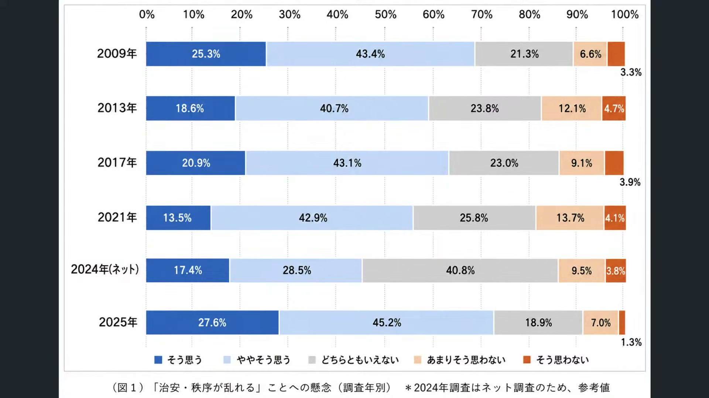

**逐字稿片段：** 其實韓國也是如此 你看韓國這一段時間 也是有非常顯著的右傾化 包括最近像反共 選舉舞弊 美國優先都變成了新的政治語言 過去韓國印象中 通常都是保守派是那個中高齡男性嘛 年輕人不叫自由派 但沒有哦 南韓的右傾化比日本還更誇張 尤其是尹錫悅遭到彈劾之後 包括選舉 操控反共或者中國介入 這些名詞 都導致市場上有顯著的右傾跡象

**話題推測：** 話題延伸到韓國右傾化，預期顯示韓國政治保守化或尹錫悅彈劾後民意。

---

## 00:26:18

**逐字稿片段：** 舉一個比較直觀的 好這個是過去經濟學人的 金融時報的一個報導 18-29歲年輕人的政治立場變化 女性呢很明顯嘛 大部分國家 不管是南韓美國德國還是英國 都比較偏向自由派或者進步派了 好這個很正常 好因為追求平權嘛 那男性呢 誒很明顯哦 大多數都比較偏向保守派 不過也沒有那麼誇張 這個美國德國英國 就是稍微保守一點點的 覺得誒我們應該回到保守時代更好 韓國人是最離譜的 那直接掉了負值了 那什麼意思 就是南韓女性還是往 自由派的方向走 那男性呢 變得有夠保守了 那我們也大概知道 那個韓國男生的確是 比較大男人主義 韓國是04年才修改戶籍法 強調身份證制度 女性終於可以單獨建立戶籍 那也不過20年前的事情了 以前的法律都是男尊女卑嘛 就是註定了韓國男人的大男人主義 所以 以前那個像繼承財產權 子女的姓氏權 以前都不能隨母姓的 男孩也是這幾年才改革的 所以你可以感受到那個市場的變化 就是在 不斷的通脹衝擊 購買力喪失 男性尊嚴喪失以後 它就會形成這種明顯 尤其是年輕男性幼情化的跡象 這給投資朋友做一些參考 好 9點鐘哦

**話題推測：** 引用經濟學人與金融時報的18至29歲政治立場變化，預期顯示男女政治光譜分化圖。

---

## 00:27:37

**逐字稿片段：** 最後我們聊幾分鐘 聊一下歐洲的問題好了 這個法國公債哦 現在跟日本公債跟美國公債 面臨的問題其實差不多了 德國10年期公債殖利率大概是3.2% 法國大概4.1哎 兩者利差是86個基點呢 所以法國的確更嚴重 尤其法國有一半的主權 債都是給外國投資人的 跟日本不一樣 那外國人一拋售 那歐洲壓力就更大了 整個26年歐元區的 主權債發行量是一點 4兆歐元 比2025年增加了27% 但是歐洲央行現在已經不再 透過量化寬鬆來大量吸收供給了 這說明什麼 債均要有民間市場承接 沒有承接法國國債 歐洲國債就會遭受到重挫 那這也影響到法國的財政問題

**話題推測：** 正式切換到歐洲問題，預期顯示法國、德國與日本美國公債比較。

---

## 00:28:20

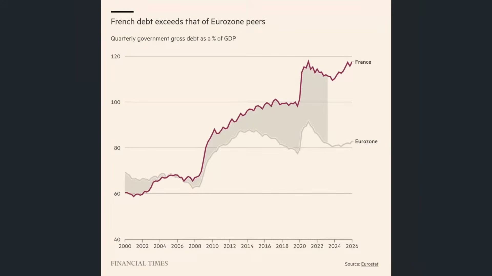

**逐字稿片段：** 法國在最新6月底的中央政府 的預算赤字是1,070億歐元 比原先政府的規劃高了14.4% 支出的增速 仍然高於收入 近期收入是3.7% 支出是5.4%的成長 好所以法國國債 很明顯跟法國的財政 問題顯著的掛鉤 那如果這樣持續下去哦 我們要知道 現在已經有部分機構把法國 主權信用評等做大幅調降了 那會不會引發一系列 的主權債進一步拋售 以前都是歐豬5國嘛 都是南歐幾個國家受到重挫 法國有沒有可能帶頭往下掉呢 值得觀察 所以歐洲央行也很急 因為歐洲儲蓄率其實還是偏高的 相對於美國 整體而言 歐元區的家庭儲蓄率是14.3 比疫情前的12.5%還來的高 說明歐洲人也不太想要去做投資 很保守了 所以這筆錢如果能夠 重新的去購買法國國債 哦那也許是一個好的方向 不過這筆錢呢 這一輪不斷的做刺激 感覺只是放大資產價格的上漲 沒有人願意 解定存來買法國國債德國國債了 事實上歐洲能源價格飆升以後 大多數人採取的做法 都不是急著去買股票 買其他資產 大多數人都是要存 更多的錢才能夠過生活 好所以這個是歐洲經濟 現在最大的問題 那比日本的心態還要更萎縮了一點 日本人大概已經意識到 現在不投資真的會死了 上一個時代的思維要全部拋掉 現在歐洲人是打死也不 願意降低自己的儲蓄率 居然現在儲蓄率還遠遠 高於疫情前的水準呢 都已經漲那麼多 你還是不打算投資 那可能是生活方式的不同了 重點在於

**話題推測：** 轉到法國中央政府預算赤字與收入支出增速，預期顯示法國財政赤字數據。

---

## 00:29:59

**逐字稿片段：** 美國企業目前的投資 增速大概是歐洲的3倍 從21年到27年 美國企業預估實質 投資大概增長40% 歐元區呢 12%德國呢 原地踏步 接近0 好因為AI基礎建設 Google Meta微軟 全部都是在美國嘛 那臺灣韓國雖然建的資料中心也不多 可是你們的GPU 你們的HBN都是我們提供的嘛 所以整條AI圈哦幾乎都 圍繞在環太平洋 跟歐洲人幾乎一點關係都沒有 壓力就很大

**話題推測：** 轉到美國企業投資增速是歐洲三倍，預期顯示美歐企業投資與AI基建差距。

---

## 00:30:31

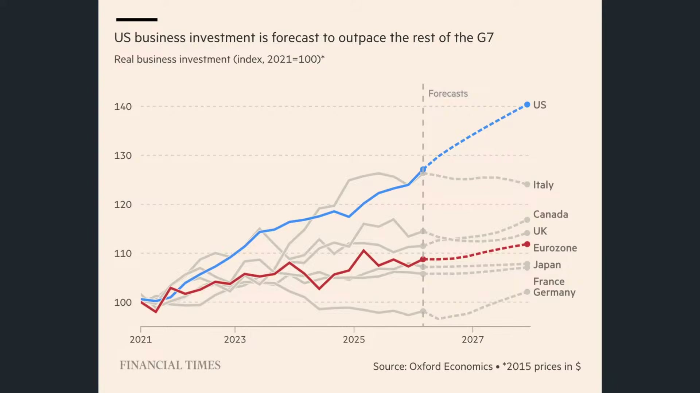

**逐字稿片段：** 歐洲經濟哦 曾經比美國還要大了接近3成哦 現在呢只剩下美國的接近7成左右 08年是歐洲經濟實力的高峰了 當時歐盟的名義GDP是19.3兆 美國只有14.8兆 然後結果呢 到現在為止 美國已經來到18.3兆 超越了歐盟的16.6兆 這個是十年前發生的事情的 更不用講現在了 整個距離就拉得更開了 好所以的確我們看到 一系列的衝擊以後

**話題推測：** 比較歐洲與美國GDP實力長期變化，預期顯示歐盟與美國名目GDP走勢。

---

## 00:30:59

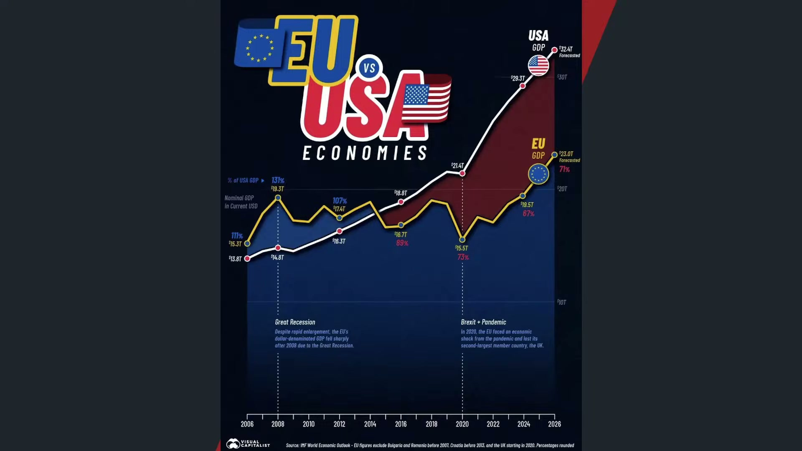

**逐字稿片段：** 歐洲有沒有右傾化的跡象 跟日本一樣 當然有 這一次我們知道德國另類 選擇黨民調正在快速的拉升 18年當時基民黨正式禁止和AFD 就另類選擇黨合作以後 當時的梅爾茲甚至承諾 要把AFD支持率砍半 就完全情況相反 現在另類選擇黨 支持度已經來到40% 是最高的絕對多數 代表的事情是應該下一任 德國改選以後 應該在聯合政府當中 另類選擇党就會成為主流領導政黨 那就代表著整個德國 右派的大轉彎即將湧現了

**話題推測：** 轉到歐洲右傾化與德國另類選擇黨支持率，預期顯示AFD民調或德國政治版圖。

---

## 00:31:36

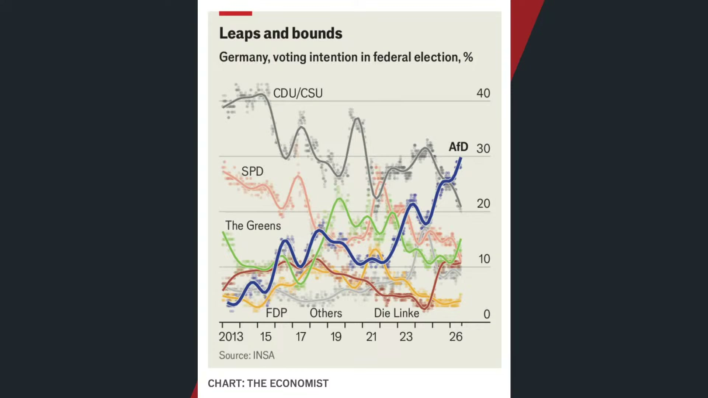

**逐字稿片段：** 那這跟西班牙的推波助瀾也有關了 我們知道西班牙最近是 大規模的讓非法移民合法化 所以歐盟內部有很多移民爭議嘛 你雖然讓他進來了 那是你國家的政策嘛 可是深根區 這些西班牙的新移民 他可以隨時到其他國家 去工作或者流浪 那會不會形成歐洲移民 融合或者幫派的犯罪問題 這一次當時我們看到 這個西班牙的移民問題哦 它其實就已經引起市場上的謹慎了 那申根區把內部的邊界給打開了 可是各國還是有不同的移民政策 一國放寬了 其他國家就要被迫去承擔很多的成本 好所以這是我們觀察到的實質現象 好這種內卷化 因為不能講內卷化 這一種內部的 不管是政治上 移民政策上的混亂 再加上投資力的不足 再加上超額儲蓄 那比日本有點誇張 最後形成現在歐洲經濟的一個結論 所以日本是嘗試的要做突破 迎來一個新的世界 歐洲哦 看起來跟過去十幾年 沒有什麼太大的區別嘛 那之前看到一個故事 講了一個德國人 走進酒吧 點了一杯啤酒 那酒保對他說20歐元 那德國人大吃一驚 20歐元 昨天不是只要3歐元嗎 沒錯 不過今天是20歐元 為什麼要20歐元呢 可以告訴我嗎 然後酒保跟他解釋 3歐元是啤酒錢嘛 然後還有3歐元是要 安置那個穆斯林的難民 4歐元要用於反對白人至上的再教育 4歐元再用於支援加薩 3歐元再送給西岸的巴勒斯坦人 最後3歐元宣揚一下性別多元化 加起來就20塊 那德國人一言不發 好吧那20塊 20歐元就拿給酒保 哎結果那酒保收下錢之後 收銀機操作了一番 又給他3歐元 你幹嘛給我3歐元 因為我們沒有啤酒嘛 好所以我們可以觀察到 真實的實質現象 整個歐洲市場的確就 存在這樣的一個回圈 走不出去 極大的困境

**話題推測：** 切入西班牙非法移民合法化與申根區移民爭議，預期顯示歐洲移民政策新聞。

---

## 00:33:37

**逐字稿片段：** 好了九點零六分 台股上漲29點 收在I45199點 我們今天主要是跟投資朋友稍微分享 從美債的問題 日債的問題 歐債的問題 大家壓力都很大 那美國最大的問題來自於 如果沒有這場美伊戰事 也許現在的債務問題 甚至連通脹利率預期問題 都能夠迎刃而解 債務膨脹這個沒什麼太大挑戰了 重點是這麼高的利息 你還發這麼多債嗎 那第二件事情呢 是來自於日本國債 的確現在壓力重重 可是日本大部分屬於內債 重點在於 好不容易從通縮總往通膨 可是冰河期時代過得更更痛苦了 反而是z時代 真的終於比上一代人過得更好了 那在這樣的過程當中 高盛要如何一邊進行 左派政策的財政補貼 繼續壓低這種通膨的侵蝕力 另外一方面呢 要迎向AI把 韓國人把臺灣人重新給給超越回來 那第三件事情是來自於歐債 歐債規模也在不斷的膨脹 不過問題在於 日本是好不容易 這個超額儲蓄開始流往資產價格了 歐洲的部分股價的確它也創高了 可是歐洲儲蓄率哦 上升幅度遠遠大於其他任何經濟體 所有人都在存錢 沒有任何人想要投資 那這樣的一個問題 加上移民政策的混亂 的確在本輪的AI浪潮當中 感覺就落後了一拍 好了如果大家有更多的興趣和想法 要瞭解各地資產的資產配置 歡迎大家也可以參加我們 下禮拜六的財經皓角聽友會

**話題推測：** 進入收尾並更新台股盤中點位，預期顯示台股即時指數或今日總結頁。

---
