# yutinghaofinance_LUGWERSl01s — 關鍵畫面索引

- 來源逐字稿：[yutinghaofinance_LUGWERSl01s_FIN.srt](yutinghaofinance_LUGWERSl01s_FIN.srt)
- 影片：https://www.youtube.com/watch?v=LUGWERSl01s
- 截圖數：22

## 00:00:35

**逐字稿片段：** 美國股市是三大指數小幅收高,非半賣壓還是很沉重,但至少已經終止了連續三個交易日的顯著跌勢。 主要原因就來自於貝森特護盤了。 這一次美國財政部在昨天晚上 宣佈大幅加碼回購長天期公債 也帶動了債券價格的反彈 殖利率明顯的回落 稍微緩解高殖利率 對於股票市場估值所形成的壓力 不過目前所宣佈的流動性支撐規模 如果持續提升下去 那是不是等同於累QE呢 另外一方面 那如果只是短期內穩定市場流動性 讓債券市場不要一路的恐慌 那麼這一套措施 它能夠維持多久呢 它能夠形成的效果 可能會類似於過去的 美日聯合匯率聲明嗎 所以今天就來跟投資朋友觀察 這一波如果能夠讓美債市場 能夠稍微持穩 是不是代表著股市的估值 能夠重新的放大 事實上這一次宣佈是蠻意外的 沒有人想到 因為就算公債資利率的創高 市場上也沒有引起崩潰性的跌幅 所以反而是有點提前 釋出動作的意味 因為照理來講 國票市場從高點跌下來就跌一天而已 貝森特就直接進場了

**話題推測：** 美國股市三大指數表現（道瓊、標普、那斯達克、費半）

---

## 00:01:48

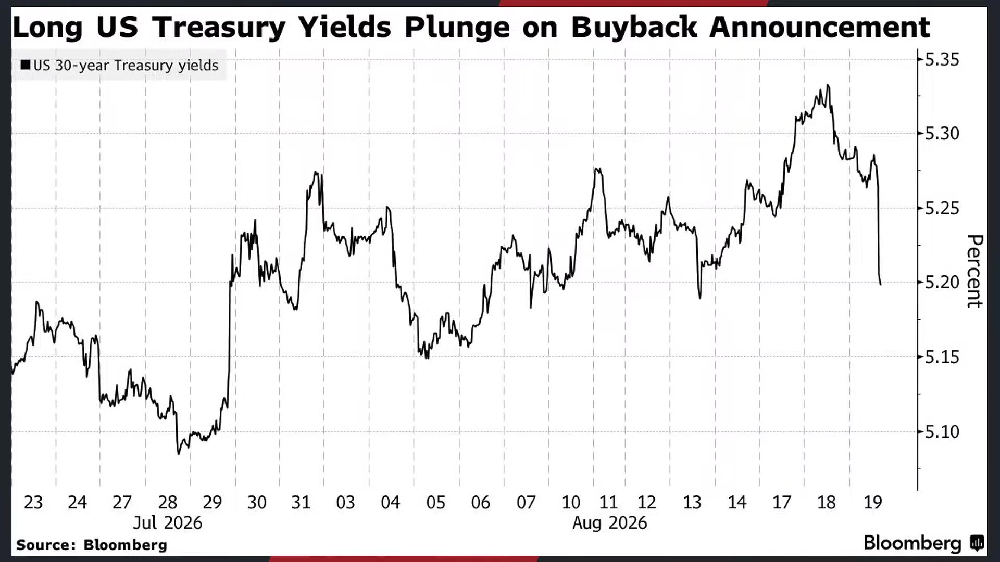

**逐字稿片段：** 這一次是至少把10年到30年期公債的流動性支持回購規模來加倍 那消息公佈之後 30年期的美債殖利率是一度下跌了10個基點 來到5.185% 從07年以來的最高點來開始回落 那新一輪的操作它是9月9號才會啟動 所以等同於貝森特是在做前瞻指引 告訴你我即將要採取行動了 原定9月到11月初 最多要回購140億美元的長債 現在至少增加140億 所以可以看得出來 前一次是針對整個2046年到2056年 到期債券20億美元的回購 現在出現了10倍以上的超額認購 這等同於貝森特正在用財政部版本的扭轉操作 來壓低長端的利率 讓你長端利率上行速度不要太快 以短期國庫券先籌資 然後買回流動性比較差的一些舊常債 來改善交易環境 沒人買你沒關係 反正我財政部會買你哦 也向市場傳遞出 政府不願意放任殖利率失控上升的訊號 讓大家意識到 你們不能夠期待 長天期國債殖利率就這樣一路上去 因為你會有一個最終買家 就是我們 等到失控的時候 我們就會進場了 當然了 大家都知道 這也只能舒緩技術面和情緒面 它沒辦法解決現在常債賣壓的根源嘛 現在長債的根源 一方面是我們過去所提到的 因為這些投資等級債 這些巨頭都在瘋狂發債 那一個是發7%到8% 一個是發4%到5%

**話題推測：** 財政部回購10年到30年期公債規模加倍的數據圖

---

## 00:03:24

**逐字稿片段：** 那兩家公司 一個是微軟Google 他們也不太可能倒 美國政府也不太可能倒 那有時候 這些投資等級債的發行 直接把長債的供給 直接給吞噬掉了 最終買盤可能會集中在投資等級債 所以壓抑住目前 常債的價格 這是一種角度 那另外一方面 常債利率的創高 仍然要看通膨是否能夠受控 還有美國的經濟是否會降溫 財政部的做法 本質上其實就是 用更多的短債發行 去回收部分常債 替長端市場來 填補它的流動性 所以它當然短期內 它可以壓低殖利率 它可以穩住市場情緒 但赤字融資的問題消失了嗎 通膨預期的問題消失了嗎 其實都沒有 所以除非他就這樣子一直互判 要不然其實短期內 是無法解決這個問題的 其實現在經濟學家 針對美國的經濟數據 還是兩個極端 如果有AI 那的確美國經濟現在數學表現還不錯 可是如果看實體消費 其實已經算是蠻疲憊的 就業市場已經好幾個月軟化了 所以照理來說 聯準會是沒有太多升息的理由 但是債券市場面對的 可能並不是單純貨幣政策的問題 它就是供給的問題 這一次長天極國債 不只是美國嘛 全世界都在創高啊 第一個就是發債量實在太恐怖了 如果我們細節觀察

**話題推測：** 微軟與Google發行高利率投資級債的比較圖

---

## 00:04:43

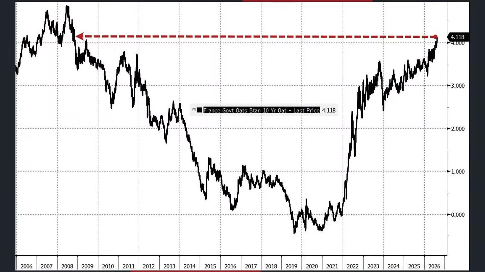

**逐字稿片段：** 今年AI相關的債務供給是4890億 去年也不過3000億啊 一整年啊 現在是到現在就已經4890億了 美元投資等級帶的發行規模 已經超過1.5兆了 這個數據上升的速度實在太快 所以我們才講說現在的風險呢 都不是什麼經濟太熱了 AI太好了 所以聯總會要升息啊 而是可能內需經濟 已經沒有這麼好了 就業市場已經開始軟化了 可是長端殖利率還是壓不下來 這是最大的一個問題 那當然我們知道常債失控 壓力也很大 聯總會可能 如果常債利率已經失控 告訴你說 30年期公債殖利率5.5了 快要6%了 那聯總會可能真的就要被迫在 明顯很疲軟的經濟數據下要升息 那對於美國而言 那就是經濟上的災難 經濟都已經這麼差了 你還要升息 所以現在我們只能說

**話題推測：** 今年AI相關債務供給達4890億美元的數據圖

---

## 00:05:34

**逐字稿片段：** 美國目前超過一半的財政赤字 還在透過短期國庫券來做融資 他只是把問題給往後延 他也不是發行中長期國債

**話題推測：** 美國財政赤字透過短期國庫券融資比重圖

---

## 00:05:43

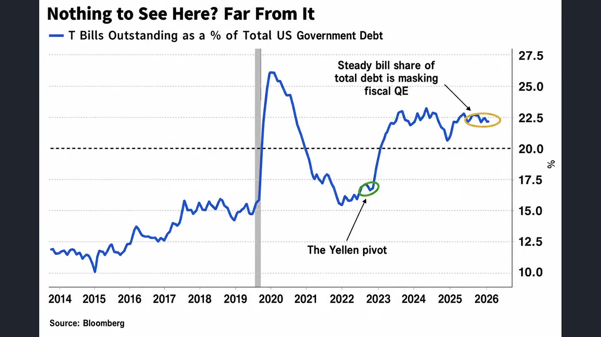

**逐字稿片段：** 我們看短債現在佔赤字融資的比重 大概已經突破了50% 而且持續在上升 同時常在佔比下降的時候 市場等同於獲得一股 有點類量化寬鬆 它不是直接性的量化寬鬆 不過等同於放錢了

**話題推測：** 短債佔赤字融資比重突破50%的圖表

---

## 00:06:00

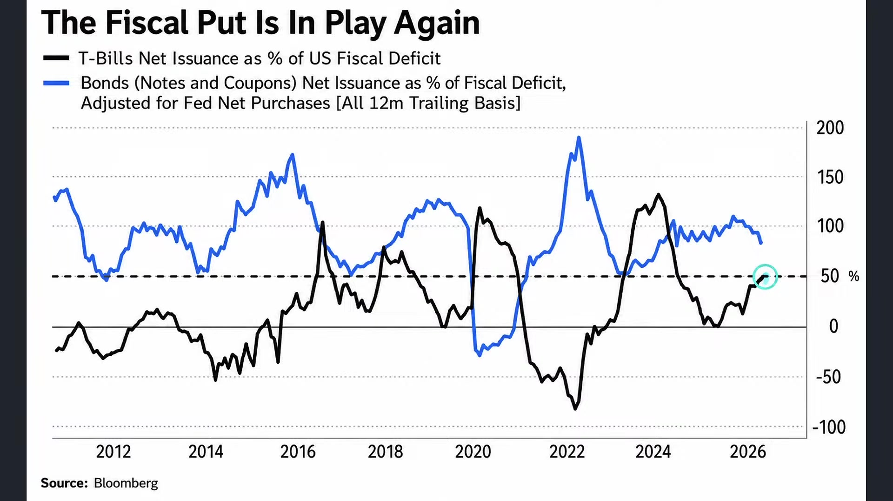

**逐字稿片段：** 歷史上曾經出現過四次的類似情況 標普500指數在後續三個月 六個月和12個月的報酬 幾乎都是長期平均的兩倍 所以樣本數雖然不是很多 不過方向很明確 就財政部要做多了 財政部不允許現在流動性收縮 財政部不允許現在市場上 有缺錢的情況 財政部正在對賭AI的成功 來幫助現在市場上 本來已經稀缺的流動性 太多人要借錢發展AI了 錢不太夠了 甚至影響到我們美國國債 長期的買盤 所以我來幫助你一把 有這樣的感覺 那當然就是來自於短期國庫券 期限短 價格波動低 主要在貨幣市場 銀行準備已經看赴買回市場當中來做流動 它通常以前不太會直接排擠股票資金 但是因為這幾年常在發行增額 也在慢慢的增加 然後也容易推高長期的利率 壓低股票的估值 所以現在就藉由這樣的一個方式 舒緩一下市場的情緒 當然最後的問題就是 風險會不會消失呢 風險當然不會消失

**話題推測：** 歷史上類似財政部干預市場的四次案例圖

---

## 00:07:00

**逐字稿片段：** 現在美國政府就是 就是一直刷卡 一直刷信用卡刷刷刷刷 那因為房貸還不出來了 信貸還不出來了 質押還不出來了 一直刷卡一直刷卡 大概就是這樣的 你說那這樣子肯定有問題 不一定 它現在有很多卡可以刷 有的還有利率還有回扣 所以還可以撐一陣子 大概就這樣子 所以風險並沒有完全消失 就是再次風險搬家而已 財政不透過發行短債買回常債 然後表面上瓦解了常債公債 流動性枯竭和殖利率飆升的問題 可是轉嫁的風險就是政府自身的短天期的再融資 還有利率波動的風險 它並沒有削減財政赤字的問題 通膨僵固的問題也沒解決 地緣增值也沒解決 所以只能夠解決短期的情況 不過至少了解財政部的態度 不讓你跌有這樣的感覺 有點類似以前的鐵達尼號不是沉默之後 然後全世界就痛定思痛 說最大的改革就是以後大型的郵輪 一定要有足夠的救生艇 聽起來百分之百正確 但是最有意思的地方就在這邊 我之前看了一本書 講美國安全史 他講是1915年 芝加哥號 就是美國的另外一個郵輪 準備要出航的時候 船身突然撤翻 800多人死亡 不少人就死在離岸很近的地方 後來調查發現 因為鐵達尼號那個時候沉沒了 鐵達尼號沉沒以後 大家就說一定要裝很多救生艇 然後裝太多 然後設計沒有好之後 嘴果還沒開出去就已經先倒了 我不是說救生艇害死人 是說任何降低一種風險的規則 他只是把風險搬到另外一邊而已 金融監管也是如此 你把銀行的風險壓下去 資金搞不好跑到私人信貸 你更看不到到底風險有多大了 你把交易所管嚴 槓桿可能會跑到場外 那現在就是面臨一樣的一個處境 當然很多人說 美國政府既然缺錢 又還在繼續發債 為什麼還要花錢 已經把發出去的廠債買回來呢 美國政府到現在 不是還是全世界最安全 最容易交易的資產嗎 我們一直講的美元霸權 大家一直說都沒有消失 為什麼現在要這樣做呢 這是兩回事 大家要區別 信用安全跟市場流動性是兩回事 現在的風險主要集中在流動性這一塊 美國政府不太可能還不出美元債的 這是信用問題 但是現在赤字過大 AI巨頭又借錢 然後海外買盤又變弱的時候 那流動性不好 所以我才要介入 所以它是兩個問題 這有點邏輯悖論 你要了解說 有時候我們會把不同層次的問題問在一起 美國政府為什麼要回購自己的債 難道美債不安全 美債是安全的 但是有流動性問題 AI這麼賺錢 為什麼科技巨頭還要到全球借錢 難道自己沒現金嗎 有現金也不代表要全部自掏腰包 資產配置跟融資成本才是關鍵 打官司為什麼要請律師呢 難道法官分不清對錯嗎 這邏輯悖論 邏輯一輩子要了解 好那這是第一點 這是財政部給予的態度 它其實不像是真實操作 它更像是一種前瞻指引 華許不做前瞻指引 我背身特做 告訴你們 不要對賭美國國債崩盤 不要讓美國國債一直跌 好那第二個觀察重點 來自於通膨的僵固性 因為昨天我們有提到

**話題推測：** 美國政府刷信用卡的諷刺圖

---

## 00:10:17

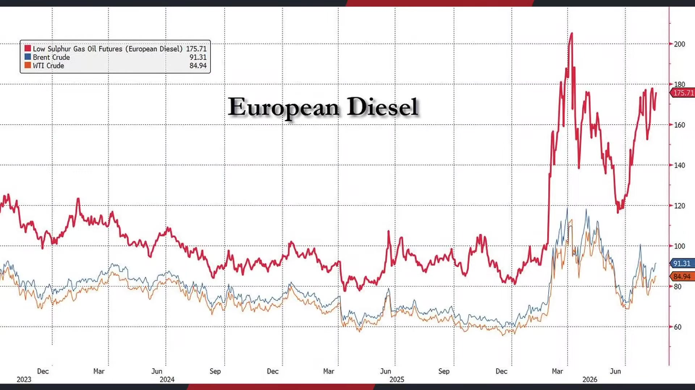

**逐字稿片段：** 美國的汽油價格 尤其在柴油的部分 每價人已經高達5美元了 大家不理解那是什麼概念 我們如果把它換算成期貨價格 歐洲的柴油價格 最近正在瘋狂飆升 每桶已經接近到170了 這幾乎是布蘭特原油的兩倍 美國汽油價格年漲幅30 柴油已經漲了46%了 造成這種背離的原因 就是現在有接近一億桶的原油 仍然滯留在荷姆茲海峽 加上中國的煉油量開始降低 讓原油賬面上看起來沒那麼緊 但是柴油和汽油 可直接的消費產品供應 反而來得更加吃緊 那剛才講到 這種通膨所形成的外溢僵固性 你說只是漲一個月 然後兩個月之後跌回來 那就裝作什麼事都沒發生 單一事件 可是它已經盤了大半年 都在這麼高的位階 一定會有一點外溢效果 舉一個比較直觀的 我們知道昨天七夕 情人節通常有些人需要一些開銷 比如紅酒 飯店 酒吧 喝酒 經濟學就做了一個統計 把晚餐 把電影 把計程車費加總以後 全世界現在情人節的約會成本 正在瘋狂上升 這種僵固性就一路外溢出去 其中最高的是上海

**話題推測：** 美國汽油與柴油價格走勢圖

---

## 00:11:32

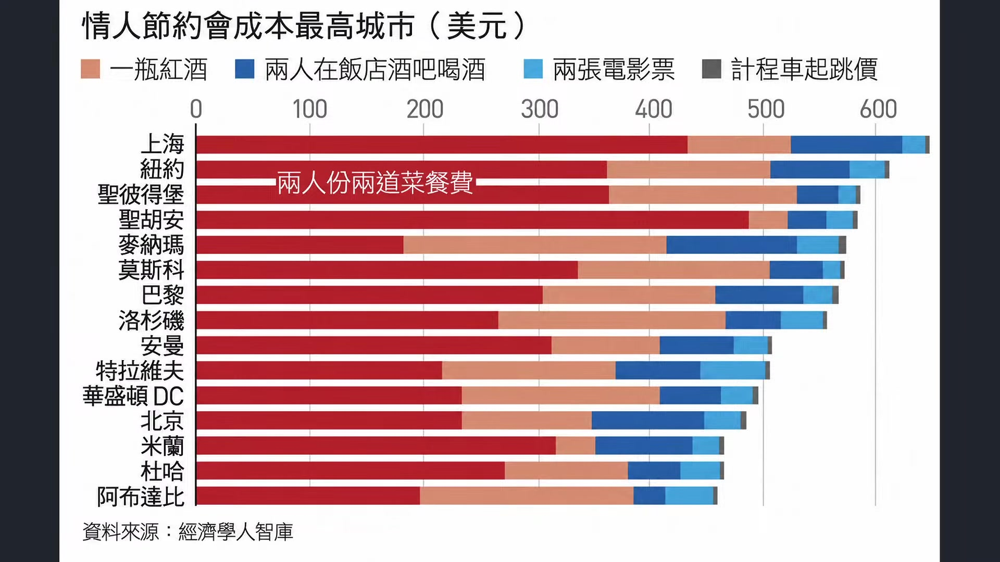

**逐字稿片段：** 上海每過一次情人節 大概要655美元 那差不多要1.8萬 紐約聖彼得堡 聖湖安緊追起後 臺北大概在前10名左右 北京大概第12 真正拉開的是什麼 是兩人份的兩道餐的晚餐 什麼意思 就是最貴的就是在當天你要吃飯 每年的情人節當然價格就貴一點 可是每年情人節的征服又越來越快了 這件事情都意味著 全球這種通膨的僵固性 萬一出去以後 餐廳價格會下滑嗎 菜單成本會下滑嗎 不會 所以這是很重要的一件事情

**話題推測：** 上海情人節約會成本高達655美元的數據圖

---

## 00:12:11

**逐字稿片段：** 加上川普針對整個中東局勢的喊話 現在看起來很明顯 進入到持續性的僵持了 幾個小時之前川普在發文 他說沒有人比我更懂伊朗 伊朗他們想要更多的機會 想要讓他們有更多的機會 能夠達成協議 但是很可悲的事情是 他們並沒有好好的把握 所以今天我宣佈 針對伊朗發動史上 對任何國家最為沉重 最為嚴厲的經濟打擊 他宣佈要經濟打擊 這是一場前所未見的 最大規模的經濟戰 我們要全面的孤立伊朗 他們的海軍沒了 空軍遭到摧毀 軍事工廠剩下一片的廢墟 貨幣一文不值 整個國家搖搖欲墜 所以我要宣佈採取史上最沉痛的經濟打擊 任何國家只要記得金融機構企業機場 跟伊朗做任何生意都會面臨非常嚴重的後果 不管是石油走失貨幣互換 現金轉移地下匯兌 全部都必須要馬上停止 他稱之為今天為經濟版的D-Day 所有的盟友都必須跟美國站在一塊 這是川普在兩個小時之前的發文 最嚴厲的經濟打擊 那其實概念就是 不會有軍事戰了 最嚴厲的經濟戰 那就是代表不會有軍事戰 那就說明了 整件事情僵局可能會拉得更久 那伊朗的回應也很快出現 伊朗直接表態 革命衛隊表示說 一旦美國如果再次擴大攻勢 會把報復的範圍 從中東延伸到歐洲 那目前最新的發表是 包括塞浦勒斯 包括南歐等國家的美軍設施 只要配合美軍發動空襲 伊朗會採取無限制的報復 你永遠不知道什麼時候會射出無人機 你也永遠不知道什麼時候會到達你的基地 伊朗過去就曾經攻擊4000公里以外的 不管是意大利或者希臘相關基地 土耳其也曾經攔截過伊朗的彈道飛彈 那大部分都沒有造成具體傷害 不過伊朗的態度很明確 你們敢跟美國來報復我 那我也報復你們 大概就這樣的一個情況 所以必須承認 美方過去的確有一次次的 嘗試的遞出橄欖枝給期限 那伊朗現在也撕破臉了 現在大家都不願意讓步 那國際關係跟感情一樣 每天就熱臉貼冷屁股 最後通常不是感動對方 就自己用的籌碼就越來越少了 那現在溝通沒有回應 下一步往往就從示好變成施壓 那最後通膨問題就沒辦法解決了 所以有時候 美國其實過去幾周 你已經看得出來稍微軟化了 對於什麼核設施問題 其實都已經沒有那麼僵局 只求目前能夠儘可能 在其中選舉之前 把通膨問題 把食油問題 把醞釀問題稍微解決 不過伊朗看起來 敬酒不吃 吃罰酒 感覺也不是很願意做回應 所以就熱點貼冷屁股 川普現在也不想管了 對不對 男的說 昨天七夕 我送的巧克力好吃嗎 女的說 很好吃 我男朋友都很喜歡 所以川普這幾天 對伊朗就有這種感覺 每天熱點貼冷屁股 一邊留裁判窗口 一邊強調給時間 結果發了幾次文之後不回應 現在要出史上最高強度的經濟戰了 好那這是第二層問題 通膨的僵固性 好那第三層問題 當然始作俑者是誰 這一波怎麼上升這麼快 每一戰是已經打那麼久 大家都快無感了 重點其實還是來自於AI的借債需求實在太強了

**話題推測：** 川普針對中東局勢（伊朗）的發言

---

## 00:15:34

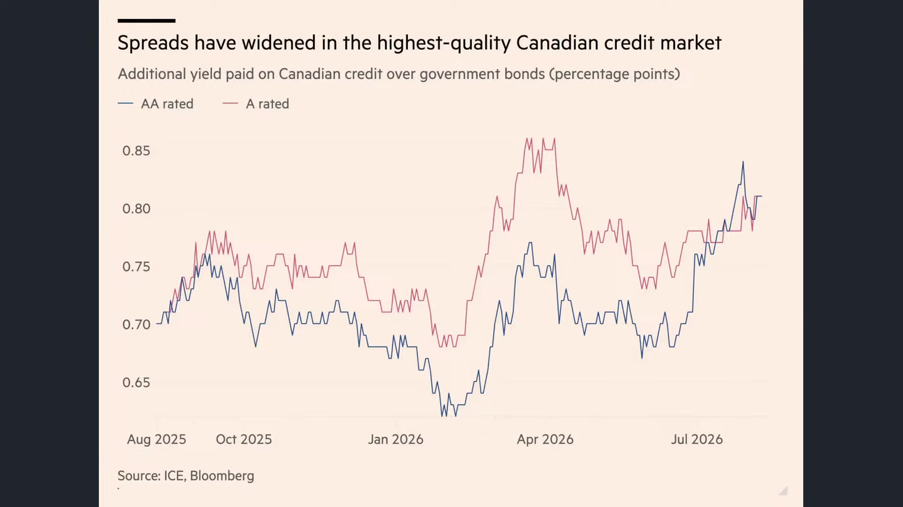

**逐字稿片段：** 美國現在這些科技巨頭已經不滿足於美元債市了 開始大量的跑到加拿大 瑞士英國等市場來借錢 Google今年在加拿大 發行了85億加幣的債券 一度創下當地時尚最大規模 亞馬遜過兩週 也跑到加拿大 也發行了140億加幣的投資整齊債 那兩家公司最近 也開始跑到瑞士法郎來發債 那阿發貝目前也在英國 在上禮拜也發了100年期的英鎊債 100年期 美國政府買100年期都不一定有人買 他還會發行100年期 那問題是這些市場都遠小於美國 巨頭一進場就好像大象 走進整個小房間 然後把所有市場的錢 把英國的錢洗劫一空 加拿大的錢洗劫一空 所以這很神奇 加拿大最高品質的 AAA級公司債的利差 近期甚至一度高於 信用評級較低的A級債券 那說明科技巨頭搶錢搶風了 隨便給你開資利率 反正就先給我錢再說 所以這就是集中度風險 就是大量的資金 和投資等級債的供給 全面集中在這些科技巨頭身上 那等同於全球正式進入一場 高強度的資本市場軍備競賽 直接把國債市場也給拉下海了 那好在現在貝森特 自己買自己的國債 那你們如果堅持要買投資等級債 那國債我就自己發行 然後再自己買回來吧 看起來是這樣子

**話題推測：** 科技巨頭向加拿大、瑞士、英國市場借款的示意圖

---

## 00:17:00

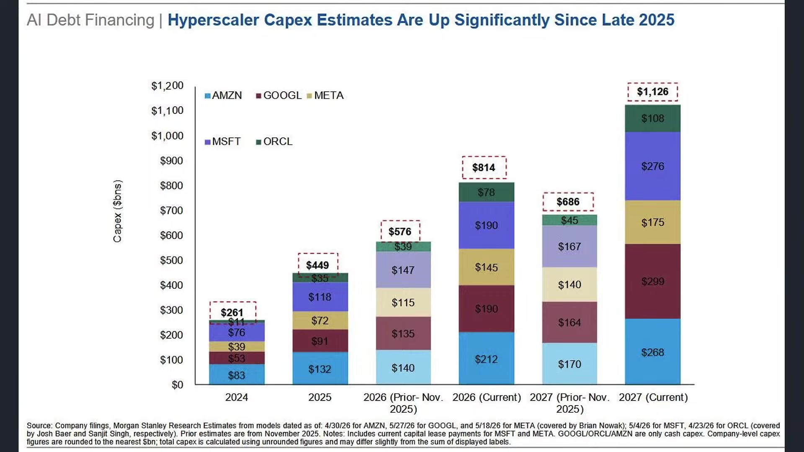

**逐字稿片段：** 當然另外一方面 用量越來越大 也代表著我們一定會讓AI生活進步 會不會產生更多的浪費 這就是市場上最大擔憂 也許AI投資最後能夠成 那這些投資最後就能夠創造更多的生產力 那現在市場上之所以擔心是什麼 一方面是擔心排擠到國債的買盤 造成債券市場的壓力 那第二點擔心的是內生性的擔心 就是你今天那麼多錢 那如果很多人去使用AI 沒有造成生產力提升 因為很多人使用AI是浪費了

**話題推測：** AI投資是否會產生浪費而非生產力提升的討論

---

## 00:17:30

**逐字稿片段：** 我舉一個比較直觀的 就跟影印機一樣 影印機是什麼樣 以前的影印文件是一件大事 那個機器很貴 速度又很慢 所以大家印之前就會想 這是需要印嗎 但是影音機後來越來越便宜了 越來越快之後 辦公室就不會因此變得更繩子 反而出現那種順便一份 每個人都印一份 先印出來再說 就一件事情編輯成本經濟零 用AI越來越方便之後 通常人類不是更有效率的使用AI 是把使用量開爆 亂生成圖 做一些有的沒的AI影片 對於這個世界毫無幫助 產值毫無提升 你也不是要給別人看 你就是做好玩的 最後就一直消耗電力 一直消耗算力 一直消耗GPU 一次生成幾篇小說文章 幾毛錢而已 當寫程式 做圖片 拍影片 分析資料 都便宜到不行的時候 辦公室用值就越來越多了 那最後被拖垮的是什麼 大家擔心 有一部分人一直都擔心 如果你也沒有造成 實質生產力提升 只是每天大家都一直生產 吉普利圖片 那不就是一種效率浪費嗎 那不是一種泡沫嗎 這就是市場上的擔憂 第三層 那最後的擔憂是什麼 當然就是 你發這麼高的債 你要怎麼還得起這麼高的利息呢 你不能 如果現在低利率時代 零利率 那隨便發嘛 這完全可以理解 利率這麼高 你還借這麼多錢 事實上我們看 美國聯邦政府的淨利息支出 佔GDP比值 其實也在快速的升高

**話題推測：** 影印機普及與使用量浪費的啟示圖

---

## 00:18:55

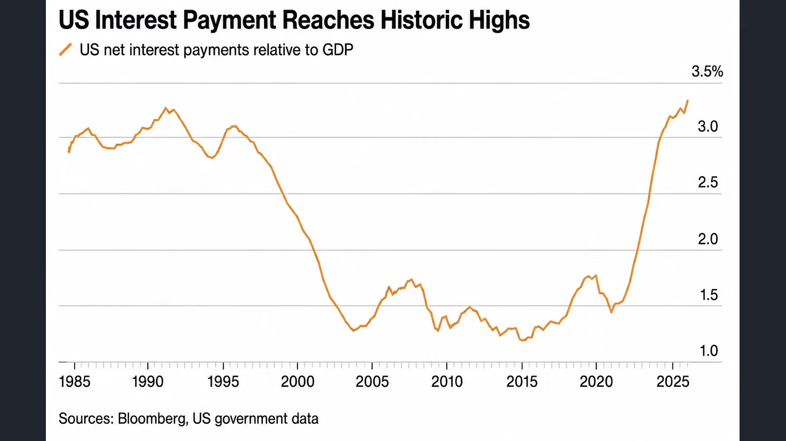

**逐字稿片段：** 從2020年前後 大概是1.4% 一路提升到3.2% 那翻了一整倍 畢竟歷史新高 那原因當然不只是 美國的國債越滾越大 是過去幾年高利率 讓到期的債券 它必須用更高的成本發行 以前都是發行1%2%的利率 國債 還以前就很輕鬆 可是我沒錢 那我就必須要發薪再還就債 可是以前發債成本就1%到2% 現在要4%到5% 那過10年我不是壓力更大了嗎 所以你就觀察到 淨利息佔GDP比例的速度越來越高 當利息支出增加比經濟成長還要來得快的時候 壓力就很大了 一方面是美國的國債的利息支出 已經超越一整年的國防支出 這是一個很大的壓力 代表國防社福基建減稅上的錢 它就會被擠壓掉 那就變成你每年賺了這麼多錢 你發現都拿去繳利息了 也不是說美國明天就還不起錢 但債務越高 殖利率又越高 你又在利率保持這麼高的水準 又大量的去發債 未來就必須要靠更高的稅收 更高的赤字 然後通膨或者金融壓抑 來嘗試的做消化 所以換句話說 市場上最後一層對賭是什麼 就是不只是美國國債 發行成本很高 你以後要還我們很多錢 以後投資等級在科技巨頭也是 那你真的可以賺得了 這麼多錢給我們嗎 殖利率7% 8% 越來越高 再降的一個效果 所以這個時候市場上壓力就很大 變成了償還問題

**話題推測：** 美國淨利息支出佔GDP比值從1.4%升至3.2%的圖

---

## 00:20:25

**逐字稿片段：** 跟那個酒店小姐有點像 酒店小姐就這樣 好賭的爸 生病的媽 上學的弟弟 和破碎的他 以前電影常演 那女主角下午去進修部上課 晚上去做酒店小姐 半夜還要照顧自己的弟弟 凌晨又去加油站 早上還去送外賣 中午還去超商打工 辛苦賺到的錢 只能還爸爸的債 好不容易辛苦賺了一整個月 只夠付利息 連本金都不夠還 人生絕望你知道嗎 所以現在大家擔心就是 如果AI沒有那種史詩級的爆發 你發這麼高的利息 經濟成長 到時候每年大家賺的錢 只能夠拿來付利息 難道不是一種市場的泡沫嗎 這就是市場的擔憂 的確有其道理 講起來好感傷 待會去救助一下嗜血少女好了 好感傷 但不管怎麼說 某種程度而言 等同於有幾個方向可以解決 第一降低利率 把利率融資成本大幅的壓低 就解決這個問題了 但是前提是什麼 吾爾戰士 美伊衝突要解決 衝突的僵固性不能夠存在 這也是川普目前改裁經濟戰的原因 另外一方面 當然很簡單生產力的爆發 直接讓科技巨頭告訴你 以後你的錢每年翻倍翻倍的賺 以後每年通膨都10% 那有什麼害怕的呢 反正我的資產每年都翻倍 這另外一種角度 所以這其實某種程度就意味著 金融壓抑會成為未來幾年市場的主流 什麼叫做金融壓抑 叫Financial Repression 就是政府透過壓低利率 維持較高的通膨率 讓實質利率長期恢復 以降低龐大的債券負擔 那當然現在問題就是 像實質利率為正 我們舉例來說

**話題推測：** 酒店小姐比喻債務償還壓力的示意圖

---

## 00:22:13

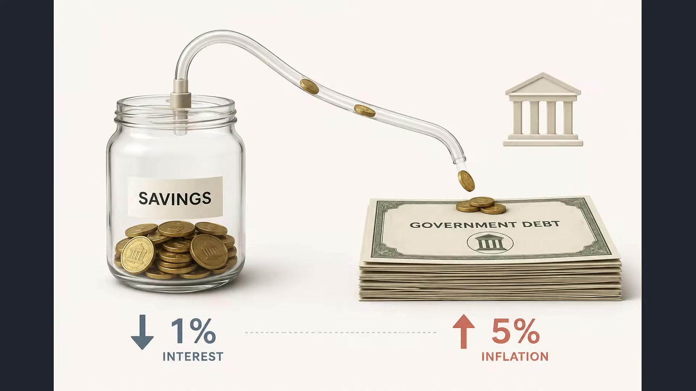

**逐字稿片段：** 如果現在通膨是9% 那利率是4% 那等同於每年 大概就有5%的購買力 應該講說 你有5%的購買力被消失了 因為你存錢 你只能拿到4塊錢 但是通膨已經9塊了 所以等於每年 大概有5%左右的購買力 從存款人和債券持有人當中 移到政府手上了

**話題推測：** 通膨9%、利率4%造成購買力消失5%的示意圖

---

## 00:22:34

**逐字稿片段：** 那INF就指出 說以前最常使用的 金融壓抑的做法 就是包括限制資本流動 要求銀行或者退休金 持有政府公債 我賣你很多公債 大家每個人退休金都有公債 退休金都持有 主權債都持有 這樣子以後通膨 只要高於我的殖利率 問題就解決了 但現在通膨 要明顯的高於長天級公債 也有難度 所以現在問題就來自於 美國未來要採取金融壓抑 他就要很多種政策引導 來流向公債市場 要求大家每個人都買 然後過了兩年發現 我買的產品完全跑不贏通膨 這是最理想的一個做法 那債務問題就稍微解決了 要解決債務問題 其實唯一方式 我看過去100年200年的歷史 只有一種方式 高通膨 債務很大 我現在欠大家2000萬 那感覺是很大一筆數目 過50年以後 2000萬可能跟現在200萬差不多 因為貨幣會貶值 就跟以前 那800萬買一套房已經算貴了 現在800萬 兩房都不一定買得起 所以用這樣的一個效果 通膨讓購買力沖銷 那苦的是中產 但是是解決這場金融問題 最好的這種淡化的方式 OK 這也給投資朋友做一些思考 那我們看美國股市 四大指數表現來做一些追蹤 道瓊指數上漲119.0.22% 收在53,463點 標普上漲16.0.21% 收在7,707點 納指上漲41.0.16% 收在26,331點 倍半則是下跌254.2.12% 是在11738點 那當然我們知道三大指數目前還在高位震盪 那晶片股其實也開始做橫盤整理了 現在市場上更為關注的是 錢到底有多稀缺 其實巨頭們目前看起來還是蠻有信心的 因為AI的確正在推高企業的籌資需求

**話題推測：** IMF對金融壓抑做法的建議圖

---

## 00:24:28

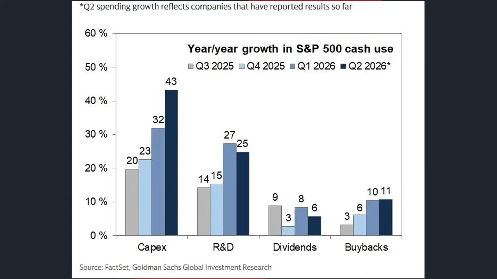

**逐字稿片段：** 可是今年第二季 美國透過IPO增資或者科展債或者SPV 合計募資的金額2520億 它的確比去年同期高了不少 可是問題在於 他們的回購力量 其實也沒有想象中來得低 如果我們細節觀察 現在很多投資人 反而在二季度到三季度 尤其現在財報季過後 解禁期之後 整體回購金額反而看起來更大了 這就說明著 即便他已經投那麼多錢到AI了 他們還是願意繼續回購 然後來技巧性的抬升市場股價 比如說以SK海力士為例 SK海力士最近是宣佈 40兆韓元290億美元的 庫藏股的實施計劃 從8月20號到11月19號 會回購最多2400萬股 並且註銷 這規模堪稱罕見 應該是史上最大 這也說明著 公司反正現在不管這麼多 你不要覺得我好像擴敞 自由現金流就很虛 我自由現金流比科技巨頭好得多 賺了這麼多錢 直接股票回購 直接技巧性的來回饋股東 把你的股價應試給抬高 所以這一波回購 他就不只是在護盤 他也是在安撫韓國散戶 我猜李在明政府搞不好有參與其中 說服SK海力士立即進行回購 不要讓股價再跌了 這一波你說韓國股市 還是今年表現最為亮麗的市場 你覺得韓國散戶韓國股民 會特別感謝李在明嗎 這就是問題了

**話題推測：** 今年第二季美國企業募資總額2520億美元的圖表

---

## 00:25:56

**逐字稿片段：** 他的總體績效年初到現在 仍然是全球表現最亮麗的 漲幅又接近五成 可是洗過一輪以後 波動性會害李在明的民調受損 這是非常明顯的跡象 所以大家開始出招了 臺廠的部分 這一波槓桿沒有上得特別大 而且重點是獲利也在暴升 臺汽在今年的獲利率 要成長到五成 去年年底預估 今年也不過成長18% 現在已經接近到五成了 速度越來越快 所以必須承認 現在這種市況 我們其實只看到 還是來自於利率的沉壓 對於股票市場估值所產生的壓力 便宜的股票現在定義也在改變

**話題推測：** 韓國股市年初至今近五成漲幅的績效圖

---

## 00:26:38

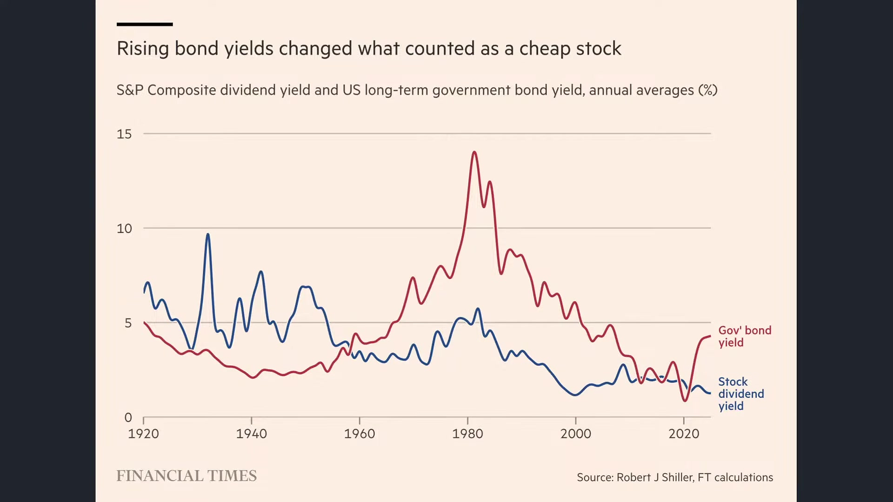

**逐字稿片段：** 你像美國的股息殖利率 已經來到4%到7%了 甚至高於政府公債的殖利率 那投資人買股票除了資本利得 本身就能夠拿到相對具有吸引力的現金收益 那現在情況又稍微相反了 美股股息殖利率剩下1%了 但是美國長期公債殖利率都已經拉昇到5%到6%了 兩者差距已經來到數十年的罕見水準 這代表的是 就現在市場上 已經有一段時間 願意持有高估值的股票 那市場壓住的絕對不是股息 都是企業的高速獲利成長 那麼如果殖利率高到一定程度以後 你就會把那些想要股息的人 重新吸引回來 兩邊就在持續性的進行角力 當然不代表說 你要股息還是要更多的資本利得

**話題推測：** 美國股息殖利率與政府公債殖利率比較圖

---

## 00:27:22

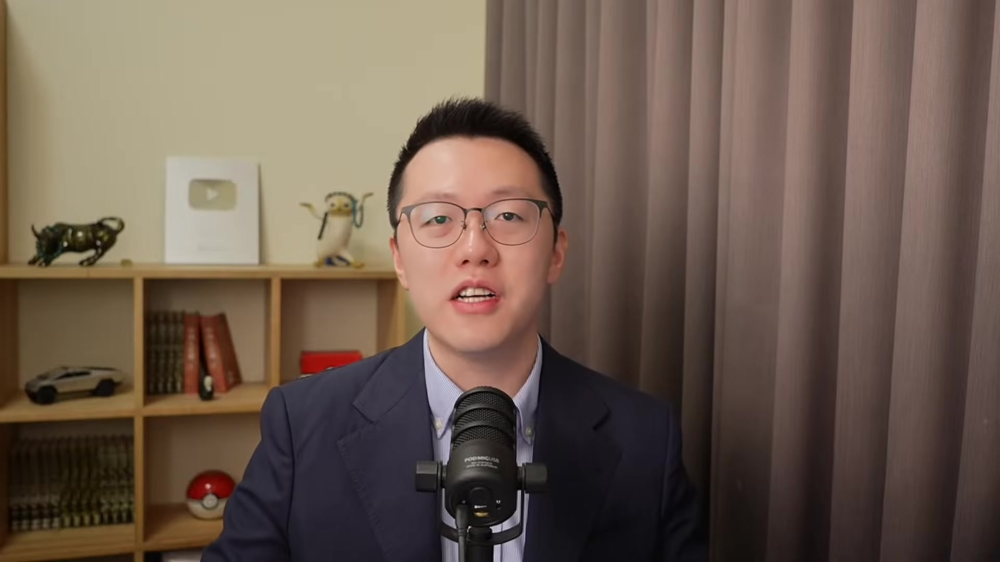

**逐字稿片段：** 我們還是要了解自己的初衷 就是說如果你是價值投資 重點從來都不是 股價有沒有回到你的成本 而是公司的基本面 是否符合原先的預期 從營收到獲利 到自由現金流 互成合 管理資本的配置有沒有變差 你要了解你當時的 一直講成中 不是不是不是 是初中 你要了解自己的初中 你是看價值投資 那你就只關注基本面 你不要管股價 到位了就買 做股息投資 重點就是配息能否穩定成長 配發率是否健康 你不能說 比如說殖利率突然變高或者變低 就大幅影響到 不能說股價漲貨鐵就大幅影響到你的投資 股息投資那就是它的配息吸不吸引你 它的殖利率吸不吸引你 你做緊急循環投資 重要的就是供需循環 價格 資本指數的高低 你做科技投資 你當然就是這項技術 你認為它有沒有改變原本當時的方向 它的市佔率或成合是否有持續的領先 每一種策略都有自己的判斷詞 最危險的就是你表面上都說長期投資 現在利率預期稍微一動 你就說那我稍微先避開 不是這樣子玩的 一定要了解自己原本的初心 前兩天我才看了一個談話節目 那裡面的主持人 問那個男生一個問題 不許撒謊 講說你要如實回答 如果有一天 你曾經最愛的那個女人 女孩子嫁給了別人 可是婚後過得並不好 然後又離婚了 然後帶著一身傷痕回來找你 那你心裡還會愛她嗎

**話題推測：** 投資人釐清投資初衷（價值、股息、景氣循環、科技投資）的建議圖

---
