# yutinghaofinance_O0JBTLUGnQ0 — 關鍵畫面索引

- 來源逐字稿：[yutinghaofinance_O0JBTLUGnQ0_GT.srt](yutinghaofinance_O0JBTLUGnQ0_GT.srt)
- 影片：https://www.youtube.com/watch?v=O0JBTLUGnQ0
- 截圖數：25

## 00:01:23

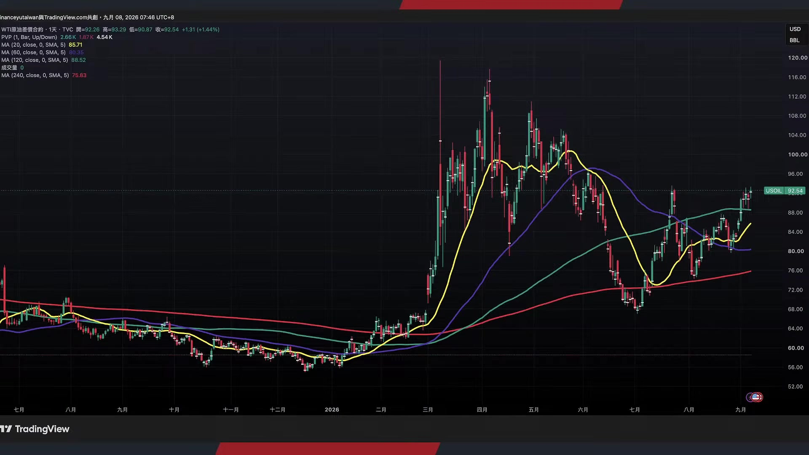

**逐字稿片段：** 亞幣的升值和國際油價的變化 因為布蘭特原油價格 雖然這一波美伊衝突的 擴大情勢也沒有多嚴重但是呢 布倫特原油已經逼近到每桶98美元 那當然是美伊雙方的 持續攻擊所造成的 不過呢即便如此 目前價格也還沒有完全 突破當時7月底8月初的高點 所以我們後續再來做第一波觀察 因為它對於石油價格的通膨粘著度 會形成第一道分歧 那當然即便突破要不要 能夠順勢挑戰4月5月當時 100 110美元的高點也有一段時間 所以我們在做進一步觀察 可是如果能源價格的大漲的確 形成了今年全球資產在普遍上漲當中 大眾資產排行第一名的表現 好如果是以今年來看

**話題推測：** 亞幣升值與國際油價變化

---

## 00:02:11

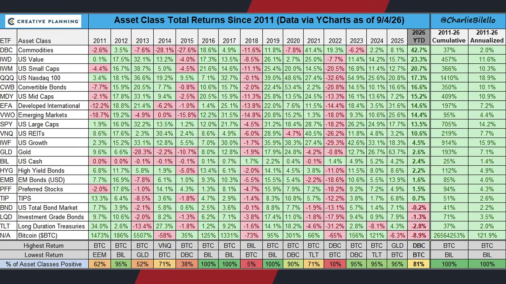

**逐字稿片段：** 原物料排行大概是漲幅有42.7% 好這個是排行第一名 美國價值股的部分 整體上漲有23.3% 小型股20% 納斯達克指數100也不過漲17 美國的大型股13.5 其他像是可轉債中型股 成熟市場新市場股票 大概漲幅14%左右 那相對之下 美國成長股僅僅只有上漲4.5% 而這代表著很多我們講 中小型股是下半年才開始發威 黃金價格是去年暴漲了63% 今年勉強又回到正報酬了 來到2.6% 那漲多了休息一下也ok 債券市場是比較明顯疲軟的 美國綜合債券 投資等級債 看長天期國債 大概是下跌0.2% 1.3% 2.8% 好這是利率承壓的部分 比特幣雖然現在還是跌最慘的8.9% 可是相對於今年跌了35% 比較起來 它也算是反彈蠻多的 所以整個26年的投資主軸哦 在美伊衝突的環境底下 仍然是資源跑贏了金融 價值跑贏了成長 股票還是跑贏了債券 好過去幾年最熱門的黃金 科技成長股 還有比特幣 今年並不是報酬的領頭羊 那當然回過頭說今 今年至少81%的資產還是正報酬嘛 雖然不及16年17年19年 和24年當時全面上漲 那有些年份上漲幅度是100% 95%以上 但是呢 今年其實下跌資產也不是特別多了 就是賺多賺少的問題而已 你說不對 我怎麼看很多人都在賠 那買在五六月份嘛 好所以 折股折指數 那是一個角度 但是擇時 你買在什麼樣的一個點位 那本身也會大幅影響到今年績效 那當然市場上在短期內最大焦點呢 主要是亞幣 因為亞幣在過去兩周 出現了非常顯著的反彈 當然不是全面多頭的 大多頭或大拉升 主要還是由日元和韓元來做領漲 然後再慢慢的外溢到新臺幣 新幣泰銖等貨幣 你像韓元6月底到8月上旬 已經升值9%嘍 日元從7月底開始急漲 9月7日當時更是升到1美元來到154 日元呢哦 這說明好現在日元也 開始做顯著拉盤了 相對之下 新臺幣還是屬於比較跟漲的 好但至少我們也創下 3個月以來的高點了 背後大概有幾個力量來做主導了 我覺得源頭 如果要從短期內來看 很明顯是日本和韓國政府的匯市干預 日本是先前跌破163日元 逼近到40年低點嘛 所以美日當時就發表了聯合聲明呢 直接買進日元拋歐元 那韓國央行也出手去支撐韓元 那原本市場大量做空的亞幣 被迫呢碰到了空單回補 那放大了升值速度哦 再就是市場的利率預期還是很高 因為我們都知道日本央行這一次 極有可能把利率再度提高到1.25% 使得美日利差持續縮小 那聯準會雖然有可能升息哦不過 聯準會升息的機率是比日本 升息幾率還要來的低的哦 哦這樣就形成了一種日本 資金回流國內的效果

**話題推測：** 今年原物料資產漲幅排行

---

## 00:05:22

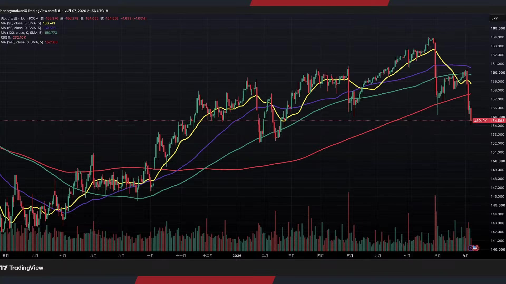

**逐字稿片段：** 再就是日幣的外溢效果 因為日幣一直都是亞幣 的重要定價和融資貨幣 那市場當日元升值的時候 同樣也會買進被低估的韓元 新幣或者泰銖 甚至是台幣 所以形成連環性的上漲 那最後就是外資最近在針對亞洲 股市也做了比較顯著的回補 美國利率偏高 當然現在升息幾率也是高 不過呢至少在短期內 我們知道政府 尤其是日本央行所採取的做法 和市出的氛圍 帶領著亞洲重新的定價 當然另外一方面

**話題推測：** 日幣外溢效果影響其他亞幣

---

## 00:05:54

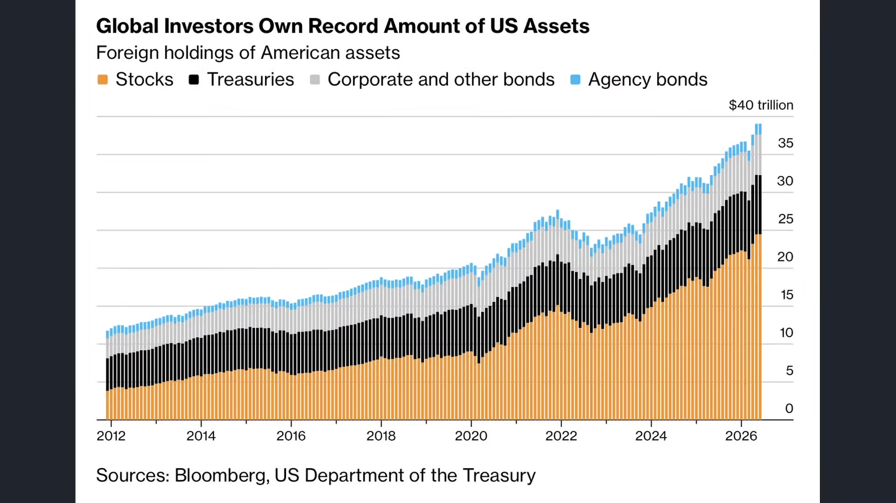

**逐字稿片段：** 美元的走扁情緒其實也慢慢在推升哦 雖然聯準會是有可能升息的 可是我們過去跟投資朋友提到 現在全球像是日本 加拿大臺灣澳洲丹麥 芬蘭等六個市場的大型 退休基金和保險機構 在整個二季度末的外幣資產 平均避險比例只有41% 這個是過去十年來的最低 這些市場合計大概有 4.6兆美元的外幣資產 其中有一大部分是 配置在美國股票和債券 那我們過去提過 因為投資人現在不避險了 就是因為美元在市場 動盪時通常會升值 那避險成本又很高 那你乾脆就不避了嘛 但現在兩個條件都在改變嘛 應該不講成本了 從比例了 歐元投資人的部分是降到1.23%了 也就是說 如果這六個市場的避險比率哦 現在有可能會有比較 顯著的美元的賣出交易 形成美元的 適度賣壓 那這當然不代表外資真的會把 美債或者美股真的全面賣掉 投資人還是可以繼續持有美國資產嘛 因為你不想要錯失行情可是呢 你可以透過遠期外匯來提高避險比例 因此可能會出現美國資產需求還在 但是美元會持續受到承壓的情況 而日本就特別值得觀察 那包括我們過去所提到的 如果你想要保住當前的美債 但是你又知道貝森特的 回購並沒有產生多大效益 那最後反映的就是美元的走扁嘛 好那加上 剛才提到日本央行的繼續升息 美元的快速走弱 都會讓大家意識到 聯準會的升息步調是跟不上 其他新興市場央行的升息步調 美元匯率是蹺蹺板 好就算你也升值 你升的比我慢 你也得貶 它就形成另外一層 亞幣走升的需求

**話題推測：** 美元走貶情緒推升

---

## 00:07:51

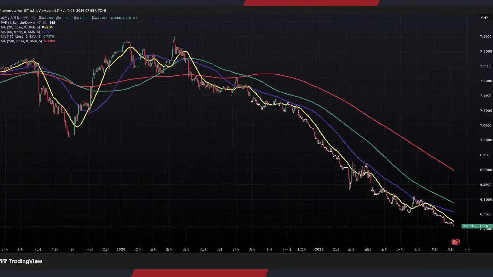

**逐字稿片段：** 我們舉例來說 你像人民幣 人民幣這幾年是真的升得很誇張 一美元已經兌到6.72人民幣 8月下旬一路碰到6.71 這是3年半來的新高 過去20個月累計升值幅度都是9% 那背後有幾股力量 第一個就是中國的貿易順差 它也突破一兆美元了 跟臺灣一樣 大量的鑽進美元外匯 持續性的外匯供給 那第二就美元的整體走弱 好這一次我們看到中國的財新 製造業PMI八月份也來到51.5 也替人民幣提供了基本面的支撐呢 好所以就代表著 人行當然是不希望人民幣升太快 這種升法感覺都有點問題了 但是呢至少可以看到官方在最近呢 也針對中間價做了一些匯市干預哦 反而人行是很明顯想要主升的 因為人民幣目前在第二季的 國際收支的外匯儲備資產是增加了

**話題推測：** 人民幣匯率走勢

---

## 00:08:43

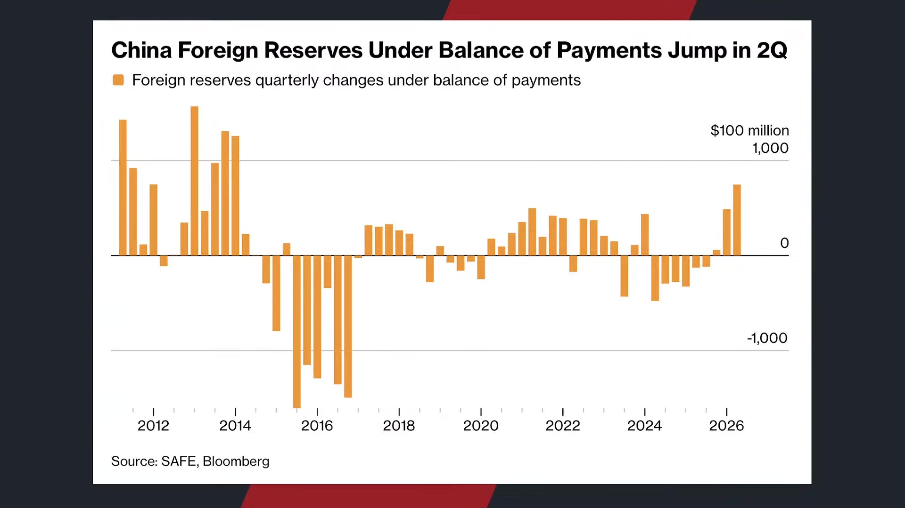

**逐字稿片段：** 747億好 這也反映出的確 大量的美元正在流入到人民幣當中 想要把美元換為人民幣 這代表著外匯收入的創高 使得人民幣快速的做拉升 那這也說明一個重要的訊號 就是我們正常的理解都是 人行在寬鬆誒 人行寬鬆人民幣就應該要貶值嘛 可是哦另外兩大層面 一個就是超大的貿易順差 中國企業其實這兩年 賺非常非常多錢的哦 他可能就有其他管道賺回來 可他終究貿易順差 還是創下歷史新高了 加上企業的結匯 對人民幣偏好升值 那第二就是過去的確人行跟 美國央行聯準會 似乎有一定的協調 而過去幾個季度 央行的確一直在買美元 壓低中間價壓低 想要嘗試的做人民幣適度的做拉升 可是呢最近又開始做干預 希望不要升太快好 所以現在就不同的力量正在相互交錯 好但的確中國越寬鬆 人民幣越強 大家會有點 反直覺 可是往前退一步 就是人行現在已經 慢慢開始在踩刹車了 因為升值幅度已經比其他 貨幣升值速度快太多了 所以呢寬鬆政策就慢慢出來了 好就是既然我還在升值 那寬鬆政策出來的 速度就可以越來越快 舉例來說 昨天中國 政府正式宣佈 準備向大型銀行和

**話題推測：** 人民幣外匯儲備資產增加

---

## 00:10:04

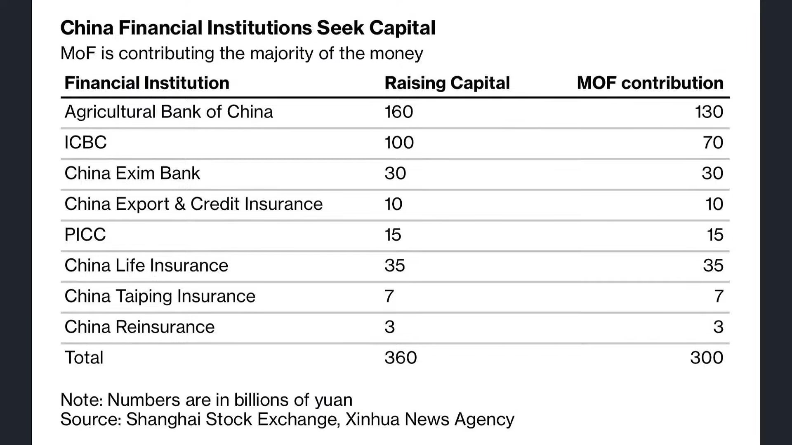

**逐字稿片段：** 保險公司注資3,000億人民幣 又寬鬆了 不過它不是直接性的發錢 它是由財政部在發行特別國債 替工商銀行替農業銀行替人保集團來 補充資本 那這一波操作從25年 就已經慢慢開始了 不過這一次資金量算蠻大的 累計大概是5,000億 人民幣的政府增資 那一方面當然是政府 知道現在經濟還是很放緩嘛 房地產的壓力 地方政府的債務壓力還是很大嘛 先把金融機構的資本能夠墊後 那你有了錢 銀行你再想辦法把錢放貸給企業嘛 那第二 就是適度的擴大這種財政版的寬鬆 來讓人民幣的升值預期能夠適度打消 那這種做法當然就是 一種金融版的財政刺激了 北京並不是真的發錢 它就是把 銀行和保險公司的 資產負債表打造得很漂亮 讓你勇敢地去借錢 當然 那有沒有人想借錢 那才是重點嘛 這是 第二層觀察的重點 人民幣的升值 現在是排行第一的

**話題推測：** 中國政府注資3000億人民幣予大型銀行

---

## 00:11:04

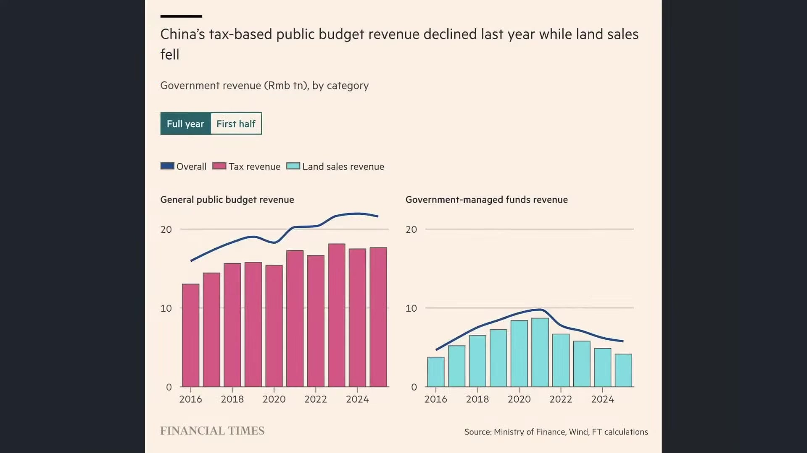

**逐字稿片段：** 再就韓元 韓元大概也是升值升到 了過去兩年的高點了 那外資在最近呢 開始進行韓國股市的回補 反而讓政府稍微緊張 因為昨天盤中韓元一度升值1.3%

**話題推測：** 韓元匯率走勢及外資回補

---

## 00:11:19

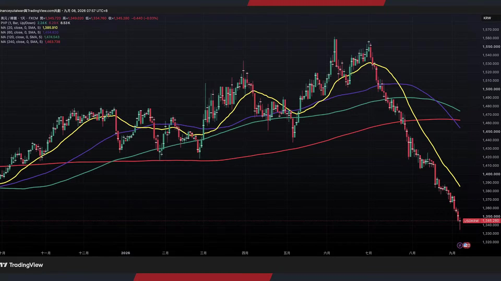

**逐字稿片段：** 1美元兌1,334塊韓元 這是2024年這兩年來的新高 那背後當然是韓國股市的大漲 外資的持續流入 不過韓元漲太快 現在南韓當局也很緊張了 因為過去已經被 當時的杠杆型ETF傷過一輪了 那民調也是受傷的非常重 那市場這幾周已經累積了 大量的韓元的多頭部位 一旦政策訊號反轉 或者當局開始釋出不 希望升值過快的態度 很容易就引發美元的空頭回補 讓韓元短期內出現劇烈震盪 其實升值貶值都可以了 重點是劇烈震盪就會影響到民利 所以韓國政府也是非常緊張了 當然了 這種如果是國內不斷 有超額儲蓄的賺取 外匯收入的創高 適度的升值其實都是可以理解的 那現在韓國政府不願意的就是看到 升值幅度太快 或者貶值幅度太快 最好是穩穩的升為什麼 因為今年五六月份已經被 單一股票杠杆型ETF傷過一輪了 現在SK海力士正二 從高點這樣子暴跌下來

**話題推測：** 韓元盤中升值及匯率數據

---

## 00:12:22

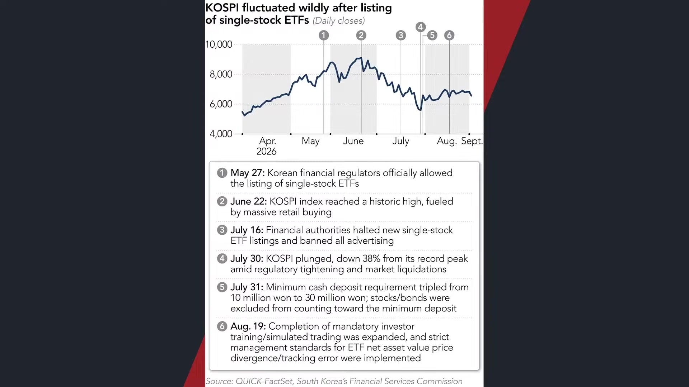

**逐字稿片段：** 也是跌了8成左右 另外一檔三星電子的正二 一度上漲35% 後續跌了65%呢好的 很多SK海力士相關的ETF 都已經回到發行價的1/3 左右的價格而已 所以這波虧損就直接燒到政治層面了 南海銀行現在是非常謹慎的 隨時做穩匯 當然了 如果是看臺幣的部分 台幣其實是比較緩升的 就是相對於這幾大貨幣 昨天才升0點二五% 不過呢也是6月8號以來 三個月以來的新高 盤中最高曾經來到31.5塊 那背後當然也是台股 和外資的同步轉強 昨天外資大買嘛 不過拉到今年來看 台幣今年還算是貶值哦

**話題推測：** SK海力士正二ETF暴跌

---

## 00:13:05

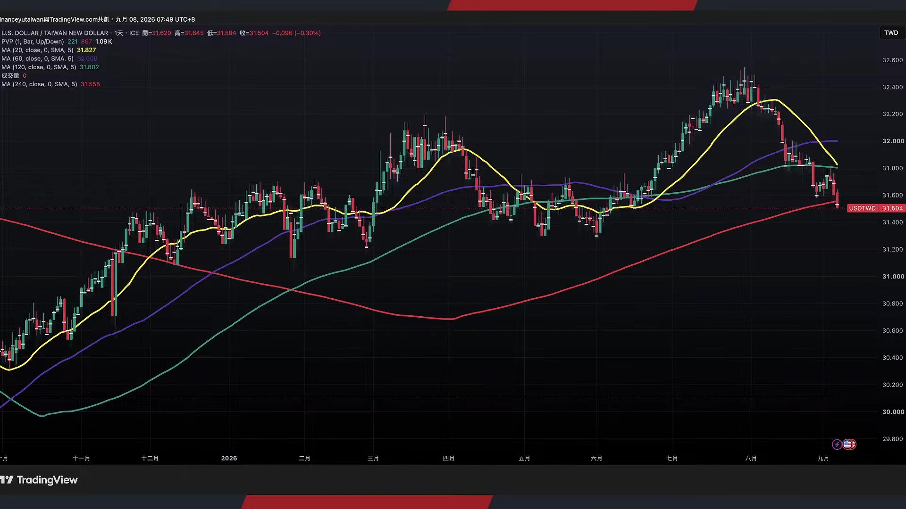

**逐字稿片段：** 貶了0.36哦 韓元今年是升7.56 人民幣升了4.15 新幣升了1.51 日幣也升了0.8% 所以這波升值 其實更像是資金回流 也並不是全年的趨勢反轉 台股市場相對於海外市場 匯市的衝擊沒這麼大 我相信央行應該也盯很緊了 因為去年被傷害過嘛

**話題推測：** 臺幣今年仍貶值0.36%

---

## 00:13:24

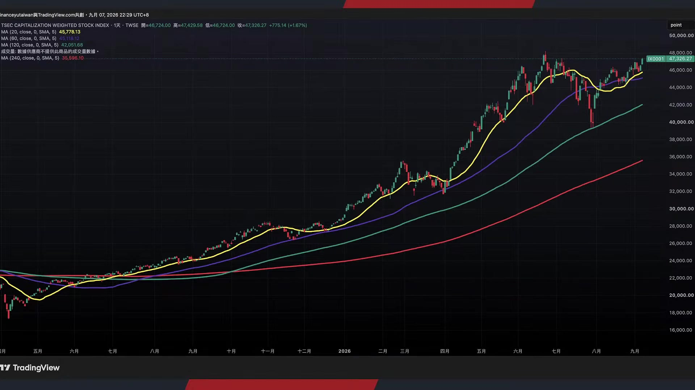

**逐字稿片段：** 好那麼回過頭看臺股 台股昨天上漲775點 來到47,427點 我稍微算了一下 那等同於再漲770點 我們就要創下歷史新高了 歷史新高是48,218點嘛 台積電昨天也上漲2.07塊 2.07% 收在2,460塊 聯電因為8月營收創高 4年新高 直接漲停 來到143塊 好所以其權值股最近又 開始有點沖的感覺了 外資對於台股整體 我們知道今年還是比較偏保守了 但至少3月6月7月當時賣了一輪以後 8月9月至少在回補 昨天我們看到700億的回補那 讓整個9月份總體買超

**話題推測：** 臺股市場表現

---

## 00:14:08

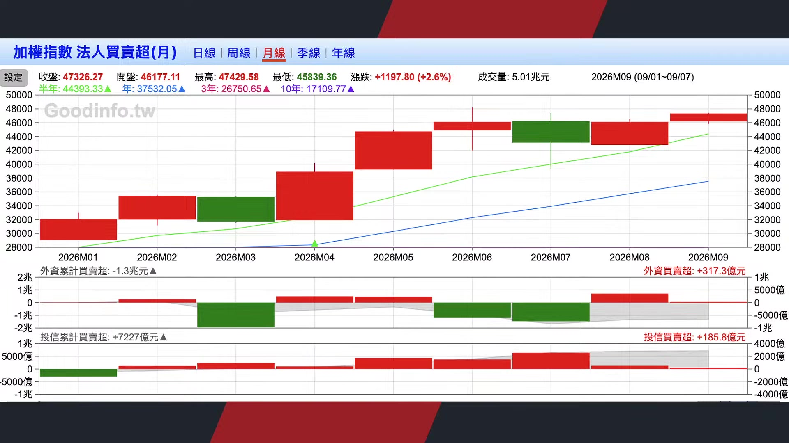

**逐字稿片段：** 大概已經回到317億了 他不要賣台股也會創高了 我們過去跟投資朋友提過了 整個外資的買賣超在 2026年總計還是有賣了1.3兆 哇那我們一點 我們從3萬漲到46,000 47,000 48,000 外資還賣了1.3兆 那外資只要明年還賣1.3兆 那我們就繼續從4萬8不漲到6萬了嘛 他每年這樣子賣 我們也創高 所以重點並不是外資的賣潮 重點是內資現在 外匯流入的速度到底有多快 外資你也不求它完全不賣了 你少賣一點點 台股也一樣會創高了 如果我們是從上方賣壓來看 量價圖就很明顯了

**話題推測：** 外資9月份總體買超達317億

---

## 00:14:47

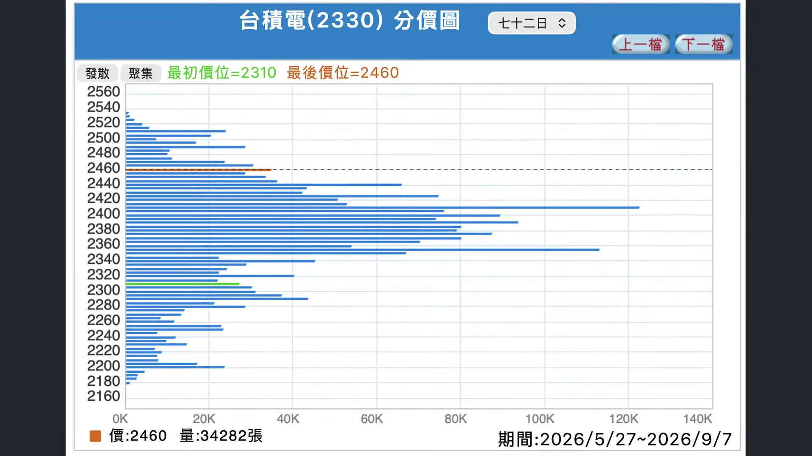

**逐字稿片段：** 台股幾乎現在上方沒有任何賣壓 隨時都有可能突破歷史新高 從過去一個季度的籌碼區來看 以台積電 現在附近成交量最大的 大概是2,340塊到2,440塊嘛 這是過去一個季度 當中的主要的支撐區 那現在價格比這個還高嘛 就說明現在已經占上了 主要的套牢和成本區 沒人沒怎麼能被套牢 那大家都在等 下方反而有很多的成本價來做支撐 聯發科也是如此 聯發科過去一個季度的籌碼 主要集中在3,800塊到4,500塊之間 好那現在呢 整體價位4,700嘛一樣 它已經逃離開了所有的量價區 所以下方全部都是支撐了 而上方幾乎沒有任何的壓力 所以我們才講說 這波權值股有沒有可能重新歸來 因為今年其實權值股的拉升 已經是年初時候的事情了 當時是 高價股先往上拉 然後後來變成記憶體 然後被動元件 然後逐漸越輪越弱 那下半年有沒有可能重新點火 至少我們從基本面來看呢 大家基期都在下滑 這些權值股股價不創高 本益比就下滑了嘛

**話題推測：** 臺股量價圖顯示上方無賣壓

---

## 00:15:53

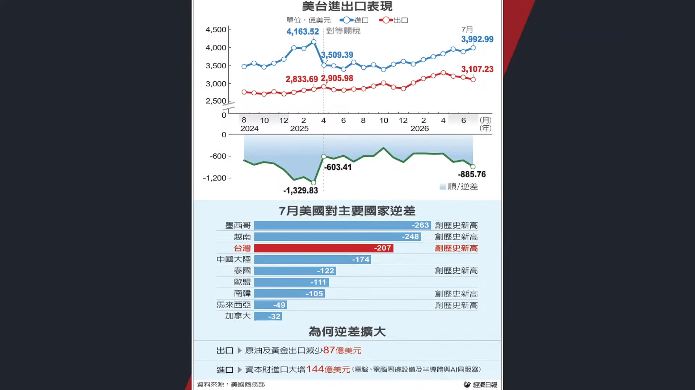

**逐字稿片段：** 從整個美國7月份整體貿易逆差來看 已經擴張到24.4% 886億美元 那其中我們看到美國對 臺灣的商品貿易逆差 1-7月份高達1,278億 好比去年同期暴增了80% 大賺錢了 前面幾名大概就墨西哥越南臺灣 那如果是從1月到7月 臺灣甚至已經排行第三了 僅次於墨西哥和加拿大 當然了這其實就意味著 這麼漂亮的數據 你要知道 現在9月底以前就要公佈232 關稅的具體優惠措施了 那現在真正值得警惕的就是 美國貿易逆差排名前幾名的國家 大概都會逐漸的被綁到

**話題推測：** 美國7月份整體貿易逆差數據

---

## 00:16:37

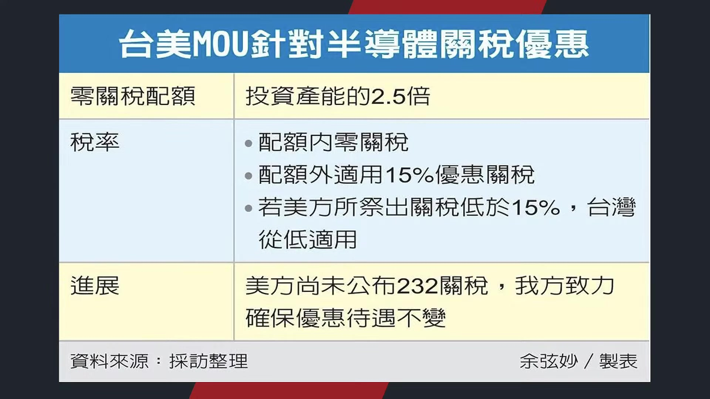

**逐字稿片段：** 川普的中期選舉裡頭 因為現在 11月3號中期選舉越來越近了嘛 川普選前講的是什麼 降低逆差 製造業回流 逼盟友讓步 所以逆差越大 對美國出口越強的國家 那你要在集中選舉之前造勢 你就必須一定要有點衝突 然後讓美國獲利嘛 加拿大已經先打上關稅戰了嘛 臺灣現貿易逆差歷史高點呢南韓 已經被盯上了 越南我覺得遲早被盯上 馬來西亞最近晶片的問題也被盯上了 遲早臺灣也可能要釋出一些談話 重點是選舉 重點是要釋出這種美國獲得利益 讓川普好交代 所以總要有人被綁架通常啦 通常是AI出口越旺的 基本面越好的 逆差越大的那你 最容易被綁架 那你就讓他稍微秀一下自己的籌碼 對不對 人家講說 什麼樣的人最容易被綁架 模範生嘛 為什麼 因為他們都是好綁樣 好榜樣 好沒事 那當然最後所形成的效果就是 正由於夠優秀 才會被川普可能在9月份以前呢 傳出好消息 當然回過頭說 現在等同於 整個AI私伺服器的拉升 逐步的放量以後 這一波的貿易逆差 不會就停在這個月份 我們預估下半年 貿易逆差幅度可能會遠遠加大 過去我們提過 因為你像之前GB200 GB300的AI伺服器哦 現在是完全放量哦 單季出貨量預估從去年是8,000櫃嘛 去年第四季就到1萬櫃了 然後今年是1.5萬櫃

**話題推測：** 川普中期選舉對貿易逆差國家的影響

---

## 00:18:10

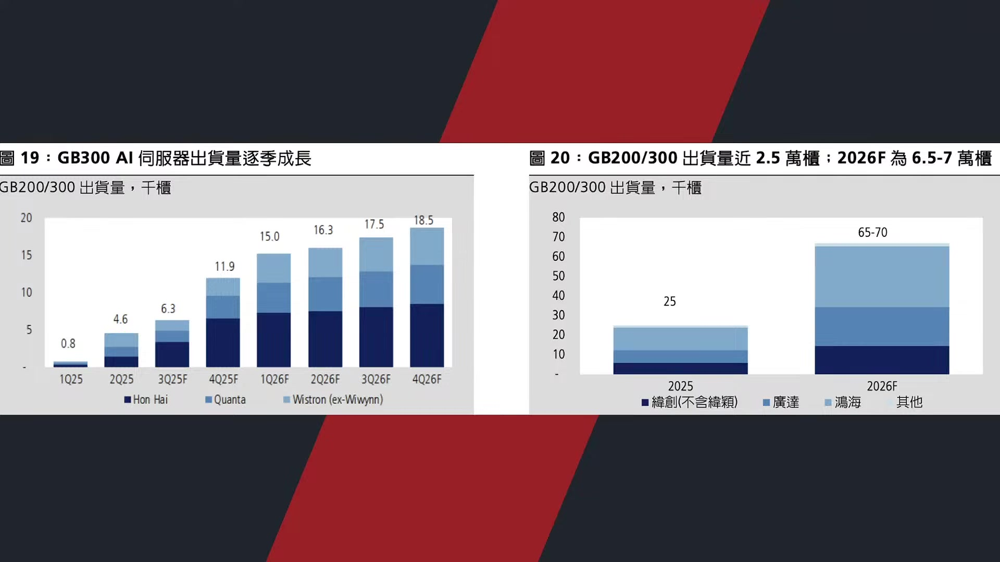

**逐字稿片段：** 年初年底可能會直接挑戰2萬櫃哦 那到整個26年 如果我們是從200加300 這兩台伺服器全部加起來 大概是7萬到8萬櫃 左右的總體出貨量 所以全部都是由臺灣吃下來 AI算力市場 現在我們知道有輝達的GPU嘛 那AMD也有自己的這個 算力然後AWS 然後Google的TPU 很多ASIC平臺現在同時並存了 所以市占率的確有稍微分散 可是你仔細觀察一下你從 各類型的股票 從台達電 橫跨輝達 AMD AWS 到什麼奇宏 台光電川普 誒所有的ASEC供應鏈全部吃下來 搞來搞去 不同的伺服器 不同的ASX 全部最後還是採用台廠 而最後你就發現了 台廠就全部給吃下來了 所以我們才講說這一波臺灣韓國

**話題推測：** AI伺服器出貨量預估挑戰2萬櫃

---

## 00:19:02

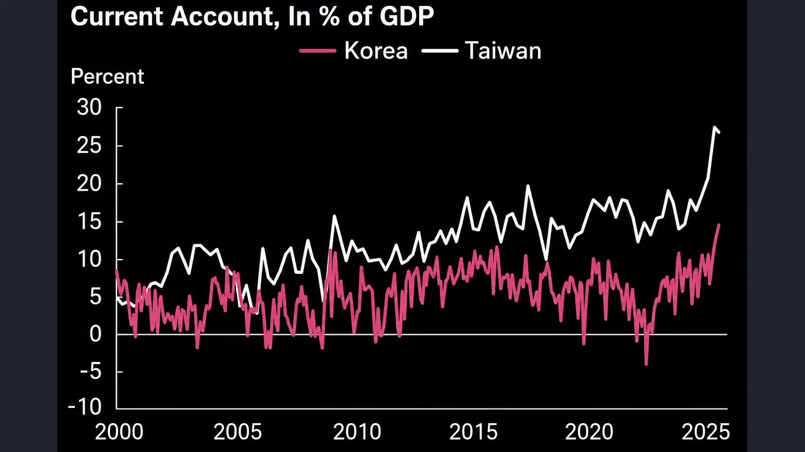

**逐字稿片段：** 正在變成全球AI晶片的杠杆國家 AI熱潮它不單單是帶動整個科技股 是從整個用電量 整體經濟市場資金 全部轉移到其中 我們如果是以經常賬占GDP比值來看 韓國這幾年 即便它產業是比較分散 內需市場也很大 它也從原本的5-10% 直接上揚到15%了 臺灣更誇張 常年大概就10-15%的外貿型經濟體 今年直接衝高到28%了 好所以其實這都 顯示著臺灣經濟已經 跟半導體高度的綁定

**話題推測：** 臺灣韓國成為全球AI晶片槓桿國家

---

## 00:19:36

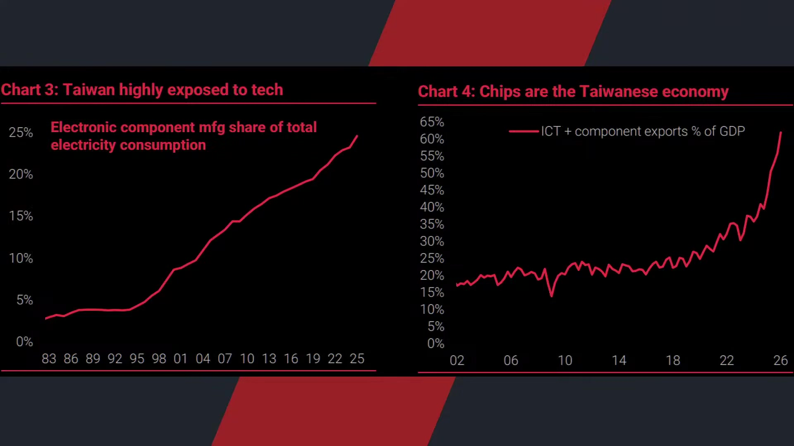

**逐字稿片段：** 我們從左邊圖表來看 電子零元件的製造業 占全臺灣的用電量 1980年才5% 現在是25% 我們預估2030年會超過三成 全台1/4的電力 幾乎都是為了晶片產業而生 右邊是ICT和電子零元件占GDP的比值 已經超過60%了 好所以臺灣所有的經濟成長股市 出口匯率房市全部都跟AI晶片 高度聯動哦 所以現在臺灣韓國的經濟有點類似 AI晶片 它就是在整個國家下面的那張紙嘛 半導體出口 它會撐起整個經濟的成長 那科技股就推高股市 然後外資就流入帶動匯率 那企業擴產又拉動設備投資 那電力需求又持續拉升 所以只要AI景氣繼續向上 那大家就覺得爽嘛 或者說資本財就會 這樣子不斷的湧入 但問題就是來自於 看似所有產業共同成長 我們都已經對賭在這條列車上了 底下墊的都是同一張AI晶片 好臺灣是高度依賴晶圓制程 然後和伺服器嘛 韓國是重壓HBM焊記憶體哦 那當然總有一天雲端巨頭 它可能被迫要削減資本支出 那受到影響的就不 只是這幾隻科技公司 它可能會同時傳導到出口股市匯市 這也是後續會影響的變化 好但至少可以承認的事情是 大家開始放量了 而現在只是剛開始而已 其實大家從這一次

**話題推測：** 電子零元件製造業用電量佔比圖

---

## 00:21:02

**逐字稿片段：** 半導體展就已經看得出來 各大領域哦 每個人都想要嘗試的去貼近AI 而台積電也是帶領著這些企業 陸續向美國做投資 或者呢把它拉入到非紅供應鏈當中 我們從過去幾個季度都看得出來 半導體展當中很多論點 其實都已經逐步在合作 區域來說 最直觀的是半導體後端的設備 它的合作 過去我們講說是以前所未有的速度 擴建先進封裝產能 現在台積電 你不能完全把它當成 一個晶圓代工廠 它其實也是全球最頂尖的封裝廠 科沃斯月產能呢 二三年也不過是1.2萬片

**話題推測：** 半導體展上的新趨勢

---

## 00:21:39

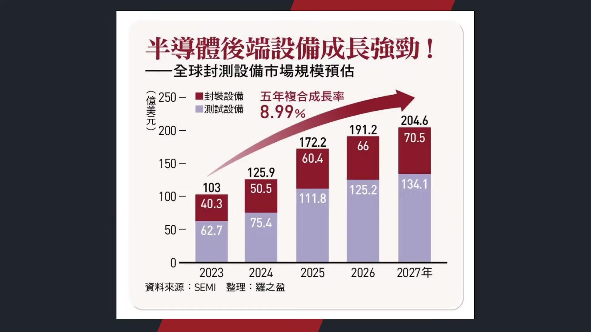

**逐字稿片段：** 到明年我們預估就來到13萬片了 增長會超過接近有10倍左右 再來是AI資料中心高速運算和 光通訊需求的快速成長 帶領著全面性的 我們講說 封測到檢測設備的升級 其中像玻璃基板 或者前陣子比較流的 流行的CPU 然後光纖陣列 玻璃通孔 細通孔 這些都是接下來下一代 高效能運算的重要基礎 因為銅線已經接近物理極限了嘛 光纖又傳輸成為市場主流以後光通訊 光學元件 封測供應鏈都形成了 長線的投資機會 另外一方面 過去台廠 稍微相對於日本比較落後的 屬於特化材料嘛 哦這幾年也是迎來了爆發期 台積電為了要推進 2納米的先進制程 拉了很多台廠進來 不一定全部都給日本人做生意 現在是全力扶持臺灣本土 的特用化學材料和供應商 因為現在先進制程的 架構變得很複雜嘛 每一片晶圓都需要 透過大量的生產步驟 所以你說光阻劑特殊 氣體研磨液清洗劑 它的耗材使用量都翻倍 那以前都是日本大廠全面壟斷 那臺灣化學材料呢 跟我做合作 我們在臺灣又好方便聯絡 還可以講臺語 誒這個時候 行情和訂單就不斷的流入 包括之前的川湖也是 它就是以一個我們講說在 從傳產導入到AI當中 非常值得觀察的重點 誒現在AI伺服器導軌市 占率已經超過80%了 毛利率87% 那真的很難想像 每股盈餘在7月份當時是50塊嘛 股價突破1萬 所以整體轉折 你要知道誒 20年前它幾乎50%以上都是 美國的傢俱客戶 誰會想到靠AI伺服器呢 好這是一系列的爆發 那其他的像是工業電腦的部分 今年股價普遍漲幅算比較漂亮哦 重電業的部分都是如此 好事實上 大家應該上禮拜都有稍微 去看一下那個SEMICOM Taiwan吧 其實裡頭都有大量的技術 有很多我也不太理解 聽著聽著就是哦 好厲害好厲害 具體技術不理解嘛 你看市占你看EPS 都可以看到這種多點爆發的景象 前兩天呢 網友才傳了幾份報告給我 我稍微研讀了一下 我發現真的很厲害 你像台積電 SEMI com臺灣 這一次展就已經把回流

**話題推測：** 台積電CoWoS月產能預估增長

---

## 00:23:59

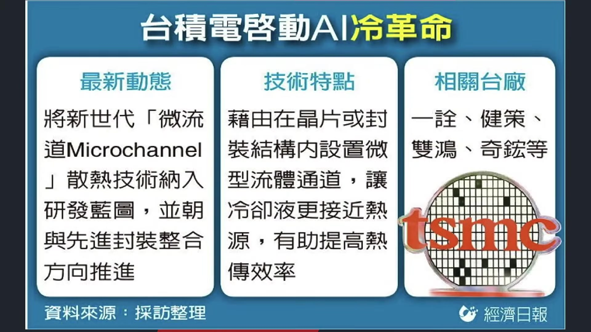

**逐字稿片段：** 到的散熱納入到研發藍圖 因為以前都是冷卻技術 你要整合到先進封裝嘛 反正就是易冷 你要流過伺服器嘛 把熱量給帶走嘛 那現在如何有效的讓 晶片本身直接降溫呢誒 這個我們講說微流道技術 它就逐步的衍生出去 就跟那個健身房一樣 有時候我們吹冷氣那很熱嘛 那拿電風扇吹也是一種嘛 那有些阿北這邊拿 吹風機吹一些敏感部位 特別讓晶片直接降溫避免 機櫃發熱之後再降溫 都是如此 其實他有一系列的一些簡報 而且很多網友 很熱心都在分享給我 像AI算力的部分呢 有甜美笑容 親和力佳 完美代言展 唉這不是這張 先進制程的部分呢 有高雅大方比例絕 不對 像是自主LAB 有白裙搭藍夾 不對 量子電腦 算了 不重要 重點是臺灣這些企業 真正厲害的地方 它不是單純會做 導軌散熱電源PCB伺服器或的先進封裝 是 真正的解決能力是什麼 是我們的package 就是當輝達遇到一個新平臺的設計 產能不足或者技術瓶頸的時候 一通電話就可以把整條供應鏈 集合起來開會 從台積電到鴻海到廣達到川普 到台達電到啟宏到台光電 大家就約個台中吃個火鍋嘛 邊協調規格 拆解問題 迅速找出量產方案 明天早上就打電話給輝達了 輝達買到的不是一個零元件 它是臺灣供應鏈多年 累積的速度彈性和默契哦 所以我們才講說一件事情 它到底值多少錢呢 不單純來自於它的售價 是它能夠取決於它替 誰解決了多大的問題 之前看嘛 那個爺爺奶奶到孫子孫女家過夜哎 孫子孫女也很有成就 也買新家了 後來爺爺就在孫子的藥櫃裡頭 發現了 一瓶藍色小藥丸 問孫子能不能吃一片 那孫子說 爺爺您不應該吃 這個藥勁很大 而且很貴 多少錢 一片要100塊 那才100 爺爺點頭說 我還是想試試 那明天早上我們離開之前 我會把錢放在枕頭底下 那第二天早上 孫子就在枕頭下發現了1,100塊 馬上打電話給爺爺 哎我跟你說是每片藥是100塊 不是1,100塊 爺爺說我知道 那1,000塊是奶奶給的 所以一件事情值多少錢呢 不只取決於它的價值 而是取決於它替誰解決了 多大的問題 所以一件事情值多少錢 你不要每天就盯著他 這個零元件 這個毛利率多少 也許輝達投資的不是一個零元件 而是在臺灣 實在是太方便了 一組導軌 一塊PCB一套散熱系統 單看材料 那真的很值錢嗎 但是如果它能夠替輝達排除量產瓶頸 而且大家廠商互相做協調 能夠讓AI伺服器順利出貨 價值就完全不一樣了 好臺灣企業 我們一直講說 真正賣的不是硬體 是能夠迅速集合共同解題 最後把不可能變成量產的能力 對哎呀 奶奶好久沒這麼開心了 好孫子 好所以我們才講說 這種單點爆發是為什麼 我們看到在各大民調當中 經濟信心 國人能夠順勢成長的瓶頸 嗯好 最近Anthropic也公佈了

**話題推測：** 台積電將散熱納入研發藍圖

---

## 00:27:28

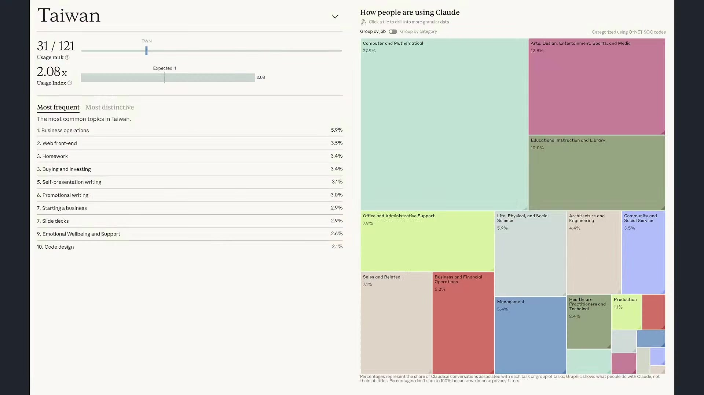

**逐字稿片段：** 臺灣人使用AI的習慣 哦其實數據表現非常不錯 大概是使用Claude是預期的兩倍 全球排行大概第31名左右 那這份報告主要是針對 不同國家職業和工作任務 來觀察他們如何使用AI 臺灣在120個觀察的數據國家當中 大概使用Claude的程度是排名第31名 使用指數是2.08倍 這代表著Claude預估的基本情景一倍 現在是2.08 這代表著程度 比想像中好太多 因為Anthropic在臺灣並沒有設立一個 像韓國一樣設立一個大分點 也沒有特意去做推廣 可是臺灣人使用的比例還是非常高哦 臺灣人最常拿Claude來 處理的商業運營呢 大概是5.9% 這是比較多的 網頁前端3.5% 那理財也有3.4% 自我介紹寫作有3.1%呢 好在全球國家當中 其實使用比例已經算是偏高了 當然了 在某種程度就意味著 這種多點爆發 它很容易的從原本的AI 蔓延到原本的傳產

**話題推測：** Anthropic報告顯示臺灣人AI使用習慣

---

## 00:28:30

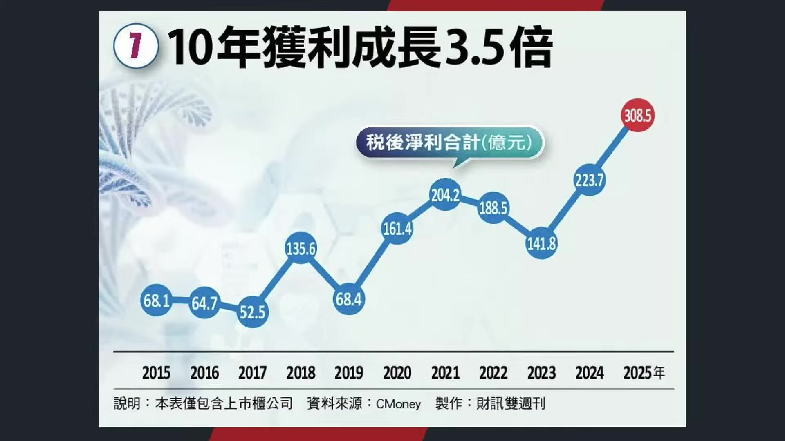

**逐字稿片段：** 甚至是生技 其實我們知道生技產業 最近迎來比較強勁的掛牌熱潮 整體結構也出現了比較根本性的轉變 我們當然知道過去 幾年的生技國家隊 曾經是困難重重了 那現在其實還是困難重重 不過申記公司的整體獲利 大概也成長了3.5倍 在過去十年 好越來越多的美股盈餘EPS突破 10元大關的公司是越來越 明顯了 如今生技板塊也從單一的 領域擴展到新藥的研發 你從16年到現在 其實的確 EPS突破10塊錢的系列 從寶瑞 金碩美時 泰博耀華耀 其實陸續都在出現當中 那今年要掛牌的也很多 從和康永生 和訊 最近大家應該有觀察到 昨天價格波動最大的一檔股票 捷立康 捷立康是每股是200元登陸興櫃嘛 主要是鎖定核心佈局 在的腫瘤術後重建 這個體積補貼 哦體積的填補或者醫美的需求 我昨天股價漲了43% 好當然了 如果是從大股東比例來看 這這股票不一定適合做太詳盡的觀察 因為這個股權是高度集中 可是重點是什麼 哎重點是 因為我昨天看到很多人在討論 好是是在那裡討論 在討論說 因為他是打算有一個叫做liposhell 叫做玻利雅定義隆乳標準呢 就是這是一種嘗試的突破 這叫什麼 這叫隆乳針呢 就跟傳統的那種手術不一樣 它就是打針 就有機會就能夠隆 你想一想 左腿打瘦瘦針 右腿打隆乳針 那不就前凸後翹了嗎 醫美市場又這麼大 好所以你可以看到很多 臺灣產業的多點爆發 而不是推薦單一個股 漲幾倍了好 這因為尤其這兩個個股 那籌碼有點高度集中 不是很適合 有流動性風險 可都可以觀察到哦 這種單點爆發 每天你看呢 你就可以瞭解背後的基本面 獲利的外溢效果 臺灣真的是寶島 那最終結論就是 由於各量大量企業的一個爆發 整個26年的超額儲蓄哦 目前已經來到8.46兆 預估會更高 超額儲蓄率是26.03% 我們講超額儲蓄哦 不是說臺灣人愛存錢 是整個國家 扣掉儲蓄 扣掉國內投資 應該講說整個國家的儲蓄 扣掉國內投資之後 剩下來的資金還有多少 就你能夠投的都已經投了 那你剩下的錢 沒事幹的錢有多少呢有8.46兆 哇這筆錢撥個一兆到房地產市場 一年的預售屋就買光了 好撥到股票市場 那ETF得漲多少倍 你要慶倖這些人還沒有把錢給投下去 這些人如果把超額儲蓄全部花掉 哇那國內的資產價格會暴漲 到什麼樣的一個地步呢 但也說明了臺灣極大的問題 就是超額儲蓄的堰塞湖 逐步形成了 一邊就是半導體AI 出口產業創造的龐大盈餘 那第二呢 就是60歲到75歲左右的嬰兒潮世代 現在正處於一生資產最充裕的階段 企業家庭壽險退休基金 手上都有大量的長期資金那偏偏 臺灣其實 常天琪的投資標的不是很多 你有想過去買過美國公債嗎 不可能吧 那根本不是規模多大的問題那個 一%兩%的殖利率到底有什麼好投的 好所以就變成臺灣很有錢了 現在每個人被迫只好把錢送到海外 然後再花大錢去處理匯率風險了 好我們 遇到常年起 壽險業的壓力也都是來自於匯率變化 原因是什麼 就是因為錢賺的速度實在太快了 目前超額儲蓄率26.03 德國也才5.8 韓國也才5.3 日本才3.8 中國才2.2 說明這些國家賺到的錢 都有能力在本國直接做投資或者深耕 但臺灣呢 錢這麼多 你要是放手直接全部流到股市房市 那也完蛋了 可是呢錢就是這麼多 那該怎麼辦呢 好那很明顯的 那只能適度流到海外 來消減一下壓力 但是匯率風險就會因此而產生了 因為時間因素了 下半部我們就聊不 到了不過呢 至少我們可以很清楚地梳理一下 我們今天是從亞洲貨幣的 升值來看待外資的回補情況 那另外一方面呢 亞幣的升值 它背後其實也隱含著新興市場目前 央行升息的速度已經大於連儲會 說明什麼 部分新興市場的經濟 成長率是比美國還要來得好的 所以我們更敢勇敢的升下去哦 所以下個禮拜的央行理監事會議 從原理來看呢 臺灣央行應該已經有立即 緊急被迫要升息的地步了 從通膨從經濟增長率都已經達標 那如果它不升 好那大概有其他的考量 可能是選情的考量等等 那就到時候再說 那第二個步驟是我們觀察到 臺灣市場到目前為止哦 多點開花已經逐步形成 連製造業營業氣候測驗點呢

**話題推測：** 生技產業迎來掛牌熱潮

---

## 00:33:21

**逐字稿片段：** 都已經陸續進入到黃紅燈 這說明什麼 連去年最為疲憊的傳產 最受到關稅戰衝擊的傳產 都已經開始全面進行轉型 大家PI都在往上升 所有人都在瘋狂備貨 搭上本輪的AI浪潮 那最後呢 我們也看到 形成的問題就是超額儲蓄的持續擴增 現在最大的挑戰就是錢還會進來 而且以非常驚人的速度進來 可是找不到可以投資的地方 為什麼呢 股市如果全部留這8兆 ETF的資金買盤 那也不得了 房地產市場 政府也不樂見 投資到實業 這已經投資滿了嘛 臺灣土地有限嘛 如何處理超額儲蓄的問題 是未來經濟部門最大的挑戰 也給投資朋友做些觀察 台股是小跌182點 收在47,143點 如果喜歡我們節目 記得幫我們訂閱按讚加分享 我們就明天早上8點半 早晨財經速解讀再相見 祝各位投資朋友 看盤順利 操盤愉快

**話題推測：** 製造業營業氣候測驗點進入黃紅燈

---
